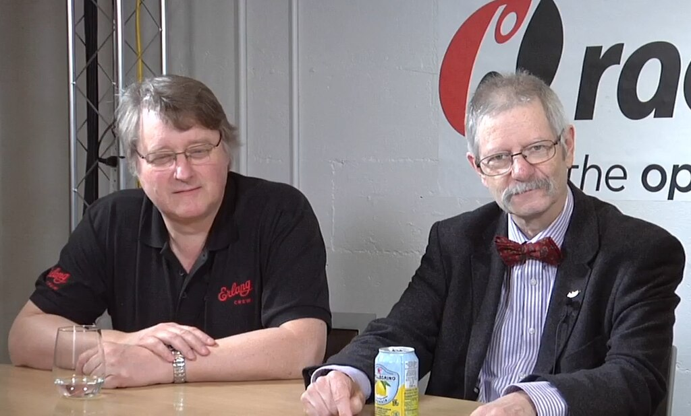

Erlang


[Paradigms](https://en.wikipedia.org/wiki/Programming_paradigm "Programming paradigm")

[Multi-paradigm](https://en.wikipedia.org/wiki/Multi-paradigm_programming_language "Multi-paradigm programming language"): [concurrent](https://en.wikipedia.org/wiki/Concurrent_programming "Concurrent programming"), [functional](https://en.wikipedia.org/wiki/Functional_programming "Functional programming")

[Designed by](https://en.wikipedia.org/wiki/Software_design "Software design")

*   [Joe Armstrong](https://en.wikipedia.org/wiki/Joe_Armstrong_\(programmer\) "Joe Armstrong (programmer)")
*   Robert Virding
*   Mike Williams

[Developer](https://en.wikipedia.org/wiki/Software_developer "Software developer")

[Ericsson](https://en.wikipedia.org/wiki/Ericsson "Ericsson")

First appeared

1986 (1986)

[Stable release](https://en.wikipedia.org/wiki/Software_release_life_cycle "Software release life cycle")

28.5 [](https://www.wikidata.org/wiki/Q334879?uselang=en#P348 "Edit this on Wikidata") / 23 April 2026 (23 April 2026)


[Typing discipline](https://en.wikipedia.org/wiki/Type_system "Type system")

[Dynamic](https://en.wikipedia.org/wiki/Type_system "Type system"), [strong](https://en.wikipedia.org/wiki/Strong_typing "Strong typing")

[License](https://en.wikipedia.org/wiki/Software_license "Software license")

[Apache License 2.0](https://en.wikipedia.org/wiki/Apache_License_2.0 "Apache License 2.0")

[Filename extensions](https://en.wikipedia.org/wiki/Filename_extension "Filename extension")

.erl, .hrl

Website

[www.erlang.org](https://www.erlang.org)

Major [implementations](https://en.wikipedia.org/wiki/Programming_language_implementation "Programming language implementation")

Erlang

Influenced by

[Lisp](/source/lisp-language/ "Lisp (programming language)"), [PLEX](https://en.wikipedia.org/wiki/PLEX_\(programming_language\) "PLEX (programming language)"), [Prolog](https://en.wikipedia.org/wiki/Prolog "Prolog"), [Smalltalk](https://en.wikipedia.org/wiki/Smalltalk "Smalltalk")

Influenced

[Akka](https://en.wikipedia.org/wiki/Akka_\(toolkit\) "Akka (toolkit)"), [Clojure](https://en.wikipedia.org/wiki/Clojure "Clojure"), [Dart](https://en.wikipedia.org/wiki/Dart_\(programming_language\) "Dart (programming language)"), [Elixir](https://en.wikipedia.org/wiki/Elixir_\(programming_language\) "Elixir (programming language)"), [F#](https://en.wikipedia.org/wiki/F_Sharp_\(programming_language\) "F Sharp (programming language)"), [Opa](https://en.wikipedia.org/wiki/Opa_\(programming_language\) "Opa (programming language)"), [Oz](https://en.wikipedia.org/wiki/Oz_\(programming_language\) "Oz (programming language)"), [Reia](https://en.wikipedia.org/wiki/Reia_\(programming_language\) "Reia (programming language)"), [Rust](/source/rust-language/ "Rust (programming language)"), [Scala](https://en.wikipedia.org/wiki/Scala_\(programming_language\) "Scala (programming language)"), [Go](https://en.wikipedia.org/wiki/Go_\(programming_language\) "Go (programming language)")

*   [Erlang Programming](https://en.wikibooks.org/wiki/Erlang%20Programming "wikibooks:Erlang Programming") at Wikibooks

**Erlang** ([/ˈɜːrlæŋ/](https://en.wikipedia.org/wiki/Help:IPA/English "Help:IPA/English") [_UR-lang_](https://en.wikipedia.org/wiki/Help:Pronunciation_respelling_key "Help:Pronunciation respelling key")) is a [general-purpose](https://en.wikipedia.org/wiki/General-purpose_programming_language "General-purpose programming language"), [concurrent](https://en.wikipedia.org/wiki/Concurrent_computing "Concurrent computing"), [functional](https://en.wikipedia.org/wiki/Functional_programming "Functional programming") [high-level](https://en.wikipedia.org/wiki/High-level_programming_language "High-level programming language") [programming language](https://en.wikipedia.org/wiki/Programming_language "Programming language"), and a [garbage-collected](https://en.wikipedia.org/wiki/Garbage_collection_\(computer_science\) "Garbage collection (computer science)") [runtime system](https://en.wikipedia.org/wiki/Runtime_system "Runtime system"). The term Erlang is used interchangeably with Erlang/OTP, or [Open Telecom Platform](https://en.wikipedia.org/wiki/Open_Telecom_Platform "Open Telecom Platform") (OTP), which consists of the Erlang [runtime system](https://en.wikipedia.org/wiki/Runtime_system "Runtime system"), several ready-to-use components (OTP) mainly written in Erlang, and a set of [design principles](https://en.wikipedia.org/wiki/Systems_architecture "Systems architecture") for Erlang programs.

The Erlang [runtime system](https://en.wikipedia.org/wiki/Runtime_system "Runtime system") is designed for systems with these traits:

*   [Distributed](https://en.wikipedia.org/wiki/Distributed_computing "Distributed computing")
*   [Fault-tolerant](https://en.wikipedia.org/wiki/Fault_tolerance "Fault tolerance")
*   [Soft real-time](https://en.wikipedia.org/wiki/Soft_real-time "Soft real-time")
*   [Highly available](https://en.wikipedia.org/wiki/High_availability "High availability"), [non-stop](https://en.wikipedia.org/wiki/Uptime "Uptime") applications
*   [Hot swapping](https://en.wikipedia.org/wiki/Hot_swapping#Software "Hot swapping"), where code can be changed without stopping a system.

The Erlang [programming language](https://en.wikipedia.org/wiki/Programming_language "Programming language") has data, [pattern matching](https://en.wikipedia.org/wiki/Pattern_matching "Pattern matching"), and [functional programming](https://en.wikipedia.org/wiki/Functional_programming "Functional programming"). The sequential subset of the Erlang language supports [eager evaluation](https://en.wikipedia.org/wiki/Eager_evaluation "Eager evaluation"), [single assignment](https://en.wikipedia.org/wiki/Single_assignment "Single assignment"), and [dynamic typing](https://en.wikipedia.org/wiki/Dynamic_typing "Dynamic typing").

A normal Erlang application is built out of hundreds of small Erlang processes.

It was originally [proprietary software](https://en.wikipedia.org/wiki/Proprietary_software "Proprietary software") within [Ericsson](https://en.wikipedia.org/wiki/Ericsson "Ericsson"), developed by [Joe Armstrong](https://en.wikipedia.org/wiki/Joe_Armstrong_\(programmer\) "Joe Armstrong (programmer)"), Robert Virding, and Mike Williams in 1986, but was released as [free and open-source software](https://en.wikipedia.org/wiki/Free_and_open-source_software "Free and open-source software") in 1998. Erlang/OTP is supported and maintained by the Open Telecom Platform (OTP) product unit at [Ericsson](https://en.wikipedia.org/wiki/Ericsson "Ericsson").

## History

The name _Erlang_, attributed to Bjarne Däcker, has been presumed by those working on the telephony switches (for whom the language was designed) to be a reference to Danish mathematician and engineer [Agner Krarup Erlang](https://en.wikipedia.org/wiki/Agner_Krarup_Erlang "Agner Krarup Erlang") and a [syllabic abbreviation](https://en.wikipedia.org/wiki/Abbreviation#Syllabic_abbreviation "Abbreviation") of "Ericsson Language". Erlang was designed with the aim of improving the development of telephony applications. The initial version of Erlang was implemented in [Prolog](https://en.wikipedia.org/wiki/Prolog "Prolog") and was influenced by the programming language [PLEX](https://en.wikipedia.org/wiki/PLEX_\(programming_language\) "PLEX (programming language)") used in earlier Ericsson exchanges. By 1988 Erlang had proven that it was suitable for prototyping telephone exchanges, but the Prolog interpreter was far too slow. One group within Ericsson estimated that it would need to be 40 times faster to be suitable for production use. In 1992, work began on the [BEAM](https://en.wikipedia.org/wiki/BEAM_\(Erlang_virtual_machine\) "BEAM (Erlang virtual machine)") [virtual machine](https://en.wikipedia.org/wiki/Virtual_machine "Virtual machine") (VM), which compiles Erlang to C using a mix of natively compiled code and [threaded code](https://en.wikipedia.org/wiki/Threaded_code "Threaded code") to strike a balance between performance and disk space. According to co-inventor Joe Armstrong, the language went from laboratory product to real applications following the collapse of the next-generation [AXE telephone exchange](https://en.wikipedia.org/wiki/AXE_telephone_exchange "AXE telephone exchange") named [_AXE-N_](https://sv.wikipedia.org/wiki/AXE-N "sv:AXE-N") in 1995. As a result, Erlang was chosen for the next [Asynchronous Transfer Mode](https://en.wikipedia.org/wiki/Asynchronous_Transfer_Mode "Asynchronous Transfer Mode") (ATM) exchange _AXD_.

Robert Virding and Joe Armstrong, 2013

In February 1998, Ericsson Radio Systems banned the in-house use of Erlang for new products, citing a preference for non-proprietary languages. The ban caused Armstrong and others to make plans to leave Ericsson. In March 1998 Ericsson announced the AXD301 switch, containing over a million lines of Erlang and reported to achieve a [high availability](https://en.wikipedia.org/wiki/High_availability "High availability") of [nine "9"s](https://en.wikipedia.org/wiki/Nines_\(engineering\) "Nines (engineering)"). In December 1998, the implementation of Erlang was open-sourced and most of the Erlang team resigned to form a new company, Bluetail AB. Ericsson eventually relaxed the ban and re-hired Armstrong in 2004.

In 2006, native [symmetric multiprocessing](https://en.wikipedia.org/wiki/Symmetric_multiprocessing "Symmetric multiprocessing") support was added to the runtime system and VM.

### Processes

Erlang applications are built of very lightweight Erlang processes in the Erlang runtime system. The Erlang runtime system provides strict [process isolation](https://en.wikipedia.org/wiki/Process_isolation "Process isolation") between Erlang processes (this includes data and garbage collection, separated individually by each Erlang process) and transparent communication between processes (see [Location transparency](https://en.wikipedia.org/wiki/Location_transparency "Location transparency")) on different Erlang nodes (on different hosts).

Joe Armstrong, co-inventor of Erlang, summarized the principles of processes in his PhD thesis:

*   Everything is a process.
*   Processes are strongly isolated.
*   Process creation and destruction is a lightweight operation.
*   Message passing is the only way for processes to interact.
*   Processes have unique names.
*   If you know the name of a process you can send it a message.
*   Processes share no resources.
*   Error handling is non-local.
*   Processes do what they are supposed to do or fail.

Joe Armstrong remarked in an interview with Rackspace in 2013: "If [Java](https://en.wikipedia.org/wiki/Java_\(programming_language\) "Java (programming language)") is '[write once, run anywhere](https://en.wikipedia.org/wiki/Write_once,_run_anywhere "Write once, run anywhere")', then Erlang is 'write once, run forever'."

### Usage

In 2014, [Ericsson](https://en.wikipedia.org/wiki/Ericsson "Ericsson") reported Erlang was being used in its support nodes, and in [GPRS](https://en.wikipedia.org/wiki/GPRS "GPRS"), [3G](https://en.wikipedia.org/wiki/3G "3G") and [LTE](https://en.wikipedia.org/wiki/LTE_\(telecommunication\) "LTE (telecommunication)") mobile networks worldwide and also by [Nortel](https://en.wikipedia.org/wiki/Nortel "Nortel") and [Deutsche Telekom](https://en.wikipedia.org/wiki/Deutsche_Telekom "Deutsche Telekom").

Erlang is used in [RabbitMQ](https://en.wikipedia.org/wiki/RabbitMQ "RabbitMQ"). As [Tim Bray](https://en.wikipedia.org/wiki/Tim_Bray "Tim Bray"), director of Web Technologies at [Sun Microsystems](https://en.wikipedia.org/wiki/Sun_Microsystems "Sun Microsystems"), expressed in his keynote at [O'Reilly Open Source Convention](https://en.wikipedia.org/wiki/O'Reilly_Open_Source_Convention "O'Reilly Open Source Convention") (OSCON) in July 2008:

> If somebody came to me and wanted to pay me a lot of money to build a large scale message handling system that really had to be up all the time, could never afford to go down for years at a time, I would unhesitatingly choose Erlang to build it in.

Erlang is the programming language used to code [WhatsApp](https://en.wikipedia.org/wiki/WhatsApp "WhatsApp").

It is also the language of choice for [Ejabberd](https://en.wikipedia.org/wiki/Ejabberd "Ejabberd") – an [XMPP](https://en.wikipedia.org/wiki/XMPP "XMPP") messaging server.

[Elixir](https://en.wikipedia.org/wiki/Elixir_\(programming_language\) "Elixir (programming language)") is a programming language that compiles into BEAM byte code (via Erlang Abstract Format).

Since being released as open source, Erlang has been spreading beyond telecoms, establishing itself in other vertical markets such as FinTech, gaming, healthcare, automotive, [Internet of Things](https://en.wikipedia.org/wiki/Internet_of_things "Internet of things") and blockchain. Apart from WhatsApp, there are other companies listed as Erlang's success stories, including [Vocalink](https://en.wikipedia.org/wiki/Vocalink "Vocalink") (a MasterCard company), [Goldman Sachs](https://en.wikipedia.org/wiki/Goldman_Sachs "Goldman Sachs"), [Nintendo](https://en.wikipedia.org/wiki/Nintendo "Nintendo"), AdRoll, [Grindr](https://en.wikipedia.org/wiki/Grindr "Grindr"), [BT Mobile](https://en.wikipedia.org/wiki/BT_Mobile "BT Mobile"), [Samsung](https://en.wikipedia.org/wiki/Samsung "Samsung"), [OpenX](https://en.wikipedia.org/wiki/OpenX_\(company\) "OpenX (company)"), and [SITA](https://en.wikipedia.org/wiki/SITA_\(business_services_company\) "SITA (business services company)").

## Functional programming examples

### Factorial

A [factorial](https://en.wikipedia.org/wiki/Factorial "Factorial") algorithm implemented in Erlang:

```erlang
-module(fact). % This is the file 'fact.erl', the module and the filename must match
-export([fac/1]). % This exports the function 'fac' of arity 1 (1 parameter, no type, no name)

fac(0) -> 1; % If 0, then return 1, otherwise (note the semicolon ; meaning 'else')
fac(N) when N > 0, is_integer(N) -> N * fac(N-1).
% Recursively determine, then return the result
% (note the period . meaning 'endif' or 'function end')
%% This function will crash if anything other than a nonnegative integer is given.
%% It illustrates the "Let it crash" philosophy of Erlang.
```

### Fibonacci sequence

A tail recursive algorithm that produces the [Fibonacci sequence](https://en.wikipedia.org/wiki/Fibonacci_sequence "Fibonacci sequence"):

```erlang
%% The module declaration must match the file name "series.erl"
-module(series).

%% The export statement contains a list of all those functions that form
%% the module's public API.  In this case, this module exposes a single
%% function called fib that takes 1 argument (I.E. has an arity of 1)
%% The general syntax for -export is a list containing the name and
%% arity of each public function
-export([fib/1]).

%% ---------------------------------------------------------------------
%% Public API
%% ---------------------------------------------------------------------

%% Handle cases in which fib/1 receives specific values
%% The order in which these function signatures are declared is a vital
%% part of this module's functionality

%% If fib/1 receives a negative number, then return the atom err_neg_val
%% Normally, such defensive coding is discouraged due to Erlang's 'Let
%% it Crash' philosophy, but here the result would be an infinite loop.
fib(N) when N < 0 -> err_neg_val;

%% If fib/1 is passed precisely the integer 0, then return 0
fib(0) -> 0;

%% For all other values, call the private function fib_int/3 to perform
%% the calculation
fib(N) -> fib_int(N-1, 0, 1).

%% ---------------------------------------------------------------------
%% Private API
%% ---------------------------------------------------------------------

%% If fib_int/3 receives 0 as its first argument, then we're done, so
%% return the value in argument B. The second argument is denoted _ to
%% disregard its value.
fib_int(0, _, B) -> B;

%% For all other argument combinations, recursively call fib_int/3
%% where each call does the following:
%%  - decrement counter N
%%  - pass the third argument as the new second argument
%%  - pass the sum of the second and third arguments as the new
%%    third argument
fib_int(N, A, B) -> fib_int(N-1, B, A+B).
```

Omitting the comments gives a much shorter program.

```erlang
-module(series).
-export([fib/1]).

fib(N) when N < 0 -> err_neg_val;
fib(0) -> 0;
fib(N) -> fib_int(N-1, 0, 1).

fib_int(0, _, B) -> B;
fib_int(N, A, B) -> fib_int(N-1, B, A+B).
```

### Quicksort

[Quicksort](https://en.wikipedia.org/wiki/Quicksort "Quicksort") in Erlang, using [list comprehension](https://en.wikipedia.org/wiki/List_comprehension "List comprehension"):

```erlang
%% qsort:qsort(List)
%% Sort a list of items
-module(qsort).     % This is the file 'qsort.erl'
-export([qsort/1]). % A function 'qsort' with 1 parameter is exported (no type, no name)

qsort([]) -> []; % If the list [] is empty, return an empty list (nothing to sort)
qsort([Pivot|Rest]) ->
    % Compose recursively a list with 'Front' for all elements that should be before 'Pivot'
    % then 'Pivot' then 'Back' for all elements that should be after 'Pivot'
    qsort([Front || Front <- Rest, Front < Pivot]) ++
    [Pivot] ++
    qsort([Back || Back <- Rest, Back >= Pivot]).
```

The above example recursively invokes the function `qsort` until nothing remains to be sorted. The expression `[Front || Front <- Rest, Front < Pivot]` is a [list comprehension](https://en.wikipedia.org/wiki/List_comprehension "List comprehension"), meaning "Construct a list of elements `Front` such that `Front` is a member of `Rest`, and `Front` is less than `Pivot`." `++` is the list concatenation operator.

A comparison function can be used for more complicated structures for the sake of readability.

The following code would sort lists according to length:

```erlang
% This is file 'listsort.erl' (the compiler is made this way)
-module(listsort).
% Export 'by_length' with 1 parameter (don't care about the type and name)
-export([by_length/1]).

by_length(Lists) -> % Use 'qsort/2' and provides an anonymous function as a parameter
   qsort(Lists, fun(A,B) -> length(A) < length(B) end).

qsort([], _)-> []; % If list is empty, return an empty list (ignore the second parameter)
qsort([Pivot|Rest], Smaller) ->
    % Partition list with 'Smaller' elements in front of 'Pivot' and not-'Smaller' elements
    % after 'Pivot' and sort the sublists.
    qsort([X || X <- Rest, Smaller(X,Pivot)], Smaller)
    ++ [Pivot] ++
    qsort([Y || Y <- Rest, not(Smaller(Y, Pivot))], Smaller).
```

A `Pivot` is taken from the first parameter given to `qsort()` and the rest of `Lists` is named `Rest`. Note that the expression

```erlang
[X || X <- Rest, Smaller(X,Pivot)]
```

is no different in form from

```erlang
[Front || Front <- Rest, Front < Pivot]
```

(in the previous example) except for the use of a comparison function in the last part, saying "Construct a list of elements `X` such that `X` is a member of `Rest`, and `Smaller` is true", with `Smaller` being defined earlier as

```erlang
fun(A,B) -> length(A) < length(B) end
```

The [anonymous function](https://en.wikipedia.org/wiki/Anonymous_function "Anonymous function") is named `Smaller` in the parameter list of the second definition of `qsort` so that it can be referenced by that name within that function. It is not named in the first definition of `qsort`, which deals with the base case of an empty list and thus has no need of this function, let alone a name for it.

## Data types

Erlang has eight primitive [data types](https://en.wikipedia.org/wiki/Data_type "Data type"):

IntegersIntegers are written as sequences of decimal digits, for example, 12, 12375 and -23427 are integers. Integer arithmetic is exact and only limited by available memory on the machine. (This is called [arbitrary-precision arithmetic](https://en.wikipedia.org/wiki/Arbitrary-precision_arithmetic "Arbitrary-precision arithmetic").) AtomsAtoms are used within a program to denote distinguished values. They are written as strings of consecutive alphanumeric characters, the first character being lowercase. Atoms can contain any character if they are enclosed within single quotes and an escape convention exists which allows any character to be used within an atom. Atoms are never garbage collected and should be used with caution, especially if using dynamic atom generation. FloatsFloating point numbers use the [IEEE 754 64-bit representation](https://en.wikipedia.org/wiki/Binary64 "Binary64"). ReferencesReferences are globally unique symbols whose only property is that they can be compared for equality. They are created by evaluating the Erlang primitive `make_ref()`. BinariesA binary is a sequence of bytes. Binaries provide a space-efficient way of storing binary data. Erlang primitives exist for composing and decomposing binaries and for efficient input/output of binaries. PidsPid is short for _process identifier_ – a Pid is created by the Erlang primitive `spawn(...)` Pids are references to Erlang processes. PortsPorts are used to communicate with the external world. Ports are created with the built-in function `open_port`. Messages can be sent to and received from ports, but these messages must obey the so-called "port protocol." FunsFuns are function [closures](https://en.wikipedia.org/wiki/Closure_\(computer_programming\) "Closure (computer programming)"). Funs are created by expressions of the form: `fun(...) -> ... end`.

And three compound data types:

TuplesTuples are containers for a fixed number of Erlang data types. The syntax `{D1,D2,...,Dn}` denotes a tuple whose arguments are `D1, D2, ... Dn.` The arguments can be primitive data types or compound data types. Any element of a tuple can be accessed in constant time. ListsLists are containers for a variable number of Erlang data types. The syntax `[Dh|Dt]` denotes a list whose first element is `Dh`, and whose remaining elements are the list `Dt`. The syntax `[]` denotes an empty list. The syntax `[D1,D2,..,Dn]` is short for `[D1|[D2|..|[Dn|[]]]]`. The first element of a list can be accessed in constant time. The first element of a list is called the _head_ of the list. The remainder of a list when its head has been removed is called the _tail_ of the list. MapsMaps contain a variable number of key-value associations. The syntax is`#{Key1=>Value1,...,KeyN=>ValueN}`.

Two forms of [syntactic sugar](https://en.wikipedia.org/wiki/Syntactic_sugar "Syntactic sugar") are provided:

\*\*Strings\*\* : Strings are written as doubly quoted lists of characters. This is syntactic sugar for a list of the integer Unicode code points for the characters in the string. Thus, for example, the string "cat" is shorthand for \[99,97,116\]. \*\*Records\*\* : Records provide a convenient way for associating a tag with each of the elements in a tuple. This allows one to refer to an element of a tuple by name and not by position. A pre-compiler takes the record definition and replaces it with the appropriate tuple reference.

## "Let it crash" coding style

Erlang is designed with a mechanism that makes it easy for external processes to monitor for crashes (or hardware failures), rather than an in-process mechanism like [exception handling](https://en.wikipedia.org/wiki/Exception_handling "Exception handling") used in many other programming languages. Crashes are reported like other messages, which is the only way processes can communicate with each other, and subprocesses can be spawned cheaply (see [below](/source/erlang-language/#Concurrency_and_distribution_orientation)). The "let it crash" philosophy prefers that a process be completely restarted rather than trying to recover from a serious failure. Though it still requires handling of errors, this philosophy results in less code devoted to [defensive programming](https://en.wikipedia.org/wiki/Defensive_programming "Defensive programming") where error-handling code is highly contextual and specific.

### Supervisor trees

A typical Erlang application is written in the form of a supervisor tree. This architecture is based on a hierarchy of processes in which the top level process is known as a "supervisor". The supervisor then spawns multiple child processes that act either as workers or more, lower level supervisors. Such hierarchies can exist to arbitrary depths and have proven to provide a highly scalable and fault-tolerant environment within which application functionality can be implemented.

Within a supervisor tree, all supervisor processes are responsible for managing the lifecycle of their child processes, and this includes handling situations in which those child processes crash. Any process can become a supervisor by first spawning a child process, then calling `erlang:monitor/2` on that process. If the monitored process then crashes, the supervisor will receive a message containing a tuple whose first member is the atom `'DOWN'`. The supervisor is responsible firstly for listening for such messages and for taking the appropriate action to correct the error condition.

## Concurrency and distribution orientation

Erlang's main strength is support for [concurrency](https://en.wikipedia.org/wiki/Concurrency_\(computer_science\) "Concurrency (computer science)"). It has a small but powerful set of primitives to create processes and communicate among them. Erlang is conceptually similar to the language [occam](https://en.wikipedia.org/wiki/Occam_\(programming_language\) "Occam (programming language)"), though it recasts the ideas of [communicating sequential processes](https://en.wikipedia.org/wiki/Communicating_sequential_processes "Communicating sequential processes") (CSP) in a functional framework and uses asynchronous message passing. Processes are the primary means to structure an Erlang application. They are neither [operating system](https://en.wikipedia.org/wiki/Operating_system "Operating system") [processes](https://en.wikipedia.org/wiki/Process_\(computing\) "Process (computing)") nor [threads](https://en.wikipedia.org/wiki/Thread_\(computing\) "Thread (computing)"), but [lightweight processes](https://en.wikipedia.org/wiki/Light-weight_process "Light-weight process") that are scheduled by BEAM. Like operating system processes (but unlike operating system threads), they share no state with each other. The estimated minimal overhead for each is 300 [words](https://en.wikipedia.org/wiki/Word_\(computer_architecture\) "Word (computer architecture)"). Thus, many processes can be created without degrading performance. In 2005, a benchmark with 20 million processes was successfully performed with 64-bit Erlang on a machine with 16 GB [random-access memory](https://en.wikipedia.org/wiki/Random-access_memory "Random-access memory") (RAM; total 800 bytes/process). Erlang has supported [symmetric multiprocessing](https://en.wikipedia.org/wiki/Symmetric_multiprocessing "Symmetric multiprocessing") since release R11B of May 2006.

While [threads](https://en.wikipedia.org/wiki/Thread_\(computing\) "Thread (computing)") need external library support in most languages, Erlang provides language-level features to create and manage processes with the goal of simplifying concurrent programming. Though all concurrency is explicit in Erlang, processes communicate using [message passing](https://en.wikipedia.org/wiki/Message_passing "Message passing") instead of shared variables, which removes the need for explicit [locks](https://en.wikipedia.org/wiki/Lock_\(computer_science\) "Lock (computer science)") (a locking scheme is still used internally by the VM).

[Inter-process communication](https://en.wikipedia.org/wiki/Inter-process_communication "Inter-process communication") works via a [shared-nothing](https://en.wikipedia.org/wiki/Shared-nothing_architecture "Shared-nothing architecture") [asynchronous](https://en.wikipedia.org/wiki/Asynchronous_method_dispatch "Asynchronous method dispatch") [message passing](https://en.wikipedia.org/wiki/Message_passing "Message passing") system: every process has a "mailbox", a [queue](https://en.wikipedia.org/wiki/Queue_\(data_structure\) "Queue (data structure)") of messages that have been sent by other processes and not yet consumed. A process uses the `receive` primitive to retrieve messages that match desired patterns. A message-handling routine tests messages in turn against each pattern, until one of them matches. When the message is consumed and removed from the mailbox the process resumes execution. A message may comprise any Erlang structure, including primitives (integers, floats, characters, atoms), tuples, lists, and functions.

The code example below shows the built-in support for distributed processes:

```erlang
 % Create a process and invoke the function web:start_server(Port, MaxConnections)
 ServerProcess = spawn(web, start_server, [Port, MaxConnections]),

 % Create a remote process and invoke the function
 % web:start_server(Port, MaxConnections) on machine RemoteNode
 RemoteProcess = spawn(RemoteNode, web, start_server, [Port, MaxConnections]),

 % Send a message to ServerProcess (asynchronously). The message consists of a tuple
 % with the atom "pause" and the number "10".
 ServerProcess ! {pause, 10},

 % Receive messages sent to this process
 receive
         a_message -> do_something;
         {data, DataContent} -> handle(DataContent);
         {hello, Text} -> io:format("Got hello message: ~s", [Text]);
         {goodbye, Text} -> io:format("Got goodbye message: ~s", [Text])
 end.
```

As the example shows, processes may be created on remote nodes, and communication with them is transparent in the sense that communication with remote processes works exactly as communication with local processes.

Concurrency supports the primary method of error-handling in Erlang. When a process crashes, it neatly exits and sends a message to the controlling process which can then take action, such as starting a new process that takes over the old process's task.

## Implementation

The official [reference implementation](https://en.wikipedia.org/wiki/Reference_implementation "Reference implementation") of Erlang uses [BEAM](https://en.wikipedia.org/wiki/BEAM_\(Erlang_virtual_machine\) "BEAM (Erlang virtual machine)"). BEAM is included in the official distribution of Erlang, called Erlang/OTP. BEAM executes [bytecode](https://en.wikipedia.org/wiki/Bytecode "Bytecode") which is converted to [threaded code](https://en.wikipedia.org/wiki/Threaded_code "Threaded code") at load time. It also includes a native code compiler on most platforms, developed by the High Performance Erlang Project (HiPE) at [Uppsala University](https://en.wikipedia.org/wiki/Uppsala_University "Uppsala University"). Since October 2001 the HiPE system is fully integrated in Ericsson's Open Source Erlang/OTP system. It also supports interpreting, directly from source code via [abstract syntax tree](https://en.wikipedia.org/wiki/Abstract_syntax_tree "Abstract syntax tree"), via script as of R11B-5 release of Erlang.

## Hot code loading and modules

Erlang supports language-level [Dynamic Software Updating](https://en.wikipedia.org/wiki/Dynamic_Software_Updating "Dynamic Software Updating"). To implement this, code is loaded and managed as "module" units; the module is a [compilation unit](https://en.wikipedia.org/wiki/Compilation_unit "Compilation unit"). The system can keep two versions of a module in memory at the same time, and processes can concurrently run code from each. The versions are referred to as the "new" and the "old" version. A process will not move into the new version until it makes an external call to its module.

An example of the mechanism of hot code loading:

```erlang
  %% A process whose only job is to keep a counter.
  %% First version
  -module(counter).
  -export([start/0, codeswitch/1]).

  start() -> loop(0).

  loop(Sum) ->
    receive
       {increment, Count} ->
          loop(Sum+Count);
       {counter, Pid} ->
          Pid ! {counter, Sum},
          loop(Sum);
       code_switch ->
          ?MODULE:codeswitch(Sum)
          % Force the use of 'codeswitch/1' from the latest MODULE version
    end.

  codeswitch(Sum) -> loop(Sum).
```

For the second version, we add the possibility to reset the count to zero.

```erlang
  %% Second version
  -module(counter).
  -export([start/0, codeswitch/1]).

  start() -> loop(0).

  loop(Sum) ->
    receive
       {increment, Count} ->
          loop(Sum+Count);
       reset ->
          loop(0);
       {counter, Pid} ->
          Pid ! {counter, Sum},
          loop(Sum);
       code_switch ->
          ?MODULE:codeswitch(Sum)
    end.

  codeswitch(Sum) -> loop(Sum).
```

Only when receiving a message consisting of the atom `code_switch` will the loop execute an external call to codeswitch/1 (`?MODULE` is a preprocessor macro for the current module). If there is a new version of the _counter_ module in memory, then its codeswitch/1 function will be called. The practice of having a specific entry-point into a new version allows the programmer to transform state to what is needed in the newer version. In the example, the state is kept as an integer.

In practice, systems are built up using design principles from the Open Telecom Platform, which leads to more code upgradable designs. Successful hot code loading is exacting. Code must be written with care to make use of Erlang's facilities.

## Distribution

In 1998, Ericsson released Erlang as [free and open-source software](https://en.wikipedia.org/wiki/Free_and_open-source_software "Free and open-source software") to ensure its independence from a single vendor and to increase awareness of the language. Erlang, together with libraries and the real-time distributed database [Mnesia](https://en.wikipedia.org/wiki/Mnesia "Mnesia"), forms the OTP collection of libraries. Ericsson and a few other companies support Erlang commercially.

Since the open source release, Erlang has been used by several firms worldwide, including [Nortel](https://en.wikipedia.org/wiki/Nortel_Networks "Nortel Networks") and [Deutsche Telekom](https://en.wikipedia.org/wiki/Deutsche_Telekom "Deutsche Telekom"). Although Erlang was designed to fill a niche and has remained an obscure language for most of its existence, its popularity is growing due to demand for concurrent services. Erlang has found some use in fielding [massively multiplayer online role-playing game](https://en.wikipedia.org/wiki/Massively_multiplayer_online_role-playing_game "Massively multiplayer online role-playing game") (MMORPG) servers.
