Eucalyptus

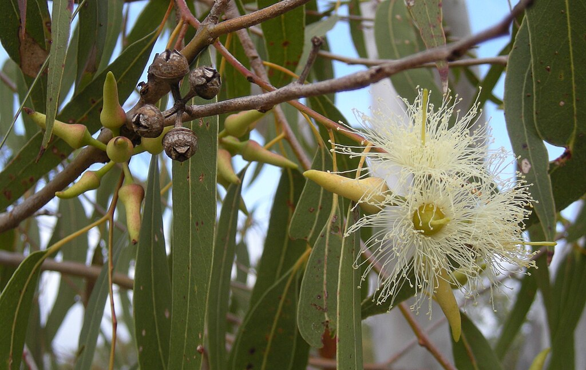

Buds, capsules, flowers and foliage of _[E. tereticornis](https://en.wikipedia.org/wiki/Eucalyptus_tereticornis "Eucalyptus tereticornis")_

[Scientific classification](https://en.wikipedia.org/wiki/Taxonomy_\(biology\) "Taxonomy (biology)") 

Kingdom:

[Plantae](https://en.wikipedia.org/wiki/Plant "Plant")

_Clade_:

[Tracheophytes](https://en.wikipedia.org/wiki/Vascular_plant "Vascular plant")

_Clade_:

[Angiosperms](/source/flowering-plant/ "Flowering plant")

_Clade_:

[Eudicots](https://en.wikipedia.org/wiki/Eudicots "Eudicots")

_Clade_:

[Rosids](https://en.wikipedia.org/wiki/Rosids "Rosids")

Order:

[Myrtales](https://en.wikipedia.org/wiki/Myrtales "Myrtales")

Family:

[Myrtaceae](https://en.wikipedia.org/wiki/Myrtaceae "Myrtaceae")

Subfamily:

[Myrtoideae](https://en.wikipedia.org/wiki/Myrtoideae "Myrtoideae")

Tribe:

[Eucalypteae](https://en.wikipedia.org/wiki/Eucalypteae "Eucalypteae")

Genus:

[_Eucalyptus_](/source/eucalyptus/)
[L'Hér.](https://en.wikipedia.org/wiki/Charles_Louis_L'Héritier_de_Brutelle "Charles Louis L'Héritier de Brutelle")

[Type species](https://en.wikipedia.org/wiki/Type_species "Type species")

_[Eucalyptus obliqua](https://en.wikipedia.org/wiki/Eucalyptus_obliqua "Eucalyptus obliqua")_

[L'Hér. 1789](https://en.wikipedia.org/wiki/Charles_Louis_L'Héritier_de_Brutelle "Charles Louis L'Héritier de Brutelle")

Species

*   [List of _Eucalyptus_ species](https://en.wikipedia.org/wiki/List_of_Eucalyptus_species "List of Eucalyptus species")

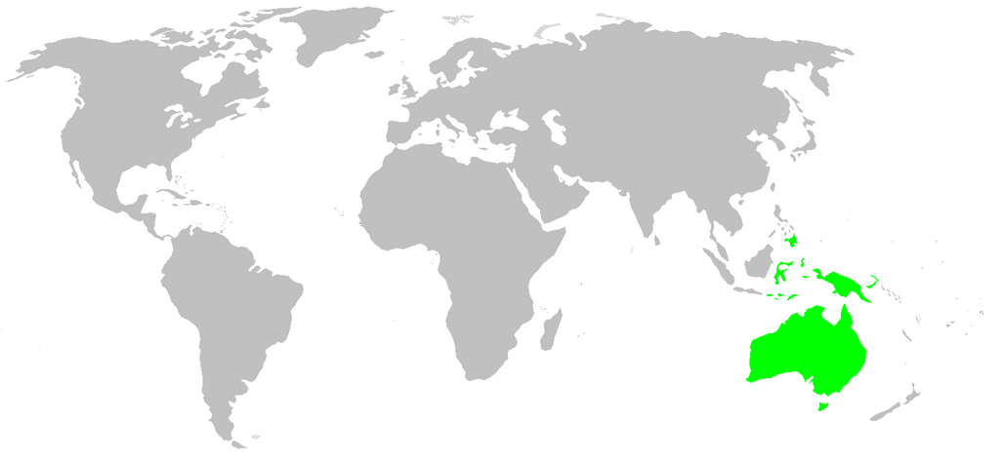

Natural range

[Synonyms](https://en.wikipedia.org/wiki/Synonym_\(taxonomy\) "Synonym (taxonomy)")

*   _Aromadendrum_W.Anderson ex R.Br., 1810
*   _Eudesmia_R.Br., 1814
*   _Symphyomyrtus_Schauer in J.G.C.Lehmann, 1844

_**Eucalyptus**_ ([/ˌjuːkəˈlɪptəs/](https://en.wikipedia.org/wiki/Help:IPA/English "Help:IPA/English")) is a genus of more than 700 species of [flowering plants](/source/flowering-plant/ "Flowering plant") in the family [Myrtaceae](https://en.wikipedia.org/wiki/Myrtaceae "Myrtaceae"). Most species of _Eucalyptus_ are trees, often [mallees](https://en.wikipedia.org/wiki/Mallee_\(habit\) "Mallee (habit)"), and a few are shrubs. Along with several other genera in the tribe [Eucalypteae](https://en.wikipedia.org/wiki/Eucalypteae "Eucalypteae"), including _[Corymbia](https://en.wikipedia.org/wiki/Corymbia "Corymbia")_ and _[Angophora](https://en.wikipedia.org/wiki/Angophora "Angophora")_, they are commonly known as [eucalypts](https://en.wikipedia.org/wiki/Eucalypt "Eucalypt") or "gum trees". Species of _Eucalyptus_ have bark that is either smooth, fibrous, hard, or stringy and leaves that have oil [glands](https://en.wikipedia.org/wiki/Gland_\(botany\) "Gland (botany)"). The [sepals](https://en.wikipedia.org/wiki/Sepal "Sepal") and [petals](https://en.wikipedia.org/wiki/Petal "Petal") are fused to form a "cap" or [operculum](https://en.wikipedia.org/wiki/Operculum_\(botany\) "Operculum (botany)") over the [stamens](https://en.wikipedia.org/wiki/Stamen "Stamen"), hence the name from Greek _eû_ 'well' and _kaluptós_ 'covered'.

Most species of _Eucalyptus_ are [native](https://en.wikipedia.org/wiki/Indigenous_\(ecology\) "Indigenous (ecology)") to Australia, and every state and territory has representative species. A few species are [native](https://en.wikipedia.org/wiki/Native_species "Native species") to islands north of Australia, and a smaller number are only found outside the continent. Eucalypts have been grown in plantations in many other countries because they are fast-growing, have valuable timber, or can be used for [pulpwood](https://en.wikipedia.org/wiki/Pulpwood "Pulpwood"), [honey](https://en.wikipedia.org/wiki/Honey "Honey") production, or [essential oils](https://en.wikipedia.org/wiki/Essential_oil "Essential oil"). In some countries, however, they have been removed because of the danger of [forest fires](https://en.wikipedia.org/wiki/Forest_fire "Forest fire") due to their high flammability.

## Description

### Size and habit

Eucalypts vary in size and [habit](https://en.wikipedia.org/wiki/Habit_\(biology\) "Habit (biology)") from shrubs to tall trees. Trees usually have a single main stem or [trunk](https://en.wikipedia.org/wiki/Trunk_\(botany\) "Trunk (botany)") but many eucalypts are mallees that are multistemmed from ground level and rarely taller than 10 metres (33 feet). There is no clear distinction between a mallee and a shrub but in eucalypts, a shrub is a mature plant less than 1 m (3 ft 3 in) tall and growing in an extreme environment. _[Eucalyptus vernicosa](https://en.wikipedia.org/wiki/Eucalyptus_vernicosa "Eucalyptus vernicosa")_ in the [Tasmanian](https://en.wikipedia.org/wiki/Tasmania "Tasmania") highlands, _[E. yalatensis](https://en.wikipedia.org/wiki/Eucalyptus_yalatensis "Eucalyptus yalatensis")_ on the [Nullarbor](https://en.wikipedia.org/wiki/Nullarbor_Plain "Nullarbor Plain") and _[E. surgens](https://en.wikipedia.org/wiki/Eucalyptus_surgens "Eucalyptus surgens")_ growing on coastal cliffs in [Western Australia](https://en.wikipedia.org/wiki/Western_Australia "Western Australia") are examples of eucalypt shrubs.

The terms "[mallet](https://en.wikipedia.org/wiki/Mallet_\(habit\) "Mallet (habit)")" and "[marlock](https://en.wikipedia.org/wiki/Marlock "Marlock")" are only applied to [Western Australian](https://en.wikipedia.org/wiki/Western_Australia "Western Australia") eucalypts. A mallet is a tree with a single thin trunk with a steeply branching habit but lacks both a [lignotuber](https://en.wikipedia.org/wiki/Lignotuber "Lignotuber") and [epicormic buds](https://en.wikipedia.org/wiki/Epicormic_shoot "Epicormic shoot"). _[Eucalyptus astringens](https://en.wikipedia.org/wiki/Eucalyptus_astringens "Eucalyptus astringens")_ is an example of a mallet. A marlock is a shrub or small tree with a single, short trunk, that lacks a lignotuber and has spreading, densely leafy branches that often reach almost to the ground. _[Eucalyptus platypus](https://en.wikipedia.org/wiki/Eucalyptus_platypus "Eucalyptus platypus")_ is an example of a marlock.

Eucalyptus trees, including mallets and marlocks, are single-stemmed and include _[Eucalyptus regnans](https://en.wikipedia.org/wiki/Eucalyptus_regnans "Eucalyptus regnans")_, the tallest known flowering plant on Earth. The tallest reliably measured tree in Europe, _Karri Knight_, can be found in [Coimbra](https://en.wikipedia.org/wiki/Coimbra "Coimbra"), Portugal in Vale de Canas. It is a _[Eucalyptus diversicolor](https://en.wikipedia.org/wiki/Eucalyptus_diversicolor "Eucalyptus diversicolor")_ of 72.9 meters height and of 5.71 meters girth.

Tree sizes follow the convention of:

*   Small: to 10 m (33 ft) in height
*   Medium-sized: 10–30 m (33–98 ft)
*   Tall: 30–60 m (98–197 ft)
*   Very tall: over 60 m (200 ft)

*   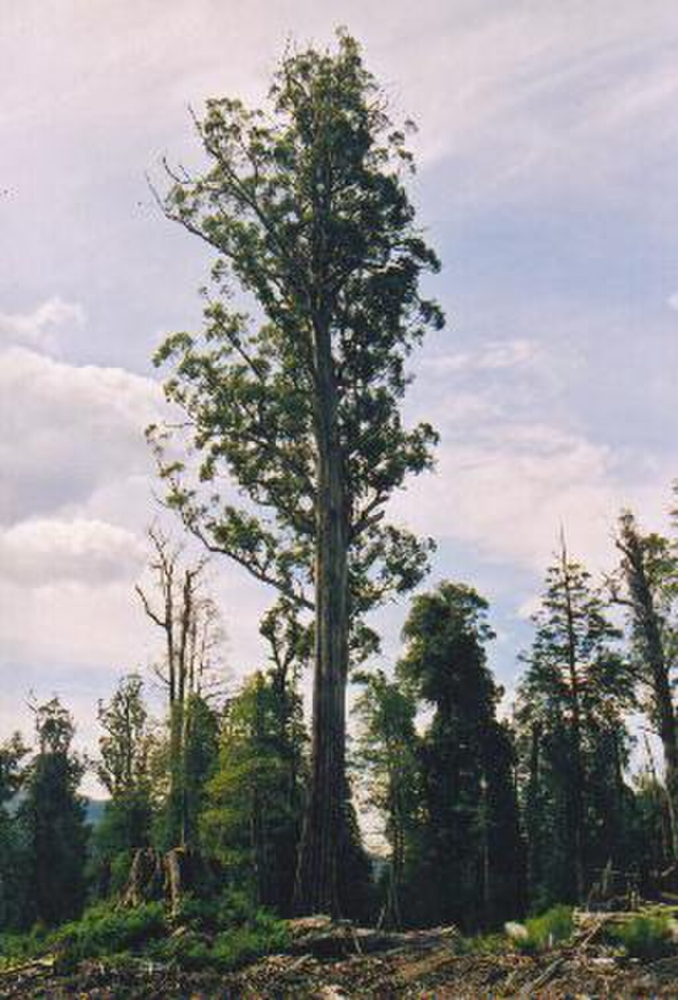

    _[Eucalyptus regnans](https://en.wikipedia.org/wiki/Eucalyptus_regnans "Eucalyptus regnans")_, a forest tree, showing crown dimension, [Tasmania](https://en.wikipedia.org/wiki/Tasmania "Tasmania")

*   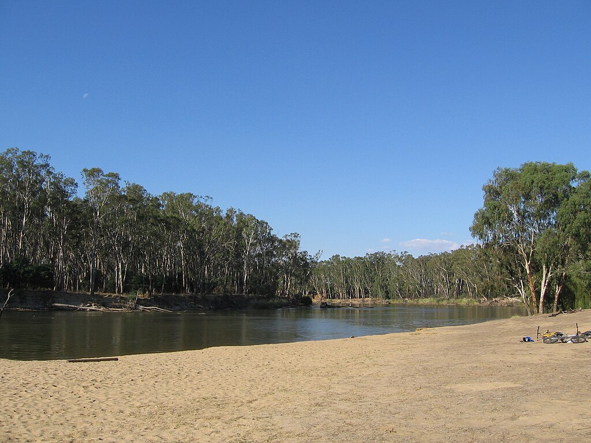

    _[E. camaldulensis](https://en.wikipedia.org/wiki/Eucalyptus_camaldulensis "Eucalyptus camaldulensis")_, immature woodland trees, showing collective crown habit, [Murray River](https://en.wikipedia.org/wiki/Murray_River "Murray River"), [Tocumwal](https://en.wikipedia.org/wiki/Tocumwal "Tocumwal"), [New South Wales](https://en.wikipedia.org/wiki/New_South_Wales "New South Wales")

*   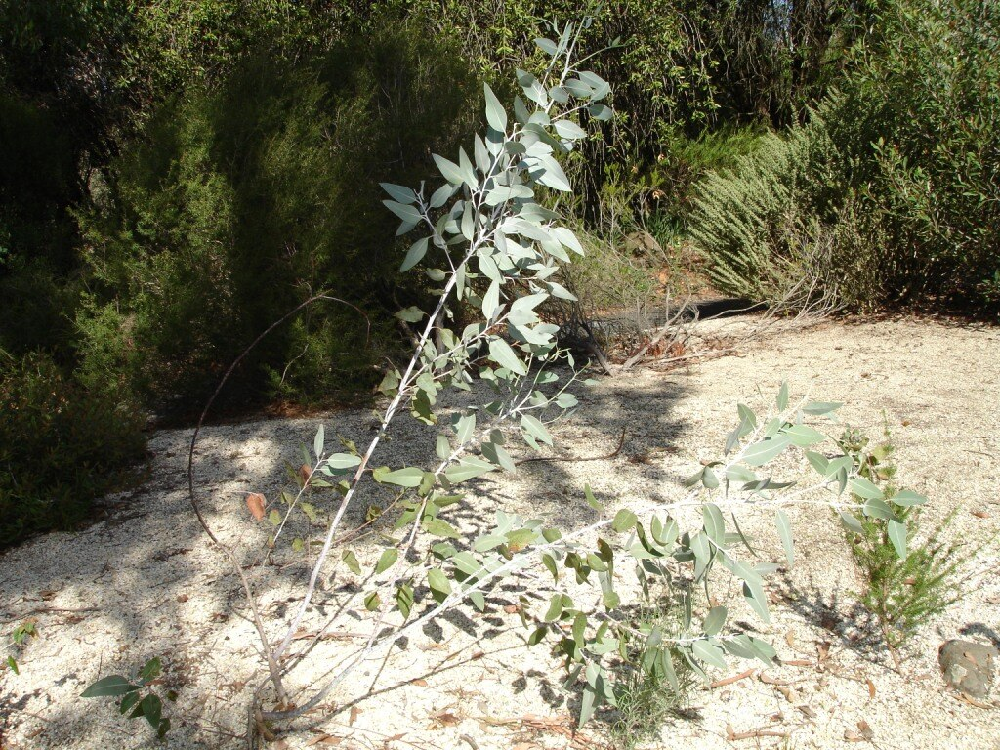

    _[E. cretata](https://en.wikipedia.org/wiki/Eucalyptus_cretata "Eucalyptus cretata")_, juvenile, showing low branching 'mallee' form, [Melbourne](https://en.wikipedia.org/wiki/Melbourne "Melbourne"), [Victoria](https://en.wikipedia.org/wiki/Victoria_\(state\) "Victoria (state)")

*   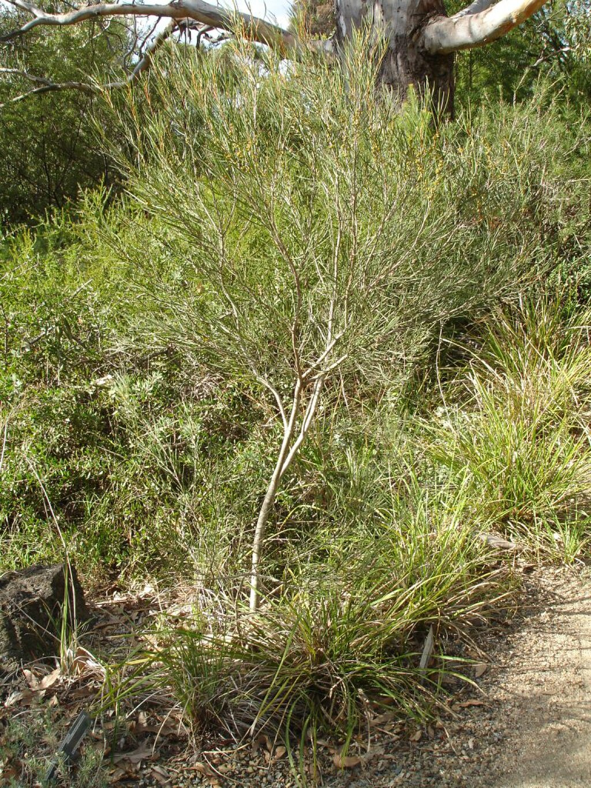

    _[E. angustissima](https://en.wikipedia.org/wiki/Eucalyptus_angustissima "Eucalyptus angustissima")_, showing shrub form, Melbourne

*   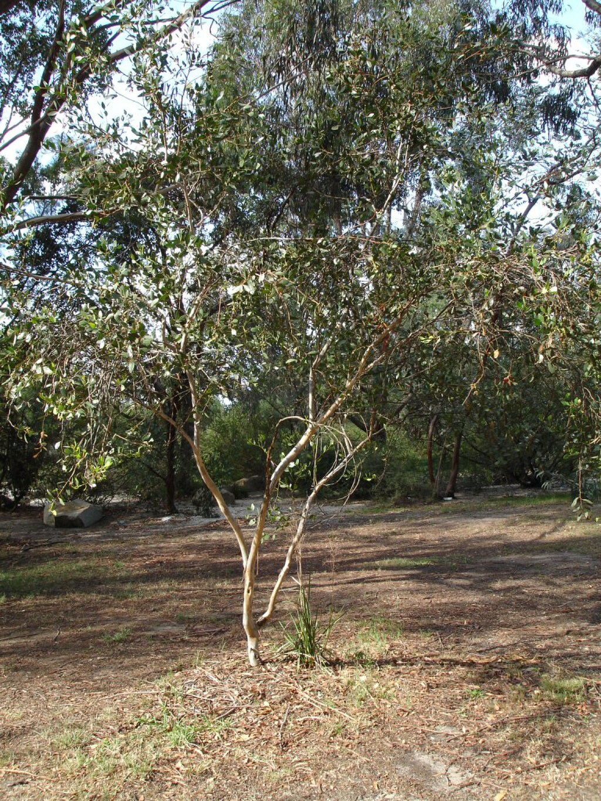

    _[E. platypus](https://en.wikipedia.org/wiki/Eucalyptus_platypus "Eucalyptus platypus")_, showing 'marlock' form, Melbourne

### Bark

All eucalypts add a layer of [bark](https://en.wikipedia.org/wiki/Bark_\(botany\) "Bark (botany)") every year and the outermost layer dies. In about half of the species, the dead bark is shed exposing a new layer of fresh, living bark. The dead bark may be shed in large slabs, in ribbons or in small flakes. These species are known as "smooth barks" and include _[E. sheathiana](https://en.wikipedia.org/wiki/Eucalyptus_sheathiana "Eucalyptus sheathiana")_, _[E. diversicolor](https://en.wikipedia.org/wiki/Eucalyptus_diversicolor "Eucalyptus diversicolor")_, _[E. cosmophylla](https://en.wikipedia.org/wiki/Eucalyptus_cosmophylla "Eucalyptus cosmophylla")_ and _[E. cladocalyx](https://en.wikipedia.org/wiki/Eucalyptus_cladocalyx "Eucalyptus cladocalyx")_. The remaining species retain the dead bark which dries out and accumulates. In some of these species, the fibres in the bark are loosely intertwined (in stringybarks such as _[E. macrorhyncha](https://en.wikipedia.org/wiki/Eucalyptus_macrorhyncha "Eucalyptus macrorhyncha")_ or peppermints such as _[E. radiata](https://en.wikipedia.org/wiki/Eucalyptus_radiata "Eucalyptus radiata")_) or more tightly adherent (as in the "boxes" such as _[E. leptophleba](https://en.wikipedia.org/wiki/Eucalyptus_leptophleba "Eucalyptus leptophleba")_). In some species (the "ironbarks" such as _[E. crebra](https://en.wikipedia.org/wiki/Eucalyptus_crebra "Eucalyptus crebra")_ and _[E. jensenii](https://en.wikipedia.org/wiki/Eucalyptus_jensenii "Eucalyptus jensenii")_) the rough bark is infused with gum resin.

Many species are 'half-barks' or 'blackbutts' in which the dead bark is retained in the lower half of the trunks or stems—for example, _[E. brachycalyx](https://en.wikipedia.org/wiki/Eucalyptus_brachycalyx "Eucalyptus brachycalyx")_, _[E. ochrophloia](https://en.wikipedia.org/wiki/Eucalyptus_ochrophloia "Eucalyptus ochrophloia")_, and _[E. occidentalis](https://en.wikipedia.org/wiki/Eucalyptus_occidentalis "Eucalyptus occidentalis")_—or only in a thick, black accumulation at the base, as in _[E. clelandii](https://en.wikipedia.org/wiki/Eucalyptus_clelandii "Eucalyptus clelandii")_. In some species in this category, for example _[E. youngiana](https://en.wikipedia.org/wiki/Eucalyptus_youngiana "Eucalyptus youngiana")_ and _[E. viminalis](https://en.wikipedia.org/wiki/Eucalyptus_viminalis "Eucalyptus viminalis")_, the rough basal bark is very ribbony at the top, where it gives way to the smooth upper stems. The smooth upper bark of the half-barks and that of the completely smooth-barked trees and mallees can produce remarkable colour and interest, for example _[E. deglupta](https://en.wikipedia.org/wiki/Eucalyptus_deglupta "Eucalyptus deglupta")_.

_[E. globulus](https://en.wikipedia.org/wiki/Eucalyptus_globulus "Eucalyptus globulus")_ bark cells are able to photosynthesize in the absence of foliage, conferring an "increased capacity to re-fix internal CO2 following partial defoliation". This allows the tree to grow in less-than-ideal climates, in addition to providing a better chance of recovery from damage sustained to its leaves in an event such as a fire.

Different commonly recognised types of bark include:

*   [Stringybark](https://en.wikipedia.org/wiki/Stringybark "Stringybark")—consists of long fibres and can be pulled off in long pieces. It is usually thick with a spongy texture.
*   [Ironbark](https://en.wikipedia.org/wiki/Ironbark "Ironbark")—is hard, rough, and deeply furrowed. It is impregnated with dried [kino](https://en.wikipedia.org/wiki/Kino_\(gum\) "Kino (gum)") (a [sap](https://en.wikipedia.org/wiki/Sap_\(plant\) "Sap (plant)") exuded by the tree) which gives a dark red or even black colour.
*   Tessellated—bark is broken up into many distinct flakes. They are [corkish](https://en.wikipedia.org/wiki/Cork_\(material\) "Cork (material)") and can flake off.
*   Box—has short fibres. Some also show tessellation.
*   Ribbon—has the bark coming off in long, thin pieces, but is still loosely attached in some places. They can be long ribbons, firmer strips, or twisted curls.

*   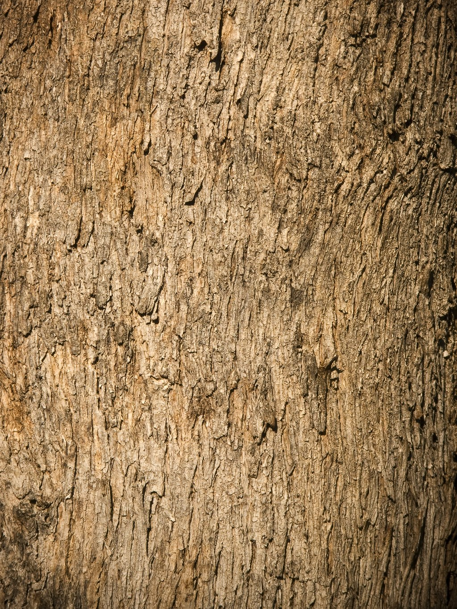

    Bark detail of _[E. angophoroides](https://en.wikipedia.org/wiki/Eucalyptus_angophoroides "Eucalyptus angophoroides")_, the apple-topped box

*   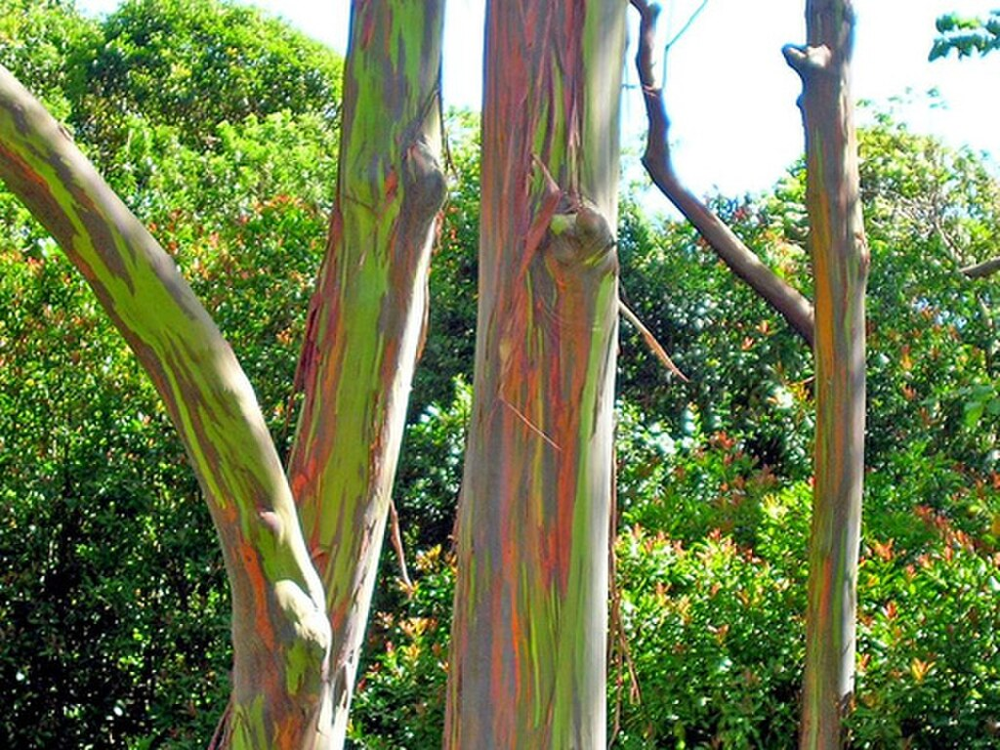

    Coloured bark of _[E. deglupta](https://en.wikipedia.org/wiki/Eucalyptus_deglupta "Eucalyptus deglupta")_ native to Southeast Asia

*   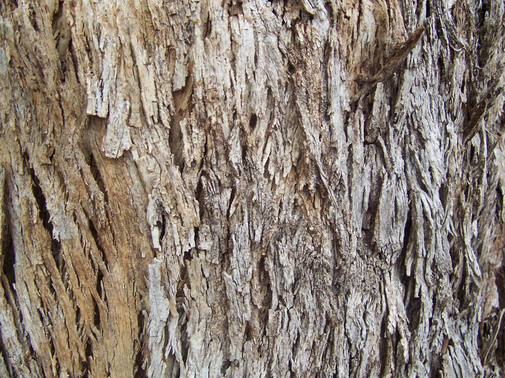

    'Box' bark of _[E. quadrangulata](https://en.wikipedia.org/wiki/Eucalyptus_quadrangulata "Eucalyptus quadrangulata")_, the white-topped box

*   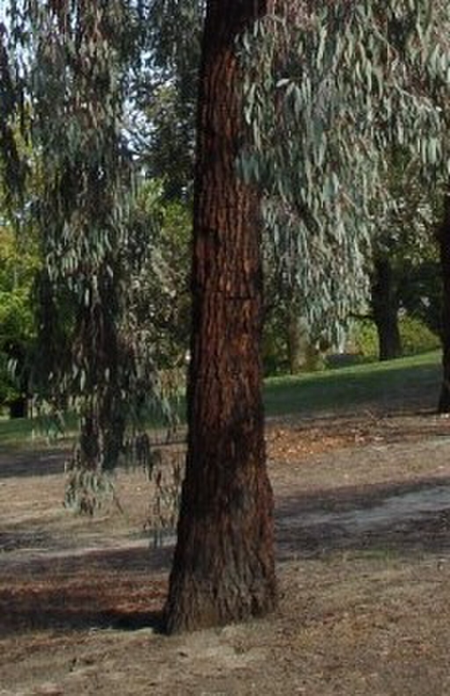

    Dark, fissured '[ironbark](https://en.wikipedia.org/wiki/Ironbark "Ironbark")' of _[E. sideroxylon](https://en.wikipedia.org/wiki/Eucalyptus_sideroxylon "Eucalyptus sideroxylon")_

*   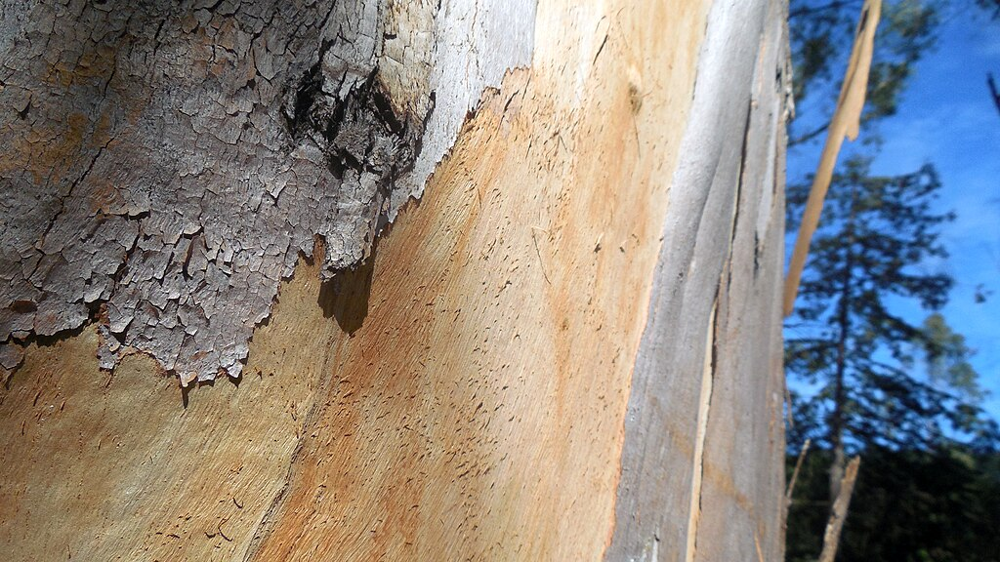

    Shedding bark of _[E. globulus](https://en.wikipedia.org/wiki/Eucalyptus_globulus "Eucalyptus globulus"), Tasmanian blue gum_

### Leaves

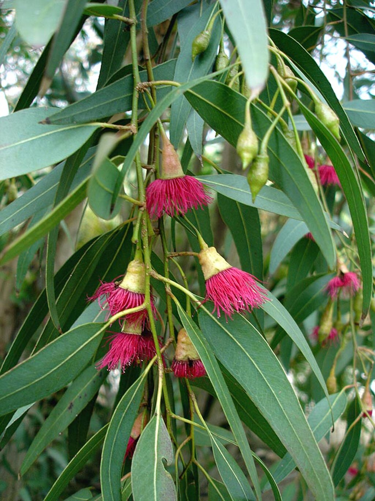_[Eucalyptus leucoxylon](https://en.wikipedia.org/wiki/Eucalyptus_leucoxylon "Eucalyptus leucoxylon")_ var. 'Rosea' showing flowers and buds with [operculum](https://en.wikipedia.org/wiki/Operculum_\(botany\) "Operculum (botany)") present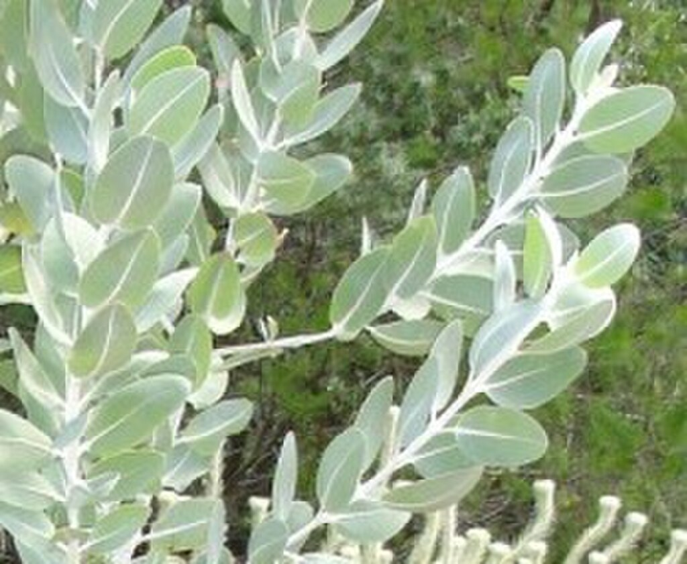_[E. tetragona](https://en.wikipedia.org/wiki/Eucalyptus_tetragona "Eucalyptus tetragona")_, showing glaucous leaves and stems

Nearly all eucalyptuses are [evergreen](https://en.wikipedia.org/wiki/Evergreen "Evergreen"), but some tropical species lose their leaves at the end of the dry season. As in other members of the [myrtle](https://en.wikipedia.org/wiki/Myrtaceae "Myrtaceae") family, eucalyptus leaves are covered with oil glands. The copious oils produced are an important feature of the genus. Although mature eucalyptus trees may be towering and fully leafed, their shade is characteristically patchy because the leaves usually hang downwards.

The leaves on a mature eucalyptus plant are commonly [lanceolate](https://en.wikipedia.org/wiki/Lanceolate "Lanceolate"), [petiolate](https://en.wikipedia.org/wiki/Leaf#Characteristics_of_the_petiole "Leaf"), apparently [alternate](https://en.wikipedia.org/wiki/Alternate_leaf "Alternate leaf") and waxy or glossy green. In contrast, the leaves of seedlings are often [opposite](https://en.wikipedia.org/wiki/Opposite_leaf "Opposite leaf"), [sessile](https://en.wikipedia.org/wiki/Leaf#Characteristics_of_the_petiole "Leaf") and [glaucous](https://en.wikipedia.org/wiki/Leaf#Surface_of_the_leaf "Leaf"). But many exceptions to this pattern exist. Many species such as _[E. melanophloia](https://en.wikipedia.org/wiki/Eucalyptus_melanophloia "Eucalyptus melanophloia")_ and _E. setosa_ retain the juvenile leaf form even when the plant is reproductively mature. Some species, such as _[E. macrocarpa](https://en.wikipedia.org/wiki/Eucalyptus_macrocarpa "Eucalyptus macrocarpa")_, _[E. rhodantha](https://en.wikipedia.org/wiki/Eucalyptus_rhodantha "Eucalyptus rhodantha")_, and _[E. crucis](https://en.wikipedia.org/wiki/Eucalyptus_crucis "Eucalyptus crucis")_, are sought-after ornamentals due to this lifelong juvenile leaf form. A few species, such as _[E. petraea](https://en.wikipedia.org/wiki/Eucalyptus_petraea "Eucalyptus petraea")_, _[E. dundasii](https://en.wikipedia.org/wiki/Eucalyptus_dundasii "Eucalyptus dundasii")_, and _[E. lansdowneana](https://en.wikipedia.org/wiki/Eucalyptus_lansdowneana "Eucalyptus lansdowneana")_, have shiny green leaves throughout their life cycle. _[Eucalyptus caesia](https://en.wikipedia.org/wiki/Eucalyptus_caesia "Eucalyptus caesia")_ exhibits the opposite pattern of leaf development to most eucalyptuses, with shiny green leaves in the seedling stage and dull, glaucous leaves in mature crowns. The contrast between juvenile and adult leaf phases is valuable in field identification.

Four leaf phases are recognised in the development of a eucalyptus plant: the 'seedling', 'juvenile', 'intermediate', and 'adult' phases. However, no definite transitional point occurs between the phases. The intermediate phase, when the largest leaves are often formed, links the juvenile and adult phases.

In all except a few species, the leaves form in pairs on opposite sides of a square stem, consecutive pairs being at right angles to each other (decussate). In some narrow-leaved species, for example _[E. oleosa](https://en.wikipedia.org/wiki/Eucalyptus_oleosa "Eucalyptus oleosa")_, the seedling leaves after the second leaf pair are often clustered in a detectable [spiral](https://en.wikipedia.org/wiki/Spiral "Spiral") arrangement about a five-sided stem. After the spiral phase, which may last from several to many nodes, the arrangement reverts to decussate by the absorption of some of the leaf-bearing faces of the stem. In those species with opposite adult foliage the leaf pairs, which have been formed opposite at the stem apex, become separated at their bases by unequal elongation of the stem to produce the apparently alternate adult leaves.

### Flowers and fruits

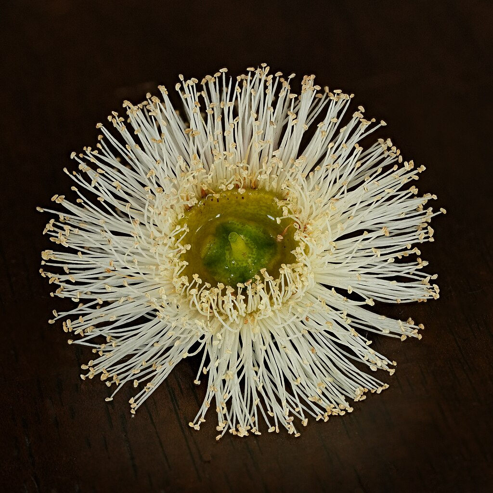Close-up of a flower, ~4.5 cm (1.8 in) diameter, stamens ~1 cm (0.39 in) long.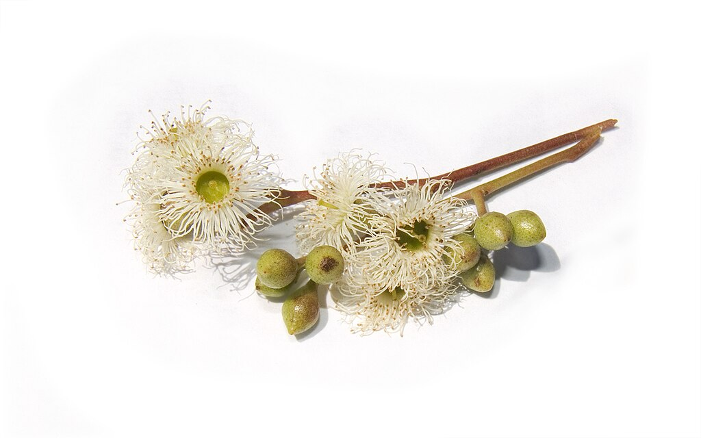_[Eucalyptus melliodora](https://en.wikipedia.org/wiki/Eucalyptus_melliodora "Eucalyptus melliodora")_, showing flowers and opercula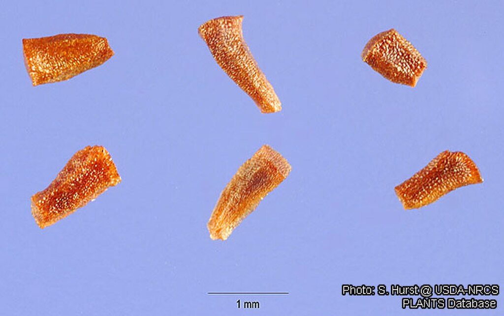Seeds of _[Eucalyptus camaldulensis](https://en.wikipedia.org/wiki/Eucalyptus_camaldulensis "Eucalyptus camaldulensis")_

The most readily recognisable characteristics of eucalyptus species are the distinctive flowers and fruit (capsules or "gumnuts"). Flowers have numerous fluffy [stamens](https://en.wikipedia.org/wiki/Stamen "Stamen") which may be white, cream, yellow, pink, or red; in bud, the stamens are enclosed in a cap known as an [operculum](https://en.wikipedia.org/wiki/Operculum_\(botany\) "Operculum (botany)") which is composed of the fused sepals or petals, or both. Thus, flowers have no petals, but instead decorate themselves with the many showy stamens. As the stamens expand, the operculum is forced off, splitting away from the cup-like base of the flower; this is one of the features that unites the genus. The woody fruits or capsules are roughly cone-shaped and have valves at the end which open to release the seeds, which are waxy, rod-shaped, about 1 mm in length, and yellow-brown in colour. Most species do not flower until adult foliage starts to appear; _E. cinerea_ and _[E. perriniana](https://en.wikipedia.org/wiki/Eucalyptus_perriniana "Eucalyptus perriniana")_ are notable exceptions.

## Taxonomy

The genus _Eucalyptus_ was first formally described by [Charles Louis L'Héritier de Brutelle](https://en.wikipedia.org/wiki/Charles_Louis_L'Héritier_de_Brutelle "Charles Louis L'Héritier de Brutelle") who published the description in his book _Sertum Anglicum_ in 1789 \[date on title page 1788 but see TL-2\], along with a description of the [type species](https://en.wikipedia.org/wiki/Type_\(biology\) "Type (biology)"), _[Eucalyptus obliqua](https://en.wikipedia.org/wiki/Eucalyptus_obliqua "Eucalyptus obliqua")_.

The type specimen was collected in 1777 by [David Nelson](https://en.wikipedia.org/wiki/David_Nelson_\(botanical_collector\) "David Nelson (botanical collector)"), the gardener-botanist on [Cook's](https://en.wikipedia.org/wiki/James_Cook "James Cook") [third voyage](https://en.wikipedia.org/wiki/Third_voyage_of_James_Cook "Third voyage of James Cook"). He collected the specimen on [Bruny Island](https://en.wikipedia.org/wiki/Bruny_Island "Bruny Island") and sent it to L'Héritier de Brutelle who was working in [London](https://en.wikipedia.org/wiki/London "London") at that time.

## History

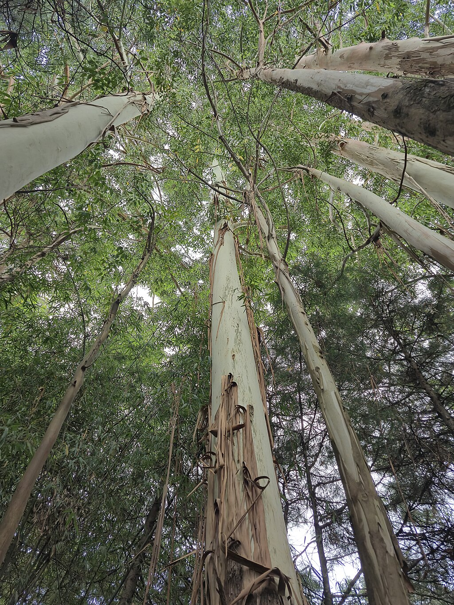_E. globulus_ trees seen from below, in Brazil

Although eucalypts must have been seen by the very early European explorers and collectors, no botanical collections of them are known to have been made until 1770 when [Joseph Banks](https://en.wikipedia.org/wiki/Joseph_Banks "Joseph Banks") and [Daniel Solander](https://en.wikipedia.org/wiki/Daniel_Solander "Daniel Solander") arrived at [Botany Bay](https://en.wikipedia.org/wiki/Botany_Bay "Botany Bay") with [Captain James Cook](https://en.wikipedia.org/wiki/Captain_James_Cook "Captain James Cook"). There they collected specimens of _E. gummifera_ and later, near the [Endeavour River](https://en.wikipedia.org/wiki/Endeavour_River "Endeavour River") in northern _[Queensland](https://en.wikipedia.org/wiki/Queensland "Queensland")_, _[E. platyphylla](https://en.wikipedia.org/wiki/Eucalyptus_platyphylla "Eucalyptus platyphylla")_; neither of these species was named as such at the time.

In 1777, on Cook's third expedition, David Nelson collected a eucalypt on [Bruny Island](https://en.wikipedia.org/wiki/Bruny_Island "Bruny Island") in southern [Tasmania](https://en.wikipedia.org/wiki/Tasmania "Tasmania"). This specimen was taken to the [British Museum](https://en.wikipedia.org/wiki/British_Museum "British Museum") in [London](https://en.wikipedia.org/wiki/London "London"), and was named _Eucalyptus obliqua_ by the French botanist [L'Héritier](https://en.wikipedia.org/wiki/Charles_Louis_L'Héritier_de_Brutelle "Charles Louis L'Héritier de Brutelle"), who was working in London at the time. He coined the generic name from the Greek roots _eu_ and _calyptos_, meaning 'well' and 'covered' in reference to the [operculum](https://en.wikipedia.org/wiki/Operculum_\(botany\) "Operculum (botany)") of the flower bud which protects the developing flower parts as the flower develops and is shed by the pressure of the emerging [stamens](https://en.wikipedia.org/wiki/Stamens "Stamens") at flowering.

The name _obliqua_ was derived from the Latin _obliquus_, meaning 'oblique', which is the [botanical](https://en.wikipedia.org/wiki/Botany "Botany") term describing a [leaf](https://en.wikipedia.org/wiki/Leaf "Leaf") base where the two sides of the leaf blade are of unequal length and do not meet the petiole at the same place.

_E. obliqua_ was published in 1788–89, which coincided with the European colonisation of Australia. Between then and the turn of the 19th century, several more species of eucalyptus were named and published. Most of these were by the English botanist [James Edward Smith](https://en.wikipedia.org/wiki/James_Edward_Smith_\(botanist\) "James Edward Smith (botanist)") and most were, as might be expected, trees of the [Sydney](https://en.wikipedia.org/wiki/Sydney "Sydney") region. These include the economically valuable _E. pilularis_, _E. saligna_ and _E. tereticornis_.

The first endemic Western Australian eucalyptus to be collected and subsequently named was the Yate (_[E. cornuta](https://en.wikipedia.org/wiki/Eucalyptus_cornuta "Eucalyptus cornuta")_) by the French botanist [Jacques Labillardière](https://en.wikipedia.org/wiki/Jacques_Labillardière "Jacques Labillardière"), who collected in what is now the [Esperance](https://en.wikipedia.org/wiki/Esperance,_Western_Australia "Esperance, Western Australia") area in 1792.

Several Australian botanists were active during the 19th century, particularly [Ferdinand von Mueller](https://en.wikipedia.org/wiki/Ferdinand_von_Mueller "Ferdinand von Mueller"), whose work on _eucalypts_ contributed greatly to the first comprehensive account of the genus in [George Bentham](https://en.wikipedia.org/wiki/George_Bentham "George Bentham")'s _Flora Australiensis_ in 1867. The account is the most important early systematic treatment of the genus. Bentham divided it into five series whose distinctions were based on characteristics of the stamens, particularly the anthers (Mueller, 1879–84), work elaborated by [Joseph Henry Maiden](https://en.wikipedia.org/wiki/Joseph_Henry_Maiden "Joseph Henry Maiden") (1903–33) and still further by [William Faris Blakely](https://en.wikipedia.org/wiki/William_Blakely "William Blakely") (1934). The anther system became too complex to be workable and more recent systematic work has concentrated on the characteristics of buds, fruits, leaves and bark.

### Species and hybrids

Over 700 [species](https://en.wikipedia.org/wiki/Species "Species") of eucalyptus are known. Some have [diverged](https://en.wikipedia.org/wiki/Divergent_evolution "Divergent evolution") from the mainstream of the [genus](https://en.wikipedia.org/wiki/Genus "Genus") to the extent that they are quite isolated [genetically](https://en.wikipedia.org/wiki/Genetics "Genetics") and are able to be recognised by only a few relatively invariant characteristics. Most, however, may be regarded as belonging to large or small groups of related species, which are often in geographical contact with each other and between which [gene](https://en.wikipedia.org/wiki/Gene "Gene") exchange still occurs. In these situations, many species appear to grade into one another, and intermediate forms are common. In other words, some species are relatively fixed genetically, as expressed in their [morphology](https://en.wikipedia.org/wiki/Morphology_\(biology\) "Morphology (biology)"), while others have not diverged completely from their nearest relatives.

Hybrid individuals have not always been recognised as such on first collection and some have been named as new species, such as _[E. chrysantha](https://en.wikipedia.org/wiki/Eucalyptus_×_chrysantha "Eucalyptus × chrysantha")_ (_[E. preissiana](https://en.wikipedia.org/wiki/Eucalyptus_preissiana "Eucalyptus preissiana")_ × _[sepulcralis](https://en.wikipedia.org/wiki/Eucalyptus_sepulcralis "Eucalyptus sepulcralis")_) and _E. rivalis_ (_[E. marginata](https://en.wikipedia.org/wiki/Eucalyptus_marginata "Eucalyptus marginata")_ × _[megacarpa](https://en.wikipedia.org/wiki/Eucalyptus_megacarpa "Eucalyptus megacarpa")_). Hybrid combinations are not particularly common in the field, but some other published species frequently seen in Australia have been suggested to be hybrid combinations. For example, _[Eucalyptus × erythrandra](https://en.wikipedia.org/wiki/Eucalyptus_×_erythrandra "Eucalyptus × erythrandra")_ is believed to be _E. angulosa_ × _teraptera_ and due to its wide distribution is often referred to in texts.

Renantherin, a phenolic compound present in the leaves of some eucalyptus species, allows [chemotaxonomic](https://en.wikipedia.org/wiki/Chemotaxonomy "Chemotaxonomy") discrimination in the sections renantheroideae and renantherae and the ratio of the amount of [leucoanthocyanins](https://en.wikipedia.org/wiki/Leucoanthocyanin "Leucoanthocyanin") varies considerably in certain species.

### Related genera

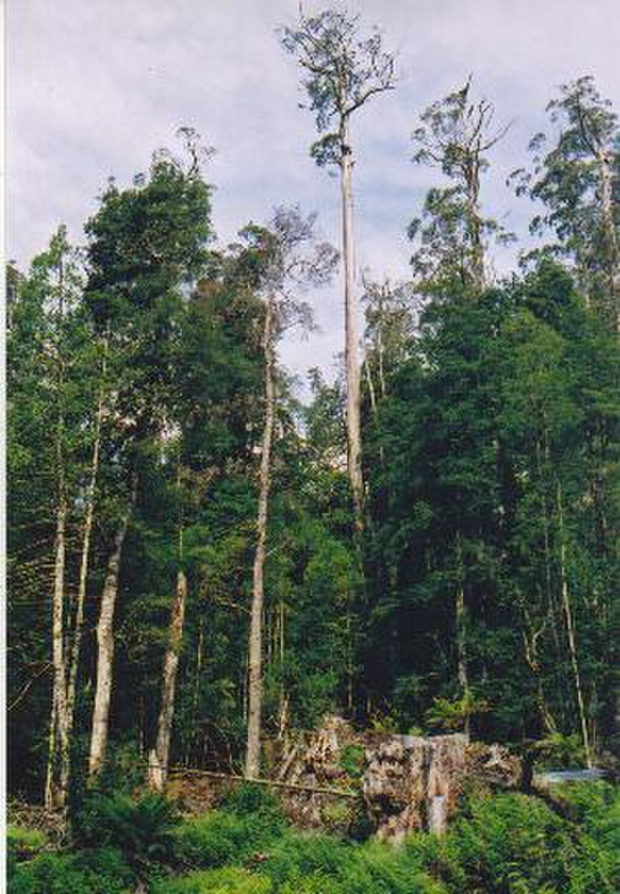_Eucalyptus regnans_ exceeding 80 metres (260 ft), in an area of extensive logging, Tasmania

_Eucalyptus_ is one of three similar [genera](https://en.wikipedia.org/wiki/Genera "Genera") that are commonly referred to as "[eucalypts](https://en.wikipedia.org/wiki/Eucalypt "Eucalypt")", the others being _[Corymbia](https://en.wikipedia.org/wiki/Corymbia "Corymbia")_ and _[Angophora](https://en.wikipedia.org/wiki/Angophora "Angophora")_. Many species, though by no means all, are known as gum trees because they exude copious [kino](https://en.wikipedia.org/wiki/Kino_\(gum\) "Kino (gum)") from any break in the [bark](https://en.wikipedia.org/wiki/Bark_\(botany\) "Bark (botany)") (e.g., [scribbly gum](https://en.wikipedia.org/wiki/Eucalyptus_haemastoma "Eucalyptus haemastoma")).

## Distribution

According to [Plants of the World Online](https://en.wikipedia.org/wiki/Plants_of_the_World_Online "Plants of the World Online"), there are more than 715 species of plants in the genus _Eucalyptus_ and most are native to Australia; a very small number are found in adjacent areas of [New Guinea](https://en.wikipedia.org/wiki/New_Guinea "New Guinea") and [Indonesia](https://en.wikipedia.org/wiki/Indonesia "Indonesia"). One species, _[Eucalyptus deglupta](https://en.wikipedia.org/wiki/Eucalyptus_deglupta "Eucalyptus deglupta"),_ ranges as far north as the [Philippines](https://en.wikipedia.org/wiki/Philippines "Philippines"). Of the 15 species found outside Australia, just nine are exclusively non-Australian. Species of eucalyptus are cultivated widely in the tropical and temperate world, including the [Americas](https://en.wikipedia.org/wiki/Americas "Americas"), [Europe](https://en.wikipedia.org/wiki/Europe "Europe"), [Africa](https://en.wikipedia.org/wiki/Africa "Africa"), the [Mediterranean Basin](https://en.wikipedia.org/wiki/Mediterranean_Basin "Mediterranean Basin"), the [Middle East](https://en.wikipedia.org/wiki/Middle_East "Middle East"), [China](https://en.wikipedia.org/wiki/China "China"), and the [Indian subcontinent](https://en.wikipedia.org/wiki/Indian_subcontinent "Indian subcontinent"). However, the range over which many eucalypts can be planted in the temperate zone is constrained by their limited cold tolerance.

Australia is covered by 92,000,000 hectares (230,000,000 acres) of eucalypt forest, comprising three quarters of the area covered by native forest. The [Blue Mountains](https://en.wikipedia.org/wiki/Blue_Mountains_\(New_South_Wales\) "Blue Mountains (New South Wales)") of southeastern Australia have been a centre of eucalypt diversification; their name is in reference to the blue haze prevalent in the area, believed derived from the volatile [terpenoids](https://en.wikipedia.org/wiki/Terpenoid "Terpenoid") emitted by these trees.

## Fossil record

The oldest definitive eucalyptus fossils are from [Patagonia](https://en.wikipedia.org/wiki/Patagonia "Patagonia") in [South America](https://en.wikipedia.org/wiki/South_America "South America"), where eucalypts are no longer native, though they have been introduced from Australia. The fossils are from the early [Eocene](https://en.wikipedia.org/wiki/Eocene "Eocene") (51.9 Mya), and were found in the [Laguna del Hunco Formation](https://en.wikipedia.org/wiki/Laguna_del_Hunco_Formation "Laguna del Hunco Formation") in [Chubut Province](https://en.wikipedia.org/wiki/Chubut_Province "Chubut Province") in [Argentina](https://en.wikipedia.org/wiki/Argentina "Argentina"). This shows that the genus had a [Gondwanan](https://en.wikipedia.org/wiki/Gondwana "Gondwana") distribution. Fossil leaves also occur in the Miocene of New Zealand, where the genus is not native today, but again have been introduced from Australia.

Despite the prominence of eucalyptuses in modern Australia, estimated to contribute some 75% of the modern vegetation, the fossil record is very scarce throughout much of the [Cenozoic](https://en.wikipedia.org/wiki/Cenozoic "Cenozoic"), and suggests that this rise to dominance is a geologically more recent phenomenon. The oldest reliably dated macrofossil of the eucalyptus is a 21-million-year-old tree-stump encased in basalt in the upper Lachlan Valley in [New South Wales](https://en.wikipedia.org/wiki/New_South_Wales "New South Wales"). Other fossils have been found, but many are either unreliably dated or else unreliably identified.

It is useful to consider where eucalyptus fossils have not been found. Extensive research has gone into the fossil floras of the [Paleocene](https://en.wikipedia.org/wiki/Paleocene "Paleocene") to [Oligocene](https://en.wikipedia.org/wiki/Oligocene "Oligocene") of South-Eastern Australia, and has failed to uncover a single eucalyptus specimen. Although the evidence is sparse, the best hypothesis is that in the mid-Tertiary, the continental margins of Australia only supported more mesic noneucalypt vegetation, and that eucalypts probably contributed to the drier vegetation of the arid continental interior. With the progressive drying out of the continent since the [Miocene](https://en.wikipedia.org/wiki/Miocene "Miocene"), eucalypts were displaced to the continental margins, and much of the mesic and rainforest vegetation that was once there was eliminated.

The current superdominance of eucalyptus in Australia may be an artefact of human influence on its ecology. In more recent sediments, numerous findings of a dramatic increase in the abundance of eucalyptus pollen are associated with increased charcoal levels. Though this occurs at different rates throughout Australia, it is compelling evidence for a relationship between the artificial increase of fire frequency with the arrival of Aboriginals and increased prevalence of this exceptionally fire-tolerant genus.

## Tall timber

Several eucalypt species are among the [tallest trees](https://en.wikipedia.org/wiki/List_of_tallest_trees "List of tallest trees") in the world. _[Eucalyptus regnans](https://en.wikipedia.org/wiki/Eucalyptus_regnans "Eucalyptus regnans")_, the Australian 'mountain ash', is the tallest of all flowering plants ([angiosperms](https://en.wikipedia.org/wiki/Angiosperm "Angiosperm")); today, the tallest measured specimen named [Centurion](https://en.wikipedia.org/wiki/Centurion_\(tree\) "Centurion (tree)") is 100.5 m (330 ft) tall. [Coast Douglas-fir](https://en.wikipedia.org/wiki/Coast_Douglas-fir "Coast Douglas-fir") is about the same height; only [coast redwood](https://en.wikipedia.org/wiki/Sequoia_sempervirens "Sequoia sempervirens") is taller, and they are [conifers](https://en.wikipedia.org/wiki/Conifer "Conifer") ([gymnosperms](https://en.wikipedia.org/wiki/Gymnosperm "Gymnosperm")). Six other eucalypt species exceed 80 metres in height: _[Eucalyptus obliqua](https://en.wikipedia.org/wiki/Eucalyptus_obliqua "Eucalyptus obliqua")_, _[Eucalyptus delegatensis](https://en.wikipedia.org/wiki/Eucalyptus_delegatensis "Eucalyptus delegatensis")_, _[Eucalyptus diversicolor](https://en.wikipedia.org/wiki/Eucalyptus_diversicolor "Eucalyptus diversicolor")_, _[Eucalyptus nitens](https://en.wikipedia.org/wiki/Eucalyptus_nitens "Eucalyptus nitens")_, _[Eucalyptus globulus](https://en.wikipedia.org/wiki/Eucalyptus_globulus "Eucalyptus globulus")_ and _[Eucalyptus viminalis](https://en.wikipedia.org/wiki/Eucalyptus_viminalis "Eucalyptus viminalis")_.

## Frost intolerance

Most eucalypts are not tolerant of severe cold. Eucalypts do well in a range of climates but are usually damaged by anything beyond a light frost of −5 °C (23 °F); the hardiest are the snow gums, such as _[Eucalyptus pauciflora](https://en.wikipedia.org/wiki/Eucalyptus_pauciflora "Eucalyptus pauciflora")_, which is capable of withstanding cold and frost down to about −20 °C (−4 °F). Two subspecies, _[E. pauciflora subsp. niphophila](https://en.wikipedia.org/wiki/Eucalyptus_pauciflora_subsp._niphophila "Eucalyptus pauciflora subsp. niphophila")_ and _[E. pauciflora subsp. debeuzevillei](https://en.wikipedia.org/wiki/Eucalyptus_pauciflora_subsp._debeuzevillei "Eucalyptus pauciflora subsp. debeuzevillei")_ in particular are even hardier and can tolerate even quite severe winters. Several other species, especially from the high plateau and mountains of central [Tasmania](https://en.wikipedia.org/wiki/Tasmania "Tasmania") such as _[Eucalyptus coccifera](https://en.wikipedia.org/wiki/Eucalyptus_coccifera "Eucalyptus coccifera")_, _[Eucalyptus subcrenulata](https://en.wikipedia.org/wiki/Eucalyptus_subcrenulata "Eucalyptus subcrenulata")_ and _[Eucalyptus gunnii](https://en.wikipedia.org/wiki/Eucalyptus_gunnii "Eucalyptus gunnii")_, have also produced extreme cold-hardy forms and it is seed procured from these [genetically](https://en.wikipedia.org/wiki/Genetics "Genetics") hardy strains that are planted for ornament in colder parts of the world.

## Animal relationships

An [essential oil](https://en.wikipedia.org/wiki/Essential_oil "Essential oil") extracted from eucalyptus leaves contains compounds that are powerful natural disinfectants and can be toxic in large quantities. Several [marsupial herbivores](https://en.wikipedia.org/wiki/Marsupial_herbivore "Marsupial herbivore"), notably [koalas](https://en.wikipedia.org/wiki/Koala "Koala") and some [possums](https://en.wikipedia.org/wiki/Phalangeriformes "Phalangeriformes"), are relatively tolerant of it. The close correlation of these oils with other more potent toxins called formylated [phloroglucinol](https://en.wikipedia.org/wiki/Phloroglucinol "Phloroglucinol") compounds (euglobals, macrocarpals and sideroxylonals) allows koalas and other [marsupial](https://en.wikipedia.org/wiki/Marsupial "Marsupial") species to make food choices based on the smell of the leaves. For koalas, these compounds are the most important factor in leaf choice.

A wide variety of insects also feed exclusively on eucalyptus leaves, such as beetles in the genus _[Paropsisterna](https://en.wikipedia.org/wiki/Paropsisterna "Paropsisterna")_.

The [eusocial](https://en.wikipedia.org/wiki/Eusocial "Eusocial") beetle _[Austroplatypus incompertus](https://en.wikipedia.org/wiki/Austroplatypus_incompertus "Austroplatypus incompertus")_ makes and defends its galleries exclusively inside eucalypts, including some species of eucalyptus and _Corymbia_.

*   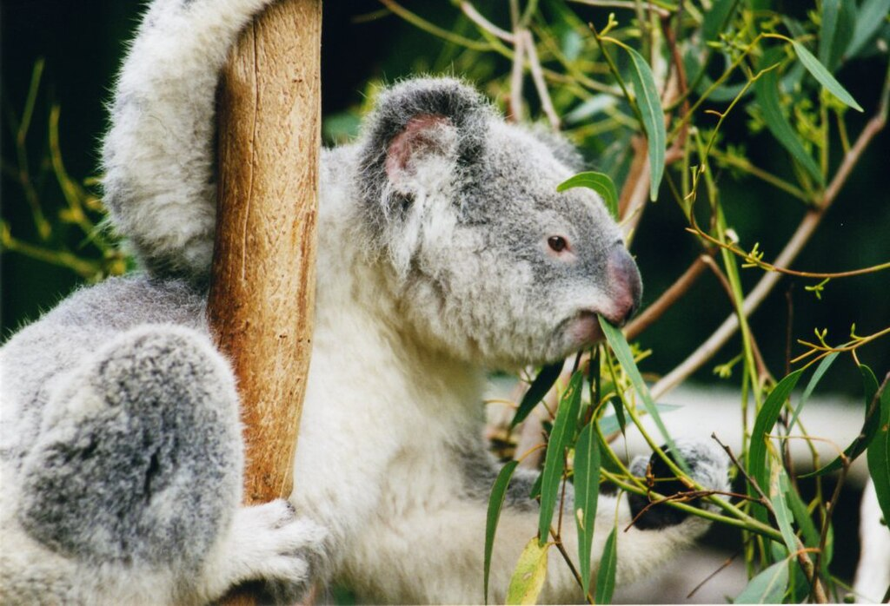

    [Koala](https://en.wikipedia.org/wiki/Koala "Koala") (_Phascolarctos cinereus_) eating the leaves

*   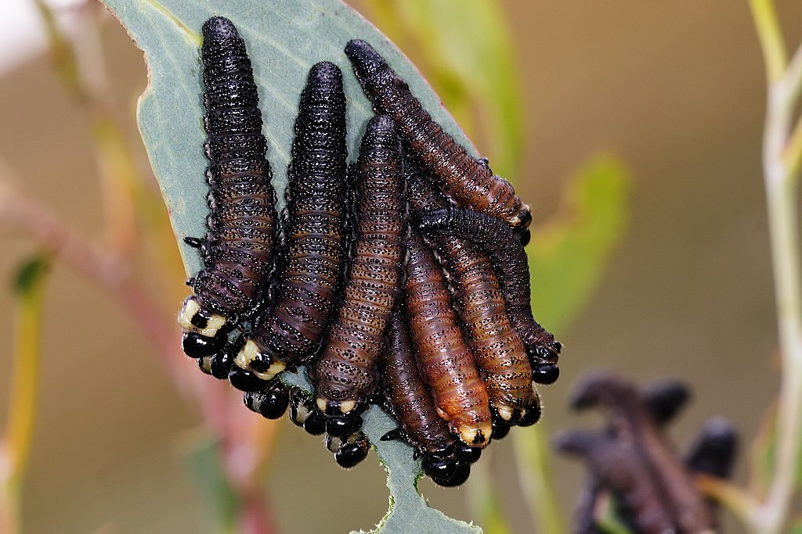

    [Sawfly](https://en.wikipedia.org/wiki/Spitfire_sawfly "Spitfire sawfly") larvae feeding on the leaves

*   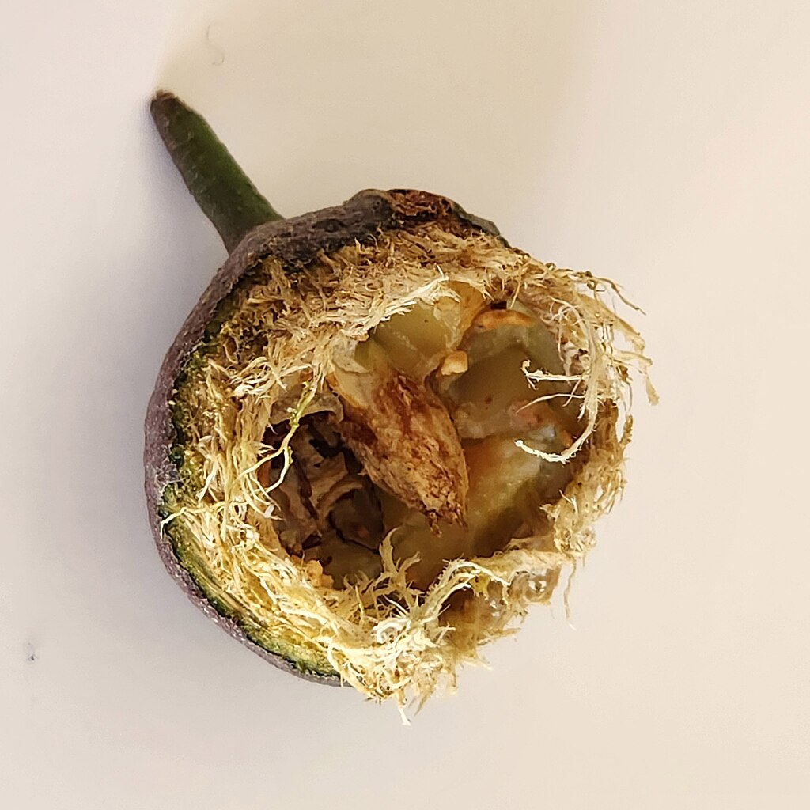

    Gumnut chewed open by a [Cockatoo](https://en.wikipedia.org/wiki/Cockatoo "Cockatoo") and the seeds mostly consumed

## Diseases on plants

Fungal species _[Mycosphaerella](https://en.wikipedia.org/wiki/Mycosphaerella "Mycosphaerella")_ and _[Teratosphaeria](https://en.wikipedia.org/wiki/Teratosphaeria "Teratosphaeria")_ have been associated with leaf disease on various eucalyptus species. Several fungal species from the [Teratosphaeriaceae](https://en.wikipedia.org/wiki/Teratosphaeriaceae "Teratosphaeriaceae") family are causal agents in leaf diseases and stem cankers of _Eucalyptus_ in [Uruguay](https://en.wikipedia.org/wiki/Uruguay "Uruguay"), and [Australia](https://en.wikipedia.org/wiki/Australia "Australia").

## Adaptation to fire

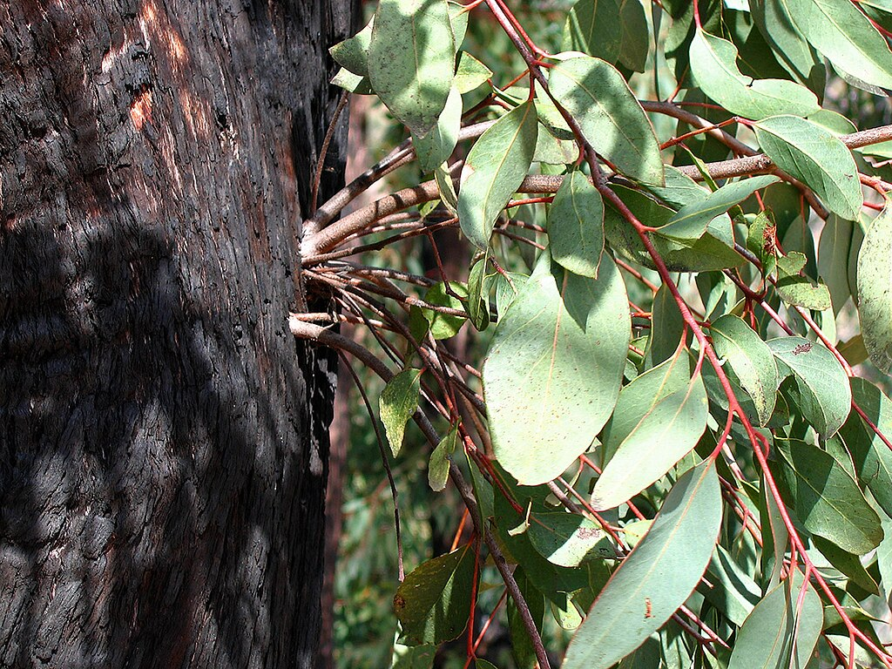[Epicormic shoots](https://en.wikipedia.org/wiki/Epicormic_shoots "Epicormic shoots") sprouting vigorously from epicormic buds beneath the [bushfire](https://en.wikipedia.org/wiki/Bushfires_in_Australia "Bushfires in Australia") damaged bark on the trunk of a _Eucalyptus_ tree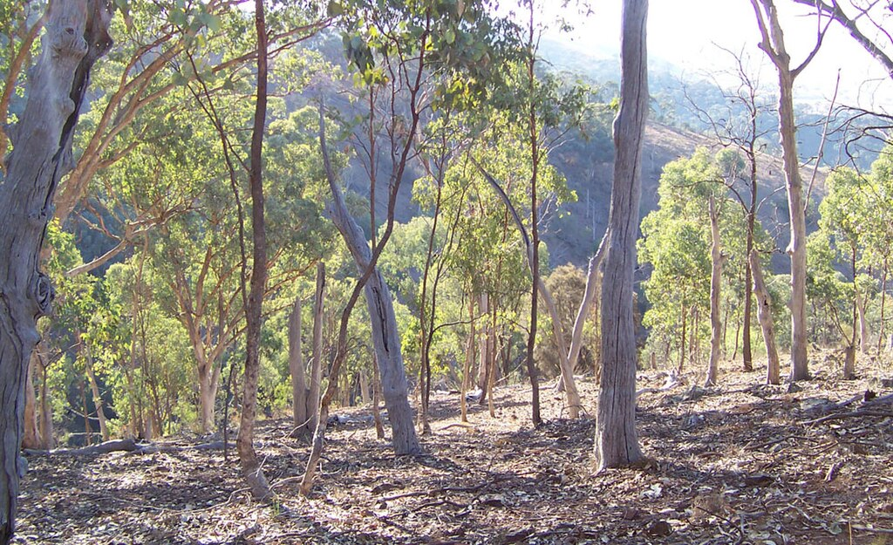_Eucalyptus_ forest in a state of regeneration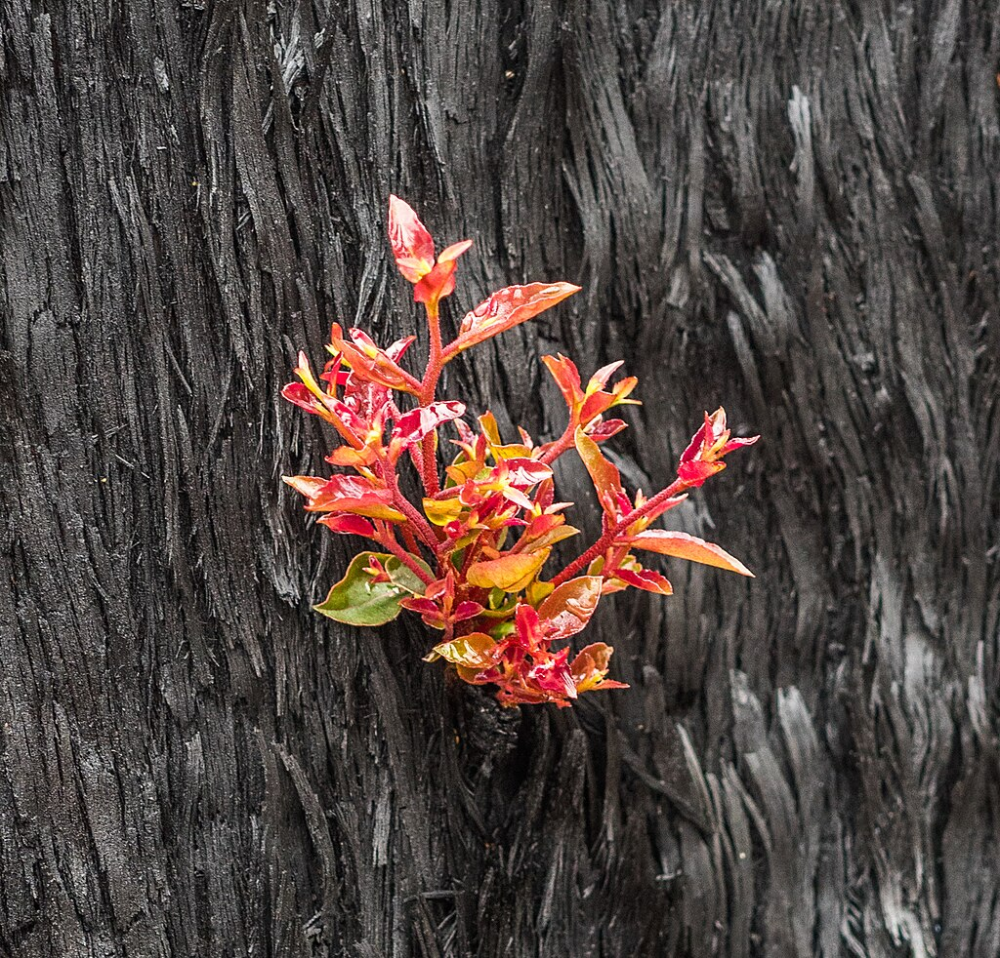Epicormic growth shooting after the [2019–2020 Australian bushfire season](https://en.wikipedia.org/wiki/2019–2020_Australian_bushfire_season "2019–2020 Australian bushfire season")

Eucalypts originated between 35 and 50 million years ago, not long after [Australia-New Guinea](https://en.wikipedia.org/wiki/Australia-New_Guinea "Australia-New Guinea") separated from [Gondwana](https://en.wikipedia.org/wiki/Gondwana "Gondwana"), their rise coinciding with an increase in fossil charcoal deposits (suggesting that fire was a factor even then), but they remained a minor component of the Tertiary rainforest until about 20 million years ago, when the gradual drying of the continent and depletion of soil nutrients led to the development of a more open forest type, predominantly _[Casuarina](https://en.wikipedia.org/wiki/Casuarina "Casuarina")_ and _[Acacia](https://en.wikipedia.org/wiki/Acacia "Acacia")_ species.

The two valuable timber trees, alpine ash (_[E. delegatensis](https://en.wikipedia.org/wiki/Eucalyptus_delegatensis "Eucalyptus delegatensis")_) and Australian mountain ash (_[E. regnans](https://en.wikipedia.org/wiki/Eucalyptus_regnans "Eucalyptus regnans")_), are killed by fire and only regenerate from seed. The same 2003 bushfire that had little impact on forests around [Canberra](https://en.wikipedia.org/wiki/Canberra "Canberra") resulted in thousands of hectares of dead ash forests. However, a small amount of ash survived and put out new ash trees as well.

### Fire hazard

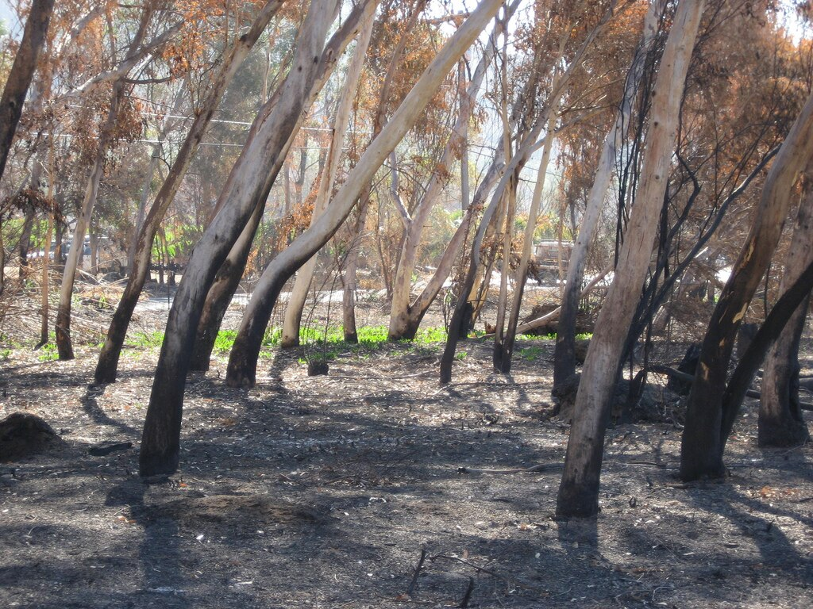Eucalyptus trees bent over due to the high winds and heat of the [October 2007 California wildfires](https://en.wikipedia.org/wiki/October_2007_California_wildfires "October 2007 California wildfires"). They are located in the [San Dieguito River Park](https://en.wikipedia.org/wiki/San_Dieguito_River_Park "San Dieguito River Park") of San Diego County and leaning west.

Eucalyptus oil is highly flammable and at high enough temperatures the oil expands quickening the spread of wildfires. [Bushfires](https://en.wikipedia.org/wiki/Bushfires_in_Australia "Bushfires in Australia") can travel easily through the oil-rich air of the tree crowns. Eucalypts obtain long-term fire survivability from their ability to regenerate from [epicormic buds](https://en.wikipedia.org/wiki/Epicormic_shoot "Epicormic shoot") situated deep within their thick bark, or from [lignotubers](https://en.wikipedia.org/wiki/Lignotuber "Lignotuber"), or by producing [serotinous](https://en.wikipedia.org/wiki/Serotiny "Serotiny") fruits.

In seasonally dry climates oaks are often fire-resistant, particularly in open grasslands, as a grass fire is insufficient to ignite the scattered trees. In contrast, a eucalyptus forest tends to promote fire because of the volatile and highly combustible oils produced by the leaves, as well as the production of large amounts of [litter](https://en.wikipedia.org/wiki/Plant_litter "Plant litter") high in phenolics, preventing its breakdown by [fungi](/source/fungus/ "Fungus") and thus accumulating as large amounts of dry, combustible fuel. Consequently, dense eucalypt plantings may be subject to catastrophic firestorms. In fact, almost thirty years before the [Oakland firestorm of 1991](https://en.wikipedia.org/wiki/Oakland_firestorm_of_1991 "Oakland firestorm of 1991"), a study of eucalyptuses in the area warned that the litter beneath the trees builds up very rapidly and should be regularly monitored and removed. It has been estimated that 70% of the energy released through the combustion of vegetation in the Oakland fire was due to eucalyptuses. In a [National Park Service](https://en.wikipedia.org/wiki/National_Park_Service "National Park Service") study, it was found that the fuel load (in tons per acre) of non-native eucalyptus woods is almost three times as great as native oak woodland.

During [World War II](https://en.wikipedia.org/wiki/World_War_II "World War II"), one California town cut down their eucalyptus trees to "about a third of their height in the vicinity of [anti-aircraft guns](https://en.wikipedia.org/wiki/Anti-aircraft_warfare "Anti-aircraft warfare")" because of the known fire-fueling qualities of the trees, with the mayor telling a newspaper reporter, "If a [shell](https://en.wikipedia.org/wiki/Shell_\(projectile\) "Shell (projectile)") so much as hits a leaf, it's supposed to explode."

## Falling branches

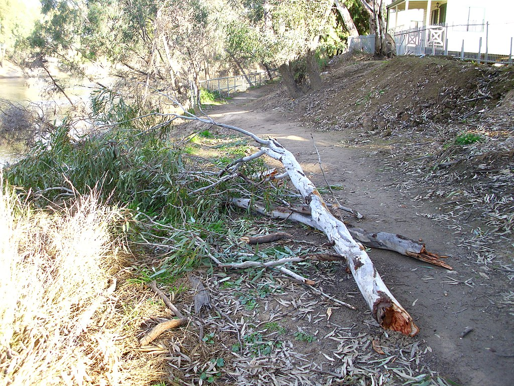Fallen _E. camaldulensis_ limbs on a walking track

Some species of eucalyptus drop branches unexpectedly. In Australia, [Parks Victoria](https://en.wikipedia.org/wiki/Parks_Victoria "Parks Victoria") warns campers not to camp under [river red gums](https://en.wikipedia.org/wiki/Eucalyptus_camaldulensis "Eucalyptus camaldulensis"). Some councils in Australia such as [Gosnells, Western Australia](https://en.wikipedia.org/wiki/Gosnells,_Western_Australia "Gosnells, Western Australia"), have removed eucalypts after reports of damage from dropped branches, even in the face of lengthy, well publicised protests to protect particular trees. A former Australian National Botanic Gardens director and consulting arborist, Robert Boden, has been quoted referring to "summer branch drop". Deaths have occurred from sudden branch drops such as the death of 22-year old Alifia Soeryo in 2024 who was taking a break under a river gum, and the death of 8-year old Bridget Wright at school in 2014. Before both deaths, the trees were either regularly inspected or inspected recently, assessed and not considered dangerous by maintenance, highlighting the unpreditability of gum branch drop. In fiction, the dropping of branches is recognised in Australia literature like the fictional death of Judy in _[Seven Little Australians](https://en.wikipedia.org/wiki/Seven_Little_Australians "Seven Little Australians")_. Although all large trees can drop branches, the density of eucalyptus wood is high due to its high resin content, increasing the hazard.

## Cultivation and uses

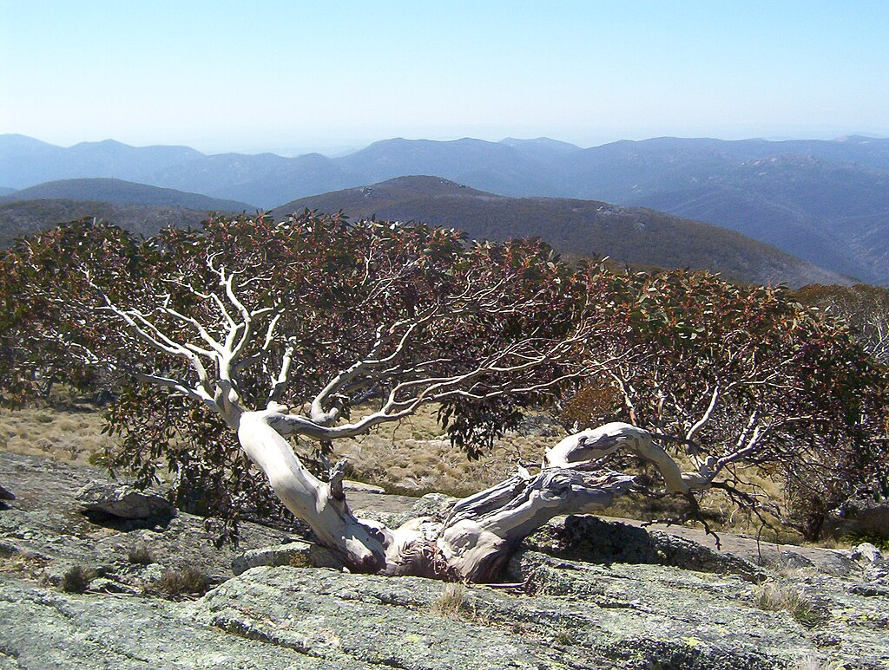[Snow gum](https://en.wikipedia.org/wiki/Eucalyptus_pauciflora "Eucalyptus pauciflora") in [Namadgi National Park](https://en.wikipedia.org/wiki/Namadgi_National_Park "Namadgi National Park")

Eucalypts were introduced from [Australia](https://en.wikipedia.org/wiki/Australia "Australia") to the rest of the world following the [Cook](https://en.wikipedia.org/wiki/James_Cook "James Cook") expedition in 1770. Collected by [Sir Joseph Banks](https://en.wikipedia.org/wiki/Joseph_Banks "Joseph Banks"), [botanist](https://en.wikipedia.org/wiki/Botanist "Botanist") on the expedition, they were subsequently introduced to many parts of the world, notably [California](https://en.wikipedia.org/wiki/California "California"), southern Europe, Africa, the [Middle East](https://en.wikipedia.org/wiki/Middle_East "Middle East"), South Asia and South America. About 250 species are under cultivation in California. In [Portugal](https://en.wikipedia.org/wiki/Portugal "Portugal") and also [Spain](https://en.wikipedia.org/wiki/Spain "Spain"), eucalypts have been grown in plantations for the production of [pulpwood](https://en.wikipedia.org/wiki/Pulpwood "Pulpwood"). Eucalyptuses are the basis for several industries, such as sawmilling, pulp, charcoal and others. Several species have become [invasive](https://en.wikipedia.org/wiki/Invasive_species "Invasive species") and are causing major problems for local ecosystems, mainly due to the absence of [wildlife corridors](https://en.wikipedia.org/wiki/Wildlife_corridor "Wildlife corridor") and rotations management.

Eucalypts have many uses which have made them [economically](https://en.wikipedia.org/wiki/Economics "Economics") important trees, and they have become a [cash crop](https://en.wikipedia.org/wiki/Cash_crop "Cash crop") in poor areas such as [Timbuktu](https://en.wikipedia.org/wiki/Timbuktu "Timbuktu"), Mali and the [Peruvian](https://en.wikipedia.org/wiki/Peru "Peru") [Andes](https://en.wikipedia.org/wiki/Andes "Andes"), despite concerns that the trees are [invasive](https://en.wikipedia.org/wiki/Invasive_species "Invasive species") in some environments like those of [South Africa](https://en.wikipedia.org/wiki/South_Africa "South Africa"). Best-known are perhaps the varieties [karri](https://en.wikipedia.org/wiki/Eucalyptus_diversicolor "Eucalyptus diversicolor") and [yellow box](https://en.wikipedia.org/wiki/Eucalyptus_melliodora "Eucalyptus melliodora"). Due to their fast growth, the foremost benefit of these trees is their wood. They can be chopped off at the root and grow back again. They provide many desirable characteristics for use as [ornament](https://en.wikipedia.org/wiki/Ornamental_plant "Ornamental plant"), timber, firewood and pulpwood. Eucalyptus wood is also used in a number of industries, from fence posts (where the oil-rich wood's high resistance to decay is valued) and charcoal to [cellulose](https://en.wikipedia.org/wiki/Cellulose "Cellulose") extraction for [biofuels](https://en.wikipedia.org/wiki/Biofuel "Biofuel"). Fast growth also makes eucalypts suitable as [windbreaks](https://en.wikipedia.org/wiki/Windbreak "Windbreak") and to reduce [erosion](https://en.wikipedia.org/wiki/Erosion "Erosion").

Some eucalyptus species have attracted attention from horticulturists, [global development](https://en.wikipedia.org/wiki/Development_economics "Development economics") researchers, and environmentalists because of desirable traits such as being fast-growing sources of wood, producing oil that can be used for cleaning and as a natural [insecticide](https://en.wikipedia.org/wiki/Insecticide "Insecticide"), or an ability to be used to drain [swamps](https://en.wikipedia.org/wiki/Swamp "Swamp") and thereby reduce the risk of [malaria](https://en.wikipedia.org/wiki/Malaria "Malaria"). [Eucalyptus oil](https://en.wikipedia.org/wiki/Eucalyptus_oil "Eucalyptus oil") finds many uses like in fuels, fragrances, insect repellence and antimicrobial activity. _Eucalyptus_ trees show [allelopathic](https://en.wikipedia.org/wiki/Allelopathic "Allelopathic") effects; they release compounds which inhibit other plant species from growing nearby. Outside their natural ranges, eucalypts are both lauded for their beneficial economic impact on poor populations and criticised for being "water-guzzling" [aliens](https://en.wikipedia.org/wiki/Invasive_species "Invasive species"), leading to controversy over their total impact.

Eucalypts draw a tremendous amount of water from the soil through the process of [transpiration](https://en.wikipedia.org/wiki/Transpiration "Transpiration"). They have been planted (or re-planted) in some places to lower the [water table](https://en.wikipedia.org/wiki/Water_table "Water table") and reduce [soil salination](https://en.wikipedia.org/wiki/Soil_salination "Soil salination"). Eucalypts have also been used as a way of reducing [malaria](https://en.wikipedia.org/wiki/Malaria "Malaria") by draining the soil in Algeria, Lebanon, Sicily, elsewhere in [Europe](https://en.wikipedia.org/wiki/Europe "Europe"), in the Caucasus (Western [Georgia](https://en.wikipedia.org/wiki/Georgia_\(country\) "Georgia (country)")), and California. Drainage removes [swamps](https://en.wikipedia.org/wiki/Swamp "Swamp") which provide a habitat for [mosquito](https://en.wikipedia.org/wiki/Mosquito "Mosquito") [larvae](https://en.wikipedia.org/wiki/Larva "Larva"), but can also destroy ecologically productive areas. This drainage is not limited to the soil surface, because the _Eucalyptus_ roots are up to 2.5 m (8 ft 2 in) in length and can, depending on the location, even reach the [phreatic zone](https://en.wikipedia.org/wiki/Phreatic_zone "Phreatic zone").

### Pulpwood

_Eucalyptus_ is the most common short fibre source for [pulpwood](https://en.wikipedia.org/wiki/Pulpwood "Pulpwood") to make [pulp](https://en.wikipedia.org/wiki/Pulp_\(paper\) "Pulp (paper)"). The types most often used in [papermaking](https://en.wikipedia.org/wiki/Papermaking "Papermaking") are _[Eucalyptus globulus](https://en.wikipedia.org/wiki/Eucalyptus_globulus "Eucalyptus globulus")_ (in temperate areas) and the _[Eucalyptus urophylla](https://en.wikipedia.org/wiki/Eucalyptus_urophylla "Eucalyptus urophylla")_ x _[Eucalyptus grandis](https://en.wikipedia.org/wiki/Eucalyptus_grandis "Eucalyptus grandis")_ hybrid (in the tropics). The fibre length of _Eucalyptus_ is relatively short and uniform with low coarseness compared with other hardwoods commonly used as pulpwood. The fibres are slender, yet relatively thick walled. This gives uniform paper formation and high [opacity](https://en.wikipedia.org/wiki/Opacity_\(optics\) "Opacity (optics)") that are important for all types of [fine papers](https://en.wikipedia.org/wiki/Fine_paper "Fine paper"). The low coarseness is important for high quality [coated papers](https://en.wikipedia.org/wiki/Coated_paper "Coated paper"). _Eucalyptus_ is suitable for many [tissue papers](https://en.wikipedia.org/wiki/Tissue_paper "Tissue paper") as the short and slender fibres gives a high number of fibres per gram and low coarseness contributes to softness.

### _Eucalyptus_ oil

[Eucalyptus oil](https://en.wikipedia.org/wiki/Eucalyptus_oil "Eucalyptus oil") is readily [steam distilled](https://en.wikipedia.org/wiki/Steam_distillation "Steam distillation") from the leaves and can be used for cleaning and as an industrial solvent, as an antiseptic, for deodorising, and in very small quantities in [food](https://en.wikipedia.org/wiki/Food "Food") supplements, especially [sweets](https://en.wikipedia.org/wiki/Sweets "Sweets"), [cough drops](https://en.wikipedia.org/wiki/Cough_drops "Cough drops"), [toothpaste](https://en.wikipedia.org/wiki/Toothpaste "Toothpaste") and decongestants. It has insect-repellent properties, and serves as an active ingredient in some commercial mosquito-repellents. [Aromatherapists](https://en.wikipedia.org/wiki/Aromatherapy "Aromatherapy") have adopted _Eucalyptus_ oils for a wide range of purposes. _[Eucalyptus globulus](https://en.wikipedia.org/wiki/Eucalyptus_globulus "Eucalyptus globulus")_ is the principal source of _Eucalyptus_ oil worldwide.

### Musical instruments

Eucalypt wood is also commonly used to make [didgeridoos](https://en.wikipedia.org/wiki/Didgeridoo "Didgeridoo"), a traditional [Australian Aboriginal](https://en.wikipedia.org/wiki/Australian_Aboriginals "Australian Aboriginals") [wind instrument](https://en.wikipedia.org/wiki/Wind_instrument "Wind instrument"). The trunk of the tree is hollowed out by termites, and then cut down if the bore is of the correct size and shape.

Eucalypt wood is also being used as a [tonewood](https://en.wikipedia.org/wiki/Tonewood "Tonewood") and a fingerboard material for acoustic guitars, notably by the California-based Taylor company.

### Dyes

All parts of _Eucalyptus_ may be used to make [dyes](https://en.wikipedia.org/wiki/Dye "Dye") that are substantive on [protein](https://en.wikipedia.org/wiki/Protein "Protein") fibres (such as [silk](https://en.wikipedia.org/wiki/Silk "Silk") and [wool](https://en.wikipedia.org/wiki/Wool "Wool")), simply by processing the plant part with [water](https://en.wikipedia.org/wiki/Water "Water"). Colours to be achieved range from yellow and orange through green, tan, chocolate and deep rust red.

### Prospecting

_Eucalyptus_ trees in the Australian outback draw up gold from tens of metres underground through their root system and deposit it as particles in their leaves and branches. A Maia detector for x-ray elemental imaging at the [Australian Synchrotron](https://en.wikipedia.org/wiki/Australian_Synchrotron "Australian Synchrotron") clearly showed deposits of gold and other metals in the structure of _Eucalyptus_ leaves from the Kalgoorlie region of Western Australia that would have been untraceable using other methods. The microscopic leaf-bound "nuggets", about 8 [micrometres](https://en.wikipedia.org/wiki/Micrometre "Micrometre") wide on average, are not worth collecting themselves, but may provide an environmentally benign way of locating subsurface mineral deposits.

## _Eucalyptus_ as plantation species

In the 20th century, scientists around the world experimented with _Eucalyptus_ species. They hoped to grow them in the tropics, but most experimental results failed until breakthroughs in the 1960s-1980s in species selection, silviculture, and breeding programs "unlocked" the potential of eucalypts in the tropics. Prior to then, as Brett Bennett noted in a 2010 article, eucalypts were something of the "[El Dorado](https://en.wikipedia.org/wiki/El_Dorado "El Dorado")" of forestry. Today, _Eucalyptus_ is the most widely planted type of tree in plantations around the world, in [South America](https://en.wikipedia.org/wiki/South_America "South America") (mainly in [Brazil](https://en.wikipedia.org/wiki/Brazil "Brazil"), [Argentina](https://en.wikipedia.org/wiki/Argentina "Argentina"), [Paraguay](https://en.wikipedia.org/wiki/Paraguay "Paraguay") and [Uruguay](https://en.wikipedia.org/wiki/Uruguay "Uruguay")), [South Africa](https://en.wikipedia.org/wiki/South_Africa "South Africa"), [Australia](https://en.wikipedia.org/wiki/Australia "Australia"), [India](https://en.wikipedia.org/wiki/India "India"), [Galicia](https://en.wikipedia.org/wiki/Galicia,_Spain "Galicia, Spain"), [Portugal](https://en.wikipedia.org/wiki/Portugal "Portugal") and many more.

### North America

\*\*California\*\*

In the 1850s, _Eucalyptus_ trees were introduced to [California](https://en.wikipedia.org/wiki/California "California") by Australians during the [California Gold Rush](https://en.wikipedia.org/wiki/California_Gold_Rush "California Gold Rush"). Much of California is similar in climate to parts of Australia. By the early 1900s, thousands of acres of eucalypts were planted with the encouragement of the state government. It was hoped that they would provide a renewable source of timber for construction, furniture making and [railway sleepers](https://en.wikipedia.org/wiki/Railway_sleeper "Railway sleeper"). It was soon found that for the latter purpose _Eucalyptus_ was particularly unsuitable, as the ties made from _Eucalyptus_ had a tendency to twist while drying, and the dried ties were so tough that it was nearly impossible to hammer [rail spikes](https://en.wikipedia.org/wiki/Rail_fastening_system "Rail fastening system") into them.

> They went on to note that the promise of _Eucalyptus_ in California was based on the old virgin forests of Australia. This was a mistake, as the young trees being harvested in California could not compare in quality to the centuries-old _Eucalyptus_ timber of Australia. It reacted differently to harvest. The older trees didn't split or warp as the infant California crop did. There was a vast difference between the two, and this would doom the California _Eucalyptus_ industry.

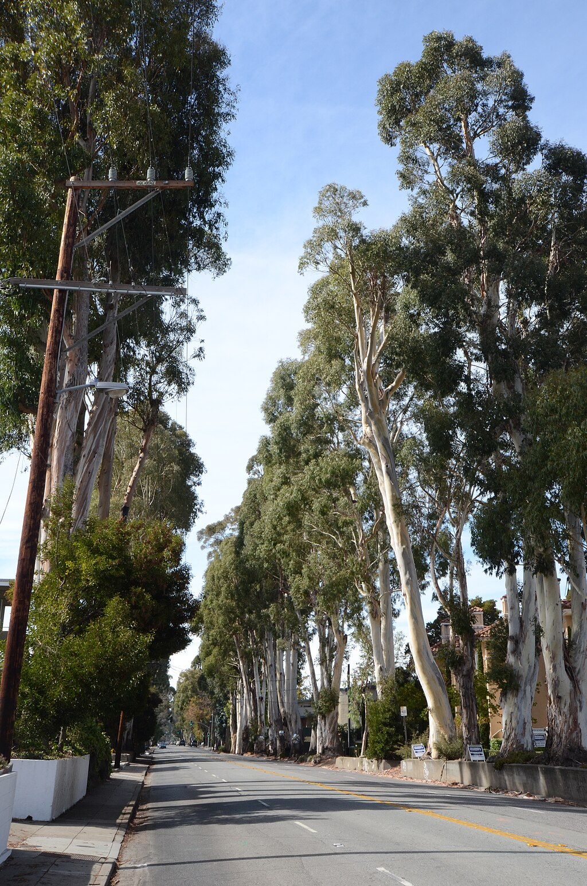The Howard-Ralston Eucalyptus Tree Rows, planted in [Burlingame, California](https://en.wikipedia.org/wiki/Burlingame,_California "Burlingame, California"), in the 1870s, are listed on the [National Register of Historic Places](https://en.wikipedia.org/wiki/National_Register_of_Historic_Places "National Register of Historic Places").

The species _[E. camaldulensis](https://en.wikipedia.org/wiki/Eucalyptus_camaldulensis "Eucalyptus camaldulensis"), [E. tereticornis](https://en.wikipedia.org/wiki/Eucalyptus_tereticornis "Eucalyptus tereticornis"),_ and _[E. cladocalyx](https://en.wikipedia.org/wiki/Eucalyptus_cladocalyx "Eucalyptus cladocalyx")_ are all present in California, but the blue gum _[E. globulus](https://en.wikipedia.org/wiki/Eucalyptus_globulus "Eucalyptus globulus")_ makes up by far the largest population in the state. One way in which the _Eucalyptus_, mainly the blue gum _[E. globulus](https://en.wikipedia.org/wiki/Eucalyptus_globulus "Eucalyptus globulus")_, proved valuable in California was in providing windbreaks for highways, orange groves, and farms in the mostly treeless [central part of the state](https://en.wikipedia.org/wiki/Central_Valley_\(California\) "Central Valley (California)"). They are also admired as shade and ornamental trees in many cities and gardens.

_Eucalyptus_ plantations in California have been criticised, because they compete with native plants and typically do not support native animals. _Eucalyptus_ has historically been planted to replace California's [coast live oak](https://en.wikipedia.org/wiki/Quercus_agrifolia "Quercus agrifolia") population, and the new _Eucalyptus_ is not as hospitable to native flora and fauna as the oaks. In appropriately foggy conditions on the California Coast, _Eucalyptus_ can spread at a rapid rate. The absence of natural inhibitors such as the [koala](https://en.wikipedia.org/wiki/Koala "Koala") or pathogens native to Australia have aided in the spread of California _Eucalyptus_ trees. This is not as big of an issue further inland, but on the coast invasive eucalypts can disrupt native ecosystems. _Eucalyptus_ may have adverse effects on local streams due to their chemical composition, and their dominance threatens species that rely on native trees. Nevertheless, some native species have been known to adapt to the _Eucalyptus_ trees. Notable examples are [herons](https://en.wikipedia.org/wiki/Heron "Heron"), [great horned owl](https://en.wikipedia.org/wiki/Great_horned_owl "Great horned owl"), and the [monarch butterfly](https://en.wikipedia.org/wiki/Monarch_butterfly "Monarch butterfly") using _Eucalyptus_ groves as habitat. Despite these successes, eucalypts generally has a net negative impact on the overall balance of the native ecosystem.

A heavy concern regarding Eucalypts in California is their status as a fire hazard. _Eucalyptus_ trees were a catalyst for the spread of the [1923 fire](https://en.wikipedia.org/wiki/1923_Berkeley,_California_fire "1923 Berkeley, California fire") in Berkeley, which destroyed 568 homes. The 1991 [Oakland Hills firestorm](https://en.wikipedia.org/wiki/Oakland_firestorm_of_1991 "Oakland firestorm of 1991"), which caused US$1.5 billion in damage, destroyed almost 3,000 homes, and killed 25 people, was partly fueled by large numbers of eucalypts close to the houses.

Despite these issues, there are calls to preserve the _Eucalyptus_ plants in California. Advocates for the tree claim its fire risk has been overstated. Some even claim that the _Eucalyptus's_ absorption of moisture makes it a barrier against fire. These experts believe that the herbicides used to remove the _Eucalyptus_ would negatively impact the ecosystem, and the loss of the trees would release carbon into the atmosphere unnecessarily. There is also an aesthetic argument for keeping the _Eucalyptus_; the trees are viewed by many as an attractive and iconic part of the California landscape. Many say that although the tree is not native, it has been in California long enough to become an essential part of the ecosystem and therefore should not be attacked as invasive. These arguments have caused experts and citizens in California, especially in the [San Francisco Bay Area](https://en.wikipedia.org/wiki/San_Francisco_Bay_Area "San Francisco Bay Area"), to debate the merits of _Eucalyptus_ removal versus preservation. However, the general consensus remains that some areas urgently require _Eucalyptus_ management to stave off potential fire hazards.

Efforts to remove some of California's _Eucalyptus_ trees have been met with a mixed reaction from the public, and there have been protests against removal. Removing _Eucalyptus_ trees can be expensive and often requires machinery or the use of herbicides. The trees struggle to reproduce on their own outside of the foggy regions of Coastal California, and therefore some inland _Eucalyptus_ forests are predicted to die out naturally. In some parts of California, eucalypt plantations are being removed and native trees and plants restored. Individuals have also illegally destroyed some trees and are suspected of introducing insect pests from Australia which attack the trees.

Certain _Eucalyptus_ species may also be grown for ornament in warmer parts of the Pacific Northwest—western [Washington](https://en.wikipedia.org/wiki/Washington_\(state\) "Washington (state)"), western [Oregon](https://en.wikipedia.org/wiki/Oregon "Oregon") and southwestern [British Columbia](https://en.wikipedia.org/wiki/British_Columbia "British Columbia").

### South America

\*\*Argentina\*\*

It was introduced in Argentina around 1870 by President [Domingo F. Sarmiento](https://en.wikipedia.org/wiki/Domingo_F._Sarmiento "Domingo F. Sarmiento"), who had brought the seeds from Australia and it quickly became very popular. The most widely planted species were _[E. globulus](https://en.wikipedia.org/wiki/Eucalyptus_globulus "Eucalyptus globulus")_, _[E. viminalis](https://en.wikipedia.org/wiki/Eucalyptus_viminalis "Eucalyptus viminalis")_ and _[E. rostrata](https://en.wikipedia.org/wiki/Eucalyptus_rostrata_\(disambiguation\) "Eucalyptus rostrata (disambiguation)")_. Currently, the [Humid Pampas](https://en.wikipedia.org/wiki/Humid_Pampas "Humid Pampas") region has small forests and _Eucalyptus_ barriers, some up to 80 years old, about 50 meters high and a maximum of one meter in diameter.

\*\*Uruguay\*\*

[Antonio Lussich](https://en.wikipedia.org/wiki/Antonio_Lussich "Antonio Lussich") introduced _Eucalyptus_ into [Uruguay](https://en.wikipedia.org/wiki/Uruguay "Uruguay") in approximately 1896, throughout what is now [Maldonado Department](https://en.wikipedia.org/wiki/Maldonado_Department "Maldonado Department"), and it has spread all over the south-eastern and eastern coast. There had been no trees in the area because it consisted of dry sand dunes and stones. Lussich also introduced many other trees, particularly _[Acacia](https://en.wikipedia.org/wiki/Acacia "Acacia")_ and [pines](https://en.wikipedia.org/wiki/Pine "Pine"), but they have not expanded so extensively.

Uruguayan forestry crops using _Eucalyptus_ species have been promoted since 1989, when the new National Forestry Law established that 20% of the national territory would be dedicated to forestry. As the main landscape of Uruguay is grassland (140,000 km2, 87% of the national territory), most of the forestry plantations would be established in prairie regions. The planting of _Eucalyptus_ sp. has been criticised because of concerns that soil would be degraded by [nutrient depletion](https://en.wikipedia.org/wiki/Nutrient_depletion "Nutrient depletion") and other biological changes. During the last ten years, in the northwestern regions of Uruguay the _Eucalyptus_ sp. plantations have reached annual forestation rates of 300%. That zone has a potential forested area of 1 million hectares, approximately 29% of the national territory dedicated to forestry, of which approximately 800,000 hectares are currently forested by monoculture of _Eucalyptus_ spp. It is expected that the radical and durable substitution of vegetation cover leads to changes in the quantity and quality of [soil organic matter](https://en.wikipedia.org/wiki/Soil_organic_matter "Soil organic matter"). Such changes may also influence [soil fertility](https://en.wikipedia.org/wiki/Soil_fertility "Soil fertility") and soil physical and chemical properties. The [soil quality](https://en.wikipedia.org/wiki/Soil_quality "Soil quality") effects associated with _Eucalyptus_ sp. plantations could have adverse effects on soil chemistry; for example: soil acidification, iron leaching, [allelopathic](https://en.wikipedia.org/wiki/Allelopathic "Allelopathic") activities and a high C:N ratio of litter. Additionally, as most scientific understanding of land cover change effects is related to ecosystems where forests were replaced by grasslands or crops, or grassland was replaced by crops, the environmental effects of the current Uruguayan land cover changes are not well understood. The first scientific publication on soil studies in western zone tree plantations (focused on pulp production) appeared in 2004 and described soil acidification and [soil carbon](https://en.wikipedia.org/wiki/Soil_carbon "Soil carbon") changes, similar to a [podzolisation](https://en.wikipedia.org/wiki/Podzolisation "Podzolisation") process, and destruction of clay (illite-like minerals), which is the main reservoir of potassium in the soil. Although these studies were carried out in an important zone for forest cultivation, they cannot define the current situation in the rest of the land area under eucalyptus cultivation. Moreover, recently Jackson and Jobbagy have proposed another adverse environmental impact that may result from _Eucalyptus_ culture on prairie soils—stream acidification.

The _Eucalyptus_ species most planted are _E. grandis_, _E. globulus_ and _[E. dunnii](https://en.wikipedia.org/wiki/Eucalyptus_dunnii "Eucalyptus dunnii")_; they are used mainly for pulp mills. Approximately 80,000 ha of _E. grandis_ situated in the departments of Rivera, Tacuarembó and Paysandú is primarily earmarked for the solid wood market, although a portion of it is used for sawlogs and plywood. The current area under commercial forest plantation is 6% of the total. The main uses of the wood produced are elemental chlorine free pulp mill production (for [cellulose](https://en.wikipedia.org/wiki/Cellulose "Cellulose") and [paper](https://en.wikipedia.org/wiki/Paper "Paper")), [sawlogs](https://en.wikipedia.org/wiki/Sawlog "Sawlog"), [plywood](https://en.wikipedia.org/wiki/Plywood "Plywood") and [bioenergy](https://en.wikipedia.org/wiki/Bioenergy "Bioenergy") ([thermoelectric](https://en.wikipedia.org/wiki/Thermoelectric "Thermoelectric") generation). Most of the products obtained from [sawmills](https://en.wikipedia.org/wiki/Sawmill "Sawmill") and [pulp mills](https://en.wikipedia.org/wiki/Pulp_mill "Pulp mill"), as well as plywood and [logs](https://en.wikipedia.org/wiki/Trunk_\(botany\) "Trunk (botany)"), are exported. This has raised the income of this sector with respect to traditional products from other sectors. Uruguayan forestry plantations have rates of growth of 30 cubic metres per hectare per year and commercial harvesting occurs after nine years.

\*\*Brazil\*\* 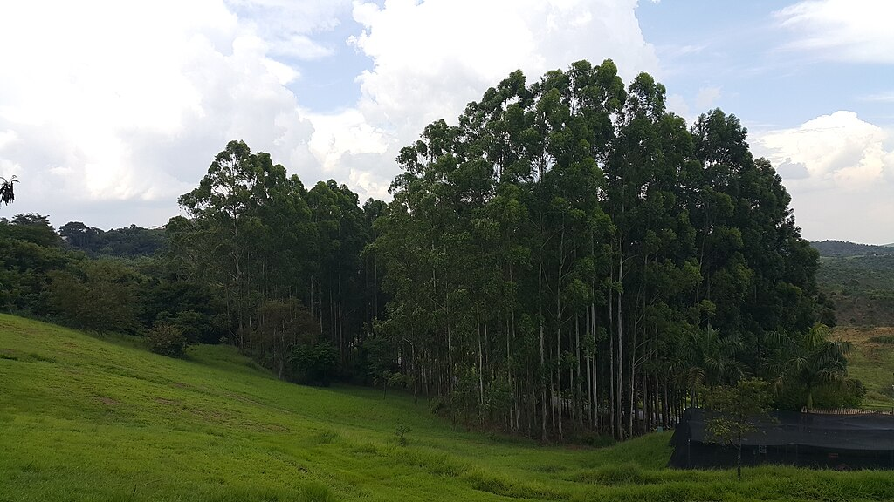A c. 13-year-old plantation, in [Taubaté](https://en.wikipedia.org/wiki/Taubaté "Taubaté"), [São Paulo](https://en.wikipedia.org/wiki/São_Paulo_\(state\) "São Paulo (state)")

Eucalypts were introduced to [Brazil](https://en.wikipedia.org/wiki/Brazil "Brazil") in 1910, for [timber](https://en.wikipedia.org/wiki/Timber "Timber") substitution and the [charcoal](https://en.wikipedia.org/wiki/Charcoal "Charcoal") industry. It has thrived in the local environment, and today there are around 7 million hectares planted. The wood is highly valued by the charcoal and pulp and paper industries. The short rotation allows a larger wood production and supplies wood for several other activities, helping to preserve the native forests from logging. When well managed, the plantation soils can sustain endless replanting. _Eucalyptus_ plantings are also used as [wind breaks](https://en.wikipedia.org/wiki/Windbreak "Windbreak"). Brazil's plantations have world-record rates of growth, typically over 40 cubic metres per hectare per year, and commercial harvesting occurs after years 5. Due to continual development and governmental funding, year-on-year growth is consistently being improved. _Eucalyptus_ can produce up to 100 cubic metres per hectare per year. Brazil has become the top exporter and producer of _Eucalyptus_ round wood and pulp, and has played an important role in developing the Australian market through the country's committed research in this area.

Modern management systems for Eucalyptus plantations often involve careful selection of initial spacing and thinning regimes, which can significantly influence both wood yield and quality. Innovative approaches, such as coppice-with-standards silvicultural systems, have also been reviewed and implemented to optimize biomass production while maintaining sustainability and flexibility in wood uses. Pruning practices in Eucalyptus grandis × Eucalyptus urophylla plantations have been shown to affect growth dynamics and wood quality, supporting their use in high-value timber, pulp, energy, and other wood-based products. The novelty of these management strategies lies in their adaptability to local conditions and market requirements, allowing for the production of wood suited for a range of uses, including bioenergy, construction, and industrial applications.

At the same time, local iron producers in Brazil rely heavily on sustainably grown _Eucalyptus_ for [charcoal](https://en.wikipedia.org/wiki/Charcoal "Charcoal"); this has greatly pushed up the price of charcoal in recent years. The plantations are generally owned and operated for national and international industry by timber asset companies such as Thomson Forestry, Greenwood Management or cellulose producers such as Aracruz Cellulose and [Stora Enso](https://en.wikipedia.org/wiki/Stora_Enso "Stora Enso").

Overall, South America was expected to produce 55% of the world's _Eucalyptus_ round-wood by 2010. Many environmental NGOs have criticised the use of exotic tree species for forestry in Latin America.

### Africa

\*\*Angola\*\*

In the East of Angola, the [Benguela railway](https://en.wikipedia.org/wiki/Benguela_railway "Benguela railway") company created eucalyptus plantations for firing its steam locomotives.

\*\*Ethiopia\*\*

Eucalypts were introduced to [Ethiopia](https://en.wikipedia.org/wiki/Ethiopia "Ethiopia") in either 1894 or 1895, either by Emperor [Menelik II](https://en.wikipedia.org/wiki/Menelik_II_of_Ethiopia "Menelik II of Ethiopia")'s French advisor [Mondon-Vidailhet](https://en.wikipedia.org/wiki/Mondon-Vidailhet "Mondon-Vidailhet") or by the Englishman Captain O'Brian. Menelik II endorsed its planting around his new capital city of [Addis Ababa](https://en.wikipedia.org/wiki/Addis_Ababa "Addis Ababa") because of the massive [deforestation](https://en.wikipedia.org/wiki/Deforestation "Deforestation") around the city for [firewood](https://en.wikipedia.org/wiki/Firewood "Firewood"). According to Richard R.K. Pankhurst, "The great advantage of the eucalypts was that they were fast growing, required little attention and when cut down grew up again from the roots; it could be harvested every ten years. The tree proved successful from the onset". Plantations of eucalypts spread from the capital to other growing urban centres such as [Debre Marqos](https://en.wikipedia.org/wiki/Debre_Marqos "Debre Marqos"). Pankhurst reports that the most common species found in Addis Ababa in the mid-1960s was _[E. globulus](https://en.wikipedia.org/wiki/Eucalyptus_globulus "Eucalyptus globulus")_, although he also found _[E. melliodora](https://en.wikipedia.org/wiki/Eucalyptus_melliodora "Eucalyptus melliodora")_ and _[E. rostrata](https://en.wikipedia.org/wiki/Eucalyptus_rostrata_\(disambiguation\) "Eucalyptus rostrata (disambiguation)")_ in significant numbers. David Buxton, writing of central Ethiopia in the mid-1940s, observed that eucalyptus trees "have become an integral -- and a pleasing -- element in the [Shoan](https://en.wikipedia.org/wiki/Shewa "Shewa") landscape and has largely displaced the slow-growing native 'cedar' (_[Juniperus procera](https://en.wikipedia.org/wiki/Juniperus_procera "Juniperus procera")_)."

It was commonly believed that the thirst of the _Eucalyptus_ "tended to dry up rivers and wells", creating such opposition to the species that in 1913 a proclamation was issued ordering a partial destruction of all standing trees, and their replacement with [mulberry](https://en.wikipedia.org/wiki/Morus_\(plant\) "Morus (plant)") trees. Pankhurst reports, "The proclamation however remained a dead letter; there is no evidence of eucalypts being uprooted, still less of mulberry trees being planted." Eucalypts remain a defining feature of Addis Ababa.

\*\*Madagascar\*\*

Much of Madagascar's original native forest has been replaced with _Eucalyptus_, threatening biodiversity by isolating remaining natural areas such as [Andasibe-Mantadia National Park](https://en.wikipedia.org/wiki/Andasibe-Mantadia_National_Park "Andasibe-Mantadia National Park").

\*\*South Africa\*\*

Numerous _Eucalyptus_ species have been introduced into [South Africa](https://en.wikipedia.org/wiki/South_Africa "South Africa"), mainly for [timber](https://en.wikipedia.org/wiki/Timber "Timber") and [firewood](https://en.wikipedia.org/wiki/Firewood "Firewood") but also for ornamental purposes. They are popular with [beekeepers](https://en.wikipedia.org/wiki/Beekeeper "Beekeeper") for the [honey](https://en.wikipedia.org/wiki/Honey "Honey") they provide. However, in South Africa they are considered invasive, with their water-sucking capabilities threatening water supplies. They also release a chemical into the surrounding soil which kills native competitors.

_Eucalyptus_ [seedlings](https://en.wikipedia.org/wiki/Seedling "Seedling") are usually unable to compete with the indigenous [grasses](https://en.wikipedia.org/wiki/Grass "Grass"), but after a fire when the grass cover has been removed, a seed-bed may be created. The following _Eucalyptus_ species have been able to become naturalised in South Africa: _[E. camaldulensis](https://en.wikipedia.org/wiki/Eucalyptus_camaldulensis "Eucalyptus camaldulensis")_, _[E. cladocalyx](https://en.wikipedia.org/wiki/Eucalyptus_cladocalyx "Eucalyptus cladocalyx")_, _[E. diversicolor](https://en.wikipedia.org/wiki/Eucalyptus_diversicolor "Eucalyptus diversicolor")_, _[E. grandis](https://en.wikipedia.org/wiki/Eucalyptus_grandis "Eucalyptus grandis")_ and _[E. lehmannii](https://en.wikipedia.org/wiki/Eucalyptus_lehmannii "Eucalyptus lehmannii")_.

\*\*Zimbabwe\*\*

As in South Africa, many _Eucalyptus_ species have been introduced into [Zimbabwe](https://en.wikipedia.org/wiki/Zimbabwe "Zimbabwe"), mainly for timber and firewood, and _[E. robusta](https://en.wikipedia.org/wiki/Eucalyptus_robusta "Eucalyptus robusta")_ and _[E. tereticornis](https://en.wikipedia.org/wiki/Eucalyptus_tereticornis "Eucalyptus tereticornis")_ have been recorded as having become naturalised there.

### Europe

#### Portugal

Eucalypts have been grown in Portugal since the mid 19th century, the first thought to be a specimen of _[E. obliqua](https://en.wikipedia.org/wiki/Eucalyptus_obliqua "Eucalyptus obliqua")_ introduced to [Vila Nova de Gaia](https://en.wikipedia.org/wiki/Vila_Nova_de_Gaia "Vila Nova de Gaia") in 1829. First as an ornamental but soon after in [plantations](https://en.wikipedia.org/wiki/Plantation "Plantation"), these eucalypts are prized due to their long and upright trunks, rapid growth and the ability to regrow after cutting. These plantations now occupy around 800,000 hectares, 10% of the country's total land area, 90% of the trees being _[E. globulus](https://en.wikipedia.org/wiki/Eucalyptus_globulus "Eucalyptus globulus")_. As of the late 20th century, there were an estimated 120 species of _Eucalyptus_ in Portugal. The genus has also been subject to various controversies. Despite representing a large part of the agricultural economy, eucalypt plantations have a negative impact on soil destruction, inducing resistance to water infiltration and increasing the risks of erosion and soil loss, they are highly flammable, aggravating the risk for wildfires. Various Portuguese laws on eucalypt plantations have been formed and reformed to better suit both sides.

There are various _Eucalyptus_ species of public interest in Portugal, namely a [Karri](https://en.wikipedia.org/wiki/Karri "Karri") in [Coimbra](https://en.wikipedia.org/wiki/Coimbra "Coimbra")'s Mata Nacional de Vale de Canas, considered to be Europe's tallest tree at 72 m (236 ft) high.

#### Italy

In [Italy](https://en.wikipedia.org/wiki/Italy "Italy"), the _Eucalyptus_ only arrived at the turn of the 19th century and large scale plantations were started at the beginning of the 20th century with the aim of drying up swampy ground to defeat malaria. During the 1930s, [Benito Mussolini](https://en.wikipedia.org/wiki/Benito_Mussolini "Benito Mussolini") had thousands of _Eucalyptus_ planted in the marshes around Rome. This, their rapid growth in the Italian climate and excellent function as windbreaks, has made them a common sight in the south of the country, including the islands of [Sardinia](https://en.wikipedia.org/wiki/Sardinia "Sardinia") and [Sicily](https://en.wikipedia.org/wiki/Sicily "Sicily"). They are also valued for the characteristic smelling and tasting [honey](https://en.wikipedia.org/wiki/Honey "Honey") that is produced from them. The variety of _Eucalyptus_ most commonly found in Italy is _[E. camaldulensis](https://en.wikipedia.org/wiki/Eucalyptus_camaldulensis "Eucalyptus camaldulensis")_.

#### Greece

In [Greece](https://en.wikipedia.org/wiki/Greece "Greece"), eucalypts are widely found, especially in southern Greece and [Crete](https://en.wikipedia.org/wiki/Crete "Crete"). They are cultivated and used for various purposes, including as an ingredient in pharmaceutical products (e.g., creams, elixirs and sprays) and for leather production. They were imported in 1862 by botanist Theodoros Georgios Orphanides. The principal species is _E. globulus_.

#### Ireland

_Eucalyptus_ has been grown in Ireland since trials in the 1930s and now grows wild in South Western Ireland in the mild climate.

### Asia

_Eucalyptus_ seeds of the species _E. globulus_ were imported into [Palestine](https://en.wikipedia.org/wiki/Palestine_\(region\) "Palestine (region)") in the 1860s, but did not acclimatise well. Later, _E. camaldulensis_ was introduced more successfully and it is still a very common tree in [Israel](https://en.wikipedia.org/wiki/Israel "Israel"). The use of _Eucalyptus_ trees to drain swampy land was a common practice in the late nineteenth and early twentieth centuries. The German Templer colony of [Sarona](https://en.wikipedia.org/wiki/Sarona_\(colony\) "Sarona (colony)") had begun planting _Eucalyptus_ for this purpose by 1874, though it is not known where the seeds came from. Many Zionist colonies also adopted the practice in the following years under the guidance of the [Mikveh Israel Agricultural School](https://en.wikipedia.org/wiki/Mikveh_Israel "Mikveh Israel"). _Eucalyptus_ trees are now considered an [invasive species](https://en.wikipedia.org/wiki/Invasive_species "Invasive species") in the region.

In India, the [Institute of Forest Genetics and Tree Breeding, Coimbatore](https://en.wikipedia.org/wiki/ICFRE#Research_Institutes_under_the_Council "ICFRE") started a _Eucalyptus_ breeding program in the 1990s. The organisation released four varieties of conventionally bred, high yielding and genetically improved clones for commercial and research interests in 2010.

_Eucalyptus_ trees were introduced to [Sri Lanka](https://en.wikipedia.org/wiki/Sri_Lanka "Sri Lanka") in the late 19th century by [tea](https://en.wikipedia.org/wiki/Tea "Tea") and [coffee](https://en.wikipedia.org/wiki/Coffee "Coffee") planters, for wind protection, shade and fuel. Forestry replanting of _Eucalyptus_ began in the 1930s in deforested mountain areas, and currently there are about 10 species present in the island. They account for 20% of major reforestation plantings. They provide [railway sleepers](https://en.wikipedia.org/wiki/Railway_sleeper "Railway sleeper"), [utility poles](https://en.wikipedia.org/wiki/Utility_pole "Utility pole"), sawn [timber](https://en.wikipedia.org/wiki/Timber "Timber") and [fuelwood](https://en.wikipedia.org/wiki/Fuelwood "Fuelwood"), but are controversial because of their adverse effect on biodiversity, hydrology and soil fertility. They are associated with another invasive species, the [eucalyptus gall wasp](https://en.wikipedia.org/wiki/Gall_wasp "Gall wasp"), _[Leptocybe](https://en.wikipedia.org/wiki/Leptocybe "Leptocybe") invasa_.

### Pacific Islands

In [Hawaii](https://en.wikipedia.org/wiki/Hawaii "Hawaii"), some 90 species of _Eucalyptus_ have been introduced to the islands, where they have displaced some native species due to their higher maximum height, fast growth and lower water needs. Particularly noticeable is the rainbow eucalyptus (_[Eucalyptus deglupta](https://en.wikipedia.org/wiki/Eucalyptus_deglupta "Eucalyptus deglupta")_), native to Indonesia and the Philippines, whose bark falls off to reveal a trunk that can be green, red, orange, yellow, pink and purple.

## Non-native _Eucalyptus_ and biodiversity

Due to similar favourable climatic conditions, _Eucalyptus_ plantations have often replaced [oak](https://en.wikipedia.org/wiki/Oak "Oak") woodlands, for example in California, Spain and Portugal. The resulting monocultures have raised concerns about loss of biological diversity, through loss of [acorns](https://en.wikipedia.org/wiki/Acorn "Acorn") that [mammals](https://en.wikipedia.org/wiki/Mammal "Mammal") and birds feed on, absence of hollows that in oak trees provide shelter and nesting sites for birds and small mammals and for bee colonies, as well as lack of downed trees in managed plantations. A study of the relationship between birds and _Eucalyptus_ in the San Francisco Bay Area found that bird diversity was similar in native forest versus _Eucalyptus_ forest, but the species were different. One way in which the avifauna (local assortment of bird species) changes is that cavity-nesting birds including woodpeckers, owls, chickadees, wood ducks, etc. are [depauperate](https://en.wikipedia.org/wiki/Depauperate "Depauperate") in _Eucalyptus_ groves because the decay-resistant wood of these trees prevents cavity formation by decay or excavation. Also, those bird species that glean insects from foliage, such as warblers and vireos, experience population declines when _Eucalyptus_ groves replace oak forest.

Birds that thrive in _Eucalyptus_ groves in California tend to prefer tall vertical habitat. These avian species include herons and egrets, which also nest in redwoods. The [Point Reyes Bird Observatory](https://en.wikipedia.org/wiki/Point_Reyes_Bird_Observatory "Point Reyes Bird Observatory") observes that sometimes short-billed birds like the [ruby-crowned kinglet](https://en.wikipedia.org/wiki/Ruby-crowned_kinglet "Ruby-crowned kinglet") are found dead beneath _Eucalyptus_ trees with their nostrils clogged with pitch.

[Monarch](https://en.wikipedia.org/wiki/Monarch_\(butterfly\) "Monarch (butterfly)") butterflies use _Eucalyptus_ in California for overwintering, but in some locations have a preference for [Monterey pines](https://en.wikipedia.org/wiki/Monterey_pine "Monterey pine").

### _Eucalyptus_ as an invasive species

_Eucalyptus_ trees are considered invasive to local ecosystems and negatively impact water resources in countries where they are introduced.

**South Africa**

In South Africa, _Eucalyptus_ tree species _E. camaldulensis_, _E. cladocalyx_, _[E. conferruminata](https://en.wikipedia.org/wiki/Eucalyptus_conferruminata "Eucalyptus conferruminata")_, _E. diversicolor_, _E. grandis_ and _E. tereticornis_ are listed as Category 1b invaders in the [National Environmental Management](https://en.wikipedia.org/wiki/National_Environmental_Management_Act,_1998 "National Environmental Management Act, 1998"): Biodiversity Act. This means most activities with regards to the species are prohibited (such as importing, propagating, translocating or trading) and it should be ensured that it does not spread beyond a plantation's domain.

_E. cladocalyx_ and _E. diversicolor_ are considered [Fynbos](https://en.wikipedia.org/wiki/Fynbos "Fynbos") invaders, and use up to 20% more water than the native fynbos vegetation; with invasive species including _Eucalyptus_ being cleared that reduce Cape Town's water resource by 55 billion litres or two months worth of water supply.

## Photo album

*   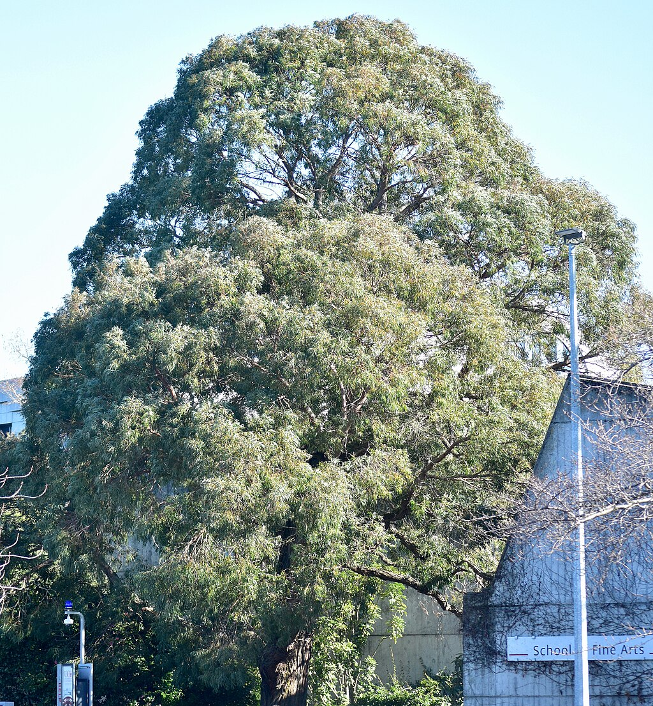

    Mature _[Eucalyptus macarthurii](https://en.wikipedia.org/wiki/Eucalyptus_macarthurii "Eucalyptus macarthurii")_, at the [University of Canterbury](https://en.wikipedia.org/wiki/University_of_Canterbury "University of Canterbury")

*   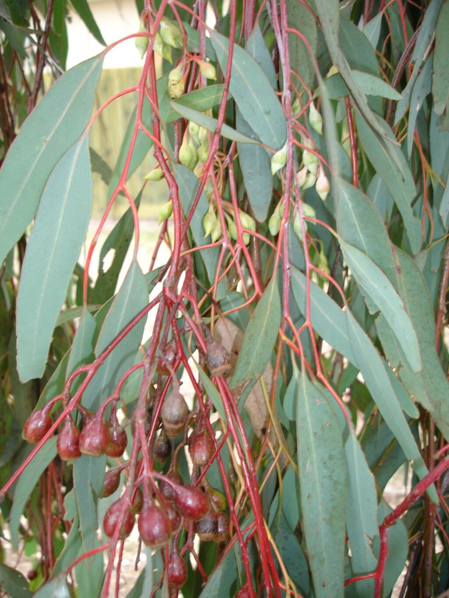

    _[Eucalyptus sideroxylon](https://en.wikipedia.org/wiki/Eucalyptus_sideroxylon "Eucalyptus sideroxylon")_, showing fruit (capsules) and buds with [operculum](https://en.wikipedia.org/wiki/Operculum_\(botany\) "Operculum (botany)") present.

*   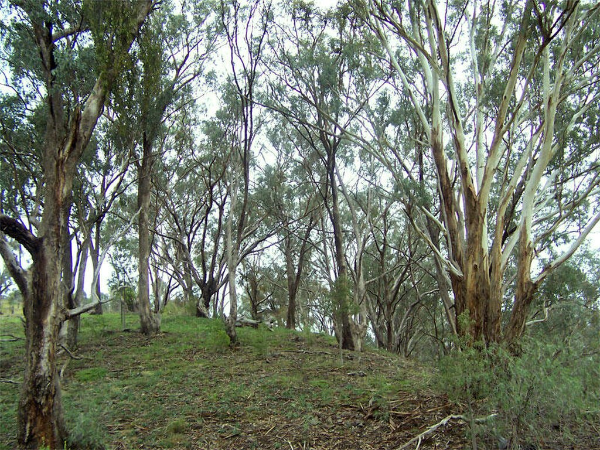

    _Eucalyptus_ forest in [East Gippsland](https://en.wikipedia.org/wiki/Shire_of_East_Gippsland "Shire of East Gippsland"), [Victoria](https://en.wikipedia.org/wiki/Victoria_\(Australia\) "Victoria (Australia)"). Mostly _E. albens_ (white box).

*   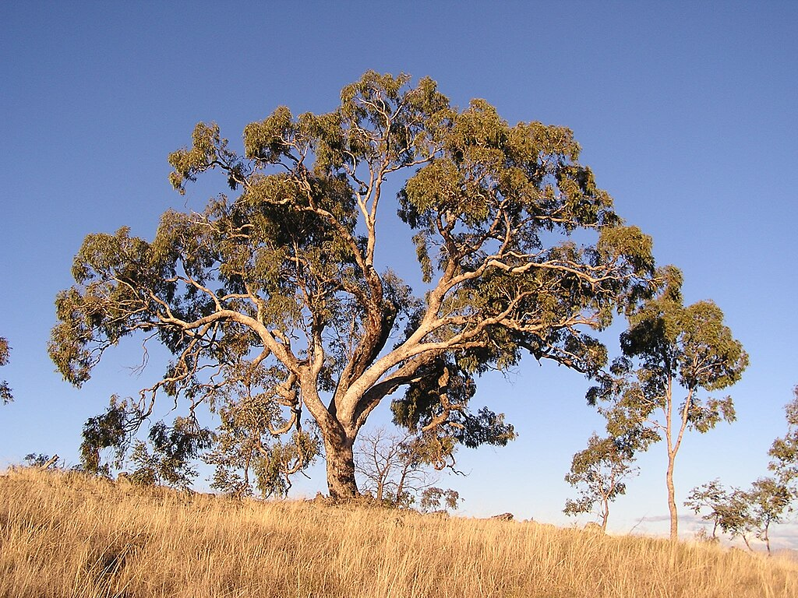

    _[E. bridgesiana](https://en.wikipedia.org/wiki/Eucalyptus_bridgesiana "Eucalyptus bridgesiana")_ (apple box) on [Red Hill, Australian Capital Territory](https://en.wikipedia.org/wiki/Red_Hill,_Australian_Capital_Territory "Red Hill, Australian Capital Territory").

*   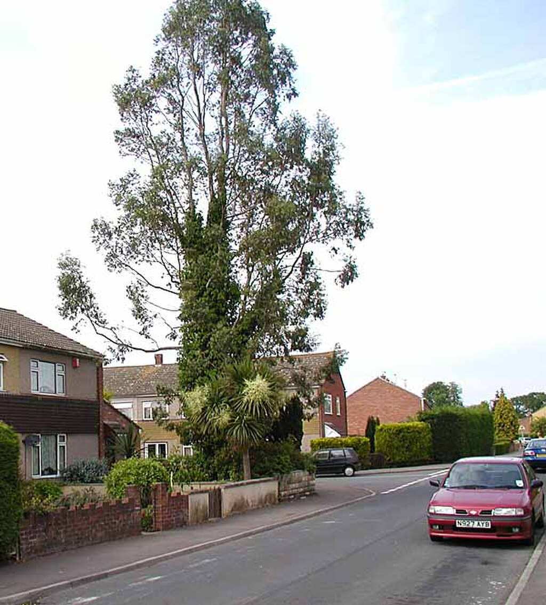

    _[E. gunnii](https://en.wikipedia.org/wiki/Eucalyptus_gunnii "Eucalyptus gunnii")_ planted in southern [England](https://en.wikipedia.org/wiki/England "England"). The lower part of the trunk is covered in [ivy](https://en.wikipedia.org/wiki/Ivy "Ivy").

*   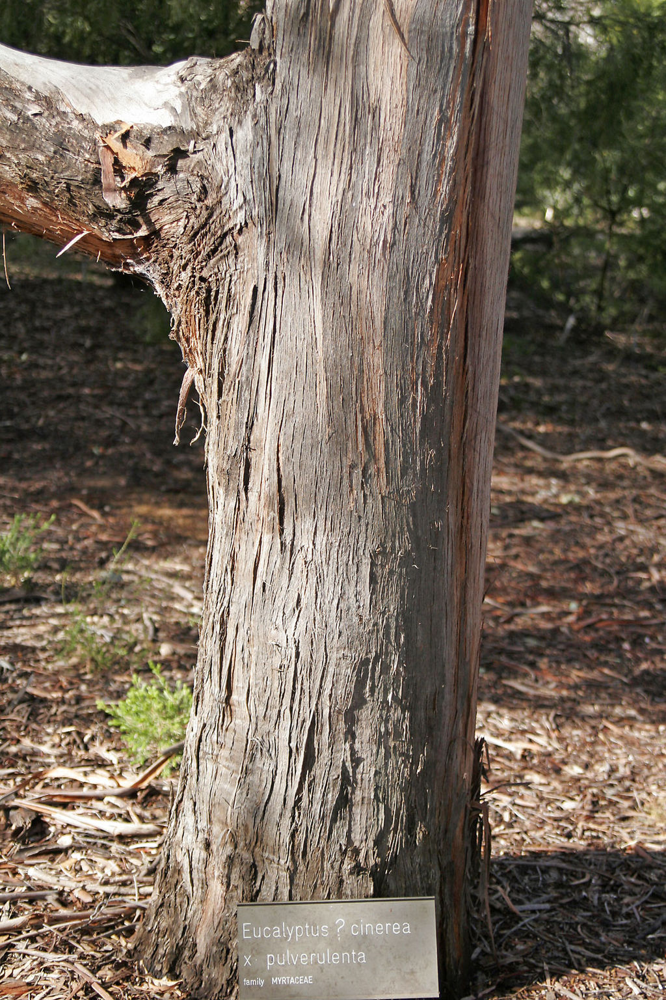

    _[Eucalyptus cinerea](https://en.wikipedia.org/wiki/Eucalyptus_cinerea "Eucalyptus cinerea")_ x _[pulverulenta](https://en.wikipedia.org/wiki/Eucalyptus_pulverulenta "Eucalyptus pulverulenta")_ - National Botanical Gardens Canberra

*   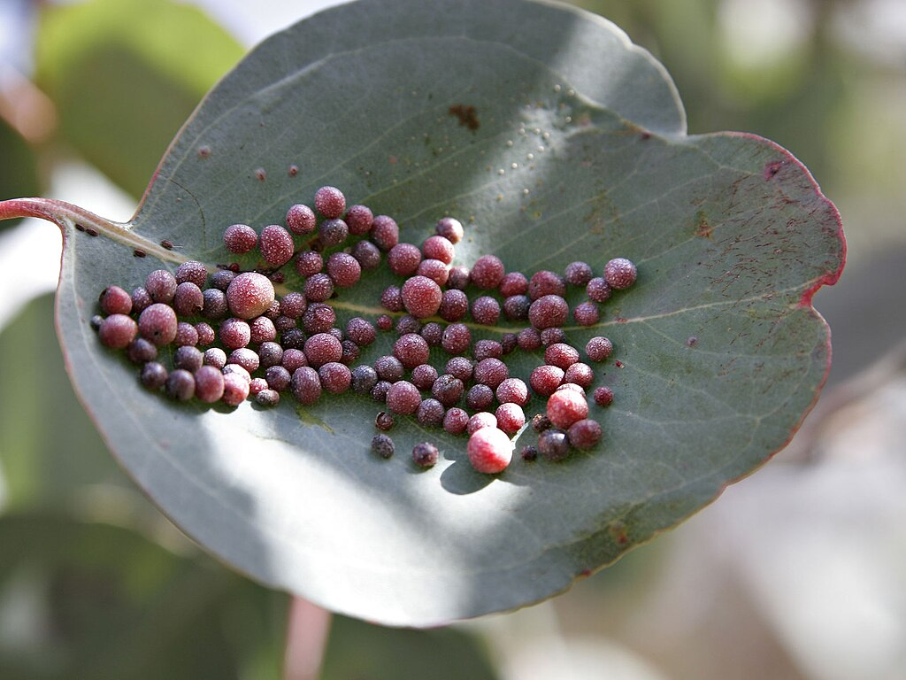

    _Eucalyptus_ gall

*   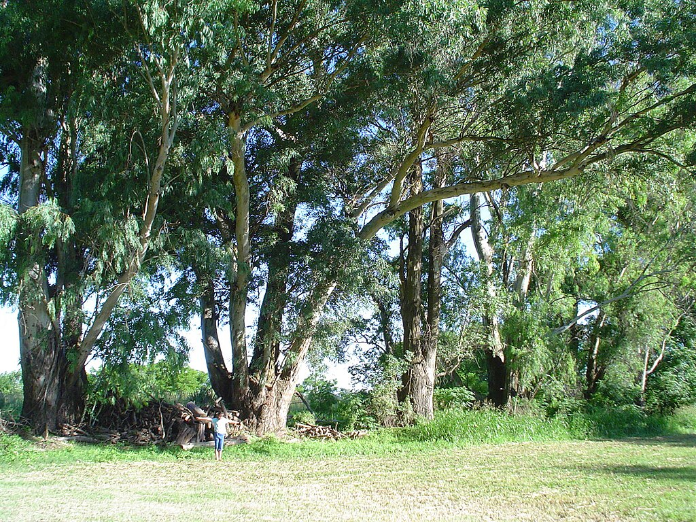

    _[E. grandis](https://en.wikipedia.org/wiki/Eucalyptus_grandis "Eucalyptus grandis")_. Province of [Buenos Aires](https://en.wikipedia.org/wiki/Buenos_Aires "Buenos Aires"), [Argentina](https://en.wikipedia.org/wiki/Argentina "Argentina").

*   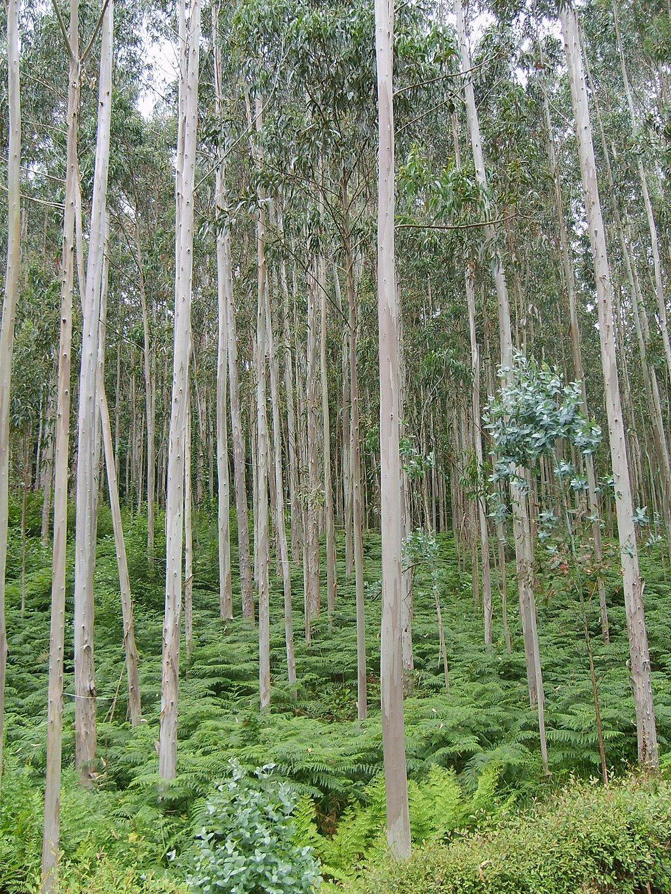

    _Eucalyptus_ plantation near [Viveiro](https://en.wikipedia.org/wiki/Viveiro "Viveiro"), in [Galicia](https://en.wikipedia.org/wiki/Galicia_\(Spain\) "Galicia (Spain)") in Northwest [Spain](https://en.wikipedia.org/wiki/Spain "Spain"). Mostly _E. globulus_

*   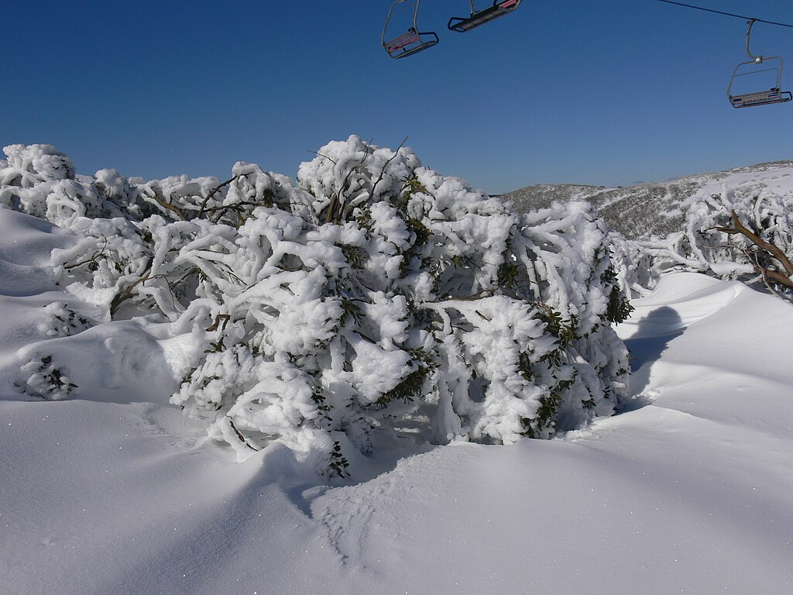

    A [snow gum](https://en.wikipedia.org/wiki/Snow_gum "Snow gum") (_E. pauciflora_), in winter in the [Australian Alps](https://en.wikipedia.org/wiki/Australian_Alps "Australian Alps")

*   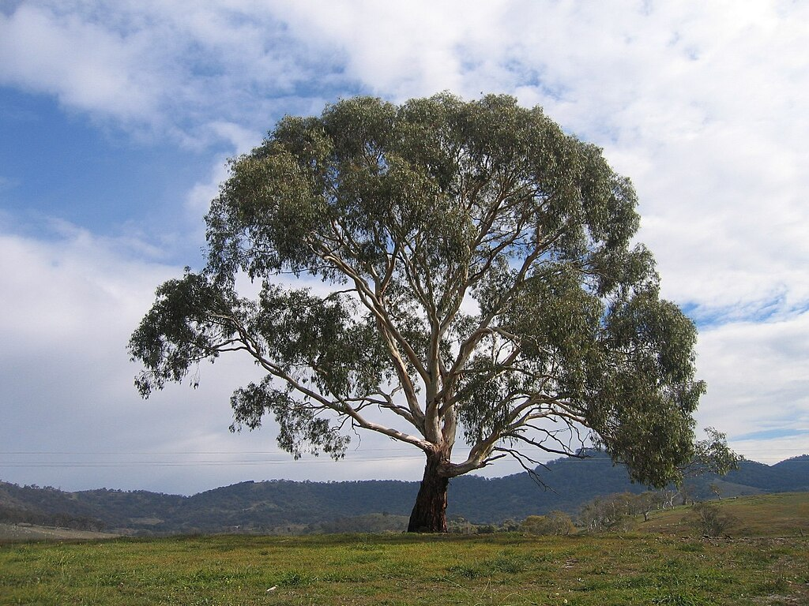

    _[E. rubida](https://en.wikipedia.org/wiki/Eucalyptus_rubida "Eucalyptus rubida")_ ([candlebark gum](https://en.wikipedia.org/wiki/Candlebark_gum "Candlebark gum")) in [Burra, New South Wales](https://en.wikipedia.org/wiki/Burra,_New_South_Wales "Burra, New South Wales").

*   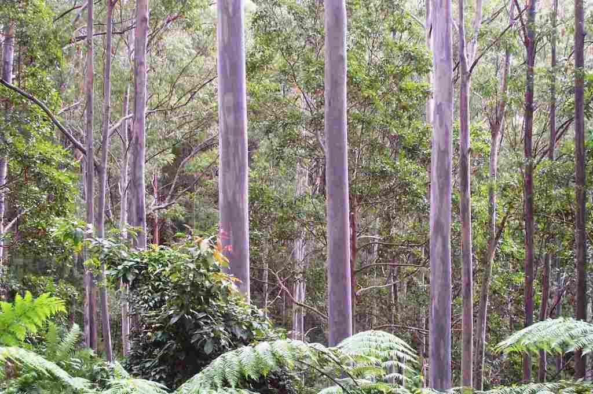

    [Sydney blue gums](https://en.wikipedia.org/wiki/Sydney_blue_gum "Sydney blue gum") west of [Port Macquarie](https://en.wikipedia.org/wiki/Port_Macquarie "Port Macquarie"), New South Wales

*   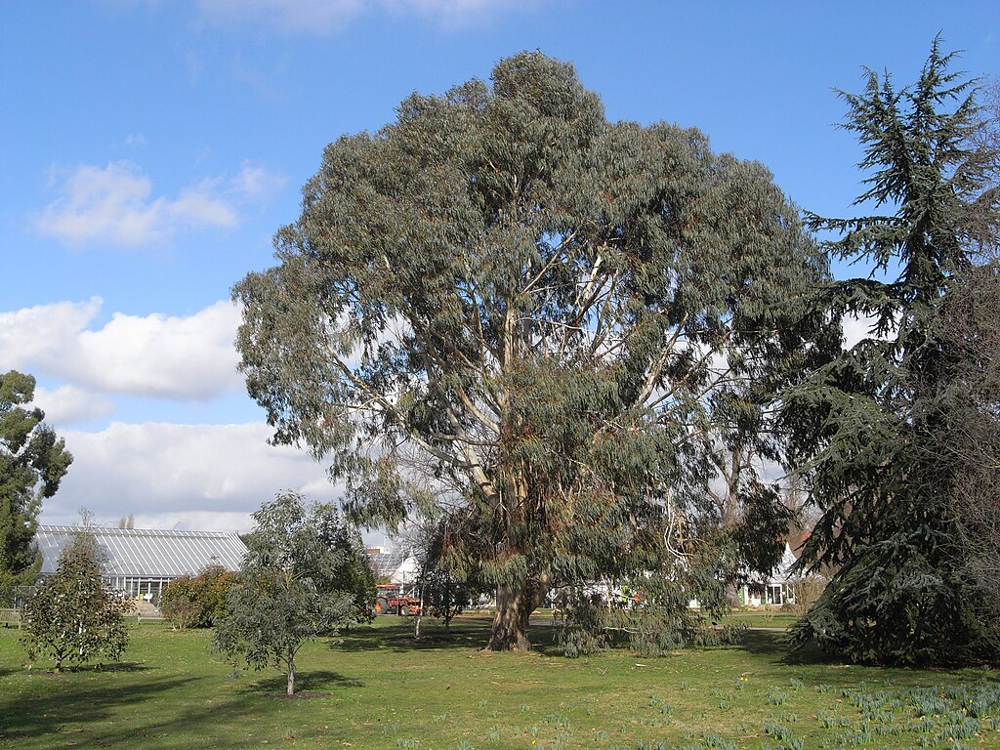

    _[Eucalyptus chapmaniana](https://en.wikipedia.org/wiki/Eucalyptus_chapmaniana "Eucalyptus chapmaniana")_ (bogong gum) in [Kew Gardens](https://en.wikipedia.org/wiki/Royal_Botanic_Gardens,_Kew "Royal Botanic Gardens, Kew"), [London](https://en.wikipedia.org/wiki/London "London")

*   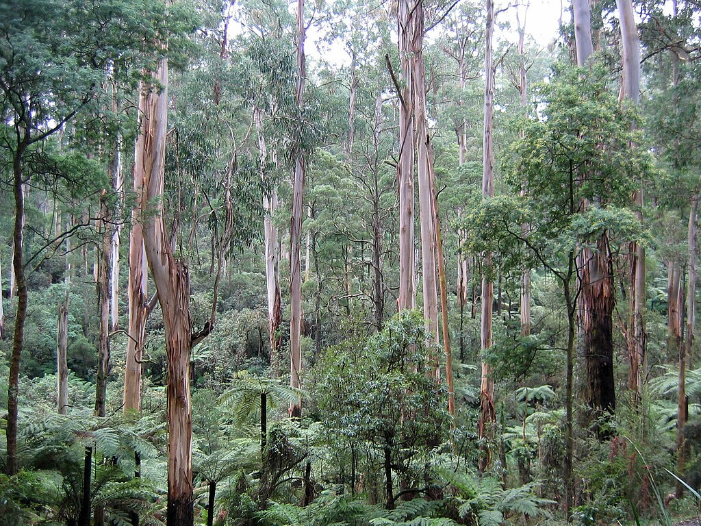

    _[E. regnans](https://en.wikipedia.org/wiki/Eucalyptus_regnans "Eucalyptus regnans")_ trees in [Sherbrooke Forest](https://en.wikipedia.org/wiki/Sherbrooke_Forest "Sherbrooke Forest"), [Victoria](https://en.wikipedia.org/wiki/Victoria_\(Australia\) "Victoria (Australia)")

*   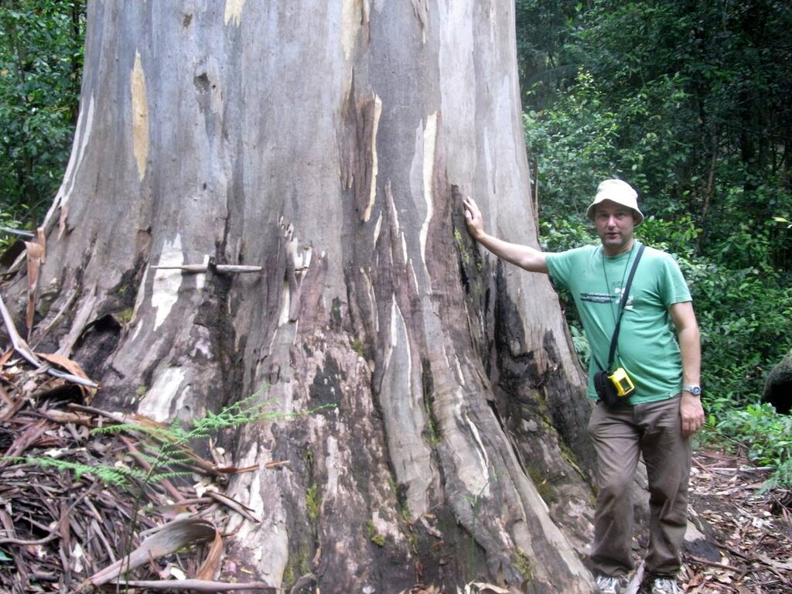

    _[E. deanei](https://en.wikipedia.org/wiki/Eucalyptus_deanei "Eucalyptus deanei")_, [Blue Mountains National Park](https://en.wikipedia.org/wiki/Blue_Mountains_National_Park "Blue Mountains National Park"), [Australia](https://en.wikipedia.org/wiki/Australia "Australia")

*   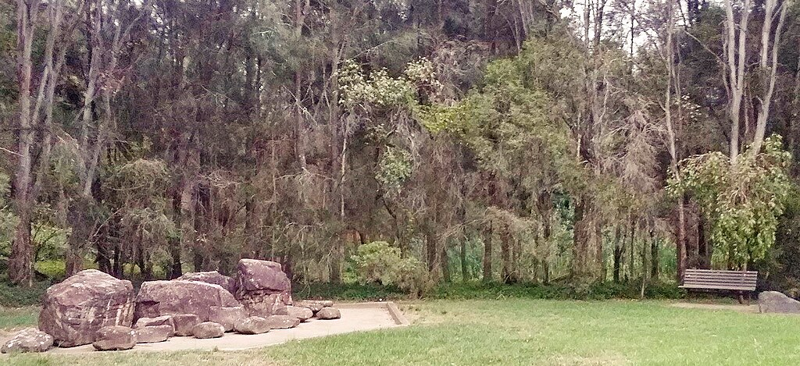

    Eucalypt woodland area near [Prospect Creek](https://en.wikipedia.org/wiki/Prospect_Creek_\(New_South_Wales\) "Prospect Creek (New South Wales)") in western [Sydney](https://en.wikipedia.org/wiki/Sydney "Sydney"). Mostly _[E. amplifolia](https://en.wikipedia.org/wiki/Eucalyptus_amplifolia "Eucalyptus amplifolia")_ and _[E. tereticornis](https://en.wikipedia.org/wiki/Eucalyptus_tereticornis "Eucalyptus tereticornis")_.
