Flowering plant

Temporal range:

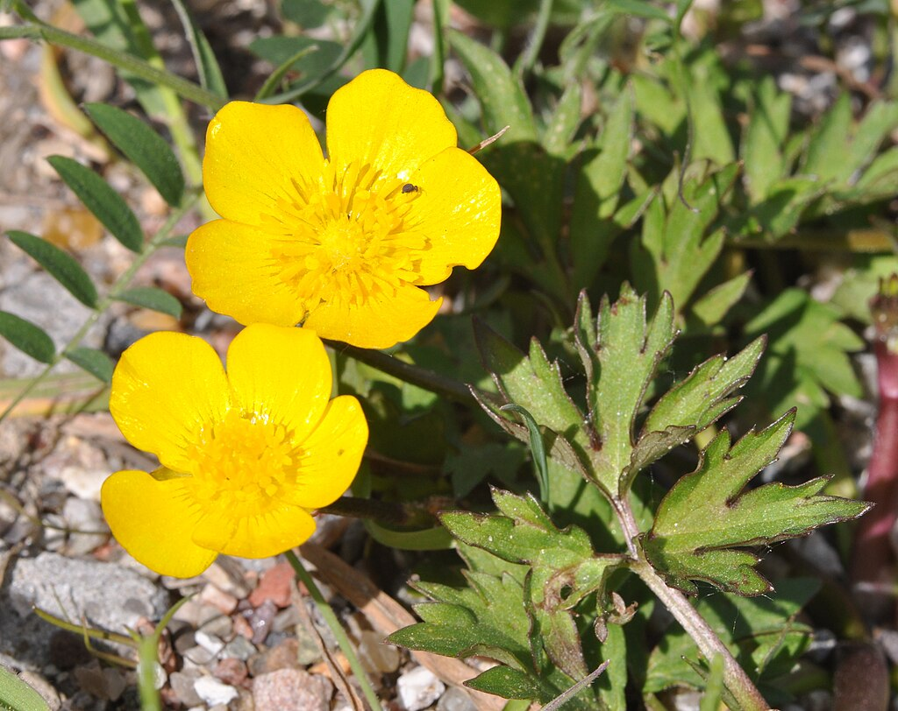

Terrestrial: [buttercup](https://en.wikipedia.org/wiki/Ranunculaceae "Ranunculaceae")

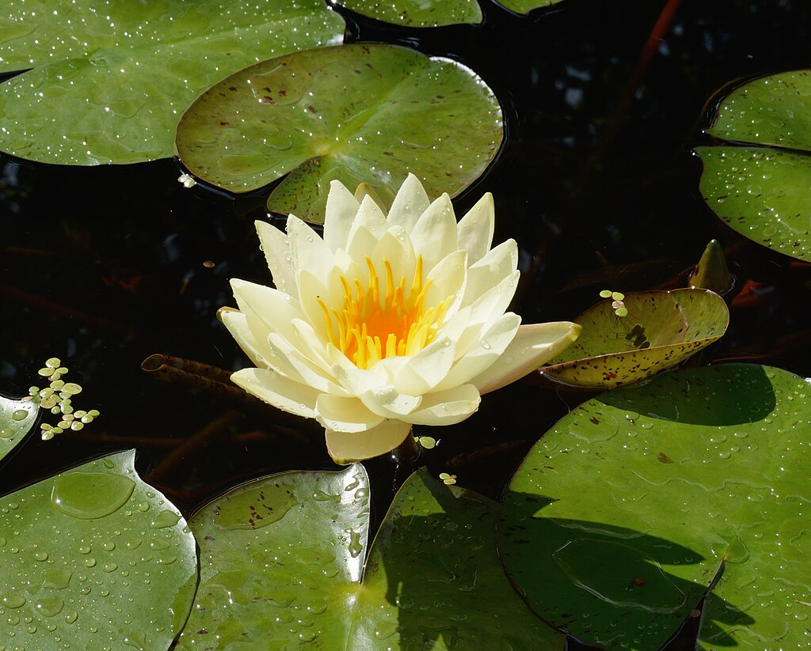

Aquatic: [water lily](https://en.wikipedia.org/wiki/Nymphaeaceae "Nymphaeaceae")

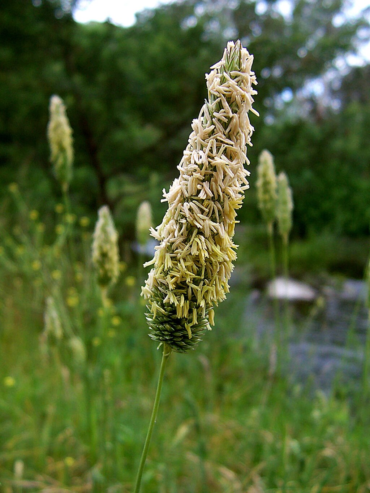

Wind-pollinated: [grass](https://en.wikipedia.org/wiki/Poaceae "Poaceae")

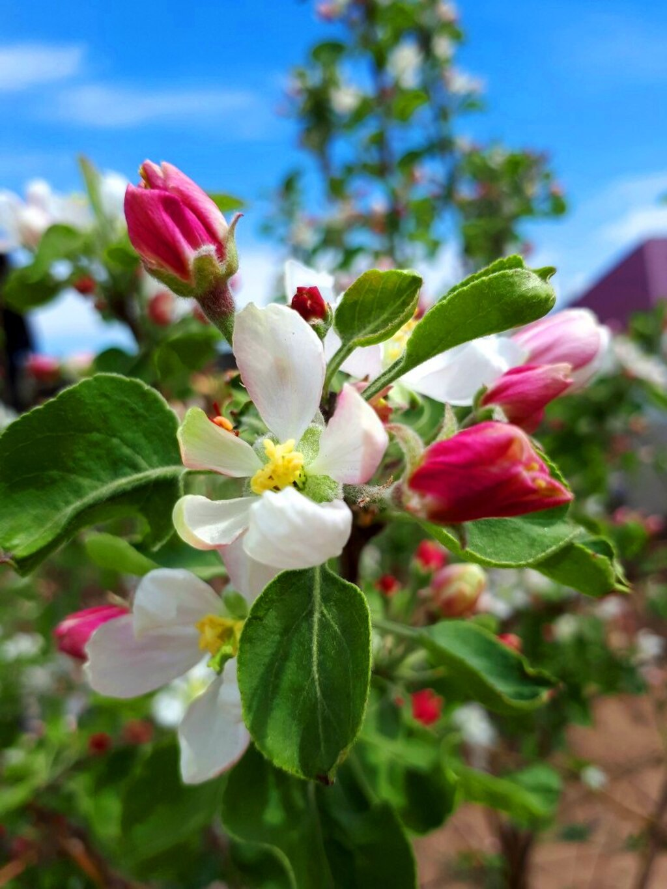

Insect-pollinated: [apple](https://en.wikipedia.org/wiki/Rosaceae "Rosaceae")

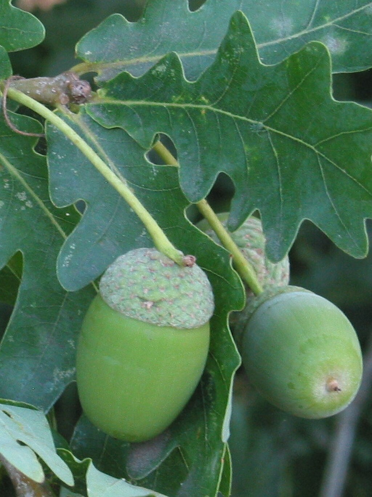

Tree: [oak](https://en.wikipedia.org/wiki/Quercus "Quercus")

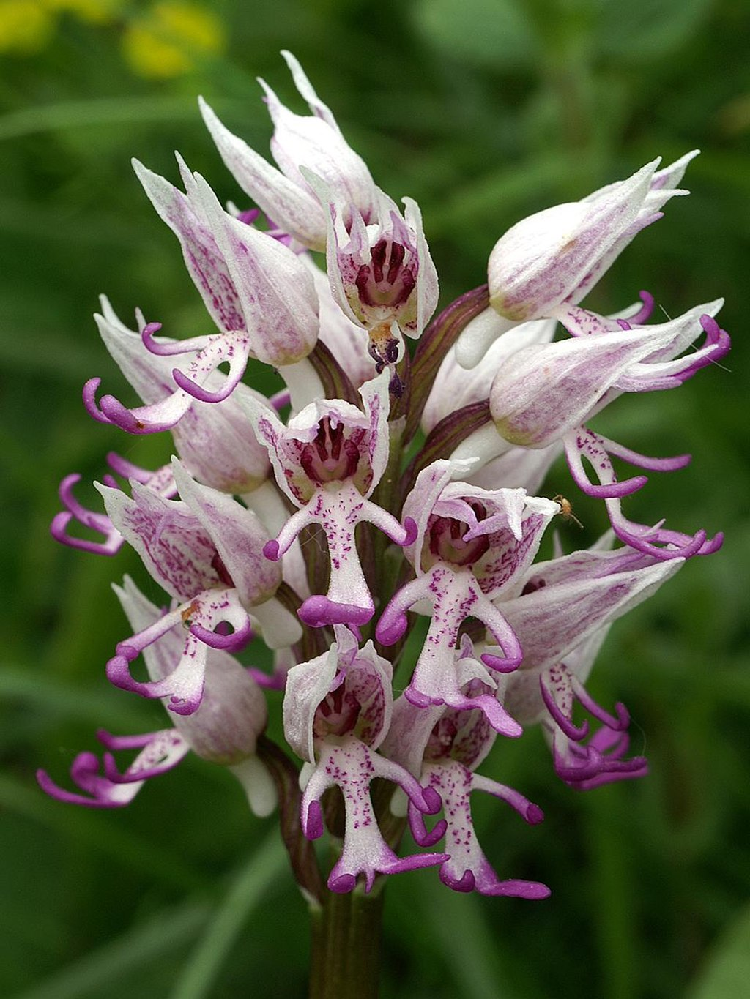

Forb: [orchid](https://en.wikipedia.org/wiki/Orchid "Orchid")

Diversity of angiosperms

[Scientific classification](https://en.wikipedia.org/wiki/Taxonomy_\(biology\) "Taxonomy (biology)") 

Kingdom:

[Plantae](https://en.wikipedia.org/wiki/Plant "Plant")

_Clade_:

[Tracheophytes](https://en.wikipedia.org/wiki/Vascular_plant "Vascular plant")

_Clade_:

[Spermatophytes](https://en.wikipedia.org/wiki/Seed_plant "Seed plant")

_Clade_:

[Angiosperms](/source/flowering-plant/)

Groups (APG IV)

[Basal angiosperms](https://en.wikipedia.org/wiki/Basal_angiosperms "Basal angiosperms")

*   [Amborellales](https://en.wikipedia.org/wiki/Amborellales "Amborellales")
*   [Nymphaeales](https://en.wikipedia.org/wiki/Nymphaeales "Nymphaeales")
*   [Austrobaileyales](https://en.wikipedia.org/wiki/Austrobaileyales "Austrobaileyales")

[Core angiosperms](https://en.wikipedia.org/wiki/Core_angiosperms "Core angiosperms")

*   Unranked clades
    *   [Magnoliids](https://en.wikipedia.org/wiki/Magnoliids "Magnoliids")
    *   [Monocots](https://en.wikipedia.org/wiki/Monocots "Monocots")
    *   [Eudicots](https://en.wikipedia.org/wiki/Eudicots "Eudicots")
*   Orders
    *   [Chloranthales](https://en.wikipedia.org/wiki/Chloranthales "Chloranthales")
    *   [Ceratophyllales](https://en.wikipedia.org/wiki/Ceratophyllales "Ceratophyllales")

[Synonyms](https://en.wikipedia.org/wiki/Synonym_\(taxonomy\) "Synonym (taxonomy)")

*   Anthophyta Cronquist
*   Angiospermae [Lindl.](https://en.wikipedia.org/wiki/John_Lindley "John Lindley")
*   Magnoliophyta [Cronquist](https://en.wikipedia.org/wiki/Arthur_J._Cronquist "Arthur J. Cronquist"), [Takht.](https://en.wikipedia.org/wiki/Takht. "Takht.") & [W.Zimm.](https://en.wikipedia.org/wiki/W.Zimm. "W.Zimm.")
*   Magnolicae Takht.

**Flowering plants** are [plants](https://en.wikipedia.org/wiki/Plant "Plant") that bear [flowers](https://en.wikipedia.org/wiki/Flowers "Flowers") and [fruits](https://en.wikipedia.org/wiki/Fruit "Fruit"), and form the [clade](https://en.wikipedia.org/wiki/Clade "Clade") **Angiospermae** ([/ˌændʒiəˈspɜːrmiː/](https://en.wikipedia.org/wiki/Help:IPA/English "Help:IPA/English")). The term **angiosperm** is derived from the [Greek](https://en.wikipedia.org/wiki/Ancient_Greek "Ancient Greek") words ἀγγεῖον (_angeion_; 'container, vessel') and σπέρμα (_sperma_; 'seed'), meaning that the [seeds](https://en.wikipedia.org/wiki/Seed "Seed") are enclosed within a fruit. The group was formerly called **Magnoliophyta**.

Angiosperms are by far the most diverse group of [land plants](https://en.wikipedia.org/wiki/Embryophyte "Embryophyte") with 64 [orders](https://en.wikipedia.org/wiki/Order_\(biology\) "Order (biology)"), 416 [families](https://en.wikipedia.org/wiki/Family_\(biology\) "Family (biology)"), approximately 13,000 known [genera](https://en.wikipedia.org/wiki/Genus "Genus") and 300,000 known [species](https://en.wikipedia.org/wiki/Species "Species"). They include all [forbs](https://en.wikipedia.org/wiki/Forb "Forb") (flowering plants without a [woody](https://en.wikipedia.org/wiki/Wood "Wood") [stem](https://en.wikipedia.org/wiki/Plant_stem "Plant stem")), [grasses](https://en.wikipedia.org/wiki/Grass "Grass") and grass-like plants, a vast majority of [broad-leaved trees](https://en.wikipedia.org/wiki/Broad-leaved_tree "Broad-leaved tree"), [shrubs](https://en.wikipedia.org/wiki/Shrub "Shrub") and [vines](https://en.wikipedia.org/wiki/Vine "Vine"), and most [aquatic plants](https://en.wikipedia.org/wiki/Aquatic_plant "Aquatic plant"). Angiosperms are distinguished from the other major [seed plant](https://en.wikipedia.org/wiki/Seed_plant "Seed plant") clade, the [gymnosperms](https://en.wikipedia.org/wiki/Gymnosperm "Gymnosperm"), by having [flowers](https://en.wikipedia.org/wiki/Flower "Flower"), [xylem](https://en.wikipedia.org/wiki/Xylem "Xylem") consisting of [vessel elements](https://en.wikipedia.org/wiki/Vessel_element "Vessel element") instead of [tracheids](https://en.wikipedia.org/wiki/Tracheids "Tracheids"), [endosperm](https://en.wikipedia.org/wiki/Endosperm "Endosperm") within their seeds, and fruits that completely envelop the seeds. The ancestors of flowering plants diverged from the common ancestor of all living gymnosperms before the end of the [Carboniferous](https://en.wikipedia.org/wiki/Carboniferous "Carboniferous"), over 300 million years ago. In the [Cretaceous](https://en.wikipedia.org/wiki/Cretaceous "Cretaceous"), angiosperms [diversified explosively](https://en.wikipedia.org/wiki/Cretaceous_Terrestrial_Revolution "Cretaceous Terrestrial Revolution"), becoming the dominant group of plants across the planet.

[Agriculture](https://en.wikipedia.org/wiki/Agriculture "Agriculture") is almost entirely dependent on angiosperms, and a small number of flowering plant families supply nearly all plant-based [food](https://en.wikipedia.org/wiki/Food "Food") and [livestock](https://en.wikipedia.org/wiki/Livestock "Livestock") feed. [Rice](https://en.wikipedia.org/wiki/Rice "Rice"), [maize](https://en.wikipedia.org/wiki/Maize "Maize") and [wheat](https://en.wikipedia.org/wiki/Wheat "Wheat") provide half of the world's [staple](https://en.wikipedia.org/wiki/Staple_food "Staple food") [calorie](https://en.wikipedia.org/wiki/Calorie "Calorie") intake, and all three plants are [cereals](https://en.wikipedia.org/wiki/Cereal "Cereal") from the [Poaceae](https://en.wikipedia.org/wiki/Poaceae "Poaceae") family (colloquially known as grasses). Other families provide important industrial [plant products](https://en.wikipedia.org/wiki/Plant_product "Plant product") such as [wood](https://en.wikipedia.org/wiki/Wood "Wood"), [paper](https://en.wikipedia.org/wiki/Paper "Paper") and [cotton](https://en.wikipedia.org/wiki/Cotton "Cotton"), and supply numerous ingredients for [drinks](https://en.wikipedia.org/wiki/Drink "Drink"), [sugar production](https://en.wikipedia.org/wiki/Sugar_production "Sugar production"), [traditional medicine](https://en.wikipedia.org/wiki/Traditional_medicine "Traditional medicine") and modern [pharmaceuticals](https://en.wikipedia.org/wiki/Pharmaceutical "Pharmaceutical"). Flowering plants are commonly grown for [decorative purposes](https://en.wikipedia.org/wiki/Ornamental_plant "Ornamental plant"), with certain flowers playing significant cultural roles in many societies. Many flowering plants are threatened by [habitat destruction](https://en.wikipedia.org/wiki/Habitat_destruction "Habitat destruction") and [by climate change](https://en.wikipedia.org/wiki/Effects_of_climate_change_on_plant_biodiversity "Effects of climate change on plant biodiversity").

## Distinguishing features

Angiosperms are terrestrial vascular plants; like the gymnosperms, they have [roots](https://en.wikipedia.org/wiki/Root "Root"), [stems](https://en.wikipedia.org/wiki/Plant_stem "Plant stem"), [leaves](https://en.wikipedia.org/wiki/Leaves "Leaves"), and [seeds](https://en.wikipedia.org/wiki/Seed "Seed"). They differ from other [seed plants](https://en.wikipedia.org/wiki/Spermatophyte "Spermatophyte") in several ways.

FeatureDescriptionImage

[Flowers](https://en.wikipedia.org/wiki/Flower "Flower")

The [reproductive organs](https://en.wikipedia.org/wiki/Reproductive_organ "Reproductive organ") of flowering plants, not found in any other [seed plants](https://en.wikipedia.org/wiki/Seed_plants "Seed plants").

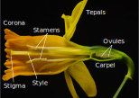A _[Narcissus](https://en.wikipedia.org/wiki/Narcissus_\(plant\) "Narcissus (plant)")_ flower in section. [Petals](https://en.wikipedia.org/wiki/Petal "Petal") and [sepals](https://en.wikipedia.org/wiki/Sepal "Sepal") are replaced here by a fused tube, the corona, and tepals.

Reduced [gametophytes](https://en.wikipedia.org/wiki/Gametophyte#Seed_plants "Gametophyte"), three [cells](https://en.wikipedia.org/wiki/Cell_\(biology\) "Cell (biology)") in male, seven cells with eight nuclei in female (except for basal angiosperms)

The gametophytes are smaller than those of gymnosperms. The smaller size of the [pollen](https://en.wikipedia.org/wiki/Pollen "Pollen") reduces the time between pollination and [fertilization](https://en.wikipedia.org/wiki/Fertilization "Fertilization"), which in gymnosperms is up to a year.

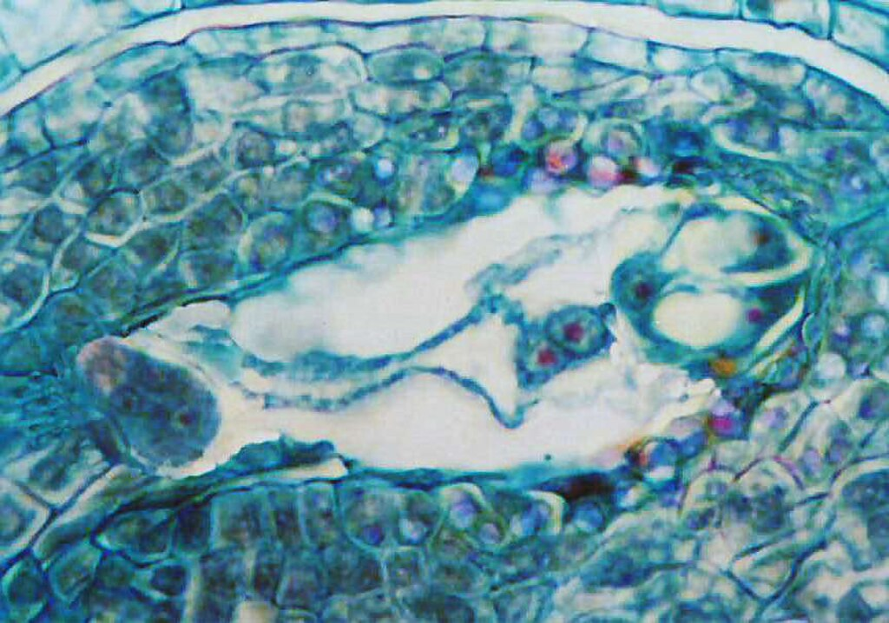[Embryo sac](https://en.wikipedia.org/wiki/Embryo_sac "Embryo sac") is a reduced female [gametophyte](https://en.wikipedia.org/wiki/Gametophyte "Gametophyte").

[Endosperm](https://en.wikipedia.org/wiki/Endosperm "Endosperm")

Endosperm forms after fertilization but before the [zygote](https://en.wikipedia.org/wiki/Zygote "Zygote") divides. It provides food for the developing [embryo](https://en.wikipedia.org/wiki/Embryo "Embryo"), the [cotyledons](https://en.wikipedia.org/wiki/Cotyledon "Cotyledon"), and sometimes the [seedling](https://en.wikipedia.org/wiki/Seedling "Seedling").

Closed [carpel](https://en.wikipedia.org/wiki/Carpel "Carpel") enclosing the [ovules](https://en.wikipedia.org/wiki/Ovule "Ovule").

Once the ovules are fertilised, the carpels, often with surrounding tissues, develop into fruits. Gymnosperms have unenclosed seeds.

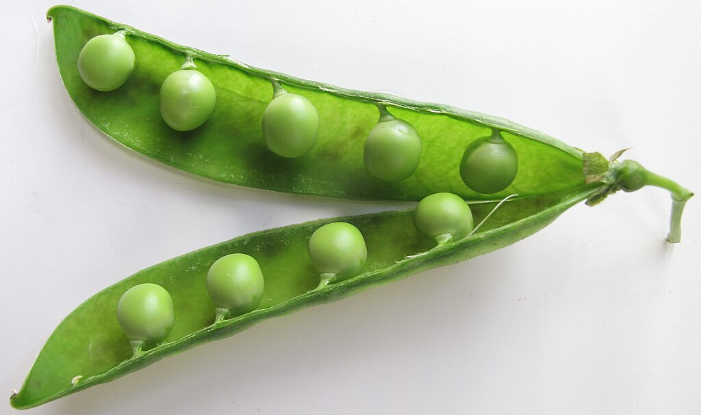Peas (seeds, from ovules) inside pod (fruit, from fertilised carpel).

[Xylem](https://en.wikipedia.org/wiki/Xylem "Xylem") made of [vessel elements](https://en.wikipedia.org/wiki/Vessel_element "Vessel element")

Open vessel elements are stacked end to end to form continuous tubes, whereas gymnosperm xylem is made of tapered [tracheids](https://en.wikipedia.org/wiki/Tracheids "Tracheids") connected by small [pits](https://en.wikipedia.org/wiki/Pit_\(botany\) "Pit (botany)").

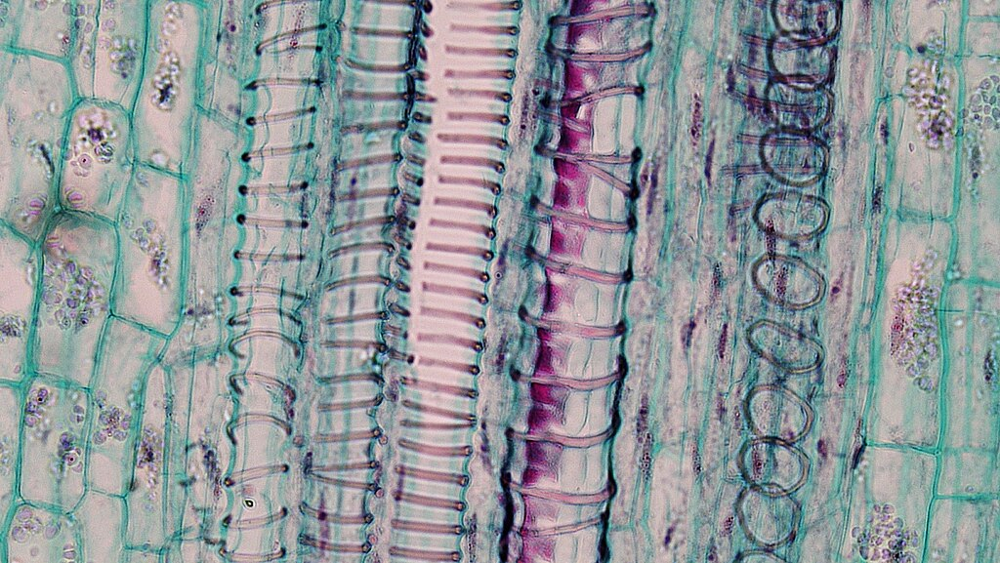 [Xylem](https://en.wikipedia.org/wiki/Xylem "Xylem") vessels (long tubes).

## Diversity

### Ecological diversity

*   Largest and smallest
*   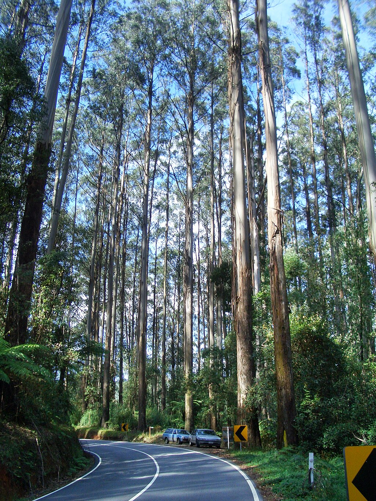

    _[Eucalyptus regnans](https://en.wikipedia.org/wiki/Eucalyptus_regnans "Eucalyptus regnans")_,
    a tree almost 100 m tall

*   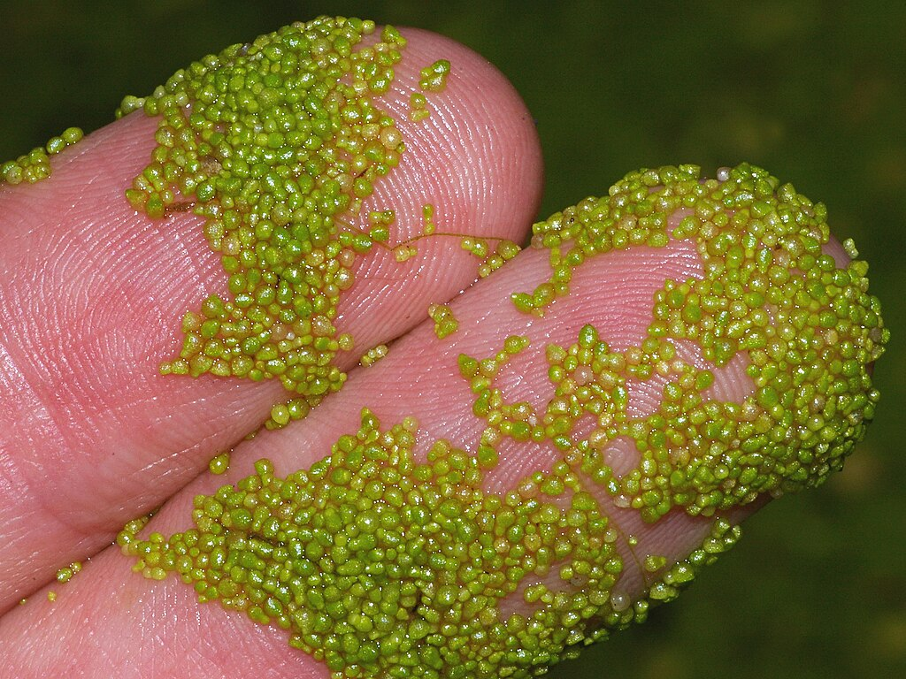

    _[Wolffia arrhiza](https://en.wikipedia.org/wiki/Wolffia_arrhiza "Wolffia arrhiza")_, a rootless floating freshwater plant under 2 mm across

The largest angiosperms are _[Eucalyptus](/source/eucalyptus/ "Eucalyptus")_ gum trees of Australia, and _[Shorea faguetiana](https://en.wikipedia.org/wiki/Shorea_faguetiana "Shorea faguetiana")_, dipterocarp rainforest trees of Southeast Asia, both of which can reach almost 100 metres (330 ft) in height. The smallest are _[Wolffia](https://en.wikipedia.org/wiki/Wolffia "Wolffia")_ duckweeds which float on freshwater, each plant less than 2 millimetres (0.08 in) across.

*   Photosynthetic and parasitic
*   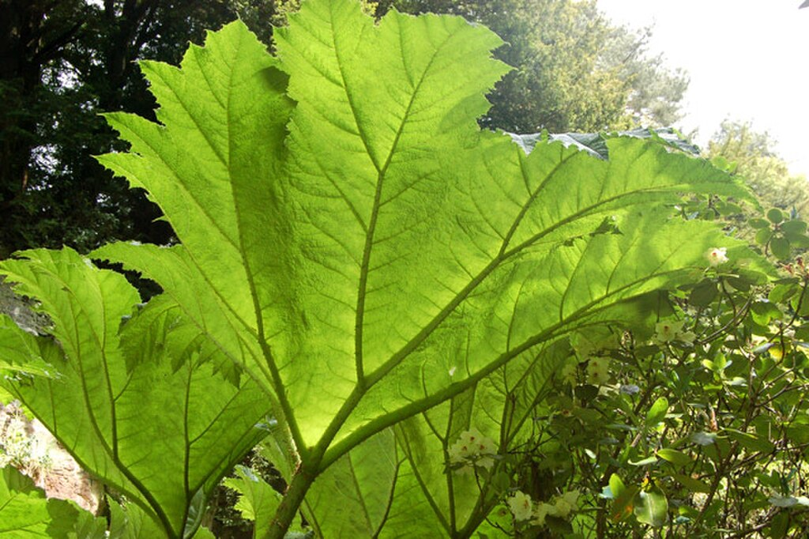

    _[Gunnera](https://en.wikipedia.org/wiki/Gunnera "Gunnera")_ captures sunlight for [photosynthesis](https://en.wikipedia.org/wiki/Photosynthesis "Photosynthesis") over the large surfaces of its leaves, which are supported by strong veins.

*   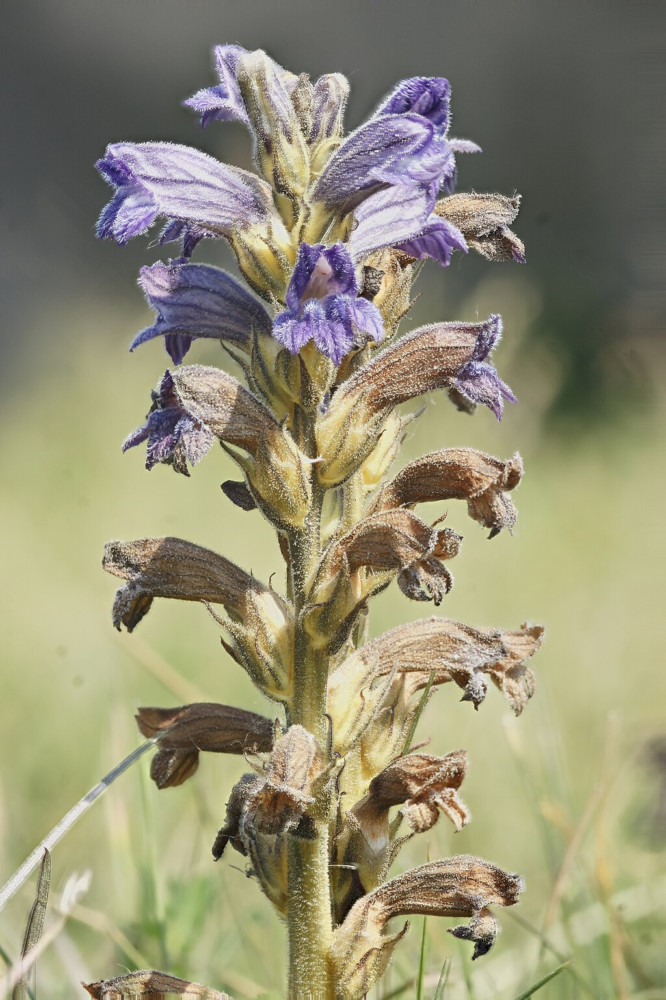

    _[Orobanche purpurea](https://en.wikipedia.org/wiki/Orobanche "Orobanche")_, a [parasitic](https://en.wikipedia.org/wiki/Parasitism "Parasitism") broomrape with no leaves, obtains all its food from other plants.

Considering their method of obtaining energy, some 99% of flowering plants are [photosynthetic](https://en.wikipedia.org/wiki/Photosynthetic "Photosynthetic") [autotrophs](https://en.wikipedia.org/wiki/Autotroph "Autotroph"), deriving their energy from sunlight and using it to create molecules such as [sugars](https://en.wikipedia.org/wiki/Sugar "Sugar"). The remainder are [parasitic](https://en.wikipedia.org/wiki/Parasitic "Parasitic"), whether [on fungi](https://en.wikipedia.org/wiki/Myco-heterotrophy "Myco-heterotrophy") (myco-heterotrophic, formerly thought to be [saprophytic](https://en.wikipedia.org/wiki/Saprophytic "Saprophytic")) like the [orchids](https://en.wikipedia.org/wiki/Orchids "Orchids") for part or all of their life-cycle, or [on other plants](https://en.wikipedia.org/wiki/Parasitic_plant "Parasitic plant"), either wholly like the broomrapes, _[Orobanche](https://en.wikipedia.org/wiki/Orobanche "Orobanche")_, or partially like the witchweeds, _[Striga](https://en.wikipedia.org/wiki/Striga "Striga")_.

*   Hot, cold, wet, dry, fresh, salt
*   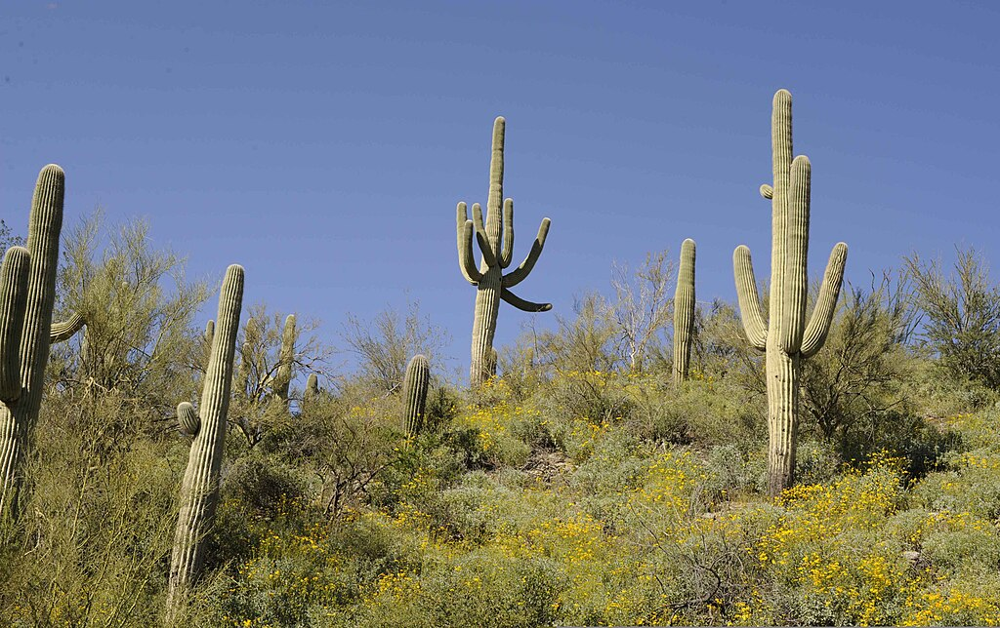

    _[Carnegiea gigantea](https://en.wikipedia.org/wiki/Carnegiea_gigantea "Carnegiea gigantea")_, the saguaro cactus, grows in hot dry [deserts](https://en.wikipedia.org/wiki/Desert "Desert") in Mexico and the southern United States.

*   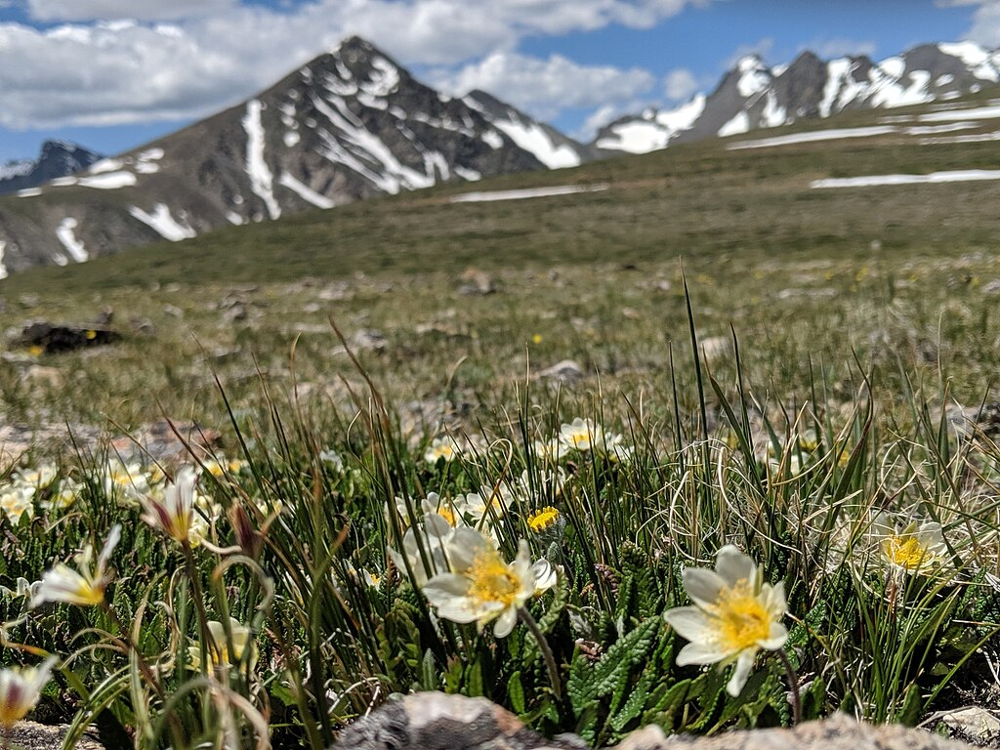

    _[Dryas octopetala](https://en.wikipedia.org/wiki/Dryas_octopetala "Dryas octopetala")_, the mountain avens, lives in cold arctic and montane habitats in the far north of America and Eurasia.

*   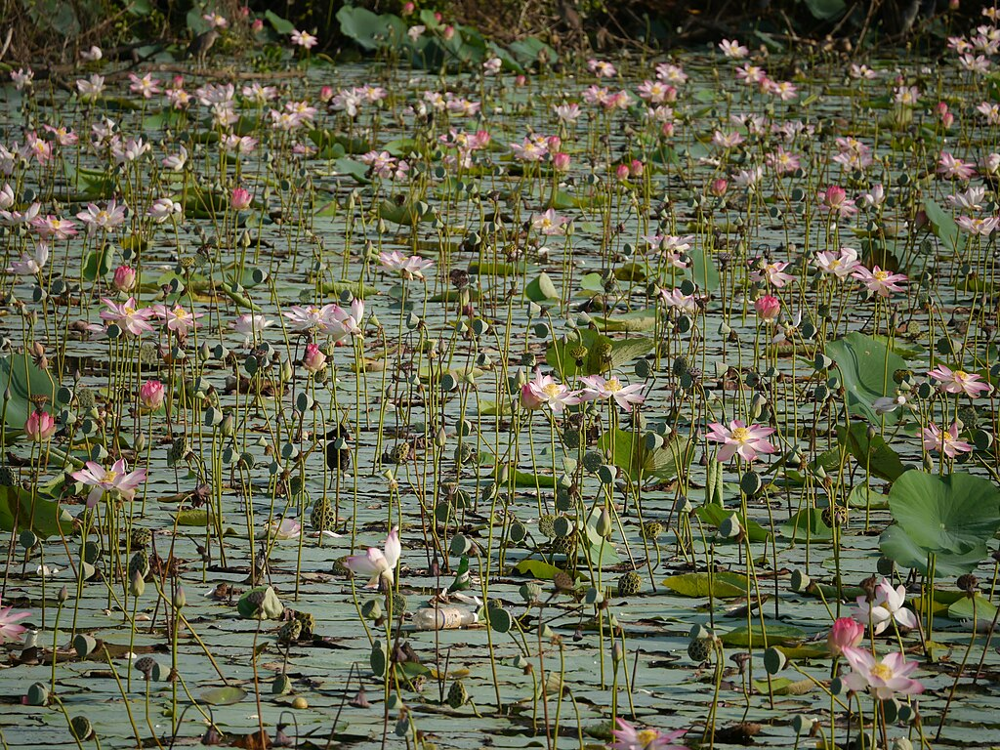

    _[Nelumbo nucifera](https://en.wikipedia.org/wiki/Nelumbo_nucifera "Nelumbo nucifera")_, the sacred lotus, grows in warm freshwater across tropical and subtropical Asia.

*   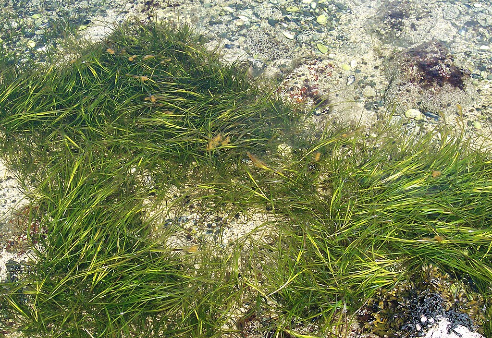

    _[Zostera](https://en.wikipedia.org/wiki/Zostera "Zostera")_ seagrass grows on the seabed in sheltered coastal waters.

In terms of their environment, flowering plants are cosmopolitan, occupying a wide range of [habitats](https://en.wikipedia.org/wiki/Habitat "Habitat") on land, in fresh water and in the sea. On land, they are the dominant plant group in every habitat except for frigid moss-lichen [tundra](https://en.wikipedia.org/wiki/Tundra "Tundra") and [coniferous forest](https://en.wikipedia.org/wiki/Coniferous_forest "Coniferous forest"). The [seagrasses](https://en.wikipedia.org/wiki/Seagrass "Seagrass") in the [Alismatales](https://en.wikipedia.org/wiki/Alismatales "Alismatales") grow in marine environments, spreading with [rhizomes](https://en.wikipedia.org/wiki/Rhizome "Rhizome") that grow through the mud in sheltered coastal waters.

*   Acid, alkaline
*   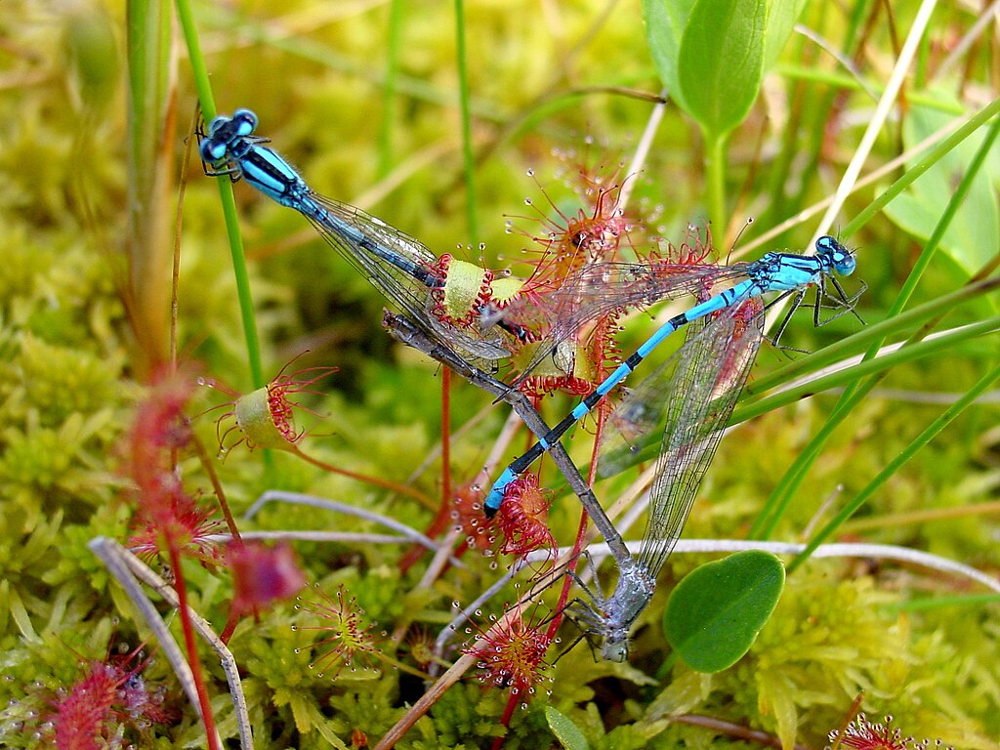

    _[Drosera anglica](https://en.wikipedia.org/wiki/Drosera_anglica "Drosera anglica")_, a sundew, lives in nutrient-poor acid [bogs](https://en.wikipedia.org/wiki/Bog "Bog"), [deriving nutrients from trapped insects](https://en.wikipedia.org/wiki/Carnivorous_plant "Carnivorous plant").

*   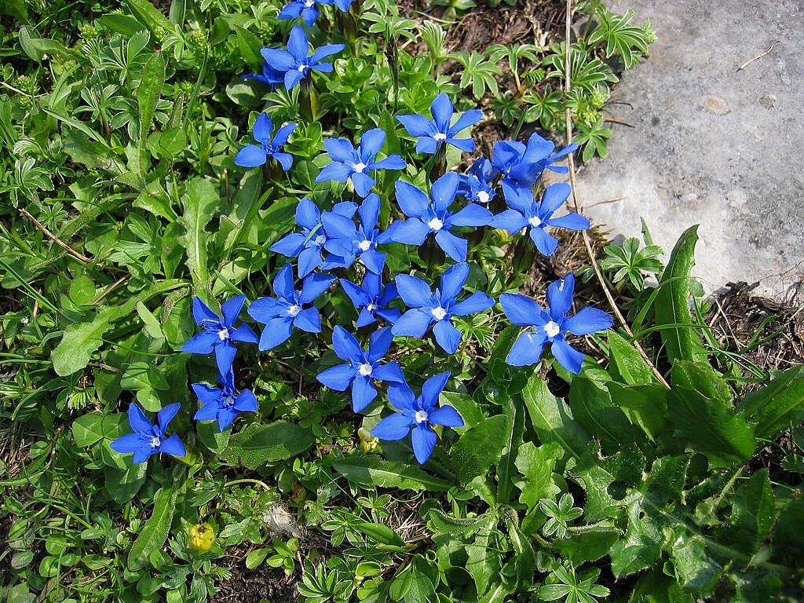

    _[Gentiana verna](https://en.wikipedia.org/wiki/Gentiana_verna "Gentiana verna")_, the spring gentian, flourishes in dry limestone habitats.

Some specialised angiosperms are able to flourish in extremely acid or alkaline habitats. The [sundews](https://en.wikipedia.org/wiki/Sundew "Sundew"), many of which live in nutrient-poor acid [bogs](https://en.wikipedia.org/wiki/Bog "Bog"), are [carnivorous plants](https://en.wikipedia.org/wiki/Carnivorous_plant "Carnivorous plant"), able to derive nutrients such as [nitrate](https://en.wikipedia.org/wiki/Nitrate "Nitrate") from the bodies of trapped insects. Other flowers such as _[Gentiana verna](https://en.wikipedia.org/wiki/Gentiana_verna "Gentiana verna")_, the spring gentian, are adapted to the alkaline conditions found on [calcium](https://en.wikipedia.org/wiki/Calcium "Calcium")-rich [chalk](https://en.wikipedia.org/wiki/Chalk "Chalk") and [limestone](https://en.wikipedia.org/wiki/Limestone "Limestone"), which give rise to often dry [topographies](https://en.wikipedia.org/wiki/Topography "Topography") such as [limestone pavement](https://en.wikipedia.org/wiki/Limestone_pavement "Limestone pavement").

*   Herbaceous, woody, climbing
*   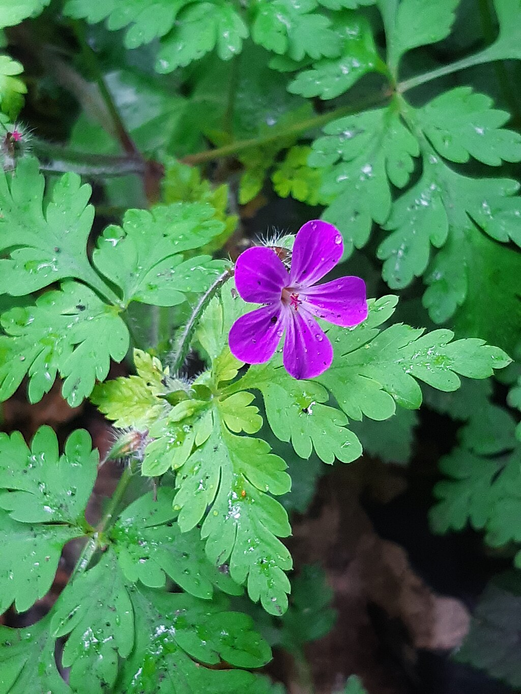

    _[Geranium robertianum](https://en.wikipedia.org/wiki/Geranium_robertianum "Geranium robertianum")_, herb-Robert, is an annual or [biennial](https://en.wikipedia.org/wiki/Biennial_plant "Biennial plant") herb of Europe and North America.

*   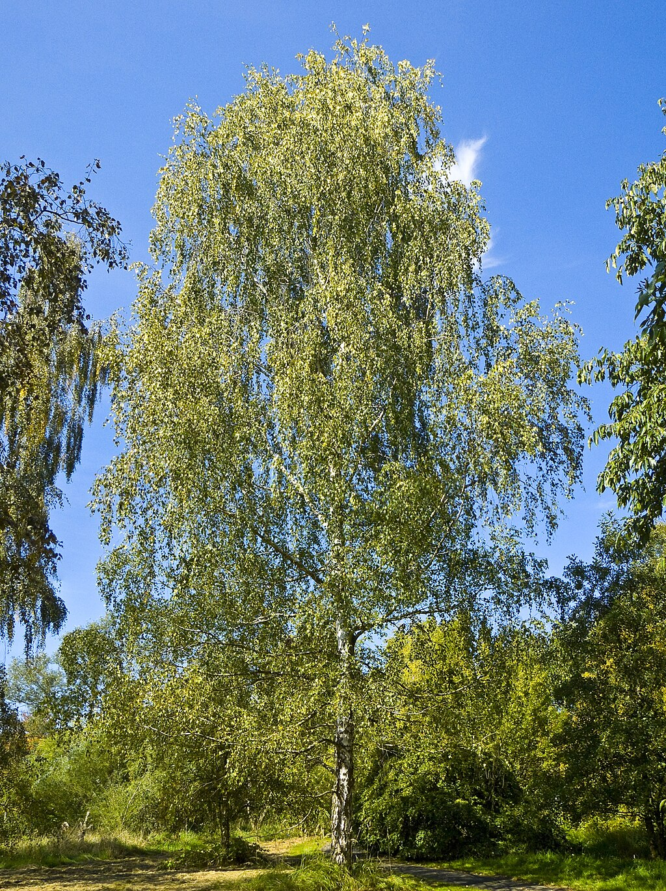

    _[Betula pendula](https://en.wikipedia.org/wiki/Betula_pendula "Betula pendula")_, the silver birch, is a perennial [deciduous](https://en.wikipedia.org/wiki/Deciduous "Deciduous") tree of Eurasia.

*   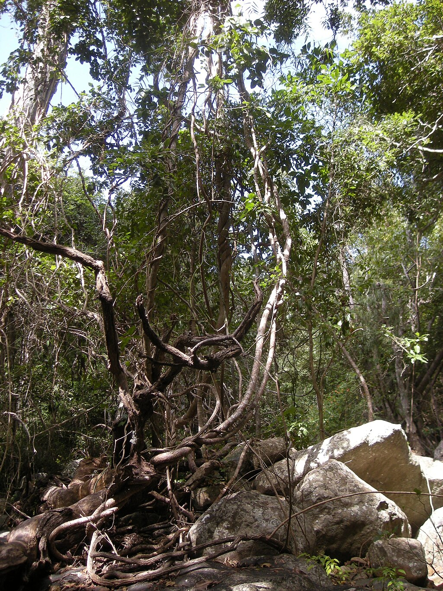

    [Lianas](https://en.wikipedia.org/wiki/Liana "Liana")_[Austrosteenisia](https://en.wikipedia.org/wiki/Austrosteenisia "Austrosteenisia")_, _[Parsonsia](https://en.wikipedia.org/wiki/Parsonsia "Parsonsia")_, and _[Sarcopetalum](https://en.wikipedia.org/wiki/Sarcopetalum "Sarcopetalum")_ climbing trees in Australia

As for their [growth habit](https://en.wikipedia.org/wiki/Growth_habit "Growth habit"), the flowering plants range from small, soft [herbaceous plants](https://en.wikipedia.org/wiki/Herbaceous_plant "Herbaceous plant"), often living as [annuals](https://en.wikipedia.org/wiki/Annual_plant "Annual plant") or [biennials](https://en.wikipedia.org/wiki/Biennials "Biennials") that set seed and die after one or two growing seasons, to large [perennial](https://en.wikipedia.org/wiki/Perennial_plant "Perennial plant") woody [trees](https://en.wikipedia.org/wiki/Tree "Tree") that may live for many centuries and grow to many metres in height. Some species grow tall without being self-supporting like trees by [climbing](https://en.wikipedia.org/wiki/Climbing_plant "Climbing plant") on other plants in the manner of [vines](https://en.wikipedia.org/wiki/Vine "Vine") or [lianas](https://en.wikipedia.org/wiki/Liana "Liana").

### Taxonomic diversity

The number of species of flowering plants is estimated to be in the range of 250,000 to 400,000. This compares to around 12,000 species of [moss](/source/moss/ "Moss") and 11,000 species of [pteridophytes](https://en.wikipedia.org/wiki/Pteridophyta "Pteridophyta"). The [APG system](https://en.wikipedia.org/wiki/APG_system "APG system") seeks to determine the number of [families](https://en.wikipedia.org/wiki/Family_\(biology\) "Family (biology)"), mostly by [molecular phylogenetics](https://en.wikipedia.org/wiki/Molecular_phylogenetics "Molecular phylogenetics"). In the 2009 [APG III](https://en.wikipedia.org/wiki/APG_III "APG III") there were 415 families. The 2016 [APG IV](https://en.wikipedia.org/wiki/APG_IV "APG IV") added five new orders (Boraginales, Dilleniales, Icacinales, Metteniusales and Vahliales), along with some new families, for a total of 64 angiosperm orders and 416 families.

The diversity of flowering plants is not evenly distributed. Nearly all species belong to the eudicot (75%), monocot (23%), and magnoliid (2%) clades. The remaining five clades contain a little over 250 species in total; i.e. less than 0.1% of flowering plant diversity, divided among nine families. The 25 most species-rich of 443 families, containing over 166,000 species between them in their APG circumscriptions, are:

The 25 largest angiosperm families

Group[Family](https://en.wikipedia.org/wiki/Family_\(biology\) "Family (biology)")English nameNo. of [spp.](https://en.wikipedia.org/wiki/Species "Species")

1

Eudicot

[Asteraceae](https://en.wikipedia.org/wiki/Asteraceae "Asteraceae") or Compositae

[daisy](https://en.wikipedia.org/wiki/Bellis_perennis "Bellis perennis")

22,750

2

Monocot

[Orchidaceae](https://en.wikipedia.org/wiki/Orchidaceae "Orchidaceae")

[orchid](https://en.wikipedia.org/wiki/Orchid "Orchid")

21,950

3

Eudicot

[Fabaceae](https://en.wikipedia.org/wiki/Fabaceae "Fabaceae") or Leguminosae

[pea](https://en.wikipedia.org/wiki/Pea "Pea"), [legume](https://en.wikipedia.org/wiki/Legume "Legume")

19,400

4

Eudicot

[Rubiaceae](https://en.wikipedia.org/wiki/Rubiaceae "Rubiaceae")

[madder](https://en.wikipedia.org/wiki/Rubia "Rubia")

13,150

5

Monocot

[Poaceae](https://en.wikipedia.org/wiki/Poaceae "Poaceae") or Gramineae

[grass](https://en.wikipedia.org/wiki/Grass "Grass")

10,035

6

Eudicot

[Lamiaceae](https://en.wikipedia.org/wiki/Lamiaceae "Lamiaceae") or Labiatae

[mint](https://en.wikipedia.org/wiki/Mentha "Mentha")

7,175

7

Eudicot

[Euphorbiaceae](https://en.wikipedia.org/wiki/Euphorbiaceae "Euphorbiaceae")

[spurge](https://en.wikipedia.org/wiki/Spurge "Spurge")

5,735

8

Eudicot

[Melastomataceae](https://en.wikipedia.org/wiki/Melastomataceae "Melastomataceae")

[melastome](https://en.wikipedia.org/wiki/Melastoma "Melastoma")

5,005

9

Eudicot

[Myrtaceae](https://en.wikipedia.org/wiki/Myrtaceae "Myrtaceae")

[myrtle](https://en.wikipedia.org/wiki/Myrtus "Myrtus")

4,625

10

Eudicot

[Apocynaceae](https://en.wikipedia.org/wiki/Apocynaceae "Apocynaceae")

[dogbane](https://en.wikipedia.org/wiki/Dogbane "Dogbane")

4,555

11

Monocot

[Cyperaceae](https://en.wikipedia.org/wiki/Cyperaceae "Cyperaceae")

[sedge](https://en.wikipedia.org/wiki/Sedge "Sedge")

4,350

12

Eudicot

[Malvaceae](https://en.wikipedia.org/wiki/Malvaceae "Malvaceae")

[mallow](https://en.wikipedia.org/wiki/Malva "Malva")

4,225

13

Monocot

[Araceae](https://en.wikipedia.org/wiki/Araceae "Araceae")

[arum](https://en.wikipedia.org/wiki/Arum "Arum")

4,025

14

Eudicot

[Ericaceae](https://en.wikipedia.org/wiki/Ericaceae "Ericaceae")

[heath](https://en.wikipedia.org/wiki/Erica_\(plant\) "Erica (plant)")

3,995

15

Eudicot

[Gesneriaceae](https://en.wikipedia.org/wiki/Gesneriaceae "Gesneriaceae")

[gesneriad](https://en.wikipedia.org/wiki/Gesneria "Gesneria")

3,870

16

Eudicot

[Apiaceae](https://en.wikipedia.org/wiki/Apiaceae "Apiaceae") or Umbelliferae

[parsley](https://en.wikipedia.org/wiki/Parsley "Parsley")

3,780

17

Eudicot

[Brassicaceae](https://en.wikipedia.org/wiki/Brassicaceae "Brassicaceae") or Cruciferae

[cabbage](https://en.wikipedia.org/wiki/Cabbage "Cabbage")

3,710

18

Magnoliid dicot

[Piperaceae](https://en.wikipedia.org/wiki/Piperaceae "Piperaceae")

[pepper](https://en.wikipedia.org/wiki/Piper_\(plant\) "Piper (plant)")

3,600

19

Monocot

[Bromeliaceae](https://en.wikipedia.org/wiki/Bromeliaceae "Bromeliaceae")

[bromeliad](https://en.wikipedia.org/wiki/Bromelia "Bromelia")

3,540

20

Eudicot

[Acanthaceae](https://en.wikipedia.org/wiki/Acanthaceae "Acanthaceae")

[acanthus](https://en.wikipedia.org/wiki/Acanthus_\(plant\) "Acanthus (plant)")

3,500

21

Eudicot

[Rosaceae](https://en.wikipedia.org/wiki/Rosaceae "Rosaceae")

[rose](https://en.wikipedia.org/wiki/Rose "Rose")

2,830

22

Eudicot

[Boraginaceae](https://en.wikipedia.org/wiki/Boraginaceae "Boraginaceae")

[borage](https://en.wikipedia.org/wiki/Borage "Borage")

2,740

23

Eudicot

[Urticaceae](https://en.wikipedia.org/wiki/Urticaceae "Urticaceae")

[nettle](https://en.wikipedia.org/wiki/Urtica_dioica "Urtica dioica")

2,625

24

Eudicot

[Ranunculaceae](https://en.wikipedia.org/wiki/Ranunculaceae "Ranunculaceae")

[buttercup](https://en.wikipedia.org/wiki/Buttercup "Buttercup")

2,525

25

Magnoliid dicot

[Lauraceae](https://en.wikipedia.org/wiki/Lauraceae "Lauraceae")

[laurel](https://en.wikipedia.org/wiki/Laurus "Laurus")

2,500

## Evolution

### History of classification

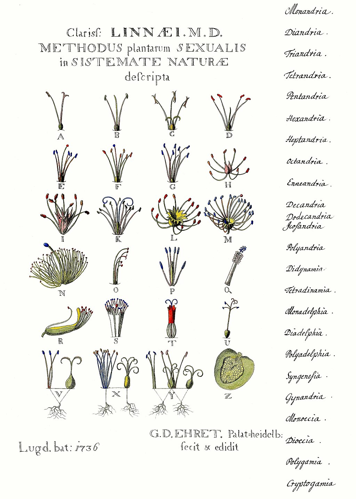From 1736, an illustration of Linnaean classification

The botanical term "angiosperm", from Greek words _angeíon_ ([ἀγγεῖον](https://en.wiktionary.org/wiki/ἀγγεῖον#Ancient_Greek "wikt:ἀγγεῖον") 'bottle, vessel') and _spérma_ ([σπέρμα](https://en.wiktionary.org/wiki/σπέρμα#Ancient_Greek "wikt:σπέρμα") 'seed'), was coined in the form "Angiospermae" by [Paul Hermann](https://en.wikipedia.org/wiki/Paul_Hermann_\(botanist\) "Paul Hermann (botanist)") in 1690, including only flowering plants whose seeds were enclosed in capsules. The term angiosperm fundamentally changed in meaning in 1827 with [Robert Brown](https://en.wikipedia.org/wiki/Robert_Brown_\(Scottish_botanist_from_Montrose\) "Robert Brown (Scottish botanist from Montrose)"), when angiosperm came to mean a seed plant with enclosed ovules. In 1851, with [Wilhelm Hofmeister](https://en.wikipedia.org/wiki/Wilhelm_Friedrich_Benedikt_Hofmeister "Wilhelm Friedrich Benedikt Hofmeister")'s work on embryo-sacs, Angiosperm came to have its modern meaning of all the flowering plants including Dicotyledons and Monocotyledons.

From 1998, the [Angiosperm Phylogeny Group](https://en.wikipedia.org/wiki/Angiosperm_Phylogeny_Group "Angiosperm Phylogeny Group") (APG) has reclassified the angiosperms, with updates in the [APG II system](https://en.wikipedia.org/wiki/APG_II_system "APG II system") in 2003, the [APG III system](https://en.wikipedia.org/wiki/APG_III_system "APG III system") in 2009, and the [APG IV system](https://en.wikipedia.org/wiki/APG_IV_system "APG IV system") in 2016.The [APG system](https://en.wikipedia.org/wiki/APG_system "APG system") treats the flowering plants as an unranked clade without a formal Latin name (angiosperms). A formal classification was published alongside the 2009 revision in which the flowering plants rank as the subclass Magnoliidae.

### Coevolution with pollinators

The evolutionary success and rapid diversification of angiosperms are largely attributed to their coevolutionary relationships with animal pollinators, particularly insects, birds, and bats. Unlike gymnosperms, which rely primarily on wind for pollen dispersal, flowering plants developed specialized traits—such as nectar production, vivid pigmentations, and complex volatile scents—to attract specific floral visitors. This mutualism often leads to **pollination syndromes**, where the morphology of a [flower](https://en.wikipedia.org/wiki/Flower "Flower") evolves to match the anatomy and sensory capabilities of its primary pollinator. For example, tube-shaped flowers often coevolve with long-tongued insects or [hummingbirds](https://en.wikipedia.org/wiki/Hummingbirds "Hummingbirds"), ensuring high pollination efficiency through physical "fit." This specialized relationship acts as a driver for **reproductive isolation**, as minor changes in floral structure can shift a plant's pollinator reliance, leading to the formation of new species and contributing to the immense taxonomic diversity of the clade.

### Phylogeny

#### External

In 2019, a [molecular phylogeny](https://en.wikipedia.org/wiki/Molecular_phylogenetics "Molecular phylogenetics") of [plants](https://en.wikipedia.org/wiki/Plant "Plant") placed the flowering plants in their evolutionary context:

[Embryophytes](https://en.wikipedia.org/wiki/Embryophyte "Embryophyte")

[Bryophytes](https://en.wikipedia.org/wiki/Bryophyte "Bryophyte") 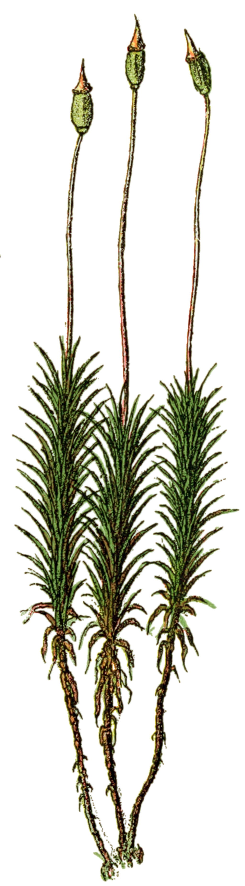

[Tracheophytes](https://en.wikipedia.org/wiki/Tracheophyte "Tracheophyte")

[Lycophytes](https://en.wikipedia.org/wiki/Lycophyte "Lycophyte") 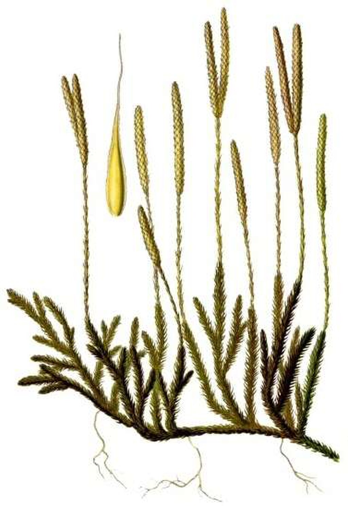

[Ferns](https://en.wikipedia.org/wiki/Fern "Fern") 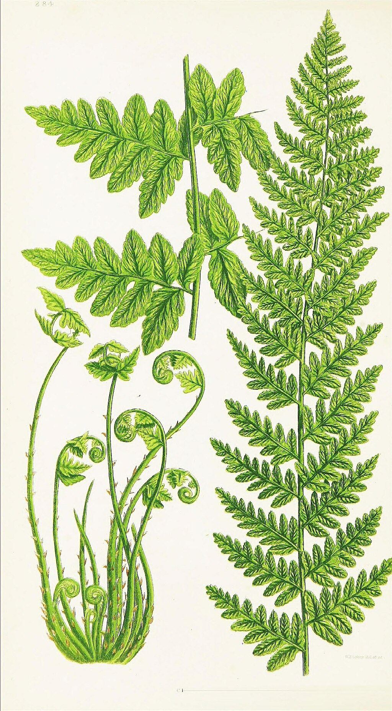

[Spermatophytes](https://en.wikipedia.org/wiki/Spermatophyte "Spermatophyte")

[Gymnosperms](https://en.wikipedia.org/wiki/Gymnosperm "Gymnosperm")

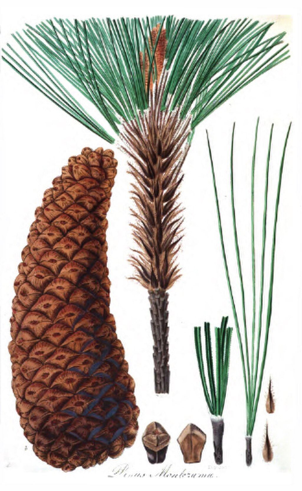

conifers and allies

**Angiosperms**

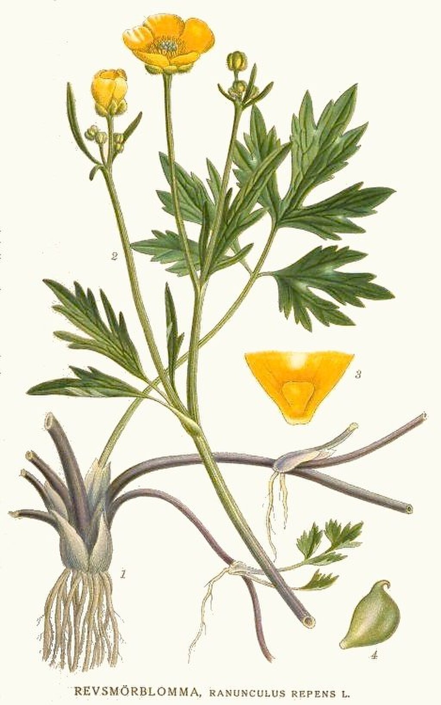

**flowering plants**

seed plants

vascular plants

land plants

#### Internal

The main groups of living angiosperms are:

 **Angiosperms**

[Amborellales](https://en.wikipedia.org/wiki/Amborellales "Amborellales") 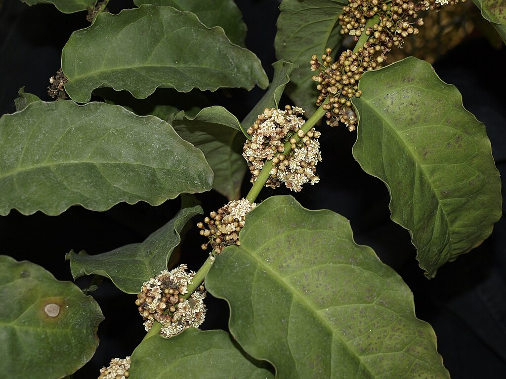 1 sp. [New Caledonia](https://en.wikipedia.org/wiki/New_Caledonia "New Caledonia") shrub

[Nymphaeales](https://en.wikipedia.org/wiki/Nymphaeales "Nymphaeales") 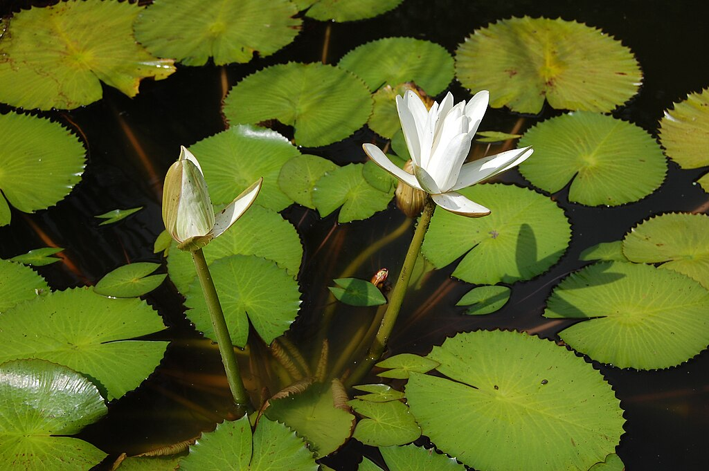 c. 80 spp. [water lilies](https://en.wikipedia.org/wiki/Nymphaeaceae "Nymphaeaceae") & allies

[Austrobaileyales](https://en.wikipedia.org/wiki/Austrobaileyales "Austrobaileyales") 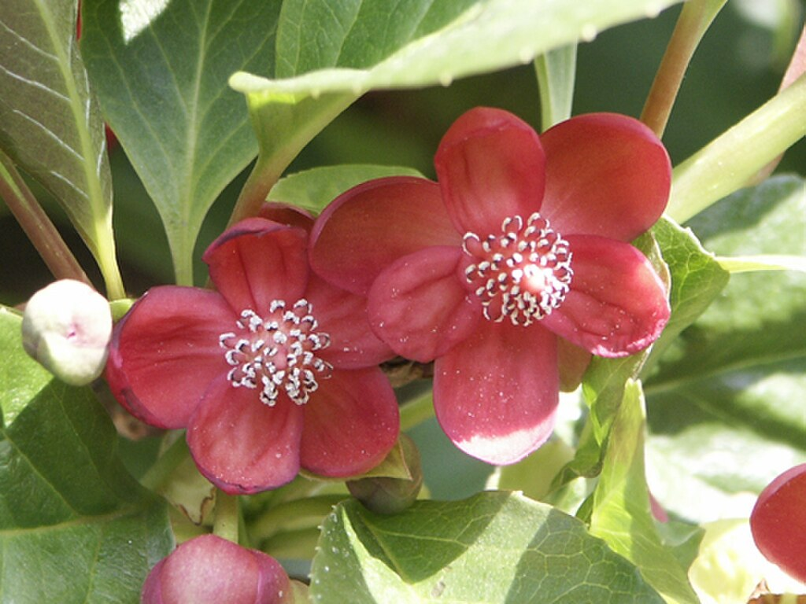 c. 100 spp. woody plants

[Magnoliids](https://en.wikipedia.org/wiki/Magnoliids "Magnoliids") 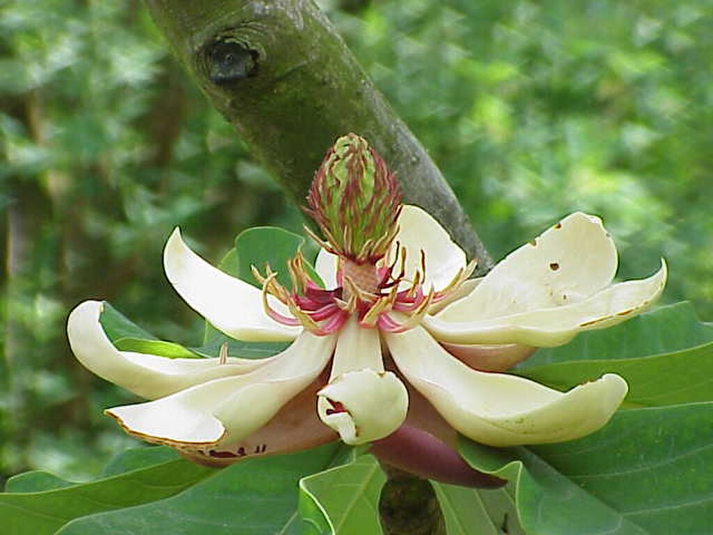 c. 10,000 spp. [3-part](https://en.wikipedia.org/wiki/Merosity "Merosity") flowers, 1-pore pollen, usu. branch-veined leaves

[Chloranthales](https://en.wikipedia.org/wiki/Chloranthales "Chloranthales") 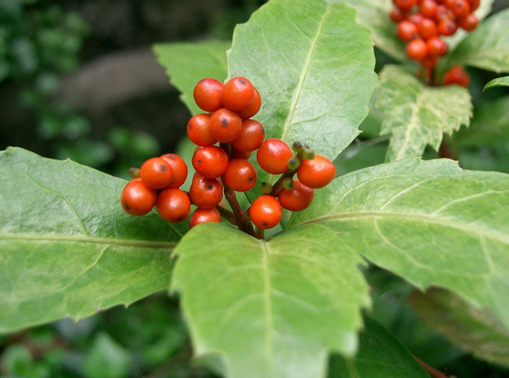 77 spp. Woody, apetalous

[Monocots](https://en.wikipedia.org/wiki/Monocots "Monocots") 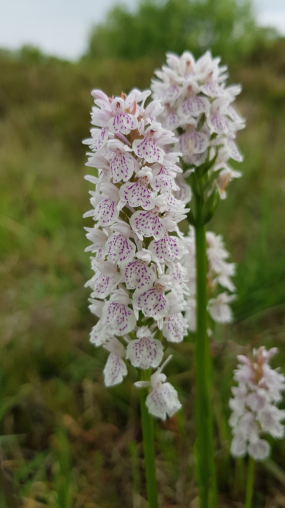 c. 70,000 spp. 3-part flowers, 1 [cotyledon](https://en.wikipedia.org/wiki/Cotyledon "Cotyledon"), 1-pore pollen, usu. parallel-veined leaves

[Ceratophyllales](https://en.wikipedia.org/wiki/Ceratophyllales "Ceratophyllales") 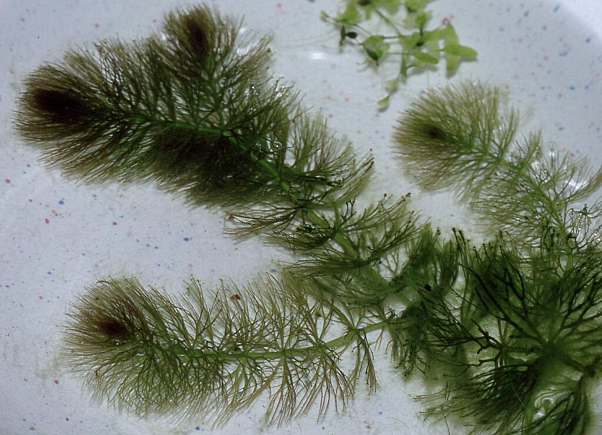 c. 6 spp. [aquatic plants](https://en.wikipedia.org/wiki/Aquatic_plant "Aquatic plant")

[Eudicots](https://en.wikipedia.org/wiki/Eudicots "Eudicots") 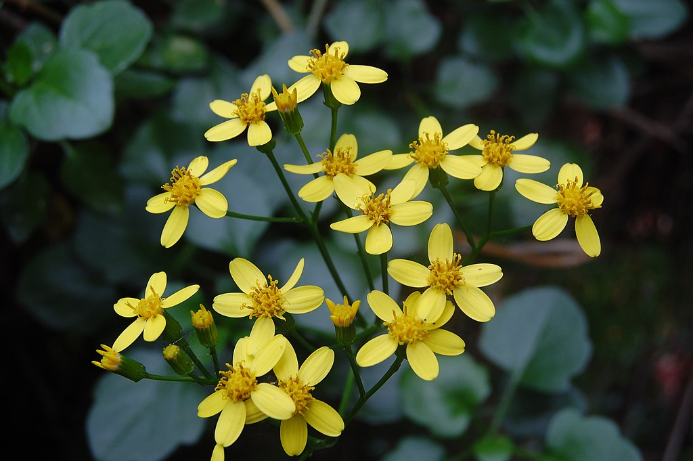 c. 175,000 spp. 4- or 5-part flowers, 3-pore pollen, usu. branch-veined leaves

[Basal angiosperms](https://en.wikipedia.org/wiki/Basal_angiosperms "Basal angiosperms")

[Core angiosperms](https://en.wikipedia.org/wiki/Core_angiosperms "Core angiosperms")

Detailed [cladogram](https://en.wikipedia.org/wiki/Cladogram "Cladogram") of the 2016 [Angiosperm Phylogeny Group](https://en.wikipedia.org/wiki/Angiosperm_Phylogeny_Group "Angiosperm Phylogeny Group") (APG) IV classification.

**Angiosperms**

[Amborellales](https://en.wikipedia.org/wiki/Amborellales "Amborellales") Melikyan, Bobrov & Zaytzeva 1999

[Nymphaeales](https://en.wikipedia.org/wiki/Nymphaeales "Nymphaeales") Salisbury ex von Berchtold & Presl 1820

[Austrobaileyales](https://en.wikipedia.org/wiki/Austrobaileyales "Austrobaileyales") Takhtajan ex Reveal 1992

[Mesangiosperms](https://en.wikipedia.org/wiki/Mesangiosperms "Mesangiosperms")

[Chloranthales](https://en.wikipedia.org/wiki/Chloranthales "Chloranthales") Mart. 1835

[Magnoliids](https://en.wikipedia.org/wiki/Magnoliids "Magnoliids")

[Canellales](https://en.wikipedia.org/wiki/Canellales "Canellales") Cronquist 1957

[Piperales](https://en.wikipedia.org/wiki/Piperales "Piperales") von Berchtold & Presl 1820

[Magnoliales](https://en.wikipedia.org/wiki/Magnoliales "Magnoliales") de Jussieu ex von Berchtold & Presl 1820

[Laurales](https://en.wikipedia.org/wiki/Laurales "Laurales") de Jussieu ex von Berchtold & Presl 1820

[Monocots](https://en.wikipedia.org/wiki/Monocots "Monocots")

[Acorales](https://en.wikipedia.org/wiki/Acorales "Acorales") Link 1835

[Alismatales](https://en.wikipedia.org/wiki/Alismatales "Alismatales") Brown ex von Berchtold & Presl 1820

[Petrosaviales](https://en.wikipedia.org/wiki/Petrosaviales "Petrosaviales") Takhtajan 1997

[Dioscoreales](https://en.wikipedia.org/wiki/Dioscoreales "Dioscoreales") Brown 1835

[Pandanales](https://en.wikipedia.org/wiki/Pandanales "Pandanales") Brown ex von Berchtold & Presl 1820

[Liliales](https://en.wikipedia.org/wiki/Liliales "Liliales") Perleb 1826

[Asparagales](https://en.wikipedia.org/wiki/Asparagales "Asparagales") Link 1829

[Commelinids](https://en.wikipedia.org/wiki/Commelinids "Commelinids")

[Arecales](https://en.wikipedia.org/wiki/Arecales "Arecales") Bromhead 1840

[Poales](https://en.wikipedia.org/wiki/Poales "Poales") Small 1903

[Zingiberales](https://en.wikipedia.org/wiki/Zingiberales "Zingiberales") Grisebach 1854

[Commelinales](https://en.wikipedia.org/wiki/Commelinales "Commelinales") de Mirbel ex von Berchtold & Presl 1820

[Ceratophyllales](https://en.wikipedia.org/wiki/Ceratophyllales "Ceratophyllales") Link 1829

[Eudicots](https://en.wikipedia.org/wiki/Eudicots "Eudicots")

[Ranunculales](https://en.wikipedia.org/wiki/Ranunculales "Ranunculales") de Jussieu ex von Berchtold & Presl 1820

[Proteales](https://en.wikipedia.org/wiki/Proteales "Proteales") de Jussieu ex von Berchtold & Presl 1820

[Trochodendrales](https://en.wikipedia.org/wiki/Trochodendrales "Trochodendrales") Takhtajan ex Cronquist 1981

[Buxales](https://en.wikipedia.org/wiki/Buxales "Buxales") Takhtajan ex Reveal 1996

[Core eudicots](https://en.wikipedia.org/wiki/Core_eudicots "Core eudicots")

[Gunnerales](https://en.wikipedia.org/wiki/Gunnerales "Gunnerales") Takhtajan ex Reveal 1992

[Dilleniales](https://en.wikipedia.org/wiki/Dilleniales "Dilleniales") de Candolle ex von Berchtold & Presl 1820

[Superrosids](https://en.wikipedia.org/wiki/Superrosids "Superrosids")

[Saxifragales](https://en.wikipedia.org/wiki/Saxifragales "Saxifragales") von Berchtold & Presl 1820

[Rosids](https://en.wikipedia.org/wiki/Rosids "Rosids")

[Vitales](https://en.wikipedia.org/wiki/Vitales "Vitales") de Jussieu ex von Berchtold & Presl 1820

Fabids

[Zygophyllales](https://en.wikipedia.org/wiki/Zygophyllales "Zygophyllales") Link 1829

[Celastrales](https://en.wikipedia.org/wiki/Celastrales "Celastrales") Link 1829

[Oxalidales](https://en.wikipedia.org/wiki/Oxalidales "Oxalidales") von Berchtold & Presl 1820

[Malpighiales](https://en.wikipedia.org/wiki/Malpighiales "Malpighiales") de Jussieu ex von Berchtold & Presl 1820

[Fabales](https://en.wikipedia.org/wiki/Fabales "Fabales") Bromhead 1838

[Rosales](https://en.wikipedia.org/wiki/Rosales "Rosales") von Berchtold & Presl 1820

[Cucurbitales](https://en.wikipedia.org/wiki/Cucurbitales "Cucurbitales") de Jussieu ex von Berchtold & Presl 1820

[Fagales](https://en.wikipedia.org/wiki/Fagales "Fagales") Engler 1892

(eurosids I)

Malvids

[Geraniales](https://en.wikipedia.org/wiki/Geraniales "Geraniales") de Jussieu ex von Berchtold & Presl 1820

[Myrtales](https://en.wikipedia.org/wiki/Myrtales "Myrtales") de Jussieu ex von Berchtold & Presl 1820

[Crossosomatales](https://en.wikipedia.org/wiki/Crossosomatales "Crossosomatales") Takhtajan ex Reveal 1993

[Picramniales](https://en.wikipedia.org/wiki/Picramniales "Picramniales") Doweld 2001

[Sapindales](https://en.wikipedia.org/wiki/Sapindales "Sapindales") de Jussieu ex von Berchtold & Presl 1820

[Huerteales](https://en.wikipedia.org/wiki/Huerteales "Huerteales") Doweld 2001

[Malvales](https://en.wikipedia.org/wiki/Malvales "Malvales") de Jussieu ex von Berchtold & Presl 1820

[Brassicales](https://en.wikipedia.org/wiki/Brassicales "Brassicales") Bromhead 1838

(eurosids II)

[Superasterids](https://en.wikipedia.org/wiki/Superasterids "Superasterids")

[Berberidopsidales](https://en.wikipedia.org/wiki/Berberidopsidales "Berberidopsidales") Doweld 2001

[Santalales](https://en.wikipedia.org/wiki/Santalales "Santalales") Brown ex von Berchtold & Presl 1820

[Caryophyllales](https://en.wikipedia.org/wiki/Caryophyllales "Caryophyllales")

[Asterids](https://en.wikipedia.org/wiki/Asterids "Asterids")

[Cornales](https://en.wikipedia.org/wiki/Cornales "Cornales") Link 1829

[Ericales](https://en.wikipedia.org/wiki/Ericales "Ericales") von Berchtold & Presl 1820

Lamiids

[Icacinales](https://en.wikipedia.org/wiki/Icacinales "Icacinales") Van Tieghem 1900

[Metteniusales](https://en.wikipedia.org/wiki/Metteniusales "Metteniusales") Takhtajan 1997

[Garryales](https://en.wikipedia.org/wiki/Garryales "Garryales") Mart. 1835

[Gentianales](https://en.wikipedia.org/wiki/Gentianales "Gentianales") de Jussieu ex von Berchtold & Presl 1820

[Solanales](https://en.wikipedia.org/wiki/Solanales "Solanales") de Jussieu ex von Berchtold & Presl 1820

[Boraginales](https://en.wikipedia.org/wiki/Boraginales "Boraginales") de Jussieu ex von Berchtold & Presl 1820

[Vahliales](https://en.wikipedia.org/wiki/Vahliales "Vahliales") Doweld 2001

[Lamiales](https://en.wikipedia.org/wiki/Lamiales "Lamiales") Bromhead 1838

(euasterids I)

Campanulids

[Aquifoliales](https://en.wikipedia.org/wiki/Aquifoliales "Aquifoliales") Senft 1856

[Escalloniales](https://en.wikipedia.org/wiki/Escalloniales "Escalloniales") Mart. 1835

[Asterales](https://en.wikipedia.org/wiki/Asterales "Asterales") Link 1829

[Bruniales](https://en.wikipedia.org/wiki/Bruniales "Bruniales") Dumortier 1829

[Apiales](https://en.wikipedia.org/wiki/Apiales "Apiales") Nakai 1930

[Paracryphiales](https://en.wikipedia.org/wiki/Paracryphiales "Paracryphiales") Takhtajan ex Reveal 1992

[Dipsacales](https://en.wikipedia.org/wiki/Dipsacales "Dipsacales") de Jussieu ex von Berchtold & Presl 1820

(euasterids II)

In 2024, Alexandre R. Zuntini and colleagues constructed a tree of some 6,000 flowering plant genera, representing some 60% of the existing genera, on the basis of analysis of 353 nuclear genes in each specimen. Much of the existing phylogeny is confirmed; the [rosid](https://en.wikipedia.org/wiki/Rosidae "Rosidae") phylogeny is revised.

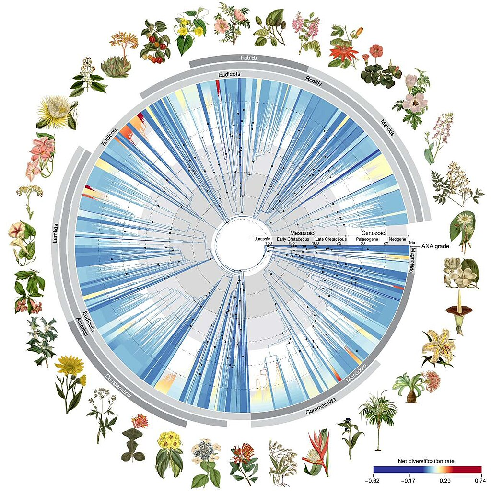Tree of Angiosperm phylogeny 2024

### Fossil history

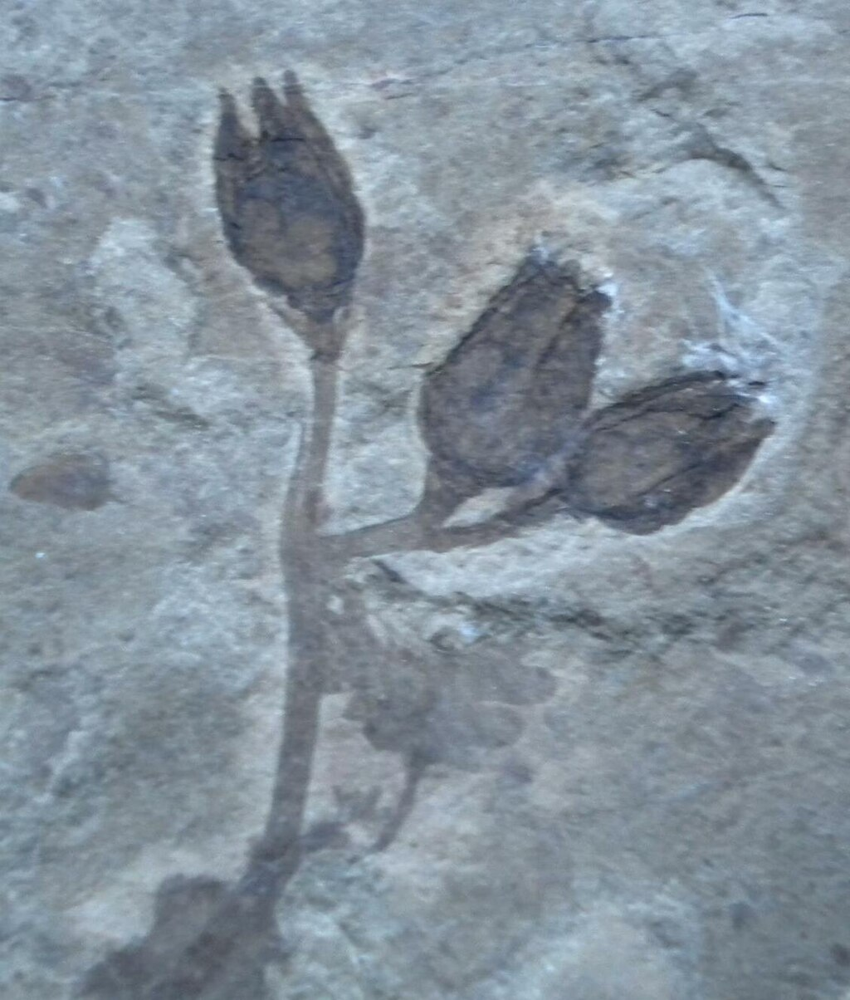[Adaptive radiation](https://en.wikipedia.org/wiki/Adaptive_radiation "Adaptive radiation") in the [Cretaceous](https://en.wikipedia.org/wiki/Cretaceous "Cretaceous") created many flowering plants, such as _[Sagaria](https://en.wikipedia.org/wiki/Sagaria "Sagaria")_ in the [Ranunculaceae](https://en.wikipedia.org/wiki/Ranunculaceae "Ranunculaceae").

Fossilised [spores](https://en.wikipedia.org/wiki/Spore "Spore") suggest that land plants ([embryophytes](https://en.wikipedia.org/wiki/Embryophyte "Embryophyte")) have existed for at least 475 million years. However, angiosperms [appear suddenly](https://en.wikipedia.org/wiki/Abominable_mystery "Abominable mystery") and in great diversity in the fossil record in the [Early Cretaceous](https://en.wikipedia.org/wiki/Early_Cretaceous "Early Cretaceous") (~130 mya). Claimed records of flowering plants prior to this are not widely accepted, as all supposed pre-Cretaceous "flowers" can be explained through being misidentifications of other seed plants. Furthermore, almost all of these controversial fossils are described in papers co-authored by the researcher Xin Wang, such as the particularly debated _[Nanjinganthus](https://en.wikipedia.org/wiki/Nanjinganthus "Nanjinganthus")_. Molecular evidence suggests that the ancestors of angiosperms diverged from the [gymnosperms](https://en.wikipedia.org/wiki/Gymnosperms "Gymnosperms") during the late [Devonian](https://en.wikipedia.org/wiki/Devonian "Devonian"), about 365 million years ago. The origin time of the [crown group](https://en.wikipedia.org/wiki/Crown_group "Crown group") of flowering plants remains contentious. By the Late Cretaceous, angiosperms appear to have dominated environments formerly occupied by [ferns](https://en.wikipedia.org/wiki/Fern "Fern") and gymnosperms. Large [canopy](https://en.wikipedia.org/wiki/Canopy_\(biology\) "Canopy (biology)")-forming trees replaced [conifers](https://en.wikipedia.org/wiki/Conifer "Conifer") as the dominant trees close to the end of the Cretaceous, 66 million years ago. The radiation of herbaceous angiosperms occurred much later. Fossils from the [Dakota Formation](https://en.wikipedia.org/wiki/Dakota_Formation "Dakota Formation") in [Kansas](https://en.wikipedia.org/wiki/Kansas "Kansas") suggest that [Beetles](https://en.wikipedia.org/wiki/Beetle "Beetle") had already developed a symbiotic relationship with flowering plants such as _[Archaeanthus](https://en.wikipedia.org/wiki/Archaeanthus "Archaeanthus")_ by the late-[Albian](https://en.wikipedia.org/wiki/Albian "Albian").

## Reproduction

### Flowers

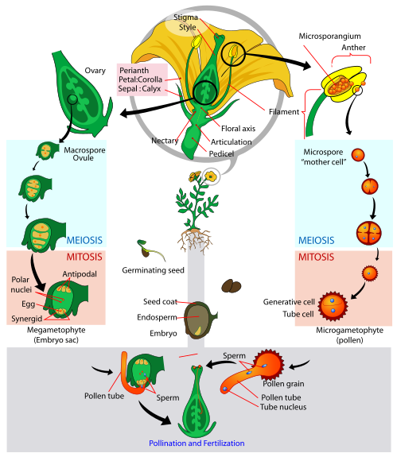Angiosperm [flower](https://en.wikipedia.org/wiki/Flower "Flower") showing [reproductive parts](https://en.wikipedia.org/wiki/Plant_reproductive_morphology "Plant reproductive morphology") and life cycle

The characteristic feature of angiosperms is the flower. Its function is to ensure [fertilization](https://en.wikipedia.org/wiki/Fertilisation "Fertilisation") of the [ovule](https://en.wikipedia.org/wiki/Ovule "Ovule") and development of [fruit](https://en.wikipedia.org/wiki/Fruit "Fruit") containing [seeds](https://en.wikipedia.org/wiki/Seed "Seed"). It may arise terminally on a shoot or from the [axil](https://en.wikipedia.org/wiki/Axil "Axil") of a leaf. The flower-bearing part of the plant is usually sharply distinguished from the leaf-bearing part, and forms a branch-system called an [inflorescence](https://en.wikipedia.org/wiki/Inflorescence "Inflorescence").

Flowers produce two kinds of reproductive cells. [Microspores](https://en.wikipedia.org/wiki/Microspore "Microspore"), which divide to become [pollen grains](https://en.wikipedia.org/wiki/Pollen "Pollen"), are the male cells; they are borne in the [stamens](https://en.wikipedia.org/wiki/Stamen "Stamen"). The female cells, [megaspores](https://en.wikipedia.org/wiki/Megaspore "Megaspore"), [divide to become the egg cell](https://en.wikipedia.org/wiki/Megagametogenesis "Megagametogenesis"). They are contained in the [ovule](https://en.wikipedia.org/wiki/Ovule "Ovule") and enclosed in the [carpel](https://en.wikipedia.org/wiki/Carpel "Carpel"); one or more carpels form the [pistil](https://en.wikipedia.org/wiki/Pistil "Pistil").

The flower may consist only of these parts, as in [wind-pollinated](https://en.wikipedia.org/wiki/Anemophily "Anemophily") plants like the [willow](https://en.wikipedia.org/wiki/Willow "Willow"), where each flower comprises only a few [stamens](https://en.wikipedia.org/wiki/Stamen "Stamen") or two carpels. In [insect-](https://en.wikipedia.org/wiki/Entomophily "Entomophily") or [bird-pollinated](https://en.wikipedia.org/wiki/Ornithophily "Ornithophily") plants, other structures protect the [sporophylls](https://en.wikipedia.org/wiki/Sporophyll "Sporophyll") and attract pollinators. The individual members of these surrounding structures are known as [sepals](https://en.wikipedia.org/wiki/Sepal "Sepal") and [petals](https://en.wikipedia.org/wiki/Petal "Petal") (or [tepals](https://en.wikipedia.org/wiki/Tepal "Tepal") in flowers such as _[Magnolia](https://en.wikipedia.org/wiki/Magnolia "Magnolia")_ where sepals and petals are not distinguishable from each other). The outer series (calyx of sepals) is usually green and leaf-like, and functions to protect the rest of the flower, especially the bud. The inner series (corolla of petals) is, in general, white or brightly colored, is more delicate in structure, and attracts pollinators by colour, [scent](https://en.wikipedia.org/wiki/Floral_scent "Floral scent"), and [nectar](https://en.wikipedia.org/wiki/Nectar "Nectar").

Most flowers are [hermaphroditic](https://en.wikipedia.org/wiki/Hermaphrodite#Plants "Hermaphrodite"), producing both pollen and ovules in the same flower, but some use other devices to reduce self-fertilization. Heteromorphic flowers have carpels and stamens of differing lengths, so animal [pollinators](https://en.wikipedia.org/wiki/Pollinator "Pollinator") cannot easily transfer pollen between them. Homomorphic flowers may use a biochemical [self-incompatibility](https://en.wikipedia.org/wiki/Self-incompatibility_in_plants "Self-incompatibility in plants") to discriminate between self and non-self pollen grains. [Dioecious](https://en.wikipedia.org/wiki/Dioecious "Dioecious") plants such as [holly](https://en.wikipedia.org/wiki/Holly "Holly") have male and female flowers on separate plants. [Monoecious](https://en.wikipedia.org/wiki/Monoecious "Monoecious") plants have separate male and female flowers on the same plant; these are often wind-pollinated, as in [maize](https://en.wikipedia.org/wiki/Maize "Maize"), but include some insect-pollinated plants such as _[Cucurbita](https://en.wikipedia.org/wiki/Cucurbita "Cucurbita")_ squashes.

### Fertilisation and embryogenesis

[Double fertilization](https://en.wikipedia.org/wiki/Double_fertilization "Double fertilization") requires two sperm cells to fertilise cells in the ovule. A [pollen](https://en.wikipedia.org/wiki/Pollen "Pollen") grain sticks to the stigma at the top of the pistil, germinates, and grows a long [pollen tube](https://en.wikipedia.org/wiki/Pollen_tube "Pollen tube"). A haploid generative cell travels down the tube behind the tube nucleus. The generative cell divides by mitosis to produce two haploid (_n_) sperm cells. The pollen tube grows from the stigma, down the style and into the ovary. When it reaches the micropyle of the ovule, it digests its way into one of the synergids, releasing its contents including the sperm cells. The synergid that the cells were released into degenerates; one sperm makes its way to fertilise the egg cell, producing a diploid (2_n_) zygote. The second sperm cell fuses with both central cell nuclei, producing a triploid (3_n_) cell. The zygote develops into an embryo; the triploid cell develops into the endosperm, the embryo's food supply. The ovary develops into a fruit and each ovule into a seed.

### Fruit and seed

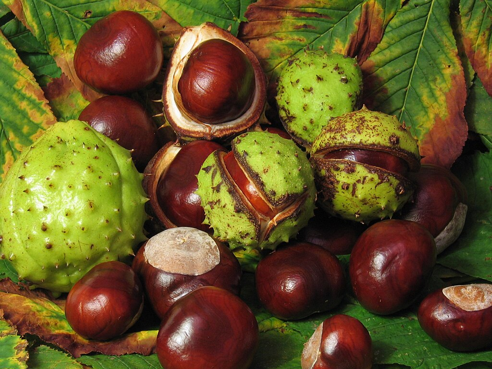The fruit of the [horse chestnut](https://en.wikipedia.org/wiki/Aesculus_hippocastanum "Aesculus hippocastanum") tree, showing the large seed inside the fruit, which is [dehiscing or splitting open](https://en.wikipedia.org/wiki/Dehiscence_\(botany\) "Dehiscence (botany)").

As the embryo and endosperm develop, the wall of the embryo sac enlarges and combines with the [nucellus](https://en.wikipedia.org/wiki/Nucellus "Nucellus") and [integument](https://en.wikipedia.org/wiki/Integument "Integument") to form the _seed coat_. The ovary wall develops to form the fruit or [pericarp](https://en.wikipedia.org/wiki/Pericarp "Pericarp"), whose form is closely associated with type of seed dispersal system.

Other parts of the flower often contribute to forming the fruit. For example, in the [apple](https://en.wikipedia.org/wiki/Apple "Apple"), the [hypanthium](https://en.wikipedia.org/wiki/Hypanthium "Hypanthium") forms the edible flesh, surrounding the ovaries which form the tough cases around the seeds.

[Apomixis](https://en.wikipedia.org/wiki/Apomixis "Apomixis"), setting seed without fertilization, is found naturally in about 2.2% of angiosperm genera. Some angiosperms, including many [citrus](https://en.wikipedia.org/wiki/Citrus "Citrus") varieties, are able to produce fruits through a type of apomixis called [nucellar embryony](https://en.wikipedia.org/wiki/Nucellar_embryony "Nucellar embryony").

### Sexual selection

[Sexual selection](https://en.wikipedia.org/wiki/Sexual_selection "Sexual selection") is a mechanism of [evolution](https://en.wikipedia.org/wiki/Evolution "Evolution") in which members of one sex [choose mates](https://en.wikipedia.org/wiki/Mate_choice "Mate choice") of the other sex (inter-sexual selection), and compete with members of the same sex for access to members of the opposite sex (intra-sexual selection). It is an accepted concept in zoology, but more controversial in botany. It could work through two principal mechanisms:

*   Intra-sexual (male–male) competition: Competing pollen donors vie for ovule fertilization via traits such as pollen packaging, timing of release, and flower morphology.
*   Female or pistil-mediated [mate choice](https://en.wikipedia.org/wiki/Mate_choice "Mate choice"): Post-pollination filters—such as pollen-recipient compatibility, pollen-tube growth rates, and selective seed abortion — enable differential siring success.

These two mechanisms are, in theory, the main driving forces of sexual selection in flowering plants and their potential relevance to botany is clear, but more complicated than in zoology. The complexity of applying the concept of sexual selection to plants arises from the facts that most plants are [hermaphrodites](https://en.wikipedia.org/wiki/Hermaphrodite "Hermaphrodite") and are non-sentient, meaning that the more obvious elements of [female choice](https://en.wikipedia.org/wiki/Female_choice "Female choice") (e.g. aesthetic judgements on male secondary sexual characteristics) do not apply. The research challenge currently facing botanists is mainly empirical, namely how significant these processes have actually been in plant evolution.

### Adaptive function of flowers

Charles Darwin in his 1878 book The Effects of Cross and Self-Fertilization in the Vegetable Kingdom in the initial paragraph of chapter XII noted "The first and most important of the conclusions which may be drawn from the observations given in this volume, is that generally cross-fertilisation is beneficial and self-fertilisation often injurious, at least with the plants on which I experimented." [Flowers](https://en.wikipedia.org/wiki/Flower "Flower") emerged in plant evolution as an adaptation for the promotion of cross-[fertilisation](https://en.wikipedia.org/wiki/Fertilisation "Fertilisation") ([outcrossing](https://en.wikipedia.org/wiki/Outcrossing "Outcrossing")), a process that allows the masking of deleterious [mutations](https://en.wikipedia.org/wiki/Mutation "Mutation") in the [genome](https://en.wikipedia.org/wiki/Genome "Genome") of progeny. The masking effect is known as [genetic complementation](https://en.wikipedia.org/wiki/Complementation_\(genetics\) "Complementation (genetics)"). [Meiosis](https://en.wikipedia.org/wiki/Meiosis "Meiosis") in flowering plants provides a direct mechanism for [repairing DNA](https://en.wikipedia.org/wiki/DNA_repair "DNA repair") through genetic recombination in reproductive tissues. [Sexual reproduction](https://en.wikipedia.org/wiki/Sexual_reproduction "Sexual reproduction") appears to be required for maintaining long-term [genomic](https://en.wikipedia.org/wiki/Genome "Genome") integrity and only infrequent combinations of extrinsic and intrinsic factors permit shifts to asexuality. Thus the two fundamental aspects of sexual reproduction in flowering plants, cross-fertilization (outcrossing) and meiosis appear to be maintained respectively by the advantages of genetic complementation and recombinational repair.

## Human uses

### Practical uses

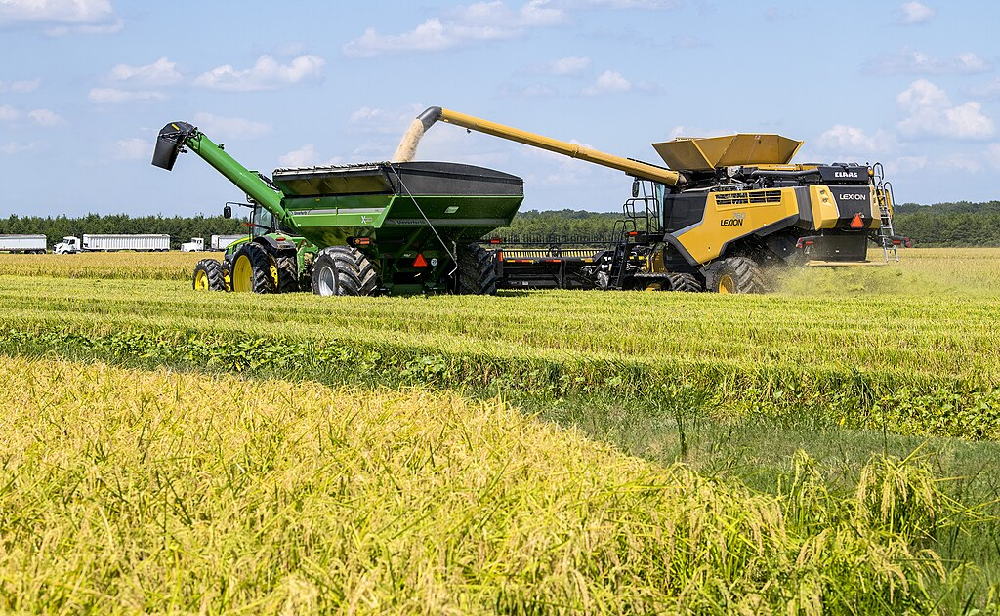Harvesting [rice](https://en.wikipedia.org/wiki/Rice "Rice") in Arkansas, 2020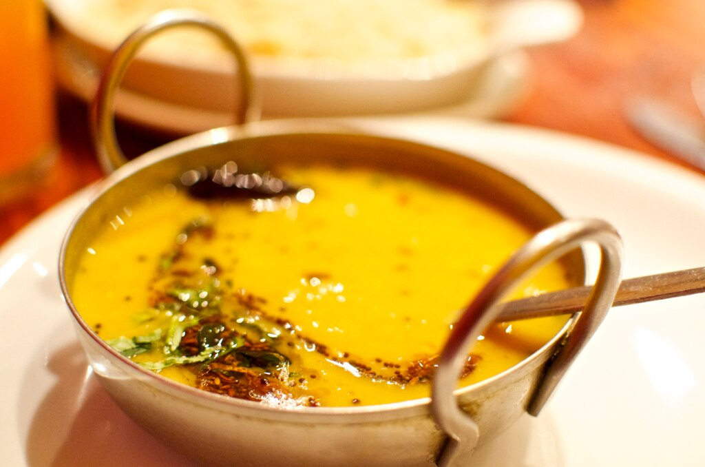Food from plants: a dish of _[Dal tadka](https://en.wikipedia.org/wiki/Dal_tadka "Dal tadka")_, Indian lentil soup

[Agriculture](https://en.wikipedia.org/wiki/Agriculture "Agriculture") is almost entirely dependent on angiosperms, which provide virtually all plant-based food and [fodder](https://en.wikipedia.org/wiki/Fodder "Fodder") for [livestock](https://en.wikipedia.org/wiki/Livestock "Livestock"). Much of this food derives from a small number of flowering plant families. For instance, half of the world's [calorie](https://en.wikipedia.org/wiki/Calorie "Calorie") intake is supplied by just three members of the [grass family](https://en.wikipedia.org/wiki/Grass_family "Grass family") – [wheat](https://en.wikipedia.org/wiki/Wheat "Wheat"), [rice](https://en.wikipedia.org/wiki/Rice "Rice") and [maize](https://en.wikipedia.org/wiki/Maize "Maize").

Major food-providing families

FamilyEnglishExample foods from that family

[Poaceae](https://en.wikipedia.org/wiki/Poaceae "Poaceae")

Grasses, cereals

Most feedstocks, inc. [rice](https://en.wikipedia.org/wiki/Rice "Rice"), [maize](https://en.wikipedia.org/wiki/Maize "Maize"), [wheat](https://en.wikipedia.org/wiki/Wheat "Wheat"), [barley](https://en.wikipedia.org/wiki/Barley "Barley"), [rye](https://en.wikipedia.org/wiki/Rye "Rye"), [oats](https://en.wikipedia.org/wiki/Oat "Oat"), [pearl millet](https://en.wikipedia.org/wiki/Pearl_millet "Pearl millet"), [sugar cane](https://en.wikipedia.org/wiki/Sugar_cane "Sugar cane"), [sorghum](https://en.wikipedia.org/wiki/Sorghum "Sorghum")

[Fabaceae](https://en.wikipedia.org/wiki/Fabaceae "Fabaceae")

Legumes, pea family

[Peas](https://en.wikipedia.org/wiki/Pea "Pea"), [beans](https://en.wikipedia.org/wiki/Bean "Bean"), [lentils](https://en.wikipedia.org/wiki/Lentils "Lentils"); for animal feed, [clover](https://en.wikipedia.org/wiki/Clover "Clover"), [alfalfa](https://en.wikipedia.org/wiki/Alfalfa "Alfalfa")

[Solanaceae](https://en.wikipedia.org/wiki/Solanaceae "Solanaceae")

Nightshade family

[Potatoes](https://en.wikipedia.org/wiki/Potato "Potato"), [tomatoes](https://en.wikipedia.org/wiki/Tomato "Tomato"), [peppers](https://en.wikipedia.org/wiki/Capsicum "Capsicum"), [aubergines](https://en.wikipedia.org/wiki/Aubergine "Aubergine")

[Cucurbitaceae](https://en.wikipedia.org/wiki/Cucurbitaceae "Cucurbitaceae")

Gourd family

[Squashes](https://en.wikipedia.org/wiki/Cucurbita "Cucurbita"), [cucumbers](https://en.wikipedia.org/wiki/Cucumber "Cucumber"), [pumpkins](https://en.wikipedia.org/wiki/Pumpkin "Pumpkin"), [melons](https://en.wikipedia.org/wiki/Melon "Melon")

[Brassicaceae](https://en.wikipedia.org/wiki/Brassicaceae "Brassicaceae")

Cabbage family

[Cabbage](https://en.wikipedia.org/wiki/Cabbage "Cabbage") and its varieties, e.g. [Brussels sprout](https://en.wikipedia.org/wiki/Brussels_sprout "Brussels sprout"), [broccoli](https://en.wikipedia.org/wiki/Broccoli "Broccoli"); [mustard](https://en.wikipedia.org/wiki/Mustard_plant "Mustard plant"); [oilseed rape](https://en.wikipedia.org/wiki/Rapeseed "Rapeseed")

[Apiaceae](https://en.wikipedia.org/wiki/Apiaceae "Apiaceae")

Parsley family

[Parsnip](https://en.wikipedia.org/wiki/Parsnip "Parsnip"), [carrot](https://en.wikipedia.org/wiki/Carrot "Carrot"), [parsley](https://en.wikipedia.org/wiki/Parsley "Parsley"), [coriander](https://en.wikipedia.org/wiki/Coriander "Coriander"), [fennel](https://en.wikipedia.org/wiki/Fennel "Fennel"), [cumin](https://en.wikipedia.org/wiki/Cumin "Cumin"), [caraway](https://en.wikipedia.org/wiki/Caraway "Caraway")

[Rutaceae](https://en.wikipedia.org/wiki/Rutaceae "Rutaceae")

Rue family

[Oranges](https://en.wikipedia.org/wiki/Orange_\(fruit\) "Orange (fruit)"), [lemons](https://en.wikipedia.org/wiki/Lemon "Lemon"), [grapefruits](https://en.wikipedia.org/wiki/Grapefruit "Grapefruit")

[Rosaceae](https://en.wikipedia.org/wiki/Rosaceae "Rosaceae")

Rose family

[Apples](https://en.wikipedia.org/wiki/Apple "Apple"), [pears](https://en.wikipedia.org/wiki/Pear "Pear"), [cherries](https://en.wikipedia.org/wiki/Cherry "Cherry"), [apricots](https://en.wikipedia.org/wiki/Apricot "Apricot"), [plums](https://en.wikipedia.org/wiki/Plum "Plum"), [peaches](https://en.wikipedia.org/wiki/Peach "Peach")

Flowering plants provide a diverse range of materials in the form of [wood](https://en.wikipedia.org/wiki/Wood "Wood"), [paper](https://en.wikipedia.org/wiki/Paper "Paper"), fibers such as [cotton](https://en.wikipedia.org/wiki/Cotton "Cotton"), [flax](https://en.wikipedia.org/wiki/Flax "Flax"), and [hemp](https://en.wikipedia.org/wiki/Hemp "Hemp"), [medicines](https://en.wikipedia.org/wiki/Medicinal_plants "Medicinal plants") such as [digoxin](https://en.wikipedia.org/wiki/Digoxin "Digoxin") and [opioids](https://en.wikipedia.org/wiki/Opioid "Opioid"), and decorative and landscaping plants. [Coffee](https://en.wikipedia.org/wiki/Coffee "Coffee") and [hot chocolate](https://en.wikipedia.org/wiki/Hot_chocolate "Hot chocolate") are beverages from flowering plants (in the [Rubiaceae](https://en.wikipedia.org/wiki/Rubiaceae "Rubiaceae") and [Malvaceae](https://en.wikipedia.org/wiki/Malvaceae "Malvaceae") respectively).

### Cultural uses

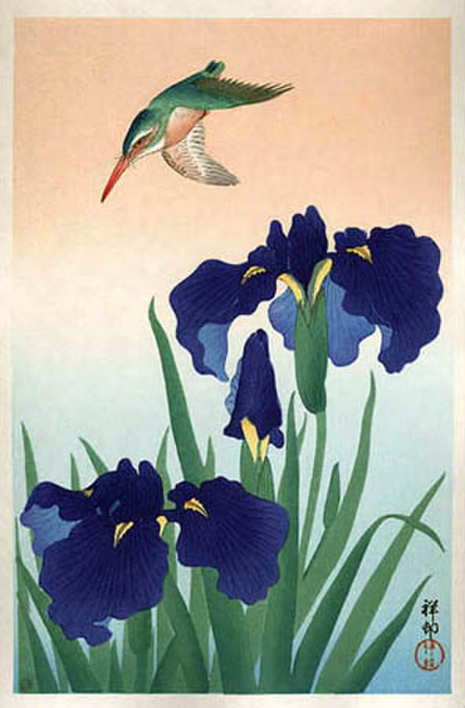 [Bird-and-flower painting](https://en.wikipedia.org/wiki/Bird-and-flower_painting "Bird-and-flower painting"): _Kingfisher and iris_ _kachō-e_ woodblock print by Ohara Koson (late 19th century)

Both real and [fictitious plants](https://en.wikipedia.org/wiki/Fictional_plants "Fictional plants") play a wide variety of [roles in literature and film](https://en.wikipedia.org/wiki/List_of_fictional_plants "List of fictional plants"). Flowers are the subjects of many poems by poets such as [William Blake](https://en.wikipedia.org/wiki/William_Blake "William Blake"), [Robert Frost](https://en.wikipedia.org/wiki/Robert_Frost "Robert Frost"), and [Rabindranath Tagore](https://en.wikipedia.org/wiki/Rabindranath_Tagore "Rabindranath Tagore"). [Bird-and-flower painting](https://en.wikipedia.org/wiki/Bird-and-flower_painting "Bird-and-flower painting") (_Huaniaohua_) is a kind of [Chinese painting](https://en.wikipedia.org/wiki/Chinese_painting "Chinese painting") that celebrates the beauty of flowering plants. Flowers have been [used in literature to convey meaning](https://en.wikipedia.org/wiki/Language_of_flowers "Language of flowers") by authors including [William Shakespeare](https://en.wikipedia.org/wiki/William_Shakespeare "William Shakespeare"). Flowers are used in a variety of art forms which arrange cut or living plants, such as [bonsai](https://en.wikipedia.org/wiki/Bonsai "Bonsai"), [ikebana](https://en.wikipedia.org/wiki/Ikebana "Ikebana"), and flower arranging. [Ornamental plants](https://en.wikipedia.org/wiki/Ornamental_plant "Ornamental plant") have sometimes changed the course of history, as in [tulipomania](https://en.wikipedia.org/wiki/Tulip_mania "Tulip mania"). Many countries and regions have [floral emblems](https://en.wikipedia.org/wiki/Floral_emblem "Floral emblem"); a survey of 70 of these found that the most popular flowering plant family for such emblems is Orchidaceae at 15.7% (11 emblems), followed by Fabaceae at 10% (7 emblems), and Asparagaceae, Asteraceae, and Rosaceae all at 5.7% (4 emblems each).

### Conservation

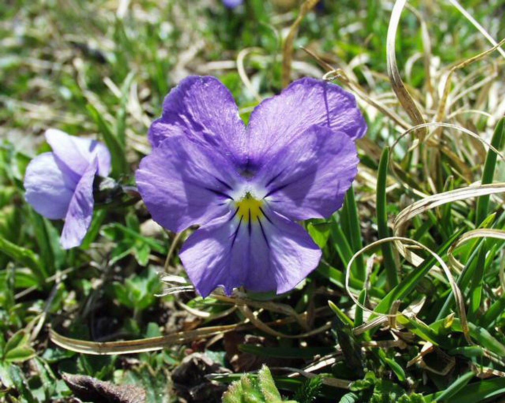_[Viola calcarata](https://en.wikipedia.org/wiki/Viola_calcarata "Viola calcarata")_, a species highly vulnerable to climate change.

[Human impact on the environment](https://en.wikipedia.org/wiki/Human_impact_on_the_environment "Human impact on the environment") has driven a range of species extinct and [is threatening even more today](https://en.wikipedia.org/wiki/Holocene_extinction "Holocene extinction"). Multiple organizations such as [IUCN](https://en.wikipedia.org/wiki/IUCN "IUCN") and [Royal Botanic Gardens, Kew](https://en.wikipedia.org/wiki/Royal_Botanic_Gardens,_Kew "Royal Botanic Gardens, Kew") suggest that around 40% of plant species are threatened with extinction. The majority are threatened by [habitat loss](https://en.wikipedia.org/wiki/Habitat_destruction "Habitat destruction"), but activities such as logging of wild timber trees and collection of medicinal plants, or the introduction of non-native [invasive species](https://en.wikipedia.org/wiki/Invasive_species "Invasive species"), also play a role.

Relatively few plant diversity assessments have considered [climate change](https://en.wikipedia.org/wiki/Climate_change "Climate change"), yet it is [starting to impact plants](https://en.wikipedia.org/wiki/Effects_of_climate_change_on_plant_biodiversity "Effects of climate change on plant biodiversity") as well. About 3% of flowering plants are very likely to be driven extinct within a century at 2 °C (3.6 °F) of global warming, and 10% at 3.2 °C (5.8 °F). In worst-case scenarios, half of all tree species may be driven extinct by climate change over that timeframe.

Conservation in this context is the attempt to prevent extinction, whether _[in situ](https://en.wikipedia.org/wiki/In_situ "In situ")_ by protecting plants and their habitats in the wild, or _[ex situ](https://en.wikipedia.org/wiki/Ex_situ_conservation "Ex situ conservation")_ in [seed banks](https://en.wikipedia.org/wiki/Seed_bank "Seed bank") or as living plants. Some 3000 [botanic gardens](https://en.wikipedia.org/wiki/Botanic_gardens "Botanic gardens") around the world maintain living plants, including over 40% of the species known to be threatened, as an "insurance policy against extinction in the wild." The [United Nations](https://en.wikipedia.org/wiki/United_Nations "United Nations")' [Global Strategy for Plant Conservation](https://en.wikipedia.org/wiki/Global_Strategy_for_Plant_Conservation "Global Strategy for Plant Conservation") asserts that "without plants, there is no life". It aims to "halt the continuing loss of plant diversity" throughout the world.
