Fungi

Temporal range: Middle [Ordovician](https://en.wikipedia.org/wiki/Ordovician "Ordovician") – [Present](https://en.wikipedia.org/wiki/Holocene "Holocene") (but [see text](/source/fungus/#Evolution))

![A collage of five fungi (clockwise from top left): a mushroom with a flat red top with white spots and a white stem growing on the ground; a red cup-shaped fungus growing on wood; a stack of green and white moldy bread slices on a plate; a microscopic spherical grey semitransparent cell with a smaller spherical cell beside it; a microscopic view of an elongated cellular structure shaped like a microphone, attached to the larger end is a number of smaller roughly circular elements that collectively form a mass around it](../media/fungus/Fungi_collage.jpg)

Clockwise from top left:

*   _[Amanita muscaria](https://en.wikipedia.org/wiki/Amanita_muscaria "Amanita muscaria")_, a basidiomycete;
*   _[Sarcoscypha coccinea](https://en.wikipedia.org/wiki/Sarcoscypha_coccinea "Sarcoscypha coccinea")_, an ascomycete;
*   bread covered in [mold](https://en.wikipedia.org/wiki/Mold_\(fungus\) "Mold (fungus)");
*   a [chytrid](https://en.wikipedia.org/wiki/Chytrid "Chytrid");
*   an _[Aspergillus](https://en.wikipedia.org/wiki/Aspergillus "Aspergillus")_[conidiophore](https://en.wikipedia.org/wiki/Conidiophore "Conidiophore").

[Scientific classification](https://en.wikipedia.org/wiki/Taxonomy_\(biology\) "Taxonomy (biology)") 

Domain:

[Eukaryota](https://en.wikipedia.org/wiki/Eukaryote "Eukaryote")

_Clade_:

[Podiata](https://en.wikipedia.org/wiki/Podiata "Podiata")

_Clade_:

[Amorphea](https://en.wikipedia.org/wiki/Amorphea "Amorphea")

_Clade_:

[Obazoa](https://en.wikipedia.org/wiki/Obazoa "Obazoa")

_Clade_:

[Opisthokonta](https://en.wikipedia.org/wiki/Opisthokont "Opisthokont")

_Clade_:

[Holomycota](https://en.wikipedia.org/wiki/Holomycota "Holomycota")

Kingdom:

[Fungi](/source/fungus/)
[R.T.Moore](https://en.wikipedia.org/wiki/R.T.Moore "R.T.Moore") (1980)

Subkingdoms/phyla

*   [Rozellomyceta](https://en.wikipedia.org/wiki/Rozellomyceta "Rozellomyceta")
    *   [Rozellomycota](https://en.wikipedia.org/wiki/Rozellomycota "Rozellomycota")
        *   [Microsporidia](https://en.wikipedia.org/wiki/Microsporidia "Microsporidia")
*   [Aphelidiomyceta](https://en.wikipedia.org/wiki/Aphelidiomyceta "Aphelidiomyceta")
    *   [Aphelidiomycota](https://en.wikipedia.org/wiki/Aphelidiomycota "Aphelidiomycota")
*   "Eumycota"
    *   Chytridiomyceta
        *   [Neocallimastigomycota](https://en.wikipedia.org/wiki/Neocallimastigomycota "Neocallimastigomycota")
        *   Monoblepharomycota
        *   [Chytridiomycota](https://en.wikipedia.org/wiki/Chytridiomycota "Chytridiomycota")
    *   [Blastocladiomyceta](https://en.wikipedia.org/wiki/Blastocladiomyceta "Blastocladiomyceta")
        *   [Blastocladiomycota](https://en.wikipedia.org/wiki/Blastocladiomycota "Blastocladiomycota")
        *   [Sanchytriomycota](https://en.wikipedia.org/wiki/Sanchytriomycota "Sanchytriomycota")
    *   [Amastigomycota](https://en.wikipedia.org/wiki/Amastigomycota "Amastigomycota")
        *   [Basidiobolomyceta](https://en.wikipedia.org/wiki/Basidiobolomyceta "Basidiobolomyceta")
            *   [Basidiobolomycota](https://en.wikipedia.org/wiki/Basidiobolomycota "Basidiobolomycota")
        *   [Olpidiomyceta](https://en.wikipedia.org/wiki/Olpidiomyceta "Olpidiomyceta")
            *   [Olpidiomycota](https://en.wikipedia.org/wiki/Olpidiomycota "Olpidiomycota")
        *   [Zoopagomyceta](https://en.wikipedia.org/wiki/Zoopagomyceta "Zoopagomyceta")
            *   [Zoopagomycota](https://en.wikipedia.org/wiki/Zoopagomycota "Zoopagomycota")
            *   [Entomophthoromycota](https://en.wikipedia.org/wiki/Entomophthoromycota "Entomophthoromycota")
            *   [Kickxellomycota](https://en.wikipedia.org/wiki/Kickxellomycota "Kickxellomycota")
        *   Mortierellomyceta
            *   [Mortierellomycota](https://en.wikipedia.org/wiki/Mortierellomycota "Mortierellomycota")
        *   [Mucoromyceta](https://en.wikipedia.org/wiki/Mucoromyceta "Mucoromyceta") (possibly [paraphyletic](https://en.wikipedia.org/wiki/Paraphyly "Paraphyly"))
            *   [Calcarisporiellomycota](https://en.wikipedia.org/wiki/Calcarisporiellomycota "Calcarisporiellomycota")
            *   [Mucoromycota](https://en.wikipedia.org/wiki/Mucoromycota "Mucoromycota")
            *   [Mortierellomycota](https://en.wikipedia.org/wiki/Mortierellomycota "Mortierellomycota")
            *   [Glomeromycota](https://en.wikipedia.org/wiki/Glomeromycota "Glomeromycota")
        *   [Dikarya](https://en.wikipedia.org/wiki/Dikarya "Dikarya")
            *   [Entorrhizomycota](https://en.wikipedia.org/wiki/Entorrhizomycota "Entorrhizomycota")
            *   [Basidiomycota](https://en.wikipedia.org/wiki/Basidiomycota "Basidiomycota")
            *   [Ascomycota](https://en.wikipedia.org/wiki/Ascomycota "Ascomycota")

A **fungus** (pl.: fungi or funguses) is any member of the group of [eukaryotic](https://en.wikipedia.org/wiki/Eukaryotic "Eukaryotic") organisms that includes [yeasts](https://en.wikipedia.org/wiki/Yeast "Yeast"), [molds](https://en.wikipedia.org/wiki/Mold "Mold"), as well as [mushrooms](https://en.wikipedia.org/wiki/Mushroom "Mushroom"). These organisms are classified in the [biological kingdom](https://en.wikipedia.org/wiki/Kingdom_\(biology\) "Kingdom (biology)") **Fungi**.

A characteristic that places fungus in a different kingdom from [plants](https://en.wikipedia.org/wiki/Plant "Plant"), [bacteria](https://en.wikipedia.org/wiki/Bacteria "Bacteria"), and some [protists](https://en.wikipedia.org/wiki/Protist "Protist") is having [chitin](https://en.wikipedia.org/wiki/Chitin "Chitin") in their [cell walls](https://en.wikipedia.org/wiki/Cell_wall "Cell wall"). Fungi, like animals, are [heterotrophs](https://en.wikipedia.org/wiki/Heterotroph "Heterotroph"): they acquire their [nutrition](https://en.wikipedia.org/wiki/Nutrition "Nutrition") by absorbing dissolved [organic molecules](https://en.wikipedia.org/wiki/Organic_compound "Organic compound"), typically by secreting [digestive enzymes](https://en.wikipedia.org/wiki/Digestive_enzyme "Digestive enzyme") into their environment. A fungus does not perform [photosynthesis](https://en.wikipedia.org/wiki/Photosynthesis "Photosynthesis"). Growth is their means of [motility](https://en.wikipedia.org/wiki/Motility "Motility"), except for [spores](https://en.wikipedia.org/wiki/Spore "Spore") (a few of which are [flagellated](https://en.wikipedia.org/wiki/Flagellate "Flagellate")), which may travel through the air or water. Fungi are the principal [decomposers](https://en.wikipedia.org/wiki/Decomposer "Decomposer") in ecological systems. These and other differences place fungi in a single group of related organisms, named the _Eumycota_ (_true fungi_ or _Eumycetes_), that share a [common ancestor](https://en.wikipedia.org/wiki/Common_ancestor "Common ancestor") (i.e. they form a _[monophyletic](https://en.wikipedia.org/wiki/Monophyletic "Monophyletic") group_), an interpretation that is also strongly supported by [molecular phylogenetics](https://en.wikipedia.org/wiki/Molecular_phylogenetics "Molecular phylogenetics"). This fungal group is distinct from the structurally similar [myxomycetes](https://en.wikipedia.org/wiki/Mycetozoa "Mycetozoa") (slime molds) and [oomycetes](https://en.wikipedia.org/wiki/Oomycete "Oomycete") (water molds). The discipline of [biology](https://en.wikipedia.org/wiki/Biology "Biology") devoted to the study of fungi is called [mycology](https://en.wikipedia.org/wiki/Mycology "Mycology") (from the [Greek](https://en.wikipedia.org/wiki/Greek_language "Greek language") μύκης, _mykes_ 'mushroom'). In the past, mycology was regarded as a branch of [botany](https://en.wikipedia.org/wiki/Botany "Botany"), although it is now known that fungi are genetically more closely related to animals than to plants.

Abundant worldwide, most fungi are inconspicuous because of the small size of their structures, and their [cryptic](https://en.wikipedia.org/wiki/Crypsis "Crypsis") lifestyles in soil or on dead matter. Fungi include [symbionts](https://en.wikipedia.org/wiki/Symbionts "Symbionts") of plants, animals, or other fungi and also [parasites](https://en.wikipedia.org/wiki/Parasites "Parasites"). They may become noticeable when [fruiting](https://en.wikipedia.org/wiki/Sporocarp_\(fungi\) "Sporocarp (fungi)"), either as mushrooms or as molds. Fungi perform an essential role in the decomposition of organic matter and have fundamental roles in nutrient [cycling](https://en.wikipedia.org/wiki/Biogeochemical_cycle "Biogeochemical cycle") and exchange in the environment. Over 90% of plants are dependent on [Mycorrhizal](/source/mycorrhiza/ "Mycorrhiza") symbiosis between plants and fungi and this process also enhances photosynthesis in plants, increasing carbon uptake from the atmosphere and helping to stop [climate change](https://en.wikipedia.org/wiki/Climate_change "Climate change"). They have long been used as a direct [source of human food](https://en.wikipedia.org/wiki/Fungivore "Fungivore"), in the form of mushrooms and [truffles](https://en.wikipedia.org/wiki/Truffles "Truffles"); as a [leavening agent](https://en.wikipedia.org/wiki/Leavening_agent "Leavening agent") for bread; and in the [fermentation](https://en.wikipedia.org/wiki/Fermentation_\(food\) "Fermentation (food)") of various food products, such as [wine](https://en.wikipedia.org/wiki/Fermentation_in_winemaking "Fermentation in winemaking"), [beer](https://en.wikipedia.org/wiki/Beer_fermentation "Beer fermentation"), and [soy sauce](https://en.wikipedia.org/wiki/Soy_sauce "Soy sauce"). Since the 1940s, fungi have been used for the production of [antibiotics](https://en.wikipedia.org/wiki/Antibiotic "Antibiotic"), and, more recently, various [enzymes](https://en.wikipedia.org/wiki/Enzyme "Enzyme") produced by fungi are used [industrially](https://en.wikipedia.org/wiki/Enzyme#Industrial_applications "Enzyme") and in [detergents](https://en.wikipedia.org/wiki/Protease#Biodiversity_of_proteases "Protease"). Fungi are also used as [biological pesticides](https://en.wikipedia.org/wiki/Biological_pesticide "Biological pesticide") to control weeds, plant diseases, and insect pests. Many species produce [bioactive compounds](https://en.wikipedia.org/wiki/Bioactive_compound "Bioactive compound") called [mycotoxins](https://en.wikipedia.org/wiki/Mycotoxin "Mycotoxin"), such as [alkaloids](https://en.wikipedia.org/wiki/Alkaloid "Alkaloid") and [polyketides](https://en.wikipedia.org/wiki/Polyketide "Polyketide"), that are toxic to animals, including humans. The fruiting structures of [a few species](https://en.wikipedia.org/wiki/Psychoactive_mushrooms "Psychoactive mushrooms") contain [psychotropic](https://en.wikipedia.org/wiki/Psychotropic "Psychotropic") compounds and are consumed [recreationally](https://en.wikipedia.org/wiki/Recreational_drug_use "Recreational drug use") or in traditional [spiritual ceremonies](https://en.wikipedia.org/wiki/Entheogen "Entheogen"). Fungi can break down manufactured materials and buildings, and become significant [pathogens](https://en.wikipedia.org/wiki/Pathogenic_fungus "Pathogenic fungus") of humans and other animals. Losses of crops due to fungal diseases (e.g., [rice blast disease](https://en.wikipedia.org/wiki/Rice_blast_disease "Rice blast disease")) or [food spoilage](https://en.wikipedia.org/wiki/Food_spoilage "Food spoilage") can have a large impact on human [food supplies](https://en.wikipedia.org/wiki/Food_security "Food security") and local economies. Fungi are threatened by [fungicides](https://en.wikipedia.org/wiki/Fungicide "Fungicide"), [pesticides](https://en.wikipedia.org/wiki/Pesticide "Pesticide"), [pollution](https://en.wikipedia.org/wiki/Pollution "Pollution"), [deforestation](https://en.wikipedia.org/wiki/Deforestation "Deforestation") and more.

The fungus kingdom encompasses an enormous diversity of [taxa](https://en.wikipedia.org/wiki/Taxa "Taxa") with varied ecologies, [life cycle](https://en.wikipedia.org/wiki/Biological_life_cycle "Biological life cycle") strategies, and [morphologies](https://en.wikipedia.org/wiki/Morphology_\(biology\) "Morphology (biology)") ranging from unicellular aquatic [chytrids](https://en.wikipedia.org/wiki/Chytrid "Chytrid") to large mushrooms. However, little is known of the true [biodiversity](https://en.wikipedia.org/wiki/Biodiversity "Biodiversity") of the fungus kingdom, which has been estimated at 2.2 million to 3.8 million species. Of these, only about 148,000 have been described, with over 8,000 species known to be detrimental to plants and at least 300 that can be pathogenic to humans. Ever since the pioneering 18th and 19th century [taxonomical](https://en.wikipedia.org/wiki/Taxonomy_\(biology\) "Taxonomy (biology)") works of [Carl Linnaeus](https://en.wikipedia.org/wiki/Carl_Linnaeus "Carl Linnaeus"), [Christiaan Hendrik Persoon](https://en.wikipedia.org/wiki/Christiaan_Hendrik_Persoon "Christiaan Hendrik Persoon"), and [Elias Magnus Fries](https://en.wikipedia.org/wiki/Elias_Magnus_Fries "Elias Magnus Fries"), fungi have been classified according to their morphology (e.g., characteristics such as spore color or microscopic features) or [physiology](https://en.wikipedia.org/wiki/Physiology "Physiology"). Advances in [molecular genetics](https://en.wikipedia.org/wiki/Molecular_genetics "Molecular genetics") have opened the way for [DNA analysis](https://en.wikipedia.org/wiki/DNA_sequencing "DNA sequencing") to be incorporated into taxonomy, which has sometimes challenged the historical groupings based on morphology and other traits. [Phylogenetic](https://en.wikipedia.org/wiki/Phylogenetic "Phylogenetic") studies published in the first decade of the 21st century have helped reshape the classification within the fungi kingdom, which is divided into one [subkingdom](https://en.wikipedia.org/wiki/Kingdom_\(biology\)#Definition_and_associated_terms "Kingdom (biology)"), seven [phyla](https://en.wikipedia.org/wiki/Phylum "Phylum"), and ten [subphyla](https://en.wikipedia.org/wiki/Subphyla "Subphyla").

## Etymology

The English word _fungus_ is directly adopted from the [Latin](https://en.wikipedia.org/wiki/Latin "Latin") _[fungus](https://en.wiktionary.org/wiki/fungus#Latin "wikt:fungus")_ 'mushroom', used in the writings of [Horace](https://en.wikipedia.org/wiki/Horace "Horace") and [Pliny](https://en.wikipedia.org/wiki/Pliny_the_Elder "Pliny the Elder"). This in turn is derived from the [Greek](https://en.wikipedia.org/wiki/Ancient_Greek "Ancient Greek") word _sphongos_ ([σφόγγος](https://en.wiktionary.org/wiki/σφόγγος#Ancient_Greek "wikt:σφόγγος") 'sponge'), which refers to the [macroscopic](https://en.wikipedia.org/wiki/Macroscopic "Macroscopic") structures and morphology of mushrooms and molds; the [root](https://en.wikipedia.org/wiki/Root_\(linguistics\) "Root (linguistics)") is also used in other languages, such as the German _[Schwamm](https://en.wiktionary.org/wiki/Schwamm#German "wikt:Schwamm")_ 'sponge' and _[Schimmel](https://en.wiktionary.org/wiki/Schimmel#German "wikt:Schimmel")_ 'mold'.

The word _[mycology](https://en.wikipedia.org/wiki/Mycology "Mycology")_ is derived from the Greek _mykes_ ([μύκης](https://en.wiktionary.org/wiki/μύκης#Ancient_Greek "wikt:μύκης") 'mushroom') and _logos_ ([λόγος](https://en.wiktionary.org/wiki/λόγος#Ancient_Greek "wikt:λόγος") 'discourse'). It denotes the scientific study of fungi. The Latin adjectival form of "mycology" (_mycologicæ_) appeared as early as 1796 in a book on the subject by [Christiaan Hendrik Persoon](https://en.wikipedia.org/wiki/Christiaan_Hendrik_Persoon "Christiaan Hendrik Persoon"). The word appeared in English as early as 1824 in a book by [Robert Kaye Greville](https://en.wikipedia.org/wiki/Robert_Kaye_Greville "Robert Kaye Greville"). In 1836 the English naturalist [Miles Joseph Berkeley](https://en.wikipedia.org/wiki/Miles_Joseph_Berkeley "Miles Joseph Berkeley")'s publication _The English Flora of Sir James Edward Smith, Vol. 5._ also refers to mycology as the study of fungi.

A group of all the fungi present in a particular region is known as _[mycobiota](https://en.wikipedia.org/wiki/Mycobiota "Mycobiota")_ (plural noun, no singular). The term _mycota_ is often used for this purpose, but many authors use it as a synonym of fungi. The word _[funga](https://en.wikipedia.org/wiki/Funga "Funga")_ has been proposed as a less ambiguous term morphologically similar to [fauna](https://en.wikipedia.org/wiki/Fauna "Fauna") and [flora](https://en.wikipedia.org/wiki/Flora "Flora"). The [Species Survival Commission](https://en.wikipedia.org/wiki/Species_Survival_Commission "Species Survival Commission") (SSC) of the [International Union for Conservation of Nature](https://en.wikipedia.org/wiki/International_Union_for_Conservation_of_Nature "International Union for Conservation of Nature") (IUCN) in August 2021 asked that the phrase _fauna and flora_ be replaced by _fauna, flora, and funga_.

## Characteristics

**Fungal hyphae cells**

1.  [Hyphal wall](https://en.wikipedia.org/wiki/Hypha "Hypha")
2.  [Septum](https://en.wikipedia.org/wiki/Septum_\(cell_biology\) "Septum (cell biology)")
3.  [Mitochondrion](https://en.wikipedia.org/wiki/Mitochondrion "Mitochondrion")
4.  [Vacuole](https://en.wikipedia.org/wiki/Vacuole "Vacuole")
5.  [Ergosterol](https://en.wikipedia.org/wiki/Ergosterol "Ergosterol") crystal
6.  [Ribosome](https://en.wikipedia.org/wiki/Ribosome "Ribosome")
7.  Nucleus
8.  [Endoplasmic reticulum](https://en.wikipedia.org/wiki/Endoplasmic_reticulum "Endoplasmic reticulum")
9.  [Lipid body](https://en.wikipedia.org/wiki/Lipid_body "Lipid body")
10.  [Plasma membrane](https://en.wikipedia.org/wiki/Plasma_membrane "Plasma membrane")
11.  [Spitzenkörper](https://en.wikipedia.org/wiki/Spitzenkörper "Spitzenkörper")
12.  [Golgi apparatus](https://en.wikipedia.org/wiki/Golgi_apparatus "Golgi apparatus")

Fungal cell cycle showing [dikaryons](https://en.wikipedia.org/wiki/Dikaryon "Dikaryon") typical of [higher fungi](https://en.wikipedia.org/wiki/Higher_fungi "Higher fungi")

Before the introduction of [molecular methods](https://en.wikipedia.org/wiki/Molecular_phylogenetics "Molecular phylogenetics") for phylogenetic analysis, [taxonomists](https://en.wikipedia.org/wiki/Taxonomy_\(biology\) "Taxonomy (biology)") considered fungi to be members of the [plant kingdom](https://en.wikipedia.org/wiki/Plant "Plant") because of similarities in lifestyle: both fungi and plants are mainly [immobile](https://en.wikipedia.org/wiki/Sessility_\(zoology\) "Sessility (zoology)"), and have similarities in general morphology and growth habit. Although inaccurate, the common misconception that fungi are plants persists among the general public due to their historical classification, as well as several similarities. Like plants, fungi often grow in soil and, in the case of [mushrooms](https://en.wikipedia.org/wiki/Mushroom "Mushroom"), form conspicuous [fruit bodies](https://en.wikipedia.org/wiki/Fruit_bodies "Fruit bodies"), which sometimes resemble plants such as [mosses](https://en.wikipedia.org/wiki/Mosses "Mosses"). The fungi are now considered a separate kingdom, distinct from both plants and animals, from which they appear to have [diverged](https://en.wikipedia.org/wiki/Genetic_divergence "Genetic divergence") around one billion years ago (around the start of the [Neoproterozoic](https://en.wikipedia.org/wiki/Neoproterozoic "Neoproterozoic") Era). Some morphological, biochemical, and genetic features are shared with other organisms, while others are unique to the fungi, clearly separating them from the other kingdoms:

Shared features:

*   With other [eukaryotes](https://en.wikipedia.org/wiki/Eukaryote "Eukaryote"): Fungal cells contain [membrane-bound](https://en.wikipedia.org/wiki/Membrane-bound "Membrane-bound") nuclei with [chromosomes](https://en.wikipedia.org/wiki/Chromosomes "Chromosomes") that contain [DNA](https://en.wikipedia.org/wiki/DNA "DNA") with [noncoding regions](https://en.wikipedia.org/wiki/Noncoding_DNA "Noncoding DNA") called [introns](https://en.wikipedia.org/wiki/Intron "Intron") and coding regions called [exons](https://en.wikipedia.org/wiki/Exons "Exons"). Fungi have membrane-bound cytoplasmic [organelles](https://en.wikipedia.org/wiki/Organelles "Organelles") such as [mitochondria](https://en.wikipedia.org/wiki/Mitochondria "Mitochondria"), [sterol](https://en.wikipedia.org/wiki/Sterol "Sterol")-containing membranes, and [ribosomes](https://en.wikipedia.org/wiki/Ribosomes "Ribosomes") of the [80S](https://en.wikipedia.org/wiki/80S "80S") type. They have a characteristic range of soluble carbohydrates and storage compounds, including [sugar alcohols](https://en.wikipedia.org/wiki/Sugar_alcohol "Sugar alcohol") (e.g., [mannitol](https://en.wikipedia.org/wiki/Mannitol "Mannitol")), [disaccharides](https://en.wikipedia.org/wiki/Disaccharide "Disaccharide"), (e.g., [trehalose](https://en.wikipedia.org/wiki/Trehalose "Trehalose")), and [polysaccharides](https://en.wikipedia.org/wiki/Polysaccharide "Polysaccharide") (e.g., [glycogen](https://en.wikipedia.org/wiki/Glycogen "Glycogen"), which is also found in animals).
*   With animals: Fungi lack [chloroplasts](https://en.wikipedia.org/wiki/Chloroplast "Chloroplast") and are [heterotrophic](https://en.wikipedia.org/wiki/Heterotroph "Heterotroph") organisms and so require preformed [organic compounds](https://en.wikipedia.org/wiki/Organic_compound "Organic compound") as energy sources.
*   With plants: Fungi have a cell wall and [vacuoles](https://en.wikipedia.org/wiki/Vacuole "Vacuole"). They reproduce by both sexual and asexual means, and like [basal](https://en.wikipedia.org/wiki/Primitive_\(phylogenetics\) "Primitive (phylogenetics)") plant groups (such as [ferns](https://en.wikipedia.org/wiki/Fern "Fern") and [mosses](/source/moss/ "Moss")) produce [spores](https://en.wikipedia.org/wiki/Spore "Spore"). Similar to mosses and algae, fungi typically have [haploid](https://en.wikipedia.org/wiki/Haploid "Haploid") nuclei.
*   With [euglenoids](https://en.wikipedia.org/wiki/Euglenoid "Euglenoid") and bacteria: Higher fungi, euglenoids, and some bacteria produce the [amino acid](https://en.wikipedia.org/wiki/Amino_acid "Amino acid")L-lysine in specific [biosynthesis](https://en.wikipedia.org/wiki/Biosynthesis "Biosynthesis") steps, called the [α-aminoadipate pathway](https://en.wikipedia.org/wiki/Α-aminoadipate_pathway "Α-aminoadipate pathway").
*   In common with some plant and animal species, [more than one hundred fungal species](https://en.wikipedia.org/wiki/List_of_bioluminescent_fungi "List of bioluminescent fungi") display [bioluminescence](https://en.wikipedia.org/wiki/Bioluminescence "Bioluminescence").

Unique features:

*   The cells of most fungi grow as tubular, elongated, and thread-like (filamentous) structures called [hyphae](https://en.wikipedia.org/wiki/Hypha "Hypha"), which may contain multiple nuclei and extend by growing at their tips. Each tip contains a set of aggregated [vesicles](https://en.wikipedia.org/wiki/Vesicle_\(biology\) "Vesicle (biology)")—cellular structures consisting of [proteins](https://en.wikipedia.org/wiki/Protein "Protein"), [lipids](https://en.wikipedia.org/wiki/Lipid "Lipid"), and other organic molecules—called the [Spitzenkörper](https://en.wikipedia.org/wiki/Spitzenkörper "Spitzenkörper"). Both fungi and [oomycetes](https://en.wikipedia.org/wiki/Oomycete "Oomycete") grow as filamentous hyphal cells. In contrast, similar-looking organisms, such as filamentous [green algae](https://en.wikipedia.org/wiki/Green_algae "Green algae"), grow by repeated cell division within a chain of cells.
*   Some species grow as unicellular [yeasts](https://en.wikipedia.org/wiki/Yeasts "Yeasts") that do not form hyphae and reproduce by [budding](https://en.wikipedia.org/wiki/Budding "Budding") or [fission](https://en.wikipedia.org/wiki/Fission_\(biology\) "Fission (biology)"). [Dimorphic fungi](https://en.wikipedia.org/wiki/Dimorphic_fungi "Dimorphic fungi") can switch between a yeast phase and a hyphal phase in response to environmental conditions.
*   The fungal cell wall is made of a [chitin-glucan complex](https://en.wikipedia.org/wiki/Chitin-glucan_complex "Chitin-glucan complex"); while [glucans](https://en.wikipedia.org/wiki/Glucans "Glucans") are also found in plants and [chitin](https://en.wikipedia.org/wiki/Chitin "Chitin") in the [exoskeleton](https://en.wikipedia.org/wiki/Exoskeleton "Exoskeleton") of [arthropods](https://en.wikipedia.org/wiki/Arthropods "Arthropods"), fungi are the only organisms that combine these two structural molecules in their cell wall. Unlike those of plants and oomycetes, fungal cell walls do not contain cellulose.

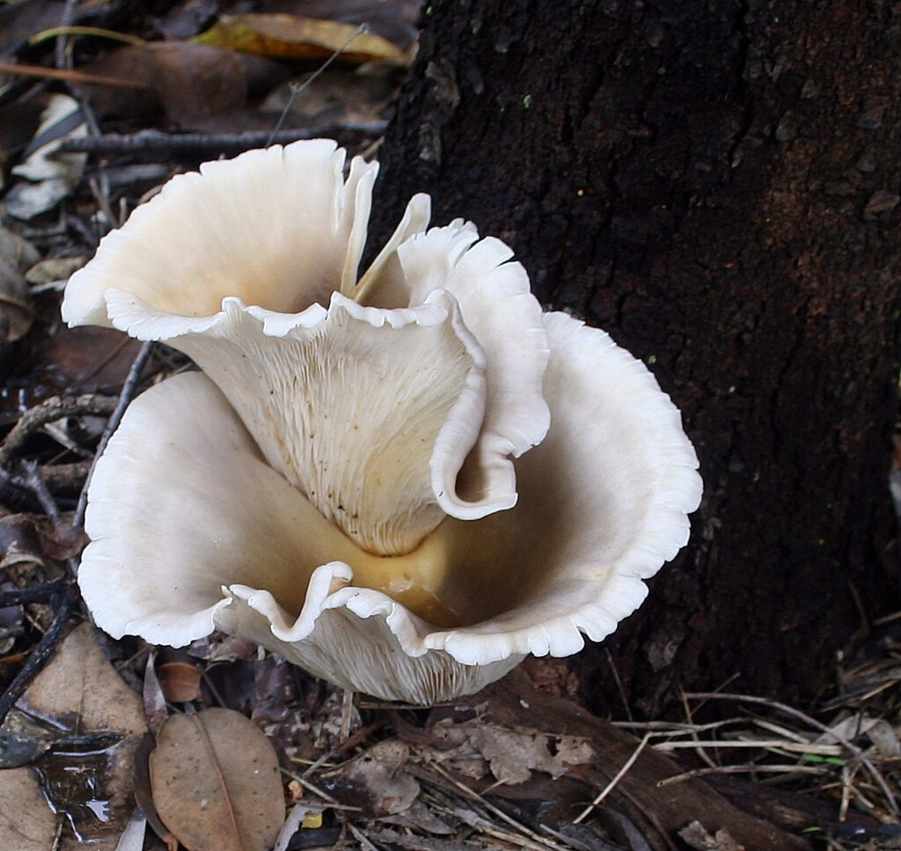_[Omphalotus nidiformis](https://en.wikipedia.org/wiki/Omphalotus_nidiformis "Omphalotus nidiformis")_, a bioluminescent mushroom

Most fungi lack an efficient system for the long-distance transport of water and nutrients, such as the [xylem](https://en.wikipedia.org/wiki/Xylem "Xylem") and [phloem](https://en.wikipedia.org/wiki/Phloem "Phloem") in many plants. To overcome this limitation, some fungi, such as _[Armillaria](https://en.wikipedia.org/wiki/Armillaria "Armillaria")_, form [rhizomorphs](https://en.wikipedia.org/wiki/Rhizomorphs "Rhizomorphs"), which resemble and perform functions similar to the [roots](https://en.wikipedia.org/wiki/Root "Root") of plants. As eukaryotes, fungi possess a [biosynthetic pathway](https://en.wikipedia.org/wiki/Biochemical_pathway "Biochemical pathway") for producing [terpenes](https://en.wikipedia.org/wiki/Terpene "Terpene") that uses [mevalonic acid](https://en.wikipedia.org/wiki/Mevalonic_acid "Mevalonic acid") and [pyrophosphate](https://en.wikipedia.org/wiki/Pyrophosphate "Pyrophosphate") as [chemical building blocks](https://en.wikipedia.org/wiki/Precursor_\(chemistry\) "Precursor (chemistry)"). Plants and some other organisms have an additional terpene biosynthesis pathway in their chloroplasts, a structure that fungi and animals do not have. Fungi produce several [secondary metabolites](https://en.wikipedia.org/wiki/Secondary_metabolite "Secondary metabolite") that are similar or identical in structure to those made by plants. Many of the plant and fungal enzymes that make these compounds differ from each other in [sequence](https://en.wikipedia.org/wiki/Peptide_sequence "Peptide sequence") and other characteristics, which indicates separate origins and [convergent evolution](https://en.wikipedia.org/wiki/Convergent_evolution "Convergent evolution") of these enzymes in the fungi and plants.

## Diversity

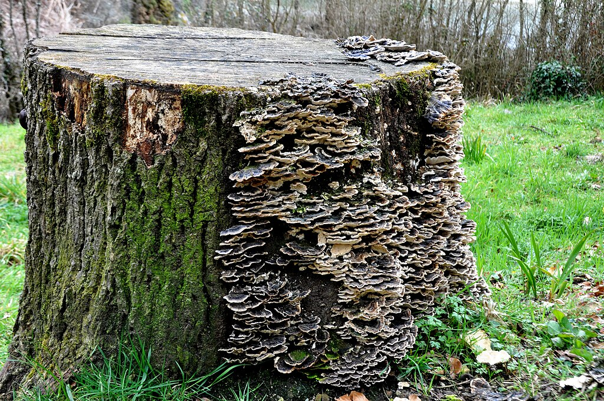[Bracket fungi](https://en.wikipedia.org/wiki/Bracket_fungi "Bracket fungi") on a tree stump

Fungi have a worldwide distribution, and grow in a wide range of habitats, including extreme environments such as [deserts](https://en.wikipedia.org/wiki/Desert_fungi "Desert fungi") or areas with high salt concentrations or [ionizing radiation](https://en.wikipedia.org/wiki/Ionizing_radiation "Ionizing radiation"), as well as in [deep sea](https://en.wikipedia.org/wiki/Deep_sea "Deep sea") sediments. Some can survive the intense [UV](https://en.wikipedia.org/wiki/Ultraviolet_radiation "Ultraviolet radiation") and [cosmic radiation](https://en.wikipedia.org/wiki/Cosmic_radiation "Cosmic radiation") encountered during space travel. Most grow in terrestrial environments, though several species live partly or solely in aquatic habitats, such as the [chytrid](https://en.wikipedia.org/wiki/Chytrid "Chytrid") fungi _[Batrachochytrium dendrobatidis](https://en.wikipedia.org/wiki/Batrachochytrium_dendrobatidis "Batrachochytrium dendrobatidis")_ and _[B. salamandrivorans](https://en.wikipedia.org/wiki/Batrachochytrium_salamandrivorans "Batrachochytrium salamandrivorans")_, [parasites](https://en.wikipedia.org/wiki/Parasite "Parasite") that have been responsible for a worldwide decline in [amphibian](https://en.wikipedia.org/wiki/Amphibian "Amphibian") populations. These organisms spend part of their life cycle as a motile [zoospore](https://en.wikipedia.org/wiki/Zoospore "Zoospore"), enabling them to propel themselves through water and enter their amphibian host. Other examples of aquatic fungi include those living in [hydrothermal](https://en.wikipedia.org/wiki/Hydrothermal "Hydrothermal") areas of the ocean.

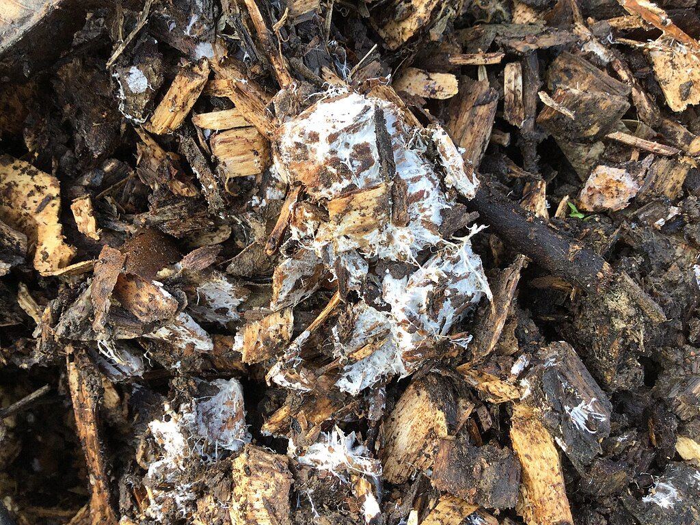Widespread white fungus in wood chip mulch in an [Oklahoma](https://en.wikipedia.org/wiki/Oklahoma "Oklahoma") garden

As of 2020, around 148,000 species of fungi have been [described](https://en.wikipedia.org/wiki/Species_description "Species description") by taxonomists, but the global biodiversity of the fungus kingdom is not fully understood. A 2017 estimate suggests there may be between 2.2 and 3.8 million species. The number of new fungi species discovered yearly has increased from 1,000 to 1,500 per year about 10 years ago, to about 2,000 with a peak of more than 2,500 species in 2016. In the year 2019, 1,882 new species of fungi were described, and it was estimated that more than 90% of fungi remain unknown. The following year, 2,905 new species were described—the highest annual record of new fungus names. In mycology, species have historically been distinguished by a variety of methods and concepts. Classification based on [morphological](https://en.wikipedia.org/wiki/Morphology_\(biology\) "Morphology (biology)") characteristics, such as the size and shape of spores or fruiting structures, has traditionally dominated fungal taxonomy. Species may also be distinguished by their [biochemical](https://en.wikipedia.org/wiki/Biochemical "Biochemical") and [physiological](https://en.wikipedia.org/wiki/Physiological "Physiological") characteristics, such as their ability to metabolize certain biochemicals, or their reaction to [chemical tests](https://en.wikipedia.org/wiki/Chemical_tests_in_mushroom_identification "Chemical tests in mushroom identification"). The [biological species concept](https://en.wikipedia.org/wiki/Biological_species_concept "Biological species concept") discriminates species based on their ability to [mate](https://en.wikipedia.org/wiki/Mating_in_fungi "Mating in fungi"). The application of [molecular](https://en.wikipedia.org/wiki/Molecular_biology "Molecular biology") tools, such as [DNA sequencing](https://en.wikipedia.org/wiki/DNA_sequencing "DNA sequencing") and phylogenetic analysis, to study diversity has greatly enhanced the resolution and added robustness to estimates of [genetic diversity](https://en.wikipedia.org/wiki/Genetic_diversity "Genetic diversity") within various taxonomic groups.

## Mycology

In 1729, [Pier Antonio Micheli](https://en.wikipedia.org/wiki/Pier_Antonio_Micheli "Pier Antonio Micheli") first published descriptions of fungi.

Mycology is the branch of [biology](https://en.wikipedia.org/wiki/Biology "Biology") concerned with the systematic study of fungi, including their genetic and biochemical properties, their taxonomy, and their use to humans as a source of medicine, food, and [psychotropic substances](https://en.wikipedia.org/wiki/Entheogen "Entheogen") consumed for religious purposes, as well as their dangers, such as poisoning or infection. The field of [phytopathology](https://en.wikipedia.org/wiki/Phytopathology "Phytopathology"), the study of plant diseases, is closely related because many plant pathogens are fungi.

The use of fungi by humans dates back to prehistory; [Ötzi the Iceman](https://en.wikipedia.org/wiki/Ötzi_the_Iceman "Ötzi the Iceman"), a well-preserved mummy of a 5,300-year-old [Neolithic](https://en.wikipedia.org/wiki/Neolithic "Neolithic") man found frozen in the Austrian Alps, carried two species of [polypore](https://en.wikipedia.org/wiki/Polypore "Polypore") mushrooms that may have been used as [tinder](https://en.wikipedia.org/wiki/Tinder "Tinder") (_[Fomes fomentarius](https://en.wikipedia.org/wiki/Fomes_fomentarius "Fomes fomentarius")_), or for medicinal purposes (_[Piptoporus betulinus](https://en.wikipedia.org/wiki/Piptoporus_betulinus "Piptoporus betulinus")_). Ancient peoples have used fungi as food sources—often unknowingly—for millennia, in the preparation of leavened bread and fermented juices. Some of the oldest written records contain references to crop destruction that was probably caused by pathogenic fungi.

### History

Mycology became a systematic science after the development of the [microscope](https://en.wikipedia.org/wiki/Microscope "Microscope") in the 17th century. Although fungal spores were first observed by [Giambattista della Porta](https://en.wikipedia.org/wiki/Giambattista_della_Porta "Giambattista della Porta") in 1588, the seminal work in the development of mycology is considered to be the publication of [Pier Antonio Micheli](https://en.wikipedia.org/wiki/Pier_Antonio_Micheli "Pier Antonio Micheli")'s 1729 work _Nova plantarum genera_. Micheli not only observed spores but also showed that, under the proper conditions, they could be induced into growing into the same species of fungi from which they originated. Extending the use of the [binomial system of nomenclature](https://en.wikipedia.org/wiki/Binomial_system_of_nomenclature "Binomial system of nomenclature") introduced by [Carl Linnaeus](https://en.wikipedia.org/wiki/Carl_Linnaeus "Carl Linnaeus") in his _[Species plantarum](https://en.wikipedia.org/wiki/Species_plantarum "Species plantarum")_ (1753), the Dutch Christiaan Hendrik Persoon (1761–1836) established the first classification of mushrooms with such skill as to be considered a founder of modern mycology. Later, [Elias Magnus Fries](https://en.wikipedia.org/wiki/Elias_Magnus_Fries "Elias Magnus Fries") (1794–1878) further elaborated the [classification](https://en.wikipedia.org/wiki/Biological_classification "Biological classification") of fungi, using spore color and microscopic characteristics, methods still used by taxonomists today. Other notable early contributors to mycology in the 17th–19th and early 20th centuries include Miles Joseph Berkeley, [August Carl Joseph Corda](https://en.wikipedia.org/wiki/August_Carl_Joseph_Corda "August Carl Joseph Corda"), [Anton de Bary](https://en.wikipedia.org/wiki/Anton_de_Bary "Anton de Bary"), the brothers [Louis René](https://en.wikipedia.org/wiki/Louis_René_Tulasne "Louis René Tulasne") and [Charles Tulasne](https://en.wikipedia.org/wiki/Charles_Tulasne "Charles Tulasne"), [Arthur H. R. Buller](https://en.wikipedia.org/wiki/Arthur_Henry_Reginald_Buller "Arthur Henry Reginald Buller"), [Curtis G. Lloyd](https://en.wikipedia.org/wiki/Curtis_Gates_Lloyd "Curtis Gates Lloyd"), and [Pier Andrea Saccardo](https://en.wikipedia.org/wiki/Pier_Andrea_Saccardo "Pier Andrea Saccardo"). In the 20th and 21st centuries, advances in [biochemistry](https://en.wikipedia.org/wiki/Biochemistry "Biochemistry"), [genetics](https://en.wikipedia.org/wiki/Genetics "Genetics"), molecular biology, [biotechnology](https://en.wikipedia.org/wiki/Biotechnology "Biotechnology"), DNA sequencing, and phylogenetic analysis have provided new insights into fungal relationships and [biodiversity](https://en.wikipedia.org/wiki/Biodiversity "Biodiversity"), and have challenged traditional morphology-based groupings in fungal taxonomy.

## Morphology

### Microscopic structures

An environmental isolate of _[Penicillium](https://en.wikipedia.org/wiki/Penicillium "Penicillium")_

1.  [Hypha](https://en.wikipedia.org/wiki/Hypha "Hypha")
2.  [Conidiophore](https://en.wikipedia.org/wiki/Conidiophore "Conidiophore")
3.  [Phialide](https://en.wikipedia.org/wiki/Phialide "Phialide")
4.  [Conidia](https://en.wikipedia.org/wiki/Conidia "Conidia")
5.  [Septa](https://en.wikipedia.org/wiki/Septum "Septum")

Most fungi grow as [hyphae](https://en.wikipedia.org/wiki/Hypha "Hypha"), which are cylindrical, thread-like structures 2–10[μm](https://en.wikipedia.org/wiki/Μm "Μm") in diameter and up to several centimeters in length. Hyphae grow at their tips (apices); new hyphae are typically formed by emergence of new tips along existing hyphae by a process called _branching_, or occasionally growing hyphal tips fork, giving rise to two parallel-growing hyphae. Hyphae also sometimes fuse when they come into contact, a process called hyphal fusion (or [anastomosis](https://en.wikipedia.org/wiki/Anastomosis "Anastomosis")). These growth processes lead to the development of a [mycelium](https://en.wikipedia.org/wiki/Mycelium "Mycelium"), an interconnected network of hyphae. Hyphae can be either [septate](https://en.wikipedia.org/wiki/Septate "Septate") or [coenocytic](https://en.wikipedia.org/wiki/Coenocytic "Coenocytic"). Septate hyphae are divided into compartments separated by cross walls (internal cell walls, called septa, that are formed at [right angles](https://en.wikipedia.org/wiki/Right_angle "Right angle") to the cell wall giving the hypha its shape), with each compartment containing one or more nuclei; coenocytic hyphae are not compartmentalized. Septa have [pores](https://en.wikipedia.org/wiki/Pit_connection#Characteristics "Pit connection") that allow [cytoplasm](https://en.wikipedia.org/wiki/Cytoplasm "Cytoplasm"), [organelles](https://en.wikipedia.org/wiki/Organelle "Organelle"), and sometimes nuclei to pass through; an example is the [dolipore septum](https://en.wikipedia.org/wiki/Dolipore_septum "Dolipore septum") in fungi of the phylum Basidiomycota. Coenocytic hyphae are in essence [multinucleate](https://en.wikipedia.org/wiki/Multinucleate "Multinucleate") supercells.

Many species have developed specialized hyphal structures for nutrient uptake from living hosts; examples include [haustoria](https://en.wikipedia.org/wiki/Haustoria "Haustoria") in plant-parasitic species of most fungal phyla, and [arbuscules](https://en.wikipedia.org/wiki/Arbuscular_mycorrhiza "Arbuscular mycorrhiza") of several [mycorrhizal](/source/mycorrhiza/ "Mycorrhiza") fungi, which penetrate into the host cells to consume nutrients.

Although fungi are [opisthokonts](https://en.wikipedia.org/wiki/Opisthokont "Opisthokont")—a grouping of evolutionarily related organisms broadly characterized by a single posterior [flagellum](https://en.wikipedia.org/wiki/Flagellum "Flagellum")—all phyla except for the [chytrids](https://en.wikipedia.org/wiki/Chytrids "Chytrids") and [blastocladiomycetes](https://en.wikipedia.org/wiki/Blastocladiomycota "Blastocladiomycota") have lost their posterior flagella. Fungi are unusual among the eukaryotes in having a cell wall that, in addition to [glucans](https://en.wikipedia.org/wiki/Glucan "Glucan") (e.g., [β-1,3-glucan](https://en.wikipedia.org/wiki/Β-1,3-glucan "Β-1,3-glucan")) and other typical components, also contains the [biopolymer](https://en.wikipedia.org/wiki/Biopolymer "Biopolymer") chitin.

### Macroscopic structures

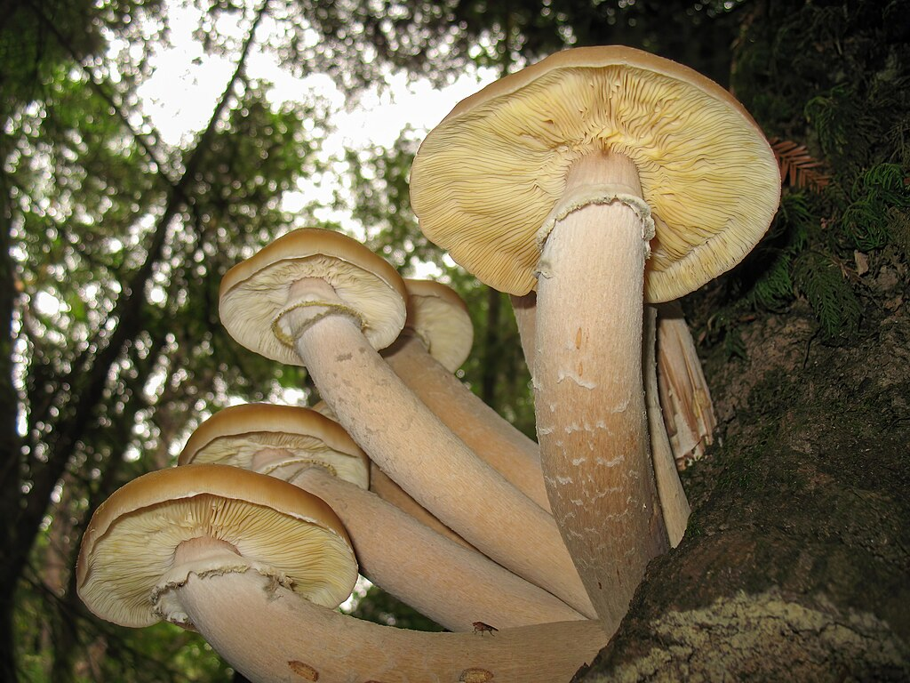_[Armillaria solidipes](https://en.wikipedia.org/wiki/Armillaria_solidipes "Armillaria solidipes")_

Fungal [mycelia](https://en.wikipedia.org/wiki/Mycelia "Mycelia") can become visible to the naked eye, for example, on various surfaces and [substrates](https://en.wikipedia.org/wiki/Substrate_\(biology\) "Substrate (biology)"), such as damp walls and spoiled food, where they are commonly called [molds](https://en.wikipedia.org/wiki/Mold_\(fungus\) "Mold (fungus)"). Mycelia grown on solid [agar](https://en.wikipedia.org/wiki/Agar "Agar") media in laboratory [petri dishes](https://en.wikipedia.org/wiki/Petri_dish "Petri dish") are usually referred to as [colonies](https://en.wikipedia.org/wiki/Colony_\(biology\) "Colony (biology)"). These colonies can exhibit growth shapes and colors (due to spores or [pigmentation](https://en.wikipedia.org/wiki/Biological_pigment "Biological pigment")) that can be used as diagnostic features in the identification of species or groups. Some individual fungal colonies can reach extraordinary dimensions and ages as in the case of a [clonal](https://en.wikipedia.org/wiki/Clone_\(cell_biology\) "Clone (cell biology)") colony of _[Armillaria solidipes](https://en.wikipedia.org/wiki/Armillaria_solidipes "Armillaria solidipes")_, which extends over an area of more than 900[ha](https://en.wikipedia.org/wiki/Hectare "Hectare") (3.5 square miles), with an estimated age of nearly 9,000years.

The [apothecium](https://en.wikipedia.org/wiki/Apothecium "Apothecium")—a specialized structure important in [sexual reproduction](https://en.wikipedia.org/wiki/Sexual_reproduction "Sexual reproduction") in the ascomycetes—is a cup-shaped fruit body that is often macroscopic and holds the [hymenium](https://en.wikipedia.org/wiki/Hymenium "Hymenium"), a layer of tissue containing the spore-bearing cells. The fruit bodies of the basidiomycetes ([basidiocarps](https://en.wikipedia.org/wiki/Basidiocarp "Basidiocarp")) and some ascomycetes can sometimes grow very large, and many are well known as mushrooms.

## Growth and physiology

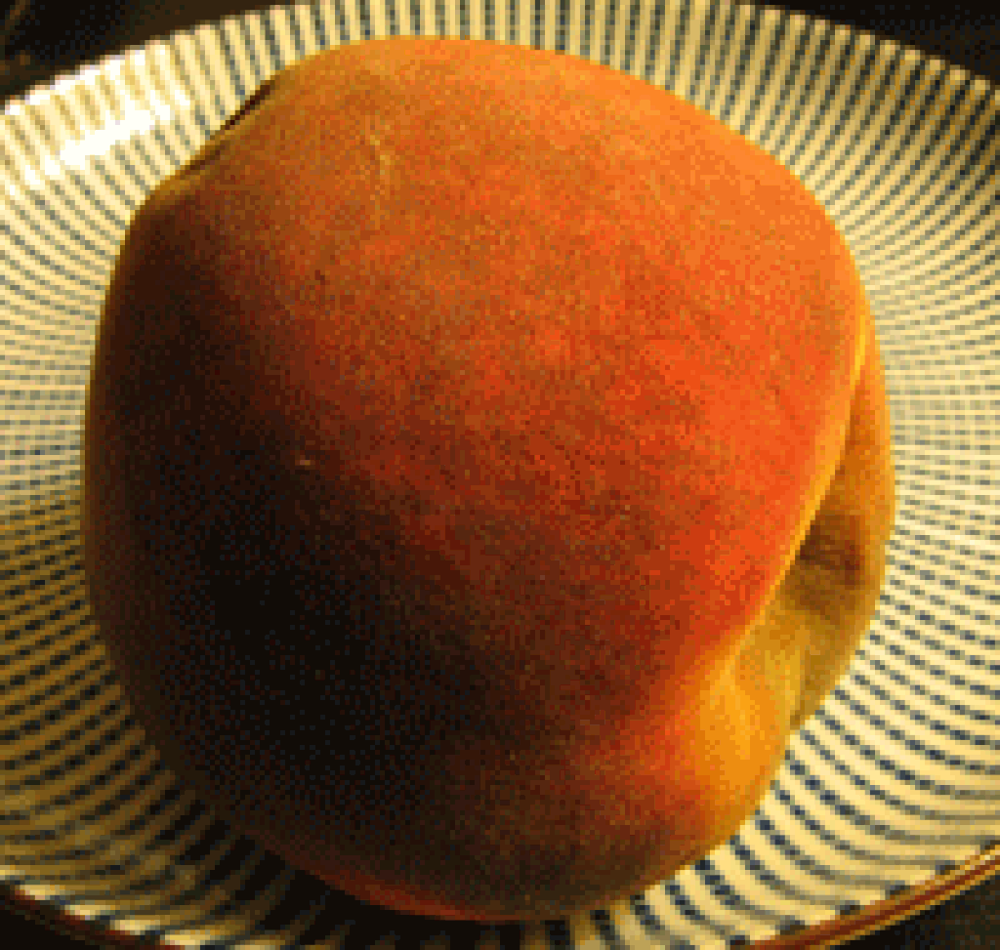[Mold](https://en.wikipedia.org/wiki/Mold_\(fungus\) "Mold (fungus)") growth covering a decaying [peach](https://en.wikipedia.org/wiki/Peach "Peach"). The frames were taken approximately 12 hours apart over a period of six days.

The growth of fungi as hyphae on or in solid substrates or as single cells in aquatic environments is adapted for the efficient extraction of nutrients, because these growth forms have high [surface area to volume ratios](https://en.wikipedia.org/wiki/Surface_area_to_volume_ratio "Surface area to volume ratio"). Hyphae are specifically adapted for growth on solid surfaces, and to invade substrates and tissues. They can exert large penetrative mechanical forces; for example, many [plant pathogens](https://en.wikipedia.org/wiki/Plant_pathogen "Plant pathogen"), including _[Magnaporthe grisea](https://en.wikipedia.org/wiki/Magnaporthe_grisea "Magnaporthe grisea")_, form a structure called an [appressorium](https://en.wikipedia.org/wiki/Appressorium "Appressorium") that evolved to puncture plant tissues. The pressure generated by the appressorium, directed against the plant [epidermis](https://en.wikipedia.org/wiki/Epidermis_\(botany\) "Epidermis (botany)"), can exceed 8 [megapascals](https://en.wikipedia.org/wiki/Pascal_\(unit\) "Pascal (unit)") (1,200 psi). The filamentous fungus _[Purpureocillium lilacinum](https://en.wikipedia.org/wiki/Purpureocillium_lilacinum "Purpureocillium lilacinum")_ uses a similar structure to penetrate the eggs of [nematodes](https://en.wikipedia.org/wiki/Nematode "Nematode").

The mechanical pressure exerted by the appressorium is generated from physiological processes that increase intracellular [turgor](https://en.wikipedia.org/wiki/Turgor "Turgor") by producing [osmolytes](https://en.wikipedia.org/wiki/Osmolyte "Osmolyte") such as [glycerol](https://en.wikipedia.org/wiki/Glycerol "Glycerol"). Adaptations such as these are complemented by [hydrolytic enzymes](https://en.wikipedia.org/wiki/Cellulase "Cellulase") secreted into the environment to digest large organic molecules—such as [polysaccharides](https://en.wikipedia.org/wiki/Polysaccharide "Polysaccharide"), [proteins](https://en.wikipedia.org/wiki/Protein "Protein"), and [lipids](https://en.wikipedia.org/wiki/Lipid "Lipid")—into smaller molecules that may then be absorbed as nutrients. The vast majority of filamentous fungi grow in a polar fashion (extending in one direction) by elongation at the tip (apex) of the hypha. Other forms of fungal growth include intercalary extension (longitudinal expansion of hyphal compartments that are below the apex) as in the case of some [endophytic](https://en.wikipedia.org/wiki/Endophytic "Endophytic") fungi, or growth by volume expansion during the development of mushroom [stipes](https://en.wikipedia.org/wiki/Stipe_\(mycology\) "Stipe (mycology)") and other large organs. Growth of fungi as [multicellular structures](https://en.wikipedia.org/wiki/Multicellularity "Multicellularity") consisting of [somatic](https://en.wikipedia.org/wiki/Somatic_\(biology\) "Somatic (biology)") and reproductive cells—a feature independently evolved in animals and plants—has several functions, including the development of fruit bodies for dissemination of sexual spores (see above) and [biofilms](https://en.wikipedia.org/wiki/Biofilm "Biofilm") for substrate colonization and [intercellular communication](https://en.wikipedia.org/wiki/Intercellular_communication "Intercellular communication").

Fungi are traditionally considered [heterotrophs](https://en.wikipedia.org/wiki/Heterotroph "Heterotroph"), organisms that rely solely on [carbon fixed](https://en.wikipedia.org/wiki/Biological_carbon_fixation "Biological carbon fixation") by other organisms for [metabolism](https://en.wikipedia.org/wiki/Metabolism "Metabolism"). Fungi have [evolved](https://en.wikipedia.org/wiki/Evolved "Evolved") a high degree of metabolic versatility that allows them to use a diverse range of organic substrates for growth, including simple compounds such as [nitrate](https://en.wikipedia.org/wiki/Nitrate "Nitrate"), [ammonia](https://en.wikipedia.org/wiki/Ammonia "Ammonia"), [acetate](https://en.wikipedia.org/wiki/Acetate "Acetate"), or [ethanol](https://en.wikipedia.org/wiki/Ethanol "Ethanol"). In some species the pigment [melanin](https://en.wikipedia.org/wiki/Melanin "Melanin") may play a role in extracting energy from ionizing radiation, such as [gamma radiation](https://en.wikipedia.org/wiki/Gamma_radiation "Gamma radiation"). This form of "[radiotrophic](https://en.wikipedia.org/wiki/Radiotrophic "Radiotrophic")" growth has been described for only a few species, the effects on growth rates are small, and the underlying [biophysical](https://en.wikipedia.org/wiki/Biophysical "Biophysical") and biochemical processes are not well known. This process might bear similarity to CO2 fixation via [visible light](https://en.wikipedia.org/wiki/Visible_spectrum "Visible spectrum"), but instead uses ionizing radiation as a source of energy.

## Reproduction

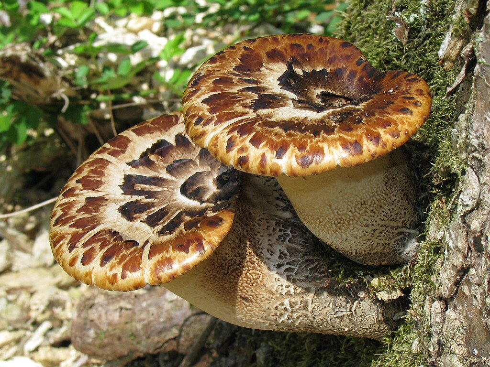_[Cerioporus squamosus](https://en.wikipedia.org/wiki/Cerioporus_squamosus "Cerioporus squamosus")_

Fungal reproduction is complex, reflecting the differences in lifestyles and genetic makeup within this diverse kingdom of organisms. It is estimated that a third of all fungi reproduce using more than one method of propagation; for example, reproduction may occur in two well-differentiated stages within the [life cycle](https://en.wikipedia.org/wiki/Biological_life_cycle "Biological life cycle") of a species, the [teleomorph](https://en.wikipedia.org/wiki/Teleomorph "Teleomorph") (sexual reproduction stage) and the [anamorph](https://en.wikipedia.org/wiki/Anamorph "Anamorph") (asexual reproduction stage). Environmental conditions trigger genetically determined developmental states that lead to the creation of specialized structures for sexual or asexual reproduction. These structures aid reproduction by efficiently dispersing spores or spore-containing [propagules](https://en.wikipedia.org/wiki/Propagule "Propagule").

### Asexual reproduction

[Asexual reproduction](https://en.wikipedia.org/wiki/Asexual_reproduction "Asexual reproduction") occurs via vegetative spores ([conidia](https://en.wikipedia.org/wiki/Conidia "Conidia")) or through [mycelial fragmentation](https://en.wikipedia.org/wiki/Fragmentation_\(reproduction\) "Fragmentation (reproduction)"). Mycelial fragmentation occurs when a fungal mycelium separates into pieces, and each component grows into a separate mycelium. Mycelial fragmentation and vegetative spores maintain [clonal](https://en.wikipedia.org/wiki/Clone_\(genetics\) "Clone (genetics)") populations adapted to a specific [niche](https://en.wikipedia.org/wiki/Ecological_niche "Ecological niche"), and allow more rapid dispersal than sexual reproduction. The _Fungi imperfecti_ ('fungi lacking the perfect or sexual stage') or [Deuteromycota](https://en.wikipedia.org/wiki/Deuteromycota "Deuteromycota") comprise all the species that lack an observable sexual cycle. Deuteromycota (alternatively known as Deuteromycetes, conidial fungi, or mitosporic fungi) is not an accepted taxonomic clade and is now taken to mean simply fungi that lack a known sexual stage.

### Sexual reproduction

Sexual reproduction with [meiosis](https://en.wikipedia.org/wiki/Meiosis "Meiosis") has been directly observed in all fungal phyla except [Glomeromycota](https://en.wikipedia.org/wiki/Glomeromycota "Glomeromycota") (although genetic analysis suggests meiosis occurs in Glomeromycota as well). It differs in many aspects from sexual reproduction in animals or plants. Differences also exist between fungal groups and can be used to discriminate species by morphological differences in sexual structures and reproductive strategies. Mating experiments between fungal isolates may identify species on the basis of biological species concepts. The major fungal groupings have initially been delineated based on the morphology of their sexual structures and spores; for example, the spore-containing structures, [asci](https://en.wikipedia.org/wiki/Ascus "Ascus") and [basidia](https://en.wikipedia.org/wiki/Basidia "Basidia"), can be used in the identification of ascomycetes and basidiomycetes, respectively. Fungi employ two [mating systems](https://en.wikipedia.org/wiki/Mating_system "Mating system"): [heterothallic](https://en.wikipedia.org/wiki/Heterothallic "Heterothallic") species allow mating only between individuals of the opposite [mating type](https://en.wikipedia.org/wiki/Mating_type "Mating type"), whereas [homothallic](https://en.wikipedia.org/wiki/Homothallic "Homothallic") species can mate, and sexually reproduce, with any other individual or itself.

Most fungi have both a [haploid](https://en.wikipedia.org/wiki/Haploid "Haploid") and a [diploid](https://en.wikipedia.org/wiki/Diploid "Diploid") stage in their life cycles. In sexually reproducing fungi, compatible individuals may combine by fusing their hyphae together into an interconnected network; this process, anastomosis, is required for the initiation of the sexual cycle. Many ascomycetes and basidiomycetes go through a [dikaryotic](https://en.wikipedia.org/wiki/Dikaryotic "Dikaryotic") stage, in which the nuclei inherited from the two parents do not combine immediately after cell fusion, but remain separate in the hyphal cells (see [heterokaryosis](https://en.wikipedia.org/wiki/Heterokaryosis "Heterokaryosis")).

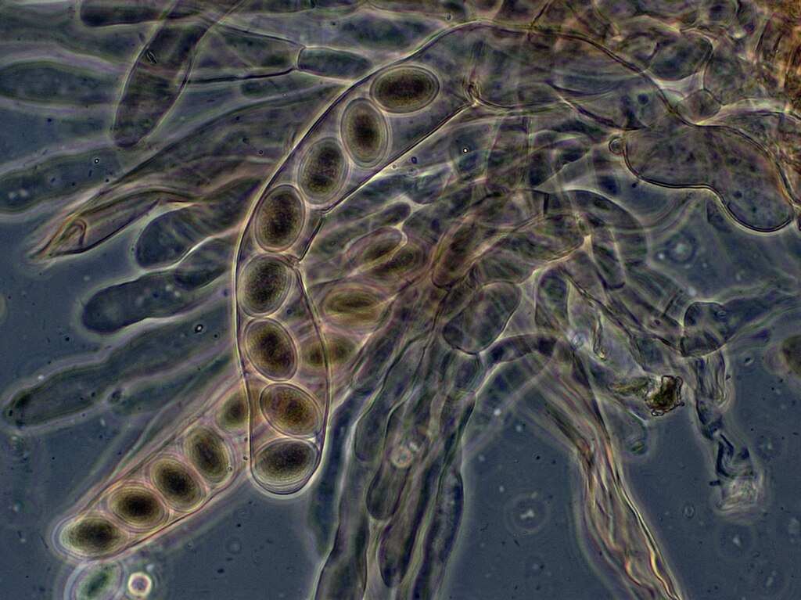The eight-spore [asci](https://en.wikipedia.org/wiki/Ascus "Ascus") of _[Morchella elata](https://en.wikipedia.org/wiki/Morchella_elata "Morchella elata")_, viewed with [phase-contrast microscopy](https://en.wikipedia.org/wiki/Phase-contrast_microscopy "Phase-contrast microscopy")

In ascomycetes, dikaryotic hyphae of the hymenium (the spore-bearing tissue layer) form a characteristic _hook_ (crozier) at the hyphal septum. During [cell division](https://en.wikipedia.org/wiki/Cell_division "Cell division"), the formation of the hook ensures proper distribution of the newly divided nuclei into the apical and basal hyphal compartments. An ascus (plural _asci_) is then formed, in which [karyogamy](https://en.wikipedia.org/wiki/Karyogamy "Karyogamy") (nuclear fusion) occurs. Asci are embedded in an [ascocarp](https://en.wikipedia.org/wiki/Ascocarp "Ascocarp"), or fruiting body. Karyogamy in the asci is followed immediately by meiosis and the production of [ascospores](https://en.wikipedia.org/wiki/Ascospore "Ascospore"). After dispersal, the ascospores may germinate and form a new haploid mycelium.

Sexual reproduction in basidiomycetes is similar to that of the ascomycetes. Compatible haploid hyphae fuse to produce a dikaryotic mycelium. However, the dikaryotic phase is more extensive in the basidiomycetes, often also present in the vegetatively growing mycelium. A specialized anatomical structure, called a [clamp connection](https://en.wikipedia.org/wiki/Clamp_connection "Clamp connection"), is formed at each hyphal septum. As with the structurally similar hook in the ascomycetes, the clamp connection in the basidiomycetes is required for controlled transfer of nuclei during cell division, to maintain the dikaryotic stage with two genetically different nuclei in each hyphal compartment. A basidiocarp is formed in which club-like structures known as basidia generate haploid [basidiospores](https://en.wikipedia.org/wiki/Basidiospores "Basidiospores") after karyogamy and meiosis. The most commonly known basidiocarps are mushrooms, but they may also take other forms (see [Morphology](/source/fungus/#Morphology) section).

In fungi formerly classified as [Zygomycota](https://en.wikipedia.org/wiki/Zygomycota "Zygomycota"), haploid hyphae of two individuals fuse, forming a [gametangium](https://en.wikipedia.org/wiki/Gametangium "Gametangium"), a specialized cell structure that becomes a fertile [gamete](https://en.wikipedia.org/wiki/Gamete "Gamete")-producing cell. The gametangium develops into a [zygospore](https://en.wikipedia.org/wiki/Zygospore "Zygospore"), a thick-walled spore formed by the union of gametes. When the zygospore germinates, it undergoes meiosis, generating new haploid hyphae, which may then form asexual [sporangiospores](https://en.wikipedia.org/wiki/Sporangiospore "Sporangiospore"). These sporangiospores allow the fungus to rapidly disperse and germinate into new genetically identical haploid fungal mycelia.

### Spore dispersal

The spores of most of the researched species of fungi are transported by wind. Such species often produce dry or [hydrophobic](https://en.wikipedia.org/wiki/Hydrophobic "Hydrophobic") spores that do not absorb water and are readily scattered by raindrops, for example. In other species, both asexual and sexual spores or sporangiospores are often actively dispersed by forcible ejection from their reproductive structures. This ejection ensures exit of the spores from the reproductive structures as well as traveling through the air over long distances.

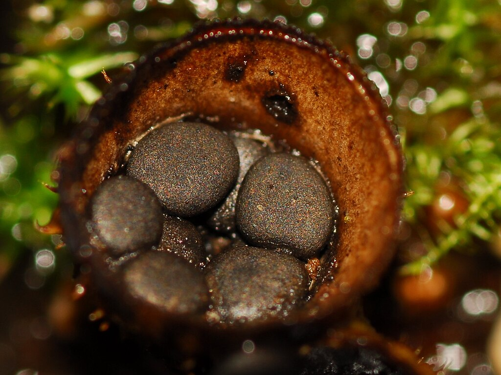The bird's nest fungus _[Cyathus stercoreus](https://en.wikipedia.org/wiki/Cyathus_stercoreus "Cyathus stercoreus")_

Specialized mechanical and physiological mechanisms, as well as spore surface structures (such as [hydrophobins](https://en.wikipedia.org/wiki/Hydrophobin "Hydrophobin")), enable efficient spore ejection. For example, the structure of the spore-bearing cells in some ascomycete species is such that the buildup of substances affecting cell volume and fluid balance enables the explosive discharge of spores into the air. The forcible discharge of single spores termed _ballistospores_ involves formation of a small drop of water (Buller's drop), which upon contact with the spore leads to its projectile release with an initial acceleration of more than 10,000[g](https://en.wikipedia.org/wiki/G-force "G-force"); the net result is that the spore is ejected 0.01–0.02cm, sufficient distance for it to fall through the [gills](https://en.wikipedia.org/wiki/Agaricales "Agaricales") or pores into the air below. Other fungi, like the [puffballs](https://en.wikipedia.org/wiki/Puffballs "Puffballs"), rely on alternative mechanisms for spore release, such as external mechanical forces. The [hydnoid fungi](https://en.wikipedia.org/wiki/Hydnoid_fungi "Hydnoid fungi") (tooth fungi) produce spores on pendant, tooth-like or spine-like projections. The [bird's nest fungi](https://en.wikipedia.org/wiki/Bird's_nest_fungi "Bird's nest fungi") use the force of falling water drops to liberate the spores from cup-shaped fruiting bodies. Another strategy is seen in the [stinkhorns](https://en.wikipedia.org/wiki/Phallaceae "Phallaceae"), a group of fungi with lively colors and putrid odor that attract insects to disperse their spores.

Some fungi spores are dispersed via animals, for instance [truffles](https://en.wikipedia.org/wiki/Truffle "Truffle") and other underground fungi do not actively liberate their spores but instead, most species produce strong-smelling fruitbodies attractive to [voles](https://en.wikipedia.org/wiki/Vole "Vole") and other small mammals which eat them and disperse the spores in their [feces](https://en.wikipedia.org/wiki/Feces "Feces"). Likewise insects such as [flies](https://en.wikipedia.org/wiki/Flies "Flies") and other [invertebrates](https://en.wikipedia.org/wiki/Invertebrate "Invertebrate") also may disperse spores after ingesting fruiting bodies, or plant matter containing a fungus. Birds have also been known to carry spores of various tree pathogenic fungi.

### Homothallism

In homothallic sexual reproduction, two [haploid](https://en.wikipedia.org/wiki/Ploidy "Ploidy") nuclei derived from the same individual fuse to form a [zygote](https://en.wikipedia.org/wiki/Zygote "Zygote") that can then undergo meiosis. Homothallic fungi include species with an _Aspergillus_-like asexual stage (anamorphs) occurring in numerous different genera, several species of the [ascomycete](https://en.wikipedia.org/wiki/Ascomycete "Ascomycete") genus _[Cochliobolus](https://en.wikipedia.org/wiki/Cochliobolus "Cochliobolus")_, and the ascomycete _[Pneumocystis jirovecii](https://en.wikipedia.org/wiki/Pneumocystis_jirovecii "Pneumocystis jirovecii")_. The earliest mode of sexual reproduction among eukaryotes was likely homothallism, that is, [self-fertile unisexual reproduction](https://en.wikipedia.org/wiki/Autogamy "Autogamy").

### Other sexual processes

Besides regular sexual reproduction with meiosis, certain fungi, such as those in the genera _[Penicillium](https://en.wikipedia.org/wiki/Penicillium "Penicillium")_ and _[Aspergillus](https://en.wikipedia.org/wiki/Aspergillus "Aspergillus")_, may exchange genetic material via [parasexual](https://en.wikipedia.org/wiki/Parasexuality "Parasexuality") processes, initiated by anastomosis between hyphae and [plasmogamy](https://en.wikipedia.org/wiki/Plasmogamy "Plasmogamy") of fungal cells. The frequency and relative importance of parasexual events is unclear and may be lower than other sexual processes. It is known to play a role in intraspecific hybridization and is likely required for hybridization between species, which has been associated with major events in fungal evolution.

## Evolution

### Fossil history

In contrast to [plants](https://en.wikipedia.org/wiki/Evolutionary_history_of_plants "Evolutionary history of plants") and [animals](https://en.wikipedia.org/wiki/Evolutionary_history_of_life "Evolutionary history of life"), the early fossil record of the fungi is meager. Factors that likely contribute to the under-representation of fungal species among fossils include the nature of fungal [fruiting bodies](https://en.wikipedia.org/wiki/Sporocarp_\(fungi\) "Sporocarp (fungi)"), which are soft, fleshy, and easily degradable tissues, and the microscopic dimensions of most fungal structures, which therefore are not readily evident. Fungal fossils are difficult to distinguish from those of other microbes, and are most easily identified when they resemble [extant](https://en.wikipedia.org/wiki/Extant_taxon "Extant taxon") fungi. Often recovered from a [permineralized](https://en.wikipedia.org/wiki/Permineralized "Permineralized") plant or animal host, these samples are typically studied by making thin-section preparations that can be examined with [light microscopy](https://en.wikipedia.org/wiki/Light_microscopy "Light microscopy") or [transmission electron microscopy](https://en.wikipedia.org/wiki/Transmission_electron_microscopy "Transmission electron microscopy"). Researchers study [compression fossils](https://en.wikipedia.org/wiki/Compression_fossil "Compression fossil") by dissolving the surrounding matrix with acid and then using light or [scanning electron microscopy](https://en.wikipedia.org/wiki/Scanning_electron_microscopy "Scanning electron microscopy") to examine surface details.

The earliest fossils possessing features typical of fungi date to the [Paleoproterozoic](https://en.wikipedia.org/wiki/Paleoproterozoic "Paleoproterozoic") era, some [2,400](https://geoltime.github.io/?Ma=2,400) million years ago ([Ma](https://en.wikipedia.org/wiki/Annum "Annum")); these multicellular [benthic](https://en.wikipedia.org/wiki/Benthic "Benthic") organisms had filamentous structures capable of anastomosis. Other studies (2009) estimate the arrival of fungal organisms at about 760–1060Ma on the basis of comparisons of the rate of evolution in closely related groups. The oldest fossilizied mycelium to be identified from its molecular composition is between 715 and 810 million years old. For much of the [Paleozoic](https://en.wikipedia.org/wiki/Paleozoic "Paleozoic") Era (542–251Ma), the fungi appear to have been aquatic and consisted of organisms similar to the extant chytrids in having flagellum-bearing spores. The evolutionary adaptation from an aquatic to a terrestrial lifestyle necessitated a diversification of ecological strategies for obtaining nutrients, including [parasitism](https://en.wikipedia.org/wiki/Parasitism "Parasitism"), [saprobism](https://en.wikipedia.org/wiki/Saphrotrophic_nutrition "Saphrotrophic nutrition"), and the development of [mutualistic](https://en.wikipedia.org/wiki/Mutualism_\(biology\) "Mutualism (biology)") relationships such as mycorrhiza and lichenization. Studies suggest that the ancestral ecological state of the [Ascomycota](https://en.wikipedia.org/wiki/Ascomycota "Ascomycota") was saprobism, and that independent [lichenization](/source/lichen/ "Lichen") events have occurred multiple times.

In May 2019, scientists reported the discovery of a [fossilized](https://en.wikipedia.org/wiki/Fossil "Fossil") fungus, named _[Ourasphaira giraldae](https://en.wikipedia.org/wiki/Ourasphaira_giraldae "Ourasphaira giraldae")_, in the [Canadian Arctic](https://en.wikipedia.org/wiki/Canadian_Arctic "Canadian Arctic"), that may have grown on land a billion years ago, well before plants were living on land. [Pyritized](https://en.wikipedia.org/wiki/Pyritized "Pyritized") fungus-like [microfossils](https://en.wikipedia.org/wiki/Microfossil "Microfossil") preserved in the basal Ediacaran Doushantuo Formation (~635 Ma) have been reported in South China. Earlier, it had been presumed that the fungi colonized the land during the [Cambrian](https://en.wikipedia.org/wiki/Cambrian "Cambrian") (542–488.3Ma), also long before land plants. Fossilized hyphae and spores recovered from the [Ordovician](https://en.wikipedia.org/wiki/Ordovician "Ordovician") of Wisconsin (460Ma) resemble modern-day [Glomerales](https://en.wikipedia.org/wiki/Glomerales "Glomerales"), and existed at a time when the land flora likely consisted of only non-vascular [bryophyte](https://en.wikipedia.org/wiki/Bryophyte "Bryophyte")-like plants. _[Prototaxites](https://en.wikipedia.org/wiki/Prototaxites "Prototaxites")_, which was possibly a fungus or lichen, would have been the tallest organism of the late [Silurian](https://en.wikipedia.org/wiki/Silurian "Silurian") and early [Devonian](https://en.wikipedia.org/wiki/Devonian "Devonian"). Fungal fossils do not become common and uncontroversial until the early Devonian (416–359.2Ma), when they occur abundantly in the [Rhynie chert](https://en.wikipedia.org/wiki/Rhynie_chert "Rhynie chert"), mostly as Zygomycota and [Chytridiomycota](https://en.wikipedia.org/wiki/Chytridiomycota "Chytridiomycota"). At about this same time, approximately 400Ma, the Ascomycota and Basidiomycota diverged, and all modern [classes](https://en.wikipedia.org/wiki/Class_\(biology\) "Class (biology)") of fungi were present by the Late [Carboniferous](https://en.wikipedia.org/wiki/Carboniferous "Carboniferous") ([Pennsylvanian](https://en.wikipedia.org/wiki/Pennsylvanian_\(geology\) "Pennsylvanian (geology)"), 318.1–299Ma).

Lichens formed a component of the early terrestrial ecosystems, and the estimated age of the oldest terrestrial lichen fossil is 415Ma; this date roughly corresponds to the age of the oldest known sporocarp fossil, a _[Paleopyrenomycites](https://en.wikipedia.org/wiki/Paleopyrenomycites "Paleopyrenomycites")_ species found in the Rhynie Chert. The oldest fossil with microscopic features resembling modern-day basidiomycetes is _Palaeoancistrus_, found permineralized with a [fern](https://en.wikipedia.org/wiki/Fern "Fern") from the Pennsylvanian. Rare in the fossil record are the Homobasidiomycetes (a [taxon](https://en.wikipedia.org/wiki/Taxon "Taxon") roughly equivalent to the mushroom-producing species of the [Agaricomycetes](https://en.wikipedia.org/wiki/Agaricomycetes "Agaricomycetes")). Two [amber](https://en.wikipedia.org/wiki/Amber "Amber")-preserved specimens provide evidence that the earliest known mushroom-forming fungi (the extinct species _[Archaeomarasmius leggetti](https://en.wikipedia.org/wiki/Archaeomarasmius_leggetti "Archaeomarasmius leggetti")_) appeared during the late [Cretaceous](https://en.wikipedia.org/wiki/Cretaceous "Cretaceous"), 90Ma.

Some time after the [Permian–Triassic extinction event](https://en.wikipedia.org/wiki/Permian–Triassic_extinction_event "Permian–Triassic extinction event") (251.4Ma), a fungal spike (originally thought to be an extraordinary abundance of fungal spores in [sediments](https://en.wikipedia.org/wiki/Sediment "Sediment")) formed, suggesting that fungi were the dominant life form at this time, representing nearly 100% of the available [fossil record](https://en.wikipedia.org/wiki/Fossil_record "Fossil record") for this period. However, the relative proportion of fungal spores relative to spores formed by [algal](https://en.wikipedia.org/wiki/Algal "Algal") species is difficult to assess, the spike did not appear worldwide, and in many places it did not fall on the Permian–Triassic boundary.

Sixty-five million years ago, immediately after the [Cretaceous–Paleogene extinction event](https://en.wikipedia.org/wiki/Cretaceous–Paleogene_extinction_event "Cretaceous–Paleogene extinction event") that famously killed off most dinosaurs, there was a dramatic increase in evidence of fungi; apparently the death of most plant and animal species led to a huge fungal bloom like "a massive compost heap".

### External phylogeny

Although commonly included in botany curricula and textbooks, fungi are more closely related to [animals](https://en.wikipedia.org/wiki/Animal "Animal") than to plants, and are placed with the animals in the [monophyletic](https://en.wikipedia.org/wiki/Monophyletic "Monophyletic") group of opisthokonts. Analyses using molecular phylogenetics support a monophyletic origin of fungi. The taxonomy of fungi is in a state of constant flux, especially due to research based on DNA comparisons. These current phylogenetic analyses often overturn classifications based on older and sometimes less discriminative methods based on morphological features and biological species concepts obtained from experimental matings.

There is no unique generally accepted system at the higher taxonomic levels and there are frequent name changes at every level, from species upwards. Efforts among researchers are now underway to establish and encourage usage of a unified and more consistent [nomenclature](https://en.wikipedia.org/wiki/Botanical_nomenclature "Botanical nomenclature"). Until relatively recent (2012) changes to the [International Code of Nomenclature for algae, fungi and plants](https://en.wikipedia.org/wiki/International_Code_of_Nomenclature_for_algae,_fungi_and_plants "International Code of Nomenclature for algae, fungi and plants"), fungal species could also have multiple scientific names depending on their life cycle and mode (sexual or asexual) of reproduction. Web sites such as [Index Fungorum](https://en.wikipedia.org/wiki/Index_Fungorum "Index Fungorum"), [Fungal Names](https://en.wikipedia.org/wiki/Fungal_Names "Fungal Names"), and [MycoBank](https://en.wikipedia.org/wiki/MycoBank "MycoBank") are officially recognized [nomenclatural](https://en.wikipedia.org/wiki/Nomenclature_codes "Nomenclature codes") repositories and list current names of fungal species (with cross-references to older [synonyms](https://en.wikipedia.org/wiki/Synonym_\(taxonomy\) "Synonym (taxonomy)")).

### Internal phylogeny

The 2007 classification of Kingdom Fungi is the result of a large-scale collaborative research effort involving dozens of mycologists and other scientists working on fungal taxonomy. It recognizes seven [phyla](https://en.wikipedia.org/wiki/Phylum "Phylum"), two of which—the Ascomycota and the Basidiomycota—are contained within a branch representing subkingdom [Dikarya](https://en.wikipedia.org/wiki/Dikarya "Dikarya"), the most species rich and familiar group, including all the mushrooms, most food-spoilage molds, most plant pathogenic fungi, and the beer, wine, and bread yeasts. The accompanying [cladogram](https://en.wikipedia.org/wiki/Cladogram "Cladogram") depicts the major fungal [taxa](https://en.wikipedia.org/wiki/Taxa "Taxa") and their relationship to opisthokont and unikont organisms, based on the work of Philippe Silar, "The Mycota: A Comprehensive Treatise on Fungi as Experimental Systems for Basic and Applied Research" and Tedersoo et al. 2018. The lengths of the branches are not proportional to [evolutionary](https://en.wikipedia.org/wiki/Evolutionary "Evolutionary") distances.

[Zoosporia](https://en.wikipedia.org/wiki/Zoosporia "Zoosporia")

Rozellomyceta

[Rozellomycota](https://en.wikipedia.org/wiki/Rozellomycota "Rozellomycota")

Rozellomycetes

[Microsporidiomycota](https://en.wikipedia.org/wiki/Microsporidia "Microsporidia")

_[Mitosporidium](https://en.wikipedia.org/wiki/Mitosporidium "Mitosporidium")_

_Paramicrosporidium_

_[Nucleophaga](https://en.wikipedia.org/wiki/Nucleophaga "Nucleophaga")_

[Metchnikovellea](https://en.wikipedia.org/wiki/Metchnikovellea "Metchnikovellea")

[Microsporea](https://en.wikipedia.org/wiki/Microsporea "Microsporea")

Aphelidiomyceta

[Aphelidiomycota](https://en.wikipedia.org/wiki/Aphelidiomycota "Aphelidiomycota")

[Aphelidiomycetes](https://en.wikipedia.org/wiki/Aphelidiomycetes "Aphelidiomycetes")

[Eumycota](https://en.wikipedia.org/wiki/Eumycota "Eumycota")

Chytridiomyceta

[Neocallimastigomycota](https://en.wikipedia.org/wiki/Neocallimastigomycota "Neocallimastigomycota")

[Neocallimastigomycetes](https://en.wikipedia.org/wiki/Neocallimastigomycetes "Neocallimastigomycetes")

[Chytridiomycota](https://en.wikipedia.org/wiki/Chytridiomycota "Chytridiomycota")

Monoblepharomycotina

[Hyaloraphidiomycetes](https://en.wikipedia.org/wiki/Hyaloraphidiomycetes "Hyaloraphidiomycetes")

[Monoblepharidomycetes](https://en.wikipedia.org/wiki/Monoblepharidomycetes "Monoblepharidomycetes")

[Sanchytriomycetes](https://en.wikipedia.org/wiki/Sanchytriomycetes "Sanchytriomycetes")

Chytridiomycotina

Mesochytriomycetes

[Chytridiomycetes](https://en.wikipedia.org/wiki/Chytridiomycetes "Chytridiomycetes")

Blastocladiomyceta

[Blastocladiomycota](https://en.wikipedia.org/wiki/Blastocladiomycota "Blastocladiomycota")

[Blastocladiomycetes](https://en.wikipedia.org/wiki/Blastocladiomycetes "Blastocladiomycetes")

[Physodermatomycetes](https://en.wikipedia.org/wiki/Physodermatomycetes "Physodermatomycetes")

[Amastigomycota](https://en.wikipedia.org/wiki/Amastigomycota "Amastigomycota")

Zoopagomyceta

[Basidiobolomyceta](https://en.wikipedia.org/wiki/Basidiobolomyceta "Basidiobolomyceta")

[Olpidiomyceta](https://en.wikipedia.org/wiki/Olpidiomyceta "Olpidiomyceta")

[Entomophthoromycota](https://en.wikipedia.org/wiki/Entomophthoromycota "Entomophthoromycota")

[Neozygitomycetes](https://en.wikipedia.org/wiki/Neozygitomycetes "Neozygitomycetes")

[Entomophthoromycetes](https://en.wikipedia.org/wiki/Entomophthoromycetes "Entomophthoromycetes")

[Kickxellomycota](https://en.wikipedia.org/wiki/Kickxellomycota "Kickxellomycota")

[Zoopagomycotina](https://en.wikipedia.org/wiki/Zoopagomycotina "Zoopagomycotina")

[Zoopagomycetes](https://en.wikipedia.org/wiki/Zoopagomycetes "Zoopagomycetes")

[Kickxellomycotina](https://en.wikipedia.org/wiki/Kickxellomycotina "Kickxellomycotina")

[Dimargaritomycetes](https://en.wikipedia.org/wiki/Dimargaritomycetes "Dimargaritomycetes")

[Kickxellomycetes](https://en.wikipedia.org/wiki/Kickxellomycetes "Kickxellomycetes")

[Mortierellomycota](https://en.wikipedia.org/wiki/Mortierellomycota "Mortierellomycota")

[Mortierellomycetes](https://en.wikipedia.org/wiki/Mortierellomycetes "Mortierellomycetes")

Mucoromyceta

[Calcarisporiellomycota](https://en.wikipedia.org/wiki/Calcarisporiellomycota "Calcarisporiellomycota")

[Calcarisporiellomycetes](https://en.wikipedia.org/wiki/Calcarisporiellomycetes "Calcarisporiellomycetes")

[Mucoromycota](https://en.wikipedia.org/wiki/Mucoromycota "Mucoromycota")

Umbelopsidomycetes

[Mucoromycetes](https://en.wikipedia.org/wiki/Mucoromycetes "Mucoromycetes")

[Symbiomycota](https://en.wikipedia.org/wiki/Symbiomycota "Symbiomycota")

[Glomeromycota](https://en.wikipedia.org/wiki/Glomeromycota "Glomeromycota")

Paraglomeromycetes

Archaeosporomycetes

[Glomeromycetes](https://en.wikipedia.org/wiki/Glomeromycetes "Glomeromycetes")

[Dikarya](https://en.wikipedia.org/wiki/Dikarya "Dikarya")

[Entorrhizomycota](https://en.wikipedia.org/wiki/Entorrhizomycota "Entorrhizomycota")

[Entorrhizomycetes](https://en.wikipedia.org/wiki/Entorrhizomycetes "Entorrhizomycetes")

[Basidiomycota](https://en.wikipedia.org/wiki/Basidiomycota "Basidiomycota")

[Ascomycota](https://en.wikipedia.org/wiki/Ascomycota "Ascomycota")

[Basidiomycota](https://en.wikipedia.org/wiki/Basidiomycota "Basidiomycota")

[Pucciniomycotina](https://en.wikipedia.org/wiki/Pucciniomycotina "Pucciniomycotina")

[Tritirachiomycetes](https://en.wikipedia.org/wiki/Tritirachiomycetes "Tritirachiomycetes")

[Mixiomycetes](https://en.wikipedia.org/wiki/Mixiomycetes "Mixiomycetes")

[Agaricostilbomycetes](https://en.wikipedia.org/wiki/Agaricostilbomycetes "Agaricostilbomycetes")

[Cystobasidiomycetes](https://en.wikipedia.org/wiki/Cystobasidiomycetes "Cystobasidiomycetes")

[Classiculaceae](https://en.wikipedia.org/wiki/Classiculaceae "Classiculaceae")

[Microbotryomycetes](https://en.wikipedia.org/wiki/Microbotryomycetes "Microbotryomycetes")

[Cryptomycocolacomycetes](https://en.wikipedia.org/wiki/Cryptomycocolacomycetes "Cryptomycocolacomycetes")

[Atractiellomycetes](https://en.wikipedia.org/wiki/Atractiellomycetes "Atractiellomycetes")

[Pucciniomycetes](https://en.wikipedia.org/wiki/Pucciniomycetes "Pucciniomycetes")

[Orthomycotina](https://en.wikipedia.org/wiki/Orthomycotina "Orthomycotina")

[Ustilaginomycotina](https://en.wikipedia.org/wiki/Ustilaginomycotina "Ustilaginomycotina")

[Monilielliomycetes](https://en.wikipedia.org/wiki/Monilielliomycetes "Monilielliomycetes")

[Malasseziomycetes](https://en.wikipedia.org/wiki/Malasseziomycetes "Malasseziomycetes")

[Ustilaginomycetes](https://en.wikipedia.org/wiki/Ustilaginomycetes "Ustilaginomycetes")

[Exobasidiomycetes](https://en.wikipedia.org/wiki/Exobasidiomycetes "Exobasidiomycetes")

[Agaricomycotina](https://en.wikipedia.org/wiki/Agaricomycotina "Agaricomycotina")

?[Geminibasidiomycetes](https://en.wikipedia.org/wiki/Geminibasidiomycetes "Geminibasidiomycetes")

?[Wallemiomycetes](https://en.wikipedia.org/wiki/Wallemiomycetes "Wallemiomycetes")

[Bartheletiomycetes](https://en.wikipedia.org/wiki/Bartheletiomycetes "Bartheletiomycetes")

[Tremellomycetes](https://en.wikipedia.org/wiki/Tremellomycetes "Tremellomycetes")

[Dacrymycetes](https://en.wikipedia.org/wiki/Dacrymycetes "Dacrymycetes")

[Agaricomycetes](https://en.wikipedia.org/wiki/Agaricomycetes "Agaricomycetes")

[Ascomycota](https://en.wikipedia.org/wiki/Ascomycota "Ascomycota")

[Taphrinomycotina](https://en.wikipedia.org/wiki/Taphrinomycotina "Taphrinomycotina")

[Neolectomycetes](https://en.wikipedia.org/wiki/Neolectomycetes "Neolectomycetes")

[Taphrinomycetes](https://en.wikipedia.org/wiki/Taphrinomycetes "Taphrinomycetes")

[Schizosaccharomyceta](https://en.wikipedia.org/wiki/Schizosaccharomyceta "Schizosaccharomyceta")

[Archaeorhizomycetes](https://en.wikipedia.org/wiki/Archaeorhizomycetes "Archaeorhizomycetes")

[Pneumocystidomycetes](https://en.wikipedia.org/wiki/Pneumocystidomycetes "Pneumocystidomycetes")

[Schizosaccharomycetes](https://en.wikipedia.org/wiki/Schizosaccharomycetes "Schizosaccharomycetes")

[Saccharomyceta](https://en.wikipedia.org/wiki/Saccharomyceta "Saccharomyceta")

[Saccharomycotina](https://en.wikipedia.org/wiki/Saccharomycotina "Saccharomycotina")

[Saccharomycetes](https://en.wikipedia.org/wiki/Saccharomycetes "Saccharomycetes")

[Pezizomycotina](https://en.wikipedia.org/wiki/Pezizomycotina "Pezizomycotina")

?[Thelocarpales](https://en.wikipedia.org/wiki/Thelocarpales "Thelocarpales")

?[Vezdaeales](https://en.wikipedia.org/wiki/Vezdaeales "Vezdaeales")

?[Lahmiales](https://en.wikipedia.org/wiki/Lahmiales "Lahmiales")

?Triblidiales

[Orbiliomycetes](https://en.wikipedia.org/wiki/Orbiliomycetes "Orbiliomycetes")

[Pezizomycetes](https://en.wikipedia.org/wiki/Pezizomycetes "Pezizomycetes")

[Leotiomyceta](https://en.wikipedia.org/wiki/Leotiomyceta "Leotiomyceta")

[Sordariomyceta](https://en.wikipedia.org/wiki/Sordariomyceta "Sordariomyceta")

[Xylonomycetes](https://en.wikipedia.org/wiki/Xylonomycetes "Xylonomycetes")

[Geoglossomycetes](https://en.wikipedia.org/wiki/Geoglossomycetes "Geoglossomycetes")

[Leotiomycetes](https://en.wikipedia.org/wiki/Leotiomycetes "Leotiomycetes")

[Laboulbeniomycetes](https://en.wikipedia.org/wiki/Laboulbeniomycetes "Laboulbeniomycetes")

[Sordariomycetes](https://en.wikipedia.org/wiki/Sordariomycetes "Sordariomycetes")

[Dothideomyceta](https://en.wikipedia.org/wiki/Dothideomyceta "Dothideomyceta")

[Coniocybomycetes](https://en.wikipedia.org/wiki/Coniocybomycetes "Coniocybomycetes")

[Lichinomycetes](https://en.wikipedia.org/wiki/Lichinomycetes "Lichinomycetes")

[Eurotiomycetes](https://en.wikipedia.org/wiki/Eurotiomycetes "Eurotiomycetes")

[Lecanoromycetes](https://en.wikipedia.org/wiki/Lecanoromycetes "Lecanoromycetes")

Collemopsidiomycetes

[Arthoniomycetes](https://en.wikipedia.org/wiki/Arthoniomycetes "Arthoniomycetes")

[Dothideomycetes](https://en.wikipedia.org/wiki/Dothideomycetes "Dothideomycetes")

### Taxonomic groups

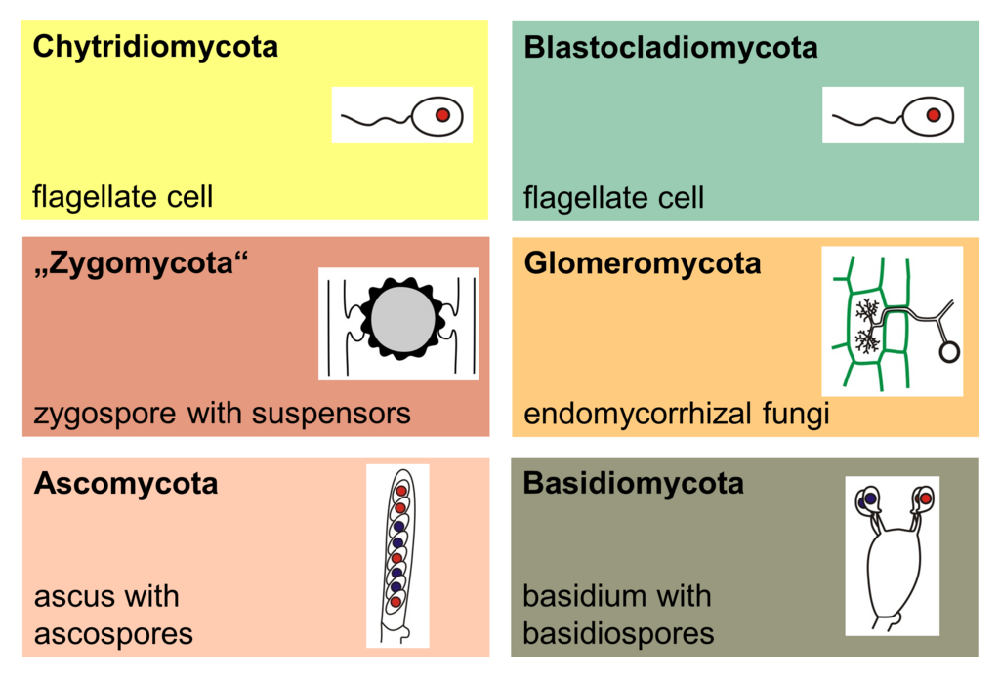Main groups of fungi

The major phyla (sometimes called divisions) of fungi have been classified mainly on the basis of characteristics of their sexual [reproductive](https://en.wikipedia.org/wiki/Reproduction "Reproduction") structures. As of 2019, nine major [lineages](https://en.wikipedia.org/wiki/Lineage_\(evolution\) "Lineage (evolution)") have been identified: [Opisthosporidia](https://en.wikipedia.org/wiki/Opisthosporidia "Opisthosporidia"), [Chytridiomycota](https://en.wikipedia.org/wiki/Chytridiomycota "Chytridiomycota"), [Neocallimastigomycota](https://en.wikipedia.org/wiki/Neocallimastigomycota "Neocallimastigomycota"), [Blastocladiomycota](https://en.wikipedia.org/wiki/Blastocladiomycota "Blastocladiomycota"), [Zoopagomycotina](https://en.wikipedia.org/wiki/Zoopagomycotina "Zoopagomycotina"), [Mucoromycota](https://en.wikipedia.org/wiki/Mucoromycota "Mucoromycota"), [Glomeromycota](https://en.wikipedia.org/wiki/Glomeromycota "Glomeromycota"), [Ascomycota](https://en.wikipedia.org/wiki/Ascomycota "Ascomycota"), and [Basidiomycota](https://en.wikipedia.org/wiki/Basidiomycota "Basidiomycota").

Phylogenetic analysis has demonstrated that the [Microsporidia](https://en.wikipedia.org/wiki/Microsporidia "Microsporidia"), unicellular parasites of animals and protists, are fairly recent and highly derived [endobiotic](https://en.wikipedia.org/wiki/Endobiotic "Endobiotic") fungi (living within the tissue of another species). Previously considered to be "primitive" protozoa, they are now thought to be either a [basal branch](https://en.wikipedia.org/wiki/Basal_\(phylogenetics\) "Basal (phylogenetics)") of the Fungi, or a [sister group](https://en.wikipedia.org/wiki/Sister_group "Sister group")–each other's closest evolutionary relative.

The [Chytridiomycota](https://en.wikipedia.org/wiki/Chytridiomycota "Chytridiomycota") are commonly known as chytrids. These fungi are distributed worldwide. Chytrids and their close relatives [Neocallimastigomycota](https://en.wikipedia.org/wiki/Neocallimastigomycota "Neocallimastigomycota") and [Blastocladiomycota](https://en.wikipedia.org/wiki/Blastocladiomycota "Blastocladiomycota") (below) are the only fungi with active motility, producing [zoospores](https://en.wikipedia.org/wiki/Zoospore "Zoospore") that are capable of active movement through aqueous phases with a single [flagellum](https://en.wikipedia.org/wiki/Flagellum "Flagellum"), leading early [taxonomists](https://en.wikipedia.org/wiki/Taxonomist "Taxonomist") to classify them as [protists](https://en.wikipedia.org/wiki/Protist "Protist"). [Molecular phylogenies](https://en.wikipedia.org/wiki/Molecular_phylogenies "Molecular phylogenies"), inferred from [rRNA](https://en.wikipedia.org/wiki/RRNA "RRNA") sequences in [ribosomes](https://en.wikipedia.org/wiki/Ribosome "Ribosome"), suggest that the Chytrids are a [basal](https://en.wikipedia.org/wiki/Basal_\(phylogenetics\) "Basal (phylogenetics)") group divergent from the other fungal phyla, consisting of four major [clades](https://en.wikipedia.org/wiki/Clade "Clade") with suggestive evidence for [paraphyly](https://en.wikipedia.org/wiki/Paraphyly "Paraphyly") or possibly [polyphyly](https://en.wikipedia.org/wiki/Polyphyly "Polyphyly").

The Blastocladiomycota were previously considered a taxonomic clade within the Chytridiomycota. Molecular data and [ultrastructural](https://en.wikipedia.org/wiki/Ultrastructural "Ultrastructural") characteristics, however, place the Blastocladiomycota as a sister clade to the Zygomycota, Glomeromycota, and Dikarya (Ascomycota and Basidiomycota). The blastocladiomycetes are [saprotrophs](https://en.wikipedia.org/wiki/Saprotrophs "Saprotrophs"), feeding on decomposing organic matter, and they are parasites of all eukaryotic groups. Unlike their close relatives, the chytrids, most of which exhibit [zygotic meiosis](https://en.wikipedia.org/wiki/Biological_life_cycle#Haplontic_life_cycle "Biological life cycle"), the blastocladiomycetes undergo [sporic meiosis](https://en.wikipedia.org/wiki/Biological_life_cycle#Haplodiplontic_life_cycle "Biological life cycle").

The [Neocallimastigomycota](https://en.wikipedia.org/wiki/Neocallimastigomycota "Neocallimastigomycota") were earlier placed in the phylum Chytridiomycota. Members of this small phylum are [anaerobic organisms](https://en.wikipedia.org/wiki/Anaerobic_organism "Anaerobic organism"), living in the digestive system of larger herbivorous mammals and in other terrestrial and aquatic environments enriched in cellulose (e.g., domestic waste landfill sites). They lack [mitochondria](https://en.wikipedia.org/wiki/Mitochondria "Mitochondria") but contain [hydrogenosomes](https://en.wikipedia.org/wiki/Hydrogenosome "Hydrogenosome") of mitochondrial origin. As in the related chrytrids, neocallimastigomycetes form zoospores that are posteriorly uniflagellate or polyflagellate.

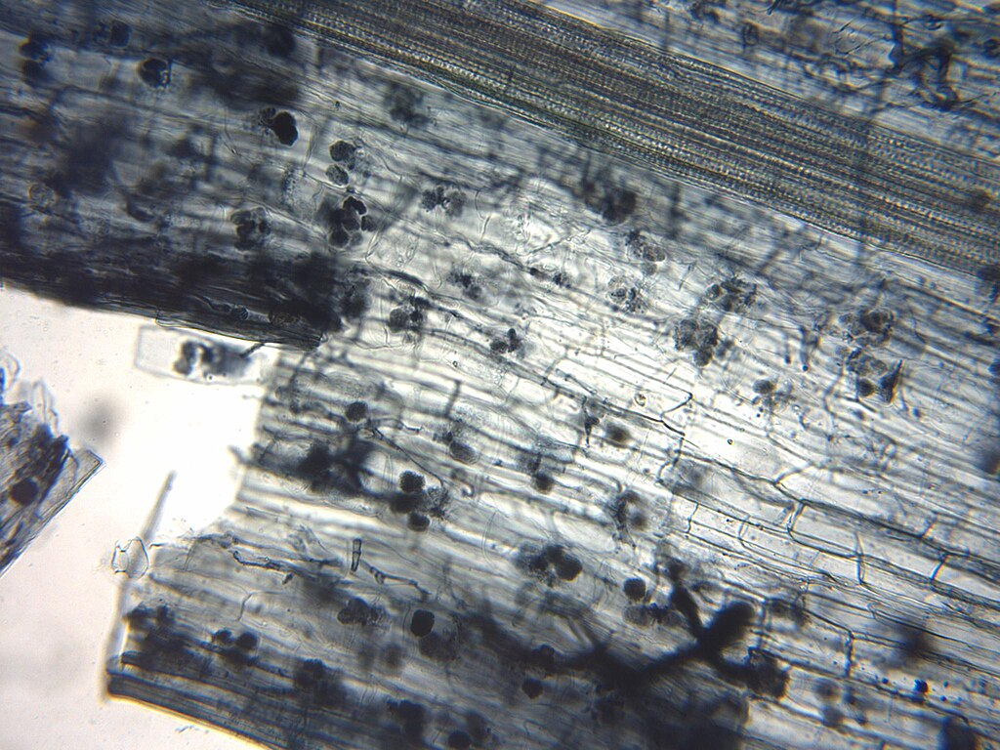_[Arbuscular mycorrhiza](https://en.wikipedia.org/wiki/Arbuscular_mycorrhiza "Arbuscular mycorrhiza")_ seen under microscope. [Flax](https://en.wikipedia.org/wiki/Flax "Flax") root cortical cells containing paired arbuscules.Diagram of an [apothecium](https://en.wikipedia.org/wiki/Apothecium "Apothecium") (the typical cup-like reproductive structure of ascomycetes) showing sterile tissues as well as developing and mature asci

Members of the [Glomeromycota](https://en.wikipedia.org/wiki/Glomeromycota "Glomeromycota") form [arbuscular mycorrhizae](https://en.wikipedia.org/wiki/Arbuscular_mycorrhizae "Arbuscular mycorrhizae"), a form of mutualist [symbiosis](https://en.wikipedia.org/wiki/Symbiosis "Symbiosis") wherein fungal hyphae invade plant root cells and both species benefit from the resulting increased supply of nutrients. All known Glomeromycota species reproduce asexually. The symbiotic association between the Glomeromycota and plants is ancient, with evidence dating to 400 million years ago. Formerly part of the [Zygomycota](https://en.wikipedia.org/wiki/Zygomycota "Zygomycota") (commonly known as 'sugar' and 'pin' molds), the Glomeromycota were elevated to phylum status in 2001 and now replace the older phylum Zygomycota. Fungi that were placed in the Zygomycota are now being reassigned to the Glomeromycota, or the subphyla [incertae sedis](https://en.wikipedia.org/wiki/Incertae_sedis "Incertae sedis") [Mucoromycotina](https://en.wikipedia.org/wiki/Mucoromycotina "Mucoromycotina"), [Kickxellomycotina](https://en.wikipedia.org/wiki/Kickxellomycotina "Kickxellomycotina"), the [Zoopagomycotina](https://en.wikipedia.org/wiki/Zoopagomycotina "Zoopagomycotina") and the [Entomophthoromycotina](https://en.wikipedia.org/wiki/Entomophthoromycotina "Entomophthoromycotina"). Some well-known examples of fungi formerly in the Zygomycota include black bread mold (_[Rhizopus stolonifer](https://en.wikipedia.org/wiki/Rhizopus_stolonifer "Rhizopus stolonifer")_), and _[Pilobolus](https://en.wikipedia.org/wiki/Pilobolus "Pilobolus")_ species, capable of ejecting [spores](https://en.wikipedia.org/wiki/Spore "Spore") several meters through the air. Medically relevant genera include _[Mucor](https://en.wikipedia.org/wiki/Mucor "Mucor")_, _[Rhizomucor](https://en.wikipedia.org/wiki/Rhizomucor "Rhizomucor")_, and _[Rhizopus](https://en.wikipedia.org/wiki/Rhizopus "Rhizopus")_.

The Ascomycota, commonly known as sac fungi or ascomycetes, constitute the largest taxonomic group within the Eumycota. These fungi form meiotic spores called [ascospores](https://en.wikipedia.org/wiki/Ascospore "Ascospore"), which are enclosed in a special sac-like structure called an ascus. This phylum includes morels, a few mushrooms and [truffles](https://en.wikipedia.org/wiki/Tuber_\(genus\) "Tuber (genus)"), unicellular [yeasts](https://en.wikipedia.org/wiki/Yeast "Yeast") (e.g., of the genera _[Saccharomyces](https://en.wikipedia.org/wiki/Saccharomyces "Saccharomyces")_, _[Kluyveromyces](https://en.wikipedia.org/wiki/Kluyveromyces "Kluyveromyces")_, _[Pichia](https://en.wikipedia.org/wiki/Pichia "Pichia")_, and _[Candida](https://en.wikipedia.org/wiki/Candida_\(genus\) "Candida (genus)")_), and many filamentous fungi living as saprotrophs, parasites, and mutualistic symbionts (e.g. lichens). Prominent and important genera of filamentous ascomycetes include _Aspergillus_, _Penicillium_, _[Fusarium](https://en.wikipedia.org/wiki/Fusarium "Fusarium")_, and _[Claviceps](https://en.wikipedia.org/wiki/Claviceps "Claviceps")_. Many ascomycete species have only been observed undergoing asexual reproduction (called [anamorphic](https://en.wikipedia.org/wiki/Anamorph "Anamorph") species), but analysis of molecular data has often been able to identify their closest [teleomorphs](https://en.wikipedia.org/wiki/Teleomorph "Teleomorph") in the Ascomycota. Because the products of meiosis are retained within the sac-like ascus, ascomycetes have been used for elucidating principles of genetics and heredity (e.g., _[Neurospora crassa](https://en.wikipedia.org/wiki/Neurospora_crassa "Neurospora crassa")_).

Members of the Basidiomycota, commonly known as the club fungi or basidiomycetes, produce meiospores called [basidiospores](https://en.wikipedia.org/wiki/Basidiospore "Basidiospore") on club-like stalks called basidia. Most common mushrooms belong to this group, as well as [rust](https://en.wikipedia.org/wiki/Rust_\(fungus\) "Rust (fungus)") and [smut fungi](https://en.wikipedia.org/wiki/Smut_fungi "Smut fungi"), which are major pathogens of grains. Other important basidiomycetes include the [maize](https://en.wikipedia.org/wiki/Maize "Maize") pathogen _[Ustilago maydis](https://en.wikipedia.org/wiki/Ustilago_maydis "Ustilago maydis")_, human [commensal](https://en.wikipedia.org/wiki/Commensal "Commensal") species of the genus _[Malassezia](https://en.wikipedia.org/wiki/Malassezia "Malassezia")_, and the [opportunistic](https://en.wikipedia.org/wiki/Opportunistic_infection "Opportunistic infection") human pathogen, _[Cryptococcus neoformans](https://en.wikipedia.org/wiki/Cryptococcus_neoformans "Cryptococcus neoformans")_.

### Fungus-like organisms

Because of similarities in morphology and lifestyle, the [slime molds](https://en.wikipedia.org/wiki/Slime_mold "Slime mold") ([mycetozoans](https://en.wikipedia.org/wiki/Mycetozoa "Mycetozoa"), [plasmodiophorids](https://en.wikipedia.org/wiki/Plasmodiophorid "Plasmodiophorid"), [acrasids](https://en.wikipedia.org/wiki/Acrasid "Acrasid"), _[Fonticula](https://en.wikipedia.org/wiki/Fonticula "Fonticula")_, and [labyrinthulids](https://en.wikipedia.org/wiki/Labyrinthulid "Labyrinthulid"), now in [Amoebozoa](https://en.wikipedia.org/wiki/Amoebozoa "Amoebozoa"), [Rhizaria](https://en.wikipedia.org/wiki/Rhizaria "Rhizaria"), [Excavata](https://en.wikipedia.org/wiki/Excavata "Excavata"), [Cristidiscoidea](https://en.wikipedia.org/wiki/Cristidiscoidea "Cristidiscoidea"), and [Stramenopiles](https://en.wikipedia.org/wiki/Stramenopiles "Stramenopiles"), respectively), water molds ([oomycetes](https://en.wikipedia.org/wiki/Oomycete "Oomycete")) and [hyphochytrids](https://en.wikipedia.org/wiki/Hyphochytrid "Hyphochytrid") (both Stramenopiles) were formerly classified in the kingdom Fungi, in groups like [Mastigomycotina](https://en.wikipedia.org/wiki/Mastigomycotina "Mastigomycotina"), [Gymnomycota](https://en.wikipedia.org/wiki/Gymnomycota "Gymnomycota") and [Phycomycetes](https://en.wikipedia.org/wiki/Phycomycetes "Phycomycetes"). The slime molds were studied also as [protozoans](https://en.wikipedia.org/wiki/Protozoa "Protozoa"), leading to an [ambiregnal](https://en.wikipedia.org/wiki/Ambiregnal "Ambiregnal"), duplicated taxonomy.

Unlike true fungi, the [cell walls](https://en.wikipedia.org/wiki/Cell_wall "Cell wall") of oomycetes contain [cellulose](https://en.wikipedia.org/wiki/Cellulose "Cellulose") and lack [chitin](https://en.wikipedia.org/wiki/Chitin "Chitin"). Hyphochytrids have both chitin and cellulose. Slime molds lack a cell wall during the assimilative phase (except labyrinthulids, which have a wall of scales), and take in nutrients by ingestion ([phagocytosis](https://en.wikipedia.org/wiki/Phagocytosis "Phagocytosis"), except labyrinthulids) rather than absorption ([osmotrophy](https://en.wikipedia.org/wiki/Osmotrophy "Osmotrophy"), as fungi, labyrinthulids, oomycetes and hyphochytrids). Neither water molds nor slime molds are closely related to the true fungi, and, therefore, taxonomists no longer group them in the kingdom Fungi. Nonetheless, studies of the oomycetes and myxomycetes are still often included in mycology textbooks and primary research literature.

The [Eccrinales](https://en.wikipedia.org/wiki/Eccrinales "Eccrinales") and [Amoebidiales](https://en.wikipedia.org/wiki/Amoebidiales "Amoebidiales") are opisthokont protists, previously thought to be zygomycete fungi. Other groups now in [Opisthokonta](https://en.wikipedia.org/wiki/Opisthokonta "Opisthokonta") (e.g., _[Corallochytrium](https://en.wikipedia.org/wiki/Corallochytrium "Corallochytrium")_, [Ichthyosporea](https://en.wikipedia.org/wiki/Ichthyosporea "Ichthyosporea")) were also at given time classified as fungi. The genus _[Blastocystis](https://en.wikipedia.org/wiki/Blastocystis "Blastocystis")_, now in Stramenopiles, was originally classified as a yeast. _[Ellobiopsis](https://en.wikipedia.org/wiki/Ellobiopsis "Ellobiopsis")_, now in [Alveolata](https://en.wikipedia.org/wiki/Alveolata "Alveolata"), was considered a chytrid. The [bacteria](https://en.wikipedia.org/wiki/Bacteria "Bacteria") were also included in fungi in some classifications, as the group Schizomycetes.

The [Rozellida](https://en.wikipedia.org/wiki/Rozellida "Rozellida") clade, including the "ex-chytrid" _[Rozella](https://en.wikipedia.org/wiki/Rozella "Rozella")_, is a genetically disparate group known mostly from environmental DNA sequences that is a sister group to fungi. Members of the group that have been isolated lack the chitinous cell wall that is characteristic of fungi. Alternatively, Rozella can be classified as a basal fungal group.

The [nucleariids](https://en.wikipedia.org/wiki/Nucleariid "Nucleariid") may be the next sister group to the eumycete clade, and as such could be included in an expanded fungal kingdom. Many [Actinomycetales](https://en.wikipedia.org/wiki/Actinomycetales "Actinomycetales") ([Actinomycetota](https://en.wikipedia.org/wiki/Actinomycetota "Actinomycetota")), a group with many filamentous bacteria, were also long believed to be fungi.

## Ecology

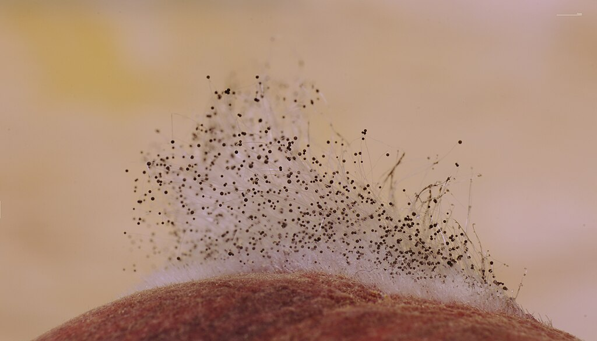A pin mold decomposing a peach

Although often inconspicuous, fungi occur in every environment on [Earth](/source/earth/ "Earth") and play very important roles in most [ecosystems](https://en.wikipedia.org/wiki/Ecosystems "Ecosystems"). Along with bacteria, fungi are the major [decomposers](https://en.wikipedia.org/wiki/Decomposer "Decomposer") in most terrestrial and aquatic ecosystems, and therefore play a critical role in [biogeochemical cycles](https://en.wikipedia.org/wiki/Biogeochemical_cycles "Biogeochemical cycles") and in many [food webs](https://en.wikipedia.org/wiki/Food_web "Food web"). As decomposers, they play an essential role in [nutrient cycling](https://en.wikipedia.org/wiki/Nutrient_cycling "Nutrient cycling"), especially as [saprotrophs](https://en.wikipedia.org/wiki/Saprotroph "Saprotroph") and [symbionts](https://en.wikipedia.org/wiki/Symbiont "Symbiont"), degrading [organic matter](https://en.wikipedia.org/wiki/Organic_matter "Organic matter") to inorganic molecules, which can then re-enter anabolic metabolic pathways in plants or other organisms.

### Symbiosis

Many fungi have important [symbiotic](https://en.wikipedia.org/wiki/Symbiotic "Symbiotic") relationships with organisms from most if not all [kingdoms](https://en.wikipedia.org/wiki/Kingdom_\(biology\) "Kingdom (biology)"). These interactions can be mutualistic or antagonistic in nature, or in the case of commensal fungi are of no apparent benefit or detriment to the host.

#### With plants

[Mycorrhizal](/source/mycorrhiza/ "Mycorrhiza") symbiosis between [plants](https://en.wikipedia.org/wiki/Plants "Plants") and fungi is one of the most well-known plant–fungus associations and is of significant importance for plant growth and persistence in many ecosystems; over 90% of all plant species engage in mycorrhizal relationships with fungi and are dependent upon this relationship for survival.

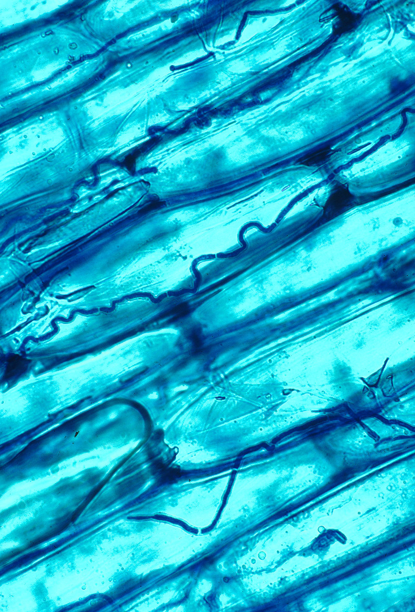The dark filaments are [hyphae](https://en.wikipedia.org/wiki/Hyphae "Hyphae") of the endophytic fungus _[Epichloë coenophiala](https://en.wikipedia.org/wiki/Epichloë_coenophiala "Epichloë coenophiala")_ in the intercellular spaces of [tall fescue](https://en.wikipedia.org/wiki/Festuca_arundinacea "Festuca arundinacea") leaf sheath tissue

The mycorrhizal symbiosis is ancient, dating back to at least 400 million years. It often increases the plant's uptake of inorganic compounds, such as nitrate and [phosphate](https://en.wikipedia.org/wiki/Phosphate "Phosphate") from soils having low concentrations of these key plant nutrients. The fungal partners may also mediate plant-to-plant transfer of carbohydrates and other nutrients. Such mycorrhizal communities are called "common [mycorrhizal networks](https://en.wikipedia.org/wiki/Mycorrhizal_network "Mycorrhizal network")". A special case of mycorrhiza is [myco-heterotrophy](https://en.wikipedia.org/wiki/Myco-heterotrophy "Myco-heterotrophy"), whereby the plant parasitizes the fungus, obtaining all of its nutrients from its fungal symbiont. Some fungal species inhabit the tissues inside roots, stems, and leaves, in which case they are called endophytes. Similar to mycorrhiza, endophytic colonization by fungi may benefit both symbionts; for example, endophytes of grasses impart to their host increased resistance to herbivores and other environmental stresses and receive food and shelter from the plant in return.

#### With algae and cyanobacteria

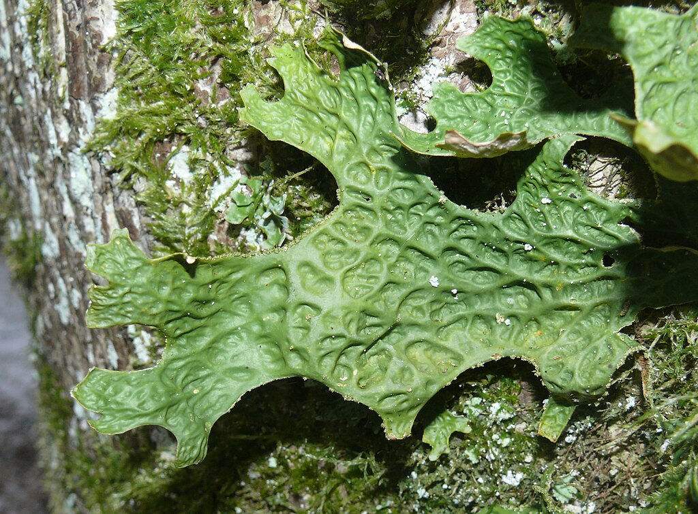The lichen _[Lobaria pulmonaria](https://en.wikipedia.org/wiki/Lobaria_pulmonaria "Lobaria pulmonaria")_, a symbiosis of fungal, [algal](https://en.wikipedia.org/wiki/Algal "Algal"), and [cyanobacterial](https://en.wikipedia.org/wiki/Cyanobacteria "Cyanobacteria") species

[Lichens](https://en.wikipedia.org/wiki/Lichens "Lichens") are a symbiotic relationship between fungi and [photosynthetic](https://en.wikipedia.org/wiki/Photosynthetic "Photosynthetic") algae or [cyanobacteria](https://en.wikipedia.org/wiki/Cyanobacteria "Cyanobacteria"). The photosynthetic partner in the relationship is referred to in lichen terminology as a "photobiont". The fungal part of the relationship is composed mostly of various species of ascomycetes and a few [basidiomycetes](https://en.wikipedia.org/wiki/Basidiomycete "Basidiomycete"). Lichens occur in every ecosystem on all continents, play a key role in [soil formation](https://en.wikipedia.org/wiki/Soil_formation "Soil formation") and the initiation of [biological succession](https://en.wikipedia.org/wiki/Biological_succession "Biological succession"), and are prominent in some extreme environments, including [polar](https://en.wikipedia.org/wiki/Polar_region "Polar region"), [alpine](https://en.wikipedia.org/wiki/Alpine_climate "Alpine climate"), and [semiarid](https://en.wikipedia.org/wiki/Semiarid_climate "Semiarid climate") desert regions. They are able to grow on inhospitable surfaces, including bare soil, rocks, [tree bark](https://en.wikipedia.org/wiki/Bark_\(botany\) "Bark (botany)"), wood, shells, barnacles and leaves. As in mycorrhizas, the photobiont provides sugars and other carbohydrates via photosynthesis to the fungus, while the fungus provides minerals and water to the photobiont. The functions of both symbiotic organisms are so closely intertwined that they function almost as a single organism; in most cases the resulting organism differs greatly from the individual components. Lichenization is a common mode of nutrition for fungi; around 27% of known fungi—more than 19,400 species—are lichenized. Characteristics common to most lichens include obtaining [organic carbon](https://en.wikipedia.org/wiki/Organic_carbon "Organic carbon") by photosynthesis, slow growth, small size, long life, long-lasting (seasonal) [vegetative reproductive](https://en.wikipedia.org/wiki/Vegetative_reproduction "Vegetative reproduction") structures, mineral nutrition obtained largely from airborne sources, and greater tolerance of [desiccation](https://en.wikipedia.org/wiki/Desiccation "Desiccation") than most other photosynthetic organisms in the same habitat.

#### With insects

Many insects also engage in [mutualistic relationships](https://en.wikipedia.org/wiki/Ant–fungus_mutualism "Ant–fungus mutualism") with fungi. Several groups of ants cultivate fungi in the order [Chaetothyriales](https://en.wikipedia.org/wiki/Chaetothyriales "Chaetothyriales") for several purposes: as a food source, as a structural component of their nests, and as a part of an ant/plant symbiosis in the [domatia](https://en.wikipedia.org/wiki/Domatia "Domatia") (tiny chambers in plants that house arthropods). [Ambrosia beetles](https://en.wikipedia.org/wiki/Ambrosia_beetles "Ambrosia beetles") cultivate various species of fungi in the bark of trees that they infest. Likewise, females of several [wood wasp](https://en.wikipedia.org/wiki/Wood_wasp "Wood wasp") species (genus _[Sirex](https://en.wikipedia.org/wiki/Sirex "Sirex")_) inject their eggs together with spores of the wood-rotting fungus _[Amylostereum areolatum](https://en.wikipedia.org/wiki/Amylostereum_areolatum "Amylostereum areolatum")_ into the [sapwood](https://en.wikipedia.org/wiki/Sapwood "Sapwood") of [pine](https://en.wikipedia.org/wiki/Pine "Pine") trees; the growth of the fungus provides ideal nutritional conditions for the development of the wasp larvae. At least one species of [stingless bee](https://en.wikipedia.org/wiki/Stingless_bee "Stingless bee") has a relationship with a fungus in the genus _[Monascus](https://en.wikipedia.org/wiki/Monascus "Monascus")_, where the larvae consume and depend on fungus transferred from old to new nests. [Termites](https://en.wikipedia.org/wiki/Termites "Termites") on the African [savannah](https://en.wikipedia.org/wiki/Savannah "Savannah") are also known to cultivate fungi, and yeasts of the genera _Candida_ and _Lachancea_ inhabit the [gut](https://en.wikipedia.org/wiki/Gastrointestinal_tract "Gastrointestinal tract") of a wide range of insects, including [neuropterans](https://en.wikipedia.org/wiki/Neuroptera "Neuroptera"), [beetles](https://en.wikipedia.org/wiki/Beetle "Beetle"), and [cockroaches](https://en.wikipedia.org/wiki/Cockroach "Cockroach"); it is not known whether these fungi benefit their hosts. Fungi growing in [dead wood](https://en.wikipedia.org/wiki/Coarse_woody_debris "Coarse woody debris") are essential for [xylophagous](https://en.wikipedia.org/wiki/Xylophagy "Xylophagy") insects (e.g. [woodboring beetles](https://en.wikipedia.org/wiki/Woodboring_beetles "Woodboring beetles")). They deliver nutrients needed by xylophages to nutritionally scarce dead wood. Thanks to this nutritional enrichment the larvae of the woodboring insect is able to grow and develop to adulthood. The larvae of many families of [fungicolous](https://en.wikipedia.org/wiki/Fungicolous "Fungicolous") flies, particularly those within the superfamily [Sciaroidea](https://en.wikipedia.org/wiki/Sciaroidea "Sciaroidea") such as the [Mycetophilidae](https://en.wikipedia.org/wiki/Mycetophilidae "Mycetophilidae") and some [Keroplatidae](https://en.wikipedia.org/wiki/Keroplatidae "Keroplatidae") feed on fungal fruiting bodies and sterile [mycorrhizae](https://en.wikipedia.org/wiki/Mycorrhizae "Mycorrhizae").

#### As parasites

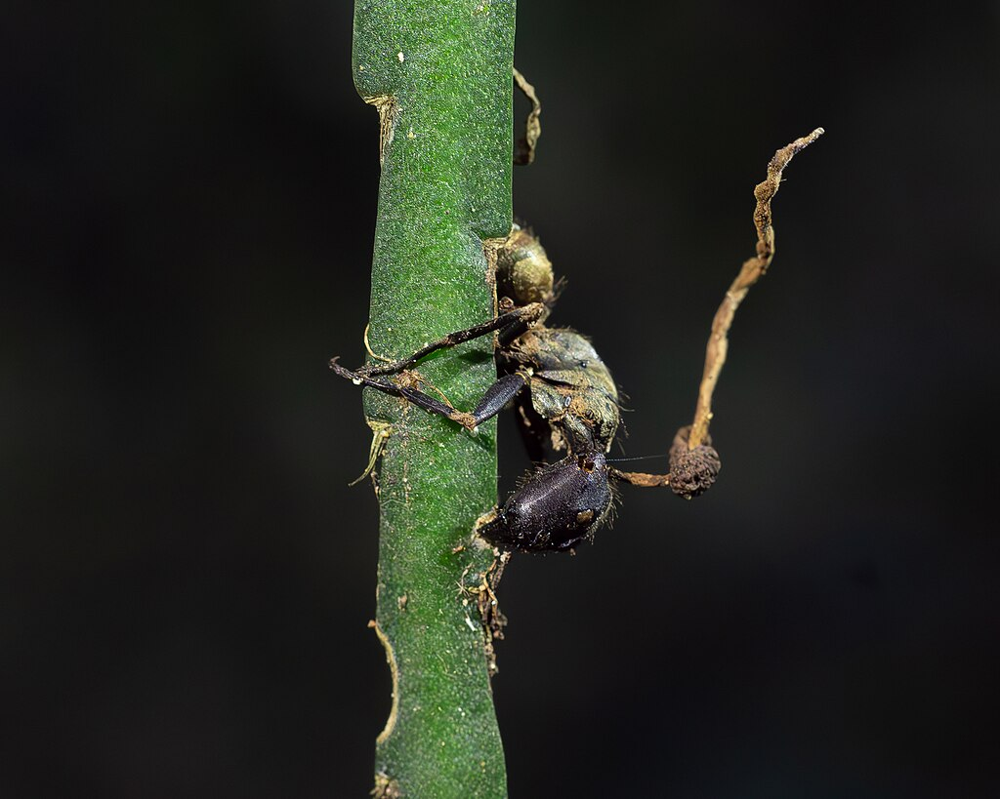Zombie ants, infected by the _[Ophiocordyceps unilateralis](https://en.wikipedia.org/wiki/Ophiocordyceps_unilateralis "Ophiocordyceps unilateralis")_ fungus, are predominantly found in [tropical rainforests](https://en.wikipedia.org/wiki/Tropical_rainforest "Tropical rainforest").

Many fungi are parasites on plants, animals (including humans), and other fungi. Serious pathogens of many cultivated plants causing extensive damage and losses to agriculture and forestry include the [rice blast](https://en.wikipedia.org/wiki/Rice_blast "Rice blast") fungus _[Magnaporthe oryzae](https://en.wikipedia.org/wiki/Magnaporthe_oryzae "Magnaporthe oryzae")_, tree pathogens such as _[Ophiostoma ulmi](https://en.wikipedia.org/wiki/Ophiostoma_ulmi "Ophiostoma ulmi")_ and _[Ophiostoma novo-ulmi](https://en.wikipedia.org/wiki/Ophiostoma_novo-ulmi "Ophiostoma novo-ulmi")_ causing [Dutch elm disease](https://en.wikipedia.org/wiki/Dutch_elm_disease "Dutch elm disease"), _[Cryphonectria parasitica](https://en.wikipedia.org/wiki/Cryphonectria_parasitica "Cryphonectria parasitica")_ responsible for [chestnut blight](https://en.wikipedia.org/wiki/Chestnut_blight "Chestnut blight"), and _Phymatotrichopsis omnivora_ causing [Texas root rot](https://en.wikipedia.org/wiki/Texas_root_rot "Texas root rot"), and plant pathogens in the genera _Fusarium_, _[Ustilago](https://en.wikipedia.org/wiki/Ustilago "Ustilago")_, _[Alternaria](https://en.wikipedia.org/wiki/Alternaria "Alternaria")_, and _Cochliobolus_. Some [carnivorous fungi](https://en.wikipedia.org/wiki/Carnivorous_fungi "Carnivorous fungi"), like _Purpureocillium lilacinum_, are [predators of nematodes](https://en.wikipedia.org/wiki/Nematophagous_fungus "Nematophagous fungus"), which they capture using an array of specialized structures such as constricting rings or adhesive nets. Many fungi that are plant pathogens, such as _Magnaporthe oryzae_, can switch from being biotrophic (parasitic on living plants) to being necrotrophic (feeding on the dead tissues of plants they have killed). This same principle is applied to fungi-feeding parasites, including _[Asterotremella albida](https://en.wikipedia.org/wiki/Asterotremella_albida "Asterotremella albida")_, which feeds on the fruit bodies of other fungi both while they are living and after they are dead.

Some fungi [alter the behavior of their animal hosts](https://en.wikipedia.org/wiki/Behavior-altering_parasite "Behavior-altering parasite") in ways that spread their spores more effectively (also called "active host transmission"). Examples include _[Ophiocordyceps unilateralis](https://en.wikipedia.org/wiki/Ophiocordyceps_unilateralis "Ophiocordyceps unilateralis")_ and possibly the extinct _[Allocordyceps](https://en.wikipedia.org/wiki/Allocordyceps "Allocordyceps")_.

#### As pathogens

The plant pathogen _Puccinia magellanicum_ ([calafate rust](https://en.wikipedia.org/wiki/Calafate_rust "Calafate rust")) causes the defect known as [witch's broom](https://en.wikipedia.org/wiki/Witch's_broom "Witch's broom"), seen here on a [barberry](https://en.wikipedia.org/wiki/Barberry "Barberry") shrub in Chile.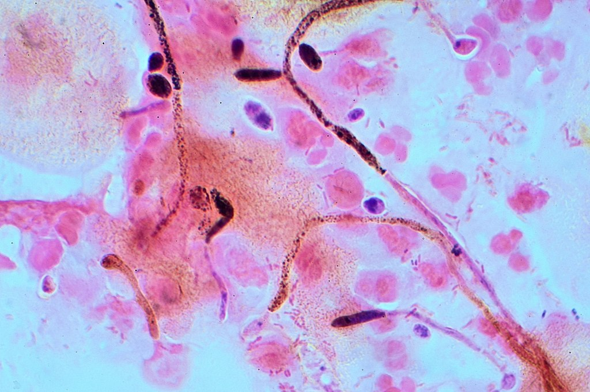[Gram stain](https://en.wikipedia.org/wiki/Gram_stain "Gram stain") of _Candida albicans_ from a vaginal swab from a woman with [candidiasis](https://en.wikipedia.org/wiki/Candidiasis "Candidiasis"), showing hyphae, and chlamydospores, which are 2–4 [μm](https://en.wikipedia.org/wiki/Μm "Μm") in diameter

Some fungi can cause serious diseases in humans, several of which may be fatal if untreated. These include [aspergillosis](https://en.wikipedia.org/wiki/Aspergillosis "Aspergillosis"), [candidiasis](https://en.wikipedia.org/wiki/Candidiasis "Candidiasis"), [coccidioidomycosis](https://en.wikipedia.org/wiki/Coccidioidomycosis "Coccidioidomycosis"), [cryptococcosis](https://en.wikipedia.org/wiki/Cryptococcosis "Cryptococcosis"), [histoplasmosis](https://en.wikipedia.org/wiki/Histoplasmosis "Histoplasmosis"), [mycetomas](https://en.wikipedia.org/wiki/Eumycetoma "Eumycetoma"), and [paracoccidioidomycosis](https://en.wikipedia.org/wiki/Paracoccidioidomycosis "Paracoccidioidomycosis"). Furthermore, a person with [immunodeficiency](https://en.wikipedia.org/wiki/Immunodeficiency "Immunodeficiency") is more susceptible to disease by genera such as _Aspergillus_, _Candida_, _Cryptoccocus_, _[Histoplasma](https://en.wikipedia.org/wiki/Histoplasma "Histoplasma")_, and _[Pneumocystis](https://en.wikipedia.org/wiki/Pneumocystis "Pneumocystis")_. Other fungi can attack eyes, nails, hair, and especially skin, the so-called [dermatophytic](https://en.wikipedia.org/wiki/Dermatophytic "Dermatophytic") and keratinophilic fungi, and cause local infections such as [ringworm](https://en.wikipedia.org/wiki/Ringworm "Ringworm") and [athlete's foot](https://en.wikipedia.org/wiki/Athlete's_foot "Athlete's foot"). Fungal spores are also a cause of [allergies](https://en.wikipedia.org/wiki/Allergies "Allergies"), and fungi from different taxonomic groups can evoke allergic reactions.

#### As targets of mycoparasites

Organisms that parasitize fungi are known as [mycoparasitic](https://en.wikipedia.org/wiki/Mycoparasitic "Mycoparasitic") organisms. About 300 species of fungi and fungus-like organisms, belonging to 13 classes and 113 genera, are used as [biocontrol](https://en.wikipedia.org/wiki/Biocontrol "Biocontrol") agents against plant fungal diseases. Fungi can also act as mycoparasites or antagonists of other fungi, such as _[Hypomyces chrysospermus](https://en.wikipedia.org/wiki/Hypomyces_chrysospermus "Hypomyces chrysospermus")_, which grows on [bolete](https://en.wikipedia.org/wiki/Bolete "Bolete") mushrooms. Fungi can also become the target of infection by [mycoviruses](https://en.wikipedia.org/wiki/Mycovirus "Mycovirus").

### Communication

There appears to be electrical communication between fungi in word-like components according to spiking characteristics.

### Possible impact on climate

According to a study published in the academic journal [Current Biology](https://en.wikipedia.org/wiki/Current_Biology "Current Biology"), fungi can soak from the atmosphere around 36% of global fossil fuel [greenhouse gas emissions](https://en.wikipedia.org/wiki/Greenhouse_gas_emissions "Greenhouse gas emissions"). This is because mycorrhizal fungi that directly participate in photosynthesis create a network that holds the soil together at the same time. Such fungi are severely threatened by [herbicides](https://en.wikipedia.org/wiki/Herbicide "Herbicide"), [fungicides](https://en.wikipedia.org/wiki/Fungicide "Fungicide"), [fertlizers](https://en.wikipedia.org/wiki/Fertilizer "Fertilizer"), [deforestation](https://en.wikipedia.org/wiki/Deforestation "Deforestation"), [pollution](https://en.wikipedia.org/wiki/Pollution "Pollution") and covering soil with impermeable materials like [concrete](https://en.wikipedia.org/wiki/Concrete "Concrete").

## Mycotoxins

![(6aR,9R)-N-((2R,5S,10aS,10bS)-5-benzyl-10b-hydroxy-2-methyl-3,6-dioxooctahydro-2H-oxazolo[3,2-a] pyrrolo[2,1-c]pyrazin-2-yl)-7-methyl-4,6,6a,7,8,9-hexahydroindolo[4,3-fg] quinoline-9-carboxamide](../media/fungus/Ergotamine3.png)[Ergotamine](https://en.wikipedia.org/wiki/Ergotamine "Ergotamine"), a major mycotoxin produced by _[Claviceps](https://en.wikipedia.org/wiki/Claviceps "Claviceps")_ species, which if ingested can cause [gangrene](https://en.wikipedia.org/wiki/Gangrene "Gangrene"), convulsions, and [hallucinations](https://en.wikipedia.org/wiki/Hallucination "Hallucination")

Many fungi produce [biologically active](https://en.wikipedia.org/wiki/Biological_activity "Biological activity") compounds, several of which are [toxic](https://en.wikipedia.org/wiki/Toxin "Toxin") to animals or plants and are therefore called [mycotoxins](https://en.wikipedia.org/wiki/Mycotoxins "Mycotoxins"). Of particular relevance to humans are mycotoxins produced by molds causing food spoilage, and poisonous mushrooms (see above). Particularly infamous are the lethal [amatoxins](https://en.wikipedia.org/wiki/Amatoxin "Amatoxin") in some _[Amanita](https://en.wikipedia.org/wiki/Amanita "Amanita")_ mushrooms, and [ergot alkaloids](https://en.wikipedia.org/wiki/Ergotamine "Ergotamine"), which have a long history of causing serious epidemics of [ergotism](https://en.wikipedia.org/wiki/Ergotism "Ergotism") (St Anthony's Fire) in people consuming [rye](https://en.wikipedia.org/wiki/Rye "Rye") or related [cereals](https://en.wikipedia.org/wiki/Cereal "Cereal") contaminated with [sclerotia](https://en.wikipedia.org/wiki/Sclerotia "Sclerotia") of the ergot fungus, _[Claviceps purpurea](https://en.wikipedia.org/wiki/Claviceps_purpurea "Claviceps purpurea")_. Other notable mycotoxins include the [aflatoxins](https://en.wikipedia.org/wiki/Aflatoxin "Aflatoxin"), which are insidious [liver toxins](https://en.wikipedia.org/wiki/Hepatotoxicity "Hepatotoxicity") and highly [carcinogenic](https://en.wikipedia.org/wiki/Carcinogenic "Carcinogenic") metabolites produced by certain _Aspergillus_ species often growing in or on grains and nuts consumed by humans, [ochratoxins](https://en.wikipedia.org/wiki/Ochratoxin "Ochratoxin"), [patulin](https://en.wikipedia.org/wiki/Patulin "Patulin"), and [trichothecenes](https://en.wikipedia.org/wiki/Trichothecene "Trichothecene") (e.g., [T-2 mycotoxin](https://en.wikipedia.org/wiki/T-2_mycotoxin "T-2 mycotoxin")) and [fumonisins](https://en.wikipedia.org/wiki/Fumonisin "Fumonisin"), which have significant impact on human food supplies or animal [livestock](https://en.wikipedia.org/wiki/Livestock "Livestock").

Mycotoxins are secondary metabolites (or [natural products](https://en.wikipedia.org/wiki/Natural_product "Natural product")), and research has established the existence of biochemical pathways solely for the purpose of producing mycotoxins and other natural products in fungi. Mycotoxins may provide [fitness](https://en.wikipedia.org/wiki/Fitness_\(biology\) "Fitness (biology)") benefits in terms of physiological adaptation, competition with other microbes and fungi, and protection from consumption ([fungivory](https://en.wikipedia.org/wiki/Fungivory "Fungivory")). Many fungal secondary metabolites (or derivatives) are used medically, as described under [Human use below](/source/fungus/#Human_use).

## Pathogenic mechanisms

_[Ustilago maydis](https://en.wikipedia.org/wiki/Ustilago_maydis "Ustilago maydis")_ is a pathogenic plant fungus that causes smut disease in maize and [teosinte](https://en.wikipedia.org/wiki/Teosinte "Teosinte"). Plants have evolved efficient defense systems against pathogenic microbes such as _U. maydis_. A rapid defense reaction after pathogen attack is the [oxidative burst](https://en.wikipedia.org/wiki/Oxidative_burst "Oxidative burst") where the plant produces [reactive oxygen species](https://en.wikipedia.org/wiki/Reactive_oxygen_species "Reactive oxygen species") at the site of the attempted invasion. _U. maydis_ can respond to the oxidative burst with an oxidative stress response, regulated by the gene _[YAP1](https://en.wikipedia.org/wiki/YAP1 "YAP1")_. The response protects _U. maydis_ from the host defense, and is necessary for the pathogen's virulence. Furthermore, _U. maydis_ has a well-established recombinational [DNA repair](https://en.wikipedia.org/wiki/DNA_repair "DNA repair") system which acts during mitosis and meiosis. The system may assist the pathogen in surviving DNA damage arising from the host plant's oxidative defensive response to infection.

_Cryptococcus neoformans_ is an encapsulated yeast that can live in both plants and animals. _C.neoformans_ usually infects the lungs, where it is phagocytosed by [alveolar macrophages](https://en.wikipedia.org/wiki/Alveolar_macrophage "Alveolar macrophage"). Some _C.neoformans_ can survive [inside](https://en.wikipedia.org/wiki/Intracellular "Intracellular") macrophages, which appears to be the basis for [latency](https://en.wikipedia.org/wiki/Latency_period "Latency period"), disseminated disease, and resistance to antifungal agents. One mechanism by which _C.neoformans_ survives the hostile macrophage environment is by up-regulating the expression of genes involved in the oxidative stress response. Another mechanism involves meiosis. The majority of _C.neoformans_ are mating "type a". Filaments of mating "type a" ordinarily have haploid nuclei, but they can become diploid (perhaps by endoduplication or by stimulated nuclear fusion) to form [blastospores](https://en.wikipedia.org/wiki/Blastospore "Blastospore"). The diploid nuclei of blastospores can undergo meiosis, including recombination, to form haploid basidiospores that can be dispersed. This process is referred to as monokaryotic fruiting. This process requires a gene called _[DMC1](https://en.wikipedia.org/wiki/DMC1 "DMC1")_, which is a conserved homologue of genes _[recA](https://en.wikipedia.org/wiki/RecA "RecA")_ in bacteria and _[RAD51](https://en.wikipedia.org/wiki/RAD51 "RAD51")_ in eukaryotes, that mediates homologous chromosome pairing during meiosis and repair of DNA double-strand breaks. Thus, _C.neoformans_ can undergo a meiosis, monokaryotic fruiting, that promotes recombinational repair in the oxidative, DNA damaging environment of the host macrophage, and the repair capability may contribute to its virulence.

## Human use

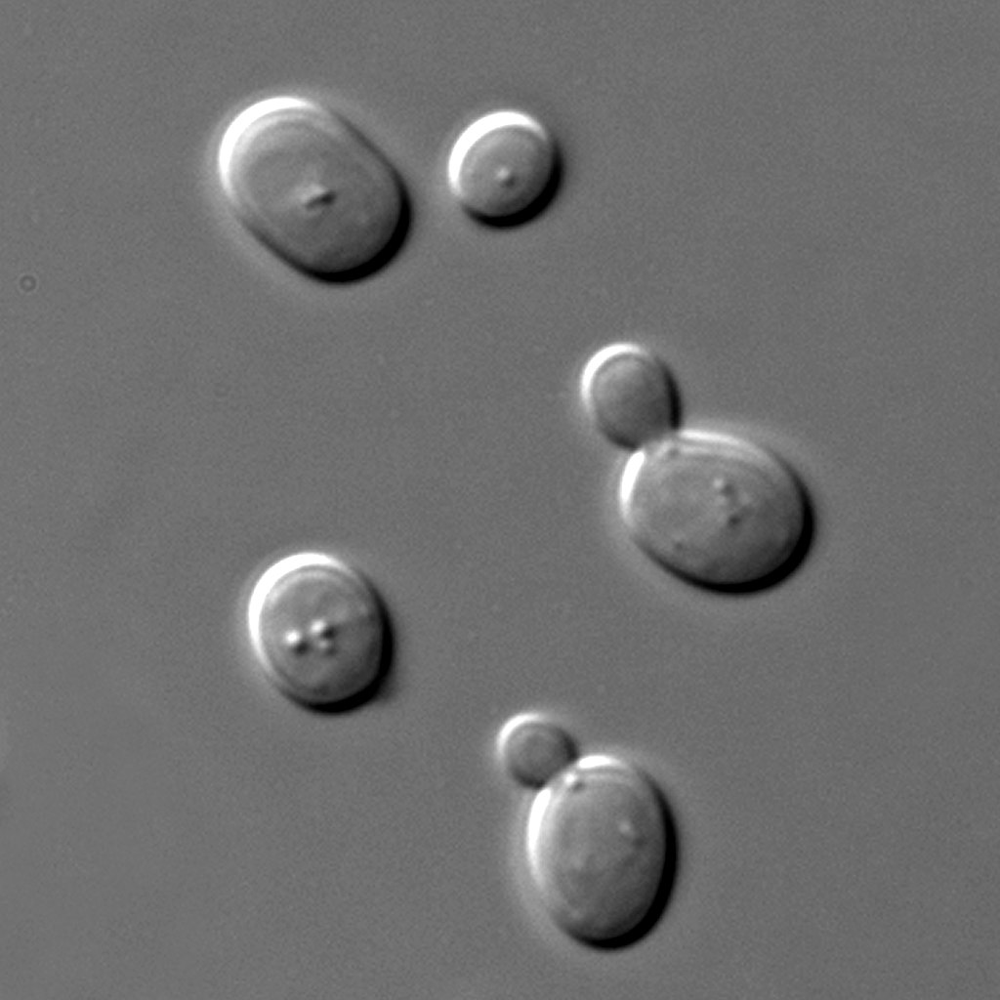_[Saccharomyces cerevisiae](https://en.wikipedia.org/wiki/Saccharomyces_cerevisiae "Saccharomyces cerevisiae")_ cells shown with [DIC microscopy](https://en.wikipedia.org/wiki/DIC_microscopy "DIC microscopy")

The human use of fungi for food preparation or preservation and other purposes is extensive and has a long history. [Mushroom farming](https://en.wikipedia.org/wiki/Mushroom_farming "Mushroom farming") and [mushroom gathering](https://en.wikipedia.org/wiki/Mushroom_gathering "Mushroom gathering") are large industries in many countries. The study of the historical uses and sociological impact of fungi is known as [ethnomycology](https://en.wikipedia.org/wiki/Ethnomycology "Ethnomycology"). Because of the capacity of this group to produce an enormous range of [natural products](https://en.wikipedia.org/wiki/Natural_products "Natural products") with [antimicrobial](https://en.wikipedia.org/wiki/Antimicrobial "Antimicrobial") or other biological activities, many species have long been used or are being developed for industrial [production of antibiotics](https://en.wikipedia.org/wiki/Production_of_antibiotics "Production of antibiotics"), vitamins, and [anti-cancer](https://en.wikipedia.org/wiki/Taxol#Production "Taxol") and [cholesterol-lowering](https://en.wikipedia.org/wiki/Lovastatin "Lovastatin") drugs. Methods have been developed for [genetic engineering](https://en.wikipedia.org/wiki/Genetic_engineering "Genetic engineering") of fungi, enabling [metabolic engineering](https://en.wikipedia.org/wiki/Metabolic_engineering "Metabolic engineering") of fungal species. For example, genetic modification of yeast species—which are easy to grow at fast rates in large fermentation vessels—has opened up ways of [pharmaceutical](https://en.wikipedia.org/wiki/Pharmaceutical "Pharmaceutical") production that are potentially more efficient than production by the original source organisms. Fungi-based industries are sometimes considered to be a major part of a growing [bioeconomy](https://en.wikipedia.org/wiki/Bioeconomy "Bioeconomy"), with applications under [research and development](https://en.wikipedia.org/wiki/Research_and_development "Research and development") including use for textiles, [meat](https://en.wikipedia.org/wiki/Environmental_impact_of_meat_production "Environmental impact of meat production") substitution and general fungal biotechnology.

### Therapeutic uses

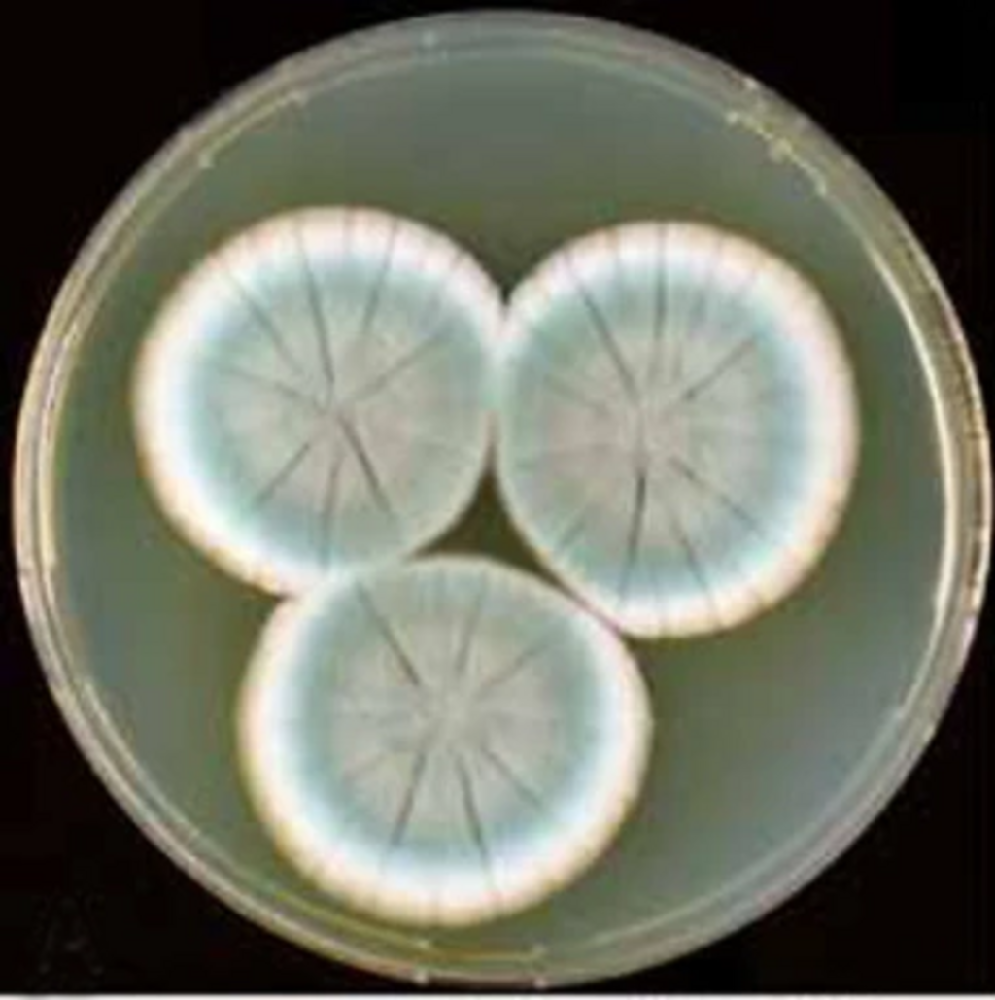The mold _[Penicillium rubens](https://en.wikipedia.org/wiki/Penicillium_rubens "Penicillium rubens")_ was the source of [penicillin G](https://en.wikipedia.org/wiki/Penicillin_G "Penicillin G").

#### Modern chemotherapeutics

Many species produce metabolites that are major sources of [pharmacologically](https://en.wikipedia.org/wiki/Pharmacology "Pharmacology") active drugs.

##### Antibiotics

Particularly important are the antibiotics, including the [penicillins](https://en.wikipedia.org/wiki/Penicillin "Penicillin"), a structurally related group of [β-lactam antibiotics](https://en.wikipedia.org/wiki/Β-lactam_antibiotic "Β-lactam antibiotic") that are synthesized from small [peptides](https://en.wikipedia.org/wiki/Peptide "Peptide"). Although naturally occurring penicillins such as [penicillin G](https://en.wikipedia.org/wiki/Penicillin_G "Penicillin G") (produced by _[Penicillium chrysogenum](https://en.wikipedia.org/wiki/Penicillium_chrysogenum "Penicillium chrysogenum")_) have a relatively narrow spectrum of biological activity, a wide range of other penicillins can be produced by [chemical modification](https://en.wikipedia.org/wiki/Chemical_synthesis "Chemical synthesis") of the natural penicillins. Modern penicillins are [semisynthetic](https://en.wikipedia.org/wiki/Semisynthetic "Semisynthetic") compounds, obtained initially from [fermentation](https://en.wikipedia.org/wiki/Fermentation_\(biochemistry\) "Fermentation (biochemistry)") cultures, but then structurally altered for specific desirable properties. Other antibiotics produced by fungi include: [ciclosporin](https://en.wikipedia.org/wiki/Ciclosporin "Ciclosporin"), commonly used as an [immunosuppressant](https://en.wikipedia.org/wiki/Immunosuppressant "Immunosuppressant") during [transplant surgery](https://en.wikipedia.org/wiki/Transplant_surgery "Transplant surgery"); and [fusidic acid](https://en.wikipedia.org/wiki/Fusidic_acid "Fusidic acid"), used to help control infection from [methicillin-resistant _Staphylococcus aureus_](https://en.wikipedia.org/wiki/Methicillin-resistant_Staphylococcus_aureus "Methicillin-resistant Staphylococcus aureus") bacteria. Widespread use of antibiotics for the treatment of bacterial diseases, such as [tuberculosis](https://en.wikipedia.org/wiki/Tuberculosis "Tuberculosis"), [syphilis](https://en.wikipedia.org/wiki/Syphilis "Syphilis"), [leprosy](https://en.wikipedia.org/wiki/Leprosy "Leprosy"), and others began in the early 20th century and continues to date. In nature, antibiotics of fungal or bacterial origin appear to play a dual role: at high concentrations they act as chemical defense against competition with other microorganisms in species-rich environments, such as the [rhizosphere](https://en.wikipedia.org/wiki/Rhizosphere_\(ecology\) "Rhizosphere (ecology)"), and at low concentrations as [quorum-sensing](https://en.wikipedia.org/wiki/Quorum-sensing "Quorum-sensing") molecules for intra- or interspecies signaling.

##### Other

Other drugs produced by fungi include [griseofulvin](https://en.wikipedia.org/wiki/Griseofulvin "Griseofulvin") isolated from _[Penicillium griseofulvum](https://en.wikipedia.org/wiki/Penicillium_griseofulvum "Penicillium griseofulvum")_, used to treat fungal infections, and [statins](https://en.wikipedia.org/wiki/Statin "Statin") ([HMG-CoA reductase](https://en.wikipedia.org/wiki/HMG-CoA_reductase "HMG-CoA reductase") inhibitors), used to inhibit [cholesterol synthesis](https://en.wikipedia.org/wiki/Cholesterol_synthesis "Cholesterol synthesis"). Examples of statins found in fungi include [mevastatin](https://en.wikipedia.org/wiki/Mevastatin "Mevastatin") from _[Penicillium citrinum](https://en.wikipedia.org/wiki/Penicillium_citrinum "Penicillium citrinum")_ and [lovastatin](https://en.wikipedia.org/wiki/Lovastatin "Lovastatin") from _[Aspergillus terreus](https://en.wikipedia.org/wiki/Aspergillus_terreus "Aspergillus terreus")_ and the [oyster mushroom](https://en.wikipedia.org/wiki/Pleurotus_ostreatus "Pleurotus ostreatus"). [Psilocybin](https://en.wikipedia.org/wiki/Psilocybin "Psilocybin") from [fungi](https://en.wikipedia.org/wiki/Psilocybin_mushroom "Psilocybin mushroom") is investigated [for therapeutic use](https://en.wikipedia.org/wiki/Psilocybin_therapy "Psilocybin therapy") and appears to cause [global increases in brain network integration](https://en.wikipedia.org/wiki/Brain_connectivity_estimators "Brain connectivity estimators"). Fungi produce compounds that inhibit [viruses](https://en.wikipedia.org/wiki/Virus "Virus") and [cancer cells](https://en.wikipedia.org/wiki/Cancer_cells "Cancer cells"). Specific metabolites, such as [polysaccharide-K](https://en.wikipedia.org/wiki/Polysaccharide-K "Polysaccharide-K"), [ergotamine](https://en.wikipedia.org/wiki/Ergotamine "Ergotamine"), and [β-lactam antibiotics](https://en.wikipedia.org/wiki/Β-lactam_antibiotics "Β-lactam antibiotics"), are routinely used in clinical medicine. The [shiitake](https://en.wikipedia.org/wiki/Shiitake "Shiitake") mushroom is a source of [lentinan](https://en.wikipedia.org/wiki/Lentinan "Lentinan"), a clinical drug approved for use in cancer treatments in several countries, including [Japan](https://en.wikipedia.org/wiki/Japan "Japan"). In Europe and Japan, polysaccharide-K (brand name Krestin), a chemical derived from _[Trametes versicolor](https://en.wikipedia.org/wiki/Trametes_versicolor "Trametes versicolor")_, is an approved [adjuvant](https://en.wikipedia.org/wiki/Adjuvant "Adjuvant") for cancer therapy.

### Traditional medicine

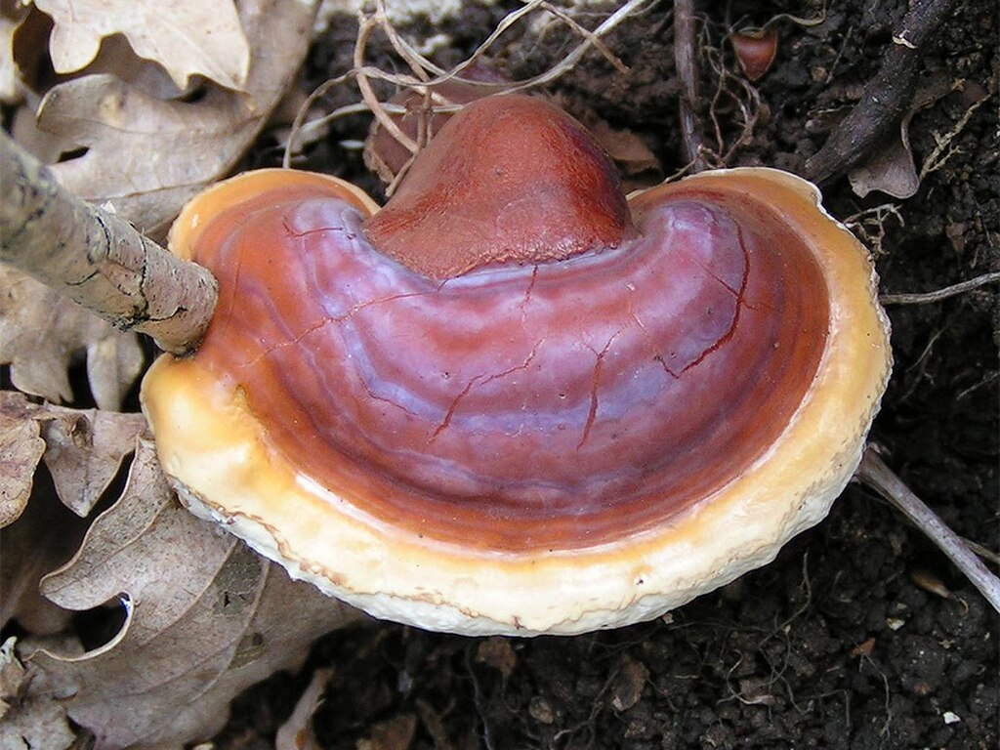

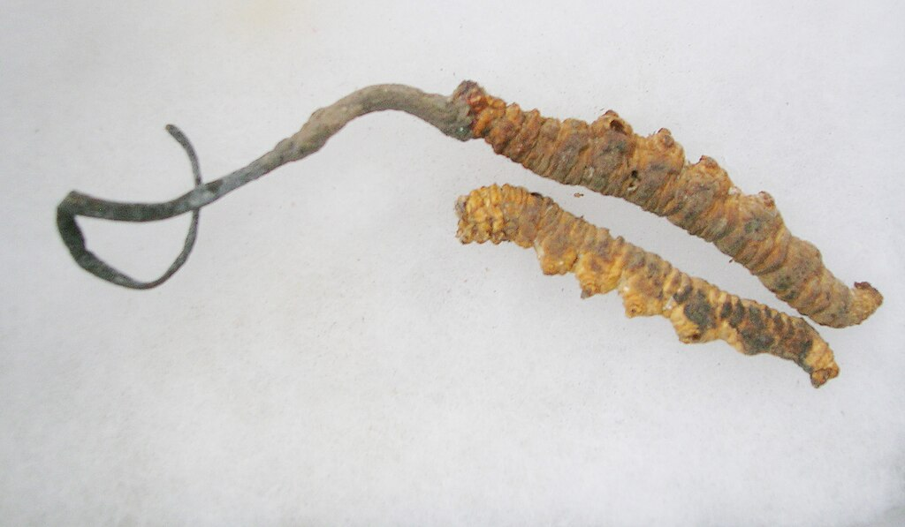

The fungi _[Ganoderma lucidum](https://en.wikipedia.org/wiki/Ganoderma_lucidum "Ganoderma lucidum")_ (left) and _[Ophiocordyceps sinensis](https://en.wikipedia.org/wiki/Ophiocordyceps_sinensis "Ophiocordyceps sinensis")_ (right) are used in traditional medicine practices

Certain mushrooms are used as supposed therapeutics in [folk medicine](https://en.wikipedia.org/wiki/Folk_medicine "Folk medicine") practices, such as [traditional Chinese medicine](https://en.wikipedia.org/wiki/Traditional_Chinese_medicine "Traditional Chinese medicine"). Mushrooms with a history of such use include _[Agaricus subrufescens](https://en.wikipedia.org/wiki/Agaricus_subrufescens "Agaricus subrufescens")_, _[Ganoderma lucidum](https://en.wikipedia.org/wiki/Ganoderma_lucidum "Ganoderma lucidum")_, and _[Ophiocordyceps sinensis](https://en.wikipedia.org/wiki/Ophiocordyceps_sinensis "Ophiocordyceps sinensis")_.

### Cultured foods

[Baker's yeast](https://en.wikipedia.org/wiki/Baker's_yeast "Baker's yeast") or _[Saccharomyces cerevisiae](https://en.wikipedia.org/wiki/Saccharomyces_cerevisiae "Saccharomyces cerevisiae")_, a unicellular fungus, is used to make [bread](https://en.wikipedia.org/wiki/Bread "Bread") and other wheat-based products, such as [pizza](https://en.wikipedia.org/wiki/Pizza "Pizza") dough and [dumplings](https://en.wikipedia.org/wiki/Dumpling "Dumpling"). Yeast species of the genus _Saccharomyces_ are also used to produce [alcoholic beverages](https://en.wikipedia.org/wiki/Alcoholic_beverage "Alcoholic beverage") through fermentation. Shoyu koji mold (_[Aspergillus oryzae](https://en.wikipedia.org/wiki/Aspergillus_oryzae "Aspergillus oryzae")_) is an essential ingredient in brewing shoyu ([soy sauce](https://en.wikipedia.org/wiki/Soy_sauce "Soy sauce")) and [sake](https://en.wikipedia.org/wiki/Sake "Sake"), and the preparation of [miso](https://en.wikipedia.org/wiki/Miso "Miso"), while _Rhizopus_ species are used for making [tempeh](https://en.wikipedia.org/wiki/Tempeh "Tempeh"). Several of these fungi are [domesticated](https://en.wikipedia.org/wiki/Domesticated "Domesticated") species that were [bred](https://en.wikipedia.org/wiki/Breeding_program "Breeding program") or selected according to their capacity to ferment food without producing harmful mycotoxins (see below), which are produced by very closely related _[Aspergilli](https://en.wikipedia.org/wiki/Aspergillus_flavus "Aspergillus flavus")_. [Quorn](https://en.wikipedia.org/wiki/Quorn "Quorn"), a [meat alternative](https://en.wikipedia.org/wiki/Meat_alternative "Meat alternative"), is made from _[Fusarium venenatum](https://en.wikipedia.org/wiki/Fusarium_venenatum "Fusarium venenatum")_.

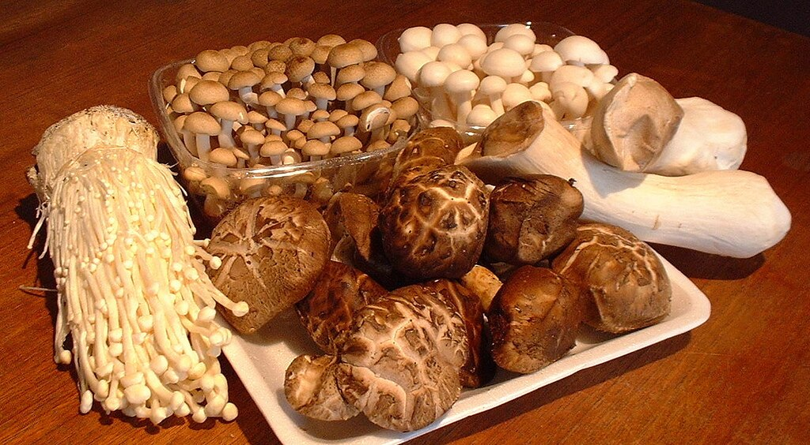A selection of [edible](https://en.wikipedia.org/wiki/Edible_mushroom "Edible mushroom") Asian fungi

### In food

[Edible mushrooms](https://en.wikipedia.org/wiki/Edible_mushroom "Edible mushroom") include commercially raised and wild-harvested fungi. _[Agaricus bisporus](https://en.wikipedia.org/wiki/Agaricus_bisporus "Agaricus bisporus")_, sold as button mushrooms when small or Portobello mushrooms when larger, is the most widely cultivated species in the West, used in salads, soups, and many other dishes. Many Asian fungi are commercially grown and have increased in popularity in the West. They are often available fresh in [grocery stores](https://en.wikipedia.org/wiki/Grocery_store "Grocery store") and markets, including straw mushrooms (_[Volvariella volvacea](https://en.wikipedia.org/wiki/Volvariella_volvacea "Volvariella volvacea")_), oyster mushrooms (_[Pleurotus spp.](https://en.wikipedia.org/wiki/Pleurotus "Pleurotus")_), shiitakes (_[Lentinula edodes](https://en.wikipedia.org/wiki/Lentinula_edodes "Lentinula edodes")_), and [enokitake](https://en.wikipedia.org/wiki/Enokitake "Enokitake") (_[Flammulina](https://en.wikipedia.org/wiki/Flammulina "Flammulina")_ spp.).

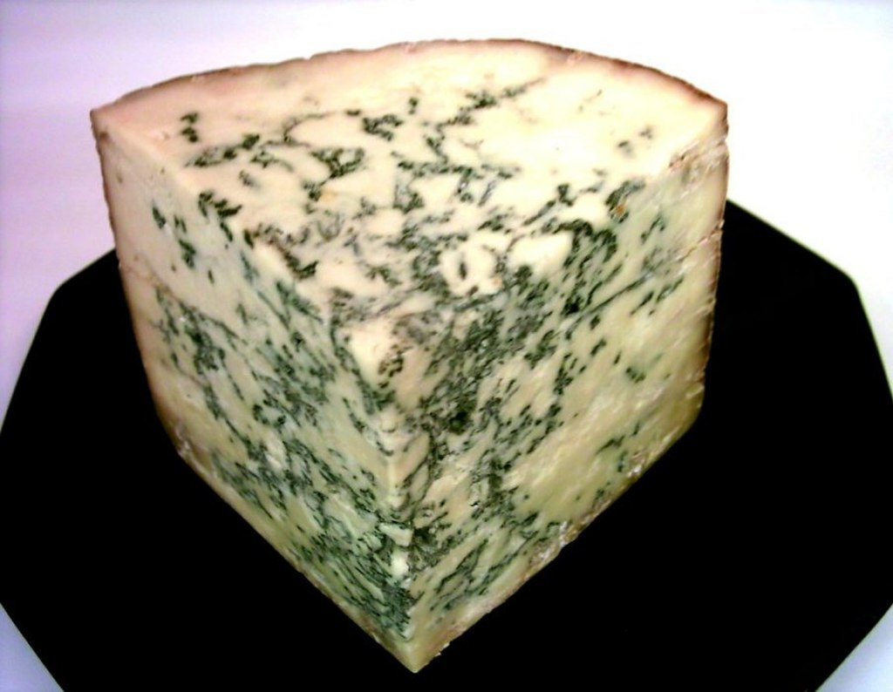[Stilton cheese](https://en.wikipedia.org/wiki/Stilton_cheese "Stilton cheese") veined with _[Penicillium roqueforti](https://en.wikipedia.org/wiki/Penicillium_roqueforti "Penicillium roqueforti")_

Many other mushroom species are [harvested from the wild](https://en.wikipedia.org/wiki/Mushroom_hunting "Mushroom hunting") for personal consumption or commercial sale. [Milkcap mushrooms](https://en.wikipedia.org/wiki/Lactarius_deliciosus "Lactarius deliciosus"), [morels](https://en.wikipedia.org/wiki/Morel "Morel"), [chanterelles](https://en.wikipedia.org/wiki/Chanterelle "Chanterelle"), [truffles](https://en.wikipedia.org/wiki/Truffles "Truffles"), [black trumpets](https://en.wikipedia.org/wiki/Craterellus "Craterellus"), and _porcini_ mushrooms (_[Boletus edulis](https://en.wikipedia.org/wiki/Boletus_edulis "Boletus edulis")_) (also known as king boletes) demand a high price on the market. They are often used in gourmet dishes.

Certain types of cheeses require inoculation of milk curds with fungal species that impart a unique flavor and texture to the cheese. Examples include the [blue](https://en.wikipedia.org/wiki/Blue_cheese "Blue cheese") color in cheeses such as [Stilton](https://en.wikipedia.org/wiki/Stilton_cheese "Stilton cheese") or [Roquefort](https://en.wikipedia.org/wiki/Roquefort "Roquefort"), which are made by inoculation with _[Penicillium roqueforti](https://en.wikipedia.org/wiki/Penicillium_roqueforti "Penicillium roqueforti")_. Molds used in cheese production are non-toxic and are thus safe for human consumption; however, mycotoxins (e.g., aflatoxins, [roquefortine C](https://en.wikipedia.org/wiki/Roquefortine_C "Roquefortine C"), patulin, or others) may accumulate because of growth of other fungi during cheese ripening or storage.

### Poisonous fungi

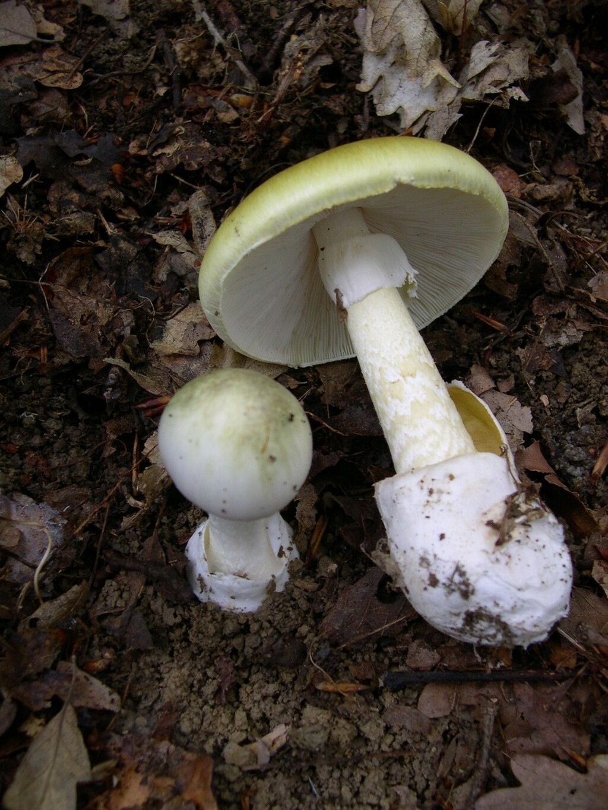_[Amanita phalloides](https://en.wikipedia.org/wiki/Amanita_phalloides "Amanita phalloides")_ accounts for the majority of fatal [mushroom poisonings](https://en.wikipedia.org/wiki/Mushroom_poisoning "Mushroom poisoning") worldwide. It sometimes lacks the greenish color seen here.

Many mushroom species are [poisonous](https://en.wikipedia.org/wiki/Mushroom_poisoning "Mushroom poisoning") to humans and cause a range of reactions including slight digestive problems, [allergic](https://en.wikipedia.org/wiki/Allergic "Allergic") reactions, [hallucinations](https://en.wikipedia.org/wiki/Hallucination "Hallucination"), severe organ failure, and death. Genera with mushrooms containing deadly toxins include, not are not limited to _[Conocybe](https://en.wikipedia.org/wiki/Conocybe "Conocybe")_, _[Galerina](https://en.wikipedia.org/wiki/Galerina "Galerina")_, _[Lepiota](https://en.wikipedia.org/wiki/Lepiota "Lepiota")_ and infamously, _Amanita_. The latter genus the death cap _([A.phalloides](https://en.wikipedia.org/wiki/Amanita_phalloides "Amanita phalloides"))_, the most common cause of deadly mushroom poisoning. In particular, [_Amanita_ sect. _Phalloideae_](https://en.wikipedia.org/wiki/List_of_Amanita_species#Section_Phalloideae "List of Amanita species") contains dozens of amatoxin-containing species, including _A. phalloides_ as well as the [destroying angels](https://en.wikipedia.org/wiki/Destroying_angels "Destroying angels"). The false morel (_[Gyromitra esculenta](https://en.wikipedia.org/wiki/Gyromitra_esculenta "Gyromitra esculenta")_) is occasionally considered a delicacy when cooked, yet can be highly toxic when eaten raw. _[Tricholoma equestre](https://en.wikipedia.org/wiki/Tricholoma_equestre "Tricholoma equestre")_ was considered edible until it was implicated in serious poisonings causing [rhabdomyolysis](https://en.wikipedia.org/wiki/Rhabdomyolysis "Rhabdomyolysis"). [Fly agaric](https://en.wikipedia.org/wiki/Fly_agaric "Fly agaric") mushrooms (_Amanita muscaria_) also cause occasional non-fatal poisonings, mostly as a result of ingestion for its [hallucinogenic](https://en.wikipedia.org/wiki/Hallucinogenic "Hallucinogenic") properties. Historically, fly agaric was used by different peoples in Europe and Asia and its present usage for religious or [shamanic](https://en.wikipedia.org/wiki/Shamanic "Shamanic") purposes is reported from some ethnic groups such as the [Koryak people](https://en.wikipedia.org/wiki/Koryak_people "Koryak people") of northeastern [Siberia](https://en.wikipedia.org/wiki/Siberia "Siberia").

As it is difficult to accurately identify a safe mushroom without proper training and knowledge, it is often advised to assume that a wild mushroom is poisonous and not to consume it.

### Pest control

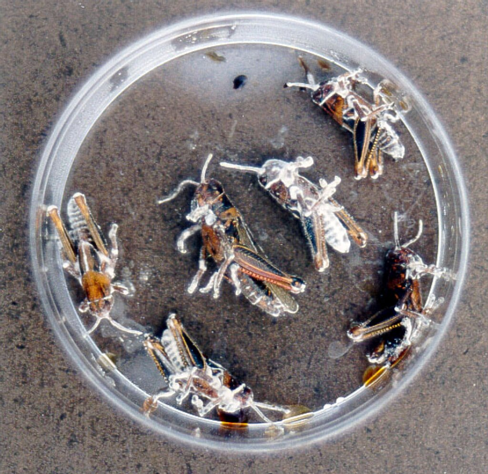Grasshoppers killed by _[Beauveria bassiana](https://en.wikipedia.org/wiki/Beauveria_bassiana "Beauveria bassiana")_

In agriculture, fungi may be useful if they actively compete for nutrients and space with [pathogenic](https://en.wikipedia.org/wiki/Pathogen "Pathogen") microorganisms such as bacteria or other fungi via the [competitive exclusion principle](https://en.wikipedia.org/wiki/Competitive_exclusion_principle "Competitive exclusion principle"), or if they are [parasites](https://en.wikipedia.org/wiki/Parasites "Parasites") of these pathogens. For example, certain species eliminate or suppress the growth of harmful plant pathogens, such as insects, [mites](https://en.wikipedia.org/wiki/Mites "Mites"), [weeds](https://en.wikipedia.org/wiki/Weed "Weed"), [nematodes](https://en.wikipedia.org/wiki/Nematodes "Nematodes"), and other fungi that cause diseases of important [crop](https://en.wikipedia.org/wiki/Crop "Crop") plants. This has generated strong interest in practical applications that use these fungi in the [biological control](https://en.wikipedia.org/wiki/Biological_control "Biological control") of these agricultural pests. [Entomopathogenic fungi](https://en.wikipedia.org/wiki/Entomopathogenic_fungus "Entomopathogenic fungus") can be used as [biopesticides](https://en.wikipedia.org/wiki/Biopesticide "Biopesticide"), as they actively kill insects. Examples that have been used as [biological insecticides](https://en.wikipedia.org/wiki/Biological_insecticide "Biological insecticide") are _[Beauveria bassiana](https://en.wikipedia.org/wiki/Beauveria_bassiana "Beauveria bassiana")_, _[Metarhizium](https://en.wikipedia.org/wiki/Metarhizium "Metarhizium")_ spp., _[Hirsutella](https://en.wikipedia.org/wiki/Hirsutella "Hirsutella")_ spp., _[Paecilomyces](https://en.wikipedia.org/wiki/Paecilomyces "Paecilomyces")_ (_Isaria_) spp., and _[Lecanicillium lecanii](https://en.wikipedia.org/wiki/Lecanicillium_lecanii "Lecanicillium lecanii")_. Endophytic fungi of grasses of the genus _[Epichloë](https://en.wikipedia.org/wiki/Epichloë "Epichloë")_, such as _[E. coenophiala](https://en.wikipedia.org/wiki/Epichloë_coenophiala "Epichloë coenophiala")_, produce alkaloids that are toxic to a range of invertebrate and vertebrate [herbivores](https://en.wikipedia.org/wiki/Herbivores "Herbivores"). These alkaloids protect grass plants from [herbivory](https://en.wikipedia.org/wiki/Herbivory "Herbivory"), but several endophyte alkaloids can poison grazing animals, such as cattle and sheep. Infecting cultivars of [pasture](https://en.wikipedia.org/wiki/Pasture "Pasture") or [forage](https://en.wikipedia.org/wiki/Forage "Forage") grasses with _Epichloë_ endophytes is one approach being used in [grass breeding](https://en.wikipedia.org/wiki/Plant_breeding "Plant breeding") programs; the fungal strains are selected for producing only alkaloids that increase resistance to herbivores such as insects, while being non-toxic to livestock.

### Bioremediation

Certain fungi, in particular [white-rot](https://en.wikipedia.org/wiki/White_rot "White rot") fungi, can degrade [insecticides](https://en.wikipedia.org/wiki/Insecticide "Insecticide"), herbicides, [pentachlorophenol](https://en.wikipedia.org/wiki/Pentachlorophenol "Pentachlorophenol"), [creosote](https://en.wikipedia.org/wiki/Creosote "Creosote"), [coal tars](https://en.wikipedia.org/wiki/Coal_tar "Coal tar"), and heavy fuels and turn them into [carbon dioxide](https://en.wikipedia.org/wiki/Carbon_dioxide "Carbon dioxide"), water, and basic elements. Fungi have been shown to [biomineralize](https://en.wikipedia.org/wiki/Biomineralize "Biomineralize") uranium oxides, suggesting they may have application in the [bioremediation](https://en.wikipedia.org/wiki/Bioremediation "Bioremediation") of radioactively polluted sites.

### Model organisms

Several pivotal discoveries in biology were made by researchers using fungi as [model organisms](https://en.wikipedia.org/wiki/Model_organism "Model organism"), that is, fungi that grow and sexually reproduce rapidly in the laboratory. For example, the [one gene-one enzyme hypothesis](https://en.wikipedia.org/wiki/One_gene-one_enzyme_hypothesis "One gene-one enzyme hypothesis") was formulated by scientists using the bread mold _Neurospora crassa_ to test their biochemical theories. Other important model fungi are _[Aspergillus nidulans](https://en.wikipedia.org/wiki/Aspergillus_nidulans "Aspergillus nidulans")_ and the yeasts _Saccharomyces cerevisiae_ and _[Schizosaccharomyces pombe](https://en.wikipedia.org/wiki/Schizosaccharomyces_pombe "Schizosaccharomyces pombe")_, each of which with a long history of use to investigate issues in eukaryotic [cell biology](https://en.wikipedia.org/wiki/Cell_biology "Cell biology") and genetics, such as [cell cycle](https://en.wikipedia.org/wiki/Cell_cycle "Cell cycle") regulation, [chromatin](https://en.wikipedia.org/wiki/Chromatin "Chromatin") structure, and [gene regulation](https://en.wikipedia.org/wiki/Gene_regulation "Gene regulation"). Other fungal models have emerged that address specific biological questions relevant to medicine, [plant pathology](https://en.wikipedia.org/wiki/Plant_pathology "Plant pathology"), and industrial uses; examples include _[Candida albicans](https://en.wikipedia.org/wiki/Candida_albicans "Candida albicans")_, a dimorphic, opportunistic human pathogen, _Magnaporthe grisea_, a plant pathogen, and _[Pichia pastoris](https://en.wikipedia.org/wiki/Pichia_pastoris "Pichia pastoris")_, a yeast widely used for eukaryotic [protein production](https://en.wikipedia.org/wiki/Protein_production "Protein production").

### Others

Fungi are used extensively to produce industrial chemicals like [citric](https://en.wikipedia.org/wiki/Citric_acid "Citric acid"), [gluconic](https://en.wikipedia.org/wiki/Gluconic_acid "Gluconic acid"), [lactic](https://en.wikipedia.org/wiki/Lactic_acid "Lactic acid"), and [malic](https://en.wikipedia.org/wiki/Malic_acid "Malic acid") acids, and [industrial enzymes](https://en.wikipedia.org/wiki/Industrial_enzyme "Industrial enzyme"), such as [lipases](https://en.wikipedia.org/wiki/Lipase "Lipase") used in [biological detergents](https://en.wikipedia.org/wiki/Biological_detergent "Biological detergent"), cellulases used in making [cellulosic ethanol](https://en.wikipedia.org/wiki/Cellulosic_ethanol "Cellulosic ethanol") and [stonewashed jeans](https://en.wikipedia.org/wiki/Stonewashed_jeans "Stonewashed jeans"), and [amylases](https://en.wikipedia.org/wiki/Amylase "Amylase"), [invertases](https://en.wikipedia.org/wiki/Invertase "Invertase"), [proteases](https://en.wikipedia.org/wiki/Protease "Protease"), and [xylanases](https://en.wikipedia.org/wiki/Xylanase "Xylanase").
