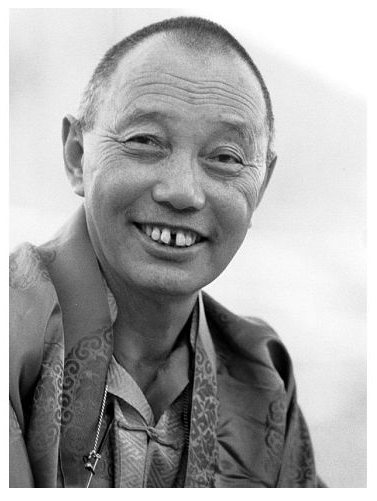

Gyatrul Rinpoche, courtesy of Vimala Treasures

**Gyatrul Rinpoche** (1925-2023) was a senior lama of the [Palyul](https://www.rigpawiki.org/index.php?title=Palyul "Palyul") lineage of the [Nyingma](/source/nyingma/ "Nyingma") school of [Tibetan Buddhism](https://www.rigpawiki.org/index.php?title=Tibetan_Buddhism "Tibetan Buddhism").

## Birth and Recognition

Born in the Gyalrong region of [eastern Tibet](https://www.rigpawiki.org/index.php?title=Eastern_Tibet "Eastern Tibet") in 1925, Gyatrul Rinpoche was recognized at a young age by [Jamyang Khyentse Chökyi Lodrö](https://www.rigpawiki.org/index.php?title=Jamyang_Khyentse_Chökyi_Lodrö "Jamyang Khyentse Chökyi Lodrö") and [Tulku Natsok Rangdrol](https://www.rigpawiki.org/index.php?title=Tulku_Natsok_Rangdrol "Tulku Natsok Rangdrol") as the incarnation of Sampa Künkyap, a Payul lineage meditator who spent his life in retreat and who later gave [empowerments](https://www.rigpawiki.org/index.php?title=Empowerment "Empowerment") and transmissions from his retreat cave to multitudes of disciples.

## Training

After being brought to [Palyul Domang Monastery](https://www.rigpawiki.org/index.php?title=Domang_Monastery "Domang Monastery"), home of his previous incarnation, the young Gyatrul was educated by his tutor, **Sangye Gon**. According to Gyatrul Rinpoche:

: When I was a boy, I met my root guru, Tulku Natsok Rangdrol. He wanted me to learn to read and begin my dharma education, so he asked his uncle, Sangye Gön, to be my teacher. Tulku Natsok Rangdrol said, “Don’t beat this boy. He might have trouble learning, but always be patient with him." I lived with Sangye Gön. He would get up very, very early, maybe 3:00 a.m., to do his practice, including many prostrations. I could hear the rumble of his recitations as I slept. Then he would wake me up and we would have breakfast, followed by my reading lessons. He was an amazing practitioner. He continuously kept the two-day nyungne fasting discipline. So on one day, he would eat and speak, and the next day he would fast and remain silent for most of the day. Avalokiteshvara was his main practice, and in his lifetime he recited millions of the Mani mantra. At the end of his life, he suddenly grew new teeth, and his grey hair was replaced by new black hair growing in. That kind of practitioner! He was always so loving, never yelling at me or beating me. If I made a mistake when reading, he would grunt, and then I knew I had gotten something wrong. But he was always very kind to me. He did one thing, though, that I hated. When he went to bed at night and when he rose in the morning, he would do 3 prostrations to me as I lay there in my bed. I really hated that; it made me so uncomfortable! I asked Tulku Natsok Rangdrol about it, but he said, “It doesn’t matter. Let him do it. Pray to Guru Rinpoche and Vajrasattva.”,

During his extensive spiritual training, Gyatrul Rinpoche received personal instruction on many Buddhist treatises by numerous renowned masters of the Nyingma tradition, including Tulku Natsok Rangdrol, [Payul Chogtrul Rinpoche](https://www.rigpawiki.org/index.php?title=Thubten_Chökyi_Dawa "Thubten Chökyi Dawa"), Apkong Khenpo, [Dzongter Kunzang Nyima](https://www.rigpawiki.org/index.php?title=Dzongter_Kunzang_Nyima "Dzongter Kunzang Nyima"), and His Holiness [Dudjom Rinpoche](https://www.rigpawiki.org/index.php?title=Dudjom_Rinpoche "Dudjom Rinpoche"). In Tibet he received the oral transmission and instructions on the _[Shyitro Gongpa Rangdrol](https://www.rigpawiki.org/index.php?title=Shyitro_Gongpa_Rangdrol "Shyitro Gongpa Rangdrol")_ from the eminent Lama Norbu Tenzin.

## Activity

After fleeing from Tibet into exile in India in 1959, Gyatrul Rinpoche continued his spiritual training and served the Tibetan community in India in various ways until 1972, when His Holiness the [Dalai Lama](https://www.rigpawiki.org/index.php?title=Dalai_Lama "Dalai Lama") sent him to Canada to offer spiritual guidance to Tibetans who had settled there.

Since then, he has taught widely throughout North America, establishing numerous Buddhist centers, which include Tashi Choling in Oregon, Orgyen Dorje Den in the San Francisco Bay area, Norbu Ling in Austin, Texas, Namdroling in Bozeman, Montana, and a center in Ensenada, Mexico. He presently moves back and forth between his principle center, Tashi Choling, and his home in Half Moon Bay, California.

Venerable Dhomang Gyatrul Rinpoche, passed into paranirvana on 8 April, 2023 at his home in Half Moon Bay, California.

## Publications

*   [Padmasambhava](/source/padmasambhava/ "Padmasambhava"), _Natural Liberation—Padmasambhava’s Teachings on the Six Bardos_, commentary by Gyatrul Rinpoche, translated by Allan Wallace (Boston: Wisdom Publications, 1998, 2008 for the second edition)
*   Venerable Gyatrul Rinpoche, _Generating the Deity_, translated by Sangye Khandro (Ithaca: Snow Lion, 1996). The second revised edition was published under the title _The Generation Stage in Buddhist Tantra_ (Ithaca: Snow Lion, 2005).
*   [Karma Chagme](https://www.rigpawiki.org/index.php?title=Karma_Chagme "Karma Chagme"), _A Spacious Path to Freedom: Practical Instructions on the Union of Mahamudra and Atiyoga_, with commentary by Gyatrul Rinpoche, translated by B. Allan Wallace (Ithaca: Snow Lion, 1997, 2010 for the second edition). This book was also published under the title _Naked Awareness: Practical Instructions on the Union of Mahamudra and Dzogchen_ (Ithaca: Snow Lion, 2000).
*   Venerable Gyatrul Rinpoche, _Ancient Wisdom: Nyingma Teachings of Dream Yoga, Meditation & Transformation_ (Ithaca: Snow Lion, 1993), translated by B. Allan Wallace and Sangye Khandro. The second edition was published under the title _Meditation, Transformation, and Dream Yoga_ (Ithaca: Snow Lion, 2002).

## Notes

## Internal Links

*   [Sangye Khandro](https://www.rigpawiki.org/index.php?title=Sangye_Khandro "Sangye Khandro")

## External Links

*   [Wisdom Podcast with Sangye Khandro: The Parinirvana of Venerable Dhomang Gyatrul Rinpoche](https://wisdomexperience.org/wisdom-podcast/sangye-khandro-the-parinirvana-of-venerable-dhomang-gyatrul-rinpoche-173/?inf_contact_key=c4704d08f294014da00c7c566f842c1ccc0558ed5d4c28cbfab114022b1ec50d)
