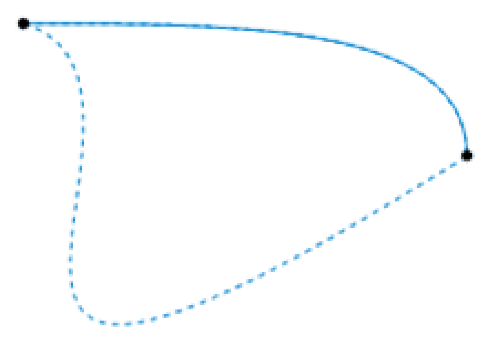
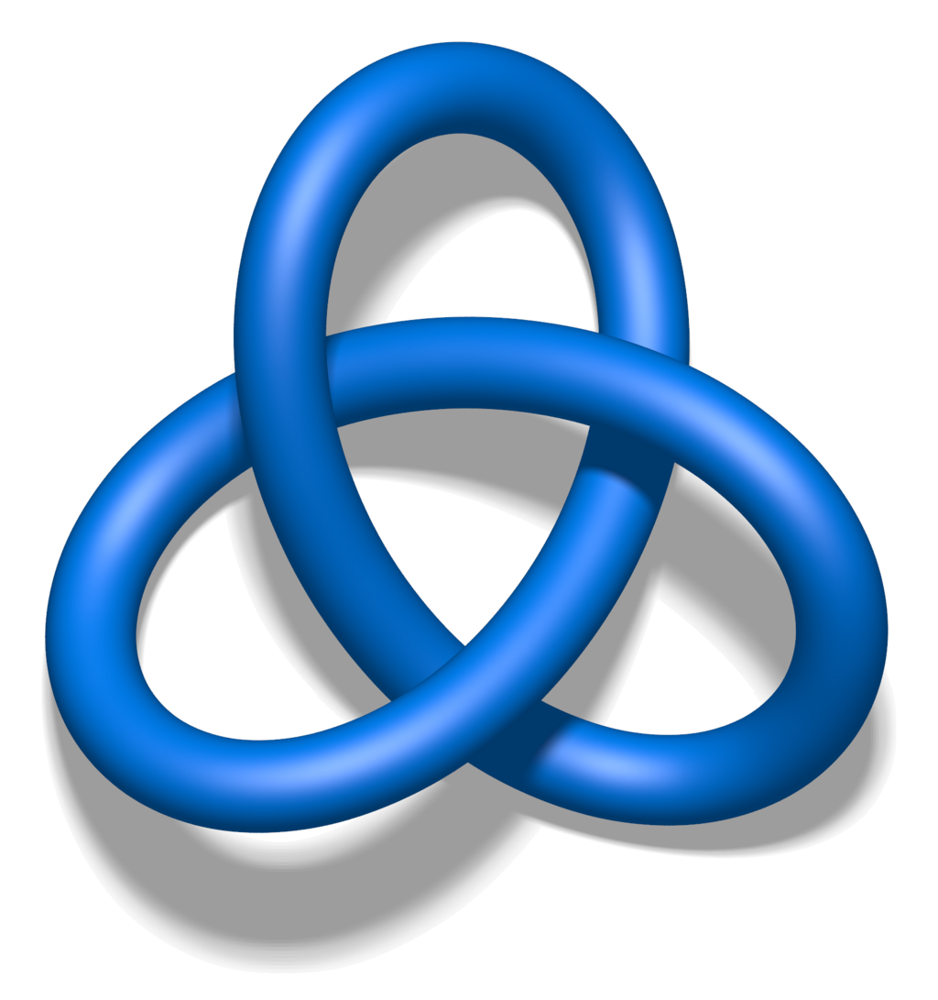

The two dashed [paths](https://en.wikipedia.org/wiki/Path_\(topology\) "Path (topology)") shown above are homotopic relative to their endpoints. The animation represents one possible homotopy.

In [topology](https://en.wikipedia.org/wiki/Topology "Topology"), two [continuous functions](https://en.wikipedia.org/wiki/Continuous_function_\(topology\) "Continuous function (topology)") from one [topological space](https://en.wikipedia.org/wiki/Topological_space "Topological space") to another are called **homotopic** (from [Ancient Greek](https://en.wikipedia.org/wiki/Ancient_Greek_language "Ancient Greek language"): ὁμός _homós_ 'same, similar' and τόπος _tópos_ 'place') if one can be "continuously deformed" into the other, such a deformation being called a **homotopy** ([/həˈmɒtəpiː/](https://en.wikipedia.org/wiki/Help:IPA/English "Help:IPA/English") [_hə-MOT-ə-pee_](https://en.wikipedia.org/wiki/Help:Pronunciation_respelling_key "Help:Pronunciation respelling key"); [/ˈhoʊmoʊˌtoʊpiː/](https://en.wikipedia.org/wiki/Help:IPA/English "Help:IPA/English") [_HOH-moh-toh-pee_](https://en.wikipedia.org/wiki/Help:Pronunciation_respelling_key "Help:Pronunciation respelling key")) between the two functions. A notable use of homotopy is the definition of [homotopy groups](https://en.wikipedia.org/wiki/Homotopy_groups "Homotopy groups") and [cohomotopy groups](https://en.wikipedia.org/wiki/Cohomotopy_groups "Cohomotopy groups"), important [invariants](https://en.wikipedia.org/wiki/Invariant_\(mathematics\) "Invariant (mathematics)") in [algebraic topology](https://en.wikipedia.org/wiki/Algebraic_topology "Algebraic topology").

In practice, there are technical difficulties in using homotopies with certain spaces. Algebraic topologists work with [compactly generated spaces](https://en.wikipedia.org/wiki/Compactly_generated_space "Compactly generated space"), [CW complexes](https://en.wikipedia.org/wiki/CW_complex "CW complex"), or [spectra](https://en.wikipedia.org/wiki/Spectrum_\(homotopy_theory\) "Spectrum (homotopy theory)").

## Formal definition

A homotopy and its inverse, between two [embeddings](https://en.wikipedia.org/wiki/Embedding "Embedding") of the [torus](https://en.wikipedia.org/wiki/Torus "Torus") into $\mathbb{R}^3$: as "the surface of a doughnut" and as "the surface of a coffee mug". This is also an example of an [isotopy](/source/homotopy/#Isotopy).

Formally, a homotopy between two [continuous functions](https://en.wikipedia.org/wiki/Continuous_function_\(topology\) "Continuous function (topology)") _f_ and _g_ from a topological space _X_ to a topological space _Y_ is defined to be a [continuous function](https://en.wikipedia.org/wiki/Function_of_several_real_variables#Continuity_and_limit "Function of several real variables") $H: X \times  [0,1] \to Y$ from the [product](https://en.wikipedia.org/wiki/Product_topology "Product topology") of the space _X_ with the [unit interval](https://en.wikipedia.org/wiki/Unit_interval "Unit interval") \[0, 1\] to _Y_ such that $H(x,0) = f(x)$ and $H(x,1) = g(x)$ for all $x \in X$.

If we think of the second [parameter](https://en.wikipedia.org/wiki/Parameter "Parameter") of _H_ as time then _H_ describes a _continuous deformation_ of _f_ into _g_: at time 0 we have the function _f_ and at time 1 we have the function _g_. We can also think of the second parameter as a "slider control" that allows us to smoothly transition from _f_ to _g_ as the slider moves from 0 to 1, and vice versa.

An alternative notation is to say that a homotopy between two continuous functions $f, g: X \to Y$ is a family of continuous functions $h_t: X \to Y$ for $t \in [0,1]$ such that $h_0 = f$ and $h_1 = g$, and the [map](https://en.wikipedia.org/wiki/Map_\(mathematics\) "Map (mathematics)") $(x, t) \mapsto h_t(x)$ is continuous from $X \times [0,1]$ to $Y$. The two versions coincide by setting $h_t(x) = H(x,t)$. It is not sufficient to require each map $h_t(x)$ to be continuous.

The animation that is looped above right provides an example of a homotopy between two [embeddings](https://en.wikipedia.org/wiki/Embedding "Embedding"), _f_ and _g_, of the torus into _R_3. _X_ is the torus, _Y_ is _R_3, _f_ is some continuous function from the torus to _R_3 that takes the torus to the embedded surface-of-a-doughnut shape with which the animation starts; _g_ is some continuous function that takes the torus to the embedded surface-of-a-coffee-mug shape. The animation shows the image of _h__t_(X) as a function of the parameter _t_, where _t_ varies with time from 0 to 1 over each cycle of the animation loop. It pauses, then shows the image as _t_ varies back from 1 to 0, pauses, and repeats this cycle.

### Properties

Continuous functions _f_ and _g_ are said to be homotopic if and only if there is a homotopy _H_ taking _f_ to _g_ as described above. Being homotopic is an [equivalence relation](https://en.wikipedia.org/wiki/Equivalence_relation "Equivalence relation") on the set of all continuous functions from _X_ to _Y_. This homotopy relation is compatible with [function composition](https://en.wikipedia.org/wiki/Function_composition "Function composition") in the following sense: if _f_1, _g_1: _X_ → _Y_ are homotopic, and _f_2, _g_2: _Y_ → _Z_ are homotopic, then their compositions _f_2 ∘ _f_1 and _g_2 ∘ _g_1: _X_ → _Z_ are also homotopic.

## Examples

*   If $f, g: \R \to \R^2$ are given by $f(x) := \left(x, x^3\right)$ and $g(x) = \left(x, e^x\right)$, then the map $H: \mathbb{R} \times [0, 1] \to \mathbb{R}^2$ given by $H(x, t) = \left(x, (1 - t)x^3 + te^x\right)$ is a homotopy between them.
*   More generally, if $C \subseteq \mathbb{R}^n$ is a [convex](https://en.wikipedia.org/wiki/Convex_set "Convex set") subset of [Euclidean space](https://en.wikipedia.org/wiki/Euclidean_space "Euclidean space") and $f, g: [0, 1] \to C$ are [paths](https://en.wikipedia.org/wiki/Path_\(topology\) "Path (topology)") with the same endpoints, then there is a **linear homotopy** (or **straight-line homotopy**) given by : $\begin{align}
  H: [0, 1] \times [0, 1] &\longrightarrow C \\
                   (s, t) &\longmapsto (1 - t)f(s) + tg(s).
\end{align}$
*   Let $\operatorname{id}_{B^n}:B^n\to B^n$ be the [identity function](https://en.wikipedia.org/wiki/Identity_function "Identity function") on the unit _n_-[disk](https://en.wikipedia.org/wiki/Ball_\(mathematics\) "Ball (mathematics)"); i.e. the set $B^n := \left\{x\in\mathbb{R}^n: \|x\| \leq 1\right\}$. Let $c_{\vec{0}}: B^n \to B^n$ be the [constant function](https://en.wikipedia.org/wiki/Constant_function "Constant function") $c_\vec{0}(x) := \vec{0}$ which sends every point to the [origin](https://en.wikipedia.org/wiki/Origin_\(mathematics\) "Origin (mathematics)"). Then the following is a homotopy between them: : $\begin{align}
  H: B^n \times [0, 1] &\longrightarrow B^n \\
                (x, t) &\longmapsto (1 - t)x.
\end{align}$

## Homotopy equivalence

Given two topological spaces _X_ and _Y_, a **homotopy equivalence** between _X_ and _Y_ is a pair of continuous [maps](https://en.wikipedia.org/wiki/Map_\(mathematics\) "Map (mathematics)") _f_: _X_ → _Y_ and _g_: _Y_ → _X_, such that _g_ ∘ _f_ is homotopic to the [identity map](https://en.wikipedia.org/wiki/Identity_function "Identity function") id_X_ and _f_ ∘ _g_ is homotopic to id_Y_. If such a pair exists, then _X_ and _Y_ are said to be **homotopy equivalent**, or of the same **homotopy type**. This relation of homotopy equivalence is often denoted $\simeq$. Intuitively, two spaces _X_ and _Y_ are homotopy equivalent if they can be transformed into one another by bending, shrinking and expanding operations. Spaces that are homotopy-equivalent to a point are called [contractible](https://en.wikipedia.org/wiki/Contractible "Contractible").

### Homotopy equivalence vs. homeomorphism

A [homeomorphism](https://en.wikipedia.org/wiki/Homeomorphism "Homeomorphism") is a special case of a homotopy equivalence, in which _g_ ∘ _f_ is equal to the identity map id_X_ (not only homotopic to it), and _f_ ∘ _g_ is equal to id_Y_. Therefore, if X and Y are homeomorphic then they are homotopy-equivalent, but the opposite is not true. Some examples:

*   A solid disk is homotopy-equivalent to a single point, since you can deform the disk along radial lines continuously to a single point. However, they are not homeomorphic, since there is no [bijection](https://en.wikipedia.org/wiki/Bijection "Bijection") between them (since one is an infinite set, while the other is finite).
*   The [Möbius strip](https://en.wikipedia.org/wiki/Möbius_strip "Möbius strip") and an untwisted (closed) strip are homotopy equivalent, since you can deform both strips continuously to a circle. But they are not homeomorphic.

### Examples

*   The first example of a homotopy equivalence is $\mathbb{R}^n$ with a point, denoted $\mathbb{R}^n \simeq \{ 0\}$. The part that needs to be checked is the existence of a homotopy $H: I \times \mathbb{R}^n \to \mathbb{R}^n$ between $\operatorname{id}_{\mathbb{R}^n}$ and $p_0$, the projection of $\mathbb{R}^n$ onto the origin. This can be described as $H(t,\cdot) = t\cdot p_0 + (1-t)\cdot\operatorname{id}_{\mathbb{R}^n}$.
*   There is a homotopy equivalence between $S^1$ (the [1-sphere](https://en.wikipedia.org/wiki/N-sphere "N-sphere")) and $\mathbb{R}^2-\{0\}$.
    *   More generally, $\mathbb{R}^n-\{ 0\} \simeq S^{n-1}$.
*   Any [fiber bundle](https://en.wikipedia.org/wiki/Fiber_bundle "Fiber bundle") $\pi: E \to B$ with fibers $F_b$ homotopy equivalent to a point has homotopy equivalent total and base spaces. This generalizes the previous two examples since $\pi:\mathbb{R}^n - \{0\} \to S^{n-1}$ is a fiber bundle with fiber $\mathbb{R}_{>0}$.
*   Every [vector bundle](https://en.wikipedia.org/wiki/Vector_bundle "Vector bundle") is a fiber bundle with a fiber homotopy equivalent to a point.
*   $\mathbb{R}^n - \mathbb{R}^k \simeq S^{n-k-1}$ for any $0 \le k < n$, by writing $\mathbb{R}^n - \mathbb{R}^k$ as the total space of the fiber bundle $\mathbb{R}^k \times (\mathbb{R}^{n-k}-\{0\})\to (\mathbb{R}^{n-k}-\{0\})$, then applying the homotopy equivalences above.
*   If a subcomplex $A$ of a [CW complex](https://en.wikipedia.org/wiki/CW_complex "CW complex") $X$ is contractible, then the [quotient space](https://en.wikipedia.org/wiki/Quotient_space_\(topology\) "Quotient space (topology)") $X/A$ is homotopy equivalent to $X$.
*   A [deformation retraction](https://en.wikipedia.org/wiki/Deformation_retraction "Deformation retraction") is a homotopy equivalence.

### Null-homotopy

A function $f$ is said to be **null-homotopic** if it is homotopic to a constant function. (The homotopy from $f$ to a constant function is then sometimes called a **null-homotopy**.) For example, a map $f$ from the [unit circle](https://en.wikipedia.org/wiki/Unit_circle "Unit circle") $S^1$ to any space $X$ is null-homotopic precisely when it can be continuously extended to a map from the [unit disk](https://en.wikipedia.org/wiki/Unit_disk "Unit disk") $D^2$ to $X$ that agrees with $f$ on the boundary.

It follows from these definitions that a space $X$ is contractible if and only if the identity map from $X$ to itself—which is always a homotopy equivalence—is null-homotopic.

## Invariance

Homotopy equivalence is important because in [algebraic topology](https://en.wikipedia.org/wiki/Algebraic_topology "Algebraic topology") many concepts are **homotopy invariant**, that is, they respect the relation of homotopy equivalence. For example, if _X_ and _Y_ are homotopy equivalent spaces, then:

*   _X_ is [path-connected](https://en.wikipedia.org/wiki/Connected_space "Connected space") if and only if _Y_ is.
*   _X_ is [simply connected](https://en.wikipedia.org/wiki/Simply_connected "Simply connected") if and only if _Y_ is.
*   The (singular) [homology](https://en.wikipedia.org/wiki/Homology_\(mathematics\) "Homology (mathematics)") and [cohomology groups](https://en.wikipedia.org/wiki/Cohomology_group "Cohomology group") of _X_ and _Y_ are [isomorphic](https://en.wikipedia.org/wiki/Group_isomorphism "Group isomorphism").
*   If _X_ and _Y_ are path-connected, then the [fundamental groups](https://en.wikipedia.org/wiki/Fundamental_group "Fundamental group") of _X_ and _Y_ are isomorphic, and so are the higher [homotopy groups](https://en.wikipedia.org/wiki/Homotopy_group "Homotopy group"). (Without the path-connectedness assumption, one has π1(_X_, _x_0) isomorphic to π1(_Y_, _f_(_x_0)) where _f_: _X_ → _Y_ is a homotopy equivalence and _x_0 ∈ _X_.)

An example of an algebraic invariant of topological spaces which is not homotopy-invariant is [compactly supported homology](https://en.wikipedia.org/wiki/Compactly_supported_homology "Compactly supported homology") (which is, roughly speaking, the homology of the [compactification](https://en.wikipedia.org/wiki/Compactification_\(mathematics\) "Compactification (mathematics)"), and compactification is not homotopy-invariant).

## Variants

### Relative homotopy

In order to define the [fundamental group](https://en.wikipedia.org/wiki/Fundamental_group "Fundamental group"), one needs the notion of **homotopy relative to a subspace**. These are homotopies which keep the elements of the subspace fixed. Formally: if _f_ and _g_ are continuous maps from _X_ to _Y_ and _K_ is a [subset](https://en.wikipedia.org/wiki/Subset "Subset") of _X_, then we say that _f_ and _g_ are homotopic relative to _K_ if there exists a homotopy _H_: _X_ × \[0, 1\] → _Y_ between _f_ and _g_ such that _H_(_k_, _t_) = _f_(_k_) = _g_(_k_) for all _k_ ∈ _K_ and _t_ ∈ \[0, 1\]. Also, if _g_ is a [retraction](https://en.wikipedia.org/wiki/Retraction_\(topology\) "Retraction (topology)") from _X_ to _K_ and _f_ is the identity map, this is known as a strong [deformation retract](https://en.wikipedia.org/wiki/Deformation_retract "Deformation retract") of _X_ to _K_. When _K_ is a point, the term **pointed homotopy** is used.

### Isotopy

The [unknot](https://en.wikipedia.org/wiki/Unknot "Unknot") is not equivalent to the [trefoil knot](https://en.wikipedia.org/wiki/Trefoil_knot "Trefoil knot") since one cannot be deformed into the other through a continuous path of homeomorphisms of the ambient space. Thus they are not ambient-isotopic.

When two given continuous functions _f_ and _g_ from the topological space _X_ to the topological space _Y_ are [embeddings](https://en.wikipedia.org/wiki/Embedding "Embedding"), one can ask whether they can be connected 'through embeddings'. This gives rise to the concept of **isotopy**, which is a homotopy, _H_, in the notation used before, such that for each fixed _t_, _H_(_x_, _t_) gives an embedding.

A related, but different, concept is that of [ambient isotopy](https://en.wikipedia.org/wiki/Ambient_isotopy "Ambient isotopy").

Requiring that two embeddings be isotopic is a stronger requirement than that they be homotopic. For example, the map from the interval \[−1, 1\] into the real numbers defined by _f_(_x_) = −_x_ is _not_ isotopic to the identity _g_(_x_) = _x_. Any homotopy from _f_ to the identity would have to exchange the endpoints, which would mean that they would have to 'pass through' each other. Moreover, _f_ has changed the orientation of the interval and _g_ has not, which is impossible under an isotopy. However, the maps are homotopic; one homotopy from _f_ to the identity is _H_: \[−1, 1\] × \[0, 1\] → \[−1, 1\] given by _H_(_x_, _y_) = 2_yx_ − _x_.

Two homeomorphisms (which are special cases of embeddings) of the unit ball which agree on the boundary can be shown to be isotopic using [Alexander's trick](https://en.wikipedia.org/wiki/Alexander's_trick "Alexander's trick"). For this reason, the map of the [unit disc](https://en.wikipedia.org/wiki/Unit_disc "Unit disc") in $\mathbb{R}^2$ defined by _f_(_x_, _y_) = (−_x_, −_y_) is isotopic to a 180-degree [rotation](https://en.wikipedia.org/wiki/Rotation "Rotation") around the origin, and so the identity map and _f_ are isotopic because they can be connected by rotations.

In [geometric topology](https://en.wikipedia.org/wiki/Geometric_topology "Geometric topology")—for example in [knot theory](https://en.wikipedia.org/wiki/Knot_theory "Knot theory")—the idea of isotopy is used to construct equivalence relations. For example, when should two knots be considered the same? We take two knots, _K_1 and _K_2, in three-[dimensional](https://en.wikipedia.org/wiki/Dimension "Dimension") space. A knot is an [embedding](https://en.wikipedia.org/wiki/Embedding "Embedding") of a one-dimensional space, the "loop of string" (or the circle), into this space, and this embedding gives a homeomorphism between the circle and its image in the embedding space. One may try to define knot equivalence based on isotopy instead of the more restricted property of [ambient isotopy](https://en.wikipedia.org/wiki/Ambient_isotopy "Ambient isotopy"). That is, two knots are isotopic when there exists a continuous function starting at _t_ = 0 giving the _K_1 embedding, ending at _t_ = 1 giving the _K_2 embedding, with all intermediate values corresponding to embeddings. However, this definition would make every knot equivalent to the unknot, as the knotted portions can be "contracted" down to a straight line. The problem is that, while continuous, this is not an injective function of the Euclidean space that the knot is embedded in. An [ambient isotopy](https://en.wikipedia.org/wiki/Ambient_isotopy "Ambient isotopy"), studied in this context, is an isotopy of the larger space, considered in light of its action on the embedded submanifold. Knots _K_1 and _K_2 are considered equivalent when there is a continuous \[0, 1\]-indexed family of maps which moves _K_1 to _K_2 via homeomorphisms of the Euclidean space.

Similar language is used for the equivalent concept in contexts where one has a stronger notion of equivalence. For example, a path between two smooth embeddings is a **smooth isotopy**.

### Timelike homotopy

On a [Lorentzian manifold](https://en.wikipedia.org/wiki/Lorentzian_manifold "Lorentzian manifold"), certain curves are distinguished as [timelike](https://en.wikipedia.org/wiki/Timelike "Timelike") (representing something that only goes forwards, not backwards, in time, in every local frame). A [timelike homotopy](https://en.wikipedia.org/wiki/Timelike_homotopy "Timelike homotopy") between two [timelike curves](https://en.wikipedia.org/wiki/Timelike_curve "Timelike curve") is a homotopy such that the curve remains timelike during the continuous transformation from one curve to another. No [closed timelike curve](https://en.wikipedia.org/wiki/Closed_timelike_curve "Closed timelike curve") (CTC) on a Lorentzian manifold is timelike homotopic to a point (that is, null timelike homotopic); such a manifold is therefore said to be [multiply connected](https://en.wikipedia.org/wiki/Multiply_connected "Multiply connected") by timelike curves. A manifold such as the [3-sphere](https://en.wikipedia.org/wiki/3-sphere "3-sphere") can be [simply connected](https://en.wikipedia.org/wiki/Simply_connected "Simply connected") (by any type of curve), and yet be [timelike multiply connected](https://en.wikipedia.org/wiki/Timelike_multiply_connected "Timelike multiply connected").

## Properties

### Lifting and extension properties

If we have a homotopy $H:X\times [0,1]\rightarrow Y$ and a cover $p:\overline Y\rightarrow Y$ and we are given a map $\overline h_0:X\rightarrow \overline Y$ such that $H_0=P \circ \overline h_0$ ($\overline h_0$ is called a [lift](https://en.wikipedia.org/wiki/Lift_\(mathematics\) "Lift (mathematics)") of $h_0$), then we can lift all $H$ to a map $\overline H: X \times [0,1]\rightarrow \overline Y$ such that $p \circ \overline H = H$. The homotopy lifting property is used to characterize [fibrations](https://en.wikipedia.org/wiki/Fibration "Fibration").

Another useful property involving homotopy is the [homotopy extension property](https://en.wikipedia.org/wiki/Homotopy_extension_property "Homotopy extension property"), which characterizes the extension of a homotopy between two functions from a subset of some set to the set itself. It is useful when dealing with [cofibrations](https://en.wikipedia.org/wiki/Cofibration "Cofibration").

### Groups

Since the relation of two functions $f, g\colon X\to Y$ being homotopic relative to a subspace is an equivalence relation, we can look at the [equivalence classes](https://en.wikipedia.org/wiki/Equivalence_class "Equivalence class") of maps between a fixed _X_ and _Y_. If we fix $X = [0,1]^n$, the unit interval \[0, 1\] [crossed](https://en.wikipedia.org/wiki/Cartesian_product "Cartesian product") with itself _n_ times, and we take its [boundary](https://en.wikipedia.org/wiki/Boundary_\(topology\) "Boundary (topology)") $\partial([0,1]^n)$ as a subspace, then the equivalence classes form a group, denoted $\pi_n(Y,y_0)$, where $y_0$ is in the image of the subspace $\partial([0,1]^n)$.

We can define the action of one equivalence class on another, and so we get a group. These groups are called the [homotopy groups](https://en.wikipedia.org/wiki/Homotopy_group "Homotopy group"). In the case $n = 1$, it is also called the [fundamental group](https://en.wikipedia.org/wiki/Fundamental_group "Fundamental group").

### Homotopy category

The idea of homotopy can be turned into a formal category of [category theory](/source/category-theory/ "Category theory"). The **[homotopy category](https://en.wikipedia.org/wiki/Homotopy_category "Homotopy category")** is the category whose objects are topological spaces, and whose morphisms are homotopy equivalence classes of continuous maps. Two topological spaces _X_ and _Y_ are isomorphic in this category if and only if they are homotopy-equivalent. Then a [functor](https://en.wikipedia.org/wiki/Functor "Functor") on the category of topological spaces is homotopy invariant if it can be expressed as a functor on the homotopy category.

For example, homology groups are a _functorial_ homotopy invariant: this means that if _f_ and _g_ from _X_ to _Y_ are homotopic, then the [group homomorphisms](https://en.wikipedia.org/wiki/Group_homomorphism "Group homomorphism") induced by _f_ and _g_ on the level of [homology groups](https://en.wikipedia.org/wiki/Homology_group "Homology group") are the same: H_n_(_f_) = H_n_(_g_): H_n_(_X_) → H_n_(_Y_) for all _n_. Likewise, if _X_ and _Y_ are in addition [path connected](https://en.wikipedia.org/wiki/Connectedness "Connectedness"), and the homotopy between _f_ and _g_ is pointed, then the group homomorphisms induced by _f_ and _g_ on the level of [homotopy groups](https://en.wikipedia.org/wiki/Homotopy_group "Homotopy group") are also the same: π_n_(_f_) = π_n_(_g_): π_n_(_X_) → π_n_(_Y_).

## Applications

Based on the concept of the homotopy, [computation methods](https://en.wikipedia.org/wiki/Numerical_methods "Numerical methods") for [algebraic](https://en.wikipedia.org/wiki/Algebraic_equations "Algebraic equations") and [differential equations](https://en.wikipedia.org/wiki/Differential_equations "Differential equations") have been developed. The methods for algebraic equations include the [homotopy continuation](https://en.wikipedia.org/wiki/Homotopy_continuation "Homotopy continuation") method and the continuation method (see [numerical continuation](https://en.wikipedia.org/wiki/Numerical_continuation "Numerical continuation")). The methods for differential equations include the [homotopy analysis method](https://en.wikipedia.org/wiki/Homotopy_analysis_method "Homotopy analysis method").

Homotopy theory can be used as a foundation for [homology theory](https://en.wikipedia.org/wiki/Homology_\(mathematics\) "Homology (mathematics)"): one can [represent](https://en.wikipedia.org/wiki/Representable_functor "Representable functor") a cohomology functor on a space _X_ by mappings of _X_ into an appropriate fixed space, up to homotopy equivalence. For example, for any abelian group _G_, and any based CW-complex _X_, the set $[X,K(G,n)]$ of based homotopy classes of based maps from _X_ to the [Eilenberg–MacLane space](https://en.wikipedia.org/wiki/Eilenberg–MacLane_space "Eilenberg–MacLane space") $K(G,n)$ is in natural bijection with the _n_-th [singular cohomology](https://en.wikipedia.org/wiki/Singular_cohomology "Singular cohomology") group $H^n(X,G)$ of the space _X_. One says that the [omega-spectrum](https://en.wikipedia.org/wiki/Spectrum_\(topology\) "Spectrum (topology)") of Eilenberg-MacLane spaces are [representing spaces](https://en.wikipedia.org/wiki/Representing_space "Representing space") for singular cohomology with coefficients in _G_. Using this fact, homotopy classes between a CW complex and a multiply connected space can be calculated using cohomology as described by the [Hopf–Whitney theorem](https://en.wikipedia.org/wiki/Hopf–Whitney_theorem "Hopf–Whitney theorem").

Recently, homotopy theory is used to develop deep learning based generative models like [diffusion models](https://en.wikipedia.org/wiki/Diffusion_model "Diffusion model") and [flow-based generative models](https://en.wikipedia.org/wiki/Flow-based_generative_model "Flow-based generative model"). Perturbing the complex non-Gaussian states is a tough task. Using deep learning and homotopy, such complex states can be transformed to Gaussian state and mildly perturbed to get transformed back to perturbed complex states.
