Johann Sebastian Bach

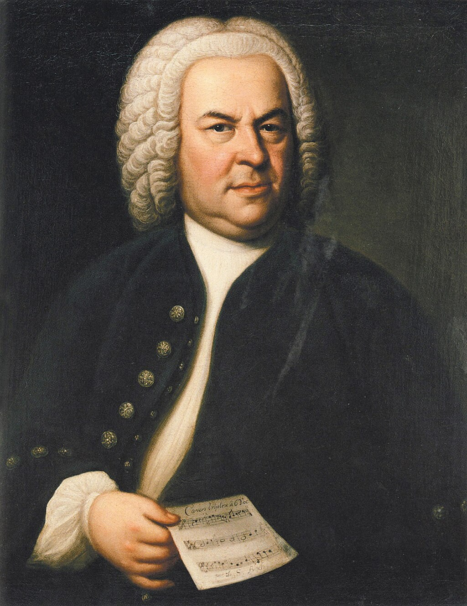

1748 portrait of Bach holding a copy
of the [canon](https://en.wikipedia.org/wiki/Canon_\(music\) "Canon (music)") BWV 1076

Born

21 March 1685 [(O.S.)](https://en.wikipedia.org/wiki/Old_Style_and_New_Style_dates "Old Style and New Style dates")
31 March 1685 (1685-03-31) [(N.S.)](https://en.wikipedia.org/wiki/Old_Style_and_New_Style_dates "Old Style and New Style dates")

[Eisenach](https://en.wikipedia.org/wiki/Eisenach "Eisenach")

Died

28 July 1750(1750-07-28) (aged 65)

[Leipzig](https://en.wikipedia.org/wiki/Leipzig "Leipzig")

Occupations

*   [Thomaskantor](https://en.wikipedia.org/wiki/Thomaskantor "Thomaskantor")
*   composer
*   violinist
*   keyboard player
*   organ expert
*   school director
*   conductor

Works

[List of compositions](https://en.wikipedia.org/wiki/List_of_compositions_by_Johann_Sebastian_Bach "List of compositions by Johann Sebastian Bach")

Relatives

[Bach family](https://en.wikipedia.org/wiki/Bach_family "Bach family")

Signature

**Johann Sebastian Bach** (31 March \[[O.S.](https://en.wikipedia.org/wiki/Old_Style_and_New_Style_dates "Old Style and New Style dates") 21 March\] 1685 – 28 July 1750) was a German composer and musician of the late [Baroque period](https://en.wikipedia.org/wiki/Baroque_music "Baroque music"). He is known for his prolific output across a variety of instruments and forms, including the orchestral _[Brandenburg Concertos](https://en.wikipedia.org/wiki/Brandenburg_Concertos "Brandenburg Concertos")_; solo instrumental works such as the [Cello Suites](https://en.wikipedia.org/wiki/Cello_Suites_\(Bach\) "Cello Suites (Bach)") and [Sonatas and Partitas for Solo Violin](https://en.wikipedia.org/wiki/Sonatas_and_Partitas_for_Solo_Violin_\(Bach\) "Sonatas and Partitas for Solo Violin (Bach)"); keyboard works such as the _[Goldberg Variations](https://en.wikipedia.org/wiki/Goldberg_Variations "Goldberg Variations")_ and _[The Well-Tempered Clavier](https://en.wikipedia.org/wiki/The_Well-Tempered_Clavier "The Well-Tempered Clavier")_; organ works such as the __[Schübler Chorales](https://en.wikipedia.org/wiki/Schübler_Chorales "Schübler Chorales")__ and the [Toccata and Fugue in D minor](https://en.wikipedia.org/wiki/Toccata_and_Fugue_in_D_minor,_BWV_565 "Toccata and Fugue in D minor, BWV 565"); and choral works such as the _[St. Matthew Passion](https://en.wikipedia.org/wiki/St_Matthew_Passion "St Matthew Passion")_ and the [Mass in B minor](https://en.wikipedia.org/wiki/Mass_in_B_minor "Mass in B minor"). He is known for his mastery of [counterpoint](https://en.wikipedia.org/wiki/Counterpoint "Counterpoint"), as heard in _[The Musical Offering](https://en.wikipedia.org/wiki/The_Musical_Offering "The Musical Offering")_ and _[The Art of Fugue](https://en.wikipedia.org/wiki/The_Art_of_Fugue "The Art of Fugue")_. [Felix Mendelssohn](https://en.wikipedia.org/wiki/Felix_Mendelssohn "Felix Mendelssohn") precipitated the [Bach Revival](https://en.wikipedia.org/wiki/Reception_of_Johann_Sebastian_Bach's_music "Reception of Johann Sebastian Bach's music") with a performance of the _St. Matthew Passion_ in 1829. Ever since, Bach has been acclaimed as one of the greatest composers of [classical music](https://en.wikipedia.org/wiki/Classical_music "Classical music").

The [Bach family](https://en.wikipedia.org/wiki/Bach_family "Bach family") had already produced several composers when Johann Sebastian was born in [Eisenach](https://en.wikipedia.org/wiki/Eisenach "Eisenach"), the youngest child of the city musician [Johann Ambrosius Bach](https://en.wikipedia.org/wiki/Johann_Ambrosius_Bach "Johann Ambrosius Bach"). After being orphaned at age 10, he lived for five years with his eldest brother, [Johann Christoph](https://en.wikipedia.org/wiki/Johann_Christoph_Bach_\(organist_at_Ohrdruf\) "Johann Christoph Bach (organist at Ohrdruf)"), then continued his musical education in [Lüneburg](https://en.wikipedia.org/wiki/Lüneburg "Lüneburg"). In 1703 he returned to [Thuringia](https://en.wikipedia.org/wiki/Thuringia "Thuringia"), working as a musician for [Protestant](https://en.wikipedia.org/wiki/Protestant "Protestant") churches in [Arnstadt](https://en.wikipedia.org/wiki/Arnstadt "Arnstadt") and [Mühlhausen](https://en.wikipedia.org/wiki/Mühlhausen "Mühlhausen"). Around that time he also paid extended visits to the courts in [Weimar](https://en.wikipedia.org/wiki/Saxe-Weimar "Saxe-Weimar"), where he expanded his [organ](https://en.wikipedia.org/wiki/Pipe_organ "Pipe organ") repertory, and the [reformed](https://en.wikipedia.org/wiki/Reformed_Christianity "Reformed Christianity") court at [Köthen](https://en.wikipedia.org/wiki/Anhalt-Köthen "Anhalt-Köthen"), where he was mostly engaged with [chamber music](https://en.wikipedia.org/wiki/Chamber_music "Chamber music"). By 1723 he was hired as [Thomaskantor](https://en.wikipedia.org/wiki/Thomaskantor "Thomaskantor"), church music director of the city of [Leipzig](https://en.wikipedia.org/wiki/Leipzig "Leipzig") and thus responsible for music in four [Lutheran](https://en.wikipedia.org/wiki/Lutheran "Lutheran") city churches and for the [St. Thomas School](https://en.wikipedia.org/wiki/St._Thomas_School,_Leipzig "St. Thomas School, Leipzig"). He decided to compose annual cycles of [church cantatas](https://en.wikipedia.org/wiki/Church_cantata_\(Bach\) "Church cantata (Bach)"), and also wrote music for [Leipzig University](https://en.wikipedia.org/wiki/Leipzig_University "Leipzig University")'s student ensemble, [Collegium Musicum](https://en.wikipedia.org/wiki/Collegium_Musicum "Collegium Musicum"). In 1726 he began [publishing](https://en.wikipedia.org/wiki/List_of_compositions_by_Johann_Sebastian_Bach_printed_during_his_lifetime "List of compositions by Johann Sebastian Bach printed during his lifetime") his organ and other keyboard music. In Leipzig, he had difficult relations with his employer, as he had during some of his earlier positions. This situation was somewhat remedied when his sovereign, [Augustus III of Poland](https://en.wikipedia.org/wiki/Augustus_III_of_Poland "Augustus III of Poland"), granted him the title of court composer of the Elector of Saxony in 1736. In the last decades of his life, Bach reworked and extended many of his earlier compositions. He died due to complications following eye surgery in 1750 at the age of 65. Four of his twenty children, [Wilhelm Friedemann](https://en.wikipedia.org/wiki/Wilhelm_Friedemann_Bach "Wilhelm Friedemann Bach"), [Carl Philipp Emanuel](https://en.wikipedia.org/wiki/Carl_Philipp_Emanuel_Bach "Carl Philipp Emanuel Bach"), [Johann Christoph Friedrich](https://en.wikipedia.org/wiki/Johann_Christoph_Friedrich_Bach "Johann Christoph Friedrich Bach"), and [Johann Christian](https://en.wikipedia.org/wiki/Johann_Christian_Bach "Johann Christian Bach"), became composers.

Bach enriched established German styles through his mastery of [counterpoint](https://en.wikipedia.org/wiki/Counterpoint "Counterpoint"), [harmonic](https://en.wikipedia.org/wiki/Harmony "Harmony") and [motivic](https://en.wikipedia.org/wiki/Motif_\(music\) "Motif (music)") organisation, and his adaptation of rhythms, forms, and textures from abroad, particularly Italy and France. [His compositions](https://en.wikipedia.org/wiki/List_of_compositions_by_Johann_Sebastian_Bach "List of compositions by Johann Sebastian Bach") include [hundreds of cantatas](https://en.wikipedia.org/wiki/List_of_Bach_cantatas "List of Bach cantatas"), both [sacred](https://en.wikipedia.org/wiki/Church_cantata_\(Bach\) "Church cantata (Bach)") and [secular](https://en.wikipedia.org/wiki/List_of_secular_cantatas_by_Johann_Sebastian_Bach "List of secular cantatas by Johann Sebastian Bach"). He composed [Latin church music](https://en.wikipedia.org/wiki/Bach's_church_music_in_Latin "Bach's church music in Latin"), [Passions](https://en.wikipedia.org/wiki/Passions_\(Bach\) "Passions (Bach)"), [oratorios](https://en.wikipedia.org/wiki/List_of_masses,_passions_and_oratorios_by_Johann_Sebastian_Bach#Oratorios_and_associated_cantatas "List of masses, passions and oratorios by Johann Sebastian Bach"), and [motets](https://en.wikipedia.org/wiki/List_of_motets_by_Johann_Sebastian_Bach "List of motets by Johann Sebastian Bach"). He adopted [Lutheran hymns](https://en.wikipedia.org/wiki/Lutheran_hymn "Lutheran hymn"), not only in his larger vocal works but also in such works as [his four-part chorales](https://en.wikipedia.org/wiki/List_of_chorale_harmonisations_by_Johann_Sebastian_Bach "List of chorale harmonisations by Johann Sebastian Bach") and [his sacred songs](https://en.wikipedia.org/wiki/List_of_songs_and_arias_by_Johann_Sebastian_Bach "List of songs and arias by Johann Sebastian Bach"). Bach wrote extensively [for organ](https://en.wikipedia.org/wiki/List_of_organ_compositions_by_Johann_Sebastian_Bach "List of organ compositions by Johann Sebastian Bach") and [other keyboard instruments](https://en.wikipedia.org/wiki/List_of_keyboard_and_lute_compositions_by_Johann_Sebastian_Bach "List of keyboard and lute compositions by Johann Sebastian Bach"). He [composed concertos](https://en.wikipedia.org/wiki/List_of_concertos_by_Johann_Sebastian_Bach "List of concertos by Johann Sebastian Bach"), for instance [for violin](https://en.wikipedia.org/wiki/List_of_orchestral_works_by_Johann_Sebastian_Bach#Violin_concertos_\(BWV_1041–1043\) "List of orchestral works by Johann Sebastian Bach") and [for harpsichord](https://en.wikipedia.org/wiki/Keyboard_concertos_by_Johann_Sebastian_Bach "Keyboard concertos by Johann Sebastian Bach"), and [suites](https://en.wikipedia.org/wiki/Suite_\(Bach\) "Suite (Bach)"), [as chamber music](https://en.wikipedia.org/wiki/List_of_chamber_music_works_by_Johann_Sebastian_Bach "List of chamber music works by Johann Sebastian Bach") as well as [for orchestra](https://en.wikipedia.org/wiki/Orchestral_suites_\(Bach\) "Orchestral suites (Bach)"). [Many of his works use contrapuntal techniques](https://en.wikipedia.org/wiki/List_of_fugal_works_by_Johann_Sebastian_Bach "List of fugal works by Johann Sebastian Bach") like [canon](https://en.wikipedia.org/wiki/Canon_\(music\) "Canon (music)") and [fugue](https://en.wikipedia.org/wiki/Fugue "Fugue").

Several decades after his death, in the 18th century, Bach was still primarily known as an [organist](https://en.wikipedia.org/wiki/Organist "Organist"). Several [biographies of Bach](https://en.wikipedia.org/wiki/Biographies_of_Johann_Sebastian_Bach "Biographies of Johann Sebastian Bach") were published in the 19th century, and by the end of that century all of his known music had been printed. Dissemination of Bach scholarship continued through periodicals (and later websites) devoted to him, other publications such as the _[Bach-Werke-Verzeichnis](https://en.wikipedia.org/wiki/Bach-Werke-Verzeichnis "Bach-Werke-Verzeichnis")_ (BWV, a numbered catalogue of his works), and new critical editions of his compositions. His music was further popularised by a [multitude of arrangements](https://en.wikipedia.org/wiki/List_of_transcriptions_of_compositions_by_Johann_Sebastian_Bach "List of transcriptions of compositions by Johann Sebastian Bach"), including the "[Air on the G String](https://en.wikipedia.org/wiki/Air_on_the_G_String "Air on the G String")" and "[Jesu, Joy of Man's Desiring](https://en.wikipedia.org/wiki/Jesu,_Joy_of_Man's_Desiring "Jesu, Joy of Man's Desiring")", and recordings, among them three boxed sets of performances of his complete _oeuvre_ marking the 250th anniversary of his death.

## Family and childhood

### Early life

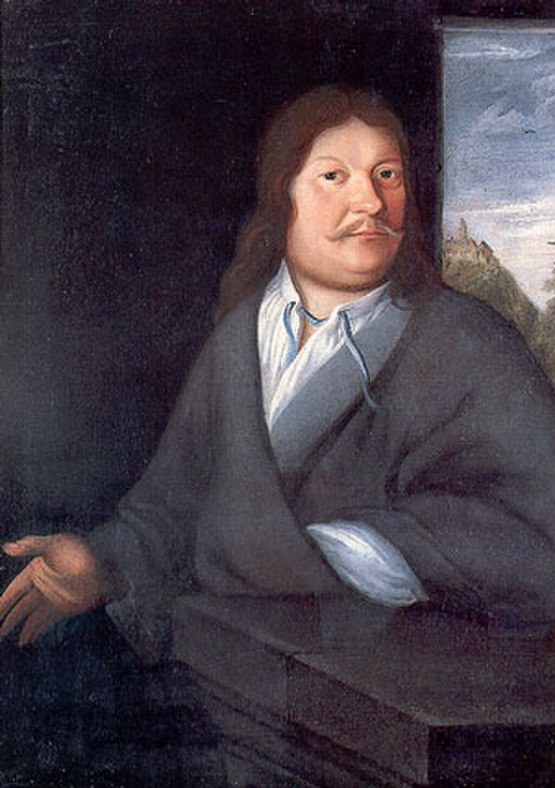[Johann Ambrosius Bach](https://en.wikipedia.org/wiki/Johann_Ambrosius_Bach "Johann Ambrosius Bach"), 1685, Bach's father. Painting attributed to Johann David Herlicius

Johann Sebastian Bach was born in [Eisenach](https://en.wikipedia.org/wiki/Eisenach "Eisenach"), the capital of the [duchy of Saxe-Eisenach](https://en.wikipedia.org/wiki/Saxe-Eisenach "Saxe-Eisenach"), in present-day Germany, on 21 March 1685 [O.S.](https://en.wikipedia.org/wiki/Old_Style_and_New_Style_dates "Old Style and New Style dates") He was the eighth and youngest child of [Johann Ambrosius Bach](https://en.wikipedia.org/wiki/Johann_Ambrosius_Bach "Johann Ambrosius Bach"), director of the town musicians, and [Maria Elisabeth](https://en.wikipedia.org/wiki/Maria_Elisabeth_Lämmerhirt "Maria Elisabeth Lämmerhirt") [née](https://en.wikipedia.org/wiki/Birth_name#Maiden_and_married_names "Birth name") Lämmerhirt, daughter of a town councillor. The [Bach family](https://en.wikipedia.org/wiki/Bach_family "Bach family"), traditionally traced to the patriarch [Vitus "Veit" Bach](https://en.wikipedia.org/wiki/Veit_Bach "Veit Bach") (d. 1619), produced three to four generations of musicians in the [Thuringia](https://en.wikipedia.org/wiki/Thuringia "Thuringia") region, whose insular cultural climate fostered conservative musicianship, with external influences arriving mainly via [the courts](https://en.wikipedia.org/wiki/Royal_court "Royal court"). Nothing is definitively known about Bach's early years before 1693; his [musical education](https://en.wikipedia.org/wiki/Musical_education "Musical education") in particular is highly conjectural. His family, particularly the uncles, were all professional musicians who worked as church organists, court chamber musicians, and composers. Bach's father presumably taught him the [violin](https://en.wikipedia.org/wiki/Violin "Violin"), Ambrosius' own primary instrument, along with basic [music theory](/source/music-theory/ "Music theory") principles. One uncle, [Johann Christoph Bach](https://en.wikipedia.org/wiki/Johann_Christoph_Bach_\(musician_at_Arnstadt\) "Johann Christoph Bach (musician at Arnstadt)") (1645–1693), may have introduced him to the [organ](https://en.wikipedia.org/wiki/Organ_\(music\) "Organ (music)"), though this is debated since the uncle may not have been close to Bach's immediate family.

Bach's mother died in 1694, and his father eight months later in February 1695. The 10-year-old Bach moved in with his eldest brother, [Johann Christoph Bach](https://en.wikipedia.org/wiki/Johann_Christoph_Bach_\(organist_at_Ohrdruf\) "Johann Christoph Bach (organist at Ohrdruf)") (1671–1721), the organist at [St. Michael's Church](https://en.wikipedia.org/wiki/Michaeliskirche_\(Ohrdruf\) "Michaeliskirche (Ohrdruf)") in [Ohrdruf](https://en.wikipedia.org/wiki/Ohrdruf "Ohrdruf"), [Saxe-Gotha-Altenburg](https://en.wikipedia.org/wiki/Saxe-Gotha-Altenburg "Saxe-Gotha-Altenburg"). There he studied, performed, and copied music, including his brother's, despite being forbidden to do so because scores were so valuable and private and ledger paper was costly. He also received instruction on the [clavichord](https://en.wikipedia.org/wiki/Clavichord "Clavichord") from his brother. Johann Christoph exposed him to the works of composers of the day, including South Germans such as [Johann Caspar Kerll](https://en.wikipedia.org/wiki/Johann_Caspar_Kerll "Johann Caspar Kerll"), [Johann Jakob Froberger](https://en.wikipedia.org/wiki/Johann_Jakob_Froberger "Johann Jakob Froberger"), and [Johann Pachelbel](https://en.wikipedia.org/wiki/Johann_Pachelbel "Johann Pachelbel") (under whom Johann Christoph had studied); North Germans such as [Georg Böhm](https://en.wikipedia.org/wiki/Georg_Böhm "Georg Böhm"), [Johann Reincken](https://en.wikipedia.org/wiki/Johann_Reincken "Johann Reincken") and [Friedrich Nicolaus Bruhns](https://en.wikipedia.org/wiki/Friedrich_Nicolaus_Bruhns "Friedrich Nicolaus Bruhns") from Hamburg, and [Dieterich Buxtehude](https://en.wikipedia.org/wiki/Dieterich_Buxtehude "Dieterich Buxtehude"); Frenchmen such as [Jean-Baptiste Lully](https://en.wikipedia.org/wiki/Jean-Baptiste_Lully "Jean-Baptiste Lully"), [Louis Marchand](https://en.wikipedia.org/wiki/Louis_Marchand "Louis Marchand"), and [Marin Marais](https://en.wikipedia.org/wiki/Marin_Marais "Marin Marais"); and the Italian [Girolamo Frescobaldi](https://en.wikipedia.org/wiki/Girolamo_Frescobaldi "Girolamo Frescobaldi"). He learned [theology](https://en.wikipedia.org/wiki/Theology "Theology"), [Latin](https://en.wikipedia.org/wiki/Latin "Latin"), and [Greek](https://en.wikipedia.org/wiki/Ancient_Greek "Ancient Greek") at the local [gymnasium](https://en.wikipedia.org/wiki/Gymnasium_\(school\) "Gymnasium (school)").

By 3 April 1700 Bach had begun studies at [St Michael](https://en.wikipedia.org/wiki/St._Michaelis,_Lüneburg "St. Michaelis, Lüneburg")'s School in [Lüneburg](https://en.wikipedia.org/wiki/Lüneburg "Lüneburg"), two weeks' travel north of Ohrdruf. His journey was probably undertaken mostly on foot. He sang in the choir, at least until his voice broke, had access to the school's comprehensive musical library, and received organ lessons. He also came into contact with sons of aristocrats from northern Germany who had been sent to the nearby _Ritter-Academie_ to prepare for careers in other disciplines.

### Marriages and children

Four months after arriving at [Mühlhausen](https://en.wikipedia.org/wiki/Mühlhausen "Mühlhausen") in 1707, Bach married his second cousin, [Maria Barbara Bach](https://en.wikipedia.org/wiki/Maria_Barbara_Bach "Maria Barbara Bach"). Later that year their first child, Catharina Dorothea, was born, and Maria Barbara's elder, unmarried sister joined them, remaining to help run the household until she died in 1729. Three sons were also born: [Wilhelm Friedemann](https://en.wikipedia.org/wiki/Wilhelm_Friedemann_Bach "Wilhelm Friedemann Bach"), [Carl Philipp Emanuel](https://en.wikipedia.org/wiki/Carl_Philipp_Emanuel_Bach "Carl Philipp Emanuel Bach"), and [Johann Gottfried Bernhard](https://en.wikipedia.org/wiki/Johann_Gottfried_Bernhard_Bach "Johann Gottfried Bernhard Bach"). All became musicians, and the first two composers. Johann Sebastian and Maria Barbara had seven children. Their twins born in 1713 died within a year, and their last son, Leopold, also died within a year of his birth. On 7 July 1720, while Bach was in [Carlsbad](https://en.wikipedia.org/wiki/Karlovy_Vary "Karlovy Vary") with Prince Leopold, Maria Barbara died suddenly. The next year, he met [Anna Magdalena Wilcke](https://en.wikipedia.org/wiki/Anna_Magdalena_Bach "Anna Magdalena Bach"), a gifted [soprano](https://en.wikipedia.org/wiki/Soprano "Soprano") 16 years his junior, while she was performing at the court in Köthen; they married on 3 December 1721. Together they had 13 children, six of whom survived into adulthood: [Gottfried Heinrich](https://en.wikipedia.org/wiki/Gottfried_Heinrich_Bach "Gottfried Heinrich Bach"); Elisabeth Juliane Friederica (1726–1781); [Johann Christoph Friedrich](https://en.wikipedia.org/wiki/Johann_Christoph_Friedrich_Bach "Johann Christoph Friedrich Bach") and [Johann Christian](https://en.wikipedia.org/wiki/Johann_Christian_Bach "Johann Christian Bach"), who both became musicians; Johanna Carolina (1737–1781); and Regina Susanna (1742–1809).

## Career

### Weimar, Arnstadt, and Mühlhausen (1703–1708)

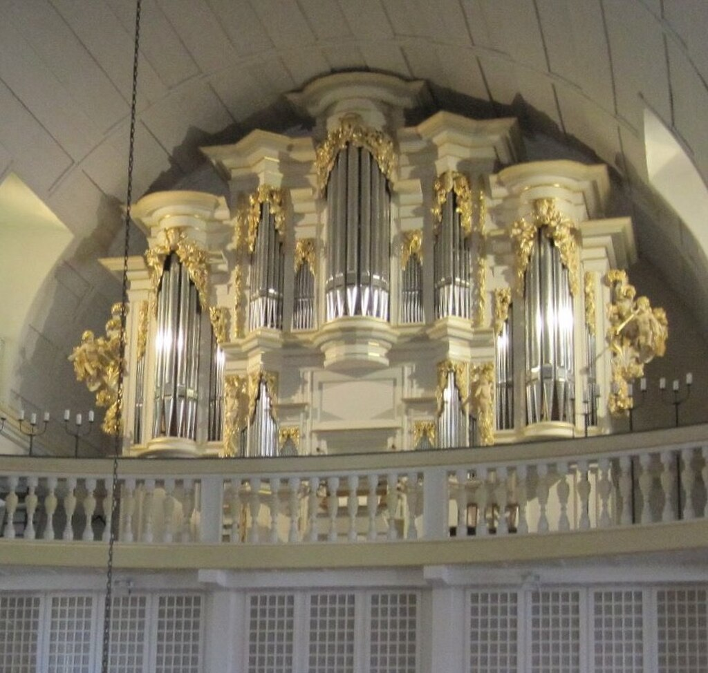Current version of the [Wender](https://en.wikipedia.org/wiki/Johann_Friedrich_Wender "Johann Friedrich Wender") organ in the Bach Church, Arnstadt.

In January 1703, shortly after graduating from St. Michael's in 1702 and being turned down for the post of organist at [Sangerhausen](https://en.wikipedia.org/wiki/Sangerhausen "Sangerhausen"), Bach was appointed court musician in the chapel of [Johann Ernst III, Duke of Saxe-Weimar](https://en.wikipedia.org/wiki/Johann_Ernst_III,_Duke_of_Saxe-Weimar "Johann Ernst III, Duke of Saxe-Weimar"). His role there is unclear, but it probably included menial, non-musical duties. During his seven-month tenure at Weimar, his reputation as a keyboardist spread so widely that he was invited to inspect the new organ and give the inaugural recital at the New Church (now [Bach Church](https://en.wikipedia.org/wiki/Bach_Church,_Arnstadt "Bach Church, Arnstadt")) in [Arnstadt](https://en.wikipedia.org/wiki/Arnstadt "Arnstadt"), about 30 kilometres (19 mi) southwest of Weimar. On 14 August 1703 he became the organist at the New Church, with light duties, a relatively generous salary, and a new organ tuned in a temperament that allowed music written in a wider range of keys to be played.

Although Johann Ernst III was musically enthusiastic, the relationship grew tense. In 1705–1706, Bach upset the duke when, after obtaining a four-week leave of absence, he was away for about four months, taking lessons from the organist and composer [Johann Adam Reincken](https://en.wikipedia.org/wiki/Johann_Adam_Reincken "Johann Adam Reincken") and wanting to hear Reincken and [Dieterich Buxtehude](https://en.wikipedia.org/wiki/Dieterich_Buxtehude "Dieterich Buxtehude") play in [Lübeck](https://en.wikipedia.org/wiki/Lübeck "Lübeck"). The visit to Buxtehude and Reincken involved a 450-kilometre (280 mi) journey each way, reportedly on foot. Buxtehude probably introduced Bach to his friend Reincken so that he could learn from his compositional technique (especially his mastery of [fugue](https://en.wikipedia.org/wiki/Fugue "Fugue")), his organ playing, and his improvisational skill. Bach knew Reincken's music very well; he copied Reincken's monumental __[An Wasserflüssen Babylon](https://en.wikipedia.org/wiki/An_Wasserflüssen_Babylon_\(Reincken\) "An Wasserflüssen Babylon (Reincken)")__ when he was 15 years old. When Bach revisited Reincken in 1720 and showed him his improvisational skill on the organ, Reincken reportedly remarked: "I thought that this art was dead, but I see that it lives in you."

In 1706 Bach applied for a post as organist at the [Blasius Church](https://en.wikipedia.org/wiki/Divi_Blasii "Divi Blasii") in [Mühlhausen](https://en.wikipedia.org/wiki/Mühlhausen "Mühlhausen"). As part of his application, he had a [cantata](https://en.wikipedia.org/wiki/Chorale_cantata_\(Bach\) "Chorale cantata (Bach)") performed at [Easter](https://en.wikipedia.org/wiki/Easter "Easter"), 24 April 1707, that resembles his later [_Christ lag in Todes Banden_, BWV 4](https://en.wikipedia.org/wiki/Christ_lag_in_Todes_Banden,_BWV_4 "Christ lag in Todes Banden, BWV 4"). Bach's application was accepted a month later, and he took up the post in July. The position included higher remuneration, improved conditions, and a better choir. Bach persuaded the church and town government at Mühlhausen to fund an expensive renovation of the organ at the Blasius Church. In 1708 Bach wrote [_Gott ist mein König_, BWV 71](https://en.wikipedia.org/wiki/Gott_ist_mein_König,_BWV_71 "Gott ist mein König, BWV 71"), a festive [cantata for the inauguration of the new council](https://en.wikipedia.org/wiki/Church_cantata_\(Bach\)#New_council "Church cantata (Bach)"), which was published at the council's expense. This is the only extant Bach cantata published in his lifetime. Bach returned to Weimar in 1708, after Johann Ernst's death, as court organist. He worked with one of Johann Ernst's sons, also named [Johann Ernst](https://en.wikipedia.org/wiki/Prince_Johann_Ernst_of_Saxe-Weimar "Prince Johann Ernst of Saxe-Weimar"), who had a keen interest in music. The prince's interest in collecting music was sufficiently well known that in 1713, when one of Bach's pupils, P. D. Kräuter, requested a leave of absence to study in Weimar, he mentioned the French and Italian music the prince was expected to introduce there. The prince also composed, and Bach wrote the Organ Concerto No.1 in G Major, [BWV 592](https://en.wikipedia.org/wiki/BWV_592 "BWV 592"), and Concerto for Organ solo in C major, BWV 595, after a theme by the prince.

### Return to Weimar (1708–1717)

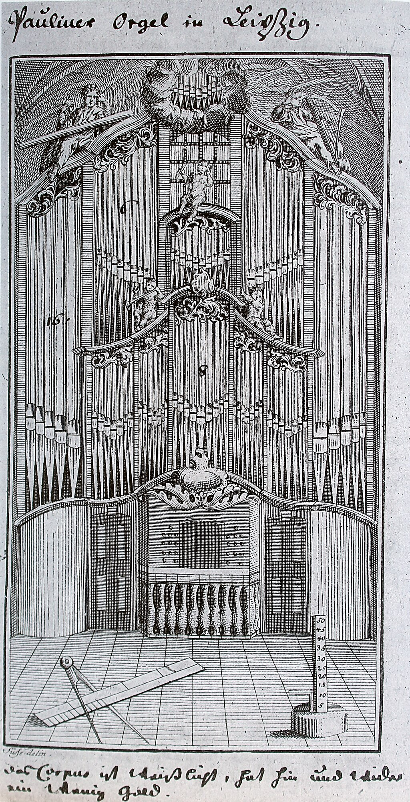Organ of the [St Paul's Church in Leipzig](https://en.wikipedia.org/wiki/Paulinerkirche,_Leipzig "Paulinerkirche, Leipzig"), tested by Bach in 1717

Bach left Mühlhausen in 1708, returning to Weimar this time as organist and from 1714 _Konzertmeister_ (director of music) at the ducal court, where he could work with a large, well-funded contingent of professional musicians. Bach and his wife moved into a house near the ducal palace. Bach's time in Weimar began a sustained period of composing keyboard and orchestral works. He attained the proficiency and confidence to extend the prevailing structures and include influences from abroad. He learned to write dramatic openings and employ the dynamic rhythms and harmonic schemes used by Italians such as [Vivaldi](https://en.wikipedia.org/wiki/Antonio_Vivaldi "Antonio Vivaldi"), [Corelli](https://en.wikipedia.org/wiki/Arcangelo_Corelli "Arcangelo Corelli"), and [Torelli](https://en.wikipedia.org/wiki/Giuseppe_Torelli "Giuseppe Torelli"). Bach absorbed these stylistic aspects to a certain extent by transcribing Vivaldi's string and wind concertos for harpsichord and organ. He was particularly attracted to the Italian style, in which one or more solo instruments alternate section-by-section with the full orchestra throughout a [movement](https://en.wikipedia.org/wiki/Movement_\(music\) "Movement (music)").

In Weimar Bach continued to play and compose for the organ and perform concert music with the duke's ensemble. He also began to write the [preludes](https://en.wikipedia.org/wiki/Prelude_\(music\) "Prelude (music)") and [fugues](https://en.wikipedia.org/wiki/Fugue "Fugue") that were later assembled into the first volume of _[The Well-Tempered Clavier](https://en.wikipedia.org/wiki/The_Well-Tempered_Clavier "The Well-Tempered Clavier")_ ("clavier" meaning clavichord or harpsichord), which eventually comprised two volumes written over 20 years, each containing 24 pairings of preludes and fugues in every [major](https://en.wikipedia.org/wiki/Major_scale "Major scale") and [minor](https://en.wikipedia.org/wiki/Minor_scale "Minor scale") key. In Weimar, Bach also started work on the _[Little Organ Book](https://en.wikipedia.org/wiki/Orgelbüchlein "Orgelbüchlein")_, containing traditional [Lutheran chorale](https://en.wikipedia.org/wiki/Lutheran_chorale "Lutheran chorale") tunes set in complex textures. In 1713 Bach was offered a post in [Halle](https://en.wikipedia.org/wiki/Halle_\(Saale\) "Halle (Saale)") when he advised the authorities during a renovation by Christoph Cuntzius of the main organ in the west gallery of the [Market Church of Our Dear Lady](https://en.wikipedia.org/wiki/Marktkirche_Unser_Lieben_Frauen "Marktkirche Unser Lieben Frauen").

In early 1714 Bach was promoted to _Konzertmeister_, an honour that entailed performing a church cantata monthly in the castle church. The first three cantatas in the new series Bach composed in Weimar were [_Himmelskönig, sei willkommen_, BWV 182](https://en.wikipedia.org/wiki/Himmelskönig,_sei_willkommen,_BWV_182 "Himmelskönig, sei willkommen, BWV 182"), for [Palm Sunday](https://en.wikipedia.org/wiki/Palm_Sunday "Palm Sunday"), which coincided with the [Annunciation](https://en.wikipedia.org/wiki/Annunciation "Annunciation") that year; [_Weinen, Klagen, Sorgen, Zagen_, BWV 12](https://en.wikipedia.org/wiki/Weinen,_Klagen,_Sorgen,_Zagen,_BWV_12 "Weinen, Klagen, Sorgen, Zagen, BWV 12"), for [Jubilate Sunday](https://en.wikipedia.org/wiki/Jubilate_Sunday "Jubilate Sunday"); and [_Erschallet, ihr Lieder, erklinget, ihr Saiten!_, BWV 172](https://en.wikipedia.org/wiki/Erschallet,_ihr_Lieder,_erklinget,_ihr_Saiten!_BWV_172 "Erschallet, ihr Lieder, erklinget, ihr Saiten! BWV 172"), for [Pentecost](https://en.wikipedia.org/wiki/Pentecost "Pentecost"). Bach's first Christmas cantata, [_Christen, ätzet diesen Tag_, BWV 63](https://en.wikipedia.org/wiki/Christen,_ätzet_diesen_Tag,_BWV_63 "Christen, ätzet diesen Tag, BWV 63"), premiered in 1714 or 1715. In 1717 Bach fell out of favour in Weimar and, according to the court secretary's report, was jailed for almost a month before being dismissed from his position: "On November 6, \[1717,\] the quondam concertmaster and organist Bach was confined to the County Judge's place of detention for too stubbornly forcing the issue of his dismissal and finally on December 2 was freed from arrest with notice of his unfavorable discharge."

### Köthen (1717–1723)

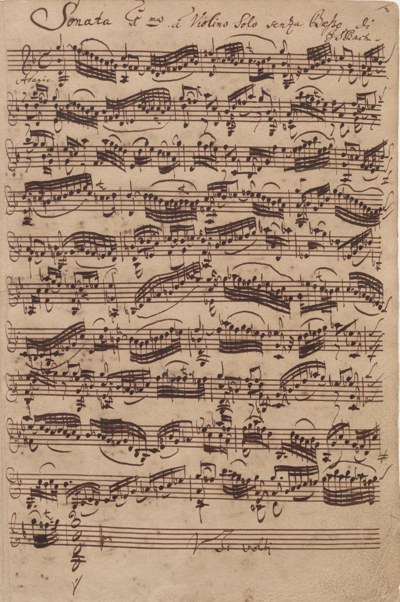Bach's autograph of the first movement of the [first sonata for solo violin, BWV 1001](https://en.wikipedia.org/wiki/BWV_1001 "BWV 1001")

[Leopold, Prince of Anhalt-Köthen](https://en.wikipedia.org/wiki/Leopold,_Prince_of_Anhalt-Köthen "Leopold, Prince of Anhalt-Köthen"), hired Bach to serve as his _[Kapellmeister](https://en.wikipedia.org/wiki/Kapellmeister "Kapellmeister")_ (director of music) in 1717. Himself a musician, Leopold appreciated Bach's talents, paid him well, and gave him considerable latitude in composing and performing. Leopold was a [Calvinist](https://en.wikipedia.org/wiki/Calvinism "Calvinism") and thus did not use elaborate music in his form of worship, so most of Bach's work from this period is secular, including the [orchestral suites](https://en.wikipedia.org/wiki/Orchestral_suites_\(Bach\) "Orchestral suites (Bach)"), [Cello Suites](https://en.wikipedia.org/wiki/Cello_Suites_\(Bach\) "Cello Suites (Bach)"), [Sonatas and Partitas for Solo Violin](https://en.wikipedia.org/wiki/Sonatas_and_Partitas_for_Solo_Violin_\(Bach\) "Sonatas and Partitas for Solo Violin (Bach)"), and the _[Brandenburg Concertos](https://en.wikipedia.org/wiki/Brandenburg_Concertos "Brandenburg Concertos")_. Bach also composed secular cantatas for the court, such as [_Die Zeit, die Tag und Jahre macht_, BWV 134a](https://en.wikipedia.org/wiki/Die_Zeit,_die_Tag_und_Jahre_macht,_BWV_134a "Die Zeit, die Tag und Jahre macht, BWV 134a").

In 1719, Bach made the 35-kilometre (22 mi) journey from [Köthen](https://en.wikipedia.org/wiki/Köthen_\(Anhalt\) "Köthen (Anhalt)") to [Halle](https://en.wikipedia.org/wiki/Halle_\(Saale\) "Halle (Saale)") with the intention to meet Handel, but Handel had left town. In 1730, Bach's oldest son, Wilhelm Friedemann, travelled to Halle to invite Handel to visit the Bach family in Leipzig, but the visit did not take place.

### Leipzig (1723–1750)

#### Appointment

In 1723 Bach was appointed _[Thomaskantor](https://en.wikipedia.org/wiki/Thomaskantor "Thomaskantor")_ (director of church music) in Leipzig, a mercantile [Saxon](https://en.wikipedia.org/wiki/Electorate_of_Saxony "Electorate of Saxony") city with "the leading cantorate in Protestant Germany". He was responsible for directing the [St. Thomas School](https://en.wikipedia.org/wiki/St._Thomas_School,_Leipzig "St. Thomas School, Leipzig") and for providing four churches with music, the [St. Thomas Church](https://en.wikipedia.org/wiki/St._Thomas_Church,_Leipzig "St. Thomas Church, Leipzig"), the [St. Nicholas Church](https://en.wikipedia.org/wiki/St._Nicholas_Church,_Leipzig "St. Nicholas Church, Leipzig"), and to a lesser extent the [New Church](https://en.wikipedia.org/wiki/St._Matthew,_Leipzig "St. Matthew, Leipzig") and [St. Peter's Church](https://en.wikipedia.org/wiki/St._Peter,_Leipzig "St. Peter, Leipzig"). A cantata was required for the church services on each Sunday and additional church holidays during the [liturgical year](https://en.wikipedia.org/wiki/Church_cantata_\(Bach\) "Church cantata (Bach)").

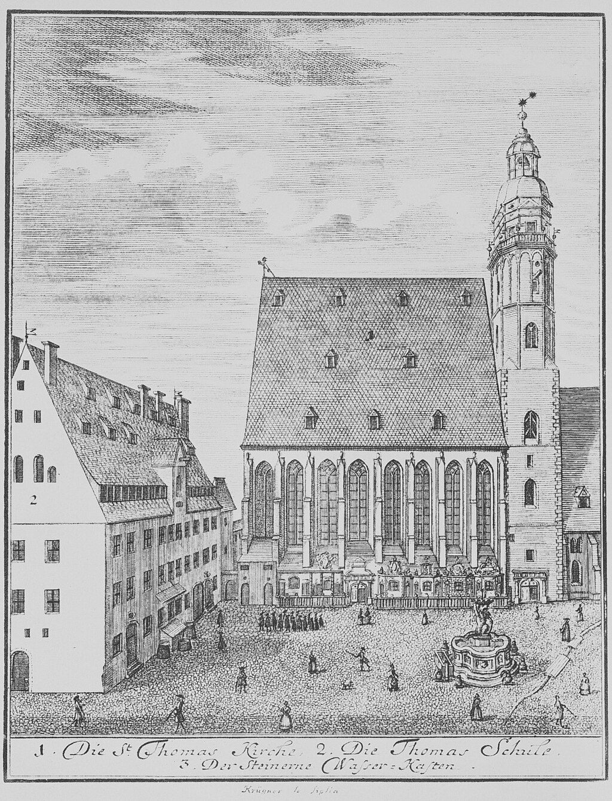[St Thomas Church](https://en.wikipedia.org/wiki/St._Thomas_Church,_Leipzig "St. Thomas Church, Leipzig") and [School](https://en.wikipedia.org/wiki/St._Thomas_School,_Leipzig "St. Thomas School, Leipzig"), [Leipzig](https://en.wikipedia.org/wiki/Leipzig "Leipzig") in 1723

[Johann Kuhnau](https://en.wikipedia.org/wiki/Johann_Kuhnau "Johann Kuhnau") had been Thomaskantor in Leipzig from 1701 until his death on 5 June 1722. Bach had visited Leipzig during Kuhnau's tenure: in 1714 he attended the service at the St. Thomas Church on the first Sunday of Advent, and in 1717 he tested the organ at [St. Paul's Church](https://en.wikipedia.org/wiki/Paulinerkirche,_Leipzig "Paulinerkirche, Leipzig"). In 1716 Bach and Kuhnau met on the occasion of the testing and inauguration of an organ in Halle. Bach was offered the position only after it had been offered to [Georg Philipp Telemann](https://en.wikipedia.org/wiki/Georg_Philipp_Telemann "Georg Philipp Telemann") and then [Christoph Graupner](https://en.wikipedia.org/wiki/Christoph_Graupner "Christoph Graupner")—both of whom chose to stay where they were, Telemann in [Hamburg](https://en.wikipedia.org/wiki/Hamburg "Hamburg") and Graupner in [Darmstadt](https://en.wikipedia.org/wiki/Darmstadt "Darmstadt")—after using the Leipzig offer to negotiate better terms of employment.

Bach was required to instruct the _Thomasschule_ students in singing. He was also assigned to teach Latin but was allowed to employ four "prefects" (deputies) to do that for him. The prefects also aided with musical instruction. Bach held the position for 27 years, until his death. During that time, he gained further prestige through honorary appointments at the courts of Köthen and [Weissenfels](https://en.wikipedia.org/wiki/Weissenfels "Weissenfels"), as well as that of the Elector [Frederick Augustus](https://en.wikipedia.org/wiki/Augustus_II_the_Strong "Augustus II the Strong") (who was also [King of Poland](https://en.wikipedia.org/wiki/King_of_Poland "King of Poland")) in [Dresden](https://en.wikipedia.org/wiki/Dresden "Dresden"). Bach frequently disagreed with his employer, Leipzig's city council, whom he regarded as "penny-pinching".

#### Cantata cycle years (1723–1729)

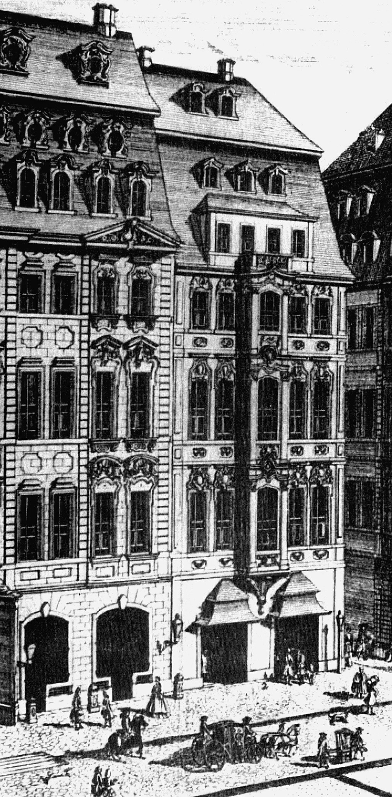[Café Zimmermann](https://en.wikipedia.org/wiki/Café_Zimmermann "Café Zimmermann"), c. 1720

In 1723, and until 1729, Bach was appointed as [Thomaskantor](https://en.wikipedia.org/wiki/Thomaskantor "Thomaskantor") and _[director musices](https://en.wikipedia.org/wiki/Director_musices "Director musices")_ in [Leipzig](https://en.wikipedia.org/wiki/Leipzig "Leipzig"), which made him responsible for the music at four churches. He provided church music for the two main churches, [St. Thomas](https://en.wikipedia.org/wiki/St._Thomas_Church,_Leipzig "St. Thomas Church, Leipzig") and [St. Nicholas](https://en.wikipedia.org/wiki/St._Nicholas_Church,_Leipzig "St. Nicholas Church, Leipzig"), and occasionally also for two others, the [New Church](https://en.wikipedia.org/wiki/St._Matthew,_Leipzig "St. Matthew, Leipzig") and [St. Peter](https://en.wikipedia.org/wiki/St._Peter,_Leipzig "St. Peter, Leipzig"). Bach took office in the middle of the [liturgical year](https://en.wikipedia.org/wiki/Liturgical_year "Liturgical year"), on the first Sunday after [Trinity](https://en.wikipedia.org/wiki/Trinity_Sunday "Trinity Sunday"). In Leipzig, cantata music was expected on Sundays and on feast days, except during the [tempus clausum](https://en.wikipedia.org/wiki/Tempus_clausum "Tempus clausum") ("silent periods") of [Advent](https://en.wikipedia.org/wiki/Advent "Advent") and [Lent](https://en.wikipedia.org/wiki/Lent "Lent"). Lutheran Leipzig observed several [Marian feasts](https://en.wikipedia.org/wiki/Marian_feast "Marian feast"), including [Annunciation](https://en.wikipedia.org/wiki/List_of_church_cantatas_by_liturgical_occasion#Annunciation_\(25_March\) "List of church cantatas by liturgical occasion") on 25 March, nine months before Christmas. In 1725, the feast fell on [Palm Sunday](https://en.wikipedia.org/wiki/Palm_Sunday "Palm Sunday"). Annunciation was the only occasion for festive music during Lent. The prescribed readings were, as the [epistle](https://en.wikipedia.org/wiki/Epistle "Epistle"), [Isaiah](https://en.wikipedia.org/wiki/Book_of_Isaiah "Book of Isaiah")'s prophecy of the birth of the [Messiah](https://en.wikipedia.org/wiki/Messiah "Messiah") ([Isaiah 7:10–16](https://en.wikisource.org/wiki/Bible%20\(King%20James\)/Isaiah#7:10 "s:Bible (King James)/Isaiah")), and from the [Gospel of Luke](https://en.wikipedia.org/wiki/Gospel_of_Luke "Gospel of Luke"), the angel [Gabriel](https://en.wikipedia.org/wiki/Gabriel "Gabriel") announcing the birth of Jesus ([Luke 1:26–38](https://en.wikisource.org/wiki/Bible%20\(King%20James\)/Luke#1:26 "s:Bible (King James)/Luke")).

In his first twelve months in office, Bach decided to compose new works for almost all liturgical occasions. These works became known as his [first cantata cycle](https://en.wikipedia.org/wiki/Bach's_first_cantata_cycle "Bach's first cantata cycle"). In his second year in office, Bach composed a [cycle of chorale cantatas](https://en.wikipedia.org/wiki/Cycle_of_chorale_cantatas "Cycle of chorale cantatas"), with each cantata based on one [Lutheran hymn](https://en.wikipedia.org/wiki/Lutheran_hymn "Lutheran hymn"), for the liturgical occasions. The choice of hymn for each of the cantatas was probably made according to the wishes of a local minister, who based the choices upon the [prescribed readings](https://en.wikipedia.org/wiki/Lectionary "Lectionary") and his plans for [sermons](https://en.wikipedia.org/wiki/Sermon "Sermon"). Compared to the first cycle, the music has less emphasis on biblical texts, but more on the use of chorale text and melody. Bach's earliest extant chorale cantata, _[Christ lag in Todes Banden, BWV 4](https://en.wikipedia.org/wiki/Christ_lag_in_Todes_Banden,_BWV_4 "Christ lag in Todes Banden, BWV 4")_, written more than a decade before arriving in Leipzig, followed the _per omnes versus_ principle, that is, it adopted the text of all stanzas of the hymn without modification, the hymn's melody being used throughout. Most of the chorale cantatas Bach wrote in his second year in Leipzig, including _Wie schön leuchtet der Morgenstern_, were formatted differently. In this structure, the outer stanzas of the hymn, and its melody, were retained in the outer movements of the cantata: typically the first stanza was set as an opening [chorale fantasia](https://en.wikipedia.org/wiki/Chorale_fantasia "Chorale fantasia"), and the last as a closing [four-part chorale](https://en.wikipedia.org/wiki/Four-part_chorale "Four-part chorale"). The inner stanzas of the hymn were rephrased into [recitatives](https://en.wikipedia.org/wiki/Recitative "Recitative") and [arias](https://en.wikipedia.org/wiki/Aria "Aria") for the cantata's inner movements, their setting mostly not based on the hymn tune.

#### Middle years in Leipzig (1730–1739)

Before starting on the Gospel of Mark after 1730, Bach had composed the _St John Passion_ and the _St Matthew Passion_; the latter was first performed on Good Friday 11 April 1727. The 1731 _[St Mark Passion](https://en.wikipedia.org/wiki/St_Mark_Passion,_BWV_247 "St Mark Passion, BWV 247")_ (German: _Markus-Passion_), [BWV](https://en.wikipedia.org/wiki/BWV "BWV") 247, is a lost [Passion setting](https://en.wikipedia.org/wiki/Passion_\(music\) "Passion (music)") by Bach, first performed in Leipzig on [Good Friday](https://en.wikipedia.org/wiki/Good_Friday "Good Friday"), 23 March 1731. Though Bach's music is lost, the libretto by [Picander](https://en.wikipedia.org/wiki/Picander "Picander") is extant, and the work can to some degree be reconstructed from it. In 1733 Bach composed a [Kyrie–Gloria Mass in B minor](https://en.wikipedia.org/wiki/Mass_for_the_Dresden_court_\(Bach\) "Mass for the Dresden court (Bach)") for the court in Dresden, which had become Catholic, that he later used in his Mass in B minor. He presented the manuscript to the Elector in a successful bid to persuade the prince to give him the title of Court Composer. He later extended this work into a full mass by adding a Credo, Sanctus, and Agnus Dei, the music for which was partly based on his own cantatas and partly original. Bach's appointment as Court Composer was part of his long struggle to achieve greater bargaining power with the Leipzig council.

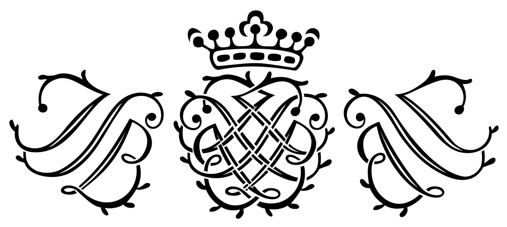Bach's seal (centre), used throughout his Leipzig years. It contains the superimposed letters _J S B_ in a mirror image topped with a crown. The flanking letters illustrate the arrangement on the seal.

Bach composed his _[Christmas Oratorio](https://en.wikipedia.org/wiki/Christmas_Oratorio "Christmas Oratorio")_ for the 1734–35 Christmas season in [Leipzig](https://en.wikipedia.org/wiki/Leipzig "Leipzig"), by using works he had already composed such as the [Christmas cantatas](https://en.wikipedia.org/wiki/Christmas_cantata "Christmas cantata") and other church music for all seven occasions of the Christmas season including part of [his Weimar cantata cycle](https://en.wikipedia.org/wiki/Weimar_cantata_\(Bach\)#Weimar_cycle "Weimar cantata (Bach)") and [_Christen, ätzet diesen Tag_, BWV 63](https://en.wikipedia.org/wiki/Christen,_ätzet_diesen_Tag,_BWV_63 "Christen, ätzet diesen Tag, BWV 63"). In 1735 Bach started preparing his first organ music publication, which was printed as the third __[Clavier-Übung](https://en.wikipedia.org/wiki/Clavier-Übung_III "Clavier-Übung III")__ in 1739. From around that year he started to compile and compose the set of preludes and fugues for harpsichord that became the second book of _The Well-Tempered Clavier_. He received the title of "Royal Court Composer" from [Augustus III of Poland](https://en.wikipedia.org/wiki/Augustus_III_of_Poland "Augustus III of Poland") in 1736. Between 1737 and 1739 Bach's former pupil [Carl Gotthelf Gerlach](https://en.wikipedia.org/wiki/Carl_Gotthelf_Gerlach "Carl Gotthelf Gerlach") held the directorship of the Collegium Musicum.

#### Final years (1740–1750)

From 1740 to 1748 Bach copied, transcribed, expanded or programmed music in an older [polyphonic](https://en.wikipedia.org/wiki/Polyphony "Polyphony") style (_[stile antico](https://en.wikipedia.org/wiki/Stile_antico "Stile antico")_) by, among others, [Palestrina](/source/palestrina/ "Giovanni Pierluigi da Palestrina") ([BNB I/P/2](https://en.wikipedia.org/wiki/BNB_I/P/2 "BNB I/P/2")), [Kerll](https://en.wikipedia.org/wiki/Johann_Caspar_Kerll "Johann Caspar Kerll") ([BWV 241](https://en.wikipedia.org/wiki/BWV_241 "BWV 241")), [Torri](https://en.wikipedia.org/wiki/Pietro_Torri "Pietro Torri") ([BWV Anh. 30](https://en.wikipedia.org/wiki/BWV_Anh._30 "BWV Anh. 30")), [Bassani](https://en.wikipedia.org/wiki/Giovanni_Battista_Bassani "Giovanni Battista Bassani") ([BWV 1081](https://en.wikipedia.org/wiki/BWV_1081 "BWV 1081")), [Gasparini](https://en.wikipedia.org/wiki/Francesco_Gasparini "Francesco Gasparini") (_[Missa Canonica](https://en.wikipedia.org/wiki/Missa_Canonica_\(Gasparini\) "Missa Canonica (Gasparini)")_), and [Caldara](https://en.wikipedia.org/wiki/Antonio_Caldara "Antonio Caldara") ([BWV 1082](https://en.wikipedia.org/wiki/BWV_1082 "BWV 1082")). Bach's style shifted in the last decade of his life, showing an increased integration of elements of the _stile antico_, including polyphonic structures and canons. His fourth and last _Clavier-Übung_ volume, the _[Goldberg Variations](https://en.wikipedia.org/wiki/Goldberg_Variations "Goldberg Variations")_ for two-manual harpsichord, contains nine canons and was published in 1741. During this period, Bach also continued to adapt music of contemporaries such as [Handel](https://en.wikipedia.org/wiki/George_Frideric_Handel "George Frideric Handel") ([BNB I/K/2](https://en.wikipedia.org/wiki/BNB_I/K/2 "BNB I/K/2")) and [Stölzel](https://en.wikipedia.org/wiki/Gottfried_Heinrich_Stölzel "Gottfried Heinrich Stölzel") ([BWV 200](https://en.wikipedia.org/wiki/BWV_200 "BWV 200")), and gave many of his own earlier compositions, such as the _[St Matthew](https://en.wikipedia.org/wiki/St_Matthew_Passion "St Matthew Passion")_ and _[St John Passions](https://en.wikipedia.org/wiki/St_John_Passion "St John Passion")_ and the _[Great Eighteen Chorale Preludes](https://en.wikipedia.org/wiki/Great_Eighteen_Chorale_Preludes "Great Eighteen Chorale Preludes")_, their final revisions. He also programmed and adapted music by composers of a younger generation, including [Pergolesi](https://en.wikipedia.org/wiki/Giovanni_Battista_Pergolesi "Giovanni Battista Pergolesi") ([BWV 1083](https://en.wikipedia.org/wiki/BWV_1083 "BWV 1083")), and his own students, such as [Goldberg](https://en.wikipedia.org/wiki/Johann_Gottlieb_Goldberg "Johann Gottlieb Goldberg") ([BNB I/G/2](https://en.wikipedia.org/wiki/BNB_I/G/2 "BNB I/G/2")).

In 1746 Bach was preparing to enter [Lorenz Christoph Mizler](https://en.wikipedia.org/wiki/Lorenz_Christoph_Mizler "Lorenz Christoph Mizler")'s Society of Musical Sciences. To be admitted, he had to submit a composition. He chose his [Canonic Variations on "Vom Himmel hoch da komm' ich her"](./Canonic_Variations_on_"Vom_Himmel_hoch_da_komm'_ich_her" "Canonic Variations on \"Vom Himmel hoch da komm' ich her\""), and a portrait painted by [Elias Gottlob Haussmann](https://en.wikipedia.org/wiki/Elias_Gottlob_Haussmann "Elias Gottlob Haussmann") that featured Bach's _[Canon triplex á 6 Voc](https://en.wikipedia.org/wiki/BWV_1076 "BWV 1076")_. In May 1747, Bach visited the court of King [Frederick the Great](https://en.wikipedia.org/wiki/Frederick_the_Great "Frederick the Great") in [Potsdam](https://en.wikipedia.org/wiki/Potsdam "Potsdam"). The king played a theme for Bach and challenged him to improvise a fugue based on it. Bach obliged, playing a three-part fugue on one of Frederick's early prototypes of a new instrument, the [fortepiano](https://en.wikipedia.org/wiki/Fortepiano "Fortepiano"). Upon his return to Leipzig he composed a set of fugues and canons and a trio sonata based on the _Thema Regium_ ("King's Theme"). Within a few weeks this music was published as _[The Musical Offering](https://en.wikipedia.org/wiki/The_Musical_Offering "The Musical Offering")_ and dedicated to Frederick. The _[Schübler Chorales](https://en.wikipedia.org/wiki/Schübler_Chorales "Schübler Chorales")_, a set of six chorale preludes transcribed from cantata movements Bach had written two decades earlier, were published within a year. Around the same time, the set of five canonic variations Bach had submitted when entering Mizler's society in 1747 were also printed.

Two large-scale compositions occupied a central place in Bach's last years. Beginning around 1742 he wrote and revised the various canons and fugues of _[The Art of Fugue](https://en.wikipedia.org/wiki/The_Art_of_Fugue "The Art of Fugue")_, which he continued to prepare for publication until shortly before his death. After extracting a cantata, [BWV 191](https://en.wikipedia.org/wiki/BWV_191 "BWV 191"), from his [1733 Kyrie-Gloria Mass for the Dresden court](https://en.wikipedia.org/wiki/Bach's_Missa_of_1733 "Bach's Missa of 1733") in the mid-1740s, Bach expanded that [setting](https://en.wikipedia.org/wiki/Mass_\(music\) "Mass (music)") into his [Mass in B minor](https://en.wikipedia.org/wiki/Mass_in_B_minor "Mass in B minor") in the last years of his life. The complete mass was not performed during his lifetime. It is considered among the greatest choral works in history. In January 1749, with Bach in declining health, his daughter Elisabeth Juliane Friederica married his pupil [Johann Christoph Altnickol](https://en.wikipedia.org/wiki/Johann_Christoph_Altnickol "Johann Christoph Altnickol"). On 2 June [Heinrich von Brühl](https://en.wikipedia.org/wiki/Heinrich_von_Brühl "Heinrich von Brühl") wrote to one of the Leipzig [burgomasters](https://en.wikipedia.org/wiki/Burgomaster "Burgomaster") to request that his music director, [Gottlob Harrer](https://en.wikipedia.org/wiki/Gottlob_Harrer "Gottlob Harrer"), fill the Thomaskantor and _Director musices_ posts "upon the eventual ... decease of Mr. Bach". His eyesight failing, Bach underwent eye surgery in March 1750 and again in April by the British eye surgeon [John Taylor](https://en.wikipedia.org/wiki/John_Taylor_\(oculist\) "John Taylor (oculist)"), a man widely understood today as a charlatan and believed to have blinded hundreds of people, including Bach's contemporary George Frideric Handel.

## Death and burial

Bach died on 28 July 1750 from complications due to unsuccessful eye surgery. He had a [stroke](https://en.wikipedia.org/wiki/Stroke "Stroke") a few days before his death. He was originally buried at [Old St John's Cemetery](https://en.wikipedia.org/wiki/Alter_Johannisfriedhof "Alter Johannisfriedhof") in Leipzig, where his grave went unmarked for nearly 150 years. In 1894, his remains were found and moved to a vault in [St John's Church](https://en.wikipedia.org/wiki/Saint_John's_Church,_Leipzig "Saint John's Church, Leipzig"). This building was destroyed by [Allied bombing during the Second World War](https://en.wikipedia.org/wiki/Bombing_of_Leipzig_in_World_War_II "Bombing of Leipzig in World War II"), and in 1950 Bach's remains were taken to their present grave in St Thomas Church. Later research has called into question whether the remains in the grave are actually Bach's.

An inventory drawn up a few months after Bach's death shows that his estate included five [harpsichords](https://en.wikipedia.org/wiki/Harpsichord "Harpsichord"), two [lute-harpsichords](https://en.wikipedia.org/wiki/Lautenwerck "Lautenwerck"), three [violins](https://en.wikipedia.org/wiki/Violin "Violin"), three [violas](https://en.wikipedia.org/wiki/Viola "Viola"), two [cellos](https://en.wikipedia.org/wiki/Cello "Cello"), a [viola da gamba](https://en.wikipedia.org/wiki/Viol "Viol"), a [lute](https://en.wikipedia.org/wiki/Lute "Lute"), a [spinet](https://en.wikipedia.org/wiki/Spinet "Spinet"), and 52 "sacred books", including works by [Martin Luther](https://en.wikipedia.org/wiki/Martin_Luther "Martin Luther") and [Josephus](https://en.wikipedia.org/wiki/Josephus "Josephus"). C. P. E. Bach saw to it that _The Art of Fugue_, though unfinished, was published in 1751. Together with one of J. S. Bach's former students, [Johann Friedrich Agricola](https://en.wikipedia.org/wiki/Johann_Friedrich_Agricola "Johann Friedrich Agricola"), C. P. E. Bach also wrote the obituary ("[Nekrolog](https://en.wikipedia.org/wiki/Bach's_Nekrolog "Bach's Nekrolog")"), which was published in Mizler's _Musikalische Bibliothek_, a periodical journal produced by the Society of Musical Sciences, in 1754.

## Music

### Antecedents and influences

Though Bach never visited France or Italy, he was influenced by French and Italian music. He studied both dead and living composers, and those influences are evident in his music.

#### Italian influences including Weimar concerto transcriptions

The court at Weimar was particularly interested in Italian music. Not all the music Bach was exposed to there has been identified, but Vivaldi was certainly an important influence. In particular, Bach borrowed the idea of propulsive rhythmic patterns from Vivaldi.

*   The [musical influence for BWV 974](https://en.wikipedia.org/wiki/Oboe_Concerto_\(Marcello\) "Oboe Concerto (Marcello)") has been variously attributed to Vivaldi, [Benedetto Marcello](https://en.wikipedia.org/wiki/Benedetto_Marcello "Benedetto Marcello"), and [Alessandro Marcello](https://en.wikipedia.org/wiki/Alessandro_Marcello "Alessandro Marcello"). In the second half of the 20th century, the [oboe concerto](https://en.wikipedia.org/wiki/Oboe_concerto "Oboe concerto") that inspired Bach's transcription was attributed to Allesandro Marcello again—as it had been in its 1717 printed edition—through research by scholars such as Eleanor Selfridge-Field.
*   The musical influence for [BWV 979](https://en.wikipedia.org/wiki/BWV_979 "BWV 979") has been attributed to Vivaldi and to [Giuseppe Torelli](https://en.wikipedia.org/wiki/Giuseppe_Torelli "Giuseppe Torelli"). Listed as No. 10 in the _Anhang_ (Appendix) of the [Ryom-Verzeichnis](https://en.wikipedia.org/wiki/Ryom-Verzeichnis "Ryom-Verzeichnis") (RV), it was generally attributed to Torelli. In an article published in 2005, Federico Maria Sardelli argued against the attribution to Torelli in favour of an attribution to Vivaldi. Consequently, the concerto was relisted as RV 813. The composition originated before 1711: its seven movements and second viola part are not compatible with Vivaldi's later style.
*   No works by other composers have been identified for [BWV 977](https://en.wikipedia.org/wiki/BWV_977 "BWV 977"), [983](https://en.wikipedia.org/wiki/BWV_983 "BWV 983"), or [986](https://en.wikipedia.org/wiki/BWV_986 "BWV 986"). Stylistically BWV 977 is more Italianate than 983 or 986. David Schulenberg supposes an Italian origin for BWV 977 and German precedents for the other two.

Bach employed other transcriptions of Vivaldi concertos, using versions of various quality that circulated as manuscripts in his time. In 2011, Joseph Butler began to try to assess the relative originality in Bach in comparison to the relative originality in Vivaldi with the result that other composers likely affected Bach while composing Vivaldi-inspired works. Butler writes: "The concertos Bach transcribed from Vivaldi's Op. 3 provide the best avenue for this study (of their comparative originality). These works are the most original of Bach's transcriptions, and they were based on outstanding originals available to Bach in an authoritative published edition. His other Vivaldi transcriptions were made from manuscript sources of varying integrity." Later versions of some of these were published in his [Opp. 4](https://en.wikipedia.org/wiki/La_stravaganza "La stravaganza") and [7](https://en.wikipedia.org/wiki/Twelve_Concertos,_Op._7_\(Vivaldi\) "Twelve Concertos, Op. 7 (Vivaldi)"):

*   After Vivaldi's Violin Concerto in B-flat major (later version published as Op. 4 No. 1, RV 383a): Concerto in G major, BWV 980 (harpsichord)
*   After Vivaldi's Violin Concerto in G minor, RV 316 (later version published as Op. 4 No. 6, RV 316a): Concerto in G minor, BWV 975 (harpsichord)
*   After Vivaldi's Violin Concerto in G major (later version published as Op. 7 No. 8, RV 299): Concerto in G major, BWV 973 (harpsichord)
*   After Vivaldi's [Violin Concerto _Grosso Mogul_ in D major, RV 208](https://en.wikipedia.org/wiki/Grosso_Mogul "Grosso Mogul") (later version published as [Op. 7](https://en.wikipedia.org/wiki/Twelve_Concertos,_Op._7_\(Vivaldi\) "Twelve Concertos, Op. 7 (Vivaldi)") No. 11, RV 208a): Concerto in C major, BWV 594 (organ)
*   After Vivaldi's Violin Concerto in D minor, RV 813 (formerly RV Anh. 10 often attributed to Torelli): Concerto in B minor, BWV 979 (harpsichord)

Bach also used the theme of the first movement of the "Spring" concerto from [_The Four Seasons_](https://en.wikipedia.org/wiki/The_Four_Seasons_\(Vivaldi\) "The Four Seasons (Vivaldi)") for the third movement (_aria_) of his cantata [_Wer weiß, wie nahe mir mein Ende?_, BWV 27](https://en.wikipedia.org/wiki/Wer_weiß,_wie_nahe_mir_mein_Ende?_BWV_27 "Wer weiß, wie nahe mir mein Ende? BWV 27"). Bach was deeply influenced by Vivaldi's concertos and arias (recalled in his _[St. John Passion](https://en.wikipedia.org/wiki/St._John_Passion "St. John Passion")_, _[St. Matthew Passion](https://en.wikipedia.org/wiki/St._Matthew_Passion "St. Matthew Passion")_, and [cantatas](https://en.wikipedia.org/wiki/Bach_cantata "Bach cantata")). According to Christoph Wolff and Walter Emery, Bach transcribed six of Vivaldi's concerti for solo keyboard, three for organ, and one for four harpsichords, strings, and [basso continuo](https://en.wikipedia.org/wiki/Basso_continuo "Basso continuo") (BWV 1065) based on Vivaldi's concerto for four violins, two violas, cello, and basso continuo ([RV](https://en.wikipedia.org/wiki/Ryom-Verzeichnis "Ryom-Verzeichnis") 580).

[Arcangelo Corelli](https://en.wikipedia.org/wiki/Arcangelo_Corelli "Arcangelo Corelli")'s influence in [chamber music](https://en.wikipedia.org/wiki/Chamber_music "Chamber music") was not confined to his native Italy; his works were key in the development of the music of an entire generation of composers, including Bach, Vivaldi, [Georg Friedrich Handel](https://en.wikipedia.org/wiki/Georg_Friedrich_Handel "Georg Friedrich Handel"), and [François Couperin](https://en.wikipedia.org/wiki/François_Couperin "François Couperin"). Bach studied Corelli's work and based an organ fugue (BWV 579) on his Opus 3 of 1689. Handel's [Opus 6 _Concerti Grossi_](https://en.wikipedia.org/wiki/Concerti_grossi,_Op._6_\(Handel\) "Concerti grossi, Op. 6 (Handel)") take Corelli's older [Opus 6 _Concerti_](https://en.wikipedia.org/wiki/Twelve_concerti_grossi,_Op._6_\(Corelli\) "Twelve concerti grossi, Op. 6 (Corelli)") as inspiring Bach, rather than the later three-movement Venetian concerto of Vivaldi Bach favoured.

#### French influences

[Jean-Baptiste Lully](https://en.wikipedia.org/wiki/Jean-Baptiste_Lully "Jean-Baptiste Lully") is credited with the invention in the 1650s of the [French overture](https://en.wikipedia.org/wiki/French_overture "French overture"), a form used extensively in the Baroque and Classical eras, especially by Bach and Handel. The later French composer [François Couperin](https://en.wikipedia.org/wiki/François_Couperin "François Couperin") has been seen as an influence on the dance-based movements of Bach's keyboard suites. The influence of Lully's music produced a radical revolution in the style and composition of the [dances](https://en.wikipedia.org/wiki/Dance "Dance") of the French court, which Bach made use of in his music. Instead of the slow and stately movements that had prevailed until Lully began composing, Lully introduced lively [ballets](https://en.wikipedia.org/wiki/Ballet_\(music\) "Ballet (music)") of rapid [rhythm](https://en.wikipedia.org/wiki/Rhythm "Rhythm"), often based on well-known dance types such as [gavottes](https://en.wikipedia.org/wiki/Gavotte "Gavotte"), [menuets](https://en.wikipedia.org/wiki/Menuet "Menuet"), [rigaudons](https://en.wikipedia.org/wiki/Rigaudon "Rigaudon"), and [sarabandes](https://en.wikipedia.org/wiki/Sarabande "Sarabande"), forms often used by Bach.

### Creative range

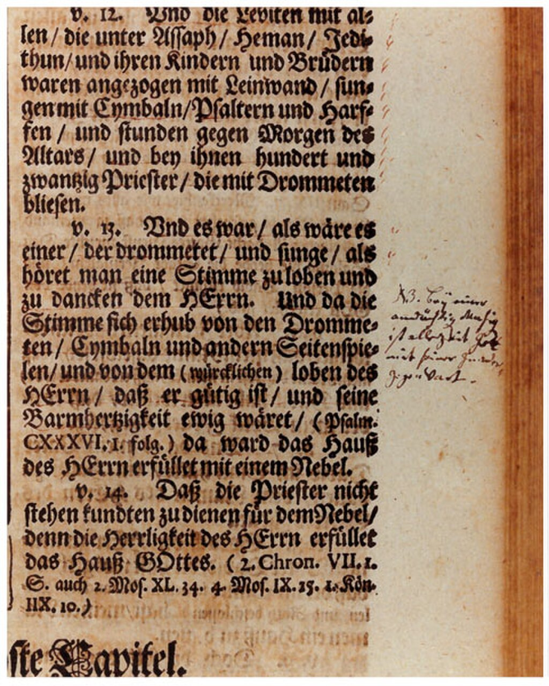A handwritten note by Bach in his copy of the [Calov Bible](https://en.wikipedia.org/wiki/Calov_Bible "Calov Bible"). The note next to [2 Chronicles 5:13](https://en.wikisource.org/wiki/Bible%20\(King%20James\)/2 Chronicles#5:13 "s:Bible (King James)/2 Chronicles") reads: _NB Bey einer andächtigen Musiq ist allezeit Gott mit seiner Gnaden Gegenwart_; Eng. trans. "[N(ota) B(ene)](https://en.wikipedia.org/wiki/Nota_bene "Nota bene") In a music of worship God is always present with his grace".

Bach's creative range and musical style encompassed four-part harmony, modulation, ornamentation, use of continuo instruments solos, virtuoso instrumentation, counterpoint, and a refined attention to structure and lyrics. Like his contemporaries Handel, Telemann, and Vivaldi, Bach composed concertos, suites, recitatives, [da capo arias](https://en.wikipedia.org/wiki/Da_capo_aria "Da capo aria"), and four-part choral music, and employed [basso continuo](https://en.wikipedia.org/wiki/Basso_continuo "Basso continuo"). Most of the prints of Bach's music that appeared during his lifetime were commissioned by the composer. His music is harmonically more innovative than his peers', employing surprisingly [dissonant](https://en.wikipedia.org/wiki/Consonance_and_dissonance "Consonance and dissonance") chords and progressions, often extensively exploring harmonic possibilities within one piece.

Bach's hundreds of sacred works are usually seen as manifesting not just his craft but also a deep faith in God. His commitment to the Lutheran faith was reflected in his teaching [Luther's Small Catechism](https://en.wikipedia.org/wiki/Luther's_Small_Catechism "Luther's Small Catechism") as the _Thomaskantor_ in Leipzig, and some of his pieces represent it. The contents of Luther's Small Catechism contain such religious themes as the [Ten Commandments](https://en.wikipedia.org/wiki/Ten_Commandments "Ten Commandments"), the [Apostles' Creed](https://en.wikipedia.org/wiki/Apostles'_Creed "Apostles' Creed"), the [Lord's Prayer](https://en.wikipedia.org/wiki/Lord's_Prayer "Lord's Prayer"), [the Sacrament of Holy Baptism](https://en.wikipedia.org/wiki/Baptism "Baptism"), [the Office of the Keys and Confession](https://en.wikipedia.org/wiki/Confession_in_the_Lutheran_Church "Confession in the Lutheran Church"), and [the Sacrament of the Eucharist](https://en.wikipedia.org/wiki/Eucharist_in_the_Lutheran_Church "Eucharist in the Lutheran Church"). The [Lutheran chorale](https://en.wikipedia.org/wiki/Lutheran_chorale "Lutheran chorale") was the basis of much of his work. In elaborating these hymns into his chorale preludes, he wrote more cogent and tightly integrated works than most, even when they were massive and lengthy. The large-scale structure of every major Bach sacred vocal work is evidence of subtle, elaborate planning to create religiously and musically powerful expression. Bach published or carefully compiled in manuscript many collections of pieces that explored the range of artistic and technical possibilities inherent in almost every genre of his time except [opera](https://en.wikipedia.org/wiki/Opera "Opera"). For example, _The Well-Tempered Clavier_ comprises two books, each of which presents a prelude and fugue in every major and minor key.

### Compositional style in the High Baroque

#### Four-part harmony

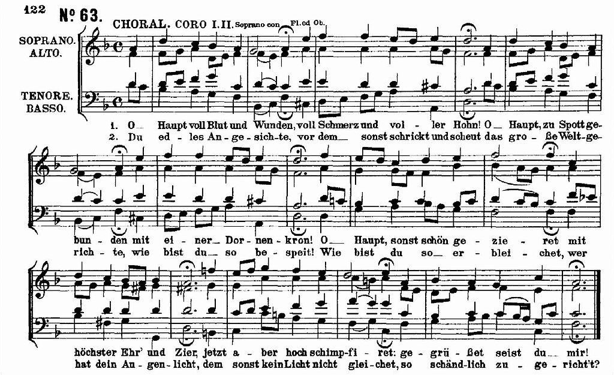"[O Haupt voll Blut und Wunden](https://en.wikipedia.org/wiki/O_Haupt_voll_Blut_und_Wunden "O Haupt voll Blut und Wunden")": the four-part chorale setting as included in the _St Matthew Passion_

[Four-part harmony](https://en.wikipedia.org/wiki/Four-part_harmony "Four-part harmony") predates Bach, but he lived during a time when [modal music](https://en.wikipedia.org/wiki/Modal_music "Modal music") in Western tradition was largely supplanted by the [tonal system](https://en.wikipedia.org/wiki/Tonality "Tonality"). In this system a piece of music progresses from one [chord](https://en.wikipedia.org/wiki/Chord_\(music\) "Chord (music)") to the next according to certain rules, with each chord characterised by four notes. The principles of four-part harmony are found not only in Bach's four-part choral music; he also prescribes it for instance in [figured bass](https://en.wikipedia.org/wiki/Figured_bass "Figured bass") accompaniment. The new system was at the core of Bach's style. Some examples of this characteristic of Bach's style and its influence:

*   When in the 1740s Bach staged [his arrangement](https://en.wikipedia.org/wiki/BWV_1083 "BWV 1083") of [Pergolesi](https://en.wikipedia.org/wiki/Giovanni_Battista_Pergolesi "Giovanni Battista Pergolesi")'s _[Stabat Mater](https://en.wikipedia.org/wiki/Stabat_Mater_\(Pergolesi\) "Stabat Mater (Pergolesi)")_, he upgraded the viola part (which in the original composition plays in unison with the bass part) to fill in the harmony, thus adapting the composition to four-part harmony.
*   When, starting in the 19th century in Russia, there was a discussion about the authenticity of four-part court chant settings compared to earlier Russian traditions, [Bach's four-part chorale settings](https://en.wikipedia.org/wiki/List_of_chorale_harmonisations_by_Johann_Sebastian_Bach "List of chorale harmonisations by Johann Sebastian Bach"), such as those ending his [Chorale cantatas](https://en.wikipedia.org/wiki/Chorale_cantata_\(Bach\) "Chorale cantata (Bach)"), were considered foreign-influenced musical precedents, but such influence was deemed unavoidable.

Bach's insistence on the tonal system and contribution to shaping it did not imply he was less at ease with the older modal system and the genres associated with it: more than his contemporaries (who had "moved on" to the tonal system without much exception), he often returned to the then-antiquated modes and genres. His _[Chromatic Fantasia and Fugue](https://en.wikipedia.org/wiki/Chromatic_Fantasia_and_Fugue "Chromatic Fantasia and Fugue")_, emulating the [chromatic fantasia](https://en.wikipedia.org/wiki/Chromatic_fantasia "Chromatic fantasia") genre used by earlier composers such as [John Dowland](https://en.wikipedia.org/wiki/John_Dowland "John Dowland") and [Jan Pieterszoon Sweelinck](https://en.wikipedia.org/wiki/Jan_Pieterszoon_Sweelinck "Jan Pieterszoon Sweelinck") in D [Dorian mode](https://en.wikipedia.org/wiki/Dorian_mode "Dorian mode") (comparable to [D minor](https://en.wikipedia.org/wiki/D_minor "D minor") in the tonal system), is an example. Bach's first biographer, [Johann Nikolaus Forkel](https://en.wikipedia.org/wiki/Johann_Nikolaus_Forkel "Johann Nikolaus Forkel"), wrote of Bach's original approach to this: "I have expended much effort to find another piece of this type by Bach. But it was in vain. This fantasy is unique and has always been second to none."

#### Modulation

[Modulation](https://en.wikipedia.org/wiki/Modulation_\(music\) "Modulation (music)"), or changing [key](https://en.wikipedia.org/wiki/Key_\(music\) "Key (music)") in the course of a piece, is another style characteristic where Bach goes beyond the norm in his time. Baroque instruments vastly limited modulation possibilities: keyboard instruments, before a workable system of [temperament](https://en.wikipedia.org/wiki/Musical_temperament "Musical temperament"), limited the keys that could be modulated to, and wind instruments, especially brass instruments such as [trumpets](https://en.wikipedia.org/wiki/Natural_trumpet "Natural trumpet") and [horns](https://en.wikipedia.org/wiki/Natural_horn "Natural horn"), about a century before they were fitted with valves and [crooks](https://en.wikipedia.org/wiki/Crook_\(music\) "Crook (music)"), were tied to the key of their tuning. Bach pushed the limits: he added "strange tones" in his organ playing, confusing the singers, according to an indictment he had to face in Arnstadt, and [Louis Marchand](https://en.wikipedia.org/wiki/Louis_Marchand "Louis Marchand"), another early experimenter with modulation, seems to have avoided confrontation with Bach because the latter went further than anyone had done before. For example, in the [_Suscepit Israel_](https://en.wikipedia.org/wiki/Magnificat_in_E-flat_major,_BWV_243a#10 "Magnificat in E-flat major, BWV 243a") of his 1723 Magnificat, he used a sophisticated compositional form in which the trumpets in E-flat play a melody in unfamiliar, variable-size quarter tones in the [enharmonic](https://en.wikipedia.org/wiki/Enharmonic "Enharmonic") scale of C minor.

The major development in Bach's time to which he was a significant contributor was a temperament for keyboard instruments that allowed their use in every key (12 major and 12 minor) and modulation without retuning. His _[Capriccio on the departure of a beloved brother](https://en.wikipedia.org/wiki/Capriccio_on_the_departure_of_a_beloved_brother "Capriccio on the departure of a beloved brother")_, a very early work, showed a gusto for modulation unlike any contemporary work it has been compared to, but the full expansion came with _The Well-Tempered Clavier_, using all keys, which Bach apparently had been developing since around 1720, the __[Klavierbüchlein für Wilhelm Friedemann Bach](https://en.wikipedia.org/wiki/Klavierbüchlein_für_Wilhelm_Friedemann_Bach "Klavierbüchlein für Wilhelm Friedemann Bach")__ being one of its earliest examples.

#### Ornamentation

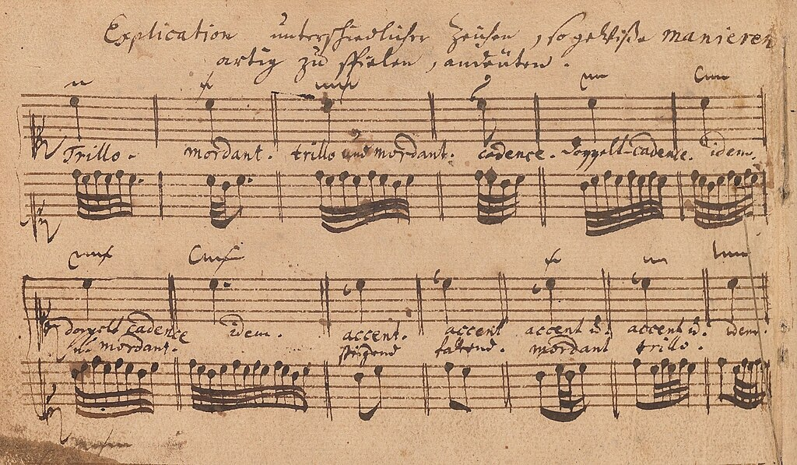Bach's guide on [ornaments](https://en.wikipedia.org/wiki/Ornament_\(music\) "Ornament (music)") as contained in the _[Klavierbüchlein für Wilhelm Friedemann Bach](https://en.wikipedia.org/wiki/Klavierbüchlein_für_Wilhelm_Friedemann_Bach "Klavierbüchlein für Wilhelm Friedemann Bach")_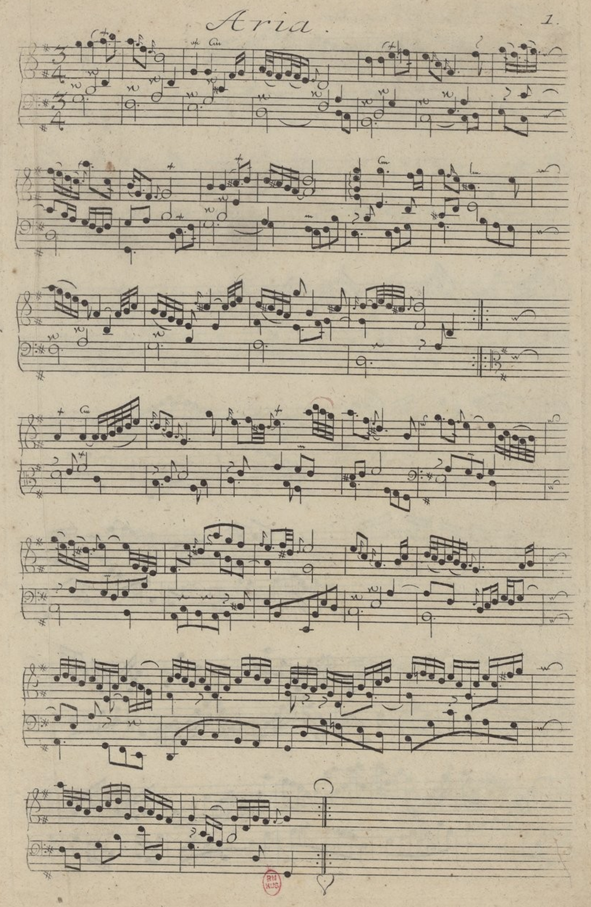Aria of the _[Goldberg Variations](https://en.wikipedia.org/wiki/Goldberg_Variations "Goldberg Variations")_, showing Bach's use of ornaments

The second page of the __Klavierbüchlein für Wilhelm Friedemann Bach__ is an [ornament](https://en.wikipedia.org/wiki/Ornament_\(music\) "Ornament (music)") notation and performance guide that Bach wrote for his eldest son, then nine years old. Bach was generally quite specific on ornamentation in his compositions (in his time, much ornamentation was not written out by composers but rather considered a liberty of the performer), and his ornamentation was often quite elaborate. For instance, the "Aria" of the _Goldberg Variations_ has rich ornamentation in nearly every measure. Bach's approach to ornamentation can also be seen in a keyboard arrangement he made of Marcello's [Oboe Concerto](https://en.wikipedia.org/wiki/Oboe_Concerto_\(Marcello\) "Oboe Concerto (Marcello)"): he added explicit ornamentation, which centuries later is still played.

Although Bach wrote no formal operas, he was not averse to the genre or its ornamented vocal style, as in his [Coffee Cantata](https://en.wikipedia.org/wiki/Coffee_Cantata "Coffee Cantata"). In church music, Italian composers had imitated the operatic vocal style in genres such as the [Neapolitan mass](https://en.wikipedia.org/wiki/Neapolitan_mass "Neapolitan mass"). In Protestant surroundings, there was more reluctance to adopt such a style for liturgical music. Kuhnau had notoriously shunned opera and Italian virtuoso vocal music. Bach felt differently, and a performance of his St Matthew Passion was described as sounding like opera.

#### Continuo instrument solos

In concerted playing in Bach's time, the basso continuo, consisting of instruments such as [viola da gamba](https://en.wikipedia.org/wiki/Viola_da_gamba "Viola da gamba") or cello, and harpsichord or organ, usually had the role of accompaniment, providing a piece's harmonic and rhythmic foundation. Beginning in the 1720s Bach had the organ play [concertante](https://en.wikipedia.org/wiki/Concertante "Concertante") (i.e., as a soloist) with the orchestra in instrumental cantata movements, a decade before Handel published his [first organ concertos](https://en.wikipedia.org/wiki/Organ_concertos,_Op._4_\(Handel\) "Organ concertos, Op. 4 (Handel)"). Apart from the [fifth _Brandenburg Concerto_](https://en.wikipedia.org/wiki/Brandenburg_Concerto_No._5 "Brandenburg Concerto No. 5") and the _[Triple Concerto](https://en.wikipedia.org/wiki/BWV_1044 "BWV 1044")_, which already had harpsichord soloists in the 1720s, Bach wrote and arranged his harpsichord concertos in the 1730s, and in his sonatas for viola da gamba and harpsichord neither instrument plays a continuo part: they are treated as equal soloists, far beyond the figured bass. In this way, Bach played a key role in the development of genres such as the keyboard concerto.

#### Instrumentation

Bach wrote virtuoso music for specific instruments as well as music independent of instrumentation. For instance, the [Sonatas and Partitas for Solo Violin](https://en.wikipedia.org/wiki/Sonatas_and_Partitas_for_Solo_Violin_\(Bach\) "Sonatas and Partitas for Solo Violin (Bach)") are considered among the finest works written for violin, within reach of only accomplished players. The music fits the instrument, using the full gamut of its possibilities and requiring virtuosity but without [bravura](https://en.wikipedia.org/wiki/Bravura "Bravura"). Notwithstanding that the music and the instrument seem inseparable, Bach transcribed some pieces in this collection for other instruments. For example, Bach transcribed one of the Cello Suites for lute. In this sense, it is no surprise that Bach's music is easily and often performed on instruments it was not written for, that [it is transcribed](https://en.wikipedia.org/wiki/List_of_transcriptions_of_compositions_by_Johann_Sebastian_Bach "List of transcriptions of compositions by Johann Sebastian Bach") so often, and that his melodies turn up in unexpected places, such as jazz music. Apart from this, Bach left several compositions without specified instrumentation: the canons [BWV 1072–1078](https://en.wikipedia.org/wiki/List_of_compositions_by_Johann_Sebastian_Bach#BWV_Chapter_12 "List of compositions by Johann Sebastian Bach") are in that category, as is the bulk of the _Musical Offering_ and the _Art of Fugue_.

#### Counterpoint

Another characteristic of Bach's style is his extensive use of [counterpoint](https://en.wikipedia.org/wiki/Counterpoint "Counterpoint"), as opposed to the [homophony](https://en.wikipedia.org/wiki/Homophony "Homophony") used in his four-part chorale settings, for example. Bach's canons, and especially his fugues, are the most characteristic of this style, which he did not invent but contributed to so fundamentally as to influence many followers. Fugues are as characteristic of Bach's style as, for instance, [sonata form](https://en.wikipedia.org/wiki/Sonata_form "Sonata form") is of the composers of the [Classical period](https://en.wikipedia.org/wiki/Classical_period_\(music\) "Classical period (music)").

These strictly contrapuntal compositions, and most of Bach's music in general, are characterised by distinct melodic lines for each voice, where the chords formed by the notes sounding at a given point follow the rules of four-part harmony. Forkel, Bach's first biographer, gives this description of this feature of Bach's music, which sets it apart from most other music:

> If the language of music is merely the utterance of a melodic line, a simple sequence of musical notes, it can justly be accused of poverty. The addition of a Bass puts it upon a harmonic foundation and clarifies it but defines rather than gives it added richness. A melody so accompanied—even though all the notes are not those of the true Bass—or treated with simple embellishments in the upper parts or with simple chords used to be called "homophony". But it is a very different thing when two melodies are so interwoven that they converse together like two persons upon a footing of pleasant equality/... From 1720, when he was thirty-five until he died in 1750, Bach's harmony consists in this melodic interweaving of independent melodies, so perfect in their union that each part seems to constitute the true melody... Even in his four-part writing, we can, not infrequently, leave out the upper and lower parts and still find the middle parts harmonious and agreeable.

#### Structure and lyrics

Bach devoted more attention than his contemporaries to the structure of his compositions. This can be seen in minor adjustments he made when adapting someone else's work, such as his earliest version of the ["Keiser" _St Mark Passion_](https://en.wikipedia.org/wiki/St_Mark_Passion_\(attributed_to_Keiser\) "St Mark Passion (attributed to Keiser)"), where he enhances scene transitions, and in the architecture of his own work, such as his [Magnificat](https://en.wikipedia.org/wiki/Magnificat_in_E-flat_major,_BWV_243a#Scoring_and_structure "Magnificat in E-flat major, BWV 243a") and [Leipzig Passions](https://en.wikipedia.org/wiki/Passions_\(Bach\)#Structure "Passions (Bach)"). In his last years, Bach revised several of his compositions, sometimes by recasting them in an enhanced structure for emphasis, as with, for example, the [Mass in B minor](https://en.wikipedia.org/wiki/Mass_in_B_minor_structure "Mass in B minor structure"). Bach's known preoccupation with structure led to various numerological analyses of his compositions. These peaked around the 1970s. Many were later rejected, especially those that wandered into symbolism-ridden [hermeneutics](https://en.wikipedia.org/wiki/Hermeneutics "Hermeneutics").

The [librettos](https://en.wikipedia.org/wiki/Libretto "Libretto"), or lyrics, of his vocal compositions played an essential role for Bach. He sought collaboration with various text authors for his cantatas and major vocal compositions, possibly writing or adapting such texts himself to make them fit the structure of the composition when he could not rely on the talents of other text authors. His collaboration with [Picander](https://en.wikipedia.org/wiki/Picander "Picander") for the _St Matthew Passion_ libretto is best known, but there was a similar process in achieving a multi-layered structure for his _St John Passion_ libretto a few years earlier.

#### Fugue structure

Among the compositional techniques Bach used, the form of the fugue recurs throughout his work; a _fugue_ (derived from the Latin for "flight" or "escape") is a [contrapuntal](https://en.wikipedia.org/wiki/Counterpoint "Counterpoint"), [polyphonic](https://en.wikipedia.org/wiki/Polyphony "Polyphony") [compositional technique](https://en.wikipedia.org/wiki/Musical_composition "Musical composition") in two or more [voices](https://en.wikipedia.org/wiki/Voice_\(music\) "Voice (music)"), built on a [subject](https://en.wikipedia.org/wiki/Subject_\(music\) "Subject (music)") (a musical theme) introduced at the beginning in [imitation](https://en.wikipedia.org/wiki/Imitation_\(music\) "Imitation (music)") (repetition at different pitches), which recurs frequently throughout the composition. Most fugues open with the subject, which then sounds successively in each [voice](https://en.wikipedia.org/wiki/Part_\(music\) "Part (music)"). When each voice has completed its entry of the subject, the _exposition_ is complete. This is often followed by a connecting passage, or _episode_, developed from previously heard material; further "entries" of the subject are then heard in [related keys](https://en.wikipedia.org/wiki/Closely_related_key "Closely related key"). Episodes (if applicable) and entries are usually alternated until the final entry of the subject, at which point the music has returned to the opening key, or [tonic](https://en.wikipedia.org/wiki/Tonic_\(music\) "Tonic (music)"), which is often followed by a [coda](https://en.wikipedia.org/wiki/Coda_\(music\) "Coda (music)"). Bach was well known for his fugues and shaped his own works after those of [Jan Pieterszoon Sweelinck](https://en.wikipedia.org/wiki/Jan_Pieterszoon_Sweelinck "Jan Pieterszoon Sweelinck"), [Johann Jakob Froberger](https://en.wikipedia.org/wiki/Johann_Jakob_Froberger "Johann Jakob Froberger"), [Johann Pachelbel](https://en.wikipedia.org/wiki/Johann_Pachelbel "Johann Pachelbel"), [Girolamo Frescobaldi](https://en.wikipedia.org/wiki/Girolamo_Frescobaldi "Girolamo Frescobaldi"), [Dieterich Buxtehude](https://en.wikipedia.org/wiki/Dieterich_Buxtehude "Dieterich Buxtehude") and others.

### Copies, arrangements, and uncertain attributions

In his early youth, Bach copied pieces by other composers to learn from them. Later, he copied and arranged music for performance or as study material for his pupils. Some of these pieces, like "[Bist du bei mir](https://en.wikipedia.org/wiki/Bist_du_bei_mir "Bist du bei mir")" (copied not by Bach but by Anna Magdalena), became famous before being associated with Bach. Bach copied and arranged Italian masters such as Vivaldi (e.g. [BWV 1065](https://en.wikipedia.org/wiki/BWV_1065 "BWV 1065")), [Pergolesi](https://en.wikipedia.org/wiki/Giovanni_Battista_Pergolesi "Giovanni Battista Pergolesi") ([BWV 1083](https://en.wikipedia.org/wiki/BWV_1083 "BWV 1083")) and [Palestrina](/source/palestrina/ "Giovanni Pierluigi da Palestrina") ([Missa Sine nomine](https://imslp.org/wiki/Missa%20Sine%20nomine%20\(Palestrina,%20Giovanni%20Pierluigi%20da\)#Arrangements_and_Transcriptions "scores:Missa Sine nomine (Palestrina, Giovanni Pierluigi da)")), French masters such as [François Couperin](https://en.wikipedia.org/wiki/François_Couperin "François Couperin") ([BWV Anh. 183](https://en.wikipedia.org/wiki/Notebook_for_Anna_Magdalena_Bach#The_1725_notebook "Notebook for Anna Magdalena Bach")), and various German masters, including Telemann (e.g. [BWV 824](https://en.wikipedia.org/wiki/List_of_solo_keyboard_compositions_by_Johann_Sebastian_Bach#Miscellaneous_suites_\(818–824\) "List of solo keyboard compositions by Johann Sebastian Bach")\=[TWV 32:14](https://imslp.org/wiki/Suite%20in%20A%20major,%20TWV%2032:14%20\(Telemann,%20Georg%20Philipp\) "scores:Suite in A major, TWV 32:14 (Telemann, Georg Philipp)")) and Handel ([arias from _Brockes Passion_](https://en.wikipedia.org/wiki/St_Mark_Passion_pastiche#Leipzig_1747–1748_\(BC_D_5\) "St Mark Passion pastiche")), and music by members of his own family. He also often copied and arranged his own music (e.g. movements from cantatas for his short masses [BWV 233–236](https://en.wikipedia.org/wiki/Kyrie–Gloria_masses,_BWV_233–236 "Kyrie–Gloria masses, BWV 233–236")), as his music was likewise copied and arranged by others. Some of these arrangements, like the late 19th-century "[Air on the G String](https://en.wikipedia.org/wiki/Air_on_the_G_String "Air on the G String")", helped to popularise Bach's music.

Who copied whom is sometimes unclear. For instance, Forkel mentions a Mass for double chorus among Bach's works. It was published and performed in the early 19th century. Although a score partially in Bach's handwriting exists, the work was later considered spurious. In 1950, the Bach-Werke-Verzeichnis was designed to keep such works out of the main catalogue; if there was a strong association with Bach, they could be listed in its appendix (German: _Anhang_, abbreviated as Anh.). Thus, for instance, the Mass for double chorus became [BWV Anh. 167](https://en.wikipedia.org/wiki/Bach's_church_music_in_Latin#Copies "Bach's church music in Latin"). But this was far from the end of the attribution problems. For instance, [_Schlage doch, gewünschte Stunde_, BWV 53](https://en.wikipedia.org/wiki/Schlage_doch,_gewünschte_Stunde,_BWV_53 "Schlage doch, gewünschte Stunde, BWV 53"), was later attributed to [Melchior Hoffmann](https://en.wikipedia.org/wiki/Melchior_Hoffmann_\(composer\) "Melchior Hoffmann (composer)"). For other works, Bach's authorship was put in doubt: the best-known organ composition in the BWV catalogue, the [Toccata and Fugue in D minor, BWV 565](https://en.wikipedia.org/wiki/Toccata_and_Fugue_in_D_minor,_BWV_565 "Toccata and Fugue in D minor, BWV 565"), was one of these uncertain works in the late 20th century.

## Reception and legacy

In the 18th century Bach's music was appreciated mostly by distinguished connoisseurs. The first biography of Bach was published at the beginning of the 19th century and the [Bach Gesellschaft](https://en.wikipedia.org/wiki/Bach_Gesellschaft "Bach Gesellschaft") completed and published all his known works at the end of the century. Starting with the [Bach Revival](https://en.wikipedia.org/wiki/Bach_Revival "Bach Revival"), Bach began to be regarded as one of the greatest composers, a reputation he has maintained. The [BACH motif](https://en.wikipedia.org/wiki/BACH_motif "BACH motif"), which he occasionally used in his compositions, has been used in dozens of tributes to him since the 19th century.

### 18th century

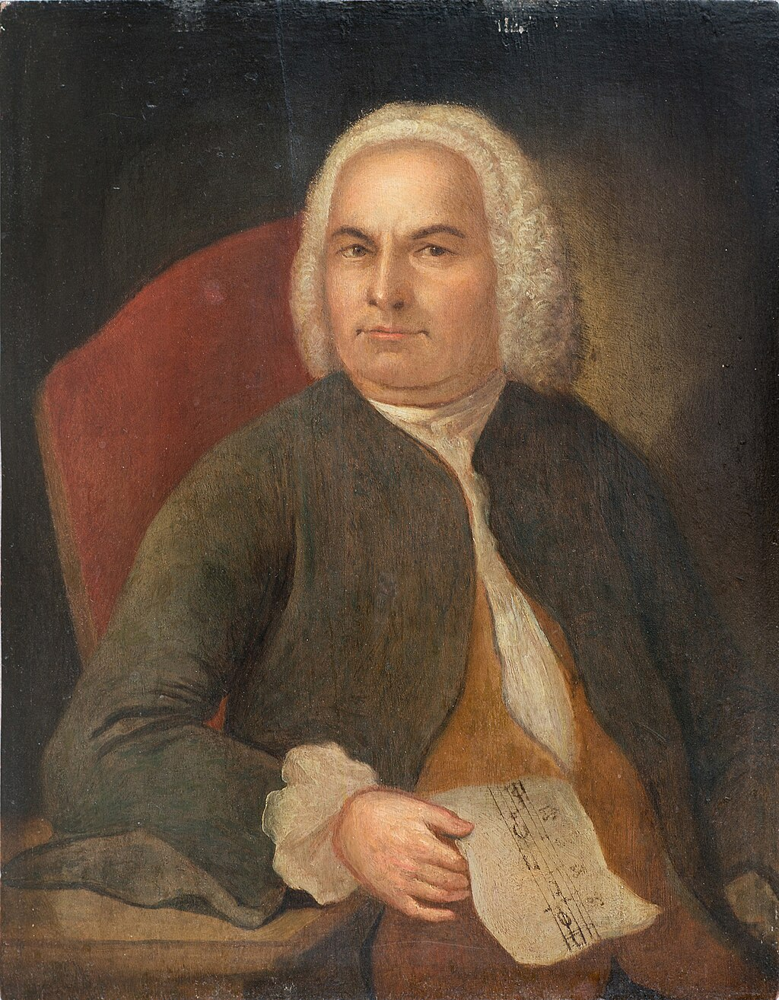Painting of Bach by 'Gebel', before 1798

Through the later half of the 18th century, [Carl Philipp Emanuel Bach](https://en.wikipedia.org/wiki/Carl_Philipp_Emanuel_Bach "Carl Philipp Emanuel Bach")'s reputation was very high, surpassing his father's. Haydn, Mozart, and Beethoven admired him and "avidly" collected his music. Mozart said of Carl Philipp Emanuel, "Bach is the father, we are the children." But throughout his life, Carl Philipp Emanuel continued to recognize many aspects of his father's originality in his own compositions, which were often received in preference to his father's after his father died.

In his own time, Bach was highly regarded by his colleagues, but his reputation outside this small circle of connoisseurs was due not to his compositions (which had an extremely narrow circulation), but to his virtuosic abilities. Nevertheless, during his life, Bach received public recognition, such as the title of court composer by [Augustus III of Poland](https://en.wikipedia.org/wiki/Augustus_III_of_Poland "Augustus III of Poland") and the appreciation he was shown by [Frederick the Great](https://en.wikipedia.org/wiki/Frederick_the_Great "Frederick the Great") and [Hermann Karl von Keyserling](https://en.wikipedia.org/wiki/Hermann_Karl_von_Keyserling "Hermann Karl von Keyserling"). This appreciation contrasted with the humiliations he faced, for instance, in Leipzig. Bach also had detractors in the contemporary press ([Johann Adolf Scheibe](https://en.wikipedia.org/wiki/Johann_Adolf_Scheibe "Johann Adolf Scheibe") suggested he write less complex music) and supporters, such as [Johann Mattheson](https://en.wikipedia.org/wiki/Johann_Mattheson "Johann Mattheson") and [Lorenz Christoph Mizler](https://en.wikipedia.org/wiki/Lorenz_Christoph_Mizler "Lorenz Christoph Mizler"). After his death, Bach's reputation as a composer initially declined: his work was regarded as old-fashioned compared to the emerging [galant](https://en.wikipedia.org/wiki/Galant_music "Galant music") style. He was remembered more as a virtuoso organ player and a teacher. The bulk of the music [printed during his lifetime](https://en.wikipedia.org/wiki/List_of_compositions_by_Johann_Sebastian_Bach_printed_during_his_lifetime "List of compositions by Johann Sebastian Bach printed during his lifetime") was for organ or harpsichord.

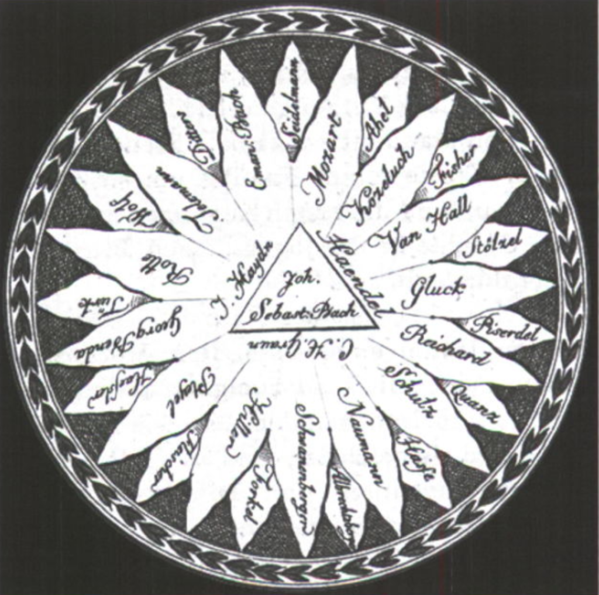[Augustus Frederic Christopher Kollmann](https://en.wikipedia.org/wiki/Augustus_Frederic_Christopher_Kollmann "Augustus Frederic Christopher Kollmann")'s diagram of Bach as the centre of the musical universe, included by [Johann Nikolaus Forkel](https://en.wikipedia.org/wiki/Johann_Nikolaus_Forkel "Johann Nikolaus Forkel") in the _Allgemeine Musikalische Zeitung_ in October 1799

Bach's surviving family members, who inherited many of his manuscripts, were not all equally concerned with preserving them, leading to considerable losses. Carl Philipp Emanuel was most active in safeguarding his father's legacy: he co-authored his father's obituary, contributed to the publication of his four-part chorales, presented some of his works, and helped preserve the bulk of his previously unpublished work. In 1805, [Abraham Mendelssohn](https://en.wikipedia.org/wiki/Abraham_Mendelssohn "Abraham Mendelssohn"), who had married one of the granddaughters of [Daniel Itzig](https://en.wikipedia.org/wiki/Daniel_Itzig "Daniel Itzig") (an official of Frederick the Great who venerated Bach), bought a substantial collection of Bach manuscripts that had come down from C. P. E. Bach, and donated it to the [Berlin Sing-Akademie](https://en.wikipedia.org/wiki/Sing-Akademie_zu_Berlin "Sing-Akademie zu Berlin"). Wilhelm Friedemann, the eldest son, performed several of his father's cantatas in [Halle](https://en.wikipedia.org/wiki/Halle_\(Saale\) "Halle (Saale)") but, after becoming unemployed, sold part of his large collection of his father's works. Several of [Bach's students](https://en.wikipedia.org/wiki/List_of_students_of_Johann_Sebastian_Bach "List of students of Johann Sebastian Bach"), such as his son-in-law [Johann Christoph Altnickol](https://en.wikipedia.org/wiki/Johann_Christoph_Altnickol "Johann Christoph Altnickol"), [Johann Friedrich Agricola](https://en.wikipedia.org/wiki/Johann_Friedrich_Agricola "Johann Friedrich Agricola"), [Johann Kirnberger](https://en.wikipedia.org/wiki/Johann_Kirnberger "Johann Kirnberger"), and [Johann Ludwig Krebs](https://en.wikipedia.org/wiki/Johann_Ludwig_Krebs "Johann Ludwig Krebs"), contributed to the dissemination of his legacy. The early devotees were not all musicians; for example, Itzig, a high official, was not. His eldest daughters took lessons from Kirnberger and their sister Sara from Wilhelm Friedemann Bach, who was in Berlin from 1774 to 1784. [Sara Itzig Levy](https://en.wikipedia.org/wiki/Sara_Levy_\(née_Itzig\) "Sara Levy (née Itzig)") became an avid collector of work by J. S. Bach and his sons and a patron of C. P. E. Bach.

While Bach was in Leipzig, performances of his church music were limited to some of his motets and, under his student cantor [Johann Friedrich Doles](https://en.wikipedia.org/wiki/Johann_Friedrich_Doles "Johann Friedrich Doles"), some of [his Passions](https://en.wikipedia.org/wiki/Passions_\(Bach\) "Passions (Bach)"). A new generation of Bach aficionados emerged who studiously collected and copied his music, including some of his large-scale works, such as the [Mass in B minor](https://en.wikipedia.org/wiki/Mass_in_B_minor "Mass in B minor"), and performed them privately. One was [Gottfried van Swieten](https://en.wikipedia.org/wiki/Gottfried_van_Swieten "Gottfried van Swieten"), a high-ranking Austrian official who was instrumental in passing Bach's legacy on to the composers of the [Viennese school](https://en.wikipedia.org/wiki/First_Viennese_School "First Viennese School"). [Haydn](https://en.wikipedia.org/wiki/Joseph_Haydn "Joseph Haydn") owned manuscript copies of _The Well-Tempered Clavier_ and the Mass in B minor and was influenced by Bach's music. [Wolfgang Amadeus Mozart](https://en.wikipedia.org/wiki/Wolfgang_Amadeus_Mozart "Wolfgang Amadeus Mozart") owned a copy of one of Bach's motets, transcribed some of his instrumental works (Preludes and Fugues for Violin, Viola and Cello, K. 404a (1782), Fugues for 2 Violins, Viola and Cello, K. 405 (1782)), and wrote contrapuntal music influenced by his style. [Ludwig van Beethoven](https://en.wikipedia.org/wiki/Ludwig_van_Beethoven "Ludwig van Beethoven") had learned _The Well-Tempered Clavier_ in its entirety by the time he was 11 in 1781 and called Bach the _Urvater der Harmonie_ (progenitor of harmony).

### 19th century

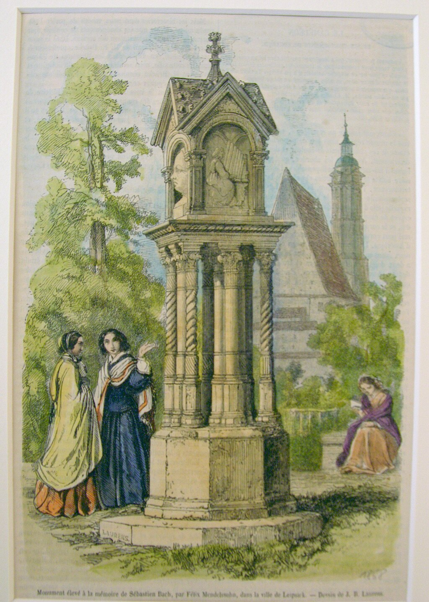Image of the [Old Bach Monument](https://en.wikipedia.org/wiki/Old_Bach_Monument "Old Bach Monument") donated by Felix Mendelssohn, designed by [Eduard Bendemann](https://en.wikipedia.org/wiki/Eduard_Bendemann "Eduard Bendemann"), [Ernst Rietschel](https://en.wikipedia.org/wiki/Ernst_Rietschel "Ernst Rietschel"), and [Julius Hübner](https://en.wikipedia.org/wiki/Julius_Hübner "Julius Hübner") in Leipzig in 1843

In 1802 [Johann Nikolaus Forkel](https://en.wikipedia.org/wiki/Johann_Nikolaus_Forkel "Johann Nikolaus Forkel") published _[Johann Sebastian Bach: His Life, Art, and Work](https://en.wikipedia.org/wiki/Johann_Sebastian_Bach:_His_Life,_Art,_and_Work "Johann Sebastian Bach: His Life, Art, and Work")_, the first Bach biography, dedicated to van Swieten. In 1805, [Abraham Mendelssohn](https://en.wikipedia.org/wiki/Abraham_Mendelssohn "Abraham Mendelssohn") bought a substantial collection of Bach manuscripts that had come down from C. P. E. Bach, and donated it to the Berlin Sing-Akademie. The Sing-Akademie occasionally performed Bach's works in public concerts, for instance, his [first keyboard concerto](https://en.wikipedia.org/wiki/BWV_1052 "BWV 1052"), with Sara Itzig Levy at the piano. Since the 19th-century [Bach Revival](https://en.wikipedia.org/wiki/Reception_of_Johann_Sebastian_Bach's_music "Reception of Johann Sebastian Bach's music"), he has been widely regarded as one of the greatest composers in the history of Western music.

The first decades of the 19th century saw an increasing number of first publications of Bach's music: [Breitkopf & Härtel](https://en.wikipedia.org/wiki/Breitkopf_&_Härtel "Breitkopf & Härtel") started publishing chorale preludes, Hoffmeister harpsichord music, and _The Well-Tempered Clavier_ was printed concurrently by [N. Simrock](https://en.wikipedia.org/wiki/N._Simrock "N. Simrock") (Germany), [Hans Georg Nägeli](https://en.wikipedia.org/wiki/Hans_Georg_Nägeli "Hans Georg Nägeli") (Switzerland) and [Franz Anton Hoffmeister](https://en.wikipedia.org/wiki/Franz_Anton_Hoffmeister "Franz Anton Hoffmeister") (Germany and Austria) in 1801. Vocal music was also published: motets in 1802 and 1803, followed by the [E♭ major version of the Magnificat](https://en.wikipedia.org/wiki/Magnificat_in_E-flat_major,_BWV_243a "Magnificat in E-flat major, BWV 243a"), the [Kyrie-Gloria Mass in A major](https://en.wikipedia.org/wiki/BWV_234 "BWV 234"), and the cantata [_Ein feste Burg ist unser Gott_, BWV 80](https://en.wikipedia.org/wiki/Ein_feste_Burg_ist_unser_Gott,_BWV_80 "Ein feste Burg ist unser Gott, BWV 80"). In 1818 the publisher Hans Georg Nägeli called the Mass in B minor the greatest composition ever. Bach's influence was felt in the next generation of early Romantic composers. Abraham's son Felix, aged 13, produced his first Magnificat setting in 1822, and it is clearly inspired by the then-unpublished D major version of Bach's Magnificat.

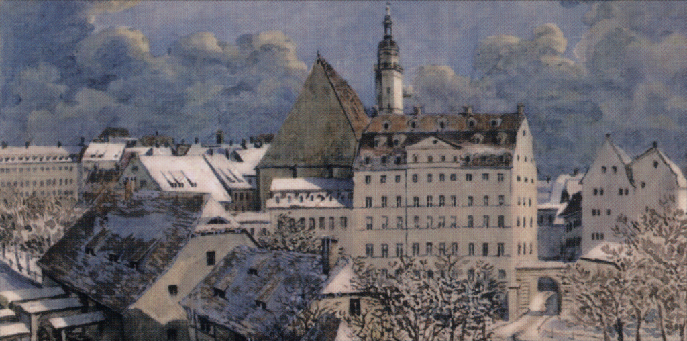Felix Mendelssohn's watercolor of the Thomaskantorei, 1838

[Felix Mendelssohn](https://en.wikipedia.org/wiki/Felix_Mendelssohn "Felix Mendelssohn")'s 1829 performance of the _[St. Matthew Passion](https://en.wikipedia.org/wiki/St._Matthew_Passion "St. Matthew Passion")_ precipitated the Bach Revival. The _[St. John Passion](https://en.wikipedia.org/wiki/St._John_Passion "St. John Passion")_ saw its 19th-century premiere in 1833, and the first public performance of the Mass in B minor followed in 1844. Besides these and other public performances and increased coverage of the composer and his compositions in printed media, the 1830s and 1840s also saw the first publication of more Bach vocal works: six cantatas, the _St. Matthew Passion_, and the Mass in B minor. A series of organ compositions were first published in 1833. [Frédéric Chopin](https://en.wikipedia.org/wiki/Frédéric_Chopin "Frédéric Chopin") started composing his [24 Preludes, Op. 28](https://en.wikipedia.org/wiki/24_Preludes,_Op._28_\(Chopin\) "24 Preludes, Op. 28 (Chopin)"), inspired by _The Well-Tempered Clavier_, in 1835, and [Robert Schumann](https://en.wikipedia.org/wiki/Robert_Schumann "Robert Schumann") published his _Sechs Fugen über den Namen BACH_ in 1845. Bach's music was transcribed and arranged to suit contemporary tastes and performance practice by composers such as [Carl Friedrich Zelter](https://en.wikipedia.org/wiki/Carl_Friedrich_Zelter "Carl Friedrich Zelter"), [Robert Franz](https://en.wikipedia.org/wiki/Robert_Franz "Robert Franz"), and [Franz Liszt](https://en.wikipedia.org/wiki/Franz_Liszt "Franz Liszt"), or combined with new music such as the melody line of [Charles Gounod](https://en.wikipedia.org/wiki/Charles_Gounod "Charles Gounod")'s "[Ave Maria](https://en.wikipedia.org/wiki/Ave_Maria_\(Bach/Gounod\) "Ave Maria (Bach/Gounod)")". Liszt developed an interest in J. S. Bach's organ music in the early 1840s, probably due to Mendelssohn's influence, and commissioned a "piano-organ" from the Paris company Alexandre Père et Fils. The instrument was made in 1854 under Berlioz's supervision, using an 1853 Érard piano, and was a combination of piano and harmonium with three manuals and a pedal board; Liszt later transcribed works by Bach such as his [Great Fantasia and Fugue in G minor, BWV 542](https://en.wikipedia.org/wiki/Great_Fantasia_and_Fugue_in_G_minor,_BWV_542 "Great Fantasia and Fugue in G minor, BWV 542") for solo piano performance as [S.463](https://en.wikipedia.org/wiki/List_of_compositions_by_Franz_Liszt_\(S.351_-_S.999\) "List of compositions by Franz Liszt (S.351 - S.999)").

In 1850 the _[Bach-Gesellschaft](https://en.wikipedia.org/wiki/Bach_Gesellschaft "Bach Gesellschaft")_ (Bach Society) was founded to promote Bach's music. The Society chose [_Wie schön leuchtet der Morgenstern_, BWV 1](https://en.wikipedia.org/wiki/Wie_schön_leuchtet_der_Morgenstern,_BWV_1 "Wie schön leuchtet der Morgenstern, BWV 1") as the first composition in the first volume of the [Bach-Gesellschaft Ausgabe](https://en.wikipedia.org/wiki/Bach-Gesellschaft_Ausgabe "Bach-Gesellschaft Ausgabe") (BGA). [Robert Schumann](https://en.wikipedia.org/wiki/Robert_Schumann "Robert Schumann"), the publisher of the _[Neue Zeitschrift für Musik](https://en.wikipedia.org/wiki/Neue_Zeitschrift_für_Musik "Neue Zeitschrift für Musik")_, Thomaskantor [Moritz Hauptmann](https://en.wikipedia.org/wiki/Moritz_Hauptmann "Moritz Hauptmann"), and the philologist [Otto Jahn](https://en.wikipedia.org/wiki/Otto_Jahn "Otto Jahn") initiated this first complete edition of Bach's works a century after his death. Its first volume was published in 1851, edited by Hauptmann. In the second half of the 19th century, the Society published a comprehensive edition of his works. In 1854, Bach was deemed one of the [Three Bs](https://en.wikipedia.org/wiki/Three_Bs "Three Bs") by [Peter Cornelius](https://en.wikipedia.org/wiki/Peter_Cornelius "Peter Cornelius"), the others being Beethoven and [Berlioz](https://en.wikipedia.org/wiki/Berlioz "Berlioz"). ([Hans von Bülow](https://en.wikipedia.org/wiki/Hans_von_Bülow "Hans von Bülow") later replaced Berlioz with [Brahms](https://en.wikipedia.org/wiki/Brahms "Brahms").) From 1873 to 1880 [Philipp Spitta](https://en.wikipedia.org/wiki/Philipp_Spitta "Philipp Spitta") published _[Johann Sebastian Bach](https://en.wikipedia.org/wiki/Spitta's_Johann_Sebastian_Bach "Spitta's Johann Sebastian Bach")_, the standard work on Bach's life and music. During the 19th century, 200 books were published on Bach. By the end of the century, local Bach societies were established in several cities, and his music had been performed in all major musical centres. In 1870, [Friedrich Nietzsche](https://en.wikipedia.org/wiki/Friedrich_Nietzsche "Friedrich Nietzsche") wrote to [Erwin Rohde](https://en.wikipedia.org/wiki/Erwin_Rohde "Erwin Rohde"): "This week I heard the _St. Matthew Passion_ three times and each time I had the same feeling of immeasurable admiration. One who has completely forgotten Christianity truly hears it here as Gospel." In 19th-century Germany, Bach was coupled with nationalist feeling. In England, Bach was coupled with a revival of religious and Baroque music. By the end of the century, Bach was firmly established as one of the greatest composers, recognised for both his instrumental and his vocal music.

### 20th century

During the 20th century, recognition of the musical and [pedagogic](https://en.wikipedia.org/wiki/Pedagogy "Pedagogy") value of Bach's works continued, as in the promotion of the [Cello Suites](https://en.wikipedia.org/wiki/Cello_Suites_\(Bach\) "Cello Suites (Bach)") by [Pablo Casals](https://en.wikipedia.org/wiki/Pablo_Casals "Pablo Casals"), the first major performer to record them. [Claude Debussy](/source/claude-debussy/ "Claude Debussy") called Bach a "benevolent God" "to whom musicians should offer a prayer before setting to work so that they may be preserved from mediocrity." [Glenn Gould](https://en.wikipedia.org/wiki/Glenn_Gould "Glenn Gould")'s debut [1955 recording](https://en.wikipedia.org/wiki/Bach:_The_Goldberg_Variations_\(Glenn_Gould_album\) "Bach: The Goldberg Variations (Glenn Gould album)") of the _Goldberg Variations_ transformed the work from an obscure piece often considered "esoteric" to part of the standard piano repertoire. The album had "astonishing" sales for a classical work: it was reported to have sold 40,000 copies by 1960, and had sold more than 100,000 by the time of Gould's death in 1982. [Andres Segovia](https://en.wikipedia.org/wiki/Andres_Segovia "Andres Segovia") left behind a large body of edited works and transcriptions for classical guitar, notably a transcription of the [Chaconne](https://en.wikipedia.org/wiki/Chaconne "Chaconne") from the [2nd Partita for Violin (BWV 1004)](https://en.wikipedia.org/wiki/Partita_for_Violin_No._2_\(Bach\) "Partita for Violin No. 2 (Bach)").

A significant development in the later 20th century was [historically informed performance](https://en.wikipedia.org/wiki/Historically_informed_performance "Historically informed performance") practice, with forerunners such as [Nikolaus Harnoncourt](https://en.wikipedia.org/wiki/Nikolaus_Harnoncourt "Nikolaus Harnoncourt") acquiring prominence through their performances of Bach's music. Bach's keyboard music was again performed on the [harpsichord](https://en.wikipedia.org/wiki/Harpsichord "Harpsichord") and other Baroque instruments rather than on modern pianos and 19th-century romantic organs. Ensembles playing and singing Bach's music not only kept to the instruments and the performance style of his day but were also reduced to the size of the groups Bach used for his performances. But that was not the only way Bach's music came to the forefront in the 20th century: his music was heard in versions ranging from [Ferruccio Busoni](https://en.wikipedia.org/wiki/Ferruccio_Busoni "Ferruccio Busoni")'s late-romantic _[Bach-Busoni Editions](https://en.wikipedia.org/wiki/Bach-Busoni_Editions "Bach-Busoni Editions")_ for piano to the orchestrations of [Leopold Stokowski](https://en.wikipedia.org/wiki/Leopold_Stokowski "Leopold Stokowski"), whose interpretation of the [Toccata and Fugue in D minor](https://en.wikipedia.org/wiki/Toccata_and_Fugue_in_D_minor "Toccata and Fugue in D minor") opened [Disney](https://en.wikipedia.org/wiki/Walt_Disney_Productions "Walt Disney Productions")'s [_Fantasia_](https://en.wikipedia.org/wiki/Fantasia_\(1940_film\) "Fantasia (1940 film)") film.

Bach's music has influenced other genres. [Jazz](/source/jazz/ "Jazz") musicians have adapted it, with [Jacques Loussier](https://en.wikipedia.org/wiki/Jacques_Loussier "Jacques Loussier"), [Ian Anderson](https://en.wikipedia.org/wiki/Ian_Anderson "Ian Anderson"), [Uri Caine](https://en.wikipedia.org/wiki/Uri_Caine "Uri Caine"), and the [Modern Jazz Quartet](https://en.wikipedia.org/wiki/Modern_Jazz_Quartet "Modern Jazz Quartet") among those creating jazz versions of his works. Several 20th-century composers referred to Bach or his music, for example [Eugène Ysaÿe](https://en.wikipedia.org/wiki/Eugène_Ysaÿe "Eugène Ysaÿe") in [Six Sonatas for solo violin](https://en.wikipedia.org/wiki/Six_Sonatas_for_solo_violin_\(Ysaÿe\) "Six Sonatas for solo violin (Ysaÿe)"), [Dmitri Shostakovich](https://en.wikipedia.org/wiki/Dmitri_Shostakovich "Dmitri Shostakovich") in [24 Preludes and Fugues](https://en.wikipedia.org/wiki/24_Preludes_and_Fugues_\(Shostakovich\) "24 Preludes and Fugues (Shostakovich)"), and [Heitor Villa-Lobos](https://en.wikipedia.org/wiki/Heitor_Villa-Lobos "Heitor Villa-Lobos") in _[Bachianas Brasileiras](https://en.wikipedia.org/wiki/Bachianas_Brasileiras "Bachianas Brasileiras")_ (tr. _Bach-inspired Brazilian pieces_). A wide variety of publications involved Bach: there were the _Bach Jahrbuch_ publications of the _Neue Bachgesellschaft_ and various other biographies and studies by, among others, [Albert Schweitzer](https://en.wikipedia.org/wiki/Albert_Schweitzer "Albert Schweitzer"), [Charles Sanford Terry](https://en.wikipedia.org/wiki/Charles_Sanford_Terry_\(historian\) "Charles Sanford Terry (historian)"), [Alfred Dürr](https://en.wikipedia.org/wiki/Alfred_Dürr "Alfred Dürr"), [Christoph Wolff](https://en.wikipedia.org/wiki/Christoph_Wolff "Christoph Wolff"), [Peter Williams](https://en.wikipedia.org/wiki/Peter_Williams_\(musicologist\) "Peter Williams (musicologist)"), and [John Butt](https://en.wikipedia.org/wiki/John_Butt_\(musician\) "John Butt (musician)"), and the 1950 first edition of the [Bach-Werke-Verzeichnis](https://en.wikipedia.org/wiki/Bach-Werke-Verzeichnis "Bach-Werke-Verzeichnis"). Books such as _[Gödel, Escher, Bach](https://en.wikipedia.org/wiki/Gödel,_Escher,_Bach "Gödel, Escher, Bach")_ put the composer's art in a wider perspective. Bach's music was extensively listened to, performed, broadcast, arranged, adapted, and commented upon in the 1990s. Around 2000, the 250th anniversary of Bach's death, three record companies issued box sets of recordings of his complete works.

Three works by Bach are featured on the [Voyager Golden Records](https://en.wikipedia.org/wiki/Voyager_Golden_Record "Voyager Golden Record"), gramophone records containing a broad sample of the images, sounds, languages, and music of Earth, sent into space with the two [Voyager](https://en.wikipedia.org/wiki/Voyager_program "Voyager program") probes: the first movement of [_Brandenburg Concerto_ No. 2](https://en.wikipedia.org/wiki/Brandenburg_Concertos "Brandenburg Concertos") (conducted by [Karl Richter](https://en.wikipedia.org/wiki/Karl_Richter_\(conductor\) "Karl Richter (conductor)")), the "Gavotte en rondeaux" from the [Partita for Violin No. 3](https://en.wikipedia.org/wiki/Partita_for_Violin_No._3_\(Bach\) "Partita for Violin No. 3 (Bach)") (played by [Arthur Grumiaux](https://en.wikipedia.org/wiki/Arthur_Grumiaux "Arthur Grumiaux")), and the Prelude and Fugue No. 1 in C major from _The Well-Tempered Clavier_ (played by Glenn Gould). Twentieth-century tributes to Bach include statues erected in his honour and things such as streets and space objects named after him. A multitude of musical ensembles, such as the [Bach Aria Group](https://en.wikipedia.org/wiki/Bach_Aria_Group "Bach Aria Group"), _[Deutsche Bachsolisten](https://en.wikipedia.org/wiki/Deutsche_Bachsolisten "Deutsche Bachsolisten")_, [Bachchor Stuttgart](https://en.wikipedia.org/wiki/Bachchor_Stuttgart "Bachchor Stuttgart"), and [Bach Collegium Japan](https://en.wikipedia.org/wiki/Bach_Collegium_Japan "Bach Collegium Japan") took the composer's name. [Bach festivals](https://en.wikipedia.org/wiki/Bach_festival "Bach festival") were held on several continents, and competitions and prizes such as the [International Johann Sebastian Bach Competition](https://en.wikipedia.org/wiki/International_Johann_Sebastian_Bach_Competition "International Johann Sebastian Bach Competition"), Johann Sebastian Bach International Piano Competition ([Washington D.C.](https://en.wikipedia.org/wiki/Washington,_D.C. "Washington, D.C.")), and the [Royal Academy of Music Bach Prize](https://en.wikipedia.org/wiki/Royal_Academy_of_Music_Bach_Prize "Royal Academy of Music Bach Prize") were named after him. While by the end of the 19th century, Bach had been inscribed in nationalism and religious revival, the late 20th century saw Bach as the subject of a secularised art-as-religion (_[Kunstreligion](https://en.wikipedia.org/wiki/Kunstreligion "Kunstreligion")_).

*   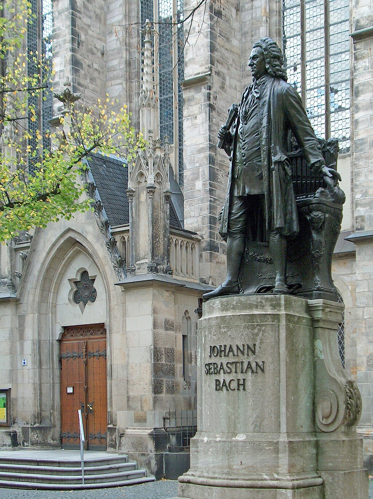

    1908 [Statue of Bach](https://en.wikipedia.org/wiki/Statue_of_J._S._Bach "Statue of J. S. Bach") in front of the Thomaskirche in Leipzig

*   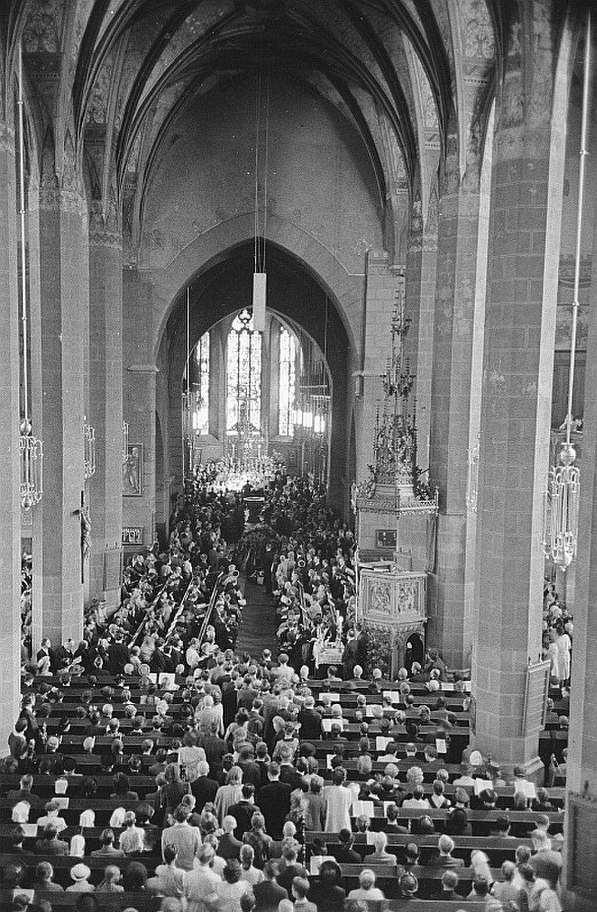

    28 July 1950: memorial service for Bach in Leipzig's Thomaskirche, on the 200th anniversary of the composer's death

### 21st century

In the 21st century Bach's compositions have become available online, for instance at the [International Music Score Library Project](https://en.wikipedia.org/wiki/International_Music_Score_Library_Project "International Music Score Library Project"). High-resolution facsimiles of Bach's autographs became available at the [Bach Digital](https://en.wikipedia.org/wiki/Bach_Digital "Bach Digital") website. 21st-century biographers include [Christoph Wolff](https://en.wikipedia.org/wiki/Christoph_Wolff "Christoph Wolff"), [Peter Williams](https://en.wikipedia.org/wiki/Peter_Williams_\(musicologist\) "Peter Williams (musicologist)"), and [John Eliot Gardiner](https://en.wikipedia.org/wiki/John_Eliot_Gardiner "John Eliot Gardiner"). In 2011 [Anthony Tommasini](https://en.wikipedia.org/wiki/Anthony_Tommasini "Anthony Tommasini"), chief classical music critic of _[The New York Times](https://en.wikipedia.org/wiki/The_New_York_Times "The New York Times")_, ranked Bach the greatest composer of all time, "for his matchless combination of masterly musical engineering (as one reader put it) and profound expressivity. Since writing about Bach in the first article of this series I have been thinking more about the perception that he was considered old-fashioned in his day. Haydn was 18 when Bach died, in 1750, and Classicism was stirring. Bach was surely aware of the new trends. Yet he reacted by digging deeper into his way of doing things. In his austerely beautiful _Art of Fugue,_ left incomplete at his death, Bach reduced complex counterpoint to its bare essentials, not even indicating the instrument (or instruments) for which these works were composed... through his chorales alone Bach explored the far reaches of tonal harmony."

[Alex Ross](https://en.wikipedia.org/wiki/Alex_Ross_\(music_critic\) "Alex Ross (music critic)") wrote, "Bach became an absolute master of his art by never ceasing to be a student of it. His most exalted sacred works—the two extant Passions, from the seventeen-twenties, and the Mass in B Minor, completed not long before his death in 1750—are feats of synthesis, mobilizing secular devices to spiritual ends. They are rooted in archaic chants, hymns, and chorales. They honour, with consummate skill, the scholastic discipline of canon and fugue... Their furious development of brief motifs anticipates Beethoven, who worshipped Bach when he was young. And their most daring harmonic adventures—for example, the otherworldly modulations in the 'Confiteor' of the B-Minor Mass—look ahead to [Wagner](https://en.wikipedia.org/wiki/Wagner "Wagner"), even to [Schoenberg](https://en.wikipedia.org/wiki/Schoenberg "Schoenberg")." The [liturgical calendar of the Episcopal Church](https://en.wikipedia.org/wiki/Calendar_of_saints_\(Episcopal_Church\) "Calendar of saints (Episcopal Church)") has a [feast day](https://en.wikipedia.org/wiki/Feast_day "Feast day") for Bach on 28 July; on the same day, the [Calendar of Saints](https://en.wikipedia.org/wiki/Calendar_of_saints_\(Lutheran\) "Calendar of saints (Lutheran)") of some [Lutheran churches](https://en.wikipedia.org/wiki/Lutheran_church "Lutheran church"), such as the [ELCA](https://en.wikipedia.org/wiki/Evangelical_Lutheran_Church_in_America "Evangelical Lutheran Church in America"), remembers Bach, Handel, and [Heinrich Schütz](https://en.wikipedia.org/wiki/Heinrich_Schütz "Heinrich Schütz"). As of 2013 over 150 recordings have been made of _The Well-Tempered Clavier_. In 2015 Bach's handwritten personal copy of the Mass in B minor, held by the [Berlin State Library](https://en.wikipedia.org/wiki/Berlin_State_Library "Berlin State Library"), was added to [UNESCO](https://en.wikipedia.org/wiki/UNESCO "UNESCO")'s [Memory of the World Register](https://en.wikipedia.org/wiki/Memory_of_the_World_Programme#Memory_of_the_World_Register "Memory of the World Programme"). On 21 March 2019, Bach was celebrated in an interactive [Google Doodle](https://en.wikipedia.org/wiki/Google_Doodle "Google Doodle") that used machine learning to synthesize a tune in his signature style.
