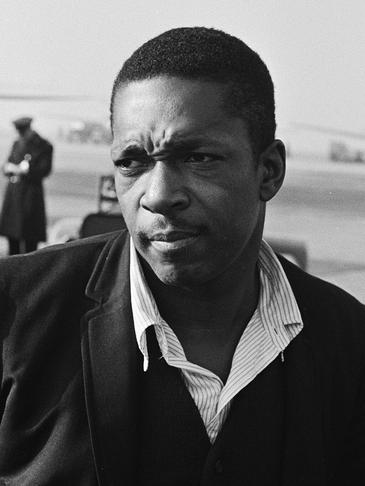
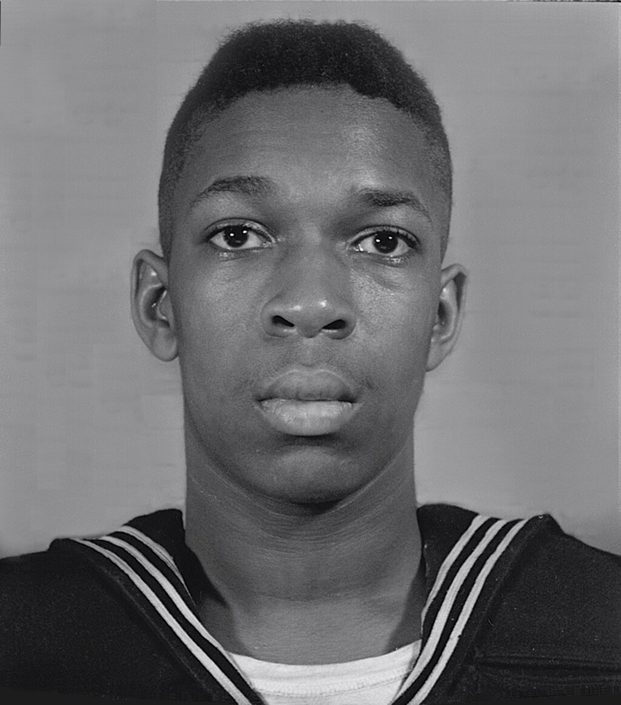
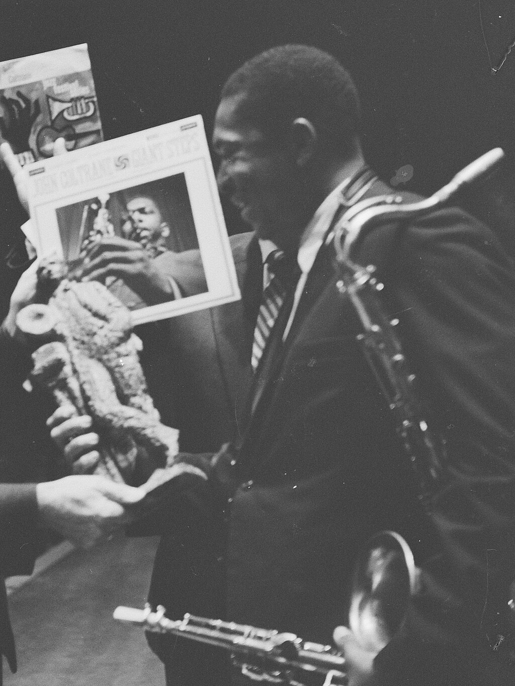
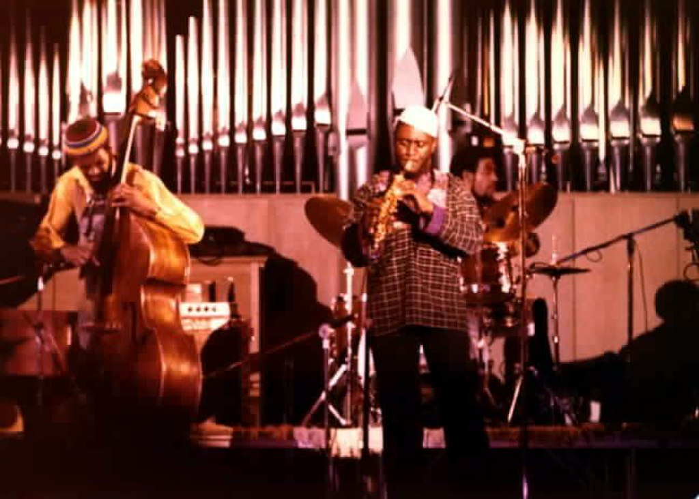
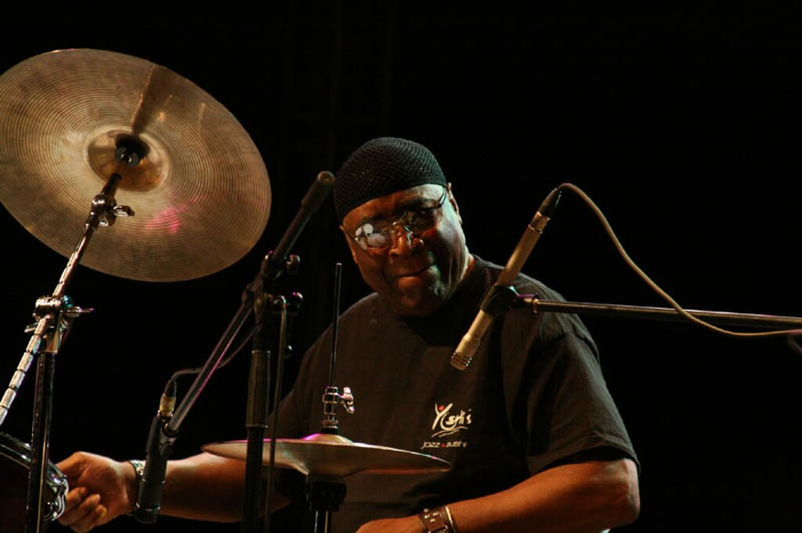
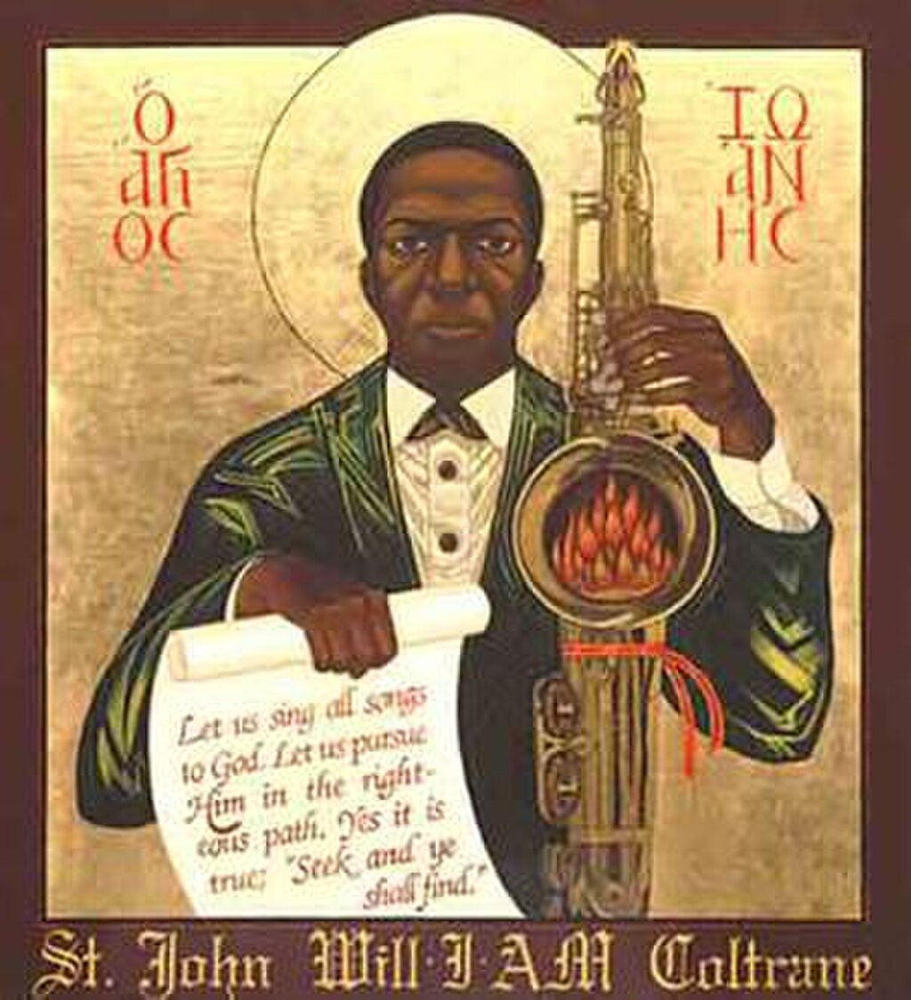
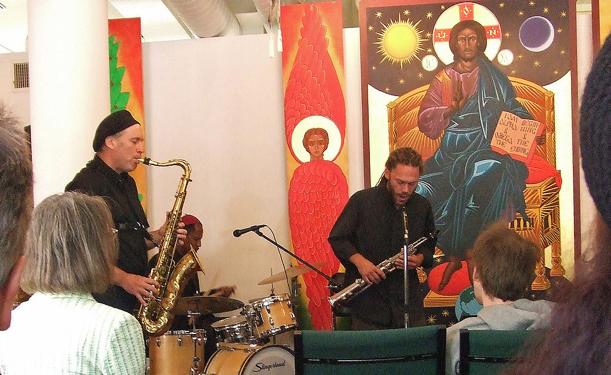
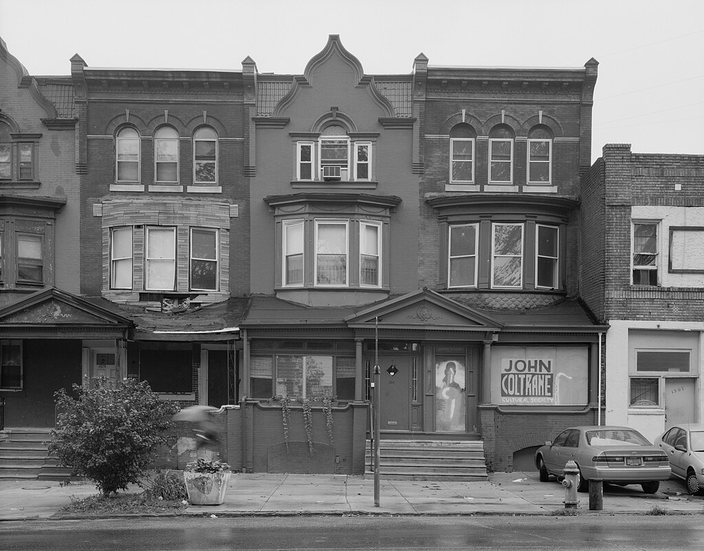

John Coltrane

Coltrane in 1963

Background information

Also known as

Trane

Born

John William Coltrane

(1926-09-23)September 23, 1926

[Hamlet, North Carolina](https://en.wikipedia.org/wiki/Hamlet,_North_Carolina "Hamlet, North Carolina"), U.S.

Died

July 17, 1967(1967-07-17) (aged 40)

[Huntington, New York](https://en.wikipedia.org/wiki/Huntington,_New_York "Huntington, New York"), U.S.

Genres

*   [Jazz](/source/jazz/ "Jazz")
*   [hard bop](https://en.wikipedia.org/wiki/Hard_bop "Hard bop")
*   [spiritual jazz](https://en.wikipedia.org/wiki/Spiritual_jazz "Spiritual jazz")
*   [post-bop](https://en.wikipedia.org/wiki/Post-bop "Post-bop")
*   [modal jazz](https://en.wikipedia.org/wiki/Modal_jazz "Modal jazz")
*   [avant-garde jazz](https://en.wikipedia.org/wiki/Avant-garde_jazz "Avant-garde jazz")
*   [free jazz](https://en.wikipedia.org/wiki/Free_jazz "Free jazz")

Occupations

*   Musician
*   composer
*   bandleader

Instruments

*   [Tenor saxophone](https://en.wikipedia.org/wiki/Tenor_saxophone "Tenor saxophone")
*   [soprano saxophone](https://en.wikipedia.org/wiki/Soprano_saxophone "Soprano saxophone")
*   [alto saxophone](https://en.wikipedia.org/wiki/Alto_saxophone "Alto saxophone")
*   [flute](https://en.wikipedia.org/wiki/Western_concert_flute "Western concert flute")
*   [bass clarinet](https://en.wikipedia.org/wiki/Bass_clarinet "Bass clarinet")

Works

Years active

1945–1967

Labels

*   [Prestige](https://en.wikipedia.org/wiki/Prestige_Records "Prestige Records")
*   [Blue Note](https://en.wikipedia.org/wiki/Blue_Note_Records "Blue Note Records")
*   [Atlantic](https://en.wikipedia.org/wiki/Atlantic_Records "Atlantic Records")
*   [Impulse!](https://en.wikipedia.org/wiki/Impulse!_Records "Impulse! Records")

Spouse

*   *

    Juanita Naima Coltrane

    ​

    ​

    (m. 1953; div. 1966)​

    *

    [Alice Coltrane](https://en.wikipedia.org/wiki/Alice_Coltrane "Alice Coltrane")

    ​

    (m. 1966)​

Website

[www.johncoltrane.com](https://www.johncoltrane.com/)

Military career

Allegiance

United States

Branch

[United States Navy](https://en.wikipedia.org/wiki/United_States_Navy "United States Navy")

Service years

1945–1946

Rank

[Seaman first class](https://en.wikipedia.org/wiki/Seaman_\(rank\)#United_States "Seaman (rank)")

Unit

*   [Naval Station Pearl Harbor](https://en.wikipedia.org/wiki/Naval_Station_Pearl_Harbor "Naval Station Pearl Harbor")
*   [Pacific Fleet Ceremonial Band](https://en.wikipedia.org/wiki/Pacific_Fleet_Band "Pacific Fleet Band")

Conflicts

*   [World War II](https://en.wikipedia.org/wiki/World_War_II "World War II")
    *   [Pacific Theater](https://en.wikipedia.org/wiki/Pacific_War "Pacific War")

Awards

*   [American Campaign Medal](https://en.wikipedia.org/wiki/American_Campaign_Medal "American Campaign Medal")
*   [Asiatic–Pacific Campaign Medal](https://en.wikipedia.org/wiki/Asiatic–Pacific_Campaign_Medal "Asiatic–Pacific Campaign Medal")
*   [World War II Victory Medal](https://en.wikipedia.org/wiki/World_War_II_Victory_Medal "World War II Victory Medal")

**John William Coltrane** (September 23, 1926 – July 17, 1967) was an American [jazz](/source/jazz/ "Jazz") saxophonist, bandleader, and composer. He is among the most influential and acclaimed figures in the [history of jazz](/source/jazz/#Post-war_jazz "Jazz") and 20th-century music.

Born and raised in [North Carolina](https://en.wikipedia.org/wiki/North_Carolina "North Carolina"), Coltrane moved to [Philadelphia](https://en.wikipedia.org/wiki/Philadelphia "Philadelphia") after high school, where he immersed himself in the local jazz scene, studied music, and served in the [Navy](https://en.wikipedia.org/wiki/United_States_Navy "United States Navy") toward the end of [World War II](https://en.wikipedia.org/wiki/World_War_II "World War II") before making his professional debut in 1945. Working in the [bebop](https://en.wikipedia.org/wiki/Bebop "Bebop") and [hard bop](https://en.wikipedia.org/wiki/Hard_bop "Hard bop") idioms early in his career, Coltrane helped pioneer the use of [modes](https://en.wikipedia.org/wiki/Modal_jazz "Modal jazz") and was one of the players at the forefront of [free jazz](https://en.wikipedia.org/wiki/Free_jazz "Free jazz"). He led at least fifty recording sessions and appeared on many albums by other musicians, including trumpeter [Miles Davis](/source/miles-davis/ "Miles Davis") and pianist [Thelonious Monk](https://en.wikipedia.org/wiki/Thelonious_Monk "Thelonious Monk"). Over the course of his career, Coltrane's music took on an increasingly spiritual dimension, as exemplified on his most acclaimed album _[A Love Supreme](https://en.wikipedia.org/wiki/A_Love_Supreme "A Love Supreme")_ (1965) and others. Decades after his death, Coltrane remains influential, and he has received numerous posthumous awards, including a [special Pulitzer Prize](https://en.wikipedia.org/wiki/Pulitzer_Prize_Special_Citations_and_Awards "Pulitzer Prize Special Citations and Awards"), and was [canonized](https://en.wikipedia.org/wiki/Canonization "Canonization") by the [African Orthodox Church](https://en.wikipedia.org/wiki/African_Orthodox_Church "African Orthodox Church").

His second wife was pianist and harpist [Alice Coltrane](https://en.wikipedia.org/wiki/Alice_Coltrane "Alice Coltrane"). The couple had three children: John Jr. (1964–1982), a bassist; [Ravi](https://en.wikipedia.org/wiki/Ravi_Coltrane "Ravi Coltrane") (born 1965), a saxophonist; and Oran (born 1967), a saxophonist, guitarist, drummer, and singer.

## Biography

### 1926–1945: Early life

Coltrane's first recordings were made when he was a sailor

Coltrane was born in his parents' apartment at 200 Hamlet Avenue in [Hamlet, North Carolina](https://en.wikipedia.org/wiki/Hamlet,_North_Carolina "Hamlet, North Carolina"), on September 23, 1926. His father was John R. Coltrane and his mother was Alice Blair. He grew up in [High Point, North Carolina](https://en.wikipedia.org/wiki/High_Point,_North_Carolina "High Point, North Carolina"), and attended [William Penn High School](https://en.wikipedia.org/wiki/William_Penn_High_School_\(North_Carolina\) "William Penn High School (North Carolina)"). While in high school, Coltrane played [clarinet](https://en.wikipedia.org/wiki/Clarinet "Clarinet") and [alto horn](https://en.wikipedia.org/wiki/Tenor_horn "Tenor horn") in a community band before switching to the saxophone, after being influenced by the likes of [Lester Young](https://en.wikipedia.org/wiki/Lester_Young "Lester Young") and [Johnny Hodges](https://en.wikipedia.org/wiki/Johnny_Hodges "Johnny Hodges"). Beginning in December 1938, his father, aunt, and grandparents died within a few months of one another, leaving him to be raised by his mother and a close cousin. In June 1943, shortly after graduating from high school, Coltrane and his family moved to Philadelphia, where he got a job at a [sugar refinery](https://en.wikipedia.org/wiki/Sugar_refinery "Sugar refinery"). In September that year, for his 17th birthday, his mother bought him his first saxophone, an alto. From 1944 to 1945, Coltrane took saxophone lessons at the Ornstein School of Music with Mike Guerra. Between early to mid-1945, he had his first professional work as a musician: a "cocktail lounge trio" with [piano](https://en.wikipedia.org/wiki/Piano "Piano") and [guitar](https://en.wikipedia.org/wiki/Electric_guitar "Electric guitar").

An important moment in the progression of Coltrane's musical development occurred on June 5, 1945, when he saw [Charlie Parker](https://en.wikipedia.org/wiki/Charlie_Parker "Charlie Parker") perform for the first time. In a 1960 _[DownBeat](https://en.wikipedia.org/wiki/DownBeat "DownBeat")_ magazine article, he recalled: "the first time I heard Bird play, it hit me right between the eyes."

### 1945–1946: Military service

To avoid being drafted by the Army, Coltrane enlisted in the Navy on August 6, 1945, the day the first U.S. atomic bomb was dropped on Japan. He was trained as an apprentice seaman at [Sampson Naval Training Station](https://en.wikipedia.org/wiki/Sampson_Air_Force_Base "Sampson Air Force Base") in upstate New York before he was shipped to [Pearl Harbor](https://en.wikipedia.org/wiki/Pearl_Harbor "Pearl Harbor"), where he was stationed at Manana Barracks, the largest posting of African American servicemen in the world. By the time he got to Hawaii in late 1945, the Navy was downsizing. Coltrane's musical talent was recognized and, when he joined the Melody Masters, the base swing band, he became one of the few Navy men to serve as a musician without having been granted musician's rating. Because the Melody Masters was an all-white band, Coltrane was treated as a guest performer to avoid alerting superior officers of his participation in the band. He continued to perform other duties when not playing with the band, including kitchen and security details. By the end of his service, he had assumed a leadership role in the band. His first recordings, an informal session in Hawaii with Navy musicians, occurred on July 13, 1946. He played alto saxophone on a selection of jazz standards and bebop tunes. He was officially discharged from the Navy on August 8, 1946. He was awarded the [American Campaign Medal](https://en.wikipedia.org/wiki/American_Campaign_Medal "American Campaign Medal"), [Asiatic–Pacific Campaign Medal](https://en.wikipedia.org/wiki/Asiatic–Pacific_Campaign_Medal "Asiatic–Pacific Campaign Medal"), and the [World War II Victory Medal](https://en.wikipedia.org/wiki/World_War_II_Victory_Medal "World War II Victory Medal").

### 1946–1954: Immediate post-war career

After being discharged from the Navy as a seaman first class in August 1946, Coltrane returned to Philadelphia, where the city's bustling [jazz scene](https://en.wikipedia.org/wiki/Music_of_Philadelphia#Jazz "Music of Philadelphia") offered him many opportunities for both learning and playing. Coltrane used the [G.I. Bill](https://en.wikipedia.org/wiki/G.I._Bill "G.I. Bill") to enroll at the [Granoff School of Music](https://en.wikipedia.org/wiki/Granoff_School_of_Music "Granoff School of Music"), where he studied [music theory](/source/music-theory/ "Music theory") with jazz guitarist and composer [Dennis Sandole](https://en.wikipedia.org/wiki/Dennis_Sandole "Dennis Sandole"). He would continue to work under Sandole's tutelage from 1946 into the early 1950s. Coltrane also took saxophone lessons with Matthew Rastelli, a saxophone teacher at Granoff, once a week for about two or three years. However, the lessons stopped when Coltrane's G.I. Bill funds ran out. After touring with [King Kolax](https://en.wikipedia.org/wiki/King_Kolax "King Kolax"), he joined a band led by [Jimmy Heath](https://en.wikipedia.org/wiki/Jimmy_Heath "Jimmy Heath"), who was introduced to Coltrane's playing by his former Navy buddy, trumpeter William Massey, who had played with Coltrane in the Melody Masters. Although he started on alto saxophone, he switched to playing tenor saxophone in 1947 with [Eddie Vinson](https://en.wikipedia.org/wiki/Eddie_Vinson "Eddie Vinson").

Coltrane called this a time when "a wider area of listening opened up for me. There were many things that people like Hawk \[[Coleman Hawkins](https://en.wikipedia.org/wiki/Coleman_Hawkins "Coleman Hawkins")\] and [Ben \[Webster\]](https://en.wikipedia.org/wiki/Ben_Webster "Ben Webster") and [Tab Smith](https://en.wikipedia.org/wiki/Tab_Smith "Tab Smith") were doing in the '40s that I didn't understand, but that I felt emotionally." A significant influence, according to tenor saxophonist [Odean Pope](https://en.wikipedia.org/wiki/Odean_Pope "Odean Pope"), was the Philadelphia pianist, composer, and theorist [Hasaan Ibn Ali](https://en.wikipedia.org/wiki/Hasaan_Ibn_Ali "Hasaan Ibn Ali"): "Hasaan was the clue to ... the system that Trane uses. Hasaan was the great influence on Trane's melodic concept." Coltrane became fanatical about practicing and developing his craft, practicing "25 hours a day" according to [Jimmy Heath](https://en.wikipedia.org/wiki/Jimmy_Heath "Jimmy Heath"). Heath recalls an incident in a hotel in San Francisco when after a complaint was issued, Coltrane took the horn out of his mouth and practiced fingering for a full hour. Such was his dedication; it was common for him to fall asleep with the horn still in his mouth or practice a single note for hours on end.

Charlie Parker, whom Coltrane had first heard perform before his time in the Navy, became an idol, and the two would occasionally play together in the late 1940s. Trane was also a member of groups led by [Dizzy Gillespie](https://en.wikipedia.org/wiki/Dizzy_Gillespie "Dizzy Gillespie"), [Earl Bostic](https://en.wikipedia.org/wiki/Earl_Bostic "Earl Bostic"), and [Johnny Hodges](https://en.wikipedia.org/wiki/Johnny_Hodges "Johnny Hodges") in the early to mid-1950s.

### 1955–1957: Miles and Monk period

In 1955, Coltrane was freelancing in Philadelphia while studying with Sandole when he received a call from trumpeter [Miles Davis](/source/miles-davis/ "Miles Davis"). Davis had been successful in the 1940s, but his reputation and work had been damaged in part by heroin addiction; he was again musically active and about to form a quintet. Coltrane was with this edition of the Davis band (known as the "[First Great Quintet](https://en.wikipedia.org/wiki/Miles_Davis_Quintet "Miles Davis Quintet")"—along with [Red Garland](https://en.wikipedia.org/wiki/Red_Garland "Red Garland") on piano, [Paul Chambers](https://en.wikipedia.org/wiki/Paul_Chambers "Paul Chambers") on bass, and [Philly Joe Jones](https://en.wikipedia.org/wiki/Philly_Joe_Jones "Philly Joe Jones") on drums) from October 1955 to April 1957 (with a few absences). During this period Davis released several influential recordings that revealed the first signs of Coltrane's growing ability. This quintet, represented by two marathon recording sessions for [Prestige](https://en.wikipedia.org/wiki/Prestige_Records "Prestige Records") in 1956, resulted in the albums _[Cookin'](https://en.wikipedia.org/wiki/Cookin'_with_the_Miles_Davis_Quintet "Cookin' with the Miles Davis Quintet")_, _[Relaxin'](https://en.wikipedia.org/wiki/Relaxin'_with_the_Miles_Davis_Quintet "Relaxin' with the Miles Davis Quintet")_, _[Workin'](https://en.wikipedia.org/wiki/Workin'_with_the_Miles_Davis_Quintet "Workin' with the Miles Davis Quintet")_, and _[Steamin'](https://en.wikipedia.org/wiki/Steamin'_with_the_Miles_Davis_Quintet "Steamin' with the Miles Davis Quintet")_. The "First Great Quintet" disbanded due in part to Coltrane's heroin addiction.

During the later part of 1957, Coltrane worked with [Thelonious Monk](https://en.wikipedia.org/wiki/Thelonious_Monk "Thelonious Monk") at New York's [Five Spot Café](https://en.wikipedia.org/wiki/Five_Spot_Café "Five Spot Café"), and played in Monk's quartet (July through December 1957), but, owing to contractual conflicts, took part in only one official studio recording session with this group. Coltrane recorded many sessions for Prestige under his own name at this time, but Monk refused to record for his old label. A private recording made by Juanita Naima Coltrane of a late summer 1957 reunion of the group was issued by [Blue Note Records](https://en.wikipedia.org/wiki/Blue_Note_Records "Blue Note Records") as _Live at the Five Spot—Discovery!_ in 1993. A high quality tape of a concert given by this quartet in November 1957 was found later, and was released by Blue Note in 2005. Recorded by [Voice of America](https://en.wikipedia.org/wiki/Voice_of_America "Voice of America"), the performances confirm the group's reputation, and the resulting album, _[Thelonious Monk Quartet with John Coltrane at Carnegie Hall](https://en.wikipedia.org/wiki/Thelonious_Monk_Quartet_with_John_Coltrane_at_Carnegie_Hall "Thelonious Monk Quartet with John Coltrane at Carnegie Hall")_, is very highly rated.

_[Blue Train](https://en.wikipedia.org/wiki/Blue_Train_\(album\) "Blue Train (album)")_, Coltrane's sole date as leader for Blue Note, featuring trumpeter [Lee Morgan](https://en.wikipedia.org/wiki/Lee_Morgan "Lee Morgan"), bassist [Paul Chambers](https://en.wikipedia.org/wiki/Paul_Chambers "Paul Chambers"), and trombonist [Curtis Fuller](https://en.wikipedia.org/wiki/Curtis_Fuller "Curtis Fuller"), is often considered his best album from this period. Four of its five tracks are original Coltrane compositions, and the title track, "[Moment's Notice](https://en.wikipedia.org/wiki/Moment's_Notice "Moment's Notice")", and "[Lazy Bird](https://en.wikipedia.org/wiki/Lazy_Bird "Lazy Bird")", have become standards.

### 1958: Davis and Coltrane

Coltrane rejoined Davis in December 1957 after Trane recovered from his addiction. In October of that year, jazz critic [Ira Gitler](https://en.wikipedia.org/wiki/Ira_Gitler "Ira Gitler") coined the term "[sheets of sound](https://en.wikipedia.org/wiki/Sheets_of_sound "Sheets of sound")" to describe the style Coltrane developed with Monk and was perfecting in Davis's group, now a sextet. His playing was compressed, with rapid runs cascading in very many notes per minute. Coltrane recalled, "I found that there were a certain number of chord progressions to play in a given time, and sometimes what I played didn't work out in eighth notes, sixteenth notes, or triplets. I had to put the notes in uneven groups like fives and sevens in order to get them all in."

Coltrane stayed with Davis until April 1960, working with alto saxophonist [Cannonball Adderley](https://en.wikipedia.org/wiki/Cannonball_Adderley "Cannonball Adderley"); pianists [Red Garland](https://en.wikipedia.org/wiki/Red_Garland "Red Garland"), [Bill Evans](https://en.wikipedia.org/wiki/Bill_Evans "Bill Evans"), and [Wynton Kelly](https://en.wikipedia.org/wiki/Wynton_Kelly "Wynton Kelly"); bassist [Paul Chambers](https://en.wikipedia.org/wiki/Paul_Chambers "Paul Chambers"); and drummers [Philly Joe Jones](https://en.wikipedia.org/wiki/Philly_Joe_Jones "Philly Joe Jones") and [Jimmy Cobb](https://en.wikipedia.org/wiki/Jimmy_Cobb "Jimmy Cobb"). During this time he participated in the Davis sessions _[Milestones](https://en.wikipedia.org/wiki/Milestones_\(Miles_Davis_album\) "Milestones (Miles Davis album)")_ and _[Kind of Blue](https://en.wikipedia.org/wiki/Kind_of_Blue "Kind of Blue")_, and the concert recordings _[Miles & Monk at Newport](https://en.wikipedia.org/wiki/Miles_&_Monk_at_Newport "Miles & Monk at Newport")_ (1963) and _[Jazz at the Plaza](https://en.wikipedia.org/wiki/Jazz_at_the_Plaza_Vol._I "Jazz at the Plaza Vol. I") (1958)_.

### 1959–1961: Period with Atlantic Records

At the end of this period, Coltrane recorded _[Giant Steps](https://en.wikipedia.org/wiki/Giant_Steps "Giant Steps")_ (1960), his first released album as leader for [Atlantic](https://en.wikipedia.org/wiki/Atlantic_Records "Atlantic Records") that contained only his compositions. The album's title track is generally considered to have one of the most difficult chord progressions of any widely played jazz composition, eventually referred to as [Coltrane changes](https://en.wikipedia.org/wiki/Coltrane_changes "Coltrane changes"). His development of these cycles led to further experimentation with improvised melody and harmony that he continued throughout his career.

Coltrane formed his first quartet for live performances in 1960 for an appearance at the Jazz Gallery in New York City. After moving through different personnel, including [Steve Kuhn](https://en.wikipedia.org/wiki/Steve_Kuhn "Steve Kuhn"), [Pete La Roca](https://en.wikipedia.org/wiki/Pete_La_Roca "Pete La Roca"), and [Billy Higgins](https://en.wikipedia.org/wiki/Billy_Higgins "Billy Higgins"), he kept pianist [McCoy Tyner](https://en.wikipedia.org/wiki/McCoy_Tyner "McCoy Tyner"), bassist [Steve Davis](https://en.wikipedia.org/wiki/Steve_Davis_\(bassist\) "Steve Davis (bassist)"), and drummer [Elvin Jones](https://en.wikipedia.org/wiki/Elvin_Jones "Elvin Jones"). Tyner, a native of Philadelphia, had been a friend of Coltrane for some years, and the two men had an understanding that Tyner would join the band when he felt ready. _[My Favorite Things](https://en.wikipedia.org/wiki/My_Favorite_Things_\(John_Coltrane_album\) "My Favorite Things (John Coltrane album)")_ (1961) was the first album recorded by this band. It was Coltrane's first album on [soprano saxophone](https://en.wikipedia.org/wiki/Soprano_saxophone "Soprano saxophone"), which he began practicing while with Miles Davis. It was considered an unconventional move because the instrument was more associated with earlier jazz.

### 1961–1962: First years with Impulse! Records

In 1961, Coltrane received an [Edison Award](https://en.wikipedia.org/wiki/Edison_Award "Edison Award") for _[Giant Steps](https://en.wikipedia.org/wiki/Giant_Steps "Giant Steps")_ in Amsterdam.

In May 1961, Coltrane's contract with Atlantic was bought by [Impulse!](https://en.wikipedia.org/wiki/Impulse!_Records "Impulse! Records"). The move to Impulse! meant that Coltrane resumed his recording relationship with engineer [Rudy Van Gelder](https://en.wikipedia.org/wiki/Rudy_Van_Gelder "Rudy Van Gelder"), who had recorded his and Davis's sessions for Prestige. He recorded most of his albums for Impulse! at [Van Gelder's studio](https://en.wikipedia.org/wiki/Van_Gelder_Studio "Van Gelder Studio") in [Englewood Cliffs, New Jersey](https://en.wikipedia.org/wiki/Englewood_Cliffs,_New_Jersey "Englewood Cliffs, New Jersey").

By early 1961, bassist Davis had been replaced by [Reggie Workman](https://en.wikipedia.org/wiki/Reggie_Workman "Reggie Workman"), while [Eric Dolphy](https://en.wikipedia.org/wiki/Eric_Dolphy "Eric Dolphy") joined the group as a second horn. The quintet had a celebrated and extensively recorded residency at the [Village Vanguard](https://en.wikipedia.org/wiki/Village_Vanguard "Village Vanguard"), which demonstrated Coltrane's new direction. It included the most experimental music he had played, influenced by Indian [ragas](https://en.wikipedia.org/wiki/Raga "Raga"), [modal jazz](https://en.wikipedia.org/wiki/Modal_jazz "Modal jazz"), and [free jazz](https://en.wikipedia.org/wiki/Free_jazz "Free jazz"). [John Gilmore](https://en.wikipedia.org/wiki/John_Gilmore_\(musician\) "John Gilmore (musician)"), a longtime saxophonist with musician [Sun Ra](https://en.wikipedia.org/wiki/Sun_Ra "Sun Ra"), was particularly influential; after hearing a Gilmore performance, Coltrane is reported to have said, "He's got it! Gilmore's got the concept!" The most celebrated of the Vanguard tunes, the 15-minute blues "Chasin' the Trane", was strongly inspired by Gilmore's music.

In 1961, Coltrane began pairing Workman with a second bassist, usually [Art Davis](https://en.wikipedia.org/wiki/Art_Davis_\(bassist\) "Art Davis (bassist)") or [Donald Garrett](https://en.wikipedia.org/wiki/Donald_Garrett "Donald Garrett"). Garrett recalled playing a tape for Coltrane where "I was playing with another bass player. We were doing some things rhythmically, and Coltrane became excited about the sound. We got the same kind of sound you get from the East Indian water drum. One bass remains in the lower register and is the stabilizing, pulsating thing, while the other bass is free to improvise, like the right hand would be on the drum. So Coltrane liked the idea." Coltrane also recalled, "I thought another bass would add that certain rhythmic sound. We were playing a lot of stuff with a sort of suspended rhythm, with one bass playing a series of notes around one point, and it seemed that another bass could fill in the spaces." According to Dolphy, one night "[Wilbur Ware](https://en.wikipedia.org/wiki/Wilbur_Ware "Wilbur Ware") came in and up on the stand so they had three basses going. John and I got off the stand and listened." Coltrane employed two basses on the 1961 albums _[Olé Coltrane](https://en.wikipedia.org/wiki/Olé_Coltrane "Olé Coltrane")_ and _[Africa/Brass](https://en.wikipedia.org/wiki/Africa/Brass "Africa/Brass")_, and later on _[The John Coltrane Quartet Plays](https://en.wikipedia.org/wiki/The_John_Coltrane_Quartet_Plays "The John Coltrane Quartet Plays")_ and _[Ascension](https://en.wikipedia.org/wiki/Ascension_\(John_Coltrane_album\) "Ascension (John Coltrane album)")_. Both Reggie Workman and [Jimmy Garrison](https://en.wikipedia.org/wiki/Jimmy_Garrison "Jimmy Garrison") play bass on the 1961 Village Vanguard recordings of "India" and "Miles' Mode".

During this period, critics were divided in their estimation of Coltrane, who had radically altered his style. Audiences, too, were perplexed; in France he was booed during his final tour with Davis. In 1961, _[DownBeat](https://en.wikipedia.org/wiki/DownBeat "DownBeat")_ magazine called Coltrane and Dolphy players of "anti-jazz" in an article that bewildered and upset the musicians. Coltrane admitted some of his early solos were based mostly on technical ideas. Furthermore, Dolphy's angular, voice-like playing earned him a reputation as a figurehead of the New Thing, also known as free jazz, a movement led by [Ornette Coleman](https://en.wikipedia.org/wiki/Ornette_Coleman "Ornette Coleman") that was denigrated by some jazz musicians (including Davis) and critics. But as Coltrane's style developed, he was determined to make every performance "a whole expression of one's being".

### 1962–1965: Classic Quartet period

In 1962, Dolphy departed and [Jimmy Garrison](https://en.wikipedia.org/wiki/Jimmy_Garrison "Jimmy Garrison") replaced Workman as bassist. From then on, the "Classic Quartet", as it came to be known, with Tyner, Garrison, and Jones, produced searching, spiritually driven work. Coltrane was moving toward a more harmonically static style that allowed him to expand his improvisations rhythmically, melodically, and motivically. Harmonically complex music was still present, but on stage Coltrane heavily favored continually reworking his standard repertoire: "[Impressions](https://en.wikipedia.org/wiki/Impressions_\(instrumental_composition\) "Impressions (instrumental composition)")", "[My Favorite Things](https://en.wikipedia.org/wiki/My_Favorite_Things_\(song\) "My Favorite Things (song)")", and "I Want to Talk About You".

The criticism of the quintet with Dolphy may have affected Coltrane. In contrast to the radicalism of his 1961 recordings at the Village Vanguard, his studio albums in the following two years (with the exception of 1962's _[Coltrane](https://en.wikipedia.org/wiki/Coltrane_\(1962_album\) "Coltrane (1962 album)")_, which featured a blistering version of [Harold Arlen](https://en.wikipedia.org/wiki/Harold_Arlen "Harold Arlen")'s "Out of This World") were much more conservative. He recorded an album of ballads and participated in album collaborations [with Duke Ellington](https://en.wikipedia.org/wiki/Duke_Ellington_&_John_Coltrane "Duke Ellington & John Coltrane") and [with singer Johnny Hartman](https://en.wikipedia.org/wiki/John_Coltrane_and_Johnny_Hartman "John Coltrane and Johnny Hartman"), a baritone who specialized in ballads. The album _[Ballads](https://en.wikipedia.org/wiki/Ballads_\(John_Coltrane_album\) "Ballads (John Coltrane album)")_ (recorded 1961–62) is emblematic of Coltrane's versatility, as the quartet shed new light on standards such as "[It's Easy to Remember](https://en.wikipedia.org/wiki/It's_Easy_to_Remember_\(And_So_Hard_to_Forget\) "It's Easy to Remember (And So Hard to Forget)")". Despite a more polished approach in the studio, in concert, the quartet continued to balance their standard repertoire with more exploratory and challenging music, as can be heard on the albums _[Impressions](https://en.wikipedia.org/wiki/Impressions_\(John_Coltrane_album\) "Impressions (John Coltrane album)")_ (recorded 1961–63), _[Live at Birdland](https://en.wikipedia.org/wiki/Live_at_Birdland_\(John_Coltrane_album\) "Live at Birdland (John Coltrane album)"),_ and _[Newport '63](https://en.wikipedia.org/wiki/Newport_'63 "Newport '63")_ (both recorded 1963). _Impressions_ consists of two extended jams including the title track along with "[Dear Old Stockholm](https://en.wikipedia.org/wiki/Dear_Old_Stockholm "Dear Old Stockholm")", "After the Rain", and a blues. Coltrane later said he enjoyed having a "balanced catalogue".

On March 6, 1963, the group entered [Van Gelder Studio](https://en.wikipedia.org/wiki/Van_Gelder_Studio "Van Gelder Studio") in New Jersey and recorded a session that was lost for decades after its master tape was destroyed by Impulse! Records to cut down on storage space. On June 29, 2018, Impulse! released _[Both Directions at Once: The Lost Album](https://en.wikipedia.org/wiki/Both_Directions_at_Once:_The_Lost_Album "Both Directions at Once: The Lost Album")_, made up of seven tracks made from a spare copy Coltrane had given to his wife. On March 7, 1963, they were joined in the studio by Hartman for the recording of six tracks for the _[John Coltrane and Johnny Hartman](https://en.wikipedia.org/wiki/John_Coltrane_and_Johnny_Hartman "John Coltrane and Johnny Hartman")_ album, released that July.

Impulse! followed the successful "lost album" release with 2019's _[Blue World](https://en.wikipedia.org/wiki/Blue_World_\(album\) "Blue World (album)")_, made up of a 1964 soundtrack to the film _[The Cat in the Bag](https://en.wikipedia.org/wiki/The_Cat_in_the_Bag "The Cat in the Bag")_, recorded in June 1964.

The Classic Quartet produced its best-selling album, _[A Love Supreme](https://en.wikipedia.org/wiki/A_Love_Supreme "A Love Supreme")_, in December 1964. A culmination of much of Coltrane's work up to this point, this four-part suite is an ode to his faith in and love for God. These spiritual concerns characterized much of Coltrane's composing and playing from this point onward — as can be seen from album titles such as _[Ascension](https://en.wikipedia.org/wiki/Ascension_\(John_Coltrane_album\) "Ascension (John Coltrane album)")_, _[Om](https://en.wikipedia.org/wiki/Om_\(John_Coltrane_album\) "Om (John Coltrane album)")_, and _[Meditations](https://en.wikipedia.org/wiki/Meditations_\(John_Coltrane_album\) "Meditations (John Coltrane album)")_. The fourth movement of _A Love Supreme_, "Psalm", is a musical setting for an original poem to God written by Coltrane, printed in the album's [liner notes](https://en.wikipedia.org/wiki/Liner_notes "Liner notes"). Coltrane plays almost exactly one note for each syllable of the poem, and bases his phrasing on the words. The album was composed at [Coltrane's home](https://en.wikipedia.org/wiki/John_Coltrane_Home "John Coltrane Home") in [Dix Hills](https://en.wikipedia.org/wiki/Dix_Hills,_New_York "Dix Hills, New York") on Long Island.

The quartet played _A Love Supreme_ live only three times, recorded twice – in July 1965 at a concert in [Antibes](https://en.wikipedia.org/wiki/Antibes "Antibes"), France, and in October 1965 in [Seattle](https://en.wikipedia.org/wiki/Seattle "Seattle"), Washington. A recording of the Antibes concert was released by Impulse! in 2002 on the remastered Deluxe Edition of _A Love Supreme_, and again in 2015 on the "Super Deluxe Edition" of The Complete Masters. A recently discovered second amateur recording titled _[A Love Supreme: Live in Seattle](https://en.wikipedia.org/wiki/A_Love_Supreme:_Live_in_Seattle "A Love Supreme: Live in Seattle")_ was released in 2021.

_A Love Supreme_ was reinterpreted, arranged, and performed by Danish harmonica player and arranger Mathias Heise with the Danish Radio Big Band for the album _A Love Supreme Revisited_ in 2026, marking the hundredth anniversary for the birth of Coltrane.

### 1965: Adding to the quartet and avant-garde jazz

As Coltrane's interest in jazz became experimental, he added [Pharoah Sanders](https://en.wikipedia.org/wiki/Pharoah_Sanders "Pharoah Sanders") (center; c. 1978) to his ensemble.

In his late period, Coltrane showed an interest in the [avant-garde jazz](https://en.wikipedia.org/wiki/Avant-garde_jazz "Avant-garde jazz") of [Ornette Coleman](https://en.wikipedia.org/wiki/Ornette_Coleman "Ornette Coleman"), [Albert Ayler](https://en.wikipedia.org/wiki/Albert_Ayler "Albert Ayler"), and [Sun Ra](https://en.wikipedia.org/wiki/Sun_Ra "Sun Ra"). He was especially influenced by the dissonance of Ayler's trio with bassist [Gary Peacock](https://en.wikipedia.org/wiki/Gary_Peacock "Gary Peacock"), who had worked with [Paul Bley](https://en.wikipedia.org/wiki/Paul_Bley "Paul Bley"), and drummer [Sunny Murray](https://en.wikipedia.org/wiki/Sunny_Murray "Sunny Murray"), whose playing was honed with [Cecil Taylor](https://en.wikipedia.org/wiki/Cecil_Taylor "Cecil Taylor") as leader. Coltrane championed many young free jazz musicians such as [Archie Shepp](https://en.wikipedia.org/wiki/Archie_Shepp "Archie Shepp"), and, under his influence, Impulse! became a leading free jazz label.

After _A Love Supreme_ was recorded, Ayler's style became more prominent in Coltrane's music. A series of recordings with the Classic Quartet in the first half of 1965 show Coltrane's playing becoming abstract, with greater incorporation of devices like [multiphonics](https://en.wikipedia.org/wiki/Multiphonic#Woodwind_instruments "Multiphonic"), use of [overtones](https://en.wikipedia.org/wiki/Overtone#Wind_instruments "Overtone"), and playing in the [altissimo](https://en.wikipedia.org/wiki/Altissimo "Altissimo") register, as well as a mutated return of Coltrane's sheets of sound. In the studio, he all but abandoned soprano saxophone to concentrate on tenor. The quartet responded by playing with increasing freedom. The group's evolution can be traced through the albums _[The John Coltrane Quartet Plays](https://en.wikipedia.org/wiki/The_John_Coltrane_Quartet_Plays "The John Coltrane Quartet Plays")_, _[Living Space](https://en.wikipedia.org/wiki/Living_Space_\(album\) "Living Space (album)")_, _[Transition](https://en.wikipedia.org/wiki/Transition_\(John_Coltrane_album\) "Transition (John Coltrane album)")_, _[New Thing at Newport](https://en.wikipedia.org/wiki/New_Thing_at_Newport "New Thing at Newport")_, _[Sun Ship](https://en.wikipedia.org/wiki/Sun_Ship "Sun Ship")_, and _[First Meditations](https://en.wikipedia.org/wiki/First_Meditations_\(for_quartet\) "First Meditations (for quartet)")_.

In June 1965, he went into Van Gelder's studio with ten other musicians (including Shepp, [Pharoah Sanders](https://en.wikipedia.org/wiki/Pharoah_Sanders "Pharoah Sanders"), [Freddie Hubbard](https://en.wikipedia.org/wiki/Freddie_Hubbard "Freddie Hubbard"), [Marion Brown](https://en.wikipedia.org/wiki/Marion_Brown "Marion Brown"), and [John Tchicai](https://en.wikipedia.org/wiki/John_Tchicai "John Tchicai")) to record _[Ascension](https://en.wikipedia.org/wiki/Ascension_\(John_Coltrane_album\) "Ascension (John Coltrane album)")_, a 38-minute piece that included solos by young avant-garde musicians. The album was controversial primarily for the collective improvisation sections that separated the solos. After recording with the quartet over the next few months, Coltrane invited Sanders to join the band in September 1965. While Coltrane frequently used [overblowing](https://en.wikipedia.org/wiki/Overblowing "Overblowing") as an emotional exclamation-point, Sanders "was involved in the search for 'human' sounds on his instrument", and drastically expanding the vocabulary of his horn by employing multiphonics, [growling](https://en.wikipedia.org/wiki/Growling_\(wind_instruments\) "Growling (wind instruments)"), and "high register squeals \[that\] could imitate not only the human song but the human cry and shriek as well". Regarding Coltrane's decision to add Sanders to the band, critic [Gary Giddins](https://en.wikipedia.org/wiki/Gary_Giddins "Gary Giddins") wrote, "Those who had followed Coltrane to the edge of the galaxy now had the added challenge of a player who appeared to have little contact with earth."

### 1965–1967: The second quartet

Percussionist [Rashied Ali](https://en.wikipedia.org/wiki/Rashied_Ali "Rashied Ali") (pictured in 2007) augmented Coltrane's sound.

By late 1965, Coltrane was regularly augmenting his group with Sanders and other free jazz musicians. [Rashied Ali](https://en.wikipedia.org/wiki/Rashied_Ali "Rashied Ali") joined the group as a second drummer. This marked the end of the quartet. Claiming he was unable to hear himself over the two drummers, Tyner left the band shortly after the recording of _[Meditations](https://en.wikipedia.org/wiki/Meditations_\(John_Coltrane_album\) "Meditations (John Coltrane album)")_. Jones left in early 1966, dissatisfied by sharing drumming duties with Ali and stating that, concerning Coltrane's latest music, "only poets can understand it". In interviews, Tyner and Jones both voiced their displeasure with the music's direction; however, they would incorporate some of the intensity of free jazz in their solo work. Later, both musicians expressed tremendous respect for Coltrane: regarding his late music, Jones stated, "Well, of course it's far out, because this is a tremendous mind that's involved, you know. You wouldn't expect Einstein to be playing jacks, would you?" Tyner recalled, "He was constantly pushing forward. He never rested on his laurels, he was always looking for what's next ... he was always searching, like a scientist in a lab, looking for something new, a different direction ... He kept hearing these sounds in his head". Jones and Tyner both recorded tributes to Coltrane, Tyner with _[Echoes of a Friend](https://en.wikipedia.org/wiki/Echoes_of_a_Friend "Echoes of a Friend")_ (1972) and _[Blues for Coltrane: A Tribute to John Coltrane](https://en.wikipedia.org/wiki/Blues_for_Coltrane:_A_Tribute_to_John_Coltrane "Blues for Coltrane: A Tribute to John Coltrane")_ (1987), and Jones with _[Live in Japan 1978: Dear John C.](https://en.wikipedia.org/wiki/Live_in_Japan_1978:_Dear_John_C. "Live in Japan 1978: Dear John C.")_ (1978) and _[Tribute to John Coltrane "A Love Supreme"](./Tribute_to_John_Coltrane_"A_Love_Supreme" "Tribute to John Coltrane \"A Love Supreme\"")_ (1994).

There is speculation that in 1965 Coltrane began using [LSD](https://en.wikipedia.org/wiki/LSD "LSD"), informing the "cosmic" transcendence of his late period. [Nat Hentoff](https://en.wikipedia.org/wiki/Nat_Hentoff "Nat Hentoff") wrote, "it is as if he and Sanders were speaking with 'the gift of tongues' – as if their insights were of such compelling force that they have to transcend ordinary ways of musical speech and ordinary textures to be able to convey that part of the essence of being they have touched." After the departure of Tyner and Jones, Coltrane led a quintet with Sanders on tenor saxophone, his second wife [Alice Coltrane](https://en.wikipedia.org/wiki/Alice_Coltrane "Alice Coltrane") on piano, Garrison on bass, and Ali on drums. When touring, the group was known for playing long versions of their repertoire, many stretching beyond 30 minutes to an hour. In concert, solos by band members often extended beyond fifteen minutes.

The group can be heard on several concert recordings from 1966, including _[Live at the Village Vanguard Again!](https://en.wikipedia.org/wiki/Live_at_the_Village_Vanguard_Again! "Live at the Village Vanguard Again!")_ and _[Live in Japan](https://en.wikipedia.org/wiki/Live_in_Japan_\(John_Coltrane_album\) "Live in Japan (John Coltrane album)")._ (On the latter, Coltrane and Sanders played, for the rare occasion, alto saxophones, which were presented to them by [Yamaha](https://en.wikipedia.org/wiki/Yamaha_Corporation "Yamaha Corporation").) In 1967, Coltrane entered the studio several times. Although pieces with Sanders have surfaced (the unusual "To Be" has both men on flute), most of the recordings were either with the quartet minus Sanders (_[Expression](https://en.wikipedia.org/wiki/Expression_\(album\) "Expression (album)")_ and _[Stellar Regions](https://en.wikipedia.org/wiki/Stellar_Regions "Stellar Regions")_) or as a duo with Ali. The latter duo produced six performances that appear on the album _[Interstellar Space](https://en.wikipedia.org/wiki/Interstellar_Space "Interstellar Space")_. Coltrane also continued to tour with the second quartet up until two months before his death; his penultimate live performance and final recorded one, a radio broadcast for the Olatunji Center of African Culture in New York City, was eventually released as [an album](https://en.wikipedia.org/wiki/The_Olatunji_Concert:_The_Last_Live_Recording "The Olatunji Concert: The Last Live Recording") in 2001.

### 1967: Illness and death

Coltrane died of [liver cancer](https://en.wikipedia.org/wiki/Liver_cancer "Liver cancer") at the age of 40 on July 17, 1967, at [Huntington Hospital](https://en.wikipedia.org/wiki/Huntington_Hospital_\(New_York\) "Huntington Hospital (New York)") on Long Island. His funeral was held four days later at St. Peter's Lutheran Church in New York City. The service was started by the [Albert Ayler](https://en.wikipedia.org/wiki/Albert_Ayler "Albert Ayler") Quartet and finished by the [Ornette Coleman](https://en.wikipedia.org/wiki/Ornette_Coleman "Ornette Coleman") Quartet. Coltrane is buried at Pinelawn Memorial Park in [Farmingdale](https://en.wikipedia.org/wiki/Farmingdale,_New_York "Farmingdale, New York"), New York.

Biographer [Lewis Porter](https://en.wikipedia.org/wiki/Lewis_Porter "Lewis Porter") speculated that the cause of Coltrane's illness was [hepatitis](https://en.wikipedia.org/wiki/Hepatitis "Hepatitis"), although he also attributed the disease to Coltrane's heroin use at a previous period in his life. Frederick J. Spencer wrote that Coltrane's death could be attributed to his needle use "or the bottle, or both". He stated that "\[t\]he needles he used to inject the drugs may have had everything to do with" Coltrane's liver disease: "If any needle was contaminated with the appropriate hepatitis virus, it may have caused a chronic infection leading to cirrhosis or cancer." He noted that despite Coltrane's "spiritual awakening" in 1957, "\[b\]y then, he may have had chronic hepatitis and cirrhosis... Unless he developed a primary focus elsewhere in later life and that spread to his liver, the seeds of John Coltrane's cancer were sown in his days of addiction."

Coltrane's death surprised many in the music community who were unaware of his condition. [Miles Davis](/source/miles-davis/ "Miles Davis") said, "Coltrane's death shocked everyone, took everyone by surprise. I knew he hadn't looked too good... But I didn't know he was that sick – or even sick at all."

## Artistry

Coltrane started out on alto saxophone, but in 1947, when he joined [King Kolax](https://en.wikipedia.org/wiki/King_Kolax "King Kolax")'s band, he switched to [tenor saxophone](https://en.wikipedia.org/wiki/Tenor_saxophone "Tenor saxophone"), the instrument he became known for playing. In the early 1960s, during his contract with [Atlantic](https://en.wikipedia.org/wiki/Atlantic_Records "Atlantic Records"), he also played [soprano saxophone](https://en.wikipedia.org/wiki/Soprano_saxophone "Soprano saxophone").

Assistant music editor at _[Time Out](https://en.wikipedia.org/wiki/Time_Out_\(magazine\) "Time Out (magazine)")_ John Lewis assessed, "By 1962, Coltrane had developed a brand of [modal jazz](https://en.wikipedia.org/wiki/Modal_jazz "Modal jazz") that invoked Indian and Arabic scales while maintaining an impassioned [spiritual](https://en.wikipedia.org/wiki/Spirituality "Spirituality") focus. As he [spoke in tongues](https://en.wikipedia.org/wiki/Speaking_in_tongues "Speaking in tongues") on tenor and soprano saxophone, his now legendary Fab Four rumbled beneath him, playing [hard bop](https://en.wikipedia.org/wiki/Hard_bop "Hard bop") that pushed towards [India](https://en.wikipedia.org/wiki/Indian_folk_music "Indian folk music") and [Africa](https://en.wikipedia.org/wiki/African_folk_music "African folk music"), toward [soul](https://en.wikipedia.org/wiki/Soul_music "Soul music"), \[and\] even toward [psychedelia](https://en.wikipedia.org/wiki/Psychedelic_music "Psychedelic music")."

His preference for playing melody higher on the range of the tenor saxophone is attributed to his training on alto horn and clarinet. His "sound concept", manipulated in one's vocal tract, of the tenor was set higher than the normal range of the instrument. Coltrane observed how his experience playing the soprano saxophone gradually affected his style on the tenor, stating "the soprano, by being this small instrument, I found that playing the lowest note on it was like playing ... one of the middle notes in the tenor ... I found that I would play _all over_ this instrument ... And on tenor, I hadn't always played all over it, because I was playing certain ideas which would just run in certain ranges ... By playing on the soprano and becoming accustomed to playing from that low B-flat on up, it soon got so when I went to tenor, I found myself doing the same thing ... And this caused ... the willingness to change and just try to play... as much of the instrument as possible."

Toward the end of his career, he experimented with flute in his live performances and studio recordings (_[Live at the Village Vanguard Again!](https://en.wikipedia.org/wiki/Live_at_the_Village_Vanguard_Again! "Live at the Village Vanguard Again!")_, _[Expression](https://en.wikipedia.org/wiki/Expression_\(album\) "Expression (album)")_). After Eric Dolphy died in June 1964, his mother gave Coltrane his flute and bass clarinet.

According to drummer Rashied Ali, Coltrane had an interest in the drums. He would often have a spare drum set on concert stages that he would play. His interest in the drums and his penchant for having solos with the drums resonated on tracks such as "Pursuance" and "The Drum Thing" from _[A Love Supreme](https://en.wikipedia.org/wiki/A_Love_Supreme "A Love Supreme")_ and _[Crescent](https://en.wikipedia.org/wiki/Crescent_\(John_Coltrane_album\) "Crescent (John Coltrane album)")_, respectively. It resulted in the album _[Interstellar Space](https://en.wikipedia.org/wiki/Interstellar_Space "Interstellar Space")_ with Ali. In an interview with [Nat Hentoff](https://en.wikipedia.org/wiki/Nat_Hentoff "Nat Hentoff") in late 1965 or early 1966, Coltrane stated: "I feel the need for more time, more rhythm all around me. And with more than one drummer, the rhythm can be more multi-directional." In an August 1966 interview with [Frank Kofsky](https://en.wikipedia.org/wiki/Frank_Kofsky "Frank Kofsky"), Coltrane repeatedly emphasized his affinity for drums, saying "I feel so strongly about drums, I really do." Later that year, Coltrane would record the music released posthumously on _[Offering: Live at Temple University](https://en.wikipedia.org/wiki/Offering:_Live_at_Temple_University "Offering: Live at Temple University")_, which features [Ali](https://en.wikipedia.org/wiki/Rashied_Ali "Rashied Ali") on drums supplemented by three percussionists.

Coltrane's tenor ([Selmer Mark VI](https://en.wikipedia.org/wiki/Selmer_Mark_VI "Selmer Mark VI"), serial number 125571, dated 1965) and soprano (Selmer Mark VI, serial number 99626, dated 1962) saxophones were auctioned on February 20, 2005, to raise money for the John Coltrane Foundation.

Although he rarely played alto, he owned a prototype Yamaha alto saxophone given to him by the company as an endorsement in 1966. He can be heard playing it on live albums recorded in Japan, such as _Second Night in Tokyo_, and is pictured using it on the cover of the compilation _[Live in Japan](https://en.wikipedia.org/wiki/Live_in_Japan_\(John_Coltrane_album\) "Live in Japan (John Coltrane album)")_. He can also be heard playing the Yamaha alto on the album _[Stellar Regions](https://en.wikipedia.org/wiki/Stellar_Regions "Stellar Regions")_.

## Personal life and religious beliefs

### Upbringing and early influences

Coltrane was born and raised in a Christian home. He was influenced by religion and spirituality beginning in childhood. His maternal grandfather, the Reverend William Blair, was a minister at an [African Methodist Episcopal Zion Church](https://en.wikipedia.org/wiki/African_Methodist_Episcopal_Zion_Church "African Methodist Episcopal Zion Church") in [High Point, North Carolina](https://en.wikipedia.org/wiki/High_Point,_North_Carolina "High Point, North Carolina"), and his paternal grandfather, the Reverend William H. Coltrane, was an A.M.E. Zion minister in [Hamlet, North Carolina](https://en.wikipedia.org/wiki/Hamlet,_North_Carolina "Hamlet, North Carolina"). Critic Norman Weinstein observed the parallel between Coltrane's music and his experience in the southern church, which included practicing music there as a youth.

### First marriage

In 1955, Coltrane married Naima ([née](https://en.wikipedia.org/wiki/Birth_name "Birth name") Juanita Grubbs). Naima Coltrane, a Muslim convert, heavily influenced his spirituality. When the couple married, she had a five-year-old daughter named Antonia, later named Syeeda, whom Coltrane adopted. He met Naima at the home of bassist [Steve Davis](https://en.wikipedia.org/wiki/Steve_Davis_\(bassist\) "Steve Davis (bassist)") in Philadelphia. The love ballad he wrote to honor his wife, "[Naima](https://en.wikipedia.org/wiki/Naima "Naima")", was Coltrane's favorite composition. In 1956, the couple left Philadelphia with their daughter and moved to New York City. In August 1957, the three moved into an apartment on 103rd Street and Amsterdam Avenue in New York. A few years later, John and Naima purchased a home at 116–60 Mexico Street in [St. Albans, Queens](https://en.wikipedia.org/wiki/St._Albans,_Queens "St. Albans, Queens"). This is the house where they would break up in 1963.

About the breakup, Naima said in the biography _Chasin' the Trane_ by J. C. Thomas, "I could feel it was going to happen sooner or later, so I wasn't really surprised when John moved out of the house in the summer of 1963. He didn't offer any explanation. He just told me there were things he had to do, and he left only with his clothes and his horns. He stayed in a hotel sometimes, other times with his mother in Philadelphia. All he said was, 'Naima, I'm going to make a change.' Even though I could feel it coming, it hurt, and I didn't get over it for at least another year." Despite this, Coltrane kept a close relationship with Naima, even calling her in 1964 to tell her that ninety percent of his playing would be prayer. They remained in touch until his death in 1967. Naima Coltrane died of a heart attack in October 1996.

### 1957 "spiritual awakening"

In 1957, Coltrane had a religious experience that may have helped him overcome the heroin addiction and alcoholism he had struggled with since 1948. In the [liner notes](https://en.wikipedia.org/wiki/Liner_notes "Liner notes") of _[A Love Supreme](https://en.wikipedia.org/wiki/A_Love_Supreme "A Love Supreme")_, Coltrane stated that in 1957 he experienced "by the grace of God, a spiritual awakening which was to lead me to a richer, fuller, more productive life. At that time, in gratitude, I humbly asked to be given the means and privilege to make others happy through music." Further evidence of this universal view can be found in the liner notes of _[Meditations](https://en.wikipedia.org/wiki/Meditations_\(John_Coltrane_album\) "Meditations (John Coltrane album)")_ (1965) in which Coltrane declares, "I believe in all religions."

### Second marriage

In 1963, he met pianist [Alice McLeod](https://en.wikipedia.org/wiki/Alice_Coltrane "Alice Coltrane"). He and Alice moved in together and had two sons before he became "officially divorced from Naima in 1966, at which time \[he\] and Alice were immediately married." John Jr. was born in 1964, [Ravi](https://en.wikipedia.org/wiki/Ravi_Coltrane "Ravi Coltrane") in 1965, and Oranyan ("Oran") in 1967. According to the musician Peter Lavezzoli, "Alice brought happiness and stability to John's life, not only because they had children, but also because they shared many of the same spiritual beliefs, particularly a mutual interest in Indian philosophy. Alice also understood what it was like to be a professional musician."

### Spiritual influence in music and religious exploration

After _A Love Supreme_, many of the titles of his albums and songs had spiritual connotations: _Ascension_, _Meditations_, _Om_, _Selflessness_, "Amen", "Ascent", "Attaining", "Dear Lord", "Prayer and Meditation Suite", and "The Father and the Son and the Holy Ghost". His library of books included _[The Gospel of Sri Ramakrishna](https://en.wikipedia.org/wiki/The_Gospel_of_Sri_Ramakrishna "The Gospel of Sri Ramakrishna")_, the [Bhagavad Gita](https://en.wikipedia.org/wiki/Bhagavad_Gita "Bhagavad Gita"), and [Paramahansa Yogananda](https://en.wikipedia.org/wiki/Paramahansa_Yogananda "Paramahansa Yogananda")'s _[Autobiography of a Yogi](https://en.wikipedia.org/wiki/Autobiography_of_a_Yogi "Autobiography of a Yogi")_. The last of these describes, in Lavezzoli's words, a "search for universal truth, a journey that Coltrane had also undertaken. Yogananda believed that both Eastern and Western spiritual paths were efficacious, and wrote of the similarities between [Krishna](https://en.wikipedia.org/wiki/Krishna "Krishna") and [Christ](https://en.wikipedia.org/wiki/Jesus "Jesus"). This openness to different traditions resonated with Coltrane, who studied the [Qur'an](https://en.wikipedia.org/wiki/Quran "Quran"), the [Bible](https://en.wikipedia.org/wiki/Bible "Bible"), [Kabbalah](https://en.wikipedia.org/wiki/Kabbalah "Kabbalah"), and [astrology](https://en.wikipedia.org/wiki/Astrology "Astrology") with equal sincerity." He also explored [Hinduism](https://en.wikipedia.org/wiki/Hinduism "Hinduism"), [Jiddu Krishnamurti](https://en.wikipedia.org/wiki/Jiddu_Krishnamurti "Jiddu Krishnamurti"), [African history](https://en.wikipedia.org/wiki/African_history "African history"), the philosophical teachings of [Plato](https://en.wikipedia.org/wiki/Plato "Plato") and [Aristotle](https://en.wikipedia.org/wiki/Aristotle "Aristotle"), and [Zen Buddhism](https://en.wikipedia.org/wiki/Zen "Zen").

In October 1965, Coltrane recorded _[Om](https://en.wikipedia.org/wiki/Om_\(John_Coltrane_album\) "Om (John Coltrane album)")_, referring to the [sacred syllable in Hinduism](https://en.wikipedia.org/wiki/Om "Om"), which symbolizes the infinite or the entire universe. Coltrane described _Om_ as the "first syllable, the primal word, the word of power". The 29-minute recording contains chants from the Hindu _[Bhagavad Gita](https://en.wikipedia.org/wiki/Bhagavad_Gita "Bhagavad Gita")_ and the Buddhist _[Tibetan Book of the Dead](https://en.wikipedia.org/wiki/Bardo_Thodol "Bardo Thodol")_, and a recitation of a passage describing the primal verbalization "om" as a cosmic and spiritual common denominator in all things.

### Study of world music

Coltrane's spiritual journey was interwoven with his investigation of world music. He believed in not only a universal musical structure that transcended ethnic distinctions, but also being able to harness the mystical language of music itself. His study of [Indian music](https://en.wikipedia.org/wiki/Music_of_India "Music of India") led him to believe that certain sounds and scales could "produce specific emotional meanings". According to Coltrane, the goal of a musician was to understand these forces, control them, and elicit a response from the audience. He said, "I would like to bring to people something like happiness. I would like to discover a method so that if I want it to rain, it will start right away to rain. If one of my friends is ill, I'd like to play a certain song and he will be cured; when he'd be broke, I'd bring out a different song and immediately he'd receive all the money he needed."

## Veneration

Saint John Coltrane

Coltrane icon at the St. John Coltrane African Orthodox Church

Venerated in

[African Orthodox Church](https://en.wikipedia.org/wiki/African_Orthodox_Church "African Orthodox Church")
[Episcopal Church](https://en.wikipedia.org/wiki/Episcopal_Church_\(United_States\) "Episcopal Church (United States)")

[Canonized](https://en.wikipedia.org/wiki/Canonization "Canonization")

1982, St. John Coltrane Church, 2097 Turk Blvd, [San Francisco](https://en.wikipedia.org/wiki/San_Francisco "San Francisco"), California, 94115, by the African Orthodox Church

[Feast](https://en.wikipedia.org/wiki/Calendar_of_saints "Calendar of saints")

December 8 (AOC)

[Patronage](https://en.wikipedia.org/wiki/Patron_saint "Patron saint")

All artists

After Coltrane's death, a congregation called the Yardbird Temple in San Francisco began worshipping him as God incarnate. The group was named after [Charlie "Yardbird" Parker](https://en.wikipedia.org/wiki/Charlie_Parker "Charlie Parker"), whom they equated to [John the Baptist](https://en.wikipedia.org/wiki/John_the_Baptist "John the Baptist"). The congregation became affiliated with the [African Orthodox Church](https://en.wikipedia.org/wiki/African_Orthodox_Church "African Orthodox Church"); this involved changing Coltrane's status from a god to a saint. The resultant [St. John Coltrane African Orthodox Church](https://en.wikipedia.org/wiki/St._John_Coltrane_African_Orthodox_Church "St. John Coltrane African Orthodox Church") in San Francisco is the only African Orthodox church that incorporates Coltrane's music and his lyrics as prayers in its liturgy.

Rev. F. W. King, describing the African Orthodox Church of Saint John Coltrane, stated, "We are Coltrane-conscious ... God dwells in the musical majesty of his sounds."

For _[The New York Times](https://en.wikipedia.org/wiki/The_New_York_Times "The New York Times")_, journalist Samuel G. Freedman wrote,

> ... the Coltrane church is not a gimmick or a forced alloy of nightclub music and ethereal faith. Its message of deliverance through divine sound is actually quite consistent with Coltrane's own experience and message. ... In both implicit and explicit ways, Coltrane also functioned as a religious figure. Addicted to heroin in the 1950s, he quit cold turkey, and later explained that he had heard the voice of God during his anguishing withdrawal. ... In 1966, an interviewer in Japan asked Coltrane what he hoped to be in five years, and Coltrane replied, "a saint".

Musicians at St. John Coltrane African Orthodox Church, San Francisco, 2009

Coltrane is depicted as one of the 90 saints in the Dancing Saints icon of St. Gregory of Nyssa Episcopal Church in San Francisco. The icon is a 3,000-square-foot (280 m2) painting in the [Byzantine iconographic style](https://en.wikipedia.org/wiki/Byzantine_art "Byzantine art") that wraps around the entire church rotunda. It was executed by Mark Dukes, an ordained deacon at the Saint John Coltrane African Orthodox Church who painted other icons of Coltrane for the Coltrane Church. Saint Barnabas Episcopal Church in Newark, New Jersey, included Coltrane on its list of historical black saints and made a "case for sainthood" for him in an article on its website.

Documentaries about Coltrane and the church include [Alan Klingenstein](https://en.wikipedia.org/wiki/Alan_Klingenstein "Alan Klingenstein")'s _[The Church of Saint Coltrane](https://en.wikipedia.org/wiki/The_Church_of_Saint_Coltrane "The Church of Saint Coltrane")_ (1996), and a 2004 program presented by [Alan Yentob](https://en.wikipedia.org/wiki/Alan_Yentob "Alan Yentob") for the [BBC](https://en.wikipedia.org/wiki/BBC "BBC").

## Selected discography

The discography below lists albums conceived and approved by Coltrane as a leader during his lifetime. It does not include his many releases as a sideman, sessions assembled into albums by various record labels after Coltrane's contract expired, sessions with Coltrane as a sideman later reissued with his name featured more prominently, or posthumous compilations, except for the one he approved before his death. See the main discography link above for a full list.

### Prestige and Blue Note records

*   _[Coltrane](https://en.wikipedia.org/wiki/Coltrane_\(1957_album\) "Coltrane (1957 album)")_ (debut solo [LP](https://en.wikipedia.org/wiki/LP_record "LP record"); 1957)
*   _[Blue Train](https://en.wikipedia.org/wiki/Blue_Train_\(album\) "Blue Train (album)")_ (1958)
*   _[John Coltrane with the Red Garland Trio](https://en.wikipedia.org/wiki/John_Coltrane_with_the_Red_Garland_Trio "John Coltrane with the Red Garland Trio")_ (1958)
*   _[Soultrane](https://en.wikipedia.org/wiki/Soultrane "Soultrane")_ (1958)

### Atlantic records

*   _[Giant Steps](https://en.wikipedia.org/wiki/Giant_Steps "Giant Steps")_ (1960)
*   _[Coltrane Jazz](https://en.wikipedia.org/wiki/Coltrane_Jazz "Coltrane Jazz")_ (1961)
*   _[My Favorite Things](https://en.wikipedia.org/wiki/My_Favorite_Things_\(John_Coltrane_album\) "My Favorite Things (John Coltrane album)")_ (1961)
*   _[Olé Coltrane](https://en.wikipedia.org/wiki/Olé_Coltrane "Olé Coltrane")_ (1961)

### Impulse! Records

*   _[Africa/Brass](https://en.wikipedia.org/wiki/Africa/Brass "Africa/Brass")_ (1961)
*   _[Coltrane "Live" at the Village Vanguard](./Coltrane_"Live"_at_the_Village_Vanguard "Coltrane \"Live\" at the Village Vanguard")_ (1962)
*   _[Coltrane](https://en.wikipedia.org/wiki/Coltrane_\(1962_album\) "Coltrane (1962 album)")_ (1962)
*   _[Duke Ellington & John Coltrane](https://en.wikipedia.org/wiki/Duke_Ellington_&_John_Coltrane "Duke Ellington & John Coltrane")_ (1963)
*   _[Ballads](https://en.wikipedia.org/wiki/Ballads_\(John_Coltrane_album\) "Ballads (John Coltrane album)")_ (1963)
*   _[John Coltrane and Johnny Hartman](https://en.wikipedia.org/wiki/John_Coltrane_and_Johnny_Hartman "John Coltrane and Johnny Hartman")_ (1963)
*   _[Impressions](https://en.wikipedia.org/wiki/Impressions_\(John_Coltrane_album\) "Impressions (John Coltrane album)")_ (1963)
*   _[Live at Birdland](https://en.wikipedia.org/wiki/Live_at_Birdland_\(John_Coltrane_album\) "Live at Birdland (John Coltrane album)")_ (1964)
*   _[Crescent](https://en.wikipedia.org/wiki/Crescent_\(John_Coltrane_album\) "Crescent (John Coltrane album)")_ (1964)
*   _[A Love Supreme](https://en.wikipedia.org/wiki/A_Love_Supreme "A Love Supreme")_ (1965)
*   _[The John Coltrane Quartet Plays](https://en.wikipedia.org/wiki/The_John_Coltrane_Quartet_Plays "The John Coltrane Quartet Plays")_ (1965)
*   _[Ascension](https://en.wikipedia.org/wiki/Ascension_\(John_Coltrane_album\) "Ascension (John Coltrane album)")_ (1966)
*   _[New Thing at Newport](https://en.wikipedia.org/wiki/New_Thing_at_Newport "New Thing at Newport")_ (1966)
*   _[Meditations](https://en.wikipedia.org/wiki/Meditations_\(John_Coltrane_album\) "Meditations (John Coltrane album)")_ (1966)
*   _[Live at the Village Vanguard Again!](https://en.wikipedia.org/wiki/Live_at_the_Village_Vanguard_Again! "Live at the Village Vanguard Again!")_ (1966)
*   _[Kulu Sé Mama](https://en.wikipedia.org/wiki/Kulu_Sé_Mama "Kulu Sé Mama")_ (1967)
*   _[Expression](https://en.wikipedia.org/wiki/Expression_\(album\) "Expression (album)")_ (1967)

## Sessionography

## Awards and honors

The [John Coltrane House](https://en.wikipedia.org/wiki/John_Coltrane_House "John Coltrane House"), located at 1511 North 33rd Street, [Philadelphia](https://en.wikipedia.org/wiki/Philadelphia "Philadelphia"), Pennsylvania

Coltrane received an [Edison Award](https://en.wikipedia.org/wiki/Edison_Award "Edison Award") for the album _[Giant Steps](https://en.wikipedia.org/wiki/Giant_Steps "Giant Steps")_ at the [Concertgebouw](https://en.wikipedia.org/wiki/Concertgebouw,_Amsterdam "Concertgebouw, Amsterdam"), Amsterdam, in 1961.

In 1965, he was inducted into the [_DownBeat_ Jazz Hall of Fame](https://en.wikipedia.org/wiki/DownBeat#DownBeat_Jazz_Hall_of_Fame "DownBeat"). In 1972, _A Love Supreme_ was certified gold by [JASRAC](https://en.wikipedia.org/wiki/Japanese_Society_for_Rights_of_Authors,_Composers_and_Publishers "Japanese Society for Rights of Authors, Composers and Publishers") for selling over half a million copies in Japan. This album was certified gold in the United States in 2001. In 1982 he was awarded a posthumous Grammy for Best Jazz Solo Performance on the album _[Bye Bye Blackbird](https://en.wikipedia.org/wiki/Bye_Bye_Blackbird_\(John_Coltrane_album\) "Bye Bye Blackbird (John Coltrane album)")_, and in 1997 he was awarded the [Grammy Lifetime Achievement Award](https://en.wikipedia.org/wiki/Grammy_Lifetime_Achievement_Award "Grammy Lifetime Achievement Award"). In 2002, scholar [Molefi Kete Asante](https://en.wikipedia.org/wiki/Molefi_Kete_Asante "Molefi Kete Asante") named him one of his [100 Greatest African Americans](https://en.wikipedia.org/wiki/100_Greatest_African_Americans "100 Greatest African Americans"). He was awarded a [special Pulitzer Prize](https://en.wikipedia.org/wiki/Pulitzer_Prize_Special_Citations_and_Awards "Pulitzer Prize Special Citations and Awards") in 2007 citing his "masterful improvisation, supreme musicianship and iconic centrality to the history of jazz". He was inducted into the [North Carolina Music Hall of Fame](https://en.wikipedia.org/wiki/North_Carolina_Music_Hall_of_Fame "North Carolina Music Hall of Fame") in 2009.

A former home of his, the [John Coltrane House](https://en.wikipedia.org/wiki/John_Coltrane_House "John Coltrane House") in Philadelphia, was designated a [National Historic Landmark](https://en.wikipedia.org/wiki/National_Historic_Landmark "National Historic Landmark") in 1999. His last home, the [John Coltrane Home](https://en.wikipedia.org/wiki/John_Coltrane_Home "John Coltrane Home") in the [Dix Hills](https://en.wikipedia.org/wiki/Dix_Hills,_New_York "Dix Hills, New York") district of Huntington, New York, where he resided from 1964 until his death, was added to the [National Register of Historic Places](https://en.wikipedia.org/wiki/National_Register_of_Historic_Places "National Register of Historic Places") on June 29, 2007.

French drummer, composer and singer [Christian Vander](https://en.wikipedia.org/wiki/Christian_Vander_\(musician\) "Christian Vander (musician)"), founder of the band [Magma](https://en.wikipedia.org/wiki/Magma_\(band\) "Magma (band)"), regards Coltrane as his greatest musical inspiration, and dedicated his 2011 album _John Coltrane L'Homme Suprême_ to him as a tribute.

## In media

In 1990, a documentary about Coltrane was produced by fellow musician [Robert Palmer](https://en.wikipedia.org/wiki/Robert_Palmer_\(American_writer\) "Robert Palmer (American writer)"), titled _[The World According to John Coltrane](https://en.wikipedia.org/wiki/The_World_According_to_John_Coltrane "The World According to John Coltrane")_. Following this, _[Chasing Trane: The John Coltrane Documentary](https://en.wikipedia.org/wiki/Chasing_Trane:_The_John_Coltrane_Documentary "Chasing Trane: The John Coltrane Documentary")_ was released in 2016, directed by John Scheinfeld.

## General and cited references

*   DeVito, Chris; Fujioka, Yasuhiro; Schmaler, Wolf; Wild, David (2008). _The John Coltrane Reference_. Routledge. [ISBN](https://en.wikipedia.org/wiki/ISBN_\(identifier\) "ISBN (identifier)") [978-0-415-97755-5](https://en.wikipedia.org/wiki/Special:BookSources/978-0-415-97755-5 "Special:BookSources/978-0-415-97755-5").
*   Lavezzoli, Peter (2006). _The Dawn of Indian Music in the West_. Continuum International Publishing Group. [ISBN](https://en.wikipedia.org/wiki/ISBN_\(identifier\) "ISBN (identifier)") [0-8264-1815-5](https://en.wikipedia.org/wiki/Special:BookSources/0-8264-1815-5 "Special:BookSources/0-8264-1815-5").
*   [Nisenson, Eric](https://en.wikipedia.org/wiki/Eric_Nisenson "Eric Nisenson") (1995). [_Ascension: John Coltrane and His Quest_](https://archive.org/details/ascensionjohncol00nise). Da Capo Press. [ISBN](https://en.wikipedia.org/wiki/ISBN_\(identifier\) "ISBN (identifier)") [0-306-80644-4](https://en.wikipedia.org/wiki/Special:BookSources/0-306-80644-4 "Special:BookSources/0-306-80644-4").
*   [Porter, Lewis](https://en.wikipedia.org/wiki/Lewis_Porter "Lewis Porter") (1999). _John Coltrane: His Life and Music_. University of Michigan Press. [ISBN](https://en.wikipedia.org/wiki/ISBN_\(identifier\) "ISBN (identifier)") [0-472-08643-X](https://en.wikipedia.org/wiki/Special:BookSources/0-472-08643-X "Special:BookSources/0-472-08643-X").
