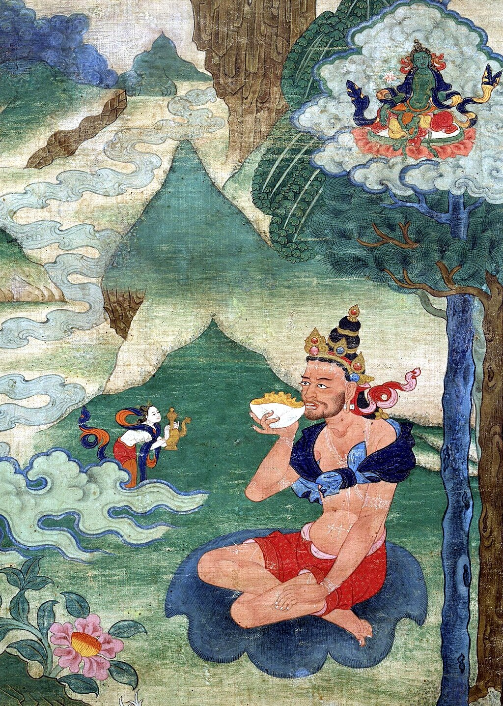

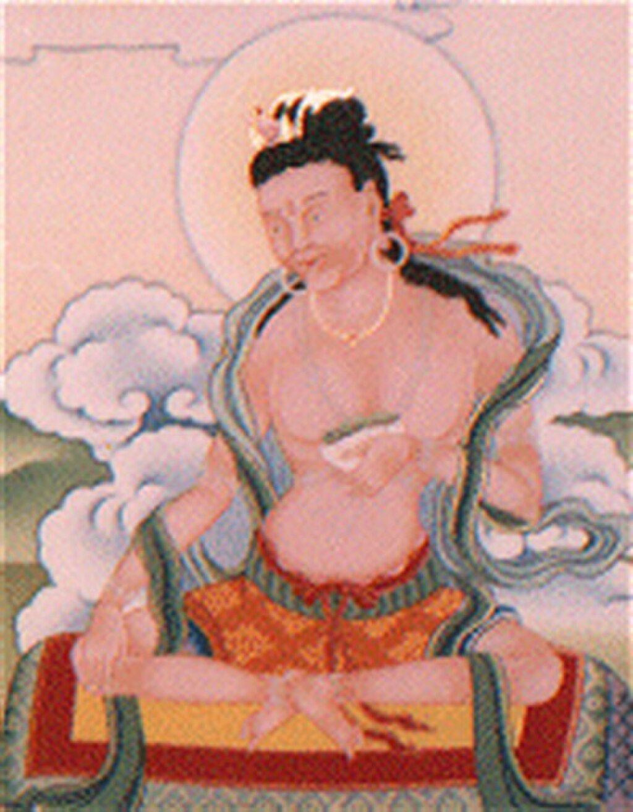

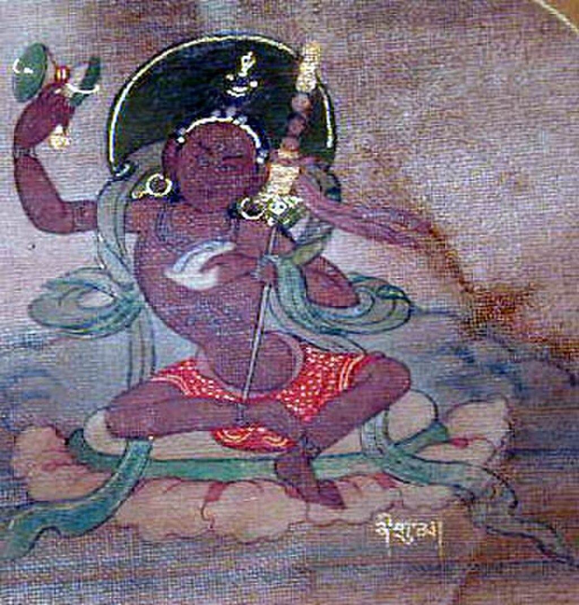

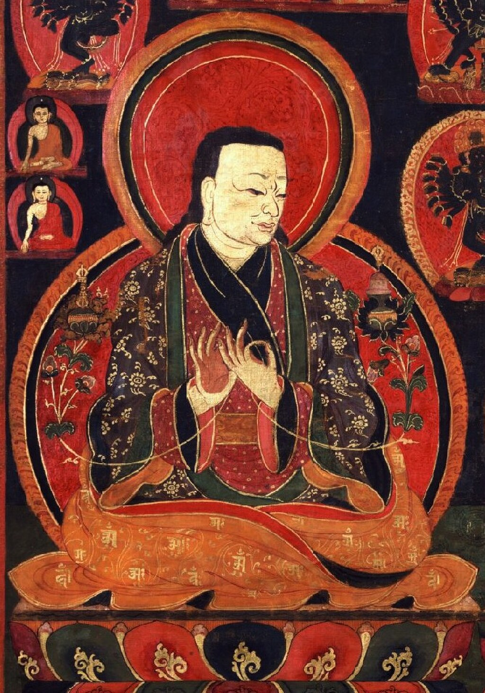

Clockwise from upper left: [Naropa](https://en.wikipedia.org/wiki/Naropa "Naropa"), [Maitripa](https://en.wikipedia.org/wiki/Maitripa "Maitripa"), [Marpa Lotsawa](https://en.wikipedia.org/wiki/Marpa_Lotsawa "Marpa Lotsawa") and [Niguma](https://en.wikipedia.org/wiki/Niguma "Niguma").

The _**Kagyu**_ school, also transliterated as _**Kagyü**_, or _**Kagyud**_ ([Tibetan](https://en.wikipedia.org/wiki/Tibetan_script "Tibetan script"): བཀའ་བརྒྱུད།, [Wylie](https://en.wikipedia.org/wiki/Wylie_transliteration "Wylie transliteration"): bka' brgyud), which translates to "Oral Lineage" or "Whispered Transmission" school, is one of the four major schools (_chos lugs_) of [Tibetan Buddhism](https://en.wikipedia.org/wiki/Tibetan_Buddhism "Tibetan Buddhism"). The Kagyu lineages trace themselves back to the 11th century Indian [Mahasiddhas](https://en.wikipedia.org/wiki/Mahasiddha "Mahasiddha") [Naropa](https://en.wikipedia.org/wiki/Naropa "Naropa"), [Maitripa](https://en.wikipedia.org/wiki/Maitripa "Maitripa") and the [yogini](https://en.wikipedia.org/wiki/Yogini "Yogini") [Niguma](https://en.wikipedia.org/wiki/Niguma "Niguma"), via their student [Marpa Lotsawa](https://en.wikipedia.org/wiki/Marpa_Lotsawa "Marpa Lotsawa") (1012–1097), who brought their teachings to Tibet. Marpa's student [Milarepa](https://en.wikipedia.org/wiki/Milarepa "Milarepa") was also an influential poet and teacher.

The Tibetan Kagyu tradition gave rise to a large number of independent sub-schools and lineages. The principal Kagyu lineages existing today as independent schools are those which stem from Milarepa's disciple, [Gampopa](https://en.wikipedia.org/wiki/Gampopa "Gampopa") (1079–1153), a monk who merged the Kagyu lineage with the [Kadam](https://en.wikipedia.org/wiki/Kadam_\(Tibetan_Buddhism\) "Kadam (Tibetan Buddhism)") tradition. The Kagyu schools which survive as independent institutions are mainly the [Karma Kagyu](https://en.wikipedia.org/wiki/Karma_Kagyu "Karma Kagyu"), [Drikung Kagyu](https://en.wikipedia.org/wiki/Drikung_Kagyu "Drikung Kagyu"), [Drukpa Lineage](https://en.wikipedia.org/wiki/Drukpa_Lineage "Drukpa Lineage") and the [Taklung Kagyu](https://en.wikipedia.org/wiki/Taklung_Kagyu "Taklung Kagyu"). The Karma Kagyu school is the largest of the sub-schools, and is headed by the [Karmapa](https://en.wikipedia.org/wiki/Karmapa "Karmapa"). Other lineages of Kagyu teachings, such as the [Shangpa Kagyu](https://en.wikipedia.org/wiki/Shangpa_Kagyu "Shangpa Kagyu"), are preserved in other schools.

The main teachings of the Kagyus include [Mahamudra](https://en.wikipedia.org/wiki/Mahamudra "Mahamudra") and the [Six Dharmas of Naropa](https://en.wikipedia.org/wiki/Six_Dharmas_of_Naropa "Six Dharmas of Naropa").

## Nomenclature, orthography and etymology

Strictly speaking, the term _bka' brgyud_ "oral lineage", "precept transmission" applies to any line of transmission of an esoteric teaching from teacher to disciple. There are references to the "[Atiśa](https://en.wikipedia.org/wiki/Atiśa "Atiśa") kagyu" for the [Kadam](https://en.wikipedia.org/wiki/Kadam_\(Tibetan_Buddhism\) "Kadam (Tibetan Buddhism)") or to "Jonang kagyu" for the [Jonang](https://en.wikipedia.org/wiki/Jonang "Jonang") and "Ganden kagyu" for the [Gelug](https://en.wikipedia.org/wiki/Gelug "Gelug") sects. Today, however, the term Kagyu almost always refers to the [Dagpo Kagyu](https://en.wikipedia.org/wiki/Dagpo_Kagyu "Dagpo Kagyu") and, less often, to the [Shangpa Kagyu](https://en.wikipedia.org/wiki/Shangpa_Kagyu "Shangpa Kagyu").

### "Kagyu" and "Kargyu"

In his 1970 article _Golden Rosaries of the Bka' brgyud schools_, [E. Gene Smith](https://en.wikipedia.org/wiki/E._Gene_Smith "E. Gene Smith") discusses the two forms of the name, [Wylie](https://en.wikipedia.org/wiki/Wylie_transliteration "Wylie transliteration"): bka' brgyud and [Wylie](https://en.wikipedia.org/wiki/Wylie_transliteration "Wylie transliteration"): dkar brgyud:

> A note is in order regarding the two forms Dkar brgyud pa and Bka' brgyud pa. The term Bka' brgyud pa simply applies to any line of transmission of an esoteric teaching from teacher to disciple. We can properly speak of a Jo nang Bka' brgyud pa or Dge ldan Bka' brgyud pa for the Jo nang pa and Dge lugs pa sects. The adherents of the sects that practice the teachings centering around the _Phyag rgya chen po_ and the _Nā ro chos drug_ are properly referred to as the Dwags po Bka' brgyud pa because these teachings were all transmitted through Sgam po pa. Similar teachings and practices centering around the _Ni gu chos drug_ are distinctive of the Shangs pa Bka' brgyud pa. These two traditions with their offshoots are often incorrectly referred to simply as Bka' brgyud pa. Some of the more careful Tibetan scholars suggested that the term Dkar brgyud pa be used to refer to the Dwags po Bka' brgyud pa, Shangs pa Bka' brgyud pa and a few minor traditions transmitted by Nā ro pa, Mar pa, Mi la ras pa, or Ras chung pa but did not pass through Sgam po pa. The term Dkar brgyud pa refers to the use of the white cotton meditation garment by all these lineages. This complex is what is normally known, inaccuratly, as the Bka' brgyud pa. Thu'u kwan Blo bzang chos kyi nyi ma sums up the matter: "In some later 'Brug pa texts the written form 'Dkar brgyud' indeed appears, because [Mar pa](https://en.wikipedia.org/wiki/Marpa_Lotsawa "Marpa Lotsawa"), [Mi la](https://en.wikipedia.org/wiki/Milarepa "Milarepa"), Gling ras, and others wore only white cotton cloth. Nevertheless, it is fine if \[they\] are all called Bka' brgyud." At Thu'u kwan's suggestion, then, we will side with convention and use the term "Bka' brgyud."

One source indicates:

> \[T\]he term "Kagyu" derives from the Tibetan phrase meaning "Lineage of the Four Commissioners" (_ka-bab-shi'i-gyu-pa_). This four-fold lineage is
>
> 1.  the illusory body and transference yogas of the _[Guhyasamaja](https://en.wikipedia.org/wiki/Guhyasamāja_Tantra "Guhyasamāja Tantra")_ and _Chatushpitha Tantra_, transmitted through [Tilopa](https://en.wikipedia.org/wiki/Tilopa "Tilopa"), [Nagarjuna](https://en.wikipedia.org/wiki/Nagarjuna "Nagarjuna"), [Indrabhuti](https://en.wikipedia.org/wiki/Indrabhuti "Indrabhuti"), and [Saraha](https://en.wikipedia.org/wiki/Saraha "Saraha");
> 2.  the dream yoga practice of the [Mahamaya](https://en.wikipedia.org/wiki/Mahamaya_Tantra "Mahamaya Tantra") from Tilopa, Charyapa, and [Kukuripa](https://en.wikipedia.org/wiki/Kukkuripa "Kukkuripa");
> 3.  the clear-light yoga of the _[Chakrasamvara](https://en.wikipedia.org/wiki/Cakrasaṃvara_Tantra "Cakrasaṃvara Tantra"), [Hevajra](https://en.wikipedia.org/wiki/Hevajra "Hevajra")_, and other [Mother Tantras](https://en.wikipedia.org/wiki/Tibetan_Buddhist_canon#Mother_Tantra "Tibetan Buddhist canon"), as transmitted from Hevajra, [Dombipa](https://en.wikipedia.org/wiki/Dombipa "Dombipa"), and Lavapa; and
> 4.  the inner-heat yoga, Kamadevavajra, Padmavajra, Dakini, Kalpabhadra, and Tilopa.

## Origins

Kagyu begins in Tibet with [Marpa Lotsawa](https://en.wikipedia.org/wiki/Marpa_Lotsawa "Marpa Lotsawa") (1012–1097) a Tibetan [householder](https://en.wikipedia.org/wiki/Householder_\(Buddhism\) "Householder (Buddhism)") who trained as a translator with [lotsawa](https://en.wikipedia.org/wiki/Lotsawa "Lotsawa") [Drogmi Shākya Yeshe](https://en.wikipedia.org/wiki/Drogmi "Drogmi") (993–1050), and then traveled three times to India and four times to Nepal in search of religious teachings. His principal gurus were the siddhas [Nāropa](https://en.wikipedia.org/wiki/Naropa "Naropa") – from whom he received the "close lineage" of [mahāmudrā](https://en.wikipedia.org/wiki/Mahamudra "Mahamudra") and tantric teachings, and [Maitrīpāda](https://en.wikipedia.org/wiki/Maitripada "Maitripada") – from whom he received the "distant lineage" of mahāmudrā.

Together Marpa, Milarepa and Gampopa are known as "Mar-Mi-Dag Sum" ([Wylie](https://en.wikipedia.org/wiki/Wylie_transliteration "Wylie transliteration"): mar mi dwags gsum) and together these three are considered the founders of the Kagyu school of Buddhism in Tibet.

### Indian origins

Marpa's guru Nāropa (1016–1100) was the principal disciple of [Tilopa](https://en.wikipedia.org/wiki/Tilopa "Tilopa") (988–1089) from East Bengal. From his own teachers Tilopa received the _Four Lineages of Instructions_ ([Wylie](https://en.wikipedia.org/wiki/Wylie_transliteration "Wylie transliteration"): bka' babs bzhi), which he passed on to Nāropa who codified them into what became known as the Six Doctrines or [Six Dharmas of Naropa](https://en.wikipedia.org/wiki/Six_Dharmas_of_Naropa "Six Dharmas of Naropa"). These instructions consist a combination of the [completion stage](https://en.wikipedia.org/wiki/Completion_stage "Completion stage") (Skt. _sampannakrama_; Tib. _rdzogs rim_) practices of different Buddhist highest yoga tantras (Skt. _[Anuttarayoga Tantra](https://en.wikipedia.org/wiki/Anuttarayoga_Tantra "Anuttarayoga Tantra")_; [Wylie](https://en.wikipedia.org/wiki/Wylie_transliteration "Wylie transliteration"): bla med rgyud), which use the [energy-winds](https://en.wikipedia.org/wiki/Lung_\(Tibetan_Buddhism\) "Lung (Tibetan Buddhism)") (Skt. _vāyu_, [Wylie](https://en.wikipedia.org/wiki/Wylie_transliteration "Wylie transliteration"): rlung), energy-channels (Skt. _nāḍi_, [Wylie](https://en.wikipedia.org/wiki/Wylie_transliteration "Wylie transliteration"): rtsa) and energy-drops of the subtle _vajra_-body in order to achieve the four types of bliss, the clear-light mind and realize the state of Mahāmudrā.

The Mahāmudrā lineage of Tilopa and Nāropa is called the "direct lineage" or "close lineage" as it is said that Tilopa received this Mahāmudrā realisation directly from the [Dharmakāya](https://en.wikipedia.org/wiki/Dharmakāya "Dharmakāya") Buddha [Vajradhara](https://en.wikipedia.org/wiki/Vajradhara "Vajradhara") and this was transmitted only through Nāropa to Marpa.

The "distant lineage" of Mahāmudrā is said to have come from the Buddha in the form of Vajradara through incarnations of the bodhisattvas [Avalokiteśvara](https://en.wikipedia.org/wiki/Avalokiteśvara "Avalokiteśvara") and [Mañjuśrī](https://en.wikipedia.org/wiki/Mañjuśrī "Mañjuśrī") to [Saraha](https://en.wikipedia.org/wiki/Saraha "Saraha"), then from him through Nagarjuna, [Shavaripa](https://en.wikipedia.org/wiki/Shavaripa "Shavaripa"), and Maitripada to Marpa. The Mahāmudrā teachings from Saraha that Maitripa transmitted to Marpa include the "Essence Mahāmudrā" ([Wylie](https://en.wikipedia.org/wiki/Wylie_transliteration "Wylie transliteration"): snying po'i phyag chen) where Mahāmudrā is introduced directly without relying on philosophical reasoning or yogic practices.

According to some accounts, on his third journey to India Marpa also met [Atiśa](https://en.wikipedia.org/wiki/Atiśa "Atiśa") (982–1054) who later came to Tibet and helped found the [Kadam](https://en.wikipedia.org/wiki/Kadam_\(Tibetan_Buddhism\) "Kadam (Tibetan Buddhism)") lineage

### Marpa and his successors (Marpa Kagyu)

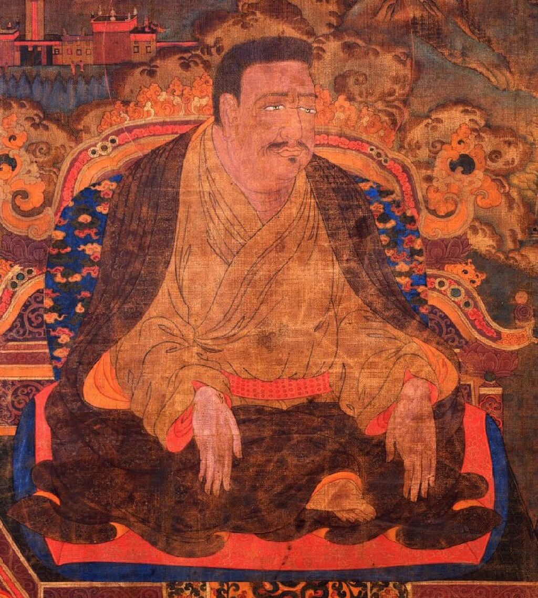Lotsawa Marpa Chokyi Lodro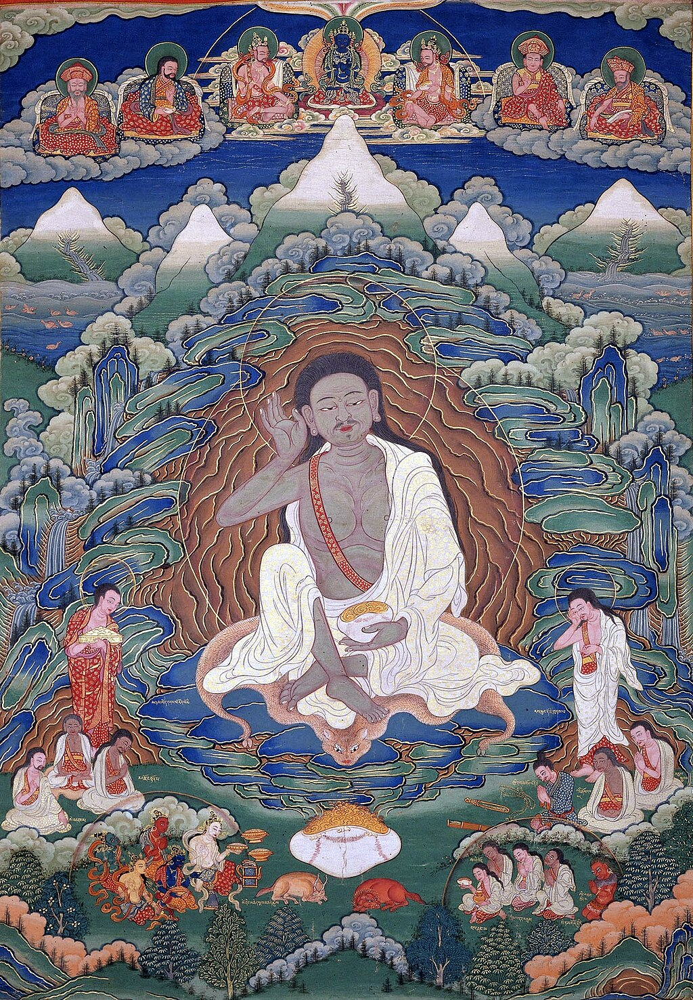Milarepa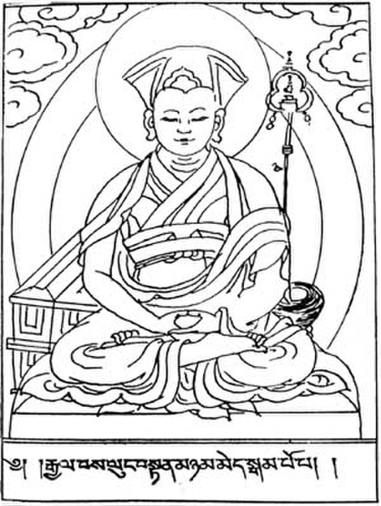Gampopa

Marpa established his "seat" at Drowolung ([Wylie](https://en.wikipedia.org/wiki/Wylie_transliteration "Wylie transliteration"): gro bo lung) in [Lhodrak](https://en.wikipedia.org/wiki/Lhozhag_County "Lhozhag County") in southern [Tibet](https://en.wikipedia.org/wiki/Tibet "Tibet") just north of [Bhutan](https://en.wikipedia.org/wiki/Bhutan "Bhutan"). Marpa married the Lady Dagmema, and took eight other concubines as mudras. Collectively they embodied the main consort and eight wisdom dakini in the [mandala](https://en.wikipedia.org/wiki/Mandala "Mandala") of his [Yidam](https://en.wikipedia.org/wiki/Yidam "Yidam"), [Hevajra](https://en.wikipedia.org/wiki/Hevajra "Hevajra"). Marpa wanted to entrust the transmission lineage to his oldest son, Darma Dode, following the usual Tibetan practice of the time to transmit of lineages of esoteric teachings via hereditary lineage (father-son or uncle-nephew), but his son died at an early age and consequently he passed his main lineage on through [Milarepa](https://en.wikipedia.org/wiki/Milarepa "Milarepa"). Darma Dode's incarnation as Indian master [Tiphupa](https://en.wikipedia.org/wiki/Tiphupa "Tiphupa") became important for the future development of Kagyu in Tibet.

Marpa's four most outstanding students were known as the "Four Great Pillars" ([Wylie](https://en.wikipedia.org/wiki/Wylie_transliteration "Wylie transliteration"): ka chen bzhi):

1.  [Milarepa](https://en.wikipedia.org/wiki/Milarepa "Milarepa") (1040–1123), born in Gungthang province of western Tibet, the most celebrated and accomplished of Tibet's yogis, who achieved the ultimate goal of enlightenment in one lifetime became the holder of Marpa's meditation or practice lineage. Among Milarepa's many students were [Gampopa](https://en.wikipedia.org/wiki/Gampopa "Gampopa") (1079–1153), a great scholar, and the great yogi [Rechung Dorje Drakpa](https://en.wikipedia.org/wiki/Rechung_Dorje_Drakpa "Rechung Dorje Drakpa") (1088–1158), also known as Rechungpa
2.  Ngok Choku Dorje ([Wylie](https://en.wikipedia.org/wiki/Wylie_transliteration "Wylie transliteration"): rngog chos sku rdo rje) (1036–1102) – was the principal recipient of Marpa's explanatory lineages and particularly important in Marpa's transmission of the Hevajra Tantra. Ngok Choku Dorje founded the Langmalung temple in the Tang valley of Bumthang district, Bhutan—which stands today. The Ngok branch of the Marpa Kagyu was an independent lineage carried on by his descendants at least up to the time of the Second Drukchen Gyalwang Kunga Paljor ([Wylie](https://en.wikipedia.org/wiki/Wylie_transliteration "Wylie transliteration"): 'brug chen kun dga' dpal 'byor, 1428–1476) who received this transmission, and 1476 when Go Lotsawa composed the _Blue Annals_.
3.  Tshurton Wangi Dorje ([Wylie](https://en.wikipedia.org/wiki/Wylie_transliteration "Wylie transliteration"): mtshur ston dbang gi rdo rje) – (or Tshurton Wangdor) was the principal recipient of Marpa's transmission of the teachings of the [Guhyasamāja Tantra](https://en.wikipedia.org/wiki/Guhyasamāja_Tantra "Guhyasamāja Tantra"). Tshurton's lineage eventually merged with the [Shalu Monastery](https://en.wikipedia.org/wiki/Shalu_Monastery "Shalu Monastery") tradition and subsequently passed this down to the [Gelug](https://en.wikipedia.org/wiki/Gelug "Gelug") founder [Je Tsongkhapa](https://en.wikipedia.org/wiki/Je_Tsongkhapa "Je Tsongkhapa"), who wrote extensive commentaries on the Guhyasamāja Tantra.
4.  Meton Tsonpo ([Wylie](https://en.wikipedia.org/wiki/Wylie_transliteration "Wylie transliteration"): mes ston tshon po)

Other important students of Marpa include:

*   Marpa Dowa Chokyi Wangchuck ([Wylie](https://en.wikipedia.org/wiki/Wylie_transliteration "Wylie transliteration"): mar pa do ba chos kyi dbang phyug).
*   Marpa Goleg ([Wylie](https://en.wikipedia.org/wiki/Wylie_transliteration "Wylie transliteration"): mar pa mgo legs) who along with Tshurton Wangdor received the Guhyasamāja Tantra.
*   Barang Bawacen ([Wylie](https://en.wikipedia.org/wiki/Wylie_transliteration "Wylie transliteration"): ba rang lba ba can) – who received lineage of the explanatory teachings of the [Mahāmāyā Tantra](https://en.wikipedia.org/wiki/Mahamaya_Tantra "Mahamaya Tantra").

[Jamgon Kongtrul](/source/jamgon-kongtrul/ "Jamgon Kongtrul") (1813–1899) collected the initiations and sadhanas of surviving transmissions of Marpa's teachings together in the collection known as the Kagyu Ngak Dzö ([Tibetan](https://en.wikipedia.org/wiki/Tibetan_script "Tibetan script"): བཀའ་བརྒྱུད་སྔགས་མཛོད་, [Wylie](https://en.wikipedia.org/wiki/Wylie_transliteration "Wylie transliteration"): bka' brgyud sngags mdzod, "Treasury of Kagyu Tantras").

### Gampopa

Gampopa (1079–1153), who was a [Kadampa](https://en.wikipedia.org/wiki/Kadam_\(Tibetan_Buddhism\) "Kadam (Tibetan Buddhism)") monk, is an influential figure in the history of the Kagyu tradition. He combined the monastic tradition and the stages of the path (_[Lamrim](https://en.wikipedia.org/wiki/Lamrim "Lamrim")_) teachings of the Kadam order with teaching and practice of the Mahāmudrā and the [Six Yogas of Naropa](https://en.wikipedia.org/wiki/Six_Dharmas_of_Naropa "Six Dharmas of Naropa") he received from Milarepa synthesizing them into one lineage. This monastic tradition came to be known as [Dagpo Kagyu](https://en.wikipedia.org/wiki/Dagpo_Kagyu "Dagpo Kagyu")—the main lineage of the Kagyu tradition passed down via Naropa as we know it today. The other main lineage of the Kagyu is the [Shangpa Kagyu](https://en.wikipedia.org/wiki/Shangpa_Kagyu "Shangpa Kagyu"), passed down via Niguma. Gampopa's main contribution was the establishment of a celibate and [cenobitic](https://en.wikipedia.org/wiki/Cenobitic_monasticism "Cenobitic monasticism") [monastic](https://en.wikipedia.org/wiki/Monasticism "Monasticism") Kagyu order. This was in sharp contrast to the tradition of Marpa and Milarepa which mainly consisted of non-monastic householder or hermit yogis practicing in solitary locations or hermitages. According to Tibetologist [John Powers](https://en.wikipedia.org/wiki/John_Powers_\(academic\) "John Powers (academic)"), Marpa "saw the monastic life as appropriate only for people of limited capacities." Gampopa on the other hand, founded [Daklha Gampo Monastery](https://en.wikipedia.org/wiki/Daklha_Gampo_Monastery "Daklha Gampo Monastery") (_Dwags lha sgam po_) and thus allowed the Kagyu teachings to have established training centers and study curricula in a structured monastic setting which was well suited to the preservation of tradition.

Most of the major Kagyu lineages in existence today can be traced through Gampopa.

Following Gampopa's teachings, there evolved the so-called "Four Major and Eight Minor" lineages of the Dagpo (sometimes rendered "Tagpo" or "Dakpo") Kagyu School. This phrase is descriptive of the generation or order in which the schools were founded, not of their importance.

## Dagpo Kagyu lineages

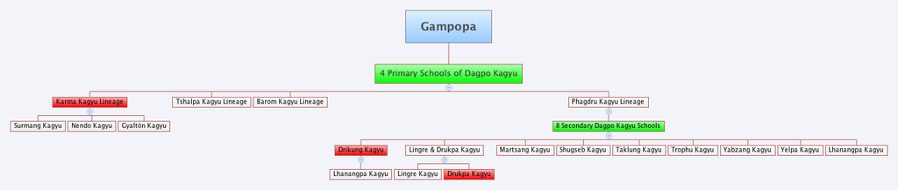Kagyu lineage tree, the boxes in red designate surviving independent traditions.

The principle Dagpo Kagyu lineages that exist today as organized schools are the [Karma Kagyu](https://en.wikipedia.org/wiki/Karma_Kagyu "Karma Kagyu"), [Drikung Kagyu](https://en.wikipedia.org/wiki/Drikung_Kagyu "Drikung Kagyu") and the [Drukpa Lineage](https://en.wikipedia.org/wiki/Drukpa_Lineage "Drukpa Lineage"). For the most part, the teachings and main esoteric transmissions of the other Dagpo Kagyu lineages have been absorbed into one of these three independent schools.

Historically, there were twelve main sub schools of the Dagpo Kagyu derived from [Gampopa](https://en.wikipedia.org/wiki/Gampopa "Gampopa") and his disciples. Four primary branches stemmed from direct disciples of Gampopa and his nephew; and eight secondary branches derived from Gampopa's disciple Phagmo Drupa. Several of these Kagyu traditions in turn developed their own branches or sub-schools.

The terminology "primary and secondary" (early/later) for the Kagyu schools can only be traced back as far as Kongtrul's and other's writings (19th century). The Tibetan terminology "che chung", literally "large (and) small," does not reflect the size or influence of the schools, as for instance the Drikung school was in the 13th century probably the largest and most influential of them, although it is, according to Kongtrul, "secondary".Or it can be taken as early and later schools.

### Four primary branches of the Dagpo Kagyu

#### Karma Kamtsang (Karma Kagyu)

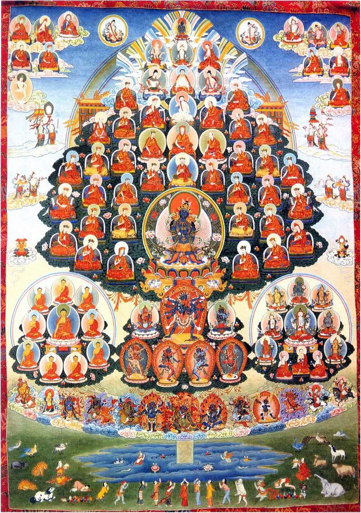Karma Kagyu refuge tree (note the black hats of the Karmapas)

The Drubgyu Karma Kamtsang, often known simply as Karma Kagyu, was founded by one of Gampopa's main disciples [Düsum Khyenpa, 1st Karmapa Lama](https://en.wikipedia.org/wiki/Düsum_Khyenpa,_1st_Karmapa_Lama "Düsum Khyenpa, 1st Karmapa Lama") (1110–1193). The figure of [Karma Pakshi](https://en.wikipedia.org/wiki/Karma_Pakshi,_2nd_Karmapa_Lama "Karma Pakshi, 2nd Karmapa Lama") (1204/6–1283), a student of one of [Düsum Khyenpa](https://en.wikipedia.org/wiki/Düsum_Khyenpa,_1st_Karmapa_Lama "Düsum Khyenpa, 1st Karmapa Lama")'s main disciples, was actually the first person recognized as a "[Karmapa](https://en.wikipedia.org/wiki/Karmapa "Karmapa")", i.e. a reincarnation of [Düsum Khyenpa](https://en.wikipedia.org/wiki/Düsum_Khyenpa,_1st_Karmapa_Lama "Düsum Khyenpa, 1st Karmapa Lama").

[Rangjung Dorje, 3rd Karmapa Lama](https://en.wikipedia.org/wiki/Rangjung_Dorje,_3rd_Karmapa_Lama "Rangjung Dorje, 3rd Karmapa Lama"), was an important figure because he received and preserved [Dzogchen](/source/dzogchen/ "Dzogchen") teachings from [Rigdzin Kumaradza](https://en.wikipedia.org/wiki/Rigdzin_Kumaradza "Rigdzin Kumaradza") and taught this along with Kagyu Mahamudra. He also influenced [Dolpopa Sherab Gyaltsen](https://en.wikipedia.org/wiki/Dolpopa_Sherab_Gyaltsen "Dolpopa Sherab Gyaltsen"), the founder of the [Jonang](https://en.wikipedia.org/wiki/Jonang "Jonang") school who systematized the [shentong teachings](https://en.wikipedia.org/wiki/Rangtong-Shentong "Rangtong-Shentong").

The Karmapas continue to be the heads of the Karma Kagyu order today and remain very influential figures. According to Reginald Ray:

> Although in the diaspora the [sixteenth Karmapa](https://en.wikipedia.org/wiki/Rangjung_Rigpe_Dorje,_16th_Karmapa "Rangjung Rigpe Dorje, 16th Karmapa") was considered the “head” of the Kagyu lineage, in Tibet the situation was more decentralized. In spite of the titular role of the Karmapa, even in exile the various surviving Kagyu subschools maintain a high degree of independence and autonomy.

Following the death of [Rangjung Rigpe Dorje, 16th Karmapa](https://en.wikipedia.org/wiki/Rangjung_Rigpe_Dorje,_16th_Karmapa "Rangjung Rigpe Dorje, 16th Karmapa") in 1981, followers came to disagree over the identity of his successor. The disagreement of who holds the current title of Karmapa is an ongoing controversy termed the "[Karmapa controversy](https://en.wikipedia.org/wiki/Karmapa_controversy "Karmapa controversy")".

##### Sub-schools of Karma Kagyu

The Karma Kagyu school itself has three sub-schools in addition to the main branch:

: Surmang, founded by Trungmase, 1st Zurmang Gharwang Rinpoche, a student of Deshin Shekpa, 5th Karmapa Lama, this sub-sect was centered on Surmang Monastery, in what is now Qinghai Nédo Kagyu (Wylie: gnas mdo), founded by Karma Chagme (Wylie: kar ma chags med, 1613–1678), a disciple of the 6th Shamarpa (Wylie: zhwa dmar chos kyi dbang phyug, 1584–1630) Gyaltön Kagyu

#### Barom Kagyu

The Barom Kagyu was founded by Gampopa's disciple Barompa Darma Wangchuk ([Wylie](https://en.wikipedia.org/wiki/Wylie_transliteration "Wylie transliteration"): 'ba' rom pa dar ma dbang phyug, 1127–1199/1200), who established the Nak River Barom Riwoche Monastery ([Wylie](https://en.wikipedia.org/wiki/Wylie_transliteration "Wylie transliteration"): nag chu 'ba' rom ri bo che) in 1160. This school was popular in the Principality of Nangchen in [Kham](https://en.wikipedia.org/wiki/Kham "Kham") (modern [Nangqên County](https://en.wikipedia.org/wiki/Nangqên_County "Nangqên County"), [Yushu Tibetan Autonomous Prefecture](https://en.wikipedia.org/wiki/Yushu_Tibetan_Autonomous_Prefecture "Yushu Tibetan Autonomous Prefecture"), southern Qinghai) where it has survived in one or two pockets to the present day.

An important early master of this school was Tishri Repa Sherab Senge ([Wylie](https://en.wikipedia.org/wiki/Wylie_transliteration "Wylie transliteration"): 'gro mgon ti shri ras pa rab seng ge, 1164–1236).

[Tulku Urgyen Rinpoche](https://en.wikipedia.org/wiki/Tulku_Urgyen_Rinpoche "Tulku Urgyen Rinpoche") (1920–1996) was a holder of the Barom Kagyu Lineage.

#### Tshalpa Kagyu

The Tshalpa Kagyu was established by [Zhang Yudrakpa Tsöndru Drakpa](https://en.wikipedia.org/wiki/Zhang_Yudrakpa_Tsöndru_Drakpa "Zhang Yudrakpa Tsöndru Drakpa") ([Wylie](https://en.wikipedia.org/wiki/Wylie_transliteration "Wylie transliteration"): zhang g.yu brag pa brtson 'gru brags pa, 1123–1193), who founded Tsel Gungtang Monastery ([Wylie](https://en.wikipedia.org/wiki/Wylie_transliteration "Wylie transliteration"): tshal gung thang). Lama Zhang was a disciple of Gampopa's nephew Dagpo Gompa Tshülthrim Nyingpo ([Wylie](https://en.wikipedia.org/wiki/Wylie_transliteration "Wylie transliteration"): dwags sgom tshul khrims snying po, 1116–1169).

The Tshalpa Kagyu tradition continued to function independently until the 15th century when it was absorbed by the Gelug, who still maintain many of its transmissions. All of the former Tshelpa properties became Gelug possessions under the administration of Sera monastery.

#### Phagdru Kagyu

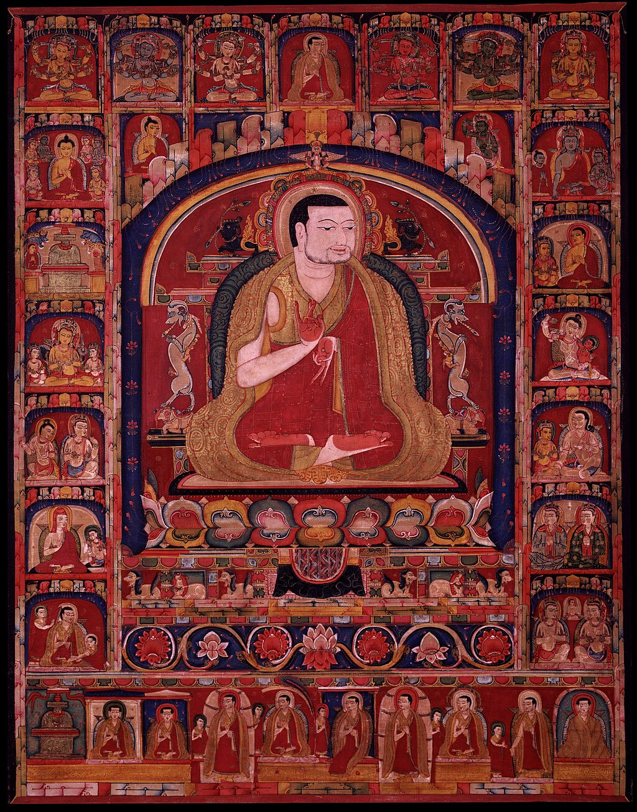Phagmodrupa with His Previous Incarnations and Episodes from His Life, 14th-century painting from the [Rubin Museum of Art](https://en.wikipedia.org/wiki/Rubin_Museum_of_Art "Rubin Museum of Art")

The [Phagmo Drupa Kagyu](https://en.wikipedia.org/wiki/Phagdru_Kagyu "Phagdru Kagyu") ([Tibetan](https://en.wikipedia.org/wiki/Tibetan_script "Tibetan script"): ཕག་མོ་གྲུ་པ་བཀའ་བརྒྱུད, [Wylie](https://en.wikipedia.org/wiki/Wylie_transliteration "Wylie transliteration"): phag mo gru pa bka' brgyud) or [Phagdru Kagyu](https://en.wikipedia.org/wiki/Phagdru_Kagyu "Phagdru Kagyu") (ཕག་གྲུ་བཀའ་བརྒྱུད) was founded by [Phagmo Drupa Dorje Gyalpo](https://en.wikipedia.org/wiki/Phagmo_Drupa_Dorje_Gyalpo "Phagmo Drupa Dorje Gyalpo") ([Tibetan](https://en.wikipedia.org/wiki/Tibetan_script "Tibetan script"): ཕག་མོ་གྲུ་པ་རྡོ་རྗེ་རྒྱལ་པོ, [Wylie](https://en.wikipedia.org/wiki/Wylie_transliteration "Wylie transliteration"): phag mo gru pa rdo rje rgyal po, 1110–1170) who was the elder brother of the famous Nyingma lama Kadampa Desheg (1122–1192) founder of [Katok Monastery](https://en.wikipedia.org/wiki/Katok_Monastery "Katok Monastery"). Before meeting [Gampopa](https://en.wikipedia.org/wiki/Gampopa "Gampopa"), Dorje Gyalpo studied with [Sachen Kunga Nyingpo](https://en.wikipedia.org/wiki/Sachen_Kunga_Nyingpo "Sachen Kunga Nyingpo") _(sa chen kun dga' snying po)_ (1092–1158) from whom he received [lamdre](https://en.wikipedia.org/wiki/Lamdre "Lamdre") transmission.

From 1435 to 1481 the power of the Phagmodrupa declined and they were eclipsed by the Rinpungpa ([Wylie](https://en.wikipedia.org/wiki/Wylie_transliteration "Wylie transliteration"): rin spungs pa) of Tsang, who patronized the Karma Kagyu. The Phagmo Drupa monastery of Dentsa Thel "was completely destroyed during the Cultural Revolution in 1966–1978"

### Eight Secondary branches of the Dagpo Kagyu

The eight secondary lineages (_zung bzhi ya brgyad_ or _chung brgyad_) of the Dagpo Kagyu all trace themselves to disciples of Phagmo Drupa. Some of these secondary schools, notably the Drikung Kagyu and Drukpa Kagyu, became more important and influential than others.

#### Drikung Kagyu

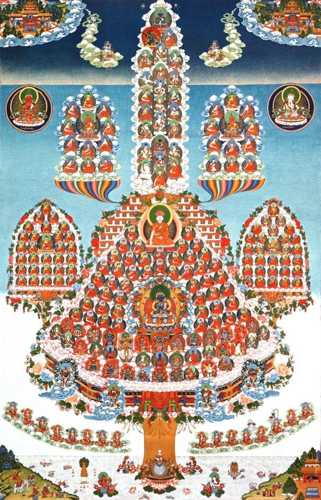Drikung Kagyu Lineage Tree

One of the most important of the Kagyu sects still remaining today, the [Drikung Kagyu](https://en.wikipedia.org/wiki/Drikung_Kagyu "Drikung Kagyu") (འབྲི་གུང་བཀའ་པརྒྱུད་པ) takes its name from [Drigung Monastery](https://en.wikipedia.org/wiki/Drigung_Monastery "Drigung Monastery") founded by Jigten Sumgön, also known as Drikung Kyopa.

The special Kagyu teachings of the Drikung tradition include the "Single Intention" ([Wylie](https://en.wikipedia.org/wiki/Wylie_transliteration "Wylie transliteration"): dgongs gcig), "The Essence of Mahāyāna Teachings" ([Wylie](https://en.wikipedia.org/wiki/Wylie_transliteration "Wylie transliteration"): theg chen bstan pa'i snying po), and the "Fivefold Profound Path of Mahāmudrā" ([Wylie](https://en.wikipedia.org/wiki/Wylie_transliteration "Wylie transliteration"): lam zab mo phyag chen lnga ldan).

Since the 15th century the Drikung Kagyupa received influence from the "northern [terma](https://en.wikipedia.org/wiki/Terma_\(religion\) "Terma (religion)")" ([Wylie](https://en.wikipedia.org/wiki/Wylie_transliteration "Wylie transliteration"): byang gter) teachings of the Nyingma tradition.

#### Lingre Kagyu

Lingre Kagyu refers to the lineages founded by Lingre Pema Dorje ([Wylie](https://en.wikipedia.org/wiki/Wylie_transliteration "Wylie transliteration"): gling ras pa padma rdo rje) \[1128-1188\] also known as Nephupa after Nephu monastery _(sna phu dgon)_ he founded near Dorje Drak _(rdo rje brag)_ in Central Tibet _(dbus)_. Lingrepa's teachers were [Gampopa](https://en.wikipedia.org/wiki/Gampopa "Gampopa")'s disciple [Phagmo Drupa Dorje Gyalpo](https://en.wikipedia.org/wiki/Phagmo_Drupa_Dorje_Gyalpo "Phagmo Drupa Dorje Gyalpo"); [Rechungpa's](https://en.wikipedia.org/wiki/Rechung_Dorje_Drakpa "Rechung Dorje Drakpa") disciple Sumpa Repa; and Ra Yeshe Senge, a lineage holder of Ra Lotsawa Dorje Drag.

#### Drukpa Lineage

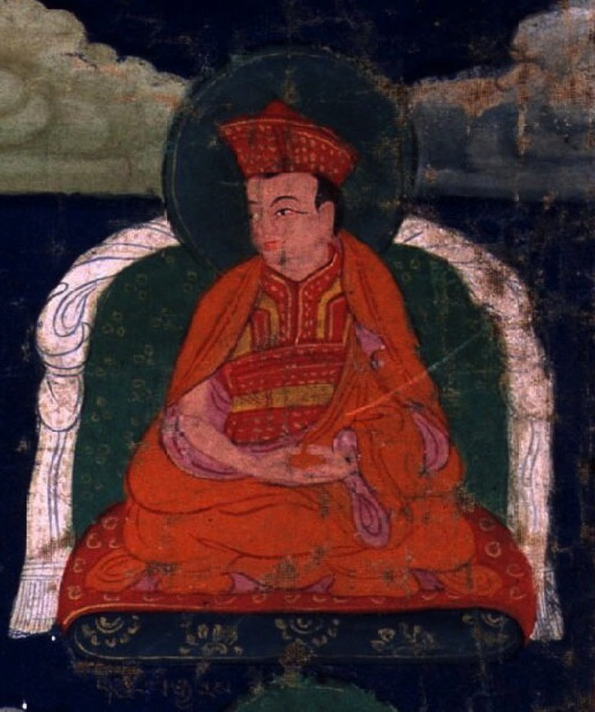Tsangpa Gyare (1161–1211)

The Drukpa Lineage was established by Ling Repa's main disciple, [Tsangpa Gyare](https://en.wikipedia.org/wiki/Tsangpa_Gyare "Tsangpa Gyare") (1161–1211), who established monasteries at Longbol ([Wylie](https://en.wikipedia.org/wiki/Wylie_transliteration "Wylie transliteration"): klong rbol) and [Ralung Monastery](https://en.wikipedia.org/wiki/Ralung_Monastery "Ralung Monastery") ([Wylie](https://en.wikipedia.org/wiki/Wylie_transliteration "Wylie transliteration"): rwa lung). Later, Tsangpa Gyare went to a place called Nam Phu where, legend has it, nine roaring dragons rose from the ground and soared into the sky. The Tibetan word for dragon is _Druk_ ([Wylie](https://en.wikipedia.org/wiki/Wylie_transliteration "Wylie transliteration"): 'brug), so Tsangpa Gyare's lineage and the monastery he established at the place became known as the _Drukpa_ and he became known as the [Gyalwang Drukpa](https://en.wikipedia.org/wiki/Gyalwang_Drukpa "Gyalwang Drukpa"). This school became widespread in Tibet and in surrounding regions. Today the Southern Drukpa Lineage is the [state religion of Bhutan](https://en.wikipedia.org/wiki/Buddhism_in_Bhutan "Buddhism in Bhutan"), and in the western Himalayas, Drukpa Lineage monasteries are found in [Ladakh](https://en.wikipedia.org/wiki/Ladakh "Ladakh"), [Zanskar](https://en.wikipedia.org/wiki/Zanskar "Zanskar"), [Lahaul](https://en.wikipedia.org/wiki/Lahaul_and_Spiti_district "Lahaul and Spiti district") and [Kinnaur](https://en.wikipedia.org/wiki/Kinnaur_district "Kinnaur district").

Along with the [Mahamudra](https://en.wikipedia.org/wiki/Mahamudra "Mahamudra") teachings inherited from Gampopa and [Phagmo Drupa Dorje Gyalpo](https://en.wikipedia.org/wiki/Phagmo_Drupa_Dorje_Gyalpo "Phagmo Drupa Dorje Gyalpo"), particular teachings of the Drukpa Lineage include the "Six Cycles of Equal Taste" ([Wylie](https://en.wikipedia.org/wiki/Wylie_transliteration "Wylie transliteration"): ro snyom skor drug), a cycle of instructions said to have been hidden by [Rechung Dorje Drakpa](https://en.wikipedia.org/wiki/Rechung_Dorje_Drakpa "Rechung Dorje Drakpa") and discovered by Tsangpa Gyare, and the "Seven Auspicious Teachings" ([Wylie](https://en.wikipedia.org/wiki/Wylie_transliteration "Wylie transliteration"): rten 'brel rab bdun) revealed to Tsangpa Gyare by seven Buddhas who appeared to him in a vision at Tsari.

#### Shuksep Kagyu

The Shuksep Kagyu ([Wylie](https://en.wikipedia.org/wiki/Wylie_transliteration "Wylie transliteration"): shug gseb bka' brgyud) was established by Gyergom Chenpo Zhönnu Drakpa ([Wylie](https://en.wikipedia.org/wiki/Wylie_transliteration "Wylie transliteration"): gyer sgom chen po gzhon nu grags pa, 1090–1171), who founded the Shuksep Monastery in Nyiphu. The Shuksep Kagyu emphasized the Mahamudra teachings of the [_doha_s](https://en.wikipedia.org/wiki/Doha_\(poetry\) "Doha (poetry)"), spiritual songs of realization by Indian masters such as [Saraha](https://en.wikipedia.org/wiki/Saraha "Saraha"), Shavaripa, Tilopa, Naropa and Maitripa. A notable member of this lineage was the nun [Shukseb Jetsun Chönyi Zangmo](https://en.wikipedia.org/wiki/Shukseb_Jetsun_Chönyi_Zangmo "Shukseb Jetsun Chönyi Zangmo").

#### Taklung Kagyu

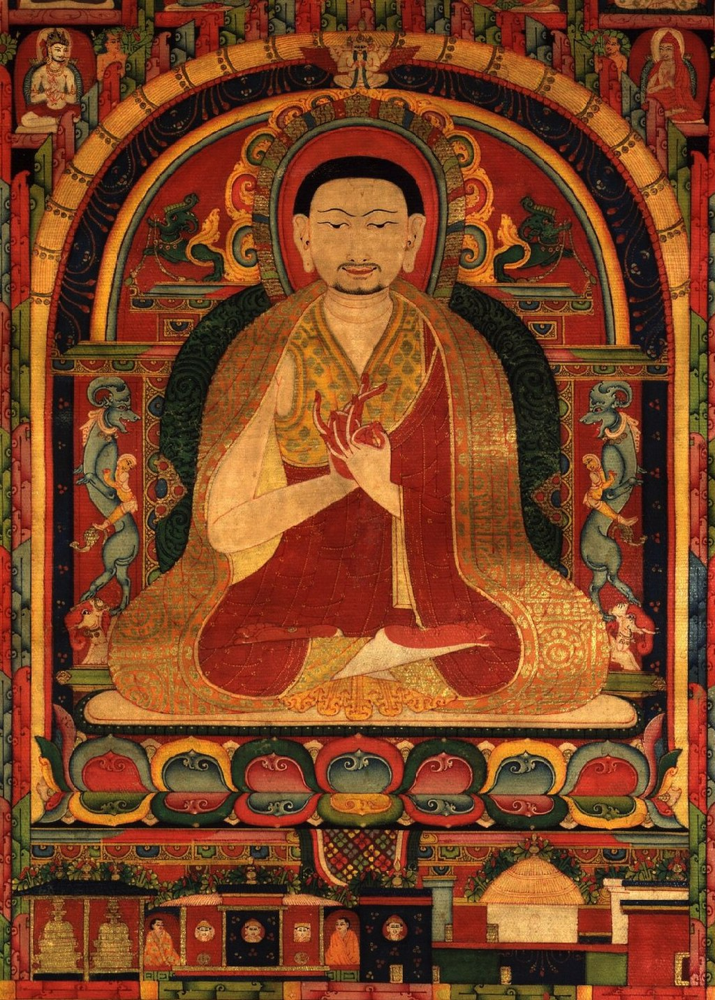Tibetan Thanka Painting of Taklung Thangpa Tashi Pal

The [Taklung Kagyu](https://en.wikipedia.org/wiki/Taklung_Kagyu "Taklung Kagyu") ([Wylie](https://en.wikipedia.org/wiki/Wylie_transliteration "Wylie transliteration"): stag lungs bka' brgyud), named after Taklung Monastery established in 1180 by [Taklung Thangpa Tashi Pal](https://en.wikipedia.org/wiki/Taklung_Thangpa_Tashi_Pal "Taklung Thangpa Tashi Pal") (1142–1210).

#### Trophu Kagyu

The Trophu Kagyu ([Wylie](https://en.wikipedia.org/wiki/Wylie_transliteration "Wylie transliteration"): khro phu bka' brgyud) was established by Gyeltsa Rinchen Gön ([Wylie](https://en.wikipedia.org/wiki/Wylie_transliteration "Wylie transliteration"): rgyal tsha rin chen mgon, 1118–1195) and Künden Repa ([Wylie](https://en.wikipedia.org/wiki/Wylie_transliteration "Wylie transliteration"): kun ldan ras pa, 1148–1217). The tradition was developed by their nephew, Thropu Lotsawa, who invited Pandit Shakyasri of Kashmir, Buddhasri and Mitrayogin to Tibet.

The most renowned adherent of this lineage was [Buton Rinchen Drub](https://en.wikipedia.org/wiki/Buton_Rinchen_Drub "Buton Rinchen Drub") (1290–1364) of [Zhalu](https://en.wikipedia.org/wiki/Shalu_Monastery "Shalu Monastery"), who was a student of Trophupa Sonam Sengge ([Wylie](https://en.wikipedia.org/wiki/Wylie_transliteration "Wylie transliteration"): khro phu ba bsod nams sengge) and Trophu Khenchen Rinchen Senge ([Wylie](https://en.wikipedia.org/wiki/Wylie_transliteration "Wylie transliteration"): khro phu mkhan chen rin chen sengge). Other notable teachers of this tradition include Chegompa Sherab Dorje (1130?-1200)

#### Yazang Kagyu

The Yazang Kagyu ([Wylie](https://en.wikipedia.org/wiki/Wylie_transliteration "Wylie transliteration"): g.ya' bzang bka' brgyud) founded by Sharawa Kalden Yeshe Sengge (d. 1207). His foremost disciple was Yazang Chöje Chö Mönlam (1169–1233) who in 1206 established the monastery of Yabzang, also known as Nedong Dzong, in Yarlung. The Yazang Kagyu survived as an independent school at least until the 16th century.

#### Yelpa Kagyu

The Yelpa Kagyu ([Wylie](https://en.wikipedia.org/wiki/Wylie_transliteration "Wylie transliteration"): yel pa bka' rgyud) was established by Druptop Yéshé Tsekpa ([Wylie](https://en.wikipedia.org/wiki/Wylie_transliteration "Wylie transliteration"): drub thob ye shes brtsegs pa, b. 1134). He established two monasteries, Shar Yelphuk ([Wylie](https://en.wikipedia.org/wiki/Wylie_transliteration "Wylie transliteration"): shar yel phug) and [Jang Tana](https://en.wikipedia.org/wiki/Tsurphu_Monastery#Branch_monastery "Tsurphu Monastery") ([Wylie](https://en.wikipedia.org/wiki/Wylie_transliteration "Wylie transliteration"): byang rta rna dgon).

## Shangpa Kagyu

The **Shangpa Kagyu** ([Wylie](https://en.wikipedia.org/wiki/Wylie_transliteration "Wylie transliteration"): shangs pa bka' brgyud) differs in origin from the better known Marpa or Dagpo school that is the source of all present-day Kagyu schools. The Dagpo school and its branches primarily came from the lineage of the Indian siddhas Tilopa and [Naropa](https://en.wikipedia.org/wiki/Naropa "Naropa") transmitted in Tibet through Marpa, Milarepa, [Gampopa](https://en.wikipedia.org/wiki/Gampopa "Gampopa") and their successors. In contrast, the Shangpa lineage descended from two female siddhas, Naropa's consort [Niguma](https://en.wikipedia.org/wiki/Niguma "Niguma") and [Virupa](https://en.wikipedia.org/wiki/Virupa "Virupa")'s disciple [Sukhasiddhi](https://en.wikipedia.org/wiki/Sukhasiddhi "Sukhasiddhi"), transmitted in Tibet in the 11th century through Khedrub Khyungpo Naljor. The tradition takes its name from the Shang Valley where Khyungpo Naljor established the [gompa](https://en.wikipedia.org/wiki/Gompa "Gompa") of Zhongzhong or Zhangzhong.

For seven generations, the Shangpa Kagyu lineage remained a one-to-one transmission. Although there were a few temples and retreat centres in Tibet and Bhutan associated with the Shangpa transmission, it never really was established as an independent religious institution or sect. Rather, its teachings were transmitted down through the centuries by [lamas](https://en.wikipedia.org/wiki/Lama "Lama") belonging to many different schools.

In the 20th century, the Shangpa teachings were transmitted by the first [Kalu Rinpoche](https://en.wikipedia.org/wiki/Kalu_Rinpoche "Kalu Rinpoche"), who studied at [Palpung Monastery](https://en.wikipedia.org/wiki/Palpung_Monastery "Palpung Monastery"), the seat of the [Tai Situpa](https://en.wikipedia.org/wiki/Tai_Situpa "Tai Situpa").

## Teaching and practice

### View

Kagyu expositions of the 'right philosophical view' vary depending on the lineage.

Some Kagyu lineages follow the [Shentong](https://en.wikipedia.org/wiki/Rangtong-Shentong "Rangtong-Shentong") ('empty of other') presentations, which were influenced by the work of [Dolpopa Sherab Gyaltsen](https://en.wikipedia.org/wiki/Dolpopa_Sherab_Gyaltsen "Dolpopa Sherab Gyaltsen"). This view was defended by the influential Rime philosopher [Jamgon Kongtrul](/source/jamgon-kongtrul/ "Jamgon Kongtrul") (1813–1899). _Shentong_ views the [two truths doctrine](https://en.wikipedia.org/wiki/Two_truths_doctrine "Two truths doctrine") as distinguishing between relative and absolute reality, agreeing that relative reality is empty of self-nature, but stating that absolute reality is "empty" ([Wylie](https://en.wikipedia.org/wiki/Wylie_transliteration "Wylie transliteration"): stong) only of "other" ([Wylie](https://en.wikipedia.org/wiki/Wylie_transliteration "Wylie transliteration"): gzhan) relative phenomena, but is itself not empty. In Shentong, this absolute reality (i.e., [Buddha-nature](https://en.wikipedia.org/wiki/Buddha-nature "Buddha-nature")) is the "ground or substratum" which is "uncreated and indestructible, noncomposite and beyond the chain of dependent origination." According to Jamgon Kontrul, this ultimate reality, which is "nondual, self-aware primordial wisdom," can be said to "always exists in its own nature and never changes, so it is never empty of its own nature and it is there all the time." However, this wisdom is also free of conceptual elaborations and also "free of the two extremes of nihilism and eternalism." This Shentong view has been upheld by various modern Kagyu masters such as [Kalu Rinpoche](https://en.wikipedia.org/wiki/Kalu_Rinpoche "Kalu Rinpoche") and [Khenpo Tsultrim Gyamtso Rinpoche](https://en.wikipedia.org/wiki/Khenpo_Tsultrim_Gyamtso_Rinpoche "Khenpo Tsultrim Gyamtso Rinpoche").

However, as noted by Karl Brunnhölzl, several important Kagyu figures have disagreed with the view of "Shentong Madhyamaka", such as [8th Karmapa, Mikyö Dorje](https://en.wikipedia.org/wiki/8th_Karmapa,_Mikyö_Dorje "8th Karmapa, Mikyö Dorje") (1507–1554) and [Second Pawo Rinpoche Tsugla Trengwa](https://en.wikipedia.org/wiki/Pawo_Rinpoche "Pawo Rinpoche"), both of whom see "Shentong" as another name for [Yogachara](https://en.wikipedia.org/wiki/Yogachara "Yogachara") and as a separate system to [Madhyamaka](/source/madhyamaka/ "Madhyamaka"). In his _Chariot of the Takpo Kagyü Siddhas_, Mikyö Dorje attacks the shentong view of [Dolpopa](https://en.wikipedia.org/wiki/Dolpopa_Sherab_Gyaltsen "Dolpopa Sherab Gyaltsen") as being against the sutras of ultimate meaning, which state that all phenomena are emptiness, as well as being against the treatises of the Indian masters. He argued that the [Rangtong-Shentong](https://en.wikipedia.org/wiki/Rangtong-Shentong "Rangtong-Shentong") distinction is inaccurate and not in line with the teachings of the Indian masters. As noted by Brunnhölzl, he also argues that "teachings on Buddha nature being a self, permanent, substantial, really existent, indestructible, and so on are of expedient meaning." The writings of the Ninth Karmapa, [Wangchuk Dorje, 9th Karmapa Lama](https://en.wikipedia.org/wiki/Wangchuk_Dorje,_9th_Karmapa_Lama "Wangchuk Dorje, 9th Karmapa Lama"), particularly his _Feast for the Fortunate_, also follow this view in critiquing the Shentong Madhyamaka position and arguing that "the Buddha taught buddha nature as provisional meaning".

### Practice

A section of the Northern wall mural at the [Lukhang](https://en.wikipedia.org/wiki/Lukhang "Lukhang") Temple depicting both [Tummo](https://en.wikipedia.org/wiki/Tummo "Tummo") (Skt. _Candali_) and [Phowa](https://en.wikipedia.org/wiki/Phowa "Phowa") (transference of consciousness), two of the Six Dharmas of Naropa

With regards to presentations of the path, the surviving Dagpo Kagyu schools rely on the _[Lamrim](https://en.wikipedia.org/wiki/Lamrim "Lamrim")_ (stages of the path) format outlined by [Gampopa](https://en.wikipedia.org/wiki/Gampopa "Gampopa") in his _Jewel Ornament of Liberation._ The practice of _[Lojong](https://en.wikipedia.org/wiki/Lojong "Lojong")_ (Mind training), which derives from the Kadam school, is also important.

The central meditative practice in Kagyu is [Mahamudra](https://en.wikipedia.org/wiki/Mahamudra "Mahamudra") ("the Great Seal"). This practice focuses on four principal stages (the four yogas of Mahamudra), namely:

1.  The development of single-pointedness of mind
2.  The transcendence of all conceptual elaboration
3.  The cultivation of the perspective that all phenomena are of a "single taste"
4.  The fruition of the path, which is beyond any contrived acts of meditation

The central [tantric](https://en.wikipedia.org/wiki/Tantras_\(Buddhism\) "Tantras (Buddhism)") deities of the Kagyu schools are [Cakrasaṃvara](https://en.wikipedia.org/wiki/Cakrasaṃvara_Tantra "Cakrasaṃvara Tantra") and his consort [Vajravārāhī](https://en.wikipedia.org/wiki/Vajravārāhī "Vajravārāhī").

A central set of practices maintained in the Kagyu schools is the [Six Yogas of Naropa](https://en.wikipedia.org/wiki/Six_Yogas_of_Naropa "Six Yogas of Naropa"). The Six Yogas consist of the following yogic practices:

*   _[tummo](https://en.wikipedia.org/wiki/Tummo "Tummo")_ – the yoga of inner heat (or mystic heat).
*   _gyulü_ – the yoga of the illusory body.
*   _[ösel](https://en.wikipedia.org/wiki/Ösel_\(yoga\) "Ösel (yoga)")_ – the yoga of the clear light or radiant light.
*   _[milam](https://en.wikipedia.org/wiki/Dream_yoga "Dream yoga")_ – the yoga of the dream state.
*   _[bardo](https://en.wikipedia.org/wiki/Bardo "Bardo")_ – the yoga of the in-between.
*   _[phowa](https://en.wikipedia.org/wiki/Phowa "Phowa")_ – the yoga of the transference of consciousness

Other practices which are taught in the Kagyu schools include:

*   The [Chöd](https://en.wikipedia.org/wiki/Chöd "Chöd") lineage
*   [Kalachakra](https://en.wikipedia.org/wiki/Kalachakra "Kalachakra") (derived from the [Jonang](https://en.wikipedia.org/wiki/Jonang "Jonang") lineage)
*   [White Tara](https://en.wikipedia.org/wiki/Tara_\(Buddhism\) "Tara (Buddhism)") (derived from the Kadam school)
*   The practices related to deities such as Green Tara, [Avalokiteśvara](https://en.wikipedia.org/wiki/Avalokiteśvara "Avalokiteśvara"), [Vajrakilaya](https://en.wikipedia.org/wiki/Vajrakilaya "Vajrakilaya"), and [Padmasambhava](/source/padmasambhava/ "Padmasambhava") (derived from the [Nyingma](/source/nyingma/ "Nyingma") school)
