A mural in [Teotihuacan](https://en.wikipedia.org/wiki/Teotihuacan "Teotihuacan"), Mexico (c. 2nd century) depicting a person emitting a [speech scroll](https://en.wikipedia.org/wiki/Speech_scroll "Speech scroll") from his mouth, symbolizing speech

A [Cuneiform](https://en.wikipedia.org/wiki/Cuneiform "Cuneiform") tablet

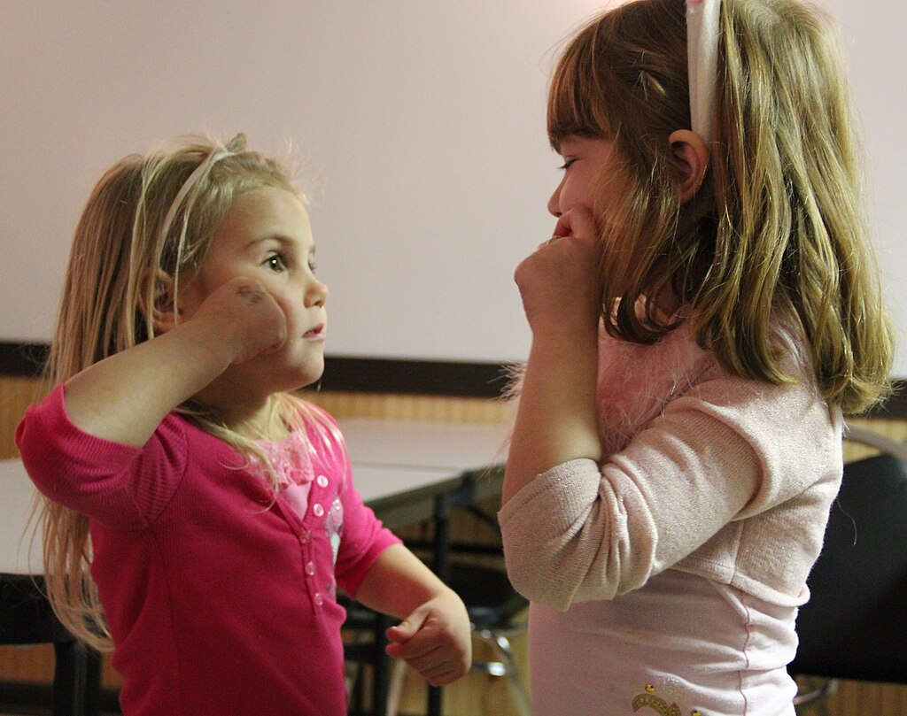

[Children of deaf adults](https://en.wikipedia.org/wiki/Child_of_deaf_adult "Child of deaf adult") using [American Sign Language](https://en.wikipedia.org/wiki/American_Sign_Language "American Sign Language")

[Braille](https://en.wikipedia.org/wiki/Braille "Braille"), a tactile [writing system](/source/writing-system/ "Writing system")

**Language** is a structured system of [communication](https://en.wikipedia.org/wiki/Communication "Communication") that consists of [grammar](https://en.wikipedia.org/wiki/Grammar "Grammar") and [vocabulary](https://en.wikipedia.org/wiki/Vocabulary "Vocabulary"). It is the primary means by which [humans](https://en.wikipedia.org/wiki/Human "Human") convey meaning, both in spoken and [signed](https://en.wikipedia.org/wiki/Signed_language "Signed language") forms, and may also be conveyed through [writing](/source/writing-system/ "Writing system"). Human language is characterized by its cultural and historical diversity, with significant variations observed between cultures and across time. Human languages possess the properties of [productivity](https://en.wikipedia.org/wiki/Productivity_\(linguistics\) "Productivity (linguistics)") and [displacement](https://en.wikipedia.org/wiki/Displacement_\(linguistics\) "Displacement (linguistics)"), which enable the creation of an infinite number of sentences, and the ability to refer to objects, events, and ideas that are not immediately present in the discourse. The use of human language relies on [social convention](https://en.wikipedia.org/wiki/Social_convention "Social convention") and is acquired through [learning](https://en.wikipedia.org/wiki/Learning "Learning").

Estimates of the number of human languages in the world vary between 5,000 and 7,000. Precise estimates depend on an arbitrary distinction (dichotomy) established between languages and [dialects](https://en.wikipedia.org/wiki/Dialect "Dialect"). [Natural languages](https://en.wikipedia.org/wiki/Natural_language "Natural language") are [spoken](https://en.wikipedia.org/wiki/Speech "Speech"), signed, or both; however, any language can be [encoded](https://en.wikipedia.org/wiki/Encoding_\(semiotics\) "Encoding (semiotics)") into secondary media using auditory, visual, or tactile [stimuli](https://en.wikipedia.org/wiki/Stimulus_\(physiology\) "Stimulus (physiology)") – for example, writing, whistling, signing, or [braille](https://en.wikipedia.org/wiki/Braille "Braille"). In other words, human language is [modality](https://en.wikipedia.org/wiki/Modality_\(semiotics\) "Modality (semiotics)")-independent, but written or signed language is the way to inscribe or encode the natural human speech or gestures.

Depending on [philosophical perspectives](https://en.wikipedia.org/wiki/Philosophy_of_language "Philosophy of language") regarding the definition of language and meaning, when used as a general concept, "language" may refer to the cognitive ability to learn and use systems of complex communication, or to describe the set of rules that makes up these systems, or the set of utterances that can be produced from those rules. All languages rely on the process of [semiosis](https://en.wikipedia.org/wiki/Semiosis "Semiosis") to relate [signs](https://en.wikipedia.org/wiki/Sign_\(linguistics\) "Sign (linguistics)") to particular [meanings](https://en.wikipedia.org/wiki/Meaning_\(linguistics\) "Meaning (linguistics)"). Oral, manual and tactile languages contain a [phonological](https://en.wikipedia.org/wiki/Phonology "Phonology") system that governs how symbols are used to form sequences known as words or [morphemes](https://en.wikipedia.org/wiki/Morpheme "Morpheme"), and a [syntactic](https://en.wikipedia.org/wiki/Syntax "Syntax") system that governs how words and morphemes are combined to form phrases and utterances.

The scientific study of language is called [linguistics](https://en.wikipedia.org/wiki/Linguistics "Linguistics"). Critical examinations of languages, such as philosophy of language, the relationships between [language and thought](https://en.wikipedia.org/wiki/Language_and_thought "Language and thought"), how words represent experience, etc., have been debated at least since [Gorgias](https://en.wikipedia.org/wiki/Gorgias "Gorgias") and [Plato](https://en.wikipedia.org/wiki/Plato "Plato") in [ancient Greek civilization](https://en.wikipedia.org/wiki/Ancient_Greece "Ancient Greece"). Thinkers such as [Jean-Jacques Rousseau](https://en.wikipedia.org/wiki/Rousseau "Rousseau") (1712–1778) have argued that language originated from emotions, while others like [Immanuel Kant](https://en.wikipedia.org/wiki/Immanuel_Kant "Immanuel Kant") (1724–1804) have argued that languages originated from rational and logical thought. Twentieth century philosophers such as [Ludwig Wittgenstein](https://en.wikipedia.org/wiki/Ludwig_Wittgenstein "Ludwig Wittgenstein") (1889–1951) argued that philosophy is really the study of language itself. Major figures in contemporary linguistics include [Ferdinand de Saussure](https://en.wikipedia.org/wiki/Ferdinand_de_Saussure "Ferdinand de Saussure") and [Noam Chomsky](https://en.wikipedia.org/wiki/Noam_Chomsky "Noam Chomsky").

Language is thought to have gradually diverged from earlier primate communication systems when early [hominins](https://en.wikipedia.org/wiki/Hominin "Hominin") acquired the ability to form a [theory of mind](https://en.wikipedia.org/wiki/Theory_of_mind "Theory of mind") and shared [intentionality](https://en.wikipedia.org/wiki/Intentionality "Intentionality"). This development is sometimes thought to have coincided with an increase in brain volume, and many linguists see the structures of language as having evolved to serve specific communicative and social functions. Language is processed in many different locations in the [human brain](https://en.wikipedia.org/wiki/Human_brain "Human brain"), but especially in [Broca's](https://en.wikipedia.org/wiki/Broca's_area "Broca's area") and [Wernicke's areas](https://en.wikipedia.org/wiki/Wernicke's_area "Wernicke's area"). Humans [acquire](https://en.wikipedia.org/wiki/Language_acquisition "Language acquisition") language through social interaction in early childhood, and children generally speak fluently by approximately three years old. Language and culture are codependent. Therefore, in addition to its strictly communicative uses, language has social uses such as signifying group [identity](https://en.wikipedia.org/wiki/Identity_\(social_science\) "Identity (social science)"), [social stratification](https://en.wikipedia.org/wiki/Social_stratification "Social stratification"), as well as use for [social grooming](https://en.wikipedia.org/wiki/Social_grooming "Social grooming") and [entertainment](https://en.wikipedia.org/wiki/Entertainment "Entertainment").

Languages [evolve](https://en.wikipedia.org/wiki/Language_change "Language change") and diversify over time, and the history of their evolution can be [reconstructed](https://en.wikipedia.org/wiki/Historical_linguistics "Historical linguistics") by [comparing](https://en.wikipedia.org/wiki/Comparative_method_\(linguistics\) "Comparative method (linguistics)") modern languages to determine which traits their ancestral languages must have had in order for the later developmental stages to occur. A group of languages that descend from a common ancestor is known as a [language family](https://en.wikipedia.org/wiki/Language_family "Language family"); in contrast, a language that has been demonstrated not to have any living or non-living [relationship](https://en.wikipedia.org/wiki/Genetic_relationship_\(linguistics\) "Genetic relationship (linguistics)") with another language is called a [language isolate](https://en.wikipedia.org/wiki/Language_isolate "Language isolate"). There are also many [unclassified languages](https://en.wikipedia.org/wiki/Unclassified_language "Unclassified language") whose relationships have not been established, and [spurious languages](https://en.wikipedia.org/wiki/Spurious_language "Spurious language") may have not existed at all. Academic consensus holds that between 50% and 90% of languages spoken at the beginning of the 21st century will probably have become [extinct](https://en.wikipedia.org/wiki/Language_death "Language death") by the year 2100.

## Definitions

The English word _language_ derives ultimately from [Proto-Indo-European](/source/proto-indo-european/ "Proto-Indo-European language") \*_[dn̥ǵʰwéh₂s](https://en.wiktionary.org/wiki/Reconstruction:Proto-Indo-European/dn̥ǵʰwéh₂s "wikt:Reconstruction:Proto-Indo-European/dn̥ǵʰwéh₂s")_ "tongue, speech, language" through [Latin](https://en.wikipedia.org/wiki/Latin "Latin") _[lingua](https://en.wiktionary.org/wiki/lingua#Latin "wikt:lingua")_, "language; tongue", and [Old French](https://en.wikipedia.org/wiki/Old_French "Old French") _[language](https://en.wiktionary.org/wiki/language#Old_French "wikt:language")_. The word is sometimes used to refer to [codes](https://en.wikipedia.org/wiki/Code "Code"), [ciphers](https://en.wikipedia.org/wiki/Cipher "Cipher"), and other kinds of [artificially constructed communication systems](https://en.wikipedia.org/wiki/Constructed_language "Constructed language") such as formally defined computer languages used for [computer programming](https://en.wikipedia.org/wiki/Programming_language "Programming language"). Unlike conventional human languages, a [formal language](https://en.wikipedia.org/wiki/Formal_language "Formal language") in this sense is a [system](https://en.wikipedia.org/wiki/System "System") of [signs](https://en.wikipedia.org/wiki/Sign_\(linguistics\) "Sign (linguistics)") for encoding and decoding [information](https://en.wikipedia.org/wiki/Information "Information"). This article specifically concerns the properties of [natural human language](https://en.wikipedia.org/wiki/Natural_language "Natural language") as it is studied in the discipline of [linguistics](https://en.wikipedia.org/wiki/Linguistics "Linguistics").

As an object of linguistic study, "language" has two primary meanings: an abstract concept, and a specific linguistic system, e.g. "[French](https://en.wikipedia.org/wiki/French_language "French language")". The Swiss linguist [Ferdinand de Saussure](https://en.wikipedia.org/wiki/Ferdinand_de_Saussure "Ferdinand de Saussure"), who defined the modern discipline of linguistics, first explicitly formulated the distinction using the French word __langage__ for language as a concept, __[langue](https://en.wikipedia.org/wiki/Langue_and_parole "Langue and parole")__ as a specific instance of a language system, and __parole__ for the concrete use of speech in a particular language.

When speaking of language as a general concept, definitions can be used which stress different aspects of the phenomenon. These definitions also entail different approaches and understandings of language, and they also inform different and often incompatible schools of [linguistic theory](https://en.wikipedia.org/wiki/Theory_of_language "Theory of language"). Debates about the nature and origin of language go back to the ancient world. Greek philosophers such as [Gorgias](https://en.wikipedia.org/wiki/Gorgias "Gorgias") and [Plato](https://en.wikipedia.org/wiki/Plato "Plato") debated the relation between words, concepts and reality. Gorgias argued that language could represent neither the objective experience nor human experience, and that communication and truth were therefore impossible. Plato maintained that communication is possible because language represents ideas and concepts that exist independently of, and prior to, language.

During the [Enlightenment](https://en.wikipedia.org/wiki/Age_of_Enlightenment "Age of Enlightenment") and its debates about human origins, it became fashionable to speculate about the origin of language. Thinkers such as Rousseau and [Johann Gottfried Herder](https://en.wikipedia.org/wiki/Johann_Gottfried_Herder "Johann Gottfried Herder") argued that language had originated in the instinctive expression of emotions, and that it was originally closer to music and poetry than to the logical expression of rational thought. Rationalist philosophers such as Kant and [René Descartes](https://en.wikipedia.org/wiki/René_Descartes "René Descartes") held the opposite view. Around the turn of the 20th century, thinkers began to wonder about the role of language in shaping our experiences of the world – asking whether language simply reflects the objective structure of the world, or whether it creates concepts that in turn impose structure on our experience of the objective world. This led to the question of whether philosophical problems are really firstly linguistic problems. The resurgence of the view that language plays a significant role in the creation and circulation of concepts, and that the study of philosophy is essentially the study of language, is associated with what has been called the [linguistic turn](https://en.wikipedia.org/wiki/Linguistic_turn "Linguistic turn") and philosophers such as Wittgenstein in 20th-century philosophy. These debates about language in relation to meaning and reference, cognition and consciousness remain active today.

### Mental faculty, organ or instinct

One definition sees language primarily as the [mental faculty](https://en.wikipedia.org/wiki/Mind "Mind") that allows humans to undertake linguistic behaviour: to learn languages and to produce and understand utterances. This definition stresses the universality of language to all humans, and it emphasizes the biological basis for the human capacity for language as a unique development of the [human brain](https://en.wikipedia.org/wiki/Human_brain "Human brain"). Proponents of the view that the drive to language acquisition is innate in humans argue that this is supported by the fact that all cognitively normal children raised in an environment where language is accessible will acquire language without formal instruction. Languages may even develop spontaneously in environments where people live or grow up together without a common language; for example, [creole languages](https://en.wikipedia.org/wiki/Creole_languages "Creole languages") and spontaneously developed sign languages such as [Nicaraguan Sign Language](https://en.wikipedia.org/wiki/Nicaraguan_Sign_Language "Nicaraguan Sign Language"). This view, which can be traced back to the philosophers Kant and Descartes, understands language to be largely [innate](https://en.wikipedia.org/wiki/Innatism "Innatism"), for example, in [Chomsky](https://en.wikipedia.org/wiki/Noam_Chomsky "Noam Chomsky")'s theory of [universal grammar](https://en.wikipedia.org/wiki/Universal_grammar "Universal grammar"), or American philosopher [Jerry Fodor](https://en.wikipedia.org/wiki/Jerry_Fodor "Jerry Fodor")'s extreme innatist theory. These kinds of definitions are often applied in studies of language within a [cognitive science](/source/cognitive-science/ "Cognitive science") framework and in [neurolinguistics](https://en.wikipedia.org/wiki/Neurolinguistics "Neurolinguistics").

### Formal symbolic system

Another definition sees language as a [formal system](https://en.wikipedia.org/wiki/Formal_system "Formal system") of signs governed by grammatical rules of combination to communicate meaning. This definition stresses that human languages can be described as closed [structural systems](https://en.wikipedia.org/wiki/Structural_linguistics "Structural linguistics") consisting of rules that relate particular signs to particular meanings. This [structuralist](https://en.wikipedia.org/wiki/Structuralism "Structuralism") view of language was first introduced by [Ferdinand de Saussure](https://en.wikipedia.org/wiki/Ferdinand_de_Saussure "Ferdinand de Saussure"), and his structuralism remains foundational for many approaches to language.

Some proponents of Saussure's view of language have advocated a formal approach that studies language structure by identifying its basic elements and then by presenting a formal account of the rules according to which the elements combine in order to form words and sentences. The main proponent of such a theory is [Noam Chomsky](https://en.wikipedia.org/wiki/Noam_Chomsky "Noam Chomsky"), the originator of the [generative theory of grammar](https://en.wikipedia.org/wiki/Generative_linguistics "Generative linguistics"), who has defined language as the construction of sentences that can be generated using transformational grammars. Chomsky considers these rules to be an innate feature of the human mind and to constitute the rudiments of what language is. By way of contrast, such transformational grammars are also commonly used in [formal logic](https://en.wikipedia.org/wiki/Formal_logic "Formal logic"), in [formal linguistics](https://en.wikipedia.org/wiki/Formal_linguistics "Formal linguistics"), and in applied [computational linguistics](https://en.wikipedia.org/wiki/Computational_linguistics "Computational linguistics"). In the philosophy of language, the view of linguistic meaning as residing in the logical relations between propositions and reality was developed by philosophers such as [Alfred Tarski](https://en.wikipedia.org/wiki/Alfred_Tarski "Alfred Tarski"), [Bertrand Russell](https://en.wikipedia.org/wiki/Bertrand_Russell "Bertrand Russell"), and other [formal logicians](https://en.wikipedia.org/wiki/Formal_logic "Formal logic").

### Tool for communication

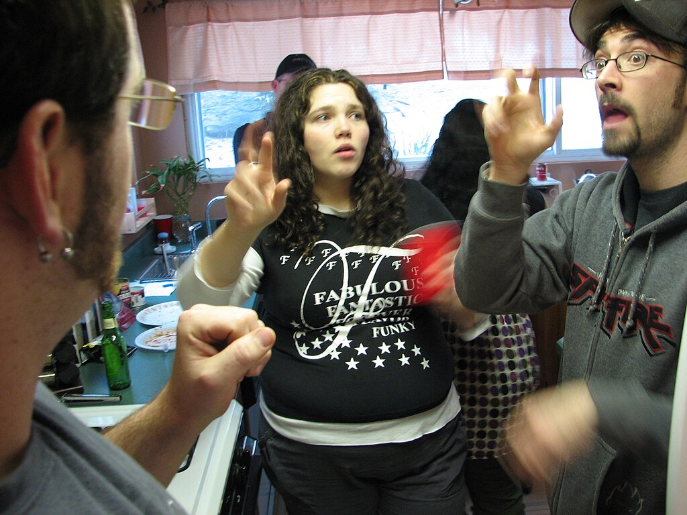A conversation in [American Sign Language](https://en.wikipedia.org/wiki/American_Sign_Language "American Sign Language")

Yet another definition sees language as a system of communication that enables humans to exchange verbal or symbolic utterances. This definition stresses the social functions of language and the fact that humans use it to express themselves and to manipulate objects in their environment. [Functional theories of grammar](https://en.wikipedia.org/wiki/Functional_theories_of_grammar "Functional theories of grammar") explain grammatical structures by their communicative functions, and understand the grammatical structures of language to be the result of an adaptive process by which grammar was "tailored" to serve the communicative needs of its users.

This view of language is associated with the study of language in [pragmatic](https://en.wikipedia.org/wiki/Pragmatics "Pragmatics"), [cognitive](https://en.wikipedia.org/wiki/Cognitive_linguistics "Cognitive linguistics"), and interactive frameworks, as well as in [sociolinguistics](https://en.wikipedia.org/wiki/Sociolinguistics "Sociolinguistics") and [linguistic anthropology](https://en.wikipedia.org/wiki/Linguistic_anthropology "Linguistic anthropology"). Functionalist theories tend to study grammar as dynamic phenomena, as structures that are always in the process of changing as they are employed by their speakers. This view places importance on the study of [linguistic typology](https://en.wikipedia.org/wiki/Linguistic_typology "Linguistic typology"), or the classification of languages according to structural features, as processes of [grammaticalization](https://en.wikipedia.org/wiki/Grammaticalization "Grammaticalization") tend to follow trajectories that are partly dependent on typology. In the philosophy of language, the view of pragmatics as being central to language and meaning is often associated with [Wittgenstein's](https://en.wikipedia.org/wiki/Ludwig_Wittgenstein "Ludwig Wittgenstein") later works and with ordinary language philosophers such as [J. L. Austin](https://en.wikipedia.org/wiki/J._L._Austin "J. L. Austin"), [Paul Grice](https://en.wikipedia.org/wiki/Paul_Grice "Paul Grice"), [John Searle](https://en.wikipedia.org/wiki/John_Searle_\(American_philosopher\) "John Searle (American philosopher)"), and [W.O. Quine](https://en.wikipedia.org/wiki/Willard_van_Orman_Quine "Willard van Orman Quine").

### Human versus animal language

A number of features, many of which were described by [Charles Hockett](https://en.wikipedia.org/wiki/Charles_Hockett "Charles Hockett") and called [design features](https://en.wikipedia.org/wiki/Hockett's_design_features "Hockett's design features") set human language apart from communication used by non-human [animals](https://en.wikipedia.org/wiki/Animal_language "Animal language").

Communication systems used by other animals such as [bees](https://en.wikipedia.org/wiki/Bee_learning_and_communication "Bee learning and communication") or [apes](https://en.wikipedia.org/wiki/Great_ape_language "Great ape language") are closed systems that consist of a finite, usually very limited, number of possible ideas that can be expressed. In contrast, human language is open-ended and [productive](https://en.wikipedia.org/wiki/Productivity_\(linguistics\) "Productivity (linguistics)"), meaning that it allows humans to produce a vast range of utterances from a finite set of elements, and to create new words and sentences. This is possible because human language is based on a dual code, in which a finite number of elements which are meaningless in themselves (e.g. sounds, letters or gestures) can be combined to form an infinite number of larger units of meaning (words and sentences). However, one study has demonstrated that an Australian bird, the [chestnut-crowned babbler](https://en.wikipedia.org/wiki/Chestnut-crowned_babbler "Chestnut-crowned babbler"), is capable of using the same acoustic elements in different arrangements to create two functionally distinct vocalizations. Additionally, [pied babblers](https://en.wikipedia.org/wiki/Southern_pied_babbler "Southern pied babbler") have demonstrated the ability to generate two functionally distinct vocalisations composed of the same sound type, which can only be distinguished by the number of repeated elements.

Several species of animals have proved to be able to acquire forms of communication through social learning: for instance a [bonobo](https://en.wikipedia.org/wiki/Bonobo "Bonobo") named [Kanzi](https://en.wikipedia.org/wiki/Kanzi "Kanzi") learned to express itself using a set of symbolic [lexigrams](https://en.wikipedia.org/wiki/Yerkish#Lexigram_concept "Yerkish"). Similarly, many species of birds and whales learn their songs by imitating other members of their species. However, while some animals may acquire large numbers of words and symbols, none have been able to learn as many different signs as are generally known by an average 4 year old human, nor have any acquired anything resembling the complex grammar of human language.

Human languages differ from animal communication systems in that they employ [grammatical and semantic categories](https://en.wikipedia.org/wiki/Grammatical_categories "Grammatical categories"), such as noun and verb, present and past, which may be used to express exceedingly complex meanings. It is distinguished by the property of [recursivity](https://en.wikipedia.org/wiki/Recursion#In_language "Recursion"): for example, a noun phrase can contain another noun phrase (as in "\[\[the chimpanzee\]'s lips\]") or a clause can contain another clause (as in "\[I see \[the dog is running\]\]"). Human language is the only known natural communication system whose adaptability may be referred to as _modality independent_. This means that it can be used not only for communication through one channel or medium, but through several. For example, spoken language uses the auditive modality, whereas [sign languages](https://en.wikipedia.org/wiki/Sign_language "Sign language") and writing use the visual modality, and [braille](https://en.wikipedia.org/wiki/Braille "Braille") writing uses the tactile modality.

Human language is unusual in being able to refer to abstract concepts and to imagined or hypothetical events as well as events that took place in the past or may happen in the future. This ability to refer to events that are not at the same time or place as the speech event is called _[displacement](https://en.wikipedia.org/wiki/Displacement_\(linguistics\) "Displacement (linguistics)")_, and while some animal communication systems can use displacement (such as the communication of [bees](https://en.wikipedia.org/wiki/Bee "Bee") that can communicate the location of sources of nectar that are out of sight), the degree to which it is used in human language is also considered unique.

## Origin

_[The Tower of Babel](https://en.wikipedia.org/wiki/The_Tower_of_Babel_\(Bruegel\) "The Tower of Babel (Bruegel)")_ by [Pieter Bruegel the Elder](https://en.wikipedia.org/wiki/Pieter_Bruegel_the_Elder "Pieter Bruegel the Elder"). Oil on board, 1563.
Humans have speculated about the origins of language throughout history. The [Biblical myth](https://en.wikipedia.org/wiki/Christian_mythology "Christian mythology") of the [Tower of Babel](https://en.wikipedia.org/wiki/Tower_of_Babel "Tower of Babel") is one such account; other cultures have different stories of how language arose.

Theories about the origin of language differ in regard to their basic assumptions about what language is. Some theories are based on the idea that language is so complex that one cannot imagine it simply appearing from nothing in its final form, but that it must have evolved from earlier pre-linguistic systems among our pre-human ancestors. These theories can be called continuity-based theories. The opposite viewpoint is that language is such a unique human trait that it cannot be compared to anything found among non-humans and that it must therefore have appeared suddenly in the transition from pre-hominids to early man. These theories can be defined as discontinuity-based. Similarly, theories based on the generative view of language pioneered by [Noam Chomsky](https://en.wikipedia.org/wiki/Noam_Chomsky "Noam Chomsky") see language mostly as an innate faculty that is largely genetically encoded, whereas functionalist theories see it as a system that is largely cultural, learned through social interaction.

Continuity-based theories are held by a majority of scholars, but they vary in how they envision this development. Those who see language as being mostly innate, such as psychologist [Steven Pinker](https://en.wikipedia.org/wiki/Steven_Pinker "Steven Pinker"), hold the precedents to be [animal cognition](https://en.wikipedia.org/wiki/Animal_cognition "Animal cognition"), whereas those who see language as a socially learned tool of communication, such as psychologist [Michael Tomasello](https://en.wikipedia.org/wiki/Michael_Tomasello "Michael Tomasello"), see it as having developed from [animal communication](https://en.wikipedia.org/wiki/Animal_communication "Animal communication") in primates: either gestural or vocal communication to assist in cooperation. Other continuity-based models see language as having developed from [music](https://en.wikipedia.org/wiki/Music "Music"), a view already espoused by [Rousseau](https://en.wikipedia.org/wiki/Jean-Jacques_Rousseau "Jean-Jacques Rousseau"), [Herder](https://en.wikipedia.org/wiki/Johann_Gottfried_Herder "Johann Gottfried Herder"), [Humboldt](https://en.wikipedia.org/wiki/Wilhelm_von_Humboldt "Wilhelm von Humboldt"), and [Charles Darwin](https://en.wikipedia.org/wiki/Charles_Darwin "Charles Darwin"). A prominent proponent of this view is archaeologist [Steven Mithen](https://en.wikipedia.org/wiki/Steven_Mithen "Steven Mithen"). [Stephen Anderson](https://en.wikipedia.org/wiki/Stephen_R._Anderson "Stephen R. Anderson") states that the age of spoken languages is estimated at 60,000 to 100,000 years and that:

> Researchers on the evolutionary origin of language generally find it plausible to suggest that language was invented only once, and that all modern spoken languages are thus in some way related, even if that relation can no longer be recovered ... because of limitations on the methods available for reconstruction.

Because language emerged in the early [prehistory](https://en.wikipedia.org/wiki/Prehistory "Prehistory") of man, before the existence of any written records, its early development has left no historical traces, and it is believed that no comparable processes can be observed today. Theories that stress continuity often look at animals to see if, for example, primates display any traits that can be seen as analogous to what pre-human language must have been like. Early human fossils can be inspected for traces of physical adaptation to language use or pre-linguistic forms of symbolic behaviour. Among the signs in human fossils that may suggest linguistic abilities are: the size of the brain relative to body mass, the presence of a [larynx](https://en.wikipedia.org/wiki/Larynx "Larynx") capable of advanced sound production and the nature of tools and other manufactured artifacts.

It was mostly undisputed that pre-human [australopithecines](https://en.wikipedia.org/wiki/Australopithecine "Australopithecine") did not have communication systems significantly different from those found in [great apes](https://en.wikipedia.org/wiki/Great_ape "Great ape") in general. However, a 2017 study on _[Ardipithecus ramidus](https://en.wikipedia.org/wiki/Origin_of_language#Ardipithecus_ramidus "Origin of language")_ challenges this belief. Scholarly opinions vary as to the developments since the appearance of the genus _[Homo](https://en.wikipedia.org/wiki/Homo "Homo")_ some 2.5 million years ago. Some scholars assume the development of primitive language-like systems (proto-language) as early as _[Homo habilis](https://en.wikipedia.org/wiki/Homo_habilis "Homo habilis")_ (2.3 million years ago) while others place the development of primitive symbolic communication only with _[Homo erectus](https://en.wikipedia.org/wiki/Homo_erectus "Homo erectus")_ (1.8 million years ago) or _[Homo heidelbergensis](https://en.wikipedia.org/wiki/Homo_heidelbergensis "Homo heidelbergensis")_ (0.6 million years ago), and the development of language proper with [anatomically modern _Homo sapiens_](https://en.wikipedia.org/wiki/Anatomically_modern_humans "Anatomically modern humans") with the [Upper Paleolithic revolution](https://en.wikipedia.org/wiki/Behavioral_modernity "Behavioral modernity") less than 100,000 years ago.

Chomsky is one prominent proponent of a discontinuity-based theory of human language origins. He suggests that for scholars interested in the nature of language, "talk about the evolution of the language capacity is beside the point." Chomsky proposes that perhaps "some random mutation took place \[...\] and it reorganized the brain, implanting a language organ in an otherwise primate brain." Though cautioning against taking this story literally, Chomsky insists that "it may be closer to reality than many other fairy tales that are told about evolutionary processes, including language."

In March 2024, researchers reported that the beginnings of human language began about 1.6 million years ago.

## Study

[William Jones](https://en.wikipedia.org/wiki/William_Jones_\(philologist\) "William Jones (philologist)") discovered the family relation between [Latin](https://en.wikipedia.org/wiki/Latin "Latin") and [Sanskrit](/source/sanskrit/ "Sanskrit"), laying the ground for the discipline of [historical linguistics](https://en.wikipedia.org/wiki/Historical_linguistics "Historical linguistics").

The study of language, [linguistics](https://en.wikipedia.org/wiki/Linguistics "Linguistics"), has been developing into a science since the first grammatical descriptions of particular languages in [India](https://en.wikipedia.org/wiki/India "India") more than 2000 years ago, after the development of the [Brahmi script](https://en.wikipedia.org/wiki/Brahmi_script "Brahmi script"). Modern linguistics is a science that concerns itself with all aspects of language, examining it from all of the theoretical viewpoints described above.

### Subdisciplines

The academic study of language is conducted within many different disciplinary areas and from different theoretical angles, all of which inform modern approaches to linguistics. For example, [descriptive linguistics](https://en.wikipedia.org/wiki/Descriptive_linguistics "Descriptive linguistics") examines the grammar of single languages, [theoretical linguistics](https://en.wikipedia.org/wiki/Theoretical_linguistics "Theoretical linguistics") develops theories on how best to conceptualize and define the nature of language based on data from the various extant human languages, [sociolinguistics](https://en.wikipedia.org/wiki/Sociolinguistics "Sociolinguistics") studies how languages are used for social purposes informing in turn the study of the social functions of language and grammatical description, [neurolinguistics](https://en.wikipedia.org/wiki/Neurolinguistics "Neurolinguistics") studies how language is processed in the human brain and allows the experimental testing of theories, [computational linguistics](https://en.wikipedia.org/wiki/Computational_linguistics "Computational linguistics") builds on theoretical and descriptive linguistics to construct computational models of language often aimed at processing natural language or at testing linguistic hypotheses, and [historical linguistics](https://en.wikipedia.org/wiki/Historical_linguistics "Historical linguistics") relies on grammatical and lexical descriptions of languages to trace their individual histories and reconstruct trees of language families by using the [comparative method](https://en.wikipedia.org/wiki/Comparative_method "Comparative method").

### Early history

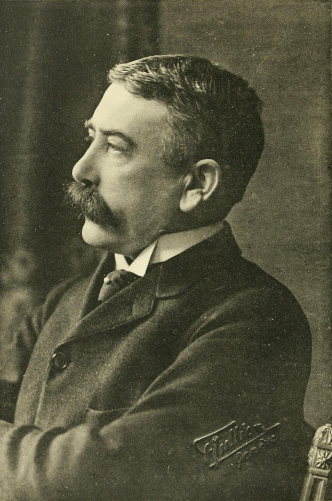[Ferdinand de Saussure](https://en.wikipedia.org/wiki/Ferdinand_de_Saussure "Ferdinand de Saussure") developed the [structuralist](https://en.wikipedia.org/wiki/Structuralism "Structuralism") approach to studying language.

The formal study of language is often considered to have started in [India](https://en.wikipedia.org/wiki/India "India") with [Pāṇini](https://en.wikipedia.org/wiki/Pāṇini "Pāṇini"), the 5th century BC grammarian who formulated 3,959 rules of [Sanskrit](/source/sanskrit/ "Sanskrit") [morphology](https://en.wikipedia.org/wiki/Morphology_\(linguistics\) "Morphology (linguistics)"). However, [Sumerian](https://en.wikipedia.org/wiki/Sumer "Sumer") scribes already studied the differences between [Sumerian](https://en.wikipedia.org/wiki/Sumerian_language "Sumerian language") and [Akkadian](https://en.wikipedia.org/wiki/Akkadian_language "Akkadian language") grammar around 1900 BC. Subsequent grammatical traditions developed in all of the ancient cultures that adopted writing.

In the 17th century AD, the French [Port-Royal Grammarians](https://en.wikipedia.org/wiki/Port-Royal_Grammar "Port-Royal Grammar") developed the idea that the grammars of all languages were a reflection of the universal basics of thought, and therefore that grammar was universal. In the 18th century, the first use of the [comparative method](https://en.wikipedia.org/wiki/Comparative_method "Comparative method") by British [philologist](https://en.wikipedia.org/wiki/Philologist "Philologist") and expert on ancient India [William Jones](https://en.wikipedia.org/wiki/William_Jones_\(philologist\) "William Jones (philologist)") sparked the rise of [comparative linguistics](https://en.wikipedia.org/wiki/Comparative_linguistics "Comparative linguistics"). The scientific study of language was broadened from Indo-European to language in general by [Wilhelm von Humboldt](https://en.wikipedia.org/wiki/Wilhelm_von_Humboldt "Wilhelm von Humboldt"). Early in the 20th century, [Ferdinand de Saussure](https://en.wikipedia.org/wiki/Ferdinand_de_Saussure "Ferdinand de Saussure") introduced the idea of language as a static system of interconnected units, defined through the oppositions between them.

By introducing a distinction between [diachronic](https://en.wikipedia.org/wiki/Diachronic_linguistics "Diachronic linguistics") and [synchronic](https://en.wikipedia.org/wiki/Synchronic_linguistics "Synchronic linguistics") analyses of language, he laid the foundation of the modern discipline of linguistics. Saussure also introduced several basic dimensions of linguistic analysis that are still fundamental in many contemporary linguistic theories, such as the distinctions between [syntagm](https://en.wikipedia.org/wiki/Syntagmatic_analysis "Syntagmatic analysis") and [paradigm](https://en.wikipedia.org/wiki/Paradigmatic_analysis "Paradigmatic analysis"), and the [Langue-parole distinction](https://en.wikipedia.org/wiki/Langue_and_parole "Langue and parole"), distinguishing language as an abstract system (_langue_), from language as a concrete manifestation of this system (_parole_).

### Modern linguistics

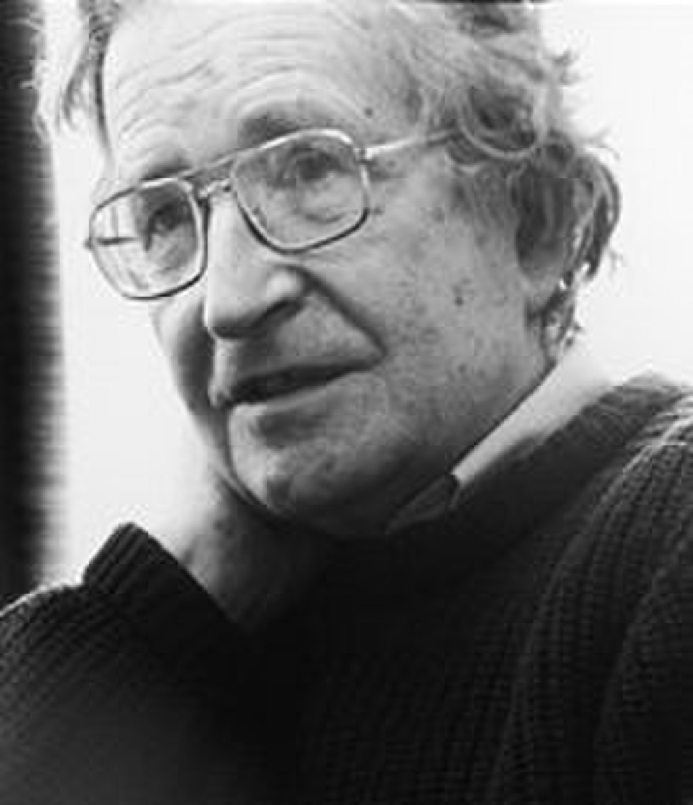[Noam Chomsky](https://en.wikipedia.org/wiki/Noam_Chomsky "Noam Chomsky") is one of the most important linguistic theorists of the 20th century.

In the 1960s, [Noam Chomsky](https://en.wikipedia.org/wiki/Noam_Chomsky "Noam Chomsky") formulated the [generative theory of language](https://en.wikipedia.org/wiki/Generative_linguistics "Generative linguistics"). According to this theory, the most basic form of language is a set of syntactic rules that is universal for all humans and which underlies the grammars of all human languages. This set of rules is called [Universal Grammar](https://en.wikipedia.org/wiki/Universal_Grammar "Universal Grammar"); for Chomsky, describing it is the primary objective of the discipline of linguistics. Thus, he considered that the grammars of individual languages are only of importance to linguistics insofar as they allow us to deduce the universal underlying rules from which the observable linguistic variability is generated.

In opposition to the formal theories of the generative school, [functional theories of language](https://en.wikipedia.org/wiki/Functional_theories_of_grammar "Functional theories of grammar") propose that since language is fundamentally a tool, its structures are best analyzed and understood by reference to their functions. [Formal theories of grammar](https://en.wikipedia.org/wiki/Formal_grammar "Formal grammar") seek to define the different elements of language and describe the way they relate to each other as systems of formal rules or operations, while functional theories seek to define the functions performed by language and then relate them to the linguistic elements that carry them out. The framework of [cognitive linguistics](https://en.wikipedia.org/wiki/Cognitive_linguistics "Cognitive linguistics") interprets language in terms of the concepts (which are sometimes universal, and sometimes specific to a particular language) which underlie its forms. Cognitive linguistics is primarily concerned with how the mind creates meaning through language.

## Physiological and neural architecture of language and speech

Speaking is the default modality for language in all cultures with hearing members. The production of spoken language depends on sophisticated capacities for controlling the lips, tongue and other components of the vocal apparatus, the ability to acoustically decode speech sounds, and the neurological apparatus required for acquiring and producing language. The study of the [genetic](https://en.wikipedia.org/wiki/Genetics "Genetics") bases for human language is at an early stage: the only gene that has definitely been implicated in language production is [FOXP2](https://en.wikipedia.org/wiki/FOXP2 "FOXP2"), which may cause a kind of [congenital language disorder](https://en.wikipedia.org/wiki/Developmental_verbal_dyspraxia "Developmental verbal dyspraxia") if affected by [mutations](https://en.wikipedia.org/wiki/Mutation "Mutation").

### The brain

Language Areas of the brain.

 [Angular gyrus](https://en.wikipedia.org/wiki/Angular_gyrus "Angular gyrus")

 [Supramarginal gyrus](https://en.wikipedia.org/wiki/Supramarginal_gyrus "Supramarginal gyrus")

 [Broca's area](https://en.wikipedia.org/wiki/Broca's_area "Broca's area")

 [Wernicke's area](https://en.wikipedia.org/wiki/Wernicke's_area "Wernicke's area")

 [Primary auditory cortex](https://en.wikipedia.org/wiki/Primary_auditory_cortex "Primary auditory cortex")

The brain is the coordinating center of all linguistic activity; it controls both the production of linguistic cognition and of meaning and the mechanics of speech production. Nonetheless, our knowledge of the neurological bases for language is quite limited, though it has advanced considerably with the use of modern imaging techniques. The discipline of linguistics dedicated to studying the neurological aspects of language is called [neurolinguistics](https://en.wikipedia.org/wiki/Neurolinguistics "Neurolinguistics").

Early work in neurolinguistics involved the study of language in people with brain lesions, to see how lesions in specific areas affect language and speech. In this way, neuroscientists in the 19th century discovered that two areas in the brain are crucially implicated in language processing. The first area is [Wernicke's area](https://en.wikipedia.org/wiki/Wernicke's_area "Wernicke's area"), which is in the posterior section of the [superior temporal gyrus](https://en.wikipedia.org/wiki/Superior_temporal_gyrus "Superior temporal gyrus") in the dominant cerebral hemisphere. People with a lesion in this area of the brain develop [receptive aphasia](https://en.wikipedia.org/wiki/Receptive_aphasia "Receptive aphasia"), a condition in which there is a major impairment of language comprehension, while speech retains a natural-sounding rhythm and a relatively normal [sentence structure](https://en.wikipedia.org/wiki/Syntax "Syntax"). The second area is [Broca's area](https://en.wikipedia.org/wiki/Broca's_area "Broca's area"), in the posterior [inferior frontal gyrus](https://en.wikipedia.org/wiki/Inferior_frontal_gyrus "Inferior frontal gyrus") of the dominant hemisphere. People with a lesion to this area develop [expressive aphasia](https://en.wikipedia.org/wiki/Expressive_aphasia "Expressive aphasia"), meaning that they know what they want to say, they just cannot get it out. They are typically able to understand what is being said to them, but unable to speak fluently. Other symptoms that may be present in expressive aphasia include problems with [word repetition](https://en.wikipedia.org/wiki/Word_repetition "Word repetition"). The condition affects both spoken and written language. Those with this aphasia also exhibit ungrammatical speech and show inability to use syntactic information to determine the meaning of sentences. Both expressive and receptive aphasia also affect the use of sign language, in analogous ways to how they affect speech, with expressive aphasia causing signers to sign slowly and with incorrect grammar, whereas a signer with receptive aphasia will sign fluently, but make little sense to others and have difficulties comprehending others' signs. This shows that the impairment is specific to the ability to use language, not to the physiology used for speech production.

With technological advances in the late 20th century, neurolinguists have also incorporated non-invasive techniques such as [functional magnetic resonance imaging](https://en.wikipedia.org/wiki/Functional_magnetic_resonance_imaging "Functional magnetic resonance imaging") (fMRI) and [electrophysiology](https://en.wikipedia.org/wiki/Electrophysiology "Electrophysiology") to study language processing in individuals without impairments.

### Anatomy of speech

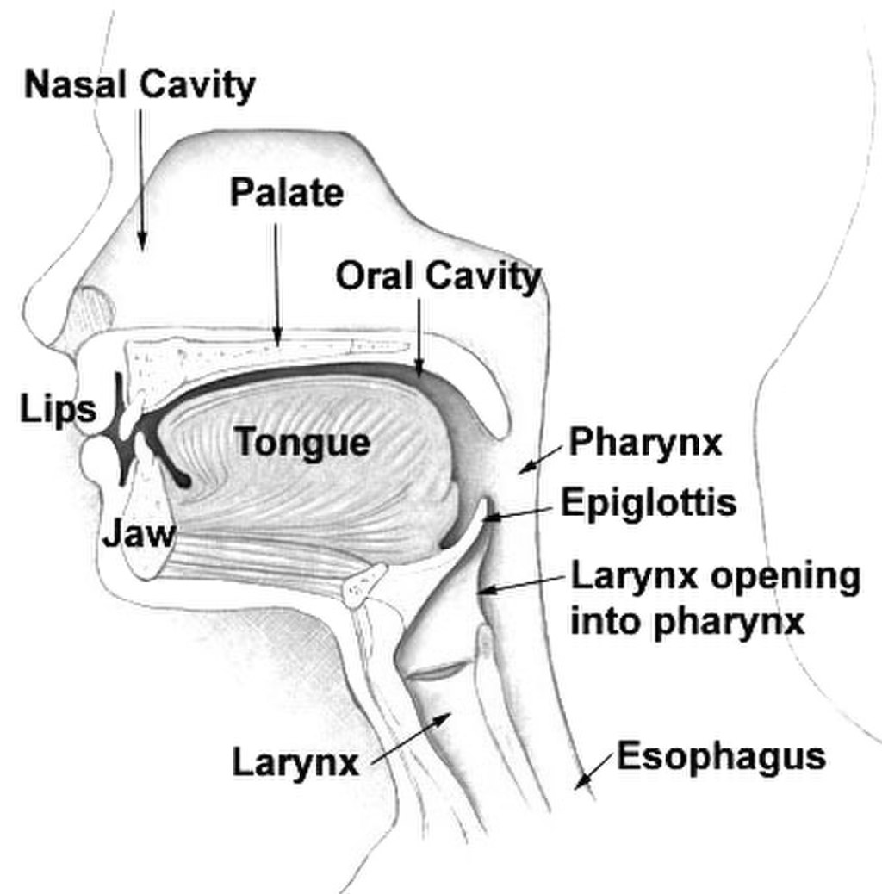

The human vocal tract

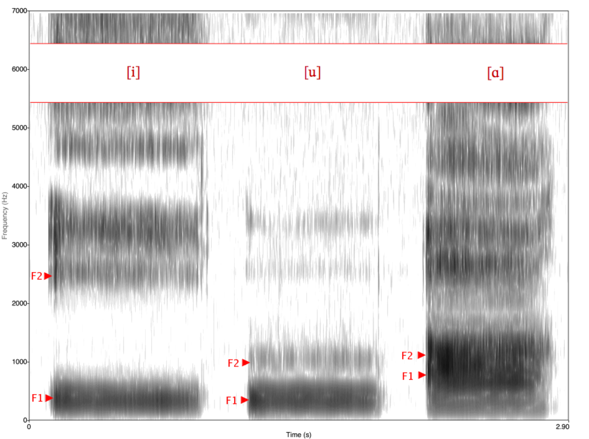

[Spectrogram](https://en.wikipedia.org/wiki/Spectrogram "Spectrogram") of American English vowels \[i,u,ɑ\] showing the formants _f_1 and _f_2

Real time [MRI scan](https://en.wikipedia.org/wiki/MRI_scan "MRI scan") of a person speaking in Mandarin Chinese

Spoken language relies on human physical ability to produce [sound](https://en.wikipedia.org/wiki/Sound "Sound"), which is a longitudinal wave propagated through the air at a frequency capable of vibrating the [ear drum](https://en.wikipedia.org/wiki/Ear_drum "Ear drum"). This ability depends on the physiology of the human speech organs. These organs consist of the lungs, the voice box ([larynx](https://en.wikipedia.org/wiki/Larynx "Larynx")), and the upper vocal tract – the throat, the mouth, and the nose. By controlling the different parts of the speech apparatus, the airstream can be manipulated to produce different speech sounds.

The sound of speech can be analyzed into a combination of [segmental and suprasegmental](https://en.wikipedia.org/wiki/Segment_\(linguistics\) "Segment (linguistics)") elements. The segmental elements are those that follow each other in sequences, which are usually represented by distinct letters in alphabetic scripts, such as the Roman script. In free flowing speech, there are no clear boundaries between one segment and the next, nor usually are there any audible pauses between them. Segments therefore are distinguished by their distinct sounds which are a result of their different articulations, and can be either vowels or consonants. Suprasegmental phenomena encompass such elements as [stress](https://en.wikipedia.org/wiki/Stress_\(linguistics\) "Stress (linguistics)"), [phonation](https://en.wikipedia.org/wiki/Phonation "Phonation") type, voice [timbre](https://en.wikipedia.org/wiki/Timbre "Timbre"), and [prosody](https://en.wikipedia.org/wiki/Prosody_\(linguistics\) "Prosody (linguistics)") or [intonation](https://en.wikipedia.org/wiki/Intonation_\(linguistics\) "Intonation (linguistics)"), all of which may have effects across multiple segments.

[Consonants](https://en.wikipedia.org/wiki/Consonant "Consonant") and [vowel](https://en.wikipedia.org/wiki/Vowel "Vowel") segments combine to form [syllables](https://en.wikipedia.org/wiki/Syllable "Syllable"), which in turn combine to form utterances; these can be distinguished phonetically as the space between two inhalations. [Acoustically](https://en.wikipedia.org/wiki/Acoustics "Acoustics"), these different segments are characterized by different [formant](https://en.wikipedia.org/wiki/Formant "Formant") structures, that are visible in a [spectrogram](https://en.wikipedia.org/wiki/Spectrogram "Spectrogram") of the recorded sound wave. Formants are the amplitude peaks in the frequency spectrum of a specific sound.

Vowels are those sounds that have no audible friction caused by the narrowing or obstruction of some part of the upper vocal tract. They vary in quality according to the degree of lip aperture and the placement of the tongue within the oral cavity. Vowels are called _[close](https://en.wikipedia.org/wiki/Close_vowel "Close vowel")_ when the lips are relatively closed, as in the pronunciation of the vowel \[i\] (English "ee"), or _[open](https://en.wikipedia.org/wiki/Open_vowel "Open vowel")_ when the lips are relatively open, as in the vowel \[a\] (English "ah"). If the tongue is located towards the back of the mouth, the quality changes, creating vowels such as \[u\] (English "oo"). The quality also changes depending on whether the lips are [rounded](https://en.wikipedia.org/wiki/Roundedness "Roundedness") as opposed to unrounded, creating distinctions such as that between \[i\] (unrounded front vowel such as English "ee") and \[y\] ([rounded front vowel](https://en.wikipedia.org/wiki/Rounded_front_vowel "Rounded front vowel") such as German "ü").

Consonants are those sounds that have audible friction or closure at some point within the upper vocal tract. Consonant sounds vary by place of articulation, i.e. the place in the vocal tract where the airflow is obstructed, commonly at the lips, teeth, [alveolar ridge](https://en.wikipedia.org/wiki/Alveolar_ridge "Alveolar ridge"), [palate](https://en.wikipedia.org/wiki/Palate "Palate"), [velum](https://en.wikipedia.org/wiki/Soft_palate "Soft palate"), [uvula](https://en.wikipedia.org/wiki/Uvula "Uvula"), or [glottis](https://en.wikipedia.org/wiki/Glottis "Glottis"). Each place of articulation produces a different set of consonant sounds, which are further distinguished by [manner of articulation](https://en.wikipedia.org/wiki/Manner_of_articulation "Manner of articulation"), or the kind of friction, whether full closure, in which case the consonant is called _[occlusive](https://en.wikipedia.org/wiki/Occlusive "Occlusive")_ or _[stop](https://en.wikipedia.org/wiki/Stop_consonant "Stop consonant")_, or different degrees of aperture creating _[fricatives](https://en.wikipedia.org/wiki/Fricative "Fricative")_ and _[approximants](https://en.wikipedia.org/wiki/Approximant_consonant "Approximant consonant")_. Consonants can also be either _[voiced or unvoiced](https://en.wikipedia.org/wiki/Voice_\(phonetics\) "Voice (phonetics)")_, depending on whether the vocal cords are set in vibration by airflow during the production of the sound. Voicing is what separates English \[s\] in _bus_ ([unvoiced sibilant](https://en.wikipedia.org/wiki/Sibilant "Sibilant")) from \[z\] in _buzz_ ([voiced sibilant](https://en.wikipedia.org/wiki/Voiced_alveolar_sibilant "Voiced alveolar sibilant")).

Some speech sounds, both vowels and consonants, involve release of air flow through the nasal cavity, and these are called _[nasals](https://en.wikipedia.org/wiki/Nasal_consonant "Nasal consonant")_ or _[nasalized](https://en.wikipedia.org/wiki/Nasalization "Nasalization")_ sounds. Other sounds are defined by the way the tongue moves within the mouth such as the l-sounds (called _[laterals](https://en.wikipedia.org/wiki/Lateral_consonant "Lateral consonant")_, because the air flows along both sides of the tongue), and the r-sounds (called _[rhotics](https://en.wikipedia.org/wiki/Rhotics "Rhotics")_).

By using these speech organs, humans can produce hundreds of distinct sounds: some appear very often in the world's languages, whereas others are much more common in certain language families, language areas, or even specific to a single language.

## Modality

Human languages display considerable plasticity in their deployment of two fundamental modes: oral (speech and [mouthing](https://en.wikipedia.org/wiki/Mouthing "Mouthing")) and manual (sign and gesture). For example, it is common for oral language to be accompanied by gesture, and for sign language to be accompanied by [mouthing](https://en.wikipedia.org/wiki/Mouthing "Mouthing"). In addition, some language communities use both modes to convey lexical or grammatical meaning, each mode complementing the other. Such bimodal use of language is especially common in genres such as story-telling (with [Plains Indian Sign Language](https://en.wikipedia.org/wiki/Plains_Indian_Sign_Language "Plains Indian Sign Language") and [Australian Aboriginal sign languages](https://en.wikipedia.org/wiki/Australian_Aboriginal_sign_languages "Australian Aboriginal sign languages") used alongside oral language, for example), but also occurs in mundane conversation. For instance, many Australian languages have a rich set of [case](https://en.wikipedia.org/wiki/Grammatical_case "Grammatical case") suffixes that provide details about the instrument used to perform an action. Others lack such grammatical precision in the oral mode, but supplement it with gesture to convey that information in the sign mode. In [Iwaidja](https://en.wikipedia.org/wiki/Iwaidja_language "Iwaidja language"), for example, 'he went out for fish using a torch' is spoken as simply "he-hunted fish torch", but the word for 'torch' is accompanied by a gesture indicating that it was held. In another example, the ritual language [Damin](https://en.wikipedia.org/wiki/Damin "Damin") had a heavily reduced oral vocabulary of only a few hundred words, each of which was very general in meaning, but which were supplemented by gesture for greater precision (e.g., the single word for fish, _l\*i_, was accompanied by a gesture to indicate the kind of fish).

Secondary modes of language, by which a fundamental mode is conveyed in a different medium, include [writing](https://en.wikipedia.org/wiki/Writing "Writing") (including [braille](https://en.wikipedia.org/wiki/Braille "Braille")), sign (in [manually coded language](https://en.wikipedia.org/wiki/Manually_coded_language "Manually coded language")), [whistling](https://en.wikipedia.org/wiki/Whistled_language "Whistled language") and [drumming](https://en.wikipedia.org/wiki/Talking_drum "Talking drum"). Tertiary modes – such as [semaphore](https://en.wikipedia.org/wiki/Semaphore "Semaphore"), [Morse code](https://en.wikipedia.org/wiki/Morse_code "Morse code") and [spelling alphabets](https://en.wikipedia.org/wiki/Spelling_alphabet "Spelling alphabet") – convey the secondary mode of writing in a different medium. For some extinct languages that are maintained for ritual or liturgical purposes, writing may be the primary mode, with speech secondary.

## Structure

When described as a system of [symbolic communication](https://en.wikipedia.org/wiki/Symbolic_communication "Symbolic communication"), language is traditionally seen as consisting of three parts: [signs](https://en.wikipedia.org/wiki/Sign_\(semiotics\) "Sign (semiotics)"), [meanings](https://en.wikipedia.org/wiki/Meaning_\(semiotics\) "Meaning (semiotics)"), and a [code](https://en.wikipedia.org/wiki/Code_\(semiotics\) "Code (semiotics)") connecting signs with their meanings. The study of the process of [semiosis](https://en.wikipedia.org/wiki/Semiosis "Semiosis"), how signs and meanings are combined, used, and interpreted is called [semiotics](https://en.wikipedia.org/wiki/Semiotics "Semiotics"). Signs can be composed of sounds, gestures, letters, or symbols, depending on whether the language is spoken, signed, or written, and they can be combined into complex signs, such as words and phrases. When used in communication, a sign is encoded and transmitted by a sender through a channel to a receiver who decodes it.

Ancient [Tamil](https://en.wikipedia.org/wiki/Tamil_language "Tamil language") inscription at [Thanjavur](https://en.wikipedia.org/wiki/Thanjavur "Thanjavur")

Some of the properties that define human language as opposed to other communication systems are: the arbitrariness of the linguistic sign, meaning that there is no predictable connection between a linguistic sign and its meaning; the duality of the linguistic system, meaning that linguistic structures are built by combining elements into larger structures that can be seen as layered, e.g. how sounds build words and words build phrases; the discreteness of the elements of language, meaning that the elements out of which linguistic signs are constructed are discrete units, e.g. sounds and words, that can be distinguished from each other and rearranged in different patterns; and the productivity of the linguistic system, meaning that the finite number of linguistic elements can be combined into a theoretically infinite number of combinations.

The rules by which signs can be combined to form words and phrases are called [syntax](https://en.wikipedia.org/wiki/Syntax "Syntax") or grammar. The meaning that is connected to individual signs, morphemes, words, phrases, and texts is called [semantics](https://en.wikipedia.org/wiki/Semantics "Semantics"). The division of language into separate but connected systems of sign and meaning goes back to the first linguistic studies of de Saussure and is now used in almost all branches of linguistics.

### Semantics

Languages express meaning by relating a sign form to a meaning, or its content. Sign forms must be something that can be perceived, for example, in sounds, images, or gestures, and then related to a specific meaning by social convention. Because the basic relation of meaning for most linguistic signs is based on social convention, linguistic signs can be considered arbitrary, in the sense that the convention is established socially and historically, rather than by means of a natural relation between a specific sign form and its meaning.

Thus, languages must have a [vocabulary](https://en.wikipedia.org/wiki/Vocabulary "Vocabulary") of signs related to specific meaning. The English sign "dog" denotes, for example, a member of the species _[Canis familiaris](https://en.wikipedia.org/wiki/Canis_familiaris "Canis familiaris")_. In a language, the array of arbitrary signs connected to specific meanings is called the [lexicon](https://en.wikipedia.org/wiki/Lexicon "Lexicon"), and a single sign connected to a meaning is called a [lexeme](https://en.wikipedia.org/wiki/Lexeme "Lexeme"). Not all meanings in a language are represented by single words. Often, semantic concepts are embedded in the morphology or syntax of the language in the form of [grammatical categories](https://en.wikipedia.org/wiki/Grammatical_category "Grammatical category").

All languages contain the semantic structure of [predication](https://en.wikipedia.org/wiki/Predicate_\(grammar\) "Predicate (grammar)"): a structure that predicates a property, state, or action. Traditionally, semantics has been understood to be the study of how speakers and interpreters assign [truth values](https://en.wikipedia.org/wiki/Truth_value "Truth value") to statements, so that meaning is understood to be the process by which a predicate can be said to be true or false about an entity, e.g. "\[x \[is y\]\]" or "\[x \[does y\]\]". Recently, this model of semantics has been complemented with more dynamic models of meaning that incorporate shared knowledge about the context in which a sign is interpreted into the production of meaning. Such models of meaning are explored in the field of [pragmatics](https://en.wikipedia.org/wiki/Pragmatics "Pragmatics").

### Sounds and symbols

A spectrogram showing the sound of the spoken English word "man", which is written phonetically as \[mæn\]. In flowing speech, there is no clear division between segments, only a smooth transition as the vocal apparatus moves.

The syllable "wi" in the [Hangul](https://en.wikipedia.org/wiki/Hangul "Hangul") script

The sign for "wi" in [Korean Sign Language](https://en.wikipedia.org/wiki/Korean_Sign_Language "Korean Sign Language") (see [Korean manual alphabet](https://en.wikipedia.org/wiki/Korean_manual_alphabet "Korean manual alphabet"))

Depending on modality, language structure can be based on systems of sounds (speech), gestures (sign languages), or graphic or tactile symbols (writing). The ways in which languages use sounds or signs to construct meaning are studied in [phonology](https://en.wikipedia.org/wiki/Phonology "Phonology").

Sounds as part of a linguistic system are called [phonemes](https://en.wikipedia.org/wiki/Phonemes "Phonemes"). Phonemes are abstract units of sound, defined as the smallest units in a language that can serve to distinguish between the meaning of a pair of minimally different words, a so-called [minimal pair](https://en.wikipedia.org/wiki/Minimal_pair "Minimal pair"). In English, for example, the words _bat_ \[bæt\] and _pat_ \[pʰæt\] form a minimal pair, in which the distinction between /b/ and /p/ differentiates the two words, which have different meanings. However, each language contrasts sounds in different ways. For example, in a language that does not distinguish between voiced and unvoiced consonants, the sounds \[p\] and \[b\] (if they both occur) could be considered a single phoneme, and consequently, the two pronunciations would have the same meaning. Similarly, the English language does not distinguish phonemically between [aspirated and non-aspirated](https://en.wikipedia.org/wiki/Aspiration_\(linguistics\) "Aspiration (linguistics)") pronunciations of consonants, as many other languages like [Korean](https://en.wikipedia.org/wiki/Korean_language "Korean language") and [Hindi](https://en.wikipedia.org/wiki/Hindi "Hindi") do: the unaspirated /p/ in _spin_ \[spɪn\] and the aspirated /p/ in _pin_ \[pʰɪn\] are considered to be merely different ways of pronouncing the same phoneme (such variants of a single phoneme are called [allophones](https://en.wikipedia.org/wiki/Allophones "Allophones")), whereas in [Mandarin Chinese](https://en.wikipedia.org/wiki/Mandarin_Chinese "Mandarin Chinese"), the same difference in pronunciation distinguishes between the words \[pʰá\] 'crouch' and \[pā\] 'eight' (the accent above the á means that the vowel is pronounced with a high tone and the accent above the ā means that the vowel is pronounced with a flat tone).

All [spoken languages](https://en.wikipedia.org/wiki/Oral_language "Oral language") have phonemes of at least two different categories, [vowels](https://en.wikipedia.org/wiki/Vowels "Vowels") and [consonants](https://en.wikipedia.org/wiki/Consonants "Consonants"), that can be combined to form [syllables](https://en.wikipedia.org/wiki/Syllable "Syllable"). As well as segments such as consonants and vowels, some languages also use sound in other ways to convey meaning. Many languages, for example, use [stress](https://en.wikipedia.org/wiki/Stress_\(linguistics\) "Stress (linguistics)"), [pitch](https://en.wikipedia.org/wiki/Pitch_accent "Pitch accent"), [duration](https://en.wikipedia.org/wiki/Vowel_length "Vowel length"), and [tone](https://en.wikipedia.org/wiki/Tonal_language "Tonal language") to distinguish meaning. Because these phenomena operate outside of the level of single segments, they are called [suprasegmental](https://en.wikipedia.org/wiki/Suprasegmental "Suprasegmental"). Some languages have only a few phonemes, for example, [Rotokas](https://en.wikipedia.org/wiki/Rotokas_language "Rotokas language") and [Pirahã language](https://en.wikipedia.org/wiki/Pirahã_language "Pirahã language") with 11 and 10 phonemes respectively, whereas languages like [Taa](https://en.wikipedia.org/wiki/Taa_language#Phonology "Taa language") may have as many as 141 phonemes. In [sign languages](https://en.wikipedia.org/wiki/Sign_language "Sign language"), [the equivalent to phonemes](https://en.wikipedia.org/wiki/Phoneme#Phonemes_in_sign_languages "Phoneme") (formerly called [cheremes](https://en.wikipedia.org/wiki/Chereme "Chereme")) are defined by the basic elements of gestures, such as hand shape, orientation, location, and motion, which correspond to manners of articulation in spoken language.

[Writing systems](/source/writing-system/ "Writing system") represent language using visual symbols, which may or may not correspond to the sounds of spoken language. The [Latin alphabet](https://en.wikipedia.org/wiki/Latin_alphabet "Latin alphabet") (and those on which it is based or that have been derived from it) was originally based on the representation of single sounds, so that words were constructed from letters that generally denote a single consonant or vowel in the structure of the word. In [syllabic scripts](https://en.wikipedia.org/wiki/Syllabary "Syllabary"), such as the [Inuktitut](https://en.wikipedia.org/wiki/Inuktitut "Inuktitut") syllabary, each sign represents a whole syllable. In [logographic](https://en.wikipedia.org/wiki/Logographic "Logographic") scripts, each sign represents an entire word, and will generally bear no relation to the sound of that word in spoken language.

Because all languages have a very large number of words, no purely logographic scripts are known to exist. Written language represents the way spoken sounds and words follow one after another by arranging symbols according to a pattern that follows a certain direction. The direction used in a writing system is entirely arbitrary and established by convention. Some writing systems use the horizontal axis (left to right as the Latin script or right to left as the [Arabic script](https://en.wikipedia.org/wiki/Arabic_script "Arabic script")), while others such as traditional Chinese writing use the vertical dimension (from top to bottom). A few writing systems use opposite directions for alternating lines, and others, such as the ancient Maya script, can be written in either direction and rely on graphic cues to show the reader the direction of reading.

In order to represent the sounds of the world's languages in writing, linguists have developed the [International Phonetic Alphabet](https://en.wikipedia.org/wiki/International_Phonetic_Alphabet "International Phonetic Alphabet"), designed to represent all of the discrete sounds that are known to contribute to meaning in human languages.

### Grammar

Grammar is the study of how meaningful elements called _[morphemes](https://en.wikipedia.org/wiki/Morpheme "Morpheme")_ within a language can be combined into utterances. Morphemes can either be _free_ or _bound_. If they are free to be moved around within an utterance, they are usually called _[words](https://en.wikipedia.org/wiki/Word "Word")_, and if they are bound to other words or morphemes, they are called [affixes](https://en.wikipedia.org/wiki/Affix "Affix"). The way in which meaningful elements can be combined within a language is governed by rules. The study of the rules for the internal structure of words are called [morphology](https://en.wikipedia.org/wiki/Morphology_\(linguistics\) "Morphology (linguistics)"). The rules of the internal structure of phrases and sentences are called _syntax_.

#### Grammatical categories

Grammar can be described as a system of categories and a set of rules that determine how categories combine to form different aspects of meaning. Languages differ widely in whether they are encoded through the use of categories or lexical units. However, several categories are so common as to be nearly universal. Such universal categories include the encoding of the grammatical relations of participants and predicates by grammatically [distinguishing between their relations](https://en.wikipedia.org/wiki/Morphosyntactic_alignment "Morphosyntactic alignment") to a predicate, the encoding of [temporal](https://en.wikipedia.org/wiki/Grammatical_tense "Grammatical tense") and [spatial](https://en.wikipedia.org/wiki/Preposition_and_postposition "Preposition and postposition") relations on predicates, and a system of [grammatical person](https://en.wikipedia.org/wiki/Grammatical_person "Grammatical person") governing reference to and distinction between speakers and addressees and those about whom they are speaking.

#### Word classes

Languages organize their [parts of speech](https://en.wikipedia.org/wiki/Parts_of_speech "Parts of speech") into classes according to their functions and positions relative to other parts. All languages, for instance, make a basic distinction between a group of words that prototypically denotes things and concepts and a group of words that prototypically denotes actions and events. The first group, which includes English words such as "dog" and "song", are usually called [nouns](https://en.wikipedia.org/wiki/Noun "Noun"). The second, which includes "think" and "sing", are called [verbs](https://en.wikipedia.org/wiki/Verb "Verb"). Another common category is the [adjective](https://en.wikipedia.org/wiki/Adjective "Adjective"): words that describe properties or qualities of nouns, such as "red" or "big". Word classes can be "open" if new words can continuously be added to the class, or relatively "closed" if there is a fixed number of words in a class. In English, the class of pronouns is closed, whereas the class of adjectives is open, since an infinite number of adjectives can be constructed from verbs (e.g. "saddened") or nouns (e.g. with the -like suffix, as in "noun-like"). In other languages such as [Korean](https://en.wikipedia.org/wiki/Korean_language "Korean language"), the situation is the opposite, and new pronouns can be constructed, whereas the number of adjectives is fixed.

Word classes also carry out differing functions in grammar. Prototypically, verbs are used to construct [predicates](https://en.wikipedia.org/wiki/Predicate_\(grammar\) "Predicate (grammar)"), while nouns are used as [arguments](https://en.wikipedia.org/wiki/Argument_\(linguistics\) "Argument (linguistics)") of predicates. In a sentence such as "Sally runs", the predicate is "runs", because it is the word that predicates a specific state about its argument "Sally". Some verbs such as "curse" can take two arguments, e.g. "Sally cursed John". A predicate that can only take a single argument is called [_intransitive_](https://en.wikipedia.org/wiki/Transitivity_\(grammar\) "Transitivity (grammar)"), while a predicate that can take two arguments is called [_transitive_](https://en.wikipedia.org/wiki/Transitive_verb "Transitive verb").

Many other word classes exist in different languages, such as [conjunctions](https://en.wikipedia.org/wiki/Conjunction_\(grammar\) "Conjunction (grammar)") like "and" that serve to join two sentences, [articles](https://en.wikipedia.org/wiki/Article_\(grammar\) "Article (grammar)") that introduce a noun, [interjections](https://en.wikipedia.org/wiki/Interjections "Interjections") such as "wow!", or [ideophones](https://en.wikipedia.org/wiki/Ideophones "Ideophones") like "splash" that mimic the sound of some event. Some languages have positionals that describe the spatial position of an event or entity. Many languages have [classifiers](https://en.wikipedia.org/wiki/Classifier_\(linguistics\) "Classifier (linguistics)") that identify countable nouns as belonging to a particular type or having a particular shape. For instance, in [Japanese](https://en.wikipedia.org/wiki/Japanese_language "Japanese language"), the general noun classifier for humans is _nin_ (人), and it is used for counting humans:

_san-nin no gakusei_ (三人の学生) lit. "3 human-classifier of student" – three students

For trees, it would be:

_san-bon no ki_ (三本の木) lit. "3 classifier-for-long-objects of tree" – three trees

#### Morphology

In linguistics, the study of the internal structure of complex words and the processes by which words are formed is called [morphology](https://en.wikipedia.org/wiki/Morphology_\(linguistics\) "Morphology (linguistics)"). In most languages, it is possible to construct complex words that are built of several [morphemes](https://en.wikipedia.org/wiki/Morpheme "Morpheme"). For instance, the English word "unexpected" can be analyzed as being composed of the three morphemes "un-", "expect" and "-ed".

Morphemes can be classified according to whether they are independent morphemes, so-called [roots](https://en.wikipedia.org/wiki/Root_\(linguistics\) "Root (linguistics)"), or whether they can only co-occur attached to other morphemes. These bound morphemes or [affixes](https://en.wikipedia.org/wiki/Affix "Affix") can be classified according to their position in relation to the root: _[prefixes](https://en.wikipedia.org/wiki/Prefix "Prefix")_ precede the root, [suffixes](https://en.wikipedia.org/wiki/Suffix "Suffix") follow the root, and [infixes](https://en.wikipedia.org/wiki/Infix "Infix") are inserted in the middle of a root. Affixes serve to modify or elaborate the meaning of the root. Some languages change the meaning of words by changing the phonological structure of a word, for example, the English word "run", which in the past tense is "ran". This process is called _[ablaut](https://en.wikipedia.org/wiki/Ablaut "Ablaut")_. Furthermore, morphology distinguishes between the process of [inflection](https://en.wikipedia.org/wiki/Inflection "Inflection"), which modifies or elaborates on a word, and the process of [derivation](https://en.wikipedia.org/wiki/Morphological_derivation "Morphological derivation"), which creates a new word from an existing one. In English, the verb "sing" has the inflectional forms "singing" and "sung", which are both verbs, and the derivational form "singer", which is a noun derived from the verb with the agentive suffix "-er".

Languages differ widely in how much they rely on morphological processes of word formation. In some languages, for example, Chinese, there are no morphological processes, and all grammatical information is encoded syntactically by forming strings of single words. This type of morpho-syntax is often called [isolating](https://en.wikipedia.org/wiki/Isolating_language "Isolating language"), or analytic, because there is almost a full correspondence between a single word and a single aspect of meaning. Most languages have words consisting of several morphemes, but they vary in the degree to which morphemes are discrete units. In many languages, notably in most Indo-European languages, single morphemes may have several distinct meanings that cannot be analyzed into smaller segments. For example, in Latin, the word _bonus_, or "good", consists of the root _bon-_, meaning "good", and the suffix -_us_, which indicates masculine gender, singular number, and [nominative](https://en.wikipedia.org/wiki/Nominative "Nominative") case. These languages are called _[fusional languages](https://en.wikipedia.org/wiki/Fusional_languages "Fusional languages")_, because several meanings may be fused into a single morpheme. The opposite of fusional languages are [agglutinative languages](https://en.wikipedia.org/wiki/Agglutinative_languages "Agglutinative languages") which construct words by stringing morphemes together in chains, but with each morpheme as a discrete semantic unit. An example of such a language is [Turkish](https://en.wikipedia.org/wiki/Turkish_language "Turkish language"), where for example, the word _evlerinizden_, or "from your houses", consists of the morphemes, _ev-ler-iniz-den_ with the meanings _house-plural-your-from_. The languages that rely on morphology to the greatest extent are traditionally called [polysynthetic languages](https://en.wikipedia.org/wiki/Polysynthetic_languages "Polysynthetic languages"). They may express the equivalent of an entire English sentence in a single word. For example, in [Persian](https://en.wikipedia.org/wiki/Persian_language "Persian language") the single word نفهمیدمش, _nafahmidamesh_ means _I didn't understand it_ consisting of morphemes _na-fahm-id-am-esh_ with the meanings, "negation.understand.past.I.it". As another example with more complexity, in the [Yupik](https://en.wikipedia.org/wiki/Yupik_language "Yupik language") word _tuntussuqatarniksatengqiggtuq_, which means "He had not yet said again that he was going to hunt reindeer", the word consists of the morphemes _tuntu-ssur-qatar-ni-ksaite-ngqiggte-uq_ with the meanings, "reindeer-hunt-future-say-negation-again-third.person.singular.indicative", and except for the morpheme _tuntu_ ("reindeer") none of the other morphemes can appear in isolation.

Many languages use morphology to cross-reference words within a sentence. This is sometimes called _[agreement](https://en.wikipedia.org/wiki/Agreement_\(linguistics\) "Agreement (linguistics)")_. For example, in many Indo-European languages, adjectives must cross-reference the noun they modify in terms of number, case, and gender, so that the Latin adjective _bonus_, or "good", is inflected to agree with a noun that is masculine gender, singular number, and nominative case. In many polysynthetic languages, verbs cross-reference their subjects and objects. In these types of languages, a single verb may include information that would require an entire sentence in English. For example, in the [Basque](https://en.wikipedia.org/wiki/Basque_language "Basque language") phrase _ikusi nauzu_, or "you saw me", the past tense auxiliary verb _n-au-zu_ (similar to English "do") agrees with both the subject (you) expressed by the _n_\- prefix, and with the object (me) expressed by the – _zu_ suffix. The sentence could be directly transliterated as "see you-did-me"

#### Syntax

In addition to word classes, a sentence can be analyzed in terms of grammatical functions: "The cat" is the [subject](https://en.wikipedia.org/wiki/Subject_\(grammar\) "Subject (grammar)") of the phrase, "on the mat" is a [locative](https://en.wikipedia.org/wiki/Locative_\(case\) "Locative (case)") phrase, and "sat" is the core of the [predicate](https://en.wikipedia.org/wiki/Predicate_\(grammar\) "Predicate (grammar)").

Another way in which languages convey meaning is through the order of words within a sentence. The grammatical rules for how to produce new sentences from words that are already known is called syntax. The syntactical rules of a language determine why a sentence in English such as "I love you" is meaningful, but "\*love you I" is not. Syntactical rules determine how word order and sentence structure is constrained, and how those constraints contribute to meaning. For example, in English, the two sentences "the slaves were cursing the master" and "the master was cursing the slaves" mean different things, because the role of the grammatical subject is encoded by the noun being in front of the verb, and the role of object is encoded by the noun appearing after the verb. Conversely, in [Latin](https://en.wikipedia.org/wiki/Latin_language "Latin language"), both _Dominus servos vituperabat_ and _Servos vituperabat dominus_ mean "the master was reprimanding the slaves", because _servos_, or "slaves", is in the [accusative case](https://en.wikipedia.org/wiki/Accusative_case "Accusative case"), showing that they are the [grammatical object](https://en.wikipedia.org/wiki/Object_\(grammar\) "Object (grammar)") of the sentence, and _dominus_, or "master", is in the [nominative case](https://en.wikipedia.org/wiki/Nominative_case "Nominative case"), showing that he is the subject.

Latin uses morphology to express the distinction between subject and object, whereas English uses word order. Another example of how syntactic rules contribute to meaning is the rule of [inverse word order in questions](https://en.wikipedia.org/wiki/Wh-movement "Wh-movement"), which exists in many languages. This rule explains why when in English, the phrase "John is talking to Lucy" is turned into a question, it becomes "Who is John talking to?", and not "John is talking to who?". The latter example may be used as a way of placing [special emphasis](https://en.wikipedia.org/wiki/Focus_\(linguistics\) "Focus (linguistics)") on "who", thereby slightly altering the meaning of the question. Syntax also includes the rules for how complex sentences are structured by grouping words together in units, called [phrases](https://en.wikipedia.org/wiki/Phrase "Phrase"), that can occupy different places in a larger syntactic structure. Sentences can be described as consisting of phrases connected in a tree structure, connecting the phrases to each other at different levels. To the right is a graphic representation of the syntactic analysis of the English sentence "the cat sat on the mat". The sentence is analyzed as being constituted by a noun phrase, a verb, and a prepositional phrase; the prepositional phrase is further divided into a preposition and a noun phrase, and the noun phrases consist of an article and a noun.

The reason sentences can be seen as being composed of phrases is because each phrase would be moved around as a single element if syntactic operations were carried out. For example, "the cat" is one phrase, and "on the mat" is another, because they would be treated as single units if a decision was made to emphasize the location by moving forward the prepositional phrase: "\[And\] on the mat, the cat sat". There are many different formalist and functionalist frameworks that propose theories for describing syntactic structures, based on different assumptions about what language is and how it should be described. Each of them would analyze a sentence such as this in a different manner.

### Typology and universals

Languages can be classified in relation to their grammatical types. Languages that belong to different families nonetheless often have features in common, and these shared features tend to correlate. For example, languages can be classified on the basis of their basic [word order](https://en.wikipedia.org/wiki/Word_order "Word order"), the relative order of the [verb](https://en.wikipedia.org/wiki/Verb "Verb"), and its constituents in a normal indicative [sentence](https://en.wikipedia.org/wiki/Sentence_\(linguistics\) "Sentence (linguistics)"). In English, the basic order is [SVO](https://en.wikipedia.org/wiki/Subject–verb–object "Subject–verb–object") (subject–verb–object): "The snake(S) bit(V) the man(O)", whereas for example, the corresponding sentence in the [Australian language](https://en.wikipedia.org/wiki/Australian_Aboriginal_languages "Australian Aboriginal languages") [Gamilaraay](https://en.wikipedia.org/wiki/Gamilaraay_language "Gamilaraay language") would be _d̪uyugu n̪ama d̪ayn yiːy_ (snake man bit), [SOV](https://en.wikipedia.org/wiki/Subject-object-verb "Subject-object-verb"). Word order type is relevant as a typological parameter, because basic word order type corresponds with other syntactic parameters, such as the relative order of nouns and adjectives, or of the use of [prepositions](https://en.wikipedia.org/wiki/Prepositions "Prepositions") or [postpositions](https://en.wikipedia.org/wiki/Postpositions "Postpositions"). Such correlations are called [implicational universals](https://en.wikipedia.org/wiki/Linguistic_universals "Linguistic universals"). For example, most (but not all) languages that are of the [SOV](https://en.wikipedia.org/wiki/Subject-object-verb "Subject-object-verb") type have postpositions rather than prepositions, and have adjectives before nouns.

All languages structure sentences into Subject, Verb, and Object, but languages differ in the way they classify the relations between actors and actions. English uses the [nominative-accusative](https://en.wikipedia.org/wiki/Nominative–accusative_language "Nominative–accusative language") word typology: in English transitive clauses, the subjects of both intransitive sentences ("I run") and transitive sentences ("I love you") are treated in the same way, shown here by the nominative pronoun _I_. Some languages, called [ergative](https://en.wikipedia.org/wiki/Ergativity "Ergativity"), Gamilaraay among them, distinguish instead between Agents and Patients. In ergative languages, the single participant in an intransitive sentence, such as "I run", is treated the same as the patient in a transitive sentence, giving the equivalent of "me run". Only in transitive sentences would the equivalent of the pronoun "I" be used. In this way the semantic roles can map onto the grammatical relations in different ways, grouping an intransitive subject either with Agents (accusative type) or Patients (ergative type) or even making each of the three roles differently, which is called the [tripartite type](https://en.wikipedia.org/wiki/Tripartite_language "Tripartite language").

The shared features of languages which belong to the same typological class type may have arisen completely independently. Their co-occurrence might be due to universal laws governing the structure of natural languages, "language universals", or they might be the result of languages evolving convergent solutions to the recurring communicative problems that humans use language to solve.

## Social contexts of use and transmission

_[Wall of Love](https://en.wikipedia.org/wiki/Wall_of_Love "Wall of Love")_ on [Montmartre](https://en.wikipedia.org/wiki/Montmartre "Montmartre") in Paris: "I love you" in 250 languages, by calligraphist Fédéric Baron and artist Claire Kito (2000)

While humans have the ability to learn any language, they only do so if they grow up in an environment in which language exists and is used by others. Language is therefore dependent on [communities of speakers](https://en.wikipedia.org/wiki/Speech_community "Speech community") in which children [learn language](https://en.wikipedia.org/wiki/Language_acquisition "Language acquisition") from their elders and peers and themselves transmit language to their own children. Languages are used by those who speak them to [communicate](https://en.wikipedia.org/wiki/Communicate "Communicate") and to solve a plethora of social tasks. Many aspects of language use can be seen to be adapted specifically to these purposes. Owing to the way in which language is transmitted between generations and within communities, language perpetually changes, diversifying into new languages or converging due to [language contact](https://en.wikipedia.org/wiki/Language_contact "Language contact"). The process is similar to the process of [evolution](https://en.wikipedia.org/wiki/Evolution "Evolution"), where the process of descent with modification leads to the formation of a [phylogenetic tree](https://en.wikipedia.org/wiki/Phylogenetic_tree "Phylogenetic tree").

However, languages differ from biological organisms in that they readily incorporate elements from other languages through the process of [diffusion](https://en.wikipedia.org/wiki/Diffusion "Diffusion"), as speakers of different languages come into contact. Humans also frequently speak more than one language, acquiring their [first language](https://en.wikipedia.org/wiki/First_language "First language") or languages as children, or learning new languages as they grow up. Because of the increased language contact in the globalizing world, many small languages are becoming [endangered](https://en.wikipedia.org/wiki/Endangered_language "Endangered language") as their speakers shift to other languages that afford the possibility to participate in larger and more influential speech communities.

### Usage and meaning

When studying the way in which words and signs are used, it is often the case that words have different meanings, depending on the social context of use. An important example of this is the process called [deixis](https://en.wikipedia.org/wiki/Deixis "Deixis"), which describes the way in which certain words refer to entities through their relation between a specific point in time and space when the word is uttered. Such words are, for example, the word, "I" (which designates the person speaking), "now" (which designates the moment of speaking), and "here" (which designates the position of speaking). Signs also change their meanings over time, as the conventions governing their usage gradually change. The study of how the meaning of linguistic expressions changes depending on context is called pragmatics. Deixis is an important part of the way that we use language to point out entities in the world. Pragmatics is concerned with the ways in which language use is patterned and how these patterns contribute to meaning. For example, in all languages, linguistic expressions can be used not just to transmit information, but to perform actions. Certain actions are made only through language, but nonetheless have tangible effects, e.g. the act of "naming", which creates a new name for some entity, or the act of "pronouncing someone man and wife", which creates a social contract of marriage. These types of acts are called [speech acts](https://en.wikipedia.org/wiki/Speech_act "Speech act"), although they can also be carried out through writing or hand signing.

The form of linguistic expression often does not correspond to the meaning that it actually has in a social context. For example, if at a dinner table a person asks, "Can you reach the salt?", that is, in fact, not a question about the length of the arms of the one being addressed, but a request to pass the salt across the table. This meaning is implied by the context in which it is spoken; these kinds of effects of meaning are called [conversational implicatures](https://en.wikipedia.org/wiki/Conversational_implicature "Conversational implicature"). These social rules for which ways of using language are considered appropriate in certain situations and how utterances are to be understood in relation to their context vary between communities, and learning them is a large part of acquiring [communicative competence](https://en.wikipedia.org/wiki/Communicative_competence "Communicative competence") in a language.

### Acquisition

All healthy, [normally developing](https://en.wikipedia.org/wiki/Human_development_\(biology\) "Human development (biology)") human beings learn to use language. Children acquire the language or languages used around them: whichever languages they receive sufficient exposure to during childhood. The development is essentially the same for children acquiring [sign](https://en.wikipedia.org/wiki/Sign_language "Sign language") or [oral languages](https://en.wikipedia.org/wiki/Oral_language "Oral language"). This learning process is referred to as first-language acquisition, since unlike many other kinds of learning, it requires no direct teaching or specialized study. In _[The Descent of Man](https://en.wikipedia.org/wiki/The_Descent_of_Man,_and_Selection_in_Relation_to_Sex "The Descent of Man, and Selection in Relation to Sex")_, naturalist [Charles Darwin](https://en.wikipedia.org/wiki/Charles_Darwin "Charles Darwin") called this process "an instinctive tendency to acquire an art".

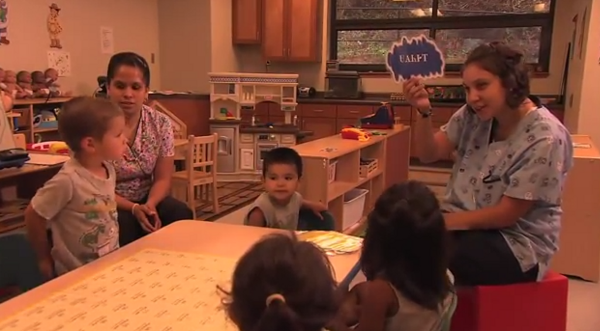A lesson at [Kituwah Academy](https://en.wikipedia.org/wiki/Kituwah_Academy "Kituwah Academy"), a school where English and the [Cherokee language](https://en.wikipedia.org/wiki/Cherokee_language "Cherokee language") are [mediums of instruction](https://en.wikipedia.org/wiki/Mediums_of_instruction "Mediums of instruction")

First language acquisition proceeds in a fairly regular sequence, though there is a wide degree of variation in the timing of particular stages among normally developing infants. Studies published in 2013 have indicated that unborn [fetuses](https://en.wikipedia.org/wiki/Fetus "Fetus") are capable of language acquisition to some degree. From birth, newborns respond more readily to human speech than to other sounds. Around one month of age, babies appear to be able to distinguish between different [speech sounds](https://en.wikipedia.org/wiki/Phone_\(phonetics\) "Phone (phonetics)"). Around six months of age, a child will begin [babbling](https://en.wikipedia.org/wiki/Babbling "Babbling"), producing the speech sounds or [handshapes](https://en.wikipedia.org/wiki/Handshape "Handshape") of the languages used around them. Words appear around the age of 12 to 18 months; the average [vocabulary](https://en.wikipedia.org/wiki/Vocabulary "Vocabulary") of an eighteen-month-old child is around 50 [words](https://en.wikipedia.org/wiki/Word "Word"). A child's first [utterances](https://en.wikipedia.org/wiki/Utterance "Utterance") are [holophrases](https://en.wikipedia.org/wiki/Holophrasis "Holophrasis") (literally "whole-sentences"), utterances that use just one word to communicate some idea. Several months after a child begins producing words, the child will produce two-word utterances, and within a few more months will begin to produce [telegraphic speech](https://en.wikipedia.org/wiki/Telegraphic_speech "Telegraphic speech"), or short sentences that are less [grammatically](https://en.wikipedia.org/wiki/Grammar "Grammar") complex than adult speech, but that do show regular syntactic structure. From roughly the age of three to five years, a child's ability to speak or sign is refined to the point that it resembles adult language.

Acquisition of second and additional languages can come at any age, through exposure in daily life or courses. Children learning a second language are more likely to achieve native-like fluency than adults, but in general, it is very rare for someone speaking a second language to pass completely for a native speaker. An important difference between first language acquisition and additional language acquisition is that the process of additional language acquisition is influenced by languages that the learner already knows.

### Culture

[Arnold Lakhovsky](https://en.wikipedia.org/wiki/Arnold_Lakhovsky "Arnold Lakhovsky"), _The Conversation_ (c. 1935)

Languages, understood as the particular set of speech norms of a particular community, are also a part of the larger culture of the community that speaks them. Languages differ not only in pronunciation, vocabulary, and grammar, but also through having different "cultures of speaking." Humans use language as a way of signalling identity with one cultural group as well as difference from others. Even among speakers of one language, several different ways of using the language exist, and each is used to signal affiliation with particular subgroups within a larger culture. Linguists and anthropologists, particularly [sociolinguists](https://en.wikipedia.org/wiki/Sociolinguistics "Sociolinguistics"), [ethnolinguists](https://en.wikipedia.org/wiki/Anthropological_linguistics "Anthropological linguistics"), and [linguistic anthropologists](https://en.wikipedia.org/wiki/Linguistic_anthropology "Linguistic anthropology") have specialized in studying how ways of speaking vary between [speech communities](https://en.wikipedia.org/wiki/Speech_community "Speech community").

Linguists use the term "[varieties](https://en.wikipedia.org/wiki/Variety_\(linguistics\) "Variety (linguistics)")" to refer to the different ways of speaking a language. This term includes geographically or socioculturally defined [dialects](https://en.wikipedia.org/wiki/Dialect "Dialect") as well as the [jargons](https://en.wikipedia.org/wiki/Register_\(sociolinguistics\) "Register (sociolinguistics)") or [styles](https://en.wikipedia.org/wiki/Style_shifting "Style shifting") of [subcultures](https://en.wikipedia.org/wiki/Subculture "Subculture"). Linguistic anthropologists and sociologists of language define communicative style as the ways that language is used and understood within a particular culture.

Because norms for language use are shared by members of a specific group, communicative style also becomes a way of displaying and constructing group identity. Linguistic differences may become salient markers of divisions between social groups, for example, speaking a language with a particular accent may imply membership of an ethnic minority or social class, one's area of origin, or status as a second language speaker. These kinds of differences are not part of the linguistic system, but are an important part of how people use language as a social tool for constructing groups.

However, many languages also have grammatical conventions that signal the social position of the speaker in relation to others through the use of registers that are related to social hierarchies or divisions. In many languages, there are stylistic or even grammatical differences between the ways men and women speak, between age groups, or between [social classes](https://en.wikipedia.org/wiki/Social_class "Social class"), just as some languages employ different words depending on who is listening. For example, in the Australian language [Dyirbal](https://en.wikipedia.org/wiki/Dyirbal_language "Dyirbal language"), a married man must use a special set of words to refer to everyday items when speaking in the presence of his mother-in-law. Some cultures, for example, have elaborate systems of "social [deixis](https://en.wikipedia.org/wiki/Deixis "Deixis")", or systems of signalling social distance through linguistic means. In English, social deixis is shown mostly through distinguishing between addressing some people by first name and others by surname, and in titles such as "Mrs.", "boy", "Doctor", or "Your Honor", but in other languages, such systems may be highly complex and codified in the entire grammar and vocabulary of the language. For instance, in languages of east Asia such as [Thai](https://en.wikipedia.org/wiki/Thai_language "Thai language"), [Burmese](https://en.wikipedia.org/wiki/Burmese_language "Burmese language"), and [Javanese](https://en.wikipedia.org/wiki/Old_Javanese "Old Javanese"), different words are used according to whether a speaker is addressing someone of higher or lower rank than oneself in a ranking system with animals and children ranking the lowest and gods and members of royalty as the highest.

### Writing, literacy and technology

An inscription of [Swampy Cree](https://en.wikipedia.org/wiki/Swampy_Cree_language "Swampy Cree language") using [Canadian Aboriginal syllabics](https://en.wikipedia.org/wiki/Canadian_Aboriginal_syllabics "Canadian Aboriginal syllabics"), an [abugida](https://en.wikipedia.org/wiki/Abugida "Abugida") developed by Christian missionaries for Indigenous Canadian languages

Throughout history a number of different ways of representing language in graphic media have been invented. These are called [writing systems](https://en.wikipedia.org/wiki/Writing_systems "Writing systems").

The use of [writing](https://en.wikipedia.org/wiki/Writing "Writing") has made language even more useful to humans. It makes it possible to store large amounts of information outside of the human body and retrieve it again, and it allows communication across physical distances and timespans that would otherwise be impossible. Many languages conventionally employ different genres, styles, and registers in written and spoken language, and in some communities, writing traditionally takes place in an entirely different language than the one spoken. There is some evidence that the use of writing also has effects on the cognitive development of humans, perhaps because acquiring literacy generally requires explicit and [formal education](https://en.wikipedia.org/wiki/Formal_education "Formal education").

The invention of the first writing systems is roughly contemporary with the beginning of the [Bronze Age](https://en.wikipedia.org/wiki/Bronze_Age "Bronze Age") in the late [4th millennium BC](https://en.wikipedia.org/wiki/4th_millennium_BC "4th millennium BC"). The [Sumerian](https://en.wikipedia.org/wiki/Sumerian_language "Sumerian language") archaic [cuneiform script](https://en.wikipedia.org/wiki/Cuneiform_\(script\) "Cuneiform (script)") and the [Egyptian hieroglyphs](https://en.wikipedia.org/wiki/Egyptian_hieroglyphs "Egyptian hieroglyphs") are generally considered to be the earliest writing systems, both emerging out of their ancestral proto-literate symbol systems from 3400 to 3200 BC with the earliest coherent texts from about 2600 BC. It is generally agreed that Sumerian writing was an independent invention; however, it is debated whether Egyptian writing was developed completely independently of Sumerian, or was a case of [cultural diffusion](https://en.wikipedia.org/wiki/Cultural_diffusion "Cultural diffusion"). A similar debate exists for the [Chinese script](https://en.wikipedia.org/wiki/Chinese_script "Chinese script"), which developed around 1200 BC. The [pre-Columbian](https://en.wikipedia.org/wiki/Pre-Columbian "Pre-Columbian") [Mesoamerican writing systems](https://en.wikipedia.org/wiki/Mesoamerican_writing_systems "Mesoamerican writing systems") (including among others [Olmec](https://en.wikipedia.org/wiki/Olmec "Olmec") and [Maya scripts](https://en.wikipedia.org/wiki/Maya_script "Maya script")) are generally believed to have had independent origins.

### Change

The first page of the poem _[Beowulf](https://en.wikipedia.org/wiki/Beowulf "Beowulf")_, written in [Old English](https://en.wikipedia.org/wiki/Old_English "Old English") in the early medieval period (800–1100 AD). Although Old English is the direct ancestor of modern English, it is unintelligible to contemporary English speakers.

All languages change as speakers adopt or invent new ways of speaking and pass them on to other members of their speech community. Language change happens at all levels from the phonological level to the levels of vocabulary, morphology, syntax, and discourse. Even though language change is often initially evaluated negatively by speakers of the language who often consider changes to be "decay" or a sign of slipping norms of language usage, it is natural and inevitable.

Changes may affect specific sounds or the entire [phonological system](https://en.wikipedia.org/wiki/Phonological_change "Phonological change"). [Sound change](https://en.wikipedia.org/wiki/Sound_change "Sound change") can consist of the replacement of one speech sound or [phonetic feature](https://en.wikipedia.org/wiki/Distinctive_feature "Distinctive feature") by another, the complete loss of the affected sound, or even the introduction of a new sound in a place where there had been none. Sound changes can be _conditioned_ in which case a sound is changed only if it occurs in the vicinity of certain other sounds. Sound change is usually assumed to be _regular_, which means that it is expected to apply mechanically whenever its structural conditions are met, irrespective of any non-phonological factors. On the other hand, sound changes can sometimes be _sporadic_, affecting only one particular word or a few words, without any seeming regularity. Sometimes a simple change triggers a [chain shift](https://en.wikipedia.org/wiki/Chain_shift "Chain shift") in which the entire phonological system is affected. This happened in the [Germanic languages](https://en.wikipedia.org/wiki/Germanic_languages "Germanic languages") when the sound change known as [Grimm's law](https://en.wikipedia.org/wiki/Grimm's_law "Grimm's law") affected all the stop consonants in the system. The original consonant \*_bʰ_ became /b/ in the Germanic languages, the previous \*_b_ in turn became /p/, and the previous \*_p_ became /f/. The same process applied to all stop consonants and explains why [Italic languages](https://en.wikipedia.org/wiki/Italic_languages "Italic languages") such as Latin have _p_ in words like _**p**ater_ and _**p**isces_, whereas Germanic languages, like English, have _**f**ather_ and _**f**ish_.

Another example is the [Great Vowel Shift](https://en.wikipedia.org/wiki/Great_Vowel_Shift "Great Vowel Shift") in English, which is the reason that the spelling of English vowels do not correspond well to their current pronunciation. This is because the vowel shift brought the already established orthography out of synchronization with pronunciation. Another source of sound change is the erosion of words as pronunciation gradually becomes increasingly indistinct and shortens words, leaving out syllables or sounds. This kind of change caused Latin _mea domina_ to eventually become the [French](https://en.wikipedia.org/wiki/French_language "French language") _madame_ and American English _ma'am_.

Change also happens in the grammar of languages as discourse patterns such as [idioms](https://en.wikipedia.org/wiki/Idiom "Idiom") or particular constructions become [grammaticalized](https://en.wikipedia.org/wiki/Grammaticalized "Grammaticalized"). This frequently happens when words or morphemes erode and the grammatical system is unconsciously rearranged to compensate for the lost element. For example, in some varieties of [Caribbean Spanish](https://en.wikipedia.org/wiki/Caribbean_Spanish "Caribbean Spanish") the final /s/ has eroded away. Since [Standard Spanish](https://en.wikipedia.org/wiki/Standard_Spanish "Standard Spanish") uses final /s/ in the morpheme marking the [second person](https://en.wikipedia.org/wiki/Grammatical_person "Grammatical person") subject "you" in verbs, the Caribbean varieties now have to express the second person using the pronoun _tú_. This means that the sentence "what's your name" is _¿como te llamas?_ \[ˈkomoteˈjamas\] in Standard Spanish, but \[ˈkomoˈtuteˈjama\] in Caribbean Spanish. The simple sound change has affected both morphology and syntax. Another common cause of grammatical change is the gradual petrification of idioms into new grammatical forms, for example, the way the English "going to" construction lost its aspect of movement and in some varieties of English has almost become a full-fledged future tense (e.g. _I'm gonna_).

Language change may be motivated by "language internal" factors, such as changes in pronunciation motivated by certain sounds being difficult to distinguish aurally or to produce, or through patterns of change that cause some rare types of constructions to [drift](https://en.wikipedia.org/wiki/Drift_\(linguistics\) "Drift (linguistics)") towards more common types. Other causes of language change are social, such as when certain pronunciations become emblematic of membership in certain groups, such as social classes, or with [ideologies](https://en.wikipedia.org/wiki/Language_ideology "Language ideology"), and therefore are adopted by those who wish to identify with those groups or ideas. In this way, issues of identity and politics can have profound effects on language structure.

### Contact

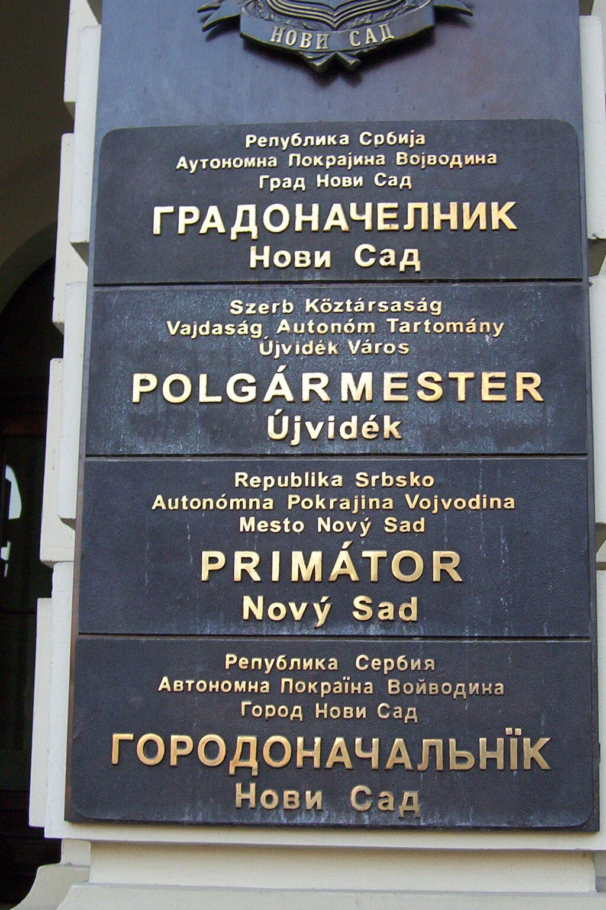[Multilingual](https://en.wikipedia.org/wiki/Multilingualism "Multilingualism") sign outside the [mayor](https://en.wikipedia.org/wiki/Mayor "Mayor")'s office in [Novi Sad](https://en.wikipedia.org/wiki/Novi_Sad "Novi Sad"), written in the four official languages of the city: [Serbian](https://en.wikipedia.org/wiki/Serbian_language "Serbian language"), [Hungarian](https://en.wikipedia.org/wiki/Hungarian_language "Hungarian language"), [Slovak](https://en.wikipedia.org/wiki/Slovak_language "Slovak language"), and [Pannonian Rusyn](https://en.wikipedia.org/wiki/Pannonian_Rusyn_language "Pannonian Rusyn language")

One source of language change is contact and the resulting [diffusion](https://en.wikipedia.org/wiki/Trans-cultural_diffusion "Trans-cultural diffusion") of linguistic traits between languages. Language contact occurs when speakers of two or more languages or [varieties](https://en.wikipedia.org/wiki/Variety_\(linguistics\) "Variety (linguistics)") interact on a regular basis. [Multilingualism](https://en.wikipedia.org/wiki/Multilingualism "Multilingualism") is likely to have been the norm throughout [human history](https://en.wikipedia.org/wiki/Human_history "Human history") and most people in the modern world are multilingual. Before the rise of the concept of the [ethno-national state](https://en.wikipedia.org/wiki/Nation_state "Nation state"), monolingualism was characteristic mainly of populations inhabiting small islands. But with the ideology that made one people, one state, and one language the most desirable political arrangement, monolingualism started to spread throughout the world. There are only 250 countries in the world corresponding to some 6,000 languages, which means that most countries are multilingual and most languages therefore exist in close contact with other languages.

When speakers of different languages interact closely, it is typical for their languages to influence each other. Through sustained language contact over long periods, linguistic traits diffuse between languages, and languages belonging to different families may converge to become more similar. In areas where many languages are in close contact, this may lead to the formation of [language areas](https://en.wikipedia.org/wiki/Sprachbund "Sprachbund") in which unrelated languages share a number of linguistic features. A number of such language areas have been documented, among them, the [Balkan language area](https://en.wikipedia.org/wiki/Balkan_language_area "Balkan language area"), the [Mesoamerican language area](https://en.wikipedia.org/wiki/Mesoamerican_language_area "Mesoamerican language area"), and the [Ethiopian language area](https://en.wikipedia.org/wiki/Ethiopian_language_area "Ethiopian language area"). Also, larger areas such as [South Asia](https://en.wikipedia.org/wiki/South_Asia "South Asia"), Europe, and Southeast Asia have sometimes been considered language areas because of the widespread diffusion of specific [areal features](https://en.wikipedia.org/wiki/Areal_feature_\(linguistics\) "Areal feature (linguistics)").

Multilingualism is also common in the [Indian Republic](https://en.wikipedia.org/wiki/Indian_Republic "Indian Republic"). The signboard is displayed in the [Imphal International Airport](https://en.wikipedia.org/wiki/Imphal_International_Airport "Imphal International Airport") in [Meitei](https://en.wikipedia.org/wiki/Meitei_language "Meitei language"), [Hindi](https://en.wikipedia.org/wiki/Hindi "Hindi") and [English](https://en.wikipedia.org/wiki/Indian_English "Indian English"), some of the [official languages of the Indian Republic](https://en.wikipedia.org/wiki/Official_languages_of_the_Indian_Republic "Official languages of the Indian Republic").

Language contact may also lead to a variety of other linguistic phenomena, including [language convergence](https://en.wikipedia.org/wiki/Language_convergence "Language convergence"), [borrowing](https://en.wikipedia.org/wiki/Loanword "Loanword"), and [relexification](https://en.wikipedia.org/wiki/Relexification "Relexification") (the replacement of much of the native vocabulary with that of another language). In situations of extreme and sustained language contact, it may lead to the formation of new [mixed languages](https://en.wikipedia.org/wiki/Mixed_language "Mixed language") that cannot be considered to belong to a single language family. One type of mixed language called [pidgins](https://en.wikipedia.org/wiki/Pidgins "Pidgins") occurs when adult speakers of two different languages interact on a regular basis, but in a situation where neither group learns to speak the language of the other group fluently. In such a case, they will often construct a communication form that has traits of both languages, and that has a simplified grammatical and phonological structure. The language comes to contain mostly the grammatical and phonological categories that exist in both languages. Pidgin languages are defined by not having any native speakers, but only being spoken by people who have another language as their first language. But if the Pidgin language becomes the main language of a speech community, then eventually children will grow up learning the Pidgin language as their first language. As the generation of child learners grows up, the pidgin will often be seen to change its structure and acquire a greater degree of complexity. This type of language is generally called a [creole language](https://en.wikipedia.org/wiki/Creole_language "Creole language"). An example of such mixed languages is [Tok Pisin](https://en.wikipedia.org/wiki/Tok_Pisin "Tok Pisin"), the official language of [Papua New Guinea](https://en.wikipedia.org/wiki/Papua_New_Guinea "Papua New Guinea"), which originally arose as a Pidgin based on English and [Austronesian languages](https://en.wikipedia.org/wiki/Austronesian_languages "Austronesian languages"); others are [Kreyòl ayisyen](https://en.wikipedia.org/wiki/Haitian_Creole "Haitian Creole"), the French-based creole language spoken in [Haiti](https://en.wikipedia.org/wiki/Haiti "Haiti"), and [Michif](https://en.wikipedia.org/wiki/Michif_language "Michif language"), a mixed language of Canada, based on the Native American language [Cree](https://en.wikipedia.org/wiki/Cree_language "Cree language") and French.

## Linguistic diversity

LanguageNative speakers
(millions)

[Mandarin](https://en.wikipedia.org/wiki/Mandarin_Chinese "Mandarin Chinese")

848

[Spanish](https://en.wikipedia.org/wiki/Spanish_language "Spanish language")

329

[English](https://en.wikipedia.org/wiki/English_language "English language")

328

[Portuguese](https://en.wikipedia.org/wiki/Portuguese_language "Portuguese language")

250

[Arabic](https://en.wikipedia.org/wiki/Arabic_language "Arabic language")

221

[Hindi](https://en.wikipedia.org/wiki/Hindi "Hindi")

182

[Bengali](https://en.wikipedia.org/wiki/Bengali_language "Bengali language")

181

[Russian](https://en.wikipedia.org/wiki/Russian_language "Russian language")

144

[Japanese](https://en.wikipedia.org/wiki/Japanese_language "Japanese language")

122

[Javanese](https://en.wikipedia.org/wiki/Javanese_language "Javanese language")

84.3

_[SIL Ethnologue](https://en.wikipedia.org/wiki/SIL_Ethnologue "SIL Ethnologue")_ defines a "living language" as "one that has at least one speaker for whom it is their first language". The exact number of known living languages varies from 6,000 to 7,000, depending on the precision of one's definition of "language", and in particular, on how one defines the distinction between a "language" and a "[dialect](https://en.wikipedia.org/wiki/Dialect "Dialect")". As of 2026, _Ethnologue_ cataloged 7,170 living human languages. The _Ethnologue_ establishes linguistic groups based on studies of [mutual intelligibility](https://en.wikipedia.org/wiki/Mutual_intelligibility "Mutual intelligibility"), and therefore often includes more categories than more conservative classifications. For example, the [Danish language](https://en.wikipedia.org/wiki/Danish_language "Danish language") that most scholars consider a single language with several dialects is classified as two distinct languages (Danish and [Jutish](https://en.wikipedia.org/wiki/Jutlandic_dialect "Jutlandic dialect")) by the _Ethnologue_.

According to the _Ethnologue_, 389 languages (nearly 6%) have more than a million speakers. These languages together account for 94% of the world's population, whereas 94% of the world's languages account for the remaining 6% of the global population.

### Languages and dialects

There is no [clear distinction](https://en.wikipedia.org/wiki/Language_or_dialect "Language or dialect") between a language and a [dialect](https://en.wikipedia.org/wiki/Dialect "Dialect"), notwithstanding a famous [aphorism](https://en.wikipedia.org/wiki/Aphorism "Aphorism") attributed to linguist [Max Weinreich](https://en.wikipedia.org/wiki/Max_Weinreich "Max Weinreich") that "[a language is a dialect with an army and navy](https://en.wikipedia.org/wiki/A_language_is_a_dialect_with_an_army_and_navy "A language is a dialect with an army and navy")". For example, national boundaries frequently override linguistic difference in determining whether two linguistic varieties are languages or dialects. [Hakka](https://en.wikipedia.org/wiki/Hakka_Chinese "Hakka Chinese"), [Cantonese](https://en.wikipedia.org/wiki/Cantonese "Cantonese") and [Mandarin](https://en.wikipedia.org/wiki/Mandarin_Chinese "Mandarin Chinese") are, for example, often classified as "dialects" of Chinese, even though they are more different from each other than [Swedish](https://en.wikipedia.org/wiki/Swedish_language "Swedish language") is from [Norwegian](https://en.wikipedia.org/wiki/Norwegian_language "Norwegian language"). Before the [Yugoslav Wars](https://en.wikipedia.org/wiki/Yugoslav_civil_war "Yugoslav civil war"), [Serbo-Croatian](https://en.wikipedia.org/wiki/Serbo-Croatian_language "Serbo-Croatian language") was generally considered a single language with two normative variants, but due to sociopolitical reasons, [Croatian](https://en.wikipedia.org/wiki/Croatian_language "Croatian language") and [Serbian](https://en.wikipedia.org/wiki/Serbian_language "Serbian language") are now often treated as separate languages and employ different writing systems. In other words, the distinction may hinge on political considerations as much as on cultural differences as on distinctive [writing systems](/source/writing-system/ "Writing system") or the degree of [mutual intelligibility](https://en.wikipedia.org/wiki/Mutual_intelligibility "Mutual intelligibility"). The latter is, in fact, a rather unreliable criterion to discriminate languages and dialects. [Pluricentric languages](https://en.wikipedia.org/wiki/Pluricentric_language "Pluricentric language"), which are languages with more than one standard variety, are a case in point. [Standard American English](https://en.wikipedia.org/wiki/General_American_English "General American English") and [Standard RP (English) English](https://en.wikipedia.org/wiki/RP_English "RP English"), for instance, may in some areas be more different than languages with names, e.g. Swedish and Norwegian. A complex social process of "language making" underlies these assignments of status and in some cases even linguistic experts may not agree (e.g. the [One Standard German Axiom](https://en.wikipedia.org/wiki/One_Standard_German_Axiom "One Standard German Axiom")). The language making process is dynamic and subject to change over time.

### Language families of the world

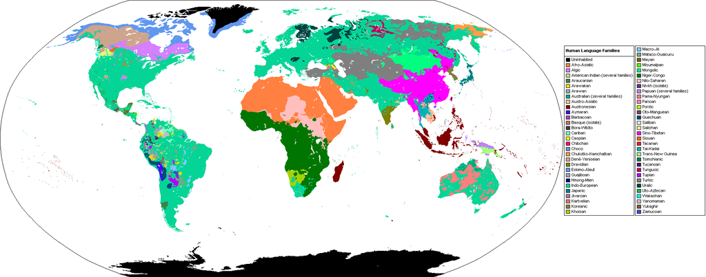Principal language families of the world (and in some cases geographic groups of families).

The world's languages can be grouped into [language families](https://en.wikipedia.org/wiki/Language_family "Language family") consisting of languages that can be shown to have common ancestry. Linguists recognize many hundreds of language families, although some of them can possibly be grouped into larger units as more evidence becomes available and in-depth studies are carried out. At present, there are also dozens of [language isolates](https://en.wikipedia.org/wiki/Language_isolate "Language isolate"): languages that cannot be shown to be related to any other languages in the world. Among them are [Basque](https://en.wikipedia.org/wiki/Basque_language "Basque language"), spoken in Europe, [Zuni](https://en.wikipedia.org/wiki/Zuni_language "Zuni language") of [New Mexico](https://en.wikipedia.org/wiki/New_Mexico "New Mexico"), [Purépecha](https://en.wikipedia.org/wiki/Purépecha_language "Purépecha language") of Mexico, [Ainu](https://en.wikipedia.org/wiki/Ainu_language "Ainu language") of Japan, [Burushaski](https://en.wikipedia.org/wiki/Burushaski_language "Burushaski language") of [Pakistan](https://en.wikipedia.org/wiki/Pakistan "Pakistan"), and many others.

The language family of the world that has the most speakers is the [Indo-European languages](https://en.wikipedia.org/wiki/Indo-European_languages "Indo-European languages"), spoken by 46% of the world's population. This family includes major world languages like [English](https://en.wikipedia.org/wiki/English_language "English language"), [Spanish](https://en.wikipedia.org/wiki/Spanish_language "Spanish language"), [French](https://en.wikipedia.org/wiki/French_language "French language"), [German](https://en.wikipedia.org/wiki/German_language "German language"), [Russian](https://en.wikipedia.org/wiki/Russian_language "Russian language"), and [Hindustani](https://en.wikipedia.org/wiki/Hindustani_language "Hindustani language") ([Hindi](https://en.wikipedia.org/wiki/Hindi "Hindi")/[Urdu](https://en.wikipedia.org/wiki/Urdu "Urdu")). The Indo-European family spread first through hypothesized [Indo-European migrations](https://en.wikipedia.org/wiki/Indo-European_migrations "Indo-European migrations") that would have taken place some time in the period c. 8000–1500 BCE, and subsequently through much later [European colonial expansion](https://en.wikipedia.org/wiki/History_of_colonialism "History of colonialism"), which brought the Indo-European languages to a politically and often numerically dominant position in the [Americas](https://en.wikipedia.org/wiki/Americas "Americas") and much of [Africa](https://en.wikipedia.org/wiki/Africa "Africa"). The [Sino-Tibetan languages](https://en.wikipedia.org/wiki/Sino-Tibetan_languages "Sino-Tibetan languages") are spoken by 20% of the world's population and include many of the languages of East Asia, including [Hakka](https://en.wikipedia.org/wiki/Hakka_Chinese "Hakka Chinese"), [Mandarin Chinese](https://en.wikipedia.org/wiki/Mandarin_Chinese "Mandarin Chinese"), [Cantonese](https://en.wikipedia.org/wiki/Cantonese "Cantonese"), and hundreds of smaller languages.

[Africa](https://en.wikipedia.org/wiki/Africa "Africa") is home to a large number of language families, the largest of which is the [Niger-Congo language family](https://en.wikipedia.org/wiki/Niger–Congo_languages "Niger–Congo languages"), which includes such languages as [Swahili](https://en.wikipedia.org/wiki/Swahili_language "Swahili language"), [Shona](https://en.wikipedia.org/wiki/Shona_language "Shona language"), and [Yoruba](https://en.wikipedia.org/wiki/Yoruba_language "Yoruba language"). Speakers of the Niger-Congo languages account for 6.9% of the world's population. A similar number of people speak the [Afroasiatic languages](https://en.wikipedia.org/wiki/Afroasiatic_languages "Afroasiatic languages"), which include the populous [Semitic languages](https://en.wikipedia.org/wiki/Semitic_languages "Semitic languages") such as [Arabic](https://en.wikipedia.org/wiki/Arabic_language "Arabic language"), [Hebrew language](https://en.wikipedia.org/wiki/Hebrew_language "Hebrew language"), and the languages of the [Sahara](https://en.wikipedia.org/wiki/Sahara "Sahara") region, such as the [Berber languages](https://en.wikipedia.org/wiki/Berber_languages "Berber languages") and [Hausa](https://en.wikipedia.org/wiki/Hausa_language "Hausa language").

The [Austronesian languages](https://en.wikipedia.org/wiki/Austronesian_languages "Austronesian languages") are spoken by 5.5% of the world's population and stretch from [Madagascar](https://en.wikipedia.org/wiki/Madagascar "Madagascar") to [maritime Southeast Asia](https://en.wikipedia.org/wiki/Maritime_Southeast_Asia "Maritime Southeast Asia") all the way to [Oceania](https://en.wikipedia.org/wiki/Oceania "Oceania"). It includes such languages as [Malagasy](https://en.wikipedia.org/wiki/Malagasy_language "Malagasy language"), [Māori](https://en.wikipedia.org/wiki/Māori_language "Māori language"), [Samoan](https://en.wikipedia.org/wiki/Samoan_language "Samoan language"), and many of the indigenous languages of [Indonesia](https://en.wikipedia.org/wiki/Indonesia "Indonesia") and [Taiwan](https://en.wikipedia.org/wiki/Formosan_languages "Formosan languages"). The Austronesian languages are considered to have originated in Taiwan around 3000 BC and spread through the Oceanic region through island-hopping, based on an advanced nautical technology. Other populous language families are the [Dravidian languages](https://en.wikipedia.org/wiki/Dravidian_languages "Dravidian languages") of [South Asia](https://en.wikipedia.org/wiki/South_Asia "South Asia") (among them [Kannada](https://en.wikipedia.org/wiki/Kannada_language "Kannada language"), [Tamil](https://en.wikipedia.org/wiki/Tamil_language "Tamil language"), and [Telugu](https://en.wikipedia.org/wiki/Telugu_language "Telugu language")), the [Turkic languages](https://en.wikipedia.org/wiki/Turkic_languages "Turkic languages") of Central Asia (such as [Turkish](https://en.wikipedia.org/wiki/Turkish_language "Turkish language")), the [Austroasiatic](https://en.wikipedia.org/wiki/Austroasiatic_languages "Austroasiatic languages") (among them [Khmer](https://en.wikipedia.org/wiki/Khmer_language "Khmer language")), and [Tai–Kadai languages](https://en.wikipedia.org/wiki/Tai–Kadai_languages "Tai–Kadai languages") of [Southeast Asia](https://en.wikipedia.org/wiki/Southeast_Asia "Southeast Asia") (including [Thai](https://en.wikipedia.org/wiki/Thai_language "Thai language")).

The areas of the world in which there is the greatest linguistic diversity, such as the Americas, [Papua New Guinea](https://en.wikipedia.org/wiki/Papua_New_Guinea "Papua New Guinea"), [West Africa](https://en.wikipedia.org/wiki/West_Africa "West Africa"), and South-Asia, contain hundreds of small language families. These areas together account for the majority of the world's languages, though not the majority of speakers. In the Americas, some of the largest language families include the [Quechua](https://en.wikipedia.org/wiki/Quechuan_languages "Quechuan languages"), [Arawak](https://en.wikipedia.org/wiki/Arawak_languages "Arawak languages"), and [Tupi-Guarani](https://en.wikipedia.org/wiki/Tupi-Guarani_languages "Tupi-Guarani languages") families of South America, the [Uto-Aztecan](https://en.wikipedia.org/wiki/Uto-Aztecan_languages "Uto-Aztecan languages"), [Oto-Manguean](https://en.wikipedia.org/wiki/Oto-Manguean_languages "Oto-Manguean languages"), and [Mayan](https://en.wikipedia.org/wiki/Mayan_languages "Mayan languages") of [Mesoamerica](https://en.wikipedia.org/wiki/Mesoamerica "Mesoamerica"), and the [Na-Dene](https://en.wikipedia.org/wiki/Na-Dene_languages "Na-Dene languages"), [Iroquoian](https://en.wikipedia.org/wiki/Iroquoian_languages "Iroquoian languages"), and [Algonquian](https://en.wikipedia.org/wiki/Algonquian_languages "Algonquian languages") language families of [North America](https://en.wikipedia.org/wiki/North_America "North America"). In Australia, most indigenous languages belong to the [Pama-Nyungan family](https://en.wikipedia.org/wiki/Pama-Nyungan_languages "Pama-Nyungan languages"), whereas New Guinea is home to a large number of small families and isolates, as well as a number of Austronesian languages. Due to its remoteness and geographical fragmentation, Papua New Guinea emerges in fact as the leading location worldwide for both species (8% of world total) and linguistic richness – with 830 living tongues (12% of world total).

### Language endangerment

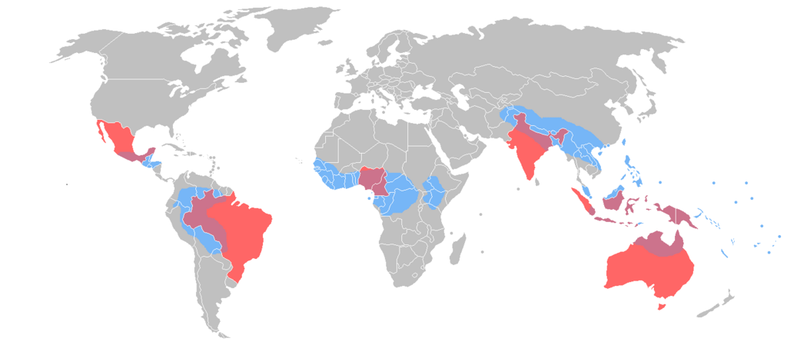

 Together, these eight countries contain more than 50% of the world's languages.

 These areas are the most linguistically diverse in the world, and the locations of most of the world's endangered languages.

[Language endangerment](https://en.wikipedia.org/wiki/Endangered_language "Endangered language") occurs when a language is at risk of falling out of use as its speakers die out or [shift](https://en.wikipedia.org/wiki/Language_shift "Language shift") to speaking another language. [Language loss](https://en.wikipedia.org/wiki/Language_loss "Language loss") occurs when the language has no more native speakers, and becomes a _[dead language](https://en.wikipedia.org/wiki/Dead_language "Dead language")_. If eventually no one speaks the language at all, it becomes an _[extinct language](https://en.wikipedia.org/wiki/Extinct_language "Extinct language")_. While languages have always gone extinct throughout human history, they have been disappearing at an accelerated rate in the 20th and 21st centuries due to the processes of [globalization](https://en.wikipedia.org/wiki/Globalization "Globalization") and [neo-colonialism](https://en.wikipedia.org/wiki/Neo-colonialism "Neo-colonialism"), where the economically powerful languages dominate other languages.

The more commonly spoken languages dominate the less commonly spoken languages, so the less commonly spoken languages eventually disappear from populations. Of the between 6,000 and 7,000 languages spoken as of 2010, between 50 and 90% of those are expected to have become extinct by the year 2100. The [top 20 languages](https://en.wikipedia.org/wiki/List_of_languages_by_number_of_native_speakers "List of languages by number of native speakers"), those spoken by more than 50 million speakers each, are spoken by 50% of the world's population, whereas many of the other languages are spoken by smaller communities, most of them with less than 10,000 speakers.

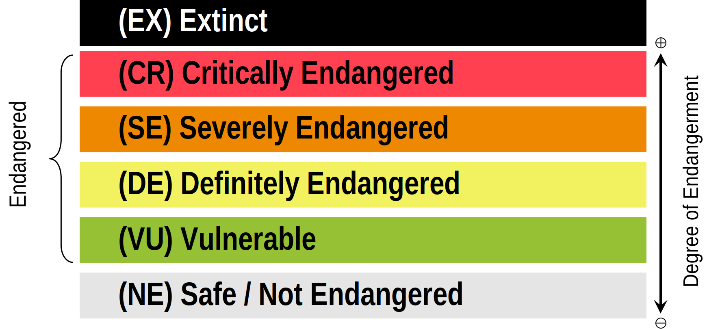[UNESCO](https://en.wikipedia.org/wiki/UNESCO "UNESCO")'s five levels of language endangerment

The [United Nations Educational, Scientific and Cultural Organization](https://en.wikipedia.org/wiki/UNESCO "UNESCO") (UNESCO) operates with five levels of language endangerment: "safe", "vulnerable" (not spoken by children outside the home), "definitely endangered" (not spoken by children), "severely endangered" (only spoken by the oldest generations), and "critically endangered" (spoken by a few members of the oldest generation, often [semi-speakers](https://en.wikipedia.org/wiki/Speaker_types "Speaker types")). Despite claims that the world would be better off if most adopted a single common _[lingua franca](https://en.wikipedia.org/wiki/Lingua_franca "Lingua franca")_, such as English or [Esperanto](https://en.wikipedia.org/wiki/Esperanto "Esperanto"), there is a consensus that the loss of languages harms the cultural diversity of the world. It is a common belief, going back to the biblical narrative of the [tower of Babel](https://en.wikipedia.org/wiki/Tower_of_Babel "Tower of Babel") in the [Old Testament](https://en.wikipedia.org/wiki/Old_Testament "Old Testament"), that linguistic diversity causes political conflict, but many of the world's major episodes of violence have taken place in situations with low linguistic diversity, such as the [Yugoslav](https://en.wikipedia.org/wiki/Yugoslav_Wars "Yugoslav Wars") and [American Civil War](https://en.wikipedia.org/wiki/American_Civil_War "American Civil War"), or the [genocide of Rwanda](https://en.wikipedia.org/wiki/Rwandan_genocide "Rwandan genocide").

Many projects aim to prevent or slow this loss by [revitalizing](https://en.wikipedia.org/wiki/Language_revitalization "Language revitalization") endangered languages and promoting education and literacy in minority languages. Across the world, many countries have enacted [specific legislation](https://en.wikipedia.org/wiki/Language_policy "Language policy") to protect and stabilize the language of indigenous [speech communities](https://en.wikipedia.org/wiki/Speech_community "Speech community"). A minority of linguists have argued that language loss is a natural process that should not be counteracted and that documenting endangered languages for posterity is sufficient.

The [University of Waikato](https://en.wikipedia.org/wiki/University_of_Waikato "University of Waikato") is using the [Welsh language](https://en.wikipedia.org/wiki/Welsh_language "Welsh language") as a model for their [Māori language](https://en.wikipedia.org/wiki/Māori_language "Māori language") revitalisation programme, as they deem Welsh to be the world's leading example for the survival of languages. In 2019, Hawaiian TV company [Oiwi](https://en.wikipedia.org/wiki/World_Indigenous_Television_Broadcasters_Network "World Indigenous Television Broadcasters Network") visited a [Welsh language](https://en.wikipedia.org/wiki/Welsh_language "Welsh language") centre in [Nant Gwrtheyrn](https://en.wikipedia.org/wiki/Nant_Gwrtheyrn "Nant Gwrtheyrn"), [North Wales](https://en.wikipedia.org/wiki/North_Wales "North Wales"), to help find ways of preserving their [Ōlelo Hawaiʻi](https://en.wikipedia.org/wiki/Hawaiian_language "Hawaiian language") language.
