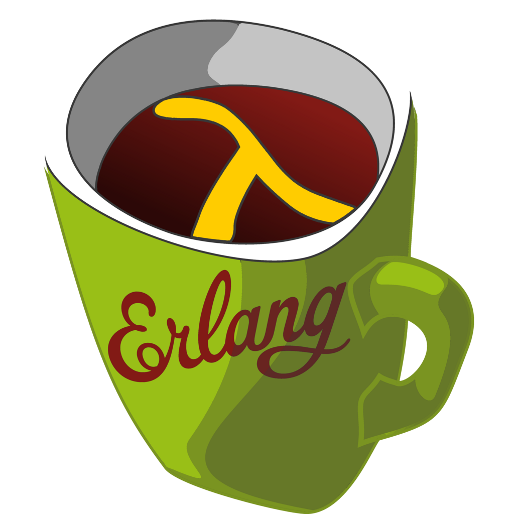

LFE



[Paradigm](https://en.wikipedia.org/wiki/Programming_paradigm "Programming paradigm")

[Multi-paradigm](https://en.wikipedia.org/wiki/Multi-paradigm_programming_language "Multi-paradigm programming language"): [concurrent](https://en.wikipedia.org/wiki/Concurrent_programming "Concurrent programming"), [functional](https://en.wikipedia.org/wiki/Functional_programming "Functional programming")

Family

[Erlang](/source/erlang-language/ "Erlang (programming language)"), [Lisp](/source/lisp-language/ "Lisp (programming language)")

[Designed by](https://en.wikipedia.org/wiki/Software_design "Software design")

Robert Virding

[Developer](https://en.wikipedia.org/wiki/Software_developer "Software developer")

Robert Virding

First appeared

2008 (2008)

[Stable release](https://en.wikipedia.org/wiki/Software_release_life_cycle "Software release life cycle")

2.1.1 / 6 January 2023 (2023-01-06)


[Typing discipline](https://en.wikipedia.org/wiki/Type_system "Type system")

[dynamic](https://en.wikipedia.org/wiki/Type_system "Type system"), [strong](https://en.wikipedia.org/wiki/Strong_typing "Strong typing")

Implementation language

[Erlang](/source/erlang-language/ "Erlang (programming language)")

[OS](https://en.wikipedia.org/wiki/Operating_system "Operating system")

[Cross-platform](https://en.wikipedia.org/wiki/Cross-platform "Cross-platform")

[License](https://en.wikipedia.org/wiki/Software_license "Software license")

[Apache](https://en.wikipedia.org/wiki/Apache_License "Apache License") 2.0

[Filename extensions](https://en.wikipedia.org/wiki/Filename_extension "Filename extension")

.lfe .hrl

Website

[lfe.io](http://lfe.io)

Influenced by

[Erlang](/source/erlang-language/ "Erlang (programming language)"), [Common Lisp](https://en.wikipedia.org/wiki/Common_Lisp "Common Lisp"), [Maclisp](https://en.wikipedia.org/wiki/Maclisp "Maclisp"), [Scheme](https://en.wikipedia.org/wiki/Scheme_\(programming_language\) "Scheme (programming language)"), [Elixir](https://en.wikipedia.org/wiki/Elixir_\(programming_language\) "Elixir (programming language)"), [Clojure](https://en.wikipedia.org/wiki/Clojure_\(programming_language\) "Clojure (programming language)"), [Hy](https://en.wikipedia.org/wiki/Hy_\(programming_language\) "Hy (programming language)")

Influenced

Joxa, Concurrent Schemer

**Lisp Flavored Erlang** (**LFE**) is a [functional](https://en.wikipedia.org/wiki/Functional_language "Functional language"), [concurrent](https://en.wikipedia.org/wiki/Concurrent_computing "Concurrent computing"), [garbage collected](https://en.wikipedia.org/wiki/Garbage_collection_\(computer_science\) "Garbage collection (computer science)"), general-purpose [programming language](https://en.wikipedia.org/wiki/Programming_language "Programming language") and [Lisp](/source/lisp-language/ "Lisp (programming language)") [dialect](https://en.wikipedia.org/wiki/Dialect_\(computing\) "Dialect (computing)") built on Core [Erlang](/source/erlang-language/ "Erlang (programming language)") and the Erlang virtual machine ([BEAM](https://en.wikipedia.org/wiki/BEAM_\(Erlang_virtual_machine\) "BEAM (Erlang virtual machine)")). LFE builds on Erlang to provide a Lisp syntax for writing distributed, [fault-tolerant](https://en.wikipedia.org/wiki/Fault_tolerance "Fault tolerance"), soft [real-time](https://en.wikipedia.org/wiki/Real-time_computing "Real-time computing"), non-stop applications. LFE also extends Erlang to support [metaprogramming](https://en.wikipedia.org/wiki/Metaprogramming "Metaprogramming") with Lisp macros and an improved developer experience with a feature-rich [read–eval–print loop](https://en.wikipedia.org/wiki/Read–eval–print_loop "Read–eval–print loop") (REPL). LFE is actively supported on all recent releases of Erlang; the oldest version of Erlang supported is R14.

## History

Robert Virding

### Initial release

Initial work on LFE began in 2007, when Robert Virding started creating a prototype of Lisp running on Erlang. This work was focused primarily on parsing and exploring what an implementation might look like. No version control system was being used at the time, so tracking exact initial dates is somewhat problematic.

Virding announced the first release of LFE on the _Erlang Questions_ mail list in March 2008. This release of LFE was very limited: it did not handle recursive `letrec`s, `binary`s, `receive`, or `try`; it also did not support a Lisp shell.

Initial development of LFE was done with version R12B-0 of Erlang on a Dell XPS laptop.

Timeline of Lisp dialects

19581960196519701975198019851990199520002005201020152020

 LISP 1, 1.5, [LISP 2(abandoned)](https://en.wikipedia.org/wiki/LISP_2 "LISP 2")

 [Maclisp](https://en.wikipedia.org/wiki/Maclisp "Maclisp")

 [Interlisp](https://en.wikipedia.org/wiki/Interlisp "Interlisp")

 [MDL](https://en.wikipedia.org/wiki/MDL_\(programming_language\) "MDL (programming language)")

 [Lisp Machine Lisp](https://en.wikipedia.org/wiki/Lisp_Machine_Lisp "Lisp Machine Lisp")

 [Scheme](https://en.wikipedia.org/wiki/Scheme_\(programming_language\) "Scheme (programming language)") R5RS R6RS R7RS small

 [NIL](https://en.wikipedia.org/wiki/NIL_\(programming_language\) "NIL (programming language)")

 [ZIL (Zork Implementation Language)](https://en.wikipedia.org/wiki/Z-machine#ZIL_\(Zork_Implementation_Language\) "Z-machine")

 [Franz Lisp](https://en.wikipedia.org/wiki/Franz_Lisp "Franz Lisp")

 muLisp

 [Common Lisp](https://en.wikipedia.org/wiki/Common_Lisp "Common Lisp") ANSI standard

 [Le Lisp](https://en.wikipedia.org/wiki/Le_Lisp "Le Lisp")

 [MIT Scheme](https://en.wikipedia.org/wiki/MIT_Scheme "MIT Scheme")

 [XLISP](https://en.wikipedia.org/wiki/XLISP "XLISP")

 [T](https://en.wikipedia.org/wiki/T_\(programming_language\) "T (programming language)")

 [Chez Scheme](https://en.wikipedia.org/wiki/Chez_Scheme "Chez Scheme")

 [Emacs Lisp](https://en.wikipedia.org/wiki/Emacs_Lisp "Emacs Lisp")

 [AutoLISP](https://en.wikipedia.org/wiki/AutoLISP "AutoLISP")

 [PicoLisp](https://en.wikipedia.org/wiki/PicoLisp "PicoLisp")

 [Gambit](https://en.wikipedia.org/wiki/Gambit_\(Scheme_implementation\) "Gambit (Scheme implementation)")

 [EuLisp](https://en.wikipedia.org/wiki/EuLisp "EuLisp")

 [ISLISP](https://en.wikipedia.org/wiki/ISLISP "ISLISP")

 [OpenLisp](https://en.wikipedia.org/wiki/OpenLisp "OpenLisp")

 [PLT Scheme](https://en.wikipedia.org/wiki/PLT_Scheme "PLT Scheme") [Racket](https://en.wikipedia.org/wiki/Racket_\(programming_language\) "Racket (programming language)")

 [newLISP](https://en.wikipedia.org/wiki/NewLISP "NewLISP")

 [GNU Guile](https://en.wikipedia.org/wiki/GNU_Guile "GNU Guile")

 [Visual LISP](https://en.wikipedia.org/wiki/AutoLISP "AutoLISP")

 [Clojure](https://en.wikipedia.org/wiki/Clojure "Clojure")

 [Arc](https://en.wikipedia.org/wiki/Arc_\(programming_language\) "Arc (programming language)")

 [LFE](/source/lfe-language/)

 [Hy](https://en.wikipedia.org/wiki/Hy_\(programming_language\) "Hy (programming language)")

### Motives

Robert Virding has stated that there were several reasons why he started the LFE programming language:

*   He had prior experience programming in Lisp.
*   Given his prior experience, he was interested in implementing his own Lisp.
*   In particular, he wanted to implement a Lisp in Erlang: not only was he curious to see how it would run on and integrate with Erlang, he wanted to see what it would _look_ like.
*   Since helping to create the Erlang programming language, he had had the goal of making a Lisp which was specifically designed to run on the BEAM and able to fully interact with Erlang/OTP.
*   He wanted to experiment with [compiling](https://en.wikipedia.org/wiki/Compiler "Compiler") another language on Erlang. As such, he saw LFE as a means to explore this by generating Core Erlang and plugging it into the backend of the Erlang compiler.

## Features

*   A language targeting [Erlang](/source/erlang-language/ "Erlang (programming language)") virtual machine (BEAM)
*   Seamless [Erlang](/source/erlang-language/ "Erlang (programming language)") integration: zero-penalty Erlang function calls (and vice versa)
*   Metaprogramming via [Lisp macros](https://en.wikipedia.org/wiki/Lisp_macro "Lisp macro") and the [homoiconicity](https://en.wikipedia.org/wiki/Homoiconicity "Homoiconicity") of a Lisp
*   [Common Lisp](https://en.wikipedia.org/wiki/Common_Lisp "Common Lisp")-style documentation via both source code [comments](https://en.wikipedia.org/wiki/Comment_\(computer_programming\) "Comment (computer programming)") and docstrings
*   [Shared-nothing architecture](https://en.wikipedia.org/wiki/Shared-nothing_architecture "Shared-nothing architecture") concurrent programming via message passing ([Actor model](https://en.wikipedia.org/wiki/Actor_model "Actor model"))
*   Emphasis on [recursion](https://en.wikipedia.org/wiki/Recursion_\(computer_science\) "Recursion (computer science)") and [higher-order functions](https://en.wikipedia.org/wiki/Higher-order_function "Higher-order function") instead of [side-effect](https://en.wikipedia.org/wiki/Side-effect_\(computer_science\) "Side-effect (computer science)")-based [looping](https://en.wikipedia.org/wiki/Loop_\(computing\) "Loop (computing)")
*   A full [read–eval–print loop](https://en.wikipedia.org/wiki/Read–eval–print_loop "Read–eval–print loop") (REPL) for interactive development and testing (unlike Erlang's shell, the LFE REPL supports function and macro definitions)
*   [Pattern matching](https://en.wikipedia.org/wiki/Pattern_matching "Pattern matching")
*   Hot loading of code
*   A [Lisp-2](https://en.wikipedia.org/wiki/Lisp-1_vs._Lisp-2#The_function_namespace "Lisp-1 vs. Lisp-2") separation of namespaces for variables and functions
*   [Java](https://en.wikipedia.org/wiki/Java_\(programming_language\) "Java (programming language)") inter-operation via JInterface and Erjang
*   [Scripting](https://en.wikipedia.org/wiki/Scripting_language "Scripting language") abilities with both `lfe` and `lfescript`

## Syntax and semantics

### Symbolic expressions (S-expressions)

Like Lisp, LFE is an [expression](https://en.wikipedia.org/wiki/Expression_\(computer_science\) "Expression (computer science)")-oriented language. Unlike non-[homoiconic](https://en.wikipedia.org/wiki/Homoiconicity "Homoiconicity") programming languages, Lisps make no or little syntactic distinction between _expressions_ and _[statements](https://en.wikipedia.org/wiki/Statement_\(programming\) "Statement (programming)")_: all code and data are written as expressions. LFE brought homoiconicity to the Erlang VM.

### Lists

In LFE, the list data type is written with its elements separated by whitespace, and surrounded by parentheses. For example, `(list 1 2 'foo)` is a list whose elements are the integers `1` and `2`, and the atom \[\[foo|`foo`\]\]. These values are implicitly typed: they are respectively two integers and a Lisp-specific data type called a _symbolic atom_, and need not be declared as such.

As seen in the example above, LFE expressions are written as lists, using [prefix notation](https://en.wikipedia.org/wiki/Prefix_notation "Prefix notation"). The first element in the list is the name of a _form_, i.e., a function, operator, or macro. The remainder of the list are the arguments.

### Operators

The LFE-Erlang operators are used in the same way. The expression

```lisp
 (* (+ 1 2 3 4 5 6) 2)
```

evaluates to 42. Unlike functions in Erlang and LFE, arithmetic operators in Lisp are [variadic](https://en.wikipedia.org/wiki/Variadic_function "Variadic function") (or _n-ary_), able to take any number of arguments.

### Lambda expressions and function definition

LFE has _lambda_, just like Common Lisp. It also, however, has _lambda-match_ to account for Erlang's pattern-matching abilities in anonymous function calls.

## Erlang idioms in LFE

This section does not represent a complete comparison between Erlang and LFE, but should give a taste.

### Pattern matching

Erlang:

```erlang
      1> {Len,Status,Msg} = {8,ok,"Trillian"}.
      {8,ok,"Trillian"}
      2> Msg.
      "Trillian"
```

LFE:

```lisp
      lfe> (set (tuple len status msg) #(8 ok "Trillian"))
      lfe> ;; or with LFE literal tuple syntax:
      lfe> (set `#(,len ,status ,msg) #(8 ok "Trillian"))
      #(8 ok "Trillian")
      lfe> msg
      "Trillian"
```

### List comprehensions

Erlang:

```erlang
      1> [trunc(math:pow(3,X)) || X <- [0,1,2,3]].
      [1,3,9,27]
```

LFE:

```lisp
      lfe> (list-comp
             ((<- x '(0 1 2 3)))
             (trunc (math:pow 3 x)))
      (1 3 9 27)
```

Or idiomatic functional style:

```lisp
      lfe> (lists:map
             (lambda (x) (trunc (math:pow 3 x)))
             '(0 1 2 3))
      (1 3 9 27)
```

### Guards

Erlang:

```erlang
      right_number(X) when X == 42; X == 276709 ->
        true;
      right_number(_) ->
        false.
```

LFE:

```lisp
      (defun right-number?
        ((x) (when (orelse (== x 42) (== x 276709)))
          'true)
        ((_) 'false))
```

### cons'ing in function heads

Erlang:

```erlang
      sum(L) -> sum(L,0).
      sum([], Total) -> Total;
      sum([H|T], Total) -> sum(T, H+Total).
```

LFE:

```lisp
      (defun sum (l) (sum l 0))
      (defun sum
        (('() total) total)
        (((cons h t) total) (sum t (+ h total))))
```

or using a \`\`cons\`\` literal instead of the constructor form:

```lisp
      (defun sum (l) (sum l 0))
      (defun sum
        (('() total) total)
        ((`(,h . ,t) total) (sum t (+ h total))))
```

### Matching records in function heads

Erlang:

```erlang
handle_info(ping, #state {remote_pid = undefined} = State) ->
    gen_server:cast(self(), ping),
    {noreply, State};
handle_info(ping, State) ->
    {noreply, State};
```

LFE:

```lisp
(defun handle_info
  (('ping (= (match-state remote-pid 'undefined) state))
    (gen_server:cast (self) 'ping)
    `#(noreply ,state))
  (('ping state)
   `#(noreply ,state)))
```

### Receiving messages

Erlang:

```erlang
      universal_server() ->
          receive
              {become, Func} ->
                  Func()
          end.
```

LFE:

```lisp
      (defun universal-server ()
        (receive
          ((tuple 'become func)
           (funcall func))))
```

or:

```lisp
      (defun universal-server ()
        (receive
          (`#(become ,func)
            (funcall func))))
```

## Examples

### Erlang interoperability

Calls to Erlang functions take the form _(: ... )_:

```lisp
(io:format "Hello, World!")
```

### Functional paradigm

Using recursion to define the [Ackermann function](https://en.wikipedia.org/wiki/Ackermann_function "Ackermann function"):

```lisp
(defun ackermann
  ((0 n) (+ n 1))
  ((m 0) (ackermann (- m 1) 1))
  ((m n) (ackermann (- m 1) (ackermann m (- n 1)))))
```

Composing functions:

```lisp
(defun compose (f g)
  (lambda (x)
   (funcall f
     (funcall g x))))

(defun check ()
  (let* ((sin-asin (compose #'sin/1 #'asin/1))
         (expected (sin (asin 0.5)))
         (compose-result (funcall sin-asin 0.5)))
    (io:format "Expected answer: ~p~n" (list expected))
    (io:format "Answer with compose: ~p~n" (list compose-result))))
```

### Concurrency

Message-passing with Erlang's light-weight "processes":

```lisp
(defmodule messenger-back
 (export (print-result 0) (send-message 2)))

(defun print-result ()
  (receive
    ((tuple pid msg)
      (io:format "Received message: '~s'~n" (list msg))
      (io:format "Sending message to process ~p ...~n" (list pid))
      (! pid (tuple msg))
      (print-result))))

(defun send-message (calling-pid msg)
  (let ((spawned-pid (spawn 'messenger-back 'print-result ())))
    (! spawned-pid (tuple calling-pid msg))))
```

Multiple simultaneous HTTP requests:

```lisp
(defun parse-args (flag)
  "Given one or more command-line arguments, extract the passed values.

  For example, if the following was passed via the command line:

    $ erl -my-flag my-value-1 -my-flag my-value-2

  One could then extract it in an LFE program by calling this function:

    (let ((args (parse-args 'my-flag)))
      ...
      )
  In this example, the value assigned to the arg variable would be a list
  containing the values my-value-1 and my-value-2."
  (let ((`#(ok ,data) (init:get_argument flag)))
    (lists:merge data)))

(defun get-pages ()
  "With no argument, assume 'url parameter was passed via command line."
  (let ((urls (parse-args 'url)))
    (get-pages urls)))

(defun get-pages (urls)
  "Start inets and make (potentially many) HTTP requests."
  (inets:start)
  (plists:map
    (lambda (x)
      (get-page x)) urls))

(defun get-page (url)
  "Make a single HTTP request."
  (let* ((method 'get)
         (headers '())
         (request-data `#(,url ,headers))
         (http-options ())
         (request-options '(#(sync false))))
    (httpc:request method request-data http-options request-options)
    (receive
      (`#(http #(,request-id #(error ,reason)))
       (io:format "Error: ~p~n" `(,reason)))
      (`#(http #(,request-id ,result))
       (io:format "Result: ~p~n" `(,result))))))
```
