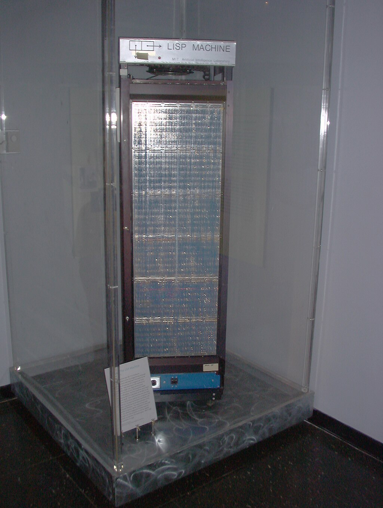
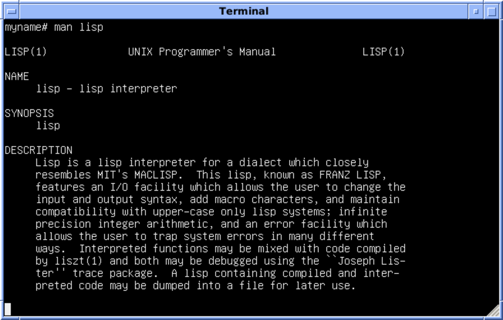

Lisp

[Paradigm](https://en.wikipedia.org/wiki/Programming_paradigm "Programming paradigm")

[Multi-paradigm](https://en.wikipedia.org/wiki/Multi-paradigm_programming_language "Multi-paradigm programming language"): [functional](https://en.wikipedia.org/wiki/Functional_programming "Functional programming"), [procedural](https://en.wikipedia.org/wiki/Procedural_programming "Procedural programming"), [reflective](https://en.wikipedia.org/wiki/Reflective_programming "Reflective programming"), [meta](https://en.wikipedia.org/wiki/Metaprogramming "Metaprogramming")

[Designed by](https://en.wikipedia.org/wiki/Software_design "Software design")

[John McCarthy](/source/john-mccarthy/ "John McCarthy (computer scientist)")

[Developer](https://en.wikipedia.org/wiki/Software_developer "Software developer")

[Steve Russell](https://en.wikipedia.org/wiki/Steve_Russell_\(computer_scientist\) "Steve Russell (computer scientist)"), Timothy P. Hart, Mike Levin

First appeared

1960 (1960)

[Typing discipline](https://en.wikipedia.org/wiki/Type_system "Type system")

[Dynamic](https://en.wikipedia.org/wiki/Dynamic_typing "Dynamic typing"), [strong](https://en.wikipedia.org/wiki/Strong_and_weak_typing "Strong and weak typing")

[Dialects](https://en.wikipedia.org/wiki/Programming_language#Dialects,_flavors_and_implementations "Programming language")

*   [Arc](https://en.wikipedia.org/wiki/Arc_\(programming_language\) "Arc (programming language)")
*   [AutoLISP](https://en.wikipedia.org/wiki/AutoLISP "AutoLISP")
*   [Clojure](https://en.wikipedia.org/wiki/Clojure "Clojure")
*   [Common Lisp](https://en.wikipedia.org/wiki/Common_Lisp "Common Lisp")
*   [Emacs Lisp](https://en.wikipedia.org/wiki/Emacs_Lisp "Emacs Lisp")
*   [EuLisp](https://en.wikipedia.org/wiki/EuLisp "EuLisp")
*   [Franz Lisp](https://en.wikipedia.org/wiki/Franz_Lisp "Franz Lisp")
*   [GOAL](https://en.wikipedia.org/wiki/Game_Oriented_Assembly_Lisp "Game Oriented Assembly Lisp")
*   [Hy](https://en.wikipedia.org/wiki/Hy_\(programming_language\) "Hy (programming language)")
*   [Interlisp](https://en.wikipedia.org/wiki/Interlisp "Interlisp")
*   [ISLISP](https://en.wikipedia.org/wiki/ISLISP "ISLISP")
*   [LeLisp](https://en.wikipedia.org/wiki/LeLisp "LeLisp")
*   [LFE](/source/lfe-language/ "LFE (programming language)")
*   [Maclisp](https://en.wikipedia.org/wiki/Maclisp "Maclisp")
*   [MDL](https://en.wikipedia.org/wiki/MDL_\(programming_language\) "MDL (programming language)")
*   [newLISP](https://en.wikipedia.org/wiki/NewLISP "NewLISP")
*   [NIL](https://en.wikipedia.org/wiki/NIL_\(programming_language\) "NIL (programming language)")
*   [Picolisp](https://en.wikipedia.org/wiki/Picolisp "Picolisp")
*   [Portable Standard Lisp](https://en.wikipedia.org/wiki/Portable_Standard_Lisp "Portable Standard Lisp")
*   [Racket](https://en.wikipedia.org/wiki/Racket_\(programming_language\) "Racket (programming language)")
*   [RPL](https://en.wikipedia.org/wiki/RPL_\(programming_language\) "RPL (programming language)")
*   [Scheme](https://en.wikipedia.org/wiki/Scheme_\(programming_language\) "Scheme (programming language)")
*   [SKILL](https://en.wikipedia.org/wiki/Cadence_SKILL "Cadence SKILL")
*   [Spice Lisp](https://en.wikipedia.org/wiki/Spice_Lisp "Spice Lisp")
*   [T](https://en.wikipedia.org/wiki/T_\(programming_language\) "T (programming language)")
*   [Zetalisp](https://en.wikipedia.org/wiki/Zetalisp "Zetalisp")

Influenced by

[Information Processing Language](https://en.wikipedia.org/wiki/Information_Processing_Language "Information Processing Language") (IPL)

Influenced

*   [CLIPS](https://en.wikipedia.org/wiki/CLIPS "CLIPS")
*   [CLU](https://en.wikipedia.org/wiki/CLU_\(programming_language\) "CLU (programming language)")
*   [COWSEL](https://en.wikipedia.org/wiki/COWSEL "COWSEL")
*   [Dylan](https://en.wikipedia.org/wiki/Dylan_\(programming_language\) "Dylan (programming language)")
*   [Elixir](https://en.wikipedia.org/wiki/Elixir_\(programming_language\) "Elixir (programming language)")
*   [Excel](https://en.wikipedia.org/wiki/Microsoft_Excel "Microsoft Excel")
*   [Forth](https://en.wikipedia.org/wiki/Forth_\(programming_language\) "Forth (programming language)")
*   [Haskell](https://en.wikipedia.org/wiki/Haskell "Haskell")
*   [Io](https://en.wikipedia.org/wiki/Io_\(programming_language\) "Io (programming language)")
*   Ioke
*   [JavaScript](https://en.wikipedia.org/wiki/JavaScript "JavaScript")
*   [Julia](https://en.wikipedia.org/wiki/Julia_\(programming_language\) "Julia (programming language)")
*   [Logo](https://en.wikipedia.org/wiki/Logo_\(programming_language\) "Logo (programming language)")
*   [Lua](https://en.wikipedia.org/wiki/Lua "Lua")
*   [ML](https://en.wikipedia.org/wiki/ML_\(programming_language\) "ML (programming language)")
*   [Nim](https://en.wikipedia.org/wiki/Nim_\(programming_language\) "Nim (programming language)")
*   [Nu](https://en.wikipedia.org/wiki/Nu_\(programming_language\) "Nu (programming language)")
*   [OPS5](https://en.wikipedia.org/wiki/OPS5 "OPS5")
*   [Perl](https://en.wikipedia.org/wiki/Perl "Perl")
*   [POP-2](https://en.wikipedia.org/wiki/POP-2 "POP-2")/[11](https://en.wikipedia.org/wiki/POP-11 "POP-11")
*   [Python](https://en.wikipedia.org/wiki/Python_\(programming_language\) "Python (programming language)")
*   [R](https://en.wikipedia.org/wiki/R_\(programming_language\) "R (programming language)")
*   [Rebol](https://en.wikipedia.org/wiki/Rebol "Rebol")
*   [Red](https://en.wikipedia.org/wiki/Red_\(programming_language\) "Red (programming language)")
*   [Ruby](https://en.wikipedia.org/wiki/Ruby_\(programming_language\) "Ruby (programming language)")
*   [Scala](https://en.wikipedia.org/wiki/Scala_\(programming_language\) "Scala (programming language)")
*   [Swift](https://en.wikipedia.org/wiki/Swift_\(programming_language\) "Swift (programming language)")
*   [Smalltalk](https://en.wikipedia.org/wiki/Smalltalk "Smalltalk")
*   [Tcl](https://en.wikipedia.org/wiki/Tcl_\(programming_language\) "Tcl (programming language)")
*   [Wolfram Language](https://en.wikipedia.org/wiki/Wolfram_Language "Wolfram Language")

**Lisp** (historically **LISP**, an abbreviation of "list processing") is a family of [programming languages](https://en.wikipedia.org/wiki/Programming_language "Programming language") with a long history and a distinctive, fully [parenthesized](https://en.wikipedia.org/wiki/Parenthesized "Parenthesized") [prefix notation](https://en.wikipedia.org/wiki/Polish_notation#Explanation "Polish notation"). Originally specified in the late 1950s, it is the second-oldest [high-level programming language](https://en.wikipedia.org/wiki/High-level_programming_language "High-level programming language") still in common use, after [Fortran](https://en.wikipedia.org/wiki/Fortran "Fortran"). Lisp has changed since its early days, and many [dialects](https://en.wikipedia.org/wiki/Programming_language_dialect "Programming language dialect") have existed over its history. Today, the best-known general-purpose Lisp dialects are [Common Lisp](https://en.wikipedia.org/wiki/Common_Lisp "Common Lisp"), [Scheme](https://en.wikipedia.org/wiki/Scheme_\(programming_language\) "Scheme (programming language)"), [Racket](https://en.wikipedia.org/wiki/Racket_\(programming_language\) "Racket (programming language)"), and [Clojure](https://en.wikipedia.org/wiki/Clojure "Clojure").

Lisp was originally created as a practical [mathematical notation](https://en.wikipedia.org/wiki/Mathematical_notation "Mathematical notation") for [computer programs](https://en.wikipedia.org/wiki/Computer_program "Computer program"), influenced by (though not originally derived from) the notation of [Alonzo Church](https://en.wikipedia.org/wiki/Alonzo_Church "Alonzo Church")'s [lambda calculus](https://en.wikipedia.org/wiki/Lambda_calculus "Lambda calculus"). It quickly became a favored programming language for [artificial intelligence](/source/artificial-intelligence/ "Artificial intelligence") (AI) research. As one of the earliest programming languages, Lisp pioneered many ideas in [computer science](https://en.wikipedia.org/wiki/Computer_science "Computer science"), including [tree data structures](https://en.wikipedia.org/wiki/Tree_\(data_structure\) "Tree (data structure)"), [automatic storage management](https://en.wikipedia.org/wiki/Garbage_collection_\(computer_science\) "Garbage collection (computer science)"), [dynamic typing](https://en.wikipedia.org/wiki/Dynamic_typing "Dynamic typing"), [conditionals](https://en.wikipedia.org/wiki/Conditional_\(computer_programming\) "Conditional (computer programming)"), [higher-order functions](https://en.wikipedia.org/wiki/Higher-order_function "Higher-order function"), [recursion](https://en.wikipedia.org/wiki/Recursion_\(computer_science\) "Recursion (computer science)"), the [self-hosting compiler](https://en.wikipedia.org/wiki/Self-hosting_\(compilers\) "Self-hosting (compilers)"), and the [read–eval–print loop](https://en.wikipedia.org/wiki/Read–eval–print_loop "Read–eval–print loop").

The name _LISP_ derives from "List Processor". [Linked lists](https://en.wikipedia.org/wiki/Linked_list "Linked list") are one of Lisp's major [data structures](https://en.wikipedia.org/wiki/Data_structure "Data structure"), and Lisp [source code](https://en.wikipedia.org/wiki/Source_code "Source code") is made of lists. Thus, Lisp programs can manipulate source code as a data structure, giving rise to the [macro](https://en.wikipedia.org/wiki/Macro_\(computer_science\) "Macro (computer science)") systems that allow programmers to create new syntax or new [domain-specific languages](https://en.wikipedia.org/wiki/Domain-specific_language "Domain-specific language") embedded in Lisp.

The interchangeability of code and data gives Lisp its instantly recognizable syntax. All program code is written as _[s-expressions](https://en.wikipedia.org/wiki/S-expression "S-expression")_, or parenthesized lists. A function call or syntactic form is written as a list with the function or operator's name first, and the arguments following; for instance, a function `f` that takes three arguments would be called as `(f arg1 arg2 arg3)`.

## History


[John McCarthy](/source/john-mccarthy/ "John McCarthy (computer scientist)") (top) and [Steve Russell](https://en.wikipedia.org/wiki/Steve_Russell_\(computer_scientist\) "Steve Russell (computer scientist)")

[John McCarthy](/source/john-mccarthy/ "John McCarthy (computer scientist)") began developing Lisp in 1958 while he was at the [Massachusetts Institute of Technology](https://en.wikipedia.org/wiki/Massachusetts_Institute_of_Technology "Massachusetts Institute of Technology") (MIT). He was motivated by a desire to create an AI programming language that would work on the [IBM 704](https://en.wikipedia.org/wiki/IBM_704 "IBM 704"), as he believed that "IBM looked like a good bet to pursue Artificial Intelligence research vigorously." He was inspired by [Information Processing Language](https://en.wikipedia.org/wiki/Information_Processing_Language "Information Processing Language"), which was also based on list processing, but did not use it because it was designed for different hardware and he found an algebraic language more appealing. Due to these factors, he consulted on the design of the [Fortran](https://en.wikipedia.org/wiki/Fortran "Fortran") List Processing Language, which was implemented as a Fortran library. However, he was dissatisfied with it because it did not support [recursion](https://en.wikipedia.org/wiki/Recursion_\(computer_science\) "Recursion (computer science)") or a modern [if-then-else](https://en.wikipedia.org/wiki/Conditional_\(computer_programming\)#If–then\(–else\) "Conditional (computer programming)") statement (which was a new concept when Lisp was first introduced) .

McCarthy's original notation used bracketed "[M-expressions](https://en.wikipedia.org/wiki/M-expression "M-expression")" that would be translated into [S-expressions](https://en.wikipedia.org/wiki/S-expression "S-expression"). As an example, the M-expression `car[cons[A,B]]` is equivalent to the S-expression `(car (cons A B))`. Once Lisp was implemented, programmers rapidly chose to use S-expressions, and M-expressions were abandoned. M-expressions surfaced again with short-lived attempts of [MLisp](https://en.wikipedia.org/wiki/MLisp "MLisp") by Horace Enea and [CGOL](https://en.wikipedia.org/wiki/CGOL "CGOL") by [Vaughan Pratt](https://en.wikipedia.org/wiki/Vaughan_Pratt "Vaughan Pratt").

Lisp was first implemented by [Steve Russell](https://en.wikipedia.org/wiki/Steve_Russell_\(computer_scientist\) "Steve Russell (computer scientist)") on an [IBM 704](https://en.wikipedia.org/wiki/IBM_704 "IBM 704") computer using [punched cards](https://en.wikipedia.org/wiki/Punched_card "Punched card"). Russell was working for McCarthy at the time and realized (to McCarthy's surprise) that the Lisp _[eval](https://en.wikipedia.org/wiki/Eval "Eval")_ function could be implemented in [machine code](https://en.wikipedia.org/wiki/Machine_code "Machine code").

According to McCarthy

> Steve Russell said, look, why don't I program this _eval_ ... and I said to him, ho, ho, you're confusing theory with practice, this _eval_ is intended for reading, not for computing. But he went ahead and did it. That is, he [compiled](https://en.wikipedia.org/wiki/Compiler "Compiler") the _eval_ in my paper into [IBM 704](https://en.wikipedia.org/wiki/IBM_704 "IBM 704") machine code, fixing [bugs](https://en.wikipedia.org/wiki/Software_bug "Software bug"), and then advertised this as a Lisp interpreter, which it certainly was. So at that point Lisp had essentially the form that it has today ...

The result was a working Lisp [interpreter](https://en.wikipedia.org/wiki/Interpreter_\(computing\) "Interpreter (computing)") which could be used to run Lisp programs, or more properly, "evaluate Lisp expressions".

Two [assembly language macros](https://en.wikipedia.org/wiki/Assembly_language_macros "Assembly language macros") for the [IBM 704](https://en.wikipedia.org/wiki/IBM_704 "IBM 704") became the primitive operations for decomposing lists: [car](https://en.wikipedia.org/wiki/Car_and_cdr "Car and cdr") (_Contents of the Address part of Register_ number) and [cdr](https://en.wikipedia.org/wiki/Car_and_cdr "Car and cdr") (_Contents of the Decrement part of Register_ number), where "register" refers to [registers](https://en.wikipedia.org/wiki/Processor_register "Processor register") of the computer's [central processing unit](https://en.wikipedia.org/wiki/Central_processing_unit "Central processing unit") (CPU). Lisp dialects still use `car` and `cdr` ([/kɑːr/](https://en.wikipedia.org/wiki/Help:IPA/English "Help:IPA/English") and [/ˈkʊdər/](https://en.wikipedia.org/wiki/Help:IPA/English "Help:IPA/English")) for the operations that return the first item in a list and the rest of the list, respectively.

McCarthy published Lisp's design in a paper in _[Communications of the ACM](https://en.wikipedia.org/wiki/Communications_of_the_ACM "Communications of the ACM")_ on April 1, 1960, entitled "Recursive Functions of Symbolic Expressions and Their Computation by Machine, Part I". He showed that with a few simple operators and a notation for anonymous functions borrowed from Church, one can build a [Turing-complete](https://en.wikipedia.org/wiki/Turing_completeness "Turing completeness") language for algorithms.

The first complete Lisp compiler, written in Lisp, was implemented in 1962 by Tim Hart and Mike Levin at MIT, and could be compiled by simply having an existing LISP interpreter interpret the compiler code, producing [machine code](https://en.wikipedia.org/wiki/Machine_code "Machine code") output able to be executed at a 40-fold improvement in speed over that of the interpreter. This compiler introduced the Lisp model of [incremental compilation](https://en.wikipedia.org/wiki/Incremental_compiler "Incremental compiler"), in which compiled and interpreted functions can intermix freely. The language used in Hart and Levin's memo is much closer to modern Lisp style than McCarthy's earlier code.

[Garbage collection](https://en.wikipedia.org/wiki/Garbage_collection_\(computer_science\) "Garbage collection (computer science)") routines were developed by MIT graduate student Daniel Edwards, prior to 1962.

During the 1980s and 1990s, a great effort was made to unify the work on new Lisp dialects (mostly successors to [Maclisp](https://en.wikipedia.org/wiki/Maclisp "Maclisp") such as [ZetaLisp](https://en.wikipedia.org/wiki/ZetaLisp "ZetaLisp") and NIL (New Implementation of Lisp)) into a single language. The new language, [Common Lisp](https://en.wikipedia.org/wiki/Common_Lisp "Common Lisp"), was somewhat compatible with the dialects it replaced (the book _[Common Lisp the Language](https://en.wikipedia.org/wiki/Common_Lisp_the_Language "Common Lisp the Language")_ notes the compatibility of various constructs). In 1994, [ANSI](https://en.wikipedia.org/wiki/ANSI "ANSI") published the Common Lisp standard, "ANSI X3.226-1994 Information Technology Programming Language Common Lisp".

### Timeline

Timeline of Lisp dialects

19581960196519701975198019851990199520002005201020152020

 LISP 1, 1.5, [LISP 2(abandoned)](https://en.wikipedia.org/wiki/LISP_2 "LISP 2")

 [Maclisp](https://en.wikipedia.org/wiki/Maclisp "Maclisp")

 [Interlisp](https://en.wikipedia.org/wiki/Interlisp "Interlisp")

 [MDL](https://en.wikipedia.org/wiki/MDL_\(programming_language\) "MDL (programming language)")

 [Lisp Machine Lisp](https://en.wikipedia.org/wiki/Lisp_Machine_Lisp "Lisp Machine Lisp")

 [Scheme](https://en.wikipedia.org/wiki/Scheme_\(programming_language\) "Scheme (programming language)") R5RS R6RS R7RS small

 [NIL](https://en.wikipedia.org/wiki/NIL_\(programming_language\) "NIL (programming language)")

 [ZIL (Zork Implementation Language)](https://en.wikipedia.org/wiki/Z-machine#ZIL_\(Zork_Implementation_Language\) "Z-machine")

 [Franz Lisp](https://en.wikipedia.org/wiki/Franz_Lisp "Franz Lisp")

 muLisp

 [Common Lisp](https://en.wikipedia.org/wiki/Common_Lisp "Common Lisp") ANSI standard

 [Le Lisp](https://en.wikipedia.org/wiki/Le_Lisp "Le Lisp")

 [MIT Scheme](https://en.wikipedia.org/wiki/MIT_Scheme "MIT Scheme")

 [XLISP](https://en.wikipedia.org/wiki/XLISP "XLISP")

 [T](https://en.wikipedia.org/wiki/T_\(programming_language\) "T (programming language)")

 [Chez Scheme](https://en.wikipedia.org/wiki/Chez_Scheme "Chez Scheme")

 [Emacs Lisp](https://en.wikipedia.org/wiki/Emacs_Lisp "Emacs Lisp")

 [AutoLISP](https://en.wikipedia.org/wiki/AutoLISP "AutoLISP")

 [PicoLisp](https://en.wikipedia.org/wiki/PicoLisp "PicoLisp")

 [Gambit](https://en.wikipedia.org/wiki/Gambit_\(Scheme_implementation\) "Gambit (Scheme implementation)")

 [EuLisp](https://en.wikipedia.org/wiki/EuLisp "EuLisp")

 [ISLISP](https://en.wikipedia.org/wiki/ISLISP "ISLISP")

 [OpenLisp](https://en.wikipedia.org/wiki/OpenLisp "OpenLisp")

 [PLT Scheme](https://en.wikipedia.org/wiki/PLT_Scheme "PLT Scheme") [Racket](https://en.wikipedia.org/wiki/Racket_\(programming_language\) "Racket (programming language)")

 [newLISP](https://en.wikipedia.org/wiki/NewLISP "NewLISP")

 [GNU Guile](https://en.wikipedia.org/wiki/GNU_Guile "GNU Guile")

 [Visual LISP](https://en.wikipedia.org/wiki/AutoLISP "AutoLISP")

 [Clojure](https://en.wikipedia.org/wiki/Clojure "Clojure")

 [Arc](https://en.wikipedia.org/wiki/Arc_\(programming_language\) "Arc (programming language)")

 [LFE](/source/lfe-language/ "LFE (programming language)")

 [Hy](https://en.wikipedia.org/wiki/Hy_\(programming_language\) "Hy (programming language)")

### Connection to artificial intelligence

Since its inception, Lisp was closely connected with the [artificial intelligence](/source/artificial-intelligence/ "Artificial intelligence") research community, especially on [PDP-10](https://en.wikipedia.org/wiki/PDP-10 "PDP-10") systems. Lisp was used as the implementation of the language [Micro Planner](https://en.wikipedia.org/wiki/Planner_\(programming_language\) "Planner (programming language)"), which was used in the famous AI system [SHRDLU](https://en.wikipedia.org/wiki/SHRDLU "SHRDLU"). In the 1970s, as AI research spawned commercial offshoots, the performance of existing Lisp systems became a growing issue, as programmers needed to be familiar with the performance ramifications of the various techniques and choices involved in the implementation of Lisp.

### Genealogy and variants

Over its sixty-year history, Lisp has spawned many variations on the core theme of an S-expression language. Some of these variations have been standardized and implemented by different groups with different priorities (for example, both [Common Lisp](https://en.wikipedia.org/wiki/Common_Lisp "Common Lisp") and [Scheme](https://en.wikipedia.org/wiki/Scheme_\(programming_language\) "Scheme (programming language)") have multiple implementations). However, in other cases a software project defines a Lisp without a standard and there is no clear distinction between the dialect and the implementation (for example, [Clojure](https://en.wikipedia.org/wiki/Clojure "Clojure") and [Emacs Lisp](https://en.wikipedia.org/wiki/Emacs_Lisp "Emacs Lisp") fall into this category).

Differences between dialects (and/or implementations) may be quite visible—for instance, Common Lisp uses the keyword `defun` to name a function, but Scheme uses `define`. Within a dialect that is standardized conforming implementations support the same core language, but with different extensions and libraries. This sometimes also creates quite visible changes from the base language - for instance, [Guile](https://en.wikipedia.org/wiki/GNU_Guile "GNU Guile") (an implementation of Scheme) uses `define*` to create functions which can have [default arguments](https://en.wikipedia.org/wiki/Default_argument "Default argument") and/or [keyword arguments](https://en.wikipedia.org/wiki/Named_parameter "Named parameter"), neither of which are standardized.

#### Historically significant dialects

A [Lisp machine](https://en.wikipedia.org/wiki/Lisp_machine "Lisp machine") in the [MIT Museum](https://en.wikipedia.org/wiki/MIT_Museum "MIT Museum")[4.3BSD](https://en.wikipedia.org/wiki/4.3BSD "4.3BSD") from the [University of Wisconsin](https://en.wikipedia.org/wiki/University_of_Wisconsin "University of Wisconsin"), displaying the [man page](https://en.wikipedia.org/wiki/Man_page "Man page") for [Franz Lisp](https://en.wikipedia.org/wiki/Franz_Lisp "Franz Lisp")

*   LISP 1 – First implementation.
*   LISP 1.5 – First widely distributed version, developed by McCarthy and others at MIT. So named because it contained several improvements on the original "LISP 1" interpreter, but was not a major restructuring as the planned [LISP 2](https://en.wikipedia.org/wiki/LISP_2 "LISP 2") would be.
*   Stanford LISP 1.6 – A successor to LISP 1.5 developed at the [Stanford AI Lab](https://en.wikipedia.org/wiki/Stanford_AI_Lab "Stanford AI Lab"), and widely distributed to [PDP-10](https://en.wikipedia.org/wiki/PDP-10 "PDP-10") systems running the [TOPS-10](https://en.wikipedia.org/wiki/TOPS-10 "TOPS-10") operating system. It was rendered obsolete by Maclisp and InterLisp.
*   [Maclisp](https://en.wikipedia.org/wiki/Maclisp "Maclisp") – developed for MIT's [Project MAC](https://en.wikipedia.org/wiki/Project_MAC "Project MAC"), MACLISP is a direct descendant of LISP 1.5. It ran on the PDP-10 and [Multics](https://en.wikipedia.org/wiki/Multics "Multics") systems. MACLISP would later come to be called Maclisp, and is often referred to as MacLisp. The "MAC" in MACLISP is unrelated to Apple's [Macintosh](https://en.wikipedia.org/wiki/Macintosh "Macintosh") or [McCarthy](/source/john-mccarthy/ "John McCarthy (computer scientist)").
*   [Interlisp](https://en.wikipedia.org/wiki/Interlisp "Interlisp") – developed at [BBN Technologies](https://en.wikipedia.org/wiki/BBN_Technologies "BBN Technologies") for PDP-10 systems running the [TENEX operating system](https://en.wikipedia.org/wiki/TENEX_\(operating_system\) "TENEX (operating system)"), later adopted as a "West coast" Lisp for the Xerox Lisp machines as InterLisp-D. A small version called "InterLISP 65" was published for the [MOS Technology 6502](https://en.wikipedia.org/wiki/MOS_Technology_6502 "MOS Technology 6502")-based [Atari 8-bit computers](https://en.wikipedia.org/wiki/Atari_8-bit_computers "Atari 8-bit computers"). Maclisp and InterLisp were strong competitors.
*   [Franz Lisp](https://en.wikipedia.org/wiki/Franz_Lisp "Franz Lisp") – originally a [University of California, Berkeley](https://en.wikipedia.org/wiki/University_of_California,_Berkeley "University of California, Berkeley") project; later developed by Franz Inc. The name is a humorous deformation of the name "[Franz Liszt](https://en.wikipedia.org/wiki/Franz_Liszt "Franz Liszt")", and does not refer to [Allegro Common Lisp](https://en.wikipedia.org/wiki/Allegro_Common_Lisp "Allegro Common Lisp"), the dialect of Common Lisp sold by Franz Inc., in more recent years.
*   [muLISP](https://en.wikipedia.org/wiki/MuLISP "MuLISP") – initially developed by Albert D. Rich and David Stoutemeyer for small microcomputer systems. Commercially available in 1979, it was running on CP/M systems of only 64KB RAM and was later ported to MS-DOS. Development of the MS-DOS version ended in 1995. The mathematical Software "Derive" was written in muLISP for MS-DOS and later for Windows up to 2007.
*   [XLISP](https://en.wikipedia.org/wiki/XLISP "XLISP"), which [AutoLISP](https://en.wikipedia.org/wiki/AutoLISP "AutoLISP") was based on.
*   Standard Lisp and [Portable Standard Lisp](https://en.wikipedia.org/wiki/Portable_Standard_Lisp "Portable Standard Lisp") were widely used and ported, especially with the Computer Algebra System REDUCE.
*   [ZetaLisp](https://en.wikipedia.org/wiki/ZetaLisp "ZetaLisp"), also termed Lisp Machine Lisp – used on the [Lisp machines](https://en.wikipedia.org/wiki/Lisp_machine "Lisp machine"), direct descendant of Maclisp. ZetaLisp had a big influence on Common Lisp.
*   [LeLisp](https://en.wikipedia.org/wiki/LeLisp "LeLisp") is a French Lisp dialect. One of the first [Interface Builders](https://en.wikipedia.org/wiki/Graphical_user_interface_builder "Graphical user interface builder") (called SOS Interface) was written in LeLisp.
*   [Scheme](https://en.wikipedia.org/wiki/Scheme_\(programming_language\) "Scheme (programming language)") (1975).
*   [Common Lisp](https://en.wikipedia.org/wiki/Common_Lisp "Common Lisp") (1984), as described by _[Common Lisp the Language](https://en.wikipedia.org/wiki/Common_Lisp_the_Language "Common Lisp the Language")_ – a consolidation of several divergent attempts (ZetaLisp, [Spice Lisp](https://en.wikipedia.org/wiki/Spice_Lisp "Spice Lisp"), [NIL](https://en.wikipedia.org/wiki/NIL_\(programming_language\) "NIL (programming language)"), and [S-1 Lisp](https://en.wikipedia.org/wiki/S-1_Lisp "S-1 Lisp")) to create successor dialects to Maclisp, with substantive influences from the Scheme dialect as well. This version of Common Lisp was available for wide-ranging platforms and was accepted by many as a [de facto standard](https://en.wikipedia.org/wiki/De_facto_standard "De facto standard") until the publication of ANSI Common Lisp (ANSI X3.226-1994). Among the most widespread sub-dialects of Common Lisp are [Steel Bank Common Lisp](https://en.wikipedia.org/wiki/Steel_Bank_Common_Lisp "Steel Bank Common Lisp") (SBCL), CMU Common Lisp (CMU-CL), Clozure OpenMCL (not to be confused with Clojure!), GNU CLisp, and later versions of Franz Lisp; all of them adhere to the later ANSI CL standard (see below).
*   [Dylan](https://en.wikipedia.org/wiki/Dylan_\(programming_language\) "Dylan (programming language)") was in its first version a mix of Scheme with the Common Lisp Object System.
*   [EuLisp](https://en.wikipedia.org/wiki/EuLisp "EuLisp") – attempt to develop a new efficient and cleaned-up Lisp.
*   [ISLISP](https://en.wikipedia.org/wiki/ISLISP "ISLISP") – attempt to develop a new efficient and cleaned-up Lisp. Standardized as ISO/IEC 13816:1997 and later revised as ISO/IEC 13816:2007: _Information technology – Programming languages, their environments and system software interfaces – Programming language ISLISP_.
*   IEEE [Scheme](https://en.wikipedia.org/wiki/Scheme_\(programming_language\) "Scheme (programming language)") – IEEE standard, 1178–1990 (R1995).
*   ANSI [Common Lisp](https://en.wikipedia.org/wiki/Common_Lisp "Common Lisp") – an [American National Standards Institute](https://en.wikipedia.org/wiki/American_National_Standards_Institute "American National Standards Institute") (ANSI) [standard](https://en.wikipedia.org/wiki/Standardization "Standardization") for Common Lisp, created by subcommittee [X3J13](https://en.wikipedia.org/wiki/X3J13 "X3J13"), chartered to begin with _Common Lisp: The Language_ as a base document and to work through a public [consensus](https://en.wikipedia.org/wiki/Consensus_decision-making "Consensus decision-making") process to find solutions to shared issues of [portability](https://en.wikipedia.org/wiki/Portability_\(software\) "Portability (software)") of programs and [compatibility](https://en.wikipedia.org/wiki/Computer_compatibility "Computer compatibility") of Common Lisp implementations. Although formally an ANSI standard, the implementation, sale, use, and influence of ANSI Common Lisp has been and continues to be seen worldwide.
*   [ACL2](https://en.wikipedia.org/wiki/ACL2 "ACL2") or "A Computational Logic for Applicative Common Lisp", an applicative (side-effect free) variant of Common LISP. ACL2 is both a programming language which can model computer systems, and a tool to help proving properties of those models.
*   [Clojure](https://en.wikipedia.org/wiki/Clojure "Clojure"), a recent dialect of Lisp which compiles to the [Java virtual machine](https://en.wikipedia.org/wiki/Java_virtual_machine "Java virtual machine") and has a particular focus on [concurrency](https://en.wikipedia.org/wiki/Concurrency_\(computer_science\) "Concurrency (computer science)").
*   [Game Oriented Assembly Lisp](https://en.wikipedia.org/wiki/Game_Oriented_Assembly_Lisp "Game Oriented Assembly Lisp") (or GOAL) is a video game programming language developed by [Andy Gavin](https://en.wikipedia.org/wiki/Andy_Gavin "Andy Gavin") at [Naughty Dog](https://en.wikipedia.org/wiki/Naughty_Dog "Naughty Dog"). It was written using Allegro Common Lisp and used in the development of the entire [Jak and Daxter series of games](https://en.wikipedia.org/wiki/Jak_and_Daxter "Jak and Daxter") developed by Naughty Dog.

### 2000 to present

After having declined somewhat in the 1990s, Lisp has experienced a resurgence of interest after 2000. Most new activity has been focused around implementations of [Common Lisp](https://en.wikipedia.org/wiki/Common_Lisp "Common Lisp"), [Scheme](https://en.wikipedia.org/wiki/Scheme_\(programming_language\) "Scheme (programming language)"), [Emacs Lisp](https://en.wikipedia.org/wiki/Emacs_Lisp "Emacs Lisp"), [Clojure](https://en.wikipedia.org/wiki/Clojure "Clojure"), and [Racket](https://en.wikipedia.org/wiki/Racket_\(programming_language\) "Racket (programming language)"), and includes development of new portable libraries and applications.

Many new Lisp programmers were inspired by writers such as [Paul Graham](https://en.wikipedia.org/wiki/Paul_Graham_\(programmer\) "Paul Graham (programmer)") and [Eric S. Raymond](https://en.wikipedia.org/wiki/Eric_S._Raymond "Eric S. Raymond") to pursue a language others considered antiquated. New Lisp programmers often describe the language as an eye-opening experience and claim to be substantially more productive than in other languages. This increase in awareness may be contrasted to the "[AI winter](https://en.wikipedia.org/wiki/AI_winter "AI winter")" and Lisp's brief gain in the mid-1990s.

As of 2010, there were eleven actively maintained Common Lisp implementations.

The [open source](https://en.wikipedia.org/wiki/Open-source-software_movement "Open-source-software movement") community has created new supporting infrastructure: [CLiki](https://en.wikipedia.org/wiki/CLiki "CLiki") is a wiki that collects Common Lisp related information, the Common Lisp directory lists resources, #lisp is a popular IRC channel and allows the sharing and commenting of code snippets (with support by lisppaste, an [IRC bot](https://en.wikipedia.org/wiki/IRC_bot "IRC bot") written in Lisp), Planet Lisp collects the contents of various Lisp-related blogs, on LispForum users discuss Lisp topics, Lispjobs is a service for announcing job offers and there is a weekly news service, _Weekly Lisp News_. _Common-lisp.net_ is a hosting site for open source Common Lisp projects. [Quicklisp](https://en.wikipedia.org/wiki/Quicklisp "Quicklisp") is a library manager for Common Lisp.

Fifty years of Lisp (1958–2008) was celebrated at LISP50@OOPSLA. There are regular local user meetings in Boston, Vancouver, and Hamburg. Other events include the European Common Lisp Meeting, the European Lisp Symposium and an International Lisp Conference.

The Scheme community actively maintains [over twenty implementations](https://en.wikipedia.org/wiki/Scheme_\(programming_language\)#Implementations "Scheme (programming language)"). Several significant new implementations (Chicken, Gambit, Gauche, Ikarus, Larceny, Ypsilon) have been developed in the 2000s (decade). The Revised5 Report on the Algorithmic Language Scheme standard of Scheme was widely accepted in the Scheme community. The [Scheme Requests for Implementation](https://en.wikipedia.org/wiki/Scheme_Requests_for_Implementation "Scheme Requests for Implementation") process has created a lot of quasi-standard libraries and extensions for Scheme. User communities of individual Scheme implementations continue to grow. A new language standardization process was started in 2003 and led to the R6RS Scheme standard in 2007. Academic use of Scheme for teaching computer science seems to have declined somewhat. Some universities are no longer using Scheme in their computer science introductory courses; MIT now uses [Python](https://en.wikipedia.org/wiki/Python_\(programming_language\) "Python (programming language)") instead of Scheme for its undergraduate [computer science](https://en.wikipedia.org/wiki/Computer_science "Computer science") program and MITx massive open online course.

There are several new dialects of Lisp: [Arc](https://en.wikipedia.org/wiki/Arc_\(programming_language\) "Arc (programming language)"), [Hy](https://en.wikipedia.org/wiki/Hy_\(programming_language\) "Hy (programming language)"), [Nu](https://en.wikipedia.org/wiki/Nu_\(programming_language\) "Nu (programming language)"), Liskell, and [LFE](/source/lfe-language/ "LFE (programming language)") (Lisp Flavored Erlang). The parser for [Julia](https://en.wikipedia.org/wiki/Julia_\(programming_language\) "Julia (programming language)") is implemented in Femtolisp, a dialect of [Scheme](https://en.wikipedia.org/wiki/Scheme_\(programming_language\) "Scheme (programming language)") (Julia is inspired by Scheme, which in turn is a Lisp dialect).

In October 2019, [Paul Graham](https://en.wikipedia.org/wiki/Paul_Graham_\(programmer\) "Paul Graham (programmer)") released [a specification for Bel](http://paulgraham.com/bel.html), "a new dialect of Lisp."

## Major dialects

[Common Lisp](https://en.wikipedia.org/wiki/Common_Lisp "Common Lisp") and [Scheme](https://en.wikipedia.org/wiki/Scheme_\(programming_language\) "Scheme (programming language)") represent two major streams of Lisp development. These languages embody significantly different design choices.

[Common Lisp](https://en.wikipedia.org/wiki/Common_Lisp "Common Lisp") is a successor to [Maclisp](https://en.wikipedia.org/wiki/Maclisp "Maclisp"). The primary influences were [Lisp Machine Lisp](https://en.wikipedia.org/wiki/Lisp_Machine_Lisp "Lisp Machine Lisp"), Maclisp, [NIL](https://en.wikipedia.org/wiki/NIL_\(programming_language\) "NIL (programming language)"), [S-1 Lisp](https://en.wikipedia.org/wiki/S-1_Lisp "S-1 Lisp"), [Spice Lisp](https://en.wikipedia.org/wiki/Spice_Lisp "Spice Lisp"), and Scheme. It has many of the features of Lisp Machine Lisp (a large Lisp dialect used to program [Lisp Machines](https://en.wikipedia.org/wiki/Lisp_Machine "Lisp Machine")), but was designed to be efficiently implementable on any personal computer or workstation. Common Lisp is a general-purpose programming language and thus has a large language standard including many built-in data types, functions, macros and other language elements, and an object system ([Common Lisp Object System](https://en.wikipedia.org/wiki/Common_Lisp_Object_System "Common Lisp Object System")). Common Lisp also borrowed certain features from Scheme such as [lexical scoping](https://en.wikipedia.org/wiki/Lexical_scoping "Lexical scoping") and [lexical closures](https://en.wikipedia.org/wiki/Lexical_closure "Lexical closure"). Common Lisp implementations are available for targeting different platforms such as the [LLVM](https://en.wikipedia.org/wiki/LLVM "LLVM"), the [Java virtual machine](https://en.wikipedia.org/wiki/Java_virtual_machine "Java virtual machine"), x86-64, PowerPC, Alpha, ARM, Motorola 68000, and MIPS, and operating systems such as Windows, macOS, Linux, Solaris, FreeBSD, NetBSD, OpenBSD, Dragonfly BSD, and Heroku.

[Scheme](https://en.wikipedia.org/wiki/Scheme_\(programming_language\) "Scheme (programming language)") is a statically scoped and properly tail-recursive dialect of the Lisp programming language invented by [Guy L. Steele, Jr.](https://en.wikipedia.org/wiki/Guy_L._Steele,_Jr. "Guy L. Steele, Jr.") and [Gerald Jay Sussman](https://en.wikipedia.org/wiki/Gerald_Jay_Sussman "Gerald Jay Sussman"). It was designed to have exceptionally clear and simple semantics and few different ways to form expressions. Designed about a decade earlier than Common Lisp, Scheme is a more minimalist design. It has a much smaller set of standard features but with certain implementation features (such as [tail-call optimization](https://en.wikipedia.org/wiki/Tail-call_optimization "Tail-call optimization") and full [continuations](https://en.wikipedia.org/wiki/Continuation "Continuation")) not specified in Common Lisp. A wide variety of programming paradigms, including imperative, functional, and message passing styles, find convenient expression in Scheme. Scheme continues to evolve with a series of standards (Revisedn Report on the Algorithmic Language Scheme) and a series of [Scheme Requests for Implementation](https://en.wikipedia.org/wiki/Scheme_Requests_for_Implementation "Scheme Requests for Implementation").

[Clojure](https://en.wikipedia.org/wiki/Clojure "Clojure") is a dialect of Lisp that targets mainly the [Java virtual machine](https://en.wikipedia.org/wiki/Java_virtual_machine "Java virtual machine"), and the [Common Language Runtime](https://en.wikipedia.org/wiki/Common_Language_Runtime "Common Language Runtime") (CLR), the [Python](https://en.wikipedia.org/wiki/Python_\(programming_language\) "Python (programming language)") VM, the Ruby VM [YARV](https://en.wikipedia.org/wiki/YARV "YARV"), and compiling to [JavaScript](https://en.wikipedia.org/wiki/JavaScript "JavaScript"). It is designed to be a pragmatic general-purpose language. Clojure draws considerable influences from [Haskell](https://en.wikipedia.org/wiki/Haskell "Haskell") and places a very strong emphasis on immutability. Clojure provides access to Java frameworks and libraries, with optional type hints and [type inference](https://en.wikipedia.org/wiki/Type_inference "Type inference"), so that calls to Java can avoid reflection and enable fast primitive operations. Clojure is not designed to be backwards compatible with other Lisp dialects.

Further, Lisp dialects are used as [scripting languages](https://en.wikipedia.org/wiki/Scripting_language "Scripting language") in many applications, with the best-known being [Emacs Lisp](https://en.wikipedia.org/wiki/Emacs_Lisp "Emacs Lisp") in the [Emacs](https://en.wikipedia.org/wiki/Emacs "Emacs") editor, [AutoLISP](https://en.wikipedia.org/wiki/AutoLISP "AutoLISP") and later [Visual Lisp](https://en.wikipedia.org/wiki/Visual_Lisp "Visual Lisp") in [AutoCAD](https://en.wikipedia.org/wiki/AutoCAD "AutoCAD"), Nyquist in [Audacity](https://en.wikipedia.org/wiki/Audacity_\(audio_editor\) "Audacity (audio editor)"), and Scheme in [LilyPond](https://en.wikipedia.org/wiki/LilyPond "LilyPond"). The potential small size of a useful Scheme interpreter makes it particularly popular for embedded scripting. Examples include [SIOD](https://en.wikipedia.org/wiki/SIOD "SIOD") and [TinyScheme](https://en.wikipedia.org/wiki/TinyScheme "TinyScheme"), both of which have been successfully embedded in the [GIMP](https://en.wikipedia.org/wiki/GIMP "GIMP") image processor under the generic name "Script-fu". LIBREP, a Lisp interpreter by John Harper originally based on the [Emacs Lisp](https://en.wikipedia.org/wiki/Emacs_Lisp "Emacs Lisp") language, has been embedded in the [Sawfish](https://en.wikipedia.org/wiki/Sawfish_\(window_manager\) "Sawfish (window manager)") [window manager](https://en.wikipedia.org/wiki/Window_manager "Window manager").

### Standardized dialects

Lisp has officially standardized dialects: [R6RS Scheme](https://en.wikipedia.org/wiki/Scheme_\(programming_language\)#R6RS "Scheme (programming language)"), [R7RS Scheme](https://en.wikipedia.org/wiki/Scheme_\(programming_language\)#R7RS "Scheme (programming language)"), IEEE Scheme, [ANSI Common Lisp](https://en.wikipedia.org/wiki/ANSI_Common_Lisp "ANSI Common Lisp") and ISO [ISLISP](https://en.wikipedia.org/wiki/ISLISP "ISLISP").

## Language innovations

[Paul Graham](https://en.wikipedia.org/wiki/Paul_Graham_\(programmer\) "Paul Graham (programmer)") identifies nine important aspects of Lisp that distinguished it from existing languages like [Fortran](https://en.wikipedia.org/wiki/Fortran "Fortran"):

*   [Conditionals](https://en.wikipedia.org/wiki/Conditional_\(computer_programming\) "Conditional (computer programming)") not limited to [goto](https://en.wikipedia.org/wiki/Goto "Goto")
*   [First-class functions](https://en.wikipedia.org/wiki/First-class_function "First-class function")
*   [Recursion](https://en.wikipedia.org/wiki/Recursion "Recursion")
*   Treating variables uniformly as [pointers](https://en.wikipedia.org/wiki/Pointer_\(computer_programming\) "Pointer (computer programming)"), leaving types to values
*   [Garbage collection](https://en.wikipedia.org/wiki/Garbage_collection_\(computer_science\) "Garbage collection (computer science)")
*   Programs made entirely of [expressions](https://en.wikipedia.org/wiki/Expression_\(computer_science\) "Expression (computer science)") with no [statements](https://en.wikipedia.org/wiki/Statement_\(computer_science\) "Statement (computer science)")
*   The [symbol](https://en.wikipedia.org/wiki/Symbol_\(programming\) "Symbol (programming)") data type, distinct from the [string](https://en.wikipedia.org/wiki/String_\(computer_science\) "String (computer science)") data type
*   Notation for code made of trees of symbols (using many [parentheses](https://en.wikipedia.org/wiki/Parentheses "Parentheses"))
*   Full language available at [load time](https://en.wikipedia.org/wiki/Load_time "Load time"), [compile time](https://en.wikipedia.org/wiki/Compile_time "Compile time"), and [run time](https://en.wikipedia.org/wiki/Runtime_\(program_lifecycle_phase\) "Runtime (program lifecycle phase)")

Lisp was the first language where the structure of program code is represented faithfully and directly in a standard data structure—a quality much later dubbed "[homoiconicity](https://en.wikipedia.org/wiki/Homoiconicity "Homoiconicity")". Thus, Lisp functions can be manipulated, altered or even created within a Lisp program without lower-level manipulations. This is generally considered one of the main advantages of the language with regard to its expressive power, and makes the language suitable for syntactic macros and [meta-circular evaluation](https://en.wikipedia.org/wiki/Meta-circular_evaluator "Meta-circular evaluator").

A conditional using an _[if–then–else](https://en.wikipedia.org/wiki/If–then–else "If–then–else")_ syntax was invented by McCarthy for a chess program written in [Fortran](https://en.wikipedia.org/wiki/Fortran "Fortran"). He proposed its inclusion in [ALGOL](https://en.wikipedia.org/wiki/ALGOL "ALGOL"), but it was not made part of the [Algol 58](https://en.wikipedia.org/wiki/Algol_58 "Algol 58") specification. For Lisp, McCarthy used the more general _cond_-structure. [Algol 60](https://en.wikipedia.org/wiki/Algol_60 "Algol 60") took up _if–then–else_ and popularized it.

Lisp deeply influenced [Alan Kay](https://en.wikipedia.org/wiki/Alan_Kay "Alan Kay"), the leader of the research team that developed [Smalltalk](https://en.wikipedia.org/wiki/Smalltalk "Smalltalk") at [Xerox PARC](https://en.wikipedia.org/wiki/Xerox_PARC "Xerox PARC"); and in turn Lisp was influenced by Smalltalk, with later dialects adopting object-oriented programming features (inheritance classes, encapsulating instances, message passing, etc.) in the 1970s. The [Flavors](https://en.wikipedia.org/wiki/Flavors_\(programming_language\) "Flavors (programming language)") object system introduced the concept of [multiple inheritance](https://en.wikipedia.org/wiki/Multiple_inheritance "Multiple inheritance") and the [mixin](https://en.wikipedia.org/wiki/Mixin "Mixin"). The [Common Lisp Object System](https://en.wikipedia.org/wiki/Common_Lisp_Object_System "Common Lisp Object System") provides multiple inheritance, multimethods with [multiple dispatch](https://en.wikipedia.org/wiki/Multiple_dispatch "Multiple dispatch"), and first-class [generic functions](https://en.wikipedia.org/wiki/Generic_functions "Generic functions"), yielding a flexible and powerful form of [dynamic dispatch](https://en.wikipedia.org/wiki/Dynamic_dispatch "Dynamic dispatch"). It has served as the template for many subsequent Lisp (including [Scheme](https://en.wikipedia.org/wiki/Scheme_\(programming_language\) "Scheme (programming language)")) object systems, which are often implemented via a [metaobject protocol](https://en.wikipedia.org/wiki/Metaobject#Metaobject_Protocol "Metaobject"), a [reflective](https://en.wikipedia.org/wiki/Reflective_programming "Reflective programming") [meta-circular design](https://en.wikipedia.org/wiki/Meta-circular_evaluator "Meta-circular evaluator") in which the object system is defined in terms of itself: Lisp was only the second language after Smalltalk (and is still one of the very few languages) to possess such a metaobject system. Many years later, Alan Kay suggested that as a result of the confluence of these features, only Smalltalk and Lisp could be regarded as properly conceived object-oriented programming systems.

Lisp introduced the concept of [automatic garbage collection](https://en.wikipedia.org/wiki/Garbage_collection_\(computer_science\) "Garbage collection (computer science)"), in which the system walks the [heap](https://en.wikipedia.org/wiki/Heap_\(memory_management\) "Heap (memory management)") looking for unused memory. Progress in modern sophisticated garbage collection algorithms such as generational garbage collection was stimulated by its use in Lisp.

[Edsger W. Dijkstra](https://en.wikipedia.org/wiki/Edsger_W._Dijkstra "Edsger W. Dijkstra") in his 1972 [Turing Award](https://en.wikipedia.org/wiki/Turing_Award "Turing Award") lecture said,

> With a few very basic principles at its foundation, it \[LISP\] has shown a remarkable stability. Besides that, LISP has been the carrier for a considerable number of in a sense our most sophisticated computer applications. LISP has jokingly been described as "the most intelligent way to misuse a computer". I think that description a great compliment because it transmits the full flavour of liberation: it has assisted a number of our most gifted fellow humans in thinking previously impossible thoughts.

Largely because of its resource requirements with respect to early computing hardware (including early microprocessors), Lisp did not become as popular outside of the [AI](https://en.wikipedia.org/wiki/AI "AI") community as [Fortran](https://en.wikipedia.org/wiki/Fortran "Fortran") and the [ALGOL](https://en.wikipedia.org/wiki/ALGOL "ALGOL")-descended [C](https://en.wikipedia.org/wiki/C_\(programming_language\) "C (programming language)") language. Because of its suitability to complex and dynamic applications, Lisp enjoyed some resurgence of popular interest in the 2010s.

## Syntax and semantics

: This article's examples are written in Common Lisp (though most are also valid in Scheme).

### Symbolic expressions (S-expressions)

Lisp is an [expression oriented language](https://en.wikipedia.org/wiki/Expression_oriented_language "Expression oriented language"). Unlike most other languages, no distinction is made between "expressions" and ["statements"](https://en.wikipedia.org/wiki/Statement_\(programming\) "Statement (programming)"); all code and data are written as expressions. When an expression is _evaluated_, it produces a value (possibly multiple values), which can then be embedded into other expressions. Each value can be any data type.

McCarthy's 1958 paper introduced two types of syntax: _Symbolic expressions_ ([S-expressions](https://en.wikipedia.org/wiki/S-expression "S-expression"), sexps), which mirror the internal representation of code and data; and _Meta expressions_ ([M-expressions](https://en.wikipedia.org/wiki/M-expression "M-expression")), which express functions of S-expressions. M-expressions never found favor, and almost all Lisps today use S-expressions to manipulate both code and data.

The use of parentheses is Lisp's most immediately obvious difference from other programming language families. As a result, students have long given Lisp nicknames such as _Lost In Stupid Parentheses_, or _Lots of Irritating Superfluous Parentheses_. However, the S-expression syntax is also responsible for much of Lisp's power: the syntax is simple and consistent, which facilitates manipulation by computer. However, the syntax of Lisp is not limited to traditional parentheses notation. It can be extended to include alternative notations. For example, XMLisp is a Common Lisp extension that employs the [metaobject protocol](https://en.wikipedia.org/wiki/Metaobject#Metaobject_protocol "Metaobject") to integrate S-expressions with the Extensible Markup Language ([XML](https://en.wikipedia.org/wiki/XML "XML")).

The reliance on expressions gives the language great flexibility. Because Lisp [functions](https://en.wikipedia.org/wiki/Function_\(programming\) "Function (programming)") are written as lists, they can be processed exactly like data. This allows easy writing of programs which manipulate other programs ([metaprogramming](https://en.wikipedia.org/wiki/Metaprogramming "Metaprogramming")). Many Lisp dialects exploit this feature using macro systems, which enables extension of the language almost without limit.

### Lists

A Lisp list is written with its elements separated by [whitespace](https://en.wikipedia.org/wiki/Whitespace_character "Whitespace character"), and surrounded by parentheses. For example, `(1 2 foo)` is a list whose elements are the three _atoms_ `1`, `2`, and [`foo`](https://en.wikipedia.org/wiki/Foo "Foo"). These values are implicitly typed: they are respectively two integers and a Lisp-specific data type called a "symbol", and do not have to be declared as such.

The empty list `()` is also represented as the special atom `nil`. This is the only entity in Lisp which is both an atom and a list.

Expressions are written as lists, using [prefix notation](https://en.wikipedia.org/wiki/Polish_notation "Polish notation"). The first element in the list is the name of a function, the name of a macro, a lambda expression or the name of a "special operator" (see below). The remainder of the list are the arguments. For example, the function `list` returns its arguments as a list, so the expression

```lisp
 (list 1 2 (quote foo))
```

evaluates to the list `(1 2 foo)`. The "quote" before the `foo` in the preceding example is a "special operator" which returns its argument without evaluating it. Any unquoted expressions are recursively evaluated before the enclosing expression is evaluated. For example,

```lisp
 (list 1 2 (list 3 4))
```

evaluates to the list `(1 2 (3 4))`. The third argument is a list; lists can be nested.

### Operators

Arithmetic operators are treated similarly. The expression

```lisp
 (+ 1 2 3 4)
```

evaluates to 10. The equivalent under [infix notation](https://en.wikipedia.org/wiki/Infix_notation "Infix notation") would be "`1 + 2 + 3 + 4`".

Lisp has no notion of operators as implemented in [ALGOL](https://en.wikipedia.org/wiki/ALGOL "ALGOL")-derived languages. Arithmetic operators in Lisp are [variadic functions](https://en.wikipedia.org/wiki/Variadic_function "Variadic function") (or _n-ary_), able to take any number of arguments. A C-style '++' increment operator is sometimes implemented under the name `incf` giving syntax

```lisp
 (incf x)
```

equivalent to `(setq x (+ x 1))`, returning the new value of `x`.

"Special operators" (sometimes called "special forms") provide Lisp's control structure. For example, the special operator `if` takes three arguments. If the first argument is non-nil, it evaluates to the second argument; otherwise, it evaluates to the third argument. Thus, the expression

```lisp
 (if nil
     (list 1 2 "foo")
     (list 3 4 "bar"))
```

evaluates to `(3 4 "bar")`. Of course, this would be more useful if a non-trivial expression had been substituted in place of `nil`.

Lisp also provides logical operators **and**, **or** and **not**. The **and** and **or** operators do [short-circuit evaluation](https://en.wikipedia.org/wiki/Short-circuit_evaluation "Short-circuit evaluation") and will return their first nil and non-nil argument respectively.

```lisp
 (or (and "zero" nil "never") "James" 'task 'time)
```

will evaluate to "James".

### Lambda expressions and function definition

Another special operator, `lambda`, is used to bind variables to values which are then evaluated within an expression. This operator is also used to create functions: the arguments to `lambda` are a list of arguments, and the expression or expressions to which the function evaluates (the returned value is the value of the last expression that is evaluated). The expression

```lisp
 (lambda (arg) (+ arg 1))
```

evaluates to a function that, when applied, takes one argument, binds it to `arg` and returns the number one greater than that argument. Lambda expressions are treated no differently from named functions; they are invoked the same way. Therefore, the expression

```lisp
 ((lambda (arg) (+ arg 1)) 5)
```

evaluates to `6`. Here, we're doing a function application: we execute the [anonymous function](https://en.wikipedia.org/wiki/Anonymous_function "Anonymous function") by passing to it the value 5.

Named functions are created by storing a lambda expression in a symbol using the defun macro.

```lisp
 (defun foo (a b c d) (+ a b c d))
```

`(defun f (a) b...)` defines a new function named `f` in the global environment. It is conceptually similar to the expression:

```lisp
 (setf (fdefinition 'f) #'(lambda (a) (block f b...)))
```

where `setf` is a macro used to set the value of the first argument `fdefinition 'f` to a new function object. `fdefinition` is a global function definition for the function named `f`. `#'` is an abbreviation for `function` special operator, returning a function object.

### Atoms

In the original **LISP** there were two fundamental [data types](https://en.wikipedia.org/wiki/Data_type "Data type"): atoms and lists. A list was a finite ordered sequence of elements, where each element is either an atom or a list, and an atom was a [number](https://en.wikipedia.org/wiki/Number "Number") or a symbol. A symbol was essentially a unique named item, written as an [alphanumeric](https://en.wikipedia.org/wiki/Alphanumeric "Alphanumeric") string in [source code](https://en.wikipedia.org/wiki/Source_code "Source code"), and used either as a variable name or as a data item in [symbolic processing](https://en.wikipedia.org/wiki/Symbolic_processing "Symbolic processing"). For example, the list `(FOO (BAR 1) 2)` contains three elements: the symbol `FOO`, the list `(BAR 1)`, and the number 2.

The essential difference between atoms and lists was that atoms were immutable and unique. Two atoms that appeared in different places in source code but were written in exactly the same way represented the same object, whereas each list was a separate object that could be altered independently of other lists and could be distinguished from other lists by comparison operators.

As more data types were introduced in later Lisp dialects, and [programming styles](https://en.wikipedia.org/wiki/Programming_style "Programming style") evolved, the concept of an atom lost importance. Many dialects still retained the predicate _atom_ for [legacy compatibility](https://en.wikipedia.org/wiki/Legacy_compatibility "Legacy compatibility"), defining it true for any object which is not a cons.

### Conses and lists

Cons-cell as an omnipresent iconographic depiction in LISP literature.

A Lisp list is implemented as a [singly linked list](https://en.wikipedia.org/wiki/Singly_linked_list "Singly linked list"). Each cell of this list is called a _cons_ (in Scheme, a _pair_) and is composed of two [pointers](https://en.wikipedia.org/wiki/Pointer_\(computer_programming\) "Pointer (computer programming)"), called the [_car_ and _cdr_](https://en.wikipedia.org/wiki/CAR_and_CDR "CAR and CDR"). These are respectively equivalent to the `data` and `next` fields discussed in the article _[linked list](https://en.wikipedia.org/wiki/Linked_list "Linked list")_.

Of the many data structures that can be built out of cons cells, one of the most basic is called a _proper list_. A proper list is either the special `nil` (empty list) symbol, or a cons in which the `car` points to a datum (which may be another cons structure, such as a list), and the `cdr` points to another proper list.

If a given cons is taken to be the head of a linked list, then its car points to the first element of the list, and its cdr points to the rest of the list. For this reason, the `car` and `cdr` functions are also called `first` and `rest` when referring to conses which are part of a linked list (rather than, say, a tree).

Thus, a Lisp list is not an atomic object, as an instance of a container class in C++ or Java would be. A list is nothing more than an aggregate of linked conses. A variable that refers to a given list is simply a pointer to the first cons in the list. Traversal of a list can be done by _cdring down_ the list; that is, taking successive cdrs to visit each cons of the list; or by using any of several [higher-order functions](https://en.wikipedia.org/wiki/Higher-order_function "Higher-order function") to map a function over a list.

Because conses and lists are so universal in Lisp systems, it is a common misconception that they are Lisp's only data structures. In fact, all but the most simplistic Lisps have other data structures, such as vectors ([arrays](https://en.wikipedia.org/wiki/Array_data_type "Array data type")), [hash tables](https://en.wikipedia.org/wiki/Hash_table "Hash table"), structures, and so forth.

#### S-expressions represent lists

Box-and-[pointer](https://en.wikipedia.org/wiki/Pointer_\(computer_programming\) "Pointer (computer programming)") diagram for the list (42 69 613)

Parenthesized S-expressions represent linked list structures. There are several ways to represent the same list as an S-expression. A cons can be written in _dotted-pair notation_ as `(a . b)`, where `a` is the car and `b` the cdr. A longer proper list might be written `(a . (b . (c . (d . nil))))` in dotted-pair notation. This is conventionally abbreviated as `(a b c d)` in _list notation_. An improper list may be written in a combination of the two – as `(a b c . d)` for the list of three conses whose last cdr is `d` (i.e., the list `(a . (b . (c . d)))` in fully specified form).

#### List-processing procedures

Lisp provides many built-in procedures for accessing and controlling lists. Lists can be created directly with the `list` procedure, which takes any number of arguments, and returns the list of these arguments.

```lisp
 (list 1 2 'a 3)
 ;Output: (1 2 a 3)
```

```lisp
 (list 1 '(2 3) 4)
 ;Output: (1 (2 3) 4)
```

Because of the way that lists are constructed from [cons pairs](https://en.wikipedia.org/wiki/Cons_pair "Cons pair"), the `cons` procedure can be used to add an element to the front of a list. The `cons` procedure is asymmetric in how it handles list arguments, because of how lists are constructed.

```lisp
 (cons 1 '(2 3))
 ;Output: (1 2 3)
```

```lisp
 (cons '(1 2) '(3 4))
 ;Output: ((1 2) 3 4)
```

The `append` procedure appends two (or more) lists to one another. Because Lisp lists are linked lists, appending two lists has [asymptotic time complexity](https://en.wikipedia.org/wiki/Big_O_notation "Big O notation") $O(n)$

```lisp
 (append '(1 2) '(3 4))
 ;Output: (1 2 3 4)
```

```lisp
 (append '(1 2 3) '() '(a) '(5 6))
 ;Output: (1 2 3 a 5 6)
```

#### Shared structure

Lisp lists, being simple linked lists, can share structure with one another. That is to say, two lists can have the same _tail_, or final sequence of conses. For instance, after the execution of the following Common Lisp code:

```lisp
(setf foo (list 'a 'b 'c))
(setf bar (cons 'x (cdr foo)))
```

the lists `foo` and `bar` are `(a b c)` and `(x b c)` respectively. However, the tail `(b c)` is the same structure in both lists. It is not a copy; the cons cells pointing to `b` and `c` are in the same memory locations for both lists.

Sharing structure rather than copying can give a dramatic performance improvement. However, this technique can interact in undesired ways with functions that alter lists passed to them as arguments. Altering one list, such as by replacing the `c` with a `goose`, will affect the other:

```lisp
 (setf (third foo) 'goose)
```

This changes `foo` to `(a b goose)`, but thereby also changes `bar` to `(x b goose)` – a possibly unexpected result. This can be a source of bugs, and functions which alter their arguments are documented as _destructive_ for this very reason.

Aficionados of [functional programming](https://en.wikipedia.org/wiki/Functional_programming "Functional programming") avoid destructive functions. In the Scheme dialect, which favors the functional style, the names of destructive functions are marked with a cautionary exclamation point, or "bang"—such as `set-car!` (read _set car bang_), which replaces the car of a cons. In the Common Lisp dialect, destructive functions are commonplace; the equivalent of `set-car!` is named `rplaca` for "replace car". This function is rarely seen, however, as Common Lisp includes a special facility, `setf`, to make it easier to define and use destructive functions. A frequent style in Common Lisp is to write code functionally (without destructive calls) when prototyping, then to add destructive calls as an optimization where it is safe to do so.

### Self-evaluating forms and quoting

Lisp evaluates expressions which are entered by the user. Symbols and lists evaluate to some other (usually, simpler) expression – for instance, a symbol evaluates to the value of the variable it names; `(+ 2 3)` evaluates to `5`. However, most other forms evaluate to themselves: if entering `5` into Lisp, it returns `5`.

Any expression can also be marked to prevent it from being evaluated (as is necessary for symbols and lists). This is the role of the `quote` special operator, or its abbreviation `'` (one quotation mark). For instance, usually if entering the symbol `foo`, it returns the value of the corresponding variable (or an error, if there is no such variable). To refer to the literal symbol, enter `(quote foo)` or, usually, `'foo`.

Both Common Lisp and Scheme also support the _backquote_ operator (termed _[quasiquote](https://en.wikipedia.org/wiki/Quasiquote "Quasiquote")_ in Scheme), entered with the `` ` `` character ([Backtick](https://en.wikipedia.org/wiki/Backtick "Backtick")). This is almost the same as the plain quote, except it allows expressions to be evaluated and their values interpolated into a quoted list with the comma `,` _unquote_ and comma-at `,@` _splice_ operators. If the variable `snue` has the value `(bar baz)` then `` `(foo ,snue) `` evaluates to `(foo (bar baz))`, while `` `(foo ,@snue) `` evaluates to `(foo bar baz)`. The backquote is most often used in defining macro expansions.

Self-evaluating forms and quoted forms are Lisp's equivalent of literals. It may be possible to modify the values of (mutable) literals in program code. For instance, if a function returns a quoted form, and the code that calls the function modifies the form, this may alter the behavior of the function on subsequent invocations.

```lisp
(defun should-be-constant ()
  '(one two three))

(let ((stuff (should-be-constant)))
  (setf (third stuff) 'bizarre))   ; bad!

(should-be-constant)   ; returns (one two bizarre)
```

Modifying a quoted form like this is generally considered bad style, and is defined by ANSI Common Lisp as erroneous (resulting in "undefined" behavior in compiled files, because the file-compiler can coalesce similar constants, put them in write-protected memory, etc.).

Lisp's formalization of quotation has been noted by [Douglas Hofstadter](https://en.wikipedia.org/wiki/Douglas_Hofstadter "Douglas Hofstadter") (in _[Gödel, Escher, Bach](https://en.wikipedia.org/wiki/Gödel,_Escher,_Bach "Gödel, Escher, Bach")_) and others as an example of the [philosophical](https://en.wikipedia.org/wiki/Philosophy "Philosophy") idea of [self-reference](https://en.wikipedia.org/wiki/Self-reference "Self-reference").

### Scope and closure

The Lisp family splits over the use of [dynamic](https://en.wikipedia.org/wiki/Dynamic_scoping "Dynamic scoping") or [static](https://en.wikipedia.org/wiki/Static_scoping "Static scoping") (a.k.a. lexical) [scope](https://en.wikipedia.org/wiki/Scope_\(programming\) "Scope (programming)"). Clojure, Common Lisp and Scheme make use of static scoping by default, while [newLISP](https://en.wikipedia.org/wiki/NewLISP "NewLISP"), [Picolisp](https://en.wikipedia.org/wiki/Picolisp "Picolisp") and the embedded languages in [Emacs](https://en.wikipedia.org/wiki/Emacs "Emacs") and [AutoCAD](https://en.wikipedia.org/wiki/AutoCAD "AutoCAD") use dynamic scoping. Since version 24.1, Emacs uses both dynamic and lexical scoping.

### List structure of program code; exploitation by macros and compilers

A fundamental distinction between Lisp and other languages is that in Lisp, the textual representation of a program is simply a human-readable description of the same internal data structures (linked lists, symbols, number, characters, etc.) as would be used by the underlying Lisp system.

Lisp uses this to implement a very powerful macro system. Like other macro languages such as the one defined by the [C preprocessor](https://en.wikipedia.org/wiki/C_preprocessor "C preprocessor") (the macro preprocessor for the [C](https://en.wikipedia.org/wiki/C_\(programming_language\) "C (programming language)"), [Objective-C](https://en.wikipedia.org/wiki/Objective-C "Objective-C") and [C++](https://en.wikipedia.org/wiki/C++ "C++") programming languages), a macro returns code that can then be compiled. However, unlike C preprocessor macros, the macros are Lisp functions and so can exploit the full power of Lisp.

Further, because Lisp code has the same structure as lists, macros can be built with any of the list-processing functions in the language. In short, anything that Lisp can do to a data structure, Lisp macros can do to code. In contrast, in most other languages, the parser's output is purely internal to the language implementation and cannot be manipulated by the programmer.

This feature makes it easy to develop _efficient_ languages within languages. For example, the Common Lisp Object System can be implemented cleanly as a language extension using macros. This means that if an application needs a different inheritance mechanism, it can use a different object system. This is in stark contrast to most other languages; for example, Java does not support multiple inheritance and there is no reasonable way to add it.

In simplistic Lisp implementations, this list structure is directly [interpreted](https://en.wikipedia.org/wiki/Interpreter_\(computing\) "Interpreter (computing)") to run the program; a function is literally a piece of list structure which is traversed by the interpreter in executing it. However, most substantial Lisp systems also include a compiler. The compiler translates list structure into machine code or [bytecode](https://en.wikipedia.org/wiki/Bytecode "Bytecode") for execution. This code can run as fast as code compiled in conventional languages such as C.

Macros expand before the compilation step, and thus offer some interesting options. If a program needs a precomputed table, then a macro might create the table at compile time, so the compiler need only output the table and need not call code to create the table at run time. Some Lisp implementations even have a mechanism, `eval-when`, that allows code to be present during compile time (when a macro would need it), but not present in the emitted module.

### Evaluation and the read–eval–print loop

Lisp languages are often used with an interactive [command line](https://en.wikipedia.org/wiki/Command_line "Command line"), which may be combined with an [integrated development environment](https://en.wikipedia.org/wiki/Integrated_development_environment "Integrated development environment") (IDE). The user types in expressions at the command line, or directs the IDE to transmit them to the Lisp system. Lisp _reads_ the entered expressions, _evaluates_ them, and _prints_ the result. For this reason, the Lisp command line is called a _[read–eval–print loop](https://en.wikipedia.org/wiki/Read–eval–print_loop "Read–eval–print loop")_ ([REPL](https://en.wikipedia.org/wiki/REPL "REPL")).

The basic operation of the REPL is as follows. This is a simplistic description which omits many elements of a real Lisp, such as quoting and macros.

The `read` function accepts textual S-expressions as input, and parses them into an internal data structure. For instance, if you type the text `(+ 1 2)` at the prompt, `read` translates this into a linked list with three elements: the symbol `+`, the number 1, and the number 2. It so happens that this list is also a valid piece of Lisp code; that is, it can be evaluated. This is because the car of the list names a function—the addition operation.

A `foo` will be read as a single symbol. `123` will be read as the number one hundred and twenty-three. `"123"` will be read as the string "123".

The `eval` function evaluates the data, returning zero or more other Lisp data as a result. Evaluation does not have to mean interpretation; some Lisp systems compile every expression to native machine code. It is simple, however, to describe evaluation as interpretation: To evaluate a list whose car names a function, `eval` first evaluates each of the arguments given in its cdr, then applies the function to the arguments. In this case, the function is addition, and applying it to the argument list `(1 2)` yields the answer `3`. This is the result of the evaluation.

The symbol `foo` evaluates to the value of the symbol foo. Data like the string "123" evaluates to the same string. The list `(quote (1 2 3))` evaluates to the list (1 2 3).

It is the job of the `print` function to represent output to the user. For a simple result such as `3` this is trivial. An expression which evaluated to a piece of list structure would require that `print` traverse the list and print it out as an S-expression.

To implement a Lisp REPL, it is necessary only to implement these three functions and an infinite-loop function. (Naturally, the implementation of `eval` will be complex, since it must also implement all special operators like `if` or `lambda`.) This done, a basic REPL is one line of code: `(loop (print (eval (read))))`.

The Lisp REPL typically also provides input editing, an input history, error handling and an interface to the debugger.

Lisp is usually evaluated [eagerly](https://en.wikipedia.org/wiki/Eager_evaluation "Eager evaluation"). In [Common Lisp](https://en.wikipedia.org/wiki/Common_Lisp "Common Lisp"), arguments are evaluated in [applicative order](https://en.wikipedia.org/wiki/Applicative_order "Applicative order") ('leftmost innermost'), while in [Scheme](https://en.wikipedia.org/wiki/Scheme_programming_language "Scheme programming language") order of arguments is undefined, leaving room for optimization by a compiler.

### Control structures

Lisp originally had very few control structures, but many more were added during the language's evolution. (Lisp's original conditional operator, `cond`, is the precursor to later `if-then-else` structures.)

Programmers in the Scheme dialect often express loops using [tail recursion](https://en.wikipedia.org/wiki/Tail_recursion "Tail recursion"). Scheme's commonality in academic computer science has led some students to believe that tail recursion is the only, or the most common, way to write iterations in Lisp, but this is incorrect. All oft-seen Lisp dialects have imperative-style iteration constructs, from Scheme's `do` loop to [Common Lisp](https://en.wikipedia.org/wiki/Common_Lisp "Common Lisp")'s complex `loop` expressions. Moreover, the key issue that makes this an objective rather than subjective matter is that Scheme makes specific requirements for the handling of [tail calls](https://en.wikipedia.org/wiki/Tail_call "Tail call"), and thus the reason that the use of tail recursion is generally encouraged for Scheme is that the practice is expressly supported by the language definition. By contrast, ANSI Common Lisp does not require the optimization commonly termed a tail call elimination. Thus, the fact that tail recursive style as a casual replacement for the use of more traditional [iteration](https://en.wikipedia.org/wiki/Iteration "Iteration") constructs (such as `do`, `dolist` or `loop`) is discouraged in Common Lisp is not just a matter of stylistic preference, but potentially one of efficiency (since an apparent tail call in Common Lisp may not compile as a simple [jump](https://en.wikipedia.org/wiki/Branch_\(computer_science\) "Branch (computer science)")) and program correctness (since tail recursion may increase stack use in Common Lisp, risking [stack overflow](https://en.wikipedia.org/wiki/Stack_overflow "Stack overflow")).

Some Lisp control structures are _special operators_, equivalent to other languages' syntactic keywords. Expressions using these operators have the same surface appearance as function calls, but differ in that the arguments are not necessarily evaluated—or, in the case of an iteration expression, may be evaluated more than once.

In contrast to most other major programming languages, Lisp allows implementing control structures using the language. Several control structures are implemented as Lisp macros, and can even be macro-expanded by the programmer who wants to know how they work.

Both Common Lisp and Scheme have operators for non-local control flow. The differences in these operators are some of the deepest differences between the two dialects. Scheme supports _re-entrant [continuations](https://en.wikipedia.org/wiki/Continuation "Continuation")_ using the `call/cc` procedure, which allows a program to save (and later restore) a particular place in execution. Common Lisp does not support re-entrant continuations, but does support several ways of handling escape continuations.

Often, the same algorithm can be expressed in Lisp in either an imperative or a functional style. As noted above, Scheme tends to favor the functional style, using tail recursion and continuations to express control flow. However, imperative style is still quite possible. The style preferred by many Common Lisp programmers may seem more familiar to programmers used to structured languages such as C, while that preferred by Schemers more closely resembles pure-functional languages such as [Haskell](https://en.wikipedia.org/wiki/Haskell "Haskell").

Because of Lisp's early heritage in list processing, it has a wide array of higher-order functions relating to iteration over sequences. In many cases where an explicit loop would be needed in other languages (like a `for` loop in C) in Lisp the same task can be accomplished with a higher-order function. (The same is true of many functional programming languages.)

A good example is a function which in Scheme is called `map` and in Common Lisp is called `mapcar`. Given a function and one or more lists, `mapcar` applies the function successively to the lists' elements in order, collecting the results in a new list:

```lisp
 (mapcar #'+ '(1 2 3 4 5) '(10 20 30 40 50))
```

This applies the `+` function to each corresponding pair of list elements, yielding the result `(11 22 33 44 55)`.

## Examples

Here are examples of Common Lisp code.

The basic "[Hello, World!](https://en.wikipedia.org/wiki/Hello,_World! "Hello, World!")" program:

```lisp
(print "Hello, World!")
```

Lisp syntax lends itself naturally to recursion. Mathematical problems such as the enumeration of recursively defined sets are simple to express in this notation. For example, to evaluate a number's [factorial](https://en.wikipedia.org/wiki/Factorial "Factorial"):

```lisp
(defun factorial (n)
    (if (zerop n) 1
        (* n (factorial (1- n)))))
```

An alternative implementation takes less stack space than the previous version if the underlying Lisp system optimizes [tail recursion](https://en.wikipedia.org/wiki/Tail_recursion "Tail recursion"):

```lisp
(defun factorial (n &optional (acc 1))
    (if (zerop n) acc
        (factorial (1- n) (* acc n))))
```

Contrast the examples above with an iterative version which uses [Common Lisp](https://en.wikipedia.org/wiki/Common_Lisp "Common Lisp")'s `loop` macro:

```lisp
(defun factorial (n)
    (loop for i from 1 to n
        for fac = 1 then (* fac i)
        finally (return fac)))
```

The following function reverses a list. (Lisp's built-in _reverse_ function does the same thing.)

```lisp
(defun -reverse (list)
    (let ((return-value))
      (dolist (e list) (push e return-value))
      return-value))
```

## Object systems

Various object systems and models have been built on top of, alongside, or into Lisp, including

*   The [Common Lisp Object System](https://en.wikipedia.org/wiki/Common_Lisp_Object_System "Common Lisp Object System"), CLOS, is an integral part of ANSI Common Lisp. CLOS descended from New Flavors and CommonLOOPS. ANSI Common Lisp was the first standardized object-oriented programming language (1994, ANSI X3J13).
*   ObjectLisp or [Object Lisp](https://en.wikipedia.org/wiki/Object_Lisp "Object Lisp"), used by [Lisp Machines Incorporated](https://en.wikipedia.org/wiki/Lisp_Machines_Incorporated "Lisp Machines Incorporated") and early versions of Macintosh Common Lisp
*   LOOPS (Lisp Object-Oriented Programming System) and the later [CommonLoops](https://en.wikipedia.org/wiki/CommonLoops "CommonLoops")
*   [Flavors](https://en.wikipedia.org/wiki/Flavors_\(computer_science\) "Flavors (computer science)"), built at [MIT](https://en.wikipedia.org/wiki/Massachusetts_Institute_of_Technology "Massachusetts Institute of Technology"), and its descendant New Flavors (developed by [Symbolics](https://en.wikipedia.org/wiki/Symbolics "Symbolics")).
*   KR (short for Knowledge Representation), a [constraints](https://en.wikipedia.org/wiki/Constraint_satisfaction "Constraint satisfaction")-based object system developed to aid the writing of Garnet, a GUI library for [Common Lisp](https://en.wikipedia.org/wiki/Common_Lisp "Common Lisp").
*   [Knowledge Engineering Environment](https://en.wikipedia.org/wiki/Knowledge_Engineering_Environment "Knowledge Engineering Environment") (KEE) used an object system named UNITS and integrated it with an [inference engine](https://en.wikipedia.org/wiki/Inference_engine "Inference engine") and a [truth maintenance](https://en.wikipedia.org/wiki/Reason_maintenance "Reason maintenance") system (ATMS).

## Operating systems

Several [operating systems](https://en.wikipedia.org/wiki/Operating_system "Operating system"), including [language-based systems](https://en.wikipedia.org/wiki/Language-based_system "Language-based system"), are based on Lisp (use Lisp features, conventions, methods, data structures, etc.), or are written in Lisp, including:

[Genera](https://en.wikipedia.org/wiki/Genera_\(operating_system\) "Genera (operating system)"), renamed Open Genera, by [Symbolics](https://en.wikipedia.org/wiki/Symbolics "Symbolics"); Medley, written in Interlisp, originally a family of graphical operating systems that ran on [Xerox](https://en.wikipedia.org/wiki/Xerox "Xerox")'s later [Star](https://en.wikipedia.org/wiki/Xerox_Star "Xerox Star") [workstations](https://en.wikipedia.org/wiki/Workstation "Workstation"); Mezzano; Interim; ChrysaLisp, by developers of Tao Systems' TAOS; and also the [Guix System](https://en.wikipedia.org/wiki/GNU_Guix#Guix_System_\(operating_system\) "GNU Guix") for GNU/Linux.

## Footnotes
