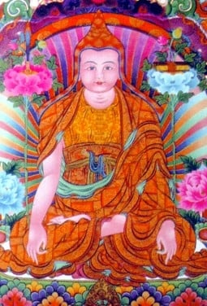
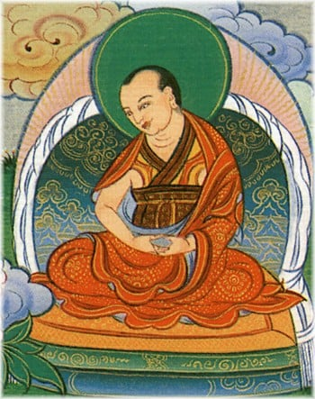
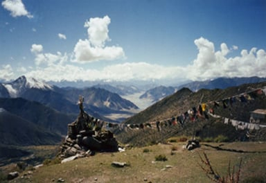

Longchen Rabjam

**This section contains Tibetan script.** Without proper [Tibetan rendering support configured](http://www.digitaltibetan.org/index.php/How_to_configure_Web_browsers_for_correct_display_of_Tibetan_script), you may see other symbols instead of Tibetan script.

**Longchenpa** (Tib. ཀློང་ཆེན་པ་, [Wyl.](https://www.rigpawiki.org/index.php?title=Wyl. "Wyl.") _klong chen pa_), also known as **Longchen Rabjam** (Tib. ཀློང་ཆེན་རབ་འབྱམས་, _klong chen rab 'byams_), ‘Infinite, Vast Expanse of Space’, or **Drimé Özer** (1308-1364), was one of the most brilliant teachers of the [Nyingma](/source/nyingma/ "Nyingma") lineage. He systematized the Nyingma teachings in his ‘[Seven Treasures](https://www.rigpawiki.org/index.php?title=Seven_Treasures "Seven Treasures")’ and wrote extensively on [Dzogchen](/source/dzogchen/ "Dzogchen"). He transmitted the [Longchen Nyingtik](/source/longchen-nyingtik/ "Longchen Nyingtik") cycle of teachings and practice to [Jikmé Lingpa](https://www.rigpawiki.org/index.php?title=Jikmé_Lingpa "Jikmé Lingpa"), and it has since become one of the most widely practised of traditions.

## Biography

The immediate reincarnation of [Pema Ledreltsal](https://www.rigpawiki.org/index.php?title=Pema_Ledreltsal "Pema Ledreltsal"), Longchenpa is regarded as an indirect incarnation of the princess [Pema Sal](https://www.rigpawiki.org/index.php?title=Pema_Sal "Pema Sal"). He was born in the Tra Valley of Southern Tibet to master Tenpasung, an adept at both the sciences and the practice of [mantra](https://www.rigpawiki.org/index.php?title=Mantra "Mantra"), and Dromza Sonamgyen, who was descended from the family of [Dromtönpa Gyalwé Jungné](https://www.rigpawiki.org/index.php?title=Dromtönpa_Gyalwé_Jungné "Dromtönpa Gyalwé Jungné"). Longchenpa was first ordained at the age of eleven and studied extensively with the Third [Karmapa](https://www.rigpawiki.org/index.php?title=Karmapa "Karmapa"), [Rangjung Dorje](https://www.rigpawiki.org/index.php?title=Rangjung_Dorje "Rangjung Dorje"). He received not only the [Nyingma](/source/nyingma/ "Nyingma") transmissions as passed down in his family, but also studied with many of the great teachers of his day. He received the combined [Kadam](https://www.rigpawiki.org/index.php?title=Kadam "Kadam") and [Sakya](https://www.rigpawiki.org/index.php?title=Sakya "Sakya") teachings of the [Sutrayana](https://www.rigpawiki.org/index.php?title=Sutrayana "Sutrayana") through his main [Sakya](https://www.rigpawiki.org/index.php?title=Sakya "Sakya") teacher, [Lama Dampa Sonam Gyaltsen](https://www.rigpawiki.org/index.php?title=Sakyapa_Sonam_Gyaltsen "Sakyapa Sonam Gyaltsen"), in addition to the corpus of both [old](/source/nyingma/ "Nyingma") and [new](https://www.rigpawiki.org/index.php?title=Sarma "Sarma") translation [tantras](https://www.rigpawiki.org/index.php?title=Tantra "Tantra"). At the age of nineteen, Longchenpa entered the famous [shedra](https://www.rigpawiki.org/index.php?title=Shedra "Shedra") [Sangphu Neuthok](https://www.rigpawiki.org/index.php?title=Sangphu_Neuthok "Sangphu Neuthok"), where he acquired great scholarly wisdom. He later chose to practise in the solitude of the mountains, after becoming disillusioned by the behaviour of some scholars.

[Rigdzin Kumaradza](https://www.rigpawiki.org/index.php?title=Rigdzin_Kumaradza "Rigdzin Kumaradza"), Longchenpa's [root guru](https://www.rigpawiki.org/index.php?title=Root_guru "Root guru")

During his late twenties two events occurred that were to be of decisive importance in his intellectual and spiritual development. One was a vision of Guru [Padmasambhava](/source/padmasambhava/ "Padmasambhava") and [Yeshe Tsogyal](https://www.rigpawiki.org/index.php?title=Yeshe_Tsogyal "Yeshe Tsogyal"), and the other was his meeting with the great [Rigdzin Kumaradza](https://www.rigpawiki.org/index.php?title=Rigdzin_Kumaradza "Rigdzin Kumaradza"). It was in the mountains that he met Rigdzin Kumaradza, who was travelling from valley to valley leading his students through the most difficult of circumstances. Together with [Rangjung Dorje](https://www.rigpawiki.org/index.php?title=Rangjung_Dorje "Rangjung Dorje"), Longchenpa accompanied them for two years, during which time he received all of Rigdzin Kumaradza's transmissions and underwent tremendous hardship.

After several years in retreat, Lonchenpa attracted more and more students, even though he had spent nearly all of his life in mountain caves. During a stay in Bhutan (Tib. _Mon_), Longchenpa founded several monasteries, including [Tharpaling](https://www.rigpawiki.org/index.php?title=Tharpaling_Monastery "Tharpaling Monastery") near Bumthang, and fathered two children, his son Tulku Drakpa Özer (b. 1356), going on to become a holder of the [Nyingtik](https://www.rigpawiki.org/index.php?title=Nyingtik "Nyingtik") lineage.

The events leading up to Longchenpa's [parinirvana](https://www.rigpawiki.org/index.php?title=Parinirvana "Parinirvana") are recorded in a text known as _The Immaculate Radiance_ which includes these lines:

: My delight in death is far, far greater than : The delight of traders at making vast fortunes at sea, : Or the lords of the gods who vaunt their victory in battle; : Or of those sages who have entered the rapture of perfect absorption. : So just as a traveller who sets out on the road when it is time, : I, Pema Ledrel Tsal, will not remain in this world any longer, : But will go to dwell in the stronghold of the great bliss of deathlessness.

## Legacy

[Sogyal Rinpoche](https://www.rigpawiki.org/index.php?title=Sogyal_Rinpoche "Sogyal Rinpoche") writes:

: The figure of Longchen Rabjam stands out as one of the greatest Dzogchen masters in the Nyingma tradition, and amongst the most brilliant and original writers in Tibetan Buddhist literature. He was the author of over 200 works, of which only about twenty-five survive, and amongst which the Seven Treasuries (Tib. མཛོད་བདུན་ Dzö Dun) and Three Trilogies are most well-known. It was he who brought together into a cohesive system the teachings of Vima Nyingtik and Khandro Nyingtik, on which he wrote the ‘Three Yangtik’ or Inner Essences. : As Nyoshul Khen Rinpoche explains: “Kunkhyen Longchenpa’s Seven Treasuries (Dzö Dun) were written to elucidate the extraordinarily profound meaning of the seventeen main Tantras of Dzogpachenpo as well as the teachings of all Nine Yanas. For the purpose of the actual practice of Dzogchen according to these Tantras, Longchenpa gathered his own termas as well as those of Chetsün Senge Wangchuk (who was later reborn as Jamyang Khyentse Wangpo) and Pema Lédrel Tsal (Longchenpa’s previous incarnation) in the form of the thirteen volume collection known as the Nyingtik Yabshyi. This Yabshyi is the practice aspect of Longchenpa’s writings, and the basis of the Old Nyingtik. In it he synthesized the Vima Nyingtik of Vimalamitra and the Khandro Nyingtik of Guru Rinpoche and explained all the practical details in the light of his own realization.”

## His Writings

[Gangri Thökar](https://www.rigpawiki.org/index.php?title=Gangri_Thökar "Gangri Thökar") where Longchenpa composed many of his writings

*   [Seven Treasures](https://www.rigpawiki.org/index.php?title=Seven_Treasures "Seven Treasures")
    *   The [Wish Fulfilling Treasury](https://www.rigpawiki.org/index.php?title=Wish_Fulfilling_Treasury "Wish Fulfilling Treasury") (Tib. ཡིད་བཞིན་མཛོད་, _Yishyin Dzö_; Wyl. _yid bzhin mdzod_)
    *   The [Treasury of Pith Instructions](https://www.rigpawiki.org/index.php?title=Treasury_of_Pith_Instructions "Treasury of Pith Instructions") (Tib. མན་ངག་མཛོད་, _Mengak Dzö_; Wyl. _man ngag mdzod_)
    *   The [Treasury of Dharmadhatu](https://www.rigpawiki.org/index.php?title=Treasury_of_Dharmadhatu "Treasury of Dharmadhatu") (Tib. ཆོས་དབྱིངས་མཛོད་, _Chöying Dzö_; Wyl. _chos dbyings mdzod_)
    *   The [Treasury of Philosophical Tenets](https://www.rigpawiki.org/index.php?title=Treasury_of_Philosophical_Tenets "Treasury of Philosophical Tenets") (Tib. གྲུབ་མཐའ་མཛོད་, _Drubta Dzö_; Wyl. _grub mtha' mdzod_)
    *   The [Treasury of the Supreme Vehicle](https://www.rigpawiki.org/index.php?title=Treasury_of_the_Supreme_Vehicle "Treasury of the Supreme Vehicle") (Tib. ཐེག་མཆོག་མཛོད་, _Tekchok Dzö_; Wyl. _theg mchog mdzod_)
    *   The [Treasury of Word and Meaning](https://www.rigpawiki.org/index.php?title=Treasury_of_Word_and_Meaning "Treasury of Word and Meaning") (Tib. ཚིག་དོན་མཛོད་, _Tsik Dön Dzö_; Wyl. _tshig don mdzod_)
    *   The [Treasury of the Natural State](https://www.rigpawiki.org/index.php?title=Treasury_of_the_Natural_State "Treasury of the Natural State") (Tib. གནས་ལུགས་མཛོད་, _Neluk Dzö_; Wyl. _gnas lugs mdzod_)
*   [Trilogy of Dispelling Darkness](https://www.rigpawiki.org/index.php?title=Trilogy_of_Dispelling_Darkness "Trilogy of Dispelling Darkness")
    *   [Dispelling Darkness in the Ten Directions](https://www.rigpawiki.org/index.php?title=Dispelling_Darkness_in_the_Ten_Directions "Dispelling Darkness in the Ten Directions") (Tib. གསང་སྙིང་འགྲེལ་པ་ཕྱོགས་བཅུ་མུན་སེལ་, _gsang snying 'grel pa phyogs bcu mun sel_)
    *   Dispelling Darkness of the Mind (Tib. གསང་སྙིང་སྤྱི་དོན་ཡིད་ཀྱི་མུན་སེལ་, _gsang snying spyi don yid kyi mun sel_)
    *   Dispelling Darkness of Ignorance (Tib. གསང་སྙིང་བསྡུས་དོན་མ་རིག་མུན་སེལ་, _gsang snying bsdus don ma rig mun sel_)
*   [Trilogy of Finding Comfort and Ease](https://www.rigpawiki.org/index.php?title=Trilogy_of_Finding_Comfort_and_Ease "Trilogy of Finding Comfort and Ease")
    *   [Finding Comfort and Ease in the Nature of Mind](https://www.rigpawiki.org/index.php?title=Finding_Comfort_and_Ease_in_the_Nature_of_Mind "Finding Comfort and Ease in the Nature of Mind") (Tib. སེམས་ཉིད་ངལ་གསོ, [Wyl.](https://www.rigpawiki.org/index.php?title=Wyl. "Wyl.")_sems nyid ngal gso_)
    *   [Finding Comfort and Ease in Meditation](https://www.rigpawiki.org/index.php?title=Finding_Comfort_and_Ease_in_Meditation "Finding Comfort and Ease in Meditation") (Tib. བསམ་གཏན་ངལ་གསོ་, Wyl. _bsam gtan ngal gso_)
    *   [Finding Comfort and Ease in the Illusoriness of Things](https://www.rigpawiki.org/index.php?title=Finding_Comfort_and_Ease_in_the_Illusoriness_of_Things "Finding Comfort and Ease in the Illusoriness of Things") (Tib. སྒྱུ་མ་ངལ་གསོ་, Wyl. _sgyu ma ngal gso_)
*   [Trilogy of Natural Freedom](https://www.rigpawiki.org/index.php?title=Trilogy_of_Natural_Freedom "Trilogy of Natural Freedom")
    *   [The Natural Freedom of the Nature of Mind](https://www.rigpawiki.org/index.php?title=The_Natural_Freedom_of_the_Nature_of_Mind "The Natural Freedom of the Nature of Mind") (Tib. སེམས་ཉིད་རང་གྲོལ་, _Semnyi Rangdrol_)
    *   The [Natural Freedom of Reality](https://www.rigpawiki.org/index.php?title=Natural_Freedom_of_Reality "Natural Freedom of Reality") (Tib. ཆོས་ཉིད་རང་གྲོལ་, _Chönyi Rangdrol_)
    *   The [Natural Freedom of Equality](https://www.rigpawiki.org/index.php?title=Natural_Freedom_of_Equality "Natural Freedom of Equality") (Tib. མཉམ་ཉིད་རང་གྲོལ་, _Nyamnyi Rangdrol_)
*   A Collection of Writings (Tib. གསུང་ཐོར་བུ་, Wyl. _gsung thor bu_)
    *   The Jewel Ship, a commentary on the [The All-Creating King Tantra](https://www.rigpawiki.org/index.php?title=Kunje_Gyalpo "Kunje Gyalpo") tantra.
    *   [Thirty Pieces of Advice from the Heart](https://www.rigpawiki.org/index.php?title=Thirty_Pieces_of_Advice_from_the_Heart "Thirty Pieces of Advice from the Heart") (Tib. སྙིང་གཏམ་སུམ་ཅུ་པ་, Wyl. _snying gtam sum cu pa_)
    *   The Thundering Roar of Brahmā: An Overview of the Mantra Vehicle (_sngags kyi spyi don tshangs dbyangs 'brug sgra_)

## Alternative Names

Longchenpa used several different names in the colophons to his writings, often corresponding to the subject matter of the text:

*   Dorje Ziji (Tib. རྡོ་རྗེ་གཟི་བརྗིད་, _rdo rje gzi brjid_) for writings common to both outer and inner tantras.
*   Drimé Özer (Tib. དྲི་མེད་འོད་ཟེར་, _dri med 'od zer_) for writings on profound subjects and especially the stages of meditation.
*   Longchen Rabjam (Tib. ཀློང་ཆེན་རབ་འབྱམས་, _klong chen rab 'byams_) for writings in which the inconceivable nature is taught in detail.
*   Kunkhyen Ngakgi Wangpo (Tib. ཀུན་མཁྱེན་ངག་གི་དབང་པོ་, _kun mkhyen ngag gi dbang po_) for writings in which the various [yanas](https://www.rigpawiki.org/index.php?title=Yana "Yana") and views are explained in detail.
*   Tsultrim Lodrö (Tib. ཚུལ་ཁྲིམས་བློ་གྲོས་, _tshul khrims blo gros_) or Samyepa Tsultrim Lodrö, for writings on the outer sciences.

## Notes

## Teachings Given to the Rigpa sangha

*   [Khenpo Pema Sherab](https://www.rigpawiki.org/index.php?title=Khenpo_Pema_Sherab "Khenpo Pema Sherab"), [Teachings on Longchenpa's Advice from the Heart](https://www.rigpawiki.org/index.php?title=Teachings_on_Longchenpa's_Advice_from_the_Heart "Teachings on Longchenpa's Advice from the Heart"), Lerab Ling, August 2009
*   [Nyoshul Khen Rinpoche](https://www.rigpawiki.org/index.php?title=Nyoshul_Khen_Rinpoche "Nyoshul Khen Rinpoche"), Lerab Ling, 17 August 1996

## Further Reading

### In English

*   David Germano, _Poetic thought, the intelligent Universe, and the mystery of self: The Tantric synthesis of rDzogs Chen in fourteenth century Tibet_ (PhD dissertation), University of Wisconsin-Madison, 1992.
*   [Dudjom Rinpoche](https://www.rigpawiki.org/index.php?title=Dudjom_Rinpoche "Dudjom Rinpoche"), _The Nyingma School of Tibetan Buddhism, Its Fundamentals and History_, trans. and ed. Gyurme Dorje (Boston: Wisdom, 1991), pp.575-596
*   Ehrhard, Franz-Karl. _The Oldest Known Block Print of Klong-chen Rab-'byams-pa's Theg mchog mdzod: Facsimile Edition of Early Tibetan Block Prints, with an Introduction by Franz-Karl Ehrhard_, Lumbini International Research Institute, Lumbini: 2000
*   Germano, David and Gyatso, Janet, "Longchenpa and the Possession of the Ḍākinīs" in David Gordon White (ed.) _Tantra in Practice_, Princeton University Press, 2000
*   Klong-chen rab-'byams-pa, _Looking Deeper: A Swan's Questions and Answers_, translated by Herbert V. Guenther, Timeless Books, 1983
*   Longchen Rabjampa, '_The Four-Themed Precious Garland: An Introduction to Dzogchen_, with commentaries by Dudjom Rinpoche and Beru Khyentse Rinpoche; translated by Alexander Berzin, LTWA, 1978
*   Longchenpa, _You Are the Eyes of the World_, translated by Kennard Lipman and Merrill Peterson, Snow Lion, 2000
*   Mackenzie Stewart, Jampa, _The Life of Longchenpa: The Omniscient Dharma King of the Vast Expanse_ (Ithaca: Snow Lion, 2014)
*   [Nyoshul Khenpo](https://www.rigpawiki.org/index.php?title=Nyoshul_Khenpo "Nyoshul Khenpo"), _A Marvelous Garland of Rare Gems: Biographies of Masters of Awareness in the Dzogchen Lineage_, Padma Publications, 2005
*   Smith, E. Gene, 'Klong chen Rab 'byams pa and His Works' in _Among Tibetan Texts_, Wisdom, 2001
*   [Tulku Thondup](https://www.rigpawiki.org/index.php?title=Tulku_Thondup "Tulku Thondup"), _Masters of Meditation and Miracles_, Shambhala, pages 109-117.
*   Tulku Thondup, _The Practice of Dzogchen_ (Ithaca: Snow Lion, 1989)

### In French

*   Stéphane Arguillère, _Vaste sphère de profusion, Klong-chen rab-'byams (Tibet, 1308-1364), sa vie, son oeuvre, sa doctrine_, Orientalia Analecta Lovaniensa 167, Leiden: Peeters, 2007

## Internal Links

*   [Prayer to Longchen Rabjam](https://www.rigpawiki.org/index.php?title=Prayer_to_Longchen_Rabjam "Prayer to Longchen Rabjam")

## External Links

*   [Biography at Treasury of Lives](https://treasuryoflives.org/biographies/view/Longchenpa-Drime-Wozer/P1583)
*   [Longchen Rabjam Series on Lotsawa House](http://www.lotsawahouse.org/tibetan-masters/longchen-rabjam)
*   [TBRC Profile](https://www.tbrc.org/link/?RID=P1583)
