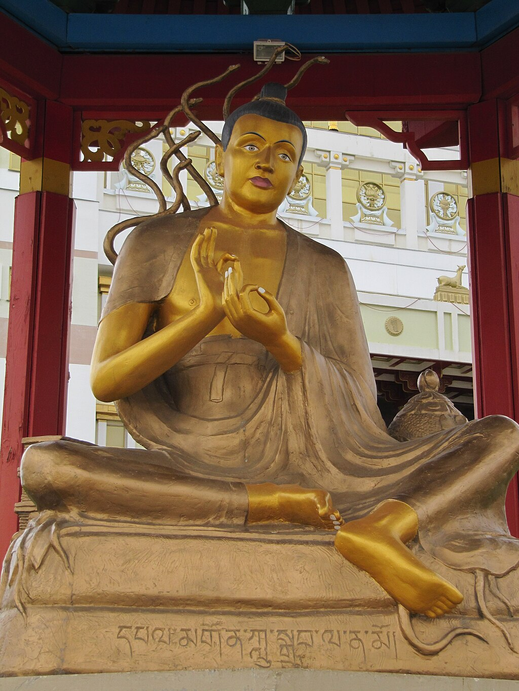

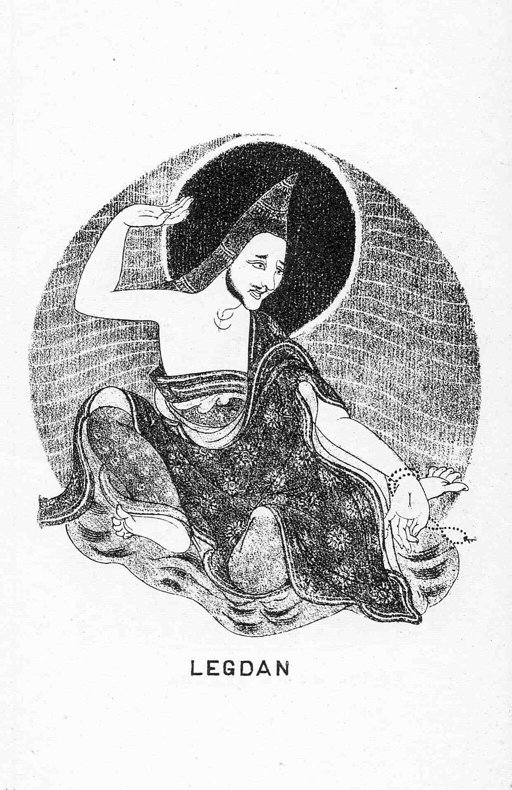

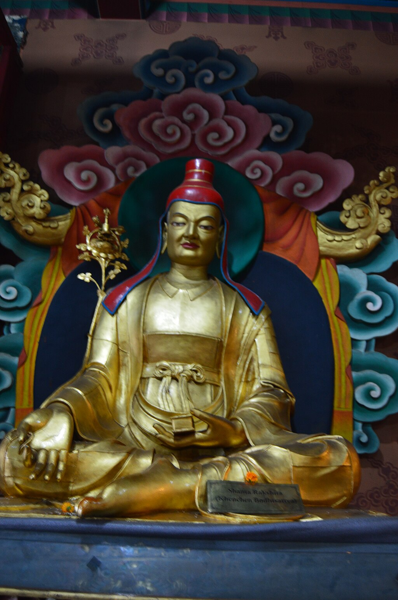

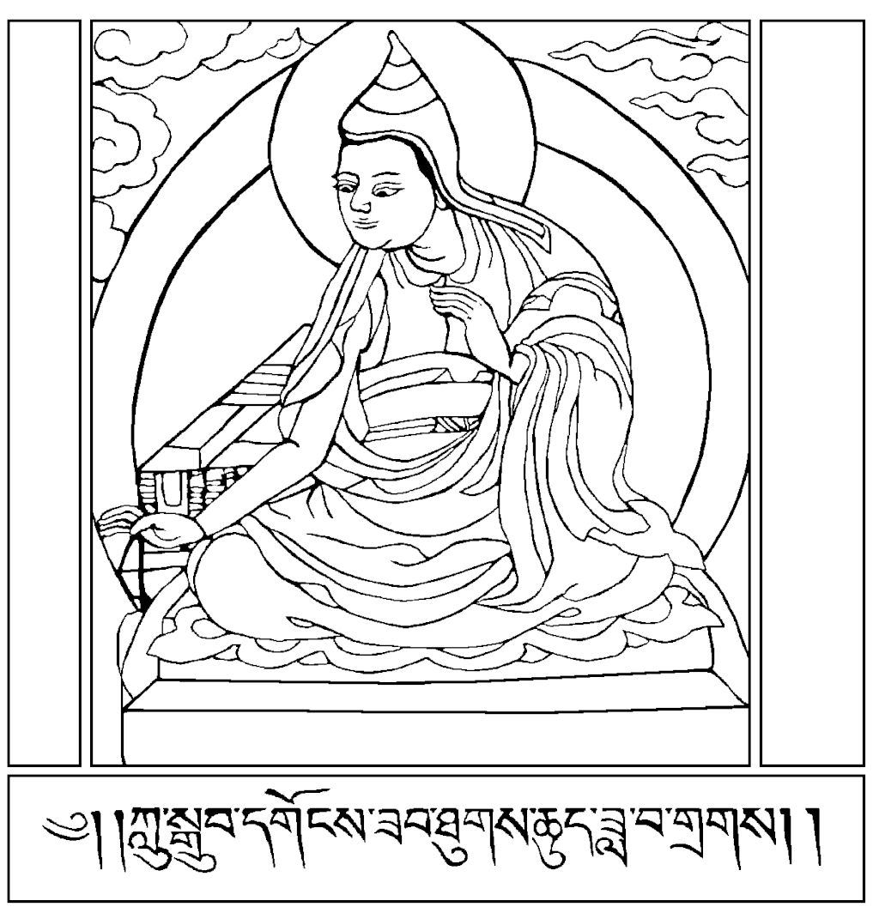

Classical Indian Madhyamika thinkers. **Clockwise from upper left**: [Nāgārjuna](https://en.wikipedia.org/wiki/Nagarjuna "Nagarjuna") (founder), [Bhāvavivēka](https://en.wikipedia.org/wiki/Bhāviveka "Bhāviveka") and [Candrakīrti](https://en.wikipedia.org/wiki/Chandrakirti "Chandrakirti") (commentators), [Śāntarakṣita](https://en.wikipedia.org/wiki/Śāntarakṣita "Śāntarakṣita") (synthesized the school with [Yogācāra](https://en.wikipedia.org/wiki/Yogacara "Yogacara")).

**Madhyamaka** ([Sanskrit](https://en.wikipedia.org/wiki/Sanskrit_language "Sanskrit language"): माध्यमक, [romanized](https://en.wikipedia.org/wiki/Romanization_of_Sanskrit "Romanization of Sanskrit"): _Mādhyamika_, [lit.](https://en.wikipedia.org/wiki/Literal_translation "Literal translation") 'middle way; centrism'; [Chinese](https://en.wikipedia.org/wiki/Traditional_Chinese_characters "Traditional Chinese characters"):中觀見; [pinyin](https://en.wikipedia.org/wiki/Pinyin "Pinyin"):_Zhōngguān jiàn_; [Vietnamese](https://en.wikipedia.org/wiki/Vietnamese_language "Vietnamese language"): Trung quán tông, [chữ Nôm](https://en.wikipedia.org/wiki/Chữ_Nôm "Chữ Nôm"): 中觀宗; [Tibetan](https://en.wikipedia.org/wiki/Tibetan_script "Tibetan script"): དབུ་མ་པ་, [Wylie](https://en.wikipedia.org/wiki/Wylie_transliteration "Wylie transliteration"): dbu ma pa) also known as **Madhyamika** ([Sanskrit](https://en.wikipedia.org/wiki/Sanskrit_language "Sanskrit language"): माध्यमिक, [romanized](https://en.wikipedia.org/wiki/Romanization_of_Sanskrit "Romanization of Sanskrit"): _Mādhyamika_) refers to a tradition of [Buddhist philosophy](https://en.wikipedia.org/wiki/Buddhist_philosophy "Buddhist philosophy") and practice founded by the [Indian Buddhist](https://en.wikipedia.org/wiki/History_of_Buddhism_in_India "History of Buddhism in India") monk and philosopher [Nāgārjuna](https://en.wikipedia.org/wiki/Nagarjuna "Nagarjuna") (c. 150 – c. 250 CE). The foundational text of the Mādhyamaka tradition is [Nāgārjuna](https://en.wikipedia.org/wiki/Nagarjuna "Nagarjuna")'s _[Mūlamadhyamakakārikā](https://en.wikipedia.org/wiki/Mūlamadhyamakakārikā "Mūlamadhyamakakārikā")_ ("Root Verses on the Middle Way"). More broadly, Madhyamaka also refers to the ultimate nature of phenomena as well as the non-conceptual realization of ultimate reality that is experienced in [meditation](https://en.wikipedia.org/wiki/Buddhist_meditation "Buddhist meditation").

Since the 4th century CE onwards, Madhyamaka philosophy had a major influence on the subsequent development of the [Mahāyāna Buddhist](https://en.wikipedia.org/wiki/Mahayana "Mahayana") tradition, especially following the [spread of Buddhism throughout Asia](https://en.wikipedia.org/wiki/Silk_Road_transmission_of_Buddhism "Silk Road transmission of Buddhism"). It is the dominant interpretation of Buddhist philosophy in [Tibetan Buddhism](https://en.wikipedia.org/wiki/Tibetan_Buddhism "Tibetan Buddhism") and has also been influential in [East Asian Buddhist](https://en.wikipedia.org/wiki/East_Asian_Buddhism "East Asian Buddhism") thought.

According to the classical Indian Madhyamika thinkers, all [phenomena](https://en.wikipedia.org/wiki/Dharma#Dharmas_in_Buddhist_phenomenology "Dharma") (_dharmas_) are [empty](https://en.wikipedia.org/wiki/Śūnyatā "Śūnyatā") (_śūnya_) of "nature", of any "substance" or "essence" ([_svabhāva_](https://en.wikipedia.org/wiki/Svabhava "Svabhava")) which could give them "solid and independent existence", because they are [dependently co-arisen](https://en.wikipedia.org/wiki/Pratītyasamutpāda "Pratītyasamutpāda"). But this "emptiness" itself is also "empty": it does not have an existence on its own, nor does it refer to a transcendental reality beyond or above phenomenal reality.

## Etymology

_Madhya_ is a Sanskrit word meaning "middle". The _-ma_ suffix is a superlative, giving _madhyama_ the meaning of "mid-most" or "medium". The _-ka_ suffix is used to form adjectives, thus _madhyamaka_ means "middling". The _-ika_ suffix is used to form possessives, with a collective sense, thus _mādhyamika_ mean "belonging to the mid-most" (the _-ika_ suffix regularly causes a lengthening of the first vowel and elision of the final _-a_).

In a Buddhist context, these terms refer to the "middle path" (_madhyamā pratipad_), which refers to right view (_samyagdṛṣṭi_) which steers clear of the metaphysical extremes of annihilationism (_ucchedavāda_) and eternalism (_śāsvatavāda_). For example, the Sanskrit _Kātyāyanasūtra_ states that though the world "relies on a duality of existence and non-existence", the Buddha teaches a correct view which understands that:

> Arising in the world, Kātyayana, seen and correctly understood just as it is, shows there is no non-existence in the world. Cessation in the world, Kātyāyana, seen and correctly understood just as it is, shows there is no permanent existence in the world. Thus avoiding both extremes the Tathāgata teaches a dharma by **the middle path (_madhyamayā pratipadā_)**. That is: this being, that becomes; with the arising of this, that arises. With ignorance as condition there is volition ... \[to be expanded with the standard formula of the 12 links of dependent origination\]

Though all Buddhist schools saw themselves as defending a middle path in accord with the Buddhist teachings, the name _Madhyamaka_ refers to a school of Mahayana philosophy associated with Nāgārjuna and his commentators. The term _Mādhyamika_ refers to adherents of the Madhyamaka school. Note that in both words the stress is on the first syllable.

## Philosophical overview

### _Svabhāva_, what Madhyamaka denies

Central to Madhyamaka philosophy is _[śūnyatā](https://en.wikipedia.org/wiki/Śūnyatā "Śūnyatā")_, "emptiness", which refers to the idea that [dharmas](https://en.wikipedia.org/wiki/Dhamma_theory "Dhamma theory") are empty of [_svabhāva_](https://en.wikipedia.org/wiki/Svabhava "Svabhava"). This term has been translated variously as essence, intrinsic nature, inherent existence, own being, and substance. According to Richard P. Hayes, _svabhāva_ can be interpreted as either "identity" or as "causal independence". Likewise, Westerhoff notes that [_svabhāva_](https://en.wikipedia.org/wiki/Svabhava "Svabhava") is a complex concept with both ontological and cognitive aspects. The ontological aspects include _svabhāva_ as [essence](https://en.wikipedia.org/wiki/Essence "Essence") (a property which makes an object what it is) and as [substance](https://en.wikipedia.org/wiki/Substance_theory "Substance theory"). As the Madhyamaka thinker [Candrakīrti](https://en.wikipedia.org/wiki/Chandrakirti "Chandrakirti") defines it, substance is something that does "not depend on anything else".

It is substance-_svabhāva_, the objective and independent existence of any object or concept that the Madhyamaka arguments mostly focus on refuting. A common structure that Madhyamaka uses to negate _svabhāva_ is the _[catuṣkoṭi](https://en.wikipedia.org/wiki/Catuṣkoṭi "Catuṣkoṭi")_ ("four corners" or [tetralemma](https://en.wikipedia.org/wiki/Tetralemma "Tetralemma")), which consists of four alternatives: a proposition is true; a proposition is false; a proposition is both true and false; a proposition is neither true nor false. Some of the major topics discussed by classical Madhyamaka include [causality](https://en.wikipedia.org/wiki/Causality "Causality"), change, and [personal identity](https://en.wikipedia.org/wiki/Personal_identity "Personal identity").

Madhyamaka's denial of _svabhāva_ does not mean a [nihilistic](https://en.wikipedia.org/wiki/Nihilism "Nihilism") denial of all things, for in a conventional everyday sense, Madhyamaka does accept that one can speak of "things", and yet _ultimately_ these things are empty of inherent existence. Furthermore, "emptiness" itself is also "empty": it does not have an existence on its own, nor does it refer to a transcendental reality beyond or above phenomenal reality.

_Svabhāva'_s cognitive aspect is merely a superimposition (_samāropa_) that beings make when they perceive and conceive of things. In this sense then, emptiness does not exist as some kind of primordial reality, but it is simply a corrective to a mistaken conception of how things exist. This idea of _svabhāva_ that Madhyamaka denies is then not just a conceptual philosophical theory, but it is a [cognitive distortion](https://en.wikipedia.org/wiki/Cognitive_distortion "Cognitive distortion") that beings automatically impose on the world, such as when we regard the [five aggregates](https://en.wikipedia.org/wiki/Skandha "Skandha") as constituting a single [self](https://en.wikipedia.org/wiki/Ātman_\(Hinduism\) "Ātman (Hinduism)"). [Candrakirti](https://en.wikipedia.org/wiki/Chandrakirti "Chandrakirti") compares it to someone who suffers from [vitreous floaters](https://en.wikipedia.org/wiki/Vitreous_floaters "Vitreous floaters") that cause the illusion of hairs appearing in their visual field. This cognitive dimension of _svabhāva_ means that just understanding and assenting to Madhyamaka reasoning is not enough to end the suffering caused by our [reification](https://en.wikipedia.org/wiki/Reification_\(fallacy\) "Reification (fallacy)") of the world, just like understanding how an [optical illusion](https://en.wikipedia.org/wiki/Optical_illusion "Optical illusion") works does not make it stop functioning. What is required is a kind of [cognitive shift](https://en.wikipedia.org/wiki/Cognitive_shift "Cognitive shift") (termed _realization_) in the way the world appears and therefore some kind of practice to lead to this shift. As Candrakirti says:

> For one on the road of [cyclic existence](https://en.wikipedia.org/wiki/Samsara "Samsara") who pursues an inverted view due to [ignorance](https://en.wikipedia.org/wiki/Avidyā_\(Buddhism\) "Avidyā (Buddhism)"), a mistaken object such as the superimposition (_samāropa_) on the [aggregates](https://en.wikipedia.org/wiki/Skandha "Skandha") appears as real, but it does not appear to one who is close to the view of the real nature of things.

Much of Madhyamaka philosophy centers on showing how various [essentialist](https://en.wikipedia.org/wiki/Essentialism "Essentialism") ideas have absurd conclusions through _[reductio ad absurdum](https://en.wikipedia.org/wiki/Reductio_ad_absurdum "Reductio ad absurdum")_ arguments (known as _prasanga_ in Sanskrit). Chapter 15 of [Nāgārjuna](https://en.wikipedia.org/wiki/Nagarjuna "Nagarjuna")'s _[Mūlamadhyamakakārikā](https://en.wikipedia.org/wiki/Mūlamadhyamakakārikā "Mūlamadhyamakakārikā")_ centers on the words [svabhāva](https://en.wikipedia.org/wiki/Svabhāva "Svabhāva"), parabhāva, [bhāva](https://en.wikipedia.org/wiki/Bhāva "Bhāva") and [abhāva](https://en.wikipedia.org/wiki/Abhāva "Abhāva"). According to Peter Harvey:

> Nagarjuna's critique of the notion of own-nature (_sva-bhāva_) (_Mk._ ch. 15) argues that anything which arises according to conditions, as all phenomena do, can have no inherent nature, for what is depends on what conditions it. Moreover, if there is nothing with own-nature, there can be nothing with 'other-nature' (_para-bhāva_), i.e. something which is dependent for its existence and nature on something _else_ which has own-nature. Furthermore, if there is neither own-nature nor other-nature, there cannot be anything with a true, substantial existent nature (_bhāva_). If there is no true existent, then there can be no non-existent (_abhāva_).

An important element of Madhyamaka refutation is that the classical Buddhist doctrine of [dependent arising](https://en.wikipedia.org/wiki/Pratītyasamutpāda "Pratītyasamutpāda") (the idea that every phenomenon is dependent on other phenomena) cannot be reconciled with "a conception of self-nature or substance" and that therefore essence theories are contrary not only to the Buddhist scriptures but to the very ideas of [causality](https://en.wikipedia.org/wiki/Causality "Causality") and change. Any enduring [essential nature](https://en.wikipedia.org/wiki/Svabhāva "Svabhāva") would prevent any causal interaction, or any kind of origination. For things would simply always have been, and will always continue to be, without any change. As [Nāgārjuna](https://en.wikipedia.org/wiki/Nagarjuna "Nagarjuna") writes in the MMK:

> We state that conditioned origination is emptiness. It is mere designation depending on something, and it is the middle path. (24.18) Since nothing has arisen without depending on something, there is nothing that is not empty. (24.19)

Westerhoff observes that while causal relations imply lack of _svabhāva_ in some way, Nāgārjuna's argument does not stop there. After all, [Ābhidharmikas](https://en.wikipedia.org/wiki/Abhidharma "Abhidharma") saw no conflict between causation and _svabhāva,_ and the dependence of effects upon causes alone is not sufficient to demonstrate their dependence on conceptualization, which is to be empty in the most profound sense. As such, for Nāgārjuna, emptiness does not merely mean that phenomena are situated in causal relations, but more importantly, these causal relations themselves do not exist independently of human cognition and conceptualization. As Westerhoff explains, "since the causal relation does not exist from its own side, is conceptually constructed, and therefore empty, each causally related object must be so constructed and therefore empty in the most profound sense of being conceptually constructed."

According to Nāgārjuna, _svabhāva_ is incompatible with causation since a causally produced object can only exist in a dependence relation to other phenomena, thereby lacking _svabhāva_. At the same time, Nāgārjuna also argues that, since all things lack _svabhāva_, causation cannot be objectively established either. As Westerhoff explains, objects "owe their existence to a partly habitual, partly deliberate process of cutting up the complex flow of phenomena into cognitively manageable bits." They thus do not exist independently of our conceptualizations, or "from their own side." In the absence of any truly objective things, there can be no objective relation (i.e. causation) linking objects and events. In this way, several Madhyamaka arguments are concerned to demonstrate with reasoning that "Whatever arises from conditions does not arise. / It does not have the nature of arising."

### Madhyamaka arguments

Madhyamaka philosophers formulated many arguments which aim to demonstrate that phenomena do not inherently arise or exist. These arguments target various classes of things that make up important aspects of the human worldview, including [causation](https://en.wikipedia.org/wiki/Causality "Causality"), motion, the self, [epistemology](https://en.wikipedia.org/wiki/Epistemology "Epistemology"), and language. Madhyamaka criticisms of causation and other categories seek to prove that such things are "riddled with contradiction," as they are ultimately "mere ascriptions" (_vikalpa_).

#### No arising from the four possibilities

This argument, which is also sometimes called the "Diamond Splinters Argument," is presented as an investigation of causes. According to this argument, there are four possible ways in which something could arise from causes. However, since none of these possibilities is valid, nothing truly arises. The four possibilities are that something may: \[1\] arise from itself, \[2\] from something other than itself, \[3\] from both, or \[4\] without any cause at all.

The first possibility, arising from self, is invalid. Nothing arises from itself since it would have to already exist in order to produce itself. But if something already exists, its "arising" would be meaningless. An absurd consequence of this would be that things would continue to produce themselves without end: if something arises again after it already exists, it would do so repeatedly. The view of arising from self was upheld by the [Sāṃkhyas](https://en.wikipedia.org/wiki/Samkhya "Samkhya"), who accepted the doctrine of the existence of the effect in the cause (_satkāryavāda_). This view emphasizes the identity or continuity of cause and effect. The Sāṃkhyas defended this position by appealing to the notion of manifestation (_abhivyakti_): it is not that the effect is nonexistent in the cause, it is simply unmanifest. However, in this case, cause and effect cannot be truly identical, since a distinction must still exist between the manifest and the unmanifest, the actual and the potential. Further, it is observed that cause and effect have different temporal distinctions, shapes, colors, and so on. If it were possible for all of these to be one, "then fire and water, virtue and evil, and the rest, would likewise be one." In this way, _satkāryavāda_ absurdly leads to the abolition of all difference: "The entire universe must collapse into a colourless, differenceless mass."

The second possibility, arising from something other, is the view of total difference, or the total nonexistence of the effect in the cause (_asatkāryavāda_). This position was maintained by the [Vaiśeṣika](https://en.wikipedia.org/wiki/Vaisheshika "Vaisheshika") school. Additionally, the Buddhist [Sarvāstivāda](https://en.wikipedia.org/wiki/Sarvastivada "Sarvastivada") school defended the difference of cause and effect as well. However, this possibility is also invalid since to be other is to be independent, without connection. In that case, anything could arise from anything: fire would produce darkness, barley would grow from wheat, and so on. Another reason that arising from what is other is invalid is that otherness requires the presence of two things, meaning cause and result would have to exist simultaneously. However, we never perceive two things together: when the seed exists, the sprout does not, and vice-versa. If it is argued that cause and result both exist at the same time, then there would be no need for one to depend on the other, "just as two people who have already been born are not mutually dependent."

The third possibility, arising from both oneself and another, just combines the faults of the first two possibilities into an equally faulty third position. As for the fourth possibility, arising without any cause at all, it is also invalid since phenomena would either always arise or never arise. This is because arising would not be related to causes. Things would arise regardless of whether causes and conditions came together or not. Or, they would not arise even when causes and conditions did come together. In this case, all effort would be in vain (e.g. there'd be no point in farmers planting seeds). This is invalidated by our direct experience of the world. The refutation of uncaused production targets the [Cārvāka](https://en.wikipedia.org/wiki/Charvaka "Charvaka") school, which argued that the universe simply "happened" by itself.

Since there is no arising from any of these four possibilities, arising is not real. The arising we experience, therefore, is a mere appearance, likened to the arising experienced in dreams. As such, when we experience arising, it is just a mistaken perception or clinging to something that is not there in reality. The thrust of the above refutation of the four possibilities is that, "The very identity of what things are is that they never happen; they never come into existence."

#### No arising of either existent or nonexistent effects

Where the previous argument investigated causes, this argument is explained as an investigation of effects. We may consider four possibilities: \[1\] an existent result emerges, \[2\] a nonexistent result emerges, \[3\] a result that is both existent and nonexistent emerges, or \[4\] a result that is neither emerges.

The first option is invalid, since there is no need for something that already exists to be produced. If an effect pre-exists in something existent (for example, if a plant already exists in a seed), there is no need for it to be produced again. Further, if what already exists may be produced again, then there would be no end to its arising.

The second option, the production of a nonexistent result, supposes that an effect which was previously nonexistent is produced anew by a cause. However, this is also invalid, since no amount of causes can impart existence to what is utterly nonexistent, such as a rabbit's horns. As one text states: "Even if millions of causes were to join forces, they could never make a 'nonexistent thing' (something intrinsically nonexistent) pass into existence."

The third option, that the result is both existent and nonexistent, is impossible because existence and nonexistence are mutually contradictory. The last option, that an effect arises which is neither existent nor nonexistent, is also unreasonable, since this is the same as saying the effect came about from nothingness. In that case, nothingness would have to change to bring about an effect in either the past, present, or future. It follows from this that nothingness would in fact be something that has divisions. On the other hand, if nothingness is unchanging, no result could ever be produced.

#### No arising either before or after the extinction of causes

This argument analyzes the temporal relation between cause and effect. It investigates cause and effect in terms of being either successive, simultaneous, or overlapping. However, in attempting to classify the temporal relationship of cause and effect, we encounter several difficulties.

The [Abhidharma](https://en.wikipedia.org/wiki/Abhidharma "Abhidharma") theory of momentariness (_kṣaṇavāda_) held that phenomena last only an instant, as "minimally extended space-time points." According to this view, whenever something arises, its immediately preceding condition (_samanantara-pratyaya_) must already be extinct. However, if it is extinct, it cannot function as a condition. For something to arise after its condition has ceased would be to deny all causal relation. On the other hand, if the effect arises before the extinction of the condition, the two would be simultaneous, and this implies causal independence. Alternatively, it may be argued that the condition becomes extinct only after having given part of its being to the effect, but then the condition would have a double being, it would be both extinct and existent.

Another possibility is that cause and effect are overlapping, but the difficulty with this is that cause and effect would each have to be temporally extended over multiple instants in order to overlap. However, that which is spread out across time is a mere conceptual construction (since it can be broken down into temporal parts). Further, if a cause continues to persist even after its effect has arisen, it would be causally inert for the remainder of its duration. But this entails the strange consequence that we "take a causally inert part of the event to be part of the cause."

We may also consider whether cause and effect make contact or not. But if cause and effect make contact, they must be identical, existing at the same time and place. In that case, it would be meaningless to speak of "cause" and "effect." On the other hand, if cause and effect are not in contact, the latter could not arise from the former.

#### Refutation of motion

This argument aims to refute the mistaken notion that phenomena truly exist because coming and going are real. It targets not only motion in its everyday sense, but also the idea of a mover (_gati_) in [saṃsāra](https://en.wikipedia.org/wiki/Saṃsāra_\(Buddhism\) "Saṃsāra (Buddhism)") (a subject who undergoes rebirth) as well as its movement from one life to the next.

We may ask of a thing's motion whether it takes place on the part of its path that has already been traversed, or takes place on that part which has yet to be traversed. However, in the first case, there is no motion since motion no longer occurs there; while in the second, there is no motion since motion has not yet occurred there. There is no third option, since "there is no such place that one either has not already been or has yet to go." Further, there is no motion in the past, future, or present. For motion in the past has already taken place, and motion in the future has not yet happened. As for the present, since it may be divided into ever smaller units, one can never arrive at a "present moment" in which motion is taking place.

In this way, there is no coming or going of anything in reality. This includes sentient beings, their ignorance, mental afflictions, suffering, and thoughts. This argument is in keeping with statements in the _[Prajñāpāramitā](https://en.wikipedia.org/wiki/Prajnaparamita "Prajnaparamita")_ literature, such as the [Heart Sūtra](https://en.wikipedia.org/wiki/Heart_Sutra "Heart Sutra"), which states, "There is no ignorance nor any ending of ignorance."

#### Refutation of time

This argument is a response to the view that, since the three times (past, present and future) exist, so too must the composite phenomena which define them. On this view, the past is defined in relation to things which have ceased, the present in relation to things which currently exist, and the future to things not yet arisen. However, we may ask, if the three times are real, do they exist independently of each other or not? They cannot be independent, since the three times would then lose all meaning. For instance, the notion of "the present" is only possible by virtue of its relationship to the past and future. On the other hand, if the three times do depend on each other, then other difficulties arise. For example, if the present actually depended on the past and future, it would have to exist in the past and future. This is because in order for something to depend on other things, they must meet. Thus, time is empty and so it is said that "the past is imperceptible, the future is imperceptible, and the present is imperceptible. . . . The three times are equality."

#### Neither-one-nor-many argument

The aim of this argument is to demonstrate that phenomena have no inherent existence because they have neither a truly single nor manifold nature. Whatever one may investigate, whether it be an extended object, a particle, consciousness, an object of consciousness, or anything, it cannot be truly one since there is nothing which is not composed of parts. At the same time, since nothing is truly one, there is nothing which can be established as many, since "many" necessarily depends on a collection of individual "ones." Therefore, whatever phenomenon may be the object of one's analysis, it can be neither a single entity nor a multiplicity of entities. This argument is also applied to phenomena assumed to be permanent entities, such as the Hindu [Īśvara](https://en.wikipedia.org/wiki/Ishvara "Ishvara"), who is taken to be an almighty creator: if an entity produces a succession of effects, and each effect is different from the others, that entity can be neither truly one nor permanent. Since phenomena exist neither in the singular nor plural, they are ultimately without intrinsic being, "like reflections."

#### No arising of single or multiple effects from either single or multiple causes

This argument analyzes four possibilities: \[1\] a single effect is produced by many causes, \[2\] many effects by many causes, \[3\] many effects by a single cause, or \[4\] a single effect by a single cause. However upon scrutiny, none of these alternatives can be established.

The first possibility assumes that an effect, such as eye consciousness, is single yet produced by causes which are multiple (a visible object, sense faculty, attention, light, and so on). However, in that case, singularity must be without cause, since that which is multiple cannot be the cause of an effect which lacks multiplicity. Moreover, a single result is unreasonable because a truly singular phenomenon which lacks multiplicity is impossible.

The second option considers that a cause which is multiple produces an effect which is multiple. According to this view, particular aspects of a cause are associated with particular aspects of an effect. For example, considering consciousness as an effect: from an immediately preceding act of attention (_manaskāra_) comes eye cognition, from a sense faculty the ability to perceive a form (_rūpa-grahaṇa-yogyatā_), and from an object (_viṣaya_) a cognition endowed with a corresponding image. However, since consciousness is not multiple, the particular aspects making up its cause cannot be mutually distinct. If they were, they would not be its cause. And if it be argued that although consciousness is single its features are nonetheless many, a subject (_dharmin_) would be different from its properties (_dharma_), thus requiring a different efficient cause (_hetu-kārana_) for consciousness.

The third possibility is that a single cause produces multiple effects. However, it may be asked whether it does so alone or requires additional factors. In the first case, difference would be without cause, while in the latter case, the cause would not in fact be single. Further, a singular, partless cause is not possible, nor could it produce anything without depending upon other conditions.

The final possibility is that a single cause produces a single effect, but this is also unacceptable. If a single cause produces only a single effect, then the eye would produce only the next moment of its continuum. But since it would not also produce eye cognition, it follows that "all sentient beings would be deaf and blind."

Since none of these four possibilities is valid, phenomena are said to be like dreams. No true singularity exists among the entities belonging to causes and their effects. Accordingly, no multiplicity of entities belonging to either causes or effects may be established either.

#### Refutation of pramāṇa

This argument is directed as a response to proponents of the [Nyāya](https://en.wikipedia.org/wiki/Nyaya "Nyaya") school who maintained that knowledge of the world depends on [epistemic](https://en.wikipedia.org/wiki/Epistemology "Epistemology") instruments (_[pramāṇa](https://en.wikipedia.org/wiki/Pramana "Pramana")_). There were four traditionally accepted epistemic instruments: perception (_pratyakṣa_), inference (_anumāna_), testimony (_āgama_), and likeness (_upamāna_). However, if all knowledge depends on epistemic instruments, how then do we have knowledge of the epistemic instruments themselves? If the epistemic instruments are established by other epistemic instruments, then there would be an [infinite regress](https://en.wikipedia.org/wiki/Infinite_regress "Infinite regress"), with no final foundation of knowledge. On the other hand, if knowledge of epistemic instruments is not dependent on epistemic instruments, then it follows that all knowledge finally does not depend on epistemic instruments. It may be argued that the epistemic instruments establish themselves. But then in that case, the epistemic instruments would have to exist independently of their epistemic objects (the objects known by the epistemic instruments). This is untenable, since what makes something a reliable epistemic instrument, and not an unreliable one, is precisely that it provides knowledge of an epistemic object. On the other hand, if epistemic instruments depend on epistemic objects, then the objects known would have to somehow be prior to the instruments which are supposed to bring about their knowledge. If epistemic objects are already known independently of epistemic instruments, then there is no need for the latter. Finally, if epistemic instruments and objects are mutually dependent, then there is no foundation for [epistemology](https://en.wikipedia.org/wiki/Epistemology "Epistemology").

#### Great dependent arising argument

This argument is called the "king of reasonings," and is said to include all other arguments, such as the Diamond Splinters, and so on. According to the Great Dependent Arising Argument, phenomena do not emerge by way of an inherent nature because they arise depending on causes and conditions. Thus, things appear while being devoid of intrinsic nature, like a reflection. If anything were truly established, such as arising from the four extremes, the four possibilities, or as existent, non-existent, permanent, impermanent, and so on, then no conventional presentation could be possible. However, because they are not ultimately established, dependently originated objects appear in their relative dimension, and conventions such as cause, result, and nature may be designated. At the same time, dependent origination is free of extreme positions, such as permanence, annihilation, existence, nonexistence, or arising and subsiding. So it is said that, "Whatever is produced from causal conditions is not produced; it does not have the nature of a produced thing." As Nāgārjuna's dedicatory verse states at the beginning of the _Mūlamadhyamakakārikā_:

> I prostrate to the Perfect Buddha,
> The best of teachers, who taught that
> Whatever is dependently arisen is
> Unceasing, unborn,
> Unannihilated, not permanent,
> Not coming, not going,
> Without distinction, without identity,
> And free from conceptual construction.

### The two truths

Beginning with [Nāgārjuna](https://en.wikipedia.org/wiki/Nagarjuna "Nagarjuna"), Madhyamaka discerns [two levels of truth](https://en.wikipedia.org/wiki/Two_truths_doctrine "Two truths doctrine"), conventional truth (everyday [commonsense](https://en.wikipedia.org/wiki/Common_sense "Common sense") reality) and ultimate truth ([emptiness](https://en.wikipedia.org/wiki/Śūnyatā "Śūnyatā")). Ultimately, Madhyamaka argues that all phenomena are empty of _svabhava._ Conventionally, Madhyamaka holds that beings do perceive concrete objects which they are aware of empirically. These exist in dependence on causes, conditions and concepts, which function in an unmistaken way so long as the notions of cause and result are not questioned. In Madhyamaka this phenomenal world is the limited truth – _[saṃvṛti](https://en.wikipedia.org/wiki/Samvriti "Samvriti") satya,_ which means "to cover", "to conceal", or "obscure" (and thus it is a kind of ignorance). Saṃvṛti is also said to mean "conventional", as in a [customary](https://en.wikipedia.org/wiki/Convention_\(norm\) "Convention (norm)"), norm based, agreed upon truth (like linguistic conventions) and it is also glossed as _vyavahāra-satya_ (transactional truth). Finally, Chandrakirti also has a third explanation of saṃvṛti, which is "mutual dependence" (_parasparasaṃbhavana_).

This seeming reality does not _really_ exist as the highest truth realized by [wisdom](https://en.wikipedia.org/wiki/Prajñā_\(Buddhism\) "Prajñā (Buddhism)") which is _[paramartha](https://en.wikipedia.org/wiki/Paramārtha-satya "Paramārtha-satya") satya_ (_parama_ is literally "supreme or ultimate", and _[artha](https://en.wikipedia.org/wiki/Artha "Artha")_ means "object, purpose, or actuality"), and yet it has a kind of conventional reality which has its uses for reaching liberation. This limited truth includes everything, including the [Buddha](https://en.wikipedia.org/wiki/Gautama_Buddha "Gautama Buddha") himself, the teachings ([dharma](https://en.wikipedia.org/wiki/Dharma "Dharma")), liberation and even Nāgārjuna's own arguments. This [two truth schema](https://en.wikipedia.org/wiki/Two_truths_doctrine "Two truths doctrine"), which does not deny the importance of convention, allowed Nāgārjuna to defend himself against charges of [nihilism](https://en.wikipedia.org/wiki/Nihilism "Nihilism"); as understanding both correctly is to see the [middle way](https://en.wikipedia.org/wiki/Middle_Way "Middle Way"):

> "Without relying upon convention, the ultimate fruit is not taught. Without understanding the ultimate, nirvana is not attained."

The limited, perceived reality is an experiential reality or a [nominal](https://en.wikipedia.org/wiki/Nominalism "Nominalism") reality which beings impute on the ultimate reality. It is not an ontological reality with substantial or independent existence. Hence, the two truths are not two metaphysical realities; instead, according to Karl Brunnhölzl, "the two realities refer to just what is experienced by two different types of beings with different types and scopes of perception". As [Chandrakirti](https://en.wikipedia.org/wiki/Chandrakirti "Chandrakirti") says:

> It is through the perfect and the false seeing of all entities
> That the entities that are thus found bear two natures.
> The object of perfect seeing is true reality,
> And false seeing is seeming reality.

This means that the distinction between the two truths is primarily [epistemological](https://en.wikipedia.org/wiki/Epistemology "Epistemology") and dependent on the cognition of the observer, not [ontological](https://en.wikipedia.org/wiki/Ontology "Ontology"). As [Shantideva](https://en.wikipedia.org/wiki/Shantideva "Shantideva") writes, there are "two kinds of world", "the one of yogins and the one of common people". The seeming reality is the world of [samsara](https://en.wikipedia.org/wiki/Saṃsāra "Saṃsāra") because conceiving of concrete and unchanging objects leads to clinging and suffering. As [Buddhapalita](https://en.wikipedia.org/wiki/Buddhapalita "Buddhapalita") states: "unskilled persons whose eye of intelligence is obscured by the darkness of delusion conceive of an essence of things and then generate attachment and hostility with regard to them".

According to Hayes, the two truths may also refer to two different goals in life: the highest goal of nirvana, and the lower goal of "commercial good". The highest goal is the liberation from attachment, both material _and_ intellectual.

### The nature of ultimate reality

According to Paul Williams, Nāgārjuna associates emptiness with the [ultimate truth](https://en.wikipedia.org/wiki/Two_truths_doctrine "Two truths doctrine") but his conception of emptiness is not some kind of [Absolute](https://en.wikipedia.org/wiki/Absolute_\(philosophy\) "Absolute (philosophy)"), but rather it is the very absence of true existence with regards to the conventional reality of things and events in the world. Because the ultimate is itself empty, it is also explained as a "transcendence of deception" and hence is a kind of [apophatic](https://en.wikipedia.org/wiki/Apophatic_theology "Apophatic theology") truth which experiences the lack of substance.

Because the nature of ultimate reality is said to be empty, empty even of "emptiness" itself, both the concept of "emptiness" and the very framework of the two truths are also mere conventional realities, not part of the ultimate. This is often called "the emptiness of emptiness" and refers to the fact that even though madhyamikas speak of emptiness as the ultimate unconditioned nature of things, this emptiness is itself empty of any real existence.

The two truths themselves are therefore just a practical tool used to teach others (_upāya_, a pedagogical means), but do not exist within the actual meditative equipoise that realizes the ultimate. As Candrakirti says: "the noble ones who have accomplished what is to be accomplished do not see anything that is delusive or not delusive". From within the experience of the enlightened ones there is only one reality which appears non-conceptually, as Nāgārjuna says in the Sixty stanzas on reasoning: "that nirvana is the sole reality, is what the Victors have declared." [Bhāvaviveka's](https://en.wikipedia.org/wiki/Bhāviveka "Bhāviveka") _Madhyamakahrdayakārikā_ describes the ultimate truth through a negation of all four possibilities of the [_catuskoti_](https://en.wikipedia.org/wiki/Catuṣkoṭi "Catuṣkoṭi"):

> Its character is neither existent, nor nonexistent, / Nor both existent and nonexistent, nor neither. / Centrists should know true reality / That is free from these four possibilities.

[Atisha](https://en.wikipedia.org/wiki/Atiśa "Atiśa") describes the ultimate as "here, there is no seeing and no seer, no beginning and no end, just peace.... It is nonconceptual and nonreferential ... it is inexpressible, unobservable, unchanging, and unconditioned." Because of the non-conceptual nature of the ultimate, according to Brunnhölzl, the two truths are ultimately inexpressible as either "one" or "different".

Some Madhyamaka philosophers make a distinction between the approximate ultimate and the actual ultimate. According to this distinction, the approximate ultimate includes such things as the non-production of all phenomena, their lack of origin, and absence of identity, or inherent existence. However, while "attuned" with the ultimate, these are still relative, since a negation is just the conceptual opposite of true existence. As explained by [Jamgön Mipham](https://en.wikipedia.org/wiki/Jamgön_Ju_Mipham_Gyatso "Jamgön Ju Mipham Gyatso"), "The negation of the existence of phenomena (the object of negation) is simply a conceptual representation or reflection (_rtog pa’i gzugs brnyan_), reached through a process of other-elimination, the exclusion of phenomenal existence. It is thus part of conceptuality. But on the ultimate level, the authentic ultimate truth is utterly free from all conceptual constructs, all clinging to existence, nonexistence, both, or neither."

In this way, actual ultimate truth is free of conceptual distinctions between production and non-production, thing and non-thing, and emptiness and non-emptiness. Since all phenomena are "primordially unborn," arguments refuting them "are no different from the words and sentences used when claiming that the child of a barren woman has been killed." As such, since there is no arising, abiding or ceasing, their contraries (non-arising, non-abiding and non-ceasing) are equally unreal. As [Śāntarakṣita](https://en.wikipedia.org/wiki/Śāntarakṣita "Śāntarakṣita") explains:

> Therefore, there is no such thing
> That ultimately can be proved to be.
> And thus the Tathagatas all have taught
> That all phenomena are unproduced.
>
> Since with the ultimate this is attuned,
> It is referred to as the ultimate.
> And yet the actual ultimate is free
> From constructs and elaborations.
>
> Production and the rest have no reality,
> Thus nonproduction and the rest are equally impossible.
> In and of themselves, both are disproved,
> And therefore names cannot express them.
>
> Where there are no objects,
> There can be no arguments refuting them.
> Even “nonproduction,” entertained conceptually,
> Is relative and is not ultimate.

### The Middle Way

As noted by Roger Jackson, some non-Buddhist writers, like some Buddhist writers both ancient and modern, have argued that the Madhyamaka philosophy is [nihilistic](https://en.wikipedia.org/wiki/Nihilism "Nihilism"). This claim has been challenged by others who argue that it is a [Middle Way](https://en.wikipedia.org/wiki/Middle_Way "Middle Way") (_madhyamāpratipad_) between nihilism and eternalism. Madhyamaka philosophers themselves explicitly rejected the nihilist interpretation from the outset: Nāgārjuna writes: "through explaining true reality as it is, the seeming _[samvrti](https://en.wikipedia.org/wiki/Samvrti "Samvrti")_ does not become disrupted." [Candrakirti](https://en.wikipedia.org/wiki/Chandrakirti "Chandrakirti") also responds to the charge of nihilism in his _[Lucid Words](https://en.wikipedia.org/wiki/Prasannapada "Prasannapada")_:

> Therefore, emptiness is taught in order to completely pacify all discursiveness without exception. So if the purpose of emptiness is the complete peace of all discursiveness and you just increase the web of discursiveness by thinking that the meaning of emptiness is nonexistence, you do not realize the purpose of emptiness \[at all\].

Although some scholars (e.g., Murti) interpret emptiness as described by Nāgārjuna as a Buddhist transcendental [absolute](https://en.wikipedia.org/wiki/Absolute_\(philosophy\) "Absolute (philosophy)"), other scholars (such as [David Kalupahana](https://en.wikipedia.org/wiki/David_Kalupahana "David Kalupahana")) consider this claim a mistake, since then emptiness teachings could not be characterized as a middle way.

Madhyamaka thinkers also argue that since things have the nature of lacking true existence or own being (_niḥsvabhāva_), all things are mere conceptual constructs (_prajñaptimatra_) because they are just impermanent collections of causes and conditions. This also applies to the principle of causality itself, since _everything_ is dependently originated. Therefore, in Madhyamaka, phenomena appear to arise and cease, but in an ultimate sense they do not arise or remain as inherently existent phenomena.

According to Madhyamaka, views of [absolute](https://en.wikipedia.org/wiki/Absolute_\(philosophy\) "Absolute (philosophy)") or eternalist existence (such as the Hindu ideas of [Brahman](https://en.wikipedia.org/wiki/Brahman "Brahman") or _sat-dravya_) and [nihilism](https://en.wikipedia.org/wiki/Nihilism "Nihilism") are both equally untenable. These two views are considered to be the _two extremes_ that Madhyamaka steers clear from. The first is _essentialism_ or _eternalism_ (sastavadava) – a belief that things inherently or substantially exist and are therefore efficacious objects of [craving](https://en.wikipedia.org/wiki/Tṛṣṇā "Tṛṣṇā") and [clinging](https://en.wikipedia.org/wiki/Upādāna "Upādāna"). Nagarjuna argues that we naively and innately perceive things as substantial, and it is this predisposition which is the root delusion that lies at the basis of all suffering. The second extreme is _nihilism_ or _annihilationism_ (ucchedavada) – encompassing views that could lead one to believe that there is no need to be responsible for one's actions – such as the idea that one is annihilated at death or that nothing has causal effects – but also the view that absolutely nothing exists.

According to Khenpo Ngawang Pelzang:

> The two extreme views are disposed of in the following way: freedom from the extreme view of eternalism lies in the fact that the causes do not continue to be present in their results, and that everything is unborn; and freedom from the extreme view of nihilism lies in the fact that there is an unceasing arising of results that depend on preceding causes.

### The usefulness of reason

In Madhyamaka, [reason](https://en.wikipedia.org/wiki/Reason "Reason") and [debate](https://en.wikipedia.org/wiki/Debate "Debate") are understood as a means to an end (liberation), and therefore they must be founded on the wish to help oneself and others end suffering. Reason and logical arguments, however (such as those employed by classical [Indian philosophers](https://en.wikipedia.org/wiki/Indian_philosophy "Indian philosophy"), i.e., _[pramana](https://en.wikipedia.org/wiki/Pramana "Pramana")_), are also seen as being empty of any true validity or reality. They serve only as conventional remedies for our delusions. Nāgārjuna's _Vigrahavyāvartanī_ famously attacked the notion that one could establish a valid cognition or epistemic proof (_[pramana](https://en.wikipedia.org/wiki/Pramana "Pramana")_):

> If your objects are well established through valid cognitions, tell us how you establish these valid cognitions. If you think they are established through other valid cognitions, there is an [infinite regress](https://en.wikipedia.org/wiki/Infinite_regress "Infinite regress"). Then, the first one is not established, nor are the middle ones, nor the last. If these \[valid cognitions\] are established even without valid cognition, what you say is ruined. In that case, there is an inconsistency, And you ought to provide an argument for this distinction.

Chandrakirti comments on this statement by stating that Madhyamaka does not completely deny the use of pramanas conventionally, and yet ultimately they do not have a foundation:

> Therefore we assert that mundane objects are known through the four kinds of authoritative cognition. They are mutually dependent: when there is authoritative cognition, there are objects of knowledge; when there are objects of knowledge, there is authoritative cognition. But neither authoritative cognition nor objects of knowledge exist inherently.

To the charge that if Nāgārjuna's arguments and words are also empty they therefore lack the power to refute anything, Nāgārjuna responds that:

> My words are without nature. Therefore, my thesis is not ruined. Since there is no inconsistency, I do not have to state an argument for a distinction.

Nāgārjuna goes on:

> Just as one magical creation may be annihilated by another magical creation, and one illusory person by another person produced by an illusionist, this negation is the same.

[Shantideva](https://en.wikipedia.org/wiki/Shantideva "Shantideva") makes the same point: "thus, when one's son dies in a dream, the conception "he does not exist" removes the thought that he does exist, but it is also delusive". In other words, Madhyamaka thinkers accept that their arguments, just like all things, are not _ultimately_ valid in some [foundational](https://en.wikipedia.org/wiki/Foundationalism "Foundationalism") sense. But one is still able to use the opponent's own reasoning apparatus in the conventional field to refute their theories and help them see their errors. This remedial deconstruction does not replace false theories of existence with other ones, but simply dissolves all views, including the very fictional system of epistemic warrants (_pramanas_) used to establish them. The point of Madhyamaka reasoning is not to establish any abstract validity or universal truth, it is simply a pragmatic project aimed at ending delusion and suffering.

Nāgārjuna also argues that Madhyamaka only negates things provisionally, since ultimately, there is nothing there to negate: "I do not negate anything and there is also nothing to be negated." Therefore, it is only from the perspective of those who cling to the existence of things that it seems as if something is being negated. In truth, Madhyamaka is not annihilating something, merely elucidating that this so-called existence never existed in the first place.

Thus, Madhyamaka uses language to make clear the limits of our concepts. Ultimately, reality cannot be depicted by concepts. According to [Jay Garfield](https://en.wikipedia.org/wiki/Jay_L._Garfield "Jay L. Garfield"), this creates a sort of tension in Madhyamaka literature, since it has to use some concepts to convey its teachings.

### Soteriology

For Madhyamaka, the realization of emptiness is not just a satisfactory theory about the world, but a key understanding which allows one to reach liberation or [nirvana](https://en.wikipedia.org/wiki/Nirvana "Nirvana"). As Nāgārjuna's [Mūlamadhyamakakārikā](https://en.wikipedia.org/wiki/Mūlamadhyamakakārikā "Mūlamadhyamakakārikā") ("Root Verses on the Middle Way") puts it:

> With the cessation of ignorance, formations will not arise. Moreover, the cessation of ignorance occurs through right understanding. Through the cessation of this and that, this and that will not come about. The entire mass of suffering thereby completely ceases.

The words "this" and "that" allude to the mind's profound addiction to dualism, but also and more specifically to the mind that has not yet grasped the reality of [dependent origination](https://en.wikipedia.org/wiki/Pratītyasamutpāda "Pratītyasamutpāda"). The insight of dependent origination – that nothing arises or happens independently, that everything is rooted in or "made of" something else, and conditioned by other things, each of which are likewise made of and conditioned by other things in the same way, so that nothing at all "is" independently – is central to the fundamental Buddhist analysis of the arising of suffering and the liberation from it. Therefore, according to Nāgārjuna, the cognitive shift which sees the nonexistence of [_svabhāva_](https://en.wikipedia.org/wiki/Svabhava "Svabhava") leads to the cessation of the first link in this chain of suffering, which then leads to the ending of the entire chain of causes and thus, of all suffering. Nāgārjuna adds:

कर्मक्लेशक्षयान्मोक्षः कर्मक्लेशा विकल्पतः ।

ते प्रपञ्चात्प्रपञ्चस्तु शून्यतायां निरुध्यते ॥

_karmakleśakṣayānmokṣaḥ karmakleśā vikalpataḥ |_

_te prapañcātprapañcastu śūnyatāyāṃ nirudhyate ||_

> Liberation (_moksa_) results from the cessation of actions (_karman_) and defilements (_klesa_). Actions and defilements result from representations (_vikalpa_). These \[come\] from false imagining (_prapañca_). False imagining stops in emptiness (_sunyata_). (18.5)

Therefore, the ultimate aim of understanding emptiness is not philosophical insight as such, but the actualization of a [liberated mind](https://en.wikipedia.org/wiki/Enlightenment_in_Buddhism "Enlightenment in Buddhism") which does not cling to anything. To encourage this awakening, meditation on emptiness may proceed in stages, starting with the emptiness of [self](https://en.wikipedia.org/wiki/Fetter_\(Buddhism\)#Identity_view_\(sakkāya-diṭṭhi\) "Fetter (Buddhism)"), of objects and of mental states, culminating in a "natural state of nonreferential freedom".

Moreover, the path to understanding ultimate truth is not one that negates or invalidates relative truths (especially truths about [the path to awakening](https://en.wikipedia.org/wiki/Buddhist_paths_to_liberation "Buddhist paths to liberation")). Instead it is only through properly understanding and using relative truth that the ultimate can be attained, as [Bhāvaviveka](https://en.wikipedia.org/wiki/Bhāviveka "Bhāviveka") maintains:

> In order to guide beginners a method is taught, comparable to the steps of a staircase that leads to perfect Buddhahood. Ultimate reality is only to be entered once we have understood seeming reality.

### Does Madhyamaka have a position?

Madhyamaka texts, such as Nāgārjuna's _[Mūlamadhyamaka-kārikā](https://en.wikipedia.org/wiki/Mūlamadhyamakakārikā "Mūlamadhyamakakārikā")_, survey and deconstruct a range of views, both non-Buddhist and Buddhist, with an intent "to survey and reject all possible viewpoints." Nāgārjuna is famous for arguing that his philosophy was not a view, and that he in fact did not take any position (_paksa_) or thesis (_pratijña_) whatsoever since this would just be another form of clinging to some form of existence. In his _Vigrahavyāvartanī_, Nāgārjuna states:

> If I had any position, I thereby would be at fault. Since I have no position, I am not at fault at all. If there were anything to be observed through direct perception and the other instances \[of valid cognition\], it would be something to be established or rejected. However, since no such thing exists, I cannot be criticized.

Likewise in his _Sixty Stanzas on Reasoning_, Nāgārjuna says: "By taking any standpoint whatsoever, you will be snatched by the cunning snakes of the afflictions. Those whose minds have no standpoint will not be caught."

Randall Collins argues that for Nāgārjuna, ultimate reality is simply the idea that "no concepts are intelligible", while Ferrer emphasizes that Nāgārjuna criticized those whose mind held any "positions and beliefs", _including_ the [view](https://en.wikipedia.org/wiki/View_\(Buddhism\) "View (Buddhism)") of emptiness. As Nāgārjuna says: "The Victorious Ones have announced that emptiness is the relinquishing of all views. Those who are possessed of the view of emptiness are said to be incorrigible." [Aryadeva](https://en.wikipedia.org/wiki/Aryadeva "Aryadeva") echoes this idea in his Four Hundred Verses:

> "First, one puts an end to what is not meritorious. In the middle, one puts an end to identity. Later, one puts an end to all views. Those who understand this are skilled."

Other writers, however, do seem to affirm emptiness as a specific Madhyamaka thesis or view. [Shantideva](https://en.wikipedia.org/wiki/Shantideva "Shantideva") for example says "one cannot uphold any faultfinding in the thesis of emptiness" and [Bhavaviveka's](https://en.wikipedia.org/wiki/Bhāviveka "Bhāviveka") _Blaze of Reasoning_ says: "as for our thesis, it is the emptiness of nature, because this is the nature of phenomena". [Jay Garfield](https://en.wikipedia.org/wiki/Jay_L._Garfield "Jay L. Garfield") notes that Nāgārjuna and Candrakirti both make positive arguments, and cites both the [Mūlamadhyamakakārikā](https://en.wikipedia.org/wiki/Mūlamadhyamakakārikā "Mūlamadhyamakakārikā") ("Root Verses on the Middle Way") – "There does not exist anything that is not dependently arisen. Therefore there does not exist anything that is not empty" – and Candrakirti's commentary on it: "We assert the statement, 'Emptiness itself is a designation.'"

These positions are not really in contradiction, however, since Madhyamaka can be said to have the "thesis of emptiness" only conventionally, in the context of debating or explaining it. According to Karl Brunnhölzl, even though Madhyamaka thinkers may express a thesis pedagogically, what they deny is that "they have any thesis that involves real existence or reference points, or any thesis that is to be defended from their own point of view".

Brunnhölzl underlines that Madhyamaka analysis applies to all systems of thought, ideas and concepts, including Madhyamaka itself. This is because the nature of Madhyamaka is "the deconstruction of any system and conceptualization whatsoever, including itself". In the Root verses on the Middle Way, Nāgārjuna illustrates this point:

> By the flaw of having views about emptiness, those of little understanding are ruined, just as when incorrectly seizing a snake or mistakenly practicing an awareness-mantra.

And also:

> The victorious ones have said
> That emptiness is the relinquishing of all views.
> For whomever emptiness is a view,
> That one will accomplish nothing.

## Origins and sources

The Madhyamaka school is usually considered to have been founded by [Nāgārjuna](https://en.wikipedia.org/wiki/Nāgārjuna "Nāgārjuna"), though it may have existed earlier. Various scholars have noted that some of themes in the work of [Nāgārjuna](https://en.wikipedia.org/wiki/Nāgārjuna "Nāgārjuna") can also be found in earlier Buddhist sources.

### Early Buddhist Texts

It is well known that the only sutra that [Nāgārjuna](https://en.wikipedia.org/wiki/Nagarjuna "Nagarjuna") explicitly cites in his _[Mūlamadhyamakakārikā](https://en.wikipedia.org/wiki/Mūlamadhyamakakārikā "Mūlamadhyamakakārikā")_ (Chapter 15.7) is the "Advice to Kātyāyana". He writes, "according to the Instructions to [Kātyāyana](https://en.wikipedia.org/wiki/Katyayana_\(Buddhist\) "Katyayana (Buddhist)"), both existence and nonexistence are criticized by the Blessed One who opposed being and non-being." This appears to have been a Sanskrit version of the _[Kaccānagotta Sutta](https://en.wikipedia.org/wiki/Kaccānagotta_Sutta "Kaccānagotta Sutta")_ ([Saṃyutta Nikāya](https://en.wikipedia.org/wiki/Samyutta_Nikaya "Samyutta Nikaya") ii.16–17 / SN 12.15, with parallel in the [Chinese _Saṃyuktāgama_ 301](https://suttacentral.net/sa301/en/choong)). The _[Kaccānagotta Sutta](https://en.wikipedia.org/wiki/Kaccānagotta_Sutta "Kaccānagotta Sutta")_ itself says:

> This world, Kaccāna, for the most part depends on a duality – upon the notion of existence and the notion of nonexistence. But for one who sees the origin of the world as it really is with correct wisdom, there is no notion of nonexistence in regard to the world. And for one who sees the cessation of the world as it really is with correct wisdom, there is no notion of existence in regard to the world.

Joseph Walser also points out that verse six of chapter 15 contains an allusion to the "_Mahahatthipadopama sutta_", another early sutra of the _Nidanavagga_, the collection which also contains the _[Kaccānagotta](https://en.wikipedia.org/wiki/Kaccānagotta_Sutta "Kaccānagotta Sutta"),_ and which contains various sutras that focus on the avoidance of extreme views, which are all held to be associated with either the extreme of eternality (_sasvata_) or the extreme of disruption (_uccheda_). Another allusion to an [early Buddhist text](https://en.wikipedia.org/wiki/Early_Buddhist_Texts "Early Buddhist Texts") noted by Walser occurs in [Nāgārjuna](https://en.wikipedia.org/wiki/Nagarjuna "Nagarjuna")'s _Ratnavali_ chapter 1, where he makes reference to a statement in the _Kevaddha sutta._

Some scholars, like Tillman Vetter and Luis Gomez, have also seen some passages from the early [_Aṭṭhakavagga_ (Pali, "Octet Chapter") and the _Pārāyanavagga_ (Pali, "Way to the Far Shore Chapter")](https://en.wikipedia.org/wiki/Atthakavagga_and_Parayanavagga "Atthakavagga and Parayanavagga"), which focusing on letting go of all views, as teaching a kind of "Proto-Mādhyamika." Other scholars such as Paul Fuller and Alexander Wynne have rejected the arguments of Gomez and Vetter.

Finally, the _[Dazhidulun](https://en.wikipedia.org/wiki/Da_zhidu_lun "Da zhidu lun")_, a text attributed to Nāgārjuna in the Chinese tradition (though this attribution has been questioned), cites the Sanskrit _Arthavargīya sūtra_ (which parallels the [_Aṭṭhakavagga_)](https://en.wikipedia.org/wiki/Atthakavagga_and_Parayanavagga "Atthakavagga and Parayanavagga") in its discussion of ultimate truth.

### Abhidharma and early Buddhist schools

The Madhyamaka school has been perhaps simplistically regarded as a reaction against the development of Buddhist [abhidharma](https://en.wikipedia.org/wiki/Abhidharma "Abhidharma"), however according to Joseph Walser, this is problematic. In abhidharma, [dharmas](https://en.wikipedia.org/wiki/Dhamma_theory "Dhamma theory") are characterized by defining traits (_lakṣaṇa_) or own-existence ([_svabhāva_](https://en.wikipedia.org/wiki/Svabhava "Svabhava")). The _[Abhidharmakośabhāṣya](https://en.wikipedia.org/wiki/Abhidharmakośakārikā "Abhidharmakośakārikā")_ states for example: "_dharma_ means 'upholding,' \[namely\], upholding intrinsic nature (_svabhāva_)", while the _[Mahāvibhāṣā](https://en.wikipedia.org/wiki/Mahavibhasa "Mahavibhasa")_ states "intrinsic nature is able to uphold its own identity and not lose it". However this does not mean that all abhidharma systems hold that dharmas exist independently in an ontological sense, since all Buddhist schools hold that (most) dharmas are [dependently originated](https://en.wikipedia.org/wiki/Pratītyasamutpāda "Pratītyasamutpāda"), this doctrine being a central core Buddhist view. Therefore, in abhidharma, [_svabhāva_](https://en.wikipedia.org/wiki/Svabhava "Svabhava") is typically something which arises dependent on other conditions and qualities.

[_Svabhāva_](https://en.wikipedia.org/wiki/Svabhava "Svabhava") in the early abhidharma systems then, is not a kind of ontological essentialism, but it is a way to categorize dharmas according to their distinctive characteristics. According to Noa Ronkin, the idea of _svabhava_ evolved towards ontological dimension in the [Sarvāstivādin](https://en.wikipedia.org/wiki/Sarvāstivādin "Sarvāstivādin") [Vaibhasika](https://en.wikipedia.org/wiki/Vaibhāṣika "Vaibhāṣika") school's interpretation, which began to also use the term _dravya_ which means "real existence". This then, may have been the shift which Nagarjuna sought to attack when he targets certain Sarvastivada tenets.

However, the relationship between Madhyamaka and abhidharma is complex, as Joseph Walser notes, "Nagarjuna's position vis-à-vis abhidharma is neither a blanket denial nor a blanket acceptance. Nagarjuna's arguments entertain certain abhidharmic standpoints while refuting others." One example can be seen in Nagarjuna's _Ratnavali_ which supports the study of a list of 57 moral faults which Nagarjuna takes from the _Ksudravastuka_ (an abhidharma texts that is part of the Sarvastivada _[Dharmaskandha](https://en.wikipedia.org/wiki/Dharmaskandha "Dharmaskandha")_)_._ Abhidharmic analysis figures prominently in Madhyamaka treatises, and authoritative commentators like Candrakīrti emphasize that abhidharmic categories function as a viable (and favored) system of conventional truths – they are more refined than ordinary categories, and they are not dependent on either the extreme of eternalism or on the extreme view of the discontinuity of karma, as the non-Buddhist categories of the time did.

Walser also notes that Nagarjuna's theories have much in common with the view of a sub-sect of the [Mahasamgikas](https://en.wikipedia.org/wiki/Mahāsāṃghika "Mahāsāṃghika") called the [Prajñaptivadins](https://en.wikipedia.org/wiki/Prajñaptivāda "Prajñaptivāda"), who held that suffering was _prajñapti_ (designation by provisional naming) "based on conditioned entities that are themselves reciprocally designated" (_anyonya prajñapti_). David Burton argues that for Nagarjuna, "dependently arisen entities have merely conceptually constructed existence (_prajñaptisat_)". Commenting on this, Walser writes that "Nagarjuna is arguing for a thesis that the Prajñaptivádins already held, using a concept of prajñapti that they were already using."

### Mahāyāna sūtras

According to [David Seyfort Ruegg](https://en.wikipedia.org/wiki/David_Seyfort_Ruegg "David Seyfort Ruegg"), the main canonical [Mahāyāna sutra](https://en.wikipedia.org/wiki/Mahayana_sutras "Mahayana sutras") sources of the Madhyamaka school are the _Prajñāpāramitā_, [_Ratnakūṭa_](https://en.wikipedia.org/wiki/Mahāratnakūṭa_Sūtra "Mahāratnakūṭa Sūtra") and [_Avataṃsaka_](https://en.wikipedia.org/wiki/Avatamsaka_Sutra "Avatamsaka Sutra") literature. Other sutras which were widely cited by Madhamikas include the _[Vimalakīrtinirdeṣa](https://en.wikipedia.org/wiki/Vimalakirti_Sutra "Vimalakirti Sutra")_, the _[Śuraṃgamasamādhi](https://en.wikipedia.org/wiki/Śūraṅgama_Samādhi_Sūtra "Śūraṅgama Samādhi Sūtra"),_ the _[Saddharmapuṇḍarīka](https://en.wikipedia.org/wiki/Lotus_Sutra "Lotus Sutra")_, the _[Daśabhūmika](https://en.wikipedia.org/wiki/Ten_Stages_Sutra "Ten Stages Sutra")_, the _[Akṣayamatinirdeśa](https://en.wikipedia.org/wiki/Akṣayamatinirdeśa_Sūtra "Akṣayamatinirdeśa Sūtra")_, the _[Tathāgataguhyaka](https://en.wikipedia.org/wiki/Tathāgataguhyaka_Sūtra "Tathāgataguhyaka Sūtra")_, and the _Kāśyapaparivarta_.

Ruegg notes that in [Candrakīrti's](https://en.wikipedia.org/wiki/Chandrakirti "Chandrakirti") _Prasannapadā_ and _[Madhyamakāvatāra](https://en.wikipedia.org/wiki/Madhyamakāvatāra "Madhyamakāvatāra")_, in addition to the _Prajñāpāramitā_, "we find the _Akṣayamatinirdeśa, Anavataptahradāpasaṃkramaṇa, Upāliparipṛcchā, Kāśyapaparivarta, Gaganagañja, Tathāgataguhya, Daśabhūmika, Dṛḍhādhyāśaya, Dhāraṇīśvararāja, Pitāputrasamāgama, Mañjuśrīparipṛcchā, [Ratnakūṭa](https://en.wikipedia.org/wiki/Mahāratnakūṭa_Sūtra "Mahāratnakūṭa Sūtra"), Ratnacūḍaparipṛcchā, Ratnamegha, Ratnākara, Laṅkāvatāra, Lalitavistara, Vimalakirtinirdesa, [Śālistamba](https://en.wikipedia.org/wiki/Salistamba_Sutra "Salistamba Sutra"), Satyadvayāvatāra_, _[Saddharmapuṇḍarīka](https://en.wikipedia.org/wiki/Lotus_Sutra "Lotus Sutra")_, _[Samādhirāja](https://en.wikipedia.org/wiki/Samadhiraja_Sutra "Samadhiraja Sutra")_ (_Candrapradīpa_), and _Hastikakṣya_."

### Prajñāpāramitā

Madhyamaka thought is also closely related to a number of Mahāyāna sources; traditionally, the [_Prajñāpāramitā_](https://en.wikipedia.org/wiki/Prajnaparamita "Prajnaparamita") sūtras are the literature most closely associated with Madhyamaka – understood, at least in part, as an exegetical complement to those Sūtras. Traditional accounts also depict Nāgārjuna as retrieving some of the larger Prajñāpāramitā sūtras from the world of the [Nāgas](https://en.wikipedia.org/wiki/Nāga "Nāga") (explaining in part the etymology of his name). Prajñā or 'higher cognition' is a recurrent term in Buddhist texts, explained as a synonym of abhidharma, 'insight' (vipaśyanā) and 'analysis of the dharmas' (_dharmapravicaya_). Within a specifically Mahāyāna context, Prajñā figures as the most prominent in a list of Six Pāramitās ('perfections' or 'perfect masteries') that a Bodhisattva needs to cultivate in order to eventually achieve Buddhahood.

Madhyamaka offers conceptual tools to analyze all possible elements of existence, allowing the practitioner to elicit through reasoning and contemplation the type of view that the Sūtras express more authoritatively (being considered word of the Buddha) but less explicitly (not offering corroborative arguments). The vast Prajñāpāramitā literature emphasizes the development of higher cognition in the context of the [Bodhisattva](https://en.wikipedia.org/wiki/Bodhisattva "Bodhisattva") path; thematically, its focus on the emptiness of all dharmas is closely related to the Madhyamaka approach. Allusions to the prajñaparamita sutras can be found in Nagarjuna's work. One example is in the opening stanza of the MMK, which seem to allude to the following statement found in two prajñaparamita texts (_[Pañcaviṃśatisāhasrikā](https://en.wikipedia.org/wiki/Large_Prajñāpāramitā_Sūtras "Large Prajñāpāramitā Sūtras")_ and _Aṣṭadaśasāhasrikā_):

> And how does he wisely know conditioned co-production? He wisely knows it as neither production, nor stopping, neither cut off nor eternal, neither single nor manifold, neither coming nor going away, as the appeasement of all futile discoursings, and as bliss.

The first stanza of Nagarjuna's MMK meanwhile, state:

> I pay homage to the Fully Enlightened One whose true, venerable words teach dependent-origination to be the blissful pacification of all mental proliferation, neither production, nor stopping, neither cut off nor eternal, neither single nor manifold, neither coming, nor going away.

### Pyrrhonism

Because of the high degree of similarity between Madhyamaka and [Pyrrhonism](https://en.wikipedia.org/wiki/Pyrrhonism "Pyrrhonism"), [Thomas McEvilley](https://en.wikipedia.org/wiki/Thomas_McEvilley "Thomas McEvilley") and Matthew Neale suspect that Nāgārjuna was influenced by Greek Pyrrhonist texts imported into India. [Pyrrho](https://en.wikipedia.org/wiki/Pyrrho "Pyrrho") of Elis (c. 360 – c. 270 BCE), who is credited with founding this school of [skeptical philosophy](https://en.wikipedia.org/wiki/Philosophical_skepticism "Philosophical skepticism"), may have been influenced by Buddhist philosophy during his stay in India with [Alexander the Great](https://en.wikipedia.org/wiki/Alexander_the_Great "Alexander the Great")'s army.

## Indian Madhyamaka

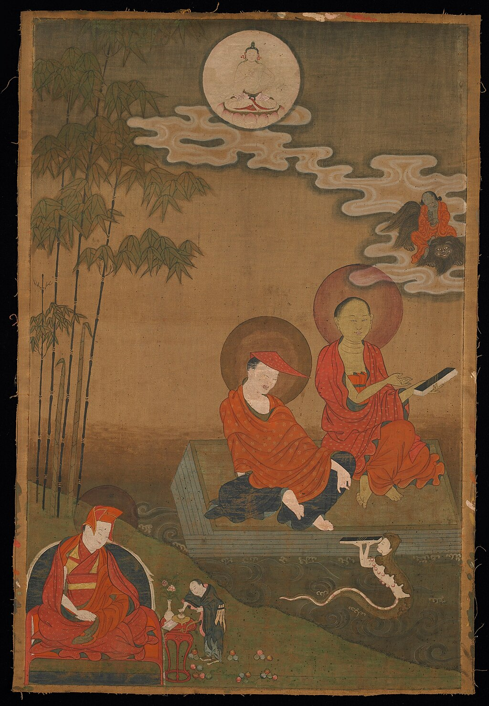[Nāgārjuna](https://en.wikipedia.org/wiki/Nagarjuna "Nagarjuna") (right) and [Āryadeva](https://en.wikipedia.org/wiki/Aryadeva "Aryadeva") (middle).

### Nāgārjuna

As Jan Westerhoff notes, while [Nāgārjuna](https://en.wikipedia.org/wiki/Nāgārjuna "Nāgārjuna") is "one of the greatest thinkers in the history of Asian philosophy...contemporary scholars agree on hardly any details concerning him". This includes exactly when he lived (it can be narrowed down some time in the first three centuries CE), where he lived (Joseph Walser suggests [Amarāvatī](https://en.wikipedia.org/wiki/Amaravati "Amaravati") in east [Deccan](https://en.wikipedia.org/wiki/Deccan_Plateau "Deccan Plateau")) and exactly what constitutes his written corpus.

Numerous texts are attributed to him, but it is at least agreed by some scholars that what is called the "Yukti" (analytical) corpus is the core of his philosophical work. These texts are the "Root verses on the Middle way" (_[Mūlamadhyamakakārikā](https://en.wikipedia.org/wiki/Mūlamadhyamakakārikā "Mūlamadhyamakakārikā"),_ MMK), the "Sixty Stanzas on Reasoning" (_Yuktiṣāṣṭika_), the "Dispeller of Objections" (_Vigrahavyāvartanī_), the "Treatise on Pulverization" (_Vaidalyaprakaraṇa_) and the "Precious Garland" (_Ratnāvalī_). However, even the attribution of each one of these has been question by some modern scholars, except for the MMK which is by definition seen as his major work.

Nāgārjuna's main goal is often seen by scholars as refuting the [essentialism](https://en.wikipedia.org/wiki/Essentialism "Essentialism") of certain Buddhist [abhidharma](https://en.wikipedia.org/wiki/Abhidharma "Abhidharma") schools (mainly [_Vaibhasika_](https://en.wikipedia.org/wiki/Vaibhāṣika "Vaibhāṣika")) which posited theories of _[svabhava](https://en.wikipedia.org/wiki/Svabhava "Svabhava")_ (essential nature) and also the Hindu [Nyāya](https://en.wikipedia.org/wiki/Nyaya "Nyaya") and [Vaiśeṣika](https://en.wikipedia.org/wiki/Vaisheshika "Vaisheshika") schools which posited a theory of ontological substances (_dravyatas_). In the MMK he used _[reductio ad absurdum](https://en.wikipedia.org/wiki/Prasaṅgika "Prasaṅgika")_ arguments (_prasanga_) to show that any theory of substance or essence was unsustainable and therefore, phenomena (_dharmas_) such as change, causality, and sense perception were empty (_sunya_) of any essential existence. Nāgārjuna also famously equated the emptiness of [_dharmas_](https://en.wikipedia.org/wiki/Dhamma_theory "Dhamma theory") with their [dependent origination](https://en.wikipedia.org/wiki/Dependent_origination "Dependent origination").

Because of his philosophical work, Nāgārjuna is seen by some modern interpreters as restoring the [Middle Way](https://en.wikipedia.org/wiki/Middle_Way "Middle Way") of the Buddha, which had become challenged by absolutist metaphysical tendencies in certain philosophical quarters.

### Classical Madhyamaka figures

Rāhulabhadra was an early madhyamika, sometimes said to be either a teacher of Nagarjuna or his contemporary and follower. He is most famous for his verses in praise of the _[Prajñāpāramitā](https://en.wikipedia.org/wiki/Prajnaparamita "Prajnaparamita")_ (Skt. _Prajñāpāramitāstotra_) and Chinese sources maintain that he also composed a commentary on the MMK which was translated by Paramartha.

Nāgārjuna's pupil [Āryadeva](https://en.wikipedia.org/wiki/Āryadeva "Āryadeva") (3rd century CE) wrote various works on Madhyamaka, the most well known of which is his "400 verses". His works are regarded as a supplement to Nāgārjuna's, on which he commented. Āryadeva also wrote refutations of the theories of non-Buddhist Indian philosophical schools.

There are also two commentaries on the MMK which may be by Āryadeva, the _Akutobhaya_ (which has also been regarded as an auto-commentary by Nagarjuna) as well as a commentary which survives only in Chinese (as part of the _Chung-Lun_, "Middle treatise", [Taisho](https://en.wikipedia.org/wiki/Taishō_Tripiṭaka "Taishō Tripiṭaka") 1564) attributed to a certain "Ch'ing-mu" (aka Pin-lo-chieh, which some scholars have also identified as possibly being Aryadeva). However, Brian C. Bocking, a translator of the _Chung-Lung_, also states that it is likely the author of this commentary was a certain Vimalāksa, who was [Kumarajiva's](https://en.wikipedia.org/wiki/Kumārajīva "Kumārajīva") old Vinaya-master from [Kucha](https://en.wikipedia.org/wiki/Kucha "Kucha").

An influential commentator on Nāgārjuna was [Buddhapālita](https://en.wikipedia.org/wiki/Buddhapālita "Buddhapālita") (470–550) who has been interpreted as developing the [prāsaṅgika](https://en.wikipedia.org/wiki/Svatantrika–Prasaṅgika_distinction "Svatantrika–Prasaṅgika distinction") approach to Nāgārjuna's works in his _Madhyamakavṛtti_ (now only extant in Tibetan) which follows the orthodox Madhyamaka method by critiquing essentialism mainly through [reductio ad absurdum](https://en.wikipedia.org/wiki/Reductio_ad_absurdum "Reductio ad absurdum") arguments. Like Nāgārjuna, [Buddhapālita](https://en.wikipedia.org/wiki/Buddhapālita "Buddhapālita")'s main philosophical method is to show how all philosophical positions are ultimately untenable and self-contradictory, a style of argumentation called _prasanga_.

Buddhapālita's method is often contrasted with that of [Bhāvaviveka](https://en.wikipedia.org/wiki/Bhāviveka "Bhāviveka") (c. 500 – c. 578), who argued in his _Prajñāpadīpa_ (Lamp of Wisdom) for the use of logical arguments using the _[pramana](https://en.wikipedia.org/wiki/Pramana "Pramana")_ based epistemology of Indian logicians like [Dignāga](https://en.wikipedia.org/wiki/Dignāga "Dignāga"). In what would become a source of much future debate, Bhāvaviveka criticized Buddhapālita for not putting Madhyamaka arguments into proper "autonomous syllogisms" (_svatantra_). Bhāvaviveka argued that mādhyamika's should always put forth syllogistic arguments to prove the truth of the Madhyamaka thesis. Instead of just criticizing other's arguments, a tactic called _vitaṇḍā_ (attacking) which was seen in bad form in Indian philosophical circles, Bhāvaviveka held that madhyamikas must positively prove their position using sources of knowledge (pramanas) agreeable to all parties. He argued that the position of a Madhyamaka was simply that phenomena are devoid of an inherent nature. This approach has been labeled the [_svātantrika_](https://en.wikipedia.org/wiki/Svatantrika–Prasaṅgika_distinction "Svatantrika–Prasaṅgika distinction") style of Madhyamaka by Tibetan philosophers and commentators.

Another influential commentator, [Candrakīrti](https://en.wikipedia.org/wiki/Chandrakirti "Chandrakirti") (c. 600–650), sought to defend Buddhapālita and critique Bhāvaviveka's position (and [Dignāga](https://en.wikipedia.org/wiki/Dignāga "Dignāga")) that one _must_ construct independent (_svatantra_) arguments to positively prove the Madhyamaka thesis, on the grounds this contains a subtle essentialist commitment. He argued that madhyamikas do not _have_ to argue by _svantantra_, but can merely show the untenable consequences (_prasaṅga_) of all philosophical positions put forth by their adversary. Furthermore, for [Candrakīrti](https://en.wikipedia.org/wiki/Chandrakirti "Chandrakirti"), there is a problem with assuming that the madhyamika and the essentialist opponent can begin with the same shared premises that are required for this kind of syllogistic reasoning because the essentialist and the Madhyamaka do not share a basic understanding of what it means for things to exist in the first place.

[Candrakīrti](https://en.wikipedia.org/wiki/Candrakīrti "Candrakīrti") also criticized the Buddhist [yogācāra](https://en.wikipedia.org/wiki/Yogachara "Yogachara") school, which he saw as positing a form of subjective [idealism](https://en.wikipedia.org/wiki/Idealism "Idealism") due to their doctrine of "appearance only" (_vijñaptimatra_). Candrakīrti faults the Yogācāra school for not realizing that the nature of consciousness is also a conditioned phenomenon, and for privileging consciousness over its objects ontologically, instead of seeing that _everything_ is empty. [Candrakīrti](https://en.wikipedia.org/wiki/Candrakīrti "Candrakīrti") wrote the _Prasannapadā_ (Clear Words), a highly influential commentary on the _Mūlamadhyamakakārikā_ as well as the _Madhyamakāvatāra,_ an introduction to Madhyamaka. His works are central to the understanding of Madhyamaka in [Tibetan Buddhism](https://en.wikipedia.org/wiki/Tibetan_Buddhism "Tibetan Buddhism").

A later _svātantrika_ figure is Avalokitavrata (seventh century), who composed a _tika_ (sub-commentary) on [Bhāvaviveka](https://en.wikipedia.org/wiki/Bhāviveka "Bhāviveka")'s _Prajñāpadīpa_ and who mentions important figures of the era such as Dharmakirti and Candrakīrti.

Another commentator on Nagarjuna is Bhikshu Vaśitva (_Zizai_) who composed a commentary on Nagarjuna's _Bodhisaṃbhāra_ that survives in a translation by Dharmagupta in the Chinese canon.

[Śāntideva](https://en.wikipedia.org/wiki/Shantideva "Shantideva") (end 7th century – first half 8th century) is well known for his philosophical poem discussing the [bodhisattva](https://en.wikipedia.org/wiki/Bodhisattva "Bodhisattva") path and the six [paramitas](https://en.wikipedia.org/wiki/Pāramitā "Pāramitā"), the _[Bodhicaryāvatāra](https://en.wikipedia.org/wiki/Bodhicaryāvatāra "Bodhicaryāvatāra")_. He united "a deep religiousness and joy of exposure together with the unquestioned Madhyamaka orthodoxy". Later in the 10th century, there were commentators on the works of prasangika authors such as Prajñakaramati who wrote a commentary on the _Bodhicaryāvatāra_ and Jayananda who commented on Candrakīrti's _Madhyamakāvatāra._

A lesser known treatise on the six paramitas associated with the Madhyamaka school is Ārya Śūra's _Pāramitāsamāsa,_ unlikely to be the same author as that of the _Garland of Jatakas._

Other lesser known madhyamikas include Devasarman (fifth to sixth centuries) and Gunamati (the fifth to sixth centuries) both of whom wrote commentaries on the MMK that exist only in Tibetan fragments.

### Yogācāra-Madhyamaka

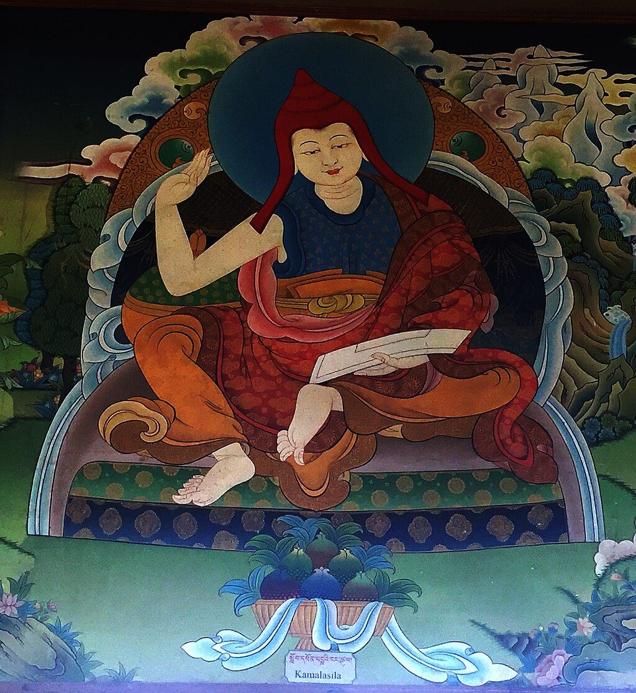[Kamalashila](https://en.wikipedia.org/wiki/Kamalashila "Kamalashila")

According to Ruegg, possibly the earliest figure to work with the two schools was Vimuktisena (early sixth century), a commentator on the [_Abhisamayalamkara_](https://en.wikipedia.org/wiki/Abhisamayalankara "Abhisamayalankara") and also is reported to have been a pupil of [Bhāvaviveka](https://en.wikipedia.org/wiki/Bhāviveka "Bhāviveka") as well as [Vasubandhu](https://en.wikipedia.org/wiki/Vasubandhu "Vasubandhu").

The seventh and eighth centuries saw a synthesis of the Buddhist [yogācāra](https://en.wikipedia.org/wiki/Yogacara "Yogacara") tradition with Madhyamaka, beginning with the work of Śrigupta, [Jñānagarbha](https://en.wikipedia.org/wiki/Jñānagarbha "Jñānagarbha") (Śrigupta's disciple) and his student [Śāntarakṣita](https://en.wikipedia.org/wiki/Śāntarakṣita "Śāntarakṣita") (8th-century) who, like Bhāvaviveka, also adopted some of the terminology of the Buddhist pramana tradition, in their time best represented by [Dharmakīrti](https://en.wikipedia.org/wiki/Dharmakirti "Dharmakirti").

Like the classical Madhyamaka, Yogācāra-Madhyamaka approaches ultimate truth through the prasaṅga method of showing absurd consequences. However, when speaking of conventional reality they also make positive assertions and autonomous arguments like Bhāvaviveka and Dharmakīrti. Śāntarakṣita also subsumed the Yogācāra system into his presentation of the conventional, accepting their idealism on a conventional level as a preparation for the ultimate truth of Madhyamaka.

In his _Madhyamakālaṃkāra_ (verses 92–93), Śāntarakṣita says:

> By relying on the Mind Only (_cittamatra_), know that external entities do not exist. And by relying on this \[Madhyamaka\] system, know that no self at all exists, even in that \[mind\]. Therefore, due to holding the reins of logic as one rides the chariots of the two systems, one attains \[the path of\] the actual Mahayanist.

Śāntarakṣita and his student [Kamalaśīla](https://en.wikipedia.org/wiki/Kamalaśīla "Kamalaśīla") (known for his text on self development and meditation, the _[Bhavanakrama](https://en.wikipedia.org/wiki/Bhāvanākrama "Bhāvanākrama")_) were influential in the initial spread of Madhyamaka Buddhism to Tibet. [Haribhadra](https://en.wikipedia.org/wiki/Haribhadra_\(Buddhist_philosopher\) "Haribhadra (Buddhist philosopher)"), another important figure of this school, wrote an influential commentary on the _Abhisamayalamkara._

### Vajrayana Madhyamaka

The Madhyamaka philosophy continued to be of major importance during the period of Indian Buddhism when the [tantric](https://en.wikipedia.org/wiki/Tantra "Tantra") [Vajrayana](/source/vajrayana/ "Vajrayana") Buddhism rose to prominence. One of the central Vajrayana Madhyamaka philosophers was Arya Nagarjuna (also known as the "Tantric Nagarjuna", 7th–8th centuries) who may be the author of the _Bodhicittavivarana_ as well as a notable commentator on the _[Guhyasamāja Tantra](https://en.wikipedia.org/wiki/Guhyasamāja_Tantra "Guhyasamāja Tantra")_. Other figures in his lineage include Nagabodhi, Vajrabodhi, Aryadeva-pada and Candrakirti-pada.

Later figures include Bodhibhadra (c. 1000), a [Nalanda](https://en.wikipedia.org/wiki/Nalanda "Nalanda") university master who wrote on philosophy and yoga and who was a teacher of [Atiśa Dīpaṃkara Śrījñāna](https://en.wikipedia.org/wiki/Atiśa "Atiśa") (982 – 1054 CE) who was an influential figure in the transmission of Buddhism to Tibet and wrote the influential _[Bodhipathapradīpa](https://en.wikipedia.org/wiki/Bodhipathapradīpa "Bodhipathapradīpa")_ (Lamp for the Path to Awakening).

## Tibetan Buddhism

Madhyamaka philosophy obtained a central position in all the main [Tibetan Buddhist](https://en.wikipedia.org/wiki/Tibetan_Buddhism "Tibetan Buddhism") schools, all whom consider themselves to be madhyamikas. Madhyamaka thought has been categorized in various ways in India and Tibet.

### Early transmission

Influential early figures who are important in the transmission of Madhyamaka to Tibet include the Yogacara-Madhyamaka [Śāntarakṣita](https://en.wikipedia.org/wiki/Śāntarakṣita "Śāntarakṣita") (725–788), and his students [Haribhadra](https://en.wikipedia.org/wiki/Haribhadra_\(Buddhist_philosopher\) "Haribhadra (Buddhist philosopher)") and [Kamalashila](https://en.wikipedia.org/wiki/Kamalaśīla "Kamalaśīla") (740–795) as well as the later [Kadampa](https://en.wikipedia.org/wiki/Kadam_\(Tibetan_Buddhism\) "Kadam (Tibetan Buddhism)") figures of [Atisha](https://en.wikipedia.org/wiki/Atiśa "Atiśa") (982–1054) and his pupil [Dromtön](https://en.wikipedia.org/wiki/Dromtön "Dromtön") (1005–1064) who taught Madhyamaka by using the works of Bhāviveka and Candrakīrti.

The early transmission of Buddhism to Tibet saw these two main strands of philosophical views in debate with each other. The first was the camp which defended the Yogacara-Madhyamaka interpretation (and thus, svatantrika) centered on the works of the scholars of the Sangphu monastery founded by [Ngog Loden Sherab](https://en.wikipedia.org/wiki/Ngok_Loden_Sherab "Ngok Loden Sherab") (1059–1109) and also includes Chapa Chokyi Senge (1109–1169).

The second camp was those who championed the work of [Candrakirti](https://en.wikipedia.org/wiki/Chandrakirti "Chandrakirti") over the Yogacara-Madhyamaka interpretation, and included Sangphu monk [Patsab Nyima Drag](https://en.wikipedia.org/wiki/Patsab_Nyima_Drakpa "Patsab Nyima Drakpa") (b. 1055) and Jayananda (fl 12th century). According to John Dunne, it was the Madhyamaka interpretation and the works of Candrakirti which became dominant over time in Tibet.

Another very influential figure from this early period is [Mabja Jangchub Tsöndrü](https://en.wikipedia.org/wiki/Mabja_Jangchub_Tsöndrü "Mabja Jangchub Tsöndrü") (d. 1185), who wrote an important commentary on [Nagarjuna's](https://en.wikipedia.org/wiki/Nagarjuna "Nagarjuna") _[Mūlamadhyamakakārikā](https://en.wikipedia.org/wiki/Mūlamadhyamakakārikā "Mūlamadhyamakakārikā")_. Mabja was a student of both the Dharmakirtian Chapa and the Candrakirti scholar Patsab and his work shows an attempt to steer a middle course between their views. Mabja affirms the conventional usefulness of [Buddhist pramāṇa](https://en.wikipedia.org/wiki/Buddhist_logico-epistemology "Buddhist logico-epistemology"), but also accepts Candrakirti's prasangika views. Mabja's Madhyamaka scholarship was very influential on later Tibetan Madhyamikas such as [Longchenpa](/source/longchenpa/ "Longchenpa"), [Tsongkhapa](https://en.wikipedia.org/wiki/Je_Tsongkhapa "Je Tsongkhapa"), [Gorampa](https://en.wikipedia.org/wiki/Gorampa "Gorampa"), and [Mikyö Dorje](https://en.wikipedia.org/wiki/Mikyö_Dorje,_8th_Karmapa_Lama "Mikyö Dorje, 8th Karmapa Lama").

#### Prāsaṅgika and Svātantrika interpretations

In [Tibetan](https://en.wikipedia.org/wiki/Tibet "Tibet") Buddhist scholarship, a distinction began to be made between the Autonomist (_[Svātantrika](https://en.wikipedia.org/wiki/Svatantrika–Prasaṅgika_distinction "Svatantrika–Prasaṅgika distinction"), rang rgyud pa_) and Consequentialist (_[Prāsaṅgika](https://en.wikipedia.org/wiki/Svatantrika–Prasaṅgika_distinction "Svatantrika–Prasaṅgika distinction"), Thal 'gyur pa_) approaches to Madhyamaka reasoning. The distinction was one invented by Tibetans, and not one made by classical Indian madhyamikas. Tibetans mainly use the terms to refer to the logical procedures used by [Bhavaviveka](https://en.wikipedia.org/wiki/Bhavaviveka "Bhavaviveka") (who argued for the use of _[svatantra-anumana](https://en.wikipedia.org/wiki/Svatantrika "Svatantrika")_ or autonomous syllogisms) and [Buddhapalita](https://en.wikipedia.org/wiki/Buddhapalita "Buddhapalita") (who held that one should only use _[prasanga](https://en.wikipedia.org/wiki/Prasaṅgika "Prasaṅgika")_, or _[reductio ad absurdum](https://en.wikipedia.org/wiki/Reductio_ad_absurdum "Reductio ad absurdum")_). Tibetan Buddhism further divides _[svātantrika](https://en.wikipedia.org/wiki/Svatantrika–Prasaṅgika_distinction "Svatantrika–Prasaṅgika distinction")_ into [sautrantika](https://en.wikipedia.org/wiki/Sautrāntika "Sautrāntika") Svātantrika Madhyamaka (applied to [Bhāviveka](https://en.wikipedia.org/wiki/Bhāviveka "Bhāviveka")), and [Yogācāra](https://en.wikipedia.org/wiki/Yogachara "Yogachara") Svātantrika Madhyamaka ([śāntarakṣita](https://en.wikipedia.org/wiki/Śāntarakṣita "Śāntarakṣita") and [Kamalaśīla](https://en.wikipedia.org/wiki/Kamalaśīla "Kamalaśīla")).

The Svātantrika states that conventional phenomena are understood to have a conventional essential existence, but without an ultimately existing essence. In this way they believe they are able to make positive or "autonomous" assertions using syllogistic logic because they are able to share a subject that is established as appearing in common – the proponent and opponent use the same kind of valid cognition to establish it. The name comes from this quality of being able to use autonomous arguments in debate.

In contrast, the central technique avowed by the [_prasaṅgika_](https://en.wikipedia.org/wiki/Prasaṅgika "Prasaṅgika") is to show by __prasaṅga__ (or [reductio ad absurdum](https://en.wikipedia.org/wiki/Reductio_ad_absurdum "Reductio ad absurdum")) that any positive assertion (such as "asti" or "nāsti", "it is", or "it is not") or [view](https://en.wikipedia.org/wiki/View_\(Buddhism\) "View (Buddhism)") regarding phenomena must be regarded as merely conventional (_saṃvṛti_ or _lokavyavahāra_). The _prāsaṅgika_ holds that it is not necessary for the proponent and opponent to use the same kind of valid cognition (_[pramana](https://en.wikipedia.org/wiki/Pramana "Pramana")_) to establish a common subject; indeed it is possible to change the view of an opponent through a [reductio](https://en.wikipedia.org/wiki/Reductio_ad_absurdum "Reductio ad absurdum") argument.

Although presented as a divide in doctrine, the major difference between Svātantrika and Prasangika may be between two style of reasoning and arguing, while the division itself is exclusively Tibetan. Tibetan scholars were aware of alternative Madhyamaka sub-classifications, but later Tibetan doxography emphasizes the nomenclature of prāsaṅgika versus svātantrika. No conclusive evidence can show the existence of an Indian antecedent, and it is not certain to what degree individual writers in Indian and Tibetan discussion held each of these views and if they held a view generally or only in particular instances. Both Prāsaṅgikas and Svātantrikas cited material in the [āgamas](https://en.wikipedia.org/wiki/Āgama_\(Buddhism\) "Āgama (Buddhism)") in support of their arguments.

[Longchen Rabjam](https://en.wikipedia.org/wiki/Longchen_Rabjam "Longchen Rabjam") noted in the 14th century that Candrakirti favored the _prasaṅga_ approach when specifically discussing the analysis for ultimacy, but otherwise he made positive assertions such as when describing the paths of Buddhist practice in his _[Madhyamakavatāra](https://en.wikipedia.org/wiki/Madhyamakāvatāra "Madhyamakāvatāra")_. Therefore, even _prāsaṅgikas_ make positive assertions when discussing conventional practice, they simply stick to using [reductios](https://en.wikipedia.org/wiki/Reductio_ad_absurdum "Reductio ad absurdum") specifically when analyzing for ultimate truth.

### Jonang and "Other Emptiness"

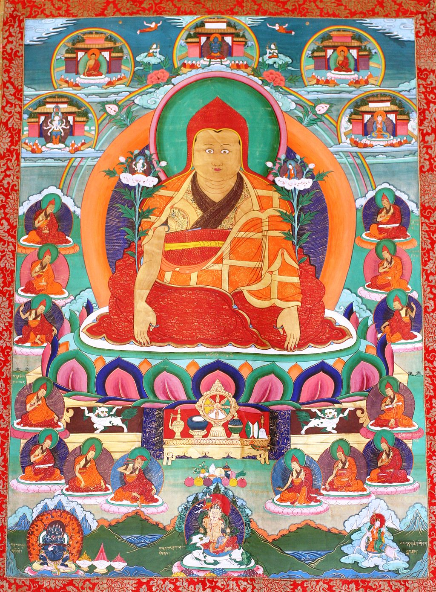Thangkha with Jonang lama Dolpopa Sherab Gyaltsen (1292–1361)

Further Tibetan philosophical developments began in response to the works of the scholar [Dölpopa Shérap Gyeltsen](https://en.wikipedia.org/wiki/Dolpopa_Sherab_Gyaltsen "Dolpopa Sherab Gyaltsen") (1292–1361) and led to two distinctly opposed Tibetan Madhyamaka views on the nature of ultimate reality. An important Tibetan treatise on Emptiness and Buddha Nature is found in [Dolpopa's](https://en.wikipedia.org/wiki/Dolpopa "Dolpopa") voluminous study, _Mountain Doctrine_.

[Dolpopa](https://en.wikipedia.org/wiki/Dolpopa "Dolpopa"), the founder of the [Jonang](https://en.wikipedia.org/wiki/Jonang "Jonang") school, viewed the Buddha and [Buddha Nature](https://en.wikipedia.org/wiki/Buddha_Nature "Buddha Nature") as _not_ intrinsically empty, but as truly real, unconditioned, and replete with eternal, changeless virtues. In the Jonang school, ultimate reality, i.e. Buddha Nature (_tathagatagarbha_) is only empty of what is impermanent and conditioned (conventional reality), not of its own self which is ultimate [Buddhahood](https://en.wikipedia.org/wiki/Buddhahood "Buddhahood") and the [luminous nature of mind](https://en.wikipedia.org/wiki/Luminous_mind "Luminous mind"). In [Jonang](https://en.wikipedia.org/wiki/Jonang "Jonang"), this ultimate reality is a "ground or substratum" which is "uncreated and indestructible, noncomposite and beyond the chain of dependent origination".

Basing himself on the Indian _[Tathāgatagarbha sūtras](https://en.wikipedia.org/wiki/Tathāgatagarbha_sūtras "Tathāgatagarbha sūtras")_ as his main sources, Dolpopa described the Buddha Nature as:

> \[N\]on-material emptiness, emptiness that is far from an annihilatory emptiness, great emptiness that is the ultimate pristine wisdom of superiors ...Buddha earlier than all Buddhas, ... causeless original Buddha.

This "great emptiness" i.e. the _tathāgatagarbha_ is said to be filled with eternal powers and virtues:

> \[P\]ermanent, stable, eternal, everlasting. Not compounded by causes and conditions, the matrix-of-one-gone-thus is intrinsically endowed with ultimate buddha qualities of body, speech, and mind such as the ten powers; it is not something that did not exist before and is newly produced; it is self-arisen.'

The Jonang position came to be known as \[\[Rangtong and shentong|"emptiness of other" (__gzhan stong, shentong_)_\]\]_,_ because it held that the ultimate truth was positive reality that was not empty of its own nature, only empty of what it was other than itself. Dolpopa considered his view a form of Madhyamaka, and called his system "Great Madhyamaka". Dolpopa opposed what he called [_rangtong_](https://en.wikipedia.org/wiki/Rangtong-Shentong "Rangtong-Shentong") (self-empty), the view that ultimate reality is that which is empty of self nature in a relative and absolute sense, that is to say that it is empty of everything, including itself. It is thus not a transcendental ground or metaphysical absolute which includes all the eternal Buddha qualities. This _rangtong – shentong_ distinction became a central issue of contention among Tibetan Buddhist philosophers.

Alternative interpretations of the shentong view is also taught outside of Jonang. Some [Kagyu](/source/kagyu/ "Kagyu") figures, like [Jamgon Kongtrul](/source/jamgon-kongtrul/ "Jamgon Kongtrul") (1813–1899) as well as the unorthodox [Sakya](https://en.wikipedia.org/wiki/Sakya_\(Tibetan_Buddhist_school\) "Sakya (Tibetan Buddhist school)") philosopher Shakya Chokden (1428–1507), supported their own forms of shentong.

### Tsongkhapa and Gelug _Prāsaṅgika_

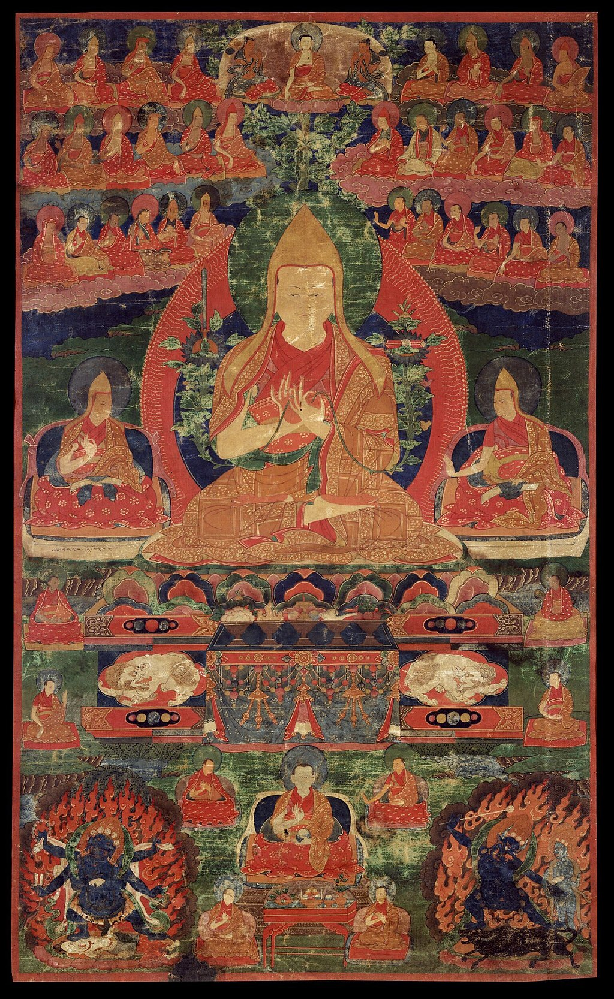Tsongkhapa

The [Gelug school](https://en.wikipedia.org/wiki/Gelug "Gelug") was founded in the beginning of the 15th century by [Je Tsongkhapa](https://en.wikipedia.org/wiki/Je_Tsongkhapa "Je Tsongkhapa") (1357–1419). Tsongkhapa's conception of emptiness draws mainly from the works of ["prāsaṅgika"](https://en.wikipedia.org/wiki/Svatantrika–Prasaṅgika_distinction "Svatantrika–Prasaṅgika distinction") Indian thinkers like Buddhapalita, Candrakirti, and Shantideva and he argued that only their interpretation of Nagarjuna was ultimately correct. According to José I. Cabezón, Tsongkhapa also argued that the ultimate truth or emptiness was "an absolute negation (_med dgag_)—the negation of inherent existence—and that nothing was exempt from being empty, including emptiness itself."

Tsongkhapa also maintained that the ultimate truth could be understood conceptually, an understanding which could later be transformed into a non-conceptual one. This conceptual understanding could only be done through the use of madhyamika reasoning, which he also sought to unify with the logical theories of [Dharmakirti](https://en.wikipedia.org/wiki/Dharmakirti "Dharmakirti"). Because of Tsongkhapa's view of emptiness as an absolute negation, he strongly attacked the other empty views of [Dolpopa](https://en.wikipedia.org/wiki/Dolpopa_Sherab_Gyaltsen "Dolpopa Sherab Gyaltsen") in his works. Tsongkhapa's major work on Madhyamaka is his commentary on the MMK called "Ocean of Reasoning".

According to [Thupten Jinpa](https://en.wikipedia.org/wiki/Thupten_Jinpa "Thupten Jinpa"), Tsongkhapa's "doctrine of the object of negation" is one of his most innovative but also controversial ideas. Tsongkhapa pointed out that if one wants to steer a middle course between the extremes of "over-negation" (straying into [nihilism](https://en.wikipedia.org/wiki/Nihilism "Nihilism")) and "under-negation" (and thus [reification](https://en.wikipedia.org/wiki/Reification_\(fallacy\) "Reification (fallacy)")), it is important to have a clear concept of exactly what is being negated in Madhyamaka analysis (termed "the object of negation").

According to Jay Garfield and Sonam Thakchoe, for Tsongkhapa, there are two aspects of the object of negation: "erroneous apprehension" ( _phyin ci log gi ‘dzin pa_) and "the existence of intrinsic nature thereby apprehended" (_des bzung ba’i rang bzhin yod pa_). The second aspect is an erroneously reified fiction which does not exist even conventionally. This is the fundamental object of negation for Tsongkhapa "since the reified object must first be negated in order to eliminate the erroneous subjective state".

Tsongkhapa's understanding of the object of negation (Tib. _dgag bya_) is subtle, and he describes one aspect of it as an "innate apprehension of self-existence". Thupten Jinpa glosses this as a belief that we have that leads us to "perceive things and events as possessing some kind of intrinsic existence and identity". Tsongkhapa's Madhyamaka therefore, does not deny the conventional existence of things _per se_, but merely rejects our way of experiencing things as existing in an [essentialist](https://en.wikipedia.org/wiki/Essentialism "Essentialism") way, which are false projections or imputations. This is the root of ignorance, which for Tsongkhapa is an "active defiling agency" (Sk. _kleśāvaraṇa_) which projects a false sense of reality onto objects.

As Garfield and Thakchoe note, Tsongkhapa's view allows him to "preserve a robust sense of the reality of the conventional world in the context of emptiness and to provide an analysis of the relation between emptiness and conventional reality that makes clear sense of the identity of the two truths". Because conventional existence (or 'mere appearance') as an interdependent phenomenon devoid of inherent existence is not negated (khegs pa) or "rationally undermined" in his analysis, Tsongkhapa's approach was criticized by other Tibetan madhyamikas who preferred an anti-realist interpretation of Madhyamaka.

Following Candrakirti, Tsongkhapa also rejected the [Yogacara](https://en.wikipedia.org/wiki/Yogachara "Yogachara") view of mind only, and instead defended the conventional existence of external objects even though ultimately they are mere "thought constructions" (Tib. _rtog pas btags tsam_) of a deluded mind. Tsongkhapa also followed Candrakirti in rejecting _svātantra_ ("autonomous") reasoning, arguing that it was enough to show the unwelcome consequences (_prasaṅga_) of essentialist positions.

Gelug scholarship has generally maintained and defended Tsongkhapa's positions up until the present day, even if there are lively debates considering issues of interpretation. [Jamyang Sheba](https://en.wikipedia.org/wiki/Jamyang_Zhepa "Jamyang Zhepa"), [Changkya Rölpé Dorjé](https://en.wikipedia.org/wiki/Changkya_Rölpé_Dorjé "Changkya Rölpé Dorjé"), [Gendun Chopel](https://en.wikipedia.org/wiki/Gendün_Chöphel "Gendün Chöphel") and the [14th Dalai Lama](https://en.wikipedia.org/wiki/14th_Dalai_Lama "14th Dalai Lama") are some of the most influential modern figures in Gelug Madhyamaka.

### Sakya Madhyamaka

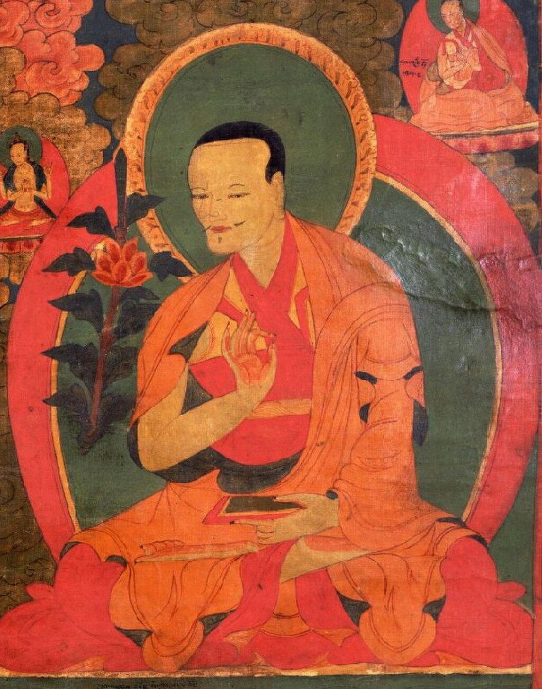Gorampa Sonam Senge, the most important Madhyamaka philosopher in Sakya

The Sakya school has generally held a classic [prāsaṅgika](https://en.wikipedia.org/wiki/Svatantrika–Prasaṅgika_distinction "Svatantrika–Prasaṅgika distinction") position following [Candrakirti](https://en.wikipedia.org/wiki/Chandrakirti "Chandrakirti") closely, though with significant differences from the Gelug. Sakya scholars of Madhyamaka, such as Rendawa Zhönnu Lodrö (1349–1412) and Rongtön Sheyja Künrig (1367–1450) were early critics of the "other empty" view (Shentong).

[Gorampa Sonam Senge](https://en.wikipedia.org/wiki/Gorampa "Gorampa") (1429–1489) was an important Sakya philosopher which defended the orthodox [Sakya](https://en.wikipedia.org/wiki/Sakya_\(Tibetan_Buddhist_school\) "Sakya (Tibetan Buddhist school)") Madhyamaka position, critiquing both Dolpopa and Tsongkhapa's interpretations. He is widely studied, not only in Sakya, but also in Nyingma and Kagyü institutions.

According to Cabezón, Gorampa called his version of Madhyamaka "the middle way _qua_ free from extremes" (_mtha' bral dbu ma_) or "middle way _qua_ free from proliferations" (_spros bral kyi dbu ma_), and claimed that the ultimate truth was ineffable, beyond predication or concept. Cabezón states that Gorampa's interpretation of Madhyamaka is "committed to a more literal reading of the Indian sources than either Dolpopa's or Tsongkhapa's, which is to say that it tends to take the Indian texts at face value." For Gorampa, emptiness is not just the absence of inherent existence, but it is the absence of the four extremes in all phenomena, i.e. existence, nonexistence, both and neither (see: [_catuskoti_](https://en.wikipedia.org/wiki/Catuṣkoṭi "Catuṣkoṭi")), _without any further qualification_.

In other words, conventional truths are also an object of negation, because as Gorampa states "they are not found at all (to be ultimately existent) when subjected to ultimate rational analysis". Hence, Gorampa's Madhyamaka negates _existence_ _itself_ or existence without qualifications, while for Tsongkhapa, the object of negation is "inherent existence", "intrinsic existence" or "intrinsic nature".

In his _Elimination of Erroneous Views_ (_lta ba ngan bsal_), Gorampa argues that Madhyamaka ultimately negates "all false appearances", which means anything that appears to our mind (i.e. all conventional phenomena). Since all appearances are conceptually produced illusions, they must cease when conceptual reification is brought to an end by insight. This is the "ultimate freedom from conceptual fabrication" (_don dam spros bral_). To reach this, Madhyamikas must negate "the reality of appearances". In other words, all conventional realities are fabrications and since awakening requires transcending all fabrication (_spros bral_), conventional reality must be negated. Thus, for Gorampa, all conventional knowledge is dualistic, being based on a false distinction between subject and object. Therefore, for Gorampa, Madhyamaka analyzes all supposedly real phenomena and concludes through that analysis "that those things do not exist and so that so-called conventional reality is entirely nonexistent".

Regarding the Ultimate truth, Gorampa saw this as being divided into two parts:

*   The emptiness that is reached by rational analysis (this is actually only an _analogue_, and not the real thing).
*   The emptiness that yogis fathom by means of their own individual gnosis (_prajña_). This is the real ultimate truth, which is reached by negating the previous rational understanding of emptiness.

Unlike most orthodox Sakyas, the philosopher Shakya Chokden, a contemporary of Gorampa, also promoted a form of Shentong as being complementary to Rangtong. He saw Shentong as useful for meditative practice, while Rangtong as useful for cutting through views.

### Comparison of the views of Tsongkhapa and Gorampa

As Garfield and Thakchoe note, for Tsongkhapa, conventional truth is "a kind of truth", "a way of being real" and "a kind of existence" while for Gorampa, the conventional is "entirely false", "unreal", "a kind of nonexistence" and "truth only from the perspective of fools".

[Jay L. Garfield](https://en.wikipedia.org/wiki/Jay_L._Garfield "Jay L. Garfield") and Sonam Thakchoe outline the different competing models of Gorampa and Tsongkhapa as follows:

> \[Gorampa's\]: The object of negation is the conventional phenomenon itself. Let us see how that plays out in an account of the status of conventional truth. Since ultimate truth—emptiness—is an external negation, and since an external negation eliminates its object while leaving nothing behind, when we say that a person is empty, we eliminate the _person_, leaving nothing else behind. To be sure, we must, as mādhyamikas, in agreement with ordinary persons, admit that the person exists _conventionally_ despite not existing _ultimately_. But, if emptiness eliminates the person, that conventional existence is a complete illusion: The ultimate emptiness of the person shows that the person simply does not exist. It is no more actual than [Santa Claus](https://en.wikipedia.org/wiki/Santa_Claus "Santa Claus"), the protestations of ordinary people and small children to the contrary notwithstanding.

> \[Tsongkhapa's\]: The object of negation is not the conventional phenomenon itself but instead the intrinsic nature or intrinsic existence of the conventional phenomenon. The consequences of taking the object of negation this way are very different. On this account, when we say that the person does not exist ultimately, what is eliminated by its ultimate emptiness is its intrinsic existence. No other intrinsic identity is projected in the place of that which was undermined by emptiness, even emptiness or conventional reality. But the person is not thereby eliminated. Its conventional existence is therefore, on this account, simply its existence devoid of intrinsic identity as an interdependent phenomenon. On this view, conventional reality is no illusion; it is the actual mode of existence of actual things.

According to Garfield and Thakchoe each of these "radically distinct views" on the nature of the two truths "has scriptural support, and indeed each view can be supported by citations from different passages of the same text or even slightly different contextual interpretations of the same passage".

### Kagyu

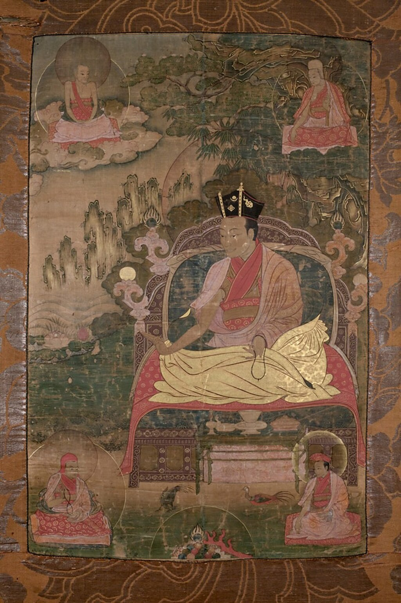[Mikyö Dorje, 8th Karmapa Lama](https://en.wikipedia.org/wiki/Mikyö_Dorje,_8th_Karmapa_Lama "Mikyö Dorje, 8th Karmapa Lama")

In the [Kagyu](/source/kagyu/ "Kagyu") tradition, there is a broad field of opinion on the nature of emptiness, with some holding the "other empty" (_shentong_) view while others holding different positions. One influential Kagyu thinker was [Rangjung Dorje, 3rd Karmapa Lama](https://en.wikipedia.org/wiki/Rangjung_Dorje,_3rd_Karmapa_Lama "Rangjung Dorje, 3rd Karmapa Lama"). His view synthesized Madhyamaka and Yogacara perspectives. According to Karl Brunnhölzl, regarding his position in the rangtong-shentong debate he "can be said to regard these two as not being mutually exclusive and to combine them in a creative synthesis". However, Rangjung Dorje never uses these terms in any of his works and thus any claims to him being a promoter of shentong or otherwise is a later interpretation.

Several Kagyu figures disagree with the view that shentong is a form of madhyamaka. According to Brunnhölzl, [Mikyö Dorje, 8th Karmapa Lama](https://en.wikipedia.org/wiki/Mikyö_Dorje,_8th_Karmapa_Lama "Mikyö Dorje, 8th Karmapa Lama") (1507–1554) and [Second Pawo Rinpoche Tsugla Trengwa](https://en.wikipedia.org/wiki/Pawo_Rinpoche "Pawo Rinpoche") see the term "shentong madhyamaka" as a misnomer, for them the Yogacara of Asanga and Vasubandhu and the system of Nagarjuna are "two clearly distinguished systems". They also refute the idea that there is "a permanent, intrinsically existing Buddha nature".

[Mikyö Dorje](https://en.wikipedia.org/wiki/Mikyö_Dorje,_8th_Karmapa_Lama "Mikyö Dorje, 8th Karmapa Lama") also argues that the language of other emptiness does not appear in any of the sutras or the treatises of the Indian masters. He attacks the view of [Dolpopa](https://en.wikipedia.org/wiki/Dolpopa_Sherab_Gyaltsen "Dolpopa Sherab Gyaltsen") as being against the sutras of ultimate meaning which state that all phenomena are emptiness as well as being against the treatises of the Indian masters. Mikyö Dorje rejects both perspectives of rangtong and shentong as true descriptions of ultimate reality, which he sees as being "the utter peace of all discursiveness regarding being empty and not being empty".

One of the most influential Kagyu philosophers in recent times was [Jamgön Kongtrul Lodrö Taye](/source/jamgon-kongtrul/ "Jamgon Kongtrul") (1813–1899) who advocated a system of shentong madhyamaka and held that primordial wisdom was "never empty of its own nature and it is there all the time".

The modern Kagyu teacher [Khenpo Tsultrim](https://en.wikipedia.org/wiki/Khenpo_Tsultrim_Gyamtso_Rinpoche "Khenpo Tsultrim Gyamtso Rinpoche") (1934–), in his _Progressive Stages of Meditation on Emptiness_, presents five stages of meditation, which he relates to five tenet systems. He holds the "Shentong Madhyamaka" as the highest view, above prasangika. He sees this as a meditation on _Paramarthasatya_ ("Absolute Reality"), _Buddhajnana_, which is beyond concepts, and described by terms as "truly existing". This approach helps "to overcome certain residual subtle concepts", and "the habit – fostered on the earlier stages of the path – of negating whatever experience arises in his/her mind." It destroys false concepts, as does prasangika, but it also alerts the practitioner "to the presence of a dynamic, positive Reality that is to be experienced once the conceptual mind is defeated."

### Nyingma Madhyamaka

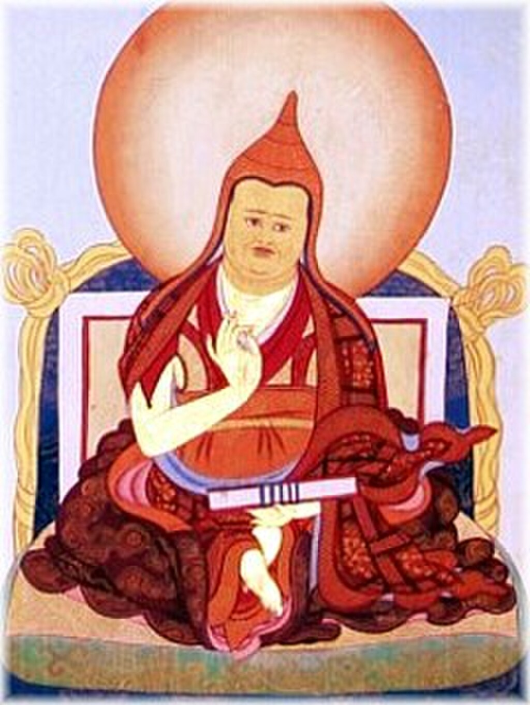[Jamgön Ju Mipham Gyatso](https://en.wikipedia.org/wiki/Jamgön_Ju_Mipham_Gyatso "Jamgön Ju Mipham Gyatso") (1846–1912), a key exponent of madhyamaka thought in the Nyingma school, known for harmonizing madhyamaka with the [dzogchen](/source/dzogchen/ "Dzogchen") view.

In the [Nyingma](/source/nyingma/ "Nyingma") school, like in Kagyu, there is a variety of views. Some Nyingma thinkers promoted _shentong_, like [Katok Tsewang Norbu](https://en.wikipedia.org/wiki/Katok_Tsewang_Norbu "Katok Tsewang Norbu"), but the most influential Nyingma thinkers like [Longchenpa](/source/longchenpa/ "Longchenpa") and [Ju Mipham](https://en.wikipedia.org/wiki/Jamgon_Ju_Mipham_Gyatso "Jamgon Ju Mipham Gyatso") held a more classical [prāsaṅgika](https://en.wikipedia.org/wiki/Svatantrika–Prasaṅgika_distinction "Svatantrika–Prasaṅgika distinction") interpretation while at the same time seeking to harmonize it with the [dzogchen](/source/dzogchen/ "Dzogchen") view found in the [dzgochen tantras](https://en.wikipedia.org/wiki/Seventeen_tantras "Seventeen tantras") which are traditionally seen as the pinnacle of the Nyingma view.

According to Sonam Thakchoe, the ultimate truth in the Nyingma tradition, following [Longchenpa](/source/longchenpa/ "Longchenpa"), is that "reality which transcends any mode of thinking and speech, one that unmistakenly appears to the nonerroneous cognitive processes of the exalted and awakened beings" and this is said to be "inexpressible beyond words and thoughts" as well as the reality that is the "transcendence of all elaborations.

The most influential modern Nyingma scholar is [Jamgon Ju Mipham Gyatso](https://en.wikipedia.org/wiki/Jamgon_Ju_Mipham_Gyatso "Jamgon Ju Mipham Gyatso") (1846–1912). He developed a unique theory of madhyamaka, with two models of the two truths. While he adopts the traditional madhyamaka model of two truths, in which the ultimate truth is emptiness, he also developed a second model, in which the ultimate truth is "reality as it is" (_de bzhin nyid_) which is "established as ultimately real" (_bden par grub pa_).

This ultimate truth is associated with the Dzogchen concept of [Rigpa](https://en.wikipedia.org/wiki/Rigpa "Rigpa"). While it might seem that this system conflicts with the traditional madhyamaka interpretation, for Mipham this is not so. For while the traditional model which sees emptiness and ultimate truth as a negation is referring to the analysis of experience, the second Dzogchen influenced model refers to the experience of unity in meditation. Douglas Duckworth sees Mipham's work as an attempt to bring together the two main Mahayana philosophical systems of Yogacara and Madhyamaka, as well as shentong and rangtong into a coherent system in which both are seen as being of definitive meaning.

Regarding the _svatantrika prasangika_ debate, [Ju Mipham](https://en.wikipedia.org/wiki/Jamgon_Ju_Mipham_Gyatso "Jamgon Ju Mipham Gyatso") explained that using positive assertions in logical debate may serve a useful purpose, either while debating with non-Buddhist schools or to move a student from a coarser to a more subtle view. Similarly, discussing an approximate ultimate helps students who have difficulty using only __prasaṅga__ methods move closer to the understanding of the true ultimate. Ju Mipham felt that the ultimate non-enumerated truth of the svatantrika was no different from the ultimate truth of the Prāsaṅgika. He felt the only difference between them was with respect to how they discussed conventional truth and their approach to presenting a path.

## East Asian madhyamaka

A painting of Kumārajīva at [White Horse Pagoda](https://en.wikipedia.org/wiki/White_Horse_Pagoda,_Dunhuang "White Horse Pagoda, Dunhuang"), [Dunhuang](https://en.wikipedia.org/wiki/Dunhuang "Dunhuang")

### Sānlùn school

[Chinese madhyamaka](https://en.wikipedia.org/wiki/East_Asian_Madhyamaka "East Asian Madhyamaka") (known as _sānlùn,_ or the three treatise school) began with the work of [Kumārajīva](https://en.wikipedia.org/wiki/Kumārajīva "Kumārajīva") (344–413 CE) who translated the works of Nāgārjuna (including the MMK, also known in China as the _Chung lun_, "_Madhyamakaśāstra_"; [Taishō](https://en.wikipedia.org/wiki/Taishō_Tripiṭaka "Taishō Tripiṭaka") 1564) to Chinese. Another influential text in Chinese madhyamaka which was said to have been translated by Kumārajīva was the _Ta-chih-tu lun_, or \*_Mahāprajñāpāramitopadeśa Śāstra_ ("Treatise which is a Teaching on the Great Perfection of Wisdom \[Sūtra\]"). According to Dan Arnold, this text is only extant in Kumārajīva's translation and has material that differs from the work of Nāgārjuna. In spite of this, the _Ta-chih-tu lun_ became a central text for Chinese interpretations of madhyamaka emptiness.

_Sānlùn_ figures like Kumārajīva's pupil [Sengzhao](https://en.wikipedia.org/wiki/Sengzhao "Sengzhao") (384–414), and the later [Jizang](https://en.wikipedia.org/wiki/Jizang "Jizang") (549–623) were influential in restoring a more orthodox and non-essentialist interpretation of emptiness to Chinese Buddhism. [Yin Shun](https://en.wikipedia.org/wiki/Yin_Shun "Yin Shun") (1906–2005) is one modern figure aligned with _Sānlùn._

Sengzhao is often seen as the founder of _Sānlùn._ He was influenced not just by Indian madhyamaka and [Mahayana sutras](https://en.wikipedia.org/wiki/Mahayana_sutras "Mahayana sutras") like the [Vimalakirti](https://en.wikipedia.org/wiki/Vimalakirti_Sutra "Vimalakirti Sutra"), but also by [Taoist](https://en.wikipedia.org/wiki/Taoism "Taoism") works and he widely quotes the [Lao-tzu](https://en.wikipedia.org/wiki/Tao_Te_Ching "Tao Te Ching") and the [Chuang-tzu](https://en.wikipedia.org/wiki/Zhuangzi_\(book\) "Zhuangzi (book)") and uses terminology of the Neo-Daoist "Mystery Learning" (_[xuanxue](https://en.wikipedia.org/wiki/Xuanxue "Xuanxue")_ 玄学) tradition while maintaining a uniquely Buddhist philosophical view. In his essay "The Emptiness of the Non-Absolute" (_buzhenkong_, 不眞空), Sengzhao points out that the nature of phenomena cannot be taken as being either existent or inexistent:

> Hence, there are indeed reasons why myriad dharmas are inexistent and cannot be taken as existent; there are reasons why \[myriad dharmas\] are not inexistent and cannot be taken as inexistent. Why? If we would say that they exist, their existent is not real; if we would say that they don't exist, their phenomenal forms have taken shape. Having forms and shapes, they are not inexistent. Being not real, they are not truly existent. Hence the meaning of bu zhen kong \[not really empty, 不眞空\] is made manifest.

Sengzhao saw the central problem in understanding emptiness as the discriminatory activity of _[prapañca](https://en.wikipedia.org/wiki/Conceptual_proliferation "Conceptual proliferation")._ According to Sengzhao, delusion arises through a dependent relationship between phenomenal things, naming, thought and reification and correct understanding lies outside of words and concepts. Thus, while emptiness is the lack of intrinsic self in all things, this emptiness is not itself an absolute and cannot be grasped by the conceptual mind, it can be only be realized through non-conceptual wisdom (_[prajña](https://en.wikipedia.org/wiki/Prajñā_\(Buddhism\) "Prajñā (Buddhism)")_).

[Jizang](https://en.wikipedia.org/wiki/Jizang "Jizang") (549–623) was another central figure in Chinese madhyamaka who wrote numerous commentaries on Nagarjuna and Aryadeva and is considered to be the leading representative of the school. [Jizang](https://en.wikipedia.org/wiki/Jizang "Jizang") called his method "deconstructing what is misleading and revealing what is corrective". He insisted that one must never settle on any particular viewpoint or perspective but constantly reexamine one's formulations to avoid reifications of thought and behavior. In his commentary on the MMK, Jizang's method and understanding of emptiness can be seen:

> The abhidharma thinkers regard the four holy truths as true. The Satyasiddhi regards merely the truth of cessation of suffering, i.e., the principle of emptiness and equality, as true. The southern Mahāyāna tradition regards the principle that refutes truths as true, and the northern \[Mahāyāna tradition\] regards thatness \[suchness\] and prajñā as true... Examining these all together, if there is a single \[true\] principle, it is an eternal view, which is false. If there is no principle at all, it is an evil view, which is also false. Being both existent and non-existent consists of the eternal and nihilistic views altogether. Being neither existent nor nonexistent is a foolish view. One replete with these four phrases has all \[wrong\] views. One without these four phrases has a severe nihilistic view. Now that \[one\] does not know how to name what a mind has nothing to rely upon and is free from conceptual construction, \[he\] foists "thatness" \[suchness\] upon it, one attains sainthood of the three vehicles... Being deluded in regard to thatness \[suchness\], one falls into the six realms of disturbed life and death.

In one of his early treatises called "The Meaning of the two Truths" (_Erdiyi_), Jizang, expounds the steps to realize the nature of the ultimate truth of emptiness as follows:

> In the first step, one recognises reality of the phenomena on the conventional level, but assumes their non-reality on the ultimate level. In the second step, one becomes aware of Being or Non-Being on the conventional level and negates both at the ultimate level. In the third step, one either asserts or negates Being and Non-Being on the conventional level, neither confi rming nor rejecting them on the ultimate level. Hence, there is ultimately no assertion or negation anymore; therefore, on the conventional level, one becomes free to accept or reject anything.

In the modern era, there has been a revival of [Madhyamaka](https://en.wikipedia.org/wiki/East_Asian_Mādhyamaka "East Asian Mādhyamaka") in Chinese Buddhism. A major figure in this revival is the scholar monk [Yin Shun](https://en.wikipedia.org/wiki/Yin_Shun "Yin Shun") (1906–2005). Yin Shun emphasized the study of Indian Buddhist sources as primary and his books on Madhyamaka had a profound influence on modern Chinese madhyamika scholarship. He argued that the works of [Nagarjuna](https://en.wikipedia.org/wiki/Nagarjuna "Nagarjuna") were "the inheritance of the conceptualisation of dependent arising as proposed in the [Agamas](https://en.wikipedia.org/wiki/Āgama_\(Buddhism\) "Āgama (Buddhism)")" and he thus based his madhyamaka interpretations on the Agamas rather than on Chinese scriptures and commentaries. He saw the writings of Nagarjuna as the correct Buddhadharma while considering the writings of the Sānlùn school as being corrupted due to their synthesizing of the Tathagata-garbha doctrine into madhyamaka.

Many modern Chinese Madhyamaka scholars such as Li Zhifu, Yang Huinan and Lan Jifu have been students of Yin Shun.

### Chán

The [Chán/Zen-tradition](https://en.wikipedia.org/wiki/Zen "Zen") emulated madhyamaka-thought via the San-lun Buddhists, influencing its supposedly "illogical" way of communicating "absolute truth". The madhyamika of Sengzhao for example, influenced the views of the Chan patriarch [Shen Hui](https://en.wikipedia.org/wiki/Shenhui "Shenhui") (670–762), a critical figure in the development of Chan, as can be seen by his "Illuminating the Essential Doctrine" (_Hsie Tsung Chi_). This text emphasizes that true emptiness or [Suchness](https://en.wikipedia.org/wiki/Tathātā "Tathātā") cannot be known through thought since it is free from thought (_wu-nien_):

> Thus we come to realize that both selves and things are, in their essence, empty, and existence and non-existence both disappear.

> Mind is fundamentally non-action; the way is truly no-thought (_wu-nien_).

> There is no thought, no reflection, no seeking, no attainment, no this, no that, no coming, no going.

Shen Hui also states that true emptiness is not nothing, but it is a "Subtle Existence" (_miao-yu_), which is just "Great Prajña."

## Western Buddhism

### Thich Nhat Hanh

[Thich Nhat Hanh](https://en.wikipedia.org/wiki/Thich_Nhat_Hanh "Thich Nhat Hanh") explains the madhyamaka concept of emptiness through the Chinese Buddhist concept of [interdependence](https://en.wikipedia.org/wiki/Buddhist_philosophy#Huayan "Buddhist philosophy"). In this analogy, there is no first or ultimate cause for anything that occurs. Instead, all things are dependent on innumerable causes and conditions that are themselves dependent on innumerable causes and conditions. The interdependence of all phenomena, including the self, is a helpful way to undermine mistaken views about inherence, or that one's self is inherently existent. It is also a helpful way to discuss Mahayana teachings on motivation, compassion, and ethics. The comparison to interdependence has produced recent discussion comparing Mahayana ethics to environmental ethics.

### Modern Madhyamaka

Madhyamaka forms an alternative to the [perennialist](https://en.wikipedia.org/wiki/Perennial_philosophy "Perennial philosophy") and [essentialist](https://en.wikipedia.org/wiki/Essentialism "Essentialism") understanding of [nondualism](https://en.wikipedia.org/wiki/Nonduality_\(spirituality\) "Nonduality (spirituality)") and modern spiritual metaphysics (influenced by [idealistic](https://en.wikipedia.org/wiki/Idealism "Idealism") [monism](https://en.wikipedia.org/wiki/Monism "Monism") views like [Neo-Advaita](https://en.wikipedia.org/wiki/Neo-Advaita "Neo-Advaita")).

In some modern works, classical madhyamaka teachings are sometimes complemented with [postmodern philosophy](https://en.wikipedia.org/wiki/Postmodern_philosophy "Postmodern philosophy"), [critical sociology](https://en.wikipedia.org/wiki/Critical_sociology "Critical sociology"), and [social constructionism](https://en.wikipedia.org/wiki/Social_constructionism "Social constructionism"). These approaches stress that there is no [transcendental](https://en.wikipedia.org/wiki/Transcendence_\(religion\) "Transcendence (religion)") reality beyond this phenomenal world, and in some cases even explicitly distinguish themselves from neo-Advaita approaches.

## Modern scholarship

As noted by Ruegg, Western scholarship has given a broad variety of interpretations of madhyamaka, including: "[nihilism](https://en.wikipedia.org/wiki/Nihilism "Nihilism"), [monism](https://en.wikipedia.org/wiki/Monism "Monism"), [irrationalism](https://en.wikipedia.org/wiki/Irrationality "Irrationality"), [misology](https://en.wikipedia.org/wiki/Misology "Misology"), [agnosticism](https://en.wikipedia.org/wiki/Agnosticism "Agnosticism"), [scepticism](https://en.wikipedia.org/wiki/Skepticism "Skepticism"), criticism, dialectic, [mysticism](https://en.wikipedia.org/wiki/Mysticism "Mysticism"), [acosmism](https://en.wikipedia.org/wiki/Acosmism "Acosmism"), [absolutism](https://en.wikipedia.org/wiki/Absolute_\(philosophy\) "Absolute (philosophy)"), [relativism](https://en.wikipedia.org/wiki/Relativism "Relativism"), [nominalism](https://en.wikipedia.org/wiki/Nominalism "Nominalism"), and linguistic analysis with therapeutic value". [Jay L. Garfield](https://en.wikipedia.org/wiki/Jay_L._Garfield "Jay L. Garfield") likewise notes:

> Modern interpreters differ among themselves about the correct way to read it as least as much as canonical interpreters. Nagarjuna has been read as an idealist (Murti 1960), a nihilist (Wood 1994), a skeptic (Garfield 1995), a pragmatist (Kalupahana 1986), and as a mystic (Streng 1967). He has been regarded as a critic of logic (Inada 1970), as a defender of classical logic (Hayes 1994), and as a pioneer of paraconsistent logic (Garfield and Priest 2003).

These interpretations "reflect almost as much about the viewpoints of the scholars involved as do they reflect the content of Nāgārjuna's concepts".

According to Andrew Tuck, the Western study of Nagarjuna's madhyamaka can be divided into three phases:

1.  The [Kantian](https://en.wikipedia.org/wiki/Kantianism "Kantianism") phase, exemplified by [Theodore Stcherbatsky](https://en.wikipedia.org/wiki/Fyodor_Shcherbatskoy "Fyodor Shcherbatskoy")'s "The Conception of Buddhist Nirvāna" (1927) who argued that Nagarjuna divides the world into appearance (samsara) and an absolute noumenal reality (nirvana). This is also seen in T. R. V. Murti's 1955 "The Central Philosophy of Buddhism".
2.  The analytic phase, exemplified by [Richard Robinson](https://en.wikipedia.org/wiki/Richard_Robinson_\(Buddhism_scholar\) "Richard Robinson (Buddhism scholar)")'s 1957 article "Some Logical Aspects of Nāgārjuna's System", sought to explain madhyamaka using [analytic philosophy](https://en.wikipedia.org/wiki/Analytic_philosophy "Analytic philosophy")'s [logical](https://en.wikipedia.org/wiki/Logic "Logic") apparatus.
3.  The post-Wittgensteinian phase, exemplified by [Frederick Streng](https://en.wikipedia.org/wiki/Frederick_Streng "Frederick Streng")'s "Emptiness" and Chris Gudmunsen's "Wittgenstein and Buddhism", "set out to stress similarities between Nāgārjuna and in particular the later [Wittgenstein](https://en.wikipedia.org/wiki/Ludwig_Wittgenstein "Ludwig Wittgenstein") and his criticism of analytic philosophy."

The Sri Lankan philosopher [David Kalupahana](https://en.wikipedia.org/wiki/David_Kalupahana "David Kalupahana") meanwhile saw madhyamaka as a response to certain essentialist philosophical tendencies which had arisen after the time of the Buddha and sees it as a restoration of the early Buddhist middle way [pragmatist](https://en.wikipedia.org/wiki/Pragmatism "Pragmatism") position. Among the critical voices, [Richard P. Hayes](https://en.wikipedia.org/wiki/Richard_Hayes_\(professor\) "Richard Hayes (professor)") (influenced by [Richard Robinson](https://en.wikipedia.org/wiki/Richard_Robinson_\(Buddhism_scholar\) "Richard Robinson (Buddhism scholar)")'s view that Nagarjuna's logic fails modern tests for validity) interprets the works of Nagarjuna as "primitive" and guilty of "errors in reasoning" such as that of [equivocation](https://en.wikipedia.org/wiki/Equivocation "Equivocation"). Hayes states that Nagarjuna was relying on the different meanings of the word _svabhava_ to make statements which were not logical and that his work relies on various "fallacies and tricks". William Magee strongly disagrees with Hayes, referring to Tsonghkhapa's interpretation of Nagarjuna to argue that Hayes misidentifies Nagarjuna's understanding of the different meanings of the term _svabhava._

Many recent western scholars (such as Garfield, Napper, Hopkins) have tended to adopt a [Gelug](https://en.wikipedia.org/wiki/Gelug "Gelug") Prāsaṅgika influenced interpretation of madhyamaka. However, American philosopher Mark Siderits is one exception, who has attempted to defend the Svātantrika position as a coherent and rational interpretation of madhyamaka.

C.W. Huntington meanwhile has been particularly critical of the modern Western attempt to read Nagarjuna "through the lens of modern [symbolic logic](https://en.wikipedia.org/wiki/Modern_logic "Modern logic")" and to see him as compatible with [analytical philosophy](https://en.wikipedia.org/wiki/Analytic_philosophy "Analytic philosophy")'s logical system. He argues that in reading Nagarjuna, a thinker who he sees as "profoundly distrustful of logic", in an overly logical manner, we "prejudice our understanding of Nagarjuna's insistence that he has no proposition (_pratijña_)." He puts forth a more literary interpretation that focuses on the _effect_ Nagarjuna was attempting to "conjure" on his readers (i.e. an experience of having no [views](https://en.wikipedia.org/wiki/View_\(Buddhism\) "View (Buddhism)")) instead of asking how it works (or does not) in a logical manner. In response to this, [Jay Garfield](https://en.wikipedia.org/wiki/Jay_L._Garfield "Jay L. Garfield") defends the logical reading of Nagarjuna through the use of Anglo-American analytical philosophy as well as arguing that "Nagarjuna and Candrakirti deploy arguments, take themselves to do so, and even if they did not, we would be wise to do so in commenting on their texts".

Rafal Stepien is critical of trends within contemporary scholarship which interpret Nāgārjuna's rejection of all views found throughout his writings as targeting only all "false" views. Stepien argues rather that Nāgārjuna's statements must be taken at face value to mean that _any_ view (_dṛṣṭi_), thesis (_pakṣa_), or proposition (_pratijñā_) whatsoever is to be abandoned, as it is this complete abandonment which results in the metaphysical exhaustion characterizing [nirvāṇa](https://en.wikipedia.org/wiki/Nirvana "Nirvana"). Stepien critiques the approach of scholars such as Garfield who treat logic as a neutral and objective lens through which to understand Nāgārjuna. For Stepien, Nāgārjuna regarded logic to be just as karmically driven and oriented as any other phenomenon. Thus, to treat logic as something universal and objective would be to posit a metaphysical absolute, which is antithetical to Nāgārjuna's thought. According to Stepien, the tendency among modern scholars to make Nāgārjuna more palatable to Western analytic philosophers by ignoring his more religious and soteriological elements also reflects a kind of [Eurocentrism](https://en.wikipedia.org/wiki/Eurocentrism "Eurocentrism").

Eviatar Shulman critiques a modern scholarly interpretation which he dubs "Madhyamaka Realism," according to which Nāgārjuna rejected only inherent existence while affirming relational existence. Shulman points out that nowhere in the Nāgārjuna corpus does he qualify the negandum, limiting it just to "inherent existence," but instead rejects all types of existence and nonexistence whatsoever. As such, emptiness does not merely refer to things' lack of existing independently, since there are no things to exist dependently either. According to Shulman, the Madhyamaka-Realist is concerned to blunt Nāgārjuna's comprehensive denial of existence by allowing a conceptual space for such things as causation, normative truth and valid knowledge. However, this is to avoid Nāgārjuna's central point that there is no reality. While Shulman understands the need to distance Madhyamaka from the charge of nihilism, he feels this impulse "has gone too far, since it has allowed reality to creep back in through the back door." According to Shulman, the most that a Mādhyamika can say positively about phenomena is that they resemble illusions.

Another recent interpreter, [Jan Westerhoff](https://en.wikipedia.org/wiki/Jan_Westerhoff "Jan Westerhoff"), argues that madhyamaka is a kind of [anti-foundationalism](https://en.wikipedia.org/wiki/Anti-foundationalism "Anti-foundationalism"), "which does not just deny the objective, intrinsic, and mind-independent existence of some class of objects, but rejects such existence for any kinds of objects that we could regard as the most fundamental building-blocks of the world".

## Influences and critiques

### Yogacara

The [Yogacara](https://en.wikipedia.org/wiki/Yogachara "Yogachara") school was the other major Mahayana philosophical school (darsana) in India and its complex relationship with madhyamaka changed over time. The [_Saṃdhinirmocana sūtra_](https://en.wikipedia.org/wiki/Sandhinirmocana_Sutra "Sandhinirmocana Sutra"), perhaps the earliest Yogacara text, proclaims itself as being above the doctrine of emptiness taught in other sutras. According to Paul Williams, the _Saṃdhinirmocana_ claims that other sutras that teach emptiness as well as madhyamika teachings on emptiness are merely skillful means and thus are not definitive (unlike the final teachings in the _Saṃdhinirmocana_).

As Mark Siderits points out, Yogacara authors like [Asanga](https://en.wikipedia.org/wiki/Asanga "Asanga") were careful to point out that the doctrine of emptiness required interpretation in lieu of their three natures theory which posits an inexpressible ultimate that is the object of a Buddha's cognition. Asanga also argued that one cannot say that all things are empty unless there _are_ things to be seen as either empty or non-empty in the first place.

In the _[Bodhisattvabhumi](https://en.wikipedia.org/wiki/Yogācārabhūmi-Śāstra "Yogācārabhūmi-Śāstra")_'s Tattvartha chapter, Asanga attacks the view which states "the truth is that all is just conceptual fictions" by stating:

> As for their view, due to the absence of the thing itself which serves as basis of the concept, conceptual fictions must all likewise absolutely not exist. How then will it be true that all is just conceptual fictions? Through this conception on their part, reality, conceptual fiction, and the two together are all denied. Because they deny both conceptual fiction and reality, they should be considered the nihilist-in-chief.

[Asanga](https://en.wikipedia.org/wiki/Asanga "Asanga") also critiqued madhyamaka because he held that it could lead to a laxity in the following of ethical precepts as well as for being "imaginatively constructed views that are arrived at only through reasoning". He further states:

> How, again, is emptiness wrongly conceptualized? Some ascetics and Brahmins do not acknowledge that \[viz. intrinsic nature\] of which something is empty. Nor do they acknowledge that which is empty \[viz. things and dharmas\]. It is in this way that emptiness is said to be wrongly conceived. For what reason? Because that of which it is empty is non-existent, but that which is empty is existent— it is thus that emptiness is possible. What will be empty of what, where, when everything is unreal? This thing's being devoid of that is not \[then\] possible. Thus emptiness is wrongly conceptualized in this case.

Asanga also wrote that:

> if nothing is real, there cannot be any ideas (_prajñapti_). Someone who holds this view is a nihilist, with whom one should not speak or share living quarters. This person falls into a bad rebirth and takes others with him.

[Vasubandhu](https://en.wikipedia.org/wiki/Vasubandhu "Vasubandhu") also states that emptiness does not mean that things have no intrinsic nature, but that this nature is "inexpressible and only to be apprehended by a kind of cognition that transcends the subject-object duality".

Thus early yogacarins were engaged in a project to reinterpret the radical madhyamaka view of emptiness. Later yogacarins like [Sthiramati](https://en.wikipedia.org/wiki/Sthiramati "Sthiramati") and [Dharmapala](https://en.wikipedia.org/wiki/Dharmapala_of_Nalanda "Dharmapala of Nalanda") debated with their madhyamika contemporaries. According to [Xuanzang](https://en.wikipedia.org/wiki/Xuanzang "Xuanzang"), [Bhavaviveka](https://en.wikipedia.org/wiki/Bhāviveka "Bhāviveka"), who critiques Yogacara views in his _Madhyamakahṛdayakārikāḥ_, was disturbed by the views of yogacarins and their critiques of madhyamaka as nihilism, and himself traveled to [Nalanda](https://en.wikipedia.org/wiki/Nalanda "Nalanda") to debate Dharmapala face to face, but Dharmapala refused. Bhavaviveka quotes the attacks from the yogacarins in his texts as claiming that while the Yogacara approach to prajñaparamita is the "means to attain omniscience", the madhyamaka approach which "concentrates on the negation of arising and cessation" is not. Bhavaviveka responds to various Yogacara attacks and views in his _Tarkajvālā_ (Blaze of reason) including the view that there are no external objects ([idealism](https://en.wikipedia.org/wiki/Idealism "Idealism")), the view that there is no use for logical argumentation (_tarka_), and the view that the dependent nature (_paratantra-svabhāva_) exists in an absolute sense.

However, Yogacara authors also commented on madhyamaka texts. As noted by Garfield, "Asaṅga, Sthiramati, and Guṇamati composed commentaries on the foundational text of madhyamaka, Nāgārjuna's _Mūlamadhyamakakārikā_." An MMK commentary by the Indian Yogacara philosopher [Sthiramati](https://en.wikipedia.org/wiki/Sthiramati "Sthiramati") also survives in Chinese translation, the _Commentary on the Mahāyāna Madhyamaka_ (_Dasheng zhongguan shilun_ 大乘中觀釋論) which comments on the text from a Yogacara point of view. Dharmapala also composed a commentary on the _Four-Hundred Verses_ (_Catuḥśataka_) of [Āryadeva](https://en.wikipedia.org/wiki/Aryadeva "Aryadeva"), the _Commentary on the Four-Hundred Verses_ (_Dasheng guang bailun shilun_ 大乘廣百論 釋論; T1571, in 10 fascicles). This shows that Yogacara authors did not necessarily see their project as a rejection of Nagarjuna's Madhyamaka, but as an expansion of its insights.

### Advaita Vedanta

Several modern scholars have argued that the early [Advaita Vedanta](https://en.wikipedia.org/wiki/Advaita_Vedanta "Advaita Vedanta") thinker [Gaudapada](https://en.wikipedia.org/wiki/Gaudapada "Gaudapada") (c. 6th century CE), was influenced by madhyamaka thought. They note that he borrowed the concept of "_ajāta_" (un-born) from madhyamaka philosophy, which also uses the term "_anutpāda_" (non-arising, un-originated, non-production). The Buddhist tradition usually uses the term "anutpāda" for the absence of an origin or [shunyata](https://en.wikipedia.org/wiki/Sunyata "Sunyata"). "Ajātivāda" is the fundamental philosophical doctrine of Gaudapada. According to Gaudapada, the Absolute ([Brahman](https://en.wikipedia.org/wiki/Brahman "Brahman")) is not subject to birth, change and death. Echoing Nagarjuna's use of the [catuskoti](https://en.wikipedia.org/wiki/Catuṣkoṭi "Catuṣkoṭi"), Gaudapada writes that "nothing whatsoever is originated either from itself or from something else; nothing whatsoever existent, non-existent, or both existent and non-existent is originated".

However, it has been noted that Gaudapada's ultimate philosophical perspective is quite different from Nagarjuna's since Gaudapada posits a metaphysical [Absolute](https://en.wikipedia.org/wiki/Absolute_\(philosophy\) "Absolute (philosophy)") (which is _aja_, the unborn, and eternal) based on the _[Mandukya Upanishad](https://en.wikipedia.org/wiki/Mandukya_Upanishad "Mandukya Upanishad")_ and thus he remains primarily a [Vedantin](https://en.wikipedia.org/wiki/Vedanta "Vedanta"). The empirical [world](https://en.wikipedia.org/wiki/World "World") of [appearances](https://en.wikipedia.org/wiki/Phenomenon "Phenomenon") is considered unreal, and not [absolutely existent](https://en.wikipedia.org/wiki/Existence "Existence"). In this sense, Gaudapada also shares a doctrine of [two truths](https://en.wikipedia.org/wiki/Two_truths_doctrine "Two truths doctrine") or two levels of reality with madhyamaka. According to Gaudapada, this absolute, [Brahman](https://en.wikipedia.org/wiki/Brahman "Brahman"), cannot undergo alteration, so the phenomenal world cannot arise from Brahman. If the world cannot arise, yet is an empirical fact, then the world has to be an unreal appearance of Brahman. From the level of ultimate truth (_paramārthatā_) the phenomenal world is _[Maya](https://en.wikipedia.org/wiki/Maya_\(illusion\) "Maya (illusion)")_ (illusion).

Richard King notes that the fourth prakarana of the _Gaudapadiyakarika_ promotes several Mahayana Buddhist ideas, such as a [middle way](https://en.wikipedia.org/wiki/Middle_Way "Middle Way") free from extremes, not being attached to dharmas and it even references beings called "Buddhas". King notes that this could be an attempt to either reach a [rapprochement](https://en.wikipedia.org/wiki/Rapprochement "Rapprochement") with Buddhists or to woo Buddhists over to Vedanta. However, King adds that "from a Madhyamaka perspective, the _Gaudapadiyakarika_'s acceptance of an unchanging Absolute supporting the world of appearances is a mistaken form of eternalism, despite Gaudapadian protestations to the contrary."

[Shankara](https://en.wikipedia.org/wiki/Adi_Shankara "Adi Shankara") (early 8th century), a later Advaitin, himself attacked Madhyamika in his [Brahma Sutra](https://en.wikipedia.org/wiki/Brahma_Sutras "Brahma Sutras") Bhashya. He argued that the Madhyamika view leads to an unstable personality; without an unchanging Atman (Self) to act as a "witness" (_[sakshi](https://en.wikipedia.org/wiki/Witness "Witness")_) human memory and the continuity of experience would be impossible. He maintained that there must be a positive, real foundation - [Brahman](https://en.wikipedia.org/wiki/Brahman "Brahman") - for the world to even appear as an illusion. Without the substratum, he claimed that the Madhyamika philosophy collapses into a "void" that cannot explain the reality we perceive.

Along with that, he directly dismissed madhyamaka as irrational and nihilistic, stating that it was a kind of nihilism that held that "absolutely nothing exists" and that this view:

> is contradicted by all means of right knowledge and requires no special refutation. For this apparent world, whose existence is guaranteed by all means of knowledge, cannot be denied, unless some one should find out some new truth (based on which he could impugn its existence) – for a general principle is proved by the absence of contrary instances.

This critique was upheld by most post Shankara Advaitins. However this did not prevent later [Vedanta](https://en.wikipedia.org/wiki/Vedanta "Vedanta") thinkers like [Madhva](https://en.wikipedia.org/wiki/Madhvacharya "Madhvacharya") of accusing Shankara of being a crypto-buddhist for his view that everyday reality is Maya (illusion) and that Brahman has no qualities and is undifferentiated. Another Vedantin philosopher, [Ramanuja](https://en.wikipedia.org/wiki/Ramanuja "Ramanuja") (1017–1137), directly compared Shankara's "_mayavada_" views to madhyamaka, arguing that if [Maya](https://en.wikipedia.org/wiki/Maya_\(religion\) "Maya (religion)")/[Avidya](https://en.wikipedia.org/wiki/Avidya_\(Hinduism\) "Avidya (Hinduism)") is unreal, "that would involve the acceptance of the Madhyamika doctrine, viz. of a general void". This critique by comparison is also echoed by the later philosophers like [Madhva](https://en.wikipedia.org/wiki/Madhvacharya "Madhvacharya") as well as [Vijñanabhiksu](https://en.wikipedia.org/wiki/Vijnanabhiksu "Vijnanabhiksu") (15th or 16th century), who goes as far as to call Shankara a [nastika](https://en.wikipedia.org/wiki/Āstika_and_nāstika "Āstika and nāstika") (unorthodox). Later Advaitins also acknowledged the similarity of their doctrine with madhyamaka. Vimuktatma states that if by _asat_ (nonbeing), the Madhyamaka means Maya and not mere negation, then he is close to Vedanta. Sadananda also states that if by [Sunya](https://en.wikipedia.org/wiki/Śūnyatā "Śūnyatā"), what is meant is the reality beyond the intellect, then the madhyamaka accepts Vedanta. [Sri Harsha](https://en.wikipedia.org/wiki/Shriharsha "Shriharsha") notes that the two schools are similar, but they differ in that Advaita holds consciousness to be pure, real and eternal, while madhyamaka denies this.

### Jain philosophy

Modern scholars such as Jeffery Long have also noted that the influential [Jain](https://en.wikipedia.org/wiki/Jain_philosophy "Jain philosophy") philosopher [Kundakunda](https://en.wikipedia.org/wiki/Kundakunda "Kundakunda") (2nd CE century CE or later) also adopted a theory of [two truths](https://en.wikipedia.org/wiki/Two_truths_doctrine "Two truths doctrine"), possibly under the influence of Nagarjuna. According to W. J. Johnson he also adopts other Buddhist terms like [prajña](https://en.wikipedia.org/wiki/Prajñā_\(Buddhism\) "Prajñā (Buddhism)") under the influence of Nagarjuna, though he applies the term to knowledge of the Self (jiva), which is also the ultimate perspective (_niścayanaya),_ which is distinguished from the worldly perspective (_vyavahāranaya_).

The Jain philosopher [Haribhadra](https://en.wikipedia.org/wiki/Haribhadra "Haribhadra") also mentions madhyamaka. In both the _Yogabindu_ and the [_Yogadrstisamuccaya_](https://en.wikipedia.org/wiki/Yogadṛṣṭisamuccaya "Yogadṛṣṭisamuccaya"), Haribhadra singles out Nagarjuna's claim that [samsara](https://en.wikipedia.org/wiki/Saṃsāra "Saṃsāra") and [nirvana](https://en.wikipedia.org/wiki/Nirvana "Nirvana") are not different for criticism, labeling the view a "fantasy".

### Taoism

It is well known that medieval Chinese [Taoism](https://en.wikipedia.org/wiki/Taoism "Taoism") was influenced by Mahayana Buddhism. One particular school, the [Chongxuan](https://en.wikipedia.org/wiki/Chongxuan_School "Chongxuan School") (重玄, "Twofold Mystery") founded by [Cheng Xuanying](https://en.wikipedia.org/wiki/Cheng_Xuanying "Cheng Xuanying") (fl.632–650), was particularly involved in borrowing and adapting madhyamaka concepts like emptiness, the two truths and the [catuskoti](https://en.wikipedia.org/wiki/Catuṣkoṭi "Catuṣkoṭi") into their [Taoist philosophical](https://en.wikipedia.org/wiki/Taoist_philosophy "Taoist philosophy") system.

### Criticism by Nyaya philosophy

The Nyaya (Logic) school targeted the way Madhyamika uses language. Logicians like Vatsyayana argued that Nagarjuna's philosophy is self-refuiting: if the statement "all things are empty" is true, then that statement itself must be empty and therefore lacks the power to prove anything. Also, they accused Madhyamika of practicing _vitanda -_ a type of "destructive criticism" where one destroys an opponent's argument without offering a positive thesis of their own. They argued that a philosophy that only denies without affirming is intellectually bankrupt.
