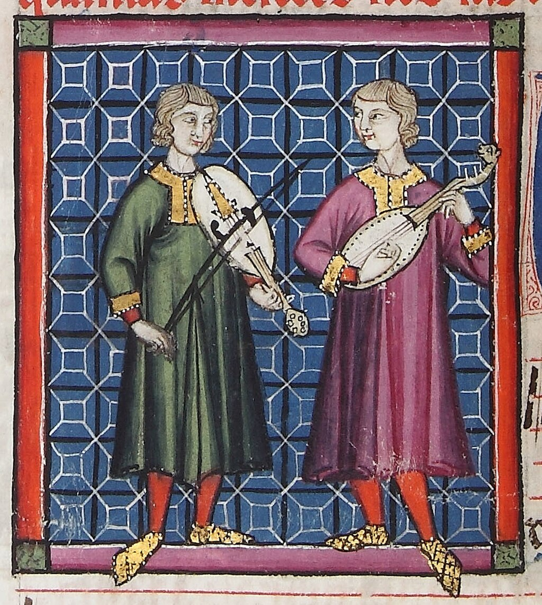

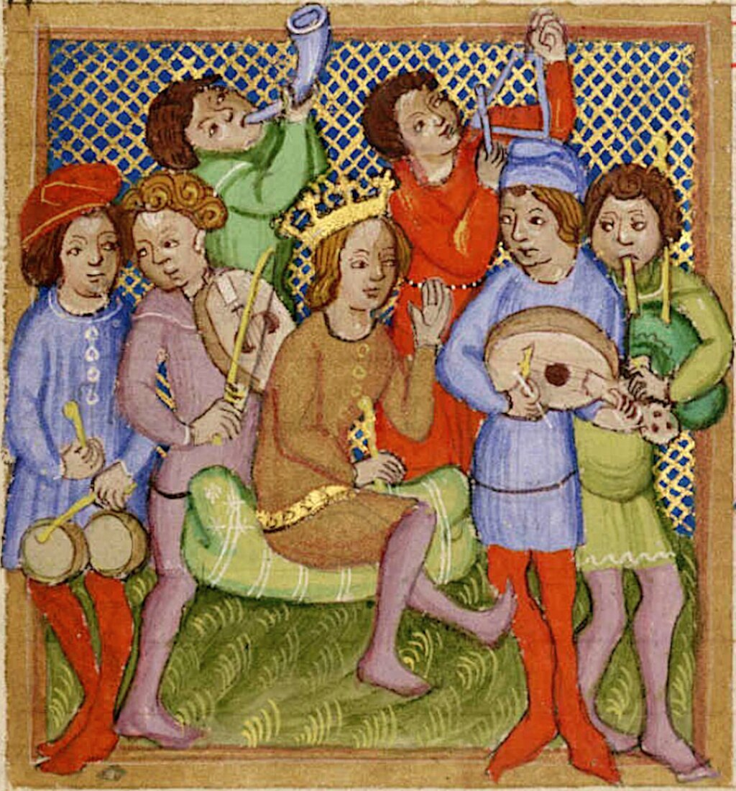

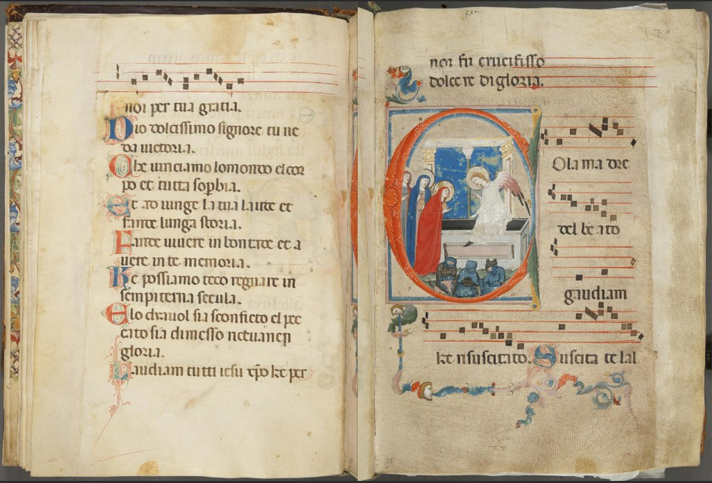

Clockwise, from top left:

*   Musicians playing the Spanish _[vihuela](https://en.wikipedia.org/wiki/Vihuela "Vihuela")_ in the _[Cantigas de Santa Maria](https://en.wikipedia.org/wiki/Cantigas_de_Santa_Maria "Cantigas de Santa Maria")_, 13th century
*   Troubadours, 14th century
*   Excerpt from the Laudario Magliabechiano, an Italian manuscript

**Medieval music** encompasses the [sacred](https://en.wikipedia.org/wiki/Sacred_music "Sacred music") and [secular music](https://en.wikipedia.org/wiki/Secular_music "Secular music") of Western Europe during the [Middle Ages](https://en.wikipedia.org/wiki/Middle_Ages "Middle Ages"), from approximately the 6th to 15th centuries. It is the [first and longest major era](https://en.wikipedia.org/wiki/Dates_of_classical_music_eras "Dates of classical music eras") of [Western classical music](https://en.wikipedia.org/wiki/Western_classical_music "Western classical music") and is followed by the [Renaissance music](/source/renaissance-music/ "Renaissance music"); the two eras comprise what [musicologists](https://en.wikipedia.org/wiki/Musicologist "Musicologist") generally term as [early music](https://en.wikipedia.org/wiki/Early_music "Early music"), preceding the [common practice period](https://en.wikipedia.org/wiki/Common_practice_period "Common practice period"). Following the traditional division of the Middle Ages, medieval music can be divided into [Early (500–1000)](/source/medieval-music/#Early_medieval_music_\(500–1000\)), [High (1000–1300)](/source/medieval-music/#High_medieval_music_\(1000–1300\)), and [Late (1300–1400)](/source/medieval-music/#Late_medieval_music_\(1300–1400\)) medieval music.

Medieval music includes [liturgical music](https://en.wikipedia.org/wiki/Liturgical_music "Liturgical music") used for the church, other sacred music, and [secular](https://en.wikipedia.org/wiki/Secular_music "Secular music") or non-religious music. Much medieval music is purely vocal music, such as [Gregorian chant](https://en.wikipedia.org/wiki/Gregorian_chant "Gregorian chant"). Other music used only instruments or both voices and instruments (typically with the instruments [accompanying](https://en.wikipedia.org/wiki/Accompaniment "Accompaniment") the voices).

The medieval period saw the creation and adaptation of systems of [music notation](https://en.wikipedia.org/wiki/Music_notation "Music notation") which enabled creators to document and transmit musical ideas more easily, although notation coexisted with and complemented [oral tradition](https://en.wikipedia.org/wiki/Oral_tradition "Oral tradition").

## Overview

### Genres

Medieval music was created for a number of different uses and contexts, resulting in different [music genres](https://en.wikipedia.org/wiki/Music_genre "Music genre"). [Liturgical](https://en.wikipedia.org/wiki/Liturgical_music "Liturgical music") as well as more general [sacred](https://en.wikipedia.org/wiki/Sacredness "Sacredness") contexts were important, but [secular](https://en.wikipedia.org/wiki/Secular_music "Secular music") types emerged as well, including love songs and dances. During the [earlier medieval period](https://en.wikipedia.org/wiki/Early_Middle_Ages "Early Middle Ages"), [liturgical](https://en.wikipedia.org/wiki/Liturgy "Liturgy") music was [monophonic](https://en.wikipedia.org/wiki/Monophony "Monophony") chant; [Gregorian chant](https://en.wikipedia.org/wiki/Gregorian_chant "Gregorian chant") became the dominant style. [Polyphonic](https://en.wikipedia.org/wiki/Polyphony "Polyphony") genres, in which multiple independent melodic lines are performed simultaneously, began to develop during the [high medieval era](https://en.wikipedia.org/wiki/High_Middle_Ages "High Middle Ages"), becoming prevalent by the later 13th and early 14th century. The development of polyphonic forms is often associated with the [Ars antiqua](https://en.wikipedia.org/wiki/Ars_antiqua "Ars antiqua") style associated with [Notre-Dame de Paris](https://en.wikipedia.org/wiki/Notre-Dame_de_Paris "Notre-Dame de Paris"), but improvised polyphony around chant lines predated this.

[Organum](https://en.wikipedia.org/wiki/Organum "Organum"), for example, elaborated on a chant melody by creating one or more accompanying lines. The accompanying line could be as simple as a second line sung in [parallel intervals](https://en.wikipedia.org/wiki/Parallel_intervals "Parallel intervals") to the original chant (often a [perfect fifth](https://en.wikipedia.org/wiki/Perfect_fifth "Perfect fifth") or [perfect fourth](https://en.wikipedia.org/wiki/Perfect_fourth "Perfect fourth") away from the main melody). The principles of this kind of organum date back at least to an anonymous 9th century tract, the _[Musica enchiriadis](https://en.wikipedia.org/wiki/Musica_enchiriadis "Musica enchiriadis")_, which describes the tradition of duplicating a preexisting plainchant in parallel motion at the interval of an octave, a fifth or a fourth. Some of the earliest written examples are in a style known as [Aquitanian polyphony](https://en.wikipedia.org/wiki/Aquitanian_polyphony "Aquitanian polyphony"), but the largest body of surviving organum comes from the [Notre-Dame school](https://en.wikipedia.org/wiki/Notre-Dame_school "Notre-Dame school"). This loose collection of repertory is often called the _[Magnus Liber](https://en.wikipedia.org/wiki/Magnus_Liber "Magnus Liber") Organi_ (_Great Book of Organum_).

Related polyphonic genres included the [motet](https://en.wikipedia.org/wiki/Motet "Motet") and [clausula](https://en.wikipedia.org/wiki/Clausula_\(music\) "Clausula (music)") genres, both also often built on an original segment of [plainchant](https://en.wikipedia.org/wiki/Plainchant "Plainchant") or as an elaboration on an organum passage. While most early motets were sacred and may have been liturgical (designed for use in a church service), by the end of the thirteenth century the genre had expanded to include secular topics, such as political satire and [courtly love](https://en.wikipedia.org/wiki/Courtly_love "Courtly love"), and French as well as Latin texts. They also included from one to three upper voices, each with its own text.

In Italy, the secular genre of the [Madrigal](https://en.wikipedia.org/wiki/Madrigal_\(music\) "Madrigal (music)") became popular. Similar to the polyphonic character of the motet, madrigals featured greater fluidity and motion in the leading melody. The madrigal form also gave rise to polyphonic [canons](https://en.wikipedia.org/wiki/Canon_\(music\) "Canon (music)") (songs in which multiple singers sing the same melody, but starting at different times), especially in Italy where they were called _caccie._ These were three-part secular pieces, which featured the two higher voices in canon, with an underlying instrumental long-note accompaniment.

In the late middle ages, some purely instrumental music also began to be notated, though this remained rare. Dance music makes up most of the surviving instrumental music, and includes types such as the [estampie](https://en.wikipedia.org/wiki/Estampie "Estampie"), [ductia](https://en.wikipedia.org/wiki/Ductia "Ductia"), and nota.

### Instruments

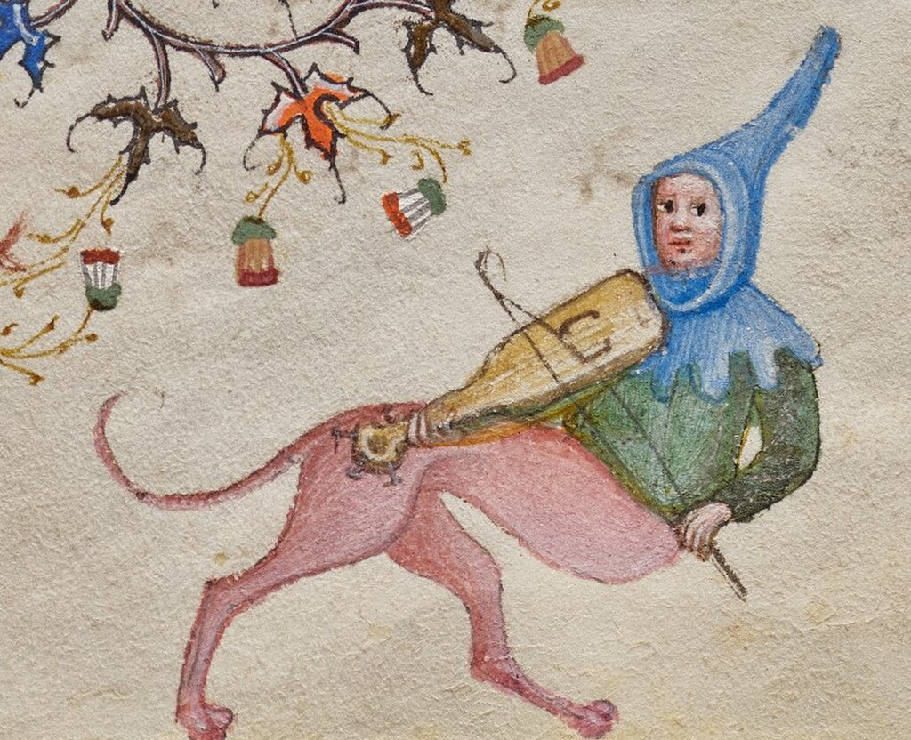A creature plays the [vielle](https://en.wikipedia.org/wiki/Vielle "Vielle") in the margins of the [Hours of Charles the Noble](https://en.wikipedia.org/wiki/Hours_of_Charles_the_Noble "Hours of Charles the Noble"), a book which contains 180 depictions of medieval instruments, probably more than any other [book of hours](https://en.wikipedia.org/wiki/Book_of_hours "Book of hours").

Many instruments used to perform medieval music still exist in the 21st century, but in different and typically more [technologically developed](https://en.wikipedia.org/wiki/Music_technology_\(mechanical\) "Music technology (mechanical)") forms. The flute was made of wood in the medieval era rather than silver or other metal, and could be made as a side-blown or end-blown instrument. While modern orchestral flutes are usually made of metal and have complex key mechanisms and airtight pads, medieval flutes had holes that the performer had to cover with the fingers (as with the recorder). The [recorder](https://en.wikipedia.org/wiki/Recorder_\(musical_instrument\) "Recorder (musical instrument)") was made of wood during the medieval era, and despite the fact that in the 21st century, it may be made of synthetic materials such as plastic, it has more or less retained its past form. The [gemshorn](https://en.wikipedia.org/wiki/Gemshorn "Gemshorn") is similar to the recorder as it has finger holes on its front, though it is actually a member of the [ocarina](https://en.wikipedia.org/wiki/Ocarina "Ocarina") family. One of the flute's predecessors, the [pan flute](https://en.wikipedia.org/wiki/Pan_flute "Pan flute"), was popular in medieval times, and is possibly of [Hellenic](https://en.wikipedia.org/wiki/Ancient_Greece "Ancient Greece") origin. This instrument's pipes were made of wood, and were graduated in length to produce different pitches.

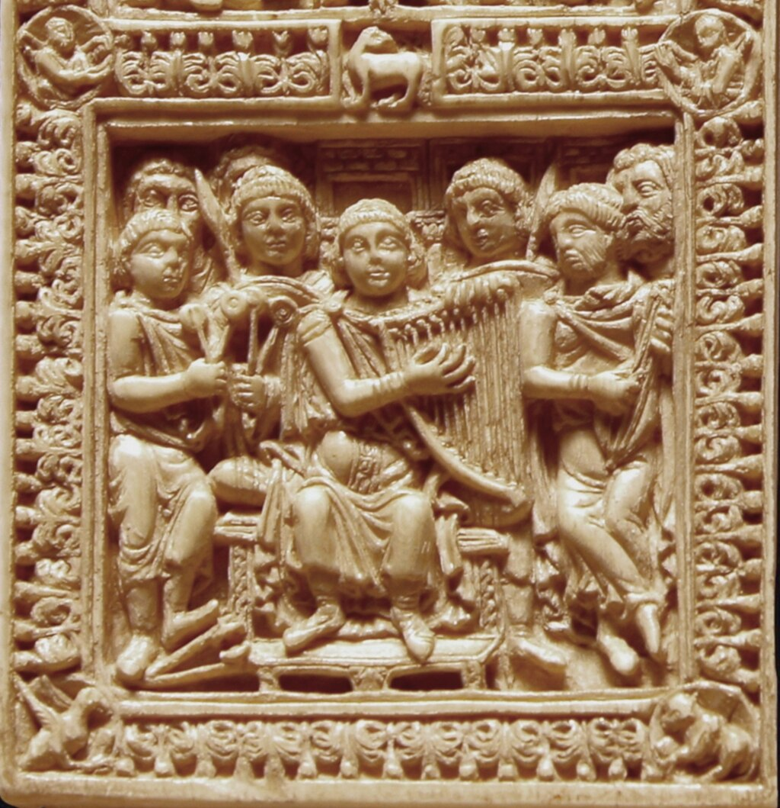[David](https://en.wikipedia.org/wiki/David "David") playing the harp, accompanied by plucked fiddle and clappers/cymbals. Circa 795, Germany or France.

Medieval music used many plucked [string instruments](https://en.wikipedia.org/wiki/String_instrument "String instrument") like the [lute](https://en.wikipedia.org/wiki/Lute "Lute"), a fretted instrument with a pear-shaped hollow body which is the predecessor to the modern guitar. Other plucked stringed instruments included the [mandore](https://en.wikipedia.org/wiki/Mandore_\(instrument\) "Mandore (instrument)"), [gittern](https://en.wikipedia.org/wiki/Gittern "Gittern"), [citole](https://en.wikipedia.org/wiki/Citole "Citole") and [psaltery](https://en.wikipedia.org/wiki/Psaltery "Psaltery").

The bowed [lyra](https://en.wikipedia.org/wiki/Byzantine_lyra "Byzantine lyra") of the [Byzantine Empire](https://en.wikipedia.org/wiki/Byzantine_Empire "Byzantine Empire") was the first recorded European bowed string instrument. Like the modern violin, a performer produced sound by moving a bow with tensioned hair over tensioned strings. The [Persian](https://en.wikipedia.org/wiki/Persian_people "Persian people") geographer [Ibn Khurradadhbih](https://en.wikipedia.org/wiki/Ibn_Khordadbeh "Ibn Khordadbeh") of the 9th century (d. 911) cited the [Byzantine lyra](https://en.wikipedia.org/wiki/Byzantine_lyra "Byzantine lyra"), in his lexicographical discussion of instruments as a bowed instrument equivalent to the Arab [rabāb](https://en.wikipedia.org/wiki/Rabāb "Rabāb") and typical instrument of the Byzantines along with the _urghun_ (organ), _shilyani_ (probably a type of [harp](https://en.wikipedia.org/wiki/Harp "Harp") or [lyre](https://en.wikipedia.org/wiki/Lyre "Lyre")) and the _salandj_ (probably a [bagpipe](https://en.wikipedia.org/wiki/Bagpipe "Bagpipe")). The [hurdy-gurdy](https://en.wikipedia.org/wiki/Hurdy-gurdy "Hurdy-gurdy") was (and still is) a mechanical violin using a rosined wooden wheel attached to a crank to "bow" its strings. Instruments without sound boxes like the [jew's harp](https://en.wikipedia.org/wiki/Jew's_harp "Jew's harp") were also popular. Early versions of the [pipe organ](https://en.wikipedia.org/wiki/Organ_\(music\) "Organ (music)"), [fiddle](https://en.wikipedia.org/wiki/Fiddle "Fiddle") (or [vielle](https://en.wikipedia.org/wiki/Vielle "Vielle")), and a precursor to the modern [trombone](https://en.wikipedia.org/wiki/Trombone "Trombone") (called the [sackbut](https://en.wikipedia.org/wiki/Sackbut "Sackbut")) were used.

### Notation

During the medieval period the foundation was laid for the notational and theoretical practices that would shape Western music into the norms that developed during the [common practice era](https://en.wikipedia.org/wiki/Common_practice_period "Common practice period"). The most obvious of these is the development of a comprehensive [music notational](https://en.wikipedia.org/wiki/Music_notation "Music notation") system; however the theoretical advances, particularly in regard to rhythm and polyphony, are equally important to the development of Western music.

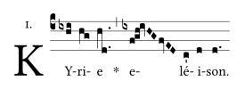A sample of [Kýrie Eléison](https://en.wikipedia.org/wiki/Kyrie "Kyrie") XI (Orbis Factor) from the _Liber Usualis_. The modern "neumes" on the staff above the text indicate the pitches of the [melody](https://en.wikipedia.org/wiki/Melody "Melody"). [Listen](https://upload.wikimedia.org/wikipedia/commons/c/cc/Kyrie_XI_%28Orbis_Factor%29_sample.ogg) to it interpreted.

The earliest medieval music did not have any kind of notational system. The tunes were primarily monophonic (a single [melody](https://en.wikipedia.org/wiki/Melody "Melody") without [accompaniment](https://en.wikipedia.org/wiki/Accompaniment "Accompaniment")) and transmitted by oral tradition. As Rome tried to centralize the various liturgies and establish the Roman rite as the primary church tradition, the need to transmit these chant melodies across vast distances effectively was equally glaring. So long as music could only be taught to people "by ear," it limited the ability of the church to get different regions to sing the same melodies, since each new person would have to spend time with a person who already knew a song and learn it "by ear." The first step to fix this problem came with the introduction of various signs written above the chant texts to indicate direction of pitch movement, called _[neumes](https://en.wikipedia.org/wiki/Neumes "Neumes")_.

The origin of _neumes_ is unclear and subject to some debate; however, most scholars agree that their closest ancestors are the classic Greek and Roman grammatical signs that indicated important points of declamation by recording the rise and fall of the voice. The two basic signs of the classical grammarians were the _acutus_, /, indicating a raising of the voice, and the _gravis_, \\, indicating a lowering of the voice. A singer reading a chant text with neume markings would be able to get a general sense of whether the melody line went up in pitch, stayed the same, or went down in pitch. Since trained singers knew the chant repertoire well, written neume markings above the text served as a reminder of the melody but did not specify the actual intervals. However, a singer reading a chant text with neume markings would not be able to [sight read](https://en.wikipedia.org/wiki/Sight_read "Sight read") a song which he or she had never heard sung before; these pieces would not be possible to interpret accurately today without later versions in more precise notation systems.

These neumes eventually evolved into the basic symbols for _neumatic_ notation, the _virga_ (or "rod") which indicates a higher note and still looked like the _acutus_ from which it came; and the _punctum_ (or "dot") which indicates a lower note and, as the name suggests, reduced the _gravis_ symbol to a point. Thus the _acutus_ and the _gravis_ could be combined to represent graphical vocal inflections on the syllable. This kind of notation seems to have developed no earlier than the eighth century, but by the ninth it was firmly established as the primary method of musical notation. The basic notation of the _virga_ and the _punctum_ remained the symbols for individual notes, but other _neumes_ soon developed which showed several notes joined. These new _neumes_—called ligatures—are essentially combinations of the two original signs.

The first music notation was the use of dots over the lyrics to a chant, with some dots being higher or lower, giving the reader a general sense of the direction of the melody. However, this form of notation only served as a memory aid for a singer who already knew the melody. This basic _neumatic_ notation could only specify the number of notes and whether they moved up or down. There was no way to indicate exact pitch, any rhythm, or even the starting note. These limitations are further indication that the _neumes_ were developed as tools to support the practice of oral tradition, rather than to supplant it. However, even though it started as a mere memory aid, the worth of having more specific notation soon became evident.

The next development in musical notation was "heighted _neumes_", in which _neumes_ were carefully placed at different heights in relation to each other. This allowed the _neumes_ to give a rough indication of the size of a given interval as well as the direction. This quickly led to one or two lines, each representing a particular note, being placed on the music with all of the _neumes_ relating to the earlier ones. At first, these lines had no particular meaning and instead had a letter placed at the beginning indicating which note was represented. However, the lines indicating middle C and the F a fifth below slowly became most common. Having been at first merely scratched on the parchment, the lines now were drawn in two different colored inks: usually red for F, and yellow or green for C. This was the beginning of the musical staff. The completion of the four-line staff is usually credited to [Guido d'Arezzo](https://en.wikipedia.org/wiki/Guido_of_Arezzo "Guido of Arezzo") (c. 1000–1050), one of the most important musical theorists of the Middle Ages. While older sources attribute the development of the staff to Guido, some modern scholars suggest that he acted more as a codifier of a system that was already being developed. Either way, this new notation allowed a singer to learn pieces completely unknown to him in a much shorter amount of time. However, even though chant notation had progressed in many ways, one fundamental problem remained: rhythm. The _neumatic_ notational system, even in its fully developed state, did not clearly define any kind of rhythm for the singing of notes.

## Music theory

The [music theory](/source/music-theory/ "Music theory") of the medieval period saw several advances over previous practice both in regard to tonal material, texture, and rhythm.

### Rhythm

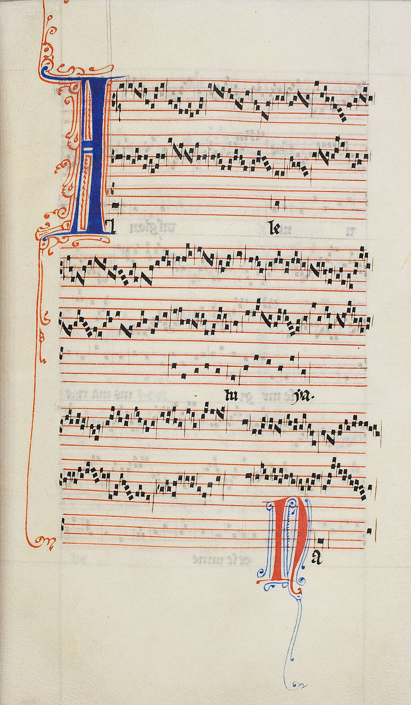Pérotin, "Alleluia nativitas", in the third rhythmic mode

Concerning [rhythm](https://en.wikipedia.org/wiki/Rhythm "Rhythm"), this period had several dramatic changes in both its conception and notation. During the early medieval period there was no method to notate rhythm, and thus the rhythmical practice of this early music is subject to debate among scholars. The first kind of written rhythmic system developed during the 13th century and was based on a series of modes. This rhythmic plan was codified by the music theorist [Johannes de Garlandia](https://en.wikipedia.org/wiki/Johannes_de_Garlandia_\(music_theorist\) "Johannes de Garlandia (music theorist)"), author of the _[De Mensurabili Musica](https://en.wikipedia.org/wiki/De_Mensurabili_Musica "De Mensurabili Musica")_ (c. 1250), the treatise which defined and most completely elucidated these [rhythmic modes](https://en.wikipedia.org/wiki/Rhythmic_mode "Rhythmic mode"). In his treatise Johannes de Garlandia describes six _species_ of mode, or six different ways in which longs and breves can be arranged. Each mode establishes a rhythmic pattern in beats (or _tempora_) within a common unit of three _tempora_ (a _perfectio_) that is repeated again and again. Furthermore, notation without text is based on chains of [_ligature_s](https://en.wikipedia.org/wiki/Ligature_\(music\) "Ligature (music)") (the characteristic notations by which groups of notes are bound to one another).

The rhythmic mode can generally be determined by the patterns of ligatures used. Once a rhythmic mode had been assigned to a melodic line, there was generally little deviation from that mode, although rhythmic adjustments could be indicated by changes in the expected pattern of ligatures, even to the extent of changing to another rhythmic mode. The next step forward concerning rhythm came from the German theorist [Franco of Cologne](https://en.wikipedia.org/wiki/Franco_of_Cologne "Franco of Cologne"). In his treatise _[Ars cantus mensurabilis](https://en.wikipedia.org/wiki/Ars_cantus_mensurabilis "Ars cantus mensurabilis")_ ("The Art of Mensurable Music"), written around 1280, he describes a system of notation in which differently shaped notes have entirely different rhythmic values. This is a striking change from the earlier system of de Garlandia. Whereas before the length of the individual note could only be gathered from the mode itself, this new inverted relationship made the mode dependent upon—and determined by—the individual notes or _figurae_ that have incontrovertible durational values, an innovation which had a massive impact on the subsequent history of European music. Most of the surviving notated music of the 13th century uses the rhythmic modes as defined by Garlandia. The step in the evolution of rhythm came after the turn of the 13th century with the development of the _Ars Nova_ style.

The theorist who is most well recognized in regard to this new style is [Philippe de Vitry](https://en.wikipedia.org/wiki/Philippe_de_Vitry "Philippe de Vitry"), famous for writing the _[Ars Nova](https://en.wikipedia.org/wiki/Ars_Nova "Ars Nova")_ ("New Art") treatise around 1320. This treatise on music gave its name to the style of this entire era. In some ways the modern system of rhythmic notation began with Vitry, who completely broke free from the older idea of the rhythmic modes. The notational predecessors of modern time meters also originate in the _Ars Nova_. This new style was clearly built upon the work of Franco of Cologne. In Franco's system, the relationship between a [breve](https://en.wikipedia.org/wiki/Double_whole_note "Double whole note") and a [semibreves](https://en.wikipedia.org/wiki/Whole_note "Whole note") (that is, half breves) was equivalent to that between a breve and a long: and, since for him _modus_ was always perfect (grouped in threes), the _tempus_ or beat was also inherently perfect and therefore contained three semibreves. Sometimes the context of the mode would require a group of only two semibreves, however, these two semibreves would always be one of normal length and one of double length, thereby taking the same space of time, and thus preserving the perfect subdivision of the _tempus_. This ternary division held for all note values. In contrast, the _Ars Nova_ period introduced two important changes: the first was an even smaller subdivision of notes (semibreves, could now be divided into _[minim](https://en.wikipedia.org/wiki/Minim_\(music\) "Minim (music)")_), and the second was the development of "mensuration."

Mensurations could be combined in various manners to produce metrical groupings. These groupings of mensurations are the precursors of simple and compound meter. By the time of _Ars Nova_, the perfect division of the _tempus_ was not the only option as duple divisions became more accepted. For Vitry the breve could be divided, for an entire composition, or section of one, into groups of two or three smaller semibreves. This way, the _tempus_ (the term that came to denote the division of the breve) could be either "perfect" (_tempus perfectum_), with ternary subdivision, or "imperfect" (_tempus imperfectum_), with binary subdivision. In a similar fashion, the semibreve's division (termed _prolation_) could be divided into three _minima_ (_[prolatio](https://en.wikipedia.org/wiki/Prolation "Prolation") perfectus_ or major prolation) or two _minima_ (_prolatio imperfectus_ or minor prolation) and, at the higher level, the [longs](https://en.wikipedia.org/wiki/Longa_\(music\) "Longa (music)") division (called _modus_) could be three or two breves (_[modus](https://en.wikipedia.org/wiki/Rhythmic_mode "Rhythmic mode") perfectus_ or perfect mode, or _modus imperfectus_ or imperfect mode respectively). Vitry took this a step further by indicating the proper division of a given piece at the beginning through the use of a "mensuration sign", equivalent to our modern "time signature".

_Tempus perfectum_ was indicated by a circle, while _tempus imperfectum_ was denoted by a half-circle (the current symbol , used as an alternative for the [**4**
**4**](https://en.wikipedia.org/wiki/4/4_time "4/4 time") time signature, is actually a holdover of this symbol, not a letter _C_ as an abbreviation for "common time", as popularly believed). While many of these innovations are ascribed to Vitry, and somewhat present in the _Ars Nova_ treatise, it was a contemporary—and personal acquaintance—of de Vitry, named [Johannes de Muris](https://en.wikipedia.org/wiki/Jean_de_Muris "Jean de Muris") (or [Jehan des Mars](https://en.wikipedia.org/wiki/Jehan_des_Mars "Jehan des Mars")) who offered the most comprehensive and systematic treatment of the new mensural innovations of the _Ars Nova_ (for a brief explanation of the mensural notation in general, see the article [Renaissance music](/source/renaissance-music/#Theory_and_notation "Renaissance music")). Many scholars, citing a lack of positive attributory evidence, now consider "Vitry's" treatise to be anonymous, but this does not diminish its importance for the history of rhythmic notation. However, this makes the first definitely identifiable scholar to accept and explain the mensural system to be de Muris, who can be said to have done for it what Garlandia did for the rhythmic modes.

For the duration of the medieval period, most music would be composed primarily in perfect tempus, with special effects created by sections of imperfect tempus; there is a great current controversy among musicologists as to whether such sections were performed with a breve of equal length or whether it changed, and if so, at what proportion. This _Ars Nova_ style remained the primary rhythmical system until the highly syncopated works of the _[Ars subtilior](https://en.wikipedia.org/wiki/Ars_subtilior "Ars subtilior")_ at the end of the 14th century, characterized by extremes of notational and rhythmic complexity. This sub-genera pushed the rhythmic freedom provided by _Ars Nova_ to its limits, with some compositions having different voices written in different mensurations simultaneously. The rhythmic complexity that was realized in this music is comparable to that in the 20th century.

### Polyphony

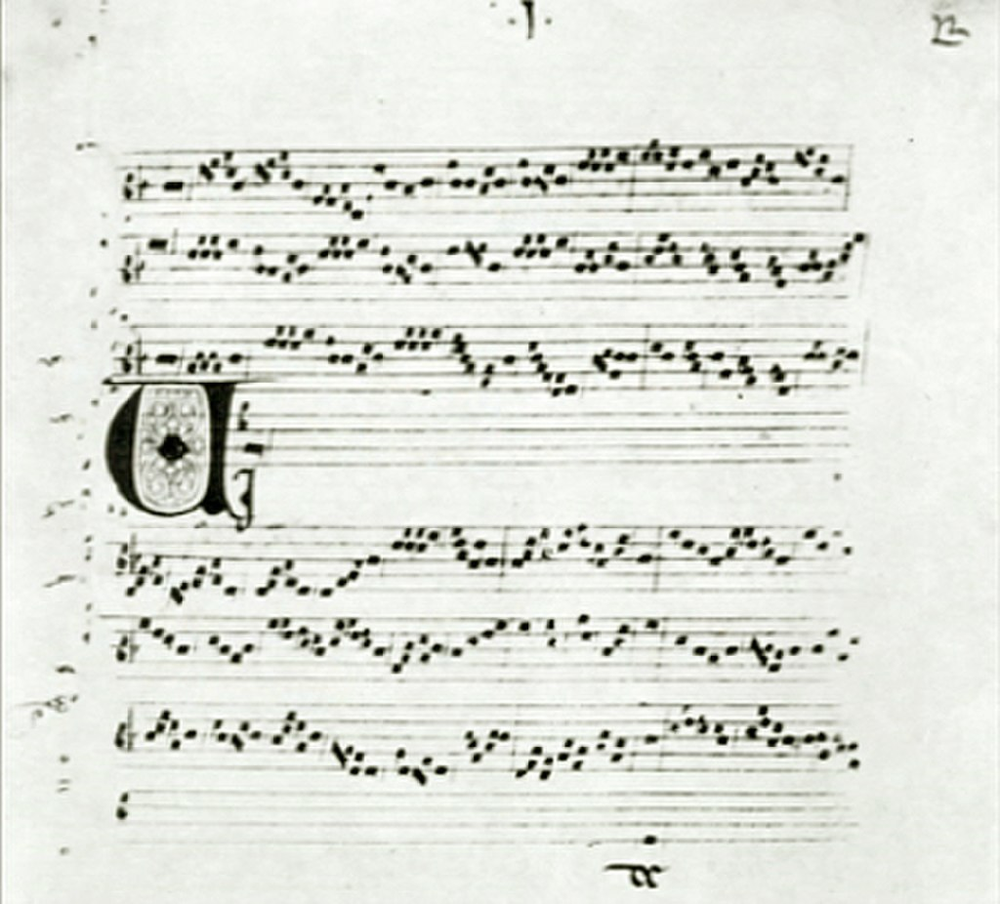[Pérotin](https://en.wikipedia.org/wiki/Pérotin "Pérotin")'s _Viderunt omnes_, c. 13th century

Of equal importance to the overall history of western music theory were the textural changes that came with the advent of polyphony. This practice shaped western music into the harmonically dominated music that we know today. The first accounts of this textural development were found in two anonymous yet widely circulated treatises on music, the _[Musica](https://en.wikipedia.org/wiki/Musica_enchiriadis "Musica enchiriadis")_ and the _[Scolica enchiriadis](https://en.wikipedia.org/wiki/Scolica_enchiriadis "Scolica enchiriadis")_. These texts are dated to sometime within the last half of the ninth century. The treatises describe a technique that seemed already to be well established in practice. This early polyphony is based on three simple and three compound intervals. The first group comprises fourths, fifths, and octaves; while the second group has octave-plus-fourths, octave-plus-fifths, and double octaves. This new practice is given the name _[organum](https://en.wikipedia.org/wiki/Organum "Organum")_ by the author of the treatises. _Organum_ can further be classified depending on the time period in which it was written. The early _organum_ as described in the _enchiriadis_ can be termed "strict _organum_" Strict _organum_ can, in turn, be subdivided into two types: _diapente_ (organum at the interval of a fifth) and _diatesseron_ (organum at the interval of a fourth). However, both of these kinds of strict _organum_ had problems with the musical rules of the time. If either of them paralleled an original chant for too long (depending on the mode) a [tritone](https://en.wikipedia.org/wiki/Tritone "Tritone") would result.

This problem was somewhat overcome with the use of a second type of _organum_. This second style of _organum_ was called "free _organum_". Its distinguishing factor is that the parts did not have to move only in parallel motion, but could also move in oblique, or contrary motion. This made it much easier to avoid the dreaded tritone. The final style of _organum_ that developed was known as "[melismatic](https://en.wikipedia.org/wiki/Melismatic "Melismatic") _organum_", which was a rather dramatic departure from the rest of the polyphonic music up to this point. This new style was not note against note, but was rather one sustained line accompanied by a florid melismatic line. This final kind of _organum_ was also incorporated by the most famous polyphonic composer of this time—[Léonin](https://en.wikipedia.org/wiki/Léonin "Léonin"). He united this style with measured [discant](https://en.wikipedia.org/wiki/Discant "Discant") passages, which used the rhythmic modes to create the pinnacle of _organum_ composition. This final stage of _organum_ is sometimes referred to as [Notre-Dame school](https://en.wikipedia.org/wiki/Notre-Dame_school "Notre-Dame school") of polyphony, since that was where Léonin (and his student [Pérotin](https://en.wikipedia.org/wiki/Pérotin "Pérotin")) were stationed. Furthermore, this kind of polyphony influenced all subsequent styles, with the later polyphonic genera of motets starting as a trope of existing Notre-Dame _organums_.

Another important element of medieval music theory was the system by which pitches were arranged and understood. During the Middle Ages, this systematic arrangement of a series of whole steps and half steps, what we now call a [scale](https://en.wikipedia.org/wiki/Musical_scale "Musical scale"), was known as a [mode](https://en.wikipedia.org/wiki/Gregorian_mode "Gregorian mode"). The modal system worked like the scales of today, insomuch that it provided the rules and material for melodic writing. The eight church modes are: _[Dorian](https://en.wikipedia.org/wiki/Dorian_mode "Dorian mode")_, _[Hypodorian](https://en.wikipedia.org/wiki/Hypodorian "Hypodorian")_, _[Phrygian](https://en.wikipedia.org/wiki/Phrygian_mode "Phrygian mode")_, _[Hypophrygian](https://en.wikipedia.org/wiki/Hypophrygian_mode "Hypophrygian mode")_, _[Lydian](https://en.wikipedia.org/wiki/Lydian_mode "Lydian mode")_, _[Hypolydian](https://en.wikipedia.org/wiki/Hypolydian_mode "Hypolydian mode")_, _[Mixolydian](https://en.wikipedia.org/wiki/Mixolydian "Mixolydian")_, and _[Hypomixolydian](https://en.wikipedia.org/wiki/Hypomixolydian_mode "Hypomixolydian mode")_. Much of the information concerning these modes, as well as the practical application of them, was codified in the 11th century by the theorist [Johannes Afflighemensis](https://en.wikipedia.org/wiki/Johannes_Afflighemensis "Johannes Afflighemensis"). In his work he describes three defining elements to each mode: the final (or _finalis)_, the reciting tone (_tenor_ or _confinalis_), and the range (or _ambitus_). The _finalis_ is the tone that serves as the focal point for the mode and, as the name suggests, is almost always used as the final tone. The reciting tone is the tone that serves as the primary focal point in the melody (particularly internally). It is generally also the tone most often repeated in the piece, and finally the range delimits the upper and lower tones for a given mode. The eight modes can be further divided into four categories based on their final (_finalis_).

Medieval theorists called these pairs _maneriae_ and labeled them according to the Greek ordinal numbers. Those modes that have d, e, f, and g as their final are put into the groups _protus_, _deuterus_, _tritus_, and _tetrardus_ respectively. These can then be divided further based on whether the mode is "authentic" or "plagal." These distinctions deal with the range of the mode in relation to the final. The authentic modes have a range that is about an octave (one tone above or below is allowed) and start on the final, whereas the plagal modes, while still covering about an octave, start a perfect fourth below the authentic. Another interesting aspect of the modal system is the use of "[Musica ficta](https://en.wikipedia.org/wiki/Musica_ficta "Musica ficta")" which allows pitches to be altered (changing B♮ to B♭ for example) in certain contexts regardless of the mode. These changes have several uses, but one that seems particularly common is to avoid melodic difficulties caused by the tritone.

These ecclesiastical modes, although they have Greek names, have little relationship to the modes as set out by Greek theorists. Rather, most of the terminology seems to be a misappropriation on the part of the medieval theorists Although the church modes have no relation to the ancient Greek modes, the overabundance of Greek terminology does point to an interesting possible origin in the liturgical melodies of the [Byzantine](https://en.wikipedia.org/wiki/Byzantine_music "Byzantine music") tradition. This system is called _[octoechos](https://en.wikipedia.org/wiki/Octoechos "Octoechos")_ and is also divided into eight categories, called _echoi_.

For specific medieval music theorists, see also: [Isidore of Seville](https://en.wikipedia.org/wiki/Isidore_of_Seville "Isidore of Seville"), [Aurelian of Réôme](https://en.wikipedia.org/wiki/Aurelian_of_Réôme "Aurelian of Réôme"), [Odo of Cluny](https://en.wikipedia.org/wiki/Odo_of_Cluny "Odo of Cluny"), [Guido of Arezzo](https://en.wikipedia.org/wiki/Guido_of_Arezzo "Guido of Arezzo"), [Hermannus Contractus](https://en.wikipedia.org/wiki/Hermannus_Contractus "Hermannus Contractus"), [Johannes Cotto](https://en.wikipedia.org/wiki/Johannes_Cotto "Johannes Cotto") (Johannes Afflighemensis), [Johannes de Muris](https://en.wikipedia.org/wiki/Johannes_de_Muris "Johannes de Muris"), [Franco of Cologne](https://en.wikipedia.org/wiki/Franco_of_Cologne "Franco of Cologne"), [Johannes de Garlandia](https://en.wikipedia.org/wiki/Johannes_de_Garlandia_\(music_theorist\) "Johannes de Garlandia (music theorist)") (Johannes Gallicus), [Anonymous IV](https://en.wikipedia.org/wiki/Anonymous_IV "Anonymous IV"), [Marchetto da Padova](https://en.wikipedia.org/wiki/Marchetto_da_Padova "Marchetto da Padova") (Marchettus of Padua), [Jacques of Liège](https://en.wikipedia.org/wiki/Jacob_of_Liège "Jacob of Liège"), [Johannes de Grocheo](https://en.wikipedia.org/wiki/Johannes_de_Grocheo "Johannes de Grocheo"), [Petrus de Cruce](https://en.wikipedia.org/wiki/Petrus_de_Cruce "Petrus de Cruce") (Pierre de la Croix), and [Philippe de Vitry](https://en.wikipedia.org/wiki/Philippe_de_Vitry "Philippe de Vitry").

## Early medieval music (500–1000)

### Early chant traditions

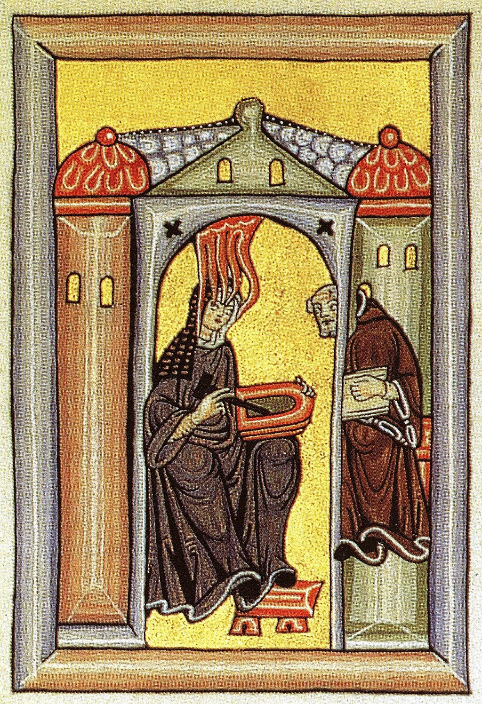[Hildegard of Bingen](https://en.wikipedia.org/wiki/Hildegard_of_Bingen "Hildegard of Bingen"), one of the best-known composers of sacred [monophony](https://en.wikipedia.org/wiki/Monophony "Monophony")

[Chant](https://en.wikipedia.org/wiki/Gregorian_chant "Gregorian chant") (or [plainsong](https://en.wikipedia.org/wiki/Plainsong "Plainsong")) is a [monophonic](https://en.wikipedia.org/wiki/Texture_\(music\) "Texture (music)") sacred (single, unaccompanied melody) form which represents the earliest known music of the Christian church. Chant developed separately in several European centres. Although the most important were [Rome](https://en.wikipedia.org/wiki/Rome "Rome"), [Hispania](https://en.wikipedia.org/wiki/Hispania "Hispania"), [Gaul](https://en.wikipedia.org/wiki/Gaul "Gaul"), Milan, and Ireland, there were others as well. These styles were all developed to support the regional liturgies used when celebrating the Mass there. Each area developed its own chant and rules for celebration. In Spain and [Portugal](https://en.wikipedia.org/wiki/Portugal "Portugal"), [Mozarabic chant](https://en.wikipedia.org/wiki/Mozarabic_chant "Mozarabic chant") was used and shows the influence of [North African music](https://en.wikipedia.org/wiki/Music_of_North_Africa "Music of North Africa"). The Mozarabic liturgy even survived through [Muslim](https://en.wikipedia.org/wiki/Muslim "Muslim") rule, though this was an isolated strand and this music was later suppressed in an attempt to enforce conformity on the entire liturgy. In Milan, [Ambrosian chant](https://en.wikipedia.org/wiki/Ambrosian_chant "Ambrosian chant"), named after [St. Ambrose](https://en.wikipedia.org/wiki/St._Ambrose "St. Ambrose"), was the standard, while [Beneventan chant](https://en.wikipedia.org/wiki/Beneventan_chant "Beneventan chant") developed around [Benevento](https://en.wikipedia.org/wiki/Benevento "Benevento"), another Italian liturgical center. [Gallican chant](https://en.wikipedia.org/wiki/Gallican_chant "Gallican chant") was used in Gaul, and [Celtic chant](https://en.wikipedia.org/wiki/Celtic_chant "Celtic chant") in Ireland and Great Britain.

The reigning Carolingian dynasty wanted to standardize the [Mass](https://en.wikipedia.org/wiki/Mass_\(liturgy\) "Mass (liturgy)") and chant across its [Frankish Empire](https://en.wikipedia.org/wiki/Francia "Francia"). At this time, Rome was the religious centre of western Europe, and northern [Gaul](https://en.wikipedia.org/wiki/Gaul "Gaul") and Rhineland (most notably the city of [Aachen](https://en.wikipedia.org/wiki/Aachen "Aachen")) was the political centre. The standardization effort consisted mainly of combining the two – [Roman](https://en.wikipedia.org/wiki/Roman_Rite "Roman Rite") and [Gallican](https://en.wikipedia.org/wiki/Gallican_rite "Gallican rite") – regional liturgies. [Charlemagne](https://en.wikipedia.org/wiki/Charlemagne "Charlemagne") (742–814) sent trained singers throughout the Empire to teach this new form of chant. This body of chant became known as [Gregorian Chant](https://en.wikipedia.org/wiki/Gregorian_chant "Gregorian chant"), named after [Pope Gregory I](https://en.wikipedia.org/wiki/Pope_Gregory_I "Pope Gregory I"). Gregorian chant was said to be collected and codified during his papacy or even composed by himself, inspired by the Holy Spirit in the form of a dove. However, that is only a popular legend that was spread by the Carolingians who wanted to legitimize their liturgy unification efforts. Gregorian chant certainly didn't exist at that time. It is possible, nevertheless, that Gregory's papacy really may have contributed to collecting and codifying the Roman chant of the time which then, in the 9th and 10th centuries, formed – alongside the Gallican chant – one of the two roots of the Gregorian chant. By the 12th and 13th centuries, Gregorian chant had superseded all the other Western chant traditions, with the exception of the Ambrosian chant in Milan and the Mozarabic chant in a few specially designated Spanish chapels. [Hildegard von Bingen](https://en.wikipedia.org/wiki/Hildegard_von_Bingen "Hildegard von Bingen") (1098–1179) was one of the earliest known female composers. She wrote many monophonic works for the Catholic Church, almost all of them for female voices.

### Early polyphony: organum

Around the end of the 9th century, singers in monasteries such as [St. Gall](https://en.wikipedia.org/wiki/Abbey_of_St._Gall "Abbey of St. Gall") in Switzerland began experimenting with adding another part to the chant, generally a voice in [parallel motion](https://en.wikipedia.org/wiki/Contrary_motion "Contrary motion"), singing mostly in perfect [fourths](https://en.wikipedia.org/wiki/Perfect_fourth "Perfect fourth") or [fifths](https://en.wikipedia.org/wiki/Perfect_fifth "Perfect fifth") above the original tune (see [interval](https://en.wikipedia.org/wiki/Interval_\(music\) "Interval (music)")). This development is called [organum](https://en.wikipedia.org/wiki/Organum "Organum") and represents the beginnings of [counterpoint](https://en.wikipedia.org/wiki/Counterpoint "Counterpoint") and, ultimately, [harmony](https://en.wikipedia.org/wiki/Harmony "Harmony"). Over the next several centuries, organum developed in several ways.

The most significant of these developments was the creation of "florid organum" around 1100, sometimes known as the [school of St. Martial](https://en.wikipedia.org/wiki/School_of_St._Martial "School of St. Martial") (named after a monastery in south-central France, which contains the best-preserved manuscript of this repertory). In "florid organum" the original tune would be sung in long notes while an accompanying voice would sing many notes to each one of the original, often in a highly elaborate fashion, all the while emphasizing the perfect [consonances](https://en.wikipedia.org/wiki/Consonance_and_dissonance "Consonance and dissonance") (fourths, fifths and octaves), as in the earlier organa. Later developments of organum occurred in England, where the interval of the [third](https://en.wikipedia.org/wiki/Interval_\(music\) "Interval (music)") was particularly favoured, and where organa were likely improvised against an existing chant melody, and at [Notre-Dame](https://en.wikipedia.org/wiki/Notre-Dame_school "Notre-Dame school") in Paris, which was to be the centre of musical creative activity throughout the thirteenth century.

Much of the music from the early medieval period is [anonymous](https://en.wikipedia.org/wiki/Anonymous_work "Anonymous work"). Some of the names may have been poets and lyric writers, and the tunes for which they wrote words may have been composed by others. Attribution of monophonic music of the medieval period is not always reliable. Surviving manuscripts from this period include the [Musica Enchiriadis](https://en.wikipedia.org/wiki/Musica_Enchiriadis "Musica Enchiriadis"), [Codex Calixtinus](https://en.wikipedia.org/wiki/Codex_Calixtinus "Codex Calixtinus") of [Santiago de Compostela](https://en.wikipedia.org/wiki/Santiago_de_Compostela "Santiago de Compostela"), the [Magnus Liber](https://en.wikipedia.org/wiki/Magnus_Liber "Magnus Liber"), and the [Winchester Troper](https://en.wikipedia.org/wiki/Winchester_Troper "Winchester Troper"). For information about specific composers or poets writing during the early medieval period, see [Pope Gregory I](https://en.wikipedia.org/wiki/Pope_Gregory_I "Pope Gregory I"), [St. Godric](https://en.wikipedia.org/wiki/Godric_of_Finchale "Godric of Finchale"), [Hildegard of Bingen](https://en.wikipedia.org/wiki/Hildegard_of_Bingen "Hildegard of Bingen"), [Hucbald](https://en.wikipedia.org/wiki/Hucbald "Hucbald"), [Notker Balbulus](https://en.wikipedia.org/wiki/Notker_of_St_Gall "Notker of St Gall"), [Odo of Arezzo](https://en.wikipedia.org/wiki/Odo_of_Arezzo "Odo of Arezzo"), [Odo of Cluny](https://en.wikipedia.org/wiki/Odo_of_Cluny "Odo of Cluny"), and [Tutilo](https://en.wikipedia.org/wiki/Tuotilo "Tuotilo").

### Liturgical drama

Another musical tradition of Europe originating during the early Middle Ages was the [liturgical drama](https://en.wikipedia.org/wiki/Liturgical_drama "Liturgical drama").

Liturgical drama developed possibly in the 10th century from the tropes—poetic embellishments of the liturgical texts. One of the tropes, the so-called Quem Quaeritis, belonging to the liturgy of Easter morning, developed into a short play around the year 950. The oldest surviving written source is the Winchester Troper. Around the year 1000 it was sung widely in Northern Europe.

Shortly, a similar Christmas play was developed, musically and textually following the Easter one, and other plays followed.

There is a controversy among musicologists as to the instrumental accompaniment of such plays, given that the stage directions, very elaborate and precise in other respects, do not request any participation of instruments. These dramas were performed by monks, nuns and priests. In contrast to secular plays, which were spoken, the liturgical drama was always sung. Many have been preserved sufficiently to allow modern reconstruction and performance (for example the _[Play of Daniel](https://en.wikipedia.org/wiki/Play_of_Daniel "Play of Daniel")_, which has been recently recorded at least ten times).

## High medieval music (1000–1300)

### Goliards

The [Goliards](https://en.wikipedia.org/wiki/Goliard "Goliard") were [itinerant poet](https://en.wikipedia.org/wiki/Itinerant_poet "Itinerant poet")-musicians of Europe from the tenth to the middle of the thirteenth century. Most were scholars or [ecclesiastics](https://en.wikipedia.org/wiki/Ecclesiastic "Ecclesiastic"), and they wrote and sang in Latin. Although many of the poems have survived, very little of the music has. They were possibly influential—even decisively so—on the [troubadour](https://en.wikipedia.org/wiki/Troubadour "Troubadour")–[trouvère](https://en.wikipedia.org/wiki/Trouvère "Trouvère") tradition which was to follow. Most of their poetry is secular and, while some of the songs celebrate religious ideals, others are frankly profane, dealing with drunkenness, debauchery and lechery. One of the most important extant sources of Goliards chansons is the [Carmina Burana](https://en.wikipedia.org/wiki/Carmina_Burana "Carmina Burana").

### _Ars antiqua_

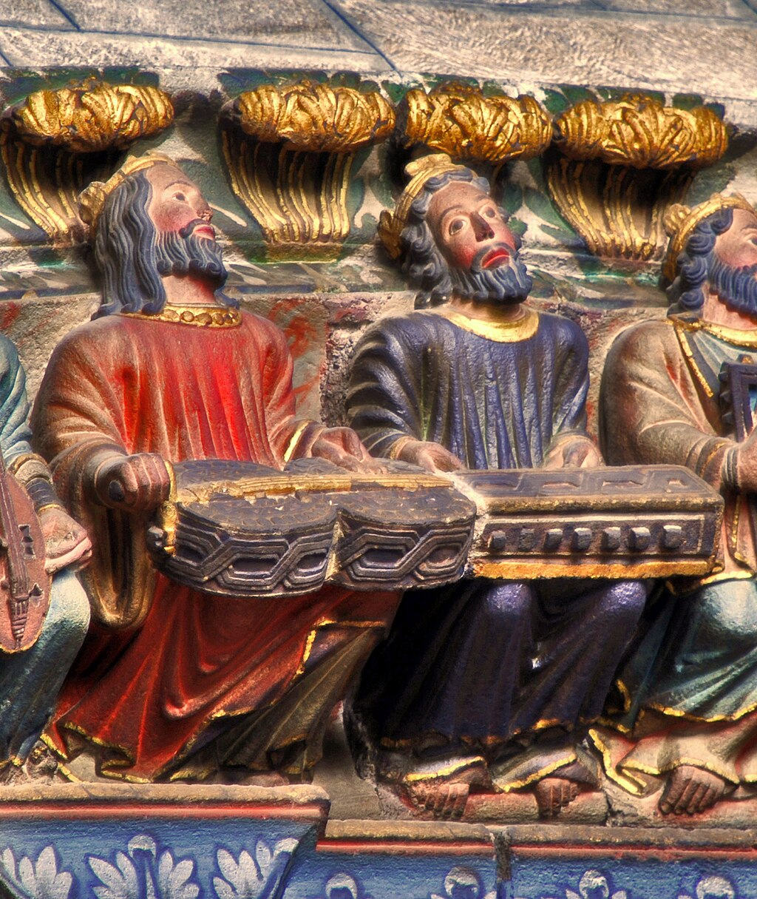Men playing the [organistrum](https://en.wikipedia.org/wiki/Organistrum "Organistrum"), from the [Ourense Cathedral](https://en.wikipedia.org/wiki/Ourense_Cathedral "Ourense Cathedral"), Spain, 12th century

The flowering of the [Notre-Dame school](https://en.wikipedia.org/wiki/Notre-Dame_school "Notre-Dame school") of polyphony from around 1150 to 1250 corresponded to the equally impressive achievements in [Gothic architecture](https://en.wikipedia.org/wiki/Gothic_architecture "Gothic architecture"): indeed the centre of activity was at the cathedral of [Notre-Dame](https://en.wikipedia.org/wiki/Notre-Dame_de_Paris "Notre-Dame de Paris") itself. Sometimes the music of this period is called the Parisian school, or Parisian organum, and represents the beginning of what is conventionally known as _[Ars antiqua](https://en.wikipedia.org/wiki/Ars_antiqua "Ars antiqua")_. This was the period in which [rhythmic](https://en.wikipedia.org/wiki/Rhythm "Rhythm") notation first appeared in western music, mainly a context-based method of rhythmic notation known as the [rhythmic modes](https://en.wikipedia.org/wiki/Rhythmic_mode "Rhythmic mode").

This was also the period in which concepts of [formal](https://en.wikipedia.org/wiki/Musical_form "Musical form") structure developed which were attentive to proportion, [texture](https://en.wikipedia.org/wiki/Musical_texture "Musical texture"), and architectural effect. Composers of the period alternated florid and discant organum (more note-against-note, as opposed to the succession of many-note melismas against long-held notes found in the florid type), and created several new musical forms: [clausulae](https://en.wikipedia.org/wiki/Clausula_\(music\) "Clausula (music)"), which were [melismatic](https://en.wikipedia.org/wiki/Melisma "Melisma") sections of organa extracted and fitted with new words and further musical elaboration; [conductus](https://en.wikipedia.org/wiki/Conductus "Conductus"), which were songs for one or more voices to be sung rhythmically, most likely in a procession of some sort; and [tropes](https://en.wikipedia.org/wiki/Trope_\(music\) "Trope (music)"), which were additions of new words and sometimes new music to sections of older chant. All of these genres save one were based upon chant; that is, one of the voices, (usually three, though sometimes four) nearly always the lowest (the tenor at this point) sang a chant melody, though with freely composed note-lengths, over which the other voices sang organum. The exception to this method was the conductus, a two-voice composition that was freely composed in its entirety.

The [motet](https://en.wikipedia.org/wiki/Motet "Motet"), one of the most important musical forms of the high Middle Ages and Renaissance, developed initially during the Notre-Dame period out of the clausula, especially the form using multiple voices as elaborated by [Pérotin](https://en.wikipedia.org/wiki/Pérotin "Pérotin"), who paved the way for this particularly by replacing many of his predecessor (as canon of the cathedral) [Léonin](https://en.wikipedia.org/wiki/Léonin "Léonin")'s lengthy florid clausulae with substitutes in a discant style. Gradually, there came to be entire books of these substitutes, available to be fitted in and out of the various chants. Since, in fact, there were more than can possibly have been used in context, it is probable that the clausulae came to be performed independently, either in other parts of the mass, or in private devotions. The clausula, thus practised, became the motet when troped with non-liturgical words, and this further developed into a form of great elaboration, sophistication and subtlety in the fourteenth century, the period of _Ars nova_. Surviving manuscripts from this era include the [Montpellier Codex](https://en.wikipedia.org/wiki/Montpellier_Codex "Montpellier Codex"), [Bamberg Codex](https://en.wikipedia.org/wiki/Bamberg_Codex "Bamberg Codex"), and [Las Huelgas Codex](https://en.wikipedia.org/wiki/Las_Huelgas_Codex "Las Huelgas Codex").

Composers of this time include [Léonin](https://en.wikipedia.org/wiki/Léonin "Léonin"), [Pérotin](https://en.wikipedia.org/wiki/Pérotin "Pérotin"), [W. de Wycombe](https://en.wikipedia.org/wiki/W._de_Wycombe "W. de Wycombe"), [Adam de St. Victor](https://en.wikipedia.org/wiki/Adam_de_St._Victor "Adam de St. Victor"), and [Petrus de Cruce](https://en.wikipedia.org/wiki/Petrus_de_Cruce "Petrus de Cruce") (Pierre de la Croix). Petrus is credited with the innovation of writing more than three semibreves to fit the length of a breve. Coming before the innovation of imperfect tempus, this practice inaugurated the era of what are now called "Petronian" motets. These late 13th-century works are in three to four parts and have multiple texts sung simultaneously. Originally, the tenor line (from the Latin _[tenere](https://en.wikipedia.org/wiki/Tenere "Tenere")_, "to hold") held a preexisting liturgical chant line in the original Latin, while the text of the one, two, or even three voices above, called the _voces organales_, provided commentary on the liturgical subject either in Latin or in the vernacular French. The rhythmic values of the _voces organales_ decreased as the parts multiplied, with the _duplum_ (the part above the tenor) having smaller rhythmic values than the tenor, the _triplum_ (the line above the _duplum_) having smaller rhythmic values than the _duplum_, and so on. As time went by, the texts of the _voces organales_ became increasingly secular in nature and had less and less overt connection to the liturgical text in the tenor line.

The increasing rhythmic complexity seen in Petronian motets would be a fundamental characteristic of the 14th century, though music in France, Italy, and England would take quite different paths during that time.

### Cantigas de Santa Maria

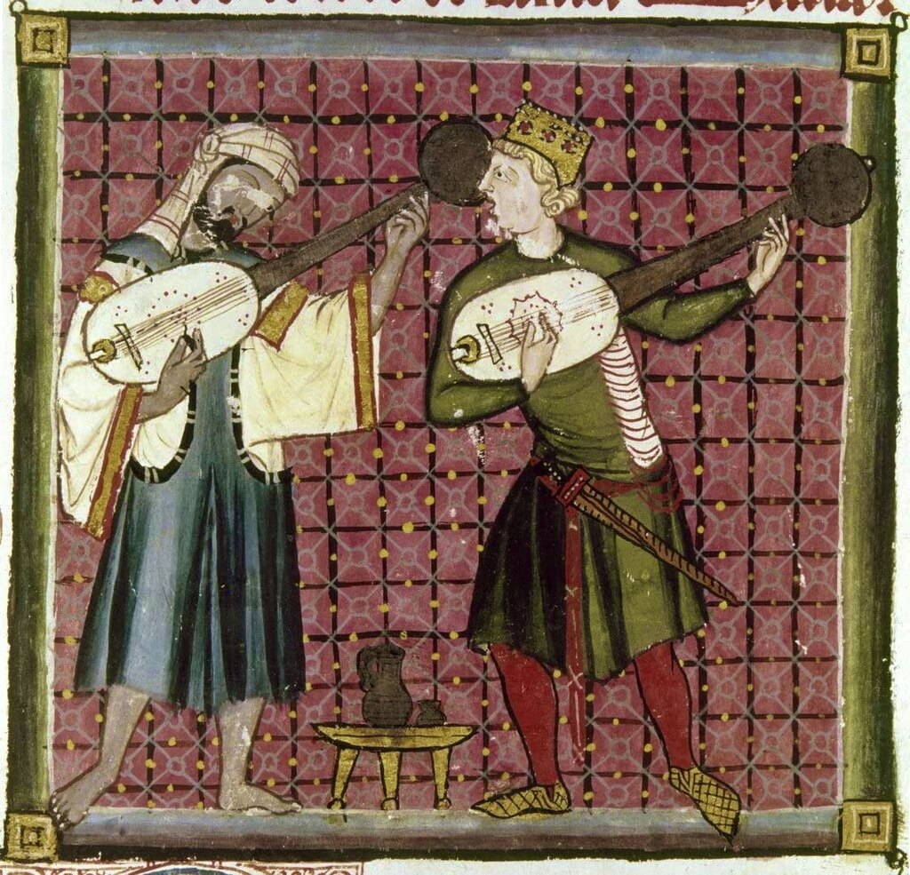Christian and Muslim playing [lutes](https://en.wikipedia.org/wiki/Lute "Lute") in a miniature from _[Cantigas de Santa Maria](https://en.wikipedia.org/wiki/Cantigas_de_Santa_Maria "Cantigas de Santa Maria")_ of [Alfonso X](https://en.wikipedia.org/wiki/Alfonso_X "Alfonso X")

The _**Cantigas de Santa Maria**_ ("Canticles of St. Mary") are 420 poems with musical notation, written in [Galician-Portuguese](https://en.wikipedia.org/wiki/Galician-Portuguese "Galician-Portuguese") during the reign of [Alfonso X _The Wise_](https://en.wikipedia.org/wiki/Alfonso_X_of_Castile "Alfonso X of Castile") (1221–1284). The manuscript was probably compiled from 1270 to 1280, and is highly decorated, with an illumination every 10 poems. The illuminations often depict musicians making the manuscript a particularly important source of medieval music iconography. Though the _Cantigas_ are often attributed to Alfonso, it remains unclear as to whether he was a composer himself, or perhaps a compiler; Alfonso is known to regularly invited musicians and poets to court whom were undoubtedly involved in the _Cantigas_ production.

It is one of the largest collections of monophonic (solo) songs from the [Middle Ages](https://en.wikipedia.org/wiki/Middle_Ages "Middle Ages") and is characterized by the mention of the [Virgin Mary](https://en.wikipedia.org/wiki/Mary,_the_mother_of_Jesus "Mary, the mother of Jesus") in every song, while every tenth song is a hymn. The manuscripts have survived in four codices: two at [El Escorial](https://en.wikipedia.org/wiki/El_Escorial "El Escorial"), one at [Madrid](https://en.wikipedia.org/wiki/Madrid "Madrid")'s [National Library](https://en.wikipedia.org/wiki/Biblioteca_Nacional_de_España "Biblioteca Nacional de España"), and one in [Florence](https://en.wikipedia.org/wiki/Florence "Florence"), Italy. Some have colored [miniatures](https://en.wikipedia.org/wiki/Miniature_\(illuminated_manuscript\) "Miniature (illuminated manuscript)") showing pairs of musicians playing a wide variety of [instruments](https://en.wikipedia.org/wiki/Musical_instrument "Musical instrument").

### Troubadours and trouvères

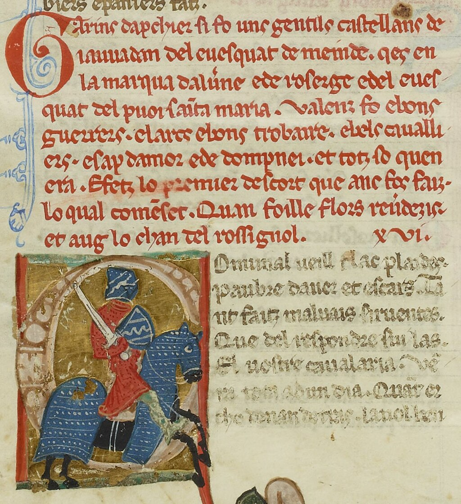[Garin d'Apchier](https://en.wikipedia.org/wiki/Garin_d'Apchier "Garin d'Apchier") in a medieval manuscript, 13th century

The music of the [troubadours](https://en.wikipedia.org/wiki/Troubadour "Troubadour") and [trouvères](https://en.wikipedia.org/wiki/Trouvère "Trouvère") was a [vernacular](https://en.wikipedia.org/wiki/Vernacular "Vernacular") tradition of monophonic secular song, probably accompanied by instruments, sung by professional, occasionally itinerant, musicians who were as skilled as poets as they were singers and instrumentalists. The language of the troubadours was [Occitan](https://en.wikipedia.org/wiki/Occitan_language "Occitan language") (also known as the [langue d'oc](https://en.wikipedia.org/wiki/Langue_d'oc "Langue d'oc"), or Provençal); the language of the trouvères was Old French (also known as [langue d'oïl](https://en.wikipedia.org/wiki/Langue_d'oïl "Langue d'oïl")). The period of the troubadours corresponded to the flowering of cultural life in [Provence](https://en.wikipedia.org/wiki/Provence "Provence") which lasted through the twelfth century and into the first decade of the thirteenth. Typical subjects of troubadour song were war, [chivalry](https://en.wikipedia.org/wiki/Chivalry "Chivalry") and [courtly love](https://en.wikipedia.org/wiki/Courtly_love "Courtly love")—the love of an idealized woman from afar. The period of the troubadours wound down after the [Albigensian Crusade](https://en.wikipedia.org/wiki/Albigensian_Crusade "Albigensian Crusade"), the fierce campaign by [Pope Innocent III](https://en.wikipedia.org/wiki/Pope_Innocent_III "Pope Innocent III") to eliminate the [Cathar](https://en.wikipedia.org/wiki/Cathar "Cathar") heresy (and northern barons' desire to appropriate the wealth of the south). Surviving troubadours went either to [Portugal](https://en.wikipedia.org/wiki/Portugal "Portugal"), Spain, northern Italy or northern France (where the trouvère tradition lived on), where their skills and techniques contributed to the later developments of secular musical culture in those places.

The trouvères and troubadours shared similar musical styles, but the trouvères were generally noblemen. The music of the trouvères was similar to that of the troubadours, but was able to survive into the thirteenth century unaffected by the Albigensian Crusade. Most of the more than two thousand surviving trouvère songs include music, and show a sophistication as great as that of the poetry it accompanies.

### Minnesänger and Meistersinger

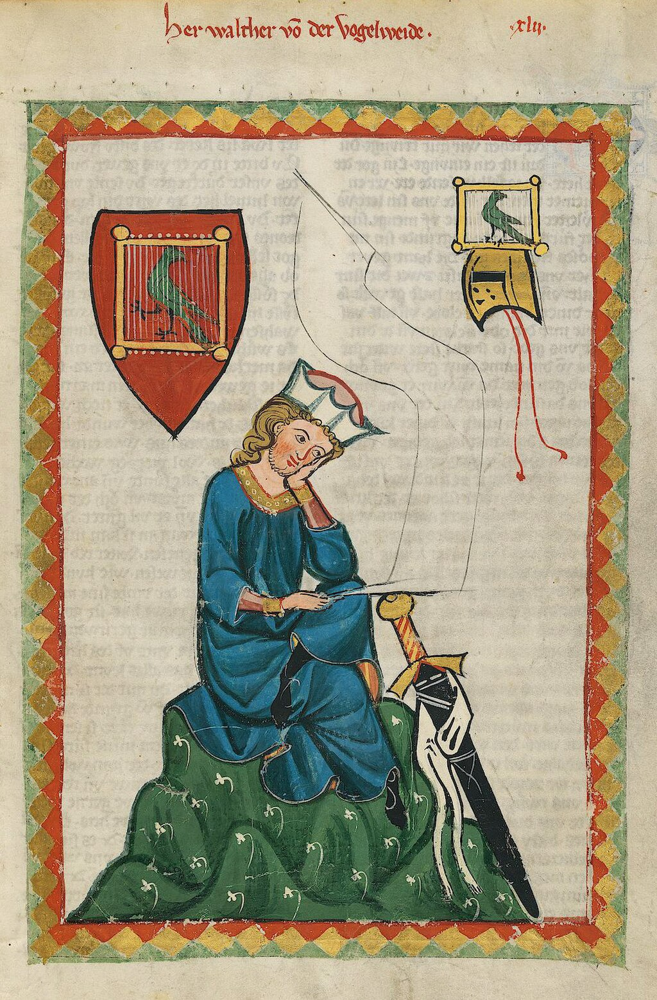Portrait of [Walther von der Vogelweide](https://en.wikipedia.org/wiki/Walther_von_der_Vogelweide "Walther von der Vogelweide")

The [Minnesänger](https://en.wikipedia.org/wiki/Minnesang "Minnesang") tradition was the [Germanic](https://en.wikipedia.org/wiki/Germany "Germany") counterpart to the activity of the troubadours and trouvères to the west. Unfortunately, few sources survive from the time; the sources of Minnesang are mostly from two or three centuries after the peak of the movement, leading to some controversy over the accuracy of these sources. Among the Minnesängers with surviving music are [Wolfram von Eschenbach](https://en.wikipedia.org/wiki/Wolfram_von_Eschenbach "Wolfram von Eschenbach"), [Walther von der Vogelweide](https://en.wikipedia.org/wiki/Walther_von_der_Vogelweide "Walther von der Vogelweide"), and [Niedhart von Reuenthal](https://en.wikipedia.org/wiki/Niedhart_von_Reuenthal "Niedhart von Reuenthal").

A [Meistersinger](https://en.wikipedia.org/wiki/Meistersinger "Meistersinger") (German for "master singer") was a member of a [German guild](https://en.wikipedia.org/wiki/German_guild "German guild") for [lyric poetry](https://en.wikipedia.org/wiki/Lyric_poetry "Lyric poetry"), [composition](https://en.wikipedia.org/wiki/Composer "Composer") and [unaccompanied](https://en.wikipedia.org/wiki/A_cappella "A cappella") [art song](https://en.wikipedia.org/wiki/Art_song "Art song") of the 14th, 15th and 16th centuries. The Meistersingers were drawn from middle class males for the most part. [Konrad von Würzburg](https://en.wikipedia.org/wiki/Konrad_von_Würzburg "Konrad von Würzburg"), [Reinmar von Zweter](https://en.wikipedia.org/wiki/Reinmar_von_Zweter "Reinmar von Zweter"), and [Heinrich Frauenlob](https://en.wikipedia.org/wiki/Heinrich_Frauenlob "Heinrich Frauenlob"). Frauenlob allegedly established the earliest Meistersinger school at [Mainz](https://en.wikipedia.org/wiki/Mainz "Mainz"), early in the 14th century. The schools originated first in the upper [Rhine](https://en.wikipedia.org/wiki/Rhine "Rhine") district, then spread elsewhere.

### Trovadorismo

In the Middle Ages, [Galician-Portuguese](https://en.wikipedia.org/wiki/Galician-Portuguese "Galician-Portuguese") was the language used in nearly all of Iberia for lyric poetry. From this language derive both modern [Galician](https://en.wikipedia.org/wiki/Galician_language "Galician language") and [Portuguese](https://en.wikipedia.org/wiki/Portuguese_language "Portuguese language"). The Galician-Portuguese school, which was influenced to some extent (mainly in certain formal aspects) by the Occitan troubadours, is first documented at the end of the twelfth century and lasted until the middle of the fourteenth.

The earliest extant composition in this school is usually agreed to be _Ora faz ost' o senhor de Navarra_ by the Portuguese [João Soares de Paiva](https://en.wikipedia.org/wiki/João_Soares_de_Paiva "João Soares de Paiva"), usually dated just before or after 1200. The troubadours of the movement, not to be confused with the [Occitan](https://en.wikipedia.org/wiki/Occitania "Occitania") [troubadours](https://en.wikipedia.org/wiki/Troubadour "Troubadour") (who frequented courts in nearby [León](https://en.wikipedia.org/wiki/Kingdom_of_León "Kingdom of León") and [Castile](https://en.wikipedia.org/wiki/Kingdom_of_Castile "Kingdom of Castile")), wrote almost entirely _[cantigas](https://en.wikipedia.org/wiki/Cantiga "Cantiga")_. Beginning probably around the middle of the thirteenth century, these songs, known also as _cantares_ or _trovas_, began to be compiled in collections known as _[cancioneiros](https://en.wikipedia.org/wiki/Chansonnier "Chansonnier")_ (songbooks). Three such anthologies are known: the [Cancioneiro da Ajuda](https://en.wikipedia.org/wiki/Cancioneiro_da_Ajuda "Cancioneiro da Ajuda"), the [Cancioneiro Colocci-Brancuti](https://en.wikipedia.org/wiki/Cancioneiro_Colocci-Brancuti "Cancioneiro Colocci-Brancuti") (or [Cancioneiro da Biblioteca Nacional](https://en.wikipedia.org/wiki/Cancioneiro_da_Biblioteca_Nacional "Cancioneiro da Biblioteca Nacional") de Lisboa), and the [Cancioneiro da Vaticana](https://en.wikipedia.org/wiki/Cancioneiro_da_Vaticana "Cancioneiro da Vaticana"). In addition to these there is the priceless collection of over 400 Galician-Portuguese _cantigas_ in the [Cantigas de Santa Maria](https://en.wikipedia.org/wiki/Cantigas_de_Santa_Maria "Cantigas de Santa Maria"), which tradition attributes to [Alfonso X](https://en.wikipedia.org/wiki/Alfonso_X_of_Castile "Alfonso X of Castile").

The Galician-Portuguese _cantigas_ can be divided into three basic genres: male-voiced love poetry, called [_cantigas de amor_](https://en.wikipedia.org/wiki/Cantiga_de_amor "Cantiga de amor") (or _cantigas d'amor_, in Galician-Portuguese spelling) female-voiced love poetry, called [_cantigas de amigo_](https://en.wikipedia.org/wiki/Cantiga_de_amigo "Cantiga de amigo") (or _cantigas d'amigo_); and poetry of insult and mockery called _[cantigas de escárnio e maldizer](https://en.wikipedia.org/wiki/Cantigas_de_escárnio_e_maldizer "Cantigas de escárnio e maldizer")_ (or _cantigas d'escarnho e de mal dizer_). All three are lyric genres in the technical sense that they were strophic songs with either musical accompaniment or introduction on a stringed instrument. But all three genres also have dramatic elements, leading early scholars to characterize them as lyric-dramatic.

The origins of the cantigas d'amor are usually traced to [Provençal](https://en.wikipedia.org/wiki/Provençal_dialect "Provençal dialect") and [Old French](https://en.wikipedia.org/wiki/Old_French "Old French") [lyric poetry](https://en.wikipedia.org/wiki/Lyric_poetry "Lyric poetry"), but formally and rhetorically they are quite different. The _cantigas d'amigo_ are probably rooted in a native song tradition, though this view has been contested. The _cantigas d'escarnho e maldizer_ may also (according to Lang) have deep local roots. The latter two genres (totalling around 900 texts) make the Galician-Portuguese lyric unique in the entire panorama of medieval Romance poetry.

#### Troubadours with surviving melodies

*   [Aimeric de Belenoi](https://en.wikipedia.org/wiki/Aimeric_de_Belenoi "Aimeric de Belenoi")
*   [Aimeric de Peguilhan](https://en.wikipedia.org/wiki/Aimeric_de_Peguilhan "Aimeric de Peguilhan")
*   [Airas Nunes](https://en.wikipedia.org/wiki/Airas_Nunes "Airas Nunes")
*   [Albertet de Sestaro](https://en.wikipedia.org/wiki/Albertet_de_Sestaro "Albertet de Sestaro")
*   [Arnaut Daniel](https://en.wikipedia.org/wiki/Arnaut_Daniel "Arnaut Daniel")
*   [Arnaut de Maruoill](https://en.wikipedia.org/wiki/Arnaut_de_Maruoill "Arnaut de Maruoill")
*   [Beatritz de Dia](https://en.wikipedia.org/wiki/Beatritz_de_Dia "Beatritz de Dia")
*   [Berenguier de Palazol](https://en.wikipedia.org/wiki/Berenguier_de_Palazol "Berenguier de Palazol")
*   [Bernart de Ventadorn](https://en.wikipedia.org/wiki/Bernart_de_Ventadorn "Bernart de Ventadorn")
*   [Bertran de Born](https://en.wikipedia.org/wiki/Bertran_de_Born "Bertran de Born")
*   [Blacasset](https://en.wikipedia.org/wiki/Blacasset "Blacasset")
*   [Cadenet](https://en.wikipedia.org/wiki/Cadenet_\(troubadour\) "Cadenet (troubadour)")

*   [Daude de Pradas](https://en.wikipedia.org/wiki/Daude_de_Pradas "Daude de Pradas")
*   [Denis of Portugal](https://en.wikipedia.org/wiki/Denis_of_Portugal "Denis of Portugal")
*   [Folquet de Marselha](https://en.wikipedia.org/wiki/Folquet_de_Marselha "Folquet de Marselha")
*   [Gaucelm Faidit](https://en.wikipedia.org/wiki/Gaucelm_Faidit "Gaucelm Faidit")
*   [Gui d'Ussel](https://en.wikipedia.org/wiki/Gui_d'Ussel "Gui d'Ussel")
*   [Guilhem Ademar](https://en.wikipedia.org/wiki/Guilhem_Ademar "Guilhem Ademar")
*   [Guilhem Augier Novella](https://en.wikipedia.org/wiki/Guilhem_Augier_Novella "Guilhem Augier Novella")
*   [Guilhem Magret](https://en.wikipedia.org/wiki/Guilhem_Magret "Guilhem Magret")
*   [Guilhem de Saint Leidier](https://en.wikipedia.org/wiki/Guilhem_de_Saint_Leidier "Guilhem de Saint Leidier")
*   [Guiraut de Bornelh](https://en.wikipedia.org/wiki/Guiraut_de_Bornelh "Guiraut de Bornelh")
*   [Guiraut d'Espanha](https://en.wikipedia.org/wiki/Guiraut_d'Espanha "Guiraut d'Espanha")

*   [Guiraut Riquier](https://en.wikipedia.org/wiki/Guiraut_Riquier "Guiraut Riquier")
*   [Jaufre Rudel](https://en.wikipedia.org/wiki/Jaufre_Rudel "Jaufre Rudel")
*   [João Soares de Paiva](https://en.wikipedia.org/wiki/João_Soares_de_Paiva "João Soares de Paiva")
*   [João Zorro](https://en.wikipedia.org/wiki/João_Zorro "João Zorro")
*   [Jordan Bonel](https://en.wikipedia.org/wiki/Jordan_Bonel "Jordan Bonel")
*   [Marcabru](https://en.wikipedia.org/wiki/Marcabru "Marcabru")
*   [Martín Codax](https://en.wikipedia.org/wiki/Martín_Codax "Martín Codax")
*   [Monge de Montaudon](https://en.wikipedia.org/wiki/Monge_de_Montaudon "Monge de Montaudon")
*   [Peire d'Alvernhe](https://en.wikipedia.org/wiki/Peire_d'Alvernhe "Peire d'Alvernhe")
*   [Peire Cardenal](https://en.wikipedia.org/wiki/Peire_Cardenal "Peire Cardenal")
*   [Peire Raimon de Tolosa](https://en.wikipedia.org/wiki/Peire_Raimon_de_Tolosa "Peire Raimon de Tolosa")
*   [Peire Vidal](https://en.wikipedia.org/wiki/Peire_Vidal "Peire Vidal")
*   [Peirol](https://en.wikipedia.org/wiki/Peirol "Peirol")
*   [Perdigon](https://en.wikipedia.org/wiki/Perdigon "Perdigon")

*   [Pistoleta](https://en.wikipedia.org/wiki/Pistoleta "Pistoleta")
*   [Pons d'Ortaffa](https://en.wikipedia.org/wiki/Pons_d'Ortaffa "Pons d'Ortaffa")
*   [Pons de Capduoill](https://en.wikipedia.org/wiki/Pons_de_Capduoill "Pons de Capduoill")
*   [Raimbaut d'Aurenga](https://en.wikipedia.org/wiki/Raimbaut_d'Aurenga "Raimbaut d'Aurenga")
*   [Raimbaut de Vaqueiras](https://en.wikipedia.org/wiki/Raimbaut_de_Vaqueiras "Raimbaut de Vaqueiras")
*   [Raimon Jordan](https://en.wikipedia.org/wiki/Raimon_Jordan "Raimon Jordan")
*   [Raimon de Miraval](https://en.wikipedia.org/wiki/Raimon_de_Miraval "Raimon de Miraval")
*   [Rigaut de Berbezilh](https://en.wikipedia.org/wiki/Rigaut_de_Berbezilh "Rigaut de Berbezilh")
*   [Uc Brunet](https://en.wikipedia.org/wiki/Uc_Brunet "Uc Brunet")
*   [Uc de Saint Circ](https://en.wikipedia.org/wiki/Uc_de_Saint_Circ "Uc de Saint Circ")
*   [William IX of Aquitaine](https://en.wikipedia.org/wiki/William_IX_of_Aquitaine "William IX of Aquitaine")

### Timeline of Composers of the high and late medieval era

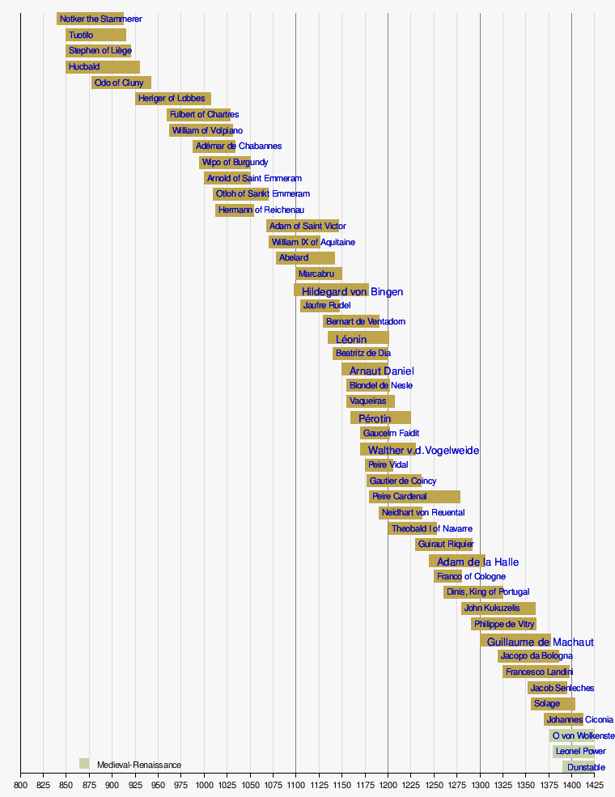

## Late medieval music (1300–1400)

### France: _Ars nova_

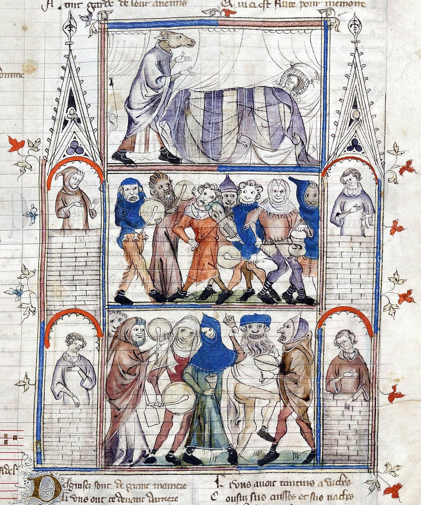In this illustration from the satirical collection of music and poetry _Roman de Fauvel_, the horse Fauvel is about to join Vainglory in the bridal bed and the people (dressed as [mummers](https://en.wikipedia.org/wiki/Mummers "Mummers")) form a [charivari](https://en.wikipedia.org/wiki/Charivari "Charivari") in protest.

The beginning of the _[Ars nova](https://en.wikipedia.org/wiki/Ars_nova "Ars nova")_ is one of the few clear chronological divisions in medieval music, since it corresponds to the publication of the _[Roman de Fauvel](https://en.wikipedia.org/wiki/Roman_de_Fauvel "Roman de Fauvel")_, a huge compilation of poetry and music, in 1310 and 1314. The _Roman de Fauvel_ is a satire on abuses in the medieval church, and is filled with medieval motets, [lais](https://en.wikipedia.org/wiki/Lai_\(poetic_form\) "Lai (poetic form)"), [rondeaux](https://en.wikipedia.org/wiki/Rondeau_\(music\) "Rondeau (music)") and other new secular forms. While most of the music is anonymous, it contains several pieces by [Philippe de Vitry](https://en.wikipedia.org/wiki/Philippe_de_Vitry "Philippe de Vitry"), one of the first composers of the [isorhythmic](https://en.wikipedia.org/wiki/Isorhythm "Isorhythm") motet, a development which distinguishes the fourteenth century. The isorhythmic motet was perfected by [Guillaume de Machaut](https://en.wikipedia.org/wiki/Guillaume_de_Machaut "Guillaume de Machaut"), the finest composer of the time.

During the _Ars nova_ era, secular music acquired a polyphonic sophistication formerly found only in sacred music, a development not surprising considering the secular character of the early Renaissance (while this music is typically considered "medieval", the social forces that produced it were responsible for the beginning of the literary and artistic Renaissance in Italy—the distinction between Middle Ages and Renaissance is a blurry one, especially considering arts as different as music and painting). The term "_Ars nova_" (new art, or new technique) was coined by Philippe de Vitry in his treatise of that name (probably written in 1322), in order to distinguish the practice from the music of the immediately preceding age.

The dominant secular genre of the Ars Nova was the _[chanson](https://en.wikipedia.org/wiki/Chanson "Chanson")_, as it would continue to be in France for another two centuries. These chansons were composed in musical forms corresponding to the poetry they set, which were in the so-called _[formes fixes](https://en.wikipedia.org/wiki/Formes_fixes "Formes fixes")_ of _rondeau_, _ballade_, and _virelai_. These forms significantly affected the development of musical structure in ways that are felt even today; for example, the _ouvert-clos_ rhyme-scheme shared by all three demanded a musical realization which contributed directly to the modern notion of antecedent and consequent phrases. It was in this period, too, in which began the long tradition of setting the mass ordinary. This tradition started around mid-century with isolated or paired settings of Kyries, Glorias, etc., but [Machaut](https://en.wikipedia.org/wiki/Guillaume_de_Machaut "Guillaume de Machaut") composed what is thought to be the first complete mass conceived as one composition. The sound world of Ars Nova music is very much one of linear primacy and rhythmic complexity. "Resting" intervals are the fifth and octave, with thirds and sixths considered dissonances. Leaps of more than a sixth in individual voices are not uncommon, leading to speculation of instrumental participation at least in secular performance. Surviving French manuscripts include the [Ivrea Codex](https://en.wikipedia.org/wiki/Ivrea_Codex "Ivrea Codex") and the Apt Codex.

For information about specific French composers writing in late medieval era, see [Jehan de Lescurel](https://en.wikipedia.org/wiki/Jehan_de_Lescurel "Jehan de Lescurel"), [Philippe de Vitry](https://en.wikipedia.org/wiki/Philippe_de_Vitry "Philippe de Vitry"), [Guillaume de Machaut](https://en.wikipedia.org/wiki/Guillaume_de_Machaut "Guillaume de Machaut"), [Borlet](https://en.wikipedia.org/wiki/Borlet "Borlet"), [Solage](https://en.wikipedia.org/wiki/Solage "Solage"), and [François Andrieu](https://en.wikipedia.org/wiki/Francois_Andrieu "Francois Andrieu").

### Italy: _Trecento_

Most of the music of _Ars nova_ was French in origin; however, the term is often loosely applied to all of the music of the fourteenth century, especially to include the secular music in Italy. There this period was often referred to as _[Trecento](https://en.wikipedia.org/wiki/Trecento "Trecento")_. Italian music has always been known for its lyrical or melodic character, and this goes back to the 14th century in many respects. Italian secular music of this time (what little surviving liturgical music there is, is similar to the French except for somewhat different notation) featured what has been called the _cantalina_ style, with a florid top voice supported by two (or even one; a fair amount of Italian Trecento music is for only two voices) that are more regular and slower moving. This type of texture remained a feature of Italian music in the popular 15th and 16th century secular genres as well, and was an important influence on the eventual development of the trio texture that revolutionized music in the 17th.

There were three main forms for secular works in the Trecento. One was the [madrigal](https://en.wikipedia.org/wiki/Trecento-Madrigal "Trecento-Madrigal"), not the same as that of 150–250 years later, but with a verse/refrain-like form. Three-line stanzas, each with different words, alternated with a two-line _[ritornello](https://en.wikipedia.org/wiki/Ritornello "Ritornello")_, with the same text at each appearance. Perhaps we can see the seeds of the subsequent late-Renaissance and Baroque ritornello in this device; it too returns again and again, recognizable each time, in contrast with its surrounding disparate sections. Another form, the _caccia_ ("chase,") was written for two voices in a canon at the unison. Sometimes, this form also featured a ritornello, which was occasionally also in a canonic style. Usually, the name of this genre provided a double meaning, since the texts of _caccia_ were primarily about hunts and related outdoor activities, or at least action-filled scenes; second meaning was that a voice _caccia_ (follows, run after) the preceding one. The third main form was the _ballata_, which was roughly equivalent to the French _virelai_.

Surviving Italian manuscripts include the [Squarcialupi Codex](https://en.wikipedia.org/wiki/Squarcialupi_Codex "Squarcialupi Codex") and the [Rossi Codex](https://en.wikipedia.org/wiki/Rossi_Codex "Rossi Codex"). For information about specific Italian composers writing in the late medieval era, see [Francesco Landini](https://en.wikipedia.org/wiki/Francesco_Landini "Francesco Landini"), [Gherardello da Firenze](https://en.wikipedia.org/wiki/Gherardello_da_Firenze "Gherardello da Firenze"), [Andrea da Firenze](https://en.wikipedia.org/wiki/Andrea_da_Firenze "Andrea da Firenze"), [Lorenzo da Firenze](https://en.wikipedia.org/wiki/Lorenzo_da_Firenze "Lorenzo da Firenze"), [Giovanni da Firenze](https://en.wikipedia.org/wiki/Giovanni_da_Firenze "Giovanni da Firenze") (aka Giovanni da Cascia), [Bartolino da Padova](https://en.wikipedia.org/wiki/Bartolino_da_Padova "Bartolino da Padova"), [Jacopo da Bologna](https://en.wikipedia.org/wiki/Jacopo_da_Bologna "Jacopo da Bologna"), [Donato da Cascia](https://en.wikipedia.org/wiki/Donato_da_Cascia "Donato da Cascia"), [Lorenzo Masini](https://en.wikipedia.org/wiki/Lorenzo_Masini "Lorenzo Masini"), [Niccolò da Perugia](https://en.wikipedia.org/wiki/Niccolò_da_Perugia "Niccolò da Perugia"), and [Maestro Piero](https://en.wikipedia.org/wiki/Maestro_Piero "Maestro Piero").

### Germany: _Geisslerlieder_

The [Geisslerlieder](https://en.wikipedia.org/wiki/Geisslerlieder "Geisslerlieder") were the songs of wandering bands of [flagellants](https://en.wikipedia.org/wiki/Flagellant "Flagellant"), who sought to appease the wrath of an angry God by penitential music accompanied by mortification of their bodies. There were two separate periods of activity of Geisslerlied: one around the middle of the thirteenth century, from which, unfortunately, no music survives (although numerous lyrics do); and another from 1349, for which both words and music survive intact due to the attention of a single priest who wrote about the movement and recorded its music. This second period corresponds to the spread of the [Black Death](https://en.wikipedia.org/wiki/Black_Death "Black Death") in Europe, and documents one of the most terrible events in European history. Both periods of Geisslerlied activity were mainly in Germany.

### _Ars subtilior_

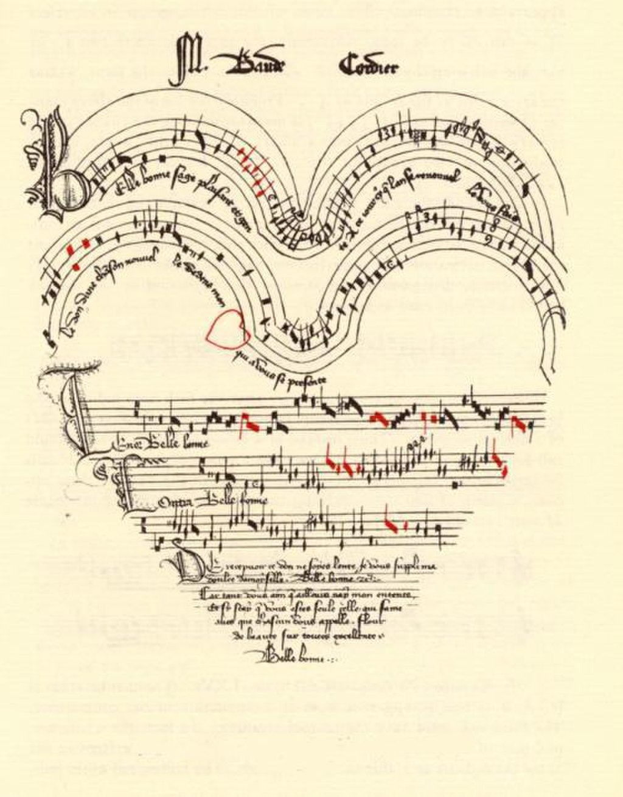The chanson _Belle, bonne, sage_ by [Baude Cordier](https://en.wikipedia.org/wiki/Baude_Cordier "Baude Cordier"), an _Ars subtilior_ piece included in the [Chantilly Codex](https://en.wikipedia.org/wiki/Chantilly_Codex "Chantilly Codex")

As often seen at the end of any musical era, the end of the medieval era is marked by a highly manneristic style known as _[Ars subtilior](https://en.wikipedia.org/wiki/Ars_subtilior "Ars subtilior")_. In some ways, this was an attempt to meld the French and Italian styles. This music was highly stylized, with a rhythmic complexity that was not matched until the 20th century. In fact, not only was the rhythmic complexity of this repertoire largely unmatched for five and a half centuries, with extreme syncopations, mensural trickery, and even examples of _augenmusik_ (such as a chanson by [Baude Cordier](https://en.wikipedia.org/wiki/Baude_Cordier "Baude Cordier") written out in manuscript in the shape of a heart), but also its melodic material was quite complex as well, particularly in its interaction with the rhythmic structures. Already discussed under Ars Nova has been the practice of isorhythm, which continued to develop through late-century and in fact did not achieve its highest degree of sophistication until early in the 15th century. Instead of using isorhythmic techniques in one or two voices, or trading them among voices, some works came to feature a pervading isorhythmic texture which rivals the integral serialism of the 20th century in its systematic ordering of rhythmic and tonal elements. The term "mannerism" was applied by later scholars, as it often is, in response to an impression of sophistication being practised for its own sake, a malady which some authors have felt infected the _Ars subtilior_.

One of the most important extant sources of Ars Subtilior chansons is the [Chantilly Codex](https://en.wikipedia.org/wiki/Chantilly_Codex "Chantilly Codex"). For information about specific composers writing music in _[Ars subtilior](https://en.wikipedia.org/wiki/Ars_subtilior "Ars subtilior")_ style, see [Anthonello de Caserta](https://en.wikipedia.org/wiki/Anthonello_de_Caserta "Anthonello de Caserta"), [Philippus de Caserta](https://en.wikipedia.org/wiki/Philippus_de_Caserta "Philippus de Caserta") (aka Philipoctus de Caserta), [Johannes Ciconia](https://en.wikipedia.org/wiki/Johannes_Ciconia "Johannes Ciconia"), [Matteo da Perugia](https://en.wikipedia.org/wiki/Matteo_da_Perugia "Matteo da Perugia"), [Lorenzo da Firenze](https://en.wikipedia.org/wiki/Lorenzo_da_Firenze "Lorenzo da Firenze"), [Grimace](https://en.wikipedia.org/wiki/Grimace_\(composer\) "Grimace (composer)"), [Jacob Senleches](https://en.wikipedia.org/wiki/Jacob_Senleches "Jacob Senleches"), and [Baude Cordier](https://en.wikipedia.org/wiki/Baude_Cordier "Baude Cordier").

### Transitioning to the Renaissance

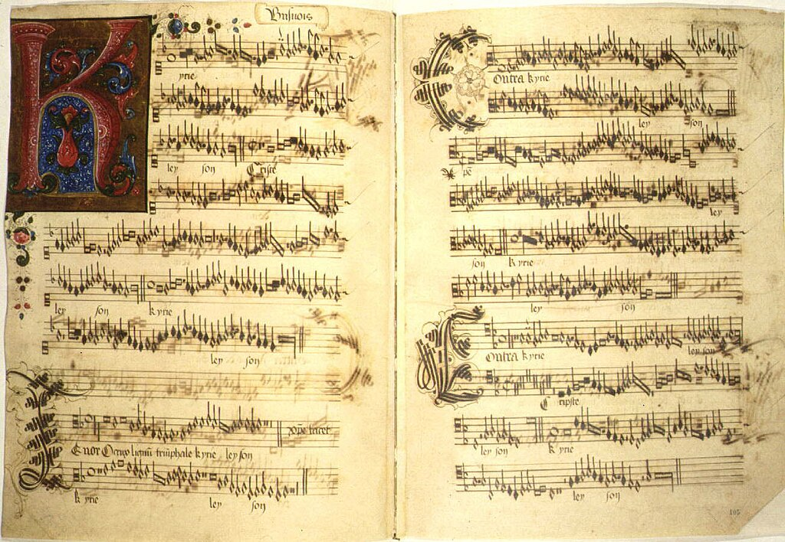 Manuscript of the Mass _Missa O Crux Lignum_ by [Antoine Busnois](https://en.wikipedia.org/wiki/Antoine_Busnois "Antoine Busnois") (ca. 1450)

Demarcating the end of the medieval era and the beginning of the [Renaissance era](/source/renaissance-music/ "Renaissance music"), with regard to the composition of music, is difficult. While the music of the fourteenth century is fairly obviously medieval in conception, the music of the early fifteenth century is often conceived as belonging to a transitional period, not only retaining some of the ideals of the end of the Middle Ages (such as a type of polyphonic writing in which the parts differ widely from each other in character, as each has its specific textural function), but also showing some of the characteristic traits of the Renaissance (such as the increasingly international style developing through the diffusion of Franco-Flemish musicians throughout Europe, and in terms of texture an increasing equality of parts). Music historians do not agree on when the Renaissance era began, but most historians agree that England was still a medieval society in the early fifteenth century (see [periodization issues](https://en.wikipedia.org/wiki/Middle_Ages#Periodization_issues "Middle Ages") of the Middle Ages). While there is no consensus, 1400 is a useful marker, because it was around that time that the Renaissance came into full swing in Italy.

The increasing reliance on the interval of the third as a consonance is one of the most pronounced features of transition into the Renaissance. Polyphony, in use since the 12th century, became increasingly elaborate with highly independent voices throughout the 14th century. With [John Dunstaple](https://en.wikipedia.org/wiki/John_Dunstaple "John Dunstaple") and other English composers, partly through the local technique of [faburden](https://en.wikipedia.org/wiki/Fauxbourdon "Fauxbourdon") (an improvisatory process in which a chant melody and a written part predominantly in parallel sixths above it are ornamented by one sung in perfect fourths below the latter, and which later took hold on the continent as "fauxbordon"), the interval of the third emerges as an important musical development; because of this _[Contenance Angloise](https://en.wikipedia.org/wiki/Contenance_Angloise "Contenance Angloise")_ ("English countenance"), English composers' music is often regarded as the first to sound less truly bizarre to 2000s-era audiences who are not trained in music history.

English stylistic tendencies in this regard had come to fruition and began to influence continental composers as early as the 1420s, as can be seen in works of the young [Dufay](https://en.wikipedia.org/wiki/Guillaume_Dufay "Guillaume Dufay"), among others. While the [Hundred Years' War](https://en.wikipedia.org/wiki/Hundred_Years'_War "Hundred Years' War") continued, English nobles, armies, their chapels and retinues, and therefore some of their composers, travelled in France and performed their music there; it must also of course be remembered that the English controlled portions of northern France at this time. English manuscripts include the [Worcester Fragments](https://en.wikipedia.org/wiki/Worcester_Fragments "Worcester Fragments"), the Old St. Andrews Music Book, the [Old Hall Manuscript](https://en.wikipedia.org/wiki/Old_Hall_Manuscript "Old Hall Manuscript"), and Egerton Manuscript. For information about specific composers who are considered transitional between the medieval and the Renaissance, see [Zacara da Teramo](https://en.wikipedia.org/wiki/Zacara_da_Teramo "Zacara da Teramo"), [Paolo da Firenze](https://en.wikipedia.org/wiki/Paolo_da_Firenze "Paolo da Firenze"), [Giovanni Mazzuoli](https://en.wikipedia.org/wiki/Giovanni_Mazzuoli "Giovanni Mazzuoli"), [Antonio da Cividale](https://en.wikipedia.org/wiki/Antonio_da_Cividale "Antonio da Cividale"), [Antonius Romanus](https://en.wikipedia.org/wiki/Antonius_Romanus "Antonius Romanus"), [Bartolomeo da Bologna](https://en.wikipedia.org/wiki/Bartolomeo_da_Bologna "Bartolomeo da Bologna"), [Roy Henry](https://en.wikipedia.org/wiki/Roy_Henry "Roy Henry"), [Arnold de Lantins](https://en.wikipedia.org/wiki/Arnold_de_Lantins "Arnold de Lantins"), [Leonel Power](https://en.wikipedia.org/wiki/Leonel_Power "Leonel Power"), and [John Dunstaple](https://en.wikipedia.org/wiki/John_Dunstaple "John Dunstaple").

An early composer from the [Franco-Flemish School](https://en.wikipedia.org/wiki/Franco-Flemish_School "Franco-Flemish School") of the [Renaissance](/source/renaissance-music/ "Renaissance music") was [Johannes Ockeghem](https://en.wikipedia.org/wiki/Johannes_Ockeghem "Johannes Ockeghem") (1410/1425 –1497). He was the most famous member of the Franco-Flemish School in the last half of the 15th century, and is often considered the most influential composer between [Dufay](https://en.wikipedia.org/wiki/Guillaume_Dufay "Guillaume Dufay") and [Josquin des Prez](https://en.wikipedia.org/wiki/Josquin_des_Prez "Josquin des Prez"). Ockeghem probably studied with [Gilles Binchois](https://en.wikipedia.org/wiki/Gilles_Binchois "Gilles Binchois"), and at least was closely associated with him at the Burgundian court. [Antoine Busnois](https://en.wikipedia.org/wiki/Antoine_Busnois "Antoine Busnois") wrote a motet in honor of Ockeghem. Ockeghem is a direct link from the Burgundian style to the next generation of Netherlanders, such as [Obrecht](https://en.wikipedia.org/wiki/Jacob_Obrecht "Jacob Obrecht") and Josquin. A strong influence on [Josquin des Prez](https://en.wikipedia.org/wiki/Josquin_des_Prez "Josquin des Prez") and the subsequent generation of Netherlanders, Ockeghem was famous throughout Europe [Charles VII](https://en.wikipedia.org/wiki/Charles_VII_of_France "Charles VII of France") for his expressive music, although he was equally renowned for his technical prowess.

## Influence

The musical style of [Pérotin](https://en.wikipedia.org/wiki/Pérotin "Pérotin") influenced 20th-century composers such as [John Luther Adams](https://en.wikipedia.org/wiki/John_Luther_Adams "John Luther Adams") and [minimalist](https://en.wikipedia.org/wiki/Minimal_music "Minimal music") composer [Steve Reich](https://en.wikipedia.org/wiki/Steve_Reich "Steve Reich").
