Moss

Temporal range: [Carboniferous](https://en.wikipedia.org/wiki/Carboniferous "Carboniferous")–[present](https://en.wikipedia.org/wiki/Holocene "Holocene") (Possible Cambrian records)

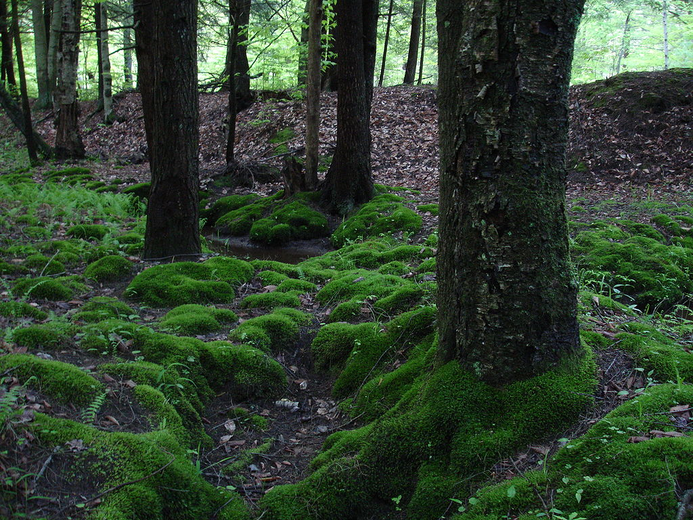

Clumps of moss on the ground and base of trees in the [Allegheny National Forest](https://en.wikipedia.org/wiki/Allegheny_National_Forest "Allegheny National Forest"), Pennsylvania, United States

[Scientific classification](https://en.wikipedia.org/wiki/Taxonomy_\(biology\) "Taxonomy (biology)") 

Kingdom:

[Plantae](https://en.wikipedia.org/wiki/Plant "Plant")

_Clade_:

[Embryophytes](https://en.wikipedia.org/wiki/Embryophyte "Embryophyte")

_Clade_:

[Setaphyta](https://en.wikipedia.org/wiki/Setaphyta "Setaphyta")

Division:

[Bryophyta](/source/moss/)
[Schimp.](https://en.wikipedia.org/wiki/Schimp. "Schimp.") [sensu stricto](https://en.wikipedia.org/wiki/Sensu_stricto "Sensu stricto")

Classes

*   [Takakiopsida](https://en.wikipedia.org/wiki/Takakiopsida "Takakiopsida")
*   [Sphagnopsida](https://en.wikipedia.org/wiki/Sphagnopsida "Sphagnopsida")
*   [Andreaeopsida](https://en.wikipedia.org/wiki/Andreaeopsida "Andreaeopsida")
*   [Andreaeobryopsida](https://en.wikipedia.org/wiki/Andreaeobryopsida "Andreaeobryopsida")
*   [Oedipodiopsida](https://en.wikipedia.org/wiki/Oedipodiopsida "Oedipodiopsida")
*   [Polytrichopsida](https://en.wikipedia.org/wiki/Polytrichopsida "Polytrichopsida")
*   [Tetraphidopsida](https://en.wikipedia.org/wiki/Tetraphidopsida "Tetraphidopsida")
*   [Bryopsida](https://en.wikipedia.org/wiki/Bryopsida "Bryopsida")

[Synonyms](https://en.wikipedia.org/wiki/Synonym_\(taxonomy\) "Synonym (taxonomy)")

*   Musci L.
*   Muscineae Bisch.

**Mosses** are small, [non-vascular](https://en.wikipedia.org/wiki/Non-vascular_plant "Non-vascular plant") [flowerless](https://en.wikipedia.org/wiki/Flower "Flower") [plants](https://en.wikipedia.org/wiki/Plant "Plant") in the taxonomic [division](https://en.wikipedia.org/wiki/Phylum "Phylum") **Bryophyta** ([/braɪˈɒfətə/](https://en.wikipedia.org/wiki/Help:IPA/English "Help:IPA/English"), [/ˌbraɪ.əˈfaɪtə/](https://en.wikipedia.org/wiki/Help:IPA/English "Help:IPA/English")) _[sensu stricto](https://en.wikipedia.org/wiki/Sensu_stricto "Sensu stricto")_. Bryophyta (_[sensu lato](https://en.wikipedia.org/wiki/Sensu_lato "Sensu lato")_, [Schimp](https://en.wikipedia.org/wiki/Wilhelm_Philippe_Schimper "Wilhelm Philippe Schimper"). 1879) may also refer to the parent group [bryophytes](https://en.wikipedia.org/wiki/Bryophyte "Bryophyte"), which comprise [liverworts](https://en.wikipedia.org/wiki/Marchantiophyta "Marchantiophyta"), mosses, and [hornworts](https://en.wikipedia.org/wiki/Hornwort "Hornwort"). Mosses typically form dense green clumps or mats, often in damp or shady locations. The individual plants are usually composed of simple [leaves](https://en.wikipedia.org/wiki/Leaf "Leaf") that are generally only one cell thick, attached to a [stem](https://en.wikipedia.org/wiki/Plant_stem "Plant stem") that may be branched or unbranched and has only a limited role in conducting water and nutrients. Although some species have conducting tissues, these are generally poorly developed and structurally different from similar tissue found in [vascular plants](https://en.wikipedia.org/wiki/Vascular_plants "Vascular plants"). Mosses do not have [seeds](https://en.wikipedia.org/wiki/Seed "Seed") and after fertilisation develop [sporophytes](https://en.wikipedia.org/wiki/Sporophyte "Sporophyte") with unbranched stalks topped with single capsules containing [spores](https://en.wikipedia.org/wiki/Sporangium "Sporangium"). They are typically 0.2–10 cm (0.1–3.9 in) tall, though some species are much larger. [_Dawsonia superba_](https://en.wikipedia.org/wiki/Dawsonia_superba "Dawsonia superba"), the tallest moss in the world, can grow to 60 cm (24 in) in height. There are approximately 12,000 species.

Mosses are commonly confused with liverworts, hornworts and [lichens](/source/lichen/ "Lichen"). Although often described as [non-vascular plants](https://en.wikipedia.org/wiki/Non-vascular_plants "Non-vascular plants"), many mosses have advanced vascular systems. Like liverworts and hornworts, the [haploid](https://en.wikipedia.org/wiki/Haploid "Haploid") [gametophyte](https://en.wikipedia.org/wiki/Gametophyte "Gametophyte") generation of mosses is the dominant phase of the [life cycle](https://en.wikipedia.org/wiki/Biological_life_cycle "Biological life cycle"). This contrasts with the pattern in all vascular plants ([seed plants](https://en.wikipedia.org/wiki/Seed_plants "Seed plants") and [pteridophytes](https://en.wikipedia.org/wiki/Pteridophytes "Pteridophytes")), where the [diploid](https://en.wikipedia.org/wiki/Ploidy#Diploid "Ploidy") sporophyte generation is dominant. Lichens may superficially resemble mosses, and sometimes have common names that include the word "moss" (e.g., "[reindeer moss](https://en.wikipedia.org/wiki/Reindeer_moss "Reindeer moss")" or "[Iceland moss](https://en.wikipedia.org/wiki/Iceland_moss "Iceland moss")"), but they are fungal symbioses and not related to mosses.

The main commercial significance of mosses is as the main constituent of [peat](https://en.wikipedia.org/wiki/Peat "Peat") (mostly the genus _[Sphagnum](https://en.wikipedia.org/wiki/Sphagnum "Sphagnum")_), although they are also used for decorative purposes, such as in gardens and in the [florist](https://en.wikipedia.org/wiki/Florist "Florist") trade. Traditional uses of mosses included as insulation and for the ability to absorb liquids up to 20 times their weight. Mosses are [keystone species](https://en.wikipedia.org/wiki/Keystone_species "Keystone species") and benefit [habitat restoration](https://en.wikipedia.org/wiki/Habitat_restoration "Habitat restoration") and [reforestation](https://en.wikipedia.org/wiki/Reforestation "Reforestation"). Mosses absorb 6.4 billion tons of carbon annually and provide various other environmental benefits, including controlling pathogens dangerous for humans, stopping [land erosion](https://en.wikipedia.org/wiki/Land_erosion "Land erosion"), improving [microclimate](https://en.wikipedia.org/wiki/Microclimate "Microclimate"), filtering air pollution, and cooling cities.

## Physical characteristics

### Description

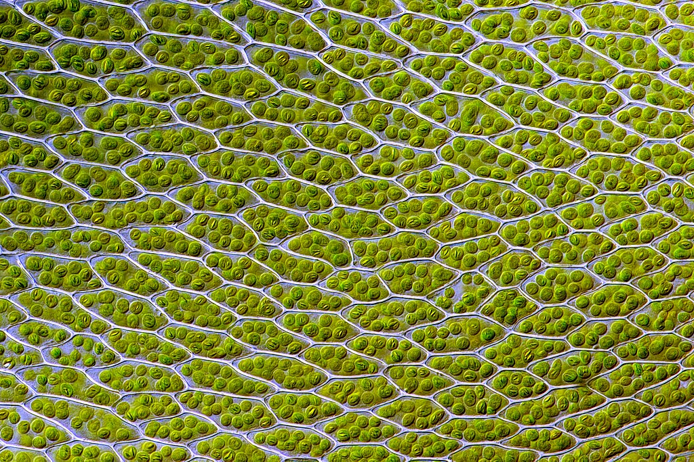[Chloroplasts](https://en.wikipedia.org/wiki/Chloroplast "Chloroplast") (green discs) and accumulated starch granules in cells of _[Rosulabryum capillare](https://en.wikipedia.org/wiki/Rosulabryum_capillare "Rosulabryum capillare")_

Botanically, mosses are [non-vascular plants](https://en.wikipedia.org/wiki/Non-vascular_plant "Non-vascular plant") in the land plant division Bryophyta. They are usually small (a few centimeters tall) [herbaceous](https://en.wikipedia.org/wiki/Herbaceous_plant "Herbaceous plant") (non-woody) plants that absorb water and nutrients mainly through their leaves and harvest [carbon dioxide](https://en.wikipedia.org/wiki/Carbon_dioxide "Carbon dioxide") and sunlight to create food by [photosynthesis](https://en.wikipedia.org/wiki/Photosynthesis "Photosynthesis"). With the exception of the ancient group [Takakiopsida](https://en.wikipedia.org/wiki/Takakia "Takakia"), no known mosses form [mycorrhizae](https://en.wikipedia.org/wiki/Mycorrhizae "Mycorrhizae"), but bryophilous fungi are widespread among mosses and other bryophytes, where they live as saprotrophs, parasites, pathogens and mutualists, some of them [endophytes](https://en.wikipedia.org/wiki/Endophyte "Endophyte"). Mosses differ from [vascular plants](https://en.wikipedia.org/wiki/Vascular_plants "Vascular plants") in lacking water-bearing [xylem](https://en.wikipedia.org/wiki/Xylem "Xylem") [tracheids](https://en.wikipedia.org/wiki/Tracheids "Tracheids") or [vessels](https://en.wikipedia.org/wiki/Vessel_elements "Vessel elements"). As in [liverworts](https://en.wikipedia.org/wiki/Marchantiophyta "Marchantiophyta") and [hornworts](https://en.wikipedia.org/wiki/Hornwort "Hornwort"), the [haploid](https://en.wikipedia.org/wiki/Haploid "Haploid") [gametophyte](https://en.wikipedia.org/wiki/Gametophyte "Gametophyte") generation is the dominant phase of the [life cycle](https://en.wikipedia.org/wiki/Biological_life_cycle "Biological life cycle"). This contrasts with the pattern in vascular plants ([seed plants](https://en.wikipedia.org/wiki/Seed_plants "Seed plants") and [pteridophytes](https://en.wikipedia.org/wiki/Pteridophytes "Pteridophytes")), where the [diploid](https://en.wikipedia.org/wiki/Haploid "Haploid") [sporophyte](https://en.wikipedia.org/wiki/Sporophyte "Sporophyte") generation is dominant. Mosses reproduce using [spores](https://en.wikipedia.org/wiki/Spore "Spore"), not [seeds](https://en.wikipedia.org/wiki/Seed "Seed"), and have no flowers.

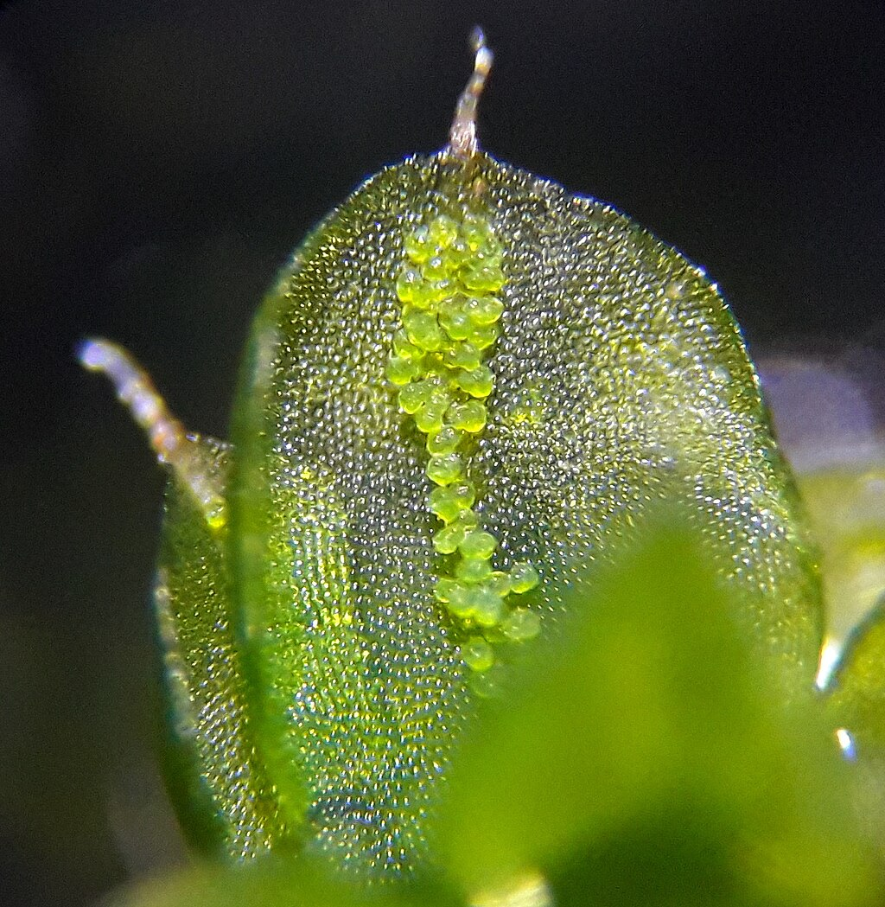Moss leaf under microscope, showing [gemmae](https://en.wikipedia.org/wiki/Gemma_\(botany\) "Gemma (botany)") and a hair point (40x)

Moss gametophytes have stems which may be simple or branched and upright (acrocarp) or prostrate (pleurocarp). The early divergent classes Takakiopsida, Sphagnopsida, Andreaeopsida and Andreaeobryopsida either lack [stomata](https://en.wikipedia.org/wiki/Stoma "Stoma") or have pseudostomata that do not form pores. In the remaining classes, stomata have been lost more than 60 times. Their leaves are simple, usually only a single layer of cells with no internal air spaces, often with thicker midribs (nerves). The nerve can run beyond the edge of the leaf tip, termed excurrent. The tip of the leaf blade can be extended as a hair point, made of colourless cells. These appear white against the dark green of the leaves. The edge of the leaf can be smooth or it may have teeth. There may be a distinct type of cell defining the edge of the leaf, differing in shape and/or colour from the other leaf cells.

Mosses have threadlike [rhizoids](https://en.wikipedia.org/wiki/Rhizoids "Rhizoids") that anchor them to their substrate, comparable to [root hairs](https://en.wikipedia.org/wiki/Root_hairs "Root hairs") rather than the more substantial [root](https://en.wikipedia.org/wiki/Root "Root") structures of [spermatophytes](https://en.wikipedia.org/wiki/Spermatophytes "Spermatophytes"). Mosses are known to absorb water through their rhizoids, and some species may also take up nutrients this way. They can be distinguished from [liverworts](https://en.wikipedia.org/wiki/Marchantiophyta "Marchantiophyta") ([Marchantiophyta](https://en.wikipedia.org/wiki/Marchantiophyta "Marchantiophyta") or Hepaticae) by their multi-cellular rhizoids. Spore-bearing capsules or [sporangia](https://en.wikipedia.org/wiki/Sporangium "Sporangium") of mosses are borne singly on long, unbranched stems, distinguishing them from the [polysporangiophytes](https://en.wikipedia.org/wiki/Polysporangiophytes "Polysporangiophytes"), which include all vascular plants. The spore-producing sporophytes (i.e. the [diploid](https://en.wikipedia.org/wiki/Diploid "Diploid") multicellular generation) are usually capable of photosynthesis, but are short-lived and dependent on the gametophyte for water supply and most or all of their nutrients. Also, in the majority of mosses, the spore-bearing capsule enlarges and matures after its stalk elongates, while in liverworts the capsule enlarges and matures before its stalk elongates. Other differences are not universal for all mosses and all liverworts, but the presence of a clearly differentiated stem with simple-shaped, non-vascular leaves that are not arranged in three ranks, all point to the plant being a moss.

### Life cycle

Vascular [plants](https://en.wikipedia.org/wiki/Plant "Plant") have two sets of [chromosomes](https://en.wikipedia.org/wiki/Chromosome "Chromosome") in their vegetative cells and are said to be [diploid](https://en.wikipedia.org/wiki/Diploid "Diploid"), i.e. each chromosome has a partner that contains the same, or similar, genetic information. By contrast, mosses and other [bryophytes](https://en.wikipedia.org/wiki/Bryophyte "Bryophyte") have only a single set of chromosomes and so are [haploid](https://en.wikipedia.org/wiki/Haploid "Haploid") (i.e. each chromosome exists in a unique copy within the cell). There is a period in the moss life cycle when they do have a double set of paired chromosomes, but this happens only during the [sporophyte](https://en.wikipedia.org/wiki/Sporophyte "Sporophyte") stage.

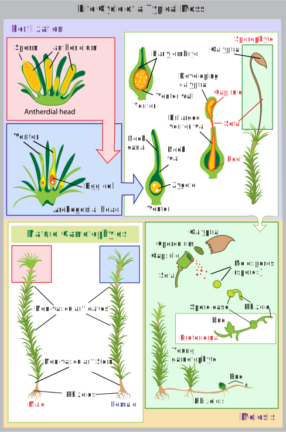Life cycle of a typical moss (_[Polytrichum commune](https://en.wikipedia.org/wiki/Polytrichum_commune "Polytrichum commune")_)

The moss life-cycle starts with a haploid [spore](https://en.wikipedia.org/wiki/Spore "Spore") that germinates to produce a [protonema](https://en.wikipedia.org/wiki/Protonema "Protonema") (_pl._ protonemata), which is either a mass of thread-like filaments or thalloid (flat and thallus-like). Massed moss protonemata typically look like a thin green felt, and may grow on damp soil, tree bark, rocks, concrete, or almost any other reasonably stable surface. This is a transitory stage in the life of a moss, but from the protonema grows the [gametophore](https://en.wikipedia.org/wiki/Gametophore "Gametophore") ("gamete-bearer") that is structurally differentiated into stems and leaves. A single mat of protonemata may develop several gametophore shoots, resulting in a clump of moss.

From the tips of the gametophore stems or branches develop the sex organs of the mosses. The female organs are known as [archegonia](https://en.wikipedia.org/wiki/Archegonia "Archegonia") (_sing._ [archegonium](https://en.wikipedia.org/wiki/Archegonium "Archegonium")) and are protected by a group of modified leaves known as the perichaetum (plural, perichaeta). The archegonia are small flask-shaped clumps of cells with an open neck (venter) down which the male sperm swim. The male organs are known as [antheridia](https://en.wikipedia.org/wiki/Antheridia "Antheridia") (_sing._ [antheridium](https://en.wikipedia.org/wiki/Antheridium "Antheridium")) and are enclosed by modified leaves called the perigonium (_pl._ perigonia). The surrounding leaves in some mosses form a splash cup, allowing the sperm contained in the cup to be splashed to neighboring stalks by falling water droplets.

Gametophore tip growth is disrupted by fungal [chitin](https://en.wikipedia.org/wiki/Chitin "Chitin"). Galotto _et al._, 2020 applied chitooctaose and found that tips detected and responded to this chitin derivative by changing [gene expression](https://en.wikipedia.org/wiki/Gene_expression "Gene expression"). They concluded that this defense response was probably [conserved](https://en.wikipedia.org/wiki/Conserved_sequence "Conserved sequence") from the [most recent common ancestor](https://en.wikipedia.org/wiki/Most_recent_common_ancestor "Most recent common ancestor") of [bryophytes](https://en.wikipedia.org/wiki/Bryophyte "Bryophyte") and [tracheophytes](https://en.wikipedia.org/wiki/Tracheophytes "Tracheophytes"). Orr _et al._, 2020 found that the [microtubules](https://en.wikipedia.org/wiki/Microtubule "Microtubule") of growing tip cells were structurally similar to [F-actin](https://en.wikipedia.org/wiki/F-actin "F-actin") and served a similar purpose.

Mosses can be either [dioicous](https://en.wikipedia.org/wiki/Dioicous "Dioicous") (compare [dioecious](https://en.wikipedia.org/wiki/Dioecious "Dioecious") in seed plants) or [monoicous](https://en.wikipedia.org/wiki/Monoicous "Monoicous") (compare [monoecious](https://en.wikipedia.org/wiki/Monoecious "Monoecious")). In dioicous mosses, male and female sex organs are borne on different gametophyte plants. In monoicous (also called autoicous) mosses, both are borne on the same plant. In the presence of water, sperm from the antheridia swim to the archegonia and [fertilisation](https://en.wikipedia.org/wiki/Fertilisation "Fertilisation") occurs, leading to the production of a diploid sporophyte. The sperm of mosses is biflagellate, i.e. they have two flagellae that aid in propulsion. Since the sperm must swim to the archegonium, fertilisation cannot occur without water. Some species (for example _Mnium hornum_ or several species of _Polytrichum_) keep their antheridia in so called 'splash cups', bowl-like structures on the shoot tips that propel the sperm several decimeters when water droplets hit it, increasing the fertilization distance.

After fertilisation, the immature sporophyte pushes its way out of the archegonial venter. It takes several months for the [sporophyte](https://en.wikipedia.org/wiki/Sporophyte "Sporophyte") to mature. The sporophyte body comprises a long stalk, called a seta, and a capsule capped by a cap called the [operculum](https://en.wikipedia.org/wiki/Operculum_\(Botany\) "Operculum (Botany)"). The capsule and operculum are in turn sheathed by a haploid calyptra which is the remains of the archegonial venter. The calyptra usually falls off when the capsule is mature. Within the capsule, spore-producing cells undergo [meiosis](https://en.wikipedia.org/wiki/Meiosis "Meiosis") to form haploid spores, upon which the cycle can start again. The mouth of the capsule is usually ringed by a set of teeth called peristome. This may be absent in some mosses.

Most mosses rely on the wind to disperse the spores. In the [genus](https://en.wikipedia.org/wiki/Genus "Genus") _[Sphagnum](https://en.wikipedia.org/wiki/Sphagnum "Sphagnum")_ the [spores are projected](https://en.wikipedia.org/wiki/Sphagnum#Spore_dispersal "Sphagnum") about 10–20 cm (4–8 in) off the ground by compressed air contained in the capsules; the spores are accelerated to about 36,000 times the [earth's gravitational acceleration _g_](https://en.wikipedia.org/wiki/Gravity_of_Earth "Gravity of Earth").

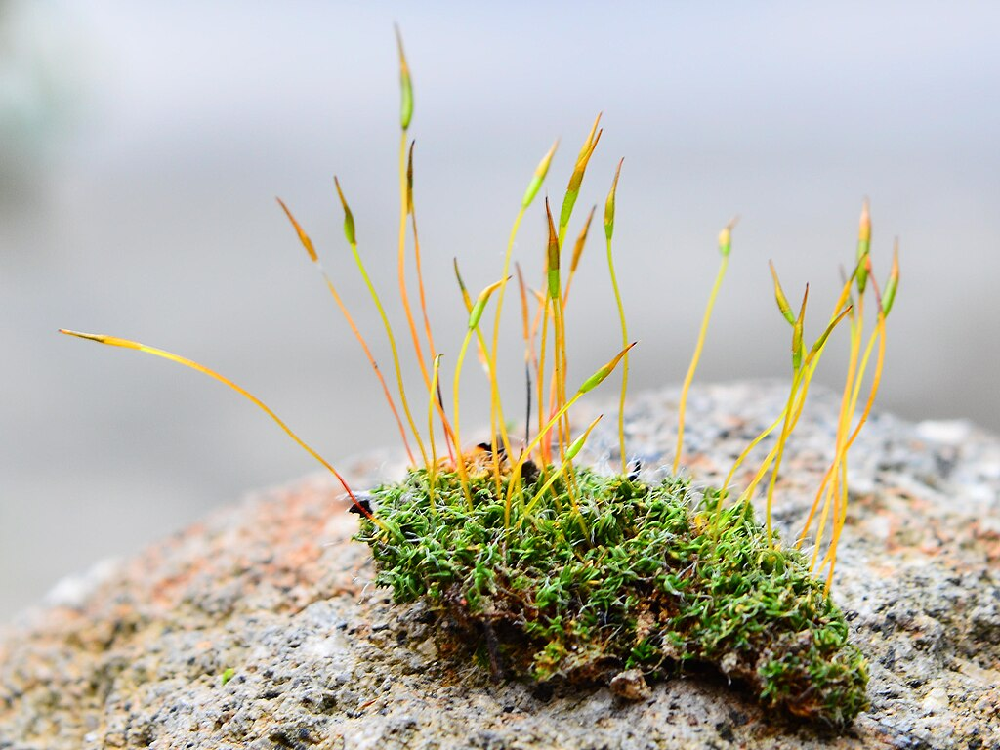A patch of moss showing both gametophytes (the low, leaf-like forms) and sporophytes (the tall, stalk-like forms)

It has recently been found that microarthropods, such as [springtails](https://en.wikipedia.org/wiki/Springtails "Springtails") and [mites](https://en.wikipedia.org/wiki/Mites "Mites"), can effect moss fertilization and that this process is mediated by moss-emitted scents. Male and female [fire moss](https://en.wikipedia.org/wiki/Fire_moss "Fire moss"), for example, emit different and complex volatile organic scents. Female plants emit more compounds than male plants. [Springtails](https://en.wikipedia.org/wiki/Springtails "Springtails") were found to choose female plants preferentially, and one study found that springtails enhance moss fertilization, suggesting a scent-mediated relationship analogous to the plant-pollinator relationship found in many seed plants. The stinkmoss species _[Splachnum sphaericum](https://en.wikipedia.org/wiki/Splachnum_sphaericum "Splachnum sphaericum")_ develops insect pollination further by attracting flies to its sporangia with a strong smell of carrion, and providing a strong visual cue in the form of red-coloured swollen collars beneath each spore capsule. Flies attracted to the moss carry its spores to fresh herbivore dung, which is the favoured habitat of the species of this genus.

In many mosses, e.g., _Ulota phyllantha_, green vegetative structures called [gemmae](https://en.wikipedia.org/wiki/Gemma_\(botany\) "Gemma (botany)") are produced on leaves or branches, which can break off and form new plants without the need to go through the cycle of fertilization. This is a means of [asexual reproduction](https://en.wikipedia.org/wiki/Asexual_reproduction "Asexual reproduction"), and the genetically identical units can lead to the formation of [clonal](https://en.wikipedia.org/wiki/Cloning "Cloning") populations.

### Dwarf males

Moss dwarf males (also known as nannandry or phyllodioicy) originate from wind-dispersed male [spores](https://en.wikipedia.org/wiki/Spore "Spore") that settle and germinate on the female shoot where their growth is restricted to a few millimeters. In some species, dwarfness is genetically determined, in that all male spores become dwarf. More often, it is environmentally determined in that male spores that land on a female become dwarf, while those that land elsewhere develop into large, female-sized males. In the latter case, dwarf males that are transplanted from females to another substrate develop into large shoots, suggesting that the females emit a substance which inhibits the growth of germinating males and possibly also quickens their onset of sexual maturation. The nature of such a substance is unknown, but the phytohormone [auxin](https://en.wikipedia.org/wiki/Auxin "Auxin") may be involved

Having the males growing as dwarfs on the female is expected to increase the [fertilization](https://en.wikipedia.org/wiki/Fertilization "Fertilization") efficiency by minimizing the distance between male and female reproductive organs. Accordingly, it has been observed that fertilization frequency is positively associated with the presence of dwarf males in several phyllodioicous species.

Dwarf males occur in several unrelated [lineages](https://en.wikipedia.org/wiki/Lineage_\(evolution\) "Lineage (evolution)") and may be more common than previously thought. For example, it is estimated that between one quarter and half of all [dioicous](https://en.wikipedia.org/wiki/Dioicy "Dioicy") [pleurocarps](https://en.wikipedia.org/wiki/Pleurocarpous "Pleurocarpous") have dwarf males.

### DNA repair

The moss _[Physcomitrium patens](https://en.wikipedia.org/wiki/Physcomitrium_patens "Physcomitrium patens")_ has been used as a [model organism](https://en.wikipedia.org/wiki/Model_organism "Model organism") to study how plants [repair](https://en.wikipedia.org/wiki/DNA_repair "DNA repair") damage to their DNA, especially the repair mechanism known as [homologous recombination](https://en.wikipedia.org/wiki/Homologous_recombination "Homologous recombination"). If the plant cannot repair DNA damage, e.g., [double-strand breaks](https://en.wikipedia.org/wiki/Double-strand_breaks "Double-strand breaks"), in their [somatic cells](https://en.wikipedia.org/wiki/Somatic_cell "Somatic cell"), the cells can lose normal functions or die. If this occurs during [meiosis](https://en.wikipedia.org/wiki/Meiosis "Meiosis") (part of sexual reproduction), they could become infertile. The genome of _P. patens_ has been sequenced, which has allowed several genes involved in DNA repair to be identified. _P. patens_ mutants that are defective in key steps of homologous recombination have been used to work out how the repair mechanism functions in plants. For example, a study of _P. patens_ mutants defective in _Rp_RAD51, a gene that encodes a protein at the core of the recombinational repair reaction, indicated that homologous recombination is essential for repairing DNA double-strand breaks in this plant. Similarly, studies of mutants defective in _Ppmre11_ or _Pprad50_ (that encode key proteins of the [MRN complex](https://en.wikipedia.org/wiki/MRN_complex "MRN complex"), the principal sensor of DNA double-strand breaks) showed that these genes are necessary for repair of DNA damage as well as for normal growth and development.

## Classification

Since 2018, mosses have been grouped with the [liverworts](https://en.wikipedia.org/wiki/Marchantiophyta "Marchantiophyta") and [hornworts](https://en.wikipedia.org/wiki/Hornwort "Hornwort") in the division **Bryophyta** ([bryophytes](https://en.wikipedia.org/wiki/Bryophyte "Bryophyte"), or Bryophyta _sensu lato_). The bryophyte division itself contains three groups, sometimes considered divisions themselves: Bryophyta (mosses), [Marchantiophyta](https://en.wikipedia.org/wiki/Marchantiophyta "Marchantiophyta") (liverworts) and [Anthocerotophyta](https://en.wikipedia.org/wiki/Hornworts "Hornworts") (hornworts); it has been proposed that these latter divisions are de-ranked to the classes Bryopsida, Marchantiopsida, and Anthocerotopsida, respectively. The mosses and liverworts are now considered to belong to a clade called [Setaphyta](https://en.wikipedia.org/wiki/Setaphyta "Setaphyta").

The mosses, (Bryophyta sensu stricto), are divided into eight classes:

division **Bryophyta** : class Takakiopsida : class Sphagnopsida : class Andreaeopsida : class Andreaeobryopsida : class Oedipodiopsida : class Polytrichopsida : class Tetraphidopsida : class Bryopsida

_[vascular plants](https://en.wikipedia.org/wiki/Vascular_plant "Vascular plant")_

_[hornworts](https://en.wikipedia.org/wiki/Anthocerotopsida "Anthocerotopsida")_

_[liverworts](https://en.wikipedia.org/wiki/Marchantiophyta "Marchantiophyta")_

**Bryophyta**

[Takakiopsida](https://en.wikipedia.org/wiki/Takakiopsida "Takakiopsida")

[Sphagnopsida](https://en.wikipedia.org/wiki/Sphagnopsida "Sphagnopsida")

[Andreaeopsida](https://en.wikipedia.org/wiki/Andreaeopsida "Andreaeopsida")

[Andreaeobryopsida](https://en.wikipedia.org/wiki/Andreaeobryopsida "Andreaeobryopsida")

Neomusci

[Oedipodiopsida](https://en.wikipedia.org/wiki/Oedipodiopsida "Oedipodiopsida")

Cenomusci

[Polytrichopsida](https://en.wikipedia.org/wiki/Polytrichopsida "Polytrichopsida")

Altamusci

[Tetraphidopsida](https://en.wikipedia.org/wiki/Tetraphidopsida "Tetraphidopsida")

[Bryopsida](https://en.wikipedia.org/wiki/Bryopsida "Bryopsida")

The current [phylogeny](https://en.wikipedia.org/wiki/Phylogenetics "Phylogenetics") and composition of the Bryophyta.

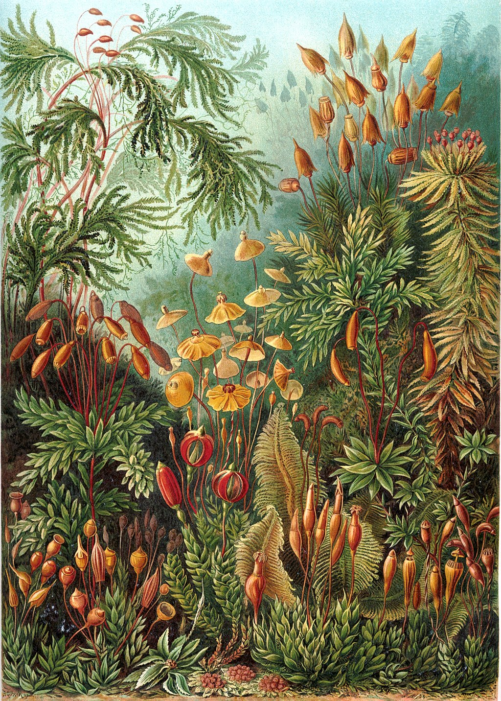"Muscinae" from [Ernst Haeckel](https://en.wikipedia.org/wiki/Ernst_Haeckel "Ernst Haeckel")'s _[Kunstformen der Natur](https://en.wikipedia.org/wiki/Kunstformen_der_Natur "Kunstformen der Natur")_, 1904

Six of the eight classes contain only one or two genera each. Polytrichopsida includes 23 genera, and Bryopsida includes the majority of moss diversity with over 95% of moss species belonging to this class.

The Sphagnopsida, the peat-mosses, comprise the two living genera _[Ambuchanania](https://en.wikipedia.org/wiki/Ambuchanania "Ambuchanania")_ and _[Sphagnum](https://en.wikipedia.org/wiki/Sphagnum "Sphagnum")_, as well as fossil taxa. _Sphagnum_ is a diverse, widespread, and economically important one. These large mosses form extensive acidic bogs in peat swamps. The leaves of _Sphagnum_ have large dead cells alternating with living photosynthetic cells. The dead cells help to store water. Aside from this character, the unique branching, thallose (flat and expanded) protonema, and explosively rupturing sporangium place it apart from other mosses.

Andreaeopsida and Andreaeobryopsida are distinguished by the biseriate (two rows of cells) rhizoids, multiseriate (many rows of cells) protonema, and sporangium that splits along longitudinal lines. Most mosses have capsules that open at the top.

Polytrichopsida have leaves with sets of parallel lamellae, flaps of chloroplast-containing cells that look like the fins on a heat sink. These carry out photosynthesis and may help to conserve moisture by partially enclosing the gas exchange surfaces. The Polytrichopsida differ from other mosses in other details of their development and anatomy too, and can also become larger than most other mosses, with e.g., _[Polytrichum commune](https://en.wikipedia.org/wiki/Polytrichum_commune "Polytrichum commune")_ forming cushions up to 40 cm (16 in) high. The tallest land moss, a member of the Polytrichidae is probably _[Dawsonia superba](https://en.wikipedia.org/wiki/Dawsonia_superba "Dawsonia superba")_, a native to [New Zealand](https://en.wikipedia.org/wiki/New_Zealand "New Zealand") and other parts of [Australasia](https://en.wikipedia.org/wiki/Australasia "Australasia").

## Geological history

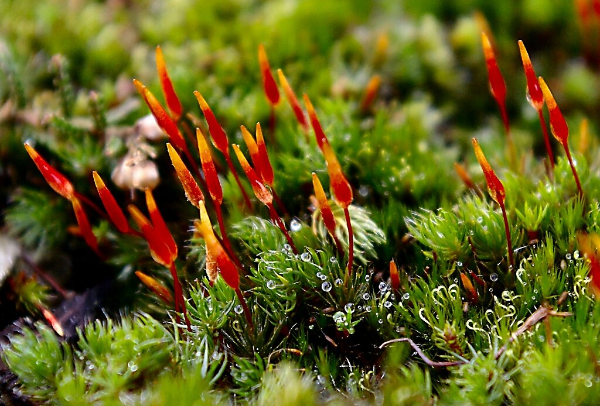[Bristly Haircap](https://en.wikipedia.org/wiki/Polytrichum_piliferum "Polytrichum piliferum") moss, a winter native of the [Yorkshire Dales](https://en.wikipedia.org/wiki/Yorkshire_Dales "Yorkshire Dales") [moorland](https://en.wikipedia.org/wiki/Moorland "Moorland")

The fossil record of moss is sparse, due to their soft-walled and fragile nature. Unambiguous moss fossils have been recovered from as early as the [Permian](https://en.wikipedia.org/wiki/Permian "Permian") of Antarctica and Russia, and a case has been made for [Carboniferous](https://en.wikipedia.org/wiki/Carboniferous "Carboniferous") mosses. It has further been claimed that tube-like fossils from the [Silurian](https://en.wikipedia.org/wiki/Silurian "Silurian") are the macerated remains of moss [calyptræ](https://en.wikipedia.org/wiki/Calyptræ "Calyptræ"). Mosses also appear to evolve 2–3 times slower than ferns, [gymnosperms](https://en.wikipedia.org/wiki/Gymnosperm "Gymnosperm") and [angiosperms](https://en.wikipedia.org/wiki/Angiosperm "Angiosperm").

Research published in 2012 shows that ancient moss could explain why the [Ordovician](https://en.wikipedia.org/wiki/Ordovician "Ordovician") ice ages occurred. When the ancestors of today's moss started to spread on land 470 million years ago, they absorbed CO2 from the atmosphere and extracted minerals by secreting organic acids that dissolved the rocks they were growing on. These chemically altered rocks in turn reacted with the atmospheric CO2 and formed new carbonate rocks in the ocean through the weathering of calcium and magnesium ions from silicate rocks. The weathered rocks also released significant amounts of phosphorus and iron which ended up in the oceans, where it caused massive algal blooms, resulting in organic carbon burial, extracting more carbon dioxide from the atmosphere. Small organisms feeding on the nutrients created large areas without oxygen, which caused a mass extinction of marine species, while the levels of CO2 dropped all over the world, allowing the formation of ice caps on the poles.

## Ecology

### Habitat

*   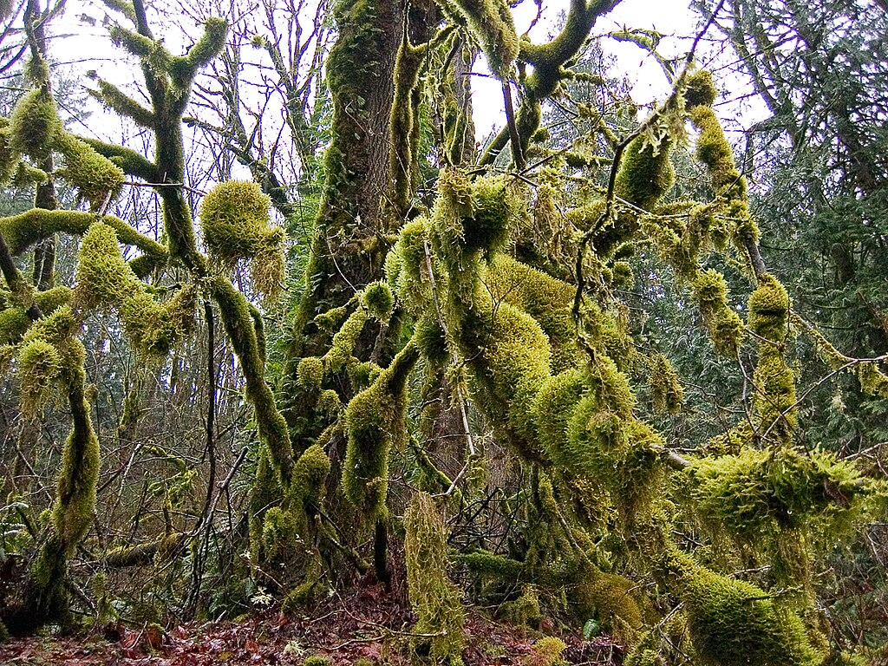

    Dense moss colonies in a cool coastal forest

*   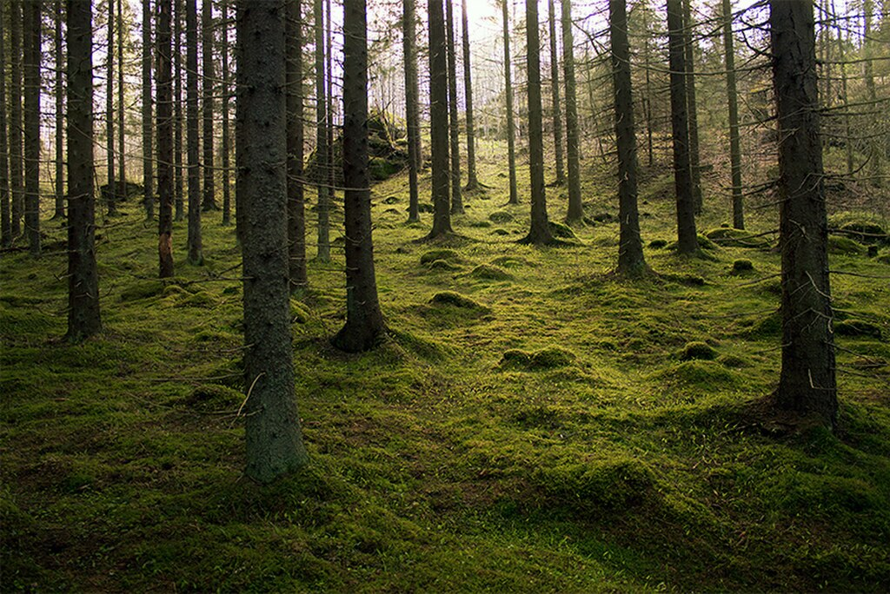

    A cool high altitude/latitude moss forest; the forest floor is covered in moss, beneath conifers

*   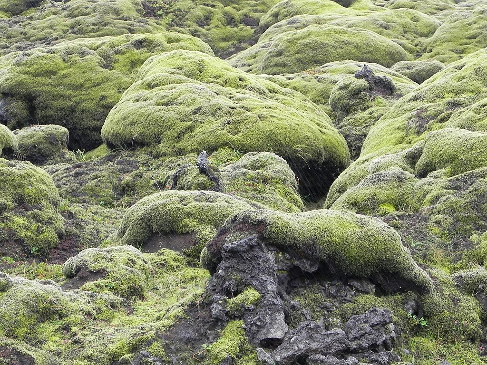

    Moss colonizes a [basalt](https://en.wikipedia.org/wiki/Basalt "Basalt") flow, in [Iceland](https://en.wikipedia.org/wiki/Iceland "Iceland")

*   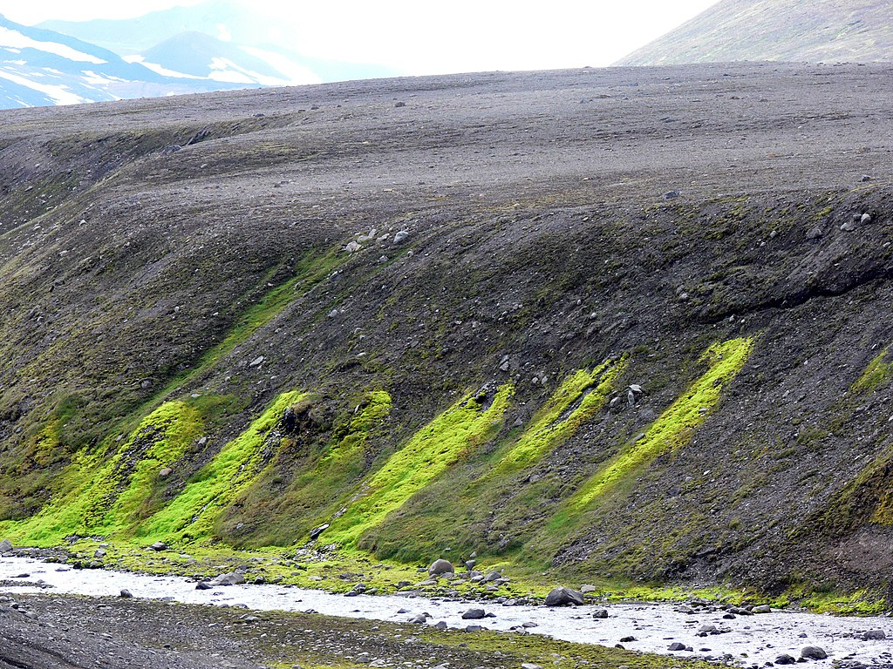

    Moss growing along [seeps](https://en.wikipedia.org/wiki/Seep "Seep") and springs in newly deposited [basaltic](https://en.wikipedia.org/wiki/Basaltic "Basaltic") rock, Iceland.

*   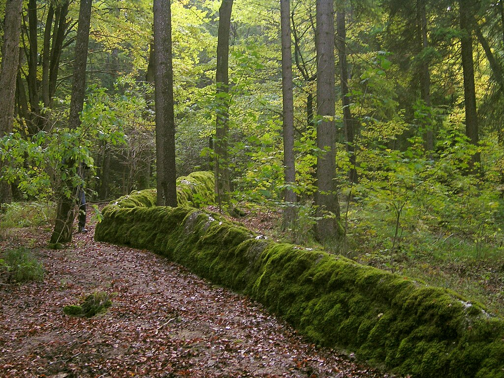

    Moss growing along the stream from a [karst spring](https://en.wikipedia.org/wiki/Karst_spring "Karst spring"); [travertine](https://en.wikipedia.org/wiki/Travertine "Travertine") deposits from the stream water and the moss overgrows it, forming this ridge, with the stream on top.

*   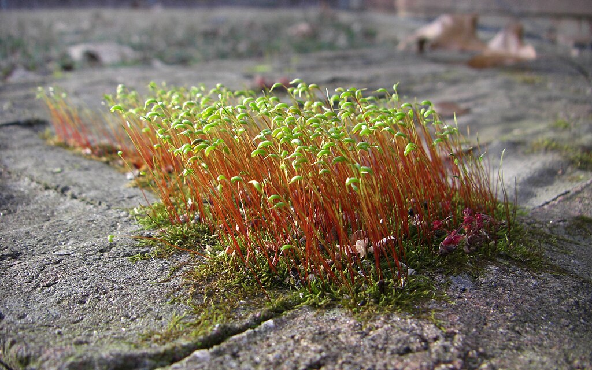

    Moss with sporophytes on brick

*   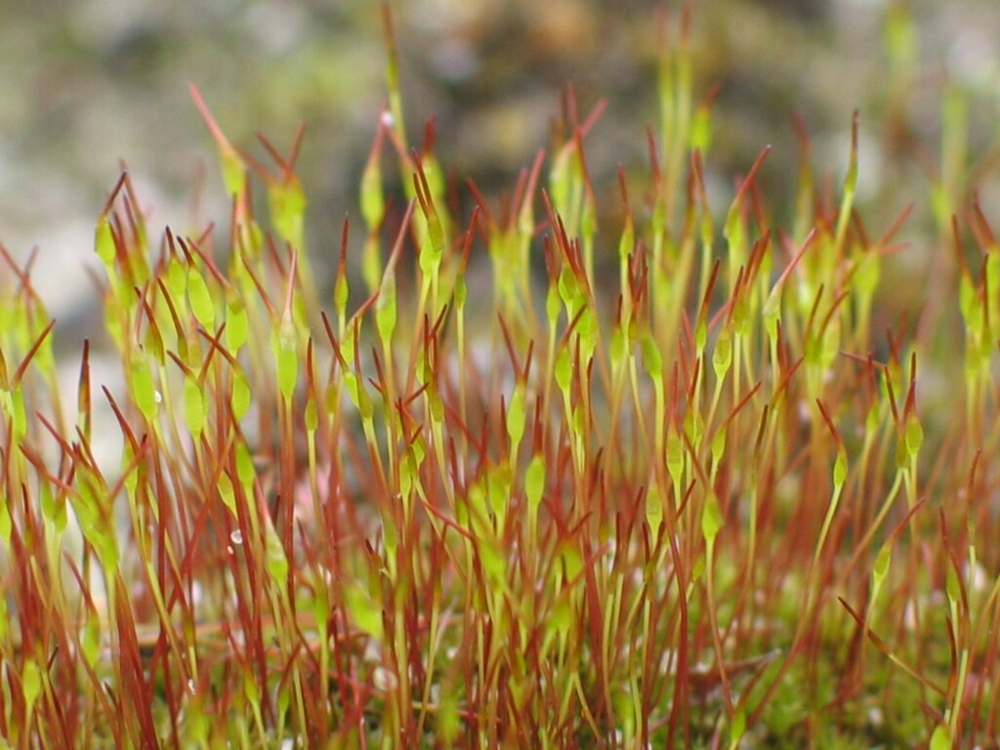

    Young [sporophytes](https://en.wikipedia.org/wiki/Sporophyte "Sporophyte") of the common moss _Tortula muralis_ (wall screw-moss)

*   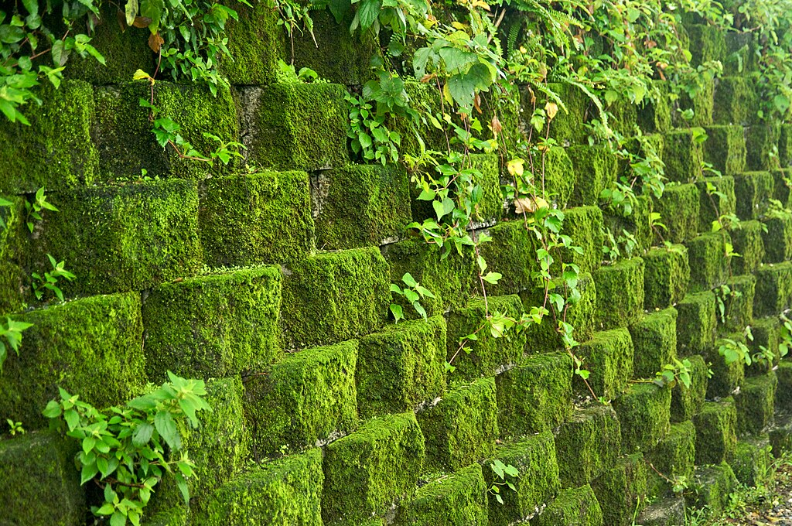

    [Retaining wall](https://en.wikipedia.org/wiki/Retaining_wall "Retaining wall") covered in moss

*   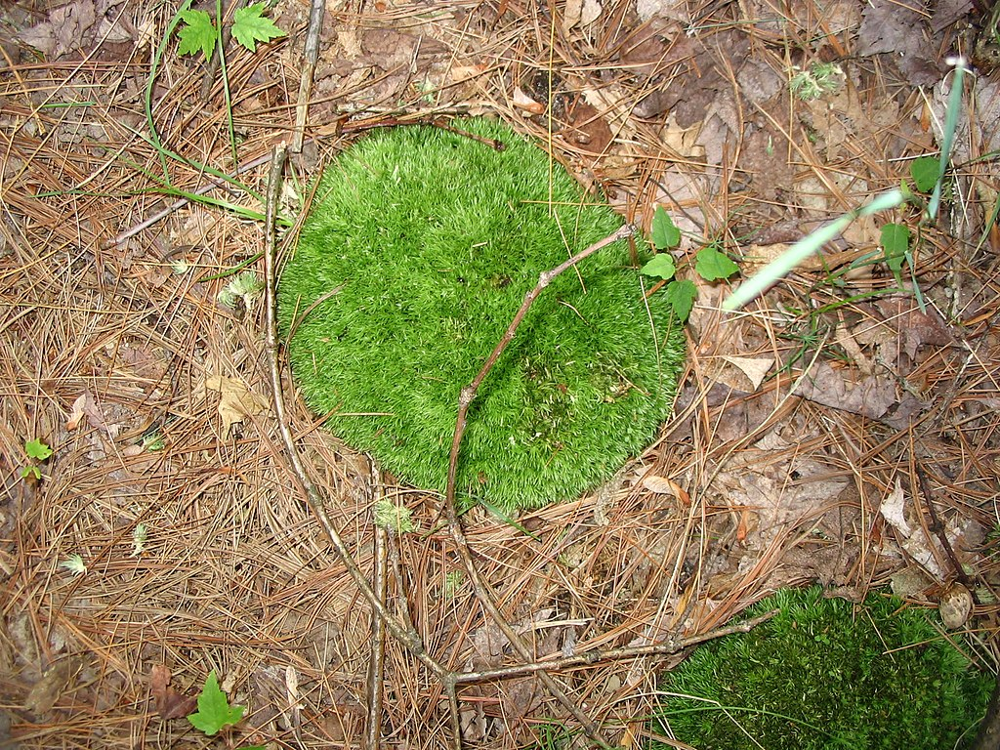

    A small clump of moss beneath a conifer (a shady, usually dry place)

*   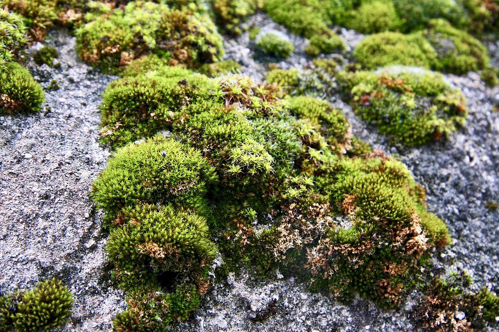

    Moss on a concrete wall

*   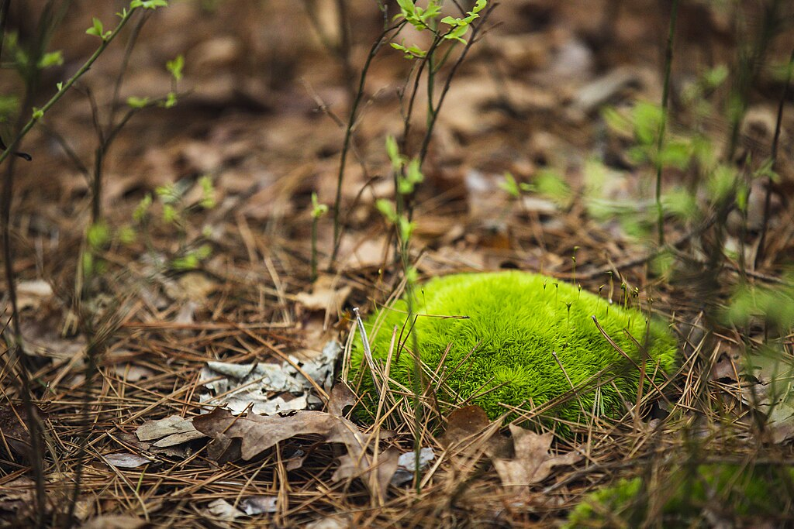

    Moss (Bryophyta) on the forest floor in Broken Bow, Oklahoma

Mosses live in almost every terrestrial habitat type on Earth. Though mosses are particularly abundant in certain habitats such as peatlands, where Sphagnum mosses are the dominant organism, and in moist boreal, temperate, and montane tropical forests, mosses grow in many other habitats, including habitats with conditions too extreme for [vascular plants](https://en.wikipedia.org/wiki/Tracheophyte "Tracheophyte") to survive. Desiccation tolerant mosses are important in arid and semi-arid ecosystems, where they help form [biocrusts](https://en.wikipedia.org/wiki/Biocrust "Biocrust") that mediate extremes of soil temperature, regulate soil moisture, and regulate the release and uptake of carbon. Mosses can live on substrates heated by geothermal activity to temperatures exceeding 50 degrees Celsius, on walls and pavement in urban areas, and in Antarctica. Moss diversity is generally not associated with latitude; boreal and temperate moss diversity is similar to tropical moss diversity. Moss diversity hotspots are found in the northern Andes mountains, Mexico, the Himalayan mountains, Madagascar, Japan, the highlands of eastern Africa, Southeast Asia, central Europe, Scandinavia, and British Columbia.

Moss [gametophytes](https://en.wikipedia.org/wiki/Gametophyte "Gametophyte") are [autotrophic](https://en.wikipedia.org/wiki/Autotroph "Autotroph") and require [sunlight](https://en.wikipedia.org/wiki/Sunlight "Sunlight") to perform [photosynthesis](https://en.wikipedia.org/wiki/Photosynthesis "Photosynthesis"). In most areas, mosses grow chiefly in moist, shaded areas, such as wooded areas and at the edges of streams, but [shade](https://en.wikipedia.org/wiki/Shade_\(shadow\) "Shade (shadow)") tolerance varies by species.

Different moss species grow on different substrates as well. Moss species can be classed as growing on: rocks, exposed mineral soil, disturbed soils, acid soil, calcareous soil, cliff seeps and waterfall spray areas, streamsides, shaded [humusy](https://en.wikipedia.org/wiki/Humus "Humus") soil, downed logs, burnt stumps, tree trunk bases, upper tree trunks, and tree branches or in [bogs](https://en.wikipedia.org/wiki/Bog "Bog"). Moss species growing on or under trees are often specific about the species of trees they grow on, such as preferring [conifers](https://en.wikipedia.org/wiki/Pinophyta "Pinophyta") over [broadleaf trees](https://en.wikipedia.org/wiki/Broad-leaved_tree "Broad-leaved tree"), [oaks](https://en.wikipedia.org/wiki/Oak "Oak") over [alders](https://en.wikipedia.org/wiki/Alder "Alder"), or vice versa. While mosses often grow on trees as [epiphytes](https://en.wikipedia.org/wiki/Epiphytes "Epiphytes"), they are never parasitic on the tree.

Mosses are also found in cracks between paving stones in damp city streets, and on roofs. Some species adapted to disturbed, sunny areas are well adapted to urban conditions and are commonly found in cities. Examples would be _[Rhytidiadelphus squarrosus](https://en.wikipedia.org/wiki/Rhytidiadelphus_squarrosus "Rhytidiadelphus squarrosus")_, a garden weed in Vancouver and Seattle areas; _Bryum argenteum_, the cosmopolitan sidewalk moss, and _Ceratodon purpureus_, red roof moss, another cosmopolitan species. A few species are wholly aquatic, such as _Fontinalis antipyretica_, common water moss; and others such as _Sphagnum_ inhabit bogs, marshes and very slow-moving waterways. Such aquatic or semi-aquatic mosses can greatly exceed the normal range of lengths seen in terrestrial mosses. Individual plants 20–30 cm (8–12 in) or more long are common in _Sphagnum_ species for example. But even aquatic species of moss and other bryophytes needs their mature capsules to be exposed to air by seta elongation or seasonal lowering of water level to be able to reproduce.

Wherever they occur, mosses require liquid water for at least part of the year to complete fertilisation. Many mosses can survive [desiccation](https://en.wikipedia.org/wiki/Desiccation "Desiccation"), sometimes for months, returning to life within a few hours of rehydration. Mosses in arid habitats, such as the moss _[Syntrichia caninervis](https://en.wikipedia.org/wiki/Syntrichia_caninervis "Syntrichia caninervis")_, have adaptations for collecting non-rainfall sources of moisture like [dew](https://en.wikipedia.org/wiki/Dew "Dew") and [fog](https://en.wikipedia.org/wiki/Fog "Fog"), capturing condensation from the air.

It is generally believed that in the [Northern Hemisphere](https://en.wikipedia.org/wiki/Northern_Hemisphere "Northern Hemisphere"), the north side of trees and rocks will generally have more luxuriant moss growth on average than other sides. The reason is assumed to be because [sunshine](https://en.wikipedia.org/wiki/Sunlight "Sunlight") on the south side causes a dry environment. The reverse would be true in the [Southern Hemisphere](https://en.wikipedia.org/wiki/Southern_Hemisphere "Southern Hemisphere"). Some naturalists feel that mosses grow on the damper side of trees and rocks. In some cases, such as sunny climates in [temperate](https://en.wikipedia.org/wiki/Temperate_climate "Temperate climate") northern latitudes, this will be the shaded north side of the tree or rock. On steep slopes, it may be the uphill side. For mosses that grow on tree branches, this is generally the upper side of the branch on horizontally growing sections or near the crotch. In cool, humid, cloudy climates, all sides of tree trunks and rocks may be equally moist enough for moss growth. Each species of moss requires certain amounts of moisture and sunlight and thus will grow on certain sections of the same tree or rock.

Some mosses grow underwater, or completely waterlogged, though many prefer well-drained locations. There are mosses that preferentially grow on rocks and tree trunks of various chemistries. Rarely, mosses can form [glacier mice](https://en.wikipedia.org/wiki/Glacier_mice "Glacier mice") that survive as mobile colonies of moss that migrate across the ice of certain glaciers, however they have never been observed on ice sheets like that of the Antarctic mainland, implying some degree of exposed non-ice substrate remains needed for their formation and survival.

On the few occasions that mosses are aquatic, as in [Crater Lake](https://en.wikipedia.org/wiki/Crater_Lake "Crater Lake"), streams, and Moss lake in Antartica, plants remain almost entirely limited to freshwater environments. Mosses living in brackish coastal water of the Baltic Sea challenge this understanding, but are only able to survive due to an influx of freshwater from rivers nearby. The relative lack of research on aquatic mosses much less those that can withstand some degree of salinity leave the specifics of such and possibility of mosses adapting similarly elsewhere in the world largely unknown for now.

### Relationship with cyanobacteria

In [boreal forests](https://en.wikipedia.org/wiki/Taiga "Taiga"), some species of moss play an important role in providing nitrogen for the ecosystem due to their relationship with [nitrogen-fixing](https://en.wikipedia.org/wiki/Nitrogen_fixation "Nitrogen fixation") [cyanobacteria](https://en.wikipedia.org/wiki/Cyanobacteria "Cyanobacteria"). Cyanobacteria colonize moss and receive shelter in return for providing fixed nitrogen. Moss releases the fixed nitrogen, along with other nutrients, into the soil "upon disturbances like drying-rewetting and fire events", making it available throughout the ecosystem.

### Environmental significance

Moss increase the ability of soil to capture and store carbon. If compare the amount of carbon stored by soil covered by moss with the amount stored by soil without plants and multiply the difference by the 9.4 million square kilometres it covers, the result will be 6.4 billion ton of carbon annually, 6 times more than the emissions from land use change. Moss provide different services to soil and other plants, including controlling pathogens dangerous for humans, stopping [land erosion](https://en.wikipedia.org/wiki/Land_erosion "Land erosion") and improving local climate (temperature and humidity). Moss also help filter air pollution. It also can reduce the temperature in cities. It can reduce the temperature of a wall by 30 degrees, so many walls covered by moss can create a 7 degrees reduction of the mean temperature in [urban heat islands](https://en.wikipedia.org/wiki/Urban_heat_island "Urban heat island").

## Cultivation

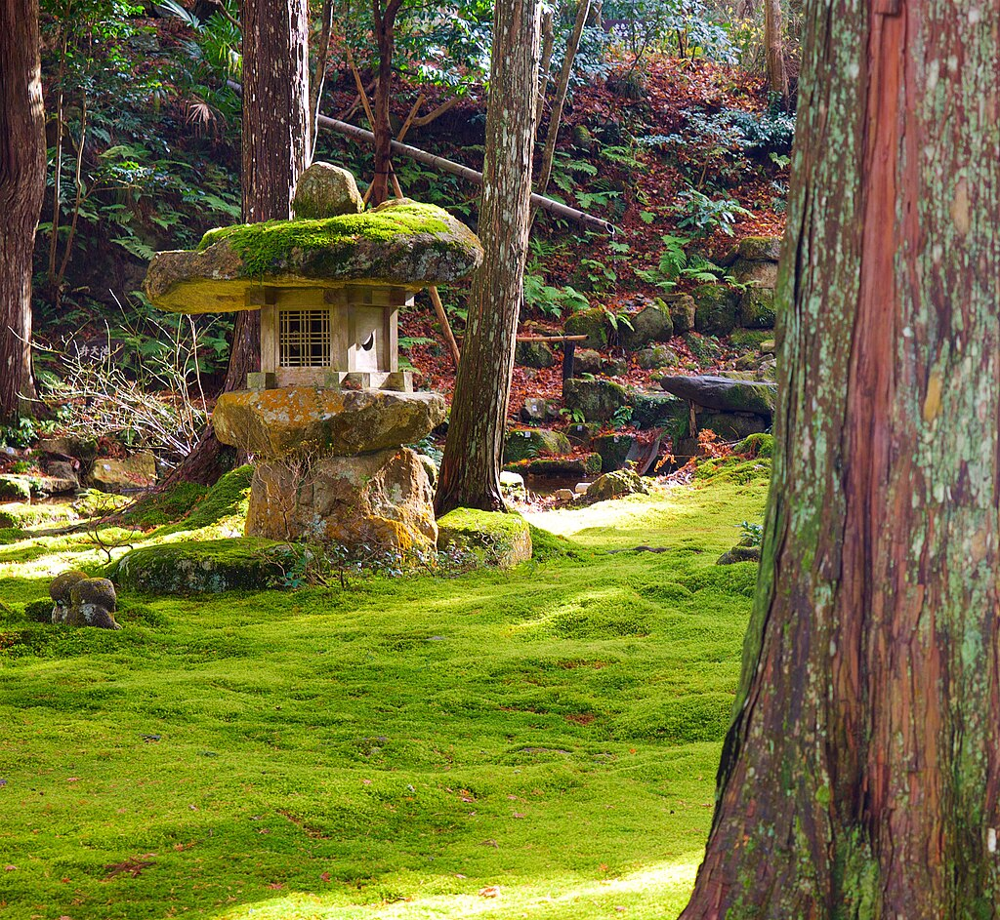A moss lawn in a temple garden in [Kyoto](https://en.wikipedia.org/wiki/Kyoto "Kyoto"), Japan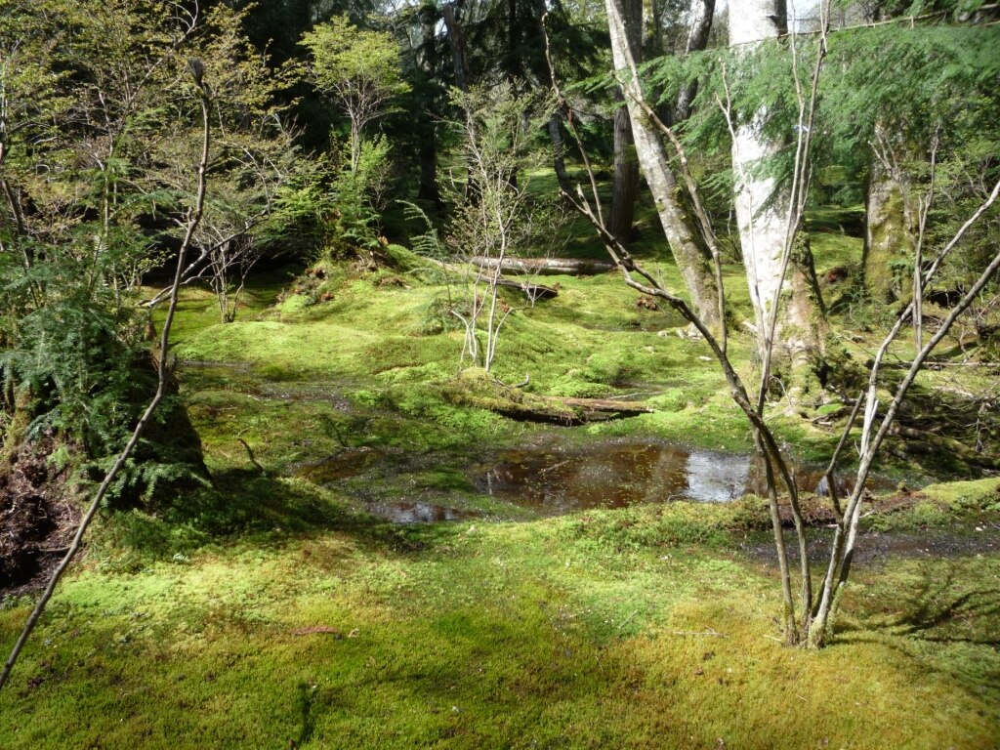The moss garden at the Bloedel Reserve, Bainbridge Island, Washington State

Moss is often considered a [weed](https://en.wikipedia.org/wiki/Weed "Weed") in grass lawns, but is deliberately encouraged to grow under aesthetic principles exemplified by [Japanese gardening](https://en.wikipedia.org/wiki/Japanese_garden "Japanese garden"). In old temple gardens, moss can carpet a forest scene. Moss is thought to add a sense of calm, age, and stillness to a garden scene. Moss is also used in [bonsai](https://en.wikipedia.org/wiki/Bonsai "Bonsai") to cover the soil and enhance the impression of age. Rules of cultivation are not widely established. Moss collections are quite often begun using samples transplanted from the wild in a water-retaining bag. Some species of moss can be extremely difficult to maintain away from their natural sites with their unique requirements of combinations of light, humidity, substrate chemistry, shelter from wind, etc.

Growing moss from spores is even less controlled. Moss spores fall in a constant rain on exposed surfaces; those surfaces which are hospitable to a certain species of moss will typically be colonised by that moss within a few years of exposure to wind and rain. Materials which are porous and moisture retentive, such as [brick](https://en.wikipedia.org/wiki/Brick "Brick"), [wood](https://en.wikipedia.org/wiki/Wood "Wood"), and certain coarse concrete mixtures, are hospitable to moss. Surfaces can also be prepared with acidic substances, including [buttermilk](https://en.wikipedia.org/wiki/Buttermilk "Buttermilk"), [yogurt](https://en.wikipedia.org/wiki/Yogurt "Yogurt"), [urine](https://en.wikipedia.org/wiki/Urine "Urine"), and gently puréed mixtures of moss samples, water and ericaceous compost.

In the cool, humid, cloudy [Pacific Northwest](https://en.wikipedia.org/wiki/Pacific_Northwest "Pacific Northwest"), moss is sometimes allowed to grow naturally as a [moss lawn](https://en.wikipedia.org/wiki/Moss_lawn "Moss lawn"), one that needs little or no mowing, fertilizing or watering. In this case, grass is considered to be the weed. Landscapers in the Seattle area sometimes collect boulders and downed logs growing mosses for installation in gardens and landscapes. Woodland gardens in many parts of the world can include a carpet of natural mosses. The [Bloedel Reserve](https://en.wikipedia.org/wiki/Bloedel_Reserve "Bloedel Reserve") on Bainbridge Island, Washington State, is famous for its moss garden. The moss garden was created by removing shrubby underbrush and herbaceous groundcovers, thinning trees, and allowing mosses to fill in naturally.

### Green roofs and walls

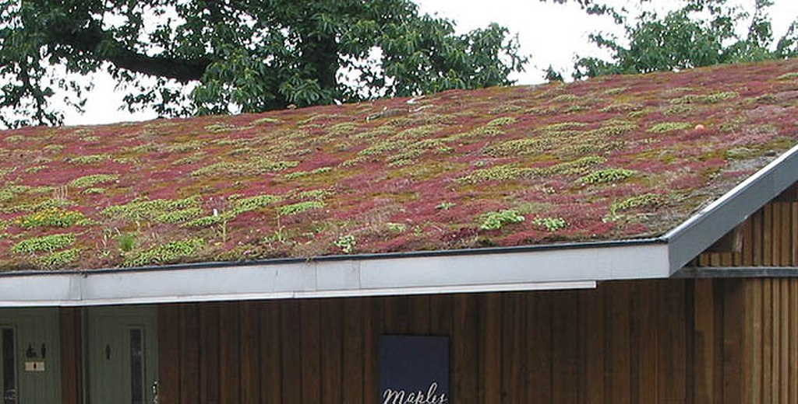Red moss, possibly _[Ceratodon purpureus](https://en.wikipedia.org/wiki/Ceratodon_purpureus "Ceratodon purpureus")_, cultivated on a [green roof](https://en.wikipedia.org/wiki/Green_roof "Green roof")

Mosses are sometimes used in [green roofs](https://en.wikipedia.org/wiki/Green_roof "Green roof"). Advantages of mosses over higher plants in green roofs include reduced weight loads, increased water absorption, no fertilizer requirements, and high drought tolerance. Since mosses do not have true roots, they require less planting medium than higher plants with extensive root systems. With proper species selection for the local climate, mosses in green roofs require no irrigation once established and are low maintenance. Mosses are also used on [green walls](https://en.wikipedia.org/wiki/Green_wall "Green wall").

### Mossery

A passing fad for moss-collecting in the late 19th century led to the establishment of mosseries in many British and American gardens. The mossery is typically constructed out of slatted wood, with a flat roof, open to the north side (maintaining shade). Samples of moss were installed in the cracks between wood slats. The whole mossery would then be regularly moistened to maintain growth.

### Aquascaping

[Aquascaping](https://en.wikipedia.org/wiki/Aquascaping "Aquascaping") uses many aquatic mosses. They do best at low nutrient, light, and heat levels, and propagate fairly readily. They help maintain a water chemistry suitable for aquarium fish. They grow more slowly than many aquarium plants, and are fairly hardy.

### Growth inhibition

Moss can be a troublesome weed in containerized nursery operations and greenhouses. Vigorous moss growth can inhibit seedling emergence and penetration of water and fertilizer to the plant roots.

Moss growth can be inhibited by a number of methods:

*   Decreasing availability of [water](https://en.wikipedia.org/wiki/Water "Water") through [drainage](https://en.wikipedia.org/wiki/Drainage "Drainage").
*   Increasing direct sunlight.
*   Increasing number and resources available for competitive plants like [grasses](https://en.wikipedia.org/wiki/Grass "Grass").
*   Increasing the [soil pH](https://en.wikipedia.org/wiki/Soil_pH "Soil pH") with the application of [lime](https://en.wikipedia.org/wiki/Lime_\(mineral\) "Lime (mineral)").
*   Heavy traffic or manually disturbing the moss bed with a rake
*   Application of chemicals such as [ferrous sulfate](https://en.wikipedia.org/wiki/Ferrous_sulfate "Ferrous sulfate") (e.g., in lawns) or bleach (e.g., on solid surfaces).
*   In containerized nursery operations, coarse mineral materials such as sand, gravel, and rock chips are used as a fast-draining top dressing in plant containers to discourage moss growth.

The application of products containing ferrous sulfate or [ferrous ammonium sulfate](https://en.wikipedia.org/wiki/Ferrous_ammonium_sulfate "Ferrous ammonium sulfate") will kill moss; these ingredients are typically in commercial moss control products and [fertilizers](https://en.wikipedia.org/wiki/Fertilizer "Fertilizer"). [Sulfur](https://en.wikipedia.org/wiki/Sulfur "Sulfur") and [iron](https://en.wikipedia.org/wiki/Iron "Iron") are [essential nutrients](https://en.wikipedia.org/wiki/Essential_nutrient "Essential nutrient") for some competing plants like grasses. Killing moss will not prevent regrowth unless conditions favorable to their growth are changed.

## Uses

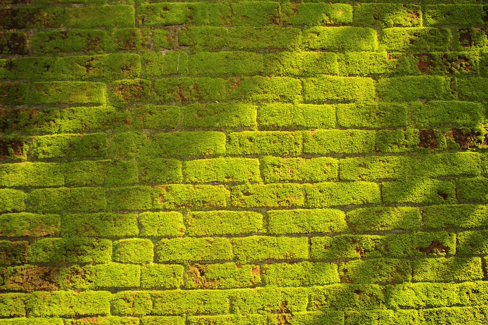Wall covered in moss

### Traditional

Preindustrial societies made use of the mosses growing in their areas.

[Sámi](https://en.wikipedia.org/wiki/Sámi_peoples "Sámi peoples") people, [North American tribes](https://en.wikipedia.org/wiki/Indigenous_peoples_of_the_Americas "Indigenous peoples of the Americas"), and other [circumpolar peoples](https://en.wikipedia.org/wiki/Circumpolar_peoples "Circumpolar peoples") used mosses for bedding. Mosses have also been used as insulation both for dwellings and in clothing. Traditionally, dried moss was used in some Nordic countries and Russia as an insulator between logs in [log cabins](https://en.wikipedia.org/wiki/Log_cabin "Log cabin"), and tribes of the northeastern United States and southeastern Canada used moss to fill chinks in wooden longhouses. Circumpolar and alpine peoples have used mosses for insulation in boots and mittens. [Ötzi the Iceman](https://en.wikipedia.org/wiki/Ötzi_the_Iceman "Ötzi the Iceman") had moss-packed boots.

The capacity of dried mosses to absorb fluids has made their use practical in both medical and culinary uses. North American tribal people used mosses for diapers, wound dressing, and menstrual fluid absorption. Tribes of the Pacific Northwest in the United States and Canada used mosses to clean salmon prior to drying it, and packed wet moss into pit ovens for steaming [camas](https://en.wikipedia.org/wiki/Camassia "Camassia") bulbs. Food storage baskets and boiling baskets were also packed with mosses.

Recent research investigating the Neanderthals remains recovered from El Sidrón have provided evidence that their diet would have consisted primarily of pine nuts, moss and mushrooms. This is contrasted by evidence from other European locations, which point to a more carnivorous diet.

In [Finland](https://en.wikipedia.org/wiki/Finland "Finland"), peat mosses have been used to make bread during [famines](https://en.wikipedia.org/wiki/Famines "Famines").

### Commercial

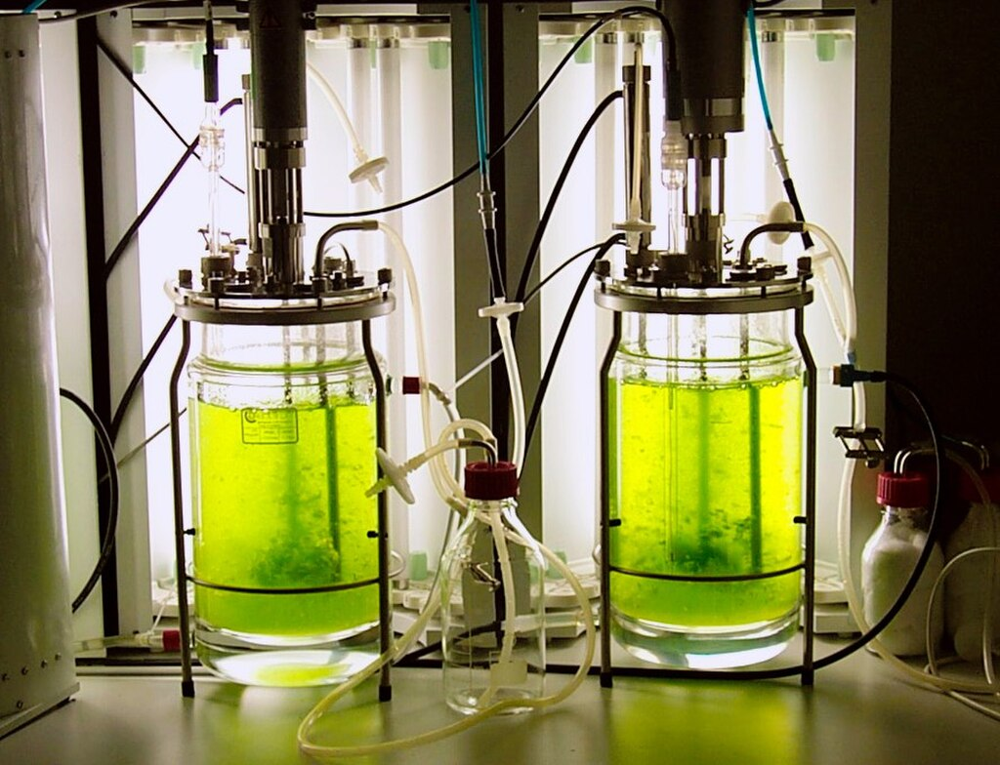[Moss bioreactor](https://en.wikipedia.org/wiki/Moss_bioreactor "Moss bioreactor") cultivating the moss _[Physcomitrella patens](https://en.wikipedia.org/wiki/Physcomitrella_patens "Physcomitrella patens")_

There is a substantial market in mosses gathered from the wild. The uses for intact moss are principally in the [florist](https://en.wikipedia.org/wiki/Flower "Flower") trade and for home decoration. Decaying moss in the genus _Sphagnum_ is also the major component of [peat](https://en.wikipedia.org/wiki/Peat "Peat"), which is "mined" for use as a [fuel](https://en.wikipedia.org/wiki/Fuel "Fuel"), as a [horticultural](https://en.wikipedia.org/wiki/Horticulture "Horticulture") soil additive, and in smoking [malt](https://en.wikipedia.org/wiki/Malt "Malt") in the production of [Scotch whisky](https://en.wikipedia.org/wiki/Scotch_whisky "Scotch whisky").

_[Sphagnum](https://en.wikipedia.org/wiki/Sphagnum "Sphagnum")_ moss, generally the species _S. cristatum_ and _S. subnitens_, is harvested while still growing and is dried out to be used in nurseries and horticulture as a plant growing medium.

Some _Sphagnum_ mosses can absorb up to 20 times their own weight in water. In [World War I](https://en.wikipedia.org/wiki/World_War_I "World War I"), _Sphagnum_ mosses were used as first-aid dressings on soldiers' wounds, as these mosses said to absorb liquids three times faster than cotton, retain liquids better, better distribute liquids uniformly throughout themselves, and are cooler, softer, and less irritating. Moss is also claimed to have antibacterial properties. [Native Americans](https://en.wikipedia.org/wiki/Indigenous_peoples_of_the_Americas "Indigenous peoples of the Americas") were one of the peoples to use _Sphagnum_ for diapers and [menstrual pads](https://en.wikipedia.org/wiki/Menstrual_pad "Menstrual pad"), which is still done in [Canada](https://en.wikipedia.org/wiki/Canada "Canada").

In rural parts of the [UK](https://en.wikipedia.org/wiki/United_Kingdom "United Kingdom"), _[Fontinalis antipyretica](https://en.wikipedia.org/wiki/Fontinalis_antipyretica "Fontinalis antipyretica")_ was traditionally used to extinguish fires as it could be found in substantial quantities in slow-moving rivers and the moss retained large volumes of water, which helped extinguish the flames. This historical use is reflected in its [Latin](https://en.wikipedia.org/wiki/Latin "Latin")/[Greek](https://en.wikipedia.org/wiki/Greek_language "Greek language") [specific epithet](https://en.wikipedia.org/wiki/Binomial_nomenclature "Binomial nomenclature"), which means "against fire".

In [Mexico](https://en.wikipedia.org/wiki/Mexico "Mexico"), moss is used as a [Christmas](https://en.wikipedia.org/wiki/Christmas_in_Mexico "Christmas in Mexico") decoration.

_[Physcomitrium patens](https://en.wikipedia.org/wiki/Physcomitrium_patens "Physcomitrium patens")_ is increasingly used in [biotechnology](https://en.wikipedia.org/wiki/Biotechnology "Biotechnology"). Prominent examples are the identification of moss [genes](https://en.wikipedia.org/wiki/Gene "Gene") with implications for [crop](https://en.wikipedia.org/wiki/Crop "Crop") improvement or human [health](https://en.wikipedia.org/wiki/Health "Health") and the safe production of complex [biopharmaceuticals](https://en.wikipedia.org/wiki/Biopharmaceuticals "Biopharmaceuticals") in the moss [bioreactor](https://en.wikipedia.org/wiki/Bioreactor "Bioreactor"), developed by [Ralf Reski](https://en.wikipedia.org/wiki/Ralf_Reski "Ralf Reski") and his co-workers.

In London, several structures called "City Trees" have been installed. These are moss-filled walls, each of which is claimed to have "the air-cleaning capability of 275 regular trees", by consuming nitrogen oxides and other types of air pollution, and producing oxygen.
