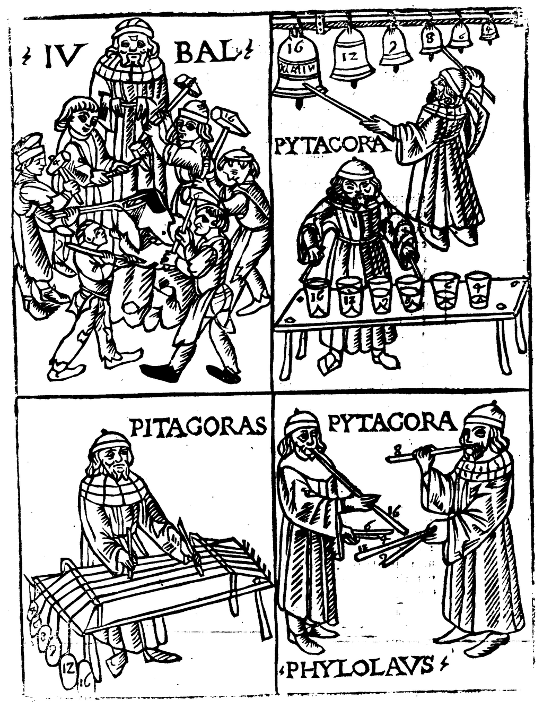[Jubal](https://en.wikipedia.org/wiki/Jubal_\(Bible\) "Jubal (Bible)"), [Pythagoras](https://en.wikipedia.org/wiki/Pythagoras "Pythagoras") and [Philolaus](https://en.wikipedia.org/wiki/Philolaus "Philolaus") engaged in theoretical investigations, in a woodcut from [Franchinus Gaffurius](https://en.wikipedia.org/wiki/Franchinus_Gaffurius "Franchinus Gaffurius"), _Theorica musicæ_ (1492)

**Music theory** is the study of theoretical frameworks for understanding the practices and possibilities of [music](https://en.wikipedia.org/wiki/Music "Music"). _[The Oxford Companion to Music](https://en.wikipedia.org/wiki/The_Oxford_Companion_to_Music "The Oxford Companion to Music")_ describes three interrelated uses of the term "music theory": The first refers to the "[rudiments](https://en.wikipedia.org/wiki/Elements_of_music "Elements of music")" needed to understand [music notation](https://en.wikipedia.org/wiki/Musical_notation "Musical notation") such as [key signatures](https://en.wikipedia.org/wiki/Key_signature "Key signature"), [time signatures](https://en.wikipedia.org/wiki/Time_signature "Time signature"), and [rhythmic notation](https://en.wikipedia.org/wiki/Chord_chart "Chord chart"); the second is a study of scholars' views on music from [antiquity](https://en.wikipedia.org/wiki/Ancient_history "Ancient history") to the present; the third is a sub-topic of [musicology](https://en.wikipedia.org/wiki/Musicology "Musicology") that "seeks to define processes and general principles in music". The musicological approach to theory differs from musical analysis "in that it takes as its starting-point not the individual work or performance but the fundamental materials from which it is built."

Music theory is frequently concerned with describing how musicians and composers make music, including [tuning systems](https://en.wikipedia.org/wiki/Musical_tuning "Musical tuning") and composition methods among other topics. Because of the ever-expanding conception of [what constitutes music](https://en.wikipedia.org/wiki/Definition_of_music "Definition of music"), a more inclusive definition could be the consideration of any sonic phenomena, including silence. This is not an absolute guideline, however; for example, the study of "music" in the _[Quadrivium](https://en.wikipedia.org/wiki/Quadrivium "Quadrivium")_ [liberal arts university](https://en.wikipedia.org/wiki/Liberal_arts_education "Liberal arts education") curriculum, that was common in [medieval Europe](https://en.wikipedia.org/wiki/Middle_Ages "Middle Ages"), was an abstract system of proportions that was carefully studied at a distance from actual musical practice. This medieval discipline became the basis for tuning systems in later centuries and is generally included in modern scholarship on the history of music theory.

Music theory as a practical discipline encompasses the methods and concepts that composers and other musicians use in creating and performing music. The development, preservation, and transmission of music theory in this sense may be found in oral and written music-making traditions, [musical instruments](https://en.wikipedia.org/wiki/Musical_instrument "Musical instrument"), and other [artifacts](https://en.wikipedia.org/wiki/Artifact_\(archaeology\) "Artifact (archaeology)"). For example, ancient instruments from [prehistoric](https://en.wikipedia.org/wiki/Prehistoric_music "Prehistoric music") sites around the world reveal details about the music they produced and potentially something of the musical theory that might have been used by their makers. In ancient and living cultures around the world, the deep and long roots of music theory are visible in instruments, oral traditions, and current music-making. Many cultures have also considered music theory in more formal ways such as written [treatises](https://en.wikipedia.org/wiki/Treatise "Treatise") and [music notation](https://en.wikipedia.org/wiki/Musical_notation "Musical notation"). Practical and scholarly traditions overlap, as many practical treatises about music place themselves within a tradition of other treatises, which are cited regularly just as [scholarly writing](https://en.wikipedia.org/wiki/Scholarly_writing "Scholarly writing") cites earlier research.

In modern academia, music theory is a subfield of [musicology](https://en.wikipedia.org/wiki/Musicology "Musicology"), the wider study of musical cultures and history. [Guido Adler](https://en.wikipedia.org/wiki/Guido_Adler "Guido Adler"), however, in one of the texts that founded musicology in the late 19th century, wrote that "the science of music originated at the same time as the art of sounds", where "the science of music" (_Musikwissenschaft_) obviously meant "music theory". Adler added that music only could exist when one began measuring pitches and comparing them to each other. He concluded that "all people for which one can speak of an art of sounds also have a science of sounds". One must deduce that music theory exists in all musical cultures of the world.

Music theory is often concerned with abstract musical aspects such as [tuning](https://en.wikipedia.org/wiki/Musical_tuning "Musical tuning") and tonal systems, [scales](https://en.wikipedia.org/wiki/Scale_\(music\) "Scale (music)"), [consonance and dissonance](https://en.wikipedia.org/wiki/Consonance_and_dissonance "Consonance and dissonance"), and rhythmic relationships. There is also a body of theory concerning practical aspects, such as the creation or the performance of music, [orchestration](https://en.wikipedia.org/wiki/Orchestration "Orchestration"), [ornamentation](https://en.wikipedia.org/wiki/Ornament_\(music\) "Ornament (music)"), improvisation, and [electronic sound](https://en.wikipedia.org/wiki/Electronic_music "Electronic music") production. A person who researches or teaches music theory is a music theorist. University study, typically to the [MA](https://en.wikipedia.org/wiki/Master_of_Arts "Master of Arts") or [PhD](https://en.wikipedia.org/wiki/Doctor_of_Philosophy "Doctor of Philosophy") level, is required to teach as a tenure-track music theorist in a US or Canadian university. Methods of analysis include mathematics, graphic analysis, and especially analysis enabled by western music notation. Comparative, descriptive, statistical, and other methods are also used. Music theory [textbooks](https://en.wikipedia.org/wiki/Textbook "Textbook"), especially in the United States of America, often include elements of [musical acoustics](https://en.wikipedia.org/wiki/Musical_acoustics "Musical acoustics"), considerations of [musical notation](https://en.wikipedia.org/wiki/Musical_notation "Musical notation"), and techniques of tonal [composition](https://en.wikipedia.org/wiki/Musical_composition "Musical composition") ([harmony](https://en.wikipedia.org/wiki/Harmony "Harmony") and [counterpoint](https://en.wikipedia.org/wiki/Counterpoint "Counterpoint")), among other topics.

## History

### Antiquity

#### Mesopotamia

Several surviving [Sumerian](https://en.wikipedia.org/wiki/Sumerian_language "Sumerian language") and [Akkadian](https://en.wikipedia.org/wiki/Akkadian_language "Akkadian language") [clay tablets](https://en.wikipedia.org/wiki/Clay_tablet "Clay tablet") include musical information of a theoretical nature, mainly lists of [intervals](https://en.wikipedia.org/wiki/Interval_\(music\) "Interval (music)") and [tunings](https://en.wikipedia.org/wiki/Musical_tuning "Musical tuning"). The scholar Sam Mirelman reports that the earliest of these texts dates from before 1500 BCE, a millennium earlier than surviving evidence from any other culture of comparable musical thought. Further, "All the Mesopotamian texts \[about music\] are united by the use of a terminology for music that, according to the approximate dating of the texts, was in use for over 1,000 years."

#### China

Much of Chinese music history and theory remains unclear.

Chinese theory starts from numbers, the main musical numbers being twelve, five and eight. Twelve refers to the number of pitches on which the scales can be constructed, Five refers to the Pentatonic Scale (primarily uses a 5-note scale), And Eight refers to the eight categories of Chinese Music Instruments; classified by the material they are made from: (Metal, Stone, Silk, Bamboo, Gourd, Clay, Leather, and Wood). The [Lüshi chunqiu](https://en.wikipedia.org/wiki/Lüshi_chunqiu "Lüshi chunqiu") from about 238 BCE recalls the legend of [Ling Lun](https://en.wikipedia.org/wiki/Ling_Lun "Ling Lun"). On order of the [Yellow Emperor](https://en.wikipedia.org/wiki/Yellow_Emperor "Yellow Emperor"), Ling Lun collected twelve [bamboo](https://en.wikipedia.org/wiki/Bamboo "Bamboo") lengths with thick and even nodes. Blowing on one of these like a pipe, he found its sound agreeable and named it _huangzhong_, the "Yellow Bell". He then heard [phoenixes](https://en.wikipedia.org/wiki/Fenghuang "Fenghuang") singing. The male and female phoenix each sang six tones. Ling Lun cut his bamboo pipes to match the pitches of the phoenixes, producing twelve pitch pipes in two sets: six from the male phoenix and six from the female: these were called the _lülü_ or later the _shierlü_.

> Apart from technical and structural aspects, ancient Chinese music theory also discusses topics such as the nature and functions of music. The _[Yueji](https://en.wikipedia.org/wiki/Record_of_Music "Record of Music")_ ("Record of music", c1st and 2nd centuries BCE), for example, manifests [Confucian](https://en.wikipedia.org/wiki/Confucianism "Confucianism") moral theories of understanding music in its social context. Studied and implemented by Confucian scholar-officials \[...\], these theories helped form a musical Confucianism that overshadowed but did not erase rival approaches. These include the assertion of [Mozi](https://en.wikipedia.org/wiki/Mozi "Mozi") (c. 468 – c. 376 BCE) that music wasted human and material resources, and [Laozi](https://en.wikipedia.org/wiki/Laozi "Laozi")'s claim that the greatest music had no sounds. \[...\] Even the music of the [_qin_ zither](https://en.wikipedia.org/wiki/Guqin "Guqin"), a genre closely affiliated with Confucian scholar-officials, includes many works with [Daoist](https://en.wikipedia.org/wiki/Taoism "Taoism") references, such as _Tianfeng huanpei_ ("Heavenly Breeze and Sounds of Jade Pendants").

#### India

The [Samaveda](https://en.wikipedia.org/wiki/Samaveda "Samaveda") and [Yajurveda](https://en.wikipedia.org/wiki/Yajurveda "Yajurveda") (c. 1200 – 1000 BCE) are among the earliest testimonies of Indian music, but properly speaking, they contain no theory. The [Natya Shastra](https://en.wikipedia.org/wiki/Natya_Shastra "Natya Shastra"), written between 200 BCE to 200 CE, discusses intervals (_[Śrutis](https://en.wikipedia.org/wiki/Shruti_\(music\) "Shruti (music)")_), scales (_Grāmas_), consonances and dissonances, classes of melodic structure (_Mūrchanās_, modes?), melodic types (_Jātis_), instruments, etc.

#### Greece

Early preserved Greek writings on music theory include two types of works:

*   technical manuals describing the Greek musical system including notation, scales, consonance and dissonance, rhythm, and types of musical compositions;
*   treatises on the way in which music reveals universal patterns of order leading to the highest levels of knowledge and understanding.

Several names of theorists are known before these works, including [Pythagoras](https://en.wikipedia.org/wiki/Pythagoras "Pythagoras") (c. 570 ~ c. 495 BCE), [Philolaus](https://en.wikipedia.org/wiki/Philolaus "Philolaus") (c. 470 ~ (c. 385 BCE), [Archytas](https://en.wikipedia.org/wiki/Archytas "Archytas") (428–347 BCE), and others.

Works of the first type (technical manuals) include

*   Anonymous (erroneously attributed to [Euclid](https://en.wikipedia.org/wiki/Euclid "Euclid")) (1989) \[4th–3rd century BCE\]. Barker, Andrew (ed.). _Κατατομή κανόνος_ \[_Division of the Canon_\]. Greek Musical Writings. Vol. 2: Harmonic and Acoustic Theory. Cambridge, UK: Cambridge University Press. pp. 191–208\. English trans.
*   [Theon of Smyrna](https://en.wikipedia.org/wiki/Theon_of_Smyrna "Theon of Smyrna"). _Τωv κατά τό μαθηματικόν χρησίμων είς τήν Πλάτωνος άνάγνωσις_ \[_On the Mathematics Useful for Understanding Plato_\] (in Greek). 115–140 CE.
*   [Nicomachus of Gerasa](https://en.wikipedia.org/wiki/Nicomachus#Manual_of_Harmonics "Nicomachus"). _Άρμονικόν έγχειρίδιον_ \[_Manual of Harmonics_\]. 100–150 CE.
*   [Cleonides](https://en.wikipedia.org/wiki/Cleonides "Cleonides"). _Είσαγωγή άρμονική_ \[_Introduction to Harmonics_\] (in Greek). 2nd century CE.
*   [Gaudentius](https://en.wikipedia.org/wiki/Gaudentius_\(music_theorist\) "Gaudentius (music theorist)"). _Άρμονική είσαγωγή_ \[_Harmonic Introduction_\] (in Greek). 3rd or 4th century CE.
*   Bacchius Geron. _Είσαγωγή τέχνης μουσικής_ \[_Introduction to the Art of Music_\]. 4th century CE or later.
*   [Alypius of Alexandria](https://en.wikipedia.org/wiki/Alypius_of_Alexandria "Alypius of Alexandria"). _Είσαγωγή μουσική_ \[_Introduction to Music_\] (in Greek). 4th–5th century CE.

More philosophical treatises of the second type include

*   [Aristoxenus](https://en.wikipedia.org/wiki/Aristoxenus "Aristoxenus"). _Άρμονικά στοιχεία_ \[_Harmonic Elements_\] (in Greek). 375~360 BCE, before 320 BCE.
*   [Aristoxenus](https://en.wikipedia.org/wiki/Aristoxenus "Aristoxenus"). _Ρυθμικά στοιχεία_ \[_Rhythmic Elements_\] (in Greek).
*   [Ptolemaios (Πτολεμαίος), Claudius](https://en.wikipedia.org/wiki/Ptolemy "Ptolemy"). _Άρμονικά_ \[_Harmonics_\] (in Greek). 127–148 CE.
*   [Porphyrius](https://en.wikipedia.org/wiki/Porphyry_\(philosopher\) "Porphyry (philosopher)"). _Είς τά άρμονικά Πτολεμαίον ύπόμνημα_ \[_On Ptolemy's Harmonics_\] (in Greek). c. 232~233 – c. 305 CE.

### Post-classical or Medieval Period

#### China

The [pipa](https://en.wikipedia.org/wiki/Pipa "Pipa") instrument carried with it a theory of musical modes that subsequently led to the Sui and Tang theory of 84 musical modes.

#### Arabic countries / Persian countries

Medieval Arabic music theorists include:

*   Abū Yūsuf Ya'qūb [al-Kindi](https://en.wikipedia.org/wiki/Al-Kindi#Music_theory "Al-Kindi") (Bagdad, 873 CE), who uses the first twelve letters of the alphabet to describe the twelve frets on five strings of the [oud](https://en.wikipedia.org/wiki/Oud "Oud"), producing a chromatic scale of 25 degrees.
*   \[Yaḥyā ibn\] al-[Munajjim](https://en.wikipedia.org/wiki/Banu_Munajjim "Banu Munajjim") (Baghdad, 856–912), author of _Risāla fī al-mūsīqī_ ("Treatise on music", MS GB-Lbl Oriental 2361) which describes a [Pythagorean tuning](https://en.wikipedia.org/wiki/Pythagorean_tuning "Pythagorean tuning") of the [oud](https://en.wikipedia.org/wiki/Oud "Oud") and a system of eight modes perhaps inspired by [Ishaq al-Mawsili](https://en.wikipedia.org/wiki/Ishaq_al-Mawsili "Ishaq al-Mawsili") (767–850).
*   Abū n-Nașr Muḥammad [al-Fārābi](https://en.wikipedia.org/wiki/Al-Farabi#Music "Al-Farabi") (Persia, 872? – Damas, 950 or 951 CE), author of _[Kitab al-Musiqa al-Kabir](https://en.wikipedia.org/wiki/Kitab_al-Musiqa_al-Kabir "Kitab al-Musiqa al-Kabir")_ ("The Great Book of Music").
*   'Ali ibn al-Husayn ul-Isfahānī (897–967), known as [Abu al-Faraj al-Isfahani](https://en.wikipedia.org/wiki/Abu_al-Faraj_al-Isfahani "Abu al-Faraj al-Isfahani"), author of _Kitāb al-Aghānī_ ("The Book of Songs").
*   Abū 'Alī al-Ḥusayn ibn ʿAbd-Allāh ibn Sīnā, known as [Avicenna](https://en.wikipedia.org/wiki/Avicenna "Avicenna") (c. 980 – 1037), whose contribution to music theory consists mainly in Chapter 12 of the section on mathematics of his _Kitab Al-Shifa_ ("[The Book of Healing](https://en.wikipedia.org/wiki/The_Book_of_Healing "The Book of Healing")").
*   al-Ḥasan ibn Aḥmad ibn 'Ali al-Kātib, author of Kamāl adab al Ghinā' ("The Perfection of Musical Knowledge"), copied in 1225 (Istanbul, Topkapi Museum, Ms 1727).
*   [Safi al-Din al-Urmawi](https://en.wikipedia.org/wiki/Safi_al-Din_al-Urmawi "Safi al-Din al-Urmawi") (1216–1294 CE), author of the _Kitabu al-Adwār_ ("Treatise of musical cycles") and _ar-Risālah aš-Šarafiyyah_ ("Epistle to Šaraf").
*   Mubārak Šāh, commentator of Safi al-Din's _Kitāb al-Adwār_ ([British Museum](https://en.wikipedia.org/wiki/British_Museum "British Museum"), Ms 823).
*   Anon. LXI, Anonymous commentary on Safi al-Din's _Kitāb al-Adwār_.
*   Shams al-dῑn al-Saydᾱwῑ Al-Dhahabῑ (14th century CE (?)), music theorist. Author of _Urjῡza fi'l-mῡsῑqᾱ_ ("A Didactic Poem on Music").

#### Europe

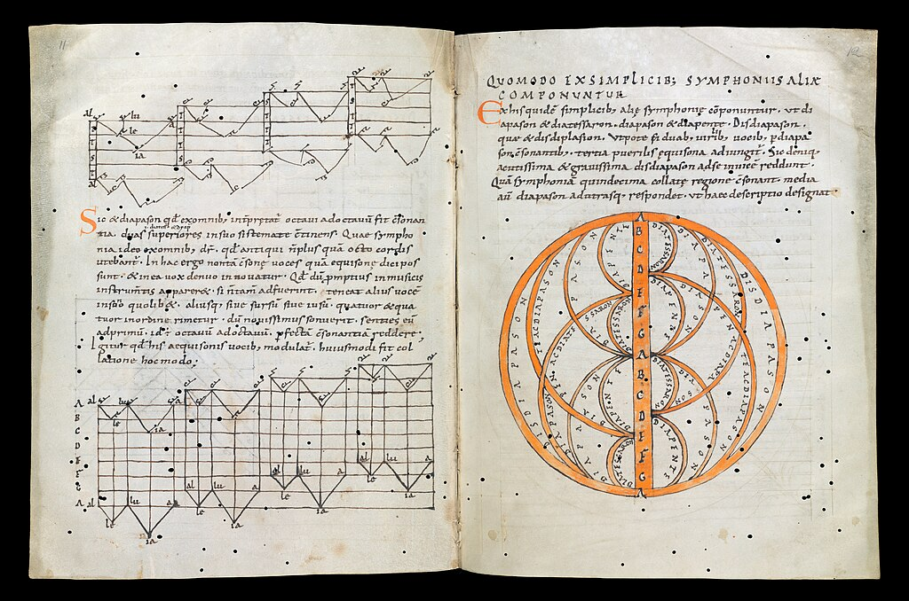Explanation of the [diapason](https://en.wikipedia.org/wiki/Octave "Octave") in a 10th-century manuscript of __[Musica enchiriadis](https://en.wikipedia.org/wiki/Musica_enchiriadis "Musica enchiriadis")__

The Latin treatise __De institutione musica__ by the Roman philosopher [Boethius](https://en.wikipedia.org/wiki/Boethius "Boethius") (written c. 500, translated as _Fundamentals of Music_) was a touchstone for other writings on music in medieval Europe. Boethius represented Classical authority on music during the Middle Ages, as the Greek writings on which he based his work were not read or translated by later Europeans until the 15th century. This treatise carefully maintains distance from the actual practice of music, focusing mostly on the mathematical proportions involved in tuning systems and on the moral character of particular modes. Several centuries later, treatises began to appear which dealt with the actual composition of pieces of music in the [plainchant](https://en.wikipedia.org/wiki/Plainchant "Plainchant") tradition. At the end of the ninth century, [Hucbald](https://en.wikipedia.org/wiki/Hucbald "Hucbald") worked towards more precise pitch notation for the [neumes](https://en.wikipedia.org/wiki/Neume "Neume") used to record plainchant.

[Guido d'Arezzo](https://en.wikipedia.org/wiki/Guido_d'Arezzo "Guido d'Arezzo") wrote a letter to Michael of Pomposa in 1028, entitled __Epistola de ignoto cantu__, in which he introduced the practice of using syllables to describe notes and intervals. This was the source of the hexachordal [solmization](https://en.wikipedia.org/wiki/Solmization "Solmization") that was to be used until the end of the Middle Ages. Guido also wrote about emotional qualities of the modes, the phrase structure of plainchant, the temporal meaning of the neumes, etc.; his chapters on polyphony "come closer to describing and illustrating real music than any previous account" in the Western tradition.

During the thirteenth century, a new rhythm system called [mensural notation](https://en.wikipedia.org/wiki/Mensural_notation "Mensural notation") grew out of an earlier, more limited method of notating rhythms in terms of fixed repetitive patterns, the so-called _rhythmic modes_, which were developed in France around 1200. An early form of mensural notation was first described and codified in the treatise __Ars cantus mensurabilis__ ("The art of measured chant") by [Franco of Cologne](https://en.wikipedia.org/wiki/Franco_of_Cologne "Franco of Cologne") (c. 1280). Mensural notation used different note shapes to specify different durations, allowing scribes to capture rhythms which varied instead of repeating the same fixed pattern; it is a proportional notation, in the sense that each note value is equal to two or three times the shorter value, or half or a third of the longer value. This same notation, transformed through various extensions and improvements during the Renaissance, forms the basis for rhythmic notation in [European classical music](https://en.wikipedia.org/wiki/European_classical_music "European classical music") today.

### Modern

#### Middle Eastern and Central Asian countries

*   Bāqiyā Nāyinῑ (Uzbekistan, 17th century CE), Uzbek author and music theorist. Author of _Zamzama e wahdat-i-mῡsῑqῑ_ \["The Chanting of Unity in Music"\].
*   Baron Francois Rodolphe d'Erlanger (Tunis, Tunisia, 1910–1932 CE), French musicologist. Author of _La musique arabe_ and _Ta'rῑkh al-mῡsῑqᾱ al-arabiyya wa-usῡluha wa-tatawwurᾱtuha_ \["A History of Arabian Music, its principles and its Development"\]

D'Erlanger divulges that the Arabic music scale is derived from the Greek music scale, and that Arabic music is connected to certain features of Arabic culture, such as astrology.

#### Europe

*   **Renaissance**

*   **Baroque**

*   **1750–1900**
    *   As Western musical influence spread throughout the world in the 1800s, musicians adopted Western theory as an international standard—but other theoretical traditions in both textual and oral traditions remain in use. For example, the long and rich musical traditions unique to ancient and current cultures of Africa are primarily oral, but describe specific forms, genres, performance practices, tunings, and other aspects of music theory.
    *   [Sacred harp](https://en.wikipedia.org/wiki/Sacred_harp "Sacred harp") music uses a different kind of scale and theory in practice. The music focuses on the solfege "fa, sol, la" on the music scale. Sacred Harp also employs a different notation involving "shape notes", or notes that are shaped to correspond to a certain solfege syllable on the music scale. Sacred Harp music and its music theory originated with Reverend Thomas Symmes in 1720, where he developed a system for "singing by note" to help his church members with note accuracy.

### Contemporary

## Fundamentals of music

Music is composed of [aural](https://en.wikipedia.org/wiki/Aural "Aural") phenomena; "music theory" considers how those phenomena apply in music. Music theory considers melody, rhythm, counterpoint, harmony, form, tonal systems, scales, tuning, intervals, consonance, dissonance, durational proportions, the acoustics of pitch systems, composition, performance, orchestration, ornamentation, improvisation, electronic sound production, etc.

### Pitch

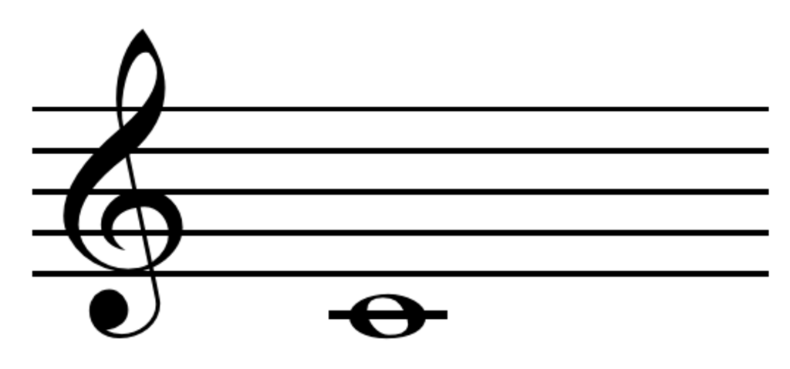Middle C (261.626 Hz)

Pitch is the lowness or highness of a [tone](https://en.wikipedia.org/wiki/Musical_tone "Musical tone"), for example the difference between [middle C](https://en.wikipedia.org/wiki/Middle_C "Middle C") and a higher C. The frequency of the sound waves producing a pitch can be measured precisely, but the perception of pitch is more complex because single notes from natural sources are usually a complex mix of many frequencies. Accordingly, theorists often describe pitch as a subjective sensation rather than an objective measurement of sound.

Specific frequencies are often assigned letter names. Today most orchestras assign [concert A](https://en.wikipedia.org/wiki/Concert_A "Concert A") (the A above [middle C](https://en.wikipedia.org/wiki/Middle_C "Middle C") on the piano) to the frequency of 440 Hz. This assignment is somewhat arbitrary; for example, in 1859 France, the same A was tuned to 435 Hz. Such differences can have a noticeable effect on the timbre of instruments and other phenomena. Thus, in [historically informed performance](https://en.wikipedia.org/wiki/Historically_informed_performance "Historically informed performance") of older music, tuning is often set to match the tuning used in the period when it was written. Additionally, many cultures do not attempt to standardize pitch, often considering that it should be allowed to vary depending on genre, style, mood, etc.

The difference in pitch between two notes is called an [interval](https://en.wikipedia.org/wiki/Interval_\(music\) "Interval (music)"). The most basic interval is the [unison](https://en.wikipedia.org/wiki/Unison "Unison"), which is simply two notes of the same pitch. The [octave](https://en.wikipedia.org/wiki/Octave "Octave") interval is two pitches that are either double or half the frequency of one another. The unique characteristics of octaves gave rise to the concept of [pitch class](https://en.wikipedia.org/wiki/Pitch_class "Pitch class"): pitches of the same letter name that occur in different octaves may be grouped into a single "class" by ignoring the difference in octave. For example, a high C and a low C are members of the same pitch class—the class that contains all C's.

[Musical tuning](https://en.wikipedia.org/wiki/Musical_tuning "Musical tuning") systems, or temperaments, determine the precise size of intervals. Tuning systems vary widely within and between world cultures. In [Western culture](https://en.wikipedia.org/wiki/Western_culture "Western culture"), there have long been several competing tuning systems, all with different qualities. Internationally, the system known as [equal temperament](https://en.wikipedia.org/wiki/Equal_temperament "Equal temperament") is most commonly used today because it is considered the most satisfactory compromise that allows instruments of fixed tuning (e.g. the piano) to sound acceptably in tune in all keys.

### Scales and modes

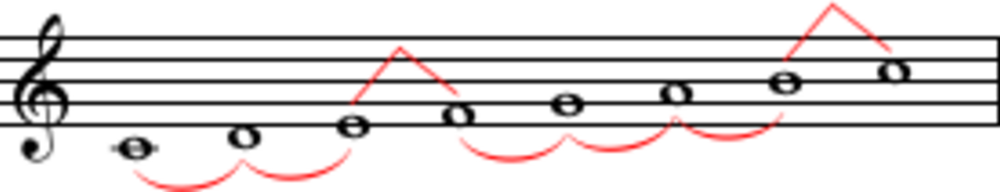A pattern of whole and half steps in the Ionian mode or major scale on C

Notes can be arranged in a variety of [scales](https://en.wikipedia.org/wiki/Scale_\(music\) "Scale (music)") and [modes](https://en.wikipedia.org/wiki/Musical_mode "Musical mode"). Western music theory generally divides the octave into a series of twelve pitches, called a [chromatic scale](https://en.wikipedia.org/wiki/Chromatic_scale "Chromatic scale"), within which the interval between adjacent tones is called a [semitone](https://en.wikipedia.org/wiki/Semitone "Semitone"), or half step. Selecting tones from this set of 12 and arranging them in patterns of semitones and whole tones creates other scales.

The most commonly encountered scales are the seven-toned [major](https://en.wikipedia.org/wiki/Major_scale "Major scale"), the [harmonic minor](https://en.wikipedia.org/wiki/Harmonic_minor "Harmonic minor"), the [melodic minor](https://en.wikipedia.org/wiki/Melodic_minor "Melodic minor"), and the [natural minor](https://en.wikipedia.org/wiki/Natural_minor "Natural minor"). Other examples of scales are the [octatonic scale](https://en.wikipedia.org/wiki/Octatonic_scale "Octatonic scale") and the [pentatonic](https://en.wikipedia.org/wiki/Pentatonic "Pentatonic") or five-tone scale, which is common in [folk music](https://en.wikipedia.org/wiki/Folk_music "Folk music") and [blues](https://en.wikipedia.org/wiki/Blues "Blues"). Non-Western cultures often use scales that do not correspond with an equally divided twelve-tone division of the octave. For example, classical [Ottoman](https://en.wikipedia.org/wiki/Ottoman_classical_music "Ottoman classical music"), [Persian](https://en.wikipedia.org/wiki/Persian_classical_music "Persian classical music"), [Indian](https://en.wikipedia.org/wiki/Indian_classical_music "Indian classical music") and [Arabic](https://en.wikipedia.org/wiki/Arabic_music "Arabic music") musical systems often make use of multiples of quarter tones (half the size of a semitone, as the name indicates), for instance in 'neutral' seconds (three quarter tones) or 'neutral' thirds (seven quarter tones)—they do not normally use the quarter tone itself as a direct interval.

In traditional Western notation, the scale used for a composition is usually indicated by a [key signature](https://en.wikipedia.org/wiki/Key_signature "Key signature") at the beginning to designate the pitches that make up that scale. As the music progresses, the pitches used may change and introduce a different scale. Music can be [transposed](https://en.wikipedia.org/wiki/Transposition_\(music\) "Transposition (music)") from one scale to another for various purposes, often to accommodate the range of a vocalist. Such transposition raises or lowers the overall pitch range, but preserves the interval relationships of the original scale. For example, transposition from the key of C major to D major raises all pitches of the scale of C major equally by a [whole tone](https://en.wikipedia.org/wiki/Whole_tone "Whole tone"). Since the interval relationships remain unchanged, transposition may be unnoticed by a listener, however other qualities may change noticeably because transposition changes the relationship of the overall pitch [range](https://en.wikipedia.org/wiki/Range_\(music\) "Range (music)") compared to the range of the instruments or voices that perform the music. This often affects the music's overall sound, as well as having technical implications for the performers.

The interrelationship of the keys most commonly used in Western tonal music is conveniently shown by the [circle of fifths](https://en.wikipedia.org/wiki/Circle_of_fifths "Circle of fifths"). Unique key signatures are also sometimes devised for a particular composition. During the Baroque period, emotional associations with specific keys, known as the [doctrine of the affections](https://en.wikipedia.org/wiki/Doctrine_of_the_affections "Doctrine of the affections"), were an important topic in music theory, but the unique tonal colorings of keys that gave rise to that doctrine were largely erased with the adoption of equal temperament. However, many musicians continue to feel that certain keys are more appropriate to certain emotions than others. [Indian classical music](https://en.wikipedia.org/wiki/Indian_classical_music "Indian classical music") theory continues to strongly associate keys with emotional states, times of day, and other extra-musical concepts and notably, does not employ equal temperament.

### Consonance and dissonance

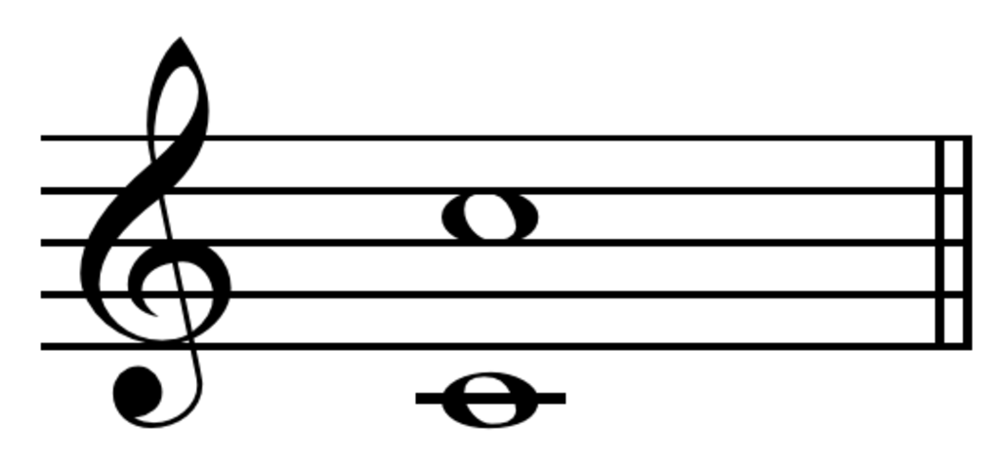

[Perfect octave](https://en.wikipedia.org/wiki/Perfect_octave "Perfect octave"), a consonant interval

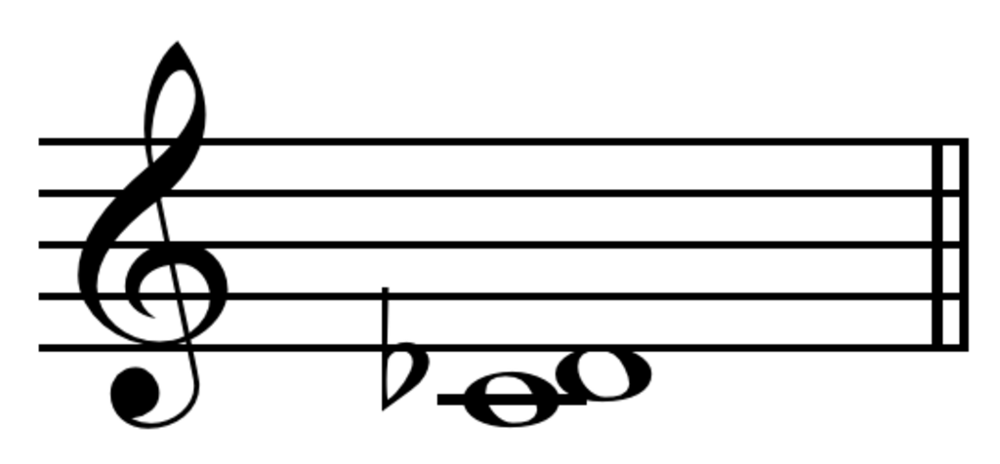

[Minor second](https://en.wikipedia.org/wiki/Minor_second "Minor second"), a dissonant interval

[Consonance and dissonance](https://en.wikipedia.org/wiki/Consonance_and_dissonance "Consonance and dissonance") are subjective qualities of the sonority of intervals that vary widely in different cultures and over the ages. Consonance (or concord) is a feeling that an interval or chord is stable, harmonious, or complete. While dissonance (or discord) is a feeling that the interval or chords are incomplete, clashing, or unresolved. In western music theory, perfect fourths, fifths, and octaves and all major and minor thirds and sixths are considered consonant, while other intervals are considered dissonant to a greater or lesser degree.

Context and many other aspects can affect apparent dissonance and consonance. For example, in a Debussy prelude, a major second may sound stable and consonant, while the same interval may sound dissonant in a Bach fugue. In the [Common practice era](https://en.wikipedia.org/wiki/Common_practice_period "Common practice period"), the perfect fourth is considered dissonant when not supported by a lower third or fifth. Since the early 20th century, [Arnold Schoenberg](https://en.wikipedia.org/wiki/Arnold_Schoenberg "Arnold Schoenberg")'s concept of "emancipated" dissonance, in which traditionally dissonant intervals can be treated as "higher", more remote consonances, has become more widely accepted.

### Rhythm

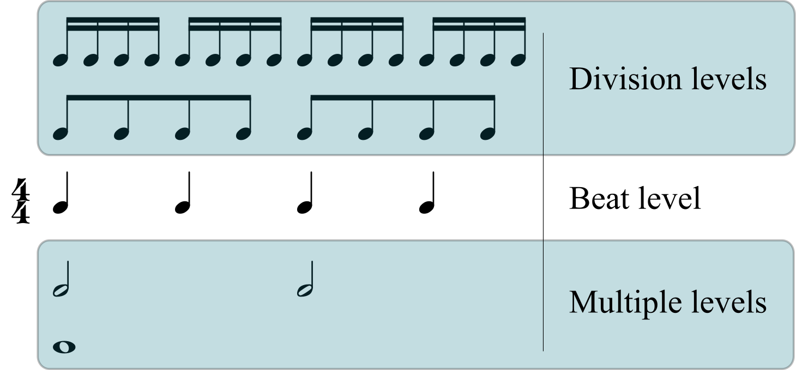[Metric levels](https://en.wikipedia.org/wiki/Metric_level "Metric level"): beat level shown in middle with division levels above and multiple levels below

Rhythm is produced by the sequential arrangement of sounds and silences in time. [Meter](https://en.wikipedia.org/wiki/Metre_\(music\) "Metre (music)") measures music in regular pulse groupings, called [measures or bars](https://en.wikipedia.org/wiki/Bar_\(music\) "Bar (music)"). The [time signature](https://en.wikipedia.org/wiki/Time_signature "Time signature") or meter signature specifies how many beats are in a measure, and which value of written note is counted or felt as a single beat.

Through increased stress, or variations in duration or articulation, particular tones may be accented. There are conventions in most musical traditions for regular and hierarchical accentuation of beats to reinforce a given meter. [Syncopated](https://en.wikipedia.org/wiki/Syncopation "Syncopation") rhythms contradict those conventions by accenting unexpected parts of the beat. Playing simultaneous rhythms in more than one time signature is called [polyrhythm](https://en.wikipedia.org/wiki/Polyrhythm "Polyrhythm").

In recent years, rhythm and meter have become an important area of research among music scholars. The most highly cited of these recent scholars are [Maury Yeston](https://en.wikipedia.org/wiki/Maury_Yeston "Maury Yeston"), [Fred Lerdahl](https://en.wikipedia.org/wiki/Fred_Lerdahl "Fred Lerdahl") and [Ray Jackendoff](https://en.wikipedia.org/wiki/Ray_Jackendoff "Ray Jackendoff"), [Jonathan Kramer](https://en.wikipedia.org/wiki/Jonathan_Kramer "Jonathan Kramer"), and Justin London.

### Melody

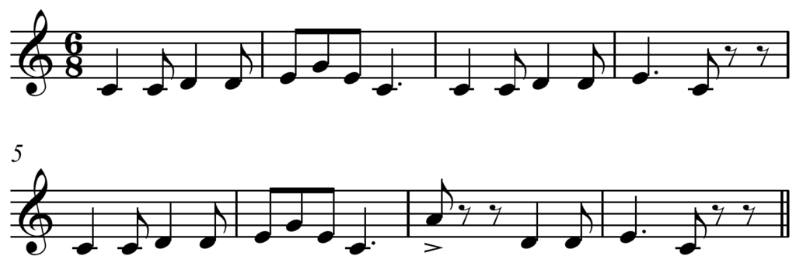"[Pop Goes the Weasel](https://en.wikipedia.org/wiki/Pop_Goes_the_Weasel "Pop Goes the Weasel")" melody

A [melody](https://en.wikipedia.org/wiki/Melody "Melody") is a group of sounds in succession, a tune, or an arrangement. Melody is often a prominent aspect of music, and so its construction and qualities are a primary interest of music theory.

The basic elements of melody are pitch, duration, rhythm, and tempo. The tones of a melody are usually drawn from pitch systems such as [scales](https://en.wikipedia.org/wiki/Musical_scale "Musical scale") or [modes](https://en.wikipedia.org/wiki/Musical_mode "Musical mode"). Melody may consist, to increasing degree, of the figure, motive, semi-phrase, antecedent and consequent phrase, and period or sentence. The period may be considered the complete melody, however some examples combine two periods, or use other combinations of constituents to create larger form melodies.

### Chord

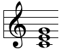C major triad represented in [staff notation](https://en.wikipedia.org/wiki/Staff_notation "Staff notation").
[Play](https://upload.wikimedia.org/wikipedia/commons/transcoded/5/51/Just_major_triad_on_C.mid/Just_major_triad_on_C.mid.mp3 "Play audio")[ⓘ](https://en.wikipedia.org/wiki/File:Just_major_triad_on_C.mid "File:Just major triad on C.mid") in [just intonation](https://en.wikipedia.org/wiki/Just_intonation "Just intonation")
[Play](https://upload.wikimedia.org/wikipedia/commons/transcoded/6/60/Major_triad_on_C.mid/Major_triad_on_C.mid.mp3 "Play audio")[ⓘ](https://en.wikipedia.org/wiki/File:Major_triad_on_C.mid "File:Major triad on C.mid") in [Equal temperament](https://en.wikipedia.org/wiki/Equal_temperament "Equal temperament")
[Play](https://upload.wikimedia.org/wikipedia/commons/transcoded/4/47/Quarter-comma_meantone_major_chord_on_C.mid/Quarter-comma_meantone_major_chord_on_C.mid.mp3 "Play audio")[ⓘ](https://en.wikipedia.org/wiki/File:Quarter-comma_meantone_major_chord_on_C.mid "File:Quarter-comma meantone major chord on C.mid") in [1/4-comma meantone](https://en.wikipedia.org/wiki/Meantone_temperament "Meantone temperament")
[Play](https://upload.wikimedia.org/wikipedia/commons/transcoded/d/df/Young_temperament_major_chord_on_C.mid/Young_temperament_major_chord_on_C.mid.mp3 "Play audio")[ⓘ](https://en.wikipedia.org/wiki/File:Young_temperament_major_chord_on_C.mid "File:Young temperament major chord on C.mid") in [Young temperament](https://en.wikipedia.org/wiki/Young_temperament "Young temperament")
[Play](https://upload.wikimedia.org/wikipedia/commons/transcoded/6/63/Pythagorean_major_chord_on_C.mid/Pythagorean_major_chord_on_C.mid.mp3 "Play audio")[ⓘ](https://en.wikipedia.org/wiki/File:Pythagorean_major_chord_on_C.mid "File:Pythagorean major chord on C.mid") in [Pythagorean tuning](https://en.wikipedia.org/wiki/Pythagorean_tuning "Pythagorean tuning")

A chord, in music, is any [harmonic](https://en.wikipedia.org/wiki/Harmony "Harmony") set of three or more [notes](https://en.wikipedia.org/wiki/Musical_note "Musical note") that is heard as if sounding [simultaneously](https://en.wikipedia.org/wiki/Simultaneity_\(music\) "Simultaneity (music)"). These need not actually be played together: [arpeggios](https://en.wikipedia.org/wiki/Arpeggio "Arpeggio") and broken chords may, for many practical and theoretical purposes, constitute chords. Chords and [sequences of chords](https://en.wikipedia.org/wiki/Chord_progression "Chord progression") are frequently used in modern Western, West African, and Oceanian music, whereas they are absent from the music of many other parts of the world.

The most frequently encountered chords are [triads](https://en.wikipedia.org/wiki/Triad_\(music\) "Triad (music)"), so called because they consist of three distinct notes: further notes may be added to give [seventh chords](https://en.wikipedia.org/wiki/Seventh_chord "Seventh chord"), [extended chords](https://en.wikipedia.org/wiki/Extended_chord "Extended chord"), or [added tone chords](https://en.wikipedia.org/wiki/Added_tone_chord "Added tone chord"). The most [common chords](https://en.wikipedia.org/wiki/Common_chord_\(music\) "Common chord (music)") are the _[major](https://en.wikipedia.org/wiki/Major_chord "Major chord")_ and _[minor](https://en.wikipedia.org/wiki/Minor_chord "Minor chord") [triads](https://en.wikipedia.org/wiki/Triad_\(music\) "Triad (music)")_ and then the _[augmented](https://en.wikipedia.org/wiki/Augmented_triad "Augmented triad")_ and _[diminished](https://en.wikipedia.org/wiki/Diminished_triad "Diminished triad") [triads](https://en.wikipedia.org/wiki/Triad_\(music\) "Triad (music)")_. The descriptions _major_, _minor_, _augmented_, and _diminished_ are sometimes referred to collectively as chordal _quality_. Chords are also commonly classed by their [root](https://en.wikipedia.org/wiki/Root_\(chord\) "Root (chord)") note—so, for instance, the chord **C** major may be described as a triad of major quality built on the note **C**. Chords may also be classified by [inversion](https://en.wikipedia.org/wiki/Inverted_chord "Inverted chord"), the order in which the notes are stacked.

A series of chords is called a [chord progression](https://en.wikipedia.org/wiki/Chord_progression "Chord progression"). Although any chord may in principle be followed by any other chord, certain patterns of chords have been accepted as establishing [key](https://en.wikipedia.org/wiki/Key_\(music\) "Key (music)") in [common-practice harmony](https://en.wikipedia.org/wiki/Common_practice_harmony "Common practice harmony"). To describe this, chords are numbered, using [Roman numerals](https://en.wikipedia.org/wiki/Roman_numerals "Roman numerals") (upward from the key-note), per their [diatonic function](https://en.wikipedia.org/wiki/Diatonic_function "Diatonic function"). Common ways of [notating or representing chords](/source/music-theory/#Notation) in western music other than conventional [staff notation](https://en.wikipedia.org/wiki/Staff_notation "Staff notation") include [Roman numerals](https://en.wikipedia.org/wiki/Roman_numerals#Music_theory "Roman numerals"), [figured bass](https://en.wikipedia.org/wiki/Figured_bass "Figured bass") (much used in the [Baroque era](https://en.wikipedia.org/wiki/Baroque_music "Baroque music")), [chord letters](https://en.wikipedia.org/wiki/Chord_letter "Chord letter") (sometimes used in modern [musicology](https://en.wikipedia.org/wiki/Musicology "Musicology")), and various systems of [chord charts](https://en.wikipedia.org/wiki/Chord_chart "Chord chart") typically found in the [lead sheets](https://en.wikipedia.org/wiki/Lead_sheet "Lead sheet") used in [popular music](https://en.wikipedia.org/wiki/Chord_names_and_symbols_\(popular_music\) "Chord names and symbols (popular music)") to lay out the sequence of chords so that the musician may play accompaniment chords or improvise a solo.

### Harmony

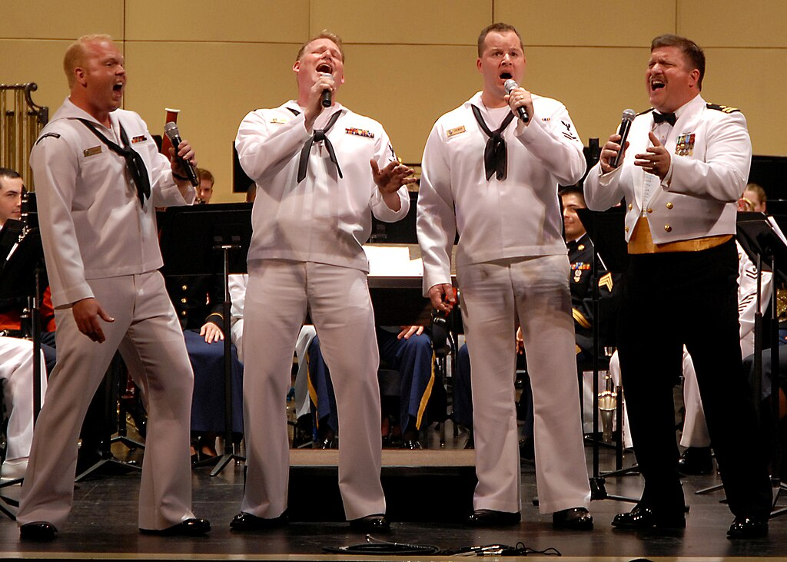[Barbershop quartets](https://en.wikipedia.org/wiki/Barbershop_quartet "Barbershop quartet"), such as this US Navy group, sing 4-part pieces, made up of a melody line (normally the second-highest voice, called the "lead") and 3 harmony parts.

In music, harmony is the use of simultaneous [pitches](https://en.wikipedia.org/wiki/Pitch_\(music\) "Pitch (music)") ([tones](https://en.wikipedia.org/wiki/Timbre "Timbre"), [notes](https://en.wikipedia.org/wiki/Note_\(music\) "Note (music)")), or [chords](https://en.wikipedia.org/wiki/Chord_\(music\) "Chord (music)"). The study of harmony involves chords and their construction and [chord progressions](https://en.wikipedia.org/wiki/Chord_progression "Chord progression") and the principles of connection that govern them. Harmony is often said to refer to the "vertical" aspect of music, as distinguished from [melodic line](https://en.wikipedia.org/wiki/Melody "Melody"), or the "horizontal" aspect. [Counterpoint](https://en.wikipedia.org/wiki/Counterpoint "Counterpoint"), which refers to the interweaving of melodic lines, and [polyphony](https://en.wikipedia.org/wiki/Polyphony "Polyphony"), which refers to the relationship of separate independent voices, is thus sometimes distinguished from harmony.

In [popular](https://en.wikipedia.org/wiki/Popular_harmony "Popular harmony") and [jazz harmony](https://en.wikipedia.org/wiki/Jazz_harmony "Jazz harmony"), chords are named by their [root](https://en.wikipedia.org/wiki/Root_\(chord\) "Root (chord)") plus various terms and characters indicating their qualities. For example, a [lead sheet](https://en.wikipedia.org/wiki/Lead_sheet "Lead sheet") may indicate chords such as C major, D minor, and G dominant seventh. In many types of music, notably Baroque, Romantic, modern, and jazz, chords are often augmented with "tensions". A tension is an additional chord member that creates a relatively [dissonant interval](https://en.wikipedia.org/wiki/Consonance_and_dissonance "Consonance and dissonance") in relation to the bass. It is part of a chord, but is not one of the chord tones (1 3 5 7). Typically, in the classical [common practice period](https://en.wikipedia.org/wiki/Common_practice_period "Common practice period") a dissonant chord (chord with tension) "resolves" to a consonant chord. [Harmonization](https://en.wikipedia.org/wiki/Harmonization "Harmonization") usually sounds pleasant to the ear when there is a balance between the consonant and dissonant sounds. In simple words, that occurs when there is a balance between "tense" and "relaxed" moments.

### Timbre

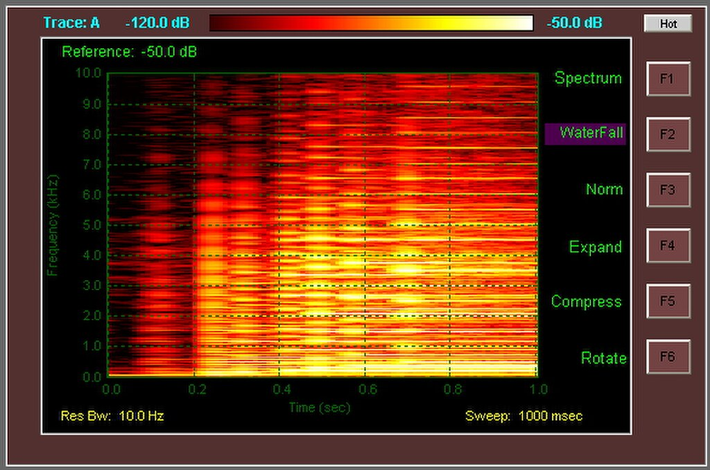[Spectrogram](https://en.wikipedia.org/wiki/Spectrogram "Spectrogram") of the first second of an E9 chord played on a Fender Stratocaster guitar with noiseless pickups. Below is the E9 chord audio:

Timbre, sometimes called "color", or "tone color", is the principal phenomenon that allows us to distinguish one instrument from another when both play at the same pitch and volume, a quality of a voice or instrument often described in terms like bright, dull, shrill, etc. It is of considerable interest in music theory, especially because it is one component of music that has as yet, no standardized nomenclature. It has been called "... the psychoacoustician's multidimensional waste-basket category for everything that cannot be labeled pitch or loudness," but can be accurately described and analyzed by [Fourier analysis](https://en.wikipedia.org/wiki/Fourier_analysis "Fourier analysis") and other methods because it results from the combination of all sound [frequencies](https://en.wikipedia.org/wiki/Audio_frequency "Audio frequency"), attack and release envelopes, and other qualities that a tone comprises.

[Timbre](https://en.wikipedia.org/wiki/Timbre "Timbre") is principally determined by two things: (1) the relative balance of [overtones](https://en.wikipedia.org/wiki/Overtones "Overtones") produced by a given instrument due its construction (e.g. shape, material), and (2) the [envelope](https://en.wikipedia.org/wiki/Envelope_\(waves\) "Envelope (waves)") of the sound (including changes in the overtone structure over time). Timbre varies widely between different instruments, voices, and to lesser degree, between instruments of the same type due to variations in their construction, and significantly, the performer's technique. The timbre of most instruments can be changed by employing different techniques while playing. For example, the timbre of a trumpet changes when a mute is inserted into the bell, the player changes their embouchure, or volume.

A voice can change its timbre by the way the performer manipulates their vocal apparatus, (e.g. the shape of the vocal cavity or mouth). Musical notation frequently specifies alteration in timbre by changes in sounding technique, volume, accent, and other means. These are indicated variously by symbolic and verbal instruction. For example, the word _dolce_ (sweetly) indicates a non-specific, but commonly understood soft and "sweet" timbre. _Sul tasto_ instructs a string player to bow near or over the fingerboard to produce a less brilliant sound. _Cuivre_ instructs a brass player to produce a forced and stridently brassy sound. Accent symbols like _marcato_ (^) and dynamic indications (_pp_) can also indicate changes in timbre.

### Dynamics

Illustration of hairpins in musical notation

In music, "[dynamics](https://en.wikipedia.org/wiki/Dynamics_\(music\) "Dynamics (music)")" normally refers to variations of intensity or volume, as may be measured by physicists and audio engineers in [decibels](https://en.wikipedia.org/wiki/Decibels "Decibels") or [phons](https://en.wikipedia.org/wiki/Phon "Phon"). In music notation, however, dynamics are not treated as absolute values, but as relative ones. Because they are usually measured subjectively, there are factors besides amplitude that affect the performance or perception of intensity, such as timbre, vibrato, and articulation.

The conventional indications of dynamics are abbreviations for Italian words like _forte_ (_**f**_) for loud and _piano_ (_**p**_) for soft. These two basic notations are modified by indications including _mezzo piano_ (_**mp**_) for moderately soft (literally "half soft") and _mezzo forte_ (_**mf**_) for moderately loud, _sforzando_ or _sforzato_ (_**sfz**_) for a surging or "pushed" attack, or _fortepiano_ (_**fp**_) for a loud attack with a sudden decrease to a soft level. The full span of these markings usually range from a nearly inaudible _pianissississimo_ (_**pppp**_) to a loud-as-possible _fortissississimo_ (_**ffff**_).

Greater extremes of _**pppppp**_ and _**fffff**_ and nuances such as _**p+**_ or _più piano_ are sometimes found. Other systems of indicating volume are also used in both notation and analysis: dB (decibels), numerical scales, colored or different sized notes, words in languages other than Italian, and symbols such as those for progressively increasing volume (_crescendo_) or decreasing volume (_diminuendo_ or _decrescendo_), often called "[hairpins](https://en.wikipedia.org/wiki/Dynamics_\(music\) "Dynamics (music)")" when indicated with diverging or converging lines as shown in the graphic above.

### Articulation

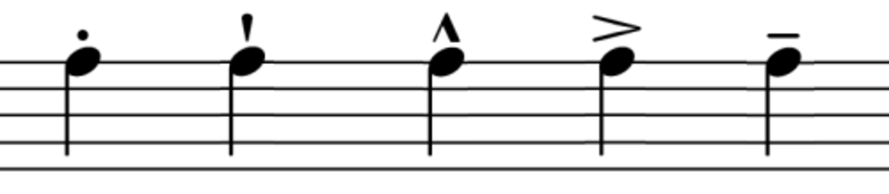Examples of articulation marks. From left to right: [staccato](https://en.wikipedia.org/wiki/Staccato "Staccato"), [staccatissimo](https://en.wikipedia.org/wiki/Staccatissimo "Staccatissimo"), [marcato](https://en.wikipedia.org/wiki/Marcato "Marcato"), [accent](https://en.wikipedia.org/wiki/Accent_\(music\) "Accent (music)"), [tenuto](https://en.wikipedia.org/wiki/Tenuto "Tenuto").

[Articulation](https://en.wikipedia.org/wiki/Articulation_\(music\) "Articulation (music)") is the way the performer sounds notes. For example, _staccato_ is the shortening of duration compared to the written note value, and _[legato](https://en.wikipedia.org/wiki/Legato "Legato")_ means a series of notes played in a smoothly joined sequence with no separation. Articulation is often described rather than quantified, therefore there is room to interpret how to execute precisely each articulation.

For example, _staccato_ is often referred to as "separated" or "detached" rather than having a defined or numbered amount by which to reduce the notated duration. Violin players can use a variety of techniques to perform different qualities of _staccato_. The manner in which a performer decides to execute a given articulation is usually based on the context of the piece or phrase, but many articulation symbols and verbal instructions depend on the instrument and musical period (e.g. viol, wind; classical, baroque; etc.).

There is a set of articulations that most instruments and voices perform in common. They are—from long to short: _legato_ (smooth, connected); _tenuto_ (played to full notated duration); _accented_ (with emphasis); _marcato_ (strong emphasis and clipped short, lit. marked); _staccato_ (separated, detached); _staccatissimo_ (very separated, extreme staccato). Many of these can be combined to create certain "in-between" articulations. For example, _[portato](https://en.wikipedia.org/wiki/Portato "Portato")_ is the combination of _tenuto_ and _staccato_. Some instruments have unique methods by which to produce sounds, such as _[spiccato](https://en.wikipedia.org/wiki/Spiccato "Spiccato")_ for bowed strings, where the bow bounces off the string.

### Texture

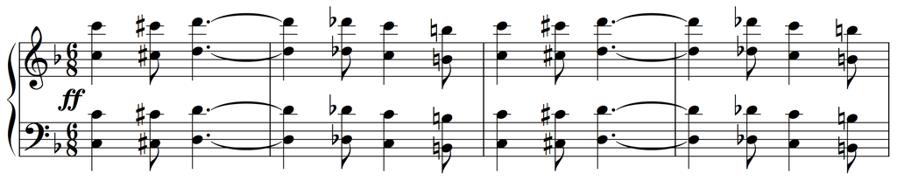Introduction to [Sousa](https://en.wikipedia.org/wiki/John_Philip_Sousa "John Philip Sousa")'s "[Washington Post March](https://en.wikipedia.org/wiki/The_Washington_Post_\(march\) "The Washington Post (march)")", mm. 1–7 features [octave doubling](https://en.wikipedia.org/wiki/Octave_doubling "Octave doubling") and a homorhythmic texture

In music, texture is how the [melodic](https://en.wikipedia.org/wiki/Melody "Melody"), [rhythmic](https://en.wikipedia.org/wiki/Rhythm "Rhythm"), and [harmonic](https://en.wikipedia.org/wiki/Harmony "Harmony") materials are combined in a [composition](https://en.wikipedia.org/wiki/Musical_composition "Musical composition"), thus determining the overall quality of the sound in a piece. Texture is often described in regard to the density, or thickness, and [range](https://en.wikipedia.org/wiki/Range_\(music\) "Range (music)"), or width, between lowest and highest pitches, in relative terms as well as more specifically distinguished according to the number of voices, or parts, and the relationship between these voices. For example, a thick texture contains many "layers" of instruments. One of these layers could be a string section, or another brass.

The thickness also is affected by the number and the richness of the instruments playing the piece. The thickness varies from light to thick. A lightly textured piece will have light, sparse scoring. A thickly or heavily textured piece will be scored for many instruments. A piece's texture may be affected by the number and character of parts playing at once, the [timbre](https://en.wikipedia.org/wiki/Timbre "Timbre") of the instruments or voices playing these parts and the harmony, [tempo](https://en.wikipedia.org/wiki/Tempo "Tempo"), and rhythms used. The types categorized by number and relationship of parts are analyzed and determined through the labeling of primary textural elements: primary melody, secondary melody, parallel supporting melody, static support, harmonic support, rhythmic support, and harmonic and rhythmic support.

Common types included [monophonic](https://en.wikipedia.org/wiki/Monophony "Monophony") texture (a single melodic voice, such as a piece for solo soprano or solo flute), biphonic texture (two melodic voices, such as a duo for bassoon and flute in which the bassoon plays a drone note and the flute plays the melody), [polyphonic](https://en.wikipedia.org/wiki/Polyphonic "Polyphonic") texture and [homophonic](https://en.wikipedia.org/wiki/Homophony "Homophony") texture (chords accompanying a [melody](https://en.wikipedia.org/wiki/Melody "Melody")).

### Form or structure

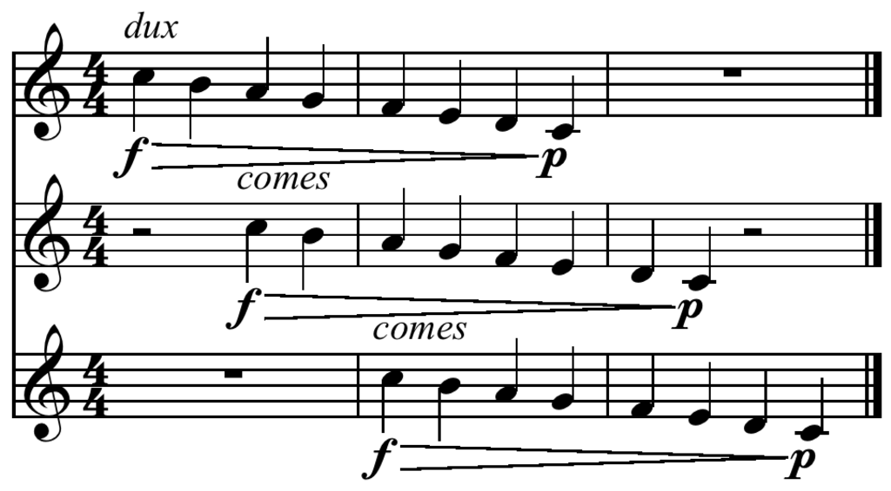A musical [canon](https://en.wikipedia.org/wiki/Canon_\(music\) "Canon (music)"). _Encyclopaedia Britannica_ calls a "canon" both a compositional technique and a musical form.

The term musical form (or musical architecture) refers to the overall structure or plan of a piece of music, and it describes the layout of a composition as divided into sections. In the tenth edition of _[The Oxford Companion to Music](https://en.wikipedia.org/wiki/The_Oxford_Companion_to_Music "The Oxford Companion to Music")_, [Percy Scholes](https://en.wikipedia.org/wiki/Percy_Scholes "Percy Scholes") defines musical form as "a series of strategies designed to find a successful mean between the opposite extremes of unrelieved repetition and unrelieved alteration." According to [Richard Middleton](https://en.wikipedia.org/wiki/Richard_Middleton_\(musicologist\) "Richard Middleton (musicologist)"), musical form is "the shape or structure of the work". He describes it through difference: the distance moved from a [repeat](https://en.wikipedia.org/wiki/Repetition_\(music\) "Repetition (music)"); the latter being the smallest difference. Difference is quantitative and qualitative: _how far_, and _of what type_, different. In many cases, form depends on statement and [restatement](https://en.wikipedia.org/wiki/Restatement_\(music\) "Restatement (music)"), unity and variety, and [contrast](https://en.wikipedia.org/wiki/Contrast_\(music\) "Contrast (music)") and connection.

### Expression

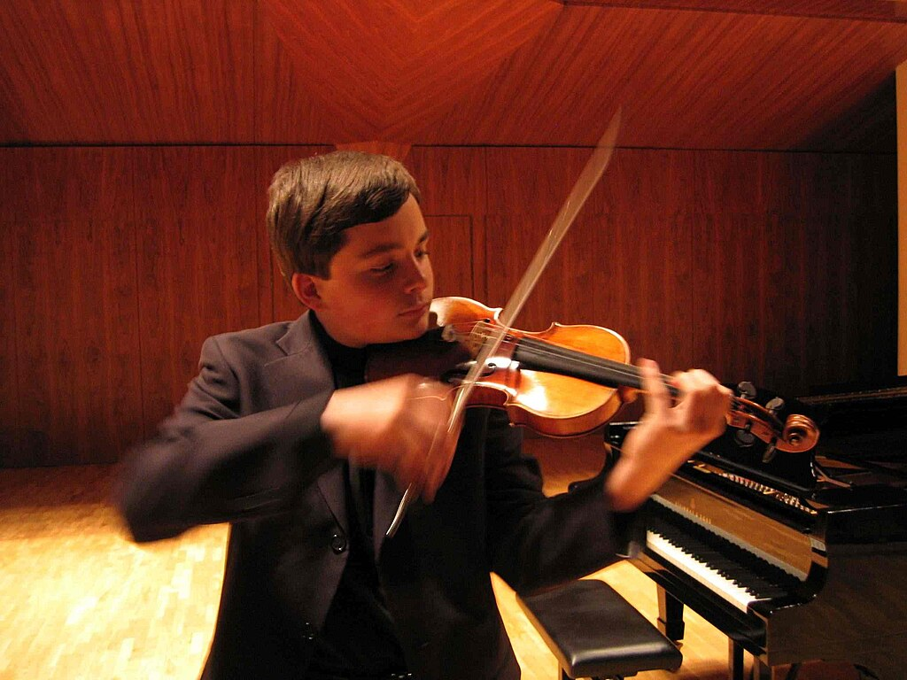A violinist performing

Musical expression is the art of playing or singing music with emotional communication. The elements of music that comprise expression include dynamic indications, such as forte or piano, [phrasing](https://en.wikipedia.org/wiki/Musical_phrasing "Musical phrasing"), differing qualities of timbre and articulation, color, intensity, energy and excitement. All of these devices can be incorporated by the performer. A performer aims to elicit responses of sympathetic feeling in the audience, and to excite, calm or otherwise sway the audience's physical and emotional responses. Musical expression is sometimes thought to be produced by a combination of other parameters, and sometimes described as a transcendent quality that is more than the sum of measurable quantities such as pitch or duration.

Expression on instruments can be closely related to the role of the breath in singing, and the voice's natural ability to express feelings, sentiment and deep emotions. Whether these can somehow be categorized is perhaps the realm of academics, who view expression as an element of musical performance that embodies a consistently recognizable [emotion](https://en.wikipedia.org/wiki/Emotion "Emotion"), ideally causing a [sympathetic emotional response](https://en.wikipedia.org/wiki/Emotional_contagion "Emotional contagion") in its listeners. The emotional content of musical expression is distinct from the emotional content of specific sounds (e.g., a startlingly-loud 'bang') and of learned associations (e.g., a [national anthem](https://en.wikipedia.org/wiki/National_anthem "National anthem")), but can rarely be completely separated from its context.

The components of musical expression continue to be the subject of extensive and unresolved dispute.

### Notation

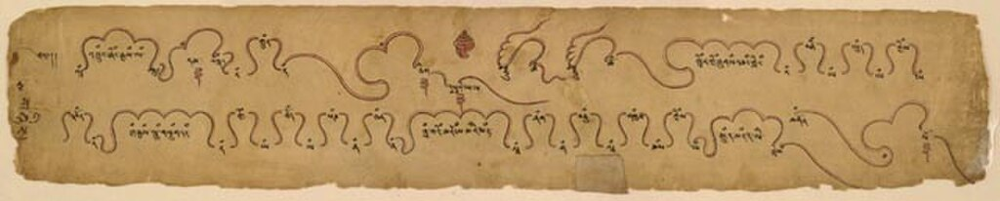

[Tibetan](https://en.wikipedia.org/wiki/Tibet "Tibet") musical score from the 19th century

Musical notation is the written or symbolized representation of music. This is most often achieved by the use of commonly understood graphic symbols and written verbal instructions and their abbreviations. There are many systems of music notation from different cultures and different ages. Traditional Western notation evolved during the Middle Ages and remains an area of experimentation and innovation. In the 2000s, computer [file formats](https://en.wikipedia.org/wiki/File_formats "File formats") have become important as well. Spoken language and [hand signs](https://en.wikipedia.org/wiki/Kodály_Method#Hand_signs "Kodály Method") are also used to symbolically represent music, primarily in teaching.

In standard Western music notation, tones are represented graphically by symbols (notes) placed on a [staff](https://en.wikipedia.org/wiki/Staff_\(music\) "Staff (music)") or staves, the vertical axis corresponding to pitch and the horizontal axis corresponding to time. Note head shapes, stems, flags, ties and dots are used to indicate duration. Additional symbols indicate keys, dynamics, accents, rests, etc. Verbal instructions from the conductor are often used to indicate tempo, technique, and other aspects.

In Western music, a range of different music notation systems are used. In Western Classical music, conductors use printed scores that show all of the instruments' parts and orchestra members read parts with their musical lines written out. In popular styles of music, much less of the music may be notated. A rock band may go into a recording session with just a handwritten [chord chart](https://en.wikipedia.org/wiki/Chord_chart "Chord chart") indicating the song's [chord progression](https://en.wikipedia.org/wiki/Chord_progression "Chord progression") using chord names (e.g., C major, D minor, G7, etc.). All of the chord voicings, rhythms and accompaniment figures are improvised by the band members.

## As academic discipline

The scholarly study of music theory in the twentieth century has a number of different subfields, each of which takes a different perspective on what are the primary phenomenon of interest and the most useful methods for investigation.

### Analysis

![Typically a given work is analyzed by more than one person and different or divergent analyses are created. For instance, the first two bars of the prelude to Claude Debussy's Pelléas et Melisande
are analyzed differently by Leibowitz, Laloy, van Appledorn, and Christ. Leibowitz analyses this succession harmonically as D minor:I–VII–V, ignoring melodic motion, Laloy analyses the succession as D:I–V, seeing the G in the second measure as an ornament, and both van Appledorn and Christ analyse the succession as D:I–VII.
Playⓘ](../media/music-theory/Debussy_Pelleas_et_Melisande_prelude_opening.PNG)Typically a given work is analyzed by more than one person and different or divergent analyses are created. For instance, the first two bars of the prelude to [Claude Debussy](/source/claude-debussy/ "Claude Debussy")'s _[Pelléas et Melisande](https://en.wikipedia.org/wiki/Pelléas_et_Mélisande_\(opera\) "Pelléas et Mélisande (opera)")_ are analyzed differently by Leibowitz, Laloy, van Appledorn, and Christ. Leibowitz analyses this succession harmonically as D minor:I–VII–V, ignoring melodic motion, Laloy analyses the succession as D:I–V, seeing the G in the second measure as an [ornament](https://en.wikipedia.org/wiki/Musical_ornamentation "Musical ornamentation"), and both van Appledorn and Christ analyse the succession as D:I–VII. [Play](https://upload.wikimedia.org/wikipedia/commons/transcoded/2/2a/Debussy_Pelleas_et_Melisande-prelude_opening.mid/Debussy_Pelleas_et_Melisande-prelude_opening.mid.mp3 "Play audio")[ⓘ](https://en.wikipedia.org/wiki/File:Debussy_Pelleas_et_Melisande-prelude_opening.mid "File:Debussy Pelleas et Melisande-prelude opening.mid")

Musical analysis is the attempt to answer the question _how does this music work?_ The method employed to answer this question, and indeed exactly what is meant by the question, differs from analyst to analyst, and according to the purpose of the analysis. According to [Ian Bent](https://en.wikipedia.org/wiki/Ian_Bent "Ian Bent"), "analysis, as a pursuit in its own right, came to be established only in the late 19th century; its emergence as an approach and method can be traced back to the 1750s. However, it existed as a scholarly tool, albeit an auxiliary one, from the [Middle Ages](https://en.wikipedia.org/wiki/Middle_Ages "Middle Ages") onwards." [Adolf Bernhard Marx](https://en.wikipedia.org/wiki/Adolf_Bernhard_Marx "Adolf Bernhard Marx") was influential in formalising concepts about composition and music understanding towards the second half of the 19th century. The principle of analysis has been variously criticized, especially by composers, such as [Edgard Varèse](https://en.wikipedia.org/wiki/Edgard_Varèse "Edgard Varèse")'s claim that, "to explain by means of \[analysis\] is to decompose, to mutilate the spirit of a work".

[Schenkerian analysis](https://en.wikipedia.org/wiki/Schenkerian_analysis "Schenkerian analysis") is a method of musical analysis of tonal music based on the theories of [Heinrich Schenker](https://en.wikipedia.org/wiki/Heinrich_Schenker "Heinrich Schenker") (1868–1935). The goal of a Schenkerian analysis is to interpret the underlying structure of a tonal work and to help reading the score according to that structure. The theory's basic tenets can be viewed as a way of defining [tonality](https://en.wikipedia.org/wiki/Tonality "Tonality") in music. A Schenkerian analysis of a passage of music shows hierarchical relationships among its pitches, and draws conclusions about the structure of the passage from this hierarchy. The analysis makes use of a specialized symbolic form of musical notation that Schenker devised to demonstrate various [techniques of elaboration](https://en.wikipedia.org/wiki/Schenkerian_analysis#Techniques_of_prolongation "Schenkerian analysis"). The most fundamental concept of Schenker's theory of tonality may be that of _tonal space_. The intervals between the notes of the tonic triad form a _tonal space_ that is filled with passing and neighbour notes, producing new triads and new tonal spaces, open for further elaborations until the surface of the work (the score) is reached.

Although Schenker himself usually presents his analyses in the generative direction, starting from the [fundamental structure](https://en.wikipedia.org/wiki/Fundamental_structure "Fundamental structure") (_Ursatz_) to reach the score, the practice of Schenkerian analysis more often is reductive, starting from the score and showing how it can be reduced to its fundamental structure. The graph of the _Ursatz_ is arrhythmic, as is a strict-counterpoint cantus firmus exercise. Even at intermediate levels of the reduction, rhythmic notation (open and closed noteheads, beams and flags) shows not rhythm but the hierarchical relationships between the pitch-events. Schenkerian analysis is _subjective_. There is no mechanical procedure involved and the analysis reflects the musical intuitions of the analyst. The analysis represents a way of hearing (and reading) a piece of music.

Transformational theory is a branch of music theory developed by [David Lewin](/source/david-lewin/ "David Lewin") in the 1980s, and formally introduced in his 1987 work, _Generalized Musical Intervals and Transformations_. The theory, which models [musical transformations](https://en.wikipedia.org/wiki/Transformation_\(music\) "Transformation (music)") as elements of a [mathematical group](/source/group-theory/ "Group theory"), can be used to analyze both [tonal](https://en.wikipedia.org/wiki/Tonality "Tonality") and [atonal music](https://en.wikipedia.org/wiki/Atonal_music "Atonal music"). The goal of transformational theory is to change the focus from musical objects—such as the "C [major chord](https://en.wikipedia.org/wiki/Major_chord "Major chord")" or "G major chord"—to relations between objects. Thus, instead of saying that a C major chord is followed by G major, a transformational theorist might say that the first chord has been "transformed" into the second by the "[Dominant](https://en.wikipedia.org/wiki/Dominant_\(music\) "Dominant (music)") operation". (Symbolically, one might write "Dominant(C major) = G major.") While traditional [musical set theory](https://en.wikipedia.org/wiki/Set_theory_\(music\) "Set theory (music)") focuses on the makeup of musical objects, transformational theory focuses on the [intervals](https://en.wikipedia.org/wiki/Interval_\(music\) "Interval (music)") or types of musical motion that can occur. According to Lewin's description of this change in emphasis, "\[The transformational\] attitude does not ask for some observed measure of extension between reified 'points'; rather it asks: 'If I am _at_ s and wish to get to t, what characteristic _gesture_ should I perform in order to arrive there?'"

### Music perception and cognition

Music psychology or the psychology of music may be regarded as a branch of both [psychology](https://en.wikipedia.org/wiki/Psychology "Psychology") and [musicology](https://en.wikipedia.org/wiki/Musicology "Musicology"). It aims to explain and understand musical [behavior](https://en.wikipedia.org/wiki/Behavior "Behavior") and [experience](https://en.wikipedia.org/wiki/Experience "Experience"), including the processes through which music is perceived, created, responded to, and incorporated into everyday life. Modern music psychology is primarily [empirical](https://en.wikipedia.org/wiki/Empirical_research "Empirical research"); its knowledge tends to advance on the basis of interpretations of data collected by systematic [observation](https://en.wikipedia.org/wiki/Observation "Observation") of and interaction with [human participants](https://en.wikipedia.org/wiki/Human_subject_research "Human subject research"). Music psychology is a field of research with practical relevance for many areas, including music [performance](https://en.wikipedia.org/wiki/Musical_technique "Musical technique"), [composition](https://en.wikipedia.org/wiki/Music_composition "Music composition"), [education](https://en.wikipedia.org/wiki/Music_education "Music education"), [criticism](https://en.wikipedia.org/wiki/Music_criticism "Music criticism"), and [therapy](https://en.wikipedia.org/wiki/Music_therapy "Music therapy"), as well as investigations of human [aptitude](https://en.wikipedia.org/wiki/Aptitude "Aptitude"), skill, [intelligence](https://en.wikipedia.org/wiki/Intelligence "Intelligence"), creativity, and [social behavior](https://en.wikipedia.org/wiki/Social_behavior "Social behavior").

Music psychology can shed light on non-psychological aspects of [musicology](https://en.wikipedia.org/wiki/Musicology "Musicology") and musical practice. For example, it contributes to music theory through investigations of the [perception](/source/perception/ "Perception") and [computational modelling](https://en.wikipedia.org/wiki/Cognitive_musicology "Cognitive musicology") of musical structures such as [melody](https://en.wikipedia.org/wiki/Melody "Melody"), [harmony](https://en.wikipedia.org/wiki/Harmony "Harmony"), [tonality](https://en.wikipedia.org/wiki/Tonality "Tonality"), [rhythm](https://en.wikipedia.org/wiki/Rhythm "Rhythm"), [meter](https://en.wikipedia.org/wiki/Meter_\(music\) "Meter (music)"), and [form](https://en.wikipedia.org/wiki/Musical_form "Musical form"). Research in [music history](https://en.wikipedia.org/wiki/Music_history "Music history") can benefit from systematic study of the history of [musical syntax](https://en.wikipedia.org/wiki/Musical_syntax "Musical syntax"), or from psychological analyses of composers and compositions in relation to perceptual, affective, and social responses to their music.

### Genre and technique

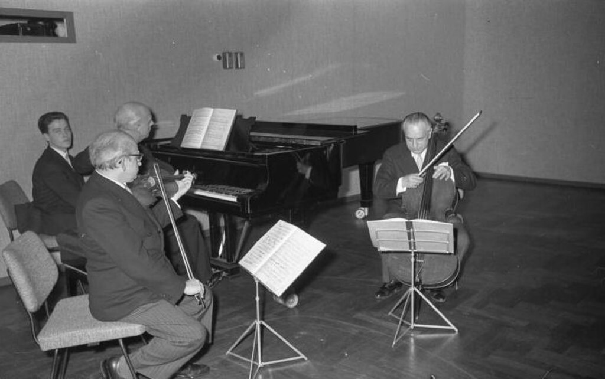A Classical [piano trio](https://en.wikipedia.org/wiki/Piano_trio "Piano trio") is a group that plays [chamber music](https://en.wikipedia.org/wiki/Chamber_music "Chamber music"), including [sonatas](https://en.wikipedia.org/wiki/Sonata "Sonata"). The term "piano trio" also refers to works composed for such a group.

A music genre is a conventional category that identifies some pieces of music as belonging to a shared tradition or set of conventions. It is to be distinguished from _[musical form](https://en.wikipedia.org/wiki/Musical_form "Musical form")_ and _musical style_, although in practice these terms are sometimes used interchangeably.

Music can be divided into different [genres](https://en.wikipedia.org/wiki/Genres "Genres") in many different ways. The artistic nature of music means that these classifications are often subjective and controversial, and some genres may overlap. There are even varying academic definitions of the term _genre_ itself. In his book _Form in Tonal Music_, Douglass M. Green distinguishes between genre and [form](https://en.wikipedia.org/wiki/Musical_form "Musical form"). He lists [madrigal](https://en.wikipedia.org/wiki/Madrigal_\(music\) "Madrigal (music)"), [motet](https://en.wikipedia.org/wiki/Motet "Motet"), [canzona](https://en.wikipedia.org/wiki/Canzona "Canzona"), [ricercar](https://en.wikipedia.org/wiki/Ricercar "Ricercar"), and dance as examples of genres from the [Renaissance](/source/renaissance-music/ "Renaissance music") period. To further clarify the meaning of _genre_, Green writes, "Beethoven's Op. 61 and Mendelssohn's Op. 64 are identical in genre—both are violin concertos—but different in form. However, Mozart's Rondo for Piano, K. 511, and the _Agnus Dei_ from his Mass, K. 317 are quite different in genre but happen to be similar in form." Some, like [Peter van der Merwe](https://en.wikipedia.org/wiki/Peter_van_der_Merwe_\(musicologist\) "Peter van der Merwe (musicologist)"), treat the terms _genre_ and _style_ as the same, saying that _genre_ should be defined as pieces of music that came from the same style or "basic musical language".

Others, such as Allan F. Moore, state that _genre_ and _style_ are two separate terms, and that secondary characteristics such as subject matter can also differentiate between genres. A music genre or subgenre may also be defined by the [musical techniques](https://en.wikipedia.org/wiki/Musical_technique "Musical technique"), the style, the cultural context, and the content and spirit of the themes. Geographical origin is sometimes used to identify a music genre, though a single geographical category will often include a wide variety of subgenres. Timothy Laurie argues that "since the early 1980s, genre has graduated from being a subset of popular music studies to being an almost ubiquitous framework for constituting and evaluating musical research objects".

Musical technique is the ability of [instrumental](https://en.wikipedia.org/wiki/Musical_instrument "Musical instrument") and vocal musicians to exert optimal control of their instruments or [vocal cords](https://en.wikipedia.org/wiki/Vocal_cords "Vocal cords") to produce precise musical effects. Improving technique generally entails practicing exercises that improve muscular sensitivity and agility. To improve technique, musicians often practice fundamental patterns of notes such as the [natural](https://en.wikipedia.org/wiki/Natural_minor "Natural minor"), [minor](https://en.wikipedia.org/wiki/Minor_scale "Minor scale"), [major](https://en.wikipedia.org/wiki/Major_scale "Major scale"), and [chromatic scales](https://en.wikipedia.org/wiki/Chromatic_scale "Chromatic scale"), [minor](https://en.wikipedia.org/wiki/Minor_triad "Minor triad") and [major triads](https://en.wikipedia.org/wiki/Major_triad "Major triad"), [dominant](https://en.wikipedia.org/wiki/Dominant_seventh_chord "Dominant seventh chord") and [diminished sevenths](https://en.wikipedia.org/wiki/Diminished_seventh "Diminished seventh"), formula patterns and [arpeggios](https://en.wikipedia.org/wiki/Arpeggio "Arpeggio"). For example, [triads](https://en.wikipedia.org/wiki/Triad_\(music\) "Triad (music)") and [sevenths](https://en.wikipedia.org/wiki/Seventh_chord "Seventh chord") teach how to play chords with accuracy and speed. [Scales](https://en.wikipedia.org/wiki/Scale_\(music\) "Scale (music)") teach how to move quickly and gracefully from one note to another (usually by step). Arpeggios teach how to play [broken chords](https://en.wikipedia.org/wiki/Broken_chord "Broken chord") over larger intervals. Many of these components of music are found in compositions, for example, a scale is a very common element of classical and romantic era compositions.

[Heinrich Schenker](https://en.wikipedia.org/wiki/Heinrich_Schenker "Heinrich Schenker") argued that musical technique's "most striking and distinctive characteristic" is [repetition](https://en.wikipedia.org/wiki/Repetition_\(music\) "Repetition (music)"). Works known as [études](https://en.wikipedia.org/wiki/Étude "Étude") (meaning "study") are also frequently used for the improvement of technique.

### Mathematics

Music theorists sometimes use mathematics to understand music, and although music has no [axiomatic](https://en.wikipedia.org/wiki/Axiomatic "Axiomatic") foundation in modern mathematics, mathematics is "the basis of sound" and sound itself "in its musical aspects... exhibits a remarkable array of number properties", simply because nature itself "is amazingly mathematical". The attempt to structure and communicate new ways of composing and hearing music has led to musical applications of [set theory](https://en.wikipedia.org/wiki/Set_theory "Set theory"), [abstract algebra](/source/abstract-algebra/ "Abstract algebra") and [number theory](https://en.wikipedia.org/wiki/Number_theory "Number theory"). Some composers have incorporated the [golden ratio](https://en.wikipedia.org/wiki/Golden_ratio "Golden ratio") and [Fibonacci numbers](https://en.wikipedia.org/wiki/Fibonacci_numbers "Fibonacci numbers") into their work. There is a long history of examining the relationships between music and mathematics. Though ancient Chinese, Egyptians and Mesopotamians are known to have studied the mathematical principles of sound, the [Pythagoreans](https://en.wikipedia.org/wiki/Pythagoreanism "Pythagoreanism") (in particular [Philolaus](https://en.wikipedia.org/wiki/Philolaus "Philolaus") and [Archytas](https://en.wikipedia.org/wiki/Archytas "Archytas")) of ancient Greece were the first researchers known to have investigated the expression of [musical scales](https://en.wikipedia.org/wiki/Musical_scale "Musical scale") in terms of numerical [ratios](https://en.wikipedia.org/wiki/Ratio "Ratio").

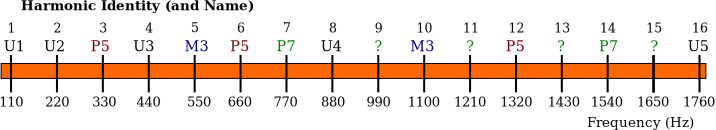

The first 16 harmonics, their names and frequencies, showing the exponential nature of the octave and the simple fractional nature of non-octave harmonics

In the modern era, musical [set theory](https://en.wikipedia.org/wiki/Set_theory "Set theory") uses the language of mathematical set theory in an elementary way to organize musical objects and describe their relationships. To analyze the structure of a piece of (typically atonal) music using musical set theory, one usually starts with a set of tones, which could form motives or chords. By applying simple operations such as [transposition](https://en.wikipedia.org/wiki/Transposition_\(music\) "Transposition (music)") and [inversion](https://en.wikipedia.org/wiki/Melodic_inversion "Melodic inversion"), one can discover deep structures in the music. Operations such as transposition and inversion are called [isometries](https://en.wikipedia.org/wiki/Isometries "Isometries") because they preserve the intervals between tones in a set. Expanding on the methods of musical set theory, some theorists have used abstract algebra to analyze music. For example, the pitch classes in an equally tempered octave form an [abelian group](https://en.wikipedia.org/wiki/Abelian_group "Abelian group") with 12 elements. It is possible to describe [just intonation](https://en.wikipedia.org/wiki/Just_intonation "Just intonation") in terms of a [free abelian group](https://en.wikipedia.org/wiki/Free_abelian_group "Free abelian group").

### Serial composition and set theory

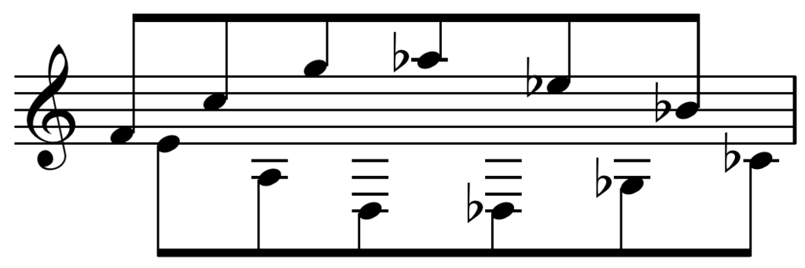Tone row from [Alban Berg](https://en.wikipedia.org/wiki/Alban_Berg "Alban Berg")'s _[Lyric Suite](https://en.wikipedia.org/wiki/Lyric_Suite_\(Berg\) "Lyric Suite (Berg)")_, movement I

In music theory, serialism is a method or technique of [composition](https://en.wikipedia.org/wiki/Musical_composition "Musical composition") that uses a series of values to manipulate different [musical elements](https://en.wikipedia.org/wiki/Aspect_of_music "Aspect of music"). Serialism began primarily with [Arnold Schoenberg](https://en.wikipedia.org/wiki/Arnold_Schoenberg "Arnold Schoenberg")'s [twelve-tone technique](https://en.wikipedia.org/wiki/Twelve-tone_technique "Twelve-tone technique"), though his contemporaries were also working to establish serialism as one example of [post-tonal](https://en.wikipedia.org/wiki/Atonality "Atonality") thinking. Twelve-tone technique orders the twelve notes of the [chromatic scale](https://en.wikipedia.org/wiki/Chromatic_scale "Chromatic scale"), forming a [row](https://en.wikipedia.org/wiki/Tone_row "Tone row") or series and providing a unifying basis for a composition's [melody](https://en.wikipedia.org/wiki/Melody "Melody"), [harmony](https://en.wikipedia.org/wiki/Harmony "Harmony"), structural progressions, and [variations](https://en.wikipedia.org/wiki/Variation_\(music\) "Variation (music)"). Other types of serialism also work with [sets](https://en.wikipedia.org/wiki/Set_\(music\) "Set (music)"), collections of objects, but not necessarily with fixed-order series, and extend the technique to other musical dimensions (often called "[parameters](https://en.wikipedia.org/wiki/Parameter_\(music\) "Parameter (music)")"), such as [duration](https://en.wikipedia.org/wiki/Duration_\(music\) "Duration (music)"), [dynamics](https://en.wikipedia.org/wiki/Dynamics_\(music\) "Dynamics (music)"), and [timbre](https://en.wikipedia.org/wiki/Timbre "Timbre"). The idea of serialism is also applied in various ways in the visual arts, design, and architecture

"Integral serialism" or "total serialism" is the use of series for aspects such as duration, dynamics, and register as well as pitch. Other terms, used especially in Europe to distinguish post-World War II serial music from twelve-tone music and its American extensions, are "general serialism" and "multiple serialism".

Musical set theory provides concepts for categorizing musical objects and describing their relationships. Many of the notions were first elaborated by [Howard Hanson](https://en.wikipedia.org/wiki/Howard_Hanson "Howard Hanson") (1960) in connection with tonal music, and then mostly developed in connection with atonal music by theorists such as [Allen Forte](https://en.wikipedia.org/wiki/Allen_Forte "Allen Forte") (1973), drawing on the work in twelve-tone theory of Milton Babbitt. The concepts of set theory are very general and can be applied to tonal and atonal styles in any equally tempered tuning system, and to some extent more generally than that.

Musical set theory often assigns items in closed bracket sets using numbers. For example, in a chromatic scale set, each semitone is assigned a position in the following set: {0 1 2 3 4 5 6 7 8 9 10 11}.  Major chords are described using the {0 4 7} subset, while minor chords are described as {0 3 7}.

One branch of musical set theory deals with collections (sets and permutations) of pitches and pitch classes (pitch-class set theory), which may be ordered or unordered, and can be related by musical operations such as [transposition](https://en.wikipedia.org/wiki/Transposition_\(music\) "Transposition (music)"), [inversion](https://en.wikipedia.org/wiki/Melodic_inversion "Melodic inversion"), and [complementation](https://en.wikipedia.org/wiki/Complement_\(music\) "Complement (music)"). The methods of musical set theory are sometimes applied to the analysis of rhythm as well.

### Musical semiotics

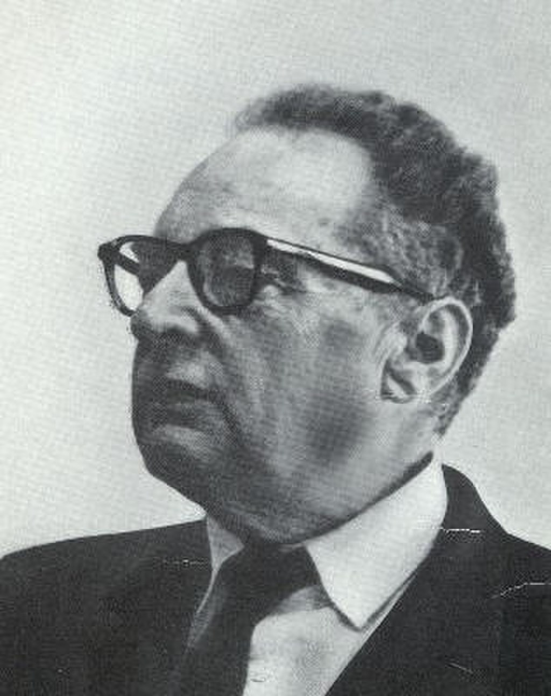Semiotician [Roman Jakobson](https://en.wikipedia.org/wiki/Roman_Jakobson "Roman Jakobson")

Music semiology ([semiotics](https://en.wikipedia.org/wiki/Semiotics "Semiotics")) is the study of signs as they pertain to music on a variety of levels. Following [Roman Jakobson](https://en.wikipedia.org/wiki/Roman_Jakobson "Roman Jakobson"), [Kofi Agawu](https://en.wikipedia.org/wiki/Kofi_Agawu "Kofi Agawu") adopts the idea of musical semiosis being introversive or extroversive—that is, musical signs within a text and without. "Topics", or various musical conventions (such as horn calls, dance forms, and styles), have been treated suggestively by Agawu, among others. The notion of [gesture](https://en.wikipedia.org/wiki/Musical_Gestures "Musical Gestures") is beginning to play a large role in musico-semiotic enquiry.

: "There are strong arguments that music inhabits a semiological realm which, on both ontogenetic and phylogenetic levels, has developmental priority over verbal language."

Writers on music semiology include Kofi Agawu (on topical theory), [Heinrich Schenker](https://en.wikipedia.org/wiki/Heinrich_Schenker "Heinrich Schenker"), Robert Hatten (on topic, gesture), [Raymond Monelle](https://en.wikipedia.org/wiki/Raymond_Monelle "Raymond Monelle") (on topic, musical meaning), [Jean-Jacques Nattiez](https://en.wikipedia.org/wiki/Jean-Jacques_Nattiez "Jean-Jacques Nattiez") (on introversive taxonomic analysis and ethnomusicological applications), [Anthony Newcomb](https://en.wikipedia.org/wiki/Anthony_Newcomb "Anthony Newcomb") (on narrativity), and [Eero Tarasti](https://en.wikipedia.org/wiki/Eero_Tarasti "Eero Tarasti").

[Roland Barthes](https://en.wikipedia.org/wiki/Roland_Barthes "Roland Barthes"), himself a semiotician and skilled amateur pianist, wrote about music in _Image Music Text_, _The Responsibility of Forms_, and _The Eiffel Tower_, though he did not consider music to be a semiotic system.

Signs, meanings in music, happen essentially through the connotations of sounds, and through the social construction, appropriation and amplification of certain meanings associated with these connotations. The work of [Philip Tagg](https://en.wikipedia.org/wiki/Philip_Tagg "Philip Tagg") (_Ten Little Tunes_, _Fernando the Flute_, _Music's Meanings_) provides one of the most complete and systematic analysis of the relation between musical structures and connotations in western and especially popular, television and film music. The work of [Leonard B. Meyer](https://en.wikipedia.org/wiki/Leonard_B._Meyer "Leonard B. Meyer") in _Style and Music_ theorizes the relationship between ideologies and musical structures and the phenomena of style change, and focuses on romanticism as a case study.

### Education and careers

[Columbia University](https://en.wikipedia.org/wiki/Columbia_University "Columbia University") music theorist [Pat Carpenter](https://en.wikipedia.org/wiki/Patricia_Carpenter_\(music_theorist\) "Patricia Carpenter (music theorist)") in an undated photo

Music theory in the practical sense has been a part of education at conservatories and music schools for centuries, but the status music theory currently has within academic institutions is relatively recent. In the 1970s, few universities had dedicated music theory programs, many music theorists had been trained as composers or historians, and there was a belief among theorists that the teaching of music theory was inadequate and that the subject was not properly recognised as a scholarly discipline in its own right. A growing number of scholars began promoting the idea that music theory should be taught by theorists, rather than composers, performers or music historians. This led to the founding of the [Society for Music Theory](https://en.wikipedia.org/wiki/Society_for_Music_Theory "Society for Music Theory") in the United States in 1977. In Europe, the French _Société d'Analyse musicale_ was founded in 1985. It called the First European Conference of Music Analysis for 1989, which resulted in the foundation of the _Société belge d'Analyse musicale_ in Belgium and the _Gruppo analisi e teoria musicale_ in Italy the same year, the _Society for Music Analysis_ in the UK in 1991, the _Vereniging voor Muziektheorie_ in the Netherlands in 1999 and the _Gesellschaft für Musiktheorie_ in Germany in 2000. They were later followed by the Russian Society for Music Theory in 2013, the Polish Society for Music Analysis in 2015 and the _Sociedad de Análisis y Teoría Musical_ in Spain in 2020, and others are in construction. These societies coordinate the publication of music theory scholarship and support the professional development of music theory researchers. They formed in 2018 a network of European societies for Theory and/or Analysis of Music, the [EuroT&AM](https://europeanmusictheory.eu/)

As part of their initial training, music theorists will typically complete a [B.Mus](https://en.wikipedia.org/wiki/B.Mus "B.Mus") or a [B.A.](https://en.wikipedia.org/wiki/Bachelor_of_Arts "Bachelor of Arts") in music (or a related field) and in many cases an M.A. in music theory. Some individuals apply directly from a bachelor's degree to a PhD, and in these cases, they may not receive an M.A. In the 2010s, given the increasingly interdisciplinary nature of university graduate programs, some applicants for music theory PhD programs may have academic training both in music and outside of music (e.g., a student may apply with a B.Mus. and a Masters in Music Composition or Philosophy of Music).

Most music theorists work as instructors, lecturers or professors in colleges, universities or [conservatories](https://en.wikipedia.org/wiki/Music_school "Music school"). The job market for tenure-track professor positions is very competitive: with an average of around 25 tenure-track positions advertised per year in the past decade, 80–100 PhD graduates are produced each year (according to the Survey of Earned Doctorates) who compete not only with each other for those positions but with job seekers that received PhD's in previous years who are still searching for a tenure-track job. Applicants must hold a completed PhD or the equivalent degree (or expect to receive one within a year of being hired—called an "ABD", for "[All But Dissertation](https://en.wikipedia.org/wiki/All_But_Dissertation "All But Dissertation")" stage) and (for more senior positions) have a strong record of publishing in peer-reviewed journals. Some PhD-holding music theorists are only able to find insecure positions as [sessional lecturers](https://en.wikipedia.org/wiki/Sessional_lecturer "Sessional lecturer"). The job tasks of a music theorist are the same as those of a professor in any other humanities discipline: teaching undergraduate and/or graduate classes in this area of specialization and, in many cases some general courses (such as [Music appreciation](https://en.wikipedia.org/wiki/Music_appreciation "Music appreciation") or Introduction to Music Theory), conducting research in this area of expertise, publishing research articles in peer-reviewed journals, authoring book chapters, books or textbooks, traveling to conferences to present papers and learn about research in the field, and, if the program includes a graduate school, supervising M.A. and PhD students and giving them guidance on the preparation of their theses and dissertations. Some music theory professors may take on senior administrative positions in their institution, such as [Dean](https://en.wikipedia.org/wiki/Dean_\(education\) "Dean (education)") or Chair of the School of Music.
