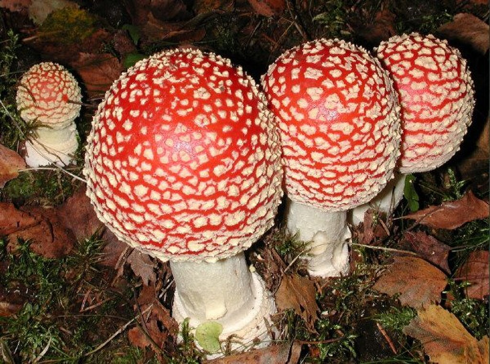

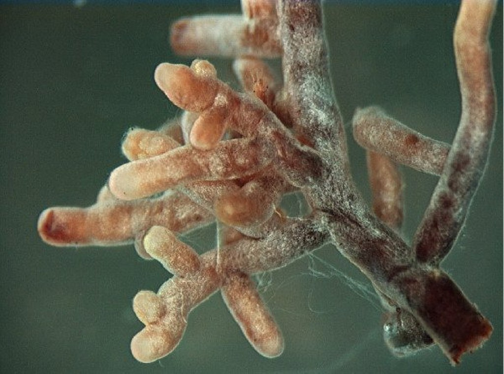

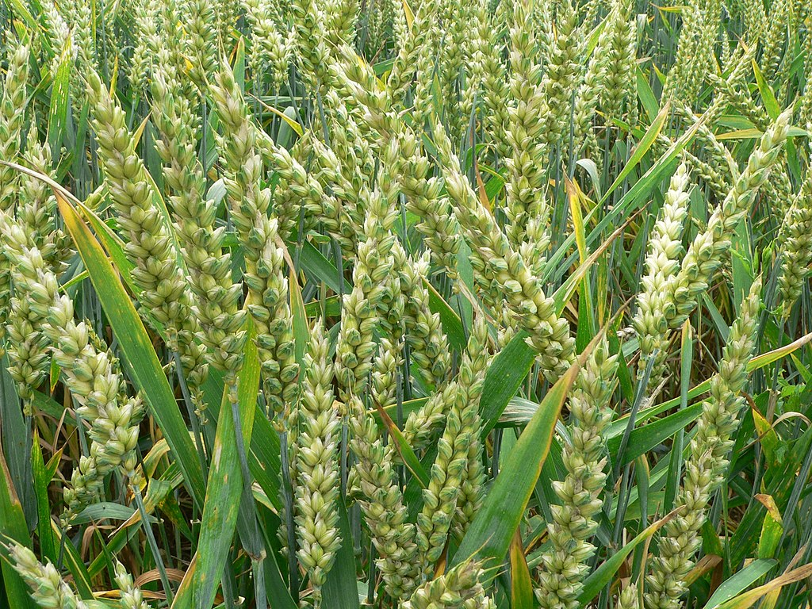

Many conspicuous fungi such as the [fly agaric](https://en.wikipedia.org/wiki/Fly_agaric "Fly agaric") (upper left) form [ectomycorrhiza](https://en.wikipedia.org/wiki/Ectomycorrhiza "Ectomycorrhiza") (upper right) with tree rootlets. [Arbuscular mycorrhiza](https://en.wikipedia.org/wiki/Arbuscular_mycorrhiza "Arbuscular mycorrhiza") (lower left) are very common in plants, including crop species such as [wheat](https://en.wikipedia.org/wiki/Wheat "Wheat") (lower right)

A **mycorrhiza** (from [Ancient Greek](https://en.wikipedia.org/wiki/Ancient_Greek_language "Ancient Greek language")[μύκης](https://en.wiktionary.org/wiki/μύκης#Ancient_Greek "wikt:μύκης") _(_múkēs_)_'fungus' and [ῥίζα](https://en.wiktionary.org/wiki/ῥίζα#Ancient_Greek "wikt:ῥίζα") _(_rhíza_)_'root'; pl. **mycorrhizae**, **mycorrhiza**, or **mycorrhizas**) is a [symbiotic](https://en.wikipedia.org/wiki/Symbiosis "Symbiosis") association between a [fungus](/source/fungus/ "Fungus") and a [plant](https://en.wikipedia.org/wiki/Plant "Plant"), in which fungal hyphae and plant roots become interconnected and form an interface on the cellular level. The term mycorrhiza refers to the role of the fungus in the plant's [rhizosphere](https://en.wikipedia.org/wiki/Rhizosphere "Rhizosphere"), the plant [root](https://en.wikipedia.org/wiki/Root "Root") system and its surroundings. Mycorrhizae play important roles in [plant nutrition](https://en.wikipedia.org/wiki/Plant_nutrition "Plant nutrition"), [soil biology](https://en.wikipedia.org/wiki/Soil_life "Soil life"), and [soil chemistry](https://en.wikipedia.org/wiki/Soil_chemistry "Soil chemistry").

In a mycorrhizal association, the fungus colonizes the host plant's root tissues, either [intracellularly](https://en.wikipedia.org/wiki/Intracellular "Intracellular") as in [arbuscular mycorrhizal fungi](https://en.wikipedia.org/wiki/Arbuscular_mycorrhizal_fungi "Arbuscular mycorrhizal fungi"), or [extracellularly](https://en.wikipedia.org/wiki/Extracellular "Extracellular") as in [ectomycorrhizal](/source/mycorrhiza/#Ectomycorrhiza) fungi. The association is normally [mutualistic](https://en.wikipedia.org/wiki/Mutualism_\(biology\) "Mutualism (biology)"). In particular species, or in particular circumstances, mycorrhizae may have a [parasitic](https://en.wikipedia.org/wiki/Parasitism "Parasitism") association with host plants.

## Definition

A mycorrhiza is a symbiotic association between a green plant and a fungus. The plant makes organic molecules by [photosynthesis](https://en.wikipedia.org/wiki/Photosynthesis "Photosynthesis") and supplies them to the fungus in the form of sugars or lipids, while the fungus supplies the plant with water and mineral nutrients, such as [phosphorus](https://en.wikipedia.org/wiki/Phosphorus "Phosphorus"), nitrogen, or zinc, taken from the soil. Mycorrhizas are located in the roots of vascular plants, but mycorrhiza-like associations also occur in [bryophytes](https://en.wikipedia.org/wiki/Bryophytes "Bryophytes") and there is fossil evidence that early land plants that lacked roots formed arbuscular mycorrhizal associations. Most plant species form mycorrhizal associations, though some families like [Brassicaceae](https://en.wikipedia.org/wiki/Brassicaceae "Brassicaceae") and [Chenopodiaceae](https://en.wikipedia.org/wiki/Chenopodiaceae "Chenopodiaceae") cannot. Different forms for the association are detailed in the next section. The most common is the [arbuscular type](https://en.wikipedia.org/wiki/Arbuscular_mycorrhiza "Arbuscular mycorrhiza") that is present in 70% of plant species, including many crop plants such as cereals and legumes.

## History of research

Mycorrhizal fungi were first formally described and named in 1885 by German botanist [A.B. Frank](https://en.wikipedia.org/wiki/Albert_Bernhard_Frank "Albert Bernhard Frank"), who coined the term "mycorrhiza".

Earlier observations by others also contributed to understanding these root-fungal associations. In 1881, [Franciszek Kamieński](https://en.wikipedia.org/wiki/Franciszek_Kamieński "Franciszek Kamieński") had shown that the plant [Monotropa hypopitys](https://en.wikipedia.org/wiki/Monotropa_hypopitys "Monotropa hypopitys") relied on fungi from neighboring trees for nutrition, highlighting fungal dependency. [Noël Bernard](https://en.wikipedia.org/wiki/Noël_Bernard_\(botanist\) "Noël Bernard (botanist)") established in 1899 that orchids like [Neottia nidus-avis](https://en.wikipedia.org/wiki/Neottia_nidus-avis "Neottia nidus-avis") require a specific fungus for seed [germination](https://en.wikipedia.org/wiki/Germination "Germination").

In the 20th century, researchers expanded understanding of mycorrhizal diversity and prevalence across plant families. Paleobotanists working on the [Rhynie chert](https://en.wikipedia.org/wiki/Rhynie_chert "Rhynie chert") fossils demonstrated that mycorrhizal-like associations existed 407 million years ago in early land plants.

_[Laccaria bicolor](https://en.wikipedia.org/wiki/Laccaria_bicolor "Laccaria bicolor")_ became the first ectomycorrhizal fungus to have its genome sequenced in 2008, revealing the genetic basis of symbiosis through gene duplications and specialized secreted proteins. This work opened the molecular era of mycorrhizal research.

## Evolution

### Emergence alongside terrestrial plants

Fossil and genetic evidence indicate that mycorrhizae emerged as early as 450-500 million years ago, potentially between fungus-like protists and algae. Arbuscular mycorrhizal relationships appeared earliest, coinciding with the [terrestrialization of plants](https://en.wikipedia.org/wiki/Timeline_of_plant_evolution#Ordovician_flora "Timeline of plant evolution"). Genetic evidence indicates that all land plants share a single common ancestor, which appears to have quickly adopted mycorrhizal symbiosis, and research suggests that proto-mycorrhizal fungi were a key factor enabling plant terrestrialization. There is a strong consensus among paleomycologists that mycorrhizal fungi served as a primitive root system for early terrestrial plants. This is because, prior to plant colonization of land, soils were nutrient sparse and plants had yet to develop root systems. Without complex root systems, early terrestrial plants would have been incapable of absorbing recalcitrant ions from mineral substrates, such as phosphate, a key nutrient for plant growth.

### Fossil record and genomic analysis

Fossils of Glomeromycotan spores and hyphae date to 460 million years ago, but the fossils were not associated with plants. The earliest terrestrial communities were similar to modern [biocrusts](https://en.wikipedia.org/wiki/Biological_soil_crust "Biological soil crust"). Lichen-like associations between fungi and cyanobacteria were an important part of these communities. The first land plants were similar to [mosses](/source/moss/ "Moss"), with simple vascular systems and no leaves or roots.

The earliest direct fossil evidence of early mycorrhizal symbiosis is found in the 407 million year old [Rhynie chert](https://en.wikipedia.org/wiki/Rhynie_chert "Rhynie chert"), which contains an assemblage of "exceptionally preserved" fossil plants colonized by multiple para-mycorrhizal fungi. The Rhynie chert fossils show Glomeromycotan and Mucoromycotan fungi engaged in mycorrhiza-like associations with cells of the plants [_Aglaophyton major_](https://en.wikipedia.org/wiki/Aglaophyton "Aglaophyton") and [_Horneophyton lignieri_](https://en.wikipedia.org/wiki/Horneophyton "Horneophyton"). The fossils suggest a mutualistic association between the plants and the colonizing fungi, because distinctive nutrient exchange structures (arbuscules and hyphal coils, in Glomeromycotina and Mucoromycotina respectively) are preserved and the colonized cells appear to have been alive at the time of infection by the fungus.

These early associations are referred to as mycorrhiza-like or para-mycorrhizal because mycorrhiza are defined by the fungal colonization of plant roots, and early plants did not have any roots. The earliest fossils of arbuscular mycorrhizal fungi in plant roots originate from 315-303 million years ago, and show fungi belonging to Glomeromycotina in the root systems of a giant lycophyte, [Lepidodendron](https://en.wikipedia.org/wiki/Lepidodendron "Lepidodendron"), and an early relative of the conifers, [Cordaites](https://en.wikipedia.org/wiki/Cordaites "Cordaites"). Arbuscular mycorrhizal fungi were found in 240 million year old fossils of _Antarcticycas schopfii_.

Ectomycorrhizae developed substantially later, during the [Jurassic](https://en.wikipedia.org/wiki/Jurassic "Jurassic") period, while most other modern forms of mycorrhizal symbiosis, including orchid and ericoid mycorrhizae, date to the period of [angiosperm radiation](/source/flowering-plant/#Cretaceous "Flowering plant") in the [Cretaceous](https://en.wikipedia.org/wiki/Cretaceous "Cretaceous") period. Ectomycorrhizae appear in the fossil record 48.7 million years ago, in the [Eocene](https://en.wikipedia.org/wiki/Eocene "Eocene"), with a fossil of ectomycorrhizal fungi colonizing _Pinus_ roots. However, it is believed that the first ectomycorrhizal relationships evolved in the stem group [Pinaceae](https://en.wikipedia.org/wiki/Pinaceae "Pinaceae") around the radiation of the Pinaceae [crown group](https://en.wikipedia.org/wiki/Crown_group "Crown group") in the mid Jurassic, 175 million or so years ago.

Fossils preservation of [Ericoid mycorrhizae](https://en.wikipedia.org/wiki/Ericoid_mycorrhiza "Ericoid mycorrhiza") and orchid mycorrhizae is lacking. Calibrated molecular phylogeny is used to estimate when these mycorrhizal types originated. The origins of orchid mycorrhizae are unclear, though orchids themselves are thought to have originated in the Cretaceous period. Ericoid mycorrhizae are estimated to have the most recent evolutionary origins of mycorrhizal types, evolving around 118 million years ago from free-living saprotrophic ancestors. Ericoid mycorrhizal fungi evolved from multiple lineages of fungi, primarily ascomycetes from the [Leotiomycetes](https://en.wikipedia.org/wiki/Leotiomycetes "Leotiomycetes"), as well as basidiomycetes from the family [Serendipitaceae](https://en.wikipedia.org/wiki/Serendipitaceae "Serendipitaceae").

### Origins in plants

In plants, the genes for forming mycorrhizal symbiosis are highly conserved and originate from a common ancestor, meaning that the ability to form mycorrhizae is ancestral to all land plants. Non-mycorrhizal plant lineages, such as the Brassicaceae, lost the ability to form mycorrhizae at some point in their evolution. The earliest mycorrhizae were arbuscular mycorrhizae, and other forms, such as ectomycorrhizae and orchid mycorrhizae, evolved when plant hosts switched from symbiosis with [Glomeromycotina](https://en.wikipedia.org/wiki/Glomeromycotina "Glomeromycotina") to symbiosis with different fungal lineages.

There is genetic evidence that the symbiosis between [legumes](https://en.wikipedia.org/wiki/Legume "Legume") and [nitrogen-fixing bacteria](https://en.wikipedia.org/wiki/Nitrogen-fixing_bacteria "Nitrogen-fixing bacteria") is derived from mycorrhizal symbiosis. The modern distribution of mycorrhizal fungi appears to reflect an increasing complexity and competition in root morphology associated with the dominance of angiosperms in the [Cenozoic Era](https://en.wikipedia.org/wiki/Cenozoic "Cenozoic"), characterized by complex ecological dynamics between species.

### Origins in fungi

In fungi, mycorrhizal symbiosis had multiple independent origins among different lineages of fungi. Arbuscular mycorrhizal fungi form their own monophyletic phylum, whereas other mycorrhizal fungi convergently evolved similar lifestyles.

#### Arbuscular mycorrhizae

The phylum [Glomeromycota](https://en.wikipedia.org/wiki/Glomeromycota "Glomeromycota"), which forms the arbuscular mycorrhizal symbiosis, is the oldest mycorrhizal lineage. The arbuscular mycorrhizal symbiosis evolved only once in fungi; all arbuscular mycorrhizal fungi belong to Glomeromycota and share a common ancestor. 244 species have been identified based on differences in the appearance of their spores, but genetic studies suggest that 300-1600 species may exist in Glomeromycota. All members of Glomeromycota are obligate biotrophs, entirely dependent upon their plant hosts for survival. Arbuscular mycorrhizal fungi are considered to be generalists, with minimal host plant specificity. AM symbiosis has been observed in almost every seed plant taxonomic division, or around 67% of species. Arbuscular mycorrhizae take on most angiosperms, some gymnosperms, pteridophytes, and nonvascular plants as plant hosts. Arbuscular mycorrhizae have been observed in the seedling stage of otherwise ectomycorrhizal partners, suggesting that arbuscular mycorrhizal fungi may be able to infect almost any land plant given proper circumstances.

Other forms of mycorrhizal symbiosis, such as ectomycorrhizae, orchid mycorrhizae, and ericoid mycorrhizae, emerged multiple times in different lineages of fungi through [convergent evolution](https://en.wikipedia.org/wiki/Convergent_evolution "Convergent evolution"). Unlike arbuscular mycorrhizal fungi, some of these fungi are only facultatively symbiotic, and can live by themselves without a plant host under some conditions.

#### Ectomycorrhizae

Ectomycorrhizal fungi evolved from free-living saprotrophs, mostly in [Basidiomycota](https://en.wikipedia.org/wiki/Basidiomycota "Basidiomycota") and [Ascomycota](https://en.wikipedia.org/wiki/Ascomycota "Ascomycota"), and some became dependent on plant hosts when they lost genes necessary for decaying lignin and other plant materials. There are 20,000 to 25,000 species of ectomycorrhizal fungi, but only 6,000 to 7,000 plant species that form ectomycorrhizal symbiosis. In angiosperms, it is believed that ectomycorrhizal partnerships have developed independently at least 18 times, and in fungi, around 80 times. The main evolutionary driver for ectomycorrhizae is switching of nutritional modes from saprotrophs. Phylogenomic analysis of various ectomycorrhizal fungal genomes has confirmed the convergent evolution of ectomycorrhizal fungi from white and brown-rot fungi, as well as from soil saprotrophs. Some lineages of ectomycorrhizae have likely evolved from endophytic ancestors, fungi that live within plants without damaging them. Some ectomycorrhizal fungi have gone through apparent evolutionary reversal back into saprotrophic ecology. This is possible because some lineages of ectomycorrhizal fungi retain enzymes for breaking down [lignin](https://en.wikipedia.org/wiki/Lignin "Lignin").

#### Orchid mycorrhizae

Orchid mycorrhizal fungi, which mostly originate from Ascomycota and Basidiomycota, are less understood. Some fungi that participate in orchid mycorrhizal symbiosis can also form ectomycorrhizal symbiosis with other plants, or live independently of a plant host. Some orchid mycorrhizal fungi can also live as plant pathogens.

#### Ericoid mycorrhizae

Ericoid mycorrhizal associations have the most recent origins and the lowest species richness among both plant and fungal partners. This specialization suggests that ericoid mycorrhizal partners evolved in parallel with one another in response to environmental change, rather than through reciprocal species-to-species level selection. Ericoid mycorrhizal relationships are found in extremely nutrient poor soils in the northern and southern hemispheres. These environments of low mineral nutrient availability have led to native plants developing sclerophylly, where plants become high in lignin and low in phosphorus and nitrogen. As a result, decaying plant matter in these areas has an abnormally high carbon to nitrogen ratio, making it resistant to microbial decay. Ericoid mycorrhizae have apparently evolved to conserve minerals in nutrient deficient sclerophyllous litter by directly cycling these nutrients throughout the mycorrhiza system. Ericoid mycorrhizae also retain saprotrophic abilities, allowing them to extract nitrogen and phosphorus from unmineralized organic material, and resist negative outcomes from high concentrations of toxic cations in the acidic soil environment.

## Types

The mycorrhizal lifestyle has independently [convergently evolved](https://en.wikipedia.org/wiki/Convergent_evolution "Convergent evolution") multiple times in the history of Earth. There are multiple ways to categorize mycorrhizal symbiosis. The largest division is between _ectomycorrhizas_ and _endomycorrhizas_. The two types are differentiated by the fact that the hyphae of ectomycorrhizal fungi do not penetrate individual [cells](https://en.wikipedia.org/wiki/Cell_\(biology\) "Cell (biology)") within the root, while the [hyphae](https://en.wikipedia.org/wiki/Hypha "Hypha") of endomycorrhizal fungi penetrate the cell wall and [invaginate](https://en.wiktionary.org/wiki/invaginate "wikt:invaginate") the [cell membrane](https://en.wikipedia.org/wiki/Cell_membrane "Cell membrane").

### Similar symbiotic relationships

Some forms of plant-fungal symbiosis are similar to mycorrhizae, but considered distinct. One example is fungal endophytes. Endophytes are defined as organisms that can live within plant cells without causing harm to the plant. They are distinguishable from mycorrhizal fungi by the absence of nutrient-transferring structures for bringing in nutrients from outside the plant. Some lineages of mycorrhizal fungi may have evolved from endophytes into mycorrhizal fungi, and some fungi can live as mycorrhizae or as endophytes.

### Ectomycorrhiza

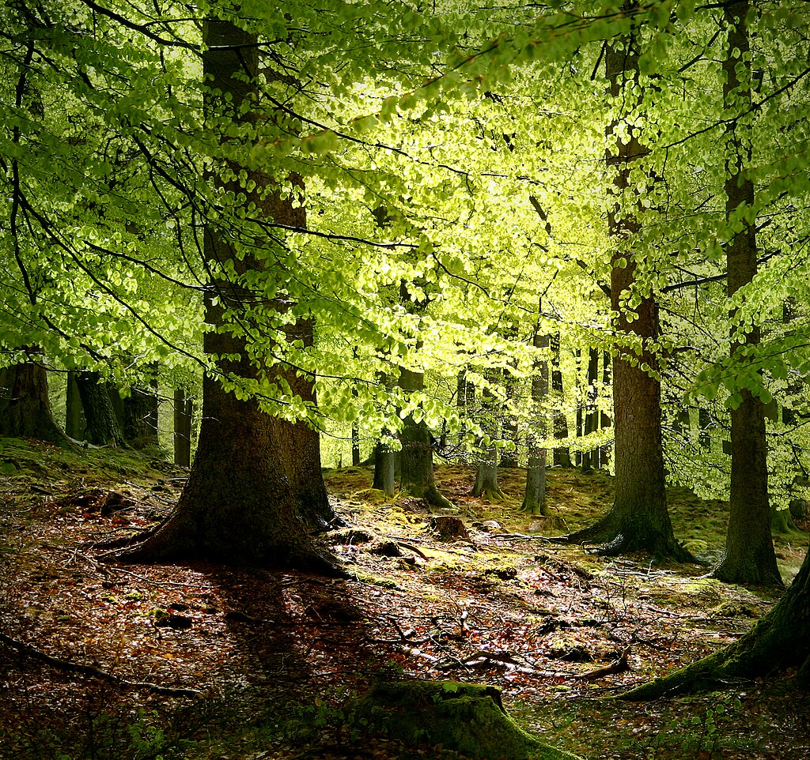[Beech](https://en.wikipedia.org/wiki/Beech "Beech") is [ectomycorrhizal](https://en.wikipedia.org/wiki/Ectomycorrhiza "Ectomycorrhiza") 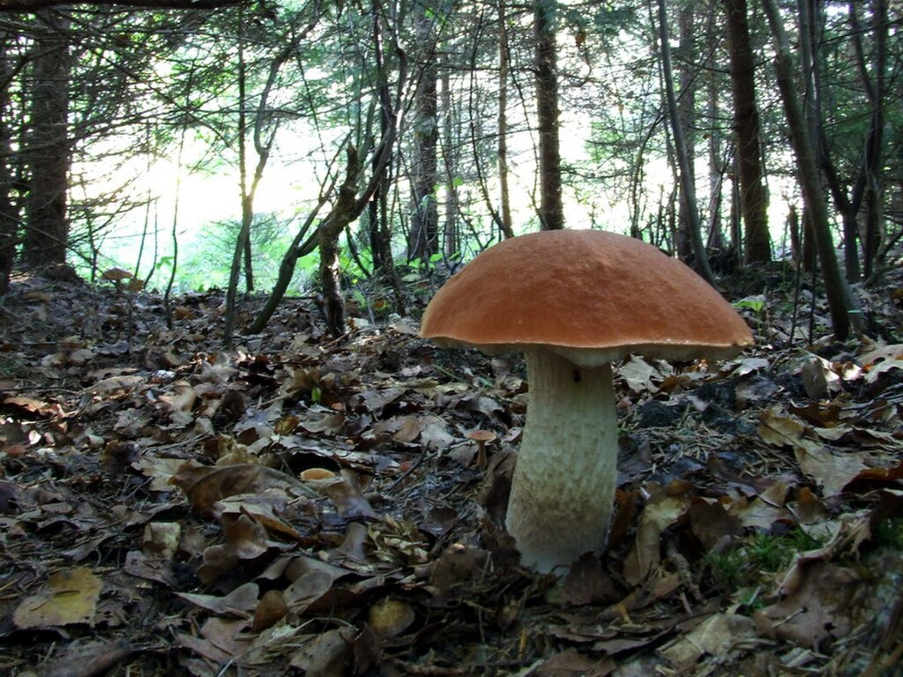_[Leccinum aurantiacum](https://en.wikipedia.org/wiki/Leccinum_aurantiacum "Leccinum aurantiacum")_, an [ectomycorrhizal](/source/mycorrhiza/#Ectomycorrhiza) fungus

Ectomycorrhizae are distinct in that they do not penetrate into plant cells, but instead form a structure called a [Hartig net](https://en.wikipedia.org/wiki/Hartig_net "Hartig net") that penetrates between cells. Ectomycorrhizas consist of a hyphal sheath, or mantle, covering the root tip and the Hartig net of hyphae surrounding the plant cells within the root [cortex](https://en.wikipedia.org/wiki/Cortex_\(botany\) "Cortex (botany)"). In some cases the hyphae may also penetrate the plant cells, in which case the mycorrhiza is called an endomycorrhiza. Outside the root, [ectomycorrhizal extramatrical mycelium](https://en.wikipedia.org/wiki/Ectomycorrhizal_extramatrical_mycelium "Ectomycorrhizal extramatrical mycelium") forms an extensive network within the soil and [leaf litter](https://en.wikipedia.org/wiki/Leaf_litter "Leaf litter"). Other forms of mycorrhizae, including arbuscular, ericoid, arbutoid, monotropoid, and orchid mycorrhizas, are considered endomycorrhizae.

Ectomycorrhizas, or EcM, are symbiotic associations between the roots of around 10% of plant families, mostly woody plants including the [birch](https://en.wikipedia.org/wiki/Betulaceae "Betulaceae"), [dipterocarp](https://en.wikipedia.org/wiki/Dipterocarpaceae "Dipterocarpaceae"), [eucalyptus](https://en.wikipedia.org/wiki/Myrtaceae "Myrtaceae"), [oak](https://en.wikipedia.org/wiki/Fagaceae "Fagaceae"), [pine](https://en.wikipedia.org/wiki/Pinaceae "Pinaceae"), and [rose](https://en.wikipedia.org/wiki/Rosaceae "Rosaceae") families, [orchids](https://en.wikipedia.org/wiki/Orchidaceae#Ecology "Orchidaceae"), and fungi belonging to the [Basidiomycota](https://en.wikipedia.org/wiki/Basidiomycota "Basidiomycota"), [Ascomycota](https://en.wikipedia.org/wiki/Ascomycota "Ascomycota"), and [Zygomycota](https://en.wikipedia.org/wiki/Zygomycota "Zygomycota"). Ectomycorrhizae associate with relatively few plant species, only about 2% of plant species on Earth, but the species they associate with are mostly trees and woody plants that are highly dominant in their ecosystems, meaning plants in ectomycorrhizal relationships make up a large proportion of plant biomass. Some EcM fungi, such as many _[Leccinum](https://en.wikipedia.org/wiki/Leccinum "Leccinum")_ and _[Suillus](https://en.wikipedia.org/wiki/Suillus "Suillus")_, are symbiotic with only one particular genus of plant, while other fungi, such as the _[Amanita](https://en.wikipedia.org/wiki/Amanita "Amanita")_, are generalists that form mycorrhizas with many different plants. An individual tree may have 15 or more different fungal EcM partners at one time. While the diversity of plants involved in EcM is low, the diversity of fungi involved in EcM is high. Thousands of ectomycorrhizal fungal species exist, hosted in over 200 genera. A recent study has conservatively estimated global ectomycorrhizal fungal species richness at approximately 7750 species, although, on the basis of estimates of knowns and unknowns in macromycete diversity, a final estimate of ECM species richness would probably be between 20,000 and 25,000. Ectomycorrhizal fungi evolved independently from saprotrophic ancestors many times in the group's history.

Nutrients can be shown to move between different plants through the fungal network. Carbon has been shown to move from [paper birch](https://en.wikipedia.org/wiki/Betula_papyrifera "Betula papyrifera") seedlings into adjacent [Douglas-fir](https://en.wikipedia.org/wiki/Coast_Douglas-fir "Coast Douglas-fir") seedlings, although not conclusively through a common mycorrhizal network, thereby promoting [succession](https://en.wikipedia.org/wiki/Ecological_succession "Ecological succession") in [ecosystems](https://en.wikipedia.org/wiki/Ecosystem "Ecosystem"). The ectomycorrhizal fungus _[Laccaria bicolor](https://en.wikipedia.org/wiki/Laccaria_bicolor "Laccaria bicolor")_ has been found to lure and kill [springtails](https://en.wikipedia.org/wiki/Springtail "Springtail") to obtain nitrogen, some of which may then be transferred to the mycorrhizal host plant. In a study by Klironomos and Hart, [Eastern White Pine](https://en.wikipedia.org/wiki/Eastern_White_Pine "Eastern White Pine") inoculated with _L. bicolor_ was able to derive up to 25% of its nitrogen from springtails. When compared with non-mycorrhizal fine roots, ectomycorrhizae may contain very high concentrations of trace elements, including toxic metals (cadmium, silver) or chlorine.

The first genomic sequence for a representative of symbiotic fungi, the ectomycorrhizal basidiomycete _L. bicolor_, was published in 2008. An expansion of several multigene families occurred in this fungus, suggesting that adaptation to symbiosis proceeded by gene duplication. Within lineage-specific genes those coding for symbiosis-regulated secreted proteins showed an up-regulated expression in ectomycorrhizal root tips suggesting a role in the partner communication. _L. bicolor_ is lacking enzymes involved in the degradation of plant cell wall components (cellulose, hemicellulose, pectins and pectates), preventing the symbiont from degrading host cells during the root colonisation. By contrast, _L. bicolor_ possesses expanded multigene families associated with hydrolysis of bacterial and microfauna polysaccharides and proteins. This genome analysis revealed the dual [saprotrophic](https://en.wikipedia.org/wiki/Saprotrophic "Saprotrophic") and [biotrophic](https://en.wikipedia.org/wiki/Biotrophic "Biotrophic") lifestyle of the mycorrhizal fungus that enables it to grow within both soil and living plant roots. Since then, the genomes of many other ectomycorrhizal fungal species have been sequenced further expanding the study of gene families and evolution in these organisms.

#### Arbutoid mycorrhiza

This type of mycorrhiza involves plants of the Ericaceae subfamily [Arbutoideae](https://en.wikipedia.org/wiki/Arbutoideae "Arbutoideae"). It is however different from ericoid mycorrhiza and resembles ectomycorrhiza, both functionally and in terms of the fungi involved. It differs from ectomycorrhiza in that some hyphae actually penetrate into the root cells, making this type of mycorrhiza an _ectendomycorrhiza_.

### Arbuscular mycorrhiza

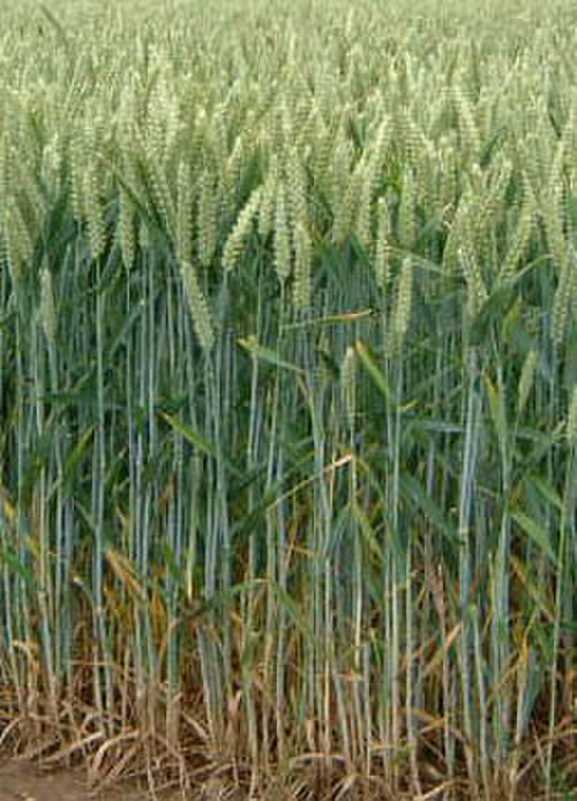[Wheat](https://en.wikipedia.org/wiki/Wheat "Wheat") has [arbuscular mycorrhiza](https://en.wikipedia.org/wiki/Arbuscular_mycorrhiza "Arbuscular mycorrhiza").

[Arbuscular mycorrhizas](https://en.wikipedia.org/wiki/Arbuscular_mycorrhiza "Arbuscular mycorrhiza"), (formerly known as vesicular-arbuscular mycorrhizas), have hyphae that penetrate plant cells, producing branching, tree-like structures called arbuscules within the plant cells for nutrient exchange. Often, balloon-like storage structures, termed vesicles, are also produced. In this interaction, fungal [hyphae](https://en.wikipedia.org/wiki/Hyphae "Hyphae") do not in fact penetrate the [protoplast](https://en.wikipedia.org/wiki/Protoplast "Protoplast") (i.e. the interior of the cell), but invaginate the [cell membrane](https://en.wikipedia.org/wiki/Cell_membrane "Cell membrane"), creating a so-called peri-arbuscular membrane. The structure of the arbuscules greatly increases the contact surface area between the hypha and the host cell [cytoplasm](https://en.wikipedia.org/wiki/Cytoplasm "Cytoplasm") to facilitate the transfer of nutrients between them. Arbuscular mycorrhizas are obligate biotrophs, meaning that they depend upon the plant host for both growth and reproduction; they have lost the ability to sustain themselves by decomposing dead plant material. Twenty percent of the photosynthetic products made by the plant host are consumed by the fungi, the transfer of carbon from the terrestrial host plant is then exchanged by equal amounts of phosphate from the fungi to the plant host.

Contrasting with the pattern seen in ectomycorrhizae, the species diversity of AMFs is very low, but the diversity of plant hosts is very high; an estimated 78% of all plant species associate with AMFs. Arbuscular mycorrhizas are formed only by fungi in the [division](https://en.wikipedia.org/wiki/Division_\(mycology\) "Division (mycology)") [Glomeromycota](https://en.wikipedia.org/wiki/Glomeromycota "Glomeromycota"). Fossil evidence and DNA sequence analysis suggest that this mutualism appeared [400-460 million years ago](https://en.wikipedia.org/wiki/Devonian "Devonian"), when the first plants were colonizing land. Arbuscular mycorrhizas are found in 85% of all plant families, and occur in many crop species. The hyphae of arbuscular mycorrhizal fungi produce the glycoprotein [glomalin](https://en.wikipedia.org/wiki/Glomalin "Glomalin"), which may be one of the major stores of carbon in the soil. Arbuscular mycorrhizal fungi have (possibly) been asexual for many millions of years and, unusually, individuals can contain many genetically different nuclei (a phenomenon called [heterokaryosis](https://en.wikipedia.org/wiki/Heterokaryosis "Heterokaryosis")).

### Mucoromycotina fine root endophytes

Mycorrhizal fungi belonging to [Mucoromycotina](https://en.wikipedia.org/wiki/Mucoromycotina "Mucoromycotina"), known as "fine root endophytes" (MFREs), were mistakenly identified as arbuscular mycorrhizal fungi until recently. While similar to AMF, MFREs are from subphylum Mucoromycotina instead of Glomeromycotina. Their morphology when colonizing a plant root is very similar to AMF, but they form fine textured hyphae. Effects of MFREs may have been mistakenly attributed to AMFs due to confusion between the two, complicated by the fact that AMFs and MFREs often colonize the same hosts simultaneously. Unlike AMFs, they appear capable of surviving without a host. This group of mycorrhizal fungi is little understood, but appears to prefer wet, acidic soils and forms symbiotic relationships with liverworts, hornworts, lycophytes, and angiosperms.

### Ericoid mycorrhiza

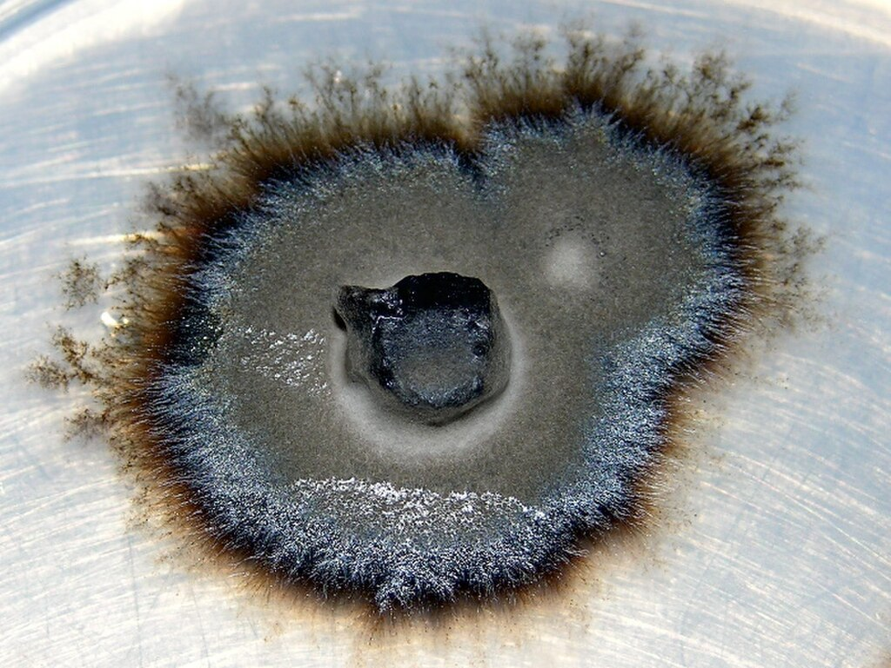An [ericoid](https://en.wikipedia.org/wiki/Ericoid "Ericoid") mycorrhizal fungus isolated from _[Woollsia pungens](https://en.wikipedia.org/wiki/Woollsia_pungens "Woollsia pungens")_

[Ericoid mycorrhizae](https://en.wikipedia.org/wiki/Ericoid_mycorrhiza "Ericoid mycorrhiza"), or ErMs, involve only plants in [Ericales](https://en.wikipedia.org/wiki/Ericales "Ericales") and are the most recently evolved of the major mycorrhizal relationships. Plants that form ericoid mycorrhizae are mostly woody understory shrubs; hosts include blueberries, bilberries, cranberries, mountain laurels, rhododendrons, heather, neinei, and giant grass tree. ErMs are most common in [boreal forests](https://en.wikipedia.org/wiki/Boreal_forest "Boreal forest"), but are found in two-thirds of all forests on Earth. Ericoid mycorrhizal fungi belong to several different lineages of fungi. Some species can live as endophytes entirely within plant cells even within plants outside the Ericales, or live independently as saprotrophs that decompose dead organic matter. This ability to switch between multiple lifestyle types makes ericoid mycorrhizal fungi very adaptable.

Plants that participate in these symbioses have specialized roots with no root hairs, which are covered with a layer of epidermal cells that the fungus penetrates into and completely occupies. The fungi have a simple intraradical (growth in cells) phase, consisting of dense coils of hyphae in the outermost layer of root cells. There is no periradical phase and the extraradical phase consists of sparse hyphae that don't extend very far into the surrounding soil. They might form sporocarps (probably in the form of small cups), but their reproductive biology is poorly understood.

Plants participating in ericoid mycorrhizal symbioses are found in acidic, nutrient-poor conditions. Whereas AMFs have lost their [saprotrophic](https://en.wikipedia.org/wiki/Saprotrophic "Saprotrophic") capabilities, and EcM fungi have significant variation in their ability to produce enzymes needed for a saprotrophic lifestyle, fungi involved in ErMs have fully retained the ability to decompose plant material for sustenance. Some ericoid mycorrhizal fungi have actually expanded their repertoire of enzymes for breaking down organic matter. They can extract nitrogen from cellulose, hemicellulose, lignin, pectin, and chitin. This would increase the benefit they can provide to their plant symbiotic partners.

### Orchid mycorrhiza

All [orchids](https://en.wikipedia.org/wiki/Orchidaceae "Orchidaceae") are [myco-heterotrophic](https://en.wikipedia.org/wiki/Myco-heterotrophy "Myco-heterotrophy") at some stage during their lifecycle, meaning that they can survive only if they form [orchid mycorrhizae](https://en.wikipedia.org/wiki/Orchid_mycorrhiza "Orchid mycorrhiza"). Orchid seeds are so small that they contain no nutrition to sustain the germinating seedling, and instead must gain the energy to grow from their fungal symbiont. The OM relationship is asymmetric; the plant seems to benefit more than the fungus, and some orchids are entirely mycoheterotrophic, lacking chlorophyll for photosynthesis. It is actually unknown whether fully autotrophic orchids that do not receive some of their carbon from fungi exist or not. Like fungi that form ErMs, OM fungi can sometimes live as endophytes or as independent saprotrophs. In the OM symbiosis, hyphae penetrate into the root cells and form pelotons (coils) for nutrient exchange.

### Monotropoid mycorrhiza

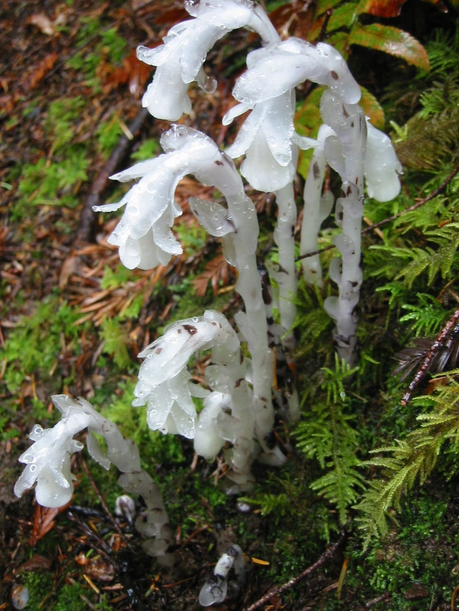[_Monotropa_](https://en.wikipedia.org/wiki/Monotropa_uniflora "Monotropa uniflora") plant unable to photosynthesis, collects food from monotropoid mycorrhiza

This type of mycorrhiza occurs in the subfamily [Monotropoideae](https://en.wikipedia.org/wiki/Monotropoideae "Monotropoideae") of the [Ericaceae](https://en.wikipedia.org/wiki/Ericaceae "Ericaceae"), as well as several genera in the [Orchidaceae](https://en.wikipedia.org/wiki/Orchidaceae "Orchidaceae"). These plants are [heterotrophic](https://en.wikipedia.org/wiki/Heterotrophic "Heterotrophic") or [mixotrophic](https://en.wikipedia.org/wiki/Mixotrophic "Mixotrophic") and derive their carbon from the fungus partner. This is thus a non-mutualistic, [parasitic](https://en.wikipedia.org/wiki/Parasitism "Parasitism") type of mycorrhizal symbiosis.

## Function

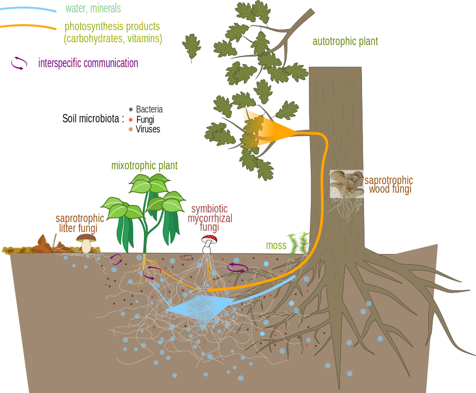Nutrient exchanges and communication between a mycorrhizal fungus and plants.

Mycorrhizal fungi form a [mutualistic](https://en.wikipedia.org/wiki/Mutualism_\(biology\) "Mutualism (biology)") relationship with the roots of most plant species. In such a relationship, both the plants themselves and those parts of the roots that host the fungi, are said to be mycorrhizal. Relatively few of the mycorrhizal relationships between plant species and fungi have been examined to date, but 95% of the plant families investigated are predominantly mycorrhizal either in the sense that most of their species associate beneficially with mycorrhizae, or are absolutely dependent on mycorrhizae. The [Orchidaceae](https://en.wikipedia.org/wiki/Orchidaceae "Orchidaceae") are notorious as a family in which the absence of the correct mycorrhizae is fatal even to germinating seeds.

Recent research into [ectomycorrhizal](https://en.wikipedia.org/wiki/Ectomycorrhizal "Ectomycorrhizal") plants in [boreal forests](https://en.wikipedia.org/wiki/Boreal_forests "Boreal forests") has indicated that mycorrhizal fungi and plants have a relationship that may be more complex than simply mutualistic. This relationship was noted when mycorrhizal fungi were unexpectedly found to be hoarding nitrogen from plant roots in times of nitrogen scarcity. Researchers argue that some mycorrhizae distribute nutrients based upon the environment with surrounding plants and other mycorrhizae. They go on to explain how this updated model could explain why mycorrhizae do not alleviate plant nitrogen limitation, and why plants can switch abruptly from a mixed strategy with both mycorrhizal and nonmycorrhizal roots to a purely mycorrhizal strategy as soil nitrogen availability declines. It has also been suggested that evolutionary and phylogenetic relationships can explain much more variation in the strength of mycorrhizal mutualisms than ecological factors.

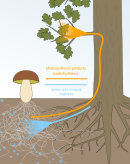Within mycorrhiza, the plant gives carbohydrates (products of photosynthesis) to the fungus, while the fungus gives the plant water and minerals.

### Formation

To successfully engage in mutualistic symbiotic relationships with [other organisms](https://en.wikipedia.org/wiki/Endophyte "Endophyte"), such as mycorrhizal fungi and any of the thousands of microbes that colonize plants, plants must discriminate between mutualists and pathogens, allowing the mutualists to colonize while activating an [immune](https://en.wikipedia.org/wiki/Immune_system "Immune system") response towards the pathogens. Plant genomes code for potentially hundreds of [receptors](https://en.wikipedia.org/wiki/Receptor_\(biochemistry\) "Receptor (biochemistry)") for detecting chemical signals from other organisms. Plants dynamically adjust their symbiotic and immune responses, changing their interactions with their symbionts in response to feedbacks detected by the plant. In plants, the mycorrhizal symbiosis is regulated by the [common symbiosis signaling pathway (CSSP)](https://en.wikipedia.org/wiki/Common_symbiosis_signaling_pathway "Common symbiosis signaling pathway"), a set of genes involved in initiating and maintaining colonization by endosymbiotic fungi and other endosymbionts such as [Rhizobia](https://en.wikipedia.org/wiki/Rhizobia "Rhizobia") in [legumes](https://en.wikipedia.org/wiki/Legume "Legume"). The CSSP has origins predating the colonization of land by plants, demonstrating that the co-evolution of plants and arbuscular mycorrhizal fungi is over 500 million years old. In arbuscular mycorrhizal fungi, the presence of [strigolactones](https://en.wikipedia.org/wiki/Strigolactone "Strigolactone"), a plant hormone, secreted from roots induces fungal spores in the soil to germinate, stimulates their metabolism, growth and branching, and prompts the fungi to release chemical signals the plant can detect. Once the plant and fungus recognize one another as suitable symbionts, the plant activates the common symbiotic signaling pathway, which causes changes in the root tissues that enable the fungus to colonize.

Experiments with arbuscular mycorrhizal fungi have identified numerous chemical compounds to be involved in the "chemical dialog" that occurs between the prospective symbionts before symbiosis is begun. In plants, almost all plant hormones play a role in initiating or regulating AMF symbiosis, and other chemical compounds are also suspected to have a signaling function. While the signals emitted by the fungi are less understood, it has been shown that chitinaceous molecules known as Myc factors are essential for the formation of arbuscular mycorrhizae. Signals from plants are detected by LysM-containing receptor-like kinases, or LysM-RLKs. AMF genomes also code for potentially hundreds of effector proteins, of which only a few have a proven effect on mycorrhizal symbiosis, but many others likely have a function in communication with plant hosts as well.

Many factors are involved in the initiation of mycorrhizal symbiosis, but particularly influential is the plant's need for [phosphorus](https://en.wikipedia.org/wiki/Phosphorus "Phosphorus"). Experiments involving [rice](https://en.wikipedia.org/wiki/Oryza_sativa "Oryza sativa") plants with a mutation disabling their ability to detect P starvation show that arbuscular mycorrhizal fungi detection, recruitment and colonization is prompted when the plant detects that it is starved of phosphorus. Nitrogen starvation also plays a role in initiating AMF symbiosis.

### Mechanisms

The mechanisms by which mycorrhizae increase absorption include some that are physical and some that are chemical. Physically, most mycorrhizal mycelia are much smaller in diameter than the smallest root or root hair, and thus can explore soil material that roots and root hairs cannot reach, and provide a larger surface area for absorption. Chemically, the cell membrane chemistry of fungi differs from that of plants. For example, they may secrete [organic acids](https://en.wikipedia.org/wiki/Organic_acid "Organic acid") that dissolve or [chelate](https://en.wikipedia.org/wiki/Chelation "Chelation") many ions, or release them from minerals by [ion exchange](https://en.wikipedia.org/wiki/Ion_exchange "Ion exchange"). Mycorrhizae are especially beneficial for the plant partner in nutrient-poor soils.

### Sugar-water/mineral exchange

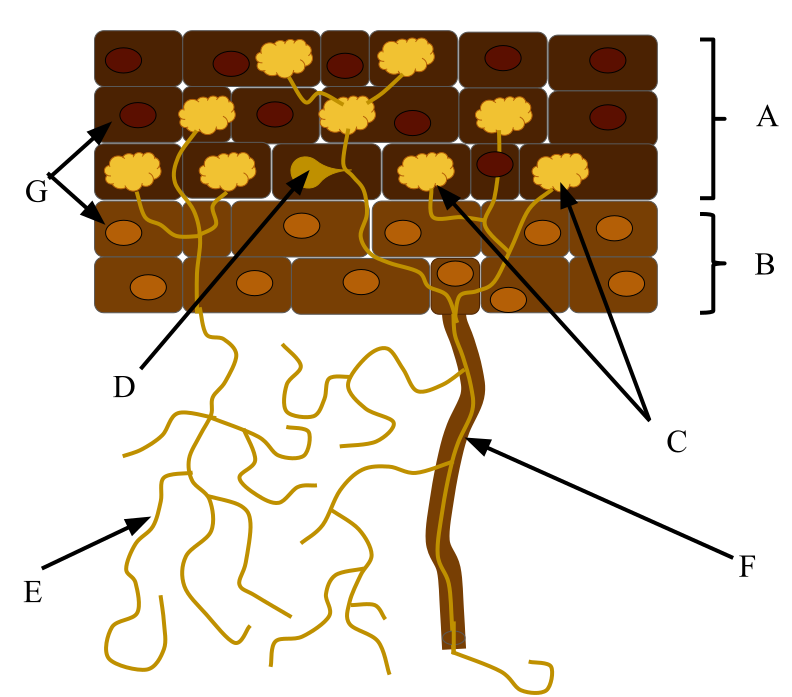In this mutualism, fungal hyphae (E) increase the surface area of the root and uptake of key nutrients while the plant supplies the fungi with fixed carbon (A=root cortex, B=root epidermis, C=arbuscle, D=vesicle, F=root hair, G=nuclei).

The mycorrhizal mutualistic association provides the fungus with relatively constant and direct access to [carbohydrates](https://en.wikipedia.org/wiki/Carbohydrate "Carbohydrate"), such as [glucose](https://en.wikipedia.org/wiki/Glucose "Glucose") and [sucrose](https://en.wikipedia.org/wiki/Sucrose "Sucrose"). The carbohydrates are translocated from their source (usually leaves) to root tissue and on to the plant's fungal partners. In return, the plant gains the benefits of the [mycelium](https://en.wikipedia.org/wiki/Mycelium "Mycelium")'s higher absorptive capacity for water and mineral nutrients, partly because of the large surface area of fungal hyphae, which are much longer and finer than plant [root hairs](https://en.wikipedia.org/wiki/Root_hair "Root hair"), and partly because some such fungi can mobilize soil minerals unavailable to the plants' roots. The effect is thus to improve the plant's mineral absorption capabilities.

Unaided plant roots may be unable to take up [nutrients](https://en.wikipedia.org/wiki/Nutrient "Nutrient") that are chemically or physically [immobilised](https://en.wikipedia.org/wiki/Immobilization_\(soil_science\) "Immobilization (soil science)"); examples include [phosphate](https://en.wikipedia.org/wiki/Phosphate "Phosphate") [ions](https://en.wikipedia.org/wiki/Ions "Ions") and [micronutrients](https://en.wikipedia.org/wiki/Micronutrient "Micronutrient") such as iron. One form of such immobilization occurs in soil with high [clay](https://en.wikipedia.org/wiki/Clay "Clay") content, or soils with a strongly [basic pH](https://en.wikipedia.org/wiki/PH "PH"). The [mycelium](https://en.wikipedia.org/wiki/Mycelium "Mycelium") of the mycorrhizal fungus can, however, access many such nutrient sources, and make them available to the plants they colonize. Thus, many plants are able to obtain phosphate without using soil as a source. Another form of immobilisation is when nutrients are locked up in organic matter that is slow to decay, such as wood, and some mycorrhizal fungi act directly as decay organisms, mobilising the nutrients and passing some onto the host plants; for example, in some [dystrophic](https://en.wikipedia.org/wiki/Dystrophic "Dystrophic") forests, large amounts of phosphate and other nutrients are taken up by mycorrhizal [hyphae](https://en.wikipedia.org/wiki/Hypha "Hypha") acting directly on [leaf litter](https://en.wikipedia.org/wiki/Leaf_litter "Leaf litter"), bypassing the need for soil uptake. _[Inga alley cropping](https://en.wikipedia.org/wiki/Inga_alley_cropping "Inga alley cropping")_, an [agroforestry](https://en.wikipedia.org/wiki/Agroforestry "Agroforestry") technique proposed as an alternative to [slash and burn](https://en.wikipedia.org/wiki/Slash_and_burn "Slash and burn") rainforest destruction, relies upon mycorrhiza within the root system of species of _[Inga](https://en.wikipedia.org/wiki/Inga "Inga")_ to prevent the rain from washing [phosphorus](https://en.wikipedia.org/wiki/Phosphorus "Phosphorus") out of the soil.

In some more complex relationships, mycorrhizal fungi do not just collect immobilised soil nutrients, but connect individual plants together by [mycorrhizal networks](https://en.wikipedia.org/wiki/Mycorrhizal_networks "Mycorrhizal networks") that transport water, carbon, and other nutrients directly from plant to plant through underground hyphal networks.

_[Suillus tomentosus](https://en.wikipedia.org/wiki/Suillus_tomentosus "Suillus tomentosus")_, a [basidiomycete](https://en.wikipedia.org/wiki/Basidiomycete "Basidiomycete") fungus, produces specialized structures known as tuberculate ectomycorrhizae with its plant host [lodgepole pine](https://en.wikipedia.org/wiki/Lodgepole_pine "Lodgepole pine") (_Pinus contorta_ var. _latifolia_). These structures have been shown to host [nitrogen fixing](https://en.wikipedia.org/wiki/Nitrogen_fixation "Nitrogen fixation") [bacteria](https://en.wikipedia.org/wiki/Bacteria "Bacteria") which contribute a significant amount of [nitrogen](https://en.wikipedia.org/wiki/Nitrogen "Nitrogen") and allow the pines to colonize nutrient-poor sites.

### Disease, drought and salinity resistance and its correlation to mycorrhizae

Mycorrhizal plants are often more resistant to diseases, such as those caused by microbial soil-borne [pathogens](https://en.wikipedia.org/wiki/Pathogen "Pathogen"). These associations have been found to assist in plant defense both above and belowground. Mycorrhizas have been found to excrete enzymes that are toxic to soil borne organisms such as nematodes. More recent studies have shown that mycorrhizal associations result in a priming effect of plants that essentially acts as a primary immune response. When this association is formed a defense response is activated similarly to the response that occurs when the plant is under attack. As a result of this inoculation, defense responses are stronger in plants with mycorrhizal associations. [Ecosystem services](https://en.wikipedia.org/wiki/Ecosystem_services "Ecosystem services") provided by mycorrhizal fungi may depend on the soil microbiome. Furthermore, mycorrhizal fungi was significantly correlated with soil physical variable, but only with water level and not with aggregate stability and can lead also to more resistant to the effects of drought. Moreover, the significance of mycorrhizal fungi also includes alleviation of salt stress and its beneficial effects on plant growth and productivity. Although salinity can negatively affect mycorrhizal fungi, many reports show improved growth and performance of mycorrhizal plants under salt stress conditions.

### Resistance to insects

Plants connected by mycorrhizal fungi in [mycorrhizal networks](https://en.wikipedia.org/wiki/Mycorrhizal_network "Mycorrhizal network") can use these underground connections to communicate warning signals. For example, when a host plant is attacked by an [aphid](https://en.wikipedia.org/wiki/Aphid "Aphid"), the plant signals surrounding connected plants of its condition. Both the host plant and those connected to it release [volatile organic compounds](https://en.wikipedia.org/wiki/Volatile_organic_compound "Volatile organic compound") that repel aphids and attract [parasitoid wasps](https://en.wikipedia.org/wiki/Parasitoid_wasp "Parasitoid wasp"), predators of aphids. This assists the mycorrhizal fungi by conserving its food supply.

### Colonization of barren soil

Plants grown in sterile [soils](https://en.wikipedia.org/wiki/Soil "Soil") and growth media often perform poorly without the addition of [spores](https://en.wikipedia.org/wiki/Spore "Spore") or hyphae of mycorrhizal fungi to colonise the plant roots and aid in the uptake of soil mineral nutrients. The absence of mycorrhizal fungi can also slow plant growth in early succession or on degraded landscapes. The introduction of alien mycorrhizal plants to nutrient-deficient ecosystems puts indigenous non-mycorrhizal plants at a competitive disadvantage. This aptitude to colonize barren soil is defined by the category [Oligotroph](https://en.wikipedia.org/wiki/Oligotroph "Oligotroph").

### Resistance to toxicity

Fungi have a protective role for plants rooted in soils with high metal concentrations, such as [acidic](https://en.wikipedia.org/wiki/Soil_pH "Soil pH") and [contaminated soils](https://en.wikipedia.org/wiki/Soil_contamination "Soil contamination"). [Pine](https://en.wikipedia.org/wiki/Pinus "Pinus") trees inoculated with _[Pisolithus tinctorius](https://en.wikipedia.org/wiki/Pisolithus_tinctorius "Pisolithus tinctorius")_ planted in several contaminated sites displayed high tolerance to the prevailing contaminant, survivorship and growth. One study discovered the existence of _[Suillus luteus](https://en.wikipedia.org/wiki/Suillus_luteus "Suillus luteus")_ strains with varying tolerance of [zinc](https://en.wikipedia.org/wiki/Zinc "Zinc"). Another study discovered that zinc-tolerant strains of _[Suillus bovinus](https://en.wikipedia.org/wiki/Suillus_bovinus "Suillus bovinus")_ conferred resistance to plants of _[Pinus sylvestris](https://en.wikipedia.org/wiki/Pinus_sylvestris "Pinus sylvestris")_. This was probably due to binding of the metal to the extramatricial [mycelium](https://en.wikipedia.org/wiki/Mycelium "Mycelium") of the fungus, without affecting the exchange of beneficial substances.

## Occurrence of mycorrhizal associations

Mycorrhizas are present in 92% of plant families studied (80% of species), with [arbuscular mycorrhizas](https://en.wikipedia.org/wiki/Arbuscular_mycorrhiza "Arbuscular mycorrhiza") being the ancestral and predominant form, and the most prevalent symbiotic association found in the plant kingdom. The structure of arbuscular mycorrhizas has been highly conserved since their first appearance in the fossil record, with both the development of ectomycorrhizas and the loss of mycorrhizas, [evolving convergently](https://en.wikipedia.org/wiki/Convergent_evolution "Convergent evolution") on multiple occasions.

Associations of fungi with the roots of plants have been known since at least the mid-19th century. However, early observers simply recorded the fact without investigating the relationships between the two organisms. This symbiosis was studied and described by [Franciszek Kamieński](https://en.wikipedia.org/wiki/Franciszek_Kamieński "Franciszek Kamieński") in 1879–1882.

## Climate change

CO2 released by human activities is causing [climate change](https://en.wikipedia.org/wiki/Climate_change "Climate change") and possible damage to mycorrhizae, but the direct effect of an increase in the gas should be to benefit plants and mycorrhizae. In Arctic regions, nitrogen and water are harder for plants to obtain, making mycorrhizae crucial to plant growth. Since mycorrhizae tend to do better in cooler temperatures, warming could be detrimental to them. Gases such as SO2, NOx, and O3 produced by human activity may harm mycorrhizae, causing reduction in "[propagules](https://en.wikipedia.org/wiki/Propagules "Propagules"), the colonization of roots, degradation in connections between trees, reduction in the mycorrhizal incidence in trees, and reduction in the [enzyme activity](https://en.wikipedia.org/wiki/Enzyme_activity "Enzyme activity") of ectomycorrhizal roots."

A company in [Israel](https://en.wikipedia.org/wiki/Israel "Israel"), Groundwork BioAg, has discovered a method of using mycorrhizal fungi to increase agricultural crops while sequestering greenhouse gases and eliminating CO2 from the atmosphere.

## Conservation and mapping

In 2021, the [Society for the Protection of Underground Networks](https://en.wikipedia.org/wiki/Society_for_the_Protection_of_Underground_Networks "Society for the Protection of Underground Networks") was launched. SPUN is a science-based initiative to map and protect the mycorrhizal networks regulating Earth's climate and ecosystems. Its stated goals are mapping, protecting, and harnessing mycorrhizal fungi.
