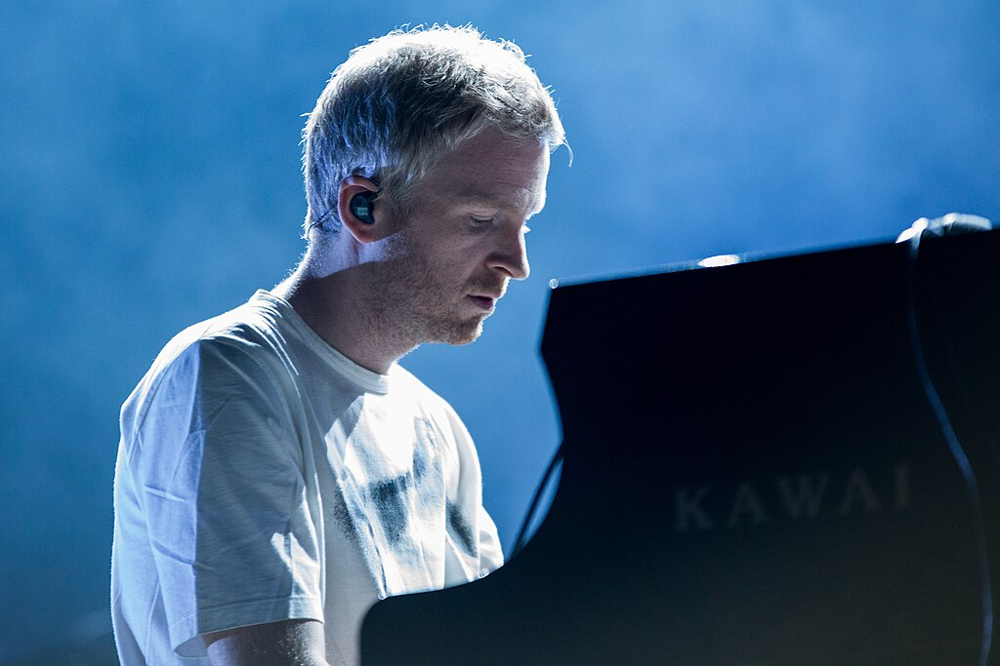
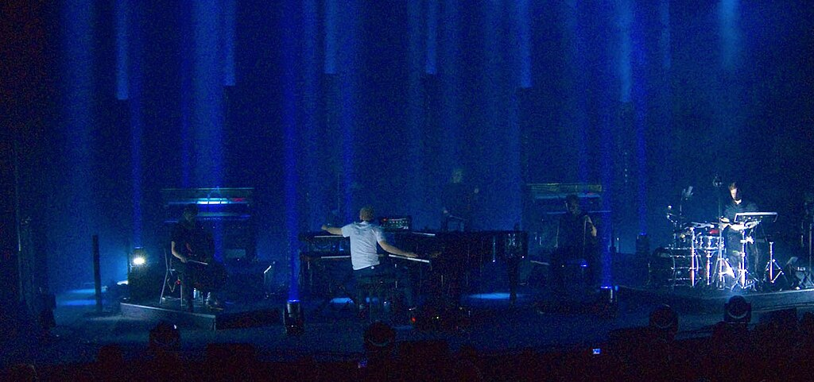

Ólafur Arnalds

Ólafur Arnalds in 2019

Background information

Born

 (1986-11-03) 3 November 1986

[Mosfellsbær](https://en.wikipedia.org/wiki/Mosfellsbær "Mosfellsbær"), Iceland

Genres

*   [Film score](https://en.wikipedia.org/wiki/Film_score "Film score")
*   [classical](https://en.wikipedia.org/wiki/Contemporary_classical_music "Contemporary classical music")
*   [experimental](https://en.wikipedia.org/wiki/Experimental_music "Experimental music")
*   [electronica](https://en.wikipedia.org/wiki/Electronica "Electronica")
*   [ambient](https://en.wikipedia.org/wiki/Ambient_music "Ambient music")
*   [hardcore punk](https://en.wikipedia.org/wiki/Hardcore_punk "Hardcore punk") (early)
*   [heavy metal](https://en.wikipedia.org/wiki/Heavy_metal_music "Heavy metal music") (early)

Occupations

*   Musician
*   composer
*   record producer

Instruments

*   Piano
*   drums
*   guitar
*   banjo

Years active

Early 2000s–present

Labels

*   [Erased Tapes](https://en.wikipedia.org/wiki/Erased_Tapes_Records "Erased Tapes Records")
*   Mercury KX/Decca/[Universal Classics](https://en.wikipedia.org/wiki/Universal_Classics "Universal Classics")

Member of

[Kiasmos](https://en.wikipedia.org/wiki/Kiasmos "Kiasmos")

Website

[olafurarnalds.com](http://olafurarnalds.com)

**Ólafur Arnalds** (Icelandic pronunciation:[\[ˈouːlavʏrˈartnalts\]](https://en.wikipedia.org/wiki/Help:IPA/Icelandic "Help:IPA/Icelandic"); born 3 November 1986) is an Icelandic multi-instrumentalist and producer from [Mosfellsbær](https://en.wikipedia.org/wiki/Mosfellsbær "Mosfellsbær"), Iceland. He mixes strings and piano with loops and beats, a sound ranging from ambient/electronic to atmospheric pop. He is also the former drummer for [hardcore punk](https://en.wikipedia.org/wiki/Hardcore_punk "Hardcore punk") and [metal](https://en.wikipedia.org/wiki/Heavy_metal_music "Heavy metal music") bands Fighting Shit, Celestine, and others.

In 2009, Ólafur also formed an experimental techno project, entitled [Kiasmos](https://en.wikipedia.org/wiki/Kiasmos "Kiasmos"), with Janus Rasmussen from the Icelandic electro-pop band Bloodgroup, announcing his electronic debut album in 2014.

In 2013, Ólafur composed the score for the 2013 [ITV](https://en.wikipedia.org/wiki/ITV_\(TV_network\) "ITV (TV network)") series _[Broadchurch](https://en.wikipedia.org/wiki/Broadchurch "Broadchurch"),_ for which he won the 2014 [BAFTA TV Craft Award](https://en.wikipedia.org/wiki/British_Academy_Television_Craft_Awards "British Academy Television Craft Awards") for Best Original Music.

In 2020, Ólafur was nominated for a [Primetime Emmy Award for Outstanding Original Main Title Theme Music](https://en.wikipedia.org/wiki/Primetime_Emmy_Award_for_Outstanding_Original_Main_Title_Theme_Music "Primetime Emmy Award for Outstanding Original Main Title Theme Music"), for his title theme to [Apple TV+](https://en.wikipedia.org/wiki/Apple_TV+ "Apple TV+") series _[Defending Jacob](https://en.wikipedia.org/wiki/Defending_Jacob_\(miniseries\) "Defending Jacob (miniseries)")._

In 2021, he was nominated in two categories at the [64th Annual Grammy Awards](https://en.wikipedia.org/wiki/64th_Annual_Grammy_Awards "64th Annual Grammy Awards"). "Loom (feat. [Bonobo](https://en.wikipedia.org/wiki/Bonobo_\(musician\) "Bonobo (musician)"))" was nominated in the [Best Dance/Electronic Recording](https://en.wikipedia.org/wiki/Grammy_Award_for_Best_Dance/Electronic_Recording "Grammy Award for Best Dance/Electronic Recording") category and "The Bottom Line" was nominated in the [Best Arrangement, Instrumental and Vocals](https://en.wikipedia.org/wiki/Grammy_Award_for_Best_Arrangement,_Instrumental_and_Vocals "Grammy Award for Best Arrangement, Instrumental and Vocals") category. Both songs appear on his fifth studio album _Some Kind of Peace_ (2020).

Since late 2025, **Ólafur** has hosted a radio programme on the [digital-only](https://en.wikipedia.org/wiki/Digital_Audio_Broadcasting "Digital Audio Broadcasting") UK station [BBC](https://en.wikipedia.org/wiki/BBC_Radio "BBC Radio") [Radio 3 Unwind](https://en.wikipedia.org/wiki/BBC_Radio_3_Unwind "BBC Radio 3 Unwind") at least once a week titled _Ultimate Calm_, which is normally broadcast between 21 and 22 [o'clock](https://en.wikipedia.org/wiki/O'clock "O'clock").

## History

### 1986–2007: Early life and career beginnings

Ólafur's grandmother introduced him to the music of [Frédéric Chopin](https://en.wikipedia.org/wiki/Frédéric_Chopin "Frédéric Chopin") from an early age.

In 2004, Ólafur composed and recorded the intro and two outros for tracks on the album _[Antigone](https://en.wikipedia.org/wiki/Antigone_\(Heaven_Shall_Burn_album\) "Antigone (Heaven Shall Burn album)")_ by German metal band [Heaven Shall Burn](https://en.wikipedia.org/wiki/Heaven_Shall_Burn "Heaven Shall Burn"). On his Facebook page, he described how he got to know them: "I was playing drums in a hardcore band and we were supporting the German metal band Heaven Shall Burn on their Icelandic tour. Being a huge fan, I gave them a demo with some very overly dramatic prog-rock songs I had been making at home – it was not so classic like this but had some badly computerized strings and piano in it. A few months later they contacted me asked if I would write some intros and outros for their new album, but only with the piano/strings elements – So I wrote my first classical pieces. Their album was a big success in Europe and a few months later I got a phone call from a label asking 'would you be interested in making a full album with compositions like this?' I hadn't really considered continuing writing music like this, but said yes."

### 2007–2008: _Eulogy for Evolution_ and _Variations of Static_

On 12 October 2007, Ólafur's first solo album _[Eulogy for Evolution](https://en.wikipedia.org/wiki/Eulogy_for_Evolution "Eulogy for Evolution")_ was released. It was followed by the EP _Variations of Static_ in 2008. In the same year, Ólafur toured with [Sigur Rós](https://en.wikipedia.org/wiki/Sigur_Rós "Sigur Rós") and his second collaboration with Heaven Shall Burn, the album _[Iconoclast (Part 1: The Final Resistance)](https://en.wikipedia.org/wiki/Iconoclast_\(Part_1:_The_Final_Resistance\) "Iconoclast (Part 1: The Final Resistance)")_, was released. He is also reported to have sold out The Barbican Hall in London.

### 2009: _Found Songs_ and _Dyad 1909_

In April 2009, Ólafur composed and released a track daily for seven days, instantly making each track available within 24 hours from [foundsongs.erasedtapes.com](http://foundsongs.erasedtapes.com). The collection of tracks was entitled _Found Songs_. The first track was released on 13 April.

In October 2009, the ballet _[Dyad 1909](https://en.wikipedia.org/wiki/Wayne_McGregor#Dyad_1909 "Wayne McGregor")_ premiered with a score composed by Ólafur which was also released as an EP.

Also in 2009, Ólafur formed an experimental techno project, [Kiasmos](https://en.wikipedia.org/wiki/Kiasmos "Kiasmos"), with Janus Rasmussen from the Icelandic electro-pop band Bloodgroup. They released a joint EP with Ryan Lee West of the [EDM](https://en.wikipedia.org/wiki/Electronic_dance_music "Electronic dance music") project Rival Consoles entitled _65/Milo_.

### 2010–2011: Second studio album and _Living Room Songs_

In April 2010, Ólafur released a new album entitled _...And They Have Escaped The Weight of Darkness_. During 2010 Ólafur also went on a well-received Asian Tour organised by China-based promoter [Split Works](https://en.wikipedia.org/wiki/Split_Works "Split Works").

On 3 October 2011, Ólafur started another seven-day composition project similar to _Found Songs_, this one entitled _Living Room Songs_. Inspired one day by only having a laptop computer available to record the musical ideas he explored using only the video recording feature. Taken by the intimate feeling of the recording, he expanded on the approach for the _Living Room Songs_ project.

Calling on string musician friends, they rehearsed and recorded one song each day for a week in his Reykjavik apartment, releasing the next day for free as streamed videos and mp3 downloads. The project was released as an album on 23 December 2011 and a corresponding short film, offered a rare glimpse into Ólafur's creative process and the close-knit musical community he is a part of.

2011 also saw the release of Ólafur's remix of [Mr Fogg](https://en.wikipedia.org/wiki/Mr_Fogg "Mr Fogg")'s track "Keep Your Teeth Sharp" on the EP of the same name.

### 2012: _Another Happy Day_, _Two Songs For Dance_...

In 2012, Ólafur announced a new partnership with the [Universal Music](https://en.wikipedia.org/wiki/Universal_Music "Universal Music") label Mercury Classics.

2012 saw four releases from Ólafur; his score for [Sam Levinson](https://en.wikipedia.org/wiki/Sam_Levinson "Sam Levinson")'s film _[Another Happy Day](https://en.wikipedia.org/wiki/Another_Happy_Day "Another Happy Day")_; an EP entitled _Two Songs For Dance_; the second EP from his experimental techno project [Kiasmos](https://en.wikipedia.org/wiki/Kiasmos "Kiasmos") and another EP entitled _Stare_ with German pianist [Nils Frahm](https://en.wikipedia.org/wiki/Nils_Frahm "Nils Frahm").

Also in 2012, his song "Allt varð hljótt" was used in the score and the soundtrack for the film _[The Hunger Games](https://en.wikipedia.org/wiki/The_Hunger_Games_\(film\) "The Hunger Games (film)")_.

"Til enda" was used in a trailer for the 2012 film _[Looper](https://en.wikipedia.org/wiki/Looper_\(film\) "Looper (film)")_.

### 2013–2014: _For Now I Am Winter_ and further scores

Ólafur released his third studio album entitled _For Now I Am Winter_ in February 2013. Four tracks featured vocals from Arnór Dan of the Icelandic band [Agent Fresco](https://en.wikipedia.org/wiki/Agent_Fresco "Agent Fresco"). This was the first time Ólafur incorporated vocals into any of his released work.

More recently, he composed the score and end-credits track for the 2013 [ITV](https://en.wikipedia.org/wiki/ITV_\(TV_channel\) "ITV (TV channel)") series _[Broadchurch](https://en.wikipedia.org/wiki/Broadchurch "Broadchurch")_ (again featuring the vocals of Arnór Dan), for which he won the 2014 [BAFTA TV Craft Award](https://en.wikipedia.org/wiki/British_Academy_Television_Craft_Awards "British Academy Television Craft Awards") for Best Original Music.

Ólafur also composed the score for Ron Krauss' film _[Gimme Shelter](https://en.wikipedia.org/wiki/Gimme_Shelter_\(2013_film\) "Gimme Shelter (2013 film)")_.

_For Now I Am Winter_ was used in the pilot of the 2013 US TV show _[Masters of Sex](https://en.wikipedia.org/wiki/Masters_of_Sex "Masters of Sex")_.

Ólafur Arnalds has been involved with various other projects and his music appears in many films, television shows and advertisements. His songs have been featured on _[So You Think You Can Dance](https://en.wikipedia.org/wiki/So_You_Think_You_Can_Dance "So You Think You Can Dance")_ in multiple seasons. He also spoke at length on the subject of fan-submitted art in the 2011 documentary film _Press Pause Play_.

In 2014 Ólafur announced his electronic debut album in collaboration with Janus Rasmussen under his project [Kiasmos](https://en.wikipedia.org/wiki/Kiasmos "Kiasmos").

### 2015: _The Chopin Project_ and further projects

In 2015 Ólafur collaborated with German-Japanese pianist [Alice Sara Ott](https://en.wikipedia.org/wiki/Alice_Sara_Ott "Alice Sara Ott") on _The Chopin Project_, which was a release to introduce an exciting new take on the music of [Frédéric Chopin](https://en.wikipedia.org/wiki/Frédéric_Chopin "Frédéric Chopin"). Arnalds chose a program of Chopin works to create an emotional arc throughout the album and then composed linking sections for string quintet, piano, and synthesizer based on the atmosphere and motifs of those pieces.

_The Chopin Project_ began as a dedication to Ólafur's grandmother, in some respects. Out of respect for her, a younger, metal-loving Ólafur would sit with her to listen to Chopin's work whenever they had visited one another. At her deathbed, Ólafur said “she was just lying there, old and sick, but very happy and proud. And I sat with her and we listened to a Chopin sonata. Then I kissed her goodbye and left. She passed away a few hours later.”

In 2015, Ólafur's collaborations with Nils Frahm, _Life Story Love and Glory_ (a completely improvised recording) and _Loon_, were collected on a double CD entitled _Collaborative Works_ along with 2012's _Stare_ and a live improvisational film entitled _Trance Frendz - An evening with Ólafur Arnalds and Nils Frahm_. 2015 also saw the full release of his work on _[Broadchurch](https://en.wikipedia.org/wiki/Broadchurch "Broadchurch")_.

### 2016: _Island Songs_

In June 2016 Ólafur announced his _Island Songs_ project, which would involve him working with director Baldvin Z and travelling to seven different locations in Iceland over seven weeks, collaborating with seven different artists. Each week the audio and video for each track would be released, culminating in the final track, "Doria", being released on 8 August 2016.

List of tracks with collaborators:

1.  "Árbakkinn" (ft. Einar Georg)
2.  "1995" (ft. Dagný Arnalds)
3.  "Raddir" (ft. South Iceland Chamber Choir)
4.  "Öldurót" (ft. [Atli Örvarsson](https://en.wikipedia.org/wiki/Atli_Örvarsson "Atli Örvarsson") & SinfoniaNord)
5.  "Dalur" (ft. Brasstríó Mosfellsdals)
6.  "Particles" (ft. Nanna Bryndís from [Of Monsters and Men](https://en.wikipedia.org/wiki/Of_Monsters_and_Men "Of Monsters and Men"))
7.  "Doria"

"Particles" ft. [Nanna Bryndís](https://en.wikipedia.org/wiki/Nanna_Bryndís_Hilmarsdóttir "Nanna Bryndís Hilmarsdóttir") from [Of Monsters and Men](https://en.wikipedia.org/wiki/Of_Monsters_and_Men "Of Monsters and Men") was premiered on [Zane Lowe](https://en.wikipedia.org/wiki/Zane_Lowe "Zane Lowe")'s [Beats 1](https://en.wikipedia.org/wiki/Beats_1 "Beats 1") show on 1 August 2016, making it the first classical track featured on that station.

In 2016, Ólafur and [Quarashi](https://en.wikipedia.org/wiki/Quarashi "Quarashi") frontman [Sölvi Blöndal](https://en.wikipedia.org/wiki/Sölvi_Blöndal "Sölvi Blöndal") founded the record label Alda Music, which was acquired by [INgrooves](https://en.wikipedia.org/wiki/INgrooves "INgrooves") in January 2022. Alda owned the rights to nearly 80 percent of all music released in Iceland.

### 2018: _Re:member_

With Stratus Pianos at Iceland Airwaves, 2018

Ólafur's fourth official solo album, _Re:member_ was released in August 2018. The album featured his new musical system called Stratus. The Stratus Pianos are two self-playing, semi-generative player pianos which are triggered by a central piano played by Arnalds. The custom-built software was born out of two years of work by the composer and audio developer, Halldór Eldjárn. As Arnalds plays a note on the piano, two different notes are generated by Stratus, creating unexpected harmonies and surprising melodic sequences.

The algorithms generated from Stratus were also used to create the album artwork. In an interview with Sound of Boston, Arnalds explains that the artist, Torsten Posselt from FELD studios, used the Stratus software as a starting point and made his own software that translated the same MIDI signals used for the music. Each dot corresponds to a piano note in the title track: 88 fields correspond to 88 notes; the thicker the dot, the higher the frequency of that note being played.

He composed the main theme for the [Apple TV+](https://en.wikipedia.org/wiki/Apple_TV+ "Apple TV+") mini series [Defending Jacob (miniseries)](https://en.wikipedia.org/wiki/Defending_Jacob_\(miniseries\) "Defending Jacob (miniseries)").

### 2020: _Some Kind of Peace_

His fifth studio album, _Some Kind of Peace_, was released on 6 November 2020. The album features guest appearances from [Bonobo](https://en.wikipedia.org/wiki/Bonobo_\(musician\) "Bonobo (musician)"), Josin, and [JFDR](https://en.wikipedia.org/wiki/Jófríður_Ákadóttir "Jófríður Ákadóttir"). "Loom" (feat. [Bonobo](https://en.wikipedia.org/wiki/Bonobo_\(musician\) "Bonobo (musician)")) and "The Bottom Line" were nominated for [Grammy Awards](https://en.wikipedia.org/wiki/Grammy_Awards "Grammy Awards").

### 2023: OPIA Community

In October 2023, Ólafur officially launched the OPIA Community project, which is described as a "travelling festival series, a record label and a community hub made up of creators, thinkers, art lovers and everything in-between." The project had been in preparation since 2019, however was delayed by the [COVID-19 pandemic](https://en.wikipedia.org/wiki/COVID-19_pandemic "COVID-19 pandemic").

On 18 October 2023, Ólafur hosted the official OPIA Community launch event titled 'OPIA Night' at Silent Green in [Berlin, Germany](https://en.wikipedia.org/wiki/Berlin "Berlin"). The event featured several artists who Ólafur met online during the pandemic and have since been signed to the OPIA Community record label, including [JFDR](https://en.wikipedia.org/wiki/Jófríður_Ákadóttir "Jófríður Ákadóttir") and Sofi Paez.

## Personal life

Ólafur's cousin [Ólöf Arnalds](https://en.wikipedia.org/wiki/Ólöf_Arnalds "Ólöf Arnalds") is also a well-known singer-songwriter.

Ólafur is a [vegetarian](https://en.wikipedia.org/wiki/Vegetarianism "Vegetarianism").

Ólafur's favourite classical composers are [Frédéric Chopin](https://en.wikipedia.org/wiki/Frédéric_Chopin "Frédéric Chopin"), [David Lang](https://en.wikipedia.org/wiki/David_Lang_\(composer\) "David Lang (composer)"), [Shostakovich](https://en.wikipedia.org/wiki/Shostakovich "Shostakovich") and [Arvo Pärt](/source/arvo-part/ "Arvo Pärt").

Ólafur lives in Iceland but also has a home in Indonesia.

Ólafur married his partner, singer and musician Sandrayati, in [Bali](https://en.wikipedia.org/wiki/Bali "Bali") in December 2022. On 5 September 2025, he announced she is 37 weeks pregnant with their first child.

## Notable awards and nominations

### Awards

*   [BAFTA awards](https://en.wikipedia.org/wiki/BAFTA_Awards "BAFTA Awards") (2014), Best Original Music, for _Broadchurch_
*   Televisual Bulldog Awards (2014), Best Music, for _Broadchurch_
*   [The Edda Icelandic Film Awards](https://en.wikipedia.org/wiki/Edda_Awards "Edda Awards") (2015), Best music, for _Vonarstræti_
*   [Icelandic Music Awards](https://en.wikipedia.org/wiki/Icelandic_Music_Awards "Icelandic Music Awards") (2021), Best Film and TV Score, for _Defending Jacob_

### Notable nominations

*   [Emmy Awards](https://en.wikipedia.org/wiki/Emmy_Awards "Emmy Awards") (2020), Outstanding Original Main Title Theme Music, for _Defending Jacob_
*   [Grammy Awards](https://en.wikipedia.org/wiki/Grammy_Awards "Grammy Awards") (2022), Best Arrangement, Instruments and Vocals, for "The Bottom Line"
*   [Grammy Awards](https://en.wikipedia.org/wiki/Grammy_Awards "Grammy Awards") (2022), Best Dance/Electronic Recording, for "Loom (feat. Bonobo)"

## Discography

### Albums

*   _[Eulogy for Evolution](https://en.wikipedia.org/wiki/Eulogy_for_Evolution "Eulogy for Evolution")_ (2007)
*   _...And They Have Escaped the Weight of Darkness_ (2010)
*   _For Now I Am Winter_ (2013)
*   _[Re:member](https://en.wikipedia.org/wiki/Re:member_\(album\) "Re:member (album)")_ (2018)
*   _Some Kind of Peace_ (2020)
*   _A Dawning_ (2025)

### Extended plays

*   _Variations of Static_ - EP (2008)
*   _The Invisible EP_ - EP (2021)

### Singles

*   "Two Songs for Dance" (2012)
*   "Kinesthesia I" (2016)
*   "RGB" (2016)
*   "Zeit" (2021) (rework for [Rammstein](https://en.wikipedia.org/wiki/Rammstein "Rammstein"))
*   "Saudade" (2021)
*   "Improvisation" (2024)

### Collections

*   _Found Songs_ (2009)
*   _Living Room Songs_ (2011)
*   _Island Songs_ (2016)

### Soundtracks

*   _Dyad 1909_ (2009)
*   _Blinky TM_ (2010)
*   _Jitters_ (2010)
*   _[Another Happy Day](https://en.wikipedia.org/wiki/Another_Happy_Day "Another Happy Day")_ (2012)
*   _[Gimme Shelter](https://en.wikipedia.org/wiki/Gimme_Shelter_\(2013_film\) "Gimme Shelter (2013 film)")_ (2013)
*   _Vonarstræti/Life in a Fishbowl_ (2014)
*   _The Invisible Front_ (2014)
*   _[Broadchurch](https://en.wikipedia.org/wiki/Broadchurch "Broadchurch")_ (2015)
*   _[Defending Jacob](https://en.wikipedia.org/wiki/Defending_Jacob_\(miniseries\) "Defending Jacob (miniseries)")_ (2020)
*   _[Surface](https://en.wikipedia.org/wiki/Surface_\(2022_TV_series\) "Surface (2022 TV series)")_ (2022)
*   _[Moonhaven](https://en.wikipedia.org/wiki/Moonhaven_\(TV_series\) "Moonhaven (TV series)")_ (2022)
*   _Deep rising_ (2023)

### Collaborations

*   _A Hundred Reasons_ - Single (2010) with Haukur Heiðar Hauksson (lead singer of [Dikta](https://en.wikipedia.org/wiki/Dikta "Dikta"))
*   _Stare_ - EP (2012) with [Nils Frahm](https://en.wikipedia.org/wiki/Nils_Frahm "Nils Frahm")
*   _The Chopin Project_ - LP (2015) with [Alice Sara Ott](https://en.wikipedia.org/wiki/Alice_Sara_Ott "Alice Sara Ott")
*   _Life Story / Love and Glory_ - Single (2015) with [Nils Frahm](https://en.wikipedia.org/wiki/Nils_Frahm "Nils Frahm")
*   _Loon_ - EP (2015) with [Nils Frahm](https://en.wikipedia.org/wiki/Nils_Frahm "Nils Frahm")
*   _Trance Frendz_ - LP (2016) with [Nils Frahm](https://en.wikipedia.org/wiki/Nils_Frahm "Nils Frahm")
*   _Say My Name_ - Single (2016) with [Arnór Dan](https://en.wikipedia.org/wiki/Agent_Fresco "Agent Fresco")
*   _Patience_ - Single (2019) with [Rhye](https://en.wikipedia.org/wiki/Rhye "Rhye")
*   _Oceans_ - Single (2020) with [RY X](https://en.wikipedia.org/wiki/Ry_X "Ry X")
*   _Colorblind_ - Single (2022) with [RY X](https://en.wikipedia.org/wiki/Ry_X "Ry X")
*   _Light of Day_ - Single (2022) with [Odesza](https://en.wikipedia.org/wiki/Odesza "Odesza")
*   _Forever Held_ - Single (2024) with [Jon Hopkins](https://en.wikipedia.org/wiki/Jon_Hopkins "Jon Hopkins")
*   _SAGES_ - EP (2025) with [Loreen](https://en.wikipedia.org/wiki/Loreen "Loreen") as SAGES
*   _A Dawning_ - LP (2025) with [Talos](https://en.wikipedia.org/wiki/Talos_\(musician\) "Talos (musician)")

### Mixtapes

*   _[Late Night Tales](https://en.wikipedia.org/wiki/Late_Night_Tales "Late Night Tales"): Ólafur Arnalds_ (2016)

### Charting Albums

YearTitle[Swedish Classical Albums](https://en.wikipedia.org/wiki/Sverigetopplistan "Sverigetopplistan")
[Irish Albums Chart](https://en.wikipedia.org/wiki/Irish_Albums_Chart "Irish Albums Chart")
[UK Albums Chart](https://en.wikipedia.org/wiki/UK_Albums_Chart "UK Albums Chart")

2018

"The Chopin Project"

5

-

-

2018

"Re:Member"

1

-

48

2018

"Island Songs"

2

-

-

2020

"Some Kind of Peace"

1

-

53

2024

"Some Kind of Peace - Piano Reworks"

7

-

-

2025

"A Dawning"

1

15

-
