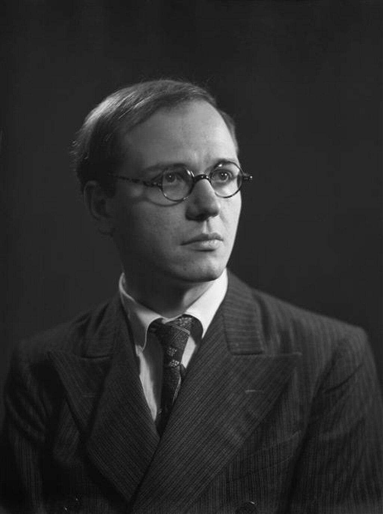
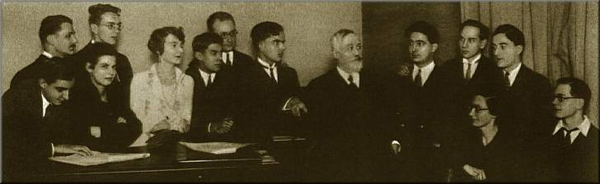
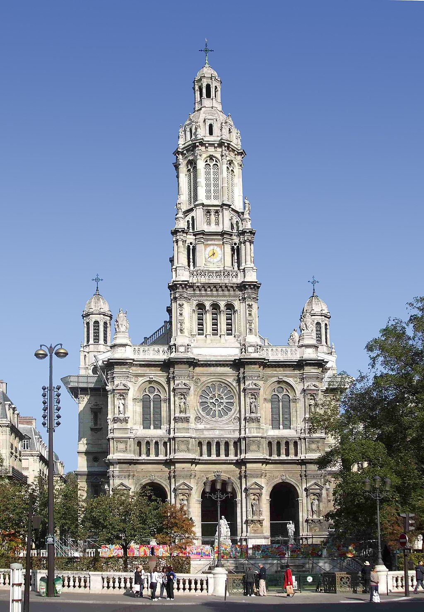
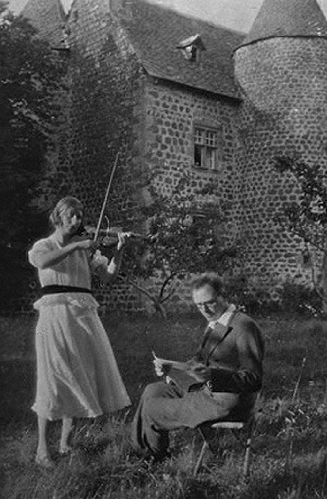
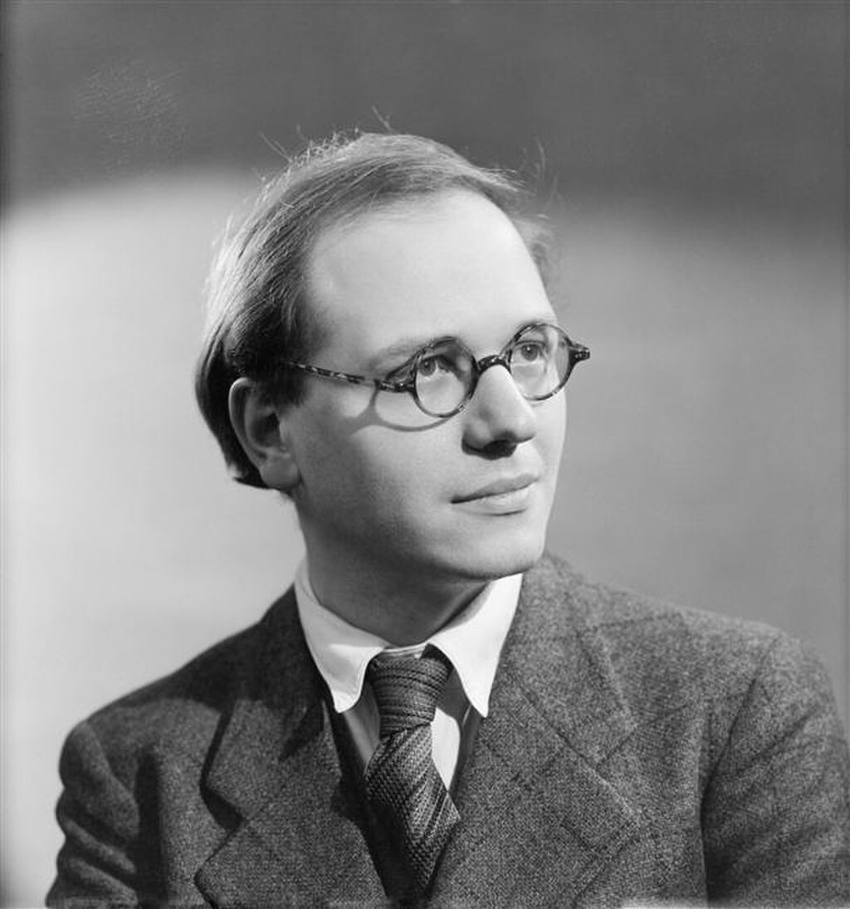
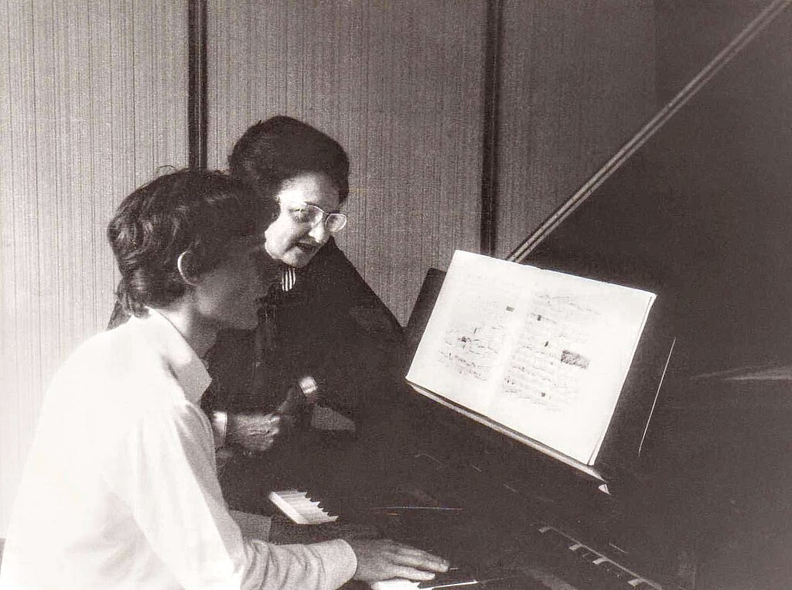
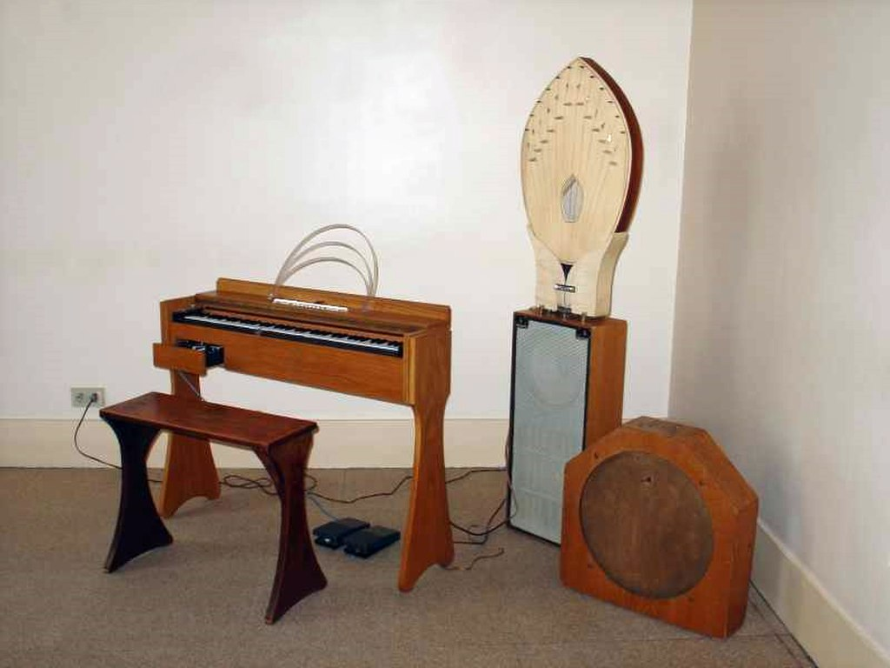
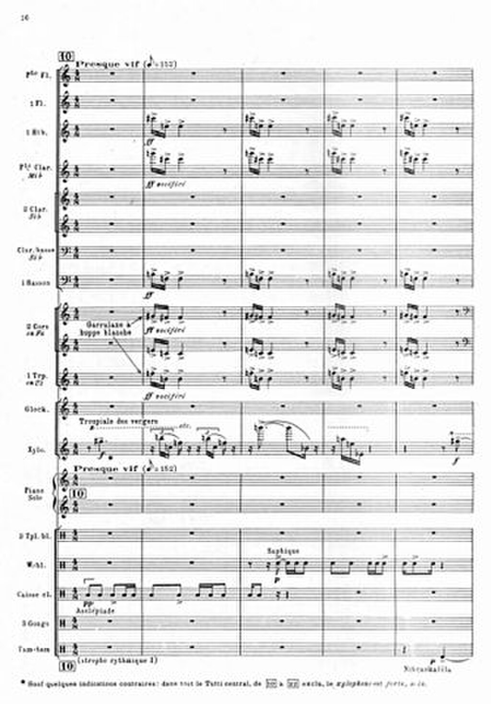
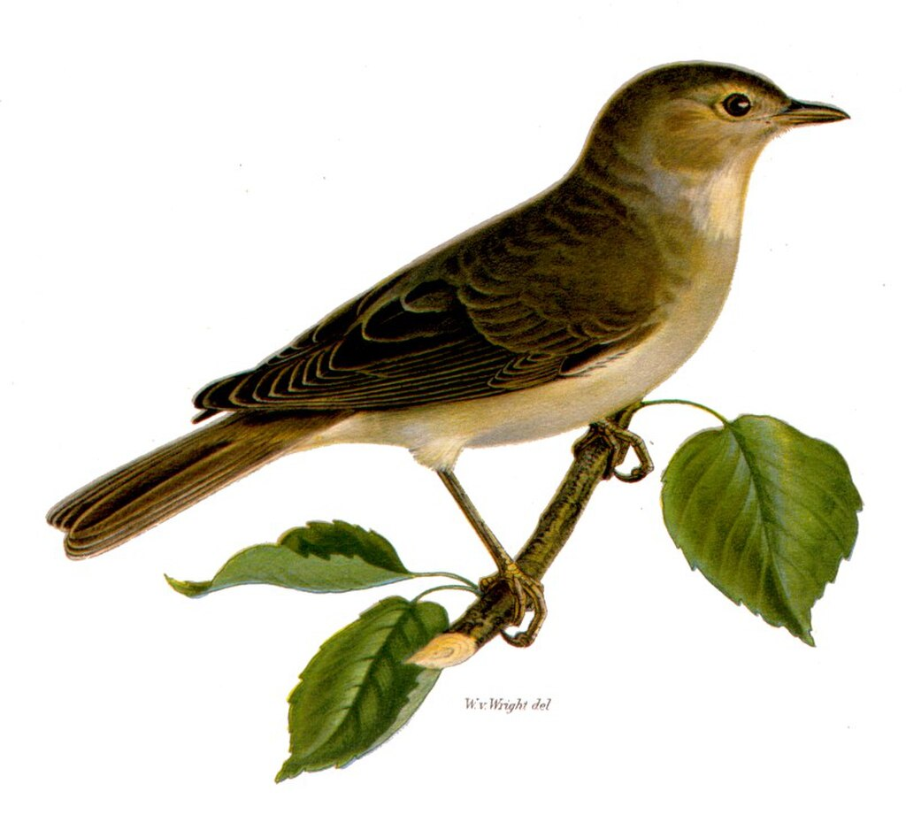

Olivier Messiaen

Messiaen in 1937

Born

(1908-12-10)10 December 1908

[Avignon](https://en.wikipedia.org/wiki/Avignon "Avignon"), France

Died

27 April 1992(1992-04-27) (aged 83)

[Clichy](https://en.wikipedia.org/wiki/Clichy,_Hauts-de-Seine "Clichy, Hauts-de-Seine"), France

Works

[List of compositions](https://en.wikipedia.org/wiki/List_of_compositions_by_Olivier_Messiaen "List of compositions by Olivier Messiaen")

Spouses

*   [Claire Delbos](https://en.wikipedia.org/wiki/Claire_Delbos "Claire Delbos")
*   [Yvonne Loriod](https://en.wikipedia.org/wiki/Yvonne_Loriod "Yvonne Loriod")

**Olivier Eugène Prosper Charles Messiaen** ([UK](https://en.wikipedia.org/wiki/British_English "British English"): [/ˈmɛsiæ̃/](https://en.wikipedia.org/wiki/Help:IPA/English "Help:IPA/English"), [US](https://en.wikipedia.org/wiki/American_English "American English"): [/mɛˈsjæ̃,meɪˈsjæ̃,mɛˈsjɒ̃/](https://en.wikipedia.org/wiki/Help:IPA/English "Help:IPA/English"); French:[\[ɔlivjeøʒɛnpʁɔspɛʁʃaʁlmɛsjɑ̃\]](https://en.wikipedia.org/wiki/Help:IPA/French "Help:IPA/French"); 10 December 1908 – 27 April 1992) was a French composer, organist, and [ornithologist](https://en.wikipedia.org/wiki/Ornithology "Ornithology"). One of the major composers of the [20th century](https://en.wikipedia.org/wiki/20th-century_classical_music "20th-century classical music"), he was also an outstanding teacher of composition and musical analysis.

Messiaen entered the [Conservatoire de Paris](https://en.wikipedia.org/wiki/Conservatoire_de_Paris "Conservatoire de Paris") at age 11 and studied with [Paul Dukas](https://en.wikipedia.org/wiki/Paul_Dukas "Paul Dukas"), [Maurice Emmanuel](https://en.wikipedia.org/wiki/Maurice_Emmanuel "Maurice Emmanuel"), [Charles-Marie Widor](https://en.wikipedia.org/wiki/Charles-Marie_Widor "Charles-Marie Widor") and [Marcel Dupré](https://en.wikipedia.org/wiki/Marcel_Dupré "Marcel Dupré"), among others. He was appointed organist at the [Église de la Sainte-Trinité, Paris](https://en.wikipedia.org/wiki/Église_de_la_Sainte-Trinité,_Paris "Église de la Sainte-Trinité, Paris"), in 1931, a post he held for 61 years, until his death. He taught at the [Schola Cantorum de Paris](https://en.wikipedia.org/wiki/Schola_Cantorum_de_Paris "Schola Cantorum de Paris") during the 1930s. After the [fall of France](https://en.wikipedia.org/wiki/Battle_of_France "Battle of France") in 1940, Messiaen was interned for nine months in the German prisoner of war camp [Stalag VIII-A](https://en.wikipedia.org/wiki/Stalag_VIII-A "Stalag VIII-A"), where he composed his _[Quatuor pour la fin du temps](https://en.wikipedia.org/wiki/Quatuor_pour_la_fin_du_temps "Quatuor pour la fin du temps")_ (_Quartet for the End of Time_) for the four instruments available in the prison—piano, violin, cello and clarinet. The piece was first performed by Messiaen and fellow prisoners for an audience of inmates and prison guards. Soon after his release in 1941, Messiaen was appointed professor of harmony at the Paris Conservatoire. In 1966, he was appointed professor of composition there, and he held both positions until retiring in 1978. His [many distinguished pupils](https://en.wikipedia.org/wiki/List_of_students_of_Olivier_Messiaen "List of students of Olivier Messiaen") included [Iannis Xenakis](https://en.wikipedia.org/wiki/Iannis_Xenakis "Iannis Xenakis"), [Mikis Theodorakis](https://en.wikipedia.org/wiki/Mikis_Theodorakis "Mikis Theodorakis"), [George Benjamin](https://en.wikipedia.org/wiki/George_Benjamin_\(composer\) "George Benjamin (composer)"), [Alexander Goehr](https://en.wikipedia.org/wiki/Alexander_Goehr "Alexander Goehr"), [Pierre Boulez](https://en.wikipedia.org/wiki/Pierre_Boulez "Pierre Boulez"), [Jacques Hétu](https://en.wikipedia.org/wiki/Jacques_Hétu "Jacques Hétu"), [Gérard Grisey](https://en.wikipedia.org/wiki/Gérard_Grisey "Gérard Grisey"), [Tristan Murail](https://en.wikipedia.org/wiki/Tristan_Murail "Tristan Murail"), [Karlheinz Stockhausen](https://en.wikipedia.org/wiki/Karlheinz_Stockhausen "Karlheinz Stockhausen"), [György Kurtág](https://en.wikipedia.org/wiki/György_Kurtág "György Kurtág"), and [Yvonne Loriod](https://en.wikipedia.org/wiki/Yvonne_Loriod "Yvonne Loriod"), who became his second wife.

Messiaen perceived colours when he heard certain musical chords (a phenomenon known as [chromesthesia](https://en.wikipedia.org/wiki/Chromesthesia "Chromesthesia")); according to him, combinations of these colours were important in his compositional process. He travelled widely and wrote works inspired by diverse influences, including [Japanese music](https://en.wikipedia.org/wiki/Japanese_music "Japanese music"), the landscape of [Bryce Canyon](https://en.wikipedia.org/wiki/Bryce_Canyon_National_Park "Bryce Canyon National Park") in [Utah](https://en.wikipedia.org/wiki/Utah "Utah"), and the life of [St. Francis of Assisi](https://en.wikipedia.org/wiki/St._Francis_of_Assisi "St. Francis of Assisi"). His style absorbed many global musical influences, such as Indonesian [gamelan](https://en.wikipedia.org/wiki/Gamelan "Gamelan") (tuned percussion often features prominently in his orchestral works). He found [birdsong](https://en.wikipedia.org/wiki/Birdsong "Birdsong") fascinating, notating bird songs worldwide and incorporating birdsong [transcriptions](https://en.wikipedia.org/wiki/Transcription_\(music\) "Transcription (music)") into his music.

Messiaen's music is [rhythmically](https://en.wikipedia.org/wiki/Rhythm "Rhythm") complex. [Harmonically](https://en.wikipedia.org/wiki/Harmony "Harmony") and [melodically](https://en.wikipedia.org/wiki/Melody "Melody"), he employed a system he called _[modes of limited transposition](https://en.wikipedia.org/wiki/Modes_of_limited_transposition "Modes of limited transposition")_, which he abstracted from the systems of material his early compositions and improvisations generated. He wrote music for chamber ensembles and orchestra, voice, solo organ, and piano, and experimented with the use of novel electronic instruments developed in Europe during his lifetime. For a short period he experimented with the [parametrisation](https://en.wikipedia.org/wiki/Serialism#Theory_of_twelve-tone_serial_music "Serialism") associated with "total serialism", in which field he is often cited as an innovator. His innovative use of colour, his conception of the relationship between time and music, and his use of birdsong are among the features that make Messiaen's music distinctive.

## Biography

### Youth and studies

![A studio portrait. A young man stands with his arms folded; he has dark hair, and is wearing a dark Edwardian suit, a white shirt with rounded collars, and a dark tie, To his right, a young woman sits on a wooden bench; she has dark, medium length hair, and is wearing a white blouse and a long white skirt. She holds a young fair-haired boy, who is wearing a light tunic with flared skirt and embroidery at the neck, dark boots and short socks. He holds a walking stick in his right hand. An empty paint tin lies on its side near his feet. The background has a colonnade and clouds in the classical romantic style.](../media/olivier-messiaen/Messiaen1910.jpg)Messiaen with his mother and father in 1910

Olivier Eugène Prosper Charles Messiaen was born on 10 December 1908 at 20 Boulevard Sixte-Isnard in [Avignon](https://en.wikipedia.org/wiki/Avignon "Avignon"), France, into a literary family. He was the elder of two sons of [Cécile Anne Marie Antoinette Sauvage](https://en.wikipedia.org/wiki/Cécile_Sauvage "Cécile Sauvage"), a poet, and Pierre Léon Joseph Messiaen, a scholar and teacher of English from a farm near [Wervicq-Sud](https://en.wikipedia.org/wiki/Wervicq-Sud "Wervicq-Sud") who also translated [William Shakespeare](https://en.wikipedia.org/wiki/William_Shakespeare "William Shakespeare")'s plays into French. Messiaen's mother published a sequence of poems, _L'âme en bourgeon_ (_The Budding Soul_), the last chapter of _Tandis que la terre tourne_ (_As the Earth Turns_), which address her unborn son. Messiaen later said this sequence of poems influenced him deeply and cited it as prophetic of his future artistic career. His brother Alain André Prosper Messiaen, four years his junior, became a poet.

At the outbreak of [World War I](https://en.wikipedia.org/wiki/World_War_I "World War I"), Pierre enlisted and Cécile took their two boys to live with her brother in [Grenoble](https://en.wikipedia.org/wiki/Grenoble "Grenoble"). There Messiaen became fascinated with drama, reciting Shakespeare to his brother. Their homemade toy theatre had translucent backdrops made of cellophane wrappers. At this time he also adopted the [Roman Catholic](https://en.wikipedia.org/wiki/Roman_Catholic "Roman Catholic") faith. Later, Messiaen felt most at home in the Alps of the [Dauphiné](https://en.wikipedia.org/wiki/Dauphiné "Dauphiné"), where he had a house built south of Grenoble. He composed most of his music there.

Messiaen took piano lessons, having already taught himself to play. His interests included the recent music of French composers [Claude Debussy](/source/claude-debussy/ "Claude Debussy") and [Maurice Ravel](https://en.wikipedia.org/wiki/Maurice_Ravel "Maurice Ravel"), and he asked for opera vocal scores for Christmas presents. He also saved to buy scores, including [Edvard Grieg](https://en.wikipedia.org/wiki/Edvard_Grieg "Edvard Grieg")'s _[Peer Gynt](https://en.wikipedia.org/wiki/Peer_Gynt_\(Grieg\) "Peer Gynt (Grieg)")_, whose "beautiful Norwegian melodic lines with the taste of folk song ... gave me a love of melody". Around this time he began to compose.

In 1918 his father returned from the war and the family moved to [Nantes](https://en.wikipedia.org/wiki/Nantes "Nantes"). Messiaen continued music lessons; one of his teachers, Jehan de Gibon, gave him a score of Debussy's opera _[Pelléas et Mélisande](https://en.wikipedia.org/wiki/Pelléas_et_Mélisande_\(opera\) "Pelléas et Mélisande (opera)")_, which Messiaen called "a thunderbolt" and "probably the most decisive influence on me". The next year, his father gained a teaching post at [Sorbonne University](https://en.wikipedia.org/wiki/Sorbonne_University "Sorbonne University") in Paris. Olivier entered the [Paris Conservatoire](https://en.wikipedia.org/wiki/Paris_Conservatoire "Paris Conservatoire") in 1919, aged 11.

Paul Dukas's composition class at the Paris Conservatoire, 1929. Messiaen sits at the far right; Dukas stands at the centre.

Messiaen made excellent academic progress at the Conservatoire. In 1924, aged 15, he was awarded second prize in [harmony](https://en.wikipedia.org/wiki/Harmony_\(music\) "Harmony (music)"), having been taught in that subject by professor [Jean Gallon](https://en.wikipedia.org/wiki/Jean_Gallon "Jean Gallon"). In 1925, he won first prize in piano [accompaniment](https://en.wikipedia.org/wiki/Accompaniment "Accompaniment"), and in 1926 he gained first prize in [fugue](https://en.wikipedia.org/wiki/Fugue "Fugue"). After studying with [Maurice Emmanuel](https://en.wikipedia.org/wiki/Maurice_Emmanuel "Maurice Emmanuel"), he was awarded second prize for the history of music in 1928. Emmanuel's example engendered an interest in ancient Greek rhythms and exotic modes. After showing improvisational skills on the piano, Messiaen studied organ with [Marcel Dupré](https://en.wikipedia.org/wiki/Marcel_Dupré "Marcel Dupré"). He won first prize in organ playing and improvisation in 1929. After a year studying composition with [Charles-Marie Widor](https://en.wikipedia.org/wiki/Charles-Marie_Widor "Charles-Marie Widor"), in autumn 1927 he entered the class of the newly appointed [Paul Dukas](https://en.wikipedia.org/wiki/Paul_Dukas "Paul Dukas"). Messiaen's mother died of tuberculosis shortly before the class began. Despite his grief, he resumed his studies, and in 1930 Messiaen won first prize in composition.

While a student he composed his first published works—his eight _[Préludes](https://en.wikipedia.org/wiki/Preludes_\(Messiaen\) "Preludes (Messiaen)")_ for piano (the earlier _[Le Banquet céleste](https://en.wikipedia.org/wiki/Le_Banquet_céleste "Le Banquet céleste")_ for organ was published subsequently). These exhibit Messiaen's use of his modes of limited transposition and [palindromic](https://en.wikipedia.org/wiki/Palindrome "Palindrome") rhythms (Messiaen called these _[non-retrogradable rhythms](https://en.wikipedia.org/wiki/Retrograde_\(music\)#Non-retrogradable_rhythm "Retrograde (music)")_). His official début came in 1931 with his orchestral suite _Les offrandes oubliées_. That year he first heard a [gamelan](https://en.wikipedia.org/wiki/Gamelan "Gamelan") group, sparking his interest in the use of tuned percussion.

### La Trinité, _La jeune France_, and Messiaen's war

[Église de la Sainte-Trinité, Paris](https://en.wikipedia.org/wiki/Église_de_la_Sainte-Trinité,_Paris "Église de la Sainte-Trinité, Paris"), where Messiaen was titular organist for 61 years

In the autumn of 1927, Messiaen joined Dupré's organ course. Dupré later wrote that Messiaen, having never seen an organ console, sat quietly for an hour while Dupré explained and demonstrated the instrument, and then came back a week later to play [Johann Sebastian Bach](/source/johann-sebastian-bach/ "Johann Sebastian Bach")'s _[Fantasia in C minor](https://en.wikipedia.org/wiki/Fantasia_and_Fugue_in_C_minor,_BWV_562 "Fantasia and Fugue in C minor, BWV 562")_ to an impressive standard. From 1929, Messiaen regularly deputised at the Église de la Sainte-Trinité for the ailing [Charles Quef](https://en.wikipedia.org/wiki/Charles_Quef "Charles Quef"). The post became vacant in 1931 when Quef died, and Dupré, [Charles Tournemire](https://en.wikipedia.org/wiki/Charles_Tournemire "Charles Tournemire") and Widor among others supported Messiaen's candidacy. His formal application included a letter of recommendation from Widor. The appointment was confirmed in 1931, and he remained the organist at the church for more than 60 years. He also assumed a post at the Schola Cantorum de Paris in the early 1930s. In 1932, he composed the _[Apparition de l'église éternelle](https://en.wikipedia.org/wiki/Apparition_de_l'église_éternelle "Apparition de l'église éternelle")_ for organ.

With Claire Delbos

He also married the violinist and composer [Claire Delbos](https://en.wikipedia.org/wiki/Claire_Delbos "Claire Delbos") (daughter of [Victor Delbos](https://en.wikipedia.org/wiki/Victor_Delbos "Victor Delbos")) that year. Their marriage inspired him both to compose works for her to play (_Thème et variations_ for violin and piano in the year they were married) and to write pieces to celebrate their domestic happiness, including the song cycle _[Poèmes pour Mi](https://en.wikipedia.org/wiki/Poèmes_pour_Mi "Poèmes pour Mi")_ in 1936, which he orchestrated in 1937. _Mi_ was Messiaen's affectionate nickname for his wife. On 14 July 1937, the Messiaens' son, Pascal Emmanuel, was born; Messiaen celebrated the occasion by writing [Chants de Terre et de Ciel](https://en.wikipedia.org/wiki/Chants_de_Terre_et_de_Ciel "Chants de Terre et de Ciel"). The marriage turned tragic when Delbos lost her memory after an operation toward the end of World War II. She spent the rest of her life in mental institutions.

During this period he composed several multi-movement organ works. He arranged his orchestral suite _[L'Ascension](https://en.wikipedia.org/wiki/L'Ascension "L'Ascension")_ for organ, replacing the orchestral version's third movement with an entirely new movement, _Transports de joie d'une âme devant la gloire du Christ qui est la sienne_ (_Ecstasies of a soul before the glory of Christ which is the soul's own_). He also wrote the extensive cycles _[La Nativité du Seigneur](https://en.wikipedia.org/wiki/La_Nativité_du_Seigneur "La Nativité du Seigneur")_ (_The Nativity of the Lord_) and _Les Corps glorieux_ (_The glorious bodies_).

In 1936, along with [André Jolivet](https://en.wikipedia.org/wiki/André_Jolivet "André Jolivet"), [Daniel Lesur](https://en.wikipedia.org/wiki/Daniel_Lesur "Daniel Lesur") and [Yves Baudrier](https://en.wikipedia.org/wiki/Yves_Baudrier "Yves Baudrier"), Messiaen formed the group _[La jeune France](https://en.wikipedia.org/wiki/La_jeune_France "La jeune France")_ ("Young France"). Their manifesto implicitly attacked the frivolity predominant in contemporary Parisian music and rejected [Jean Cocteau](https://en.wikipedia.org/wiki/Jean_Cocteau "Jean Cocteau")'s 1918 _Le coq et l'arlequin_ in favour of a "living music, having the impetus of sincerity, generosity and artistic conscientiousness". Messiaen's career soon departed from this polemical phase.

In response to a commission for a piece to accompany light-and-water shows on the Seine during the _[Paris Exposition](https://en.wikipedia.org/wiki/Exposition_Internationale_des_Arts_et_Techniques_dans_la_Vie_Moderne "Exposition Internationale des Arts et Techniques dans la Vie Moderne")_, in 1937 Messiaen demonstrated his interest in using the [ondes Martenot](https://en.wikipedia.org/wiki/Ondes_Martenot "Ondes Martenot"), an electronic instrument, by composing _[Fête des belles eaux](https://en.wikipedia.org/wiki/Fête_des_belles_eaux "Fête des belles eaux")_ for an ensemble of six. He included a part for the instrument in several of his subsequent compositions.

Messiaen by [Studio Harcourt](https://en.wikipedia.org/wiki/Studio_Harcourt "Studio Harcourt") (1937)

At the outbreak of World War II, Messiaen was drafted into the French army. Due to poor eyesight, he was enlisted as a medical auxiliary rather than an active combatant. He was captured at [Verdun](https://en.wikipedia.org/wiki/Verdun "Verdun"), where he befriended clarinettist [Henri Akoka](https://en.wikipedia.org/wiki/Henri_Akoka "Henri Akoka"); they were taken to [Görlitz](https://en.wikipedia.org/wiki/Görlitz "Görlitz") in May 1940, and imprisoned at [Stalag VIII-A](https://en.wikipedia.org/wiki/Stalag_VIII-A "Stalag VIII-A"). He met a cellist ([Étienne Pasquier](https://en.wikipedia.org/wiki/Étienne_Pasquier_\(cellist\) "Étienne Pasquier (cellist)")) and a violinist (Jean le Boulaire) among his fellow prisoners. He wrote a trio for them, which he gradually incorporated into a more expansive new work, _[Quatuor pour la fin du Temps](https://en.wikipedia.org/wiki/Quatuor_pour_la_fin_du_temps "Quatuor pour la fin du temps")_ ("Quartet for the End of Time"). With the help of a friendly German guard, Carl-Albert Brüll, he acquired manuscript paper and pencils. The work was first performed in January 1941 to an audience of prisoners and prison guards, with the composer playing a poorly maintained upright piano in freezing conditions and the trio playing third-hand unkempt instruments. The enforced introspection and reflection of camp life bore fruit in one of 20th-century classical music's acknowledged masterpieces. The title's "end of time" alludes to the [Book of Revelation](https://en.wikipedia.org/wiki/Book_of_Revelation "Book of Revelation"), and also to the way that Messiaen, through rhythm and harmony, used time in a manner completely different from his predecessors and contemporaries.

The idea of a European Centre of Education and Culture "Meeting Point Music Messiaen" on the site of Stalag VIII-A, for children and youth, artists, musicians and everyone in the region emerged in December 2004, was developed with the involvement of Messiaen's widow as a joint project between the council districts in Germany and Poland, and was completed in 2014.

### _Tristan_ and serialism

Shortly after his release from Görlitz in May 1941, in large part due to the persuasions of his friend and teacher [Marcel Dupré](https://en.wikipedia.org/wiki/Marcel_Dupré "Marcel Dupré"), Messiaen, who was now a household name, was appointed a professor of harmony at the Paris Conservatoire, where he taught until he retired in 1978. He compiled his _Technique de mon langage musical_ ("Technique of my musical language"), published in 1944, in which he quotes many examples from his music, particularly the _Quartet_. Although only in his mid-thirties, his students described him as an outstanding teacher. Among his early students were the composers [Pierre Boulez](https://en.wikipedia.org/wiki/Pierre_Boulez "Pierre Boulez") and [Karel Goeyvaerts](https://en.wikipedia.org/wiki/Karel_Goeyvaerts "Karel Goeyvaerts"). Other pupils included [Karlheinz Stockhausen](https://en.wikipedia.org/wiki/Karlheinz_Stockhausen "Karlheinz Stockhausen") in 1952, [Alexander Goehr](https://en.wikipedia.org/wiki/Alexander_Goehr "Alexander Goehr") in 1956–57, [Jacques Hétu](https://en.wikipedia.org/wiki/Jacques_Hétu "Jacques Hétu") in 1962-63, [Tristan Murail](https://en.wikipedia.org/wiki/Tristan_Murail "Tristan Murail") in 1967–72 and [George Benjamin](https://en.wikipedia.org/wiki/George_Benjamin_\(composer\) "George Benjamin (composer)") during the late 1970s. The Greek composer Iannis Xenakis was referred to him in 1951; Messiaen urged Xenakis to take advantage of his background in mathematics and architecture in his music.

In 1943, Messiaen wrote _[Visions de l'Amen](https://en.wikipedia.org/wiki/Visions_de_l'Amen "Visions de l'Amen")_ ("Visions of the Amen") for two pianos for [Yvonne Loriod](https://en.wikipedia.org/wiki/Yvonne_Loriod "Yvonne Loriod") and himself to perform. Shortly thereafter he composed the enormous solo piano cycle _[Vingt regards sur l'enfant-Jésus](https://en.wikipedia.org/wiki/Vingt_regards_sur_l'enfant-Jésus "Vingt regards sur l'enfant-Jésus")_ ("Twenty gazes upon the child Jesus") for her. Again for Loriod, he wrote _[Trois petites liturgies de la présence divine](https://en.wikipedia.org/wiki/Trois_petites_liturgies_de_la_présence_divine "Trois petites liturgies de la présence divine")_ ("Three small liturgies of the Divine Presence") for female chorus and orchestra, which includes a difficult solo piano part.

Two years after _Visions de l'Amen_, Messiaen composed the song cycle _[Harawi](https://en.wikipedia.org/wiki/Harawi_\(Messiaen\) "Harawi (Messiaen)")_, the first of three works inspired by the legend of [Tristan](https://en.wikipedia.org/wiki/Tristan "Tristan") and [Isolde](https://en.wikipedia.org/wiki/Isolde "Isolde"). The second of these works about human (as opposed to divine) love was the result of a commission from [Serge Koussevitzky](https://en.wikipedia.org/wiki/Serge_Koussevitzky "Serge Koussevitzky"). Messiaen said the commission did not specify the length of the work or the size of the orchestra. This was the ten-movement _[Turangalîla-Symphonie](https://en.wikipedia.org/wiki/Turangalîla-Symphonie "Turangalîla-Symphonie")_. It is not a conventional [symphony](https://en.wikipedia.org/wiki/Symphony "Symphony"), but rather an extended meditation on the joy of human union and love. It does not contain the sexual guilt inherent in [Richard Wagner](https://en.wikipedia.org/wiki/Richard_Wagner "Richard Wagner")'s _[Tristan und Isolde](https://en.wikipedia.org/wiki/Tristan_und_Isolde "Tristan und Isolde")_ because Messiaen believed sexual love to be a divine gift. The third piece inspired by the _Tristan_ myth was _Cinq rechants_ for 12 unaccompanied singers, described by Messiaen as influenced by the [alba](https://en.wikipedia.org/wiki/Alba_\(poetry\) "Alba (poetry)") of the [troubadours](https://en.wikipedia.org/wiki/Troubadour "Troubadour"). Messiaen visited the United States in 1949, where his music was conducted by Koussevitsky and [Leopold Stokowski](https://en.wikipedia.org/wiki/Leopold_Stokowski "Leopold Stokowski"). His _Turangalîla-Symphonie_ was first performed in the US the same year, conducted by [Leonard Bernstein](https://en.wikipedia.org/wiki/Leonard_Bernstein "Leonard Bernstein").

Messiaen taught an [analysis](https://en.wikipedia.org/wiki/Musical_analysis "Musical analysis") class at the Paris Conservatoire. In 1947 he taught (and performed with Loriod) for two weeks in [Budapest](https://en.wikipedia.org/wiki/Budapest "Budapest"). In 1949 he taught at [Tanglewood](https://en.wikipedia.org/wiki/Tanglewood "Tanglewood") and presented his work at the [Darmstädter Ferienkurse](https://en.wikipedia.org/wiki/Darmstädter_Ferienkurse "Darmstädter Ferienkurse"). While he did not employ the [twelve-tone technique](https://en.wikipedia.org/wiki/Twelve-tone_technique "Twelve-tone technique"), after three years teaching analysis of twelve-tone scores, including works by [Arnold Schoenberg](https://en.wikipedia.org/wiki/Arnold_Schoenberg "Arnold Schoenberg"), he experimented with ways of making scales of other elements (including duration, articulation and dynamics) analogous to the [chromatic pitch scale](https://en.wikipedia.org/wiki/Chromatic_scale "Chromatic scale"). The results of these innovations was the "Mode de valeurs et d'intensités" for piano (from the _[Quatre études de rythme](https://en.wikipedia.org/wiki/Quatre_études_de_rythme "Quatre études de rythme")_) which has been misleadingly described as the first work of "[total serialism](https://en.wikipedia.org/wiki/Serialism "Serialism")". It had a large influence on the earliest European serial composers, including Boulez and Stockhausen. During this period he also experimented with [_musique concrète_](https://en.wikipedia.org/wiki/Musique_concrète "Musique concrète"), realizing the electroacoustic work _Timbres-durées_ with the assistance of [Pierre Henry](https://en.wikipedia.org/wiki/Pierre_Henry "Pierre Henry").

### Birdsong and the 1960s

When in 1952 Messiaen was asked to provide a test piece for flautists at the Paris Conservatoire, he composed the piece _[Le Merle noir](https://en.wikipedia.org/wiki/Le_Merle_noir "Le Merle noir")_ for flute and piano. While he had long been fascinated by birdsong, and birds had made appearances in several of his earlier works (for example [_La Nativité_](https://en.wikipedia.org/wiki/La_Nativité_du_Seigneur "La Nativité du Seigneur"), _[Quatuor](https://en.wikipedia.org/wiki/Quatuor_pour_la_fin_du_temps "Quatuor pour la fin du temps")_ and _[Vingt Regards](https://en.wikipedia.org/wiki/Vingt_Regards_sur_l'Enfant-Jésus "Vingt Regards sur l'Enfant-Jésus")_), the flute piece was based entirely on the song of the [blackbird](https://en.wikipedia.org/wiki/Common_blackbird "Common blackbird").

He took this development to a new level with his 1953 orchestral work _[Réveil des oiseaux](https://en.wikipedia.org/wiki/Réveil_des_oiseaux "Réveil des oiseaux")_—its material consists almost entirely of the birdsong one might hear between midnight and noon in the [Jura](https://en.wikipedia.org/wiki/Jura_Mountains "Jura Mountains"). From this period onward, Messiaen incorporated birdsong into his compositions and composed several works for which birds provide both the title and subject matter (for example the collection of 13 piano pieces _[Catalogue d'oiseaux](https://en.wikipedia.org/wiki/Catalogue_d'oiseaux "Catalogue d'oiseaux")_ completed in 1958, and _La fauvette des jardins_ of 1971). [Paul Griffiths](https://en.wikipedia.org/wiki/Paul_Griffiths_\(writer\) "Paul Griffiths (writer)") observed that Messiaen was a more conscientious ornithologist than any previous composer, and a more musical observer of birdsong than any previous ornithologist.

Yvonne Loriod teaching piano (1982)

Messiaen's first wife died in 1959 after a long illness, and in 1961 he married Loriod. He began to travel widely, to attend musical events and to seek out and transcribe the songs of more exotic birds in the wild. Despite this, he spoke only French. Loriod frequently assisted her husband's detailed studies of birdsong while walking with him, by making tape recordings for later reference. In 1962 he visited Japan, where [Gagaku](https://en.wikipedia.org/wiki/Gagaku "Gagaku") music and [Noh](https://en.wikipedia.org/wiki/Noh "Noh") theatre inspired the orchestral "Japanese sketches", _[Sept haïkaï](https://en.wikipedia.org/wiki/Sept_haïkaï "Sept haïkaï")_, which contain stylised imitations of traditional Japanese instruments.

Messiaen's music was by this time championed by, among others, Boulez, who programmed first performances at his [Domaine musical](https://en.wikipedia.org/wiki/Domaine_musical "Domaine musical") concerts and the [Donaueschingen Festival](https://en.wikipedia.org/wiki/Donaueschingen_Festival "Donaueschingen Festival"). Works performed included _[Réveil des oiseaux](https://en.wikipedia.org/wiki/Réveil_des_oiseaux "Réveil des oiseaux")_, _[Chronochromie](https://en.wikipedia.org/wiki/Chronochromie "Chronochromie")_ (commissioned for the 1960 festival), and _Couleurs de la cité céleste_. The latter piece was the result of a commission for a composition for three trombones and three [xylophones](https://en.wikipedia.org/wiki/Xylophone "Xylophone"); Messiaen added to this more brass, wind, percussion and piano, and specified a xylophone, [xylorimba](https://en.wikipedia.org/wiki/Xylorimba "Xylorimba") and [marimba](https://en.wikipedia.org/wiki/Marimba "Marimba") rather than three xylophones. Another work of this period, _[Et exspecto resurrectionem mortuorum](https://en.wikipedia.org/wiki/Et_exspecto_resurrectionem_mortuorum "Et exspecto resurrectionem mortuorum")_, was commissioned as a commemoration of the dead of the two World Wars and was performed first semi-privately in the [Sainte-Chapelle](https://en.wikipedia.org/wiki/Sainte-Chapelle "Sainte-Chapelle"), then publicly in [Chartres Cathedral](https://en.wikipedia.org/wiki/Cathedral_of_Chartres "Cathedral of Chartres") with [Charles de Gaulle](https://en.wikipedia.org/wiki/Charles_de_Gaulle "Charles de Gaulle") in the audience.

His reputation as a composer continued to grow and in 1959, he was nominated as an [Officier](https://en.wikipedia.org/wiki/Officer "Officer") of the [Légion d'honneur](https://en.wikipedia.org/wiki/Legion_of_Honour "Legion of Honour"). In 1966, he was officially appointed professor of composition at the Paris Conservatoire, although he had in effect been teaching composition for years. Further honours included election to the [Institut de France](https://en.wikipedia.org/wiki/Institut_de_France "Institut de France") in 1967 and the [Académie des Beaux-arts](https://en.wikipedia.org/wiki/Académie_des_beaux-arts "Académie des beaux-arts") in 1968, the [Erasmus Prize](https://en.wikipedia.org/wiki/Erasmus_Prize "Erasmus Prize") in 1971, the award of the [Royal Philharmonic Society](https://en.wikipedia.org/wiki/Royal_Philharmonic_Society "Royal Philharmonic Society") Gold Medal and the [Ernst von Siemens Music Prize](https://en.wikipedia.org/wiki/Ernst_von_Siemens_Music_Prize "Ernst von Siemens Music Prize") in 1975, the [Sonning Award](https://en.wikipedia.org/wiki/Sonning_Award "Sonning Award") (Denmark's highest musical honour) in 1977, the [Wolf Prize in Arts](https://en.wikipedia.org/wiki/Wolf_Prize_in_Arts "Wolf Prize in Arts") in 1982, and the presentation of the _Croix de Commander_ of the Belgian [Order of the Crown](https://en.wikipedia.org/wiki/Order_of_the_Crown_\(Belgium\) "Order of the Crown (Belgium)") in 1980.

### _Transfiguration_, _Canyons_, _St. Francis_, and _the Beyond_

Messiaen's next work was the large-scale _[La Transfiguration de Notre Seigneur Jésus-Christ](https://en.wikipedia.org/wiki/La_Transfiguration_de_Notre_Seigneur_Jésus-Christ "La Transfiguration de Notre Seigneur Jésus-Christ")_. The composition occupied him from 1965 to 1969 and the musicians employed include a 100-voice ten-part choir, seven solo instruments and large orchestra. Its fourteen movements are a meditation on the story of Christ's [Transfiguration](https://en.wikipedia.org/wiki/Transfiguration_of_Jesus "Transfiguration of Jesus"). Shortly after its completion, Messiaen received a commission from [Alice Tully](https://en.wikipedia.org/wiki/Alice_Tully "Alice Tully") for a work to celebrate the [United States Bicentennial](https://en.wikipedia.org/wiki/United_States_Bicentennial "United States Bicentennial"). He arranged a visit to the US in spring 1972, and was inspired by [Bryce Canyon](https://en.wikipedia.org/wiki/Bryce_Canyon_National_Park "Bryce Canyon National Park") in [Utah](https://en.wikipedia.org/wiki/Utah "Utah"), where he observed the canyon's distinctive colours and birdsong. The 12-movement orchestral piece _[Des canyons aux étoiles...](https://en.wikipedia.org/wiki/Des_canyons_aux_étoiles... "Des canyons aux étoiles...")_ was the result, first performed in 1974 in New York.

An [ondes Martenot](https://en.wikipedia.org/wiki/Ondes_Martenot "Ondes Martenot"), an electronic instrument, for which Messiaen included a part in several of his compositions: the orchestra for his opera _[Saint François d'Assise](https://en.wikipedia.org/wiki/Saint_François_d'Assise "Saint François d'Assise")_ includes three of them

In 1971, he was asked to compose a piece for the [Paris Opéra](https://en.wikipedia.org/wiki/Palais_Garnier "Palais Garnier"). Reluctant to take on such a major project, he was persuaded by French president [Georges Pompidou](https://en.wikipedia.org/wiki/Georges_Pompidou "Georges Pompidou") to accept the commission and began work on _[Saint-François d'Assise](https://en.wikipedia.org/wiki/Saint-François_d'Assise "Saint-François d'Assise")_ in 1975 after two years of preparation. The composition was intensive (he also wrote his own [libretto](https://en.wikipedia.org/wiki/Libretto "Libretto")) and occupied him from 1975 to 1979; the orchestration was carried out from 1979 until 1983. Messiaen preferred to describe the final work as a "spectacle" rather than an opera. It was first performed in 1983. Some commentators at the time thought that the opera would be his final work (at times Messiaen himself believed so), but he continued to compose. In 1984, he published a major collection of organ pieces, _Livre du Saint Sacrement_; other works include birdsong pieces for solo piano, and works for piano with orchestra.

In the summer of 1978, Messiaen was forced to retire from teaching at the Paris Conservatoire due to French law. He was promoted to the highest rank of the _Légion d'honneur_, the _Grand-Croix_, in 1987, and was awarded the decoration in London by his old friend [Jean Langlais](https://en.wikipedia.org/wiki/Jean_Langlais "Jean Langlais"). An operation prevented his participation in the celebration of his 70th birthday in 1978, but in 1988 tributes for Messiaen's 80th included a complete performance in London's [Royal Festival Hall](https://en.wikipedia.org/wiki/Royal_Festival_Hall "Royal Festival Hall") of _St. François_, which the composer attended, and [Erato](https://en.wikipedia.org/wiki/Erato_Records "Erato Records")'s publication of a 17-CD collection of his music, including a disc of Messiaen in conversation with [Claude Samuel](https://en.wikipedia.org/wiki/Claude_Samuel "Claude Samuel").

Although in considerable pain near the end of his life (requiring repeated surgery on his back), he was able to fulfil a commission from the New York Philharmonic Orchestra, _[Éclairs sur l'Au-Delà...](https://en.wikipedia.org/wiki/Éclairs_sur_l'Au-Delà... "Éclairs sur l'Au-Delà...")_, which premièred six months after his death. He died in the [Beaujon Hospital](https://en.wikipedia.org/wiki/Beaujon_Hospital "Beaujon Hospital") in [Clichy](https://en.wikipedia.org/wiki/Clichy,_Hauts-de-Seine "Clichy, Hauts-de-Seine"), near Paris, on 27 April 1992, aged 83.

On going through his papers, Loriod discovered that, in the last months of his life, he had been composing a [concerto](https://en.wikipedia.org/wiki/Concert_à_quatre "Concert à quatre") for four musicians he felt particularly grateful to: herself, the cellist [Mstislav Rostropovich](https://en.wikipedia.org/wiki/Mstislav_Rostropovich "Mstislav Rostropovich"), the [oboist](https://en.wikipedia.org/wiki/Oboe "Oboe") [Heinz Holliger](https://en.wikipedia.org/wiki/Heinz_Holliger "Heinz Holliger") and the flautist Catherine Cantin (hence the title _Concert à quatre_). Four of the five intended movements were substantially complete; Loriod undertook the orchestration of the second half of the first movement and of the whole of the fourth with advice from George Benjamin. It was premiered by the dedicatees in September 1994.

## Music

_Example 1_. A page from _[Oiseaux exotiques](https://en.wikipedia.org/wiki/Oiseaux_exotiques "Oiseaux exotiques")_. It illustrates Messiaen's use of ancient and exotic rhythms (in the percussion near the bottom of the score "[Asclepiad](https://en.wikipedia.org/wiki/Asclepiad_\(poetry\) "Asclepiad (poetry)")" and "[Sapphic](https://en.wikipedia.org/wiki/Sapphic_stanza "Sapphic stanza")" are ancient Greek rhythms, and Nibçankalîla is a decî-tâla from Śārṅgadeva). It also illustrates Messiaen's precision in notating birdsong: the birds identified here are the [white-crested laughing thrush](https://en.wikipedia.org/wiki/White-crested_laughingthrush "White-crested laughingthrush") (_garralaxe à huppe blanche_) in the [brass](https://en.wikipedia.org/wiki/Brass_instrument "Brass instrument") and [wind](https://en.wikipedia.org/wiki/Woodwind "Woodwind") instruments, and the [orchard oriole](https://en.wikipedia.org/wiki/Orchard_oriole "Orchard oriole") (_troupiale des vergers_) played on the xylophone.

Messiaen's music has been described as outside the western musical tradition, although growing out of that tradition and being influenced by it. Much of his output denies the western conventions of forward motion, [development](https://en.wikipedia.org/wiki/Musical_development "Musical development") and [diatonic](https://en.wikipedia.org/wiki/Diatonic_scale "Diatonic scale") harmonic resolution. This is partly due to the symmetries of his technique—for instance the modes of limited transposition do not admit the conventional [cadences](https://en.wikipedia.org/wiki/Cadence_\(music\) "Cadence (music)") found in western classical music.

"\[Messiaen's youthful\] fascination with Shakespeare's depiction of human passion and with his magical world also influenced the composer's later works." Messiaen was not interested in depicting aspects of theology such as [sin](https://en.wikipedia.org/wiki/Sin "Sin"); rather he concentrated on the theology of joy, [divine love](https://en.wikipedia.org/wiki/Agapē "Agapē") and [redemption](https://en.wikipedia.org/wiki/Salvation "Salvation").

Messiaen continually evolved new composition techniques, always integrating them into his existing musical style; his final works still retain the use of modes of limited transposition. For many commentators this continual development made every _major_ work from the _Quatuor_ onwards a conscious summation of all that Messiaen had composed up to that time. But very few of these works lack new technical ideas—simple examples being the introduction of communicable language in _Meditations_, the invention of a new percussion instrument (the [geophone](https://en.wikipedia.org/wiki/Geophone_\(musical_instrument\) "Geophone (musical instrument)")) for _Des canyons aux etoiles..._, and the freedom from any synchronisation with the main pulse of individual parts in certain birdsong episodes of _St. François d'Assise_.

As well as discovering new techniques, Messiaen studied and absorbed foreign music, including Ancient Greek rhythms, [Hindu](https://en.wikipedia.org/wiki/Hindu "Hindu") rhythms (he encountered [Śārṅgadeva](https://en.wikipedia.org/wiki/Śārṅgadeva "Śārṅgadeva")'s list of 120 [rhythmic units](https://en.wikipedia.org/wiki/Tala_\(music\) "Tala (music)"), the deçî-tâlas), Balinese and Javanese Gamelan, birdsong, and Japanese music (see _Example 1_ for an instance of his use of ancient Greek and Hindu rhythms).

While he was instrumental in the academic exploration of his techniques (he compiled two treatises; the second, in five volumes, was substantially complete when he died and was published posthumously), and was a master of music analysis, he considered the development and study of techniques a means to intellectual, aesthetic, and emotional ends. Thus Messiaen maintained that a musical composition must be measured against three separate criteria: it must be interesting, beautiful to listen to, and touch the listener.

Messiaen wrote a large body of music for the piano. Although a considerable pianist himself, he was undoubtedly assisted by Loriod's formidable technique and ability to convey complex rhythms and rhythmic combinations; in his piano writing from _Visions de l'Amen_ onward he had her in mind. Messiaen said, "I am able to allow myself the greatest eccentricities because to her anything is possible."

### Western influences

Developments in modern French music were a major influence on Messiaen, particularly the music of Debussy and his use of the [whole-tone scale](https://en.wikipedia.org/wiki/Whole-tone_scale "Whole-tone scale") (which Messiaen called _Mode 1_ in his modes of limited transposition). Messiaen rarely used the whole-tone scale in his compositions because, he said, after Debussy and Dukas there was "nothing to add", but the modes he did use are similarly symmetrical.

Messiaen had a great admiration for the music of [Igor Stravinsky](https://en.wikipedia.org/wiki/Igor_Stravinsky "Igor Stravinsky"), particularly the use of rhythm in earlier works such as _[The Rite of Spring](https://en.wikipedia.org/wiki/The_Rite_of_Spring "The Rite of Spring")_, and his use of orchestral colour. He was further influenced by the orchestral brilliance of [Heitor Villa-Lobos](https://en.wikipedia.org/wiki/Heitor_Villa-Lobos "Heitor Villa-Lobos"), who lived in Paris in the 1920s and gave acclaimed concerts there. Among composers for the keyboard, Messiaen singled out [Jean-Philippe Rameau](https://en.wikipedia.org/wiki/Jean-Philippe_Rameau "Jean-Philippe Rameau"), [Domenico Scarlatti](https://en.wikipedia.org/wiki/Domenico_Scarlatti "Domenico Scarlatti"), [Frédéric Chopin](https://en.wikipedia.org/wiki/Frédéric_Chopin "Frédéric Chopin"), Debussy, and [Isaac Albéniz](https://en.wikipedia.org/wiki/Isaac_Albéniz "Isaac Albéniz"). He loved the music of [Modest Mussorgsky](https://en.wikipedia.org/wiki/Modest_Mussorgsky "Modest Mussorgsky") and incorporated varied modifications of what he called the "M-shaped" melodic motif from Mussorgsky's _[Boris Godunov](https://en.wikipedia.org/wiki/Boris_Godunov_\(opera\) "Boris Godunov (opera)")_, although he modified the final interval from a [perfect fourth](https://en.wikipedia.org/wiki/Perfect_fourth "Perfect fourth") to a [tritone](https://en.wikipedia.org/wiki/Tritone "Tritone") (_Example 3_).

Messiaen was further influenced by [Surrealism](https://en.wikipedia.org/wiki/Surrealism "Surrealism"), as seen in the titles of some of the piano _[Préludes](https://en.wikipedia.org/wiki/Preludes_\(Messiaen\) "Preludes (Messiaen)")_ (_Un reflet dans le vent..._, "A reflection in the wind") and in some of the imagery of his poetry (he published poems as prefaces to certain works, for example _Les offrandes oubliées_).

### Colour

Colour lies at the heart of Messiaen's music. He believed that terms such as "[tonal](https://en.wikipedia.org/wiki/Tonality "Tonality")", "[modal](https://en.wikipedia.org/wiki/Musical_mode "Musical mode")" and "[serial](https://en.wikipedia.org/wiki/Serialism "Serialism")" are misleading analytical conveniences. For him there were no modal, tonal or serial compositions, only music with or without colour. He said that [Monteverdi](https://en.wikipedia.org/wiki/Claudio_Monteverdi "Claudio Monteverdi"), [Mozart](https://en.wikipedia.org/wiki/Wolfgang_Amadeus_Mozart "Wolfgang Amadeus Mozart"), [Chopin](https://en.wikipedia.org/wiki/Frédéric_Chopin "Frédéric Chopin"), [Wagner](https://en.wikipedia.org/wiki/Richard_Wagner "Richard Wagner"), [Mussorgsky](https://en.wikipedia.org/wiki/Modest_Mussorgsky "Modest Mussorgsky"), and [Stravinsky](https://en.wikipedia.org/wiki/Igor_Stravinsky "Igor Stravinsky") all wrote strongly coloured music.

In some of Messiaen's scores, he notated the colours in the music (notably in _Couleurs de la cité céleste_ and _Des canyons aux étoiles..._)—the purpose being to aid the conductor in interpretation rather than to specify which colours the listener should experience. The importance of colour is linked to Messiaen's [synaesthesia](https://en.wikipedia.org/wiki/Synaesthesia "Synaesthesia"), which caused him to experience colours when he heard or imagined music (his form of synaesthesia, the most common form, involved experiencing the associated colours in a non-visual form rather than perceiving them visually). In his multi-volume music theory treatise _Traité de rythme, de couleur, et d'ornithologie_ ("Treatise of Rhythm, Colour and Birdsong"), Messiaen wrote descriptions of the colours of certain chords. His descriptions range from the simple ("gold and brown") to the highly detailed ("blue-violet rocks, speckled with little grey cubes, [cobalt blue](https://en.wikipedia.org/wiki/Cobalt_blue "Cobalt blue"), deep [Prussian blue](https://en.wikipedia.org/wiki/Prussian_blue "Prussian blue"), highlighted by a bit of violet-purple, gold, red, ruby, and stars of mauve, black and white. Blue-violet is dominant").

When asked what Messiaen's main influence had been on composers, George Benjamin said, "I think the sheer ... colour has been so influential, ... rather than being a decorative element, \[Messiaen showed that colour\] could be a structural, a fundamental element, ... the fundamental material of the music itself."

### Symmetry

Many of Messiaen's composition techniques made use of symmetries of time and [pitch](https://en.wikipedia.org/wiki/Pitch_\(music\) "Pitch (music)").

#### Time

_Example 2_. The first bar of the piano _Prélude_, _Instants défunts_. An early example of Messiaen's use of palindromic rhythms (which he called _non-retrogradable rhythms_).

From his earliest works, Messiaen used "non-retrogradable" (palindromic) rhythms (_Example 2_). He sometimes combined [isorhythm](https://en.wikipedia.org/wiki/Isorhythm "Isorhythm") with non-aligned pitch sequences in such a way that, if the process were repeated indefinitely, the music would eventually run through all possible permutations and return to its starting point. For Messiaen, this represented the "charm of impossibilities" of these processes. He only ever presented a portion of any such process, as if allowing the informed listener a glimpse of something eternal. In the first movement of _Quatuor pour la fin du temps_ the piano and cello together provide an early example.

#### Pitch

Messiaen used modes he called _modes of limited transposition_. They are distinguished as groups of notes that can only be [transposed](https://en.wikipedia.org/wiki/Transposition_\(music\) "Transposition (music)") by a semitone a limited number of times. For example, the whole-tone scale (Messiaen's Mode 1) exists in only two transpositions: C–D–E–F♯–G♯–A♯ and D♭–E♭–F–G–A–B. Messiaen abstracted these modes from the harmony of his improvisations and early works. Music written using the modes avoids conventional diatonic harmonic progressions, since for example Messiaen's Mode 2 (an [octatonic scale](https://en.wikipedia.org/wiki/Octatonic_scale "Octatonic scale")) permits precisely the [dominant seventh](https://en.wikipedia.org/wiki/Seventh_chord "Seventh chord") chords whose tonic the mode does not contain.

### Time and rhythm

_Example 3_. An excerpt from _Danse de la fureur, pour les sept trompettes_ from _Quatuor pour la fin du temps_. It illustrates Messiaen's use of _additive_ rhythms—in this example the addition of unpaired semiquavers ([sixteenth notes](https://en.wikipedia.org/wiki/Sixteenth_note "Sixteenth note")) to an underlying quaver ([eighth note](https://en.wikipedia.org/wiki/Eighth_note "Eighth note")) pulse and the lengthening of the final quaver by addition of a [dot](https://en.wikipedia.org/wiki/Dotted_note "Dotted note"). It illustrates the use of what Messiaen called the _Boris_ M-shaped motif (the last five notes of the excerpt).

As well as making use of non-retrogradable rhythms and the Hindu decî-tâlas, Messiaen also composed with "additive" rhythms. This involves lengthening individual notes slightly or interpolating a short note into an otherwise regular rhythm (see _Example 3_), or shortening or lengthening every note of a rhythm by the same duration (adding a semiquaver to every note in a rhythm on its repeat, for example). This led Messiaen to use [rhythmic cells](https://en.wikipedia.org/wiki/Rhythmic_cell "Rhythmic cell") that irregularly alternate between two and three units, a process that also occurs in Stravinsky's _The Rite of Spring_, which Messiaen admired.

A factor that contributes to Messiaen's suspension of the conventional perception of time in his music is the extremely slow tempos he often specifies (the fifth movement _Louange à l'eternité de Jésus_ of _Quatuor_ is actually given the tempo marking _infiniment lent_). Messiaen also used the concept of "chromatic durations", for example in his _Soixante-quatre durées_ from _Livre d'orgue_ ([listen](https://upload.wikimedia.org/wikipedia/en/transcoded/d/d5/Messiaen-livre-7-soixante.ogg/Messiaen-livre-7-soixante.ogg.mp3 "Play audio")[ⓘ](https://en.wikipedia.org/wiki/File:Messiaen-livre-7-soixante.ogg "File:Messiaen-livre-7-soixante.ogg")), which is built from, in Messiaen's words, "64 chromatic durations from 1 to 64 demisemiquavers \[thirty-second notes\]—invested in groups of 4, from the ends to the centre, forwards and backwards alternately—treated as a retrograde canon. The whole peopled with birdsong."

### Harmony

_Example 4_. The song of the [golden oriole](https://en.wikipedia.org/wiki/Golden_oriole "Golden oriole") from _Le loriot_, part of _[Catalogue d'oiseaux](https://en.wikipedia.org/wiki/Catalogue_d'oiseaux "Catalogue d'oiseaux")_. The birdsong played by the pianist's left hand (notated on the lower staff) provides the fundamental notes, and the quieter harmonies played by the right hand alter their timbre.

In addition to making harmonic use of the modes of limited transposition, Messiaen cited the [harmonic series](https://en.wikipedia.org/wiki/Harmonic_series_\(music\) "Harmonic series (music)") as a physical phenomenon that gives chords a context he felt was missing in purely serial music. An example of Messiaen's use of this phenomenon, which he called "resonance", is the last two bars of his first piano _Prélude_, _La colombe_ ("The dove"): the chord is built from harmonics of the fundamental note E.

Messiaen also composed music in which the lowest, or fundamental, note is combined with higher notes or chords played much more quietly. These higher notes, far from being perceived as conventional harmony, function as harmonics that alter the timbre of the fundamental note like [mixture stops](https://en.wikipedia.org/wiki/Mixture_\(organ_stop\) "Mixture (organ stop)") on an organ. An example is the song of the golden oriole in _Le loriot_ of the _[Catalogue d'oiseaux](https://en.wikipedia.org/wiki/Catalogue_d'oiseaux "Catalogue d'oiseaux")_ for solo piano (_Example 4_).

In his use of conventional diatonic chords, Messiaen often transcended their historical connotations (for example, with his frequent use of the [added sixth chord](https://en.wikipedia.org/wiki/Added_tone_chord "Added tone chord") as a [resolution](https://en.wikipedia.org/wiki/Resolution_\(music\) "Resolution (music)")).

### Birdsong

The [garden warbler](https://en.wikipedia.org/wiki/Garden_warbler "Garden warbler") provided the title and much of the material for Messiaen's _[La fauvette des jardins](https://en.wikipedia.org/wiki/La_fauvette_des_jardins "La fauvette des jardins")_.

Birdsong fascinated Messiaen from an early age, and in this he found encouragement from Dukas, who reportedly urged his pupils to "listen to the birds". Messiaen included stylised birdsong in some of his early compositions (including _L'abîme d'oiseaux_ from the _Quatuor pour la fin du temps_), integrating it into his sound-world by techniques like the modes of limited transposition and chord colouration. His evocations of birdsong became increasingly sophisticated, and with _Le réveil des oiseaux_ this process reached maturity, the whole piece being built from birdsong: in effect it is a [dawn chorus](https://en.wikipedia.org/wiki/Dawn_chorus_\(birds\) "Dawn chorus (birds)") for orchestra. The same can be said for "Epode", the five-minute sixth movement of _Chronochromie_, which is scored for 18 violins, each playing a different birdsong. Messiaen notated the bird species with the music in the score (examples 1 and 4). The pieces are not simple transcriptions; even the works with purely bird-inspired titles, such as _[Catalogue d'oiseaux](https://en.wikipedia.org/wiki/Catalogue_d'oiseaux "Catalogue d'oiseaux")_ and _Fauvette des jardins_, are tone poems evoking the landscape, its colours and atmosphere.

### Serialism

For a few compositions, Messiaen created scales for duration, attack and timbre analogous to the chromatic pitch scale. He expressed annoyance at the historical importance given to one of these works, _Mode de valeurs et d'intensités_, by musicologists intent on crediting him with the invention of "total serialism".

Messiaen later introduced what he called "communicable language", a "musical alphabet" to encode sentences. He first used this technique in his _[Méditations sur le Mystère de la Sainte Trinité](https://en.wikipedia.org/wiki/Méditations_sur_le_Mystère_de_la_Sainte_Trinité "Méditations sur le Mystère de la Sainte Trinité")_ for organ, where the "alphabet" includes motifs for the concepts _to have_, _to be_ and _God_, while the sentences encoded feature sections from the writings of [Thomas Aquinas](https://en.wikipedia.org/wiki/Thomas_Aquinas "Thomas Aquinas").

## Writings

*   Messiaen, Olivier (1933). _Vingt leçons de solfège modernes_. Paris: Editions H. Lemoine. [OCLC](https://en.wikipedia.org/wiki/OCLC_\(identifier\) "OCLC (identifier)") [1080796385](https://search.worldcat.org/oclc/1080796385).
*   —— (1936). "Ariane et Barbe-Bleue de Paul Dukas". _[La Revue musicale](https://en.wikipedia.org/wiki/La_Revue_musicale "La Revue musicale")_. No. 116. pp. 79–86.
*   —— (31 March 1938). "Les sept chorals-poèmes pour les sept paroles du Christ en croix". _Le monde musical_. No. 3. p. 34.
*   —— (May 1938). "L'orgue mystique de Tournemire". _Syrinx_. pp. 26–27.
*   —— (1939). "Le rythme chez Igor Strawinsky". _[La Revue musicale](https://en.wikipedia.org/wiki/La_Revue_musicale "La Revue musicale")_. No. 191. pp. 91–92.
*   —— (1939). _Vingt leçons d'harmonie_. Paris: [Alphonse Leduc](https://en.wikipedia.org/wiki/Éditions_Alphonse_Leduc "Éditions Alphonse Leduc"). [OCLC](https://en.wikipedia.org/wiki/OCLC_\(identifier\) "OCLC (identifier)") [843636910](https://search.worldcat.org/oclc/843636910).
*   —— (1944). _Technique de mon langage musical_. Paris: [Alphonse Leduc](https://en.wikipedia.org/wiki/Éditions_Alphonse_Leduc "Éditions Alphonse Leduc"). [OCLC](https://en.wikipedia.org/wiki/OCLC_\(identifier\) "OCLC (identifier)") [690654311](https://search.worldcat.org/oclc/690654311).
*   —— (1946). Preface. _Mana: Six pièces pour piano_. By [Jolivet, André](https://en.wikipedia.org/wiki/André_Jolivet "André Jolivet"). Paris: Costallat. [OCLC](https://en.wikipedia.org/wiki/OCLC_\(identifier\) "OCLC (identifier)") [884442941](https://search.worldcat.org/oclc/884442941).
*   —— (1947). "Maurice Emmanuel: ses "Trente chansons bourguignonnes"". _[La Revue musicale](https://en.wikipedia.org/wiki/La_Revue_musicale "La Revue musicale")_. No. 206. pp. 107–108.
*   —— (1958). "Musikalisches Glaubens-bekenntnis". _Melos_ (in German). No. 25/12. pp. 381–385.
*   —— (1960). _Conférence de Bruxelles_. Paris: [Alphonse Leduc](https://en.wikipedia.org/wiki/Éditions_Alphonse_Leduc "Éditions Alphonse Leduc"). [OCLC](https://en.wikipedia.org/wiki/OCLC_\(identifier\) "OCLC (identifier)") [855187](https://search.worldcat.org/oclc/855187). Essentially a republishing of [Messiaen 1958](/source/olivier-messiaen/#CITEREFMessiaen1958).
*   —— (1970). Preface. [_La prophétie musicale dans l'histoire de l'humanité précédée d'une étude sur les nombres et les planètes dans leur rapports avec la musique_](https://catalogue.bnf.fr/ark:/12148/cb353956051.public#:~:text=42%2DRoanne%20%3A-,Horvath,-%2C%201970). By Roustit, Albert. Roanne: Horvath.
*   —— (1978). _Conférence de Notre Dame_. Paris: [Alphonse Leduc](https://en.wikipedia.org/wiki/Éditions_Alphonse_Leduc "Éditions Alphonse Leduc"). [OCLC](https://en.wikipedia.org/wiki/OCLC_\(identifier\) "OCLC (identifier)") [4354577](https://search.worldcat.org/oclc/4354577).
*   —— (1986). _Messiaen on Messiaen: The Composer Writes about His Works_. Bloomington: Frangipani Press. [OCLC](https://en.wikipedia.org/wiki/OCLC_\(identifier\) "OCLC (identifier)") [911921727](https://search.worldcat.org/oclc/911921727).
*   —— (1987). _Les 22 concertos pour piano de Mozart_. Paris: Librairie Séguier. [OCLC](https://en.wikipedia.org/wiki/OCLC_\(identifier\) "OCLC (identifier)") [928373831](https://search.worldcat.org/oclc/928373831).
*   —— (1988). _Conférence de Kyoto_. Introduction and Japanese translation by Naoko Tamamura. Paris: [Alphonse Leduc](https://en.wikipedia.org/wiki/Éditions_Alphonse_Leduc "Éditions Alphonse Leduc"). [OCLC](https://en.wikipedia.org/wiki/OCLC_\(identifier\) "OCLC (identifier)") [22921969](https://search.worldcat.org/oclc/22921969).
*   —— (1991). Preface. _Tandis que la terre tourne_. By ——. Paris: Librairie Séguier. [OCLC](https://en.wikipedia.org/wiki/OCLC_\(identifier\) "OCLC (identifier)") [463610307](https://search.worldcat.org/oclc/463610307).
*   —— (1994–2002). _Traité de rythme, de couleur, et d'ornithologie_ (7 volumes). Paris: [Alphonse Leduc](https://en.wikipedia.org/wiki/Éditions_Alphonse_Leduc "Éditions Alphonse Leduc"). [OCLC](https://en.wikipedia.org/wiki/OCLC_\(identifier\) "OCLC (identifier)") [931220676](https://search.worldcat.org/oclc/931220676).
*   ——; [Loriod, Yvonne](https://en.wikipedia.org/wiki/Yvonne_Loriod "Yvonne Loriod"). _Analyses des oeuvres pour piano de Maurice Ravel_. Paris: [Éditions Durand](https://en.wikipedia.org/wiki/Éditions_Durand "Éditions Durand"). [OCLC](https://en.wikipedia.org/wiki/OCLC_\(identifier\) "OCLC (identifier)") [995326437](https://search.worldcat.org/oclc/995326437).
