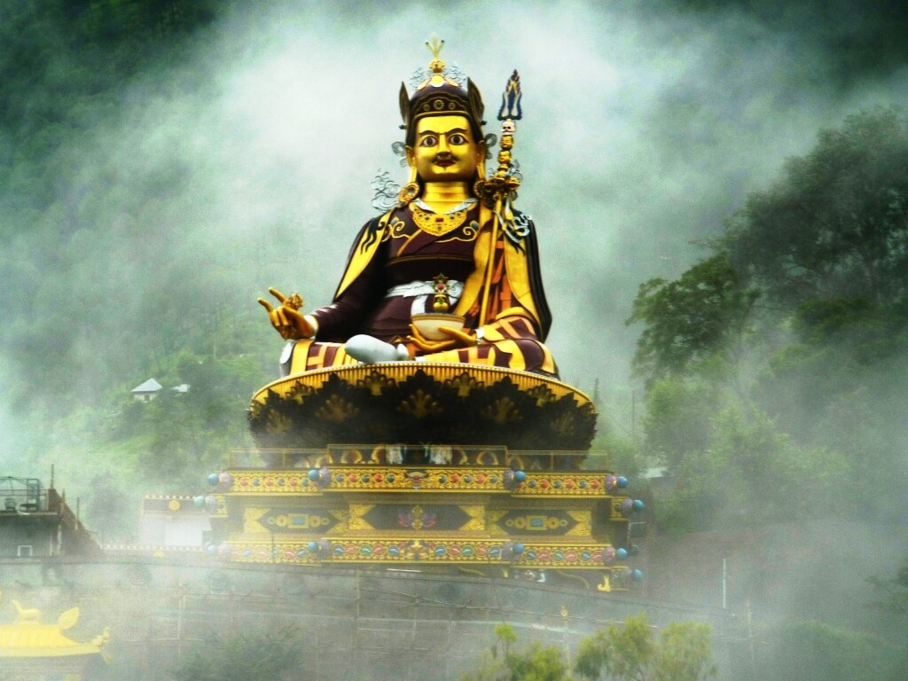[Colossus of Padmasambhava](https://en.wikipedia.org/wiki/Rewalsar_Lake#Colossus_of_Padmasambhava "Rewalsar Lake"), 123 ft. (37.5 m) high, in mist overlooking [Rewalsar Lake](https://en.wikipedia.org/wiki/Rewalsar_Lake "Rewalsar Lake"), [Himachal Pradesh](https://en.wikipedia.org/wiki/Himachal_Pradesh "Himachal Pradesh"), [India](https://en.wikipedia.org/wiki/India "India")

Padmasambhava

Born

[Oddiyana](https://en.wikipedia.org/wiki/Oddiyana "Oddiyana")

Education

[Nalanda](https://en.wikipedia.org/wiki/Nalanda "Nalanda")

Occupation

Vajra master

Known for

Credited with founding the [Nyingma](/source/nyingma/ "Nyingma") school of Tibetan Buddhism

**Padmasambhava** ('Born from a Lotus'), also known as **Guru Rinpoche** ('Precious Guru'), was a semi-legendary tantric Buddhist [Vajra master](https://en.wikipedia.org/wiki/Vajracharya "Vajracharya") from [medieval India](https://en.wikipedia.org/wiki/Medieval_India "Medieval India"), who according to hagiographical sources fully revealed the [Vajrayana](/source/vajrayana/ "Vajrayana") in [Tibet](https://en.wikipedia.org/wiki/Tibet "Tibet"), circa 8th – 9th centuries. He is considered an emanation or [Nirmāṇakāya](https://en.wikipedia.org/wiki/Nirmāṇakāya "Nirmāṇakāya") of [Shakyamuni Buddha](https://en.wikipedia.org/wiki/Gautama_Buddha "Gautama Buddha") as foretold by the Buddha himself. According to early Tibetan sources including the _[Testament of Ba](https://en.wikipedia.org/wiki/Testament_of_Ba "Testament of Ba")_, he came to Tibet in the 8th century and designed [Samye Monastery](https://en.wikipedia.org/wiki/Samye_Monastery "Samye Monastery"), the first Buddhist monastery in Tibet, during the reign of King [Trisong Detsen](https://en.wikipedia.org/wiki/Trisong_Detsen "Trisong Detsen"). He, the king, and Khenpo [Shantarakshita](https://en.wikipedia.org/wiki/Shantarakshita "Shantarakshita") are also responsible for creating the [Tibetan Canon](https://en.wikipedia.org/wiki/Tibetan_canon "Tibetan canon") through translating all of the Buddha's teachings and their commentaries into the Tibetan language.

According to Lewis Doney, while his historical authenticity was questioned by earlier [Tibetologists](https://en.wikipedia.org/wiki/Tibetology "Tibetology"), it is now "cautiously accepted.” Padmasambhava himself was recorded as saying he was a historical person, and marks in rocks believed to be his footprints are regarded as evidence. Padmasambhava later came to be viewed as a central figure in the transmission of Buddhism to Tibet. Starting from around the 12th century, [hagiographies](https://en.wikipedia.org/wiki/Hagiography "Hagiography") concerning Padmasambhava were written. These works expanded the profile and activities of Padmasambhava, now seen as taming all the Tibetan spirits and gods, and concealing various secret texts (_[terma](https://en.wikipedia.org/wiki/Terma_\(religion\) "Terma (religion)")_) for future [tertöns](https://en.wikipedia.org/wiki/Tertön "Tertön"). [Nyangral Nyima Özer](https://en.wikipedia.org/wiki/Nyangrel_Nyima_Özer "Nyangrel Nyima Özer") (1124–1192) was the author of the _Zangling-ma_ (Jeweled Rosary), the earliest biography of Padmasambhava. He has been called "one of the main architects of the Padmasambhava [mythos](https://en.wikipedia.org/wiki/Myth "Myth") – who first linked Padmasambhava to the [Great Perfection](/source/dzogchen/ "Dzogchen") in a high-profile manner."

In modern [Tibetan Buddhism](https://en.wikipedia.org/wiki/Tibetan_Buddhism "Tibetan Buddhism"), Padmasambhava is considered to be a [Buddha](https://en.wikipedia.org/wiki/Buddhahood "Buddhahood") that was foretold by Buddha Shakyamuni. According to traditional hagiographies, his students include the great female masters [Yeshe Tsogyal](https://en.wikipedia.org/wiki/Yeshe_Tsogyal "Yeshe Tsogyal") and [Mandarava](https://en.wikipedia.org/wiki/Mandāravā "Mandāravā"). The contemporary [Nyingma](/source/nyingma/ "Nyingma") school considers Padmasambhava to be a founding figure. The Nyingma school also traditionally holds that its [Dzogchen](/source/dzogchen/ "Dzogchen") lineage has its origins in [Garab Dorje](https://en.wikipedia.org/wiki/Garab_Dorje "Garab Dorje") through a lineage of transmission to Padmasambhava.

In Tibetan Buddhism, the teachings of Padmasambava are said to include an oral lineage (_kama_), and a lineage of the hidden treasure texts (_termas_). Tibetan Buddhism holds that Padmasambhava's termas are discovered by fortunate beings and [tertöns](https://en.wikipedia.org/wiki/Tertön "Tertön") (treasure finders) when conditions are ripe for their reception. Padmasambhava is said to appear to tertöns in visionary encounters, and his form is visualized during guru yoga practice, particularly in the Nyingma school. Padmasambhava is widely venerated by [Buddhists](https://en.wikipedia.org/wiki/Tibetan_Buddhism "Tibetan Buddhism") in [Tibet](https://en.wikipedia.org/wiki/Tibet "Tibet"), [Nepal](https://en.wikipedia.org/wiki/Nepal "Nepal"), [Bhutan](https://en.wikipedia.org/wiki/Bhutan "Bhutan"), the [Himalayan states](https://en.wikipedia.org/wiki/Himalayan_states "Himalayan states") of India, and in countries around the world.

## History

### Early sources

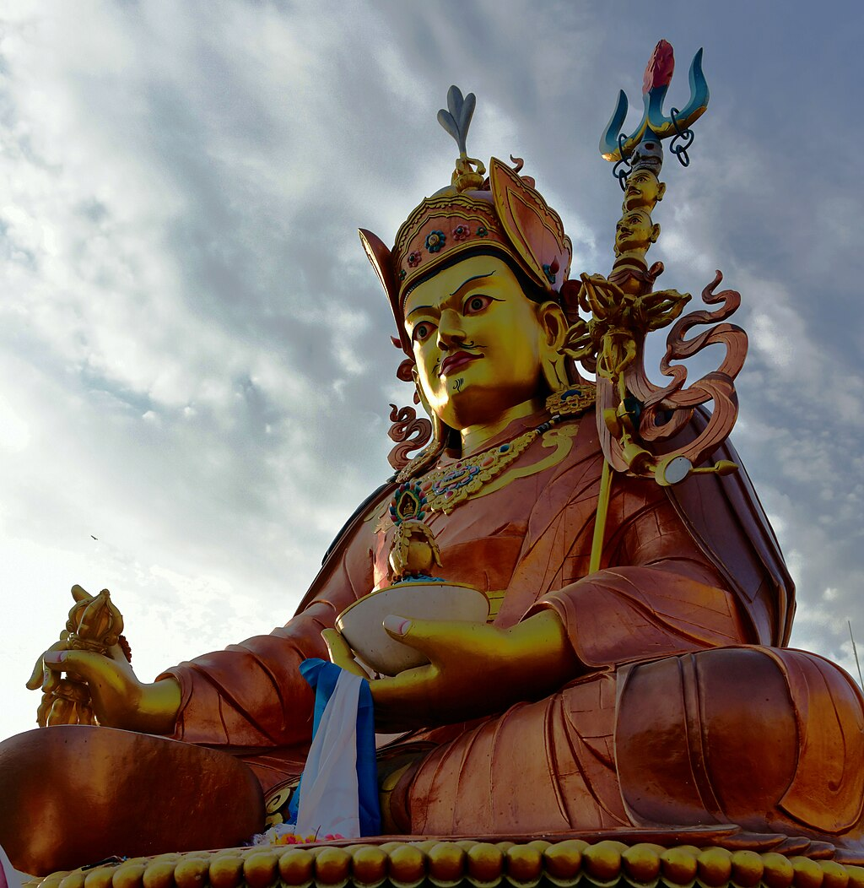Padmasambhava statue at Ghyoilisang peace park, [Boudhanath, Kathmandu](https://en.wikipedia.org/wiki/Boudha "Boudha")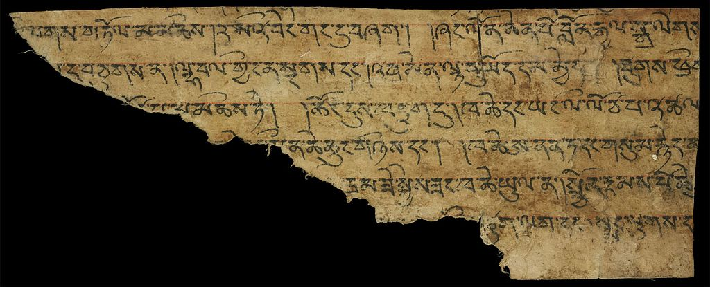Fragment of the _Testament of Ba_ at the [British Library](https://en.wikipedia.org/wiki/British_Library "British Library"), with six incomplete lines of [Tibetan writing](https://en.wikipedia.org/wiki/Tibetan_script "Tibetan script") ([Or.8210/S.9498A](http://idp.bl.uk/database/oo_loader.a4d?pm=Or.8210%2FS.9498A))

One of the earliest chronicle sources for Padmasambhava as a historical figure is the _[Testament of Ba](https://en.wikipedia.org/wiki/Testament_of_Ba "Testament of Ba")_ (_Dba' bzhed_, c. 9th–12th centuries), which records the founding of [Samye Monastery](https://en.wikipedia.org/wiki/Samye "Samye") under the reign of King [Trisong Detsen](https://en.wikipedia.org/wiki/Trisong_Detsen "Trisong Detsen") (r. 755–797/804). Other early manuscripts from [Dunhuang](https://en.wikipedia.org/wiki/Dunhuang "Dunhuang") also mention a tantric master associated with [kilaya](https://en.wikipedia.org/wiki/Vajrakilaya "Vajrakilaya") rituals named Padmasambhava who tames demons, though they do not associate this figure with Trisong Detsen.

According to the _Testament of Ba_, [Trisong Detsen](https://en.wikipedia.org/wiki/Trisong_Detsen "Trisong Detsen") had invited the Buddhist abbot and Indian philosopher [Śāntarakṣita](https://en.wikipedia.org/wiki/Śāntarakṣita "Śāntarakṣita") (725–788) to Tibet to propagate Buddhism and help found the first Buddhist monastery at Samye ('The Inconceivable'). However, certain events like the flooding of a Buddhist temple and lightning striking the royal palace had caused some at the Tibetan court to believe that the local gods were angry.

Śāntarakṣita was sent to Nepal, but was then asked to return after the anti-Buddhist sentiments had subsided. On his return, Śāntarakṣita brought Padmasambhava who was an Indian tantric adept from [Oddiyana](https://en.wikipedia.org/wiki/Oddiyana "Oddiyana"). Padmasambhava's task was to tame the local spirits and impress the Tibetans with his magical and ritual powers. The Tibetan sources then explain how Padmasambhava identified the local gods and spirits, called them out and threatened them with his powers. After they had been tamed, the construction of Samye went ahead. Padmasambhava was also said to have taught various forms of tantric Buddhist yoga.

When the royal court began to suspect that Padmasambhava wanted to seize power, he was asked to leave by the king. The Testament of Ba also mentions other miracles by Padmasambhava, mostly associated with the taming of demons and spirits as well as longevity rituals and water magic.

Evidence shows that Padmasambhava's [tantric](https://en.wikipedia.org/wiki/Tantras_\(Buddhism\) "Tantras (Buddhism)") teachings were being taught in Tibet during the 10th century. Recent evidence suggests that Padmasambhava already figured in spiritual hagiography and ritual, and was already seen as the enlightened source of tantric scriptures up to 200 years before [Nyangrel Nyima Özer](https://en.wikipedia.org/wiki/Nyangrel_Nyima_Özer "Nyangrel Nyima Özer") (1136–1204), the primary source of the traditional hagiography of Padmasambhava.

Lewis Doney notes that while numerous texts are associated with Padmasambhava, the most likely of these attributions are the _Man ngag lta ba'i phreng ba_ (_The Garland of Views_)_,_ a commentary on the 13th chapter of the _[Guhyagarbha tantra](https://en.wikipedia.org/wiki/Guhyagarbha_tantra "Guhyagarbha tantra")_ and the _Thabs zhags padma 'phreng_ (_A Noble Noose of Methods, The Lotus Garland_)_,_ an exposition of [Mahayoga](https://en.wikipedia.org/wiki/Mahayoga "Mahayoga"). The former work is mentioned in the work of [Nubchen Sangye Yeshe](https://en.wikipedia.org/wiki/Nubchen_Sangye_Yeshe "Nubchen Sangye Yeshe") (c. 9–10th centuries) and attributed to Padmasambhava.

### Development of the mythos

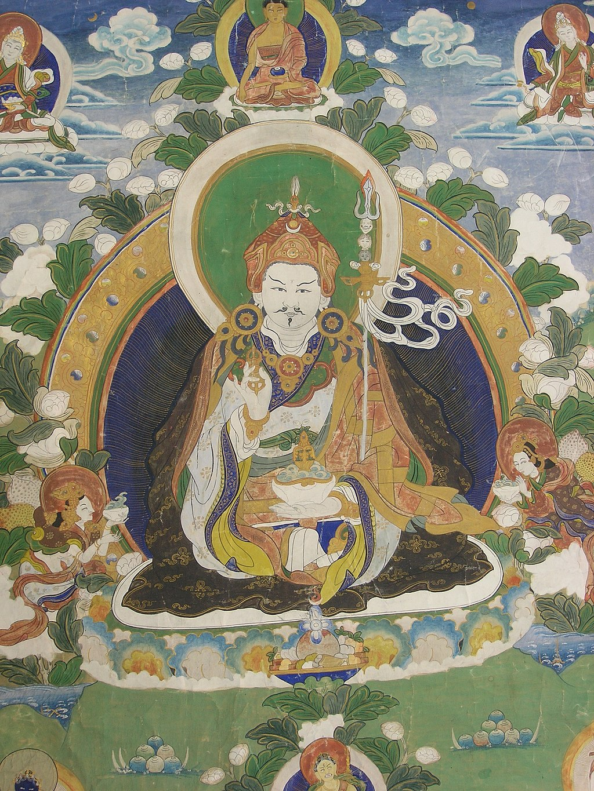Thangka of Padmasambhava

While in the eleventh and twelfth centuries there were several parallel narratives of important founding figures like Padmasambhava, [Vimalamitra](/source/vimalamitra/ "Vimalamitra"), Songtsen Gampo, and [Vairotsana](https://en.wikipedia.org/wiki/Vairotsana "Vairotsana"), by the end of the 12th century, the Padmasambhava narrative grew to dominate the others, becoming the most influential legend of the introduction of Buddhism to Tibet.

The first full biography of Padmasambhava is a [terma](https://en.wikipedia.org/wiki/Terma_\(religion\) "Terma (religion)") (treasure text) said to have been revealed by Nyangrel Nyima Özer, abbot of Mawochok Monastery. This biography, _The Copper Palace (bka' thang zangs gling ma),_ was very influential on the Padmasambhava hagiographical tradition. The narrative was also incorporated into Nyima Özer's history of Buddhism, the _Flower Nectar: The Essence of Honey (chos 'byung me tog snying po sbrang rtsi'i bcud)_.

The tertön Guru Chöwang (1212–1270) was the next major contributor to the Padmasambhava tradition, and may have been the first full life-story biographer of [Yeshe Tsogyal](https://en.wikipedia.org/wiki/Yeshe_Tsogyal "Yeshe Tsogyal").

The basic narrative of _The Copper Palace_ continued to be expanded and edited by Tibetans. In the 14th century, the Padmasambhava hagiography was further expanded and re-envisioned through the efforts of the [Orgyen Lingpa](https://en.wikipedia.org/wiki/Orgyen_Lingpa "Orgyen Lingpa") (1323 – c. 1360). It is in the works of Orgyen Lingpa, particularly his _Padma bka' thang_ (Lotus Testament, 1352), that the "11 deeds" of Padmasambhava first appear in full. The _Lotus Testament_ is a very extensive biography of Padmasambhava, which begins with his ordination under [Ananda](https://en.wikipedia.org/wiki/Ānanda "Ānanda") and contains numerous references to Padmasambhava as a "second Buddha."

## Hagiography

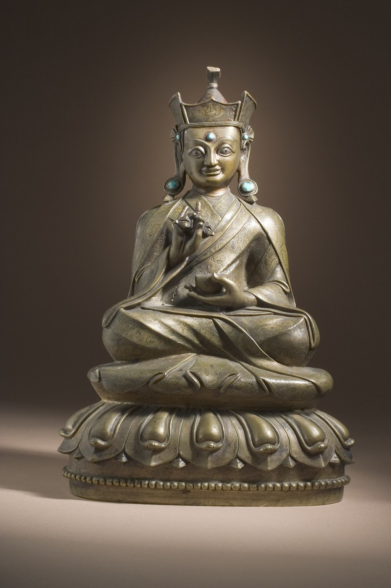Statue of Guru Rinpoche, Central Tibet, Tsang Valley, 15th–16th century

According to [Khenchen Palden Sherab](https://en.wikipedia.org/wiki/Khenchen_Palden_Sherab_Rinpoche "Khenchen Palden Sherab Rinpoche"), there are traditionally said to be nine thousand nine hundred and ninety-nine biographies of Padmasambhava. They are categorized in three ways: Those relating to Padmasambhava's Dharmakaya buddhahood, those accounts of his Sambhogakaya nature, and those chronicles of his Nirmanakaya activities.

### Birth and early life

Hagiographies of Padmasambhava such as _The Copper Palace,_ depict Padmasambhava being born as an eight-year-old child appearing in a lotus blossom floating in [Lake](https://en.wikipedia.org/wiki/Lake "Lake") Dhanakosha surrounded by a host of [dakinis](https://en.wikipedia.org/wiki/Dakini "Dakini"), in the kingdom of [Oddiyana](https://en.wikipedia.org/wiki/Oddiyana "Oddiyana").

However there are other birth stories as well, another common one states that he was born from the womb of Queen Jalendra, the wife of king Sakra of Oddiyana and received the name Dorje Duddul (Vajra Demon Subjugator) because of the auspicious marks on his body were identified as those of a demon tamer.

As [Nyingma](/source/nyingma/ "Nyingma") scholar [Khenchen Palden Sherab Rinpoche](https://en.wikipedia.org/wiki/Palden_Sherab "Palden Sherab") explains:

> There are many stories explaining how Guru Padmasambhava was born. Some say that he instantly appeared on the peak of Meteorite Mountain, in Sri Lanka. Others teach that he came through his mother's womb, but most accounts refer to a miraculous birth, explaining that he spontaneously appeared in the center of a lotus. These stories are not contradictory because highly realized beings abide in the expanse of great equanimity with perfect understanding and can do anything. Everything is flexible, anything is possible. Enlightened beings can appear in any way they want or need to.

In _The Copper Palace,_ King [Indrabhuti](https://en.wikipedia.org/wiki/Indrabhuti "Indrabhuti") of Oddiyana is searching for a wish fulfilling jewel and finds Padmasambhava, who is said to be an incarnation of Buddha [Amitabha](https://en.wikipedia.org/wiki/Amitābha "Amitābha"). The king adopts him as his own son and Padmasambhava is enthroned as the Lotus King (_Pema Gyalpo_). However, Padmasambhava's [khaṭvāṅga](https://en.wikipedia.org/wiki/Khaṭvāṅga "Khaṭvāṅga") staff falls on one of Indrabhuti's ministers, killing him, and Padmasambhava is exiled from the kingdom, which allows him to live as a [mahasiddha](https://en.wikipedia.org/wiki/Mahasiddha "Mahasiddha") and practice tantra in charnel grounds throughout India.

In [Himachal Pradesh, India](https://en.wikipedia.org/wiki/Himachal_Pradesh,_India "Himachal Pradesh, India") at [Rewalsar Lake](https://en.wikipedia.org/wiki/Rewalsar_Lake "Rewalsar Lake"), known as Tso Pema in Tibetan, Padmasambhava secretly gave [tantric teachings](https://en.wikipedia.org/wiki/Tantra "Tantra") to princess Mandarava, the local king's daughter. The king found out and tried to burn both him and his daughter, but it is said that when the smoke cleared they were still alive and in meditation, centered in a lotus arising from a lake. Greatly astonished by this miracle, the king offered Padmasambhava both his kingdom and Mandarava.

Padmasambhava is then said to have returned home with Mandarava and together they converted the kingdom to Vajrayana Buddhism.

### Nepal

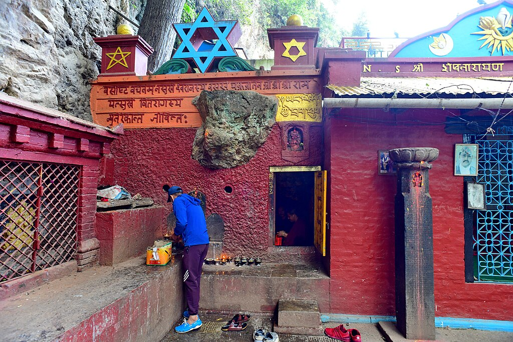[Pharping](https://en.wikipedia.org/wiki/Pharping "Pharping") cave in Nepal where the Guru did the penance combining Yangdak [Heruka](https://en.wikipedia.org/wiki/Heruka "Heruka") and [Vajrakilaya](https://en.wikipedia.org/wiki/Vajrakilaya "Vajrakilaya") and attained the ultimate [Mahamudra](https://en.wikipedia.org/wiki/Mahamudra "Mahamudra")

Padmasambhava and [Mandarava](https://en.wikipedia.org/wiki/Mandarava "Mandarava") are also said to have travelled together to the [Maratika Cave](https://en.wikipedia.org/wiki/Halesi-Maratika_Caves "Halesi-Maratika Caves") in eastern Nepal to practice long life rituals of [Amitāyus](https://en.wikipedia.org/wiki/Amitābha "Amitābha"). It was the place where, after the penance, they achieved the blessing of immortality from lord [Amitāyus](https://en.wikipedia.org/wiki/Amitābha "Amitābha"), the Buddha of long life. In the village of [Pharping](https://en.wikipedia.org/wiki/Pharping "Pharping"), located on the southern edge of [Kathmandu](https://en.wikipedia.org/wiki/Kathmandu "Kathmandu") district, the Guru is said to have done long penance combining the practices of Yangdak [Heruka](https://en.wikipedia.org/wiki/Heruka "Heruka") and [Vajrakilaya](https://en.wikipedia.org/wiki/Vajrakilaya "Vajrakilaya"), and attained the ultimate [Mahamudra](https://en.wikipedia.org/wiki/Mahamudra "Mahamudra") (or "the Great Seal").

The Tibetan Buddhism also mentions that Guru Rinpoche meditated at [Muktinath](https://en.wikipedia.org/wiki/Muktinath "Muktinath") (lord of liberation) temple in western Nepal before departing for Tibet. The nuns residing in the temple complex of Muktinath are revered as goddesses and offspring of the women who were taught and initiated by Padmasambhava. A statue of Padmasambhava, which is believed to have built by him in his own image, currently resides in the Mharme Lhakhang Gompa and is taken care of by these nuns.

### Tibet

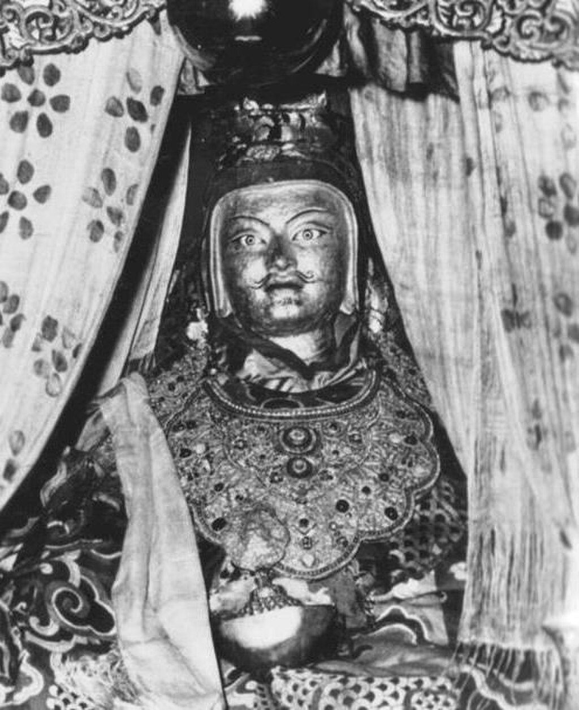The famous "looks like me" statue of Padmasambhava at [Samye](https://en.wikipedia.org/wiki/Samye "Samye") which is traditionally said to have been blessed by him personally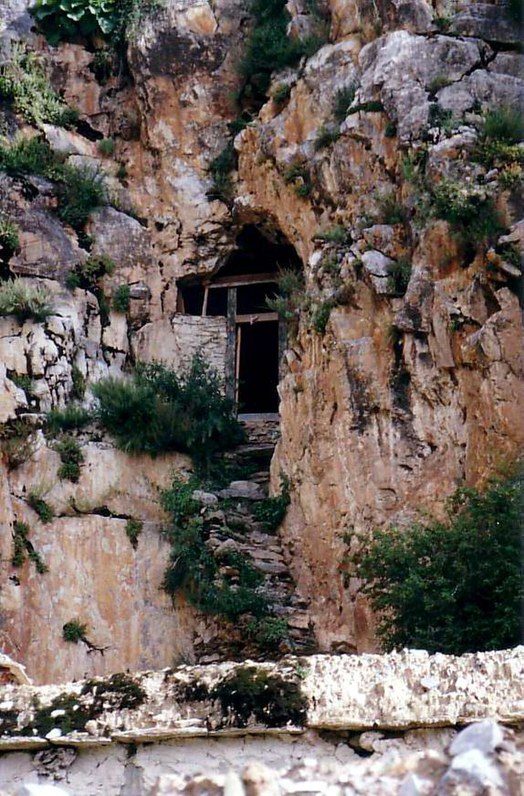Entrance to Dawa Puk, [Guru Rinpoche](https://en.wikipedia.org/wiki/Guru_Rinpoche "Guru Rinpoche")'s cave, [Yerpa](https://en.wikipedia.org/wiki/Yerpa "Yerpa"), 1993

Padmasambhava hagiographies also discuss the activities of Padmasambhāva in Tibet, beginning with the invitation by King Trisong Detsen to help in the founding of Samye. Padmasambhava is depicted as a great tantric adept who tames the spirits and demons of Tibet and turns them into guardians for the Buddha's Dharma (specifically, the deity [Pe har](https://en.wikipedia.org/wiki/Pehar_Gyalpo "Pehar Gyalpo") is made the protector of Samye). He is also said to have spread Vajrayana Buddhism to the people of Tibet, and specifically introduced its practice of Tantra.

The subjection of subduing deities and demons is a recurrent theme in Buddhist literature, as noted also in [Vajrapani and Mahesvara](https://en.wikipedia.org/wiki/Vajrapani#Vajrapani_and_Mahesvara "Vajrapani") and Steven Heine's "Opening a Mountain".

Because of his role in the founding of Samye monastery, the first monastery in Tibet, Padmasambhava is regarded as the founder of the [Nyingma](/source/nyingma/ "Nyingma") school ("Ancients") of Tibetan Buddhism. Padmasambhava's activities in the Tibet include the practice of tantric rituals to increase the life of the king as well as initiating king Trisong Detsen into tantric rites.

The various biographies also discuss stories of Padmasambhava's main Tibetan consort, princess [Yeshe Tsogyal](https://en.wikipedia.org/wiki/Yeshe_Tsogyal "Yeshe Tsogyal") ("[Knowledge](https://en.wikipedia.org/wiki/Jnana "Jnana") Lake Empress"), who became his student while living in the court of Trisong Deutsen. She was among Padmasambhava's three special students (along with the King, and [Namkhai Nyingpo](https://en.wikipedia.org/wiki/Namkhai_Nyingpo "Namkhai Nyingpo")) and is widely revered in Tibet as the "Mother of Buddhism". Yeshe Tsogyal became a great master with many disciples and is widely considered to be a female Buddha.

Padmasambhava hid numerous termas in Tibet for later discovery with her aid, while she compiled and elicited Padmasambhava's teachings through the posing of questions, and then reached [Buddhahood](https://en.wikipedia.org/wiki/Buddhahood "Buddhahood") in her lifetime. Many [thangkas](https://en.wikipedia.org/wiki/Thangka "Thangka") and paintings depict Padmasambhava with consorts at each side, Mandarava on his right and Yeshe Tsogyal on his left.

Many of the Nyingma school's [terma](https://en.wikipedia.org/wiki/Terma_\(religion\) "Terma (religion)") texts are said to have originated from the activities of Padmasambhava and his students. These hidden treasure texts are believed to be discovered and disseminated when conditions are ripe for their reception. The Nyingma school traces its lineage of [Dzogchen](/source/dzogchen/ "Dzogchen") teachings to [Garab Dorje](https://en.wikipedia.org/wiki/Garab_Dorje "Garab Dorje") through Padmasambhava's termas.

In _The Copper Palace,_ after the death of Trisong Detsen, Padmasambhava is said to have travelled to Lanka in order to convert its blood thirsty raksasa demons to the Dharma. His parting words of advice advocates for the worship of [Avalokiteshvara](https://en.wikipedia.org/wiki/Avalokiteśvara "Avalokiteśvara").

According to Tibetan Buddhist legends of the local [Monpa](https://en.wikipedia.org/wiki/Monpa_people "Monpa people") tribe, [Chumi Gyatse Falls](https://en.wikipedia.org/wiki/Chumi_Gyatse_Falls "Chumi Gyatse Falls"), also known as the '108 waterfalls' got created after a mythical showdown between [Guru Padmasambhava](https://en.wikipedia.org/wiki/Guru_Padmasambhava "Guru Padmasambhava") and a high priest of the Bonpa sect that ruled supreme in Tibet and surrounding areas including Arunachal Pradesh in the pre-Buddhist times. The waterfall was formed when [Guru Padmasambhava](https://en.wikipedia.org/wiki/Guru_Padmasambhava "Guru Padmasambhava") flung his rosary against a rock and 108 streams gushed out. Chumi Gyatse waterfall is revered and holy for the [Monpas](https://en.wikipedia.org/wiki/Monpa_people "Monpa people"), the Tibetan Buddhists.

### Bhutan

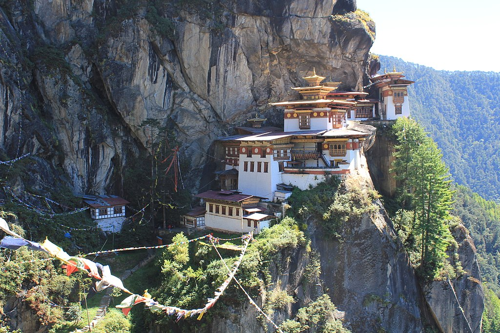Paro Taktsang ("Tiger's Nest") monastery

[Bhutan](https://en.wikipedia.org/wiki/Bhutan "Bhutan") has many important pilgrimage places associated with Padmasambhava. He visited Bhutan three times. Guru Rimpoche first came to Bhutan in 810 A.D. from Nepal via Nabji Korphu in the [Trongsa District](https://en.wikipedia.org/wiki/Trongsa_District "Trongsa District"). The second and third visits were from Tibet. The most famous site of Guru Rinpoche is [Paro Taktsang](https://en.wikipedia.org/wiki/Paro_Taktsang "Paro Taktsang") or "Tiger's Nest" monastery which is built on a sheer cliff wall about 900m above the floor of [Paro](https://en.wikipedia.org/wiki/Paro,_Bhutan "Paro, Bhutan") valley. It was built around the _Taktsang Senge Samdup (stag tshang seng ge bsam grub) cave_ where Padmasambhava is said to have meditated.

Guru Rinpoche is said to have flown there from [Singye Dzong](https://en.wikipedia.org/wiki/Singye_Dzong "Singye Dzong") on the back of Monmo Tashi Khyidren, whom he transformed into a flying tigress for the purpose of the trip. Later, he travelled to [Bumthang district](https://en.wikipedia.org/wiki/Bumthang_District "Bumthang District") to subdue a powerful [deity](https://en.wikipedia.org/wiki/Deity "Deity"), Shelging Karpo who was offended by a local king, Sindhu Raja of the [Kingdom of Bumthang](https://en.wikipedia.org/wiki/Kingdom_of_Bumthang "Kingdom of Bumthang"). According to legend, Padmasambhava's body imprint can be found in the wall of a cave at nearby [Kurje Lhakhang](https://en.wikipedia.org/wiki/Kurjey_Lhakhang "Kurjey Lhakhang") temple.

While in Bumthang, Guru Rinpoche meditated and blessed [Tang Rimochen Lhakhang](https://en.wikipedia.org/wiki/Tang_Rimochen_Lhakhang "Tang Rimochen Lhakhang"), [Thowadrak Monastery](https://en.wikipedia.org/wiki/Thowadra_Monastery "Thowadra Monastery"), [Kunzangdrak Monastery](https://en.wikipedia.org/wiki/Kunzangdrak_Monastery "Kunzangdrak Monastery"), [Zhabjethang Lhakhang](https://bhutanpilgrimage.com/zhabjethang-the-plain-where-guru-rinpoche-meditated-and-left-his-footprint/), [Choedrak Monastery](https://en.wikipedia.org/wiki/Choedrak_Monastery "Choedrak Monastery") and [Shudrak Goenpa](https://en.wikipedia.org/wiki/Shuk_Drak_Goenpa "Shuk Drak Goenpa"). He also hid many treasures in [Membartsho](https://en.wikipedia.org/wiki/Membartsho "Membartsho"), the burning lake in Bumthang. Guru Rimpoche then traveled to Eastern Bhutan where he blessed [Gomphu Kora](https://bhutanpilgrimage.com/gomphu-kora-a-meditative-cave-of-guru-rinpoche-for-circumambulation/), [Gongza Ney](https://bhutanpilgrimage.com/gongza-ney-a-sacred-place-where-guru-rinpoche-was-offered-midday-tea/), Dechen Phodrang Ney, and [Omba Ney](https://bhutanpilgrimage.com/omba-ney-the-taktsang-of-eastern-bhutan/) in Trashiyangtse. Guru Rinpoche also blessed [Aja Ney](https://bhutanpilgrimage.com/aja-ney-a-sacred-site-of-hundred-inscriptions-of-the-syllable-aa/) in Monggar, and Neychhen Rinchen Bumpa and [Singye Dzong](https://en.wikipedia.org/wiki/Singye_Dzong "Singye Dzong") in Lhuentse.

## Eight manifestations

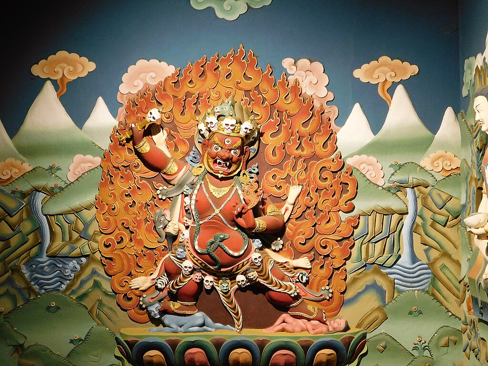Guru Senge Dradrog, a wrathful manifestation of Padmasambhava (painting in Tashichho Dzong)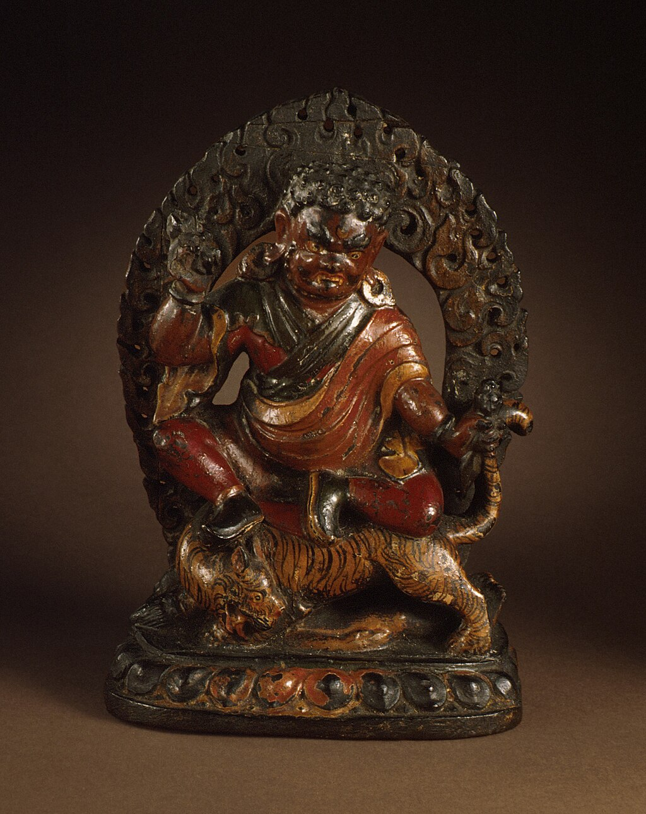Guru Dorje Drolo, Subduer of Demons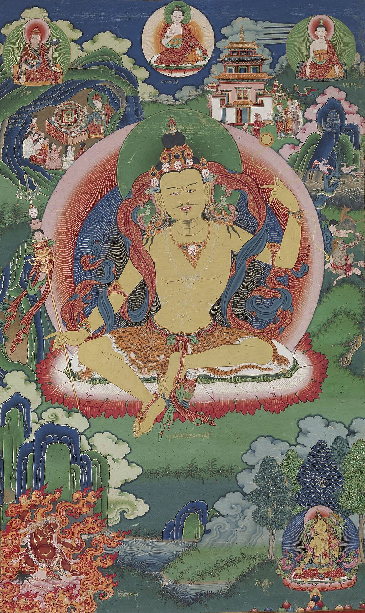Bhutanese painted thanka of Guru Nyima Ozer, late 19th century

The eight manifestations are also seen as Padmasambhava's biography that spans about 1500 years. As [Khenchen Palden Sherab Rinpoche](https://en.wikipedia.org/wiki/Khenchen_Palden_Sherab_Rinpoche "Khenchen Palden Sherab Rinpoche") states,

> When Guru Padmasambhava appeared on earth, he came as a human being. In order to dissolve our attachment to dualistic conceptions and destroy complex neurotic fixations, he also exhibited some extraordinary manifestations.

In accord, Rigpa Shedra also states the eight principal forms were assumed by Guru Rinpoche at different points in his life. Padmasambhava's eight manifestations, or forms (Tib. _Guru Tsen Gye_), represent different aspects of his being as needed, such as wrathful or peaceful for example.

The eight manifestations of Padmasambhava belong to the tradition of Terma, the Revealed Treasures (Tib.: ter ma), and are described and enumerated as follows:

1.  **[Guru Pema Gyalpo](https://en.wikipedia.org/wiki/Padma_Gyalpo "Padma Gyalpo")** (Wylie: _gu ru pad ma rgyal-po_, Skt: _Guru Padmarāja_) of [Oddiyana](https://en.wikipedia.org/wiki/Oddiyana "Oddiyana"), meaning "Lotus King", king of the Tripitaka (the Three Collections of Scripture), manifests as a child four years after the Mahaparinirvana of Buddha Shakyamuni, as predicted by the Buddha. He is shown with a reddish pink complexion and semi-wrathful, seated on a lotus and wearing yellow-orange robes, a small damaru in his right hand and a mirror and hook in his left hand, with a top-knot wrapped in white and streaming with red silk.
2.  **Guru Nyima Ozer** (Wylie: _gu ru nyi-ma 'od-zer_, Skrt: _Guru Suryabhasa_ or _Sūryaraśmi_), meaning "Ray of Sun", the Sunray Yogi, semi-wrathful, manifests in [India](https://en.wikipedia.org/wiki/India "India") simultaneously with Guru Pema Gyalpo, often portrayed as a crazy wisdom wandering yogi, numerous simultaneous emanations, illuminates the darkness of the mind through the insight of Dzogchen. He is shown seated on a lotus with left leg bent and with a golden-red complexion, semi-wrathful with slightly bulging eyes, long hair with bone ornaments, moustache and beard, bare-chested with a tiger-skin skirt, right hand holds a khatvanga and left hand is in a mudra, interacting with the sun.
3.  **Guru Loden Chokse** (Wylie: _gu ru blo ldan mchog sred_; Skrt: _Guru Mativat Vararuci_,) meaning roughly "Super Knowledge Holder", peaceful, manifests after Guru Pema Gyalpo departs Oddiyana for the great charnel grounds of India and for all knowledge, the Intelligent Youth, the one who gathers the knowledge of all worlds. He is shown seated on a lotus, white complexion, wearing a white scarf with ribbons wrapped around his head, and a blue-green lotus decorating his hair, holding a damaru in the right hand and a lotus bowl in the left hand.
4.  **Guru Urygen Dorje Chang** (Skt: _Guru Padmasambhava_), meaning "Lotus Essence", a symbol of spiritual perfection, peaceful, manifests and teaches [Mandarava](https://en.wikipedia.org/wiki/Mandāravā "Mandāravā"), transforming negative energies into compassionate and peaceful forms. He is shown with a rich wblue complexion, very peaceful, and is positioned in [Yab-Yum](https://en.wikipedia.org/wiki/Yab-Yum "Yab-Yum") with Mandarava.
5.  **Guru Shakya Senge** (Wylie: _shAkya seng-ge_, Skt: _Guru Śākyasimha_) of Bodh Gaya, meaning "Lion of the Sakyas", peaceful, manifests as Ananda's student and brings [King Ashoka](https://en.wikipedia.org/wiki/Ashoka's_Hell "Ashoka's Hell") to the Dharma, Lion of the Sakyas, embodies patience and detachment, learns all Buddhist canons and Tantric practices of the eight Vidyadharas. He is shown similar to Buddha Shakymuni but with golden skin in red monk's robes, a unishaka, a begging bowl in the left hand and a five-pointed vajra in the right hand.
6.  **Guru Senge Dradrog** (Wylie: _gu ru seng-ge sgra-sgrogs_, Skt: _Guru Simhanāda_,) meaning "The Lion's Roar", wrathful, subdues and pacifies negative influences, manifests in India and at Nalanda University, the Lion of Debate, promulgator of the Dharma throughout the six realms of sentient beings. He is shown as dark blue and surrounded by flames above a lotus, with fangs and three glaring eyes, crown of skulls and long hair, standing on a demon, holding a flaming vajra in the right hand, left hand in a subjugation mudra.
7.  **Guru Pema Jungne** (Wylie: _pad ma 'byung-gnas_, Skt: _Guru Padmakara_), meaning "Born from a Lotus", manifests before his arrival in [Tibet](https://en.wikipedia.org/wiki/Tibet "Tibet"), the [Vajrayana](/source/vajrayana/ "Vajrayana") Buddha that teaches the Dharma to the people, embodies all manifestations and actions of pacifying, increasing, magnetizing and subjugating. As the most depicted manifestation, he is shown sitting on a lotus, dressed in three robes, under which he wears a blue shirt, pants and Tibetan shoes. He holds a vajra in his right hand, and a skull-bowl with a small vase in his left hand. A special trident called a khatvanga leans on the left shoulder representing [Yeshe Tsogyal](https://en.wikipedia.org/wiki/Yeshe_Tsogyal "Yeshe Tsogyal"), and he wears a Nepalese cloth hat in the shape of a lotus flower. Thus he is represented as he must have appeared in Tibet.
8.  **Guru Dorje Drolo** (Wylie: _gu ru rDo-rje gro-lod_, Skt: _Guru Vajra_), meaning "Crazy Wisdom", very wrathful, manifests five years before Guru Pema Jungne departs Tibet, 13 emanations for 13 Tiger's Nests caves, the fierce manifestation of [Vajrakilaya](https://en.wikipedia.org/wiki/Vajrakilaya "Vajrakilaya") (wrathful Vajrasattva) known as "Diamond Guts", the comforter of all, imprinting the elements with Wisdom-Treasure, subduer for degenerate times. He is shown dark red, surrounded by flames, wearing robes and Tibetan shoes, conch earrings, a garland of heads, dancing on a tiger, symbolizing Tashi Kyeden, that is also dancing.

Padmasambhava's various Sanskrit names are preserved in mantras such as those found in the _Yang gsang rig 'dzin youngs rdzogs kyi blama guru mtshan brgyad bye brag du sgrub pa ye shes bdud rtsi'i sbrang char zhe bya ba_.

## Iconography

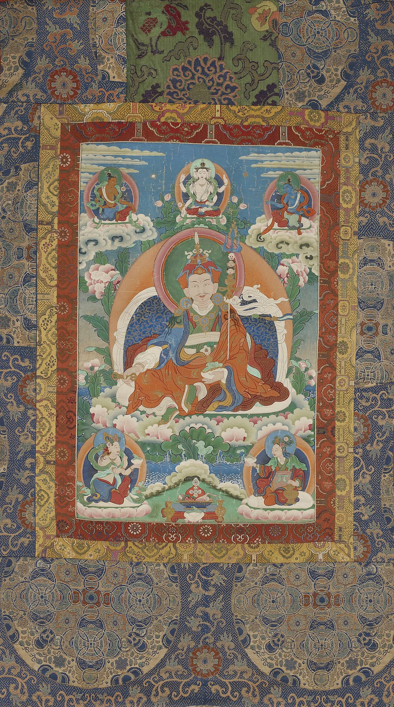[Thangka](https://en.wikipedia.org/wiki/Thangka "Thangka") of Padmasambhava, 19th century, Lhasa, Central Tibet

Padmasambhava has one face and two hands. He is wrathful and smiling. He blazes magnificently with the splendour of the major and minor marks. His two eyes are wide open in a piercing gaze. He has the youthful appearance of an eight-year-old child. His complexion is white with a tinge of red. He is seated with his two feet in the royal posture.

On his head he wears a five-petalled lotus hat, which has three points symbolizing the three kayas, five colours symbolizing the five kayas, the sun and moon symbolizing skillful means and wisdom, a vajra top to symbolize unshakable [samadhi](https://en.wikipedia.org/wiki/Samadhi "Samadhi"), and a vulture's feather to represent the realization of the highest view.

Padmasambhava wears a white vajra undergarment. On top of this, in layers, a red robe, a dark blue mantrayana tunic, a red monastic shawl decorated with a golden flower pattern, and a maroon cloak of silk brocade. Also, he wears a silk cloak, Dharma robes and gown. He is wearing the dark blue gown of a mantra practitioner, the red and yellow shawl of a monk, the maroon cloak of a king, and the red robe and secret white garments of a [bodhisattva](https://en.wikipedia.org/wiki/Bodhisattva "Bodhisattva").

In his right hand, he holds a five-pronged [vajra](https://en.wikipedia.org/wiki/Vajra "Vajra") at his heart. His left hand rests in the gesture of equanimity, In his left hand he holds a skull-cup brimming with nectar, containing the vase of longevity that is also filled with the nectar of deathless wisdom and ornamented on top by a wish-fulfilling tree.

Cradled in his left arm he holds the three-pointed [khatvanga](https://en.wikipedia.org/wiki/Khatvanga "Khatvanga") (trident) symbolizing the Princess consort Mandarava, one of his two main consorts. who arouses the wisdom of bliss and emptiness, concealed as the three-pointed khatvanga. Other sources say that the khatvanga represents the Lady [Yeshe Tsogyal](https://en.wikipedia.org/wiki/Yeshe_Tsogyal "Yeshe Tsogyal"), his primary consort and main disciple. Its three points represent the essence, nature and compassionate energy (ngowo, rangshyin and tukjé). Below these three prongs are three severed heads, dry, fresh and rotten, symbolizing the [dharmakaya](https://en.wikipedia.org/wiki/Dharmakaya "Dharmakaya"), [sambhogakaya](https://en.wikipedia.org/wiki/Sambhogakaya "Sambhogakaya") and [nirmanakaya](https://en.wikipedia.org/wiki/Nirmanakaya "Nirmanakaya"). Nine iron rings adorning the prongs represent the nine yanas. Five-coloured strips of silk symbolize the five wisdoms The khatvanga is also adorned with locks of hair from dead and living mamos and dakinis, as a sign that the Master subjugated them all when he practised austerities in the Eight Great Charnel Grounds.

Around him within a lattice of five-coloured light, appear the eight [vidyadharas](https://en.wikipedia.org/wiki/Vidyadhara "Vidyadhara") of India, the twenty-five disciples of Tibet, the deities of the three roots, and an ocean of oath-bound protectors

## Attributes

### Pureland paradise

His pureland paradise is Zangdok Palri (the Copper-Coloured Mountain).

### Samantabhadra and Samantabhadri

Padmasambhava said:

> My father is the intrinsic awareness, [Samantabhadra](https://en.wikipedia.org/wiki/Adi-Buddha "Adi-Buddha") (Sanskrit; Tib. ཀུན་ཏུ་བཟང་པོ). My mother is the ultimate sphere of reality, [Samantabhadri](https://en.wikipedia.org/wiki/Samantabhadri "Samantabhadri") (Sanskrit; Tib. ཀུན་ཏུ་བཟང་མོ). I belong to the caste of non-duality of the sphere of awareness. My name is the Glorious Lotus-Born. I am from the unborn sphere of all phenomena. I consume concepts of duality as my diet. I act in the way of the Buddhas of the three times.

Another translation of Guru Rinpoche's statement is:

> My father is wisdom and my mother is voidness.
> My country is the country of Dharma.
> I am of no caste and no creed.
> I am sustained by perplexity; and I am here to destroy lust, anger and sloth.

— Guru Padmasambhava

## Associated practices

From the earliest sources to today, Padmasambhava has remained closely associated with the [Kila (_phurba_) dagger](https://en.wikipedia.org/wiki/Kīla_\(Buddhism\) "Kīla (Buddhism)") and also with the deity [Vajrakilaya](https://en.wikipedia.org/wiki/Vajrakilaya "Vajrakilaya") (a meditation deity based on the kila).

### Vajra Guru mantra

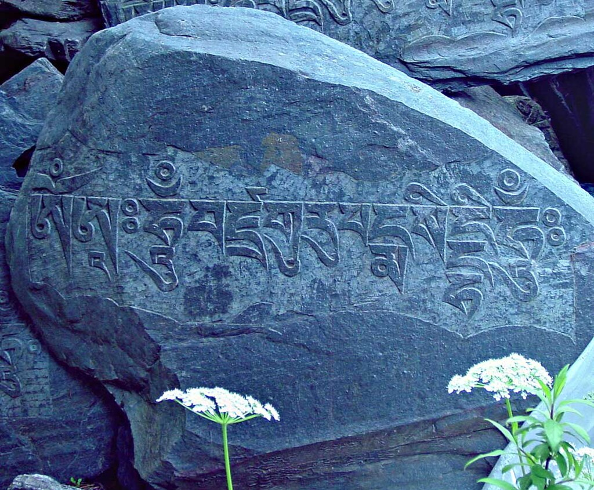The Vajra Guru Mantra inscribed on a rockThe Vajra Guru Mantra in Ranjana script and [Tibetan script](https://en.wikipedia.org/wiki/Tibetan_script "Tibetan script")

The _Vajra Guru [mantra](https://en.wikipedia.org/wiki/Mantra "Mantra")_ is:

> Oṃ āḥ hūṃ vajra guru padma siddhi hūṃ

Like most Sanskrit mantras in Tibet, the Tibetan pronunciation demonstrates [dialectic](https://en.wikipedia.org/wiki/Dialect "Dialect") variation and is generally _Om Ah Hung Benza Guru Pema Siddhi Hung_. This mantra does require transmission and it is usually requested that no one shares the mantra, but it can only be read.

In the Tibetan Buddhist traditions, particularly in Nyingma, the Vajra Guru mantra is held to be a powerful mantra engendering [communion](https://en.wiktionary.org/wiki/communion "wikt:communion") with the Three Vajras of Padmasambhava's [mindstream](https://en.wikipedia.org/wiki/Mindstream "Mindstream") and by his [grace](https://en.wikipedia.org/wiki/Divine_grace "Divine grace"), all enlightened beings. The 14th century tertön Karma Lingpa wrote a famous commentary on the mantra.

According to the great tertön [Jamyang Khyentse Wangpo](https://en.wikipedia.org/wiki/Jamyang_Khyentse_Wangpo "Jamyang Khyentse Wangpo"), the basic meaning of the mantra is:

> It begins with OṂ ĀḤ HŪṂ, which are the seed syllables of the three vajras (of body, speech and mind). Vajra signifies the dharmakāya since \[like the adamantine vajra\] it cannot be 'cut' or destroyed by the elaborations of conceptual thought. Guru signifies the sambhogakāya, which is 'heavily' laden with the qualities of the seven aspects of union. Padma signifies the nirmāṇakāya, the radiant awareness of the wisdom of discernment arising as the lotus family of enlightened speech. Remembering the qualities of the great Guru of Oḍḍiyāna, who is inseparable from these three kāyas, pray with the continuous devotion that is the intrinsic display of the nature of mind, free from the elaboration of conceptual thought. All the supreme and ordinary accomplishments—Siddhi—are obtained through the power of this prayer, and by thinking, "HŪṂ! May they be bestowed upon my mindstream, this very instant!"

### Seven Line Prayer

Padmasambhava on Enlightenment for Female Seekers

> "The basis for realizing enlightenment is a human body. Male or female, there is no great difference. But if she develops the mind bent on enlightenment, the woman’s body is better."

The **Seven Line Prayer** to Padmasambhava (Guru Rinpoche) is a well-known prayer that is recited by many Tibetans daily and is said to contain the most sacred and important teachings of Dzogchen:

 ཧཱུྃ༔ ཨོ་རྒྱན་ཡུལ་གྱི་ནུབ་བྱང་མཚམས༔ པདྨ་གེ་སར་སྡོང་པོ་ལ༔ ཡ་མཚན་མཆོག་གི་དངོས་གྲུབ་བརྙེས༔ པདྨ་འབྱུང་གནས་ཞེས་སུ་གྲགས༔ འཁོར་དུ་མཁའ་འགྲོ་མང་པོས་བསྐོར༔ ཁྱེད་ཀྱི་རྗེས་སུ་བདག་བསྒྲུབ་ཀྱི༔ བྱིན་གྱིས་བརླབ་ཕྱིར་གཤེགས་སུ་གསོལ༔ གུ་རུ་པདྨ་སིདྡྷི་ཧཱུྃ༔

 : Hūṃ! In the north-west of the land of Oḍḍiyāna : In the heart of a lotus flower, : Endowed with the most marvellous attainments, : You are renowned as the ‘Lotus-born’, : Surrounded by many hosts of ḍākinīs : Following in your footsteps, : I pray to you: Come, inspire me with your blessing! : guru padma siddhi hūṃ.

[Jamgon Ju Mipham Gyatso](https://en.wikipedia.org/wiki/Jamgon_Ju_Mipham_Gyatso "Jamgon Ju Mipham Gyatso") composed a famous commentary to the Seven Line Prayer called _White Lotus_. It explains the meaning of the prayer in five levels of meaning intended to catalyze a process of realization. These hidden teachings are described as ripening and deepening, in time, with study and with contemplation. There is also a shorter commentary by Tulku Thondup.

### Cham dances

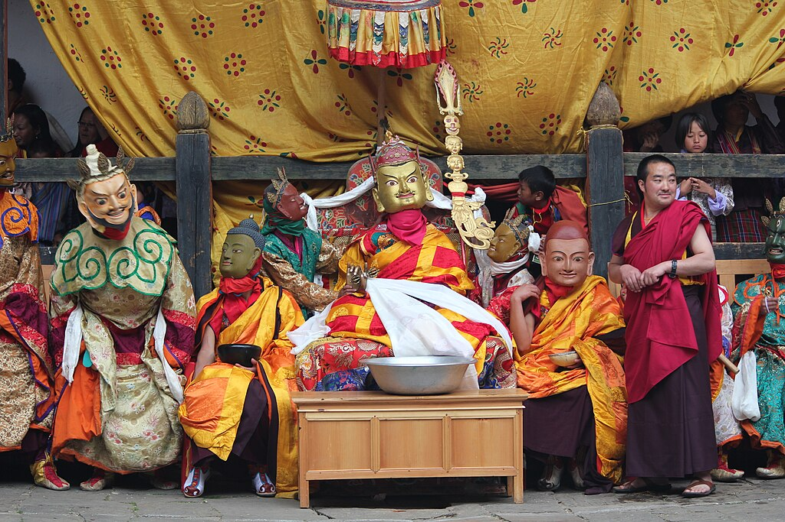Jakar [tshechu](https://en.wikipedia.org/wiki/Tshechu "Tshechu"), Guru Tshengye, and Guru Rinpoche with two helpers and six manifestations

The life of Padmasambhava is widely depicted in the [Cham dances](https://en.wikipedia.org/wiki/Cham_dance "Cham dance") which are masked and costumed dances associated with religious festivals in the Tibetan Buddhist world. In Bhutan, the dances are performed during the annual [religious festivals](https://en.wikipedia.org/wiki/Religious_festival "Religious festival") or [tshechu](https://en.wikipedia.org/wiki/Tshechu "Tshechu").

### Terma cycles

There are numerous [Terma](https://en.wikipedia.org/wiki/Terma_\(religion\) "Terma (religion)") cycles which are believed to contain teachings of Padmasambhava. According to Tibetan tradition, the _[Bardo Thodol](https://en.wikipedia.org/wiki/Bardo_Thodol "Bardo Thodol")_ (commonly referred to as the Tibetan Book of the Dead) was among these hidden treasures, subsequently discovered by a Tibetan tertön, [Karma Lingpa](https://en.wikipedia.org/wiki/Karma_Lingpa "Karma Lingpa") (1326–1386).

Tantric cycles related to Padmasambhava are not just practiced by the [Nyingma](/source/nyingma/ "Nyingma"), they even gave rise to a new offshoot of [Bön](https://en.wikipedia.org/wiki/Bon "Bon") which emerged in the 14th century called the New Bön. Prominent figures of the Sarma (new translation) schools such as the [Karmapas](https://en.wikipedia.org/wiki/Karmapa "Karmapa") and Sakya lineage heads have practiced these cycles and taught them. Some of the greatest scholars who revealed teachings related to Padmasambhava have been from the [Kagyu](/source/kagyu/ "Kagyu") or [Sakya](https://en.wikipedia.org/wiki/Sakya_\(Tibetan_Buddhist_school\) "Sakya (Tibetan Buddhist school)") lineages. The hidden lake temple of the [Dalai Lamas](https://en.wikipedia.org/wiki/Dalai_Lama "Dalai Lama") behind the [Potala Palace](https://en.wikipedia.org/wiki/Potala_Palace "Potala Palace"), called [Lukhang](https://en.wikipedia.org/wiki/Lukhang "Lukhang"), is dedicated to [Dzogchen](/source/dzogchen/ "Dzogchen") teachings and has murals depicting the eight manifestations of Padmasambhava.

## Five main consorts

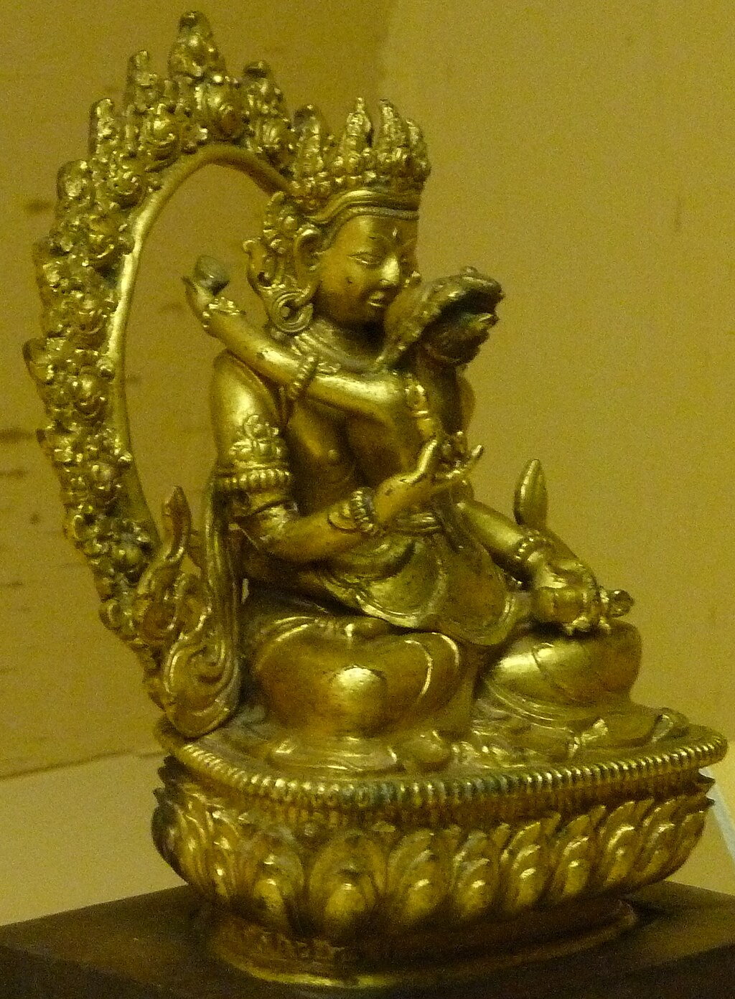Padmasambhava in yab-yum form with a spiritual consort

Many of the students gathered around Padmasambhava became advanced [Vajrayana](/source/vajrayana/ "Vajrayana") tantric practitioners, and became enlightened. They also founded and propagated the [Nyingma](/source/nyingma/ "Nyingma") school. The most prominent of these include Padmasambhava's five main female consorts, often referred to as [wisdom dakinis](https://en.wikipedia.org/wiki/Dakini "Dakini"), and his twenty five main students along with king Trisong Detsen.

Padmasambhava had five main female tantric consorts, beginning in India before his time in Tibet and then in Tibet as well. When seen from an outer, or perhaps even historical or mythological perspective, these five women from across South Asia were known as the _Five Consorts._ That the women come from very different geographic regions is understood as a mandala, a support for Padmasambhava in spreading the dharma throughout the region.

Yet, when understood from a more inner tantric perspective, these same women are understood not as ordinary women but as [wisdom dakinis](https://en.wikipedia.org/wiki/Dakini "Dakini"). From this point of view, they are known as the "Five Wisdom Dakinis" (Wylie: _Ye-shes mKha-'gro lnga_). Each of these consorts is believed to be an [emanation](https://en.wikipedia.org/wiki/Emanationism "Emanationism") of the tantric [yidam](https://en.wikipedia.org/wiki/Yidam "Yidam"), [Vajravārāhī](https://en.wikipedia.org/wiki/Vajravārāhī "Vajravārāhī"). As one author writes of these relationships:

> Yet in reality, he \[Padmasambhava\] was never separate from the five emanations of Vajravarahi: the Body-emanation, [Mandarava](https://en.wikipedia.org/wiki/Mandarava "Mandarava"); the Speech-emanation, [Yeshe Tsogyal](https://en.wikipedia.org/wiki/Yeshe_Tsogyal "Yeshe Tsogyal"); the Mind-emanation, Shakyadema; the Qualities-emanation, Kalasiddhi; and the Activity-emanation, Trashi \[sic\] Chidren.

In summary, the five consorts/wisdom dakinis were:

*   [Yeshe Tsogyal](https://en.wikipedia.org/wiki/Yeshe_Tsogyal "Yeshe Tsogyal") of [Tibet](https://en.wikipedia.org/wiki/Tibet "Tibet"), who was the emanation of Vajravarahi's Speech ([Tibetan](https://en.wikipedia.org/wiki/Tibetan_languages "Tibetan languages"): _gsung_; [Sanskrit](/source/sanskrit/ "Sanskrit"): _vāk_);
*   Mandarava of Zahor, northeast India, who was the emanation of Vajravarahi's Body (Tibetan: _sku_; Sanskrit: _kāya_);
*   Belwong Kalasiddhi of northwest India, who was the emanation of Vajravarahi's Quality (Tibetan: _yon-tan_; Sanskrit: _guṇa_);
*   Belmo Sakya Devi of [Nepal](https://en.wikipedia.org/wiki/Nepal "Nepal"), who was the emanation of Vajravarahi's Mind (Tibetan: _thugs_; Sanskrit: _citta_); and
*   Tashi Kyeden (or Kyedren or Chidren), sometimes called Mangala, of [Bhutan](https://en.wikipedia.org/wiki/Bhutan "Bhutan") and Tiger's Nest caves, is an emanation of Vajravarahi's Activity (Tibetan: _phrin-las_; Sanskrit: _karma_). Tashi Kyeden is often depicted with Guru Dorje Drolo.

While there are very few sources on the lives of Kalasiddhi, Sakya Devi, and Tashi Kyedren, there are extant biographies of both [Yeshe Tsogyal](https://en.wikipedia.org/wiki/Yeshe_Tsogyal "Yeshe Tsogyal") and Mandarava that have been translated into English and other western languages.

## Twenty-five main students

Padmasambhava has twenty five main students ([Tibetan](https://en.wikipedia.org/wiki/Tibetan_script "Tibetan script"): རྗེ་འབངས་ཉེར་ལྔ, [Wylie](https://en.wikipedia.org/wiki/Wylie_transliteration "Wylie transliteration"): rje 'bangs nyer lnga) in Tibet during the Nyingma's school's Early Translation period. These students are also called the "Twenty-five King and subjects" and "The King and 25" of Chimphu. In Dudjom Rinpoche's list, and in other sources, these include:

*   King Trisong Detsen ([Tibetan](https://en.wikipedia.org/wiki/Tibetan_script "Tibetan script"): ཁྲི་སྲོང་ལྡེའུ་བཏཟན, [Wylie](https://en.wikipedia.org/wiki/Wylie_transliteration "Wylie transliteration"): khri srong lde'u btzan)

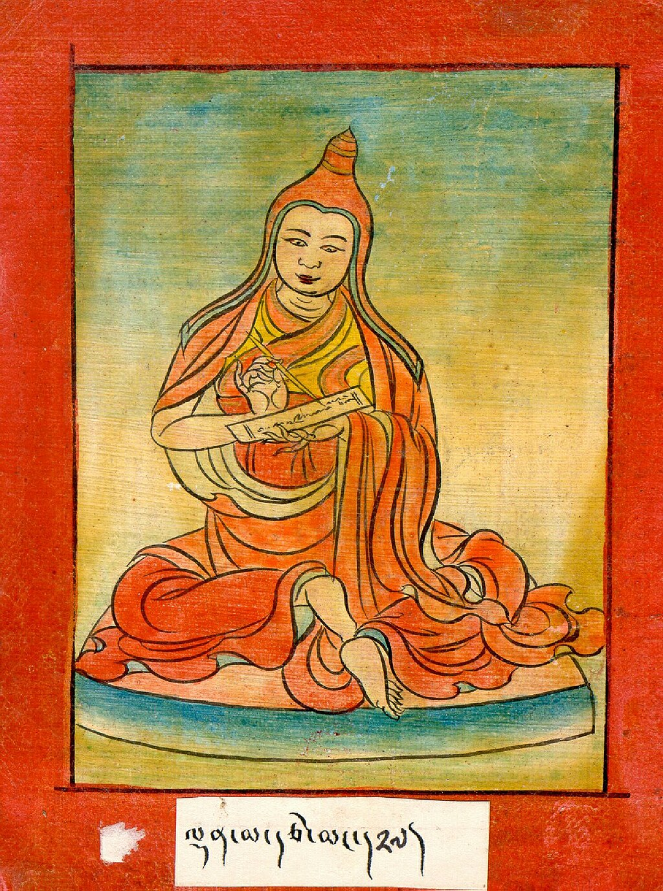Denma Tsémang

*   Denma Tsémang ([Tibetan](https://en.wikipedia.org/wiki/Tibetan_script "Tibetan script"): ལྡན་མ་རྩེ་མང, [Wylie](https://en.wikipedia.org/wiki/Wylie_transliteration "Wylie transliteration"): ldan ma rtse mang)
*   Nanam Dorje Dudjom, Dorje Dudjom of Nanam ([Tibetan](https://en.wikipedia.org/wiki/Tibetan_script "Tibetan script"): རྡོ་རྗེ་བདུད་འཇོམ, [Wylie](https://en.wikipedia.org/wiki/Wylie_transliteration "Wylie transliteration"): rdo rje bdud 'joms) [(image on Wikimedia commons)](https://en.wikipedia.org/wiki/File:Dorje_Dudjom.jpg "File:Dorje Dudjom.jpg")
*   Drokben Khyechung Lotsawa ([Tibetan](https://en.wikipedia.org/wiki/Tibetan_script "Tibetan script"): ཁྱེའུ་ཆུང་ལོ་ཙཱ་བ, [Wylie](https://en.wikipedia.org/wiki/Wylie_transliteration "Wylie transliteration"): khye'u chung lo tsā ba)
*   Lasum Gyelwa Changchup, Gyalwa Changchub of Lasum ([Tibetan](https://en.wikipedia.org/wiki/Tibetan_script "Tibetan script"): ལ་སུམ་རྒྱལ་བ་བྱང་ཆུབ, [Wylie](https://en.wikipedia.org/wiki/Wylie_transliteration "Wylie transliteration"): la sum rgyal ba byang chub) [(image on Wikimedia commons)](https://en.wikipedia.org/wiki/File:Gyalwa_Janchub.jpg "File:Gyalwa Janchub.jpg")
*   Gyalwa Choyang ([Tibetan](https://en.wikipedia.org/wiki/Tibetan_script "Tibetan script"): རྒྱལ་བ་མཆོག་དབྱངས, [Wylie](https://en.wikipedia.org/wiki/Wylie_transliteration "Wylie transliteration"): rgyal ba mchog dbyangs)
*   Dre Gyelwei Lodro, Gyalwe Lodro of Dré ([Tibetan](https://en.wikipedia.org/wiki/Tibetan_script "Tibetan script"): རྒྱལ་བའི་བློ་གྲོས, [Wylie](https://en.wikipedia.org/wiki/Wylie_transliteration "Wylie transliteration"): rgyal ba'i blo gros)
*   Nyak Jnanakumara, Jnanakumara of Nyak([Tibetan](https://en.wikipedia.org/wiki/Tibetan_script "Tibetan script"): གཉགས་ཛཉའ་ན་ཀུ་མ་ར, [Wylie](https://en.wikipedia.org/wiki/Wylie_transliteration "Wylie transliteration"): gnyags dzny' na ku ma ra)
*   [Kawa Paltsek](https://en.wikipedia.org/wiki/Kawa_Paltsek "Kawa Paltsek") ([Tibetan](https://en.wikipedia.org/wiki/Tibetan_script "Tibetan script"): སྐ་བ་དཔལ་བརྩེགས, [Wylie](https://en.wikipedia.org/wiki/Wylie_transliteration "Wylie transliteration"): ska ba dpal brtsegs)
*   Karchen Za, [Khandro Yeshe Tsogyal](https://en.wikipedia.org/wiki/Khandro_Yeshe_Tsogyal "Khandro Yeshe Tsogyal") the princess of Karchen ([Tibetan](https://en.wikipedia.org/wiki/Tibetan_script "Tibetan script"): མཁར་ཆེན་བཟའ་མཚོ་རྒྱལ, [Wylie](https://en.wikipedia.org/wiki/Wylie_transliteration "Wylie transliteration"): mkhar chen bza' mtsho rgyal)
*   Langdro Konchok Jungue, Konchog Jungné of Langdro ([Tibetan](https://en.wikipedia.org/wiki/Tibetan_script "Tibetan script"): ལང་གྲོ་དཀོན་མཆོག་འབྱུང་གནས, [Wylie](https://en.wikipedia.org/wiki/Wylie_transliteration "Wylie transliteration"): lang gro dkon mchog 'byung gnas)
*   Sogdian Lhapel, Lhapal the Sokpo ([Tibetan](https://en.wikipedia.org/wiki/Tibetan_script "Tibetan script"): སོག་པོ་ལྷ་དཔལ, [Wylie](https://en.wikipedia.org/wiki/Wylie_transliteration "Wylie transliteration"): sog po lha dpal)
*   [Namkhai Nyingpo](https://en.wikipedia.org/wiki/Namkhai_Nyingpo "Namkhai Nyingpo") ([Tibetan](https://en.wikipedia.org/wiki/Tibetan_script "Tibetan script"): ནམ་མཁའི་སྙིང་པོ, [Wylie](https://en.wikipedia.org/wiki/Wylie_transliteration "Wylie transliteration"): nam mkha'i snying po)
*   Nanam Zhang Yeshe De ([Tibetan](https://en.wikipedia.org/wiki/Tibetan_script "Tibetan script"): ཞང་ཡེ་ཤེས་སྡེ, [Wylie](https://en.wikipedia.org/wiki/Wylie_transliteration "Wylie transliteration"): zhang ye shes sde)
*   Lhalung Pelgi Dorje, [Lhalung Pelgyi Dorje](https://en.wikipedia.org/wiki/Lhalung_Pelgyi_Dorje "Lhalung Pelgyi Dorje") ([Tibetan](https://en.wikipedia.org/wiki/Tibetan_script "Tibetan script"): ལྷ་ལུང་དཔལ་གྱི་རྡོ་རྗེ, [Wylie](https://en.wikipedia.org/wiki/Wylie_transliteration "Wylie transliteration"): lha lung dpal gyi rdo rje)

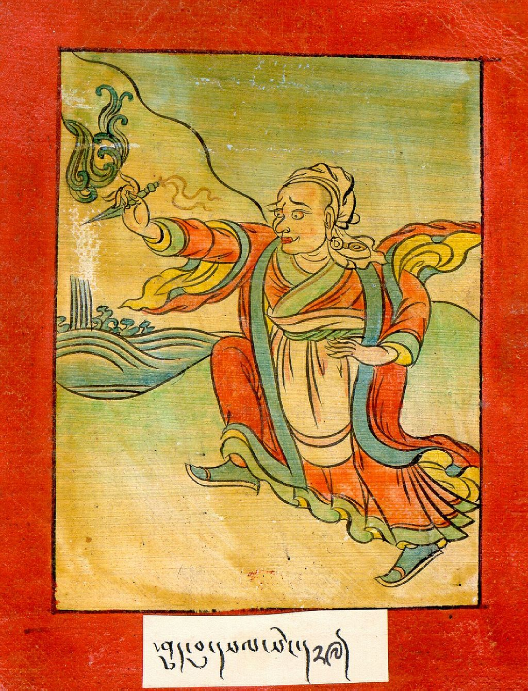Palgyi Senge

*   Shuphu Pelgi Senge, Palgyi Senge ([Tibetan](https://en.wikipedia.org/wiki/Tibetan_script "Tibetan script"): དཔལ་གྱི་སེང་གེ, [Wylie](https://en.wikipedia.org/wiki/Wylie_transliteration "Wylie transliteration"): dpal gyi seng ge)
*   Karchen Palgyi Wangchuk ([Tibetan](https://en.wikipedia.org/wiki/Tibetan_script "Tibetan script"): དཔལ་གྱི་དབང་ཕྱུག, [Wylie](https://en.wikipedia.org/wiki/Wylie_transliteration "Wylie transliteration"): dpal gyi dbang phyug)
*   Odren Pelgi Wangchuk, Palgyi Wangchuk of Odren ([Tibetan](https://en.wikipedia.org/wiki/Tibetan_script "Tibetan script"): འོ་དྲན་དཔལ་གྱི་དབང་ཕྱུག, [Wylie](https://en.wikipedia.org/wiki/Wylie_transliteration "Wylie transliteration"): 'o dran dpal gyi dbang phyug)
*   Palgyi Yeshe ([Tibetan](https://en.wikipedia.org/wiki/Tibetan_script "Tibetan script"): དཔལ་གྱི་ཡེ་ཤེས, [Wylie](https://en.wikipedia.org/wiki/Wylie_transliteration "Wylie transliteration"): dpal gyi ye shes)
*   Ma Rinchen-chok, [Rinchen Chok of Ma](https://en.wikipedia.org/wiki/Rinchen_Chok_of_Ma "Rinchen Chok of Ma") ([Tibetan](https://en.wikipedia.org/wiki/Tibetan_script "Tibetan script"): རྨ་རིན་ཆེན་མཆོག, [Wylie](https://en.wikipedia.org/wiki/Wylie_transliteration "Wylie transliteration"): rma rin chen mchog)
*   [Nubchen Sangye Yeshe](https://en.wikipedia.org/wiki/Nubchen_Sangye_Yeshe "Nubchen Sangye Yeshe") ([Tibetan](https://en.wikipedia.org/wiki/Tibetan_script "Tibetan script"): སངས་རྒྱས་ཡེ་ཤེས, [Wylie](https://en.wikipedia.org/wiki/Wylie_transliteration "Wylie transliteration"): sangs rgyas ye shes), reincarnated as Tsasum Lingpa
*   Shubu Palgyi Senge ([Tibetan](https://en.wikipedia.org/wiki/Tibetan_script "Tibetan script"): ཤུད་བུ་དཔལ་གྱི་སེང་གེ, [Wylie](https://en.wikipedia.org/wiki/Wylie_transliteration "Wylie transliteration"): shud bu dpal gyi seng ge)
*   Vairocana, [Vairotsana](https://en.wikipedia.org/wiki/Vairotsana "Vairotsana"), the great translator ([Tibetan](https://en.wikipedia.org/wiki/Tibetan_script "Tibetan script"): བཻ་རོ་ཙ་ན, [Wylie](https://en.wikipedia.org/wiki/Wylie_transliteration "Wylie transliteration"): bai ro tsa na)
*   Yeshe Yang ([Tibetan](https://en.wikipedia.org/wiki/Tibetan_script "Tibetan script"): ཡེ་ཤེས་དབྱངས, [Wylie](https://en.wikipedia.org/wiki/Wylie_transliteration "Wylie transliteration"): ye shes dbyangs)
*   Gyelmo Yudra Nyingpo, [Yudra Nyingpo](https://en.wikipedia.org/wiki/Yudra_Nyingpo "Yudra Nyingpo") of Gyalmo ([Tibetan](https://en.wikipedia.org/wiki/Tibetan_script "Tibetan script"): ག་ཡུ་སྒྲ་སྙིང་པོ, [Wylie](https://en.wikipedia.org/wiki/Wylie_transliteration "Wylie transliteration"): g.yu sgra snying po)

Also, but not listed in the 25:

*   [Vimalamitra](/source/vimalamitra/ "Vimalamitra") ([Tibetan](https://en.wikipedia.org/wiki/Tibetan_script "Tibetan script"): དྲུ་མེད་བཤེས་གཉེན, [Wylie](https://en.wikipedia.org/wiki/Wylie_transliteration "Wylie transliteration"): dru med bshes gnyen)
*   Tingdzin Zangpo ([Tibetan](https://en.wikipedia.org/wiki/Tibetan_script "Tibetan script"): ཏིང་འཛིན་བཟང་པོ, [Wylie](https://en.wikipedia.org/wiki/Wylie_transliteration "Wylie transliteration"): ting 'dzin bzang po) [(image on Wikimedia commons)](https://en.wikipedia.org/wiki/File:Nyangben_Tingdzin_Zangpo.jpg "File:Nyangben Tingdzin Zangpo.jpg")

In addition to Yeshe Tsogyal, 15 other women practitioners became accomplished Nyingma masters during this Early Translation period of the Nyingma school:

*   Tsenamza Sangyetso
*   Shekar Dorjetso
*   Tsombuza Pematso
*   Melongza Rinchensho
*   Ruza Tondrupma
*   Shubuza Sherampa
*   Yamdrokza Choki Dronma
*   Oceza Kargyelma
*   Dzemza Lhamo
*   Barza Lhayang
*   Chokroza Changchupman
*   Dronma Pamti Chenmo
*   Rongmenza Tsultrim-dron
*   Khuza Peltsunma
*   Trumza Shelmen

## Gallery

*   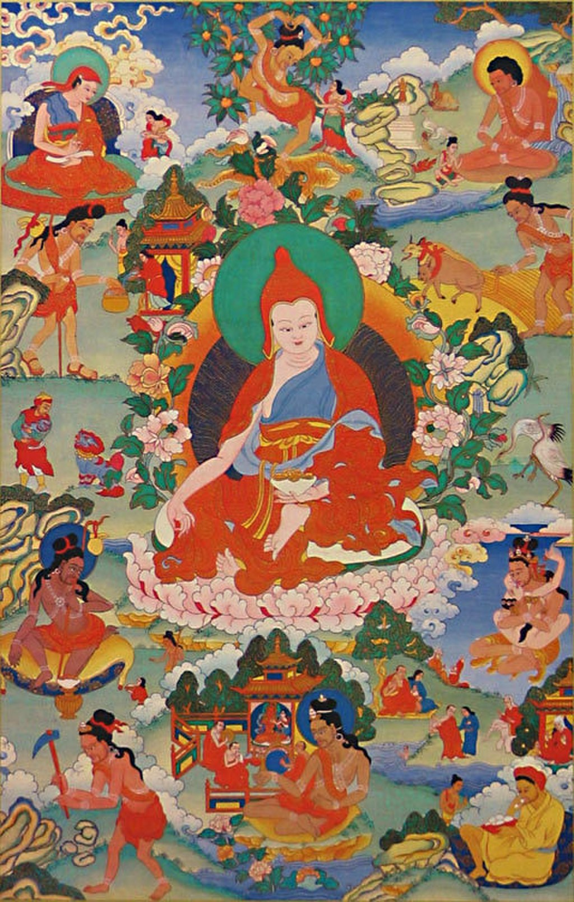

    [Thangka](https://en.wikipedia.org/wiki/Thangka "Thangka") of Guru Pema Jungne

*   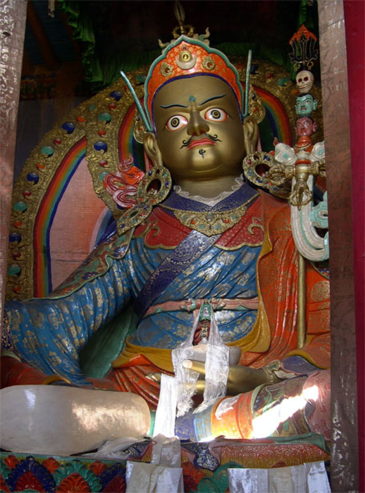

    Padmasambhava statue in [Hemis](https://en.wikipedia.org/wiki/Hemis "Hemis") Monastery, [Ladakh](https://en.wikipedia.org/wiki/Ladakh "Ladakh"), India

*   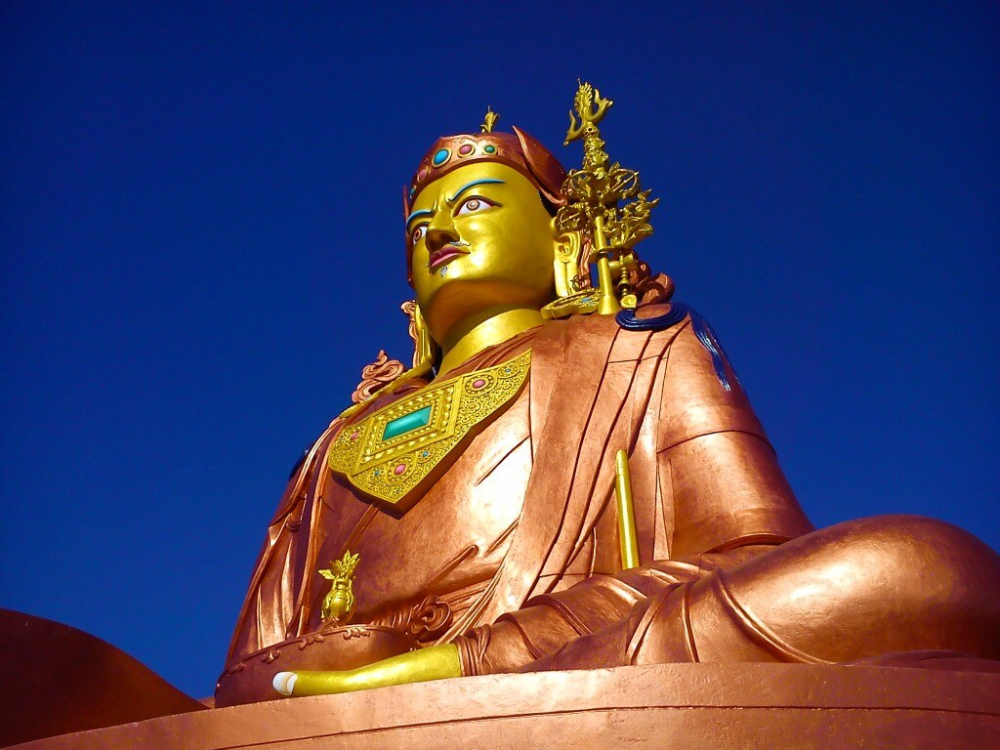

    The Holy Statue of Guru Padmasambhava at Samdruptse, [Namchi](https://en.wikipedia.org/wiki/Namchi "Namchi"), [Sikkim](https://en.wikipedia.org/wiki/Sikkim "Sikkim"), India

*   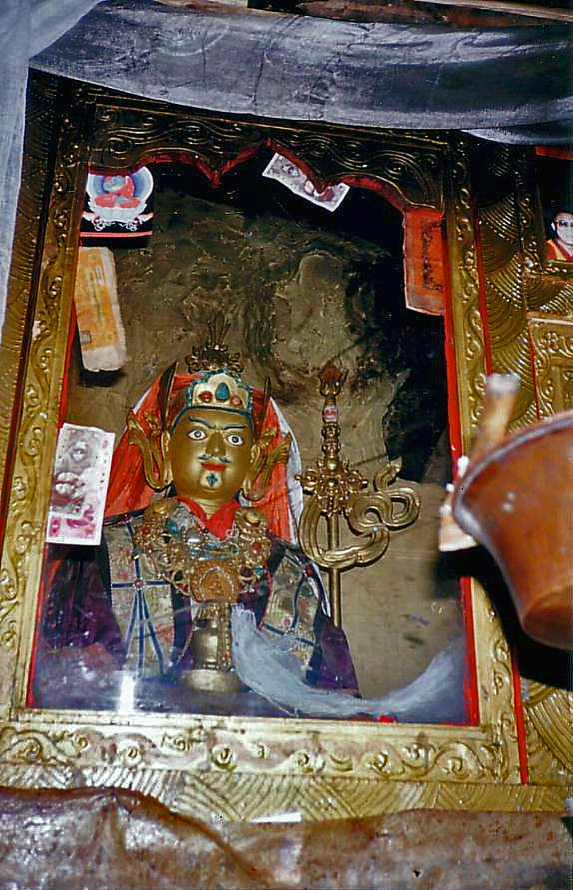

    Statue of Guru Rinpoche (Padmasambhava) in his meditation cave at [Yerpa](https://en.wikipedia.org/wiki/Yerpa "Yerpa"), Tibet

*   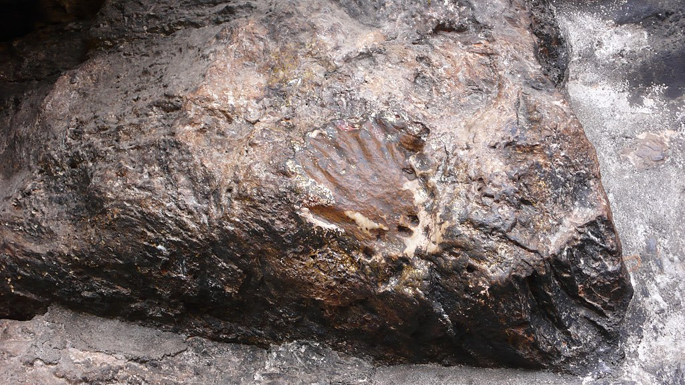

    Guru Rinpoche hand print embedded in the rock at Pharping, Kathmandu

*   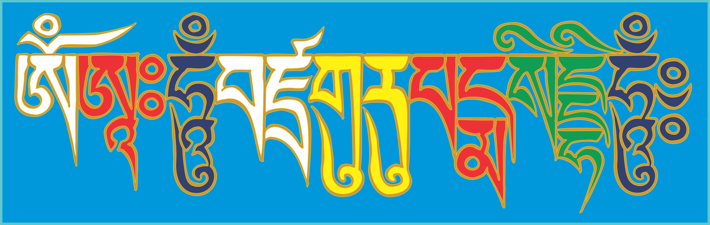

    Mantra of Padmasambhava in Tibetan script

*   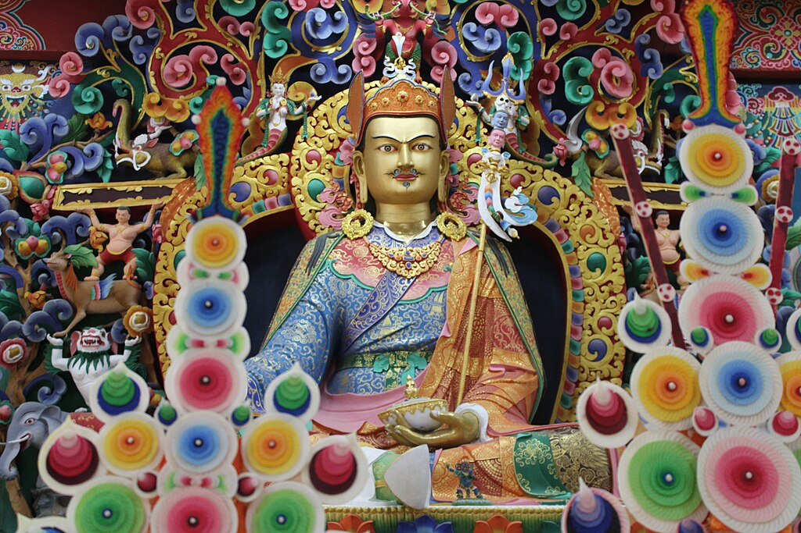

    Guru Rinpoche statue at Serlung Goenpa

## Biographies in English

*   Adzom Drukpa. _Biography of Orgyen Guru Pema Jungne_. Translated by Padma Samye Ling. Dharma Samudra.
*   [Chokgyur Lingpa, Orgyen](https://en.wikipedia.org/wiki/Orgyen_Chokgyur_Lingpa "Orgyen Chokgyur Lingpa") (1973). _The Legend of the Great Stupa and the Life Story of the Lotus Born Guru_. Translated by [Keith Dowman](https://en.wikipedia.org/wiki/Keith_Dowman "Keith Dowman"). Dharma Publishing.
*   Chokgyur Lingpa (2016). "The Wish-Fulfilling Tree". _The Great [Terton](https://en.wikipedia.org/wiki/Terton "Terton")_. Translated by Phakchok Rinpoche. Lhasey Lotsawa Publications.
*   Chokgyur Lingpa (2023). "The Wish-Fulfilling Tree". _Following in Your Footsteps: The Lotus-Born Guru in Tibet: Volume III_. Translated by Samye Translations. Samye Translations and Publications.
*   Chokgyur Lingpa (2023). "The Wish-Fulfilling Tree". _Terchen Chokgyur Dechen Zhikpo Lingpa: The Great Tertön, The Seven Transmissions and The Thirty-Seven Treasure Sites_. Translated by Samyé Translations. Samyé Translations and Publications.
*   [Kongtrul, Jamgon](https://en.wikipedia.org/wiki/Jamgön_Kongtrul_Lodrö_Thaye "Jamgön Kongtrul Lodrö Thaye") (1999). "A Short Biography of Padmasambhava". _Dakini Teachings_. Translated by [Erik Pema Kunsang](https://en.wikipedia.org/wiki/Erik_Pema_Kunsang "Erik Pema Kunsang"). Rangjung Yeshe Publishing.
*   Kongtrul, Jamgon (2005). _The Vajra Garland and the Lotus Garden: Treasure Biographies of Padmakara and Vairochana_. Translated by Yeshe Gyamtso. KTD Publications.
*   Kongtrul, Jamgön (2019). _Following in Your Footsteps: The Lotus-Born Guru in Nepal: Volume I_. Translated by [Neten Chokling Rinpoche](https://en.wikipedia.org/wiki/Neten_Chokling "Neten Chokling") & Lhasey Lotsawa Translations. Rangjung Yeshe Publishing.
*   Lotsawa, Lhasey (2021). _Following in Your Footsteps: The Lotus-Born Guru in India: Volume II_. Rangjung Yeshe.
*   Orgyen Padma (2004). _The Condensed Chronicle_. Translated by Tony Duff. Padma Karpo Translation Committee.
*   [Sogyal Rinpoche](https://en.wikipedia.org/wiki/Sogyal_Rinpoche "Sogyal Rinpoche") (1990). _Dzogchen and Padmasambhava_. Rigpa International.
*   [Yeshe Tsogyal](https://en.wikipedia.org/wiki/Yeshe_Tsogyal "Yeshe Tsogyal") (1978). _The Life and Liberation of Padmasambhava. Padma bKa'i Thang. (Parts I & II)_. Translated by Gustave-Charles Toussaint; Kenneth Douglas; Gwendolyn Bays. Dharma Publishing.[ISBN](https://en.wikipedia.org/wiki/ISBN_\(identifier\) "ISBN (identifier)") [0-913546-18-6](https://en.wikipedia.org/wiki/Special:BookSources/0-913546-18-6 "Special:BookSources/0-913546-18-6") and [ISBN](https://en.wikipedia.org/wiki/ISBN_\(identifier\) "ISBN (identifier)") [0-913546-20-8](https://en.wikipedia.org/wiki/Special:BookSources/0-913546-20-8 "Special:BookSources/0-913546-20-8").
*   Yeshe Tsogyal (1993). Binder Schmidt, M.; Hein Schmidt, E. (eds.). _The Lotus-Born: The Life Story of Padmasambhava_. Translated by Erik Pema Kunsang. Boston: Shambhala Publications. Reprint: Boudhanath: Rangjung Yeshe Publications, 2004. [ISBN](https://en.wikipedia.org/wiki/ISBN_\(identifier\) "ISBN (identifier)") [962-7341-55-X](https://en.wikipedia.org/wiki/Special:BookSources/962-7341-55-X "Special:BookSources/962-7341-55-X").
*   Yeshe Tsogyal (2009). _Padmasambhava Comes to Tibet_. Translated by [Tarthang Tulku](https://en.wikipedia.org/wiki/Tarthang_Tulku "Tarthang Tulku"). Dharma Publishing.
*   [Taranatha](https://en.wikipedia.org/wiki/Taranatha "Taranatha") (2005). _The Life of Padmasambhava_. Translated by Cristiana de Falco. Shang Shung Publications.
*   Zangpo, Ngawang (2002). _Guru Rinpoché: His Life and Times_. Snow Lion Publications.
