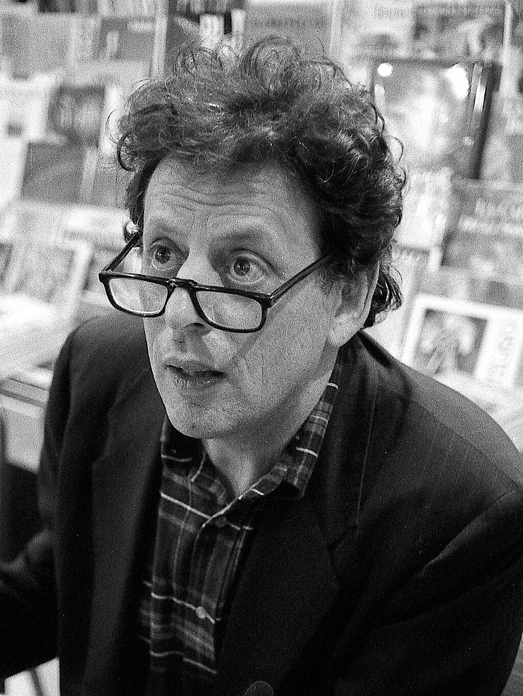
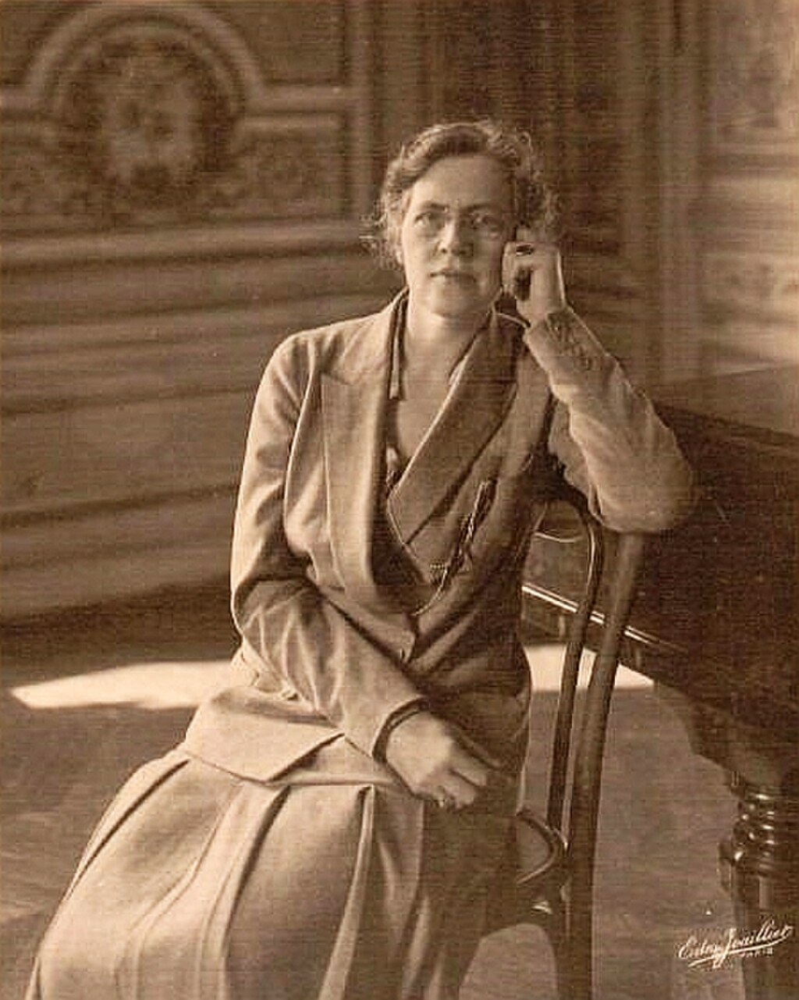
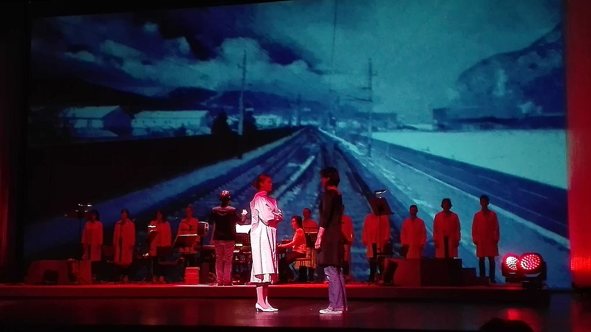
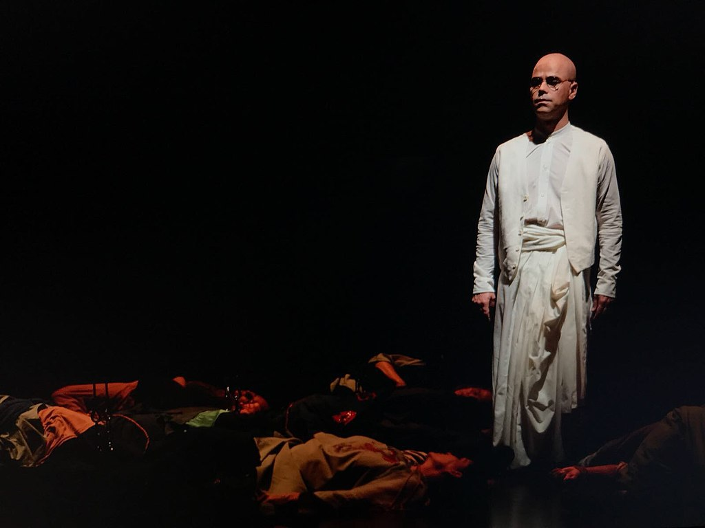
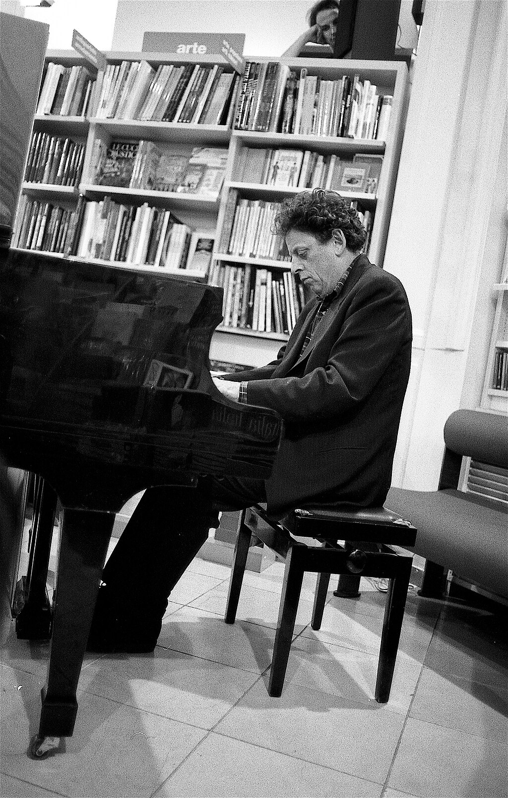
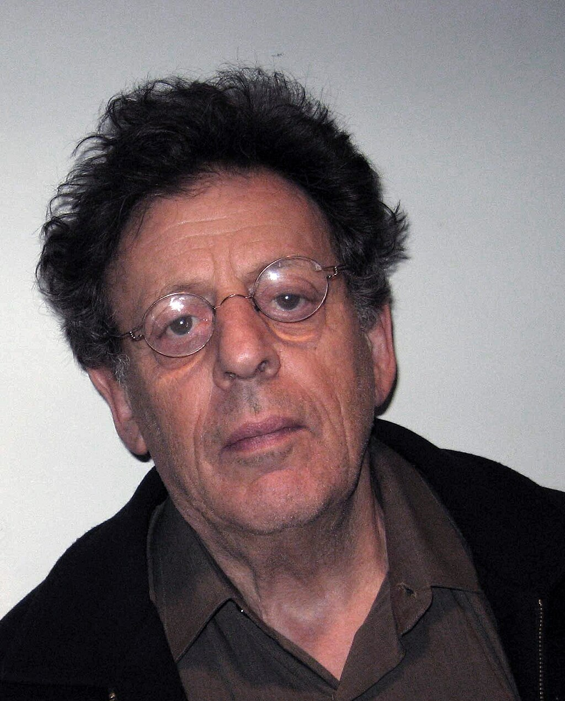
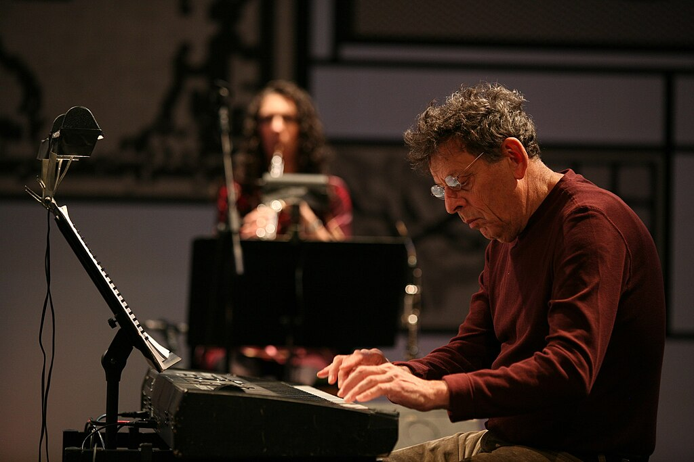
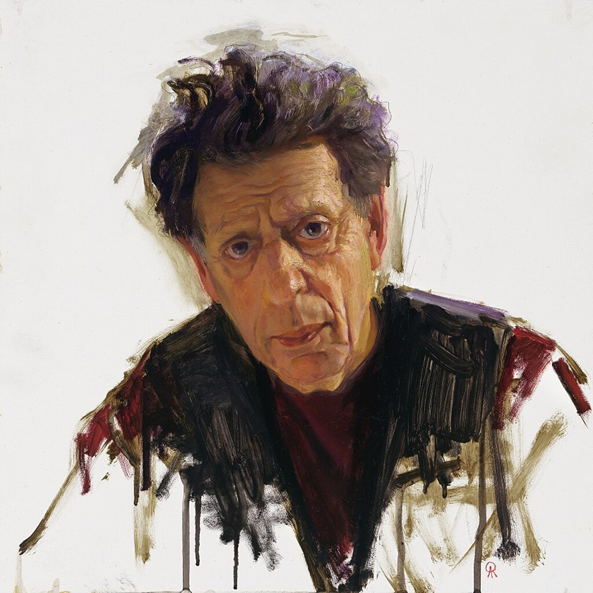
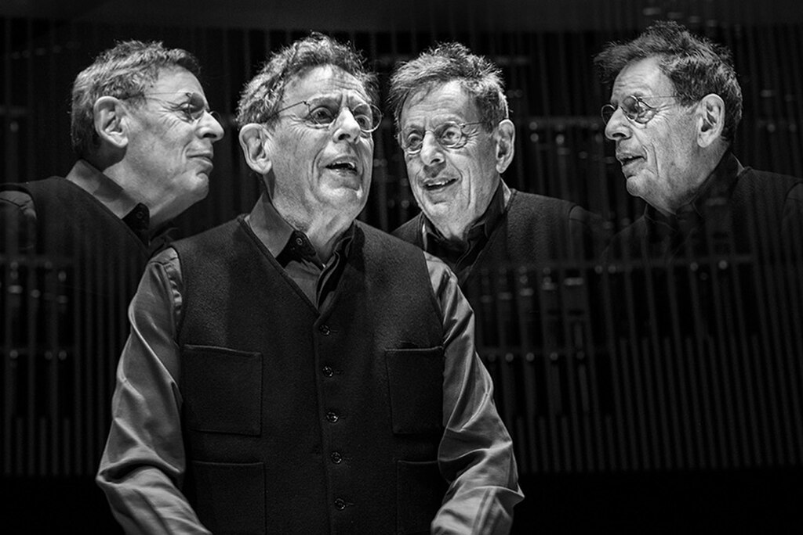
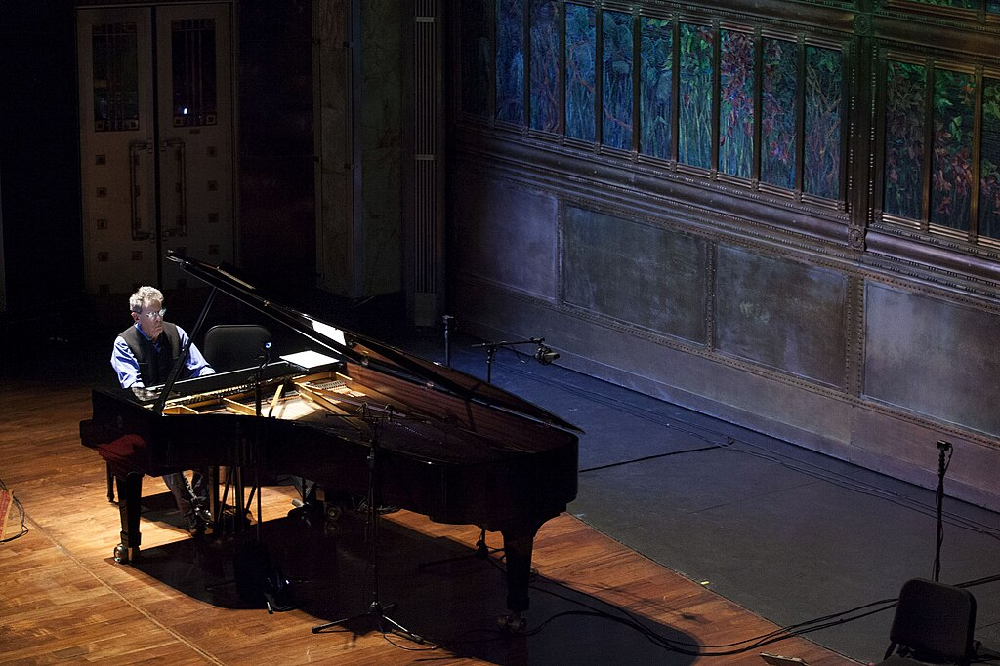

Philip Glass

Glass in 1993

Born

 (1937-01-31) January 31, 1937

[Baltimore](https://en.wikipedia.org/wiki/Baltimore "Baltimore"), [Maryland](https://en.wikipedia.org/wiki/Maryland "Maryland"), U.S.

Education

[Peabody Institute](https://en.wikipedia.org/wiki/Peabody_Institute "Peabody Institute"), [A.B.](https://en.wikipedia.org/wiki/A.B. "A.B."),[University of Chicago](https://en.wikipedia.org/wiki/University_of_Chicago "University of Chicago"), [Diploma](https://en.wikipedia.org/wiki/Diploma "Diploma") and [M.M.](https://en.wikipedia.org/wiki/Master_of_Music "Master of Music") [Juilliard](https://en.wikipedia.org/wiki/Juilliard "Juilliard")

Occupation

Composer

Organizations

[Philip Glass Ensemble](https://en.wikipedia.org/wiki/Philip_Glass_Ensemble "Philip Glass Ensemble")

Known for

[Minimal music](https://en.wikipedia.org/wiki/Minimal_music "Minimal music")

Works

[List of compositions](https://en.wikipedia.org/wiki/List_of_compositions_by_Philip_Glass "List of compositions by Philip Glass")

Website

[philipglass.com](http://philipglass.com)

**Philip Morris Glass** (born January 31, 1937) is an American [composer](https://en.wikipedia.org/wiki/Composer "Composer") and [pianist](https://en.wikipedia.org/wiki/Pianist "Pianist"). He is widely regarded as one of the most influential composers of the late 20th century. Glass's work has been associated with [minimalism](https://en.wikipedia.org/wiki/Minimal_music "Minimal music"), being built up from repetitive [phrases](https://en.wikipedia.org/wiki/Phrase_\(music\) "Phrase (music)") and shifting layers. He described himself as a composer of "music with repetitive structures", which he has helped to evolve stylistically.

Glass founded the [Philip Glass Ensemble](https://en.wikipedia.org/wiki/Philip_Glass_Ensemble "Philip Glass Ensemble") in 1968. He has written 15 [operas](https://en.wikipedia.org/wiki/Opera "Opera"), numerous [chamber operas](https://en.wikipedia.org/wiki/Chamber_opera "Chamber opera") and [musical theatre](https://en.wikipedia.org/wiki/Musical_theatre "Musical theatre") works, 15 [symphonies](https://en.wikipedia.org/wiki/Symphonies "Symphonies"), 12 [concertos](https://en.wikipedia.org/wiki/Concerto "Concerto"), nine [string quartets](https://en.wikipedia.org/wiki/String_quartet "String quartet"), various other [chamber music](https://en.wikipedia.org/wiki/Chamber_music "Chamber music") pieces, and many [film scores](https://en.wikipedia.org/wiki/Film_score "Film score"). He has received nominations for four [Grammy Awards](https://en.wikipedia.org/wiki/Grammy_Awards "Grammy Awards"), including two for [Best Contemporary Classical Composition](https://en.wikipedia.org/wiki/Best_Contemporary_Classical_Composition "Best Contemporary Classical Composition") for _[Satyagraha](https://en.wikipedia.org/wiki/Satyagraha_\(opera\) "Satyagraha (opera)")_ (1987) and _[String Quartet No. 2](https://en.wikipedia.org/wiki/String_Quartet_No._2_\(Glass\) "String Quartet No. 2 (Glass)")_ (1988). He has received three [Academy Award for Best Original Score](https://en.wikipedia.org/wiki/Academy_Award_for_Best_Original_Score "Academy Award for Best Original Score") nominations for [Martin Scorsese](https://en.wikipedia.org/wiki/Martin_Scorsese "Martin Scorsese")'s _[Kundun](https://en.wikipedia.org/wiki/Kundun "Kundun")_ (1997), [Stephen Daldry](https://en.wikipedia.org/wiki/Stephen_Daldry "Stephen Daldry")'s _[The Hours](https://en.wikipedia.org/wiki/The_Hours_\(film\) "The Hours (film)")_ (2002), and [Richard Eyre](https://en.wikipedia.org/wiki/Richard_Eyre "Richard Eyre")'s _[Notes on a Scandal](https://en.wikipedia.org/wiki/Notes_on_a_Scandal_\(film\) "Notes on a Scandal (film)")_ (2006). He also composed the scores for _[Koyaanisqatsi](https://en.wikipedia.org/wiki/Koyaanisqatsi "Koyaanisqatsi")_ (1982), _[Mishima: A Life in Four Chapters](https://en.wikipedia.org/wiki/Mishima:_A_Life_in_Four_Chapters "Mishima: A Life in Four Chapters")_ (1985), _[Hamburger Hill](https://en.wikipedia.org/wiki/Hamburger_Hill "Hamburger Hill")_ (1987), _[The Thin Blue Line](https://en.wikipedia.org/wiki/The_Thin_Blue_Line_\(1988_film\) "The Thin Blue Line (1988 film)")_ (1988), _[Candyman](https://en.wikipedia.org/wiki/Candyman_\(1992_film\) "Candyman (1992 film)")_ (1992), _[The Truman Show](https://en.wikipedia.org/wiki/The_Truman_Show "The Truman Show")_ (1998), and _[The Illusionist](https://en.wikipedia.org/wiki/The_Illusionist_\(2006_film\) "The Illusionist (2006 film)")_ (2006).

Glass is known for composing the operas _[Einstein on the Beach](https://en.wikipedia.org/wiki/Einstein_on_the_Beach "Einstein on the Beach")_ (1976), _[Satyagraha](https://en.wikipedia.org/wiki/Satyagraha_\(opera\) "Satyagraha (opera)")_ (1980), _[Akhnaten](https://en.wikipedia.org/wiki/Akhnaten_\(opera\) "Akhnaten (opera)")_ (1983), _[The Voyage](https://en.wikipedia.org/wiki/The_Voyage_\(opera\) "The Voyage (opera)")_ (1992), and _[The Perfect American](https://en.wikipedia.org/wiki/The_Perfect_American "The Perfect American")_ (2013). He also wrote the scores for [Broadway](https://en.wikipedia.org/wiki/Broadway_\(theatre\) "Broadway (theatre)") productions such as the revivals of _[The Elephant Man](https://en.wikipedia.org/wiki/The_Elephant_Man_\(play\) "The Elephant Man (play)")_ (2002), _[The Crucible](https://en.wikipedia.org/wiki/The_Crucible "The Crucible")_ (2016), and _[King Lear](https://en.wikipedia.org/wiki/King_Lear "King Lear")_ (2019). For the latter he won the [Drama Desk Award for Outstanding Music in a Play](https://en.wikipedia.org/wiki/Drama_Desk_Award_for_Outstanding_Music_in_a_Play "Drama Desk Award for Outstanding Music in a Play").

Glass has received many accolades, including a [BAFTA Award](https://en.wikipedia.org/wiki/BAFTA_Award "BAFTA Award"), a Drama Desk Award, and a [Golden Globe Award](https://en.wikipedia.org/wiki/Golden_Globe_Award "Golden Globe Award"), as well as nominations for three [Academy Awards](https://en.wikipedia.org/wiki/Academy_Awards "Academy Awards"), four Grammy Awards, and a [Primetime Emmy Award](https://en.wikipedia.org/wiki/Primetime_Emmy_Award "Primetime Emmy Award"). He has also received the [Ordre des Arts et des Lettres](https://en.wikipedia.org/wiki/Ordre_des_Arts_et_des_Lettres "Ordre des Arts et des Lettres") in 1995, the [National Medal of Arts](https://en.wikipedia.org/wiki/National_Medal_of_Arts "National Medal of Arts") in 2010, the [Kennedy Center Honors](https://en.wikipedia.org/wiki/Kennedy_Center_Honors "Kennedy Center Honors") in 2018, and the [Grammy Trustees Award](https://en.wikipedia.org/wiki/Grammy_Trustees_Award "Grammy Trustees Award") in 2020. In 2025, he received a [Lifetime Achievement](https://en.wikipedia.org/wiki/World_Soundtrack_Award_–_Lifetime_Achievement "World Soundtrack Award – Lifetime Achievement") from the [World Soundtrack Academy](https://en.wikipedia.org/wiki/World_Soundtrack_Academy "World Soundtrack Academy").

## Early life and education

Glass was born in [Baltimore](https://en.wikipedia.org/wiki/Baltimore "Baltimore"), [Maryland](https://en.wikipedia.org/wiki/Maryland "Maryland"), on January 31, 1937, the son of Ida (née Gouline) and Benjamin Charles Glass. His family were [Latvian-Jewish](https://en.wikipedia.org/wiki/History_of_the_Jews_in_Latvia "History of the Jews in Latvia") and [Russian-Jewish](https://en.wikipedia.org/wiki/Russian-Jewish "Russian-Jewish") emigrants. His father owned a record store and his mother was a [librarian](https://en.wikipedia.org/wiki/Librarian "Librarian"). In his memoir, Glass recalls that at the end of [World War II](https://en.wikipedia.org/wiki/World_War_II "World War II") his mother aided Jewish [Holocaust survivors](https://en.wikipedia.org/wiki/Holocaust_survivors "Holocaust survivors"), inviting recent arrivals to America to stay at their home until they could find a job and a place to live. She developed a plan to help them learn English and develop skills so they could find work. His sister, Sheppie, would later do similar work as an active member of the [International Rescue Committee](https://en.wikipedia.org/wiki/International_Rescue_Committee "International Rescue Committee"). Sheppie died in April 2024, aged 88, and was married to [Morton I. Abramowitz](https://en.wikipedia.org/wiki/Morton_I._Abramowitz "Morton I. Abramowitz").

Glass developed his appreciation of music from his father, discovering later that his father's side of the family had many musicians. His cousin Cevia was a [classical pianist](https://en.wikipedia.org/wiki/Classical_pianist "Classical pianist"), while others had been in [vaudeville](https://en.wikipedia.org/wiki/Vaudeville "Vaudeville"). He learned his family was also related to [Al Jolson](https://en.wikipedia.org/wiki/Al_Jolson "Al Jolson"). Glass's father often received promotional copies of new recordings at his music store. Glass spent many hours listening to them, developing his knowledge of and taste in music. This openness to modern sounds affected Glass at an early age:

> My father was self-taught, but he ended up having a very refined and rich knowledge of classical, chamber, and contemporary music. Typically he would come home and have dinner, and then sit in his armchair and listen to music until almost midnight. I caught on to this very early, and I would go and listen with him.

The elder Glass promoted both new recordings and a wide selection of composers to his customers, sometimes convincing them to try something new by allowing them to return records they did not like. His store soon developed a reputation as Baltimore's leading source of modern music. Glass built a sizable record collection from the unsold records in his father's store, including modern classical music such as [Hindemith](https://en.wikipedia.org/wiki/Hindemith "Hindemith"), [Bartók](https://en.wikipedia.org/wiki/Bartók "Bartók"), [Schoenberg](https://en.wikipedia.org/wiki/Schoenberg "Schoenberg"), [Shostakovich](https://en.wikipedia.org/wiki/Shostakovich "Shostakovich") and Western classical music including [Beethoven](https://en.wikipedia.org/wiki/Beethoven "Beethoven")'s string quartets and [Schubert](https://en.wikipedia.org/wiki/Schubert "Schubert")'s [B♭ Piano Trio](https://en.wikipedia.org/wiki/Piano_Trio_No._1_\(Schubert\) "Piano Trio No. 1 (Schubert)"). Glass cites Schubert's work as a "big influence" growing up. In a 2011 interview, Glass stated that Franz Schubert—with whom he shares a birthday—is his favorite composer.

He studied the flute as a child at the [Peabody Preparatory](https://en.wikipedia.org/wiki/Peabody_Preparatory "Peabody Preparatory") of the [Peabody Institute of Music](https://en.wikipedia.org/wiki/Peabody_Institute_of_Music "Peabody Institute of Music"). At the age of 15, he entered an accelerated college program at the [University of Chicago](https://en.wikipedia.org/wiki/University_of_Chicago "University of Chicago") where he studied mathematics and philosophy. In Chicago, he discovered the [serialism](https://en.wikipedia.org/wiki/Serialism "Serialism") of [Anton Webern](https://en.wikipedia.org/wiki/Anton_Webern "Anton Webern") and composed a [twelve-tone](https://en.wikipedia.org/wiki/Twelve-tone "Twelve-tone") [string trio](https://en.wikipedia.org/wiki/String_trio "String trio"). In 1954, Glass traveled to Paris, where he encountered the films of [Jean Cocteau](https://en.wikipedia.org/wiki/Jean_Cocteau "Jean Cocteau"), which made a lasting impression on him. He visited artists' studios and saw their work; Glass recalls, "the [bohemian life](https://en.wikipedia.org/wiki/Bohemian_life "Bohemian life") you see in \[Cocteau's\] _[Orphée](https://en.wikipedia.org/wiki/Orpheus_\(film\) "Orpheus (film)")_ was the life I ... was attracted to, and those were the people I hung out with."

Glass studied at the [Juilliard School of Music](https://en.wikipedia.org/wiki/Juilliard_School_of_Music "Juilliard School of Music") where the keyboard was his main instrument. His composition teachers included [Vincent Persichetti](https://en.wikipedia.org/wiki/Vincent_Persichetti "Vincent Persichetti") and [William Bergsma](https://en.wikipedia.org/wiki/William_Bergsma "William Bergsma"). Fellow students included [Steve Reich](https://en.wikipedia.org/wiki/Steve_Reich "Steve Reich") and [Peter Schickele](https://en.wikipedia.org/wiki/Peter_Schickele "Peter Schickele"). In 1959, he was a winner in the [BMI Foundation](https://en.wikipedia.org/wiki/BMI_Foundation "BMI Foundation")'s BMI Student Composer Awards, an international prize for young composers. In the summer of 1960, he studied with [Darius Milhaud](https://en.wikipedia.org/wiki/Darius_Milhaud "Darius Milhaud") at the summer school of the [Aspen Music Festival](https://en.wikipedia.org/wiki/Aspen_Music_Festival "Aspen Music Festival") and composed a violin concerto for a fellow student, Dorothy Pixley-Rothschild. After leaving Juilliard in 1962, Glass moved to [Pittsburgh](https://en.wikipedia.org/wiki/Pittsburgh "Pittsburgh") and worked as a school-based composer-in-residence in the public school system, composing various choral, chamber, and orchestral music.

## Career

### 1964–1966: Paris

Glass studied in Paris with [Nadia Boulanger](https://en.wikipedia.org/wiki/Nadia_Boulanger "Nadia Boulanger").

In 1964, Glass received a [Fulbright Scholarship](https://en.wikipedia.org/wiki/Fulbright_Scholarship "Fulbright Scholarship"); his studies in Paris with the eminent composition teacher [Nadia Boulanger](https://en.wikipedia.org/wiki/Nadia_Boulanger "Nadia Boulanger"), from autumn of 1964 to summer of 1966, influenced his work throughout his life, as the composer admitted in 1979: "The composers I studied with Boulanger are the people I still think about most—[Bach](https://en.wikipedia.org/wiki/Bach "Bach") and [Mozart](https://en.wikipedia.org/wiki/Mozart "Mozart")."

Glass later wrote in his autobiography _Music by Philip Glass_ in 1987 that the new music performed at [Pierre Boulez](https://en.wikipedia.org/wiki/Pierre_Boulez "Pierre Boulez")'s _[Domaine Musical](https://en.wikipedia.org/wiki/Domaine_Musical "Domaine Musical")_ concerts in Paris lacked any excitement for him (with the notable exceptions of music by [John Cage](https://en.wikipedia.org/wiki/John_Cage "John Cage") and [Morton Feldman](https://en.wikipedia.org/wiki/Morton_Feldman "Morton Feldman")), but he was deeply impressed by new films and theatre performances. His move away from modernist composers such as Boulez and [Stockhausen](https://en.wikipedia.org/wiki/Stockhausen "Stockhausen") was nuanced, rather than outright rejection: "That generation wanted disciples and as we didn't join up it was taken to mean that we hated the music, which wasn't true. We'd studied them at Juilliard and knew their music. How on earth can you reject [Berio](https://en.wikipedia.org/wiki/Berio "Berio")? Those early works of Stockhausen are still beautiful. But there was just no point in attempting to do their music better than they did and so we started somewhere else."

During this time, he encountered revolutionary films of the [French New Wave](https://en.wikipedia.org/wiki/French_New_Wave "French New Wave"), such as those of [Jean-Luc Godard](https://en.wikipedia.org/wiki/Jean-Luc_Godard "Jean-Luc Godard") and [François Truffaut](https://en.wikipedia.org/wiki/François_Truffaut "François Truffaut"), which upended the rules set by an older generation of artists, and Glass made friends with American visual artists (the sculptor [Richard Serra](https://en.wikipedia.org/wiki/Richard_Serra "Richard Serra") and his wife [Nancy Graves](https://en.wikipedia.org/wiki/Nancy_Graves "Nancy Graves")), actors and directors ([JoAnne Akalaitis](https://en.wikipedia.org/wiki/JoAnne_Akalaitis "JoAnne Akalaitis"), [Ruth Maleczech](https://en.wikipedia.org/wiki/Ruth_Maleczech "Ruth Maleczech"), [David Warrilow](https://en.wikipedia.org/wiki/David_Warrilow "David Warrilow"), and [Lee Breuer](https://en.wikipedia.org/wiki/Lee_Breuer "Lee Breuer"), with whom Glass later founded the experimental theatre group [Mabou Mines](https://en.wikipedia.org/wiki/Mabou_Mines "Mabou Mines")). Together with Akalaitis (they married in 1965), Glass in turn attended performances by theatre groups including [Jean-Louis Barrault](https://en.wikipedia.org/wiki/Jean-Louis_Barrault "Jean-Louis Barrault")'s [Odéon](https://en.wikipedia.org/wiki/Odéon "Odéon") theatre, [The Living Theatre](https://en.wikipedia.org/wiki/The_Living_Theatre "The Living Theatre") and the [Berliner Ensemble](https://en.wikipedia.org/wiki/Berliner_Ensemble "Berliner Ensemble") in 1964 to 1965. These significant encounters resulted in a collaboration with Breuer for which Glass contributed music for a 1965 staging of [Samuel Beckett](https://en.wikipedia.org/wiki/Samuel_Beckett "Samuel Beckett")'s _Comédie_ (_[Play](https://en.wikipedia.org/wiki/Play_\(play\) "Play (play)")_, 1963). The resulting piece (written for two [soprano saxophones](https://en.wikipedia.org/wiki/Soprano_saxophone "Soprano saxophone")) was directly influenced by the play's open-ended, repetitive and almost musical structure and was the first one of a series of four early pieces in a minimalist, yet still [dissonant](https://en.wikipedia.org/wiki/Dissonant "Dissonant"), idiom. After _Play_, Glass also acted in 1966 as music director of a Breuer production of [Brecht](https://en.wikipedia.org/wiki/Brecht "Brecht")'s _[Mother Courage and Her Children](https://en.wikipedia.org/wiki/Mother_Courage_and_Her_Children "Mother Courage and Her Children")_, featuring the theatre score by [Paul Dessau](https://en.wikipedia.org/wiki/Paul_Dessau "Paul Dessau").

In parallel with his early excursions in experimental theatre, Glass worked in winter 1965 and spring 1966 as a music director and composer on a film score (_[Chappaqua](https://en.wikipedia.org/wiki/Chappaqua_\(film\) "Chappaqua (film)")_, Conrad Rooks, 1966) with [Ravi Shankar](https://en.wikipedia.org/wiki/Ravi_Shankar "Ravi Shankar") and [Alla Rakha](https://en.wikipedia.org/wiki/Alla_Rakha "Alla Rakha"), which added another important influence on Glass's musical thinking. His distinctive style arose from his work with Shankar and Rakha and their perception of rhythm in [Indian music](https://en.wikipedia.org/wiki/Indian_classical_music "Indian classical music") as being entirely additive. He renounced all his compositions in a moderately modern style resembling [Milhaud](https://en.wikipedia.org/wiki/Milhaud "Milhaud")'s, [Aaron Copland](https://en.wikipedia.org/wiki/Aaron_Copland "Aaron Copland")'s, and [Samuel Barber](https://en.wikipedia.org/wiki/Samuel_Barber "Samuel Barber")'s, and began writing pieces based on repetitive structures of Indian music and a sense of time influenced by Samuel Beckett: a piece for two actresses and chamber ensemble, a work for chamber ensemble and his first numbered string quartet (No. 1, 1966).

Glass then left Paris for northern India in 1966, where he came in contact with [Tibetan](https://en.wikipedia.org/wiki/Tibet "Tibet") refugees and began to gravitate towards [Buddhism](https://en.wikipedia.org/wiki/Buddhism "Buddhism"). He met [Tenzin Gyatso](https://en.wikipedia.org/wiki/Tenzin_Gyatso "Tenzin Gyatso"), the 14th [Dalai Lama](https://en.wikipedia.org/wiki/Dalai_Lama "Dalai Lama"), in 1972, and has been a strong supporter of the Tibetan independence ever since.

### 1967–1974: Minimalism: From _Strung Out_ to _Music in 12 Parts_

> Glass' musical style is instantly recognizable, with its trademark churning [ostinatos](https://en.wikipedia.org/wiki/Ostinato "Ostinato"), undulating [arpeggios](https://en.wikipedia.org/wiki/Arpeggio "Arpeggio") and repeating rhythms that morph over various lengths of time atop broad fields of tonal harmony. That style has taken permanent root in our pop-middlebrow sensibility. Glass' music is now indelibly a part of our cultural [lingua franca](https://en.wikipedia.org/wiki/Lingua_franca "Lingua franca"), just a click away on YouTube.

— John von Rhein, _Chicago Tribune_ writer

Shortly after arriving in New York City in March 1967, Glass attended a performance of works by [Steve Reich](https://en.wikipedia.org/wiki/Steve_Reich "Steve Reich") (including the ground-breaking minimalist piece _[Piano Phase](https://en.wikipedia.org/wiki/Piano_Phase "Piano Phase")_), which left a deep impression on him; he simplified his style and turned to a radical "[consonant](https://en.wikipedia.org/wiki/Consonance_and_dissonance "Consonance and dissonance") vocabulary". Finding little sympathy from traditional performers and performance spaces, Glass eventually formed an ensemble with fellow ex-student [Jon Gibson](https://en.wikipedia.org/wiki/Jon_Gibson_\(minimalist_musician\) "Jon Gibson (minimalist musician)"), and others, and began performing mainly in art galleries and studio lofts of [SoHo](https://en.wikipedia.org/wiki/SoHo "SoHo"). The visual artist Richard Serra provided Glass with Gallery contacts, while both collaborated on various sculptures, films and installations; from 1971 to 1974, he was Serra's regular studio assistant.

Between summer of 1967 and the end of 1968, Glass composed nine works, including _Strung Out_ (for amplified solo violin, composed in summer of 1967), _Gradus_ (for solo saxophone, 1968), _Music in the Shape of a Square_ (for two flutes, composed in May 1968, an homage to [Erik Satie](https://en.wikipedia.org/wiki/Erik_Satie "Erik Satie")), _How Now_ (for solo piano, 1968) and _1+1_ (for amplified tabletop, November 1968) which were "clearly designed to experiment more fully with his new-found minimalist approach". The first concert of Glass's new music was at [Jonas Mekas](https://en.wikipedia.org/wiki/Jonas_Mekas "Jonas Mekas")'s Film-Makers Cinemathèque ([Anthology Film Archives](https://en.wikipedia.org/wiki/Anthology_Film_Archives "Anthology Film Archives")) in September 1968. This concert included the first work of this series with _Strung Out_ (performed by the violinist Pixley-Rothschild) and _Music in the Shape of a Square_ (performed by Glass and Gibson). The musical scores were tacked on the wall, and the performers had to move while playing. Glass's new works met with a very enthusiastic response by the audience which consisted mainly of visual and performance artists who were highly sympathetic to Glass's reductive approach.

Apart from his music career, Glass had a [moving company](https://en.wikipedia.org/wiki/Moving_company "Moving company") with his cousin, the sculptor Jene Highstein, and also worked as a plumber and [cab](https://en.wikipedia.org/wiki/Taxicab "Taxicab") driver (during 1973 to 1978). He recounts installing a dishwasher and looking up from his work to see an astonished [Robert Hughes](https://en.wikipedia.org/wiki/Robert_Hughes_\(critic\) "Robert Hughes (critic)"), _Time_ magazine's art critic, staring at him. During this time, he made friends with other New York-based artists such as [Sol LeWitt](https://en.wikipedia.org/wiki/Sol_LeWitt "Sol LeWitt"), [Nancy Graves](https://en.wikipedia.org/wiki/Nancy_Graves "Nancy Graves"), [Michael Snow](https://en.wikipedia.org/wiki/Michael_Snow "Michael Snow"), [Bruce Nauman](https://en.wikipedia.org/wiki/Bruce_Nauman "Bruce Nauman"), [Laurie Anderson](https://en.wikipedia.org/wiki/Laurie_Anderson "Laurie Anderson"), and [Chuck Close](https://en.wikipedia.org/wiki/Chuck_Close "Chuck Close") (who created a now-famous portrait of Glass). (Glass returned the compliment in 2005 with _A Musical Portrait of Chuck Close_ for piano.)

With _1+1_ and _Two Pages_ (composed in February 1969), Glass turned to a more "rigorous approach" to his "most basic minimalist technique, additive process", pieces which were followed in the same year by _Music in Contrary Motion_ and _Music in Fifths_ (a kind of homage to his composition teacher [Nadia Boulanger](https://en.wikipedia.org/wiki/Nadia_Boulanger "Nadia Boulanger"), who pointed out "[hidden fifths](https://en.wikipedia.org/wiki/Hidden_fifths "Hidden fifths")" in his works but regarded them as cardinal sins). Eventually Glass's music grew less austere, becoming more complex and dramatic, with pieces such as _Music in Similar Motion_ (1969), and _Music with Changing Parts_ (1970). These pieces were performed by the [Philip Glass Ensemble](https://en.wikipedia.org/wiki/Philip_Glass_Ensemble "Philip Glass Ensemble") in the [Whitney Museum of American Art](https://en.wikipedia.org/wiki/Whitney_Museum_of_American_Art "Whitney Museum of American Art") in 1969 and in the [Solomon R. Guggenheim Museum](https://en.wikipedia.org/wiki/Solomon_R._Guggenheim_Museum "Solomon R. Guggenheim Museum") in 1970, often encountering hostile reaction from critics, but Glass's music was also met with enthusiasm from younger artists such as [Brian Eno](https://en.wikipedia.org/wiki/Brian_Eno "Brian Eno") and [David Bowie](https://en.wikipedia.org/wiki/David_Bowie "David Bowie") (at the Royal College of Art ca. 1970). Eno described this encounter with Glass's music as one of the "most extraordinary musical experiences of \[his\] life", as a "viscous bath of pure, thick energy", concluding "this was actually the most detailed music I'd ever heard. It was all intricacy, exotic [harmonics](https://en.wikipedia.org/wiki/Harmonic "Harmonic")". In 1970, Glass returned to the theatre, composing music for the theatre group [Mabou Mines](https://en.wikipedia.org/wiki/Mabou_Mines "Mabou Mines"), resulting in his first minimalist pieces employing voices: _Red Horse Animation_ and _Music for Voices_ (both 1970, and premiered at the [Paula Cooper Gallery](https://en.wikipedia.org/wiki/Paula_Cooper_Gallery "Paula Cooper Gallery")).

After differences of opinion with Steve Reich in 1971, Glass formed the Philip Glass Ensemble (while Reich formed [Steve Reich and Musicians](https://en.wikipedia.org/wiki/Steve_Reich_and_Musicians "Steve Reich and Musicians")), an amplified ensemble including keyboards, wind instruments (saxophones, flutes), and [soprano](https://en.wikipedia.org/wiki/Soprano "Soprano") voices.

Glass's music for his ensemble culminated in the four-hour-long _[Music in Twelve Parts](https://en.wikipedia.org/wiki/Music_in_Twelve_Parts "Music in Twelve Parts")_ (1971–1974), which began as a single piece with twelve instrumental parts but developed into a cycle that summed up Glass's musical achievement since 1967, and even transcended it—the last part features a [twelve-tone](https://en.wikipedia.org/wiki/Twelve-tone "Twelve-tone") theme, sung by the soprano voice of the ensemble. "I had broken the rules of [modernism](https://en.wikipedia.org/wiki/Modernism_\(music\) "Modernism (music)") and so I thought it was time to break some of my own rules", according to Glass. Though he finds the term minimalist inaccurate to describe his later work, Glass does accept this term for pieces up to and including _Music in 12 Parts_, excepting this last part which "was the end of minimalism" for Glass. As he pointed out: "I had worked for eight or nine years inventing a system, and now I'd written through it and come out the other end." He now prefers to describe himself as a composer of "music with repetitive structures".

### 1975–1979: Another Look at Harmony: The Portrait Trilogy

A scene from a 2017 rehearsal of _[Einstein on the Beach](https://en.wikipedia.org/wiki/Einstein_on_the_Beach "Einstein on the Beach")_, a 1975 opera by Glass in [Dortmund](https://en.wikipedia.org/wiki/Dortmund "Dortmund"), Germany

External images

 [_Philip Glass and Robert Wilson_ (1976)](http://www.tate.org.uk/art/artworks/mapplethorpe-philip-glass-and-robert-wilson-ar00214) by [Robert Mapplethorpe](https://en.wikipedia.org/wiki/Robert_Mapplethorpe "Robert Mapplethorpe")

 [_Philip Glass and Robert Wilson_ (2008)](http://it-was-like-this.blogspot.com.au/2011/12/zen-and-art-of-mapplethorpe.html) by Georgia Oetker

Glass continued his work with a series of instrumental works, called _Another Look at Harmony_ (1975–1977). For Glass, this series demonstrated a new start, hence the title: "What I was looking for was a way of combining harmonic progression with the rhythmic structure I had been developing, to produce a new overall structure. ... I'd taken everything out with my early works and it was now time to decide just what I wanted to put in—a process that would occupy me for several years to come."

Parts 1 and 2 of _Another Look at Harmony_ were included in a collaboration with [Robert Wilson](https://en.wikipedia.org/wiki/Robert_Wilson_\(director\) "Robert Wilson (director)"), a piece of musical theater later designated by Glass as the first opera of his portrait opera trilogy: _[Einstein on the Beach](https://en.wikipedia.org/wiki/Einstein_on_the_Beach "Einstein on the Beach")_. Composed in spring to fall of 1975 in close collaboration with Wilson, Glass's first opera was first premiered in summer 1976 at the [Festival d'Avignon](https://en.wikipedia.org/wiki/Festival_d'Avignon "Festival d'Avignon"), and in November of the same year to a mixed and partly enthusiastic reaction from the audience at the [Metropolitan Opera](https://en.wikipedia.org/wiki/Metropolitan_Opera "Metropolitan Opera") in New York City. Scored for the Philip Glass Ensemble, solo violin, chorus, and featuring actors (reciting texts by [Christopher Knowles](https://en.wikipedia.org/wiki/Christopher_Knowles_\(poet\) "Christopher Knowles (poet)"), [Lucinda Childs](https://en.wikipedia.org/wiki/Lucinda_Childs "Lucinda Childs") and Samuel M. Johnson), Glass's and Wilson's essentially plotless opera was conceived as a "[metaphorical](https://en.wikipedia.org/wiki/Metaphorical "Metaphorical") look at [Albert Einstein](https://en.wikipedia.org/wiki/Albert_Einstein "Albert Einstein"): scientist, humanist, amateur musician—and the man whose theories ... led to the splitting of the atom", evoking [nuclear holocaust](https://en.wikipedia.org/wiki/Nuclear_holocaust "Nuclear holocaust") in the climactic scene, as critic [Tim Page](https://en.wikipedia.org/wiki/Tim_Page_\(music_critic\) "Tim Page (music critic)") pointed out. As with _Another Look at Harmony_, "_Einstein_ added a new functional harmony that set it apart from the early conceptual works". Composer [Tom Johnson](https://en.wikipedia.org/wiki/Tom_Johnson_\(composer\) "Tom Johnson (composer)") came to the same conclusion, comparing the solo violin music to [Johann Sebastian Bach](/source/johann-sebastian-bach/ "Johann Sebastian Bach"), and the "organ figures ... to those [Alberti basses](https://en.wikipedia.org/wiki/Alberti_bass "Alberti bass") [Mozart](https://en.wikipedia.org/wiki/Mozart "Mozart") loved so much". The piece was praised by _[The Washington Post](https://en.wikipedia.org/wiki/The_Washington_Post "The Washington Post")_ as "one of the seminal artworks of the century".

_Einstein on the Beach_ was followed by further music for projects by the theatre group Mabou Mines such as _Dressed like an Egg_ (1975), and again music for plays and adaptations from prose by [Samuel Beckett](https://en.wikipedia.org/wiki/Samuel_Beckett "Samuel Beckett"), such as _[The Lost Ones](https://en.wikipedia.org/wiki/The_Lost_Ones_\(Beckett\) "The Lost Ones (Beckett)")_ (1975), _Cascando_ (1975), _[Mercier and Camier](https://en.wikipedia.org/wiki/Mercier_and_Camier "Mercier and Camier")_ (1979). Glass also turned to other media; two multi-movement instrumental works for the Philip Glass Ensemble originated as music for film and TV: _North Star_ (1977 score for the documentary _[North Star: Mark di Suvero](https://en.wikipedia.org/wiki/North_Star:_Mark_di_Suvero "North Star: Mark di Suvero")_ by François de Menil and [Barbara Rose](https://en.wikipedia.org/wiki/Barbara_Rose "Barbara Rose")) and four short cues for the children's TV series _[Sesame Street](https://en.wikipedia.org/wiki/Sesame_Street "Sesame Street")_ named _Geometry of Circles_ (1979).

Another series, _Fourth Series_ (1977–79), included music for chorus and organ ("Part One", 1977), organ and piano ("Part Two" and "Part Four", 1979), and music for a radio adaption of [Constance DeJong](https://en.wikipedia.org/wiki/Constance_DeJong_\(writer\) "Constance DeJong (writer)")'s novel _Modern Love_ ("Part Three", 1978). "Part Two" and "Part Four" were used (and hence renamed) in two dance productions by choreographer [Lucinda Childs](https://en.wikipedia.org/wiki/Lucinda_Childs "Lucinda Childs") (who had already contributed to and performed in _Einstein on the Beach_). "Part Two" was included in _Dance_ (a collaboration with visual artist [Sol LeWitt](https://en.wikipedia.org/wiki/Sol_LeWitt "Sol LeWitt"), 1979), and "Part Four" was renamed as _Mad Rush_, and performed by Glass on several occasions such as the first public appearance of the [14th Dalai Lama](https://en.wikipedia.org/wiki/14th_Dalai_Lama "14th Dalai Lama") in New York City in fall 1981. The piece demonstrates Glass's turn to more traditional models: the composer added a conclusion to an open-structured piece which "can be interpreted as a sign that he \[had\] abandoned the radical non-narrative, undramatic approaches of his early period", as the pianist [Steffen Schleiermacher](https://en.wikipedia.org/wiki/Steffen_Schleiermacher "Steffen Schleiermacher") points out.

In spring 1978, Glass received a commission from the [Netherlands Opera](https://en.wikipedia.org/wiki/Netherlands_Opera "Netherlands Opera") (as well as a [Rockefeller Foundation](https://en.wikipedia.org/wiki/Rockefeller_Foundation "Rockefeller Foundation") grant) which "marked the end of his need to earn money from non-musical employment". With the commission Glass continued his work in music theater, composing his opera _[Satyagraha](https://en.wikipedia.org/wiki/Satyagraha_\(opera\) "Satyagraha (opera)")_ (composed in 1978–1979, premiered in 1980 at Rotterdam), based on the early life of [Mahatma Gandhi](https://en.wikipedia.org/wiki/Mahatma_Gandhi "Mahatma Gandhi") in South Africa, [Leo Tolstoy](https://en.wikipedia.org/wiki/Leo_Tolstoy "Leo Tolstoy"), [Rabindranath Tagore](https://en.wikipedia.org/wiki/Rabindranath_Tagore "Rabindranath Tagore"), and [Martin Luther King Jr.](https://en.wikipedia.org/wiki/Martin_Luther_King_Jr. "Martin Luther King Jr.") For _Satyagraha_, Glass worked in close collaboration with two "[SoHo](https://en.wikipedia.org/wiki/SoHo "SoHo") friends": the writer [Constance deJong](https://en.wikipedia.org/wiki/Constance_DeJong_\(writer\) "Constance DeJong (writer)"), who provided the libretto, and the set designer Robert Israel. This piece was in other ways a turning point for Glass, as it was his first work since 1963 scored for symphony orchestra, even if the most prominent parts were still reserved for solo voices and chorus. Shortly after completing the score in August 1979, Glass met the conductor [Dennis Russell Davies](https://en.wikipedia.org/wiki/Dennis_Russell_Davies "Dennis Russell Davies"), whom he helped prepare for performances in Germany (using a piano-four-hands version of the score); together they started to plan another opera, to be premiered at the [Stuttgart State Opera](https://en.wikipedia.org/wiki/Stuttgart_State_Opera "Stuttgart State Opera").

### 1980–1986: Completing the Portrait Trilogy: _Akhnaten_ and beyond

A scene from a 2017 performance in [Berlin](https://en.wikipedia.org/wiki/Berlin "Berlin") of _[Satyagraha](https://en.wikipedia.org/wiki/Satyagraha_\(opera\) "Satyagraha (opera)")_, an opera by Glass

While planning a third part of his "Portrait Trilogy", Glass turned to smaller music theatre projects such as the non-narrative _Madrigal Opera_ (for six voices and violin and viola, 1980), and _[The Photographer](https://en.wikipedia.org/wiki/The_Photographer_\(opera\) "The Photographer (opera)")_, a biographic study on the photographer [Eadweard Muybridge](https://en.wikipedia.org/wiki/Eadweard_Muybridge "Eadweard Muybridge") (1982). Glass also continued to write for the orchestra with the score of _[Koyaanisqatsi](https://en.wikipedia.org/wiki/Koyaanisqatsi "Koyaanisqatsi")_ ([Godfrey Reggio](https://en.wikipedia.org/wiki/Godfrey_Reggio "Godfrey Reggio"), 1981–1982). Some pieces which were not used in the film (such as _Façades_) eventually appeared on the album _[Glassworks](https://en.wikipedia.org/wiki/Glassworks_\(composition\) "Glassworks (composition)")_ (1982, CBS Records), which brought Glass's music to a wider public.

The "Portrait Trilogy" was completed with _[Akhnaten](https://en.wikipedia.org/wiki/Akhnaten_\(opera\) "Akhnaten (opera)")_ (1982–1983, premiered in 1984), a vocal and orchestral composition sung in [Akkadian](https://en.wikipedia.org/wiki/Akkadian_language "Akkadian language"), [Biblical Hebrew](https://en.wikipedia.org/wiki/Biblical_Hebrew "Biblical Hebrew"), and [Ancient Egyptian](https://en.wikipedia.org/wiki/Ancient_Egyptian "Ancient Egyptian"). In addition, this opera featured an actor reciting ancient Egyptian texts in the language of the audience. _Akhnaten_ was commissioned by the [Stuttgart Opera](https://en.wikipedia.org/wiki/Stuttgart_Opera "Stuttgart Opera") in a production designed by [Achim Freyer](https://en.wikipedia.org/wiki/Achim_Freyer "Achim Freyer"). It premiered simultaneously at the [Houston Opera](https://en.wikipedia.org/wiki/Houston_Opera "Houston Opera") in a production directed by David Freeman and designed by [Peter Sellars](https://en.wikipedia.org/wiki/Peter_Sellars "Peter Sellars"). At the time of the commission, the Stuttgart Opera House was undergoing renovation, necessitating the use of a nearby playhouse with a smaller orchestra pit. Upon learning this, Glass and conductor Dennis Russell Davies visited the playhouse, placing music stands around the pit to determine how many players the pit could accommodate. The two found they could not fit a full orchestra in the pit. Glass decided to eliminate the violins, which had the effect of "giving the orchestra a low, dark sound that came to characterize the piece and suited the subject very well". As Glass remarked in 1992, _Akhnaten_ is significant in his work since it represents a "first extension out of a [triadic harmonic](https://en.wikipedia.org/wiki/Triad_\(music\) "Triad (music)") language", an experiment with the [polytonality](https://en.wikipedia.org/wiki/Polytonality "Polytonality") of his teachers [Persichetti](https://en.wikipedia.org/wiki/Vincent_Persichetti "Vincent Persichetti") and [Milhaud](https://en.wikipedia.org/wiki/Milhaud "Milhaud"), a musical technique which Glass compares to "an optical illusion, such as in the paintings of [Josef Albers](https://en.wikipedia.org/wiki/Josef_Albers "Josef Albers")".

Glass again collaborated with [Robert Wilson](https://en.wikipedia.org/wiki/Robert_Wilson_\(director\) "Robert Wilson (director)") on another opera, _[the CIVIL warS](https://en.wikipedia.org/wiki/The_CIVIL_warS "The CIVIL warS")_ (1983, premiered in 1984). Glass composed the Rome section, and part of the Cologne section, parts of a larger work originally planned for an "international arts festival that would accompany the [Olympic Games](https://en.wikipedia.org/wiki/1984_Summer_Olympics "1984 Summer Olympics") in Los Angeles". (Glass also composed a prestigious work for chorus and orchestra for the opening of the Games, _The Olympian: Lighting of the Torch and Closing_). The Cologne section premiered at the [Cologne Opera](https://en.wikipedia.org/wiki/Cologne_Opera "Cologne Opera") in January of 1984, the Rome section in March 1984 at the [Opera di Roma](https://en.wikipedia.org/wiki/Opera_di_Roma "Opera di Roma"). The planned premiere of the complete _the CIVIL warS_ in Los Angeles was cancelled. Glass's and Wilson's opera includes musical settings of Latin texts by the 1st-century-Roman playwright [Seneca](https://en.wikipedia.org/wiki/Seneca_the_Younger "Seneca the Younger") and allusions to the music of [Giuseppe Verdi](https://en.wikipedia.org/wiki/Giuseppe_Verdi "Giuseppe Verdi") and from the [American Civil War](https://en.wikipedia.org/wiki/American_Civil_War "American Civil War"), featuring the 19th century figures [Giuseppe Garibaldi](https://en.wikipedia.org/wiki/Giuseppe_Garibaldi "Giuseppe Garibaldi") and [Robert E. Lee](https://en.wikipedia.org/wiki/Robert_E._Lee "Robert E. Lee") as characters.

In the mid-1980s, Glass produced "works in different media at an extraordinarily rapid pace". Projects from that period include music for dance ([Glass Pieces](https://en.wikipedia.org/wiki/Glass_Pieces "Glass Pieces") choreographed for [New York City Ballet](https://en.wikipedia.org/wiki/New_York_City_Ballet "New York City Ballet") by [Jerome Robbins](https://en.wikipedia.org/wiki/Jerome_Robbins "Jerome Robbins") in 1983 to a score drawn from existing Glass compositions created for other media including an excerpt from _Akhnaten_; and _In the Upper Room_, [Twyla Tharp](https://en.wikipedia.org/wiki/Twyla_Tharp "Twyla Tharp"), 1986), music for theatre productions _[Endgame](https://en.wikipedia.org/wiki/Endgame_\(play\) "Endgame (play)")_ (1984) and _[Company](https://en.wikipedia.org/wiki/String_Quartet_No._2_\(Glass\) "String Quartet No. 2 (Glass)")_ (1983). Beckett vehemently disapproved of the production of _Endgame_ at the [American Repertory Theater](https://en.wikipedia.org/wiki/American_Repertory_Theater "American Repertory Theater") (Cambridge, Massachusetts), which featured [JoAnne Akalaitis](https://en.wikipedia.org/wiki/JoAnne_Akalaitis "JoAnne Akalaitis")'s direction and Glass's _Prelude_ for timpani and double bass, but in the end, he authorized the music for _Company_, four short, intimate pieces for [string quartet](https://en.wikipedia.org/wiki/String_quartet "String quartet") that were played in the intervals of the dramatization. This composition was initially regarded by the composer as a piece of [Gebrauchsmusik](https://en.wikipedia.org/wiki/Gebrauchsmusik "Gebrauchsmusik") ('music for use')—"like salt and pepper ... just something for the table", as he noted. Eventually _Company_ was published as Glass's [String Quartet No. 2](https://en.wikipedia.org/wiki/String_Quartet_No._2_\(Glass\) "String Quartet No. 2 (Glass)") and in a version for string orchestra, being performed by ensembles ranging from student orchestras to renowned formations such as the [Kronos Quartet](https://en.wikipedia.org/wiki/Kronos_Quartet "Kronos Quartet") and the [Kremerata Baltica](https://en.wikipedia.org/wiki/Kremerata_Baltica "Kremerata Baltica").

This interest in writing for the [string quartet](https://en.wikipedia.org/wiki/String_quartet "String quartet") and the string orchestra led to a chamber and orchestral film score for _[Mishima: A Life in Four Chapters](https://en.wikipedia.org/wiki/Mishima:_A_Life_in_Four_Chapters "Mishima: A Life in Four Chapters")_ ([Paul Schrader](https://en.wikipedia.org/wiki/Paul_Schrader "Paul Schrader"), 1984–85), which Glass recently described as his "musical turning point" that developed his "technique of film scoring in a very special way".

Glass also dedicated himself to vocal works with two sets of songs, _Three Songs for chorus_ (1984, settings of poems by [Leonard Cohen](https://en.wikipedia.org/wiki/Leonard_Cohen "Leonard Cohen"), [Octavio Paz](https://en.wikipedia.org/wiki/Octavio_Paz "Octavio Paz") and [Raymond Lévesque](https://en.wikipedia.org/wiki/Raymond_Lévesque "Raymond Lévesque")), and a song cycle initiated by [CBS Masterworks Records](https://en.wikipedia.org/wiki/CBS_Masterworks_Records "CBS Masterworks Records"): _[Songs from Liquid Days](https://en.wikipedia.org/wiki/Songs_from_Liquid_Days "Songs from Liquid Days")_ (1985), with texts by songwriters such as [David Byrne](https://en.wikipedia.org/wiki/David_Byrne "David Byrne"), [Paul Simon](https://en.wikipedia.org/wiki/Paul_Simon "Paul Simon"), in which the [Kronos Quartet](https://en.wikipedia.org/wiki/Kronos_Quartet "Kronos Quartet") is featured (as it is in _Mishima_) in a prominent role. Glass also continued his series of operas with adaptations from literary texts such as _The Juniper Tree_ (an opera collaboration with composer [Robert Moran](https://en.wikipedia.org/wiki/Robert_Moran_\(composer\) "Robert Moran (composer)"), 1984), [Edgar Allan Poe](https://en.wikipedia.org/wiki/Edgar_Allan_Poe "Edgar Allan Poe")'s _[The Fall of the House of Usher](https://en.wikipedia.org/wiki/The_Fall_of_the_House_of_Usher "The Fall of the House of Usher")_ (1987), and also worked with novelist [Doris Lessing](https://en.wikipedia.org/wiki/Doris_Lessing "Doris Lessing") on the opera _[The Making of the Representative for Planet 8](https://en.wikipedia.org/wiki/The_Making_of_the_Representative_for_Planet_8_\(opera\) "The Making of the Representative for Planet 8 (opera)")_ (1985–86, and performed by the [Houston Grand Opera](https://en.wikipedia.org/wiki/Houston_Grand_Opera "Houston Grand Opera") and [English National Opera](https://en.wikipedia.org/wiki/English_National_Opera "English National Opera") in 1988).

### 1987–1991: Operas and the turn to symphonic music

Compositions such as _Company_, _Facades_ and String Quartet No. 3 (the last two extracted from the scores to _Koyaanisqatsi_ and _Mishima_) gave way to a series of works more accessible to ensembles such as the [string quartet](https://en.wikipedia.org/wiki/String_quartet "String quartet") and [symphony orchestra](https://en.wikipedia.org/wiki/Symphony_orchestra "Symphony orchestra"), in this returning to the structural roots of his student days. In taking this direction his [chamber](https://en.wikipedia.org/wiki/Chamber_music "Chamber music") and orchestral works were also written in a more and more traditional and lyrical style. In these works, Glass often employs old musical forms such as the [chaconne](https://en.wikipedia.org/wiki/Chaconne "Chaconne") and the [passacaglia](https://en.wikipedia.org/wiki/Passacaglia "Passacaglia")—for instance in _[Satyagraha](https://en.wikipedia.org/wiki/Satyagraha_\(opera\) "Satyagraha (opera)")_, the [Violin Concerto No. 1](https://en.wikipedia.org/wiki/Violin_Concerto_No._1_\(Glass\) "Violin Concerto No. 1 (Glass)") (1987), [Symphony No. 3](https://en.wikipedia.org/wiki/Symphony_No._3_\(Glass\) "Symphony No. 3 (Glass)") (1995), _Echorus_ (1995) and also recent works such as [Symphony No. 8](https://en.wikipedia.org/wiki/Symphony_No._8_\(Glass\) "Symphony No. 8 (Glass)") (2005), and _Songs and Poems for Solo Cello_ (2006).

A series of orchestral works originally composed for the concert hall commenced with the three-movement [Violin Concerto No. 1](https://en.wikipedia.org/wiki/Violin_Concerto_No._1_\(Glass\) "Violin Concerto No. 1 (Glass)") (1987). This work was commissioned by the [American Composers Orchestra](https://en.wikipedia.org/wiki/American_Composers_Orchestra "American Composers Orchestra") and written for and in close collaboration with the violinist [Paul Zukofsky](https://en.wikipedia.org/wiki/Paul_Zukofsky "Paul Zukofsky") and the conductor Dennis Russell Davies, who since then has encouraged the composer to write numerous orchestral pieces. The Concerto is dedicated to the memory of Glass's father: "His favorite form was the violin concerto, and so I grew up listening to the [Mendelssohn](https://en.wikipedia.org/wiki/Violin_Concerto_\(Mendelssohn\) "Violin Concerto (Mendelssohn)"), the [Paganini](https://en.wikipedia.org/wiki/Paganini "Paganini"), the [Brahms](https://en.wikipedia.org/wiki/Violin_Concerto_\(Brahms\) "Violin Concerto (Brahms)") concertos. ... So when I decided to write a violin concerto, I wanted to write one that my father would have liked." Among its multiple recordings, in 1992, the Concerto was performed and recorded by [Gidon Kremer](https://en.wikipedia.org/wiki/Gidon_Kremer "Gidon Kremer") and the [Vienna Philharmonic](https://en.wikipedia.org/wiki/Vienna_Philharmonic "Vienna Philharmonic"). This turn to orchestral music was continued with a symphonic trilogy of "portraits of nature", commissioned by the [Cleveland Orchestra](https://en.wikipedia.org/wiki/Cleveland_Orchestra "Cleveland Orchestra"), the [Rotterdam Philharmonic Orchestra](https://en.wikipedia.org/wiki/Rotterdam_Philharmonic_Orchestra "Rotterdam Philharmonic Orchestra"), and the [Atlanta Symphony Orchestra](https://en.wikipedia.org/wiki/Atlanta_Symphony_Orchestra "Atlanta Symphony Orchestra"): _[The Light](https://en.wikipedia.org/wiki/The_Light_\(Glass\) "The Light (Glass)")_ (1987), _The Canyon_ (1988), and _[Itaipu](https://en.wikipedia.org/wiki/Itaipu_\(composition\) "Itaipu (composition)")_ (1989).

While composing for symphonic ensembles, Glass also composed music for piano, with the cycle of five movements titled _Metamorphosis_ (adapted from music for a theatrical adaptation of [Franz Kafka](https://en.wikipedia.org/wiki/Franz_Kafka "Franz Kafka")'s _[The Metamorphosis](https://en.wikipedia.org/wiki/The_Metamorphosis "The Metamorphosis")_), and for the [Errol Morris](https://en.wikipedia.org/wiki/Errol_Morris "Errol Morris") film _[The Thin Blue Line](https://en.wikipedia.org/wiki/The_Thin_Blue_Line_\(1988_film\) "The Thin Blue Line (1988 film)")_, 1988. In the same year Glass met the poet [Allen Ginsberg](https://en.wikipedia.org/wiki/Allen_Ginsberg "Allen Ginsberg") by chance in a book store in the [East Village](https://en.wikipedia.org/wiki/East_Village,_Manhattan "East Village, Manhattan") of New York City, and they immediately "decided on the spot to do something together, reached for one of Allen's books and chose _[Wichita Vortex Sutra](https://en.wikipedia.org/wiki/Wichita_Vortex_Sutra "Wichita Vortex Sutra")_", a piece for reciter and piano which in turn developed into a music theatre piece for singers and ensemble, _[Hydrogen Jukebox](https://en.wikipedia.org/wiki/Hydrogen_Jukebox "Hydrogen Jukebox")_ (1990).

Glass also returned to chamber music; he composed two String Quartets, ([No. 4 _Buczak_](https://en.wikipedia.org/wiki/String_Quartet_No._4_\(Glass\) "String Quartet No. 4 (Glass)") in 1989 and No. 5 in 1991), and chamber works which originated as incidental music for plays, such as _Music from "The Screens"_ (1989/1990). This work originated in one of many theater music collaborations with the director [JoAnne Akalaitis](https://en.wikipedia.org/wiki/JoAnne_Akalaitis "JoAnne Akalaitis"), who originally asked the [Gambian](https://en.wikipedia.org/wiki/Music_of_the_Gambia "Music of the Gambia") musician [Foday Musa Suso](https://en.wikipedia.org/wiki/Foday_Musa_Suso "Foday Musa Suso") "to do the score \[for [Jean Genet](https://en.wikipedia.org/wiki/Jean_Genet "Jean Genet")'s _[The Screens](https://en.wikipedia.org/wiki/The_Screens "The Screens")_\] in collaboration with a western composer". Glass had already collaborated with Suso in the film score to _[Powaqqatsi](https://en.wikipedia.org/wiki/Powaqqatsi "Powaqqatsi")_ ([Godfrey Reggio](https://en.wikipedia.org/wiki/Godfrey_Reggio "Godfrey Reggio"), 1988). _Music from "The Screens"_ is on occasion a touring piece for Glass and Suso (one set of tours also included percussionist [Yousif Sheronick](https://en.wikipedia.org/wiki/Yousif_Sheronick "Yousif Sheronick") ), and individual pieces found their way into the repertoire of Glass and the cellist Wendy Sutter. Another collaboration was a collaborative recording project with [Ravi Shankar](https://en.wikipedia.org/wiki/Ravi_Shankar "Ravi Shankar"), initiated by [Peter Baumann](https://en.wikipedia.org/wiki/Peter_Baumann "Peter Baumann") (a member of the band [Tangerine Dream](https://en.wikipedia.org/wiki/Tangerine_Dream "Tangerine Dream")), which resulted in the album _[Passages](https://en.wikipedia.org/wiki/Passages_\(Ravi_Shankar_and_Philip_Glass_album\) "Passages (Ravi Shankar and Philip Glass album)")_ (1990).

In the late 1980s and early 1990s, Glass's projects also included two highly prestigious opera commissions based on the life of explorers: _[The Voyage](https://en.wikipedia.org/wiki/The_Voyage_\(opera\) "The Voyage (opera)")_ (1992), with a libretto by [David Henry Hwang](https://en.wikipedia.org/wiki/David_Henry_Hwang "David Henry Hwang"), was commissioned by the [Metropolitan Opera](https://en.wikipedia.org/wiki/Metropolitan_Opera "Metropolitan Opera") for the 500th anniversary of the discovery of America by [Christopher Columbus](https://en.wikipedia.org/wiki/Christopher_Columbus "Christopher Columbus"); and _[White Raven](https://en.wikipedia.org/wiki/White_Raven_\(opera\) "White Raven (opera)")_ (1991), about [Vasco da Gama](https://en.wikipedia.org/wiki/Vasco_da_Gama "Vasco da Gama"), a collaboration with Robert Wilson and composed for the closure of the [1998 World Fair](https://en.wikipedia.org/wiki/Expo_'98 "Expo '98") in Lisbon. Especially in _The Voyage_, the composer "explore\[d\] new territory", with its "newly arching lyricism", "[Sibelian](https://en.wikipedia.org/wiki/Jean_Sibelius "Jean Sibelius") starkness and sweep", and "dark, brooding tone ... a reflection of its increasingly [chromatic](https://en.wikipedia.org/wiki/Chromatic "Chromatic") (and [dissonant](https://en.wikipedia.org/wiki/Dissonant "Dissonant")) palette", as one commentator put it.

Glass remixed the [S'Express](https://en.wikipedia.org/wiki/S'Express "S'Express") song "Hey Music Lover", for the b-side of its 1989 release as a single.

### 1991–1996: Cocteau trilogy and symphonies

Glass performing in [Florence](https://en.wikipedia.org/wiki/Florence "Florence"), Italy in 1993

After these operas, Glass began working on a symphonic cycle, commissioned by the conductor [Dennis Russell Davies](https://en.wikipedia.org/wiki/Dennis_Russell_Davies "Dennis Russell Davies"), who told Glass at the time: "I'm not going to let you ... be one of those opera composers who never write a [symphony](https://en.wikipedia.org/wiki/Symphony "Symphony")". Glass responded with a pair of three-movement symphonies (_["Low"](https://en.wikipedia.org/wiki/Symphony_No._1_\(Glass\) "Symphony No. 1 (Glass)")_ \[1992\], and [Symphony No. 2](https://en.wikipedia.org/wiki/Symphony_No._2_\(Glass\) "Symphony No. 2 (Glass)") \[1994\]); his first in an ongoing series of symphonies is a combination of the composer's own musical material with themes featured in prominent tracks of the David Bowie/Brian Eno album _[Low](https://en.wikipedia.org/wiki/Low_\(David_Bowie_album\) "Low (David Bowie album)")_ (1977), whereas Symphony No. 2 is described by Glass as a study in [polytonality](https://en.wikipedia.org/wiki/Polytonality "Polytonality"). He referred to the music of [Honegger](https://en.wikipedia.org/wiki/Honegger "Honegger"), [Milhaud](https://en.wikipedia.org/wiki/Milhaud "Milhaud"), and [Villa-Lobos](https://en.wikipedia.org/wiki/Heitor_Villa-Lobos "Heitor Villa-Lobos") as possible models for his symphony. With the Concerto Grosso (1992), [Symphony No. 3](https://en.wikipedia.org/wiki/Symphony_No._3_\(Glass\) "Symphony No. 3 (Glass)") (1995), a Concerto for Saxophone Quartet and Orchestra (1995), written for the [Rascher Quartet](https://en.wikipedia.org/wiki/Raschèr_Saxophone_Quartet "Raschèr Saxophone Quartet") (all commissioned by conductor Dennis Russell Davies), and _Echorus_ (1994/95), a more transparent, refined, and intimate chamber-orchestral style paralleled the excursions of his large-scale symphonic pieces. In the four movements of his Third Symphony, Glass treats a 19-piece string orchestra as an extended chamber ensemble. In the third movement, Glass re-uses the chaconne as a formal device; one commentator characterized Glass's symphony as one of the composer's "most tautly unified works". The third Symphony was closely followed by a fourth, subtitled _[Heroes](https://en.wikipedia.org/wiki/Symphony_No._4_\(Glass\) "Symphony No. 4 (Glass)")_ (1996), commissioned the [American Composers Orchestra](https://en.wikipedia.org/wiki/American_Composers_Orchestra "American Composers Orchestra"). Its six movements are symphonic reworkings of themes by Glass, David Bowie, and Brian Eno (from their album _["Heroes"](./"Heroes"_\(David_Bowie_album\) "\"Heroes\" (David Bowie album)")_, 1977); as in other works by the composer, it is also a hybrid work and exists in two versions: one for the concert hall, and another, shorter one for dance, choreographed by [Twyla Tharp](https://en.wikipedia.org/wiki/Twyla_Tharp "Twyla Tharp").

Another commission by Dennis Russell Davies was a second series for piano, the _Etudes_ for Piano (dedicated to Davies as well as the production designer [Achim Freyer](https://en.wikipedia.org/wiki/Achim_Freyer "Achim Freyer")); the complete first set of ten Etudes has been recorded and performed by Glass himself. [Bruce Brubaker](https://en.wikipedia.org/wiki/Bruce_Brubaker "Bruce Brubaker") and Dennis Russell Davies have each recorded the original set of six. Most of the Etudes are composed in the post-minimalist and increasingly lyrical style of the times: "Within the framework of a concise form, Glass explores possible sonorities ranging from typically Baroque passagework to Romantically tinged moods". Some of the pieces also appeared in different versions such as in the theatre music to Robert Wilson's _Persephone_ (1994, commissioned by the [Relache Ensemble](https://en.wikipedia.org/wiki/Relache_\(ensemble\) "Relache (ensemble)")) or _Echorus_ (a version of Etude No. 2 for two violins and string orchestra, written for Edna Mitchell and [Yehudi Menuhin](https://en.wikipedia.org/wiki/Yehudi_Menuhin "Yehudi Menuhin") 1995).

Glass's prolific output in the 1990s continued to include operas with an opera [triptych](https://en.wikipedia.org/wiki/Triptych "Triptych") (1991–1996), which the composer described as an "homage" to writer and film director [Jean Cocteau](https://en.wikipedia.org/wiki/Jean_Cocteau "Jean Cocteau"), based on his prose and cinematic work: _[Orphée](https://en.wikipedia.org/wiki/Orpheus_\(film\) "Orpheus (film)")_ (1950), _[La Belle et la Bête](https://en.wikipedia.org/wiki/Beauty_and_the_Beast_\(1946_film\) "Beauty and the Beast (1946 film)")_ (1946), and the novel _[Les Enfants terribles](https://en.wikipedia.org/wiki/Les_Enfants_terribles "Les Enfants terribles")_ (1929, later made into a film by Cocteau and [Jean-Pierre Melville](https://en.wikipedia.org/wiki/Jean-Pierre_Melville "Jean-Pierre Melville"), 1950). In the same way the triptych is also a musical homage to the work of the group of French composers associated with Cocteau, [Les Six](https://en.wikipedia.org/wiki/Les_Six "Les Six") (and especially to Glass's teacher Darius Milhaud), as well as to various 18th-century composers such as [Gluck](https://en.wikipedia.org/wiki/Gluck "Gluck") and [Bach](https://en.wikipedia.org/wiki/Bach "Bach") whose music featured as an essential part of the films by Cocteau.

The inspiration of the first part of the trilogy, _Orphée_ (composed in 1991, and premiered in 1993 at the [American Repertory Theatre](https://en.wikipedia.org/wiki/American_Repertory_Theatre "American Repertory Theatre")) can be conceptually and musically traced to Gluck's opera _[Orfeo ed Euridice](https://en.wikipedia.org/wiki/Orfeo_ed_Euridice "Orfeo ed Euridice")_ (_Orphée et Euridyce_, 1762/1774), which had a prominent part in Cocteau's 1949 film _Orphee_. One theme of the opera, the death of [Eurydice](https://en.wikipedia.org/wiki/Eurydice "Eurydice"), has some similarity to the composer's personal life: the opera was composed after the unexpected death in 1991 of Glass's wife, artist [Candy Jernigan](https://en.wikipedia.org/wiki/Candy_Jernigan "Candy Jernigan"): "... One can only suspect that Orpheus' grief must have resembled the composer's own", K. Robert Schwartz suggests. The opera's "transparency of texture, a subtlety of instrumental color, ... a newly expressive and unfettered vocal writing" was praised, and _[The Guardian](https://en.wikipedia.org/wiki/The_Guardian "The Guardian")'s_ critic remarked "Glass has a real affinity for the French text and sets the words eloquently, underpinning them with delicately patterned instrumental textures".

For the second opera, _La Belle et la Bête_ (1994, scored for either the Philip Glass Ensemble or a more conventional chamber orchestra), Glass replaced the soundtrack (including [Georges Auric](https://en.wikipedia.org/wiki/Georges_Auric "Georges Auric")'s film music) of Cocteau's film, wrote "a new fully operatic score and synchronize\[d\] it with the film". This reimagining of a score took what had been common in turning opera into film and turned it on its head, turning film into opera. This brought the music that would otherwise be subordinate to the film to the forefront so that the two were equal with each other; taking a new spin on an old tradition. The final part of the triptych returned again to a more traditional setting with the "Dance Opera" _[Les Enfants terribles](https://en.wikipedia.org/wiki/Les_Enfants_terribles_\(opera\) "Les Enfants terribles (opera)")_ (1996), scored for voices, three pianos and dancers, with choreography by [Susan Marshall](https://en.wikipedia.org/wiki/Susan_Marshall_\(choreographer\) "Susan Marshall (choreographer)"). The characters are depicted by both singers and dancers. The scoring of the opera evokes Bach's [Concerto for Four Harpsichords](https://en.wikipedia.org/wiki/Harpsichord_concertos_\(J._S._Bach\) "Harpsichord concertos (J. S. Bach)"), but in another way also "the snow, which falls relentlessly throughout the opera ... bearing witness to the unfolding events. Here time stands still. There is only music, and the movement of children through space" (Glass).

### 1997–2004: Symphonies, opera, and concertos

In the late 1990s and early 2000s, Glass's lyrical and romantic styles peaked with a variety of projects: operas, theatre and film scores ([Martin Scorsese](https://en.wikipedia.org/wiki/Martin_Scorsese "Martin Scorsese")'s _[Kundun](https://en.wikipedia.org/wiki/Kundun "Kundun")_, 1997, [Godfrey Reggio](https://en.wikipedia.org/wiki/Godfrey_Reggio "Godfrey Reggio")'s _[Naqoyqatsi](https://en.wikipedia.org/wiki/Naqoyqatsi "Naqoyqatsi")_, 2002, and [Stephen Daldry](https://en.wikipedia.org/wiki/Stephen_Daldry "Stephen Daldry")'s _[The Hours](https://en.wikipedia.org/wiki/The_Hours_\(film\) "The Hours (film)")_, 2002), a series of five concerts, and three symphonies centered on orchestra-singer and orchestra-chorus interplay. Two symphonies, [Symphony No. 5](https://en.wikipedia.org/wiki/Symphony_No._5_\(Glass\) "Symphony No. 5 (Glass)") "Choral" (1999) and [Symphony No. 7](https://en.wikipedia.org/wiki/Symphony_No._7_\(Glass\) "Symphony No. 7 (Glass)") "[Toltec](https://en.wikipedia.org/wiki/Toltec "Toltec")" (2004), and the song cycle _Songs of [Milarepa](https://en.wikipedia.org/wiki/Milarepa "Milarepa")_ (1997) have a meditative theme. The operatic Symphony No. 6 _[Plutonian Ode](https://en.wikipedia.org/wiki/Plutonian_Ode "Plutonian Ode")_ (2002) for soprano and orchestra was commissioned by the Brucknerhaus, Linz, and [Carnegie Hall](https://en.wikipedia.org/wiki/Carnegie_Hall "Carnegie Hall") in celebration of Glass's sixty-fifth birthday, and developed from Glass's collaboration with [Allen Ginsberg](https://en.wikipedia.org/wiki/Allen_Ginsberg "Allen Ginsberg") (poet, piano—Ginsberg, Glass), based on his poem of the same name.

Besides writing for the concert hall, Glass continued his ongoing operatic series with adaptions from literary texts: _The Marriages of Zones 3, 4 and 5_ (\[1997\] story-libretto by Doris Lessing), _[In the Penal Colony](https://en.wikipedia.org/wiki/In_the_Penal_Colony_\(opera\) "In the Penal Colony (opera)")_ (2000, after the [story](https://en.wikipedia.org/wiki/In_the_Penal_Colony "In the Penal Colony") by [Franz Kafka](https://en.wikipedia.org/wiki/Franz_Kafka "Franz Kafka")), and the chamber opera _[The Sound of a Voice](https://en.wikipedia.org/wiki/The_Sound_of_a_Voice_\(opera\) "The Sound of a Voice (opera)")_ (2003, with David Henry Hwang), which features the [Pipa](https://en.wikipedia.org/wiki/Pipa "Pipa"), performed by [Wu Man](https://en.wikipedia.org/wiki/Wu_Man "Wu Man") at its premiere. Glass also collaborated again with the co-author of _Einstein on the Beach_, [Robert Wilson](https://en.wikipedia.org/wiki/Robert_Wilson_\(director\) "Robert Wilson (director)"), on _[Monsters of Grace](https://en.wikipedia.org/wiki/Monsters_of_Grace "Monsters of Grace")_ (1998), and created a biographic [opera on the life of astronomer Galileo Galilei](https://en.wikipedia.org/wiki/Galileo_Galilei_\(opera\) "Galileo Galilei (opera)") (2001).

In the early 2000s, Glass started a series of five concerti with the _[Tirol Concerto for Piano and Orchestra](https://en.wikipedia.org/wiki/Tirol_Concerto_for_Piano_and_Orchestra "Tirol Concerto for Piano and Orchestra")_ (2000, premiered by [Dennis Russell Davies](https://en.wikipedia.org/wiki/Dennis_Russell_Davies "Dennis Russell Davies") as conductor and soloist), and the _[Concerto Fantasy for Two Timpanists and Orchestra](https://en.wikipedia.org/wiki/Concerto_Fantasy_for_Two_Timpanists_and_Orchestra "Concerto Fantasy for Two Timpanists and Orchestra")_ (2000, for the timpanist Jonathan Haas). The [Concerto for Cello and Orchestra](https://en.wikipedia.org/wiki/Cello_Concerto_\(Glass\) "Cello Concerto (Glass)") (2001) had its premiere performance in Beijing, featuring cellist [Julian Lloyd Webber](https://en.wikipedia.org/wiki/Julian_Lloyd_Webber "Julian Lloyd Webber"); it was composed in celebration of his fiftieth birthday. These concertos were followed by the concise and rigorously neo-Baroque [Concerto for Harpsichord and Orchestra](https://en.wikipedia.org/wiki/Harpsichord_Concerto_\(Glass\) "Harpsichord Concerto (Glass)") (2002), demonstrating in its transparent, chamber orchestral textures Glass's classical technique, evocative in the "improvisatory chords" of its beginning a [toccata](https://en.wikipedia.org/wiki/Toccata "Toccata") of [Froberger](https://en.wikipedia.org/wiki/Froberger "Froberger") or [Frescobaldi](https://en.wikipedia.org/wiki/Girolamo_Frescobaldi "Girolamo Frescobaldi"), and 18th century music. Two years later, the concerti series continued with _[Piano Concerto No. 2: After Lewis and Clark](https://en.wikipedia.org/wiki/Piano_Concerto_No._2_\(Glass\) "Piano Concerto No. 2 (Glass)")_ (2004), composed for the pianist [Paul Barnes](https://en.wikipedia.org/wiki/Paul_Barnes_\(pianist\) "Paul Barnes (pianist)"). The concerto celebrates the pioneers' trek across North America, and the second movement features a duet for piano and [Native American flute](https://en.wikipedia.org/wiki/Native_American_flute "Native American flute"). With the chamber opera _The Sound of a Voice_, Glass's Piano Concerto No. 2 might be regarded as bridging his traditional compositions and his more popular excursions to [World Music](https://en.wikipedia.org/wiki/World_Music "World Music"), also found in _Orion_ (also composed in 2004).

### 2005–2007: _Songs and Poems_

Glass in December 2007

_[Waiting for the Barbarians](https://en.wikipedia.org/wiki/Waiting_for_the_Barbarians_\(opera\) "Waiting for the Barbarians (opera)")_, an opera from [J. M. Coetzee](https://en.wikipedia.org/wiki/J._M._Coetzee "J. M. Coetzee")'s [novel](https://en.wikipedia.org/wiki/Waiting_for_the_Barbarians "Waiting for the Barbarians") (with the libretto by [Christopher Hampton](https://en.wikipedia.org/wiki/Christopher_Hampton "Christopher Hampton")), had its premiere performance in September 2005. Glass defined the work as a "social/political opera", as a critique on the [Bush administration](https://en.wikipedia.org/wiki/Presidency_of_George_W._Bush "Presidency of George W. Bush")'s [war](https://en.wikipedia.org/wiki/Iraq_War "Iraq War") in Iraq, a "dialogue about political [crisis](https://en.wikipedia.org/wiki/Crisis "Crisis")", and an illustration of the "power of art to turn our attention toward the human dimension of history". While the opera's themes are [Imperialism](https://en.wikipedia.org/wiki/Imperialism "Imperialism"), [apartheid](https://en.wikipedia.org/wiki/Apartheid "Apartheid"), and [torture](https://en.wikipedia.org/wiki/Torture "Torture"), the composer chose an understated approach by using "very simple means, and the [orchestration](https://en.wikipedia.org/wiki/Orchestration "Orchestration") is very clear and very traditional; it's almost [classical](https://en.wikipedia.org/wiki/Classical_period_\(music\) "Classical period (music)") in sound", as the conductor Dennis Russell Davies notes.

Two months after the premiere of this opera, in November 2005, Glass's [Symphony No. 8](https://en.wikipedia.org/wiki/Symphony_No._8_\(Glass\) "Symphony No. 8 (Glass)"), commissioned by the [Bruckner Orchestra Linz](https://en.wikipedia.org/wiki/Bruckner_Orchestra_Linz "Bruckner Orchestra Linz"), was premiered at the [Brooklyn Academy of Music](https://en.wikipedia.org/wiki/Brooklyn_Academy_of_Music "Brooklyn Academy of Music") in New York City. After three symphonies for voices and orchestra, this piece was a return to purely orchestral and abstract composition; like previous works written for the conductor Dennis Russell Davies (the 1992 [Concerto Grosso](https://en.wikipedia.org/wiki/Concerto_Grosso "Concerto Grosso") and the 1995 Symphony No. 3), it features extended solo writing. Critic [Allan Kozinn](https://en.wikipedia.org/wiki/Allan_Kozinn "Allan Kozinn") described the symphony's [chromaticism](https://en.wikipedia.org/wiki/Chromaticism "Chromaticism") as more extreme, more fluid, and its themes and textures as continually changing, morphing without repetition, and praised the symphony's "unpredictable orchestration", pointing out the "beautiful flute and [harp](https://en.wikipedia.org/wiki/Harp "Harp") variation in the melancholy second movement". [Alex Ross](https://en.wikipedia.org/wiki/Alex_Ross_\(music_critic\) "Alex Ross (music critic)"), remarked that "against all odds, this work succeeds in adding something certifiably new to the overstuffed annals of the classical symphony. ... The musical material is cut from familiar fabric, but it's striking that the composer forgoes the expected bustling conclusion and instead delves into a mood of deepening twilight and unending night."

_The Passion of Ramakrishna_ (2006), was composed for the [Pacific Symphony](https://en.wikipedia.org/wiki/Pacific_Symphony "Pacific Symphony") orchestra, the Pacific Chorale and the conductor [Carl St. Clair](https://en.wikipedia.org/wiki/Carl_St._Clair "Carl St. Clair"). The 45 minutes choral work is based on the writings of Indian spiritual leader [Ramakrishna](https://en.wikipedia.org/wiki/Ramakrishna "Ramakrishna"), which seem "to have genuinely inspired and revived the composer out of his old formulas to write something fresh", as one critic remarked, whereas another noted "The musical style breaks little new ground for Glass, except for the glorious [Handelian](https://en.wikipedia.org/wiki/George_Frideric_Handel "George Frideric Handel") ending ... the composer's style ideally fits the devotional text".

A cello suite, composed for the cellist Wendy Sutter, _Songs and Poems for Solo Cello_ (2005–2007), was equally lauded by critics. It was described by Lisa Hirsch as "a major work, ... a major addition to the cello repertory" and "deeply Romantic in spirit, and at the same time deeply [Baroque](https://en.wikipedia.org/wiki/Baroque_music "Baroque music")". Another critic, [Anne Midgette](https://en.wikipedia.org/wiki/Anne_Midgette "Anne Midgette") of _The Washington Post_, noted the suite "maintains an unusual degree of directness and warmth"; she also noted a kinship to a major work by [Johann Sebastian Bach](/source/johann-sebastian-bach/ "Johann Sebastian Bach"): "Digging into the lower registers of the instrument, it takes flight in handfuls of notes, now gentle, now impassioned, variously evoking the minor-mode keening of [klezmer](https://en.wikipedia.org/wiki/Klezmer "Klezmer") music and the interior meditations of [Bach's cello suites](https://en.wikipedia.org/wiki/Cello_Suites_\(Bach\) "Cello Suites (Bach)")". Glass himself pointed out "in many ways it owes more to Schubert than to Bach".

In 2007, Glass also worked alongside [Leonard Cohen](https://en.wikipedia.org/wiki/Leonard_Cohen "Leonard Cohen") on an adaptation of Cohen's poetry collection _[Book of Longing](https://en.wikipedia.org/wiki/Book_of_Longing "Book of Longing")_. The work, which premiered in June 2007 in Toronto, is a piece for seven instruments and a vocal quartet, and contains recorded spoken word performances by Cohen and imagery from his collection.

_[Appomattox](https://en.wikipedia.org/wiki/Appomattox_\(opera\) "Appomattox (opera)")_, an opera surrounding the events at the end of the American Civil War, was commissioned by the [San Francisco Opera](https://en.wikipedia.org/wiki/San_Francisco_Opera "San Francisco Opera") and premiered on October 5, 2007. As in _Waiting for the Barbarians_, Glass collaborated with the writer [Christopher Hampton](https://en.wikipedia.org/wiki/Christopher_Hampton "Christopher Hampton"), and as with the preceding opera and Symphony No. 8, the piece was conducted by Glass's long-time collaborator Dennis Russell Davies, who noted "in his recent operas the bass line has taken on an increasing prominence,... (an) increasing use of melodic elements in the deep register, in the [contrabass](https://en.wikipedia.org/wiki/Contrabass "Contrabass"), the [contrabassoon](https://en.wikipedia.org/wiki/Contrabassoon "Contrabassoon")—he's increasingly using these sounds and these textures can be derived from using these instruments in different combinations. ... He's definitely developed more skill as an orchestrator, in his ability to conceive melodies and harmonic structures for specific instrumental groups. ... what he gives them to play is very organic and idiomatic."

Apart from this large-scale opera, Glass added a work to his catalogue of theater music in 2007, and continuing—after a gap of twenty years—to write music for the dramatic work of Samuel Beckett. He provided a "hypnotic" original score for a compilation of Beckett's short plays _[Act Without Words I](https://en.wikipedia.org/wiki/Act_Without_Words_I "Act Without Words I")_, _[Act Without Words II](https://en.wikipedia.org/wiki/Act_Without_Words_II "Act Without Words II")_, _[Rough for Theatre I](https://en.wikipedia.org/wiki/Rough_for_Theatre_I "Rough for Theatre I")_ and _[Eh Joe](https://en.wikipedia.org/wiki/Eh_Joe "Eh Joe")_, directed by JoAnne Akalaitis and premiered in December 2007. Glass's work for this production was described by _[The New York Times](https://en.wikipedia.org/wiki/The_New_York_Times "The New York Times")_ as "icy, repetitive music that comes closest to piercing the heart".

### 2008–present: Chamber music, concertos, and symphonies

Glass performing _Book of Longing_ in [Milan](https://en.wikipedia.org/wiki/Milan "Milan") in September 2008_Philip Glass_ by [Luis Alvarez Roure](https://en.wikipedia.org/wiki/Luis_Alvarez_Roure "Luis Alvarez Roure"), a 2016 oil on board portrait at the [Smithsonian Institution](https://en.wikipedia.org/wiki/Smithsonian_Institution "Smithsonian Institution")'s [National Portrait Gallery](https://en.wikipedia.org/wiki/National_Portrait_Gallery_\(United_States\) "National Portrait Gallery (United States)") in [Washington, D.C.](https://en.wikipedia.org/wiki/Washington,_D.C. "Washington, D.C.")Glass at the world premiere of _Passacaglia for Piano_ at [Musikhuset Aarhus](https://en.wikipedia.org/wiki/Musikhuset_Aarhus "Musikhuset Aarhus") in Denmark, 2017

Between 2008 and 2010, Glass continued to work on a series of chamber music pieces which started with _Songs and Poems_: the _Four Movements for Two Pianos_ (2008, premiered by Dennis Russell Davies and [Maki Namekawa](https://en.wikipedia.org/wiki/Maki_Namekawa "Maki Namekawa") in July 2008), a _Sonata for Violin and Piano_ composed in "the [Brahms](https://en.wikipedia.org/wiki/Brahms "Brahms") tradition" (completed in 2008, premiered by violinist Maria Bachman and pianist Jon Klibonoff in February 2009); a _[String sextet](https://en.wikipedia.org/wiki/String_sextet "String sextet")_ (an adaption of the Symphony No. 3 of 1995 made by Glass's musical director Michael Riesman) followed in 2009. _Pendulum_ (2010, a one-movement piece for violin and piano), a second Suite of cello pieces for Wendy Sutter (2011), and _Partita for solo violin_ for violinist Tim Fain (2010, first performance of the complete work 2011), are recent entries in the series.

Other works for the theater were a score for [Euripides](https://en.wikipedia.org/wiki/Euripides "Euripides")' _[The Bacchae](https://en.wikipedia.org/wiki/The_Bacchae "The Bacchae")_ (2009, directed by [JoAnne Akalaitis](https://en.wikipedia.org/wiki/JoAnne_Akalaitis "JoAnne Akalaitis")), and _[Kepler](https://en.wikipedia.org/wiki/Kepler_\(opera\) "Kepler (opera)")_ (2009), yet another operatic biography of a scientist or explorer. The opera is based on the life of 17th century astronomer [Johannes Kepler](https://en.wikipedia.org/wiki/Johannes_Kepler "Johannes Kepler"), against the background of the [Thirty Years' War](https://en.wikipedia.org/wiki/Thirty_Years'_War "Thirty Years' War"), with a libretto compiled from Kepler's texts and poems by his contemporary [Andreas Gryphius](https://en.wikipedia.org/wiki/Andreas_Gryphius "Andreas Gryphius"). It is Glass's first opera in German, and was premiered by the [Bruckner Orchestra Linz](https://en.wikipedia.org/wiki/Bruckner_Orchestra_Linz "Bruckner Orchestra Linz") and Dennis Russell Davies in September 2009. LA Times critic [Mark Swed](https://en.wikipedia.org/wiki/Mark_Swed "Mark Swed") and others described the work as "[oratorio](https://en.wikipedia.org/wiki/Oratorio "Oratorio")-like"; Swed pointed out the work is Glass's "most chromatic, complex, psychological score" and "the orchestra dominates ... I was struck by the muted, glowing colors, the character of many orchestral solos and the poignant emphasis on bass instruments".

In 2009 and 2010, Glass returned to the concerto genre. [Violin Concerto No. 2](https://en.wikipedia.org/wiki/Violin_Concerto_No._2_\(Glass\) "Violin Concerto No. 2 (Glass)") in four movements was commissioned by violinist [Robert McDuffie](https://en.wikipedia.org/wiki/Robert_McDuffie "Robert McDuffie"), and subtitled "The American Four Seasons" (2009), as an homage to [Vivaldi](https://en.wikipedia.org/wiki/Vivaldi "Vivaldi")'s set of concertos _[The Four Seasons](https://en.wikipedia.org/wiki/The_Four_Seasons_\(Vivaldi\) "The Four Seasons (Vivaldi)")_. It premiered in December 2009 by the [Toronto Symphony Orchestra](https://en.wikipedia.org/wiki/Toronto_Symphony_Orchestra "Toronto Symphony Orchestra"), and was subsequently performed by the [London Philharmonic Orchestra](https://en.wikipedia.org/wiki/London_Philharmonic_Orchestra "London Philharmonic Orchestra") in April 2010. The Double Concerto for Violin and Cello and Orchestra (2010) was composed for soloists Maria Bachmann and Wendy Sutter and also as a ballet score for the [Nederlands Dans Theater](https://en.wikipedia.org/wiki/Nederlands_Dans_Theater "Nederlands Dans Theater"). Other orchestral projects of 2010 are short orchestral scores for films; to a multimedia presentation based on the novel _[Icarus at the Edge of Time](https://en.wikipedia.org/wiki/Icarus_at_the_Edge_of_Time "Icarus at the Edge of Time")_ by [theoretical physicist](https://en.wikipedia.org/wiki/Theoretical_physicist "Theoretical physicist") [Brian Greene](https://en.wikipedia.org/wiki/Brian_Greene "Brian Greene"), which premiered on June 6, 2010, and the score for the Brazilian film _[Nosso Lar](https://en.wikipedia.org/wiki/Nosso_Lar_\(film\) "Nosso Lar (film)")_ (released in Brazil on September 3, 2010). Glass also donated a short work, _Brazil_, to the video game _[Chime](https://en.wikipedia.org/wiki/Chime_\(video_game\) "Chime (video game)")_, which was released on February 3, 2010.

In August 2011, Glass presented a series of music, dance, and theater performances as part of the Days and Nights Festival. Along with the Philip Glass Ensemble, scheduled performers include [Molissa Fenley](https://en.wikipedia.org/wiki/Molissa_Fenley "Molissa Fenley") and Dancers, [John Moran](https://en.wikipedia.org/wiki/John_Moran_\(composer\) "John Moran (composer)") with [Saori Tsukada](https://en.wikipedia.org/wiki/Saori_Tsukada "Saori Tsukada"), as well as a screening of _[Dracula](https://en.wikipedia.org/wiki/Dracula_\(1931_English-language_film\) "Dracula (1931 English-language film)")_ with Glass's score.

Other works completed since 2010 include [Symphony No. 9](https://en.wikipedia.org/wiki/Symphony_No._9_\(Glass\) "Symphony No. 9 (Glass)") (2010–2011), [Symphony No. 10](https://en.wikipedia.org/wiki/Symphony_No._10_\(Glass\) "Symphony No. 10 (Glass)") (2012), Cello Concerto No. 2 (2012, based on the film score to _[Naqoyqatsi](https://en.wikipedia.org/wiki/Naqoyqatsi "Naqoyqatsi")_) as well as String Quartet No. 6 and No. 7. Glass's Ninth Symphony was co-commissioned by the Bruckner Orchestra Linz, the [American Composers Orchestra](https://en.wikipedia.org/wiki/American_Composers_Orchestra "American Composers Orchestra") and the [Los Angeles Philharmonic Orchestra](https://en.wikipedia.org/wiki/Los_Angeles_Philharmonic_Orchestra "Los Angeles Philharmonic Orchestra"). The symphony's first performance took place on January 1, 2012, at the [Brucknerhaus](https://en.wikipedia.org/wiki/Brucknerhaus "Brucknerhaus") in Linz, Austria (Dennis Russell Davies conducting the Bruckner Orchestra Linz); the American premiere was on January 31, 2012, (Glass's 75th birthday), at Carnegie Hall (Dennis Russell Davies conducting the American Composers Orchestra), and the West Coast premiere with the [Los Angeles Philharmonic](https://en.wikipedia.org/wiki/Los_Angeles_Philharmonic "Los Angeles Philharmonic") under the baton of [John Adams](https://en.wikipedia.org/wiki/John_Adams_\(composer\) "John Adams (composer)") on April 5. Glass's Tenth Symphony, written in five movements, was commissioned by the [Orchestre français des jeunes](https://en.wikipedia.org/wiki/Orchestre_français_des_jeunes "Orchestre français des jeunes") for its 30th anniversary. The symphony's first performance took place on August 9, 2012, at the [Grand Théâtre de Provence](https://en.wikipedia.org/wiki/Grand_Théâtre_de_Provence "Grand Théâtre de Provence") in [Aix-en-Provence](https://en.wikipedia.org/wiki/Aix-en-Provence "Aix-en-Provence") under Dennis Russell Davies. The opera _[The Perfect American](https://en.wikipedia.org/wiki/The_Perfect_American "The Perfect American")_ was composed in 2011 to a commission from [Teatro Real](https://en.wikipedia.org/wiki/Teatro_Real "Teatro Real") Madrid. The libretto is based on a book of the same name by [Peter Stephan Jungk](https://en.wikipedia.org/wiki/Peter_Stephan_Jungk "Peter Stephan Jungk") and covers the final months of the life of [Walt Disney](https://en.wikipedia.org/wiki/Walt_Disney "Walt Disney"). The world premiere was at the Teatro Real, Madrid, on January 22, 2013, with British [baritone](https://en.wikipedia.org/wiki/Baritone "Baritone") [Christopher Purves](https://en.wikipedia.org/wiki/Christopher_Purves "Christopher Purves") taking the role of Disney. The UK premiere took place on June 1, 2013, in a production by the [English National Opera](https://en.wikipedia.org/wiki/English_National_Opera "English National Opera") at the [London Coliseum](https://en.wikipedia.org/wiki/London_Coliseum "London Coliseum"). The US premiere took place on March 12, 2017, in a production by [Long Beach Opera](https://en.wikipedia.org/wiki/Long_Beach_Opera "Long Beach Opera"). It was met with mixed to negative reviews.

His opera _The Lost_, based on a play by Austrian playwright and novelist [Peter Handke](https://en.wikipedia.org/wiki/Peter_Handke "Peter Handke"), _Die Spuren der Verirrten_ (2007), premiered at the Musiktheater Linz in April 2013, conducted by Dennis Russell Davies and directed by [David Pountney](https://en.wikipedia.org/wiki/David_Pountney "David Pountney").

On June 28, 2013, Glass's piano piece _Two Movements for Four Pianos_ was premiered at the [Museum Kunstpalast](https://en.wikipedia.org/wiki/Museum_Kunstpalast "Museum Kunstpalast"), performed by [Katia and Marielle Labèque](https://en.wikipedia.org/wiki/Katia_and_Marielle_Labèque "Katia and Marielle Labèque"), Maki Namekawa, and Dennis Russell Davies.

On January 17, 2014, Glass's collaboration with [Angélique Kidjo](https://en.wikipedia.org/wiki/Angélique_Kidjo "Angélique Kidjo") _Ifé: Three Yorùbá Songs for Orchestra_ premiered at the [Philharmonie Luxembourg](https://en.wikipedia.org/wiki/Philharmonie_Luxembourg "Philharmonie Luxembourg").

In May 2015, Glass's Double Concerto for Two Pianos was premiered by [Katia and Marielle Labèque](https://en.wikipedia.org/wiki/Katia_and_Marielle_Labèque "Katia and Marielle Labèque"), [Gustavo Dudamel](https://en.wikipedia.org/wiki/Gustavo_Dudamel "Gustavo Dudamel") and the [Los Angeles Philharmonic](https://en.wikipedia.org/wiki/Los_Angeles_Philharmonic "Los Angeles Philharmonic").

Glass published his memoir, _Words Without Music_, in 2015. His [11th symphony](https://en.wikipedia.org/wiki/Symphony_No._11_\(Glass\) "Symphony No. 11 (Glass)"), commissioned by the Bruckner Orchestra Linz, the [Istanbul International Music Festival](https://en.wikipedia.org/wiki/Istanbul_International_Music_Festival "Istanbul International Music Festival"), and the [Queensland Symphony Orchestra](https://en.wikipedia.org/wiki/Queensland_Symphony_Orchestra "Queensland Symphony Orchestra"), premiered on January 31, 2017, Glass's 80th birthday, at Carnegie Hall, Dennis Russell Davies conducting the Bruckner Orchestra. On September 22, 2017, his Piano Concerto No. 3 was premiered by pianist [Simone Dinnerstein](https://en.wikipedia.org/wiki/Simone_Dinnerstein "Simone Dinnerstein") with the strings of the chamber orchestra [A Far Cry](https://en.wikipedia.org/wiki/A_Far_Cry "A Far Cry") at [Jordan Hall](https://en.wikipedia.org/wiki/Jordan_Hall_\(Boston\) "Jordan Hall (Boston)") at the [New England Conservatory of Music](https://en.wikipedia.org/wiki/New_England_Conservatory_of_Music "New England Conservatory of Music"), Boston, Massachusetts. Glass's String Quartet No. 8 was premiered by the JACK Quartet at Centennial Concert Hall in Winnipeg, Canada on February 1, 2018. The work was commissioned by the Winnipeg Symphony Orchestra New Music Festival, the [Winnipeg Symphony Orchestra](https://en.wikipedia.org/wiki/Winnipeg_Symphony_Orchestra "Winnipeg Symphony Orchestra"), and [Carnegie Hall](https://en.wikipedia.org/wiki/Carnegie_Hall "Carnegie Hall").

Glass's [12th symphony](https://en.wikipedia.org/wiki/Symphony_No._12_\(Glass\) "Symphony No. 12 (Glass)") was premiered by the [Los Angeles Philharmonic](https://en.wikipedia.org/wiki/Los_Angeles_Philharmonic "Los Angeles Philharmonic") under [John Adams](https://en.wikipedia.org/wiki/John_Adams_\(composer\) "John Adams (composer)") at the [Walt Disney Concert Hall](https://en.wikipedia.org/wiki/Walt_Disney_Concert_Hall "Walt Disney Concert Hall") in Los Angeles on January 10, 2019. Commissioned by the orchestra, the work is based on David Bowie's 1979 album _[Lodger](https://en.wikipedia.org/wiki/Lodger_\(album\) "Lodger (album)")_, it completes Glass's trilogy of symphonies based on Bowie's Berlin Trilogy of albums.

In collaboration with stage auteur, performer and co-director (with Kirsty Housley) [Phelim McDermott](https://en.wikipedia.org/wiki/Phelim_McDermott "Phelim McDermott"), Glass composed the score for the new work _Tao of Glass_, which premiered at the 2019 [Manchester International Festival](https://en.wikipedia.org/wiki/Manchester_International_Festival "Manchester International Festival") before touring to the 2020 [Perth Festival](https://en.wikipedia.org/wiki/Perth_Festival "Perth Festival").

During the COVID-19 pandemic, Glass continued composing, with three major works for opera and symphony premiering in 2021 and 2022. Glass's opera _Circus Days and Nights_ was commissioned by Cirkus Cirkor. The libretto by [David Henry Hwang](https://en.wikipedia.org/wiki/David_Henry_Hwang "David Henry Hwang") and Tilde Björfors is based on a book of poems by [Robert Lax](https://en.wikipedia.org/wiki/Robert_Lax "Robert Lax"). The world premiere was at the [Malmö Opera](https://en.wikipedia.org/wiki/Malmö_Opera "Malmö Opera") on May 29, 2021. Glass's Symphony No. 14 was premiered by the LGT Young Soloists at the [Royal College of Music](https://en.wikipedia.org/wiki/Royal_College_of_Music "Royal College of Music") in London on September 17, 2021. The work was commissioned by the orchestra. [Glass's Symphony No. 13](https://en.wikipedia.org/wiki/Symphony_No._13_\(Glass\) "Symphony No. 13 (Glass)") was premiered by the [National Arts Centre Orchestra](https://en.wikipedia.org/wiki/National_Arts_Centre_Orchestra "National Arts Centre Orchestra") under [Alexander Shelley](https://en.wikipedia.org/wiki/Alexander_Shelley "Alexander Shelley") at the [Roy Thomson Hall](https://en.wikipedia.org/wiki/Roy_Thomson_Hall "Roy Thomson Hall") in Toronto on March 30, 2022. Commissioned by the orchestra, the work was written as a tribute to Canadian journalist [Peter Jennings](https://en.wikipedia.org/wiki/Peter_Jennings "Peter Jennings"). [Symphony No. 15](https://en.wikipedia.org/wiki/Symphony_No._15_\(Glass\) "Symphony No. 15 (Glass)"), 'Lincoln,' was due to have its world premiere performed by the [National Symphony Orchestra](https://en.wikipedia.org/wiki/National_Symphony_Orchestra "National Symphony Orchestra") on June 12, 2026, but Glass withdrew the performance from the [Kennedy Center](https://en.wikipedia.org/wiki/Kennedy_Center "Kennedy Center"), stating "the values of the Kennedy Center today are in direct conflict with the message of the Symphony."

On November 7, 2023, Glass and [Artisan Books](https://en.wikipedia.org/wiki/Artisan_Books "Artisan Books") released _Philip Glass Piano Etudes: The Complete Folios 1–20 & Essays from Fellow Artists_ a nine-pound deluxe boxed set of Glass's piano etudes and _Studies in Time: Essays on the Music of Philip Glass._

## Influences and collaborations

Glass describes himself as a "classicist", pointing out he is trained in [harmony](https://en.wikipedia.org/wiki/Harmony "Harmony") and [counterpoint](https://en.wikipedia.org/wiki/Counterpoint "Counterpoint") and studied such composers as [Franz Schubert](https://en.wikipedia.org/wiki/Franz_Schubert "Franz Schubert"), [Johann Sebastian Bach](/source/johann-sebastian-bach/ "Johann Sebastian Bach"), and [Wolfgang Amadeus Mozart](https://en.wikipedia.org/wiki/Wolfgang_Amadeus_Mozart "Wolfgang Amadeus Mozart") with [Nadia Boulanger](https://en.wikipedia.org/wiki/Nadia_Boulanger "Nadia Boulanger"). [Jean Sibelius](https://en.wikipedia.org/wiki/Jean_Sibelius "Jean Sibelius")'s influence can be heard in the lyrical, sweeping, and stark qualities of his music. Aside from composing in the Western classical tradition, his music has ties to rock, [ambient music](https://en.wikipedia.org/wiki/Ambient_music "Ambient music"), [electronic music](https://en.wikipedia.org/wiki/Electronic_music "Electronic music"), and [world music](https://en.wikipedia.org/wiki/World_music "World music"). Early admirers of his minimalism include musicians [Brian Eno](https://en.wikipedia.org/wiki/Brian_Eno "Brian Eno") and [David Bowie](https://en.wikipedia.org/wiki/David_Bowie "David Bowie"). In the 1990s, Glass composed the aforementioned symphonies _[Low](https://en.wikipedia.org/wiki/Symphony_No._1_\(Glass\) "Symphony No. 1 (Glass)")_ (1992) and _[Heroes](https://en.wikipedia.org/wiki/Symphony_No._4_\(Glass\) "Symphony No. 4 (Glass)")_ (1996), thematically derived from the Bowie-Eno collaboration albums _[Low](https://en.wikipedia.org/wiki/Low_\(David_Bowie_album\) "Low (David Bowie album)")_ and _["Heroes"](./"Heroes"_\(David_Bowie_album\) "\"Heroes\" (David Bowie album)")_ composed in late 1970s Berlin.

Glass has collaborated with recording artists such as [Paul Simon](https://en.wikipedia.org/wiki/Paul_Simon "Paul Simon"), [Suzanne Vega](https://en.wikipedia.org/wiki/Suzanne_Vega "Suzanne Vega"), [Mick Jagger](https://en.wikipedia.org/wiki/Mick_Jagger "Mick Jagger"), [Leonard Cohen](https://en.wikipedia.org/wiki/Leonard_Cohen "Leonard Cohen"), [David Byrne](https://en.wikipedia.org/wiki/David_Byrne "David Byrne"), [Uakti](https://en.wikipedia.org/wiki/Uakti_\(band\) "Uakti (band)"), [Natalie Merchant](https://en.wikipedia.org/wiki/Natalie_Merchant "Natalie Merchant"), [S'Express](https://en.wikipedia.org/wiki/S'Express "S'Express") (Glass remixed their track _Hey Music Lover_ in 1989) and [Aphex Twin](https://en.wikipedia.org/wiki/Aphex_Twin "Aphex Twin") (yielding an orchestration of "Icct Hedral" in 1995 on the _[Donkey Rhubarb](https://en.wikipedia.org/wiki/Donkey_Rhubarb_\(EP\) "Donkey Rhubarb (EP)")_ EP). Glass's compositional influence extends to musicians such as [Mike Oldfield](https://en.wikipedia.org/wiki/Mike_Oldfield "Mike Oldfield") (who included parts from Glass's _North Star_ in _[Platinum](https://en.wikipedia.org/wiki/Platinum_\(Mike_Oldfield_album\) "Platinum (Mike Oldfield album)")_), and bands such as [Tangerine Dream](https://en.wikipedia.org/wiki/Tangerine_Dream "Tangerine Dream") and [Talking Heads](https://en.wikipedia.org/wiki/Talking_Heads "Talking Heads"). Glass and his sound designer Kurt Munkacsi produced the American [post-punk](https://en.wikipedia.org/wiki/Post-punk "Post-punk")/[new wave](https://en.wikipedia.org/wiki/New_wave_music "New wave music") band [Polyrock](https://en.wikipedia.org/wiki/Polyrock "Polyrock") (1978 to the mid-1980s), as well as the recording of [John Moran](https://en.wikipedia.org/wiki/John_Moran_\(composer\) "John Moran (composer)")'s _The Manson Family (An Opera)_ in 1991, which featured punk legend [Iggy Pop](https://en.wikipedia.org/wiki/Iggy_Pop "Iggy Pop"), and a second (unreleased) recording of Moran's work featuring poet [Allen Ginsberg](https://en.wikipedia.org/wiki/Allen_Ginsberg "Allen Ginsberg").

Glass counts many artists among his friends and collaborators, including visual artists ([Richard Serra](https://en.wikipedia.org/wiki/Richard_Serra "Richard Serra"), [Chuck Close](https://en.wikipedia.org/wiki/Chuck_Close "Chuck Close"), [Fredericka Foster](https://en.wikipedia.org/wiki/Fredericka_Foster "Fredericka Foster")), writers ([Doris Lessing](https://en.wikipedia.org/wiki/Doris_Lessing "Doris Lessing"), [David Henry Hwang](https://en.wikipedia.org/wiki/David_Henry_Hwang "David Henry Hwang"), [Allen Ginsberg](https://en.wikipedia.org/wiki/Allen_Ginsberg "Allen Ginsberg")), film and theatre directors (including [Errol Morris](https://en.wikipedia.org/wiki/Errol_Morris "Errol Morris"), [Robert Wilson](https://en.wikipedia.org/wiki/Robert_Wilson_\(director\) "Robert Wilson (director)"), [JoAnne Akalaitis](https://en.wikipedia.org/wiki/JoAnne_Akalaitis "JoAnne Akalaitis"), [Godfrey Reggio](https://en.wikipedia.org/wiki/Godfrey_Reggio "Godfrey Reggio"), [Paul Schrader](https://en.wikipedia.org/wiki/Paul_Schrader "Paul Schrader"), [Martin Scorsese](https://en.wikipedia.org/wiki/Martin_Scorsese "Martin Scorsese"), [Christopher Hampton](https://en.wikipedia.org/wiki/Christopher_Hampton "Christopher Hampton"), [Bernard Rose](https://en.wikipedia.org/wiki/Bernard_Rose_\(director\) "Bernard Rose (director)"), and many others), choreographers ([Lucinda Childs](https://en.wikipedia.org/wiki/Lucinda_Childs "Lucinda Childs"), [Jerome Robbins](https://en.wikipedia.org/wiki/Jerome_Robbins "Jerome Robbins"), [Twyla Tharp](https://en.wikipedia.org/wiki/Twyla_Tharp "Twyla Tharp")), and musicians and composers ([Ravi Shankar](https://en.wikipedia.org/wiki/Ravi_Shankar "Ravi Shankar"), [David Byrne](https://en.wikipedia.org/wiki/David_Byrne "David Byrne"), the conductor [Dennis Russell Davies](https://en.wikipedia.org/wiki/Dennis_Russell_Davies "Dennis Russell Davies"), [Foday Musa Suso](https://en.wikipedia.org/wiki/Foday_Musa_Suso "Foday Musa Suso"), [Laurie Anderson](https://en.wikipedia.org/wiki/Laurie_Anderson "Laurie Anderson"), [Linda Ronstadt](https://en.wikipedia.org/wiki/Linda_Ronstadt "Linda Ronstadt"), [Paul Simon](https://en.wikipedia.org/wiki/Paul_Simon "Paul Simon"), [Pierce Turner](https://en.wikipedia.org/wiki/Pierce_Turner "Pierce Turner"), [Joan La Barbara](https://en.wikipedia.org/wiki/Joan_La_Barbara "Joan La Barbara"), [Arthur Russell](https://en.wikipedia.org/wiki/Arthur_Russell "Arthur Russell"), [David Bowie](https://en.wikipedia.org/wiki/David_Bowie "David Bowie"), [Brian Eno](https://en.wikipedia.org/wiki/Brian_Eno "Brian Eno"), [Roberto Carnevale](https://en.wikipedia.org/wiki/Roberto_Carnevale "Roberto Carnevale"), [Patti Smith](https://en.wikipedia.org/wiki/Patti_Smith "Patti Smith"), [Aphex Twin](https://en.wikipedia.org/wiki/Aphex_Twin "Aphex Twin"), [Lisa Bielawa](https://en.wikipedia.org/wiki/Lisa_Bielawa "Lisa Bielawa"), [Andrew Shapiro](https://en.wikipedia.org/wiki/Andrew_Shapiro "Andrew Shapiro"), [John Moran](https://en.wikipedia.org/wiki/John_Moran_\(composer\) "John Moran (composer)"), [Bryce Dessner](https://en.wikipedia.org/wiki/Bryce_Dessner "Bryce Dessner") and [Nico Muhly](https://en.wikipedia.org/wiki/Nico_Muhly "Nico Muhly")). Among recent collaborators are Glass's fellow New Yorker [Woody Allen](https://en.wikipedia.org/wiki/Woody_Allen "Woody Allen") and [Stephen Colbert](https://en.wikipedia.org/wiki/Stephen_Colbert "Stephen Colbert").

Glass had begun using the [Farfisa](https://en.wikipedia.org/wiki/Farfisa "Farfisa") portable organ out of convenience, and he has used it in concert. It is featured on several recordings including _North Star_ and _Dance Nos. 1–5_.

## Music for film

Glass has composed many film scores, starting with the orchestral score for _[Koyaanisqatsi](https://en.wikipedia.org/wiki/Koyaanisqatsi "Koyaanisqatsi")_ (1982), and continuing with two biopics, _[Mishima: A Life in Four Chapters](https://en.wikipedia.org/wiki/Mishima:_A_Life_in_Four_Chapters "Mishima: A Life in Four Chapters")_ (1985, resulting in the String Quartet No. 3) and _[Kundun](https://en.wikipedia.org/wiki/Kundun "Kundun")_ (1997) about the [Dalai Lama](https://en.wikipedia.org/wiki/Dalai_Lama "Dalai Lama"), for which he received his first [Academy Award](https://en.wikipedia.org/wiki/Academy_Award "Academy Award") nomination. In 1968, he composed and conducted the score for director Harrison Engle's minimalist comedy short, _Railroaded,_ played by the Philip Glass Ensemble. This was one of his earliest film efforts.

The year after scoring _[Hamburger Hill](https://en.wikipedia.org/wiki/Hamburger_Hill "Hamburger Hill")_ (1987), Glass began a long collaboration with the filmmaker [Errol Morris](https://en.wikipedia.org/wiki/Errol_Morris "Errol Morris") with his music for Morris's celebrated documentaries, including _[The Thin Blue Line](https://en.wikipedia.org/wiki/The_Thin_Blue_Line_\(1988_film\) "The Thin Blue Line (1988 film)")_ (1988) and _[A Brief History of Time](https://en.wikipedia.org/wiki/A_Brief_History_of_Time_\(film\) "A Brief History of Time (film)")_ (1991). He continued composing for the [Qatsi trilogy](https://en.wikipedia.org/wiki/Qatsi_trilogy "Qatsi trilogy") with the scores for _[Powaqqatsi](https://en.wikipedia.org/wiki/Powaqqatsi "Powaqqatsi")_ (1988) and _[Naqoyqatsi](https://en.wikipedia.org/wiki/Naqoyqatsi "Naqoyqatsi")_ (2002). In 1995, he composed the theme for [Reggio](https://en.wikipedia.org/wiki/Godfrey_Reggio "Godfrey Reggio")'s short independent film _Evidence_. He made a cameo appearance—briefly visible performing at the piano—in [Peter Weir](https://en.wikipedia.org/wiki/Peter_Weir "Peter Weir")'s _[The Truman Show](https://en.wikipedia.org/wiki/The_Truman_Show "The Truman Show")_ (1998), which uses music from _Powaqqatsi_, _Anima Mundi_ and _Mishima_, as well as three original tracks by Glass. In the 1990s, he also composed scores for _[Bent](https://en.wikipedia.org/wiki/Bent_\(1997_film\) "Bent (1997 film)")_ (1997) and the supernatural horror film _[Candyman](https://en.wikipedia.org/wiki/Candyman_\(1992_film\) "Candyman (1992 film)")_ (1992) and its sequel, _[Candyman: Farewell to the Flesh](https://en.wikipedia.org/wiki/Candyman:_Farewell_to_the_Flesh "Candyman: Farewell to the Flesh")_ (1995), plus a film adaptation of [Joseph Conrad](https://en.wikipedia.org/wiki/Joseph_Conrad "Joseph Conrad")'s _[The Secret Agent](https://en.wikipedia.org/wiki/The_Secret_Agent_\(1996_film\) "The Secret Agent (1996 film)")_ (1996).

In 1999, he finished a new soundtrack for the 1931 film _[Dracula](https://en.wikipedia.org/wiki/Dracula_\(1931_English-language_film\) "Dracula (1931 English-language film)")_. _[The Hours](https://en.wikipedia.org/wiki/The_Hours_\(film\) "The Hours (film)")_ (2002) earned him a second Academy Award nomination. The circular, recurring nature of Glass's music has been praised for providing stability and contrast to frequent jumps across time and geography in the film's narrative. In this way, the soundtrack has a distinctive personality, so much so that director Stephen Daldry believes Glass's music serves as "another stream of consciousness, another character" in the film. _The Hours_ was followed by another Morris documentary, _[The Fog of War](https://en.wikipedia.org/wiki/The_Fog_of_War "The Fog of War")_ (2003). In the mid-2000s, Glass provided the scores to films such as _[Secret Window](https://en.wikipedia.org/wiki/Secret_Window "Secret Window")_ (2004), _[Neverwas](https://en.wikipedia.org/wiki/Neverwas "Neverwas")_ (2005), _[The Illusionist](https://en.wikipedia.org/wiki/The_Illusionist_\(2006_film\) "The Illusionist (2006 film)")_ and _[Notes on a Scandal](https://en.wikipedia.org/wiki/Notes_on_a_Scandal_\(film\) "Notes on a Scandal (film)")_, garnering his third Academy Award nomination for the latter. Glass's most recent film scores include _[No Reservations](https://en.wikipedia.org/wiki/No_Reservations_\(film\) "No Reservations (film)")_ (Glass makes a brief cameo in the film sitting at an outdoor café), _[Cassandra's Dream](https://en.wikipedia.org/wiki/Cassandra's_Dream "Cassandra's Dream")_ (2007), _Les Regrets_ (2009), _Mr Nice_ (2010), the Brazilian film _Nosso Lar_ (2010) and _[Fantastic Four](https://en.wikipedia.org/wiki/Fantastic_Four_\(2015_film\) "Fantastic Four (2015 film)")_ (2015, in collaboration with [Marco Beltrami](https://en.wikipedia.org/wiki/Marco_Beltrami "Marco Beltrami")). In 2009, Glass composed original theme music for _[Transcendent Man](https://en.wikipedia.org/wiki/Transcendent_Man "Transcendent Man")_, about the life and ideas of [Ray Kurzweil](https://en.wikipedia.org/wiki/Ray_Kurzweil "Ray Kurzweil") by filmmaker [Barry Ptolemy](https://en.wikipedia.org/wiki/Barry_Ptolemy "Barry Ptolemy").

In the 2000s, Glass's work from the 1980s again became known to wider public through various media. In 2005, his Concerto for Violin and Orchestra (1987) was featured in the French film _[The Moustache](https://en.wikipedia.org/wiki/The_Moustache_\(film\) "The Moustache (film)")_, providing a tone intentionally incongruous to the banality of the movie's plot. _Metamorphosis: Metamorphosis One_ from _[Solo Piano](https://en.wikipedia.org/wiki/Solo_Piano_\(Philip_Glass_album\) "Solo Piano (Philip Glass album)")_ (1989) was featured in the [reimagined _Battlestar Galactica_](https://en.wikipedia.org/wiki/Battlestar_Galactica_\(2004_TV_series\) "Battlestar Galactica (2004 TV series)") in the episode "[Valley of Darkness](https://en.wikipedia.org/wiki/Valley_of_Darkness "Valley of Darkness")" and also in the final episode ("return 0") of _[Person of Interest](https://en.wikipedia.org/wiki/Person_of_Interest_\(TV_series\) "Person of Interest (TV series)")_. In 2008, [Rockstar Games](https://en.wikipedia.org/wiki/Rockstar_Games "Rockstar Games") released _[Grand Theft Auto IV](https://en.wikipedia.org/wiki/Grand_Theft_Auto_IV "Grand Theft Auto IV")_ featuring Glass's "Pruit Igoe" (from _Koyaanisqatsi_). "Pruit Igoe" and "Prophecies" (also from _Koyaanisqatsi_) were used both in a trailer for _[Watchmen](https://en.wikipedia.org/wiki/Watchmen_\(2009_film\) "Watchmen (2009 film)")_ and in the film itself. _Watchmen_ also included two other Glass pieces in the score: "Something She Has To Do" from _The Hours_ and "Protest" from _Satyagraha_, act 2, scene 3. In 2013, Glass contributed a piano piece "Duet" to the [Park Chan-wook](https://en.wikipedia.org/wiki/Park_Chan-wook "Park Chan-wook") film _[Stoker](https://en.wikipedia.org/wiki/Stoker_\(film\) "Stoker (film)")_ which is performed diegetically in the film. Glass contributed compositions to the feature documentary "The General & Me" by filmmaker [Tiana Alexandra](https://en.wikipedia.org/wiki/Tiana_Alexandra "Tiana Alexandra")-Silliphant, which was showcased at Glass's "Days and Nights Festival" in 2017. In 2017, Glass scored the [National Geographic Films](https://en.wikipedia.org/wiki/National_Geographic_Films "National Geographic Films") documentary _Jane_ (a documentary on the life of renowned British [primatologist](https://en.wikipedia.org/wiki/Primatologist "Primatologist") [Jane Goodall](https://en.wikipedia.org/wiki/Jane_Goodall "Jane Goodall")).

Glass's music was featured in two award-winning films by Russian director [Andrey Zvyagintsev](https://en.wikipedia.org/wiki/Andrey_Zvyagintsev "Andrey Zvyagintsev"), _[Elena](https://en.wikipedia.org/wiki/Elena_\(2011_film\) "Elena (2011 film)")_ (2011) and _[Leviathan](https://en.wikipedia.org/wiki/Leviathan_\(2014_film\) "Leviathan (2014 film)")_ (2014).

For television, Glass composed the theme for _[Night Stalker](https://en.wikipedia.org/wiki/Night_Stalker_\(TV_series\) "Night Stalker (TV series)")_ (2005) and the soundtrack for _[Tales from the Loop](https://en.wikipedia.org/wiki/Tales_from_the_Loop "Tales from the Loop")_ (2020). Glass's "Confrontation and Rescue" (from _Satyagraha_) was used in the ending of [Season 3](https://en.wikipedia.org/wiki/Stranger_Things_season_3 "Stranger Things season 3") Chapter 6 of _[Stranger Things](https://en.wikipedia.org/wiki/Stranger_Things "Stranger Things")_ (2019), whilst "Window of Appearances", "Akhnaten and Nefertiti" (from _Akhnaten_) and "Prophecies" (from _Koyaanisqatsi_) were used in the seventh episode of the [fourth season](https://en.wikipedia.org/wiki/Stranger_Things_season_4 "Stranger Things season 4") of [Stranger Things.](https://en.wikipedia.org/wiki/Stranger_Things "Stranger Things")

## Other business ventures

### Dunvagen Music Publishers

In 1977, Glass formed a music publisher and management company named _Dunvagen Music Publishers_. The company still represents his publishing and management interests today.

### Record labels

The Orange Mountain Music logo

In 1970, Glass and [Klaus Kertess](https://en.wikipedia.org/wiki/Klaus_Kertess "Klaus Kertess") (owner of the [Bykert Gallery](https://en.wikipedia.org/wiki/Bykert_Gallery "Bykert Gallery")) formed a record label named _Chatham Square Productions_ after [the location](https://en.wikipedia.org/wiki/Chatham_Square,_Manhattan "Chatham Square, Manhattan") of the studio of a Philip Glass Ensemble member Dick Landry. In 1993, Glass formed another record label, Point Music; in 1997, Point Music released _[Music for Airports](https://en.wikipedia.org/wiki/Music_for_Airports "Music for Airports")_, a live, instrumental version of Eno's composition of the same name, by [Bang on a Can](https://en.wikipedia.org/wiki/Bang_on_a_Can "Bang on a Can") All-Stars. In 2002, Glass and his producer Kurt Munkacsi and artist Don Christensen founded the Orange Mountain Music company, dedicated to "establishing the recording legacy of Philip Glass" and, to date, have released sixty albums of Glass's music.

### Looking Glass Studios

In 1992, Glass built his own recording studio in New York City and named it Looking Glass Studios. In addition to Glass' own recording projects, the studio hosted recording projects of notable artists including Beck, Bjork, Sheryl Crow, The Cure, Grace Jones, Lou Reed, and Roger Waters before its closure in February 2009.

## Personal life

Wordmark of Philip Glass

Glass lives in [New York City](https://en.wikipedia.org/wiki/New_York_City "New York City") and in [Cape Breton](https://en.wikipedia.org/wiki/Cape_Breton "Cape Breton") in [Nova Scotia](https://en.wikipedia.org/wiki/Nova_Scotia "Nova Scotia"). He has described himself as "a Jewish-[Taoist](https://en.wikipedia.org/wiki/Taoist "Taoist")-[Hindu](https://en.wikipedia.org/wiki/Hindu "Hindu")-[Toltec](https://en.wikipedia.org/wiki/Toltec "Toltec")-[Buddhist](https://en.wikipedia.org/wiki/Buddhist "Buddhist")" and is a supporter of the [Tibetan independence movement](https://en.wikipedia.org/wiki/Tibetan_independence_movement "Tibetan independence movement"). In 1987, he co-founded the [Tibet House US](https://en.wikipedia.org/wiki/Tibet_House_US "Tibet House US") with [Columbia University](https://en.wikipedia.org/wiki/Columbia_University "Columbia University") professor [Robert Thurman](https://en.wikipedia.org/wiki/Robert_Thurman "Robert Thurman") and the actor [Richard Gere](https://en.wikipedia.org/wiki/Richard_Gere "Richard Gere") at the request of the [14th Dalai Lama](https://en.wikipedia.org/wiki/14th_Dalai_Lama "14th Dalai Lama"). He is also chair of the magazine _[Tricycle: The Buddhist Review](https://en.wikipedia.org/wiki/Tricycle:_The_Buddhist_Review "Tricycle: The Buddhist Review")_. Glass is a vegetarian.

Glass has been married four times; he has four children and one granddaughter.

*   His first marriage was to theater director [JoAnne Akalaitis](https://en.wikipedia.org/wiki/JoAnne_Akalaitis "JoAnne Akalaitis") (m. 1965, div. 1980), with whom he has two children: Juliet (b. 1968) and Zachary (b. 1971).
*   His second marriage was to Luba Burtyk (m. 1980), a physician.
*   His third wife, the artist [Candy Jernigan](https://en.wikipedia.org/wiki/Candy_Jernigan "Candy Jernigan"), died of liver cancer in 1991, aged 39.
*   Glass's fourth marriage was to restaurant manager, Holly Critchlow (m. in 2001). They later divorced. They had two sons, Cameron (b. 2002) and Marlowe (b. 2003).

He was romantically involved with cellist Wendy Sutter for approximately five years. As of December 2018, his partner was Japanese-born dancer [Saori Tsukada](https://en.wikipedia.org/wiki/Saori_Tsukada "Saori Tsukada").

Glass is the [first cousin once removed](https://en.wikipedia.org/wiki/First_cousin_once_removed "First cousin once removed") of [Ira Glass](https://en.wikipedia.org/wiki/Ira_Glass "Ira Glass"), host of the radio show _[This American Life](https://en.wikipedia.org/wiki/This_American_Life "This American Life")_. Ira interviewed Glass onstage at Chicago's [Field Museum](https://en.wikipedia.org/wiki/Field_Museum "Field Museum"); this interview was broadcast on [NPR](https://en.wikipedia.org/wiki/NPR "NPR")'s _[Fresh Air](https://en.wikipedia.org/wiki/Fresh_Air "Fresh Air")_. Ira interviewed Glass a second time at a fundraiser for [St. Ann's Warehouse](https://en.wikipedia.org/wiki/St._Ann's_Warehouse "St. Ann's Warehouse"); this interview was given away to public-radio listeners as a pledge-drive thank-you gift in 2010. Ira and Glass recorded a version of the composition Glass wrote to accompany his friend [Allen Ginsberg](https://en.wikipedia.org/wiki/Allen_Ginsberg "Allen Ginsberg")'s poem "[Wichita Vortex Sutra](https://en.wikipedia.org/wiki/Wichita_Vortex_Sutra "Wichita Vortex Sutra")". In 2014, _This American Life_ broadcast a live performance at the [Brooklyn Academy of Music](https://en.wikipedia.org/wiki/Brooklyn_Academy_of_Music "Brooklyn Academy of Music") that included the world premier of the opera _Help_, a short [monodrama](https://en.wikipedia.org/wiki/Monodrama "Monodrama") that Philip Glass wrote for the occasion.

## Critical reception

Glass playing at [Palacio de Bellas Artes](https://en.wikipedia.org/wiki/Palacio_de_Bellas_Artes "Palacio de Bellas Artes") in [Mexico City](https://en.wikipedia.org/wiki/Mexico_City "Mexico City") in 2018

_[Musical Opinion](https://en.wikipedia.org/wiki/Musical_Opinion "Musical Opinion")_ said, "Philip Glass must be one of the most influential living composers." The [National Endowment for the Arts](https://en.wikipedia.org/wiki/National_Endowment_for_the_Arts "National Endowment for the Arts"), while noting that many of his operas have been produced by the world's leading opera houses said, "He is the first composer to win a wide, multigenerational audience in the opera house, the concert hall, the dance world, in film, and in popular music." _Classical Music Review_ called his opera _[Akhnaten](https://en.wikipedia.org/wiki/Akhnaten_\(opera\) "Akhnaten (opera)")_ "a musically sophisticated and imposing work". The New York _[Metropolitan Opera](https://en.wikipedia.org/wiki/Metropolitan_Opera "Metropolitan Opera")'_s production of _Akhnaten_ won the _[Grammy Award for Best Opera Recording](https://en.wikipedia.org/wiki/Grammy_Award_for_Best_Opera_Recording "Grammy Award for Best Opera Recording")_ in 2022.

[Justin Davidson](https://en.wikipedia.org/wiki/Justin_Davidson "Justin Davidson") of _[New York](https://en.wikipedia.org/wiki/New_York_\(magazine\) "New York (magazine)")_ magazine has criticized Glass, saying, "Glass never had a good idea he didn't flog to death: He repeats the haunting scale 30 mind-numbing times, until it's long past time to go home." [Richard Schickel](https://en.wikipedia.org/wiki/Richard_Schickel "Richard Schickel") of _[Time](https://en.wikipedia.org/wiki/Time_\(magazine\) "Time (magazine)")_ criticized Glass's score for _[The Hours](https://en.wikipedia.org/wiki/The_Hours_\(film\) "The Hours (film)")_, saying, "This ultimately proves insufficient to lend meaning to their lives or profundity to a grim and uninvolving film, for which Philip Glass unwittingly provides the perfect score—tuneless, oppressive, droning, painfully self-important."

## Compositions

## Awards and nominations

OrganizationsYearCategoryWorkResultRef.

[Academy Awards](https://en.wikipedia.org/wiki/Academy_Awards "Academy Awards")

[1997](https://en.wikipedia.org/wiki/70th_Academy_Awards "70th Academy Awards")

[Best Original Score](https://en.wikipedia.org/wiki/Academy_Award_for_Best_Original_Score "Academy Award for Best Original Score")

_[Kundun](https://en.wikipedia.org/wiki/Kundun "Kundun")_

Nominated

[2002](https://en.wikipedia.org/wiki/75th_Academy_Awards "75th Academy Awards")

_[The Hours](https://en.wikipedia.org/wiki/The_Hours_\(film\) "The Hours (film)")_

Nominated

[2006](https://en.wikipedia.org/wiki/79th_Academy_Awards "79th Academy Awards")

_[Notes on a Scandal](https://en.wikipedia.org/wiki/Notes_on_a_Scandal_\(film\) "Notes on a Scandal (film)")_

Nominated

[BAFTA Awards](https://en.wikipedia.org/wiki/BAFTA_Awards "BAFTA Awards")

2002

[Anthony Asquith Award for Film Music](https://en.wikipedia.org/wiki/Anthony_Asquith_Award_for_Film_Music "Anthony Asquith Award for Film Music")

_[The Hours](https://en.wikipedia.org/wiki/The_Hours_\(film\) "The Hours (film)")_

Won

[Critics Choice Movie Awards](https://en.wikipedia.org/wiki/Critics_Choice_Movie_Awards "Critics Choice Movie Awards")

[2002](https://en.wikipedia.org/wiki/8th_Critics'_Choice_Awards "8th Critics' Choice Awards")

[Best Composer](https://en.wikipedia.org/wiki/Critics'_Choice_Movie_Award_for_Best_Score "Critics' Choice Movie Award for Best Score")

_The Hours_

Nominated

[2006](https://en.wikipedia.org/wiki/12th_Critics'_Choice_Awards "12th Critics' Choice Awards")

_[The Illusionist](https://en.wikipedia.org/wiki/The_Illusionist_\(2006_film\) "The Illusionist (2006 film)")_

Won

[Drama Desk Awards](https://en.wikipedia.org/wiki/Drama_Desk_Awards "Drama Desk Awards")

2010

Outstanding Music in a Play

_[The Bacchae](https://en.wikipedia.org/wiki/The_Bacchae "The Bacchae")_

Nominated

2016

_[The Crucible](https://en.wikipedia.org/wiki/The_Crucible "The Crucible")_

Won

[Golden Globe Awards](https://en.wikipedia.org/wiki/Golden_Globe_Awards "Golden Globe Awards")

[1997](https://en.wikipedia.org/wiki/55th_Golden_Globe_Awards "55th Golden Globe Awards")

[Best Original Score](https://en.wikipedia.org/wiki/Golden_Globe_Award_for_Best_Original_Score "Golden Globe Award for Best Original Score")

_[Kundun](https://en.wikipedia.org/wiki/Kundun "Kundun")_

Nominated

[1998](https://en.wikipedia.org/wiki/56th_Golden_Globe_Awards "56th Golden Globe Awards")

_[The Truman Show](https://en.wikipedia.org/wiki/The_Truman_Show "The Truman Show")_

Won

[2002](https://en.wikipedia.org/wiki/60th_Golden_Globe_Awards "60th Golden Globe Awards")

_[The Hours](https://en.wikipedia.org/wiki/The_Hours_\(film\) "The Hours (film)")_

Nominated

[Grammy Awards](https://en.wikipedia.org/wiki/Grammy_Awards "Grammy Awards")

[1987](https://en.wikipedia.org/wiki/28th_Annual_Grammy_Awards "28th Annual Grammy Awards")

[Best Contemporary Composition](https://en.wikipedia.org/wiki/Best_Contemporary_Composition "Best Contemporary Composition")

_[Satyagraha](https://en.wikipedia.org/wiki/Satyagraha_\(opera\) "Satyagraha (opera)")_

Nominated

[1988](https://en.wikipedia.org/wiki/29th_Annual_Grammy_Awards "29th Annual Grammy Awards")

_[String Quartet No. 2](https://en.wikipedia.org/wiki/String_Quartet_No._2_\(Glass\) "String Quartet No. 2 (Glass)")_

Nominated

[2004](https://en.wikipedia.org/wiki/46th_Annual_Grammy_Awards "46th Annual Grammy Awards")

[Best Score Soundtrack for Visual Media](https://en.wikipedia.org/wiki/Best_Score_Soundtrack_for_Visual_Media "Best Score Soundtrack for Visual Media")

_[The Hours](https://en.wikipedia.org/wiki/The_Hours_\(soundtrack\) "The Hours (soundtrack)")_

Nominated

[2008](https://en.wikipedia.org/wiki/50th_Annual_Grammy_Awards "50th Annual Grammy Awards")

[Best Instrumental Composition](https://en.wikipedia.org/wiki/Best_Instrumental_Composition "Best Instrumental Composition")

_[Notes on a Scandal](https://en.wikipedia.org/wiki/Notes_on_a_Scandal_\(film\) "Notes on a Scandal (film)")_ ("I Knew Her")

Nominated

2020

[Trustees Award](https://en.wikipedia.org/wiki/Grammy_Trustees_Award "Grammy Trustees Award")

Honored

[Primetime Emmy Awards](https://en.wikipedia.org/wiki/Primetime_Emmy_Awards "Primetime Emmy Awards")

[2004](https://en.wikipedia.org/wiki/56th_Primetime_Emmy_Awards "56th Primetime Emmy Awards")

[Outstanding Music Composition for a Series](https://en.wikipedia.org/wiki/Primetime_Emmy_Award_for_Outstanding_Music_Composition_for_a_Series_\(Original_Dramatic_Score\) "Primetime Emmy Award for Outstanding Music Composition for a Series (Original Dramatic Score)")

_Pandemic: Facing AIDS_

Nominated

## Honorary awards

OrganizationsYearAwardResultRef.

[Musical America](https://en.wikipedia.org/wiki/Musical_America "Musical America")

1985

Musician of the Year

Honored

[Minister of Culture](https://en.wikipedia.org/wiki/Minister_of_Culture "Minister of Culture"), France

1995

[Ordre des Arts et des Lettres](https://en.wikipedia.org/wiki/Ordre_des_Arts_et_des_Lettres "Ordre des Arts et des Lettres") (France)

Honored

[American Academy of Arts and Letters](https://en.wikipedia.org/wiki/American_Academy_of_Arts_and_Letters "American Academy of Arts and Letters")

2003

Member of the Department of Music

Honored

[Palm Springs International Film Festival](https://en.wikipedia.org/wiki/Palm_Springs_International_Film_Festival "Palm Springs International Film Festival")

2007

[Frederick Loewe](https://en.wikipedia.org/wiki/Frederick_Loewe "Frederick Loewe") Award

Honored

[Fulbright Program](https://en.wikipedia.org/wiki/Fulbright_Program "Fulbright Program")

2009

Lifetime Achievement Award Laureate

Honored

[American Philosophical Society](https://en.wikipedia.org/wiki/American_Philosophical_Society "American Philosophical Society")

2009

Honorary Member

Honored

[American Classical Music Hall of Fame](https://en.wikipedia.org/wiki/American_Classical_Music_Hall_of_Fame "American Classical Music Hall of Fame")

2010

Inductee

Honored

[National Endowment for the Arts](https://en.wikipedia.org/wiki/National_Endowment_for_the_Arts "National Endowment for the Arts")

2010

Opera Honors Award

Honored

[Japan Art Association](https://en.wikipedia.org/wiki/Japan_Art_Association "Japan Art Association")

2012

[Praemium Imperiale](https://en.wikipedia.org/wiki/Praemium_Imperiale "Praemium Imperiale")

Honored

_[Dance Magazine](https://en.wikipedia.org/wiki/Dance_Magazine "Dance Magazine")_

2013

Award

Honored

[Juilliard School](https://en.wikipedia.org/wiki/Juilliard_School "Juilliard School")

2014

Honorary Doctor of Music

Honored

[Museum of the City of New York](https://en.wikipedia.org/wiki/Museum_of_the_City_of_New_York "Museum of the City of New York")

2014

Louis Auchincloss Prize

Honored

[Glenn Gould Prize](https://en.wikipedia.org/wiki/Glenn_Gould_Prize "Glenn Gould Prize")

2015

Laureate Award

Honored

[President of the United States](https://en.wikipedia.org/wiki/President_of_the_United_States "President of the United States")

2015

[National Medal of Arts](https://en.wikipedia.org/wiki/National_Medal_of_Arts "National Medal of Arts")

Honored

_[Chicago Tribune](https://en.wikipedia.org/wiki/Chicago_Tribune "Chicago Tribune")_

2016

Literary Award for memoir _Words Without Music_

Honored

[Carnegie Hall](https://en.wikipedia.org/wiki/Carnegie_Hall "Carnegie Hall")

2017

Richard and Barbara Debs Composer's Chair

Honored

[Society of Composers & Lyricists](https://en.wikipedia.org/wiki/Society_of_Composers_&_Lyricists "Society of Composers & Lyricists")

2017

Lifetime Achievement Award

Honored

[John F. Kennedy Center for the Performing Arts](https://en.wikipedia.org/wiki/John_F._Kennedy_Center_for_the_Performing_Arts "John F. Kennedy Center for the Performing Arts")

2018

[Kennedy Center Honors](https://en.wikipedia.org/wiki/Kennedy_Center_Honors "Kennedy Center Honors")

Honored

[Recording Academy](https://en.wikipedia.org/wiki/Recording_Academy "Recording Academy")

2020

[Grammy Trustees Award](https://en.wikipedia.org/wiki/Grammy_Trustees_Award "Grammy Trustees Award")

Honored

[American Society of Composers, Authors and Publishers](https://en.wikipedia.org/wiki/American_Society_of_Composers,_Authors_and_Publishers "American Society of Composers, Authors and Publishers")

2021

Television Theme of the Year, _Tales from the Loop_

Honored

[BBVA Foundation](https://en.wikipedia.org/wiki/Banco_Bilbao_Vizcaya_Argentaria "Banco Bilbao Vizcaya Argentaria")

2022

[Frontiers of Knowledge Award](https://en.wikipedia.org/wiki/BBVA_Foundation_Frontiers_of_Knowledge_Award "BBVA Foundation Frontiers of Knowledge Award")

Honored

[University of Chicago](https://en.wikipedia.org/wiki/University_of_Chicago "University of Chicago")

2023

Alumni Award

Honored

## Works about Glass

*   _Music with Roots in the Aether: Opera for Television_ (1976). Tape 2: Philip Glass. Produced and directed by [Robert Ashley](https://en.wikipedia.org/wiki/Robert_Ashley "Robert Ashley")
*   _Philip Glass_, from _Four American Composers_ (1983); directed by [Peter Greenaway](https://en.wikipedia.org/wiki/Peter_Greenaway "Peter Greenaway")
*   _A Composer's Notes: Philip Glass and the Making of an Opera_ (1985); directed by Michael Blackwood
*   _Einstein on the Beach: The Changing Image of Opera_ (1986); directed by Mark Obenhaus
*   _[Philip Glass Buys a Loaf of Bread](https://en.wikipedia.org/wiki/Philip_Glass_Buys_a_Loaf_of_Bread "Philip Glass Buys a Loaf of Bread")_ (1994); written by David Ives
*   _Looking Glass_ (2005); directed by Éric Darmon
*   _[Glass: A Portrait of Philip in Twelve Parts](https://en.wikipedia.org/wiki/Glass:_A_Portrait_of_Philip_in_Twelve_Parts "Glass: A Portrait of Philip in Twelve Parts")_ (2007); directed by [Scott Hicks](https://en.wikipedia.org/wiki/Scott_Hicks_\(director\) "Scott Hicks (director)")
