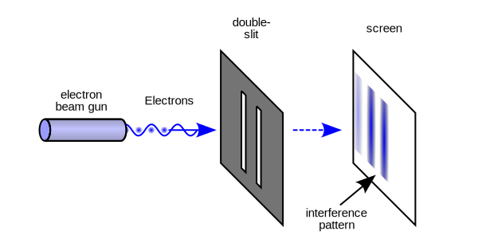
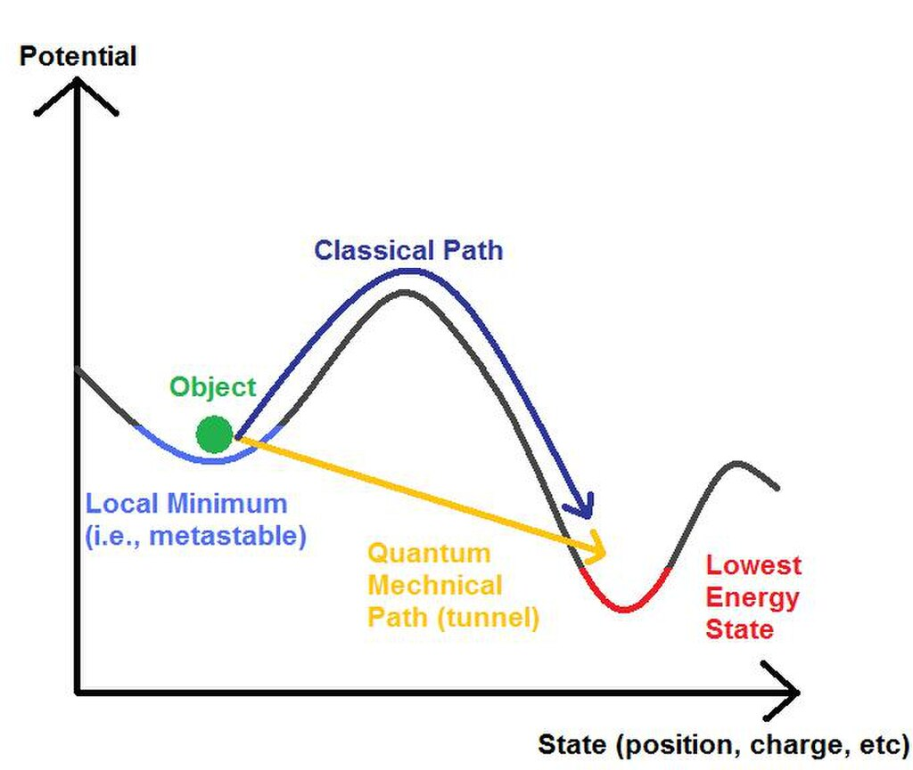
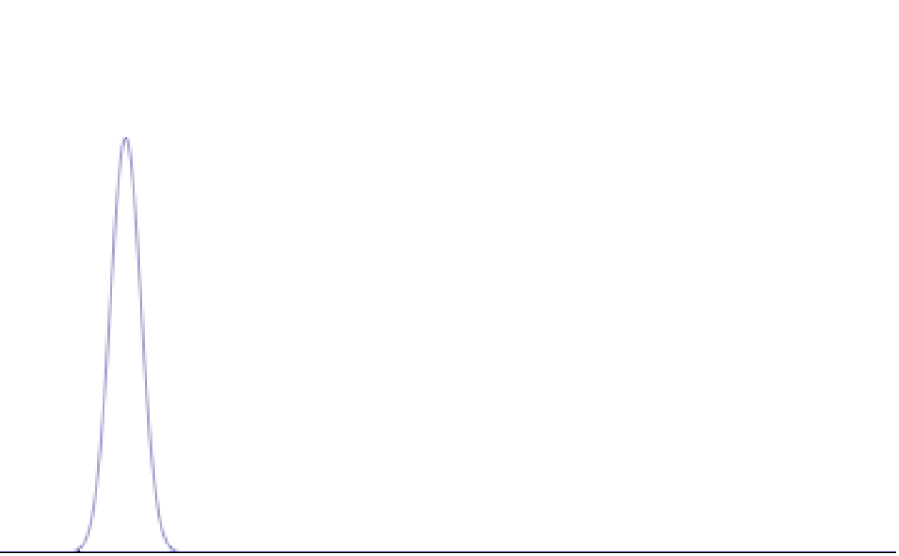
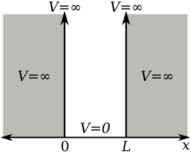
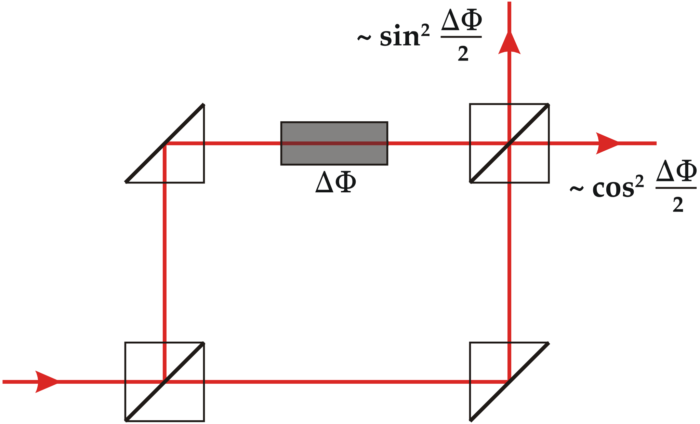
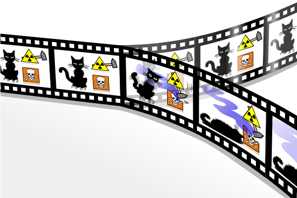
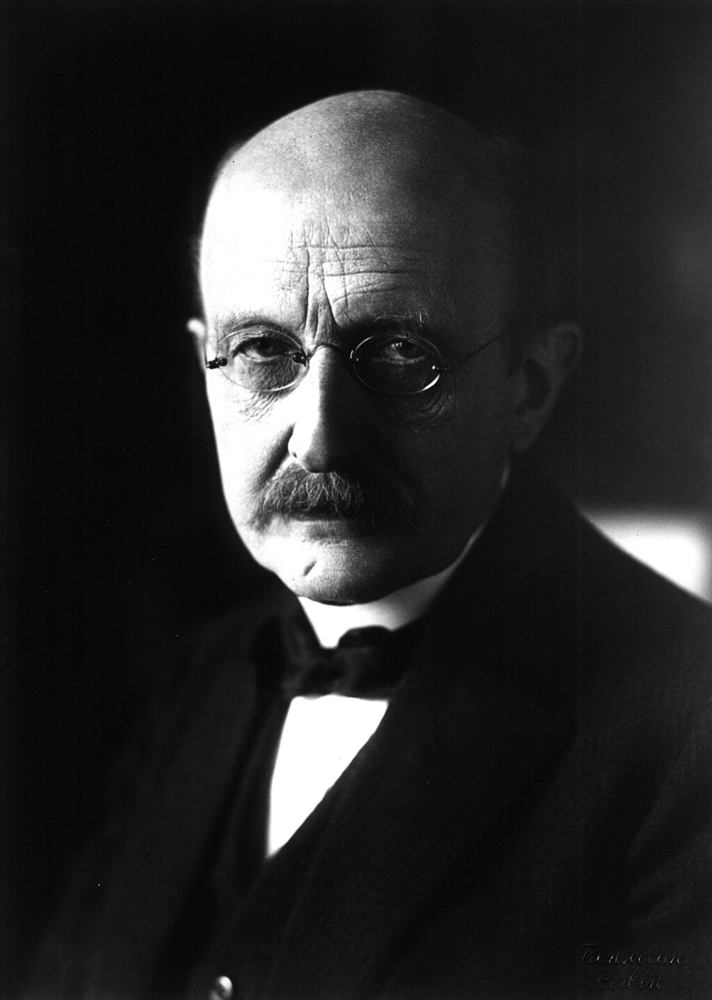
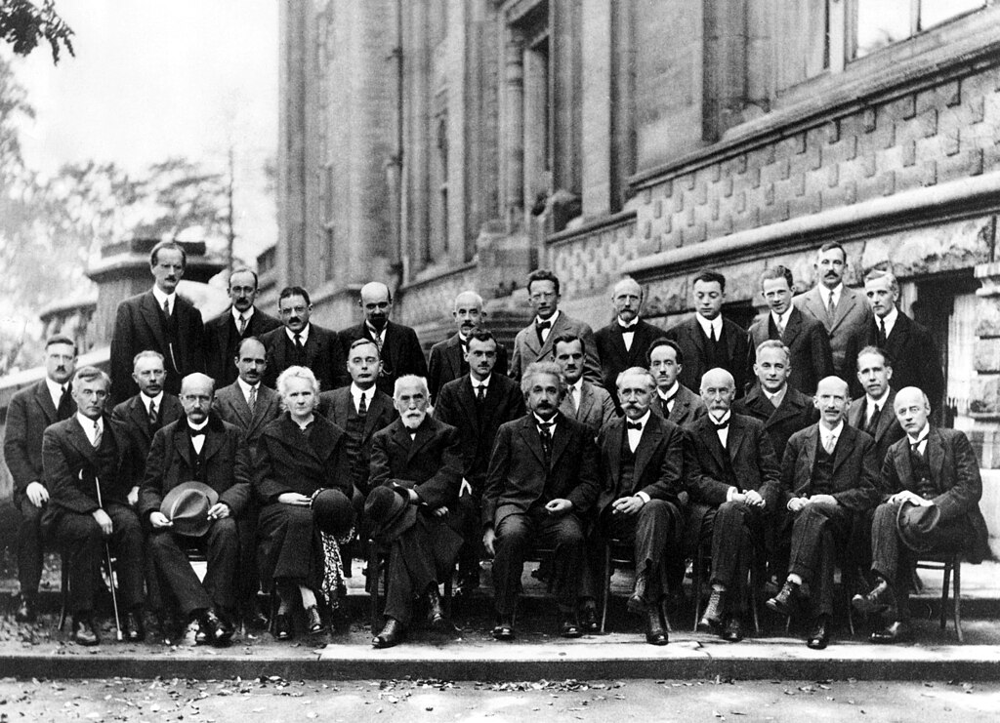

[Wave functions](https://en.wikipedia.org/wiki/Wave_function "Wave function") of the [electron](https://en.wikipedia.org/wiki/Electron "Electron") in a hydrogen atom at different energy levels. Quantum mechanics cannot predict the exact location of a particle in space, only the probability of finding it at different locations. The brighter areas represent a higher probability of finding the electron.

**Quantum mechanics** is the fundamental physical [theory](https://en.wikipedia.org/wiki/Scientific_theory "Scientific theory") that describes the behavior of matter and of light; its unusual characteristics typically occur at and below the scale of [atoms](https://en.wikipedia.org/wiki/Atom "Atom"). It is the foundation of all **quantum physics**, which includes [quantum chemistry](https://en.wikipedia.org/wiki/Quantum_chemistry "Quantum chemistry"), [quantum biology](https://en.wikipedia.org/wiki/Quantum_biology "Quantum biology"), [quantum field theory](https://en.wikipedia.org/wiki/Quantum_field_theory "Quantum field theory"), [quantum technology](https://en.wikipedia.org/wiki/Quantum_technology "Quantum technology"), and [quantum information science](https://en.wikipedia.org/wiki/Quantum_information_science "Quantum information science").

Quantum mechanics can describe many systems that [classical physics](https://en.wikipedia.org/wiki/Classical_physics "Classical physics") cannot. Classical physics can describe many aspects of nature at an ordinary ([macroscopic](https://en.wikipedia.org/wiki/Macroscopic "Macroscopic") and [(optical) microscopic](https://en.wikipedia.org/wiki/Microscopic_scale "Microscopic scale")) scale, however is insufficient for describing them at very small [submicroscopic](https://en.wikipedia.org/wiki/Submicroscopic "Submicroscopic") (atomic and [subatomic](https://en.wikipedia.org/wiki/Subatomic "Subatomic")) scales. Classical mechanics can be derived from quantum mechanics as an approximation that is valid at ordinary scales.

**Quantum systems** have [bound](https://en.wikipedia.org/wiki/Bound_state "Bound state") states that are [quantized](https://en.wikipedia.org/wiki/Quantization_\(physics\) "Quantization (physics)") to [discrete values](https://en.wikipedia.org/wiki/Discrete_mathematics "Discrete mathematics") of [energy](https://en.wikipedia.org/wiki/Energy "Energy"), [momentum](https://en.wikipedia.org/wiki/Momentum "Momentum"), [angular momentum](https://en.wikipedia.org/wiki/Angular_momentum "Angular momentum"), and other quantities, in contrast to classical systems where these quantities can be measured continuously. Measurements of quantum systems show characteristics of both [particles](https://en.wikipedia.org/wiki/Particle "Particle") and [waves](https://en.wikipedia.org/wiki/Wave "Wave") ([wave–particle duality](https://en.wikipedia.org/wiki/Wave–particle_duality "Wave–particle duality")), and there are limits to how accurately the value of a physical quantity can be predicted prior to its measurement, given a complete set of initial conditions (the [uncertainty principle](https://en.wikipedia.org/wiki/Uncertainty_principle "Uncertainty principle")).

Quantum mechanics arose gradually from theories to explain observations that could not be reconciled with [classical physics](https://en.wikipedia.org/wiki/Classical_physics "Classical physics"), such as [Max Planck](https://en.wikipedia.org/wiki/Max_Planck "Max Planck")'s solution in 1900 to the [black-body radiation](https://en.wikipedia.org/wiki/Black-body_radiation "Black-body radiation") problem, and the correspondence between energy and frequency in [Albert Einstein](https://en.wikipedia.org/wiki/Albert_Einstein "Albert Einstein")'s [1905 paper](https://en.wikipedia.org/wiki/Annus_Mirabilis_papers#Photoelectric_effect "Annus Mirabilis papers"), which explained the [photoelectric effect](https://en.wikipedia.org/wiki/Photoelectric_effect "Photoelectric effect"). These early attempts to understand microscopic phenomena, now known as the "[old quantum theory](https://en.wikipedia.org/wiki/Old_quantum_theory "Old quantum theory")", led to the full development of quantum mechanics in the mid-1920s by [Niels Bohr](https://en.wikipedia.org/wiki/Niels_Bohr "Niels Bohr"), [Erwin Schrödinger](https://en.wikipedia.org/wiki/Erwin_Schrödinger "Erwin Schrödinger"), [Werner Heisenberg](https://en.wikipedia.org/wiki/Werner_Heisenberg "Werner Heisenberg"), [Max Born](https://en.wikipedia.org/wiki/Max_Born "Max Born"), [Paul Dirac](https://en.wikipedia.org/wiki/Paul_Dirac "Paul Dirac") and others. The modern theory is formulated in various [specially developed mathematical formalisms](https://en.wikipedia.org/wiki/Mathematical_formulations_of_quantum_mechanics "Mathematical formulations of quantum mechanics"). In one of them, a mathematical entity called the [wave function](https://en.wikipedia.org/wiki/Wave_function "Wave function") provides information, in the form of [probability amplitudes](https://en.wikipedia.org/wiki/Probability_amplitude "Probability amplitude"), about what measurements of a particle's energy, momentum, and other physical properties may yield.

## Overview and fundamental concepts

Quantum mechanics allows the calculation of properties and behaviour of [physical systems](https://en.wikipedia.org/wiki/Physical_systems "Physical systems"). It is typically applied to microscopic systems: [molecules](https://en.wikipedia.org/wiki/Molecules "Molecules"), [atoms](https://en.wikipedia.org/wiki/Atoms "Atoms") and [subatomic particles](https://en.wikipedia.org/wiki/Subatomic_particle "Subatomic particle"). It has been demonstrated to hold for complex molecules with thousands of atoms, but its application to human beings raises philosophical problems, such as [Wigner's friend](https://en.wikipedia.org/wiki/Wigner's_friend "Wigner's friend"), and its application to the universe as a whole remains speculative. Predictions of quantum mechanics have been verified experimentally to an extremely high degree of [accuracy](https://en.wikipedia.org/wiki/Accuracy "Accuracy"). For example, the refinement of quantum mechanics for the interaction of light and matter, known as [quantum electrodynamics](https://en.wikipedia.org/wiki/Quantum_electrodynamics "Quantum electrodynamics") (QED), has been [shown to agree with experiment](https://en.wikipedia.org/wiki/Precision_tests_of_QED "Precision tests of QED") to within 1 part in 1012 when predicting the magnetic properties of an electron.

A fundamental feature of the theory is that it usually cannot predict with certainty what will happen, but only gives probabilities. Mathematically, a probability is found by taking the square of the absolute value of a [complex number](https://en.wikipedia.org/wiki/Complex_number "Complex number"), known as a probability amplitude. This is known as the [Born rule](https://en.wikipedia.org/wiki/Born_rule "Born rule"), named after physicist [Max Born](https://en.wikipedia.org/wiki/Max_Born "Max Born"). For example, a quantum particle like an [electron](https://en.wikipedia.org/wiki/Electron "Electron") can be described by a wave function, which associates to each point in space a probability amplitude. Applying the Born rule to these amplitudes gives a [probability density function](https://en.wikipedia.org/wiki/Probability_density_function "Probability density function") for the position that the electron will be found to have when an experiment is performed to measure it. This is the best the theory can do; it cannot say for certain where the electron will be found. The [Schrödinger equation](https://en.wikipedia.org/wiki/Schrödinger_equation "Schrödinger equation") relates the collection of probability amplitudes that pertain to one moment of time to the collection of probability amplitudes that pertain to another.

One consequence of the mathematical rules of quantum mechanics is a tradeoff in predictability between measurable quantities. The most famous form of this [uncertainty principle](https://en.wikipedia.org/wiki/Uncertainty_principle "Uncertainty principle") says that no matter how a quantum particle is prepared or how carefully experiments upon it are arranged, it is impossible to have a precise prediction for a measurement of its position and also at the same time for a measurement of its [momentum](https://en.wikipedia.org/wiki/Momentum "Momentum").

An illustration of the [double-slit experiment](https://en.wikipedia.org/wiki/Double-slit_experiment "Double-slit experiment")

Another consequence of the mathematical rules of quantum mechanics is the phenomenon of [quantum interference](https://en.wikipedia.org/wiki/Quantum_interference "Quantum interference"), which is often illustrated with the [double-slit experiment](https://en.wikipedia.org/wiki/Double-slit_experiment "Double-slit experiment"). In the basic version of this experiment, a [coherent light source](https://en.wikipedia.org/wiki/Coherence_\(physics\) "Coherence (physics)"), such as a [laser](https://en.wikipedia.org/wiki/Laser "Laser") beam, illuminates a plate pierced by two parallel slits, and the light passing through the slits is observed on a screen behind the plate. The wave nature of light causes the light waves passing through the two slits to [interfere](https://en.wikipedia.org/wiki/Interference_\(wave_propagation\) "Interference (wave propagation)"), producing bright and dark bands on the screen – a result that would not be expected if light consisted of classical particles. However, the light is always found to be absorbed at the screen at discrete points, as individual particles rather than waves; the interference pattern appears via the varying density of these particle hits on the screen. Furthermore, versions of the experiment that include detectors at the slits find that each detected [photon](https://en.wikipedia.org/wiki/Photon "Photon") passes through one slit (as would a classical particle), and not through both slits (as would a wave). However, [such experiments](https://en.wikipedia.org/wiki/Double-slit_experiment#Which_way "Double-slit experiment") demonstrate that particles do not form the interference pattern if one detects which slit they pass through. This behavior is known as [wave–particle duality](https://en.wikipedia.org/wiki/Wave–particle_duality "Wave–particle duality"). In addition to light, [electrons](https://en.wikipedia.org/wiki/Electrons "Electrons"), [atoms](https://en.wikipedia.org/wiki/Atoms "Atoms"), and [molecules](https://en.wikipedia.org/wiki/Molecules "Molecules") are all found to exhibit the same dual behavior when fired towards a double slit.

A simplified diagram of [quantum tunneling](https://en.wikipedia.org/wiki/Quantum_tunneling "Quantum tunneling"), a phenomenon by which a particle may move through a barrier which would be impossible under classical mechanics

Another non-classical phenomenon predicted by quantum mechanics is [quantum tunnelling](https://en.wikipedia.org/wiki/Quantum_tunnelling "Quantum tunnelling"): a particle that goes up against a [potential barrier](https://en.wikipedia.org/wiki/Potential_barrier "Potential barrier") can cross it, even if its kinetic energy is smaller than the maximum of the potential. In classical mechanics this particle would be trapped. Quantum tunnelling has several important consequences, enabling [radioactive decay](https://en.wikipedia.org/wiki/Radioactive_decay "Radioactive decay"), [nuclear fusion](https://en.wikipedia.org/wiki/Nuclear_fusion "Nuclear fusion") in stars, and applications such as [scanning tunnelling microscopy](https://en.wikipedia.org/wiki/Scanning_tunnelling_microscopy "Scanning tunnelling microscopy"), [tunnel diode](https://en.wikipedia.org/wiki/Tunnel_diode "Tunnel diode") and [tunnel field-effect transistor](https://en.wikipedia.org/wiki/Tunnel_field-effect_transistor "Tunnel field-effect transistor").

When quantum systems interact, the result can be the creation of [quantum entanglement](https://en.wikipedia.org/wiki/Quantum_entanglement "Quantum entanglement"): their properties become so intertwined that a description of the whole solely in terms of the individual parts is no longer possible. Erwin Schrödinger called entanglement "..._the_ characteristic trait of quantum mechanics, the one that enforces its entire departure from classical lines of thought". Quantum entanglement enables [quantum computing](https://en.wikipedia.org/wiki/Quantum_computing "Quantum computing") and is part of quantum communication protocols, such as [quantum key distribution](https://en.wikipedia.org/wiki/Quantum_key_distribution "Quantum key distribution") and [superdense coding](https://en.wikipedia.org/wiki/Superdense_coding "Superdense coding"). Contrary to popular misconception, entanglement does not allow sending signals [faster than light](https://en.wikipedia.org/wiki/Faster_than_light "Faster than light"), as demonstrated by the [no-communication theorem](https://en.wikipedia.org/wiki/No-communication_theorem "No-communication theorem").

Another possibility opened by entanglement is testing for "[hidden variables](https://en.wikipedia.org/wiki/Hidden_variable_theory "Hidden variable theory")", hypothetical properties more fundamental than the quantities addressed in quantum theory itself, knowledge of which would allow more exact predictions than quantum theory provides. A collection of results, most significantly [Bell's theorem](https://en.wikipedia.org/wiki/Bell's_theorem "Bell's theorem"), have demonstrated that broad classes of such hidden-variable theories are in fact incompatible with quantum physics. According to Bell's theorem, if nature actually operates in accord with any theory of _local_ hidden variables, then the results of a [Bell test](https://en.wikipedia.org/wiki/Bell_test "Bell test") will be constrained in a particular, quantifiable way. Many Bell tests have been performed and they have shown results incompatible with the constraints imposed by local hidden variables.

It is not possible to present these concepts in more than a superficial way without introducing the mathematics involved; understanding quantum mechanics requires not only manipulating complex numbers, but also [linear algebra](https://en.wikipedia.org/wiki/Linear_algebra "Linear algebra"), [differential equations](https://en.wikipedia.org/wiki/Differential_equation "Differential equation"), [group theory](/source/group-theory/ "Group theory"), and other more advanced subjects. Accordingly, this article will present a mathematical formulation of quantum mechanics and survey its application to some useful and oft-studied examples.

## Mathematical formulation

In the mathematically rigorous formulation of quantum mechanics, the state of a quantum mechanical system is a vector $\psi$ belonging to a ([separable](https://en.wikipedia.org/wiki/Separable_space "Separable space")) complex [Hilbert space](https://en.wikipedia.org/wiki/Hilbert_space "Hilbert space") $\mathcal H$. This vector is postulated to be normalized under the Hilbert space inner product, that is, it obeys $\langle \psi,\psi \rangle = 1$, and it is well-defined up to a complex number of modulus 1 (the global phase), that is, $\psi$ and $e^{i\alpha}\psi$ represent the same physical system. In other words, the possible states are points in the [projective space](https://en.wikipedia.org/wiki/Projective_space "Projective space") of a Hilbert space, usually called the [complex projective space](https://en.wikipedia.org/wiki/Complex_projective_space "Complex projective space"). The exact nature of this Hilbert space is dependent on the system – for example, for describing position and momentum the Hilbert space is the space of complex [square-integrable](https://en.wikipedia.org/wiki/Square-integrable "Square-integrable") functions $L^2(\mathbb C)$, while the Hilbert space for the [spin](https://en.wikipedia.org/wiki/Spin_\(physics\) "Spin (physics)") of a single proton is simply the space of two-dimensional complex vectors $\mathbb C^2$ with the usual inner product.

Physical quantities of interest – position, momentum, energy, spin – are represented by observables, which are [Hermitian](https://en.wikipedia.org/wiki/Hermitian_adjoint#Hermitian_operators "Hermitian adjoint") (more precisely, [self-adjoint](https://en.wikipedia.org/wiki/Self-adjoint_operator "Self-adjoint operator")) linear [operators](https://en.wikipedia.org/wiki/Operator_\(physics\) "Operator (physics)") acting on the Hilbert space. A quantum state can be an [eigenvector](https://en.wikipedia.org/wiki/Eigenvector "Eigenvector") of an observable, in which case it is called an [eigenstate](https://en.wikipedia.org/wiki/Eigenstate "Eigenstate"), and the associated [eigenvalue](https://en.wikipedia.org/wiki/Eigenvalue "Eigenvalue") corresponds to the value of the observable in that eigenstate. More generally, a quantum state will be a linear combination of the eigenstates, known as a [quantum superposition](https://en.wikipedia.org/wiki/Quantum_superposition "Quantum superposition"). When an observable is measured, the result will be one of its eigenvalues with probability given by the [Born rule](https://en.wikipedia.org/wiki/Born_rule "Born rule"): in the simplest case the eigenvalue $\lambda$ is non-degenerate and the probability is given by $|\langle \vec\lambda,\psi\rangle|^2$, where $\vec\lambda$ is its associated unit-length eigenvector. More generally, the eigenvalue is degenerate and the probability is given by $\langle \psi,P_\lambda\psi\rangle$, where $P_\lambda$ is the projector onto its associated eigenspace. In the continuous case, these formulas give instead the [probability density](https://en.wikipedia.org/wiki/Probability_density "Probability density").

After the [measurement](https://en.wikipedia.org/wiki/Measurement_in_quantum_mechanics "Measurement in quantum mechanics"), if result $\lambda$ was obtained, the quantum state is postulated to [collapse](https://en.wikipedia.org/wiki/Collapse_of_the_wavefunction "Collapse of the wavefunction") to $\vec\lambda$, in the non-degenerate case, or to $P_\lambda\psi\big/\! \sqrt{\langle \psi,P_\lambda\psi\rangle}$, in the general case. The [probabilistic](https://en.wikipedia.org/wiki/Probabilistic "Probabilistic") nature of quantum mechanics thus stems from the act of measurement. This is one of the most debated aspects of quantum theory, with different [interpretations of quantum mechanics](https://en.wikipedia.org/wiki/Interpretations_of_quantum_mechanics "Interpretations of quantum mechanics") giving radically different answers to questions regarding quantum-state collapse, as discussed [below](/source/quantum-mechanics/#Philosophical_implications).

### Time evolution of a quantum state

The time evolution of a quantum state is described by the Schrödinger equation: $$
i\hbar {\frac {\partial}{\partial t}} \psi (t) =H \psi (t).
$$ Here $H$ denotes the [Hamiltonian](https://en.wikipedia.org/wiki/Hamiltonian_\(quantum_mechanics\) "Hamiltonian (quantum mechanics)"), the observable corresponding to the [total energy](https://en.wikipedia.org/wiki/Total_energy "Total energy") of the system, and $\hbar$ is the reduced [Planck constant](https://en.wikipedia.org/wiki/Planck_constant "Planck constant"). The constant $i\hbar$ is introduced so that the Hamiltonian is reduced to the [classical Hamiltonian](https://en.wikipedia.org/wiki/Hamiltonian_mechanics "Hamiltonian mechanics") in cases where the quantum system can be approximated by a classical system; the ability to make such an approximation in certain limits is called the [correspondence principle](https://en.wikipedia.org/wiki/Correspondence_principle "Correspondence principle").

The solution of this differential equation is given by $$
\psi(t) = e^{-iHt/\hbar }\psi(0).
$$ The operator $U(t) = e^{-iHt/\hbar }$ is known as the time-evolution operator, and has the crucial property that it is [unitary](https://en.wikipedia.org/wiki/Unitarity_\(physics\) "Unitarity (physics)"). This time evolution is [deterministic](https://en.wikipedia.org/wiki/Deterministic "Deterministic") in the sense that – given an initial quantum state $\psi(0)$ – it makes a definite prediction of what the quantum state $\psi(t)$ will be at any later time.

![Fig. 1: Probability densities corresponding to the wave functions of an electron in a hydrogen atom possessing definite energy levels (increasing from the top of the image to the bottom: n = 1, 2, 3, ...) and angular momenta (increasing across from left to right: s, p, d, ...). Denser areas correspond to higher probability density in a position measurement.Such wave functions are directly comparable to Chladni's figures of acoustic modes of vibration in classical physics and are modes of oscillation as well, possessing a sharp energy and thus, a definite frequency. The angular momentum and energy are quantized and take only discrete values like those shown – as is the case for resonant frequencies in acoustics.](../media/quantum-mechanics/Atomic-orbital-clouds_spd_m0.png)Fig. 1: [Probability densities](https://en.wikipedia.org/wiki/Probability_density_function "Probability density function") corresponding to the wave functions of an electron in a hydrogen atom possessing definite energy levels (increasing from the top of the image to the bottom: _n_ = 1, 2, 3, ...) and angular momenta (increasing across from left to right: _s_, _p_, _d_, ...). Denser areas correspond to higher probability density in a position measurement.Such wave functions are directly comparable to [Chladni's figures](https://en.wikipedia.org/wiki/Chladni's_figures "Chladni's figures") of [acoustic](https://en.wikipedia.org/wiki/Acoustics "Acoustics") modes of vibration in classical physics and are modes of oscillation as well, possessing a sharp energy and thus, a definite frequency. The [angular momentum](https://en.wikipedia.org/wiki/Angular_momentum "Angular momentum") and energy are [quantized](https://en.wikipedia.org/wiki/Quantization_\(physics\) "Quantization (physics)") and take _only_ discrete values like those shown – as is the case for [resonant frequencies](https://en.wikipedia.org/wiki/Resonant_frequencies "Resonant frequencies") in acoustics.

Some wave functions produce probability distributions that are independent of time, such as [eigenstates](https://en.wikipedia.org/wiki/Eigenstate "Eigenstate") of the Hamiltonian. Many systems that are treated dynamically in classical mechanics are described by such "static" wave functions. For example, a single electron in an unexcited atom is pictured classically as a particle moving in a circular trajectory around the [atomic nucleus](https://en.wikipedia.org/wiki/Atomic_nucleus "Atomic nucleus"), whereas in quantum mechanics, it is described by a static wave function surrounding the nucleus. For example, the electron wave function for an unexcited hydrogen atom is a spherically symmetric function known as an [_s_ orbital](https://en.wikipedia.org/wiki/Atomic_orbital "Atomic orbital") ([Fig. 1](/source/quantum-mechanics/#fig1)).

Analytic solutions of the Schrödinger equation are known for [very few relatively simple model Hamiltonians](https://en.wikipedia.org/wiki/List_of_quantum-mechanical_systems_with_analytical_solutions "List of quantum-mechanical systems with analytical solutions") including the [quantum harmonic oscillator](https://en.wikipedia.org/wiki/Quantum_harmonic_oscillator "Quantum harmonic oscillator"), the [particle in a box](https://en.wikipedia.org/wiki/Particle_in_a_box "Particle in a box"), the [dihydrogen cation](https://en.wikipedia.org/wiki/Dihydrogen_cation "Dihydrogen cation"), and the [hydrogen atom](https://en.wikipedia.org/wiki/Hydrogen_atom "Hydrogen atom"). Even the [helium](https://en.wikipedia.org/wiki/Helium "Helium") atom – which contains just two electrons – has defied all attempts at a fully analytic treatment, admitting no solution in [closed form](https://en.wikipedia.org/wiki/Closed-form_expression "Closed-form expression").

However, there are techniques for finding approximate solutions. One method, called [perturbation theory](https://en.wikipedia.org/wiki/Perturbation_theory_\(quantum_mechanics\) "Perturbation theory (quantum mechanics)"), uses the analytic result for a simple quantum mechanical model to create a result for a related but more complicated model by (for example) the addition of a weak [potential energy](https://en.wikipedia.org/wiki/Potential_energy "Potential energy"). Another approximation method applies to systems for which quantum mechanics produces only small deviations from classical behavior. These deviations can then be computed based on the classical motion.

### Uncertainty principle

One consequence of the basic quantum formalism is the uncertainty principle. In its most familiar form, this states that no preparation of a quantum particle can imply simultaneously precise predictions both for a measurement of its position and for a measurement of its momentum. Both position and momentum are observables, meaning that they are represented by [Hermitian operators](https://en.wikipedia.org/wiki/Hermitian_operators "Hermitian operators"). The position operator $\hat{X}$ and momentum operator $\hat{P}$ do not commute, but rather satisfy the [canonical commutation relation](https://en.wikipedia.org/wiki/Canonical_commutation_relation "Canonical commutation relation"): $$
[\hat{X}, \hat{P}] = i\hbar.
$$ Given a quantum state, the Born rule lets us compute expectation values for both $X$ and $P$, and moreover for powers of them. Defining the uncertainty for an observable by a [standard deviation](https://en.wikipedia.org/wiki/Standard_deviation "Standard deviation"), we have $$
\sigma_X={\textstyle \sqrt{\left\langle X^2 \right\rangle - \left\langle X \right\rangle^2}},
$$ and likewise for the momentum: $$
\sigma_P=\sqrt{\left\langle P^2 \right\rangle - \left\langle P \right\rangle^2}.
$$ The uncertainty principle states that $$
\sigma_X \sigma_P \geq \frac{\hbar}{2}.
$$ Either standard deviation can in principle be made arbitrarily small, but not both simultaneously. This inequality generalizes to arbitrary pairs of self-adjoint operators $A$ and $B$. The [commutator](https://en.wikipedia.org/wiki/Commutator "Commutator") of these two operators is $$
[A,B]=AB-BA,
$$ and this provides the lower bound on the product of standard deviations: $$
\sigma_A \sigma_B \geq \tfrac12 \left|\bigl\langle[A,B]\bigr\rangle \right|.
$$

Another consequence of the canonical commutation relation is that the position and momentum operators are [Fourier transforms](https://en.wikipedia.org/wiki/Fourier_transform#Uncertainty_principle "Fourier transform") of each other, so that a description of an object according to its momentum is the Fourier transform of its description according to its position. The fact that dependence in momentum is the Fourier transform of the dependence in position means that the momentum operator is equivalent (up to an $i/\hbar$ factor) to taking the derivative according to the position, since in Fourier analysis [differentiation corresponds to multiplication in the dual space](https://en.wikipedia.org/wiki/Fourier_transform#Differentiation "Fourier transform"). This is why in quantum equations in position space, the momentum $p_i$ is replaced by $-i \hbar \frac {\partial}{\partial x}$, and in particular in the [non-relativistic Schrödinger equation in position space](https://en.wikipedia.org/wiki/Schrödinger_equation#Equation "Schrödinger equation") the momentum-squared term is replaced with a Laplacian times $-\hbar^2$.

### Composite systems and entanglement

When two different quantum systems are considered together, the Hilbert space of the combined system is the [tensor product](https://en.wikipedia.org/wiki/Tensor_product "Tensor product") of the Hilbert spaces of the two components. For example, let A and B be two quantum systems, with Hilbert spaces $\mathcal H_A$ and $\mathcal H_B$, respectively. The Hilbert space of the composite system is then $$
\mathcal H_{AB} = \mathcal H_A \otimes \mathcal H_B.
$$ If the state for the first system is the vector $\psi_A$ and the state for the second system is $\psi_B$, then the state of the composite system is $$
\psi_A \otimes \psi_B.
$$ Not all states in the joint Hilbert space $\mathcal H_{AB}$ can be written in this form, however, because the superposition principle implies that linear combinations of these "separable" or "product states" are also valid. For example, if $\psi_A$ and $\phi_A$ are both possible states for system $A$, and likewise $\psi_B$ and $\phi_B$ are both possible states for system $B$, then $$
\tfrac{1}{\sqrt{2}} \left ( \psi_A \otimes \psi_B + \phi_A \otimes \phi_B \right )
$$ is a valid joint state that is not separable. States that are not separable are called [entangled](https://en.wikipedia.org/wiki/Quantum_entanglement "Quantum entanglement").

If the state for a composite system is entangled, it is impossible to describe either component system A or system B by a state vector. One can instead define [reduced density matrices](https://en.wikipedia.org/wiki/Reduced_density_matrix "Reduced density matrix") that describe the statistics that can be obtained by making measurements on either component system alone. This necessarily causes a loss of information, though: knowing the reduced density matrices of the individual systems is not enough to reconstruct the state of the composite system. Just as density matrices specify the state of a subsystem of a larger system, analogously, [positive operator-valued measures](https://en.wikipedia.org/wiki/POVM "POVM") (POVMs) describe the effect on a subsystem of a measurement performed on a larger system. POVMs are extensively used in quantum information theory.

As described above, entanglement is a key feature of models of measurement processes in which an apparatus becomes entangled with the system being measured. Systems interacting with the environment in which they reside generally become entangled with that environment, a phenomenon known as [quantum decoherence](https://en.wikipedia.org/wiki/Quantum_decoherence "Quantum decoherence"). This can explain why, in practice, quantum effects are difficult to observe in systems larger than microscopic.

### Equivalence between formulations

There are many mathematically equivalent formulations of quantum mechanics. One of the oldest and most common is the "[transformation theory](https://en.wikipedia.org/wiki/Transformation_theory_\(quantum_mechanics\) "Transformation theory (quantum mechanics)")" proposed by [Paul Dirac](https://en.wikipedia.org/wiki/Paul_Dirac "Paul Dirac"), which unifies and generalizes the two earliest formulations of quantum mechanics – [matrix mechanics](https://en.wikipedia.org/wiki/Matrix_mechanics "Matrix mechanics") (invented by [Werner Heisenberg](https://en.wikipedia.org/wiki/Werner_Heisenberg "Werner Heisenberg")) and wave mechanics (invented by [Erwin Schrödinger](https://en.wikipedia.org/wiki/Erwin_Schrödinger "Erwin Schrödinger")). An alternative formulation of quantum mechanics is [Feynman](https://en.wikipedia.org/wiki/Feynman "Feynman")'s [path integral formulation](https://en.wikipedia.org/wiki/Path_integral_formulation "Path integral formulation"), in which a quantum-mechanical amplitude is considered as a sum over all possible classical and non-classical paths between the initial and final states. This is the quantum-mechanical counterpart of the [action principle](https://en.wikipedia.org/wiki/Action_principle "Action principle") in classical mechanics.

### Symmetries and conservation laws

The Hamiltonian $H$ is known as the _generator_ of time evolution, since it defines a unitary time-evolution operator $U(t) = e^{-iHt/\hbar}$ for each value of $t$. From this relation between $U(t)$ and $H$, it follows that any observable $A$ that commutes with $H$ will be _conserved_: its expectation value will not change over time. This statement generalizes, as mathematically, any Hermitian operator $A$ can generate a family of unitary operators parameterized by a variable $t$. Under the evolution generated by $A$, any observable $B$ that commutes with $A$ will be conserved. Moreover, if $B$ is conserved by evolution under $A$, then $A$ is conserved under the evolution generated by $B$. This implies a quantum version of the result proven by [Emmy Noether](https://en.wikipedia.org/wiki/Emmy_Noether "Emmy Noether") in classical ([Lagrangian](https://en.wikipedia.org/wiki/Lagrangian_mechanics "Lagrangian mechanics")) mechanics: for every [differentiable](https://en.wikipedia.org/wiki/Differentiable "Differentiable") [symmetry](https://en.wikipedia.org/wiki/Symmetry_\(physics\) "Symmetry (physics)") of a Hamiltonian, there exists a corresponding [conservation law](https://en.wikipedia.org/wiki/Conservation_law "Conservation law").

## Examples

### Free particle

Position space probability density of a Gaussian [wave packet](https://en.wikipedia.org/wiki/Wave_packet "Wave packet") moving in one dimension in free space

The simplest example of a quantum system with a position degree of freedom is a free particle in a single spatial dimension. A free particle is one which is not subject to external influences, so that its Hamiltonian consists only of its kinetic energy: $$
H = \frac{1}{2m}P^2 = - \frac {\hbar ^2}{2m} \frac {d ^2}{dx^2}.
$$ The general solution of the Schrödinger equation is given by $$
\psi (x,t)=\frac {1}{\sqrt {2\pi }}\int _{-\infty}^\infty{\hat {\psi }}(k,0)e^{i(kx -\frac{\hbar k^2}{2m} t)}\mathrm{d}k,
$$ which is a superposition of all possible [plane waves](https://en.wikipedia.org/wiki/Plane_wave "Plane wave") $e^{i(kx -\frac{\hbar k^2}{2m} t)}$, which are eigenstates of the momentum operator with momentum $p = \hbar k$. The coefficients of the superposition are $\hat {\psi }(k,0)$, which is the Fourier transform of the initial quantum state $\psi(x,0)$.

It is not possible for the solution to be a single momentum eigenstate, or a single position eigenstate, as these are not normalizable quantum states. Instead, we can consider a Gaussian [wave packet](https://en.wikipedia.org/wiki/Wave_packet "Wave packet"): $$
\psi(x,0) = \frac{1}{\sqrt[4]{\pi a}}e^{-\frac{x^2}{2a}}
$$ which has Fourier transform, and therefore momentum distribution $$
\hat \psi(k,0) = \sqrt[4]{\frac{a}{\pi}}e^{-\frac{a k^2}{2}}.
$$ We see that as we make $a$ smaller the spread in position gets smaller, but the spread in momentum gets larger. Conversely, by making $a$ larger we make the spread in momentum smaller, but the spread in position gets larger. This illustrates the uncertainty principle.

As we let the Gaussian wave packet evolve in time, we see that its center moves through space at a constant velocity (like a classical particle with no forces acting on it). However, the wave packet will also spread out as time progresses, which means that the position becomes more and more uncertain. The uncertainty in momentum, however, stays constant.

### Particle in a box

1-dimensional potential energy box (or infinite potential well)

The particle in a one-dimensional potential energy box is the most mathematically simple example where restraints lead to the quantization of energy levels. The box is defined as having zero potential energy everywhere _inside_ a certain region, and therefore infinite potential energy everywhere _outside_ that region. For the one-dimensional case in the $x$ direction, the time-independent Schrödinger equation may be written $$
- \frac {\hbar ^2}{2m} \frac {d ^2 \psi}{dx^2} = E \psi.
$$

With the differential operator defined by $$
\hat{p}_x = -i\hbar\frac{d}{dx}
$$the previous equation is evocative of the [classic kinetic energy analogue](https://en.wikipedia.org/wiki/Kinetic_energy#Kinetic_energy_of_rigid_bodies "Kinetic energy"), $$
\frac{1}{2m} \hat{p}_x^2 = E,
$$ with state $\psi$ in this case having energy $E$ coincident with the kinetic energy of the particle.

The general solutions of the Schrödinger equation for the particle in a box are $$
\psi(x) = A e^{ikx} + B e ^{-ikx} \qquad\qquad E = \frac{\hbar^2 k^2}{2m}
$$ or, from [Euler's formula](https://en.wikipedia.org/wiki/Euler's_formula "Euler's formula"), $$
\psi(x) = C \sin(kx) + D \cos(kx).\!
$$

The infinite potential walls of the box determine the values of $C, D,$ and $k$ at $x=0$ and $x=L$ where $\psi$ must be zero. Thus, at $x=0$, $$
\psi(0) = 0 = C\sin(0) + D\cos(0) = D
$$ and $D=0$. At $x=L$, $$
\psi(L) = 0 = C\sin(kL),
$$ in which $C$ cannot be zero as this would conflict with the postulate that $\psi$ has norm 1. Therefore, since $\sin(kL)=0$, $kL$ must be an integer multiple of $\pi$, $$
k = \frac{n\pi}{L}\qquad\qquad n=1,2,3,\ldots.
$$

This constraint on $k$ implies a constraint on the energy levels, yielding $$
E_n = \frac{\hbar^2 \pi^2 n^2}{2mL^2} = \frac{n^2h^2}{8mL^2}.
$$

A [finite potential well](https://en.wikipedia.org/wiki/Finite_potential_well "Finite potential well") is the generalization of the infinite potential well problem to potential wells having finite depth. The finite potential well problem is mathematically more complicated than the infinite particle-in-a-box problem as the wave function is not pinned to zero at the walls of the well. Instead, the wave function must satisfy more complicated mathematical boundary conditions as it is nonzero in regions outside the well. Another related problem is that of the [rectangular potential barrier](https://en.wikipedia.org/wiki/Rectangular_potential_barrier "Rectangular potential barrier"), which furnishes a model for the [quantum tunneling](https://en.wikipedia.org/wiki/Quantum_tunneling "Quantum tunneling") effect that plays an important role in the performance of modern technologies such as [flash memory](https://en.wikipedia.org/wiki/Flash_memory "Flash memory") and [scanning tunneling microscopy](https://en.wikipedia.org/wiki/Scanning_tunneling_microscopy "Scanning tunneling microscopy").

### Harmonic oscillator

![Some trajectories of a harmonic oscillator (i.e. a ball attached to a spring) in classical mechanics (A-B) and quantum mechanics (C-H). In quantum mechanics, the position of the ball is represented by a wave (called the wave function), with the real part shown in blue and the imaginary part shown in red. Some of the trajectories (such as C, D, E, and F) are standing waves (or \"stationary states\"). Each standing-wave frequency is proportional to a possible energy level of the oscillator. This \"energy quantization\" does not occur in classical physics, where the oscillator can have any energy.](../media/quantum-mechanics/QuantumHarmonicOscillatorAnimation.gif)Some trajectories of a [harmonic oscillator](https://en.wikipedia.org/wiki/Harmonic_oscillator "Harmonic oscillator") (i.e. a ball attached to a [spring](https://en.wikipedia.org/wiki/Hooke's_law "Hooke's law")) in [classical mechanics](https://en.wikipedia.org/wiki/Classical_mechanics "Classical mechanics") (A-B) and quantum mechanics (C-H). In quantum mechanics, the position of the ball is represented by a [wave](https://en.wikipedia.org/wiki/Wave "Wave") (called the wave function), with the [real part](https://en.wikipedia.org/wiki/Real_part "Real part") shown in blue and the [imaginary part](https://en.wikipedia.org/wiki/Imaginary_part "Imaginary part") shown in red. Some of the trajectories (such as C, D, E, and F) are [standing waves](https://en.wikipedia.org/wiki/Standing_wave "Standing wave") (or "[stationary states](https://en.wikipedia.org/wiki/Stationary_state "Stationary state")"). Each standing-wave frequency is proportional to a possible [energy level](https://en.wikipedia.org/wiki/Energy_level "Energy level") of the oscillator. This "energy quantization" does not occur in classical physics, where the oscillator can have _any_ energy.

As in the classical case, the potential for the quantum harmonic oscillator is given by $$
V(x)=\frac{1}{2}m\omega^2x^2.
$$

This problem can either be treated by directly solving the Schrödinger equation, which is not trivial, or by using the more elegant "ladder method" first proposed by Paul Dirac. The [eigenstates](https://en.wikipedia.org/wiki/Eigenstate "Eigenstate") are given by $$
\psi_n(x) = \sqrt{\frac{1}{2^n\, n!}} \cdot \left(\frac{m\omega}{\pi \hbar}\right)^{1/4} \cdot e^{
- \frac{m\omega x^2}{2 \hbar}} \cdot H_n\left(\sqrt{\frac{m\omega}{\hbar}} x \right), \qquad
$$ $$
n = 0,1,2,\ldots.
$$ where _Hn_ are the [Hermite polynomials](https://en.wikipedia.org/wiki/Hermite_polynomials "Hermite polynomials") $$
H_n(x)=(-1)^n e^{x^2}\frac{d^n}{dx^n}\left(e^{-x^2}\right),
$$ and the corresponding energy levels are $$
E_n = \hbar \omega \left(n + {1\over 2}\right).
$$

This is another example illustrating the discretization of energy for [bound states](https://en.wikipedia.org/wiki/Bound_state "Bound state").

### Mach–Zehnder interferometer

Schematic of a Mach–Zehnder interferometer

The [Mach–Zehnder interferometer](https://en.wikipedia.org/wiki/Mach–Zehnder_interferometer "Mach–Zehnder interferometer") (MZI) illustrates the concepts of superposition and interference with linear algebra in dimension 2, rather than differential equations. It can be seen as a simplified version of the double-slit experiment, but it is of interest in its own right, for example in the [delayed choice quantum eraser](https://en.wikipedia.org/wiki/Delayed_choice_quantum_eraser "Delayed choice quantum eraser"), the [Elitzur–Vaidman bomb tester](https://en.wikipedia.org/wiki/Elitzur–Vaidman_bomb_tester "Elitzur–Vaidman bomb tester"), and in studies of quantum entanglement.

We can model a photon going through the interferometer by considering that at each point it can be in a superposition of only two paths: the "lower" path which starts from the left, goes straight through both beam splitters, and ends at the top, and the "upper" path which starts from the bottom, goes straight through both beam splitters, and ends at the right. The quantum state of the photon is therefore a vector $\psi \in \mathbb{C}^2$ that is a superposition of the "lower" path $\psi_l = \begin{pmatrix} 1 \\ 0 \end{pmatrix}$ and the "upper" path $\psi_u = \begin{pmatrix} 0 \\ 1 \end{pmatrix}$, that is, $\psi = \alpha \psi_l + \beta \psi_u$ for complex $\alpha,\beta$. In order to respect the postulate that $\langle \psi,\psi\rangle = 1$ we require that $|\alpha|^2+|\beta|^2 = 1$.

Both [beam splitters](https://en.wikipedia.org/wiki/Beam_splitter "Beam splitter") are modelled as the unitary matrix $B = \frac1{\sqrt2}\begin{pmatrix} 1 & i \\ i & 1 \end{pmatrix}$, which means that when a photon meets the beam splitter it will either stay on the same path with a probability amplitude of $1/\sqrt{2}$, or be reflected to the other path with a probability amplitude of $i/\sqrt{2}$. The phase shifter on the upper arm is modelled as the unitary matrix $P = \begin{pmatrix} 1 & 0 \\ 0 & e^{i\Delta\Phi} \end{pmatrix}$, which means that if the photon is on the "upper" path it will gain a relative phase of $\Delta\Phi$, and it will stay unchanged if it is in the lower path.

A photon that enters the interferometer from the left will then be acted upon with a beam splitter $B$, a phase shifter $P$, and another beam splitter $B$, and so end up in the state $$
BPB\psi_l = ie^{i\Delta\Phi/2} \begin{pmatrix} -\sin(\Delta\Phi/2) \\ \cos(\Delta\Phi/2) \end{pmatrix},
$$ and the probabilities that it will be detected at the right or at the top are given respectively by $$
p(u) = |\langle \psi_u, BPB\psi_l \rangle|^2 = \cos^2 \frac{\Delta \Phi}{2},
$$ $$
p(l) = |\langle \psi_l, BPB\psi_l \rangle|^2 = \sin^2 \frac{\Delta \Phi}{2}.
$$ One can therefore use the Mach–Zehnder interferometer to estimate the [phase shift](https://en.wikipedia.org/wiki/Phase_\(waves\) "Phase (waves)") by estimating these probabilities.

It is interesting to consider what would happen if the photon were definitely in either the "lower" or "upper" paths between the beam splitters. This can be accomplished by blocking one of the paths, or equivalently by removing the first beam splitter (and feeding the photon from the left or the bottom, as desired). In both cases, there will be no interference between the paths anymore, and the probabilities are given by $p(u)=p(l) = 1/2$, independently of the phase $\Delta\Phi$. From this we can conclude that the photon does not take one path or another after the first beam splitter, but rather that it is in a genuine quantum superposition of the two paths.

## Applications

Quantum mechanics has had enormous success in explaining many of the features of our universe, with regard to small-scale and discrete quantities and interactions which cannot be explained by [classical methods](https://en.wikipedia.org/wiki/Classical_physics "Classical physics"). Quantum mechanics is often the only theory that can reveal the individual behaviors of the subatomic particles that make up all forms of matter (electrons, [protons](https://en.wikipedia.org/wiki/Proton "Proton"), [neutrons](https://en.wikipedia.org/wiki/Neutron "Neutron"), [photons](https://en.wikipedia.org/wiki/Photon "Photon"), and others). [Solid-state physics](https://en.wikipedia.org/wiki/Solid-state_physics "Solid-state physics") and [materials science](https://en.wikipedia.org/wiki/Materials_science "Materials science") are dependent upon quantum mechanics.

In many aspects, modern technology operates at a scale where quantum effects are significant. Important applications of quantum theory include [quantum chemistry](https://en.wikipedia.org/wiki/Quantum_chemistry "Quantum chemistry"), [quantum optics](https://en.wikipedia.org/wiki/Quantum_optics "Quantum optics"), [quantum computing](https://en.wikipedia.org/wiki/Quantum_computing "Quantum computing"), [superconducting magnets](https://en.wikipedia.org/wiki/Superconducting_magnet "Superconducting magnet"), [light-emitting diodes](https://en.wikipedia.org/wiki/Light-emitting_diode "Light-emitting diode"), the [optical amplifier](https://en.wikipedia.org/wiki/Optical_amplifier "Optical amplifier") and the laser, the [transistor](https://en.wikipedia.org/wiki/Transistor "Transistor") and [semiconductors](https://en.wikipedia.org/wiki/Semiconductor "Semiconductor") such as the [microprocessor](https://en.wikipedia.org/wiki/Microprocessor "Microprocessor"), [medical and research imaging](https://en.wikipedia.org/wiki/Medical_imaging "Medical imaging") such as [magnetic resonance imaging](https://en.wikipedia.org/wiki/Magnetic_resonance_imaging "Magnetic resonance imaging") and [electron microscopy](https://en.wikipedia.org/wiki/Electron_microscopy "Electron microscopy"). Explanations for many biological and physical phenomena are rooted in the nature of the chemical bond, most notably the macro-molecule [DNA](https://en.wikipedia.org/wiki/DNA "DNA").

## Relation to other scientific theories

### Classical mechanics

The rules of quantum mechanics assert that the state space of a system is a Hilbert space and that observables of the system are Hermitian operators acting on vectors in that space – although they do not tell us which Hilbert space or which operators. These can be chosen appropriately in order to obtain a quantitative description of a quantum system, a necessary step in making physical predictions. An important guide for making these choices is the [correspondence principle](https://en.wikipedia.org/wiki/Correspondence_principle "Correspondence principle"), a heuristic which states that the predictions of quantum mechanics reduce to those of [classical mechanics](https://en.wikipedia.org/wiki/Classical_mechanics "Classical mechanics") in the regime of large [quantum numbers](https://en.wikipedia.org/wiki/Quantum_number "Quantum number"). One can also start from an established classical model of a particular system, and then try to guess the underlying quantum model that would give rise to the classical model in the correspondence limit. This approach is known as [quantization](https://en.wikipedia.org/wiki/Canonical_quantization "Canonical quantization").

When quantum mechanics was originally formulated, it was applied to models whose correspondence limit was [non-relativistic](https://en.wikipedia.org/wiki/Theory_of_relativity "Theory of relativity") classical mechanics. For instance, the well-known model of the [quantum harmonic oscillator](https://en.wikipedia.org/wiki/Quantum_harmonic_oscillator "Quantum harmonic oscillator") uses an explicitly non-relativistic expression for the [kinetic energy](https://en.wikipedia.org/wiki/Kinetic_energy "Kinetic energy") of the oscillator, and is thus a quantum version of the [classical harmonic oscillator](https://en.wikipedia.org/wiki/Harmonic_oscillator "Harmonic oscillator").

Complications arise with [chaotic systems](https://en.wikipedia.org/wiki/Chaotic_systems "Chaotic systems"), which do not have good quantum numbers, and [quantum chaos](https://en.wikipedia.org/wiki/Quantum_chaos "Quantum chaos") studies the relationship between classical and quantum descriptions in these systems.

[Quantum decoherence](https://en.wikipedia.org/wiki/Quantum_decoherence "Quantum decoherence") is a mechanism through which quantum systems lose [coherence](https://en.wikipedia.org/wiki/Quantum_coherence "Quantum coherence"), and thus become incapable of displaying many typically quantum effects: [quantum superpositions](https://en.wikipedia.org/wiki/Quantum_superposition "Quantum superposition") become simply probabilistic mixtures, and quantum entanglement becomes simply classical correlations. Quantum coherence is not typically evident at macroscopic scales, though at temperatures approaching [absolute zero](https://en.wikipedia.org/wiki/Absolute_zero "Absolute zero") quantum behavior may manifest macroscopically.

Many macroscopic properties of a classical system are a direct consequence of the quantum behavior of its parts. For example, the stability of bulk matter (consisting of atoms and [molecules](https://en.wikipedia.org/wiki/Molecule "Molecule") which would quickly collapse under electric forces alone), the rigidity of solids, and the mechanical, thermal, chemical, optical and magnetic properties of matter are all results of the interaction of [electric charges](https://en.wikipedia.org/wiki/Electric_charge "Electric charge") under the rules of quantum mechanics.

### Special relativity and electrodynamics

Early attempts to merge quantum mechanics with [special relativity](https://en.wikipedia.org/wiki/Special_relativity "Special relativity") involved the replacement of the Schrödinger equation with a covariant equation such as the [Klein–Gordon equation](https://en.wikipedia.org/wiki/Klein–Gordon_equation "Klein–Gordon equation") or the [Dirac equation](https://en.wikipedia.org/wiki/Dirac_equation "Dirac equation"). While these theories were successful in explaining many experimental results, they had certain unsatisfactory qualities stemming from their neglect of the relativistic creation and annihilation of particles. A fully relativistic quantum theory required the development of quantum field theory, which applies quantization to a field (rather than a fixed set of particles). The first complete quantum field theory, [quantum electrodynamics](https://en.wikipedia.org/wiki/Quantum_electrodynamics "Quantum electrodynamics"), provides a fully quantum description of the [electromagnetic interaction](https://en.wikipedia.org/wiki/Electromagnetic_interaction "Electromagnetic interaction"). Quantum electrodynamics is, along with [general relativity](/source/general-relativity/ "General relativity"), one of the most accurate physical theories ever devised.

The full apparatus of quantum field theory is often unnecessary for describing electrodynamic systems. A simpler approach, one that has been used since the inception of quantum mechanics, is to treat [charged](https://en.wikipedia.org/wiki/Electric_charge "Electric charge") particles as quantum mechanical objects being acted on by a classical [electromagnetic field](https://en.wikipedia.org/wiki/Electromagnetic_field "Electromagnetic field"). For example, the elementary quantum model of the [hydrogen atom](https://en.wikipedia.org/wiki/Hydrogen_atom "Hydrogen atom") describes the [electric field](https://en.wikipedia.org/wiki/Electric_field "Electric field") of the hydrogen atom using a classical $\textstyle -e^2/(4 \pi\epsilon_{_0}r)$ [Coulomb potential](https://en.wikipedia.org/wiki/Electric_potential "Electric potential"). Likewise, in a [Stern–Gerlach experiment](https://en.wikipedia.org/wiki/Stern–Gerlach_experiment "Stern–Gerlach experiment"), a charged particle is modeled as a quantum system, while the background magnetic field is described classically. This "semi-classical" approach fails if quantum fluctuations in the electromagnetic field play an important role, such as in the emission of photons by [charged particles](https://en.wikipedia.org/wiki/Charged_particle "Charged particle").

[Quantum field](https://en.wikipedia.org/wiki/Field_\(physics\) "Field (physics)") theories for the [strong nuclear force](https://en.wikipedia.org/wiki/Strong_nuclear_force "Strong nuclear force") and the [weak nuclear force](https://en.wikipedia.org/wiki/Weak_nuclear_force "Weak nuclear force") have also been developed. The quantum field theory of the strong nuclear force is called [quantum chromodynamics](https://en.wikipedia.org/wiki/Quantum_chromodynamics "Quantum chromodynamics"), and describes the interactions of subnuclear particles such as [quarks](https://en.wikipedia.org/wiki/Quark "Quark") and [gluons](https://en.wikipedia.org/wiki/Gluon "Gluon"). The weak nuclear force and the electromagnetic force were unified, in their quantized forms, into a single quantum field theory (known as [electroweak theory](https://en.wikipedia.org/wiki/Electroweak_theory "Electroweak theory")), by the physicists [Abdus Salam](https://en.wikipedia.org/wiki/Abdus_Salam "Abdus Salam"), [Sheldon Glashow](https://en.wikipedia.org/wiki/Sheldon_Glashow "Sheldon Glashow") and [Steven Weinberg](https://en.wikipedia.org/wiki/Steven_Weinberg "Steven Weinberg").

### Relation to general relativity

Even though the predictions of both quantum theory and general relativity have been supported by rigorous and repeated [empirical evidence](https://en.wikipedia.org/wiki/Empirical_evidence "Empirical evidence"), their abstract formalisms contradict each other and they have proven extremely difficult to incorporate into one consistent, cohesive model. Gravity is negligible in many areas of particle physics, so that unification between general relativity and quantum mechanics is not an urgent issue in those particular applications. However, the lack of a correct theory of [quantum gravity](https://en.wikipedia.org/wiki/Quantum_gravity "Quantum gravity") is an important issue in [physical cosmology](https://en.wikipedia.org/wiki/Physical_cosmology "Physical cosmology") and the search by physicists for an elegant "[Theory of Everything](https://en.wikipedia.org/wiki/Theory_of_Everything "Theory of Everything")" (TOE). Consequently, resolving the inconsistencies between both theories has been a major goal of 20th- and 21st-century physics. This TOE would combine not only the models of subatomic physics but also derive the four fundamental forces of nature from a single force or phenomenon.

One proposal for doing so is [string theory](/source/string-theory/ "String theory"), which posits that the [point-like particles](https://en.wikipedia.org/wiki/Point_particle "Point particle") of [particle physics](https://en.wikipedia.org/wiki/Particle_physics "Particle physics") are replaced by [one-dimensional](https://en.wikipedia.org/wiki/Dimension_\(mathematics_and_physics\) "Dimension (mathematics and physics)") objects called [strings](https://en.wikipedia.org/wiki/String_\(physics\) "String (physics)"). String theory describes how these strings propagate through space and interact with each other. On distance scales larger than the string scale, a string looks just like an ordinary particle, with its [mass](https://en.wikipedia.org/wiki/Mass "Mass"), [charge](https://en.wikipedia.org/wiki/Charge_\(physics\) "Charge (physics)"), and other properties determined by the [vibrational](https://en.wikipedia.org/wiki/Vibration "Vibration") state of the string. In string theory, one of the many vibrational states of the string corresponds to the [graviton](https://en.wikipedia.org/wiki/Graviton "Graviton"), a quantum mechanical particle that carries gravitational force.

Another popular theory is [loop quantum gravity](https://en.wikipedia.org/wiki/Loop_quantum_gravity "Loop quantum gravity") (LQG), which describes quantum properties of gravity and is thus a theory of [quantum spacetime](https://en.wikipedia.org/wiki/Quantum_spacetime "Quantum spacetime"). LQG is an attempt to merge and adapt standard quantum mechanics and standard general relativity. This theory describes space as an extremely fine fabric "woven" of finite loops called [spin networks](https://en.wikipedia.org/wiki/Spin_network "Spin network"). The evolution of a spin network over time is called a [spin foam](https://en.wikipedia.org/wiki/Spin_foam "Spin foam"). The characteristic length scale of a spin foam is the [Planck length](https://en.wikipedia.org/wiki/Planck_length "Planck length"), approximately 1.616×10−35 m, and so lengths shorter than the Planck length are not physically meaningful in LQG.

## Philosophical implications

Unsolved problem in physics

Is there a preferred interpretation of quantum mechanics? How does the quantum description of reality, which includes elements such as the "[superposition](https://en.wikipedia.org/wiki/Superposition_principle "Superposition principle") of states" and "[wave function collapse](https://en.wikipedia.org/wiki/Wave_function_collapse "Wave function collapse")", give rise to the reality we perceive?

[More unsolved problems in physics](https://en.wikipedia.org/wiki/List_of_unsolved_problems_in_physics "List of unsolved problems in physics")

Since its inception, the many counter-intuitive aspects and results of quantum mechanics have provoked strong [philosophical](https://en.wikipedia.org/wiki/Philosophical "Philosophical") debates and many [interpretations](https://en.wikipedia.org/wiki/Interpretations_of_quantum_mechanics "Interpretations of quantum mechanics"). The arguments centre on the probabilistic nature of quantum mechanics, the difficulties with [wavefunction collapse](https://en.wikipedia.org/wiki/Wavefunction_collapse "Wavefunction collapse") and the related [measurement problem](https://en.wikipedia.org/wiki/Measurement_problem "Measurement problem"), and [quantum nonlocality](https://en.wikipedia.org/wiki/Quantum_nonlocality "Quantum nonlocality"). Perhaps the only consensus that exists about these issues is that there is no consensus. [Richard Feynman](https://en.wikipedia.org/wiki/Richard_Feynman "Richard Feynman") once said, "I think I can safely say that nobody understands quantum mechanics." According to [Steven Weinberg](https://en.wikipedia.org/wiki/Steven_Weinberg "Steven Weinberg"), "There is now in my opinion no entirely satisfactory interpretation of quantum mechanics."

The views of [Niels Bohr](https://en.wikipedia.org/wiki/Niels_Bohr "Niels Bohr"), Werner Heisenberg and other physicists are often grouped together as the "[Copenhagen interpretation](https://en.wikipedia.org/wiki/Copenhagen_interpretation "Copenhagen interpretation")". According to these views, the probabilistic nature of quantum mechanics is not a _temporary_ feature which will eventually be replaced by a deterministic theory, but is instead a _final_ renunciation of the classical idea of "causality". Bohr in particular emphasized that any well-defined application of the quantum mechanical formalism must always make reference to the experimental arrangement, due to the [complementary](https://en.wikipedia.org/wiki/Complementarity_\(physics\) "Complementarity (physics)") nature of evidence obtained under different experimental situations. Copenhagen-type interpretations were adopted by Nobel laureates in quantum physics, including Bohr, Heisenberg, Schrödinger, Feynman, and [Zeilinger](https://en.wikipedia.org/wiki/Anton_Zeilinger "Anton Zeilinger") as well as 21st-century researchers in quantum foundations.

[Albert Einstein](https://en.wikipedia.org/wiki/Albert_Einstein "Albert Einstein"), himself one of the founders of [quantum theory](https://en.wikipedia.org/wiki/Old_quantum_theory "Old quantum theory"), was troubled by its apparent failure to respect some cherished metaphysical principles, such as [determinism](https://en.wikipedia.org/wiki/Determinism "Determinism") and [locality](https://en.wikipedia.org/wiki/Principle_of_locality "Principle of locality"). Einstein's long-running exchanges with Bohr about the meaning and status of quantum mechanics are now known as the [Bohr–Einstein debates](https://en.wikipedia.org/wiki/Bohr–Einstein_debates "Bohr–Einstein debates"). Einstein believed that underlying quantum mechanics must be a theory that explicitly forbids [action at a distance](https://en.wikipedia.org/wiki/Action_at_a_distance "Action at a distance"). He argued that quantum mechanics was incomplete, a theory that was valid but not fundamental, analogous to how [thermodynamics](https://en.wikipedia.org/wiki/Thermodynamics "Thermodynamics") is valid, but the fundamental theory behind it is [statistical mechanics](https://en.wikipedia.org/wiki/Statistical_mechanics "Statistical mechanics"). In 1935, Einstein and his collaborators [Boris Podolsky](https://en.wikipedia.org/wiki/Boris_Podolsky "Boris Podolsky") and [Nathan Rosen](https://en.wikipedia.org/wiki/Nathan_Rosen "Nathan Rosen") published an argument that the principle of locality implies the incompleteness of quantum mechanics, a [thought experiment](https://en.wikipedia.org/wiki/Thought_experiment "Thought experiment") later termed the [Einstein–Podolsky–Rosen paradox](https://en.wikipedia.org/wiki/Einstein–Podolsky–Rosen_paradox "Einstein–Podolsky–Rosen paradox"). In 1964, [John Bell](https://en.wikipedia.org/wiki/John_Stewart_Bell "John Stewart Bell") showed that EPR's principle of locality, together with determinism, was actually incompatible with quantum mechanics: they implied constraints on the correlations produced by distance systems, now known as [Bell inequalities](https://en.wikipedia.org/wiki/Bell_inequalities "Bell inequalities"), that can be violated by entangled particles. Since then [several experiments](https://en.wikipedia.org/wiki/Bell_test "Bell test") have been performed to obtain these correlations, with the result that they do in fact violate Bell inequalities, and thus falsify the conjunction of locality with determinism.

[Bohmian mechanics](https://en.wikipedia.org/wiki/Bohmian_mechanics "Bohmian mechanics") shows that it is possible to reformulate quantum mechanics to make it deterministic, at the price of making it explicitly nonlocal. It attributes not only a wave function to a physical system but also a real position, which evolves deterministically under a nonlocal guiding equation. The evolution of a physical system is given at all times by the Schrödinger equation together with the guiding equation; there is never a collapse of the wave function. This solves the measurement problem.

The [Schrödinger's cat](https://en.wikipedia.org/wiki/Schrödinger's_cat "Schrödinger's cat") thought experiment can be used to visualize the many-worlds interpretation of quantum mechanics, where a branching of the universe occurs through a superposition of two quantum mechanical states.

Everett's [many-worlds interpretation](https://en.wikipedia.org/wiki/Many-worlds_interpretation "Many-worlds interpretation"), formulated in 1956, holds that _all_ the possibilities described by quantum theory _simultaneously_ occur in a multiverse composed of mostly independent parallel universes. This is a consequence of removing the axiom of the collapse of the wave packet. All possible states of the measured system and the measuring apparatus, together with the observer, are present in a real physical quantum superposition. While the multiverse is deterministic, we perceive non-deterministic behavior governed by probabilities because we do not observe the multiverse as a whole but only one parallel universe at a time. Exactly how this is supposed to work has been the subject of much debate. Several attempts have been made to make sense of this and derive the Born rule, with no consensus on whether they have been successful.

[Relational quantum mechanics](https://en.wikipedia.org/wiki/Relational_quantum_mechanics "Relational quantum mechanics") appeared in the late 1990s as a modern derivative of Copenhagen-type ideas, and [QBism](https://en.wikipedia.org/wiki/QBism "QBism") was developed some years later.

## History

Quantum mechanics was developed in the early decades of the 20th century, driven by the need to explain phenomena that, in some cases, had been observed in earlier times. Scientific inquiry into the wave nature of light began in the 17th and 18th centuries, when scientists such as [Robert Hooke](https://en.wikipedia.org/wiki/Robert_Hooke "Robert Hooke"), [Christiaan Huygens](https://en.wikipedia.org/wiki/Christiaan_Huygens "Christiaan Huygens") and [Leonhard Euler](https://en.wikipedia.org/wiki/Leonhard_Euler "Leonhard Euler") proposed a wave theory of light based on experimental observations. In 1803 English [polymath](https://en.wikipedia.org/wiki/Polymath "Polymath") [Thomas Young](https://en.wikipedia.org/wiki/Thomas_Young_\(scientist\) "Thomas Young (scientist)") described the famous [double-slit experiment](https://en.wikipedia.org/wiki/Young's_interference_experiment "Young's interference experiment"). This experiment played a major role in the general acceptance of the [wave theory of light](https://en.wikipedia.org/wiki/Wave_theory_of_light "Wave theory of light").

During the early 19th century, [chemical](https://en.wikipedia.org/wiki/Chemistry "Chemistry") research by [John Dalton](https://en.wikipedia.org/wiki/John_Dalton "John Dalton") and [Amedeo Avogadro](https://en.wikipedia.org/wiki/Amedeo_Avogadro "Amedeo Avogadro") lent weight to the [atomic theory](https://en.wikipedia.org/wiki/Atomic_theory "Atomic theory") of matter, an idea that [James Clerk Maxwell](https://en.wikipedia.org/wiki/James_Clerk_Maxwell "James Clerk Maxwell"), [Ludwig Boltzmann](https://en.wikipedia.org/wiki/Ludwig_Boltzmann "Ludwig Boltzmann") and others built upon to establish the [kinetic theory of gases](https://en.wikipedia.org/wiki/Kinetic_theory_of_gases "Kinetic theory of gases"). The successes of kinetic theory gave further credence to the idea that matter is composed of atoms, yet the theory also had shortcomings that would only be resolved by the development of quantum mechanics. While the early conception of atoms from [Greek philosophy](https://en.wikipedia.org/wiki/Greek_philosophy "Greek philosophy") had been that they were indivisible units – the word "atom" deriving from the [Greek](https://en.wikipedia.org/wiki/Greek_language "Greek language") for 'uncuttable' – the 19th century saw the formulation of hypotheses about subatomic structure. One important discovery in that regard was [Michael Faraday](https://en.wikipedia.org/wiki/Michael_Faraday "Michael Faraday")'s 1838 observation of a glow caused by an electrical discharge inside a glass tube containing gas at low pressure. [Julius Plücker](https://en.wikipedia.org/wiki/Julius_Plücker "Julius Plücker"), [Johann Wilhelm Hittorf](https://en.wikipedia.org/wiki/Johann_Wilhelm_Hittorf "Johann Wilhelm Hittorf") and [Eugen Goldstein](https://en.wikipedia.org/wiki/Eugen_Goldstein "Eugen Goldstein") carried on and improved upon Faraday's work, leading to the identification of [cathode rays](https://en.wikipedia.org/wiki/Cathode_rays "Cathode rays"), which [J. J. Thomson](https://en.wikipedia.org/wiki/J._J._Thomson "J. J. Thomson") found to consist of subatomic particles that would be called electrons.

[Max Planck](https://en.wikipedia.org/wiki/Max_Planck "Max Planck") is considered the father of the quantum theory.

The [black-body radiation](https://en.wikipedia.org/wiki/Black-body_radiation "Black-body radiation") problem was discovered by [Gustav Kirchhoff](https://en.wikipedia.org/wiki/Gustav_Kirchhoff "Gustav Kirchhoff") in 1859. In 1900, Max Planck proposed the hypothesis that energy is radiated and absorbed in discrete "quanta" (or energy packets), yielding a calculation that precisely matched the observed patterns of black-body radiation. The word _quantum_ derives from the [Latin](https://en.wikipedia.org/wiki/Latin "Latin"), meaning "how great" or "how much". According to Planck, quantities of energy could be thought of as divided into "elements" whose size (_E_) would be proportional to their [frequency](https://en.wikipedia.org/wiki/Frequency "Frequency") (_ν_): $$
E = h \nu\
$$, where _h_ is the [Planck constant](https://en.wikipedia.org/wiki/Planck_constant "Planck constant"). Planck cautiously insisted that this was only an aspect of the processes of absorption and emission of radiation and was not the _physical reality_ of the radiation. In fact, he considered his quantum hypothesis a mathematical trick to get the right answer rather than a sizable discovery. However, in 1905 Albert Einstein interpreted Planck's quantum hypothesis [realistically](https://en.wikipedia.org/wiki/Local_realism "Local realism") and used it to explain the [photoelectric effect](https://en.wikipedia.org/wiki/Photoelectric_effect "Photoelectric effect"), in which shining light on certain materials can eject electrons from the material. Niels Bohr then developed Planck's ideas about radiation into a [model of the hydrogen atom](https://en.wikipedia.org/wiki/Bohr_model "Bohr model") that successfully predicted the [spectral lines](https://en.wikipedia.org/wiki/Spectral_line "Spectral line") of hydrogen. Einstein further developed this idea to show that an [electromagnetic wave](https://en.wikipedia.org/wiki/Electromagnetic_wave "Electromagnetic wave") such as light could also be described as a particle (later called the photon), with a discrete amount of energy that depends on its frequency. In his paper "On the Quantum Theory of Radiation", Einstein expanded on the interaction between energy and matter to explain the absorption and emission of energy by atoms. Although overshadowed at the time by his general theory of relativity, this paper articulated the mechanism underlying the stimulated emission of radiation, which became the basis of the laser.

The 1927 [Solvay Conference](https://en.wikipedia.org/wiki/Solvay_Conference "Solvay Conference") in [Brussels](https://en.wikipedia.org/wiki/Brussels "Brussels") was the fifth world physics conference.

This phase is known as the [old quantum theory](https://en.wikipedia.org/wiki/Old_quantum_theory "Old quantum theory"). Never complete or self-consistent, the old quantum theory was rather a set of [heuristic](https://en.wikipedia.org/wiki/Heuristic "Heuristic") corrections to classical mechanics. The theory is now understood as a [semi-classical approximation](https://en.wikipedia.org/wiki/WKB_approximation#Application_to_the_Schrödinger_equation "WKB approximation") to modern quantum mechanics. Notable results from this period include, in addition to the work of Planck, Einstein and Bohr mentioned above, Einstein and [Peter Debye](https://en.wikipedia.org/wiki/Peter_Debye "Peter Debye")'s work on the [specific heat](https://en.wikipedia.org/wiki/Specific_heat "Specific heat") of solids, Bohr and [Hendrika Johanna van Leeuwen](https://en.wikipedia.org/wiki/Hendrika_Johanna_van_Leeuwen "Hendrika Johanna van Leeuwen")'s [proof](https://en.wikipedia.org/wiki/Bohr–Van_Leeuwen_theorem "Bohr–Van Leeuwen theorem") that classical physics cannot account for [diamagnetism](https://en.wikipedia.org/wiki/Diamagnetism "Diamagnetism"), and [Arnold Sommerfeld](https://en.wikipedia.org/wiki/Arnold_Sommerfeld "Arnold Sommerfeld")'s extension of the Bohr model to include special-relativistic effects.

In the mid-1920s quantum mechanics was developed to become the standard formulation for atomic physics. In 1923, the French physicist [Louis de Broglie](https://en.wikipedia.org/wiki/Louis_de_Broglie "Louis de Broglie") put forward his theory of matter waves by stating that particles can exhibit wave characteristics and vice versa. Building on de Broglie's approach, modern quantum mechanics was born in 1925, when the German physicists Werner Heisenberg, Max Born, and [Pascual Jordan](https://en.wikipedia.org/wiki/Pascual_Jordan "Pascual Jordan") developed [matrix mechanics](https://en.wikipedia.org/wiki/Matrix_mechanics "Matrix mechanics") and the Austrian physicist Erwin Schrödinger invented [wave mechanics](https://en.wikipedia.org/wiki/Schrödinger_equation "Schrödinger equation"). Born introduced the probabilistic interpretation of Schrödinger's wave function in July 1926. Thus, the entire field of quantum physics emerged, leading to its wider acceptance at the Fifth [Solvay Conference](https://en.wikipedia.org/wiki/Solvay_Conference "Solvay Conference") in 1927.

By 1930, quantum mechanics had been further unified and formalized by [David Hilbert](https://en.wikipedia.org/wiki/David_Hilbert "David Hilbert"), Paul Dirac and [John von Neumann](https://en.wikipedia.org/wiki/John_von_Neumann "John von Neumann") with greater emphasis on [measurement](https://en.wikipedia.org/wiki/Measurement_in_quantum_mechanics "Measurement in quantum mechanics"), the statistical nature of our knowledge of reality, and [philosophical speculation about the 'observer'](https://en.wikipedia.org/wiki/Interpretations_of_quantum_mechanics "Interpretations of quantum mechanics"). It has since permeated many disciplines, including quantum chemistry, [quantum electronics](https://en.wikipedia.org/wiki/Quantum_electronics "Quantum electronics"), [quantum optics](https://en.wikipedia.org/wiki/Quantum_optics "Quantum optics"), and [quantum information science](https://en.wikipedia.org/wiki/Quantum_information_science "Quantum information science"). It also provides a useful framework for many features of the modern [periodic table of elements](https://en.wikipedia.org/wiki/Periodic_table_of_elements "Periodic table of elements"), and describes the behaviors of [atoms](https://en.wikipedia.org/wiki/Atoms "Atoms") during [chemical bonding](https://en.wikipedia.org/wiki/Chemical_bond "Chemical bond") and the flow of electrons in computer [semiconductors](https://en.wikipedia.org/wiki/Semiconductor "Semiconductor"), and therefore plays a crucial role in many modern technologies. While quantum mechanics was constructed to describe the world of the very small, it is also needed to explain some [macroscopic](https://en.wikipedia.org/wiki/Macroscopic "Macroscopic") phenomena such as [superconductors](https://en.wikipedia.org/wiki/Superconductors "Superconductors") and [superfluids](https://en.wikipedia.org/wiki/Superfluid "Superfluid").

## Explanatory notes
