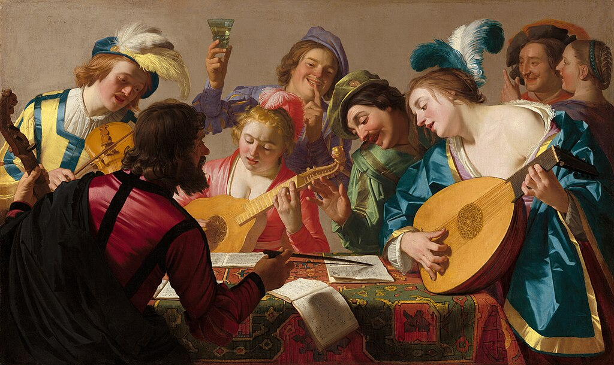
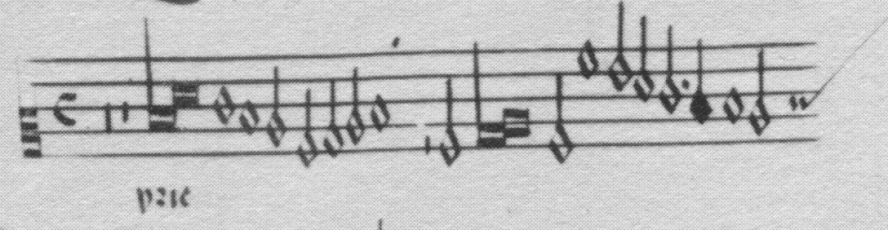
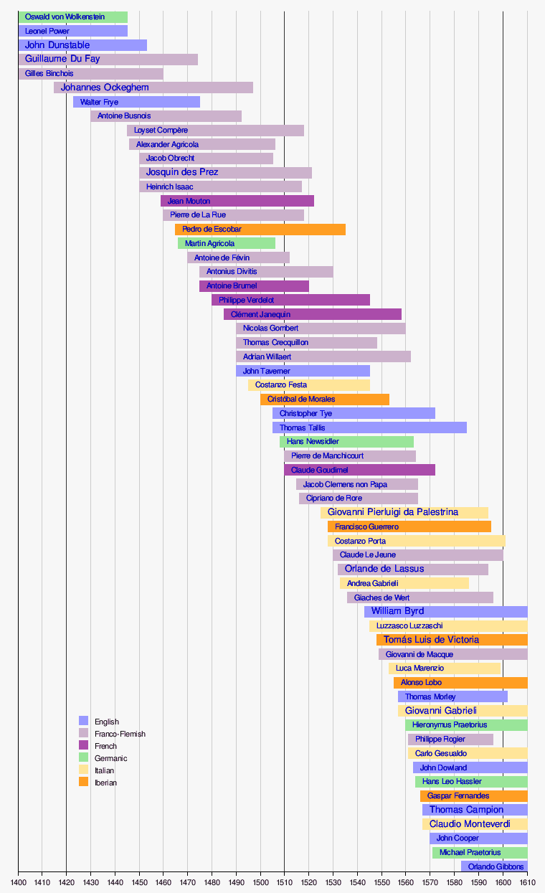
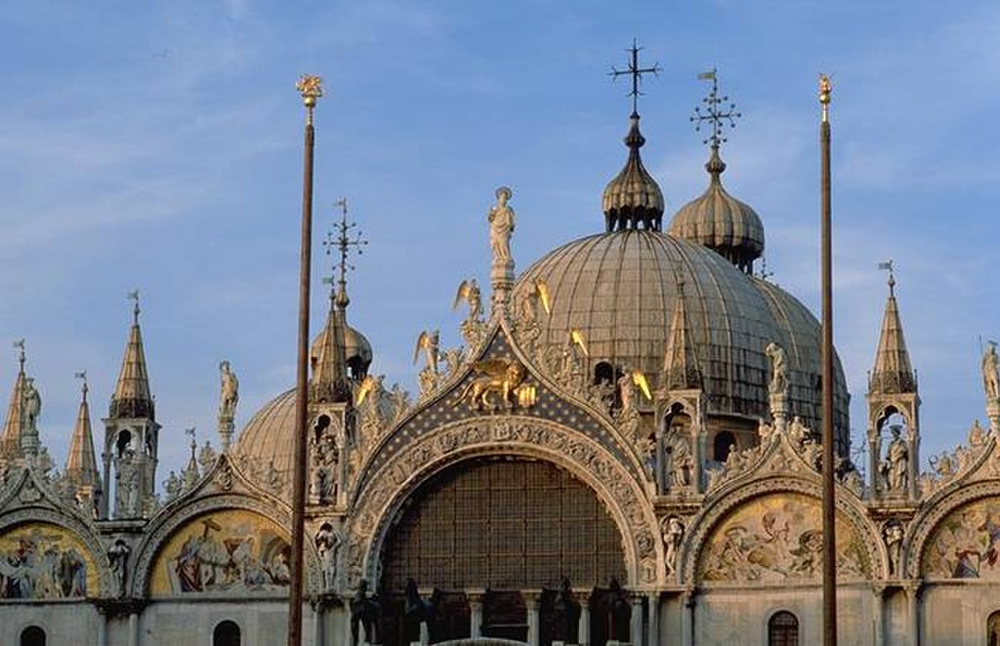
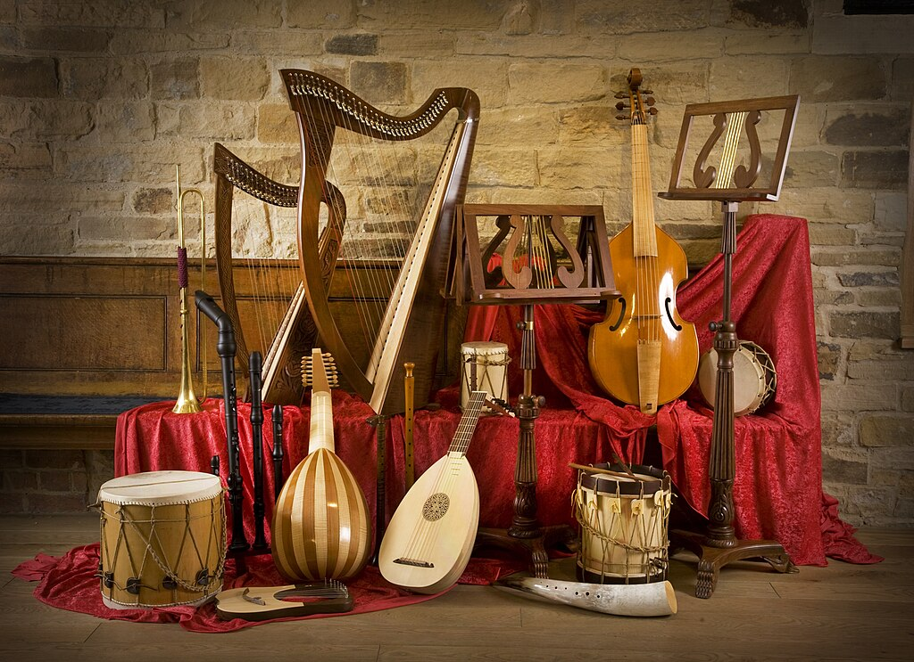
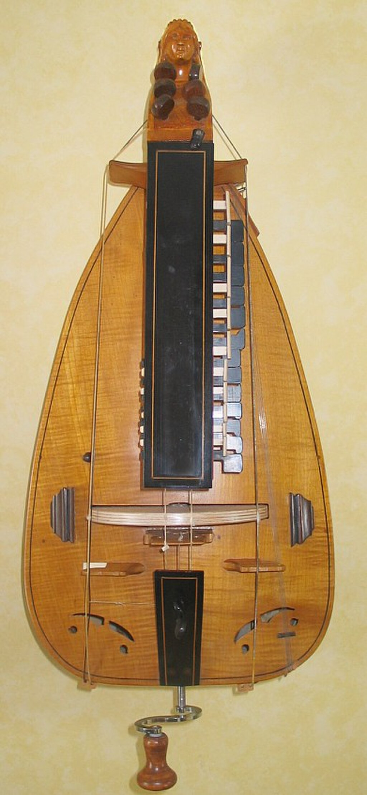
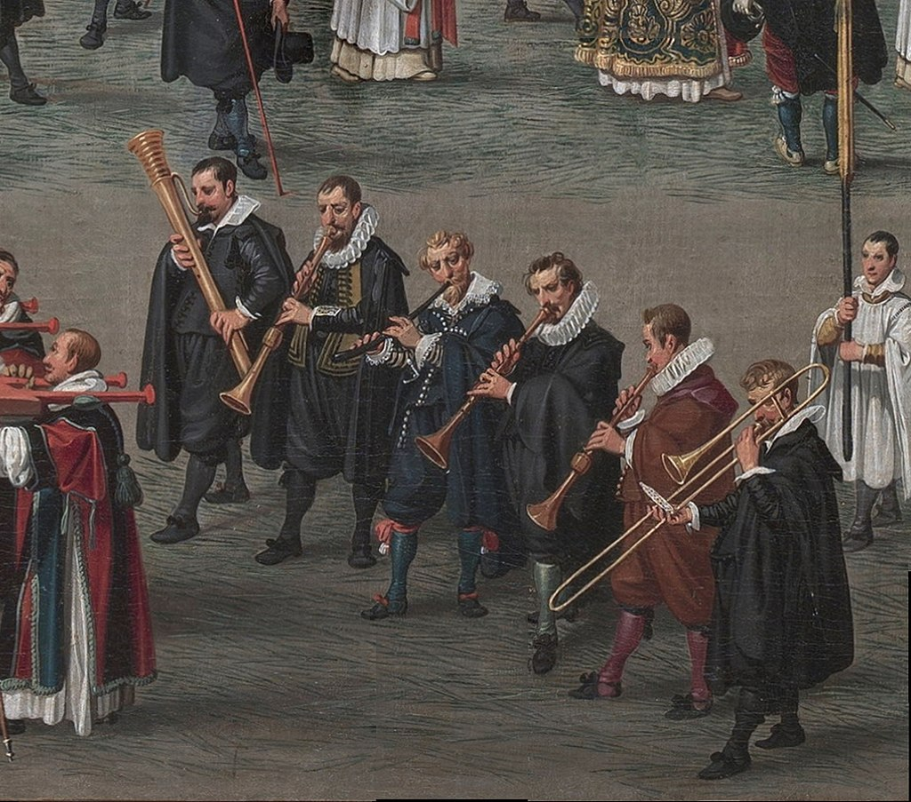
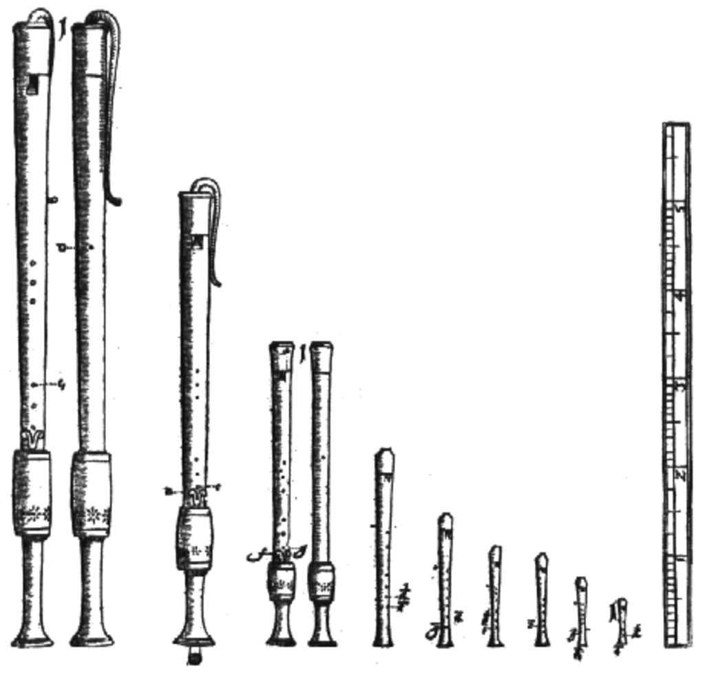

[Gerard van Honthorst](https://en.wikipedia.org/wiki/Gerard_van_Honthorst "Gerard van Honthorst"), _The Concert_ (1623), [National Gallery of Art](https://en.wikipedia.org/wiki/National_Gallery_of_Art "National Gallery of Art"), Washington D.C.

**Renaissance music** is traditionally understood to cover European music of the 15th and 16th centuries, later than the [Renaissance](https://en.wikipedia.org/wiki/Renaissance "Renaissance") era as it is understood in other disciplines. Rather than starting from the early 14th-century _[ars nova](https://en.wikipedia.org/wiki/Ars_nova "Ars nova")_, the [Trecento music](https://en.wikipedia.org/wiki/Music_of_the_Trecento "Music of the Trecento") was treated by [musicology](https://en.wikipedia.org/wiki/Musicology "Musicology") as a coda to [medieval music](/source/medieval-music/ "Medieval music") and the new era dated from the rise of [triadic](https://en.wikipedia.org/wiki/Triad_\(music\) "Triad (music)") harmony and the spread of the _[contenance angloise](https://en.wikipedia.org/wiki/Contenance_angloise "Contenance angloise")_ style from the British Isles to the [Burgundian School](https://en.wikipedia.org/wiki/Burgundian_School "Burgundian School"). A convenient watershed for its end is the adoption of [basso continuo](https://en.wikipedia.org/wiki/Basso_continuo "Basso continuo") at the beginning of the [Baroque](https://en.wikipedia.org/wiki/Baroque_music "Baroque music") period.

The period may be roughly subdivided, with an early period corresponding to the career of [Guillaume Du Fay](https://en.wikipedia.org/wiki/Guillaume_Du_Fay "Guillaume Du Fay") (c. 1397–1474) and the cultivation of [cantilena](https://en.wikipedia.org/wiki/Cantilena "Cantilena") style, a middle dominated by [Franco-Flemish School](https://en.wikipedia.org/wiki/Franco-Flemish_School "Franco-Flemish School") and the four-part textures favored by [Johannes Ockeghem](https://en.wikipedia.org/wiki/Johannes_Ockeghem "Johannes Ockeghem") (1410s or '20s–1497) and [Josquin des Prez](https://en.wikipedia.org/wiki/Josquin_des_Prez "Josquin des Prez") (late 1450s–1521), and culminating during the [Counter-Reformation](https://en.wikipedia.org/wiki/Counter-Reformation "Counter-Reformation") in the florid [counterpoint](https://en.wikipedia.org/wiki/Counterpoint "Counterpoint") of [Palestrina](/source/palestrina/ "Giovanni Pierluigi da Palestrina") (c. 1525–1594) and the [Roman School](https://en.wikipedia.org/wiki/Roman_School "Roman School").

Music was increasingly freed from medieval constraints, and more variety was permitted in range, rhythm, harmony, form, and notation. On the other hand, rules of [counterpoint](https://en.wikipedia.org/wiki/Counterpoint "Counterpoint") became more constrained, particularly with regard to treatment of [dissonances](https://en.wikipedia.org/wiki/Consonance_and_dissonance "Consonance and dissonance"). In the Renaissance, music became a vehicle for personal expression. Composers found ways to make vocal music more expressive of the texts they were setting. [Secular music](https://en.wikipedia.org/wiki/Secular_music "Secular music") absorbed techniques from [sacred music](https://en.wikipedia.org/wiki/Religious_music "Religious music"), and vice versa. Popular secular forms such as the chanson and [madrigal](https://en.wikipedia.org/wiki/Madrigal "Madrigal") spread throughout Europe. Courts employed virtuoso performers, both singers and instrumentalists. Music also became more self-sufficient with its availability in printed form, existing for its own sake.

Precursor versions of many familiar modern instruments (including the violin, guitar, [lute](https://en.wikipedia.org/wiki/Lute "Lute") and keyboard instruments) developed into new forms during the Renaissance. These instruments were modified to respond to the evolution of musical ideas, and they presented new possibilities for composers and musicians to explore. Early forms of modern woodwind and brass instruments like the [bassoon](https://en.wikipedia.org/wiki/Bassoon "Bassoon") and [trombone](https://en.wikipedia.org/wiki/Trombone "Trombone") also appeared, extending the range of sonic color and increasing the sound of instrumental ensembles. During the 15th century, the sound of full [triads](https://en.wikipedia.org/wiki/Triad_\(music\) "Triad (music)") became common, and towards the end of the 16th century the system of [church modes](https://en.wikipedia.org/wiki/Church_mode "Church mode") began to break down entirely, giving way to [functional tonality](https://en.wikipedia.org/wiki/Functional_tonality "Functional tonality") (the system in which songs and pieces are based on musical "keys"), which would dominate Western art music for the next three centuries.

From the Renaissance era, notated secular and sacred music survives in quantity, including vocal and instrumental works and mixed vocal/instrumental works. A wide range of musical styles and genres flourished during the Renaissance, including masses, motets, madrigals, chansons, accompanied songs, instrumental dances, and many others. Beginning in the late 20th century, numerous [early music](https://en.wikipedia.org/wiki/Early_music "Early music") ensembles were formed. Ensembles specializing in music of the Renaissance era give concert tours and make recordings, using modern reproductions of historical instruments and using singing and performing styles which [musicologists](https://en.wikipedia.org/wiki/Musicologist "Musicologist") believe were used during the era.

## Overview

The main characteristics of Renaissance music are:

*   Music based on [modes](https://en.wikipedia.org/wiki/Mode_\(music\) "Mode (music)").
*   Rich texture, with four or more independent melodic parts being performed simultaneously. These interweaving melodic lines, a style called [polyphony](https://en.wikipedia.org/wiki/Polyphony "Polyphony"), is one of the defining features of Renaissance music.
*   Blending, rather than contrasting, melodic lines in the musical texture.
*   Harmony that placed a greater concern on the smooth flow of the music and its [progression of chords](https://en.wikipedia.org/wiki/Chord_progression "Chord progression").

The development of polyphony produced the notable changes in musical instruments that mark the Renaissance musically from the Middle Ages. Its use encouraged the development of larger ensembles and demanded sets of instruments that would blend together across the whole vocal range.

One of the most pronounced features of early Renaissance European art music was the increasing reliance on the [interval](https://en.wikipedia.org/wiki/Interval_\(music\) "Interval (music)") of the third and its inversion, the sixth. (In the [Middle Ages](https://en.wikipedia.org/wiki/Middle_Ages "Middle Ages"), thirds and sixths had been considered dissonances; and consonances were derived only of the perfect intervals: the [perfect fourth](https://en.wikipedia.org/wiki/Perfect_fourth "Perfect fourth"), the [perfect fifth](https://en.wikipedia.org/wiki/Perfect_fifth "Perfect fifth"), the [octave](https://en.wikipedia.org/wiki/Octave "Octave"), and the [unison](https://en.wikipedia.org/wiki/Unison "Unison")). [Polyphony](https://en.wikipedia.org/wiki/Polyphony "Polyphony")—the use of multiple, independent melodic lines played simultaneously—became increasingly elaborate throughout the 14th century, with highly independent voices in both vocal music and instrumental music. The beginning of the 15th century showed simplification, with the composers often striving for smoothness in the melodic parts. This was possible because of a greatly increased vocal range in music. Previously, in the Middle Ages, the narrow vocal range necessitated frequent crossing of parts, thus requiring a greater contrast between them to distinguish the different parts.

The [modal character](https://en.wikipedia.org/wiki/Mode_\(music\) "Mode (music)") of Renaissance music—later replaced by the [tonal](https://en.wikipedia.org/wiki/Tonality "Tonality") approach developing in the subsequent [Baroque music](https://en.wikipedia.org/wiki/Baroque_music "Baroque music") era—began to break down towards the end of the (Renaissance) period with the increased use of [root motions](https://en.wikipedia.org/wiki/Root_\(chord\) "Root (chord)") of fifths or fourths; (see [Circle of fifths](https://en.wikipedia.org/wiki/Circle_of_fifths "Circle of fifths") for details). An example of a [chord progression](https://en.wikipedia.org/wiki/Chord_progression "Chord progression") in which the chord roots move by the interval of a fourth is the chord progression in the key of C Major: "D minor/G Major/C Major"—these are all triads; three-note chords. The movement from the D minor chord to the G Major chord is an interval of a perfect fourth. The movement from the G Major chord to the C Major chord is also an interval of a perfect fourth. This later developed into one of the defining characteristics of tonality during the Baroque era.

### Background

As in the other arts, the music of the period was significantly influenced by the developments which define the [Early Modern](https://en.wikipedia.org/wiki/Early_Modern "Early Modern") period: the rise of [humanistic](https://en.wikipedia.org/wiki/Humanism "Humanism") thought; the recovery of the literary and artistic heritage of [Ancient Greece](https://en.wikipedia.org/wiki/Ancient_Greece "Ancient Greece") and [Ancient Rome](https://en.wikipedia.org/wiki/Ancient_Rome "Ancient Rome"); increased innovation and discovery; the growth of commercial enterprises; the rise of a [bourgeois](https://en.wikipedia.org/wiki/Bourgeois "Bourgeois") class; and the [Protestant Reformation](https://en.wikipedia.org/wiki/Protestant_Reformation "Protestant Reformation"). From this changing society emerged a common, unifying musical language, in particular, the [polyphonic](https://en.wikipedia.org/wiki/Polyphony "Polyphony") style of the [Franco-Flemish school](https://en.wikipedia.org/wiki/Franco-Flemish_school "Franco-Flemish school").

The invention of the [printing press](https://en.wikipedia.org/wiki/Printing_press "Printing press") in 1439 made it cheaper and easier to distribute music and music theory texts on a wider geographic scale and to more people. Prior to the invention of printing, written music and music theory texts had to be hand-copied, a time-consuming and expensive process. Demand for music as entertainment and as a leisure activity for educated amateurs increased with the emergence of a bourgeois class. Dissemination of [chansons](https://en.wikipedia.org/wiki/Chanson "Chanson"), [motets](https://en.wikipedia.org/wiki/Motet "Motet"), and [masses](https://en.wikipedia.org/wiki/Mass_\(music\) "Mass (music)") throughout Europe coincided with the unification of polyphonic practice into the fluid style which culminated in the second half of the sixteenth century in the work of composers such as [Giovanni Pierluigi da Palestrina](/source/palestrina/ "Giovanni Pierluigi da Palestrina"), [Orlande de Lassus](https://en.wikipedia.org/wiki/Orlande_de_Lassus "Orlande de Lassus"), [Thomas Tallis](https://en.wikipedia.org/wiki/Thomas_Tallis "Thomas Tallis"), [William Byrd](https://en.wikipedia.org/wiki/William_Byrd "William Byrd") and [Tomás Luis de Victoria](https://en.wikipedia.org/wiki/Tomás_Luis_de_Victoria "Tomás Luis de Victoria"). Relative political stability and prosperity in the [Low Countries](https://en.wikipedia.org/wiki/Low_Countries "Low Countries"), along with a flourishing system of [music education](https://en.wikipedia.org/wiki/Music_education "Music education") in the area's many churches and cathedrals allowed the training of large numbers of singers, instrumentalists, and composers. These musicians were highly sought throughout Europe, particularly in Italy, where churches and aristocratic courts hired them as composers, performers, and teachers. Since the printing press made it easier to disseminate printed music, by the end of the 16th century, Italy had absorbed the northern musical influences with [Venice](https://en.wikipedia.org/wiki/Venice "Venice"), Rome, and other cities becoming centers of musical activity. This reversed the situation from a hundred years earlier. Opera, a dramatic staged genre in which singers are accompanied by instruments, arose at this time in Florence. Opera was developed as a deliberate attempt to resurrect the music of ancient Greece.

### Genres

Principal liturgical (church-based) musical forms, which remained in use throughout the Renaissance period, were [masses](https://en.wikipedia.org/wiki/Mass_\(music\) "Mass (music)") and [motets](https://en.wikipedia.org/wiki/Motet "Motet"), with some other developments towards the end of the era, especially as composers of [sacred music](https://en.wikipedia.org/wiki/Religious_music "Religious music") began to adopt [secular](https://en.wikipedia.org/wiki/Secular_music "Secular music") (non-religious) musical forms (such as the [madrigal](https://en.wikipedia.org/wiki/Madrigal_\(music\) "Madrigal (music)")) for religious use. The 15th and 16th century masses had two kinds of sources that were used: [monophonic](https://en.wikipedia.org/wiki/Monophony "Monophony") (a single melody line) and [polyphonic](https://en.wikipedia.org/wiki/Polyphony "Polyphony") (multiple, independent melodic lines), with two main forms of elaboration, based on _[cantus firmus](https://en.wikipedia.org/wiki/Cantus_firmus "Cantus firmus")_ practice or, beginning some time around 1500, the new style of "pervasive imitation", in which composers would write music in which the different voices or parts would imitate the melodic and/or rhythmic motifs performed by other voices or parts. Several main types of masses were used:

*   [Cyclic mass](https://en.wikipedia.org/wiki/Cyclic_mass "Cyclic mass") (tenor mass)
*   [Paraphrase mass](https://en.wikipedia.org/wiki/Paraphrase_mass "Paraphrase mass")
*   [Imitation mass](https://en.wikipedia.org/wiki/Parody_mass "Parody mass")

Masses were normally titled by the source from which they borrowed. _[Cantus firmus](https://en.wikipedia.org/wiki/Cantus_firmus "Cantus firmus")_ mass uses the same monophonic melody, usually drawn from chant and usually in the tenor and most often in longer note values than the other voices. Other sacred genres were the [madrigale spirituale](https://en.wikipedia.org/wiki/Madrigale_spirituale "Madrigale spirituale") and the [laude](https://en.wikipedia.org/wiki/Laude "Laude").

During the period, secular (non-religious) music had an increasing distribution, with a wide variety of forms, but one must be cautious about assuming an explosion in variety: since printing made music more widely available, much more has survived from this era than from the preceding medieval era, and probably a rich store of popular music of the late Middle Ages is lost. Secular music was music that was independent of churches. The main types were the German [Lied](https://en.wikipedia.org/wiki/Lied "Lied"), Italian [frottola](https://en.wikipedia.org/wiki/Frottola "Frottola"), the French [chanson](https://en.wikipedia.org/wiki/Chanson "Chanson"), the Italian [madrigal](https://en.wikipedia.org/wiki/Madrigal_\(music\) "Madrigal (music)"), and the Spanish [villancico](https://en.wikipedia.org/wiki/Villancico "Villancico"). Other secular vocal genres included the [caccia](https://en.wikipedia.org/wiki/Caccia_\(music\) "Caccia (music)"), [rondeau](https://en.wikipedia.org/wiki/Rondeau_\(forme_fixe\) "Rondeau (forme fixe)"), [virelai](https://en.wikipedia.org/wiki/Virelai "Virelai"), [bergerette](https://en.wikipedia.org/wiki/Bergerette "Bergerette"), [ballade](https://en.wikipedia.org/wiki/Ballade_\(forme_fixe\) "Ballade (forme fixe)"), [musique mesurée](https://en.wikipedia.org/wiki/Musique_mesurée "Musique mesurée"), [canzonetta](https://en.wikipedia.org/wiki/Canzonetta "Canzonetta"), [villanella](https://en.wikipedia.org/wiki/Villanella "Villanella"), [villotta](https://en.wikipedia.org/wiki/Villotta "Villotta"), and the [lute song](https://en.wikipedia.org/wiki/Lute_song "Lute song"). Mixed forms such as the [motet-chanson](https://en.wikipedia.org/wiki/Motet-chanson "Motet-chanson") and the secular motet also appeared.

Purely instrumental music included [consort](https://en.wikipedia.org/wiki/Consort_of_instruments "Consort of instruments") music for [recorders](https://en.wikipedia.org/wiki/Recorder_\(musical_instrument\) "Recorder (musical instrument)") or [viols](https://en.wikipedia.org/wiki/Viol "Viol") and other instruments, and dances for various ensembles. Common instrumental genres were the [toccata](https://en.wikipedia.org/wiki/Toccata "Toccata"), [prelude](https://en.wikipedia.org/wiki/Prelude_\(music\) "Prelude (music)"), [ricercar](https://en.wikipedia.org/wiki/Ricercar "Ricercar"), and [canzona](https://en.wikipedia.org/wiki/Canzona "Canzona"). Dances played by instrumental ensembles (or sometimes sung) included the [basse danse](https://en.wikipedia.org/wiki/Basse_danse "Basse danse") (It. _bassadanza_), [tourdion](https://en.wikipedia.org/wiki/Tourdion "Tourdion"), [saltarello](https://en.wikipedia.org/wiki/Saltarello "Saltarello"), [pavane](https://en.wikipedia.org/wiki/Pavane "Pavane"), [galliard](https://en.wikipedia.org/wiki/Galliard "Galliard"), [allemande](https://en.wikipedia.org/wiki/Allemande "Allemande"), [courante](https://en.wikipedia.org/wiki/Courante "Courante"), [bransle](https://en.wikipedia.org/wiki/Bransle "Bransle"), [canarie](https://en.wikipedia.org/wiki/Canarie_\(dance\) "Canarie (dance)"), [piva](https://en.wikipedia.org/wiki/Piva_\(dance\) "Piva (dance)"), and [lavolta](https://en.wikipedia.org/wiki/Lavolta "Lavolta"). Music of many genres could be arranged for a solo instrument such as the lute, vihuela, harp, or keyboard. Such arrangements were called [intabulations](https://en.wikipedia.org/wiki/Intabulation "Intabulation") (It. _intavolatura_, Ger. _Intabulierung_).

Towards the end of the period, the early dramatic precursors of opera such as [monody](https://en.wikipedia.org/wiki/Monody "Monody"), the [madrigal comedy](https://en.wikipedia.org/wiki/Madrigal_comedy "Madrigal comedy"), and the [intermedio](https://en.wikipedia.org/wiki/Intermedio "Intermedio") are heard.

### Theory and notation

Ockeghem, Kyrie "Au travail suis," excerpt, showing white mensural notation.

According to [Margaret Bent](https://en.wikipedia.org/wiki/Margaret_Bent "Margaret Bent"): "Renaissance [notation](https://en.wikipedia.org/wiki/Music_notation "Music notation") is under-prescriptive by our \[modern\] standards; when translated into modern form it acquires a prescriptive weight that overspecifies and distorts its original openness". Renaissance compositions were notated only in individual parts; scores were extremely rare, and [barlines](https://en.wikipedia.org/wiki/Bar_\(music\) "Bar (music)") were not used. [Note values](https://en.wikipedia.org/wiki/Note_value "Note value") were generally larger than are in use today; the primary unit of [beat](https://en.wikipedia.org/wiki/Beat_\(music\) "Beat (music)") was the [semibreve](https://en.wikipedia.org/wiki/Semibreve "Semibreve"), or [whole note](https://en.wikipedia.org/wiki/Whole_note "Whole note"). As had been the case since the [Ars Nova](https://en.wikipedia.org/wiki/Ars_Nova "Ars Nova") (see [Medieval music](/source/medieval-music/ "Medieval music")), there could be either two or three of these for each [breve](https://en.wikipedia.org/wiki/Double_whole_note "Double whole note") (a double-whole note), which may be looked on as equivalent to the modern "measure," though it was itself a note value and a measure is not. The situation can be considered this way: it is the same as the rule by which in modern music a quarter-note may equal either two eighth-notes or three, which would be written as a "triplet." By the same reckoning, there could be two or three of the next smallest note, the "minim," (equivalent to the modern "half note") to each semibreve.

These different permutations were called "perfect/imperfect tempus" at the level of the breve–semibreve relationship, "perfect/imperfect prolation" at the level of the semibreve–minim, and existed in all possible combinations with each other. Three-to-one was called "perfect," and two-to-one "imperfect." Rules existed also whereby single notes could be halved or doubled in value ("imperfected" or "altered," respectively) when preceded or followed by other certain notes. Notes with black noteheads (such as [quarter notes](https://en.wikipedia.org/wiki/Quarter_note "Quarter note")) occurred less often. This development of [white mensural notation](https://en.wikipedia.org/wiki/White_mensural_notation "White mensural notation") may be a result of the increased use of paper (rather than [vellum](https://en.wikipedia.org/wiki/Vellum "Vellum")), as the weaker paper was less able to withstand the scratching required to fill in solid noteheads; notation of previous times, written on vellum, had been black. Other colors, and later, filled-in notes, were used routinely as well, mainly to enforce the aforementioned imperfections or alterations and to call for other temporary rhythmical changes.

Accidentals (e.g. added sharps, flats and naturals that change the notes) were not always specified, somewhat as in certain fingering notations for guitar-family instruments ([tablatures](https://en.wikipedia.org/wiki/Tablature "Tablature")) today. However, Renaissance musicians would have been highly trained in [dyadic counterpoint](https://en.wikipedia.org/wiki/Dyadic_counterpoint "Dyadic counterpoint") and thus possessed this and other information necessary to read a score correctly, even if the accidentals were not written in. As such, "what modern notation requires \[accidentals\] would then have been perfectly apparent without notation to a singer versed in counterpoint." (See [musica ficta](https://en.wikipedia.org/wiki/Musica_ficta "Musica ficta").) A singer would interpret his or her part by figuring cadential formulas with other parts in mind, and when singing together, musicians would avoid parallel octaves and parallel fifths or alter their cadential parts in light of decisions by other musicians. It is through contemporary tablatures for various plucked instruments that we have gained much information about which accidentals were performed by the original practitioners.

For information on specific theorists, see [Johannes Tinctoris](https://en.wikipedia.org/wiki/Johannes_Tinctoris "Johannes Tinctoris"), [Franchinus Gaffurius](https://en.wikipedia.org/wiki/Franchinus_Gaffurius "Franchinus Gaffurius"), [Heinrich Glarean](https://en.wikipedia.org/wiki/Heinrich_Glarean "Heinrich Glarean"), [Pietro Aron](https://en.wikipedia.org/wiki/Pietro_Aron "Pietro Aron"), [Nicola Vicentino](https://en.wikipedia.org/wiki/Nicola_Vicentino "Nicola Vicentino"), [Tomás de Santa María](https://en.wikipedia.org/wiki/Tomás_de_Santa_María "Tomás de Santa María"), [Gioseffo Zarlino](https://en.wikipedia.org/wiki/Gioseffo_Zarlino "Gioseffo Zarlino"), [Vicente Lusitano](https://en.wikipedia.org/wiki/Vicente_Lusitano "Vicente Lusitano"), [Vincenzo Galilei](https://en.wikipedia.org/wiki/Vincenzo_Galilei "Vincenzo Galilei"), [Giovanni Artusi](https://en.wikipedia.org/wiki/Giovanni_Artusi "Giovanni Artusi"), [Johannes Nucius](https://en.wikipedia.org/wiki/Johannes_Nucius "Johannes Nucius"), and [Pietro Cerone](https://en.wikipedia.org/wiki/Pietro_Cerone "Pietro Cerone").

### Composers – timeline

## Early period (1400–1470)

The key composers from the early Renaissance era also wrote in a late medieval style, and as such, they are transitional figures. [Leonel Power](https://en.wikipedia.org/wiki/Leonel_Power "Leonel Power") (c. 1370s or 1380s–1445) was an English composer of the late [medieval](/source/medieval-music/ "Medieval music") and early Renaissance music eras. Along with [John Dunstaple](https://en.wikipedia.org/wiki/John_Dunstaple "John Dunstaple"), he was one of the major figures in English music in the early 15th century. Power is the composer best represented in the _[Old Hall Manuscript](https://en.wikipedia.org/wiki/Old_Hall_Manuscript "Old Hall Manuscript")_, one of the only undamaged sources of English music from the early 15th century. He was one of the first composers to set separate movements of the [ordinary of the mass](https://en.wikipedia.org/wiki/Ordinary_of_the_mass "Ordinary of the mass") which were thematically unified and intended for contiguous performance. The Old Hall Manuscript contains his mass based on the [Marian antiphon](https://en.wikipedia.org/wiki/Marian_antiphon "Marian antiphon"), [Alma Redemptoris Mater](https://en.wikipedia.org/wiki/Alma_Redemptoris_Mater "Alma Redemptoris Mater"), in which the antiphon is stated literally in the tenor voice in each movement, without melodic ornaments. This is the only cyclic setting of the mass ordinary which can be attributed to him. He wrote mass cycles, fragments, and single movements and a variety of other sacred works.

[John Dunstaple](https://en.wikipedia.org/wiki/John_Dunstaple "John Dunstaple") (c. 1390–1453) was an English composer of [polyphonic](https://en.wikipedia.org/wiki/Polyphony "Polyphony") music of the late [medieval](/source/medieval-music/ "Medieval music") era and early Renaissance periods. He was one of the most famous composers active in the early 15th century, a near-contemporary of Power, and was widely influential, not only in England but on the continent, especially in the developing style of the [Burgundian School](https://en.wikipedia.org/wiki/Burgundian_School "Burgundian School"). Dunstaple's influence on the continent's musical vocabulary was enormous, particularly considering the relative paucity of his (attributable) works. He was recognized for possessing something never heard before in music of the [Burgundian School](https://en.wikipedia.org/wiki/Burgundian_School "Burgundian School"): _[la contenance angloise](https://en.wikipedia.org/wiki/Contenance_Angloise "Contenance Angloise")_ ("the English countenance"), a term used by the poet [Martin le Franc](https://en.wikipedia.org/wiki/Martin_le_Franc "Martin le Franc") in his _Le Champion des Dames._ Le Franc added that the style influenced [Dufay](https://en.wikipedia.org/wiki/Guillaume_Dufay "Guillaume Dufay") and [Binchois](https://en.wikipedia.org/wiki/Gilles_Binchois "Gilles Binchois"). Writing a few decades later in about 1476, the Flemish composer and music theorist [Tinctoris](https://en.wikipedia.org/wiki/Johannes_Tinctoris "Johannes Tinctoris") reaffirmed the powerful influence Dunstaple had, stressing the "new art" that Dunstaple had inspired. Tinctoris hailed Dunstaple as the _fons et origo_ of the style, its "wellspring and origin."

The _contenance angloise_, while not defined by Martin le Franc, was probably a reference to Dunstaple's stylistic trait of using full [triadic harmony](https://en.wikipedia.org/wiki/Triad_\(music\) "Triad (music)") (three note chords), along with a liking for the [interval of the third](https://en.wikipedia.org/wiki/Major_third "Major third"). Assuming that he had been on the continent with the Duke of Bedford, Dunstaple would have been introduced to French _[fauxbourdon](https://en.wikipedia.org/wiki/Fauxbourdon "Fauxbourdon")_; borrowing some of the sonorities, he created elegant harmonies in his own music using thirds and sixths (an example of a third interval is the notes C and E; an example of a sixth interval is the notes C and A). Taken together, these are seen as defining characteristics of early Renaissance music. Many of these traits may have originated in England, taking root in the Burgundian School around the middle of the century.

Because numerous copies of Dunstaple's works have been found in Italian and German manuscripts, his fame across Europe must have been widespread. Of the works attributed to him only about fifty survive, among which are two complete masses, three connected mass sections, fourteen individual mass sections, twelve complete isorhythmic [motets](https://en.wikipedia.org/wiki/Motet "Motet") and seven settings of [Marian antiphons](https://en.wikipedia.org/wiki/Marian_antiphon "Marian antiphon"), such as _[Alma redemptoris Mater](https://en.wikipedia.org/wiki/Alma_Redemptoris_Mater "Alma Redemptoris Mater")_ and _[Salve Regina, Mater misericordiae](https://en.wikipedia.org/wiki/Salve_Regina "Salve Regina")_. Dunstaple was one of the first to compose masses using a single melody as _[cantus firmus](https://en.wikipedia.org/wiki/Cantus_firmus "Cantus firmus")._ A good example of this technique is his _Missa Rex seculorum_. He is believed to have written secular (non-religious) music, but no songs in the vernacular can be attributed to him with any degree of certainty.

[Oswald von Wolkenstein](https://en.wikipedia.org/wiki/Oswald_von_Wolkenstein "Oswald von Wolkenstein") (c. 1376–1445) is one of the most important composers of the early German Renaissance. He is best known for his well-written melodies, and for his use of three themes: travel, God and [sex](https://en.wikipedia.org/wiki/Sexual_intercourse "Sexual intercourse").

[Gilles Binchois](https://en.wikipedia.org/wiki/Gilles_Binchois "Gilles Binchois") (c. 1400–1460) was a Dutch composer, one of the earliest members of the Burgundian school and one of the three most famous composers of the early 15th century. While often ranked behind his contemporaries [Guillaume Dufay](https://en.wikipedia.org/wiki/Guillaume_Dufay "Guillaume Dufay") and John Dunstaple by contemporary scholars, his works were still cited, borrowed and used as source material after his death. Binchois is considered to be a fine melodist, writing carefully shaped lines which are easy to sing and memorable. His tunes appeared in copies decades after his death and were often used as sources for [mass](https://en.wikipedia.org/wiki/Mass_\(music\) "Mass (music)") composition by later composers. Most of his music, even his sacred music, is simple and clear in outline, sometimes even ascetic (monk-like). A greater contrast between Binchois and the extreme complexity of the _[ars subtilior](https://en.wikipedia.org/wiki/Ars_subtilior "Ars subtilior")_ of the prior (fourteenth) century would be hard to imagine. Most of his secular songs are [rondeaux](https://en.wikipedia.org/wiki/Rondeau_\(music\) "Rondeau (music)"), which became the most common song form during the century. He rarely wrote in [strophic form](https://en.wikipedia.org/wiki/Strophic_form "Strophic form"), and his melodies are generally independent of the rhyme scheme of the verses they are set to. Binchois wrote music for the court, secular songs of love and [chivalry](https://en.wikipedia.org/wiki/Chivalry "Chivalry") that met the expectations and satisfied the taste of the Dukes of [Burgundy](https://en.wikipedia.org/wiki/Duchy_of_Burgundy "Duchy of Burgundy") who employed him, and evidently loved his music accordingly. About half of his extant secular music is found in the Oxford Bodleian Library.

[Guillaume Du Fay](https://en.wikipedia.org/wiki/Guillaume_Du_Fay "Guillaume Du Fay") (c. 1397–1474) was a [Franco-Flemish](https://en.wikipedia.org/wiki/Franco-Flemish_School "Franco-Flemish School") composer of the early Renaissance. The central figure in the [Burgundian School](https://en.wikipedia.org/wiki/Burgundian_School "Burgundian School"), he was regarded by his contemporaries as the leading composer in Europe in the mid-15th century. Du Fay composed in most of the common forms of the day, including [masses](https://en.wikipedia.org/wiki/Mass_\(music\) "Mass (music)"), [motets](https://en.wikipedia.org/wiki/Motet "Motet"), [Magnificats](https://en.wikipedia.org/wiki/Magnificat "Magnificat"), [hymns](https://en.wikipedia.org/wiki/Hymn "Hymn"), simple chant settings in [fauxbourdon](https://en.wikipedia.org/wiki/Fauxbourdon "Fauxbourdon"), and [antiphons](https://en.wikipedia.org/wiki/Antiphon "Antiphon") within the area of sacred music, and [rondeaux](https://en.wikipedia.org/wiki/Rondeau_\(music\) "Rondeau (music)"), [ballades](https://en.wikipedia.org/wiki/Ballade_\(forme_fixe\) "Ballade (forme fixe)"), [virelais](https://en.wikipedia.org/wiki/Virelai "Virelai") and a few other chanson types within the realm of secular music. None of his surviving music is specifically instrumental, although instruments were certainly used for some of his secular music, especially for the lower parts; all of his sacred music is vocal. Instruments may have been used to reinforce the voices in actual performance for almost any of his works. Seven complete masses, 28 individual mass movements, 15 settings of chant used in mass propers, three Magnificats, two Benedicamus Domino settings, 15 antiphon settings (six of them [Marian antiphons](https://en.wikipedia.org/wiki/Marian_antiphon "Marian antiphon")), 27 hymns, 22 motets (13 of these [isorhythmic](https://en.wikipedia.org/wiki/Isorhythm "Isorhythm") in the more angular, austere 14th-century style which gave way to more melodic, sensuous treble-dominated part-writing with phrases ending in the ["under-third" cadence](https://en.wikipedia.org/wiki/Landini_cadence "Landini cadence") in Du Fay's youth) and 87 chansons definitely by him have survived.

Portion of Du Fay's setting of _Ave maris stella_, in fauxbourdon. The top line is a paraphrase of the chant; the middle line, designated "fauxbourdon", (not written) follows the top line but exactly a perfect fourth below. The bottom line is often, but not always, a sixth below the top line; it is embellished, and reaches cadences on the octave.[Play](https://upload.wikimedia.org/wikipedia/commons/transcoded/f/fd/Avemarisstella.mid/Avemarisstella.mid.mp3 "Play audio")[ⓘ](https://en.wikipedia.org/wiki/File:Avemarisstella.mid "File:Avemarisstella.mid")

Many of Du Fay's compositions were simple settings of chant, obviously designed for liturgical use, probably as substitutes for the unadorned chant, and can be seen as chant harmonizations. Often the harmonization used a technique of parallel writing known as [fauxbourdon](https://en.wikipedia.org/wiki/Fauxbourdon "Fauxbourdon"), as in the following example, a setting of the Marian antiphon _[Ave maris stella](https://en.wikipedia.org/wiki/Ave_maris_stella "Ave maris stella")_. Du Fay may have been the first composer to use the term "fauxbourdon" for this simpler compositional style, prominent in 15th-century liturgical music in general and that of the Burgundian school in particular. Most of Du Fay's secular (non-religious) songs follow the [formes fixes](https://en.wikipedia.org/wiki/Formes_fixes "Formes fixes") ([rondeau](https://en.wikipedia.org/wiki/Rondeau_\(forme_fixe\) "Rondeau (forme fixe)"), ballade, and virelai), which dominated secular European music of the 14th and 15th centuries. He also wrote a handful of Italian [ballate](https://en.wikipedia.org/wiki/Ballata "Ballata"), almost certainly while he was in Italy. As is the case with his motets, many of the songs were written for specific occasions, and many are datable, thus supplying useful biographical information. Most of his songs are for three voices, using a texture dominated by the highest voice; the other two voices, unsupplied with text, were probably played by instruments.

Du Fay was one of the last composers to make use of late-medieval polyphonic structural techniques such as [isorhythm](https://en.wikipedia.org/wiki/Isorhythm "Isorhythm"), and one of the first to employ the more mellifluous harmonies, phrasing and melodies characteristic of the early Renaissance. His compositions within the larger genres (masses, motets and chansons) are mostly similar to each other; his renown is largely due to what was perceived as his perfect control of the forms in which he worked, as well as his gift for memorable and singable melody. During the 15th century, he was universally regarded as the greatest composer of his time, an opinion that has largely survived to the present day.

## Middle period (1470–1530)

1611 [woodcut](https://en.wikipedia.org/wiki/Woodcut "Woodcut") of Josquin des Prez, copied from a now-lost oil painting done during his lifetime

During the 16th century, [Josquin des Prez](https://en.wikipedia.org/wiki/Josquin_des_Prez "Josquin des Prez") (c. 1450/1455 – 27 August 1521) gradually acquired the reputation as the greatest composer of the age, with his mastery of technique and expression universally imitated and admired. Writers as diverse as [Baldassare Castiglione](https://en.wikipedia.org/wiki/Baldassare_Castiglione "Baldassare Castiglione") and [Martin Luther](https://en.wikipedia.org/wiki/Martin_Luther "Martin Luther") wrote about his reputation and fame.

In England, the intense [Marian tradition](https://en.wikipedia.org/wiki/Marian_devotions "Marian devotions") led to the [English Votive Style](https://en.wikipedia.org/wiki/English_Votive_Style "English Votive Style") of polyphony, characterised by high [treble](https://en.wikipedia.org/wiki/Choirboy "Choirboy") lines and long solo verses with [melisma](https://en.wikipedia.org/wiki/Melisma "Melisma"). Antiphons were usually performed at the end of the liturgical day after compline. The largest collection of the style is the late-15th-century _[Eton Choirbook](https://en.wikipedia.org/wiki/Eton_Choirbook "Eton Choirbook")_. By 1500, [canticles](https://en.wikipedia.org/wiki/Canticle "Canticle"), [antiphons](https://en.wikipedia.org/wiki/Antiphon "Antiphon") and [Lady Masses](https://en.wikipedia.org/wiki/Votive_Mass "Votive Mass") were composed with up to nine parts in the texture, and [vocal ranges](https://en.wikipedia.org/wiki/Vocal_range "Vocal range") and melodic complexity increased; [Erasmus](https://en.wikipedia.org/wiki/Erasmus "Erasmus") noted the powerful basses of the English choirs of the time, but criticised the excessively-virtuosic treble verses and he did not believe English music to be spiritually edifying as a result.

> "In churches everywhere, there is a great deal of organ music and much singing; but the style of this music seems designed more to delight the ears than to inspire piety. \[...\] Boys, exercising their little voices, break out into shouts, with tremulous tones and undulating inflections up and down, doing nothing but distort the words so that you cannot understand what is being sung." _\- letter to [Ulrich von Hutten](https://en.wikipedia.org/wiki/Ulrich_von_Hutten "Ulrich von Hutten") (1519)_

Characteristics of the votive style, such as elaborate voice lines and melisma, began to be supplanted by more succinct continental traditions by the 1530s. Apart from a brief but strong revival in the 1550s with the reign of [Queen Mary](https://en.wikipedia.org/wiki/Mary_I_of_England "Mary I of England"), the votive style died out due to its complexity, scale and [devotional subject](https://en.wikipedia.org/wiki/Marian_devotions "Marian devotions") coming to odds with the ideals of the [Edwardian](https://en.wikipedia.org/wiki/Edwardian_Reformation "Edwardian Reformation") and [Elizabethan](https://en.wikipedia.org/wiki/Elizabethan_Religious_Settlement "Elizabethan Religious Settlement") reformations. Former late proponents such as [John Sheppard](https://en.wikipedia.org/wiki/John_Sheppard_\(composer\) "John Sheppard (composer)"), [Robert White](https://en.wikipedia.org/wiki/Robert_White_\(composer\) "Robert White (composer)") and [Thomas Tallis](https://en.wikipedia.org/wiki/Thomas_Tallis "Thomas Tallis") began composing in a more modern, imitative style of polyphony closer to that of the late period, such as in the [Roman School](https://en.wikipedia.org/wiki/Roman_School "Roman School"). Nevertheless, the Tudor votive style had enduring influence in the [Anglican](https://en.wikipedia.org/wiki/Church_of_England "Church of England") church: choristers and [lay clerks](https://en.wikipedia.org/wiki/Lay_clerk "Lay clerk") often face each other antiphonally, placed in the [quire's](https://en.wikipedia.org/wiki/Choir_\(architecture\) "Choir (architecture)") _[Decani](https://en.wikipedia.org/wiki/Decani "Decani")_ and _[Cantoris](https://en.wikipedia.org/wiki/Cantoris "Cantoris")_, just as they did in the late [Plantagenet](https://en.wikipedia.org/wiki/Richard_III_of_England "Richard III of England") and early [Tudor](https://en.wikipedia.org/wiki/Tudor_period "Tudor period") periods.

## Late period (1530–1600)

San Marco in the evening. The spacious, resonant interior was one of the inspirations for the music of the Venetian School.

In [Venice](https://en.wikipedia.org/wiki/Venice "Venice"), from about 1530 until around 1600, an impressive polychoral style developed, which gave Europe some of the grandest, most sonorous music composed up until that time, with multiple choirs of singers, brass and strings in different spatial locations in the Basilica [San Marco di Venezia](https://en.wikipedia.org/wiki/San_Marco_di_Venezia "San Marco di Venezia") (see [Venetian School](https://en.wikipedia.org/wiki/Venetian_School_\(music\) "Venetian School (music)")). These multiple revolutions spread over Europe in the next several decades, beginning in Germany and then moving to Spain, France, and England somewhat later, demarcating the beginning of what we now know as the [Baroque](https://en.wikipedia.org/wiki/Baroque_music "Baroque music") musical era.

The [Roman School](https://en.wikipedia.org/wiki/Roman_School "Roman School") was a group of composers of predominantly church music in Rome, spanning the late Renaissance and early Baroque eras. Many of the composers had a direct connection to the Vatican and the papal chapel, though they worked at several churches; stylistically they are often contrasted with the Venetian School of composers, a concurrent movement which was much more progressive. By far the most famous composer of the Roman School is Giovanni Pierluigi da Palestrina. While best known as a prolific composer of masses and motets, he was also an important madrigalist. His ability to bring together the functional needs of the Catholic Church with the prevailing musical styles during the [Counter-Reformation](https://en.wikipedia.org/wiki/Counter-Reformation "Counter-Reformation") period gave him his enduring fame.

The brief but intense flowering of the musical madrigal in England, mostly from 1588 to 1627, along with the composers who produced them, is known as the [English Madrigal School](https://en.wikipedia.org/wiki/English_Madrigal_School "English Madrigal School"). The English madrigals were a cappella, predominantly light in style, and generally began as either copies or direct translations of Italian models. Most were for three to six voices.

_[Musica reservata](https://en.wikipedia.org/wiki/Musica_reservata "Musica reservata")_ is either a style or a performance practice in a cappella vocal music of the latter half of the 16th century, mainly in Italy and southern Germany, involving refinement, exclusivity, and intense emotional expression of sung text.

The cultivation of European music in the Americas began in the 16th century soon after the arrival of the Spanish, and the conquest of Mexico. Although fashioned in European style, uniquely Mexican hybrid works based on native Mexican language and European musical practice appeared very early. Musical practices in New Spain continually coincided with European tendencies throughout the subsequent Baroque and Classical music periods. Among these New World composers were [Hernando Franco](https://en.wikipedia.org/wiki/Hernando_Franco "Hernando Franco"), [Antonio de Salazar](https://en.wikipedia.org/wiki/Antonio_de_Salazar_\(composer\) "Antonio de Salazar (composer)"), and [Manuel de Zumaya](https://en.wikipedia.org/wiki/Manuel_de_Zumaya "Manuel de Zumaya").

In addition, writers since 1932 have observed what they call a _[seconda prattica](https://en.wikipedia.org/wiki/Seconda_pratica "Seconda pratica")_ (an innovative practice involving monodic style and freedom in treatment of dissonance, both justified by the expressive setting of texts) during the late 16th and early 17th centuries.

### Mannerism

In the late 16th century, as the Renaissance era closed, an extremely [manneristic](https://en.wikipedia.org/wiki/Mannerism "Mannerism") style developed. In secular music, especially in the [madrigal](https://en.wikipedia.org/wiki/Madrigal_\(music\) "Madrigal (music)"), there was a trend towards complexity and even extreme chromaticism (as exemplified in madrigals of [Luzzaschi](https://en.wikipedia.org/wiki/Luzzasco_Luzzaschi "Luzzasco Luzzaschi"), [Marenzio](https://en.wikipedia.org/wiki/Luca_Marenzio "Luca Marenzio"), and [Gesualdo](https://en.wikipedia.org/wiki/Carlo_Gesualdo "Carlo Gesualdo")). The term _mannerism_ derives from art history.

### Transition to the Baroque

Beginning in [Florence](https://en.wikipedia.org/wiki/Florence "Florence"), there was an attempt to revive the dramatic and musical forms of Ancient Greece, through the means of [monody](https://en.wikipedia.org/wiki/Monody "Monody"), a form of declaimed music over a simple accompaniment; a more extreme contrast with the preceding polyphonic style would be hard to find; this was also, at least at the outset, a secular trend. These musicians were known as the [Florentine Camerata](https://en.wikipedia.org/wiki/Florentine_Camerata "Florentine Camerata").

We have already noted some of the musical developments that helped to usher in the [Baroque](https://en.wikipedia.org/wiki/Baroque_music "Baroque music"), but for further explanation of this transition, see [antiphon](https://en.wikipedia.org/wiki/Antiphon "Antiphon"), _[stile concertato](https://en.wikipedia.org/wiki/Stile_concertato "Stile concertato")_, [monody](https://en.wikipedia.org/wiki/Monody "Monody"), [madrigal](https://en.wikipedia.org/wiki/Madrigal_\(music\) "Madrigal (music)"), and opera, as well as the works given under "Sources and further reading."

## Instruments

Selection of Renaissance instruments

Many instruments originated during the Renaissance; others were variations of, or improvements upon, instruments that had existed previously. Some have survived to the present day; others have disappeared, only to be recreated in order to perform music of the period on authentic instruments. As in the modern day, instruments may be classified as brass, strings, percussion, and woodwind.

Medieval instruments in Europe had most commonly been used singly, often self-accompanied with a drone, or occasionally in parts. From at least as early as the 13th century through the 15th century there was a division of instruments into _haut_ (loud, shrill, outdoor instruments) and _bas_ (quieter, more intimate instruments). Only two groups of instruments could play freely in both types of ensembles: the [cornett](https://en.wikipedia.org/wiki/Cornett "Cornett") and [sackbut](https://en.wikipedia.org/wiki/Sackbut "Sackbut"), and the tabor and [tambourine](https://en.wikipedia.org/wiki/Tambourine "Tambourine").

At the beginning of the 16th century, instruments were considered to be less important than voices. They were used for dances and to accompany vocal music. Instrumental music remained subordinated to vocal music, and much of its repertory was in varying ways derived from or dependent on vocal models.

### Organs

Various kinds of organs were commonly used in the Renaissance, from large [church organs](https://en.wikipedia.org/wiki/Organ_\(music\)#Chamber_organ "Organ (music)") to small [portatives](https://en.wikipedia.org/wiki/Portative_organ "Portative organ") and reed organs called [regals](https://en.wikipedia.org/wiki/Regal_\(instrument\) "Regal (instrument)").

### Brass

Brass instruments in the Renaissance were traditionally played by professionals. Some of the more common brass instruments that were played:

*   [Slide trumpet](https://en.wikipedia.org/wiki/Slide_trumpet "Slide trumpet"): Similar to the trombone of today except that instead of a section of the body sliding, only a small part of the body near the mouthpiece and the mouthpiece itself is stationary. Also, the body was an S-shape so it was rather unwieldy, but was suitable for the slow dance music which it was most commonly used for.
*   [Cornett](https://en.wikipedia.org/wiki/Cornett "Cornett"): Made of wood and played like the recorder (by blowing in one end and moving the fingers up and down the outside) but using a cup mouthpiece like a trumpet.
*   Trumpet: Early trumpets had no valves, and were limited to the tones present in the [overtone series](https://en.wikipedia.org/wiki/Overtone_series "Overtone series"). They were also made in different sizes.
*   [Sackbut](https://en.wikipedia.org/wiki/Sackbut "Sackbut") (sometimes sackbutt or sagbutt): A different name for the trombone, which replaced the slide trumpet by the middle of the 15th century.

### Strings

Modern French hurdy-gurdy

As a family, strings were used in many circumstances, both sacred and secular. A few members of this family include:

*   [Viol](https://en.wikipedia.org/wiki/Viol "Viol"): This instrument, developed in the 15th century, commonly has six strings. It was usually played with a bow. It has structural qualities similar to the Spanish plucked [vihuela](https://en.wikipedia.org/wiki/Vihuela "Vihuela") (called _viola da mano_ in Italy); its main separating trait is its larger size. This changed the posture of the musician in order to rest it against the floor or between the legs in a manner similar to the cello. Its similarities to the vihuela were sharp waist-cuts, similar frets, a flat back, thin ribs, and identical tuning. When played in this fashion, it was sometimes referred to as "viola da gamba", in order to distinguish it from viols played "on the arm": [viole da braccio](https://en.wikipedia.org/wiki/Violin_family "Violin family"), which evolved into the violin family.
*   [Lyre](https://en.wikipedia.org/wiki/Lyre "Lyre"): Its construction is similar to a small harp, although instead of being plucked, it is strummed with a plectrum. Its strings varied in quantity from four, seven, and ten, depending on the era. It was played with the right hand, while the left hand silenced the notes that were not desired. Newer lyres were modified to be played with a bow.
*   [Irish Harp](https://en.wikipedia.org/wiki/Early_Irish_harp "Early Irish harp"): Also called the Clàrsach in Scottish Gaelic, or the Cláirseach in Irish, during the Middle Ages it was the most popular instrument of Ireland and Scotland. Due to its significance in Irish history, it is seen even on the [Guinness](https://en.wikipedia.org/wiki/Guinness "Guinness") label and is Ireland's national symbol even to this day. To be played it is usually plucked. Its size can vary greatly from a harp that can be played in one's lap to a full-size harp that is placed on the floor
*   [Hurdy-gurdy](https://en.wikipedia.org/wiki/Hurdy-gurdy "Hurdy-gurdy"): (Also known as the wheel fiddle), in which the strings are sounded by a wheel which the strings pass over. Its functionality can be compared to that of a mechanical violin, in that its bow (wheel) is turned by a crank. Its distinctive sound is mainly because of its "drone strings" which provide a constant pitch similar in their sound to that of bagpipes.
*   [Gittern](https://en.wikipedia.org/wiki/Gittern "Gittern") and [mandore](https://en.wikipedia.org/wiki/Mandore_\(instrument\) "Mandore (instrument)"): these instruments were used throughout Europe. Forerunners of modern instruments including the mandolin and guitar.
*   [Lira da braccio](https://en.wikipedia.org/wiki/Lira_da_braccio "Lira da braccio")
*   [Bandora](https://en.wikipedia.org/wiki/Bandora_\(instrument\) "Bandora (instrument)")
*   [Cittern](https://en.wikipedia.org/wiki/Cittern "Cittern")
*   [Lute](https://en.wikipedia.org/wiki/Lute "Lute")
*   [Orpharion](https://en.wikipedia.org/wiki/Orpharion "Orpharion")
*   [Vihuela](https://en.wikipedia.org/wiki/Vihuela "Vihuela")
*   [Clavichord](https://en.wikipedia.org/wiki/Clavichord "Clavichord")
*   [Harpsichord](https://en.wikipedia.org/wiki/Harpsichord "Harpsichord")
*   [Virginal](https://en.wikipedia.org/wiki/Virginal "Virginal")

### Percussion

Some Renaissance percussion instruments include the [triangle](https://en.wikipedia.org/wiki/Triangle_\(musical_instrument\) "Triangle (musical instrument)"), the Jew's harp, the tambourine, the bells, [cymbals](https://en.wikipedia.org/wiki/Cymbal#Ancient_cymbals "Cymbal"), the rumble-pot, and various kinds of drums.

*   [Tambourine](https://en.wikipedia.org/wiki/Tambourine "Tambourine"): The tambourine is a frame drum. The skin that surrounds the frame is called the vellum and produces the beat by striking the surface with the knuckles, fingertips, or hand. It could also be played by shaking the instrument, allowing the tambourine's jingles or pellet bells (if it has either) to "clank" and "jingle".
*   [Jew's harp](https://en.wikipedia.org/wiki/Jew's_harp "Jew's harp"): An instrument that produces sound using shapes of the mouth and attempting to pronounce different vowels with one's mouth. The loop at the bent end of the tongue of the instrument is plucked in different scales of vibration creating different tones.

### Woodwinds (aerophones)

Musicians from 'Procession in honour of Our Lady of Sablon in Brussels.' Early 17th-century Flemish [alta cappella](https://en.wikipedia.org/wiki/Alta_cappella "Alta cappella"). From left to right: bass [dulcian](https://en.wikipedia.org/wiki/Dulcian "Dulcian"), alto [shawm](https://en.wikipedia.org/wiki/Shawm "Shawm"), treble cornett, soprano shawm, alto shawm, tenor [sackbut](https://en.wikipedia.org/wiki/Sackbut "Sackbut").

Woodwind instruments (aerophones) produce sound by means of a vibrating column of air within the pipe. Holes along the pipe allow the player to control the length of the column of air, and hence the pitch. There are several ways of making the air column vibrate, which ways define the subcategories of woodwind instruments.

A player may blow across a mouth hole, as in a transverse flute, or into a whistle mouthpiece, as in a recorder (a duct flute); into a single-reed mouthpiece, as in a modern-day [clarinet](https://en.wikipedia.org/wiki/Clarinet "Clarinet") or [saxophone](https://en.wikipedia.org/wiki/Saxophone "Saxophone"); or into a double-reed mouthpiece, as in an oboe or bassoon. All three methods of tone production can be found in Renaissance woodwinds.

*   [Shawm](https://en.wikipedia.org/wiki/Shawm "Shawm"): A typical oriental shawm is keyless and is about a foot long with seven finger holes and a thumb hole. The pipes were also most commonly made of wood and many of them had carvings and decorations on them. It was the most popular double reed instrument of the Renaissance period; it was commonly used in the streets with drums and trumpets because of its brilliant, piercing, and often deafening sound. To play the shawm a person puts the entire reed in their mouth, puffs out their cheeks, and blows into the pipe whilst breathing through their nose.

Renaissance recorders

*   Reedpipe: Made from a single short length of cane with a mouthpiece, four or five finger holes, and reed fashioned from it. The reed is made by cutting out a small tongue, but leaving the base attached. It is the predecessor of the saxophone and the clarinet.
*   [Hornpipe](https://en.wikipedia.org/wiki/Hornpipe_\(musical_instrument\) "Hornpipe (musical instrument)"): Same as reed pipe but with a bell at the end.
*   [Bagpipe](https://en.wikipedia.org/wiki/Bagpipe "Bagpipe")/Bladderpipe: Believed by the faithful to have been invented by herdsmen who thought using a bag made out of sheep or goat skin would provide continuing air pressure so that when its player is obliged to take a breath, the player need only squeeze the bag tucked underneath their arm to continue the tone. The mouth pipe has a simple round piece of leather hinged on to the bag end of the pipe and acts like a non-return valve. The reed is located inside the long mouthpiece, which would have been known as a [bocal](https://en.wikipedia.org/wiki/Bocal "Bocal"), had it been made of metal and had the reed been on the outside instead of the inside.
*   [Panpipe](https://en.wikipedia.org/wiki/Panpipe "Panpipe"): Employs a number of wooden tubes with a stopper at one end and open on the other. Each tube is a different size (thereby producing a different tone), giving it a range of an octave and a half. The player can then place their lips against the desired tube and blow across it.
*   [Transverse flute](https://en.wikipedia.org/wiki/Transverse_flute "Transverse flute"): The transverse flute is similar to the modern flute with a mouth hole near the stoppered end and finger holes along the body. The player blows across the mouth hole and holds the flute to either the right or left side.
*   [Recorder](https://en.wikipedia.org/wiki/Recorder_\(instrument\) "Recorder (instrument)"): The recorder was a common instrument during the Renaissance period. Rather than a reed, it uses a whistle mouthpiece as its main source of sound production. It is usually made with seven finger holes and a thumb hole.
