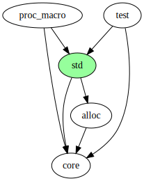
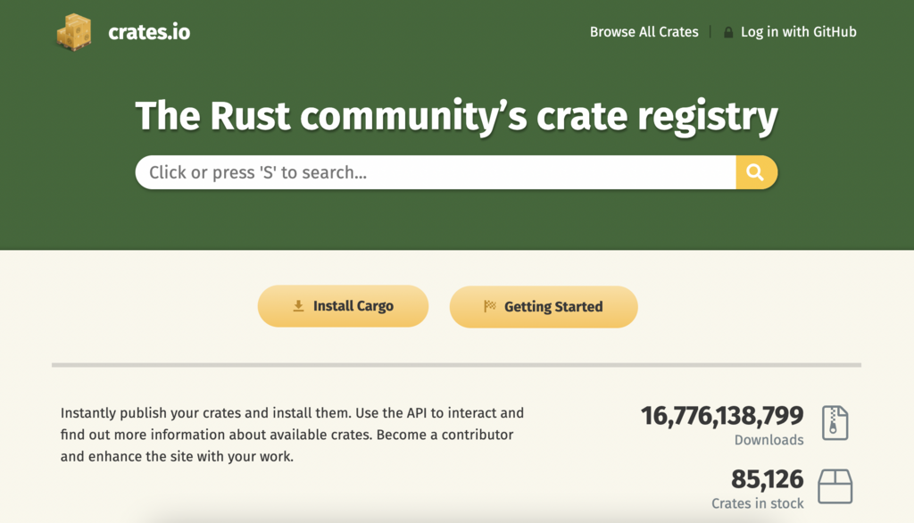
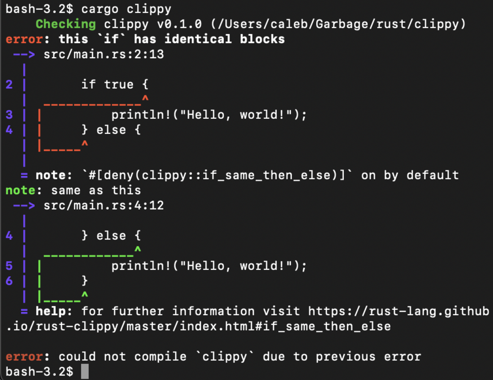

Rust


[Paradigms](https://en.wikipedia.org/wiki/Programming_paradigm "Programming paradigm")

*   [Concurrent](https://en.wikipedia.org/wiki/Concurrent_computing "Concurrent computing")
*   [functional](https://en.wikipedia.org/wiki/Functional_programming "Functional programming")
*   [generic](https://en.wikipedia.org/wiki/Generic_programming "Generic programming")
*   [imperative](https://en.wikipedia.org/wiki/Imperative_programming "Imperative programming")
*   [structured](https://en.wikipedia.org/wiki/Structured_programming "Structured programming")

[Developer](https://en.wikipedia.org/wiki/Software_developer "Software developer")

The Rust Team

First appeared

January 19, 2012 (2012-01-19)

[Stable release](https://en.wikipedia.org/wiki/Software_release_life_cycle "Software release life cycle")

1.95 [](https://www.wikidata.org/wiki/Q575650?uselang=en#P348 "Edit this on Wikidata") / April 16, 2026 (April 16, 2026)


[Typing discipline](https://en.wikipedia.org/wiki/Type_system "Type system")

*   [Affine](https://en.wikipedia.org/wiki/Affine_type_system "Affine type system")
*   [inferred](https://en.wikipedia.org/wiki/Type_inference "Type inference")
*   [nominal](https://en.wikipedia.org/wiki/Nominal_type_system "Nominal type system")
*   [static](https://en.wikipedia.org/wiki/Static_typing "Static typing")
*   [strong](https://en.wikipedia.org/wiki/Strong_and_weak_typing "Strong and weak typing")

Implementation language

[OCaml](https://en.wikipedia.org/wiki/OCaml "OCaml") (2006–2011)
Rust (2012–present)

[Platform](https://en.wikipedia.org/wiki/Computing_platform "Computing platform")

[Cross-platform](https://en.wikipedia.org/wiki/Cross-platform "Cross-platform")

[OS](https://en.wikipedia.org/wiki/Operating_system "Operating system")

[Cross-platform](https://en.wikipedia.org/wiki/Cross-platform "Cross-platform")

[License](https://en.wikipedia.org/wiki/Software_license "Software license")

[MIT](https://en.wikipedia.org/wiki/MIT_License "MIT License"), [Apache 2.0](https://en.wikipedia.org/wiki/Apache_License "Apache License")

[Filename extensions](https://en.wikipedia.org/wiki/Filename_extension "Filename extension")

`.rs`, `.rlib`

Website

[rust-lang.org](https://www.rust-lang.org/)

Influenced by

*   [Alef](https://en.wikipedia.org/wiki/Alef_\(programming_language\) "Alef (programming language)")
*   [BETA](https://en.wikipedia.org/wiki/BETA_\(programming_language\) "BETA (programming language)")
*   [CLU](https://en.wikipedia.org/wiki/CLU_\(programming_language\) "CLU (programming language)")
*   [C#](https://en.wikipedia.org/wiki/C_Sharp_\(programming_language\) "C Sharp (programming language)")
*   [C++](https://en.wikipedia.org/wiki/C++ "C++")
*   [Cyclone](https://en.wikipedia.org/wiki/Cyclone_\(programming_language\) "Cyclone (programming language)")
*   [Elm](https://en.wikipedia.org/wiki/Elm_\(programming_language\) "Elm (programming language)")
*   [Erlang](/source/erlang-language/ "Erlang (programming language)")
*   [Haskell](https://en.wikipedia.org/wiki/Haskell "Haskell")
*   [Hermes](https://en.wikipedia.org/wiki/Hermes_\(programming_language\) "Hermes (programming language)")
*   [Limbo](https://en.wikipedia.org/wiki/Limbo_\(programming_language\) "Limbo (programming language)")
*   [Mesa](https://en.wikipedia.org/wiki/Mesa_\(programming_language\) "Mesa (programming language)")
*   [Napier](https://en.wikipedia.org/wiki/Napier88 "Napier88")
*   [Newsqueak](https://en.wikipedia.org/wiki/Newsqueak "Newsqueak")
*   [NIL](https://en.wikipedia.org/wiki/Typestate_analysis "Typestate analysis")
*   [OCaml](https://en.wikipedia.org/wiki/OCaml "OCaml")
*   [Ruby](https://en.wikipedia.org/wiki/Ruby_\(programming_language\) "Ruby (programming language)")
*   [Sather](https://en.wikipedia.org/wiki/Sather "Sather")
*   [Scheme](https://en.wikipedia.org/wiki/Scheme_\(programming_language\) "Scheme (programming language)")
*   [Standard ML](https://en.wikipedia.org/wiki/Standard_ML "Standard ML")
*   [Swift](https://en.wikipedia.org/wiki/Swift_\(programming_language\) "Swift (programming language)")

Influenced

*   [Idris](https://en.wikipedia.org/wiki/Idris_\(programming_language\) "Idris (programming language)")
*   [Project Verona](https://en.wikipedia.org/wiki/Project_Verona "Project Verona")
*   [SPARK](https://en.wikipedia.org/wiki/SPARK_\(programming_language\) "SPARK (programming language)")
*   [Swift](https://en.wikipedia.org/wiki/Swift_\(programming_language\) "Swift (programming language)")
*   [V](https://en.wikipedia.org/wiki/V_\(programming_language\) "V (programming language)")
*   [Zig](https://en.wikipedia.org/wiki/Zig_\(programming_language\) "Zig (programming language)")
*   [Gleam](https://en.wikipedia.org/wiki/Gleam_\(programming_language\) "Gleam (programming language)")

**Rust** is a [general-purpose](https://en.wikipedia.org/wiki/General-purpose_programming_language "General-purpose programming language") [programming language](https://en.wikipedia.org/wiki/Programming_language "Programming language") which emphasizes [performance](https://en.wikipedia.org/wiki/Computer_performance "Computer performance"), [type safety](https://en.wikipedia.org/wiki/Type_safety "Type safety"), [concurrency](https://en.wikipedia.org/wiki/Concurrency_\(computer_science\) "Concurrency (computer science)"), and [memory safety](https://en.wikipedia.org/wiki/Memory_safety "Memory safety").

Rust supports multiple [programming paradigms](https://en.wikipedia.org/wiki/Programming_paradigm "Programming paradigm"). It was influenced by ideas from [functional programming](https://en.wikipedia.org/wiki/Functional_programming "Functional programming"), including [immutability](https://en.wikipedia.org/wiki/Immutability "Immutability"), [higher-order functions](https://en.wikipedia.org/wiki/Higher-order_function "Higher-order function"), [algebraic data types](https://en.wikipedia.org/wiki/Algebraic_data_type "Algebraic data type"), and [pattern matching](https://en.wikipedia.org/wiki/Pattern_matching "Pattern matching"). It also supports [object-oriented programming](https://en.wikipedia.org/wiki/Object-oriented_programming "Object-oriented programming") via structs, [enums](https://en.wikipedia.org/wiki/Union_type "Union type"), traits, and methods. Rust enforces memory safety (i.e., that all [references](https://en.wikipedia.org/wiki/Reference_\(computer_science\) "Reference (computer science)") point to valid memory) without a conventional [garbage collector](https://en.wikipedia.org/wiki/Garbage_collection_\(computer_science\) "Garbage collection (computer science)"); instead, memory safety errors and [data races](https://en.wikipedia.org/wiki/Data_race "Data race") are prevented by the "borrow checker", which tracks the [object lifetime](https://en.wikipedia.org/wiki/Object_lifetime "Object lifetime") of references [at compile time](https://en.wikipedia.org/wiki/Compiler "Compiler").

Software developer Graydon Hoare created Rust in 2006 while working at [Mozilla](https://en.wikipedia.org/wiki/Mozilla "Mozilla"), which officially sponsored the project in 2009. The first stable release, Rust 1.0, was published in May 2015. Following a layoff of Mozilla employees in August 2020, four other companies joined Mozilla in sponsoring Rust through the creation of the [Rust Foundation](/source/rust-language/#Rust_Foundation) in February 2021.

Rust has been adopted by many software projects, especially [web services](https://en.wikipedia.org/wiki/Web_service "Web service") and [system software](https://en.wikipedia.org/wiki/System_software "System software"). It has been studied academically and has a growing community of developers.

## History

### 2006–2009: Early years

Mozilla Foundation headquarters, 650 Castro Street in [Mountain View, California](https://en.wikipedia.org/wiki/Mountain_View,_California "Mountain View, California"), June 2009

Rust began as a personal project by [Mozilla](https://en.wikipedia.org/wiki/Mozilla "Mozilla") employee Graydon Hoare in 2006. According to _MIT Technology Review_, he started the project due to his frustration with a broken elevator in his apartment building whose software had crashed, and named the language after the [group of fungi of the same name](https://en.wikipedia.org/wiki/Rust_\(fungus\) "Rust (fungus)") that is "over-engineered for survival". During the time period between 2006 and 2009, Rust was not publicized to others at Mozilla and was written in Hoare's free time; Hoare began speaking about the language around 2009 after a small group at Mozilla became interested in the project. Hoare cited languages from the 1970s, 1980s, and 1990s as influences — including [CLU](https://en.wikipedia.org/wiki/CLU_\(programming_language\) "CLU (programming language)"), [BETA](https://en.wikipedia.org/wiki/BETA_\(programming_language\) "BETA (programming language)"), [Mesa](https://en.wikipedia.org/wiki/Mesa_\(programming_language\) "Mesa (programming language)"), NIL, [Erlang](/source/erlang-language/ "Erlang (programming language)"), [Newsqueak](https://en.wikipedia.org/wiki/Newsqueak "Newsqueak"), [Napier](https://en.wikipedia.org/wiki/Napier88 "Napier88"), [Hermes](https://en.wikipedia.org/wiki/Hermes_\(programming_language\) "Hermes (programming language)"), [Sather](https://en.wikipedia.org/wiki/Sather "Sather"), [Alef](https://en.wikipedia.org/wiki/Alef_\(programming_language\) "Alef (programming language)"), and [Limbo](https://en.wikipedia.org/wiki/Limbo_\(programming_language\) "Limbo (programming language)"). He described the language as "technology from the past come to save the future from itself." Early Rust developer Manish Goregaokar similarly described Rust as being based on "mostly decades-old research."

During the early years, the Rust [compiler](https://en.wikipedia.org/wiki/Compiler "Compiler") was written in about 38,000 lines of [OCaml](https://en.wikipedia.org/wiki/OCaml "OCaml"). Early Rust contained several features no longer present today, including explicit [object-oriented programming](https://en.wikipedia.org/wiki/Object-oriented_programming "Object-oriented programming") via an `obj` keyword and a [typestates](https://en.wikipedia.org/wiki/Typestate_analysis "Typestate analysis") system for variable state changes, such as going from uninitialized to initialized.

### 2009–2012: Mozilla sponsorship

Mozilla officially sponsored the Rust project in 2009. [Brendan Eich](https://en.wikipedia.org/wiki/Brendan_Eich "Brendan Eich") and other executives, intrigued by the possibility of using Rust for a safe [web browser](https://en.wikipedia.org/wiki/Web_browser "Web browser") [engine](https://en.wikipedia.org/wiki/Browser_engine "Browser engine"), placed engineers on the project including Patrick Walton, Niko Matsakis, Felix Klock, and Manish Goregaokar. A conference room taken by the project developers was dubbed "the nerd cave," with a sign placed outside the door.

During this time period, work had shifted from the initial OCaml compiler to a [self-hosting compiler](https://en.wikipedia.org/wiki/Self-hosting_compiler "Self-hosting compiler") (_i.e._, written in Rust) targeting [LLVM](https://en.wikipedia.org/wiki/LLVM "LLVM"). The ownership system was in place by 2010. The Rust logo was developed in 2011 based on a bicycle chainring.

Rust 0.1 became the first public release on January 20, 2012 for Windows, Linux, and MacOS. The early 2010s witnessed increasing involvement from full-time engineers at Mozilla, open source volunteers outside Mozilla, and open source volunteers outside the United States.

### 2012–2015: Evolution

The years from 2012 to 2015 were marked by substantial changes to the Rust [type system](https://en.wikipedia.org/wiki/Type_system "Type system"). Memory management through the ownership system was gradually consolidated and expanded. By 2013, the [garbage collector](https://en.wikipedia.org/wiki/Garbage_collection_\(computer_science\) "Garbage collection (computer science)") was rarely used, and was removed in favor of the ownership system. Other features were removed in order to simplify the language, including typestates, the `pure` keyword, various specialized pointer types, and syntax support for [channels](https://en.wikipedia.org/wiki/Channel_\(programming\) "Channel (programming)").

According to Steve Klabnik, Rust was influenced during this period by developers coming from [C++](https://en.wikipedia.org/wiki/C++ "C++") (e.g., low-level performance of features), [scripting languages](https://en.wikipedia.org/wiki/Scripting_language "Scripting language") (e.g., Cargo and package management), and [functional programming](https://en.wikipedia.org/wiki/Functional_programming "Functional programming") (e.g., type systems development).

Graydon Hoare stepped down from Rust in 2013. After Hoare's departure, it evolved organically under a federated governance structure, with a "core team" of initially six people, and around 30-40 developers total across various other teams. A [Request for Comments](https://en.wikipedia.org/wiki/Request_for_Comments "Request for Comments") (RFC) process for new language features was added in March 2014. The core team would grow to nine people by 2016 with over 1600 RFCs.

According to Andrew Binstock for _[Dr. Dobb's Journal](https://en.wikipedia.org/wiki/Dr._Dobb's_Journal "Dr. Dobb's Journal")_ in January 2014, while Rust was "widely viewed as a remarkably elegant language", adoption slowed because it radically changed from version to version. Rust development at this time focused on finalizing features for version 1.0 so that it could begin promising [backward compatibility](https://en.wikipedia.org/wiki/Backward_compatibility "Backward compatibility").

Six years after Mozilla's sponsorship, Rust 1.0 was published and became the first [stable release](https://en.wikipedia.org/wiki/Stable_release "Stable release") on May 15, 2015. A year later, the Rust compiler had accumulated over 1,400 contributors and there were over 5,000 third-party libraries published on the Rust package management website Crates.io.

### 2015–2020: Servo and early adoption

Early homepage of Mozilla's [Servo browser engine](https://en.wikipedia.org/wiki/Servo_browser_engine "Servo browser engine")

The development of the [Servo browser engine](https://en.wikipedia.org/wiki/Servo_browser_engine "Servo browser engine") continued in parallel with Rust, jointly funded by Mozilla and [Samsung](https://en.wikipedia.org/wiki/Samsung "Samsung"). The teams behind the two projects worked in close collaboration; new features in Rust were tested out by the Servo team, and new features in Servo were used to give feedback back to the Rust team. The first version of Servo was released in 2016. The [Firefox](https://en.wikipedia.org/wiki/Firefox "Firefox") web browser shipped with Rust code as of 2016 (version 45), but components of Servo did not appear in Firefox until September 2017 (version 57) as part of the [Gecko](https://en.wikipedia.org/wiki/Gecko_\(software\) "Gecko (software)") and [Quantum](https://en.wikipedia.org/wiki/Gecko_\(software\)#Quantum "Gecko (software)") projects.

Improvements were made to the Rust toolchain ecosystem during the years following 1.0 including [Rustfmt](/source/rust-language/#Rustfmt), [integrated development environment](https://en.wikipedia.org/wiki/Integrated_development_environment "Integrated development environment") integration, and a regular compiler testing and release cycle. Rust's community gained a [code of conduct](https://en.wikipedia.org/wiki/Code_of_conduct "Code of conduct") and an [IRC](https://en.wikipedia.org/wiki/IRC "IRC") chat for discussion.

The earliest known adoption outside of Mozilla was by individual projects at Samsung, [Facebook](https://en.wikipedia.org/wiki/Facebook "Facebook") (now [Meta Platforms](https://en.wikipedia.org/wiki/Meta_Platforms "Meta Platforms")), [Dropbox](https://en.wikipedia.org/wiki/Dropbox "Dropbox"), and Tilde, Inc., the company behind [ember.js](https://en.wikipedia.org/wiki/Ember.js "Ember.js"). [Amazon Web Services](https://en.wikipedia.org/wiki/Amazon_Web_Services "Amazon Web Services") followed in 2020. Engineers cited performance, lack of a garbage collector, safety, and pleasantness of working in the language as reasons for the adoption. Amazon developers cited a finding by Portuguese researchers that Rust code used [less energy](https://en.wikipedia.org/wiki/Energy_efficiency_in_computing "Energy efficiency in computing") compared to similar code written in [Java](https://en.wikipedia.org/wiki/Java_\(programming_language\) "Java (programming language)").

### 2020–present: Mozilla layoffs and Rust Foundation

In August 2020, Mozilla laid off 250 of its 1,000 employees worldwide, as part of a corporate restructuring caused by the [COVID-19 pandemic](https://en.wikipedia.org/wiki/COVID-19_pandemic "COVID-19 pandemic"). The team behind Servo was disbanded. The event raised concerns about the future of Rust. In the following week, the Rust Core Team acknowledged the severe impact of the layoffs and announced that plans for a Rust foundation were underway. The first goal of the foundation would be to take ownership of all [trademarks](https://en.wikipedia.org/wiki/Trademark "Trademark") and [domain names](https://en.wikipedia.org/wiki/Domain_name "Domain name") and to take financial responsibility for their costs.

On February 8, 2021, the formation of the [Rust Foundation](/source/rust-language/#Rust_Foundation) was announced by five founding companies: [Amazon Web Services](https://en.wikipedia.org/wiki/Amazon_Web_Services "Amazon Web Services"), [Google](https://en.wikipedia.org/wiki/Google "Google"), [Huawei](https://en.wikipedia.org/wiki/Huawei "Huawei"), [Microsoft](https://en.wikipedia.org/wiki/Microsoft "Microsoft"), and [Mozilla](https://en.wikipedia.org/wiki/Mozilla "Mozilla"). The foundation would provide financial support for Rust developers in the form of grants and server funding. In a blog post published on April 6, 2021, Google announced support for Rust within the [Android Open Source Project](https://en.wikipedia.org/wiki/Android_Open_Source_Project "Android Open Source Project") as an alternative to C/C++.

On November 22, 2021, the Moderation Team, which was responsible for enforcing the community code of conduct, announced their resignation "in protest of the Core Team placing themselves unaccountable to anyone but themselves". In May 2022, members of the Rust leadership council posted a public response to the incident.

The Rust Foundation posted a draft for a new trademark policy on April 6, 2023, which resulted in widespread negative reactions from Rust users and contributors. The trademark policy included rules for how the Rust logo and name could be used.

## Syntax and features

Rust's [syntax](https://en.wikipedia.org/wiki/Syntax_\(programming_languages\) "Syntax (programming languages)") is similar to that of [C](https://en.wikipedia.org/wiki/C_\(programming_language\) "C (programming language)") and [C++](https://en.wikipedia.org/wiki/C++ "C++"), although many of its features were influenced by [functional programming](https://en.wikipedia.org/wiki/Functional_programming "Functional programming") languages such as [OCaml](https://en.wikipedia.org/wiki/OCaml "OCaml"). Hoare has described Rust as targeted at frustrated C++ developers.

### Hello World program

Below is a ["Hello, World!" program](./"Hello,_World!"_program "\"Hello, World!\" program") in Rust. The `fn` keyword denotes a [function](https://en.wikipedia.org/wiki/Function_\(computer_programming\) "Function (computer programming)"), and the `println!` [macro](https://en.wikipedia.org/wiki/Macro_\(computer_science\) "Macro (computer science)") (see [§ Macros](/source/rust-language/#Macros)) prints the message to [standard output](https://en.wikipedia.org/wiki/Standard_output "Standard output"). [Statements](https://en.wikipedia.org/wiki/Statement_\(computer_science\) "Statement (computer science)") in Rust are separated by [semicolons](https://en.wikipedia.org/wiki/Semicolon#Programming "Semicolon").

```rust
fn main() {
    println!("Hello, World!");
}
```

### Variables

[Variables](https://en.wikipedia.org/wiki/Variable_\(computer_science\) "Variable (computer science)") in Rust are defined through the `let` keyword. The example below assigns a value to the variable with name `foo` of type `i32` and outputs its value; the type annotation `: i32` can be omitted.

```rust
fn main() {
    let foo: i32 = 10;
    println!("The value of foo is {foo}");
}
```

Variables are [immutable](https://en.wikipedia.org/wiki/Immutable "Immutable") by default, unless the `mut` keyword is added. The following example uses `//`, which denotes the start of a [comment](https://en.wikipedia.org/wiki/Comment_\(computer_programming\) "Comment (computer programming)").

```rust
fn main() {
    // This code would not compile without adding "mut".
    let mut foo = 10;
    println!("The value of foo is {foo}");
    foo = 20;
    println!("The value of foo is {foo}");
}
```

Multiple `let` expressions can define multiple variables with the same name, known as [variable shadowing](https://en.wikipedia.org/wiki/Variable_shadowing "Variable shadowing"). Variable shadowing allows transforming variables without having to name the variables differently. The example below declares a new variable with the same name that is double the original value:

```rust
fn main() {
    let foo = 10;
    // This will output "The value of foo is 10"
    println!("The value of foo is {foo}");
    let foo = foo * 2;
    // This will output "The value of foo is 20"
    println!("The value of foo is {foo}");
}
```

Variable shadowing is also possible for values of different types. For example, going from a string to its length:

```rust
fn main() {
    let letters = "abc";
    let letters = letters.len();
}
```

### Block expressions and control flow

A _block expression_ is delimited by [curly brackets](https://en.wikipedia.org/wiki/Bracket#Curly_brackets "Bracket"). When the last expression inside a block does not end with a semicolon, the block evaluates to the value of that trailing expression:

```rust
fn main() {
    let x = {
        println!("this is inside the block");
        1 + 2
    };
    println!("1 + 2 = {x}");
}
```

Trailing expressions of function bodies are used as the return value:

```rust
fn add_two(x: i32) -> i32 {
    x + 2
}
```

#### `if` expressions

An `if` [conditional expression](https://en.wikipedia.org/wiki/Conditional_expression "Conditional expression") executes code based on whether the given value is `true`. `else` can be used for when the value evaluates to `false`, and `else if` can be used for combining multiple expressions.

```rust
fn main() {
    let x = 10;
    if x > 5 {
        println!("value is greater than five");
    }

    if x % 7 == 0 {
        println!("value is divisible by 7");
    } else if x % 5 == 0 {
        println!("value is divisible by 5");
    } else {
        println!("value is not divisible by 7 or 5");
    }
}
```

`if` and `else` blocks can evaluate to a value, which can then be assigned to a variable:

```rust
fn main() {
    let x = 10;
    let new_x = if x % 2 == 0 { x / 2 } else { 3 * x + 1 };
    println!("{new_x}");
}
```

#### `while` loops

`[while](https://en.wikipedia.org/wiki/While_loop "While loop")` can be used to repeat a block of code while a condition is met.

```rust
fn main() {
    // Iterate over all integers from 4 to 10
    let mut value = 4;
    while value <= 10 {
         println!("value = {value}");
         value += 1;
    }
}
```

#### `for` loops and iterators

[For loops](https://en.wikipedia.org/wiki/For_loop "For loop") in Rust loop over elements of a collection. `for` expressions work over any [iterator](https://en.wikipedia.org/wiki/Iterator "Iterator") type.

```rust
fn main() {
    // Using `for` with range syntax for the same functionality as above
    // The syntax 4..=10 means the range from 4 to 10, up to and including 10.
    for value in 4..=10 {
        println!("value = {value}");
    }
}
```

In the above code, `4..=10` is a value of type `Range` which implements the `Iterator` trait. The code within the curly braces is applied to each element returned by the iterator.

Iterators can be combined with functions over iterators like `map`, `filter`, and `sum`. For example, the following adds up all numbers between 1 and 100 that are multiples of 3:

```rust
(1..=100).filter(|x| x % 3 == 0).sum()
```

#### `loop` and `break` statements

More generally, the `loop` keyword allows repeating a portion of code until a `break` occurs. `break` may optionally exit the loop with a value. In the case of nested loops, labels denoted by `'label_name` can be used to break an outer loop rather than the innermost loop.

```rust
fn main() {
    let value = 456;
    let mut x = 1;
    let y = loop {
        x *= 10;
        if x > value {
            break x / 10;
        }
    };
    println!("largest power of ten that is smaller than or equal to value: {y}");

    let mut up = 1;
    'outer: loop {
        let mut down = 120;
        loop {
            if up > 100 {
                break 'outer;
            }

            if down < 4 {
                break;
            }

            down /= 2;
            up += 1;
            println!("up: {up}, down: {down}");
        }
        up *= 2;
    }
}
```

### Pattern matching

The `match` and `if let` expressions can be used for [pattern matching](https://en.wikipedia.org/wiki/Pattern_matching "Pattern matching"). For example, `match` can be used to double an optional integer value if present, and return zero otherwise:

```rust
fn double(x: Option<u64>) -> u64 {
    match x {
        Some(y) => y * 2,
        None => 0,
    }
}
```

Equivalently, this can be written with `if let` and `else`:

```rust
fn double(x: Option<u64>) -> u64 {
    if let Some(y) = x {
        y * 2
    } else {
        0
    }
}
```

### Types

Rust is [strongly typed](https://en.wikipedia.org/wiki/Strongly_typed "Strongly typed") and [statically typed](https://en.wikipedia.org/wiki/Statically_typed "Statically typed"), meaning that the types of all variables must be known at compilation time. Assigning a value of a particular type to a differently typed variable causes a [compilation error](https://en.wikipedia.org/wiki/Compilation_error "Compilation error"). [Type inference](https://en.wikipedia.org/wiki/Type_inference "Type inference") is used to determine the type of variables if unspecified.

The type `()`, called the "unit type" in Rust, is a concrete type that has exactly one value. It occupies no memory (as it represents the absence of value). All functions that do not have an indicated return type implicitly return `()`. It is similar to `void` in other C-style languages, however `void` denotes the absence of a type and cannot have any value.

The default integer type is `i32`, and the default [floating point](https://en.wikipedia.org/wiki/Floating_point "Floating point") type is `f64`. If the type of a [literal](https://en.wikipedia.org/wiki/Literal_\(computer_programming\) "Literal (computer programming)") number is not explicitly provided, it is either inferred from the context or the default type is used.

#### Primitive types

[Integer types](https://en.wikipedia.org/wiki/Integer_type "Integer type") in Rust are named based on the [signedness](https://en.wikipedia.org/wiki/Signedness "Signedness") and the number of bits the type takes. For example, `i32` is a signed integer that takes 32 bits of storage, whereas `u8` is unsigned and only takes 8 bits of storage. `isize` and `usize` take storage depending on the [memory address bus width](https://en.wikipedia.org/wiki/Bus_\(computing\)#Address_bus "Bus (computing)") of the compilation target. For example, when building for [32-bit targets](https://en.wikipedia.org/wiki/32-bit_computing "32-bit computing"), both types will take up 32 bits of space.

By default, integer literals are in base-10, but different [radices](https://en.wikipedia.org/wiki/Radix "Radix") are supported with prefixes, for example, `0b11` for [binary numbers](https://en.wikipedia.org/wiki/Binary_number "Binary number"), `0o567` for [octals](https://en.wikipedia.org/wiki/Octal "Octal"), and `0xDB` for [hexadecimals](https://en.wikipedia.org/wiki/Hexadecimal "Hexadecimal"). By default, integer literals default to `i32` as its type. Suffixes such as `4u32` can be used to explicitly set the type of a literal. Byte literals such as `b'X'` are available to represent the [ASCII](https://en.wikipedia.org/wiki/ASCII "ASCII") value (as a `u8`) of a specific character.

The [Boolean type](https://en.wikipedia.org/wiki/Boolean_type "Boolean type") is referred to as `bool` which can take a value of either `true` or `false`. A `char` takes up 32 bits of space and represents a Unicode scalar value: a [Unicode codepoint](https://en.wikipedia.org/wiki/Unicode_codepoint "Unicode codepoint") that is not a [surrogate](https://en.wikipedia.org/wiki/Universal_Character_Set_characters#Surrogates "Universal Character Set characters"). [IEEE 754](https://en.wikipedia.org/wiki/IEEE_754 "IEEE 754") floating point numbers are supported with `f32` for [single precision floats](https://en.wikipedia.org/wiki/Single_precision_float "Single precision float") and `f64` for [double precision floats](https://en.wikipedia.org/wiki/Double_precision_float "Double precision float").

#### Compound types

Compound types can contain multiple values. Tuples are fixed-size lists that can contain values whose types can be different. Arrays are fixed-size lists whose values are of the same type. Expressions of the tuple and array types can be written through listing the values, and can be accessed with `.index` (with tuples) or `[index]` (with arrays):

```rust
let tuple: (u32, bool) = (3, true);
let array: [i8; 5] = [1, 2, 3, 4, 5];
let value = tuple.1; // true
let value = array[2]; // 3
```

Arrays can also be constructed through copying a single value a number of times:

```rust
let array2: [char; 10] = [' '; 10];
```

### Ownership and references

Rust's ownership system consists of rules that ensure memory safety without using a garbage collector. At compile time, each value must be attached to a variable called the _owner_ of that value, and every value must have exactly one owner. Values are moved between different owners through assignment or passing a value as a function parameter. Values can also be _borrowed,_ meaning they are temporarily passed to a different function before being returned to the owner. With these rules, Rust can prevent the creation and use of [dangling pointers](https://en.wikipedia.org/wiki/Dangling_pointers "Dangling pointers"):

```rust
fn print_string(s: String) {
    println!("{}", s);
}

fn main() {
    let s = String::from("Hello, World");
    print_string(s); // s consumed by print_string
    // s has been moved, so cannot be used any more
    // another print_string(s); would result in a compile error
}
```

The function `print_string` takes ownership over the `String` value passed in; Alternatively, `&` can be used to indicate a [reference](https://en.wikipedia.org/wiki/Reference_\(computer_science\) "Reference (computer science)") type (in `&String`) and to create a reference (in `&s`):

```rust
fn print_string(s: &String) {
    println!("{}", s);
}

fn main() {
    let s = String::from("Hello, World");
    print_string(&s); // s borrowed by print_string
    print_string(&s); // s has not been consumed; we can call the function many times
}
```

Because of these ownership rules, Rust types are known as _[affine types](https://en.wikipedia.org/wiki/Affine_type "Affine type")_, meaning each value may be used at most once. This enforces a form of [software fault isolation](https://en.wikipedia.org/wiki/Software_fault_isolation "Software fault isolation") as the owner of a value is solely responsible for its correctness and deallocation.

When a value goes out of scope, it is _dropped_ by running its [destructor](https://en.wikipedia.org/wiki/Destructor_\(computer_programming\) "Destructor (computer programming)"). The destructor may be programmatically defined through implementing the `Drop` [trait](/source/rust-language/#Traits). This helps manage resources such as file handles, network sockets, and [locks](https://en.wikipedia.org/wiki/Lock_\(computer_science\) "Lock (computer science)"), since when objects are dropped, the resources associated with them are closed or released automatically.

#### Lifetimes

[Object lifetime](https://en.wikipedia.org/wiki/Object_lifetime "Object lifetime") refers to the period of time during which a reference is valid; that is, the time between the object creation and destruction. These _lifetimes_ are implicitly associated with all Rust reference types. While often inferred, they can also be indicated explicitly with named lifetime parameters (often denoted `'a`, `'b`, and so on).

A value's lifetime in Rust is inferred from the set of locations in the source code (i.e., function, line, and column numbers) for which a variable is valid. For example, a reference to a local variable has a lifetime from the expression it is declared in up until the last use of it.

```rust
fn main() {
    let mut x = 5;            // ------------------+- Lifetime 'a
                              //                   |
    let r = &x;               // -+-- Lifetime 'b  |
                              //  |                |
    println!("r: {}", r);     // -+                |
    // Since r is no longer used,                  |
    // its lifetime ends                           |
    let r2 = &mut x;          // -+-- Lifetime 'c  |
}                             // ------------------+
```

The borrow checker in the Rust compiler then enforces that references are only used in the locations of the source code where the associated lifetime is valid. In the example above, storing a reference to variable `x` in `r` is valid, as variable `x` has a longer lifetime (`'a`) than variable `r` (`'b`). However, when `x` has a shorter lifetime, the borrow checker would reject the program:

```rust
fn main() {
    let r;                    // ------------------+- Lifetime 'a
                              //                   |
    {                         //                   |
        let x = 5;            // -+-- Lifetime 'b  |
        r = &x; // ERROR: x does  |                |
    }           // not live long -|                |
                // enough                          |
    println!("r: {}", r);     //                   |
}                             // ------------------+
```

Since the lifetime of the referenced variable (`'b`) is shorter than the lifetime of the variable holding the reference (`'a`), the borrow checker errors, preventing `x` from being used from outside its scope.

Lifetimes can be indicated using explicit _lifetime parameters_ on function arguments. For example, the following code specifies that the reference returned by the function has the same lifetime as `original` (and _not_ necessarily the same lifetime as `prefix`):

```rust
fn remove_prefix<'a>(mut original: &'a str, prefix: &str) -> &'a str {
    if original.starts_with(prefix) {
        original = original[prefix.len()..];
    }
    original
}
```

In the compiler, ownership and lifetimes work together to prevent memory safety issues such as dangling pointers.

### User-defined types

User-defined types are created with the `struct` or `enum` keywords. The `struct` keyword is used to denote a [record type](https://en.wikipedia.org/wiki/Record_\(computer_science\) "Record (computer science)") that groups multiple related values. `enum`s can take on different variants at runtime, with its capabilities similar to [algebraic data types](https://en.wikipedia.org/wiki/Algebraic_data_types "Algebraic data types") found in functional programming languages. Both records and enum variants can contain [fields](https://en.wikipedia.org/wiki/Field_\(computer_science\) "Field (computer science)") with different types. Alternative names, or aliases, for the same type can be defined with the `type` keyword.

The `impl` keyword can define methods for a user-defined type. Data and functions are defined separately. Implementations fulfill a role similar to that of [classes](https://en.wikipedia.org/wiki/Class_\(programming\) "Class (programming)") within other languages.

#### Standard library

A diagram of the dependencies between the standard library modules of Rust

The Rust [standard library](https://en.wikipedia.org/wiki/Standard_library "Standard library") defines and implements many widely used custom data types, including core data structures such as `Vec`, `Option`, and `HashMap`, as well as [smart pointer](https://en.wikipedia.org/wiki/Smart_pointer "Smart pointer") types. Rust provides a way to exclude most of the standard library using the attribute `#![no_std]`, for applications such as embedded devices. Internally, the standard library is divided into three parts, `core`, `alloc`, and `std`, where `std` and `alloc` are excluded by `#![no_std]`.

Rust uses the [option type](https://en.wikipedia.org/wiki/Option_type "Option type") `Option` to define optional values, which can be matched using `if let` or `match` to access the inner value:

```rust
fn main() {
    let name1: Option<&str> = None;
    // In this case, nothing will be printed out
    if let Some(name) = name1 {
        println!("{name}");
    }

    let name2: Option<&str> = Some("Matthew");
    // In this case, the word "Matthew" will be printed out
    if let Some(name) = name2 {
        println!("{name}");
    }
}
```

Similarly, Rust's [result type](https://en.wikipedia.org/wiki/Result_type "Result type") `Result` holds either a successfully computed value (the `Ok` variant) or an error (the `Err` variant). Like `Option`, the use of `Result` means that the inner value cannot be used directly; programmers must use a `match` expression, syntactic sugar such as `?` (the "try" operator), or an explicit `unwrap` assertion to access it. Both `Option` and `Result` are used throughout the standard library and are a fundamental part of Rust's explicit approach to handling errors and missing data.

### Pointers

The `&` and `&mut` reference types are guaranteed to not be null and point to valid memory. The raw pointer types `*const` and `*mut` opt out of the safety guarantees, thus they may be null or invalid; however, it is impossible to dereference them unless the code is explicitly declared unsafe through the use of an `unsafe` block. Unlike dereferencing, the creation of raw pointers is allowed inside safe Rust code.

### Type conversion

Rust provides no implicit type conversion (coercion) between most primitive types. But, explicit type conversion (casting) can be performed using the `as` keyword.

```rust
let x: i32 = 1000;
println!("1000 as a u16 is: {}", x as u16);
```

### Polymorphism

Rust supports [polymorphism](https://en.wikipedia.org/wiki/Polymorphism_\(computer_science\) "Polymorphism (computer science)") through [traits](https://en.wikipedia.org/wiki/Trait_\(computer_programming\) "Trait (computer programming)"), [generic functions](https://en.wikipedia.org/wiki/Generic_function "Generic function"), and [trait objects](https://en.wikipedia.org/wiki/Trait_object_\(Rust\) "Trait object (Rust)").

#### Traits

Common behavior between types is declared using traits and `impl` blocks:

```rust
trait Zero: Sized {
    fn zero() -> Self;
    fn is_zero(&self) -> bool
    where
        Self: PartialEq,
    {
        self == &Zero::zero()
    }
}

impl Zero for u32 {
    fn zero() -> u32 { 0 }
}

impl Zero for f32 {
    fn zero() -> Self { 0.0 }
}
```

The example above includes a method `is_zero` which provides a default implementation that may be overridden when implementing the trait.

#### Generic functions

A function can be made generic by adding type parameters inside angle brackets (`<Num>`), which only allow types that implement the trait:

```rust
// zero is a generic function with one type parameter, Num
fn zero<Num: Zero>() -> Num {
    Num::zero()
}

fn main() {
    let a: u32 = zero();
    let b: f32 = zero();
    assert!(a.is_zero() && b.is_zero());
}
```

In the examples above, `Num: Zero` as well as `where Self: PartialEq` are trait bounds that constrain the type to only allow types that implement `Zero` or `PartialEq`. Within a trait or impl, `Self` refers to the type that the code is implementing.

Generics can be used in functions to allow implementing a behavior for different types without repeating the same code (see [bounded parametric polymorphism](https://en.wikipedia.org/wiki/Bounded_parametric_polymorphism "Bounded parametric polymorphism")). Generic functions can be written in relation to other generics, without knowing the actual type.

#### Trait objects

By default, traits use [static dispatch](https://en.wikipedia.org/wiki/Static_dispatch "Static dispatch"): the compiler [monomorphizes](https://en.wikipedia.org/wiki/Monomorphization "Monomorphization") the function for each concrete type instance, yielding performance equivalent to type-specific code at the cost of longer compile times and larger binaries.

When the exact type is not known at compile time, Rust provides [trait objects](https://en.wikipedia.org/wiki/Trait_object_\(Rust\) "Trait object (Rust)") `&dyn Trait` and `Box`. Trait object calls use [dynamic dispatch](https://en.wikipedia.org/wiki/Dynamic_dispatch "Dynamic dispatch") via a lookup table; a trait object is a "fat pointer" carrying both a data pointer and a method table pointer. This indirection adds a small runtime cost, but it keeps a single copy of the code and reduces binary size. Only "object-safe" traits are eligible to be used as trait objects.

This approach is similar to [duck typing](https://en.wikipedia.org/wiki/Duck_typing "Duck typing"), where all data types that implement a given trait can be treated as functionally interchangeable. The following example creates a list of objects where each object implements the `Display` trait:

```rust
use std::fmt::Display;

let v: Vec<Box<dyn Display>> = vec![
    Box::new(3),
    Box::new(5.0),
    Box::new("hi"),
];

for x in v {
    println!("{x}");
}
```

If an element in the list does not implement the `Display` trait, it will cause a compile-time error.

### Memory management

Rust does not use [garbage collection](https://en.wikipedia.org/wiki/Garbage_collection_\(computer_science\) "Garbage collection (computer science)"). Memory and other resources are instead managed through the "resource acquisition is initialization" convention, with optional [reference counting](https://en.wikipedia.org/wiki/Reference_counting "Reference counting"). Rust provides deterministic management of resources, with very low [overhead](https://en.wikipedia.org/wiki/Overhead_\(computing\) "Overhead (computing)"). Values are [allocated on the stack](https://en.wikipedia.org/wiki/Stack-based_memory_allocation "Stack-based memory allocation") by default, and all [dynamic allocations](https://en.wikipedia.org/wiki/Dynamic_allocation "Dynamic allocation") must be explicit.

The built-in reference types using the `&` symbol do not involve run-time reference counting. The safety and validity of the underlying pointers is verified at compile time, preventing [dangling pointers](https://en.wikipedia.org/wiki/Dangling_pointers "Dangling pointers") and other forms of [undefined behavior](https://en.wikipedia.org/wiki/Undefined_behavior "Undefined behavior"). Rust's type system separates shared, [immutable](https://en.wikipedia.org/wiki/Immutable "Immutable") references of the form `&T` from unique, mutable references of the form `&mut T`. A mutable reference can be coerced to an immutable reference, but not vice versa.

### Unsafe

Rust's memory safety checks (See [#Safety](/source/rust-language/#Safety)) may be circumvented through the use of `unsafe` blocks. This allows programmers to dereference arbitrary raw pointers, call external code, or perform other low-level functionality not allowed by safe Rust. Some low-level functionality enabled in this way includes [volatile memory access](https://en.wikipedia.org/wiki/Volatile_\(computer_programming\) "Volatile (computer programming)"), architecture-specific intrinsics, [type punning](https://en.wikipedia.org/wiki/Type_punning "Type punning"), and inline assembly.

Unsafe code is needed, for example, in the implementation of data structures. A frequently cited example is that it is difficult or impossible to implement [doubly linked lists](https://en.wikipedia.org/wiki/Doubly_linked_list "Doubly linked list") in safe Rust.

Programmers using unsafe Rust are considered responsible for upholding Rust's memory and type safety requirements, for example, that no two mutable references exist pointing to the same location. If programmers write code which violates these requirements, this results in [undefined behavior](https://en.wikipedia.org/wiki/Undefined_behavior "Undefined behavior"). The Rust documentation includes a list of behavior considered undefined, including accessing dangling or misaligned pointers, or breaking the aliasing rules for references.

### Macros

Macros allow generation and transformation of Rust code to reduce repetition. Macros come in two forms, with _declarative macros_ defined through `macro_rules!`, and _procedural macros_, which are defined in separate crates.

#### Declarative macros

A declarative macro (also called a "macro by example") is a macro, defined using the `macro_rules!` keyword, that uses pattern matching to determine its expansion. Below is an example that sums over all its arguments:

```rust
macro_rules! sum {
    ( $initial:expr $(, $expr:expr )* $(,)? ) => {
        $initial $(+ $expr)*
    }
}

fn main() {
    let x = sum!(1, 2, 3);
    println!("{x}"); // prints 6
}
```

In this example, the macro named `sum` is defined using the form `macro_rules! sum {` `(...) => { ... } }`. The first part inside the parentheses of the definition, the macro pattern `( $initial:expr $(, $expr:expr )* $(,)? )` specifies the structure of input it can take. Here, `$initial:expr` represents the first expression, while `$(, $expr:expr )*` means there can be zero or more additional comma-separated expressions after it. The trailing `$(,)?` allows the caller to optionally include a final comma without causing an error. The second part after the arrow `=>` describes what code will be generated when the macro is invoked. In this case, `$initial $(+ $expr)*` means that the generated code will start with the first expression, followed by a `+` and each of the additional expressions in sequence. The `*` again means "repeat this pattern zero or more times". This means, when the macro is later called in line 8, as `sum!(1, 2, 3)` the macro will resolve to `1 + 2 + 3` representing the addition of all of the passed expressions.

#### Procedural macros

Procedural macros are Rust functions that run and modify the compiler's input [token](https://en.wikipedia.org/wiki/Token_\(parser\) "Token (parser)") stream, before any other components are compiled. They are generally more flexible than declarative macros, but are more difficult to maintain due to their complexity.

Procedural macros come in three flavors:

*   Function-like macros `custom!(...)`
*   Derive macros `#[derive(CustomDerive)]`
*   Attribute macros `#[custom_attribute]`

### Interface with C and C++

Rust supports the creation of [foreign function interfaces](https://en.wikipedia.org/wiki/Foreign_function_interface "Foreign function interface") (FFI) through the `extern` keyword. A function that uses the C [calling convention](https://en.wikipedia.org/wiki/Calling_convention "Calling convention") can be written using `extern "C" fn`. Symbols can be exported from Rust to other languages through the `#[unsafe(no_mangle)]` attribute, and symbols can be imported into Rust through `extern` blocks:

```rust
#[unsafe(no_mangle)]
pub extern "C" fn exported_from_rust(x: i32) -> i32 { x + 1 }
unsafe extern "C" {
    fn imported_into_rust(x: i32) -> i32;
}
```

The `#[repr(C)]` attribute enables deterministic memory layouts for `struct`s and `enum`s for use across FFI boundaries. External libraries such as `bindgen` and `cxx` can generate Rust bindings for C/C++.

## Safety

[Safety properties](https://en.wikipedia.org/wiki/Safety_properties "Safety properties") guaranteed by Rust include [memory safety](https://en.wikipedia.org/wiki/Memory_safety "Memory safety"), [type safety](https://en.wikipedia.org/wiki/Type_safety "Type safety"), and [data race](https://en.wikipedia.org/wiki/Data_race "Data race") freedom. As described above, these guarantees can be circumvented by using the `unsafe` keyword.

Memory safety includes the absence of dereferences to [null](https://en.wikipedia.org/wiki/Null_pointer "Null pointer"), [dangling](https://en.wikipedia.org/wiki/Dangling_pointer "Dangling pointer"), and misaligned [pointers](https://en.wikipedia.org/wiki/Pointer_\(computer_programming\) "Pointer (computer programming)"), and the absence of [buffer overflows](https://en.wikipedia.org/wiki/Buffer_overflow "Buffer overflow") and [double free](https://en.wikipedia.org/wiki/Double_free "Double free") errors.

[Memory leaks](https://en.wikipedia.org/wiki/Memory_leak "Memory leak") are possible in safe Rust. Memory leaks may occur as a result of creating reference counted pointers that point at each other (a reference cycle) or can be deliberately created through calling `Box::leak`.

## Ecosystem

The Rust ecosystem includes its compiler, its [standard library](/source/rust-language/#Standard_library), and additional components for software development. Component installation is typically managed by `rustup`, a Rust [toolchain](https://en.wikipedia.org/wiki/Toolchain "Toolchain") installer developed by the Rust project.

### Compiler

The Rust compiler, `rustc`, compiles Rust code into [binaries](https://en.wikipedia.org/wiki/Executable "Executable"). First, the compiler parses the source code into an [AST](https://en.wikipedia.org/wiki/Abstract_syntax_tree "Abstract syntax tree"). Next, this AST is lowered to [IR](https://en.wikipedia.org/wiki/Intermediate_representation "Intermediate representation"). The compiler backend is then invoked as a subcomponent to apply [optimizations](https://en.wikipedia.org/wiki/Optimizing_compiler "Optimizing compiler") and translate the resulting IR into [object code](https://en.wikipedia.org/wiki/Object_code "Object code"). Finally, a [linker](https://en.wikipedia.org/wiki/Linker_\(computing\) "Linker (computing)") is used to combine the object(s) into a single executable image.

rustc uses [LLVM](https://en.wikipedia.org/wiki/LLVM "LLVM") as its compiler backend by default, but it also supports using alternative backends such as [GCC](https://en.wikipedia.org/wiki/GNU_Compiler_Collection "GNU Compiler Collection") and [Cranelift](https://en.wikipedia.org/wiki/Cranelift "Cranelift"). The intention of those alternative backends is to increase platform coverage of Rust or to improve compilation times.

### Cargo

Screenshot of crates.io in June 2022

Cargo is Rust's [build system](https://en.wikipedia.org/wiki/Build_system_\(software_development\) "Build system (software development)") and [package manager](https://en.wikipedia.org/wiki/Package_manager "Package manager"). It downloads, compiles, distributes, and uploads packages—called _crates_—that are maintained in an official registry. It also acts as a front-end for Clippy and other Rust components.

By default, Cargo sources its dependencies from the user-contributed registry _crates.io_, but [Git](https://en.wikipedia.org/wiki/Git "Git") repositories, crates in the local filesystem, and other external sources can also be specified as dependencies.

Cargo supports reproducible builds through two metadata files: Cargo.toml and Cargo.lock. Cargo.toml declares each package used and their version requirements. Cargo.lock is generated automatically during dependency resolution and records exact versions of all dependencies, including [transitive dependencies](https://en.wikipedia.org/wiki/Transitive_dependency "Transitive dependency").

### Rustfmt

Rustfmt is a [code formatter](https://en.wikipedia.org/wiki/Code_formatter "Code formatter") for Rust. It formats whitespace and [indentation](https://en.wikipedia.org/wiki/Indentation_style "Indentation style") to produce code in accordance with a common [style](https://en.wikipedia.org/wiki/Programming_style "Programming style"), unless otherwise specified. It can be invoked as a standalone program, or from a Rust project through Cargo.

### Clippy

Example output of Clippy on a hello world Rust program

Clippy is Rust's built-in [linting](https://en.wikipedia.org/wiki/Linting "Linting") tool to improve the correctness, performance, and readability of Rust code. As of 2026, it has over 800 rules.

### Versioning system

Following Rust 1.0, new features are developed in _nightly_ versions which are released daily. During each six-week release cycle, changes to nightly versions are released to beta, while changes from the previous beta version are released to a new stable version.

Every two or three years, a new "edition" is produced. Editions are released to allow making limited [breaking changes](https://en.wikipedia.org/wiki/Breaking_changes "Breaking changes"), such as promoting `await` to a keyword to support [async/await](https://en.wikipedia.org/wiki/Async/await "Async/await") features. Crates targeting different editions can interoperate with each other, so a crate can upgrade to a new edition even if its callers or its dependencies still target older editions. Migration to a new edition can be assisted with automated tooling.

### IDE support

_rust-analyzer_ is a set of [utilities](https://en.wikipedia.org/wiki/Utility_software "Utility software") that provides [integrated development environments](https://en.wikipedia.org/wiki/Integrated_development_environment "Integrated development environment") (IDEs) and [text editors](https://en.wikipedia.org/wiki/Text_editor "Text editor") with information about a Rust project through the [Language Server Protocol](https://en.wikipedia.org/wiki/Language_Server_Protocol "Language Server Protocol"). This enables features including [autocomplete](https://en.wikipedia.org/wiki/Autocomplete "Autocomplete"), and [compilation error](https://en.wikipedia.org/wiki/Compilation_error "Compilation error") display, while editing code.

## Performance

Since it performs no garbage collection, Rust is often faster than other memory-safe languages. Most of Rust's memory safety guarantees impose no runtime overhead, with the exception of [array indexing](https://en.wikipedia.org/wiki/Array_\(data_structure\) "Array (data structure)") which is checked at runtime by default. The performance impact of array indexing bounds checks varies, but can be significant in some cases.

Many of Rust's features are so-called _zero-cost abstractions_, meaning they are optimized away at compile time and incur no runtime penalty. The ownership and borrowing system permits [zero-copy](https://en.wikipedia.org/wiki/Zero-copy "Zero-copy") implementations for some performance-sensitive tasks, such as [parsing](https://en.wikipedia.org/wiki/Parsing "Parsing"). [Static dispatch](https://en.wikipedia.org/wiki/Static_dispatch "Static dispatch") is used by default to eliminate [method calls](https://en.wikipedia.org/wiki/Method_call "Method call"), except for methods called on dynamic trait objects. The compiler uses [inline expansion](https://en.wikipedia.org/wiki/Inline_expansion "Inline expansion") to eliminate [function calls](https://en.wikipedia.org/wiki/Function_call "Function call") and statically dispatched method invocations.

Since Rust uses [LLVM](https://en.wikipedia.org/wiki/LLVM "LLVM"), all performance improvements in LLVM apply to Rust also. Unlike C and C++, Rust allows the compiler to reorder struct and enum elements unless a `#[repr(C)]` representation attribute is applied. This allows the compiler to optimize for memory footprint, alignment, and padding, which can be used to produce more efficient code in some cases.

## Adoption

[Firefox](https://en.wikipedia.org/wiki/Firefox "Firefox") has components written in Rust as part of the underlying [Gecko](https://en.wikipedia.org/wiki/Gecko_\(software\) "Gecko (software)") browser engine.

In [web services](https://en.wikipedia.org/wiki/Web_service "Web service"), [OpenDNS](https://en.wikipedia.org/wiki/OpenDNS "OpenDNS"), a [DNS](https://en.wikipedia.org/wiki/DNS "DNS") resolution service owned by [Cisco](https://en.wikipedia.org/wiki/Cisco "Cisco"), uses Rust internally. [Amazon Web Services](https://en.wikipedia.org/wiki/Amazon_Web_Services "Amazon Web Services") uses Rust in "performance-sensitive components" of services. In 2019, AWS [open-sourced](https://en.wikipedia.org/wiki/Open_sourced "Open sourced") [Firecracker](https://en.wikipedia.org/wiki/Firecracker_\(software\) "Firecracker (software)"), a virtualization solution primarily written in Rust. [Microsoft Azure](https://en.wikipedia.org/wiki/Microsoft_Azure "Microsoft Azure") IoT Edge, a platform used to run Azure services on [IoT](https://en.wikipedia.org/wiki/IoT "IoT") devices, has components implemented in Rust. Microsoft also uses Rust to run containerized modules with [WebAssembly](https://en.wikipedia.org/wiki/WebAssembly "WebAssembly") and [Kubernetes](https://en.wikipedia.org/wiki/Kubernetes "Kubernetes"). [Cloudflare](https://en.wikipedia.org/wiki/Cloudflare "Cloudflare"), a company providing [content delivery network](https://en.wikipedia.org/wiki/Content_delivery_network "Content delivery network") services, used Rust to build a new [web proxy](https://en.wikipedia.org/wiki/Web_proxy "Web proxy") named Pingora for increased performance and efficiency. The [npm package manager](https://en.wikipedia.org/wiki/Npm "Npm") used Rust for its production authentication service in 2019.

The [Rust for Linux](https://en.wikipedia.org/wiki/Rust_for_Linux "Rust for Linux") project has been supported in the [Linux kernel](https://en.wikipedia.org/wiki/Linux_kernel "Linux kernel") since 2022.

In operating systems, the Linux kernel began introducing experimental support for Rust code in Version 6.1 in late 2022, as part of the [Rust for Linux](https://en.wikipedia.org/wiki/Rust_for_Linux "Rust for Linux") project. The first drivers written in Rust were included in version 6.8. In 2025, kernel developers at the [Linux Kernel Developers Summit](https://en.wikipedia.org/wiki/Linux_Kernel_Developers_Summit "Linux Kernel Developers Summit") determined the project to be a success, and Rust usage for kernel code will no longer be considered experimental. The [Android](https://en.wikipedia.org/wiki/Android_\(operating_system\) "Android (operating system)") developers used Rust in 2021 to rewrite existing components. [Microsoft](https://en.wikipedia.org/wiki/Microsoft "Microsoft") has rewritten parts of [Windows](https://en.wikipedia.org/wiki/Windows "Windows") in Rust. The r9 project aims to re-implement [Plan 9 from Bell Labs](https://en.wikipedia.org/wiki/Plan_9_from_Bell_Labs "Plan 9 from Bell Labs") in Rust. Rust has also been used in the development of new operating systems such as [Redox](https://en.wikipedia.org/wiki/Redox_\(operating_system\) "Redox (operating system)"), a "Unix-like" operating system and [microkernel](https://en.wikipedia.org/wiki/Microkernel "Microkernel"), Theseus, an experimental operating system with modular state management, and most of [Fuchsia](https://en.wikipedia.org/wiki/Fuchsia_\(operating_system\) "Fuchsia (operating system)"). Rust is used for command-line tools and operating system components such as [stratisd](https://en.wikipedia.org/wiki/Stratis_\(configuration_daemon\) "Stratis (configuration daemon)"), a [file system](https://en.wikipedia.org/wiki/File_system "File system") manager and COSMIC, a [desktop environment](https://en.wikipedia.org/wiki/Desktop_environment "Desktop environment") by [System76](https://en.wikipedia.org/wiki/System76 "System76").

In web development, [Deno](https://en.wikipedia.org/wiki/Deno_\(software\) "Deno (software)"), a secure runtime for [JavaScript](https://en.wikipedia.org/wiki/JavaScript "JavaScript") and [TypeScript](https://en.wikipedia.org/wiki/TypeScript "TypeScript"), is built on top of [V8](https://en.wikipedia.org/wiki/V8_\(JavaScript_engine\) "V8 (JavaScript engine)") using Rust and Tokio. Other notable adoptions in this space include [Ruffle](https://en.wikipedia.org/wiki/Ruffle_\(software\) "Ruffle (software)"), an open-source [SWF](https://en.wikipedia.org/wiki/SWF "SWF") emulator, and [Polkadot](https://en.wikipedia.org/wiki/Polkadot_\(cryptocurrency\) "Polkadot (cryptocurrency)"), an open source [blockchain](https://en.wikipedia.org/wiki/Blockchain "Blockchain") and [cryptocurrency](https://en.wikipedia.org/wiki/Cryptocurrency "Cryptocurrency") platform. Components from the Servo browser engine (funded by [Mozilla](https://en.wikipedia.org/wiki/Mozilla "Mozilla") and [Samsung](https://en.wikipedia.org/wiki/Samsung "Samsung")) were incorporated in the [Gecko](https://en.wikipedia.org/wiki/Gecko_\(software\) "Gecko (software)") browser engine underlying [Firefox](https://en.wikipedia.org/wiki/Firefox "Firefox"). In January 2023, Google ([Alphabet](https://en.wikipedia.org/wiki/Alphabet_Inc. "Alphabet Inc.")) announced support for using third party Rust libraries in [Chromium](https://en.wikipedia.org/wiki/Chromium_\(web_browser\) "Chromium (web browser)").

In other uses, [Discord](https://en.wikipedia.org/wiki/Discord "Discord"), an [instant messaging](https://en.wikipedia.org/wiki/Instant_messaging "Instant messaging") software company, rewrote parts of its system in Rust for increased performance in 2020. In the same year, Dropbox announced that its [file synchronization](https://en.wikipedia.org/wiki/File_synchronization "File synchronization") had been rewritten in Rust. [Facebook](https://en.wikipedia.org/wiki/Facebook "Facebook") ([Meta](https://en.wikipedia.org/wiki/Meta_Platforms "Meta Platforms")) used Rust to redesign its system that manages source code for internal projects.

In the 2025 [Stack Overflow](https://en.wikipedia.org/wiki/Stack_Overflow "Stack Overflow") Developer Survey, 14.8% of respondents had recently done extensive development in Rust. The survey named Rust the "most admired programming language" annually from 2016 to 2025 (inclusive), as measured by the number of existing developers interested in continuing to work in the language. In 2025, 29.2% of developers not currently working in Rust expressed an interest in doing so.

## In academic research

Rust's safety and performance have been investigated in programming languages research.

In other fields, a journal article published to _[Proceedings of the International Astronomical Union](https://en.wikipedia.org/wiki/Proceedings_of_the_International_Astronomical_Union "Proceedings of the International Astronomical Union")_ used Rust to simulate multi-planet systems. An article published in _[Nature](https://en.wikipedia.org/wiki/Nature_\(journal\) "Nature (journal)")_ shared stories of bioinformaticians using Rust. Both articles cited Rust's performance and safety as advantages, and the [learning curve](https://en.wikipedia.org/wiki/Learning_curve "Learning curve") as being a primary drawback to Rust adoption.

The 2025 [DARPA](https://en.wikipedia.org/wiki/DARPA "DARPA") project TRACTOR aims to automatically translate C to Rust using techniques such as static analysis, dynamic analysis, and large language models.

## Community

Some Rust users refer to themselves as Rustaceans (similar to the word [crustacean](https://en.wikipedia.org/wiki/Crustacean "Crustacean")) and have adopted an orange crab, Ferris, as their unofficial mascot.

According to the _[MIT Technology Review](https://en.wikipedia.org/wiki/MIT_Technology_Review "MIT Technology Review")_, the Rust community has been seen as "unusually friendly" to newcomers and particularly attracted people from the [queer community](https://en.wikipedia.org/wiki/Queer_community "Queer community"), partly due to its [code of conduct](https://en.wikipedia.org/wiki/Code_of_conduct "Code of conduct"). Inclusiveness has been cited as an important factor for some Rust developers. The official Rust blog collects and publishes demographic data each year.

### Rust Foundation

Rust Foundation


Formation

February 8, 2021 (2021-02-08)

Founders

*   [Amazon Web Services](https://en.wikipedia.org/wiki/Amazon_Web_Services "Amazon Web Services")
*   [Google](https://en.wikipedia.org/wiki/Google "Google")
*   [Huawei](https://en.wikipedia.org/wiki/Huawei "Huawei")
*   [Microsoft](https://en.wikipedia.org/wiki/Microsoft "Microsoft")
*   [Mozilla Foundation](https://en.wikipedia.org/wiki/Mozilla_Foundation "Mozilla Foundation")

Type

[Nonprofit organization](https://en.wikipedia.org/wiki/Nonprofit_organization "Nonprofit organization")

Location

*   [United States](https://en.wikipedia.org/wiki/United_States "United States")

[Chairperson](https://en.wikipedia.org/wiki/Chairperson "Chairperson")

Shane Miller

[Executive Director](https://en.wikipedia.org/wiki/Executive_Director "Executive Director")

Rebecca Rumbul

Website

[foundation.rust-lang.org](http://foundation.rust-lang.org)

The **Rust Foundation** is a [non-profit](https://en.wikipedia.org/wiki/Non-profit "Non-profit") [membership organization](https://en.wikipedia.org/wiki/Membership_organization "Membership organization") incorporated in [United States](https://en.wikipedia.org/wiki/United_States "United States"); it manages the Rust trademark, infrastructure, and assets.

It was established on February 8, 2021, with five founding corporate members (Amazon Web Services, Huawei, Google, Microsoft, and Mozilla). The foundation's board was chaired by Shane Miller, with Ashley Williams as interim executive director. In late 2021, Rebecca Rumbul became executive director and CEO.

### Governance teams

The Rust project is maintained by 8 top-level _teams_ as of November 2025: the leadership council, compiler team, dev tools team, infrastructure team, language team, launching pad, library team, and moderation team. The leadership council oversees the project and is formed by representatives among the other teams.
