Sanskrit

संस्कृत, संस्कृतम्
_Saṃskṛta-_, _Saṃskṛtam_

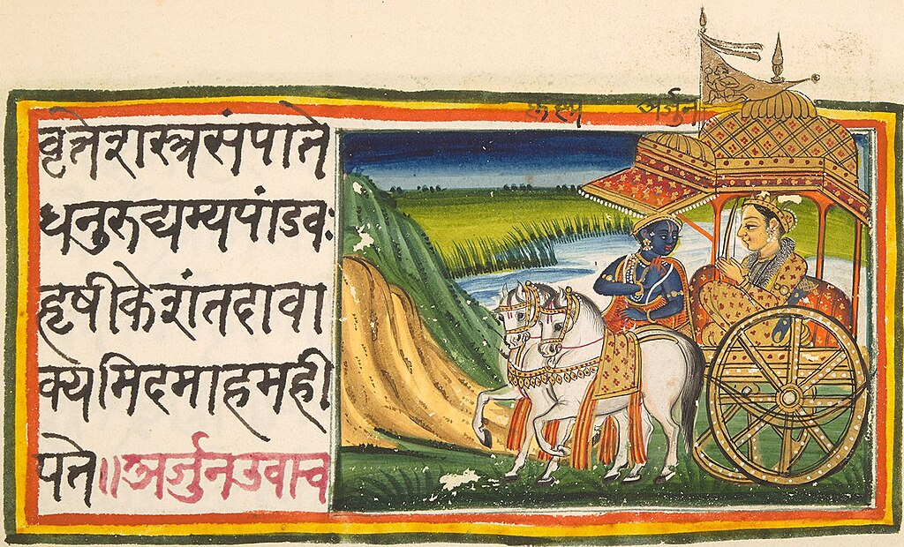

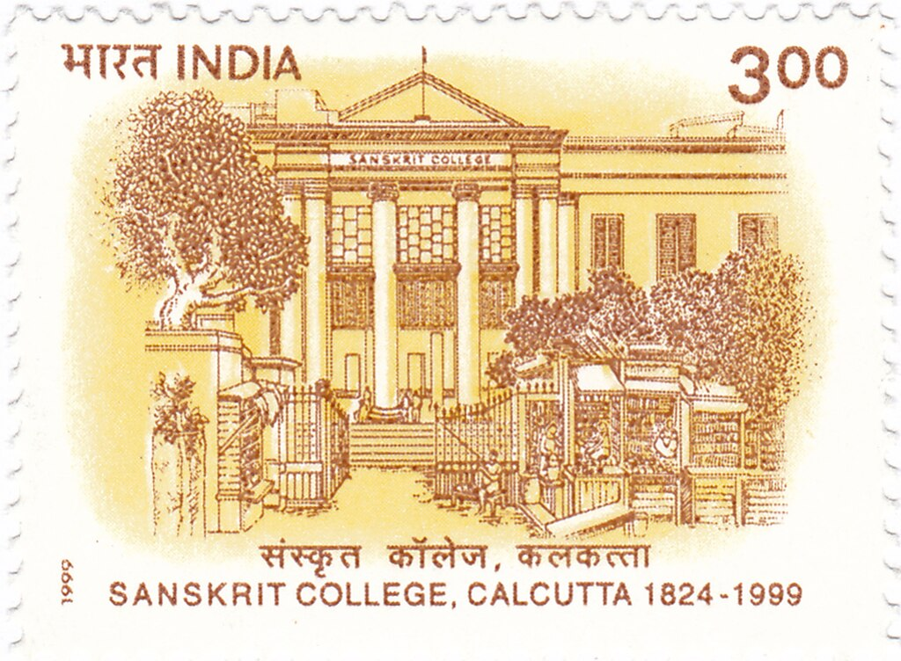

(top) A 19th-century illustrated Sanskrit manuscript from the [Bhagavad Gita](https://en.wikipedia.org/wiki/Bhagavad_Gita "Bhagavad Gita"), composed c. 400-200 BCE. (bottom) The 175th-anniversary stamp of [Sanskrit College, Calcutta](https://en.wikipedia.org/wiki/Sanskrit_College_and_University "Sanskrit College and University"), the third oldest sanskrit college, from 1999.

Region

South Asia (ancient and medieval), parts of Southeast Asia (medieval), mainly Indian subcontinent

Era

c. 1500–600 BCE (Vedic Sanskrit);
700 BCE – 1350 CE (Classical Sanskrit)

[Revival](https://en.wikipedia.org/wiki/Language_revitalization "Language revitalization")

There are no known native speakers of Sanskrit.

[Language family](https://en.wikipedia.org/wiki/Language_family "Language family")

[Indo-European](https://en.wikipedia.org/wiki/Indo-European_languages "Indo-European languages")

*   [Indo-Iranian](https://en.wikipedia.org/wiki/Indo-Iranian_languages "Indo-Iranian languages")
    *   [Indo-Aryan](https://en.wikipedia.org/wiki/Indo-Aryan_languages "Indo-Aryan languages")
        *   **Sanskrit**

Early form

[Vedic Sanskrit](https://en.wikipedia.org/wiki/Vedic_Sanskrit "Vedic Sanskrit")

[Writing system](/source/writing-system/ "Writing system")

[Devanagari script](https://en.wikipedia.org/wiki/Devanagari_script "Devanagari script") (present day). Originally orally transmitted. Not attested in writing until the 1st century BCE, when it was written in the [Brahmi script](https://en.wikipedia.org/wiki/Brahmi_script "Brahmi script"), and later in various [Brahmic scripts](https://en.wikipedia.org/wiki/Brahmic_scripts "Brahmic scripts").

Official status

Official language in

India (state-additional official)

*   [Himachal Pradesh](https://en.wikipedia.org/wiki/Himachal_Pradesh "Himachal Pradesh")
*   [Uttarakhand](https://en.wikipedia.org/wiki/Uttarakhand "Uttarakhand")

Recognised minority
language in

South Africa

Language codes

[ISO 639-1](https://en.wikipedia.org/wiki/ISO_639-1 "ISO 639-1")

`[sa](https://www.loc.gov/standards/iso639-2/php/langcodes_name.php?iso_639_1=sa)`

[ISO 639-2](https://en.wikipedia.org/wiki/ISO_639-2 "ISO 639-2")

`[san](https://www.loc.gov/standards/iso639-2/php/langcodes_name.php?code_ID=386)`

[ISO 639-3](https://en.wikipedia.org/wiki/ISO_639-3 "ISO 639-3")

`[san](https://iso639-3.sil.org/code/san "iso639-3:san")` – inclusive code
Individual codes:
`[cls](https://iso639-3.sil.org/code/cls "iso639-3:cls")` – [Classical Sanskrit](/source/sanskrit/#Classical_Sanskrit)
`[vsn](https://iso639-3.sil.org/code/vsn "iso639-3:vsn")` – [Vedic Sanskrit](https://en.wikipedia.org/wiki/Vedic_Sanskrit "Vedic Sanskrit")

_[Glottolog](https://en.wikipedia.org/wiki/Glottolog "Glottolog")_

`[sans1269](https://glottolog.org/resource/languoid/id/sans1269)`

**Sanskrit** ([/ˈsænskrɪt/](https://en.wikipedia.org/wiki/Help:IPA/English "Help:IPA/English"); stem form संस्कृत; nominal singular संस्कृतम्, _saṃskṛtam_,) is a [classical language](https://en.wikipedia.org/wiki/Classical_language "Classical language") belonging to the [Indo-Aryan](https://en.wikipedia.org/wiki/Indo-Aryan_languages "Indo-Aryan languages") branch of the [Indo-European languages](https://en.wikipedia.org/wiki/Indo-European_languages "Indo-European languages"). It arose in [South Asia](https://en.wikipedia.org/wiki/South_Asia "South Asia") after its predecessor languages had [diffused](https://en.wikipedia.org/wiki/Trans-cultural_diffusion "Trans-cultural diffusion") there from the northwest in the late [Bronze Age](https://en.wikipedia.org/wiki/Bronze_Age#South_Asia "Bronze Age"). Sanskrit is the [sacred language](https://en.wikipedia.org/wiki/Sacred_language "Sacred language") of [Hinduism](https://en.wikipedia.org/wiki/Hinduism "Hinduism"), the language of classical [Hindu philosophy](https://en.wikipedia.org/wiki/Hindu_philosophy "Hindu philosophy"), and of historical texts of [Buddhism](https://en.wikipedia.org/wiki/Buddhism "Buddhism") and [Jainism](https://en.wikipedia.org/wiki/Jainism "Jainism"). It was a [link language](https://en.wikipedia.org/wiki/Lingua_franca "Lingua franca") in ancient and medieval South Asia, and upon transmission of Hindu and Buddhist culture to [Southeast Asia](https://en.wikipedia.org/wiki/Southeast_Asia "Southeast Asia"), [East Asia](https://en.wikipedia.org/wiki/East_Asia "East Asia") and [Central Asia](https://en.wikipedia.org/wiki/Central_Asia "Central Asia") in the early medieval era, it became a language of religion and [high culture](https://en.wikipedia.org/wiki/High_culture "High culture"), and of the political elites in some of these regions. As a result, Sanskrit had a lasting effect on the languages of South Asia, Southeast Asia and East Asia, especially in their formal and learned vocabularies.

Sanskrit generally connotes several [Old Indo-Aryan](https://en.wikipedia.org/wiki/Indo-Aryan_languages#Old_Indo-Aryan "Indo-Aryan languages") language varieties. The most archaic of these is the [Vedic Sanskrit](https://en.wikipedia.org/wiki/Vedic_Sanskrit "Vedic Sanskrit") found in the [Rigveda](https://en.wikipedia.org/wiki/Rigveda "Rigveda"), a collection of 1,028 hymns composed between 1500 and 1200 BCE by Indo-Aryan tribes migrating east from the mountains of what is today northern [Afghanistan](https://en.wikipedia.org/wiki/Afghanistan "Afghanistan") across northern [Pakistan](https://en.wikipedia.org/wiki/Pakistan "Pakistan") and into northwestern India. Vedic Sanskrit interacted with the preexisting ancient languages of the subcontinent, absorbing names of newly encountered plants and animals; in addition, the [ancient Dravidian languages](https://en.wikipedia.org/wiki/Proto-Dravidian_language "Proto-Dravidian language") influenced Sanskrit's [phonology](https://en.wikipedia.org/wiki/Phonology "Phonology") and [syntax](https://en.wikipedia.org/wiki/Syntax "Syntax"). _Sanskrit_ can also more narrowly refer to [Classical Sanskrit](https://en.wikipedia.org/wiki/Classical_Sanskrit "Classical Sanskrit"), a refined and standardized grammatical form that emerged in the mid-1st millennium BCE and was codified in the most comprehensive of ancient grammars, the _[Aṣṭādhyāyī](https://en.wikipedia.org/wiki/Aṣṭādhyāyī "Aṣṭādhyāyī")_ ('Eight chapters') of [Pāṇini](https://en.wikipedia.org/wiki/Pāṇini "Pāṇini"). The greatest dramatist in Sanskrit, [Kālidāsa](https://en.wikipedia.org/wiki/Kālidāsa "Kālidāsa"), wrote in classical Sanskrit, and the foundations of modern arithmetic were first described in classical Sanskrit. The two major Sanskrit epics, the [Mahābhārata](https://en.wikipedia.org/wiki/Mahābhārata "Mahābhārata") and the [Rāmāyaṇa](https://en.wikipedia.org/wiki/Rāmāyaṇa "Rāmāyaṇa"), however, were composed in a range of oral storytelling registers called [Epic Sanskrit](https://en.wikipedia.org/wiki/Epic_Sanskrit "Epic Sanskrit") which was used in northern India between 400 BCE and 300 CE, and roughly contemporary with classical Sanskrit. In the following centuries, Sanskrit became tradition-bound, stopped being learned as a first language, and ultimately stopped developing as a living language.

The hymns of the Rigveda are notably similar to the most archaic poems of the Iranian and [Greek language](https://en.wikipedia.org/wiki/Greek_language "Greek language") families, the _[Gathas](https://en.wikipedia.org/wiki/Gatha_\(Zoroaster\) "Gatha (Zoroaster)")_ of old [Avestan](/source/avestan/ "Avestan") and _[Iliad](https://en.wikipedia.org/wiki/Iliad "Iliad")_ of [Homer](https://en.wikipedia.org/wiki/Homer "Homer"). As the Rigveda was [orally transmitted](https://en.wikipedia.org/wiki/Oral_tradition "Oral tradition") by [methods of memorisation](https://en.wikipedia.org/wiki/Indian_mathematics#Styles_of_memorisation "Indian mathematics") of exceptional complexity, rigour and fidelity, as a single text without variant readings, its preserved archaic syntax and morphology are of vital importance in the reconstruction of the common ancestor language [Proto-Indo-European](https://en.wikipedia.org/wiki/Proto-Indo-European "Proto-Indo-European"). Sanskrit does not have an attested native script: from around the turn of the 1st-millennium CE, it has been written in various [Brahmic scripts](https://en.wikipedia.org/wiki/Brahmic_scripts "Brahmic scripts"), and in the modern era most commonly in [Devanagari](https://en.wikipedia.org/wiki/Devanagari "Devanagari").

Sanskrit's status, function, and place in India's cultural heritage are recognized by its inclusion in the Constitution of India's [Eighth Schedule languages](https://en.wikipedia.org/wiki/Languages_with_official_status_in_India#Schedule "Languages with official status in India"). However, despite attempts at revival, there are no first-language speakers of Sanskrit in India. In each of India's recent decennial censuses, several thousand citizens have reported Sanskrit to be their mother tongue, but the numbers are thought to signify a wish to be aligned with the prestige of the language. Sanskrit has been taught in traditional [gurukulas](https://en.wikipedia.org/wiki/Gurukulas "Gurukulas") since ancient times; it is widely taught today at the secondary school level. The oldest Sanskrit college is the [Benares Sanskrit College](https://en.wikipedia.org/wiki/Benares_Sanskrit_College "Benares Sanskrit College") founded in 1791 during [East India Company rule](https://en.wikipedia.org/wiki/Company_rule_in_India "Company rule in India"). Sanskrit continues to be widely used as a ceremonial and [ritual language](https://en.wikipedia.org/wiki/Liturgical_language "Liturgical language") in Hindu and Buddhist [hymns](https://en.wikipedia.org/wiki/Stotra "Stotra") and [chants](https://en.wikipedia.org/wiki/Mantra "Mantra").

## Etymology and nomenclature

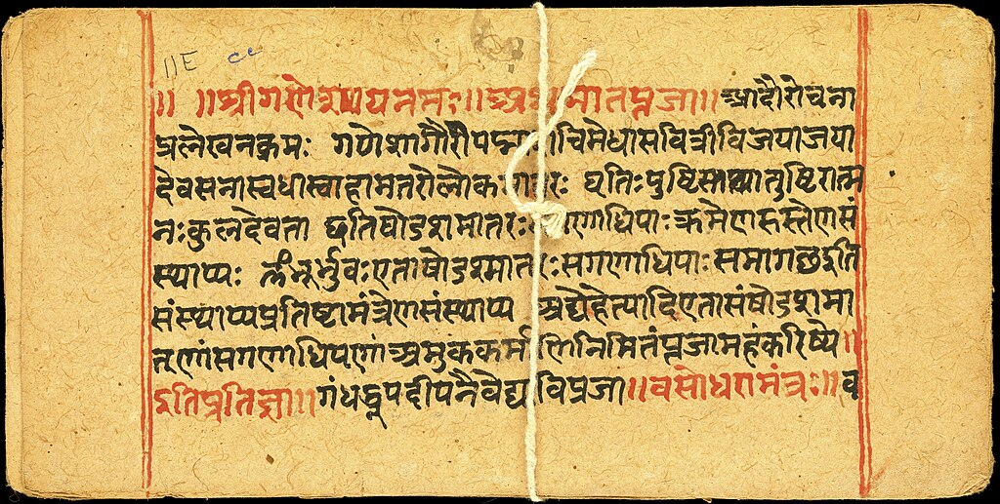

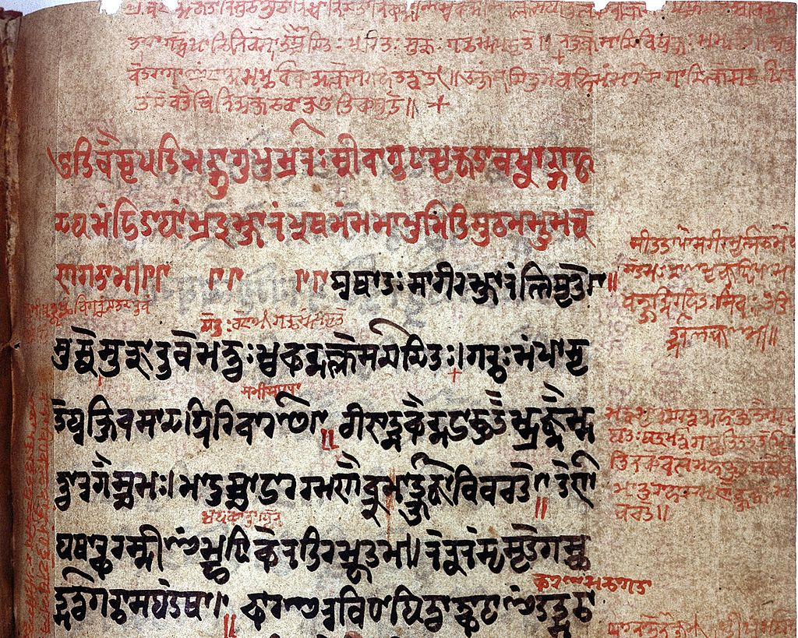

Historic Sanskrit manuscripts: a religious text (top), and a medical text

In Sanskrit, the [verbal adjective](https://en.wikipedia.org/wiki/Attributive_verb#English "Attributive verb") _sáṃskṛta-_ is a compound word consisting of _sáṃ_ ('together, good, well, perfected') and _kṛta__-_ ('made, formed, work'). It connotes a work that has been "well prepared, pure and perfect, polished, sacred". According to Biderman, the perfection contextually being referred to in the etymological origins of the word is its tonal—rather than semantic—qualities. Sound and oral transmission were highly valued qualities in ancient India, and its sages refined the alphabet, the structure of words, and its exacting grammar into a "collection of sounds, a kind of sublime musical mold" as an integral language they called _Saṃskṛta_. From the late [Vedic period](https://en.wikipedia.org/wiki/Vedic_period "Vedic period") onwards, state Annette Wilke and Oliver Moebus, resonating sound and its musical foundations attracted an "exceptionally large amount of linguistic, philosophical and religious literature" in India. Sound was visualized as "pervading all creation", another representation of the world itself. The search for perfection in thought and the goal of liberation were among the dimensions of sacred sound, and the common thread that wove all ideas and inspirations together became the quest for what the ancient Indians believed to be a perfect language, the "phonocentric episteme" of Sanskrit.

## History

### Origin and development

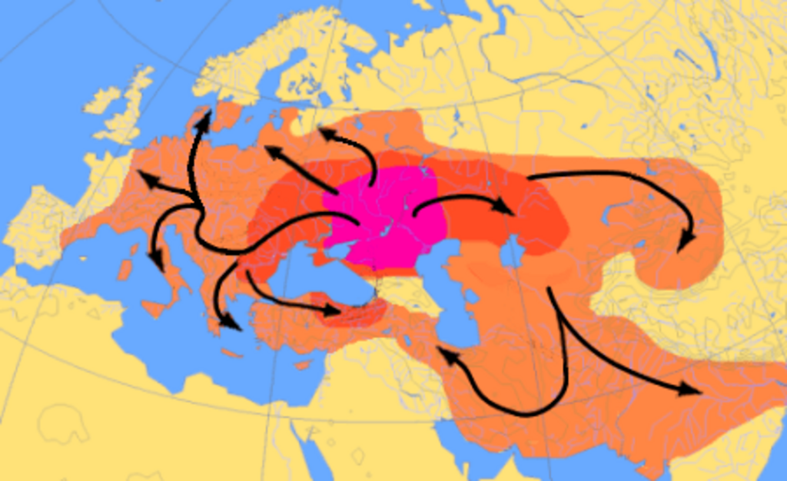

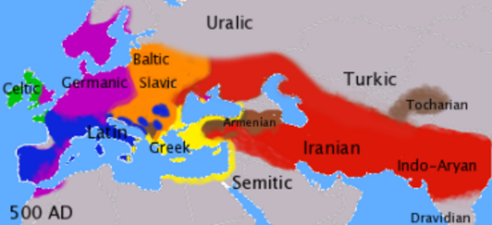

Left: The [Kurgan hypothesis](https://en.wikipedia.org/wiki/Kurgan_hypothesis "Kurgan hypothesis") on [Indo-European migrations](https://en.wikipedia.org/wiki/Indo-European_migrations "Indo-European migrations") between 4000 and 1000 BCE; right: The geographical spread of the Indo-European languages at 500 CE, with Sanskrit in South Asia

Sanskrit belongs to the [Indo-European family of languages](https://en.wikipedia.org/wiki/Indo-European_languages "Indo-European languages"). It is one of the three earliest ancient documented languages that arose from a common root language now referred to as [Proto-Indo-European](/source/proto-indo-european/ "Proto-Indo-European language"):

Other Indo-European languages distantly related to Sanskrit include [archaic](https://en.wikipedia.org/wiki/Old_Latin "Old Latin") and [Classical Latin](https://en.wikipedia.org/wiki/Classical_Latin "Classical Latin") (c. 600 BCE–100 CE, [Italic languages](https://en.wikipedia.org/wiki/Italic_languages "Italic languages")), [Gothic](https://en.wikipedia.org/wiki/Gothic_language "Gothic language") (archaic [Germanic language](https://en.wikipedia.org/wiki/Germanic_language "Germanic language"), c. 350 CE), [Old Norse](https://en.wikipedia.org/wiki/Old_Norse "Old Norse") (c. 200 CE and after), [Old Avestan](https://en.wikipedia.org/wiki/Old_Avestan "Old Avestan") (c. late 2nd millennium BCE) and [Younger Avestan](https://en.wikipedia.org/wiki/Avestan_language "Avestan language") (c. 900 BCE). The closest ancient relatives of Vedic Sanskrit in the Indo-European languages are the [Nuristani languages](https://en.wikipedia.org/wiki/Nuristani_language "Nuristani language") found in the remote [Hindu Kush](https://en.wikipedia.org/wiki/Hindu_Kush "Hindu Kush") region of northeastern Afghanistan and northwestern [Himalayas](https://en.wikipedia.org/wiki/Himalayas "Himalayas"), as well as the extinct [Avestan](/source/avestan/ "Avestan") and [Old Persian](https://en.wikipedia.org/wiki/Old_Persian "Old Persian") – both [Iranian languages](https://en.wikipedia.org/wiki/Iranian_languages "Iranian languages"). Sanskrit belongs to the [satem](https://en.wikipedia.org/wiki/Centum_and_satem_languages "Centum and satem languages") group of the Indo-European languages.

Colonial era scholars familiar with Latin and Greek were struck by the resemblance of the Sanskrit language, both in its vocabulary and grammar, to the classical languages of Europe. In _The Oxford Introduction to Proto-Indo-European and the Proto-Indo-European World_, Mallory and Adams illustrate the resemblance with the following examples of [cognate](https://en.wikipedia.org/wiki/Cognate "Cognate") forms (with the addition of Old English for further comparison):

  PIE  English  Old English  Latin  Ancient Greek  **Sanskrit**Glossary

\*méh₂tēr

  mother

  mōdor

  māter

  mētēr

  **mātṛ́-**

mother

\*ph₂tḗr

  father

  fæder

  pater

  patēr

  **pitṛ́-**

father

\*bʰréh₂tēr

  brother

  brōþor

  frāter

  phreter

  **bhrā́tṛ-**

brother

\*swésōr

  sister

  sweoster

  soror

  eor

  **svásṛ-**

sister

\*suHnús

  son

  sunu

 -

  hyiós

  **sūnú-**

son

\*dʰugh₂tḗr

  daughter

  dohtor

 -

  thugátēr

  **duhitṛ́-**

daughter

\*gʷṓws

  cow

  cū

  bōs

  bous

  **gaú-**

cow

\*demh₂-

  tame, timber

  tam, timber

  domus

  dom-

  **dām-**

house, tame, build

The correspondences suggest some common root, and historical links between some of the distant major ancient languages of the world.

The [Indo-Aryan migrations](https://en.wikipedia.org/wiki/Indo-Aryan_migrations "Indo-Aryan migrations") theory explains the common features shared by Sanskrit and other Indo-European languages by proposing that the original speakers of what became Sanskrit arrived in South Asia from a region of common origin, somewhere north-west of the [Indus region](https://en.wikipedia.org/wiki/Indus_River "Indus River"), during the early 2nd millennium BCE. Evidence for such a theory includes the close relationship between the Indo-Iranian tongues and the [Baltic](https://en.wikipedia.org/wiki/Baltic_languages "Baltic languages") and [Slavic languages](https://en.wikipedia.org/wiki/Slavic_languages "Slavic languages"), vocabulary exchange with the non-Indo-European [Uralic languages](https://en.wikipedia.org/wiki/Uralic_languages "Uralic languages"), and the nature of the attested Indo-European words for flora and fauna.

The pre-history of Indo-Aryan languages which preceded Vedic Sanskrit is unclear and various hypotheses place it over a fairly wide limit. According to Thomas Burrow, based on the relationship between various Indo-European languages, the origin of all these languages may possibly be in what is now Central or Eastern Europe, while the Indo-Iranian group possibly arose in Central Russia. The Iranian and Indo-Aryan branches separated quite early. It is the Indo-Aryan branch that moved into eastern Iran and then south into South Asia in the first half of the 2nd millennium BCE. Once in ancient India, the Indo-Aryan language underwent rapid linguistic change and morphed into the Vedic Sanskrit language.

### Vedic Sanskrit

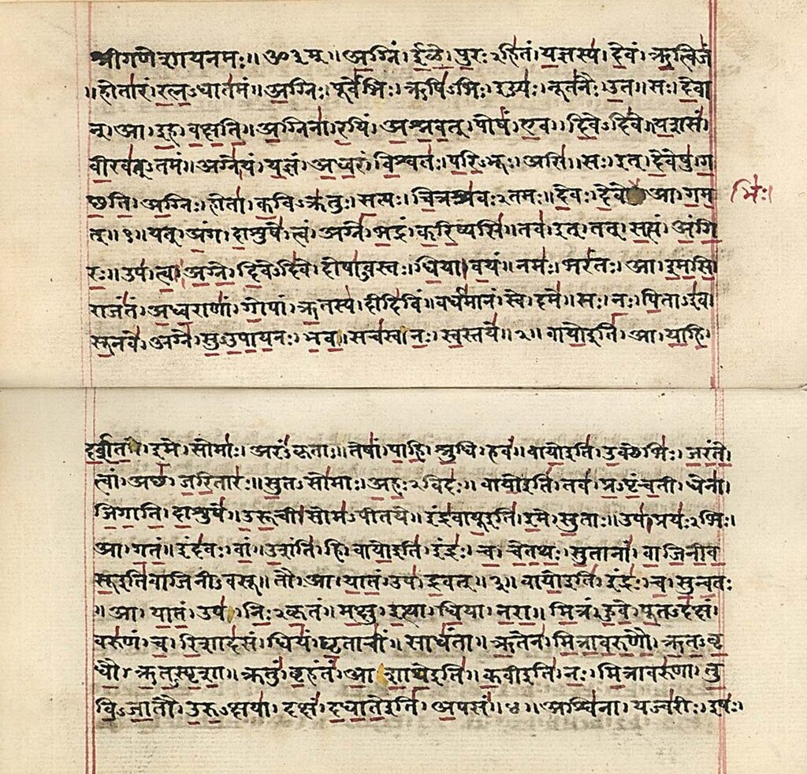_Rigveda_ ([padapatha](https://en.wikipedia.org/wiki/Vedic_chant "Vedic chant")) manuscript in [Devanagari](https://en.wikipedia.org/wiki/Devanagari "Devanagari"), early 19th century. The red horizontal and vertical lines mark low and high pitch changes for chanting.

The pre-Classical form of Sanskrit is known as _[Vedic Sanskrit](https://en.wikipedia.org/wiki/Vedic_Sanskrit "Vedic Sanskrit")_. The earliest attested Sanskrit text is the [Rigveda](https://en.wikipedia.org/wiki/Rigveda "Rigveda") (_Ṛg-veda_), a Hindu scripture from the mid- to late-second millennium BCE. No written records from such an early period survive, if any ever existed, but scholars are generally confident that the oral transmission of the texts is reliable: they are ceremonial literature, where the exact phonetic expression and its preservation were a part of the historic tradition.

However some scholars have suggested that the original Ṛg-veda differed in some fundamental ways in phonology compared to the sole surviving version available to us. In particular that retroflex consonants did not exist as a natural part of the earliest Vedic language, and that these developed in the centuries after the composition had been completed, and as a gradual unconscious process during the oral transmission by generations of reciters.

The primary source for this argument is internal evidence of the text which betrays an instability of the phenomenon of retroflexion, with the same phrases having sandhi-induced retroflexion in some parts but not other. This is taken along with evidence of controversy, for example, in passages of the Aitareya-Āraṇyaka (700 BCE), which features a discussion on whether retroflexion is valid in particular cases.

The Ṛg-veda is a collection of books, created by multiple authors. These authors represented different generations, and the mandalas 2 to 7 are the oldest while the mandalas 1 and 10 are relatively the youngest. Yet, the Vedic Sanskrit in these books of the Ṛg-veda "hardly presents any dialectical diversity", according [Louis Renou](https://en.wikipedia.org/wiki/Louis_Renou "Louis Renou"). This implies Vedic Sanskrit had a "set linguistic pattern" by the second half of the 2nd millennium BCE. Beyond the Ṛg-veda, the ancient literature in Vedic Sanskrit that has survived into the modern age include the _Samaveda_, _Yajurveda_, _Atharvaveda_, along with the embedded and layered Vedic texts such as the [Brahmanas](https://en.wikipedia.org/wiki/Brahmana "Brahmana"), [Aranyakas](https://en.wikipedia.org/wiki/Aranyaka "Aranyaka"), and the early [Upanishads](https://en.wikipedia.org/wiki/Upanishad "Upanishad"). These Vedic documents reflect the dialects of Sanskrit found in the various parts of the northwestern, northern, and eastern Indian subcontinent.

According to Michael Witzel, Vedic Sanskrit was a spoken language of the semi-nomadic [Aryans](https://en.wikipedia.org/wiki/Aryan "Aryan"). The Vedic Sanskrit language or a closely related Indo-European variant was recognized beyond ancient India as evidenced by the "[Mitanni](https://en.wikipedia.org/wiki/Mitanni "Mitanni") Treaty" between the ancient Hittite and [Mitanni](https://en.wikipedia.org/wiki/Mitanni "Mitanni") people, carved into a rock, in a region that now includes parts of [Syria](https://en.wikipedia.org/wiki/Syria "Syria") and [Turkey](https://en.wikipedia.org/wiki/Turkey "Turkey"). Parts of this treaty, such as the names of the Mitanni princes and technical terms related to horse training, for reasons not understood, are in early forms of Vedic Sanskrit. The treaty also invokes the gods [Varuna](https://en.wikipedia.org/wiki/Varuna "Varuna"), [Mitra](https://en.wikipedia.org/wiki/Mitra "Mitra"), [Indra](https://en.wikipedia.org/wiki/Indra "Indra"), and [Nasatya](https://en.wikipedia.org/wiki/Ashvins "Ashvins") found in the earliest layers of the Vedic literature.

> O Bṛhaspati, when in giving names
> they first set forth the beginning of Language,
> Their most excellent and spotless secret
> was laid bare through love,
> When the wise ones formed Language with their mind,
> purifying it like grain with a winnowing fan,
> Then friends knew friendships –
> an auspicious mark placed on their language.

— _[Rigveda](https://en.wikipedia.org/wiki/Rigveda "Rigveda") 10.71.1–4_
Translated by Roger Woodard

The Vedic Sanskrit found in the Ṛg-veda is distinctly more archaic than other Vedic texts, and in many respects, the Rigvedic language is notably more similar to those found in the archaic texts of Old Avestan [Zoroastrian](https://en.wikipedia.org/wiki/Zoroastrianism "Zoroastrianism") _Gathas_ and Homer's _Iliad_ and _Odyssey_. According to Stephanie W. Jamison and Joel P. Brereton the Vedic Sanskrit literature "clearly inherited" from Indo-Iranian and Indo-European times the social structures such as the role of the poet and the priests, the patronage economy, the phrasal equations, and some of the poetic metres. While there are similarities, state Jamison and Brereton, there are also differences between Vedic Sanskrit, the Old Avestan, and the Mycenaean Greek literature. For example, [simile](https://en.wikipedia.org/wiki/Simile "Simile") is deployed extensively in the Sanskrit Ṛg-veda, whereas the Old Avestan _Gathas_ lack simile entirely (and it is rare in later forms of the language); conversely, simile is common in [Homeric Greek](https://en.wikipedia.org/wiki/Homeric_Greek "Homeric Greek"), but they are structurally very different to those in Ṛg-vedic Sanskrit.

### Classical Sanskrit

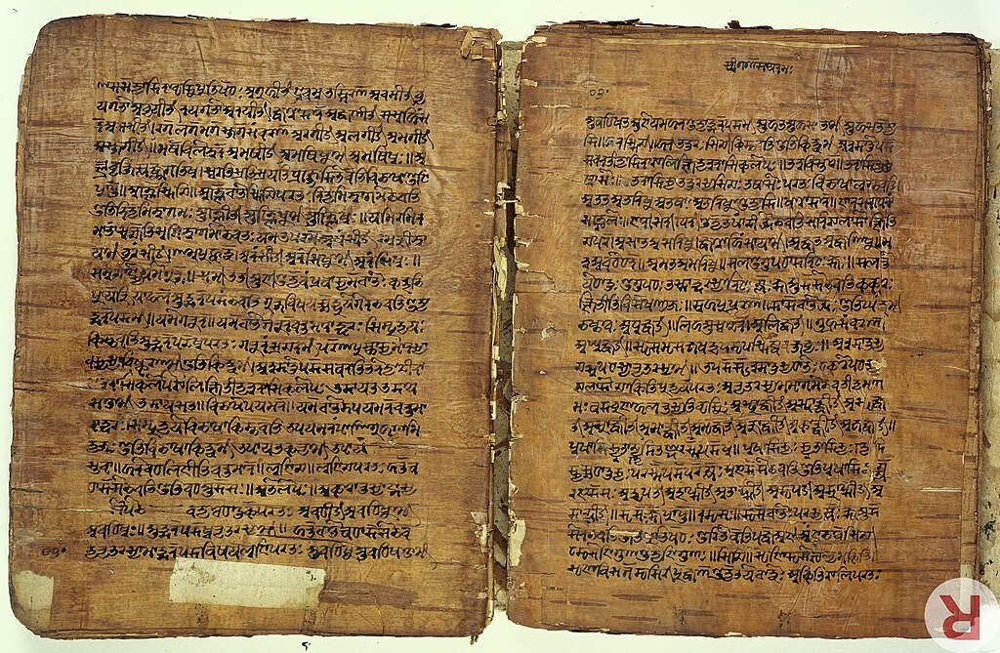A 17th-century birch bark manuscript of Pāṇini's grammar treatise from Kashmir

The early Vedic form of the Sanskrit language was far less homogenous compared to the Classical Sanskrit as defined by grammarians by about the mid-1st millennium BCE. According to Richard Gombrich—an Indologist and a scholar of Sanskrit, Pāli and Buddhist Studies—the archaic Vedic Sanskrit found in the _Rigveda_ had already evolved in the Vedic period, as evidenced in the later Vedic literature. Gombrich posits that the language in the early Upanishads of Hinduism and the late Vedic literature approaches Classical Sanskrit, while the archaic Vedic Sanskrit had by the [Buddha](https://en.wikipedia.org/wiki/Buddha "Buddha")'s time become unintelligible to all except ancient Indian sages.

The formalization of the Sanskṛit language is credited to _[Pāṇini](https://en.wikipedia.org/wiki/Pāṇini "Pāṇini")_, along with Patañjali's _Mahābhāṣya_ and Kātyayana's commentary that preceded Patāñjali's work. Panini composed the _Aṣṭādhyāyī_ ('Eight-Chapter Grammar'), which became the foundation of Vyākaraṇa, a [Vedānga](https://en.wikipedia.org/wiki/Vedanga "Vedanga"). The _Aṣṭādhyāyī_ was not the first description of Sanskrit grammar, but it is the earliest that has survived in full, and the culmination of a long grammatical tradition that Fortson says, is "one of the intellectual wonders of the ancient world". Pāṇini cites ten scholars on the phonological and grammatical aspects of the Sanskrit language before him, as well as the variants in the usage of Sanskrit in different regions of India. The ten Vedic scholars he quotes are Āpiśali, [Kaśyapa](https://en.wikipedia.org/wiki/Kashyapa "Kashyapa"), Gārgya, Gālava, Cakravarmaṇa, [Bhāradvāja](https://en.wikipedia.org/wiki/Bharadvaja "Bharadvaja"), Śākaṭāyana, Śākalya, Senaka and Sphoṭāyana.

In the _Aṣṭādhyāyī_, language is observed in a manner that has no parallel among Greek or Latin grammarians. Pāṇini's grammar, according to Renou and Filliozat, is a classic that defines the linguistic expression and sets the standard for the Sanskrit language. Pāṇini made use of a technical metalanguage consisting of a syntax, morphology and lexicon. This metalanguage is organised according to a series of meta-rules, some of which are explicitly stated while others can be deduced. Despite differences in the analysis from that of modern linguistics, Pāṇini's work has been found valuable and the most advanced analysis of linguistics until the twentieth century.

Pāṇini's comprehensive and scientific theory of grammar is conventionally taken to mark the start of Classical Sanskrit. His systematic treatise inspired and made Sanskrit the preeminent Indian language of learning and literature for two millennia. It is unclear whether Pāṇini himself wrote his treatise or he orally created the detailed and sophisticated treatise then transmitted it through his students. Modern scholarship generally accepts that he knew of a form of writing, based on references to words such as _[lipi](https://en.wikipedia.org/wiki/Lipi_\(script\) "Lipi (script)")_ ('script') and _lipikara_ ('scribe') in section 3.2 of the _Aṣṭādhyāyī_.

The Classical Sanskrit language formalized by Pāṇini, states Renou, is "not an impoverished language", rather it is "a controlled and a restrained language from which archaisms and unnecessary formal alternatives were excluded". The Classical form of the language simplified the _sandhi_ rules but retained various aspects of the Vedic language, while adding rigor and flexibilities, so that it had sufficient means to express thoughts as well as being "capable of responding to the future increasing demands of an infinitely diversified literature", according to Renou. Pāṇini included numerous "optional rules" beyond the Vedic Sanskrit's _bahulam_ framework, to respect liberty and creativity so that individual writers separated by geography or time would have the choice to express facts and their views in their own way, where tradition followed competitive forms of the Sanskrit language.

The phonetic differences between Vedic Sanskrit and Classical Sanskrit, as discerned from the current state of the surviving literature, are negligible when compared to the intense change that must have occurred in the pre-Vedic period between the Proto-Indo-Aryan language and Vedic Sanskrit. The noticeable differences in Vedic include more grammatical categories as well as the differences in accent, semantics, syntax, declension, and internal and external _sandhi_ rules. Quite a few words found in the early Vedic Sanskrit language are never found in late Vedic Sanskrit or Classical Sanskrit literature, while some words have different and new meanings in Classical Sanskrit when contextually compared to the early Vedic Sanskrit literature.

### Sanskrit and Prakrit languages

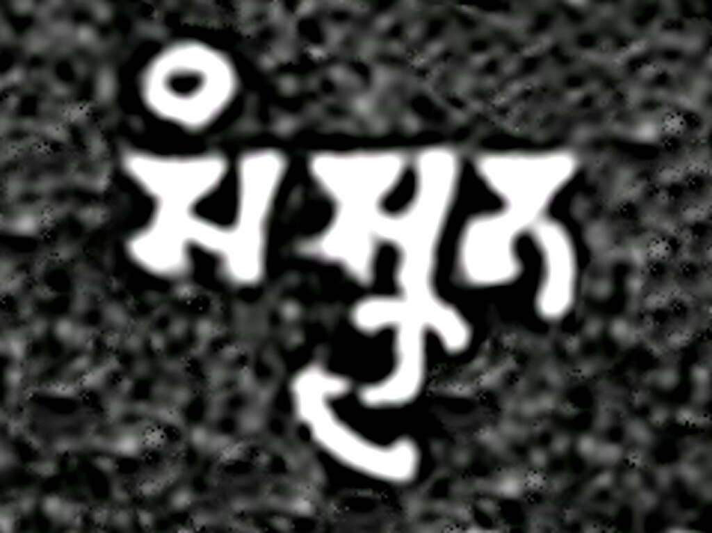An early use of the word for "Sanskrit" in Late [Brahmi script](https://en.wikipedia.org/wiki/Brahmi_script "Brahmi script") (also called [Gupta script](https://en.wikipedia.org/wiki/Gupta_script "Gupta script")):

_Saṃ-skṛ-ta_

[Mandsaur stone inscription of Yashodharman-Vishnuvardhana](https://en.wikipedia.org/wiki/Mandsaur_stone_inscription_of_Yashodharman-Vishnuvardhana "Mandsaur stone inscription of Yashodharman-Vishnuvardhana"), 532 CE.

The earliest known use of the word _Saṃskṛta_ (Sanskrit), in the context of a speech or language, is found in verses 5.28.17–19 of the _Ramayana_. Outside the learned sphere of written Classical Sanskrit, vernacular colloquial dialects ([Prakrits](https://en.wikipedia.org/wiki/Prakrit "Prakrit")) continued to evolve. Sanskrit co-existed with numerous other Prakrit languages of ancient India. The Prakrit languages of India also have ancient roots and some Sanskrit scholars have called these _Apabhramsa_, literally 'spoiled'. The Vedic literature includes words whose phonetic equivalent are not found in other [Indo-European languages](https://en.wikipedia.org/wiki/Indo-European_languages "Indo-European languages") but which are found in the regional Prakrit languages, which makes it likely that the interaction, the sharing of words and ideas began early in the Indian history. As the Indian thought diversified and challenged earlier beliefs of Hinduism, particularly in the form of [Buddhism](https://en.wikipedia.org/wiki/Buddhism "Buddhism") and [Jainism](https://en.wikipedia.org/wiki/Jainism "Jainism"), the Prakrit languages such as [Pali](https://en.wikipedia.org/wiki/Pali "Pali") in [Theravada](https://en.wikipedia.org/wiki/Theravada "Theravada") Buddhism and Ardhamagadhi in Jainism competed with Sanskrit in the ancient times. However, states [Paul Dundas](https://en.wikipedia.org/wiki/Paul_Dundas "Paul Dundas"), these ancient Prakrit languages had "roughly the same relationship to Sanskrit as medieval Italian does to Latin". The Indian tradition states that the [Buddha](https://en.wikipedia.org/wiki/Buddha "Buddha") and the [Mahavira](https://en.wikipedia.org/wiki/Mahavira "Mahavira") preferred the Prakrit language so that everyone could understand it. However, scholars such as Dundas have questioned this hypothesis. They state that there is no evidence for this and whatever evidence is available suggests that by the start of the common era, hardly anybody other than learned monks had the capacity to understand the old Prakrit languages such as [Ardhamagadhi](https://en.wikipedia.org/wiki/Ardhamagadhi "Ardhamagadhi").

A section of European scholars state that Sanskrit was never a spoken language. However, evidences shows that Sanskrit was a spoken language, essential for [oral tradition](https://en.wikipedia.org/wiki/Oral_tradition "Oral tradition") that preserved the vast number of Sanskrit manuscripts from ancient India. The textual evidence in the works of Yaksa, Panini, and Patanajali affirms that Classical Sanskrit in their era was a spoken language (_bhasha_) used by the cultured and educated. Some _[sutras](https://en.wikipedia.org/wiki/Sutra "Sutra")_ expound upon the variant forms of spoken Sanskrit versus written Sanskrit. Chinese Buddhist pilgrim [Xuanzang](https://en.wikipedia.org/wiki/Xuanzang "Xuanzang") mentioned in his memoir that official philosophical debates in India were held in Sanskrit, not in the vernacular language of that region.

Sanskrit's link to the Prakrit languages and other Indo-European languages

According to Sanskrit linguist professor Madhav Deshpande, Sanskrit was a spoken language in a colloquial form by the mid-1st millennium BCE which coexisted with a more formal, grammatically correct form of literary Sanskrit. This, states Deshpande, is true for modern languages where colloquial incorrect approximations and dialects of a language are spoken and understood, along with more "refined, sophisticated and grammatically accurate" forms of the same language being found in the literary works. The Indian tradition, states [Winternitz](https://en.wikipedia.org/wiki/Moriz_Winternitz "Moriz Winternitz"), has favored the learning and the usage of multiple languages from the ancient times. Sanskrit was a spoken language in the educated and the elite classes, but it was also a language that must have been understood in a wider circle of society because the widely popular folk epics and stories such as the _[Ramayana](https://en.wikipedia.org/wiki/Ramayana "Ramayana")_, the _[Mahabharata](https://en.wikipedia.org/wiki/Mahabharata "Mahabharata")_, the _[Bhagavata Purana](https://en.wikipedia.org/wiki/Bhagavata_Purana "Bhagavata Purana")_, the _[Panchatantra](https://en.wikipedia.org/wiki/Panchatantra "Panchatantra")_ and many other texts are all in the Sanskrit language. The Classical Sanskrit with its exacting grammar was thus the language of the Indian scholars and the educated classes, while others communicated with approximate or ungrammatical variants of it as well as other natural Indian languages. Sanskrit, as the learned language of Ancient India, thus existed alongside the vernacular Prakrits. Many [Sanskrit dramas](https://en.wikipedia.org/wiki/Sanskrit_drama "Sanskrit drama") indicate that the language coexisted with the vernacular Prakrits. The cities of [Varanasi](https://en.wikipedia.org/wiki/Varanasi "Varanasi"), [Paithan](https://en.wikipedia.org/wiki/Paithan "Paithan"), [Pune](https://en.wikipedia.org/wiki/Pune "Pune") and [Kanchipuram](https://en.wikipedia.org/wiki/Kanchipuram "Kanchipuram") were centers of classical Sanskrit learning and public debates until the arrival of the colonial era.

According to [Lamotte](https://en.wikipedia.org/wiki/Étienne_Lamotte "Étienne Lamotte"), Sanskrit became the dominant literary and inscriptional language because of its precision in communication. It was, states Lamotte, an ideal instrument for presenting ideas, and as knowledge in Sanskrit multiplied, so did its spread and influence. Sanskrit was adopted voluntarily as a vehicle of high culture, arts, and profound ideas. Pollock disagrees with Lamotte, but concurs that Sanskrit's influence grew into what he terms a "Sanskrit Cosmopolis" over a region that included all of South Asia and much of southeast Asia. The Sanskrit language cosmopolis thrived beyond India between 300 and 1300 CE.

Today, it is believed that Kashmiri is the closest language to Sanskrit.

### Dravidian influence on Sanskrit

Reinöhl mentions that not only have the Dravidian languages borrowed from Sanskrit vocabulary, but they have also affected Sanskrit on deeper levels of structure, "for instance in the domain of phonology where Indo-Aryan retroflexes have been attributed to Dravidian influence". Similarly, Ferenc Ruzca states that all the major shifts in Indo-Aryan phonetics over two millennia can be attributed to the constant influence of a Dravidian language with a similar phonetic structure to Tamil. Hock et al. quoting George Hart state that there was influence of [Old Tamil](https://en.wikipedia.org/wiki/Old_Tamil "Old Tamil") on Sanskrit. Hart compared Old Tamil and Classical Sanskrit to arrive at a conclusion that there was a common language from which these features both derived – "that both Tamil and Sanskrit derived their shared conventions, metres, and techniques from a common source, for it is clear that neither borrowed directly from the other."

Reinöhl further states that there is a symmetric relationship between Dravidian languages like Kannada or Tamil, with Indo-Aryan languages like Bengali or Hindi, whereas the same relationship is not found for non-Indo-Aryan languages, for example, Persian or English:

> A sentence in a Dravidian language like Tamil or Kannada becomes ordinarily good Bengali or Hindi by substituting Bengali or Hindi equivalents for the Dravidian words and forms, without modifying the word order; but the same thing is not possible in rendering a Persian or English sentence into a non-Indo-Aryan language.

— Reinöhl

Shulman mentions that "Dravidian nonfinite verbal forms (called _vinaiyeccam_ in Tamil) shaped the usage of the Sanskrit nonfinite verbs (originally derived from inflected forms of action nouns in Vedic). This particularly salient case of the possible influence of Dravidian on Sanskrit is only one of many items of syntactic assimilation, not least among them the large repertoire of morphological modality and aspect that, once one knows to look for it, can be found everywhere in classical and postclassical Sanskrit".

The main influence of Dravidian on Sanskrit is found to have been concentrated in the timespan between the late Vedic period and the crystallization of Classical Sanskrit. As in this period the [Indo-Aryan](https://en.wikipedia.org/wiki/Indo-Aryan_peoples "Indo-Aryan peoples") tribes had not yet made contact with the inhabitants of the South of the subcontinent, this suggests a significant presence of Dravidian speakers in North India (the central Gangetic plain and the classical Madhyadeśa) who were instrumental in this substratal influence on Sanskrit.

## Influence

> Extant manuscripts in Sanskrit number over 30 million, one hundred times those in Greek and Latin combined, constituting the largest cultural heritage that any civilization has produced prior to the invention of the printing press.

— Foreword of _Sanskrit Computational Linguistics_ (2009), Gérard Huet, Amba Kulkarni and Peter Scharf

Sanskrit has been the predominant language of [Hindu texts](https://en.wikipedia.org/wiki/Hindu_texts "Hindu texts") encompassing a rich tradition of [philosophical](https://en.wikipedia.org/wiki/Hindu_philosophy "Hindu philosophy") and [religious](https://en.wikipedia.org/wiki/Dharma "Dharma") texts, as well as poetry, music, [drama](https://en.wikipedia.org/wiki/Sanskrit_drama "Sanskrit drama"), [scientific](https://en.wikipedia.org/wiki/Scientific_literature "Scientific literature"), technical and others. It is the predominant language of one of the largest collection of historic manuscripts. The earliest known inscriptions in Sanskrit are from the 1st century BCE, such as the [Ayodhya Inscription of Dhana](https://en.wikipedia.org/wiki/Ayodhya_Inscription_of_Dhana "Ayodhya Inscription of Dhana") and [Ghosundi-Hathibada (Chittorgarh)](https://en.wikipedia.org/wiki/Hathibada_Ghosundi_inscriptions "Hathibada Ghosundi inscriptions").

Though developed and nurtured by scholars of orthodox schools of Hinduism, Sanskrit has been the language for some of the key literary works and theology of heterodox schools of Indian philosophies such as Buddhism and Jainism. The structure and capabilities of the Classical Sanskrit language launched ancient Indian speculations about "the nature and function of language", what is the relationship between words and their meanings in the context of a community of speakers, whether this relationship is objective or subjective, discovered or is created, how individuals learn and relate to the world around them through language, and about the limits of language. They speculated on the role of language, the ontological status of painting word-images through sound, and the need for rules so that it can serve as a means for a community of speakers, separated by geography or time, to share and understand profound ideas from each other. These speculations became particularly important to the [Mīmāṃsā](https://en.wikipedia.org/wiki/Mīmāṃsā "Mīmāṃsā") and the [Nyaya](https://en.wikipedia.org/wiki/Nyaya "Nyaya") schools of Hindu philosophy, and later to Vedanta and Mahayana Buddhism, states [Frits Staal](https://en.wikipedia.org/wiki/Frits_Staal "Frits Staal")—a scholar of Linguistics with a focus on Indian philosophies and Sanskrit. Though written in a number of different scripts, the dominant language of Hindu texts has been Sanskrit. It or a hybrid form of Sanskrit became the preferred language of Mahayana Buddhism scholarship; for example, one of the early and influential Buddhist philosophers, [Nagarjuna](https://en.wikipedia.org/wiki/Nagarjuna "Nagarjuna") (c.200 CE), used Classical Sanskrit as the language for his texts. According to Renou, Sanskrit had a limited role in the Theravada tradition (formerly known as the Hinayana) but the Prakrit works that have survived are of doubtful authenticity. Some of the canonical fragments of the early Buddhist traditions, discovered in the 20th century, suggest the early Buddhist traditions used an imperfect and reasonably good Sanskrit, sometimes with a Pali syntax, states Renou. The [Mahāsāṃghika](https://en.wikipedia.org/wiki/Mahāsāṃghika "Mahāsāṃghika") and Mahavastu, in their late Hinayana forms, used hybrid Sanskrit for their literature. Sanskrit was also the language of some of the oldest surviving, authoritative and much followed philosophical works of Jainism such as the _Tattvartha Sutra_ by [Umaswati](https://en.wikipedia.org/wiki/Umaswati "Umaswati").

 The [Spitzer Manuscript](https://en.wikipedia.org/wiki/Spitzer_Manuscript "Spitzer Manuscript") is dated to about the 2nd century CE (above: folio 383 fragment). Discovered in the [Kizil Caves](https://en.wikipedia.org/wiki/Kizil_Caves "Kizil Caves"), near the northern branch of the Central Asian [Silk Route](https://en.wikipedia.org/wiki/Silk_Route "Silk Route") in northwest China, it is the oldest Sanskrit philosophical manuscript known so far.

The Sanskrit language has been one of the major means for the transmission of knowledge and ideas in Asian history. Indian texts in Sanskrit were already in China by 402 CE, carried by the influential Buddhist pilgrim [Faxian](https://en.wikipedia.org/wiki/Faxian "Faxian") who translated them into Chinese by 418 CE. [Xuanzang](https://en.wikipedia.org/wiki/Xuanzang "Xuanzang"), another Chinese Buddhist pilgrim, learnt Sanskrit in India and carried 657 Sanskrit texts to China in the 7th century where he established a major center of learning and language translation under the patronage of Emperor Taizong. By the early 1st millennium CE, Sanskrit had spread Buddhist and Hindu ideas to Southeast Asia, parts of the East Asia and the Central Asia. It was accepted as a language of high culture and the preferred language by some of the local ruling elites in these regions. According to the [Dalai Lama](https://en.wikipedia.org/wiki/Dalai_Lama "Dalai Lama"), the Sanskrit language is a parent language that is at the foundation of many modern languages of India and the one that promoted Indian thought to other distant countries. In Tibetan Buddhism, states the Dalai Lama, Sanskrit language has been a revered one and called _legjar lhai-ka_ or "elegant language of the gods". It has been the means of transmitting the "profound wisdom of Buddhist philosophy" to Tibet.

![A 5th-century Sanskrit inscription discovered in Java, Indonesia—one of the earliest in southeast Asia after the Mulavarman inscription discovered in Kutai, eastern Borneo. The Ciaruteun inscription combines two writing scripts and compares the king to the Hindu god Vishnu. It provides a terminus ad quem to the presence of Hinduism in the Indonesian islands. The oldest southeast Asian Sanskrit inscription—called the Vo Canh inscription—so far discovered is near Nha Trang, Vietnam, and it is dated to the late 4th century to early 5th century CE.](../media/sanskrit/One_of_earliest_Sanskrit_inscriptions_in_Java_Indonesia.jpg)A 5th-century [Sanskrit inscription](https://en.wikipedia.org/wiki/Sanskrit_inscriptions_in_the_Malay_world "Sanskrit inscriptions in the Malay world") discovered in [Java](https://en.wikipedia.org/wiki/Java "Java"), [Indonesia](https://en.wikipedia.org/wiki/Indonesia "Indonesia")—one of the earliest in southeast Asia after the [Mulavarman inscription](https://en.wikipedia.org/wiki/Yūpa#Yūpa_inscription_in_Indonesia "Yūpa") discovered in [Kutai](https://en.wikipedia.org/wiki/Kutai "Kutai"), eastern [Borneo](https://en.wikipedia.org/wiki/Borneo "Borneo"). The [Ciaruteun inscription](https://en.wikipedia.org/wiki/Ciaruteun_inscription "Ciaruteun inscription") combines two writing scripts and compares the king to the Hindu god [Vishnu](https://en.wikipedia.org/wiki/Vishnu "Vishnu"). It provides a _[terminus ad quem](https://en.wikipedia.org/wiki/Terminus_ad_quem "Terminus ad quem")_ to the presence of Hinduism in the Indonesian islands. The oldest southeast Asian Sanskrit inscription—called the [Vo Canh inscription](https://en.wikipedia.org/wiki/Võ_Cạnh_inscription "Võ Cạnh inscription")—so far discovered is near [Nha Trang](https://en.wikipedia.org/wiki/Nha_Trang "Nha Trang"), [Vietnam](https://en.wikipedia.org/wiki/Vietnam "Vietnam"), and it is dated to the late 4th century to early 5th century CE.

The Sanskrit language created a pan-Indo-Aryan accessibility to information and knowledge in the ancient and medieval times, in contrast to the Prakrit languages which were understood just regionally. It created a cultural bond across the subcontinent. As local languages and dialects evolved and diversified, Sanskrit served as the common language. It connected scholars from distant parts of South Asia such as Tamil Nadu and Kashmir, states Deshpande, as well as those from different fields of studies, though there must have been differences in its pronunciation given the first language of the respective speakers. The Sanskrit language brought Indo-Aryan speaking people together, particularly its elite scholars. Some of these scholars of Indian history regionally produced vernacularized Sanskrit to reach wider audiences, as evidenced by texts discovered in Rajasthan, Gujarat, and Maharashtra. Once the audience became familiar with the easier to understand vernacularized version of Sanskrit, those interested could graduate from colloquial Sanskrit to the more advanced Classical Sanskrit. Rituals and the rites-of-passage ceremonies have been and continue to be the other occasions where a wide spectrum of people hear Sanskrit, and occasionally join in to speak some Sanskrit words such as _namah_.

Classical Sanskrit is the standard [register](https://en.wikipedia.org/wiki/Register_\(sociolinguistics\) "Register (sociolinguistics)") as laid out in the grammar of _[Pāṇini](https://en.wikipedia.org/wiki/Pāṇini "Pāṇini")_, around the fourth century BCE. Its position in the cultures of [Greater India](https://en.wikipedia.org/wiki/Greater_India "Greater India") is akin to that of [Latin](https://en.wikipedia.org/wiki/Latin "Latin") and [Ancient Greek](https://en.wikipedia.org/wiki/Ancient_Greek "Ancient Greek") in Europe. Sanskrit has significantly influenced most modern languages of the [Indian subcontinent](https://en.wikipedia.org/wiki/Indian_subcontinent "Indian subcontinent"), particularly the languages of the northern, western, central and eastern Indian subcontinent.

### Decline

The decline of Sanskrit began in the 13th century. This coincides with the beginning of [Islamic](https://en.wikipedia.org/wiki/Islam "Islam") invasions of South Asia to create, and thereafter expand the [Muslim](https://en.wikipedia.org/wiki/Muslim "Muslim") rule in the form of Sultanates, and later the [Mughal Empire](https://en.wikipedia.org/wiki/Mughal_Empire "Mughal Empire"). Sheldon Pollock characterises the decline of Sanskrit as a long-term "cultural, social, and political change". He dismisses the idea that Sanskrit declined due to "struggle with barbarous invaders", and emphasises factors such as the increasing attractiveness of vernacular language for literary expression.

With the fall of [Kashmir](https://en.wikipedia.org/wiki/Kashmir "Kashmir") around the 13th century, a premier center of Sanskrit literary creativity, Sanskrit literature there disappeared, perhaps in the "fires that periodically engulfed the capital of Kashmir" or the "Mongol invasion of 1320" states Pollock. The dissemination of Sanskrit literature from the northwest regions of the subcontinent stopped after the 12th century. As Hindu kingdoms fell in eastern and southern India, such as the great [Vijayanagara Empire](https://en.wikipedia.org/wiki/Vijayanagara_Empire "Vijayanagara Empire"), so did Sanskrit. There were exceptions and short periods of imperial support for Sanskrit, mostly concentrated during the reign of the tolerant Mughal emperor [Akbar](https://en.wikipedia.org/wiki/Akbar "Akbar"). Muslim rulers patronized the Middle Eastern language and scripts found in Persia and Arabia, and the Indians linguistically adapted to this Persianization to gain employment with the Muslim rulers. Hindu rulers such as Shivaji of the [Maratha Empire](https://en.wikipedia.org/wiki/Maratha_Empire "Maratha Empire"), reversed the process, by re-adopting Sanskrit and re-asserting their socio-linguistic identity. After Islamic rule disintegrated in South Asia and the colonial rule era began, Sanskrit re-emerged but in the form of a "ghostly existence" in regions such as Bengal. This decline was the result of "political institutions and civic ethos" that did not support the historic Sanskrit literary culture and the failure of new Sanskrit literature to assimilate into the changing cultural and political environment.

[Sheldon Pollock](https://en.wikipedia.org/wiki/Sheldon_Pollock "Sheldon Pollock") states that in some crucial way, "Sanskrit is [dead](https://en.wikipedia.org/wiki/Language_death "Language death")". After the 12th century, the Sanskrit literary works were reduced to "reinscription and restatements" of ideas already explored, and any creativity was restricted to hymns and verses. This contrasted with the previous 1,500 years when "great experiments in moral and aesthetic imagination" marked the Indian scholarship using Classical Sanskrit, states Pollock.

Some scholars maintain that the Sanskrit language did not die, but rather only declined. Jurgen Hanneder disagrees with Pollock, finding his arguments elegant but "often arbitrary". According to Hanneder, a decline or regional absence of creative and innovative literature constitutes a negative evidence to Pollock's hypothesis, but it is not positive evidence. A closer look at Sanskrit in the Indian history after the 12th century suggests that Sanskrit survived despite the odds. According to Hanneder,

> On a more public level the statement that Sanskrit is a dead language is misleading, for Sanskrit is quite obviously not as dead as other dead languages and the fact that it is spoken, written and read will probably convince most people that it cannot be a dead language in the most common usage of the term. Pollock's notion of the "death of Sanskrit" remains in this unclear realm between academia and public opinion when he says that "most observers would agree that, in some crucial way, Sanskrit is dead."

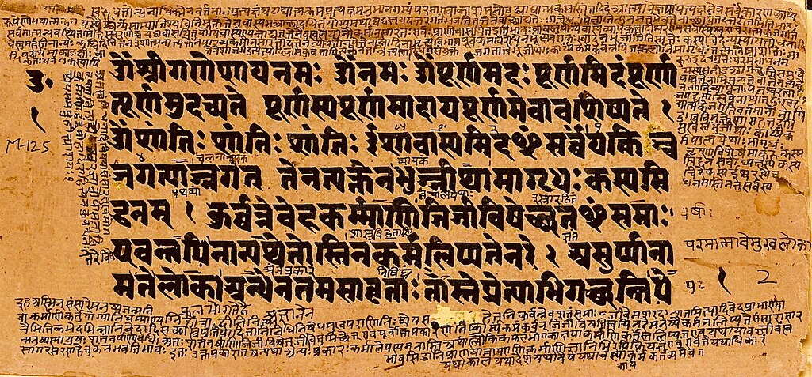

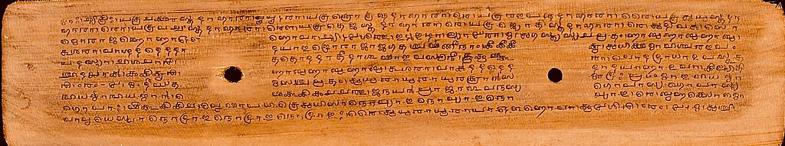

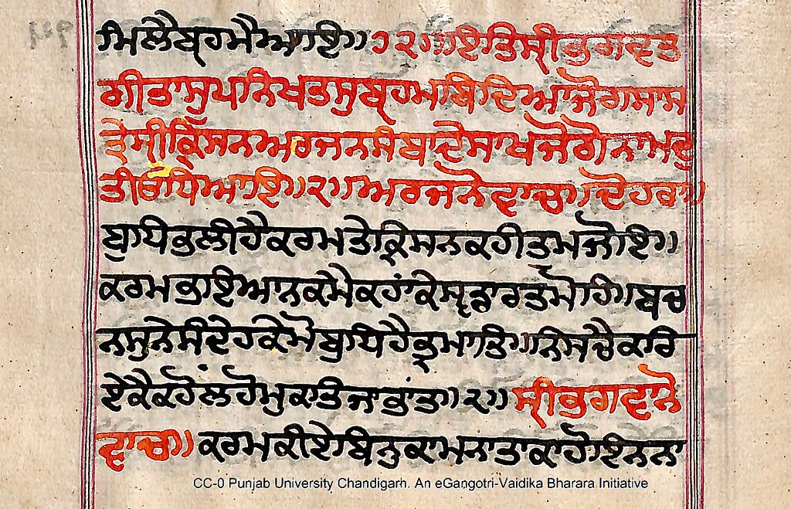

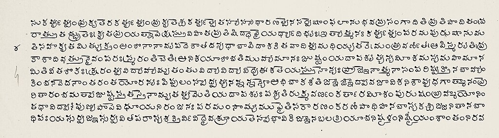

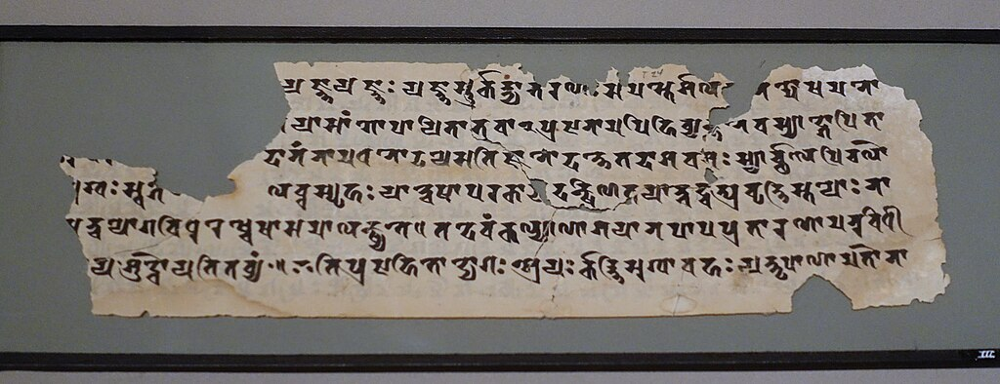

Sanskrit language manuscripts exist in many scripts. Above from top: _Isha Upanishad_ (Devanagari), _Samaveda_ (Tamil Grantha), _Bhagavad Gita_ (Gurmukhi), _Vedanta Sara_ (Telugu), _Jatakamala_ (early Sharada). All are Hindu texts except the last Buddhist text.

The Sanskrit language scholar [Moriz Winternitz](https://en.wikipedia.org/wiki/Moriz_Winternitz "Moriz Winternitz") states that Sanskrit was never a dead language and it is still alive though its prevalence is lesser than ancient and medieval times. Sanskrit remains an integral part of Hindu journals, festivals, Ramlila plays, drama, rituals and the rites-of-passage. Similarly, Brian Hatcher states that the "metaphors of historical rupture" by Pollock are not valid, that there is ample proof that Sanskrit was very much alive in the narrow confines of surviving Hindu kingdoms between the 13th and 18th centuries, and its reverence and tradition continues.

Hanneder states that modern works in Sanskrit are either ignored or their "modernity" contested.

According to [Robert P. Goldman](https://en.wikipedia.org/wiki/Robert_P._Goldman "Robert P. Goldman") and Sally Sutherland, Sanskrit is neither "dead" nor "living" in the conventional sense. It is a special, timeless language that lives in the numerous manuscripts, daily chants, and ceremonial recitations, a _heritage language_ that Indians contextually prize, and which some practice.

When the British introduced English to India in the 19th century, knowledge of Sanskrit and ancient literature continued to flourish as the study of Sanskrit changed from a more traditional style into a form of analytical and comparative scholarship mirroring that of Europe.

### Modern Indo-Aryan languages

The relationship of Sanskrit to the Prakrit languages, particularly the modern form of Indian languages, is complex and spans about 3,500 years, states [Colin Masica](https://en.wikipedia.org/wiki/Colin_Masica "Colin Masica")—a linguist specializing in South Asian languages. A part of the difficulty is the lack of sufficient textual, archaeological and epigraphical evidence for the ancient Prakrit languages with rare exceptions such as Pali, leading to a tendency toward [anachronistic](https://en.wikipedia.org/wiki/Anachronism "Anachronism") errors. Sanskrit and Prakrit languages may be divided into Old Indo-Aryan (1500 BCE – 600 BCE), Middle Indo-Aryan (600 BCE – 1000 CE) and New Indo-Aryan (1000 CE – present), each can further be subdivided into early, middle or second, and late evolutionary substages.

Vedic Sanskrit belongs to the early Old Indo-Aryan stage, while Classical Sanskrit to the later Old Indo-Aryan stage. The evidence for Prakrits such as Pali (Theravada Buddhism) and Ardhamagadhi (Jainism), along with Magadhi, Maharashtri, Sinhala, Sauraseni and Niya (Gandhari), emerge in the Middle Indo-Aryan stage in two versions—archaic and more formalized—that may be placed in early and middle substages of the 600 BCE – 1000 CE period. Two literary Indo-Aryan languages can be traced to the late Middle Indo-Aryan stage and these are _Apabhramsa_ and _Elu_ (a literary form of [Sinhalese](https://en.wikipedia.org/wiki/Sinhala_language "Sinhala language")). Numerous North, Central, Eastern and Western Indian languages, such as Hindi, Gujarati, Sindhi, Punjabi, Kashmiri, Nepali, Braj, Awadhi, Bengali, Assamese, Oriya, Marathi, and others belong to the New Indo-Aryan stage.

There is an extensive overlap in the vocabulary, phonetics and other aspects of these New Indo-Aryan languages with Sanskrit, but it is neither universal nor identical across the languages. They likely emerged from a synthesis of the ancient Sanskrit language traditions and an admixture of various regional dialects. Each language has some unique and regionally creative aspects, with unclear origins. Prakrit languages do have a grammatical structure, but like Vedic Sanskrit, it is far less rigorous than Classical Sanskrit. While the roots of all Prakrit languages may be in Vedic Sanskrit and ultimately the Proto-Indo-Aryan language, their structural details vary from Classical Sanskrit. It is generally accepted by scholars and widely believed in India that the modern [Indo-Aryan languages](https://en.wikipedia.org/wiki/Indo-Aryan_languages "Indo-Aryan languages") – such as Bengali, Gujarati, Hindi, and Punjabi – are descendants of the Sanskrit language. Sanskrit, states Burjor Avari, can be described as "the mother language of almost all the languages of north India".

## Geographic distribution

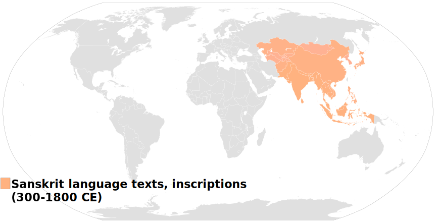Sanskrit language's historical presence has been attested in many countries. The evidence includes manuscript pages and inscriptions discovered in South Asia, Southeast Asia and Central Asia. These have been dated between 300 and 1800 CE.

The Sanskrit language's historic presence is attested across a wide geography beyond South Asia. Inscriptions and literary evidence suggests that Sanskrit language was already being adopted in Southeast Asia and Central Asia in the 1st millennium CE, through monks, religious pilgrims and merchants.

South Asia has been the geographic range of the largest collection of the ancient and pre-18th-century Sanskrit manuscripts and inscriptions. Beyond ancient India, significant collections of Sanskrit manuscripts and inscriptions have been found in China (particularly the Tibetan monasteries), [Myanmar](https://en.wikipedia.org/wiki/Myanmar "Myanmar"), [Indonesia](https://en.wikipedia.org/wiki/Indonesia "Indonesia"), [Cambodia](https://en.wikipedia.org/wiki/Cambodia "Cambodia"), [Laos](https://en.wikipedia.org/wiki/Laos "Laos"), [Vietnam](https://en.wikipedia.org/wiki/Vietnam "Vietnam"), [Thailand](https://en.wikipedia.org/wiki/Thailand "Thailand"), and [Malaysia](https://en.wikipedia.org/wiki/Malaysia "Malaysia"). Sanskrit inscriptions, manuscripts or its remnants, including some of the oldest known Sanskrit written texts, have been discovered in dry high deserts and mountainous terrains such as in Nepal, Tibet, Afghanistan, Mongolia, Uzbekistan, Turkmenistan, Tajikistan, and Kazakhstan. Some Sanskrit texts and inscriptions have also been discovered in Korea and Japan.

### Official status

In India, Sanskrit is among the 22 official languages of India in [the Eighth Schedule to the Constitution](https://en.wikipedia.org/wiki/Languages_with_official_status_in_India#Schedule "Languages with official status in India"). In 2010, [Uttarakhand](https://en.wikipedia.org/wiki/Uttarakhand "Uttarakhand") became the first state in India to make Sanskrit its second official language. In 2019, [Himachal Pradesh](https://en.wikipedia.org/wiki/Himachal_Pradesh "Himachal Pradesh") made Sanskrit its second official language, becoming the second state in India to do so.

## Phonology

Sanskrit shares many Proto-Indo-European phonological features, although it features a larger inventory of distinct phonemes. The consonantal system is the same, though it systematically enlarged the inventory of distinct sounds. For example, Sanskrit added a voiceless aspirated "tʰ", to the voiceless "t", voiced "d" and voiced aspirated "dʰ" found in PIE languages.

The most significant and distinctive phonological development in Sanskrit is vowel merger. The short _\*e_, _\*o_ and _\*a_, all merge as _a_ (अ) in Sanskrit, while long _\*ē_, _\*ō_ and _\*ā_, all merge as long _ā_ (आ). Compare Sanskrit _nāman_ to Latin _nōmen_. These mergers occurred very early and significantly affected Sanskrit's morphological system. Some phonological developments in it mirror those in other PIE languages. For example, the labiovelars merged with the plain velars as in other satem languages. The secondary palatalization of the resulting segments is more thorough and systematic within Sanskrit. For example, unlike the loss of the morphological clarity from vowel contraction that is found in early Greek and related southeast European languages, Sanskrit deployed _\*y_, _\*w_, and _\*s_ intervocalically to provide morphological clarity.

### Vowels

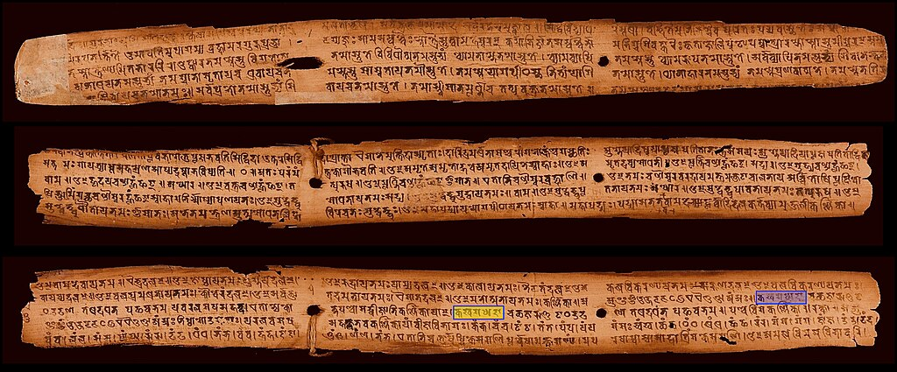

This is one of the oldest surviving and dated palm-leaf manuscripts in Sanskrit (828 CE). Discovered in Nepal, the bottom leaf shows all the vowels and consonants of Sanskrit (the first five consonants are highlighted in blue and yellow).

The cardinal vowels (_svaras_) _a_ (अ), _i_ (इ), and _u_ (उ) distinguish length in Sanskrit. The short _a_ (अ) in Sanskrit is a closer vowel than ā, equivalent to schwa. The mid vowels ē (ए) and ō (ओ) in Sanskrit are monophthongizations of the Indo-Iranian diphthongs _\*ai_ and _\*au_. They are inherently long, though often transcribed _e_ and _o_ without the diacritic. The vocalic liquid _r̥_ in Sanskrit is a merger of PIE _\*r̥_ and _\*l̥_. The long _r̥_ is an innovation and it is used in a few analogically generated morphological categories.

Sanskrit vowels in the Devanagari script

Independent form[IAST](https://en.wikipedia.org/wiki/IAST "IAST")/
[ISO](https://en.wikipedia.org/wiki/ISO_15919 "ISO 15919")[IPA](https://en.wikipedia.org/wiki/International_Phonetic_Alphabet "International Phonetic Alphabet")Independent formIAST/
ISOIPA

_kaṇṭhya_
([Guttural](https://en.wikipedia.org/wiki/Guttural "Guttural"))

अ

_a_

/[ɐ](https://en.wikipedia.org/wiki/Near-open_central_vowel "Near-open central vowel")/

आ

_ā_

/[ɑː](https://en.wikipedia.org/wiki/Open_back_unrounded_vowel "Open back unrounded vowel")/

_tālavya_
([Palatal](https://en.wikipedia.org/wiki/Palatal "Palatal"))

इ

_i_

/[i](https://en.wikipedia.org/wiki/Close_front_unrounded_vowel "Close front unrounded vowel")/

ई

_ī_

/iː/

_oṣṭhya_
([Labial](https://en.wikipedia.org/wiki/Labial_consonant "Labial consonant"))

उ

_u_

/[u](https://en.wikipedia.org/wiki/Close_back_rounded_vowel "Close back rounded vowel")/

ऊ

_ū_

/uː/

_mūrdhanya_
([Retroflex](https://en.wikipedia.org/wiki/Retroflex_consonant "Retroflex consonant"))

ऋ

_ṛ_/_r̥_

/[r̩](https://en.wikipedia.org/wiki/Syllabic_consonant "Syllabic consonant")/

ॠ

_ṝ_/_r̥̄_

/r̩ː/

_dantya_
([Dental](https://en.wikipedia.org/wiki/Dental_consonant "Dental consonant"))

ऌ

_ḷ_/_l̥_

/[l̩](https://en.wikipedia.org/wiki/Syllabic_consonant "Syllabic consonant")/

ॡ

_ḹ_/_l̥̄_

/l̩ː/

_kaṇṭhatālavya_
(Palatoguttural)

ए

_e_/_ē_

/[eː](https://en.wikipedia.org/wiki/Close-mid_front_unrounded_vowel "Close-mid front unrounded vowel")/

ऐ

_ai_

/ɑj/

_kaṇṭhoṣṭhya_
(Labioguttural)

ओ

_o_/_ō_

/[oː](https://en.wikipedia.org/wiki/Close-mid_back_rounded_vowel "Close-mid back rounded vowel")/

औ

_au_

/ɑw/

_(consonantal allophones)_

ं

_ṃ_/_ṁ_

/[◌̃](https://en.wikipedia.org/wiki/Nasalization "Nasalization")/

ः

_ḥ_

/h/

According to Masica, Sanskrit has four traditional semivowels, with which were classed, "for morphophonemic reasons, the liquids: y, r, l, and v; that is, as y and v were the non-syllabics corresponding to i, u, so were r, l in relation to r̥ and l̥". The northwestern, the central and the eastern Sanskrit dialects have had a historic confusion between "r" and "l". The Paninian system that followed the central dialect preserved the distinction, likely out of reverence for the Vedic Sanskrit that distinguished the "r" and "l". However, the northwestern dialect only had "r", while the eastern dialect probably only had "l", states Masica. Thus literary works from different parts of ancient India appear inconsistent in their use of "r" and "l", resulting in doublets that are occasionally semantically differentiated.

The nasal 'ṃ' is optionally the corresponding nasal consonant before plosives (aṃ + k = aṅk or am k) and an 'm'-sound before r, s, ś, ṣ, and h. Before y, l, v, it can cause nasalaization and gemination (am + y = aỹy or am y).

### Consonants

Sanskrit consonants are conventionally arranged into a symmetrical table that is based on how the sound is articulated, though this arrangement is somewhat forced and conceals a certain lack of parallelism among the actual sounds.

Sanskrit consonants in the Devanagari script

_sparśa_
([Plosive](https://en.wikipedia.org/wiki/Plosive_consonant "Plosive consonant"))_anunāsika_
([Nasal](https://en.wikipedia.org/wiki/Nasal_stop "Nasal stop"))_antastha_
([Approximant](https://en.wikipedia.org/wiki/Approximant "Approximant"))_ūṣman/saṅgharṣī_
([Fricative](https://en.wikipedia.org/wiki/Fricative_consonant "Fricative consonant"))

[Voicing](https://en.wikipedia.org/wiki/Voice_\(phonetics\) "Voice (phonetics)") →

_aghoṣa_

_ghoṣa_

_aghoṣa_

_ghoṣa_

[Aspiration](https://en.wikipedia.org/wiki/Aspiration_\(phonetics\) "Aspiration (phonetics)") →

_alpaprāṇa_

_mahāprāṇa_

_alpaprāṇa_

_mahāprāṇa_

_alpaprāṇa_

_mahāprāṇa_

_kaṇṭhya_
([Guttural](https://en.wikipedia.org/wiki/Guttural "Guttural"))

क

_ka_
\[[k](https://en.wikipedia.org/wiki/Voiceless_velar_plosive "Voiceless velar plosive")\]

ख

_kha_
\[[kʰ](https://en.wikipedia.org/wiki/Aspirated_consonant "Aspirated consonant")\]

ग

_ga_
\[[ɡ](https://en.wikipedia.org/wiki/Voiced_velar_plosive "Voiced velar plosive")\]

घ

_gha_
\[[ɡʱ](https://en.wikipedia.org/wiki/Breathy_voice "Breathy voice")\]

ङ

_ṅa_
\[[ŋ](https://en.wikipedia.org/wiki/Voiced_velar_nasal "Voiced velar nasal")\]

ᳲक

_ẖka_
\[[x](https://en.wikipedia.org/wiki/Voiceless_velar_fricative "Voiceless velar fricative")\]

ह

_ha_
\[[ɦ](https://en.wikipedia.org/wiki/Voiced_glottal_fricative "Voiced glottal fricative")\]

_tālavya_
([Palatal](https://en.wikipedia.org/wiki/Palatal_consonant "Palatal consonant"))

च

_ca_
\[[t͜ɕ](https://en.wikipedia.org/wiki/Voiceless_alveolo-palatal_affricate "Voiceless alveolo-palatal affricate")\]

छ

_cha_
\[[t͜ɕʰ](https://en.wikipedia.org/wiki/Aspirated_consonant "Aspirated consonant")\]

ज

_ja_
\[[d͜ʑ](https://en.wikipedia.org/wiki/Voiced_alveolo-palatal_affricate "Voiced alveolo-palatal affricate")\]

झ

_jha_
\[[d͜ʑʱ](https://en.wikipedia.org/wiki/Breathy_voice "Breathy voice")\]

ञ

_ña_
\[[ɲ](https://en.wikipedia.org/wiki/Voiced_palatal_nasal "Voiced palatal nasal")\]

य

_ya_
\[[j](https://en.wikipedia.org/wiki/Voiced_palatal_approximant "Voiced palatal approximant")\]

श

_śa_
\[[ɕ](https://en.wikipedia.org/wiki/Voiceless_alveolo-palatal_fricative "Voiceless alveolo-palatal fricative")\]

_mūrdhanya_
([Retroflex](https://en.wikipedia.org/wiki/Retroflex_consonant "Retroflex consonant"))

ट

_ṭa_
\[[ʈ](https://en.wikipedia.org/wiki/Voiceless_retroflex_plosive "Voiceless retroflex plosive")\]

ठ

_ṭha_
\[[ʈʰ](https://en.wikipedia.org/wiki/Aspirated_consonant "Aspirated consonant")\]

ड

_ḍa_
\[[ɖ](https://en.wikipedia.org/wiki/Voiced_retroflex_plosive "Voiced retroflex plosive")\]

ढ

_ḍha_
\[[ɖʱ](https://en.wikipedia.org/wiki/Breathy_voice "Breathy voice")\]

ण

_ṇa_
\[[ɳ](https://en.wikipedia.org/wiki/Voiced_retroflex_nasal "Voiced retroflex nasal")\]

र

_ra_
\[[ɾ](https://en.wikipedia.org/wiki/Voiced_alveolar_tap_or_flap "Voiced alveolar tap or flap")\]

ष

_ṣa_
\[[ʂ](https://en.wikipedia.org/wiki/Voiceless_retroflex_fricative "Voiceless retroflex fricative")\]

_dantya_
([Dental](https://en.wikipedia.org/wiki/Dental_consonant "Dental consonant"))

त

_ta_
\[[t](https://en.wikipedia.org/wiki/Voiceless_alveolar_plosive "Voiceless alveolar plosive")\]

थ

_tha_
\[[tʰ](https://en.wikipedia.org/wiki/Aspirated_consonant "Aspirated consonant")\]

द

_da_
\[[d](https://en.wikipedia.org/wiki/Voiced_alveolar_plosive "Voiced alveolar plosive")\]

ध

_dha_
\[[dʱ](https://en.wikipedia.org/wiki/Breathy_voice "Breathy voice")\]

न

_na_
\[[n](https://en.wikipedia.org/wiki/Voiced_alveolar_nasal "Voiced alveolar nasal")\]

ल

_la_
\[[l](https://en.wikipedia.org/wiki/Voiced_alveolar_lateral_approximant "Voiced alveolar lateral approximant")\]

स

_sa_
\[[s](https://en.wikipedia.org/wiki/Voiceless_alveolar_fricative "Voiceless alveolar fricative")\]

_oṣṭhya_
([Labial](https://en.wikipedia.org/wiki/Labial_consonant "Labial consonant"))

प

_pa_
\[[p](https://en.wikipedia.org/wiki/Voiceless_bilabial_plosive "Voiceless bilabial plosive")\]

फ

_pha_
\[[pʰ](https://en.wikipedia.org/wiki/Aspirated_consonant "Aspirated consonant")\]

ब

_ba_
\[[b](https://en.wikipedia.org/wiki/Voiced_bilabial_plosive "Voiced bilabial plosive")\]

भ

_bha_
\[[bʱ](https://en.wikipedia.org/wiki/Breathy_voice "Breathy voice")\]

म

_ma_
\[[m](https://en.wikipedia.org/wiki/Voiced_bilabial_nasal "Voiced bilabial nasal")\]

व

_va_
\[[ʋ](https://en.wikipedia.org/wiki/Voiced_labiodental_approximant "Voiced labiodental approximant")\]

ᳲप

_ḫpa_
\[[ɸ](https://en.wikipedia.org/wiki/Voiceless_bilabial_fricative "Voiceless bilabial fricative")\]

> **The system of Sanskrit Sounds**
> \[The alphabetic\] order of Sanskrit sounds works along three principles: it goes from simple to complex; it goes from the back to the front of the mouth; and it groups similar sounds together. \[...\] Among themselves, both the vowels and consonants are ordered according to where in the mouth they are pronounced, going from back to front.

— A. M. Ruppel, _The Cambridge Introduction to Sanskrit_

*   Sanskrit has a series of retroflex stops originating as conditioned alternants of dentals.
*   _jh_ is a marginal phoneme in Sanskrit occurring mostly from loanwords, hence its phonology is more difficult to reconstruct; it was more commonly employed in the Middle Indo-Aryan languages as a result of phonological processes resulting in the phoneme, e.g. [jajjhatī](https://en.wiktionary.org/wiki/जज्झती "wikt:जज्झती")[jhaṣa](https://en.wiktionary.org/wiki/झष "wikt:झष").
*   The palatal and velar nasals are conditioned variant of n occurring next to palatal and velar obstruents mostly, but there are some onomatopoeic words with them like _ña, ṅa, ṅu_ and inflections like _[ñuṅūṣate](https://en.wiktionary.org/wiki/ञुङूषते "wikt:ञुङूषते")_, _[prāṅ](https://en.wiktionary.org/wiki/प्राङ् "wikt:प्राङ्")_.
*   The _anusvara_ that Sanskrit deploys is a conditioned alternant of post-vocalic nasals, under certain sandhi conditions.
*   The _visarga_ is a word-final or morpheme-final conditioned alternant of s and r under certain sandhi conditions.
*   The voiceless aspirated series is also an innovation in Sanskrit but is rarer than the other three series.
*   While the Sanskrit language organizes sounds for expression beyond those found in the PIE language, it retained many features found in the Iranian and Balto-Slavic languages. An example of a similar process in all three is the retroflex sibilant ʂ being the automatic product of dental s [following i, u, r, and k](https://en.wikipedia.org/wiki/Ruki_sound_law "Ruki sound law").

### Phonological alternations, sandhi rules

Sanskrit deploys extensive phonological alternations on different linguistic levels through _sandhi_ rules (literally, the rules of "putting together, union, connection, alliance"), similar to the English alteration of "going to" as _gonna_. The Sanskrit language accepts such alterations within it, but offers formal rules for the _sandhi_ of any two words next to each other in the same sentence or linking two sentences. The external _sandhi_ rules state that similar short vowels coalesce into a single long vowel, while dissimilar vowels form glides or undergo diphthongization. Among the consonants, most external _sandhi_ rules recommend regressive assimilation for clarity when they are voiced. These rules ordinarily apply at compound seams and morpheme boundaries. In Vedic Sanskrit, the external _sandhi_ rules are more variable than in Classical Sanskrit.

### Vedic Pitch Accent

Vedic Sanskrit included a three-way free pitch accent system of _udātta_ (raised), _anudātta_ (not-raised or grave), and _svarita_ (sounded) which were high, low and falling pitches respectively. Each word generally had one _udātta_ accent except for certain compound words, with the _svarita_ (if any) always following an _udātta_. The classical language ultimately lost this system, resulting in it being preserved only in Vedic texts and phonological treatises. However, the same traditional chanting that preserved the accents renders the _udātta_ as an unaccented mid-tone and the first half of the _svarita_ as higher than an _udātta_; the other half is rendered at the same pitch as that of the new _udātta._

### Classical Stress Accent

In the classical language there likely existed a predictable system of stress accent similar to Latin, in which the penultimate syllable is stressed if it is metrically heavy and the antepenultimate if it is light. Unlike in Latin, however, if the antepenultimate is also light (and is not the start of the word), then the preantepenultimate is stressed instead, regardless of weight. For example, _bharā́mi_, _bharánti_, _bhárati_, _udvéjayati_, and _dúhitaram_ (as opposed to their Vedic pitch accentuations of _bhárāmi_, _duhitáram_, etc.).

## Morphology

The basis of Sanskrit morphology is the root, states Jamison, "a morpheme bearing lexical meaning". The verbal and nominal stems of Sanskrit words are derived from this root through the phonological vowel-gradation processes, the addition of affixes, verbal and nominal stems. It then adds an ending to establish the grammatical and syntactic identity of the stem. According to Jamison, the "three major formal elements of the morphology are (i) root, (ii) affix, and (iii) ending; and they are roughly responsible for (i) lexical meaning, (ii) derivation, and (iii) inflection respectively".

A Sanskrit word has the following canonical structure:

_Root_ + _Affix_
0-n + _Ending_
0–1

The root structure has certain phonological constraints. Two of the most important constraints of a "root" is that it does not end in a short "a" (अ) and that it is monosyllabic. In contrast, the affixes and endings commonly do. The affixes in Sanskrit are almost always suffixes, with exceptions such as the augment "a-" added as prefix to past tense verb forms and the "-na/n-" infix in single verbal present class, states Jamison.

[Sanskrit verbs](https://en.wikipedia.org/wiki/Sanskrit_verbs "Sanskrit verbs") have the following canonical structure:

_Root_ + _Suffix_
Tense-Aspect + _Suffix_
Mood + _Ending_
Personal-Number-Voice

According to Ruppel, verbs in Sanskrit express the same information as other Indo-European languages such as English. Sanskrit verbs describe an action or occurrence or state, its embedded morphology informs as to "who is doing it" (person or persons), "when it is done" (tense) and "how it is done" (mood, voice). The Indo-European languages differ in the detail. For example, the Sanskrit language attaches the affixes and ending to the verb root, while the English language adds small independent words before the verb. In Sanskrit, these elements co-exist within the word.

Word morphology in Sanskrit, A. M. Ruppel

Sanskrit word equivalent

English expression[IAST](https://en.wikipedia.org/wiki/IAST "IAST")/ISO[Devanagari](https://en.wikipedia.org/wiki/Devanagari "Devanagari")

you carry

_bharasi_

भरसि

they carry

_bharanti_

भरन्ति

you will carry

_bhariṣyasi_

भरिष्यसि

Both verbs and nouns in Sanskrit are either thematic or athematic, states Jamison. _Guna_ (strengthened) forms in the active singular regularly alternate in athematic verbs. The finite verbs of Classical Sanskrit have the following grammatical categories: person, number, voice, tense-aspect, and mood. According to Jamison, a portmanteau morpheme generally expresses the person-number-voice in Sanskrit, and sometimes also the ending or only the ending. The mood of the word is embedded in the affix.

These elements of word architecture are the typical building blocks in Classical Sanskrit, but in Vedic Sanskrit these elements fluctuate and are unclear. For example, in the _Rigveda_ [preverbs](https://en.wikipedia.org/wiki/Preverb "Preverb") regularly occur in [tmesis](https://en.wikipedia.org/wiki/Tmesis "Tmesis"), states Jamison, which means they are "separated from the finite verb". This indecisiveness is likely linked to Vedic Sanskrit's attempt to incorporate accent. With nonfinite forms of the verb and with nominal derivatives thereof, states Jamison, "preverbs show much clearer univerbation in Vedic, both by position and by accent, and by Classical Sanskrit, tmesis is no longer possible even with finite forms".

While roots are typical in Sanskrit, some words do not follow the canonical structure. A few forms lack both inflection and root. Many words are inflected (and can enter into derivation) but lack a recognizable root. Examples from the basic vocabulary include kinship terms such as _mātar-_ (mother), _nas-_ (nose), _śvan-_ (dog). According to Jamison, pronouns and some words outside the semantic categories also lack roots, as do the numerals. Similarly, the Sanskrit language is flexible enough to not mandate inflection.

The Sanskrit words can contain more than one affix that interact with each other. Affixes in Sanskrit can be athematic as well as thematic, according to Jamison. Athematic affixes can be alternating. Sanskrit deploys eight cases, namely nominative, accusative, instrumental, dative, ablative, genitive, locative, vocative.

Stems, that is "root + affix", appear in two categories in Sanskrit: vowel stems and consonant stems. Unlike some Indo-European languages such as Latin or Greek, according to Jamison, "Sanskrit has no closed set of conventionally denoted noun declensions". Sanskrit includes a fairly large set of stem-types. The linguistic interaction of the roots, the phonological segments, lexical items and the grammar for the Classical Sanskrit consist of four _Paninian_ components. These, states Paul Kiparsky, are the _Astadhyaayi_, a comprehensive system of 4,000 grammatical rules, of which a small set are frequently used; _Sivasutras_, an inventory of _anubandhas_ (markers) that partition phonological segments for efficient abbreviations through the _pratyharas_ technique; _Dhatupatha_, a list of 2,000 verbal roots classified by their morphology and syntactic properties using diacritic markers, a structure that guides its writing systems; and, the _Ganapatha_, an inventory of word groups, classes of lexical systems. There are peripheral adjuncts to these four, such as the _Unadisutras_, which focus on irregularly formed derivatives from the roots.

Sanskrit morphology is generally studied in two broad fundamental categories: the nominal forms and the verbal forms. These differ in the types of endings and what these endings mark in the grammatical context. Pronouns and nouns share the same grammatical categories, though they may differ in inflection. Verb-based adjectives and participles are not formally distinct from nouns. Adverbs are typically frozen case forms of adjectives, states Jamison, and "nonfinite verbal forms such as infinitives and gerunds also clearly show frozen nominal case endings".

### Verbal forms

The Sanskrit language includes five tenses: present, future, past imperfect, past [aorist](https://en.wikipedia.org/wiki/Aorist "Aorist") and past perfect. It outlines three types of voices: active, passive and the middle. The middle is also referred to as the mediopassive, or more formally in Sanskrit as _parasmaipada_ (word for another) and _atmanepada_ (word for oneself).

Voice in Sanskrit, Stephanie Jamison

ActiveMiddle
(Mediopassive)

SingularDualPluralSingularDualPlural

1st person

_-mi_

_-vaḥ_

_-maḥ_

_-e_

_-vahe_

_-mahe_

2nd person

_-si_

_-thaḥ_

_-tha_

_-se_

_-āthe_

_-dhve_

3rd person

_-ti_

_-taḥ_

_-anti_

_-te_

_-āte_

_-ante_

The paradigm for the tense-aspect system in Sanskrit is the three-way contrast between the "present", the "aorist" and the "perfect" architecture. Vedic Sanskrit is more elaborate and had several additional tenses. For example, the _Rigveda_ includes perfect and a marginal pluperfect. Classical Sanskrit simplifies the "present" system down to two tenses, the perfect and the imperfect, while the "aorist" stems retain the aorist tense and the "perfect" stems retain the perfect and marginal pluperfect. The classical version of the language has elaborate rules for both voice and the tense-aspect system to emphasize clarity, and this is more elaborate than in other Indo-European languages. The evolution of these systems can be seen from the earliest layers of the Vedic literature to the late Vedic literature.

The three verbal moods in Sanskrit are indicative, potential (optative), and imperative.

### Nominal forms

Sanskrit recognizes three numbers—singular, dual, and plural. The dual is a fully functioning category, used beyond naturally paired objects such as hands or eyes, extending to any collection of two. The elliptical dual is notable in the Vedic Sanskrit, according to Jamison, where a noun in the dual signals a paired opposition. Illustrations include _dyāvā_ (literally, "the two heavens" for heaven-and-earth), _mātarā_ (literally, "the two mothers" for mother-and-father). A verb may be singular, dual or plural, while the person recognized in the language are forms of "I", "you", "he/she/it", "we" and "they".

There are three persons in Sanskrit: first, second and third. Sanskrit uses the 3×3 grid formed by the three numbers and the three persons parameters as the paradigm and the basic building block of its verbal system.

The Sanskrit language incorporates three genders: feminine, masculine and neuter. All nouns have inherent gender. With some exceptions, personal pronouns have no gender. Exceptions include demonstrative and anaphoric pronouns. Derivation of a word is used to express the feminine. Two most common derivations come from feminine-forming suffixes, the _-ā-_ (आ, Rādhā) and _-ī-_ (ई, Rukminī). The masculine and neuter are much simpler, and the difference between them is primarily inflectional. Similar affixes for the feminine are found in many Indo-European languages, states Burrow, suggesting links of the Sanskrit to its PIE heritage.

Pronouns in Sanskrit include the personal pronouns of the first and second persons, unmarked for gender, and a larger number of gender-distinguishing pronouns and adjectives. Examples of the former include _ahám_ (first singular), _vayám_ (first plural) and _yūyám_ (second plural). The latter can be demonstrative, deictic or anaphoric. Both the Vedic and Classical Sanskrit share the _sá/tám_ pronominal stem, and this is the closest element to a third person pronoun and an article in the Sanskrit language, states Jamison.

### Prosody, metre

The Sanskrit language formally incorporates [poetic metres](https://en.wikipedia.org/wiki/Metre_\(poetry\) "Metre (poetry)"). By the late Vedic era, this developed into a field of study; it was central to the composition of the Hindu literature, including the later Vedic texts. This study of Sanskrit prosody is called _[chandas](https://en.wikipedia.org/wiki/Sanskrit_prosody "Sanskrit prosody")_, and is considered one of the six [Vedangas](https://en.wikipedia.org/wiki/Vedanga "Vedanga"), or limbs of Vedic studies.

> There is no word without metre,
> nor is there any metre without words.

— _Natya Shastra_

Sanskrit metres include those based on a fixed number of syllables per verse, and those based on fixed number of [morae](https://en.wikipedia.org/wiki/Morae "Morae") per verse. The Vedic Sanskrit employs fifteen metres, of which seven are common, and the most frequent are three (8-, 11- and 12-syllable lines). The Classical Sanskrit deploys both linear and non-linear metres, many of which are based on syllables and others based on diligently crafted verses based on repeating numbers of morae (matra per foot).

## Writing system

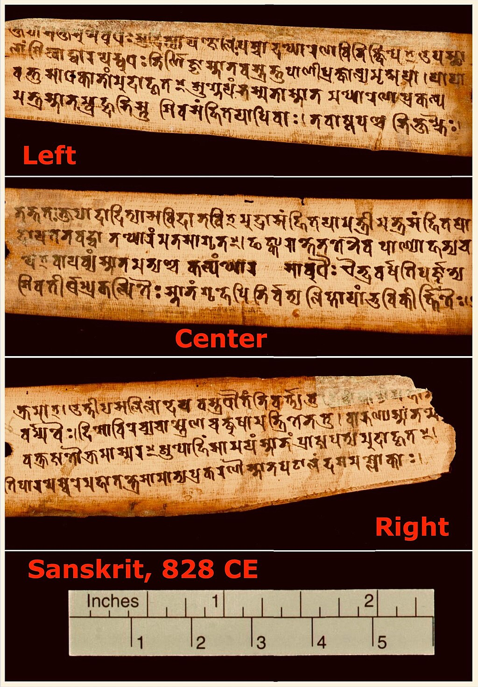One of the oldest surviving Sanskrit manuscript pages in Gupta script (c. 828 CE), discovered in [Nepal](https://en.wikipedia.org/wiki/Nepal "Nepal")

The early history of writing Sanskrit and other languages in ancient India is a problematic topic despite a century of scholarship, states [Richard Salomon](https://en.wikipedia.org/wiki/Richard_G._Salomon_\(professor_of_Asian_studies\) "Richard G. Salomon (professor of Asian studies)") – an epigraphist and Indologist specializing in Sanskrit and Pali literature. The earliest possible script from South Asia is from the [Indus Valley civilization](https://en.wikipedia.org/wiki/Indus_Valley_civilization "Indus Valley civilization") (3rd/2nd millennium BCE), but this script – if it is a script – remains undeciphered. If any scripts existed in the Vedic period, they have not survived. Scholars generally accept that Sanskrit was spoken in an oral society, and that an [oral tradition](https://en.wikipedia.org/wiki/Oral_tradition "Oral tradition") preserved the extensive Vedic and Classical Sanskrit literature. Other scholars such as Jack Goody argue that the Vedic Sanskrit texts are not the product of an oral society, basing this view by comparing inconsistencies in the transmitted versions of literature from various oral societies such as the Greek (Greco-Sanskrit), Serbian, and other cultures. This minority of scholars argue that the Vedic literature is too consistent and vast to have been composed and transmitted orally across generations, without having been written down.

_[Lipi](https://en.wikipedia.org/wiki/Lipi_\(script\) "Lipi (script)")_ is the term in Sanskrit which means "writing, letters, alphabet". It contextually refers to scripts, the art or any manner of writing or drawing. The term, in the sense of a writing system, appears in some of the earliest Buddhist, Hindu, and Jaina texts. [Pāṇini](https://en.wikipedia.org/wiki/Pāṇini "Pāṇini")'s _Astadhyayi_, composed sometime around the 5th or 4th century BCE, for example, mentions _lipi_ in the context of a writing script and education system in his times, but he does not name the script. Several early Buddhist and Jaina texts, such as the _[Lalitavistara Sūtra](https://en.wikipedia.org/wiki/Lalitavistara_Sūtra "Lalitavistara Sūtra")_ and _Pannavana Sutta_ include lists of numerous writing scripts in ancient India. The Buddhist texts list the sixty four _lipi_ that the Buddha knew as a child, with the Brahmi script topping the list. "The historical value of this list is however limited by several factors", states Salomon. The list may be a later interpolation. The [Jain](https://en.wikipedia.org/wiki/Jainism "Jainism") canonical texts such as the _Pannavana Sutta_ – probably older than the Buddhist texts – list eighteen writing systems, with the Brahmi topping the list and Kharotthi (Kharoshthi) listed as fourth. The Jaina text elsewhere states that the "Brahmi is written in 18 different forms", but the details are lacking. However, the reliability of these lists has been questioned and the empirical evidence of writing systems in the form of Sanskrit or Prakrit inscriptions dated prior to the 3rd century BCE has not been found. If the ancient surfaces for writing Sanskrit were palm leaves, tree bark and cloth – the same as those in later times – these have not survived. According to Salomon, many find it difficult to explain the "evidently high level of political organization and cultural complexity" of ancient India without a writing system for Sanskrit and other languages.

The oldest datable writing systems for Sanskrit are the [Brāhmī script](https://en.wikipedia.org/wiki/Brahmi_script "Brahmi script"), the related [Kharoṣṭhī script](/source/kharosthi/ "Kharosthi") and the Brahmi derivatives. The Kharosthi was used in the northwestern part of South Asia and it became extinct, while the Brahmi was used all over the subcontinent along with regional scripts such as Old Tamil. Of these, the earliest records in the Sanskrit language are in Brahmi, a script that later evolved into numerous related Indic scripts for Sanskrit, along with Southeast Asian scripts (Burmese, Thai, Lao, Khmer, others) and many extinct Central Asian scripts such as those discovered along with the [Kharosthi](/source/kharosthi/ "Kharosthi") in the Tarim Basin of western China and in [Uzbekistan](https://en.wikipedia.org/wiki/Uzbekistan "Uzbekistan"). The most extensive inscriptions that have survived into the modern era are the rock edicts and pillar inscriptions of the 3rd century BCE Mauryan emperor [Ashoka](https://en.wikipedia.org/wiki/Ashoka "Ashoka"), but these are not in Sanskrit.

### Scripts

Over the centuries, and across countries, a number of scripts have been used to write Sanskrit.

#### Brahmi script

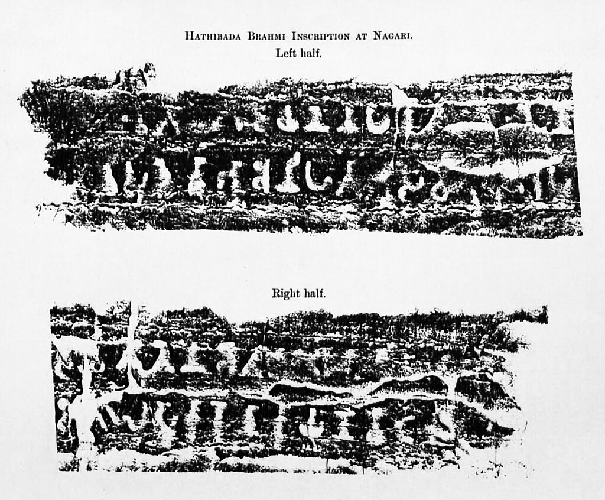One of the oldest Hindu Sanskrit inscriptions, the broken pieces of this early-1st-century BCE [Hathibada Brahmi Inscription](https://en.wikipedia.org/wiki/Hathibada_Ghosundi_Inscriptions "Hathibada Ghosundi Inscriptions") were discovered in Rajasthan. It is a dedication to deities [Vāsudeva](https://en.wikipedia.org/wiki/Vāsudeva "Vāsudeva")-[Samkarshana](https://en.wikipedia.org/wiki/Samkarshana "Samkarshana") ([Krishna](https://en.wikipedia.org/wiki/Krishna "Krishna")-[Balarama](https://en.wikipedia.org/wiki/Balarama "Balarama")) and mentions a stone temple.

The Brahmi script for writing Sanskrit is a "modified consonant-syllabic" script. The graphic syllable is its basic unit, and this consists of a consonant with or without diacritic modifications. Since the vowel is an integral part of the consonants, and given the efficiently compacted, fused consonant cluster morphology for Sanskrit words and grammar, the Brahmi and its derivative writing systems deploy ligatures, diacritics and relative positioning of the vowel to inform the reader how the vowel is related to the consonant and how it is expected to be pronounced for clarity. This feature of Brahmi and its modern Indic script derivatives makes it difficult to classify it under the main script types used for the writing systems for most of the world's languages, namely logographic, syllabic and alphabetic.

#### Nagari script

Many modern era manuscripts are written and available in the Nagari script, whose form is attestable to the 1st millennium CE. The Nagari script is the ancestor of [Devanagari](https://en.wikipedia.org/wiki/Devanagari "Devanagari") (north India), [Nandinagari](https://en.wikipedia.org/wiki/Nandinagari "Nandinagari") (south India) and other variants. The Nāgarī script was in regular use by 7th century CE, and had fully evolved into Devanagari and Nandinagari scripts by about the end of the first millennium of the common era. The Devanagari script, states Banerji, became more popular for Sanskrit in India since about the 18th century. However, Sanskrit does have special historical connection to the Nagari script as attested by the epigraphical evidence.

The Nagari script used for Classical Sanskrit has the fullest repertoire of characters consisting of fourteen vowels and thirty three consonants. For Vedic Sanskrit, it has two more allophonic consonantal characters (the intervocalic ळ _ḷa_, and ळ्ह _ḷha_). To communicate phonetic accuracy, it also includes several modifiers such as the _anusvara_ dot and the _visarga_ double dot, punctuation symbols and others such as the _halanta_ sign.

#### Other writing systems

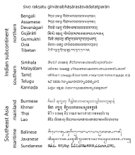Sanskrit in modern Indian and other Brahmi scripts: _May [Śiva](https://en.wikipedia.org/wiki/Shiva "Shiva") bless those who take delight in the language of the gods._ ([Kālidāsa](https://en.wikipedia.org/wiki/Kālidāsa "Kālidāsa"))

Other scripts such as [Gujarati](https://en.wikipedia.org/wiki/Gujarati_alphabet "Gujarati alphabet"), [Bangla-Assamese](https://en.wikipedia.org/wiki/Bengali-Assamese_script "Bengali-Assamese script"), [Odia](https://en.wikipedia.org/wiki/Odia_alphabet "Odia alphabet") and major south Indian scripts, states Salomon, "have been and often still are used in their proper territories for writing Sanskrit". These and many Indian scripts look different to the untrained eye, but the differences between Indic scripts is "mostly superficial and they share the same phonetic repertoire and systemic features", states Salomon. They all have essentially the same set of eleven to fourteen vowels and thirty-three consonants as established by the Sanskrit language and attestable in the Brahmi script. Further, a closer examination reveals that they all have the similar basic graphic principles, the same _varnamala_ (literally, "garland of letters") alphabetic ordering following the same logical phonetic order, easing the work of historic skilled scribes writing or reproducing Sanskrit works across South Asia.

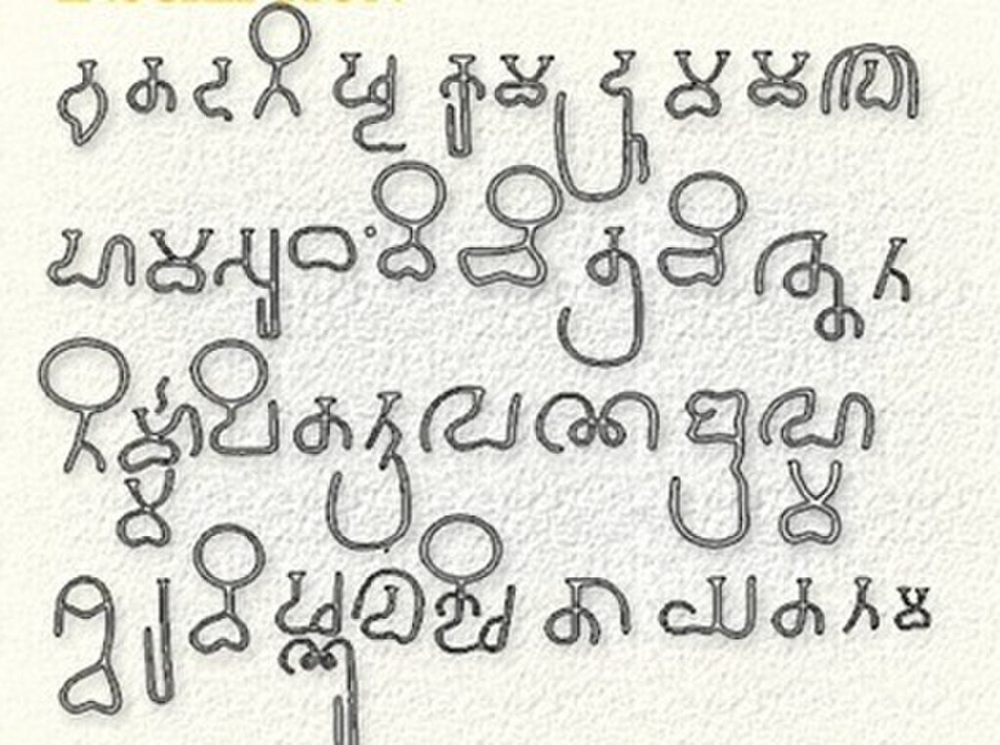One of the earliest known Sanskrit inscriptions in Tamil Grantha script at a rock-cut Hindu Trimurti temple ([Mandakapattu](https://en.wikipedia.org/wiki/Mandagapattu_Temple "Mandagapattu Temple"), c. 615 CE)

In the south, where [Dravidian languages](https://en.wikipedia.org/wiki/Dravidian_languages "Dravidian languages") predominate, scripts used for Sanskrit include the [Kannada](https://en.wikipedia.org/wiki/Kannada_alphabet "Kannada alphabet"), [Telugu](https://en.wikipedia.org/wiki/Telugu_script "Telugu script"), [Malayalam](https://en.wikipedia.org/wiki/Malayalam_script "Malayalam script") and [Grantha alphabets](https://en.wikipedia.org/wiki/Grantha_alphabet "Grantha alphabet").

### Transliteration and romanisation schemes

Since the late 18th century, Sanskrit has been [transliterated](https://en.wikipedia.org/wiki/Transliteration "Transliteration") using the [Latin alphabet](https://en.wikipedia.org/wiki/Latin_alphabet "Latin alphabet"). The system most commonly used today is the IAST ([International Alphabet of Sanskrit Transliteration](https://en.wikipedia.org/wiki/International_Alphabet_of_Sanskrit_Transliteration "International Alphabet of Sanskrit Transliteration")), which has been the academic standard since 1888. [ASCII](https://en.wikipedia.org/wiki/ASCII "ASCII")-based transliteration schemes have also evolved because of difficulties representing Sanskrit characters in computer systems. These include [Harvard-Kyoto](https://en.wikipedia.org/wiki/Harvard-Kyoto "Harvard-Kyoto") and [ITRANS](https://en.wikipedia.org/wiki/ITRANS "ITRANS"), a transliteration scheme that is used widely on the Internet, especially in Usenet and in email, for considerations of speed of entry as well as rendering issues. With the wide availability of [Unicode](https://en.wikipedia.org/wiki/Unicode "Unicode")-aware web browsers, IAST has become common online. It is also possible to type using an [alphanumeric keyboard](https://en.wikipedia.org/wiki/Alphanumeric_keyboard "Alphanumeric keyboard") and transliterate to Devanagari using software like Mac OS X's international support.

### Epigraphy

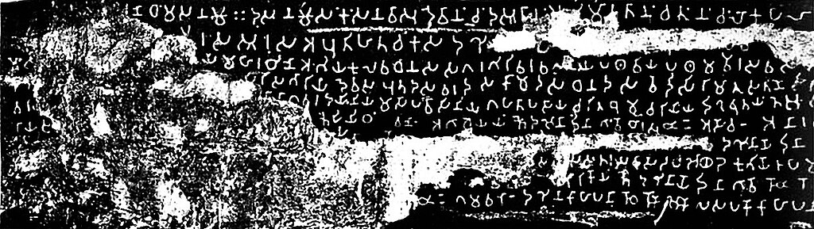

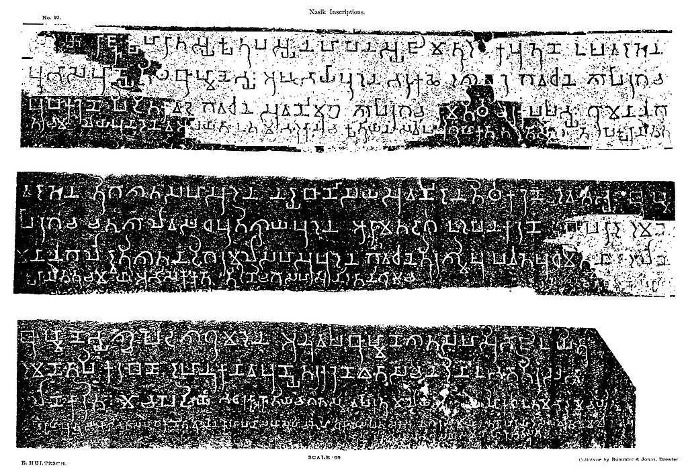

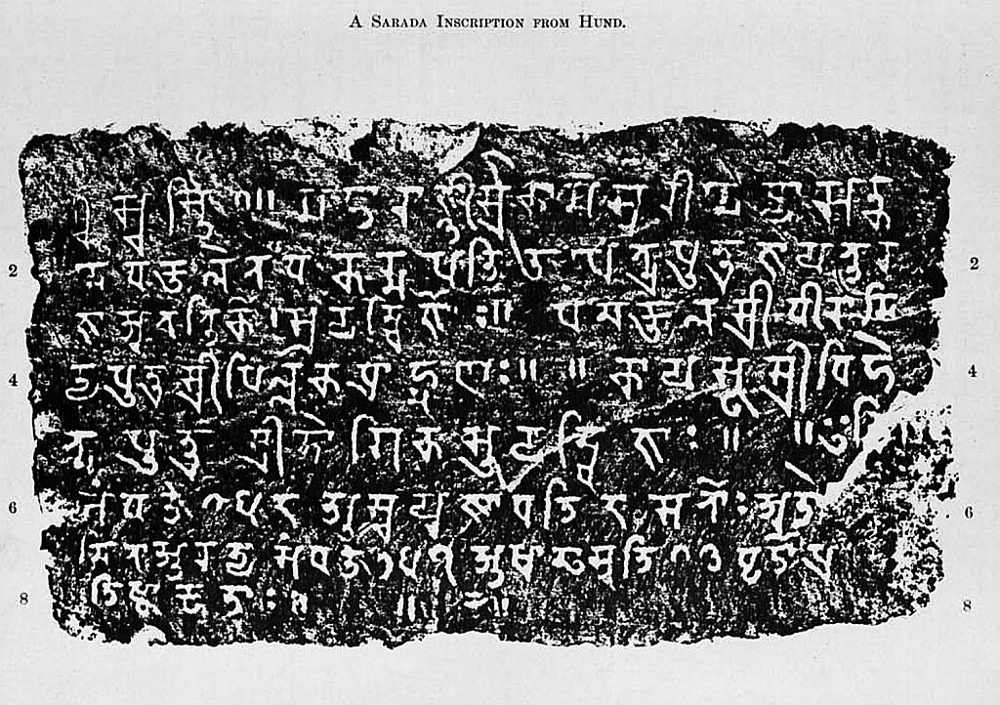

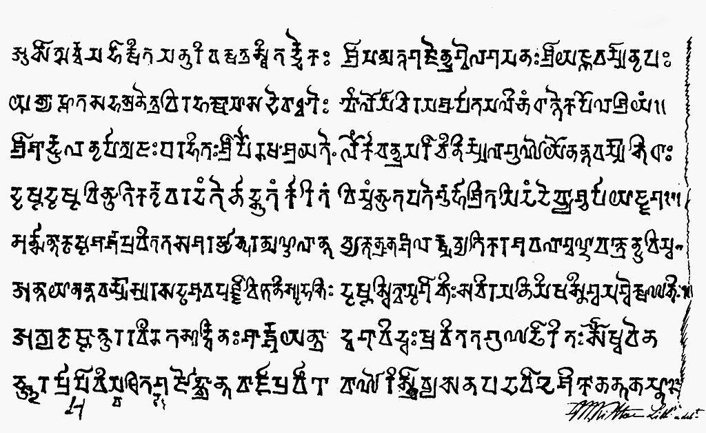

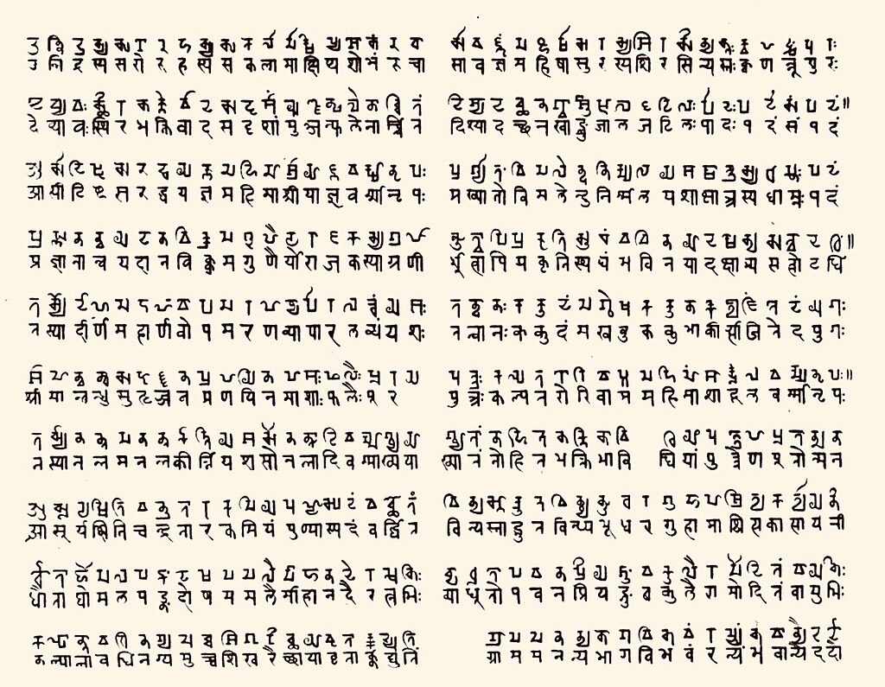

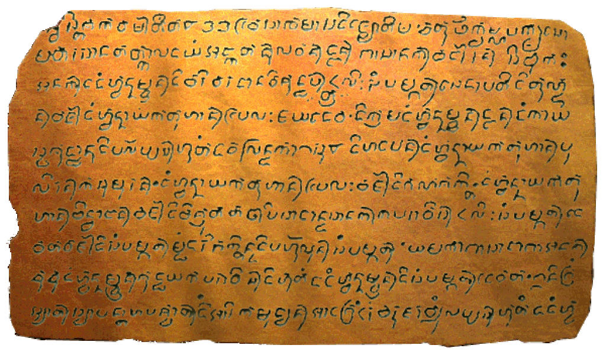

!

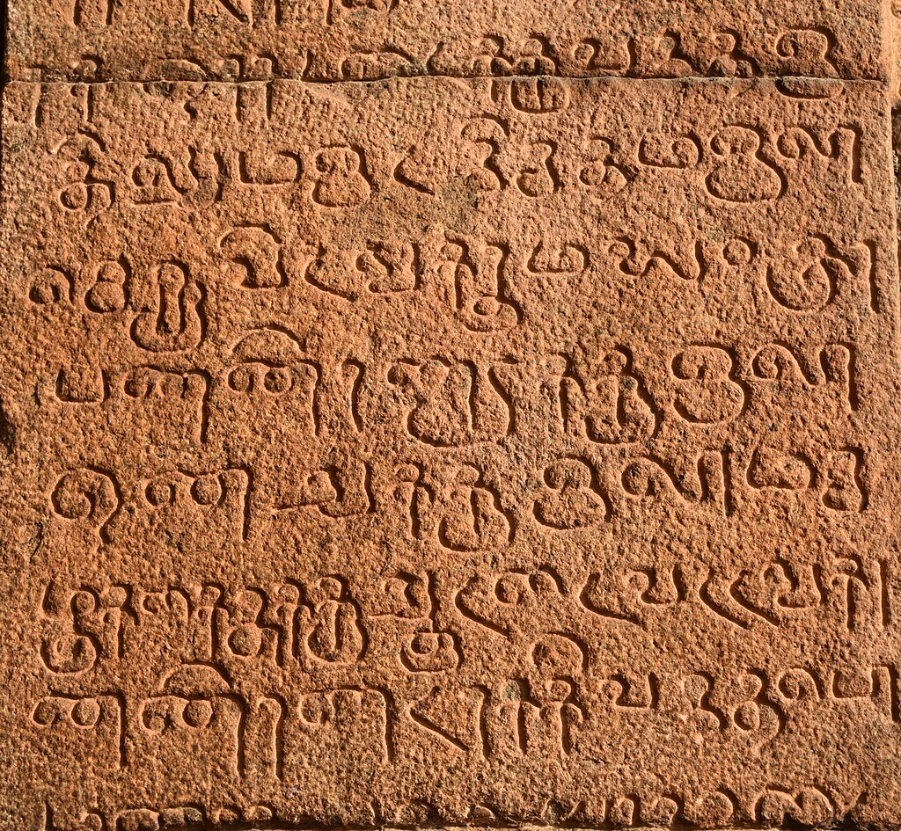

Starting in about the 1st century BCE, Sanskrit has been written in many South Asian, Southeast Asian and Central Asian scripts.

[Sanskrit epigraphy](https://en.wikipedia.org/wiki/Sanskrit_epigraphy "Sanskrit epigraphy"), the study of ancient inscriptions in Sanskrit, offers insight into the [linguistic](https://en.wikipedia.org/wiki/Languages_of_South_Asia "Languages of South Asia"), [cultural](https://en.wikipedia.org/wiki/Culture_of_South_Asia "Culture of South Asia"), and [historical evolution](https://en.wikipedia.org/wiki/South_Asian_history "South Asian history") of South Asia and its neighbors. [Early inscriptions](https://en.wikipedia.org/wiki/Early_Indian_inscriptions "Early Indian inscriptions"), such as those from the 1st century [BCE](https://en.wikipedia.org/wiki/Common_Era "Common Era") in [Ayodhya](https://en.wikipedia.org/wiki/Ayodhya "Ayodhya") and [Hathibada](https://en.wikipedia.org/wiki/Hathibada "Hathibada"), are written in [Brahmi script](https://en.wikipedia.org/wiki/Brahmi_script "Brahmi script") and reflect the transition to [classical Sanskrit](https://en.wikipedia.org/wiki/Classical_Sanskrit "Classical Sanskrit"). The Mathura inscriptions from the 1st and 2nd centuries [CE](https://en.wikipedia.org/wiki/Common_Era "Common Era"), including the [Mora Well](https://en.wikipedia.org/wiki/Mora_Well_Inscription "Mora Well Inscription") and [Vasu Doorjamb](https://en.wikipedia.org/wiki/Vasu_Doorjamb_Inscription "Vasu Doorjamb Inscription") inscriptions, represent significant contributions to the early use of Sanskrit, often linked to Hindu and Jaina traditions.

Sanskrit inscriptions extended beyond South Asia, influencing Southeast Asia from the 4th century CE onward. [Indic scripts](https://en.wikipedia.org/wiki/Indic_scripts "Indic scripts") adapted for Sanskrit were found in regions like Vietnam, Malaysia, Indonesia, and Cambodia, where they evolved into local scripts such as Khmer, Javanese, and Balinese. These inscriptions highlight the spread of [Indian cultural](https://en.wikipedia.org/wiki/Indian_culture "Indian culture") and [religious practices](https://en.wikipedia.org/wiki/Indian_religion "Indian religion").

## Literature

Literature in Sanskrit can be broadly divided into texts composed in Vedic Sanskrit and the later Classical Sanskrit. Vedic Sanskrit is the language of the extensive liturgical works of the Vedic religion, which aside from the four Vedas, include the Brāhmaṇas and the Sūtras.

The Vedic literature that survives is entirely of a religious form, whereas works in Classical Sanskrit exist in a wide variety of fields including epics, lyric, drama, romance, fairytale, fables, grammar, civil and religious law, the science of politics and practical life, the science of love and sex, philosophy, medicine, astronomy, astrology and mathematics, and is largely secular in subject-matter.

While Vedic literature is essentially optimistic in spirit, portraying man as strong and powerful capable of finding fulfilment both here and in the afterworld, the later literature is pessimistic, portraying humans as controlled by the forces of fate with worldly pleasures deemed the cause of misery. These fundamental differences in psychology are attributed to the absence of the doctrines of Karma and reincarnation in the Vedic period, notions which are very prevalent in later times.

### Works

Sanskrit has been written in various scripts on a variety of media such as palm leaves, cloth, paper, rock and metal sheets, from ancient times.

Sanskrit literature by tradition

Tradition Sanskrit texts, genre or collection Example References

Hinduism

Scriptures

[Vedas](https://en.wikipedia.org/wiki/Vedas "Vedas"), [Upaniṣads](https://en.wikipedia.org/wiki/Upanishads "Upanishads"), [Āgamas](https://en.wikipedia.org/wiki/Āgama_\(Hinduism\) "Āgama (Hinduism)"), [the Bhagavad·Gītā](https://en.wikipedia.org/wiki/Bhagavad_Gita "Bhagavad Gita")

Language, Grammar

Aṣṭādhyāyī, Gaṇa·pāṭha, Pada·pāṭha, Vārttikas, Mahābhāṣya, Vākya·padīya, Phiṭ·sūtra

Civil and Religious Law

Dharma·sūtras/Dharma·śāstras, Manu·smṛti

Statecraft, political science

Artha·śāstra

Timekeeping, Mathematics, Logic

[Kalpa](https://en.wikipedia.org/wiki/Kalpa_\(Vedanga\) "Kalpa (Vedanga)"), [Jyotiṣa](https://en.wikipedia.org/wiki/Jyotisha "Jyotisha"), Gaṇita·śāstra, Śulba·sūtras, Siddhāntas, Āryabhaṭīya, Daśa·gītikā·sutra, Siddhānta·śiromaṇi, Gaṇita·sāra·saṅgraha, Bīja·gaṇita

Life sciences, health

Āyurveda, Suśruta·saṃhitā, Caraka·saṃhitā

Sex, emotions

[Kāma·sūtra](https://en.wikipedia.org/wiki/Kama_Sutra "Kama Sutra"), Pañca·sāyaka, Rati·rahasya, Rati·mañjari, Anaṅga·ranga

Epics

Rāmāyaṇa, Mahābhārata

Court Epic (Kāvya)

Raghu·vaṃśa, Kumāra·sambhava

Gnomic and didactic literature

Subhāṣitas, Nīti·śataka, Bodhicary'âvatāra, Śṛṅgāra·jñāna·nirṇaya, Kalā·vilāsa, Catur·varga·saṅgraha, Nīti·mañjari, Mugdh'ôpadeśa, Subhāṣita·ratna·sandoha, Yoga·śāstra, Śṛṅgāra·vairāgya·taraṅgiṇī

Drama, dance and the performance arts

Nāṭya·śāstra

Music

Sangīta·śāstra

Poetics

Kāvya·śāstra

Mythology

Purāṇas

Mystical speculations, philosophy

Darśana, [Sāṅkhya](https://en.wikipedia.org/wiki/Samkhya "Samkhya"), [Yoga (philosophy)](https://en.wikipedia.org/wiki/Yoga_\(philosophy\) "Yoga (philosophy)"), [Nyāya](https://en.wikipedia.org/wiki/Nyaya "Nyaya"), [Vaiśeṣika](https://en.wikipedia.org/wiki/Vaisheshika "Vaisheshika"), [Mīmāṅsa](https://en.wikipedia.org/wiki/Mimamsa "Mimamsa"), [Vedānta](https://en.wikipedia.org/wiki/Vedanta "Vedanta"), [Vaishnavism](https://en.wikipedia.org/wiki/Vaishnavism "Vaishnavism"), [Shaivism](https://en.wikipedia.org/wiki/Shaivism "Shaivism"), [Shaktism](https://en.wikipedia.org/wiki/Shaktism "Shaktism"), [Smārta Tradition](https://en.wikipedia.org/wiki/Smarta_Tradition "Smarta Tradition") and others

Agriculture and food

Kṛṣi·śāstra

Design, architecture (Vastu, Śilpa)

Śilpa·śāstra

Temples, Sculpture

Bṛhat·saṃhitā

Saṃskāra (rites-of-passage)

Gṛhya·sūtras

Buddhism

Sutras, Vinaya, Kāvya, Medicine, [Buddhist philosophy](https://en.wikipedia.org/wiki/Buddhist_philosophy "Buddhist philosophy")

[Tripiṭaka](https://en.wikipedia.org/wiki/Tripitaka "Tripitaka"), [Mahayana sutras](https://en.wikipedia.org/wiki/Mahayana_sutras "Mahayana sutras") and [shastras](https://en.wikipedia.org/wiki/Shastra "Shastra"), [tantras](https://en.wikipedia.org/wiki/Tantras_\(Buddhism\) "Tantras (Buddhism)"), grammar texts, [Buddhist poetry](https://en.wikipedia.org/wiki/Buddhist_poetry "Buddhist poetry"), drama, Buddhist medical texts

Jainism

Theology, philosophy

[Tattvārtha Sūtra](https://en.wikipedia.org/wiki/Tattvartha_Sutra "Tattvartha Sutra"), Mahāpurāṇa and others

## Lexicon

As an Indo-European language, Sanskrit's core [lexicon](https://en.wikipedia.org/wiki/Lexicon "Lexicon") is inherited from Proto-Indo-European. Over time however, the language exhibits a tendency to shed many of these inherited words and borrow others in their place from other sources.

In the oldest Vedic literature, there are few such non-Indo-European words, but these progressively grow in volume.

The following are some of the old Indo-European words that eventually fade out of use in Sanskrit:

_ápas_

work

cf. Latin _opus_

_kravís_

raw flesh

cf. Latin _crūdus_

_dáma-_

house

cf. Latin _domus_

_dā́nu-_

moisture

_háras-_

heat

### Dravidian lexical influence

The sources of these new loanwords are many, and vary across the different regions of the [Indian subcontinent](https://en.wikipedia.org/wiki/Indian_subcontinent "Indian subcontinent"). But of all influences on the lexicon of Sanskrit, the most important is Dravidian.

The following is a list of Dravidian entrants into Sanskrit lexicon, although some may have been contested:

_phálam_

ripe fruit

Proto-Dravidian _\*paẓam_

_múkham_

mouth

Proto-Dravidian _\*mukam_

_kajjala-_

soot, lampblack

_kaṭu-_

sharp, pungent

_kaṭhina-_

hard, firm

_kuṭi-_

hut, house

_kuṭṭ-_

to pound

_kuṇḍala-_

loop, ring, earring,
coil of rope

_khala-_

a rogue

_mayū́ra-_

peacock

_mallikā_

jasmine

_mīna-_

fish

_vallī-_

creeper

_heramba-_

buffalo

### Nominal-form preference

While Vedic and epic form of speech is largely cognate to that of other [Indo-European languages](https://en.wikipedia.org/wiki/Indo-European_languages "Indo-European languages") such as Greek and Latin, later Sanskrit shows a tendency to move away from using verbal forms to nominal ones. Examples of nominal forms taking the place of conventional conjugation are:

past passive participle

_naraḥ gataḥ_

"the man went",
(lit.'The man was gone')

active past participle in _-vant_

_kṛtavān_

"he had done" (lit.'He, having done, (is)')

However the most notable development is the prolific use of word-compounding to express ideas normally conveyed by verbal forms and sub-clauses introduced by conjunctions.

Classical Sanskrit's pre-eminent playwright [Kālidāsa](https://en.wikipedia.org/wiki/Kālidāsa "Kālidāsa") uses:

_vīcikṣobhastanitavihagaśreṇikāñcīguṇā_

whose girdle-string is a row of birds,
loquacious through the agitation of the waves

## Influence on other languages

For nearly 2,000 years, Sanskrit was the language of a cultural order that exerted influence across South Asia, [Inner Asia](https://en.wikipedia.org/wiki/Inner_Asia "Inner Asia"), Southeast Asia, and to a certain extent East Asia. A significant form of post-Vedic Sanskrit is found in the Sanskrit of [Indian epic poetry](https://en.wikipedia.org/wiki/Indian_epic_poetry "Indian epic poetry")—the _[Ramayana](https://en.wikipedia.org/wiki/Ramayana "Ramayana")_ and _[Mahabharata](https://en.wikipedia.org/wiki/Mahabharata "Mahabharata")_. The deviations from _[Pāṇini](https://en.wikipedia.org/wiki/Pāṇini "Pāṇini")_ in the epics are generally considered to be on account of interference from [Prakrits](https://en.wikipedia.org/wiki/Prakrit "Prakrit"), or innovations, and not because they are pre-Paninian. Traditional Sanskrit scholars call such deviations _ārṣa_ (आर्ष), meaning 'of the [ṛṣis](https://en.wikipedia.org/wiki/Rishi "Rishi")', the traditional title for the ancient authors. In some contexts, there are also more "prakritisms" (borrowings from common speech) than in Classical Sanskrit proper. [Buddhist Hybrid Sanskrit](https://en.wikipedia.org/wiki/Buddhist_Hybrid_Sanskrit "Buddhist Hybrid Sanskrit") is a literary language heavily influenced by the [Middle Indo-Aryan languages](https://en.wikipedia.org/wiki/Middle_Indo-Aryan_languages "Middle Indo-Aryan languages"), based on early Buddhist Prakrit texts which subsequently assimilated to the Classical Sanskrit standard in varying degrees.

### Indian subcontinent

Sanskrit has greatly influenced the languages of India that grew from its vocabulary and grammatical base; for instance, [Hindi](https://en.wikipedia.org/wiki/Standard_Hindi "Standard Hindi") is a "Sanskritised register" of [Hindustani](https://en.wikipedia.org/wiki/Hindustani_language "Hindustani language"). All modern [Indo-Aryan languages](https://en.wikipedia.org/wiki/Indo-Aryan_languages "Indo-Aryan languages"), as well as [Munda](https://en.wikipedia.org/wiki/Munda_languages "Munda languages") and [Dravidian languages](https://en.wikipedia.org/wiki/Dravidian_languages "Dravidian languages") have borrowed many words either directly from Sanskrit (_[tatsama](https://en.wikipedia.org/wiki/Tatsama "Tatsama")_ words), or indirectly via middle Indo-Aryan languages (_[tadbhava](https://en.wikipedia.org/wiki/Tadbhava "Tadbhava")_ words). Words originating in Sanskrit are estimated at fifty percent of the vocabulary of modern Indo-Aryan languages, as well as the literary forms of [Malayalam](https://en.wikipedia.org/wiki/Malayalam "Malayalam") and [Kannada](https://en.wikipedia.org/wiki/Kannada "Kannada"). Literary texts in [Telugu](https://en.wikipedia.org/wiki/Telugu_language "Telugu language") are [lexically](https://en.wikipedia.org/wiki/Lexicon "Lexicon") Sanskrit or Sanskritised to an enormous extent, perhaps seventy percent or more. [Marathi](https://en.wikipedia.org/wiki/Marathi_language "Marathi language") is another prominent language in Western India, that derives most of its words and [Marathi grammar](https://en.wikipedia.org/wiki/Marathi_grammar "Marathi grammar") from Sanskrit. Sanskrit words are often preferred in the literary texts in Marathi over corresponding colloquial Marathi word.

There has been a profound influence of Sanskrit on the lexical and grammatical systems of Dravidian languages. As per Dalby, India has been a single cultural area for about two millennia which has helped Sanskrit influence on all the Indic languages. Emeneau and Burrow mention the tendency "for all four of the Dravidian literary languages in South to make literary use of total Sanskrit lexicon indiscriminately". There are a large number of loanwords found in the vocabulary of the three major Dravidian languages Malayalam, Kannada and Telugu. Tamil also has significant loanwords from Sanskrit. Krishnamurthi mentions that although it is not clear when the Sanskrit influence happened on the Dravidian languages, it might have been around the 5th century BCE at the time of separation of Tamil and Kannada from a [common ancestral stage](https://en.wikipedia.org/wiki/Tamil–Kannada_languages "Tamil–Kannada languages"). ‌The borrowed words are classified into two types based on phonological integration – _tadbhava_ – those words derived from Prakrit and _tatsama_ – unassimilated loanwords from Sanskrit.

Strazny mentions that "so massive has been the influence that it is hard to utter Sanskrit words have influenced Kannada from the early times". The first document in Kannada, the Halmidi inscription has a large number of Sanskrit words. As per Kachru, the influence has not only been on single lexical items in Kannada but also on "long nominal compounds and complicated syntactic expressions". New words have been created in Kannada using Sanskrit derivational prefixes and suffixes like _vikēndrīkaraṇa, anilīkaraṇa, bahīskruṭa_. Similar stratification is found in verb morphology. Sanskrit words readily undergo verbalization in Kannada, verbalizing suffixes as in: _chāpisu, dauḍāyisu, ravānisu._

George mentions that "No other Dravidian language has been so deeply influenced by Sanskrit as Malayalam". According to Lambert, Malayalam is so immensely Sanskritised that every Sanskrit word can be used in Malayalam by integrating "prosodic phonological" changes as per Grant. Loanwords have been integrated into Malayalam by "prosodic phonological" changes as per Grant. These phonological changes are either by replacement of a vowel as in _sant-_am coming from Sanskrit _santa_, _sāgar_-am from _sāgara_, or addition of prothetic vowel as in _aracan_ from _rājā-_, _uruvam_ from _rūpa_, _codyam_ from _sodhya_.

Hans Henrich et al. note that, the language of the pre-modern Telugu literature was also highly influenced by Sanskrit and was standardized between 11th and 14th centuries. Aiyar has shown that in a class of _tadbhavas_ in Telugu the first and second letters are often replaced by the third and fourth letters and fourth again replaced often by h. Examples of the same are: Sanskrit _artha_ becomes _ardhama_, _vīthi_ becomes _vidhi_, _putra_ becomes _bidda_, _mukham_ becomes _muhamu_.

[Tamil](https://en.wikipedia.org/wiki/Tamil_language "Tamil language") also has been influenced by Sanskrit. Hans Henrich et al. mention that propagation of Jainism and Buddhism into south India had its influence. Shulman mentions that although contrary to the views held by Tamil purists, modern Tamil has been significantly influenced from Sanskrit, further states that "Indeed, there may well be more Sanskrit in Tamil than in the Sanskrit derived north-Indian vernaculars". Sanskrit words have been Tamilized through the "Tamil phonematic grid".

### Beyond the Indian subcontinent

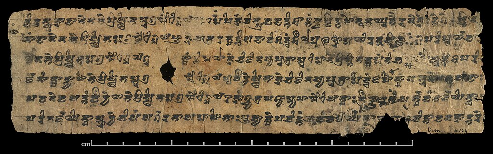

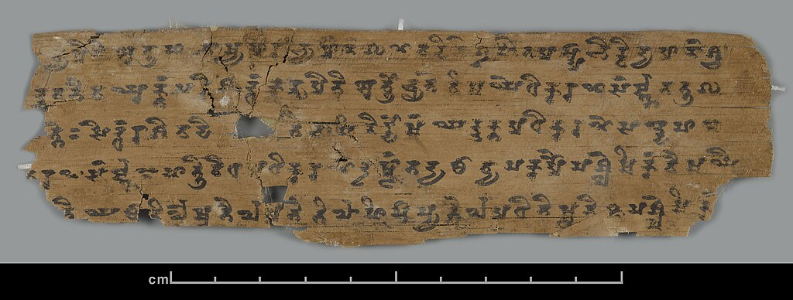

Sanskrit has had a historical presence and influence in many parts of Asia. Above (top clockwise): \[i\] a Sanskrit manuscript from Turkestan, \[ii\] another from Miran-China.

Sanskrit was a language for religious purposes and for the political elite in parts of medieval era Southeast Asia, Central Asia and East Asia, having been introduced in these regions mainly along with the spread of Buddhism. In some cases, it has competed with Pāli for prominence.

#### East Asia

\[i\] a bell with Sanskrit engravings in South Korea \[ii\] the [Kūkai](https://en.wikipedia.org/wiki/Kūkai "Kūkai") calligraphy of Siddham-Sanskrit in Japan

[Buddhist Sanskrit](https://en.wikipedia.org/wiki/Buddhist_Hybrid_Sanskrit "Buddhist Hybrid Sanskrit") has had a considerable influence on [Sino-Tibetan languages](https://en.wikipedia.org/wiki/Sino-Tibetan_languages "Sino-Tibetan languages") such as Chinese, state William Wang and Chaofen Sun. Many words have been adopted from Sanskrit into Chinese, both in its historic religious discourse and everyday use. This process likely started about 200 CE and continued through about 1400 CE, with the efforts of monks such as Yuezhi, Anxi, Kangju, Tianzhu, Yan Fodiao, Faxian, Xuanzang and [Yijing](https://en.wikipedia.org/wiki/Yijing_\(monk\) "Yijing (monk)").

Further, as the Chinese languages and culture influenced the rest of East Asia, the ideas in Sanskrit texts and some of its linguistic elements migrated further.

Many terms were transliterated directly and added to the Chinese vocabulary. Chinese words like 剎那 _chànà_ ([Devanagari](https://en.wikipedia.org/wiki/Devanagari "Devanagari"): क्षण _kṣaṇa_ 'instantaneous period') were borrowed from Sanskrit. Many Sanskrit texts survive only in Tibetan collections of commentaries to the Buddhist teachings, the [Tengyur](https://en.wikipedia.org/wiki/Tengyur "Tengyur").

Sanskrit has also influenced the religious register of Japanese mostly through transliterations. These were borrowed from Chinese transliterations. In particular, the [Shingon](https://en.wikipedia.org/wiki/Shingon "Shingon") (lit.'True Words') sect of esoteric Buddhism has been relying on Sanskrit and original Sanskrit [mantras](https://en.wikipedia.org/wiki/Mantra "Mantra") and writings, as a means of realizing Buddhahood.

#### Southeast Asia

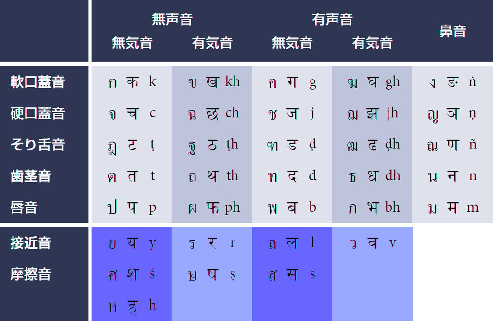

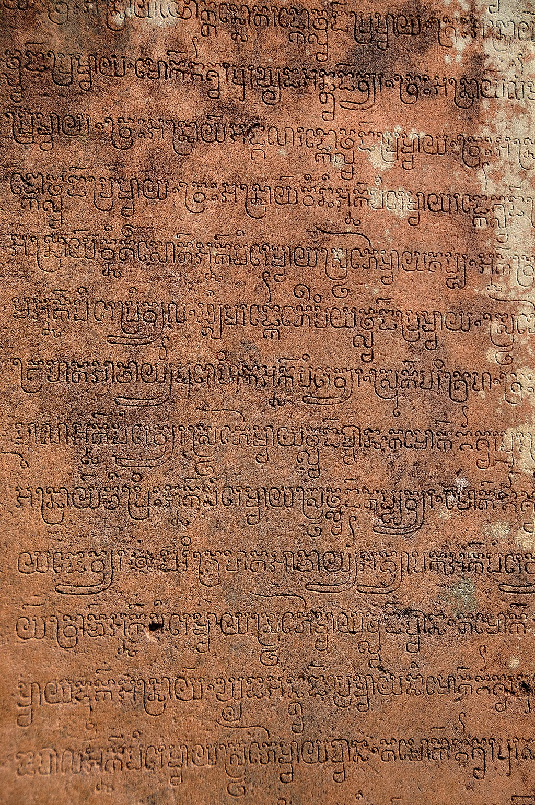

\[i\] the Thai script \[ii\] a Sanskrit inscription in Cambodia

A large number of inscriptions in Sanskrit across Southeast Asia testify the influence the language held in these regions.

Languages such as [Indonesian](https://en.wikipedia.org/wiki/Indonesia_language "Indonesia language"), [Thai](https://en.wikipedia.org/wiki/Thai_language "Thai language") and [Lao](https://en.wikipedia.org/wiki/Lao_language "Lao language") contain many [loanwords](https://en.wikipedia.org/wiki/Loanword "Loanword") from Sanskrit, as does [Khmer](https://en.wikipedia.org/wiki/Khmer_language "Khmer language"). Many Sanskrit loanwords are also found in [Austronesian languages](https://en.wikipedia.org/wiki/Austronesian_languages "Austronesian languages"), such as [Javanese](https://en.wikipedia.org/wiki/Javanese_language "Javanese language"), particularly the [older form](https://en.wikipedia.org/wiki/Old_Javanese "Old Javanese") in which nearly half the vocabulary is borrowed.

Other Austronesian languages, such as [Malay](https://en.wikipedia.org/wiki/Malay_language "Malay language") (descended into modern [Malaysian](https://en.wikipedia.org/wiki/Malaysian_language "Malaysian language") and [Indonesian](https://en.wikipedia.org/wiki/Indonesian_language "Indonesian language") standards) also derive [much of their vocabulary](https://en.wikipedia.org/wiki/List_of_loanwords_in_Indonesian#From_Sanskrit "List of loanwords in Indonesian") from Sanskrit. Similarly, [Philippine languages](https://en.wikipedia.org/wiki/Philippine_languages "Philippine languages") such as [Tagalog](https://en.wikipedia.org/wiki/Tagalog_language "Tagalog language") have [some Sanskrit loanwords](https://en.wikipedia.org/wiki/List_of_loanwords_in_Tagalog#Sanskrit "List of loanwords in Tagalog").

A Sanskrit loanword encountered in many Southeast Asian languages is the word _[bhāṣā](https://en.wikipedia.org/wiki/Bahasa "Bahasa")_, or spoken language, which is used to refer to the names of many languages.

To this day, Southeast Asian languages such as Thai are known to draw upon Sanskrit for technical vocabulary.

##### Indonesia

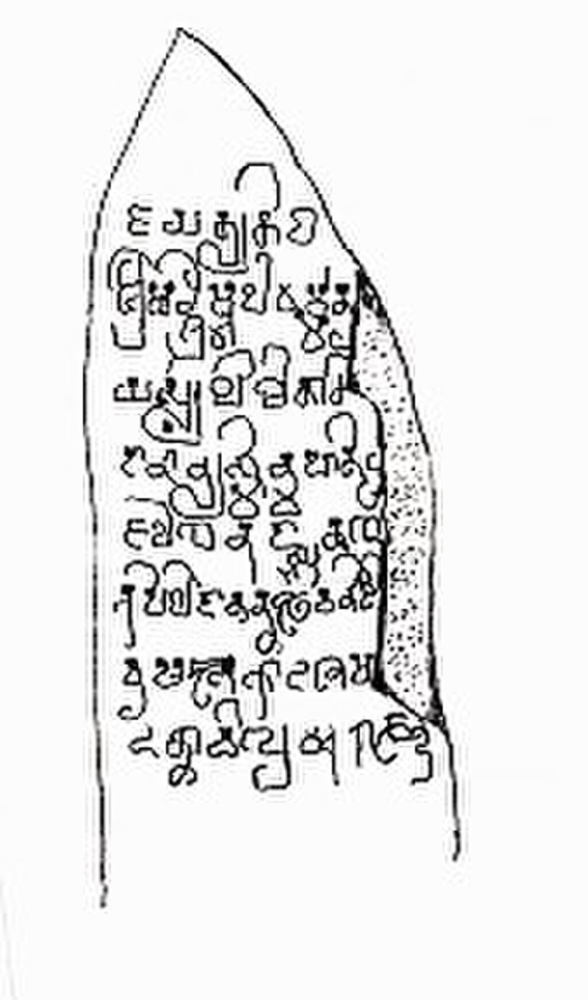The ancient [Yūpa](https://en.wikipedia.org/wiki/Yūpa#Yūpa_inscription_in_Indonesia "Yūpa") inscription (one of the earliest and oldest Sanskrit texts written in ancient Indonesia) dating back to the [4th century CE](https://en.wikipedia.org/wiki/4th_century_CE "4th century CE") written by [Brahmins](https://en.wikipedia.org/wiki/Brahmin "Brahmin") under the rule of King [Mulavarman](https://en.wikipedia.org/wiki/Mulavarman "Mulavarman") of the [Kutai Martadipura Kingdom](https://en.wikipedia.org/wiki/Kutai#History "Kutai") located in [eastern Borneo](https://en.wikipedia.org/wiki/East_Kalimantan "East Kalimantan")

The earliest Sanskrit text which was founded in the [Indonesian Archipelago](https://en.wikipedia.org/wiki/Indonesian_Archipelago "Indonesian Archipelago") was at [Eastern Borneo](https://en.wikipedia.org/wiki/East_Kalimantan "East Kalimantan") dating back to 400 CE known as the [Mulavarman inscription](https://en.wikipedia.org/wiki/Yūpa#Yūpa_inscription_in_Indonesia "Yūpa"). This is one of the reason of strong influence of Indian culture that entered the [Malay Archipelago](https://en.wikipedia.org/wiki/Malay_Archipelago "Malay Archipelago") during the [Indianization era](https://en.wikipedia.org/wiki/Greater_India "Greater India"), and since then, Indian culture has been absorbed towards Indonesian culture and language. Thus, the Sanskrit culture in Indonesia exists not as a religious aspect but more towards a cultural aspect that has been present for generations, resulting in a more cultural rather than Hinduistic value of the [Indonesian people](https://en.wikipedia.org/wiki/Indonesian_people "Indonesian people"). As a result, it is common to find Muslim or Christian Indonesians with names that have Indian or Sanskrit nuances. Unlike names derived from Sanskrit in [Thai](https://en.wikipedia.org/wiki/Thai_language "Thai language") and [Khmer](https://en.wikipedia.org/wiki/Khmer_language "Khmer language"), the pronunciation of Sanskrit names in Indonesia is more similar to the original Indian pronunciation, except that "v" is changed to "w", for example, "Vishnu" in India will be spelled "Wisnu" in Indonesia.

#### Rest of the world

In ancient and medieval times, several Sanskrit words in the field of food and spices made their way into European languages including Greek, Latin and later English. Some of these are _pepper_, _ginger_ and _sugar_. English today has several [words of Sanskrit origin](https://en.wikipedia.org/wiki/List_of_English_words_of_Sanskrit_origin "List of English words of Sanskrit origin"), most of them borrowed during the [British Raj](https://en.wikipedia.org/wiki/British_Raj "British Raj") or later. Some of these words have in turn been borrowed by other European or world languages.

## Modern era

### Liturgy, ceremonies and meditation

Sanskrit is the sacred language of various Hindu, Buddhist, and [Jain](https://en.wikipedia.org/wiki/Jain "Jain") traditions. It is used during worship in [Hindu temples](https://en.wikipedia.org/wiki/Hindu_temple "Hindu temple"). In [Newar Buddhism](https://en.wikipedia.org/wiki/Newar_Buddhism "Newar Buddhism"), it is used in all monasteries. Sanskrit mantras and Sanskrit as a ritual language was commonplace among Jains throughout their medieval history.

Many Hindu rituals and rites-of-passage such as the "giving away the bride" and mutual vows at weddings, a baby's naming or first solid food ceremony and the goodbye during a cremation invoke and chant Sanskrit hymns. Major festivals such as the _[Durga Puja](https://en.wikipedia.org/wiki/Durga_Puja "Durga Puja")_ ritually recite entire Sanskrit texts such as the _[Devi Mahatmya](https://en.wikipedia.org/wiki/Devi_Mahatmya "Devi Mahatmya")_ every year particularly among the numerous communities of eastern India. In the south, Sanskrit texts are recited at many major Hindu temples such as the [Meenakshi Temple](https://en.wikipedia.org/wiki/Meenakshi_Temple "Meenakshi Temple"). In India and beyond, recitations of the _[Bhagavad Gita](https://en.wikipedia.org/wiki/Bhagavad_Gita "Bhagavad Gita")_ occur in diverse settings, including "simple private household readings, to family and neighborhood recitation sessions, to holy men reciting in temples or at pilgrimage places for passersby, to public Gita discourses held almost nightly at halls and auditoriums in every Indian city".

### Literature and arts

More than 3,000 Sanskrit works have been composed since India's independence in 1947. Much of this work has been judged of high quality, in comparison to both classical Sanskrit literature and modern literature in other Indian languages. In 2009, [Satya Vrat Shastri](https://en.wikipedia.org/wiki/Satya_Vrat_Shastri "Satya Vrat Shastri") became the first Sanskrit author to win the [Jnanpith Award](https://en.wikipedia.org/wiki/Jnanpith_Award "Jnanpith Award"), India's highest literary award.

Sanskrit is used extensively in the [Carnatic](https://en.wikipedia.org/wiki/Carnatic_music "Carnatic music") and [Hindustani](https://en.wikipedia.org/wiki/Hindustani_classical_music "Hindustani classical music") branches of classical music. [Kirtanas](https://en.wikipedia.org/wiki/Kirtan "Kirtan"), [bhajans](https://en.wikipedia.org/wiki/Bhajan "Bhajan"), [stotras](https://en.wikipedia.org/wiki/Stotra "Stotra"), and [shlokas](https://en.wikipedia.org/wiki/Shloka "Shloka") of Sanskrit are popular throughout India. The [Samaveda](https://en.wikipedia.org/wiki/Samaveda "Samaveda") uses musical notations in several of its recessions.

In [Mainland China](https://en.wikipedia.org/wiki/Mainland_China "Mainland China"), musicians such as [Sa Dingding](https://en.wikipedia.org/wiki/Sa_Dingding "Sa Dingding") have written [pop songs](https://en.wikipedia.org/wiki/Popular_music "Popular music") in Sanskrit.

Numerous loan Sanskrit words are found in other major Asian languages. For example, [Filipino](https://en.wikipedia.org/wiki/List_of_loanwords_in_Tagalog#Sanskrit "List of loanwords in Tagalog"), [Cebuano](https://en.wikipedia.org/wiki/Cebuano_language "Cebuano language"), [Lao](https://en.wikipedia.org/wiki/Lao_language "Lao language"), [Khmer](https://en.wikipedia.org/wiki/Khmer_language "Khmer language"), [Thai](https://en.wikipedia.org/wiki/List_of_loanwords_in_Thai "List of loanwords in Thai") and its [alphabets](https://en.wikipedia.org/wiki/Thai_alphabet#Sanskrit_and_Pali "Thai alphabet"), [Malay](https://en.wikipedia.org/wiki/List_of_loanwords_in_Malay "List of loanwords in Malay") (including [Malaysian](https://en.wikipedia.org/wiki/Malaysian_language "Malaysian language") and [Indonesian](https://en.wikipedia.org/wiki/List_of_loanwords_in_Indonesian#From_Sanskrit "List of loanwords in Indonesian")), [Javanese](https://en.wikipedia.org/wiki/Javanese_language "Javanese language") (old Javanese-English dictionary by [P.J. Zoetmulder](https://en.wikipedia.org/wiki/P.J._Zoetmulder "P.J. Zoetmulder") contains over 25,500 entries), and even in [English](https://en.wikipedia.org/wiki/List_of_English_words_of_Sanskrit_origin "List of English words of Sanskrit origin").

### Media

Since 1974, there has been a short daily news broadcast on [All India Radio](https://en.wikipedia.org/wiki/All_India_Radio "All India Radio"). These broadcasts are also made available on the internet on AIR's website. Sanskrit news is broadcast on TV and on the internet through the DD National channel. Over 90 weeklies, fortnightlies and quarterlies are published in Sanskrit. _[Sudharma](https://en.wikipedia.org/wiki/Sudharma "Sudharma")_, a daily printed newspaper in Sanskrit, has been published out of [Mysore](https://en.wikipedia.org/wiki/Mysore "Mysore"), India, since 1970. It was started by K.N. Varadaraja Iyengar, a Sanskrit scholar from [Mysore](https://en.wikipedia.org/wiki/Mysore "Mysore").

### Schools and contemporary status

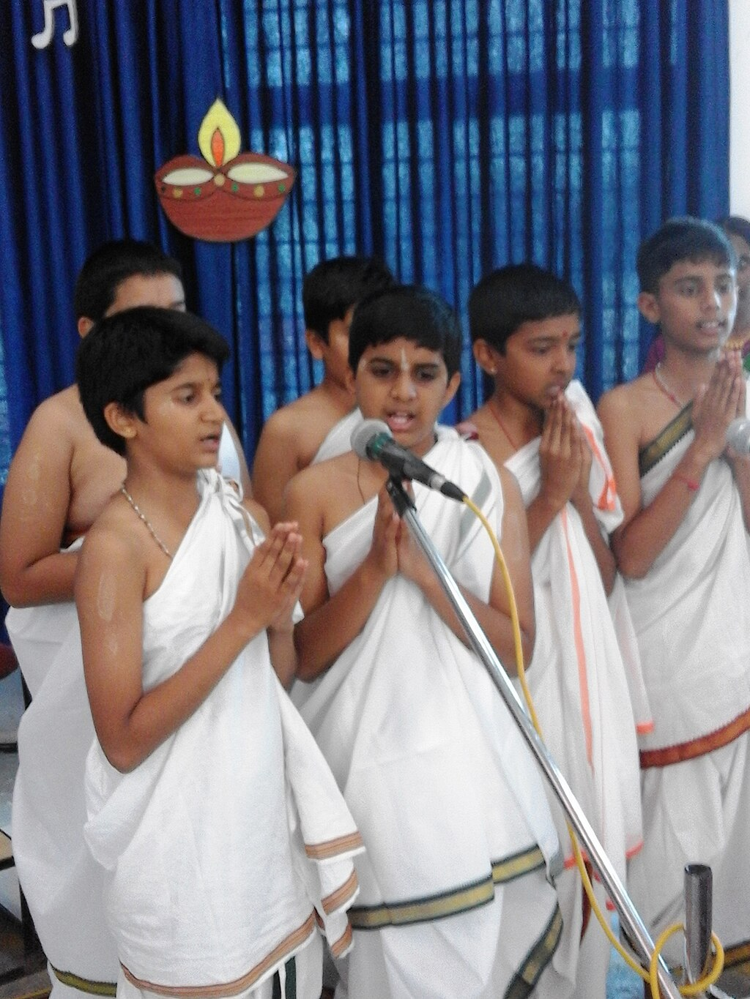Sanskrit festival at [Pramati Hillview Academy](https://en.wikipedia.org/wiki/Pramati_Hillview_Academy "Pramati Hillview Academy"), [Mysore](https://en.wikipedia.org/wiki/Mysore "Mysore"), India

Sanskrit has been taught in schools from time immemorial in India. In modern times, the first Sanskrit University was [Sampurnanand Sanskrit University](https://en.wikipedia.org/wiki/Sampurnanand_Sanskrit_University "Sampurnanand Sanskrit University"), established in 1791 in the Indian city of [Varanasi](https://en.wikipedia.org/wiki/Varanasi "Varanasi"). Sanskrit is taught in 5,000 traditional schools (Pathashalas), and 14,000 schools in India. Sanskrit is one of the 22 [scheduled languages of India](https://en.wikipedia.org/wiki/Languages_with_official_status_in_India#Scheduled_languages_of_the_Indian_Constitution "Languages with official status in India"). Despite it being a studied school subject in contemporary India, Sanskrit has not been spoken as a native language in centuries.

In India, Sanskrit is offered as a language in central and several state education board schools and is also taught in traditional [gurukulas](https://en.wikipedia.org/wiki/Gurukula "Gurukula") across the country. A number of [colleges and universities](https://en.wikipedia.org/wiki/List_of_Sanskrit_universities_in_India "List of Sanskrit universities in India") in India have dedicated departments for Sanskrit studies. In March 2020, the [Indian Parliament](https://en.wikipedia.org/wiki/Indian_Parliament "Indian Parliament") passed the _Central Sanskrit Universities Act, 2020_ which upgraded three universities, [National Sanskrit University](https://en.wikipedia.org/wiki/National_Sanskrit_University "National Sanskrit University"), [Central Sanskrit University](https://en.wikipedia.org/wiki/Central_Sanskrit_University "Central Sanskrit University") and [Shri Lal Bahadur Shastri National Sanskrit University](https://en.wikipedia.org/wiki/Shri_Lal_Bahadur_Shastri_National_Sanskrit_University "Shri Lal Bahadur Shastri National Sanskrit University"), from the [deemed to be university](https://en.wikipedia.org/wiki/Deemed_to_be_university "Deemed to be university") status to a [central university](https://en.wikipedia.org/wiki/Central_university_\(India\) "Central university (India)") status.

[Dmitri Mendeleev](https://en.wikipedia.org/wiki/Dmitri_Mendeleev "Dmitri Mendeleev") used the Sanskrit numbers of one, two and three (_eka-_, _dvi-_ or _dwi-_, and _tri-_ respectively) to give provisional names to his predicted elements, like eka-boron being [Gallium](https://en.wikipedia.org/wiki/Gallium "Gallium") or eka-[Francium](https://en.wikipedia.org/wiki/Francium "Francium") being [Ununennium](https://en.wikipedia.org/wiki/Ununennium "Ununennium").

In the province of [Bali](https://en.wikipedia.org/wiki/Bali "Bali") in Indonesia, a number of educational and scholarly institutions have also been conducting Sanskrit lessons for Hindu locals.

#### In the West

[St James Junior School](https://en.wikipedia.org/wiki/St_James_Independent_Schools "St James Independent Schools") and [Avanti Schools Trust](https://en.wikipedia.org/wiki/Avanti_Schools_Trust "Avanti Schools Trust") in London, England, offer Sanskrit as part of the curriculum. Since September 2009, US high school students have been able to receive credits as Independent Study or toward Foreign Language requirements by studying Sanskrit as part of the "SAFL: Samskritam as a Foreign Language" program coordinated by [Samskrita Bharati](https://en.wikipedia.org/wiki/Samskrita_Bharati "Samskrita Bharati"). In Australia, the private boys' high school [Sydney Grammar School](https://en.wikipedia.org/wiki/Sydney_Grammar_School "Sydney Grammar School") offers Sanskrit from years 7 through to 12, including for the [Higher School Certificate](https://en.wikipedia.org/wiki/Higher_School_Certificate_\(New_South_Wales\) "Higher School Certificate (New South Wales)"). Other schools that offer Sanskrit include the Ficino School in Auckland, New Zealand; St James Preparatory Schools in Cape Town, Durban and Johannesburg, South Africa; John Colet School, Sydney, Australia; Erasmus School, Melbourne, Australia.

### European studies and discourse

While European scholarship in Sanskrit, begun by [Heinrich Roth](https://en.wikipedia.org/wiki/Heinrich_Roth "Heinrich Roth") (1620–1668) and [Johann Ernst Hanxleden](https://en.wikipedia.org/wiki/Johann_Ernst_Hanxleden "Johann Ernst Hanxleden") (1681–1731), is considered responsible for the discovery of an Indo-European language family by [Sir William Jones](https://en.wikipedia.org/wiki/William_Jones_\(philologist\) "William Jones (philologist)") (1746–1794) (with this research playing an important role in the development of Western [philology](https://en.wikipedia.org/wiki/Philology "Philology"), or historical linguistics), the first scholar to suggest this was the Delhi-based [Mughal Empire](https://en.wikipedia.org/wiki/Mughal_Empire "Mughal Empire") scholar [Siraj-ud-Din Ali Khan Arzu](https://en.wikipedia.org/wiki/Siraj-ud-Din_Ali_Khan_Arzu "Siraj-ud-Din Ali Khan Arzu") (1687-1756) in his Persian-language [philological](https://en.wikipedia.org/wiki/Philology "Philology") treatise _Muzmir_ ("Fruitful").

The 18th- and 19th-century speculations about the possible links of Sanskrit to ancient Egyptian language were later proven to be wrong, but it fed an orientalist discourse both in the form Indophobia and Indophilia, states Trautmann. Sanskrit writings, when first discovered, were imagined by Indophiles to potentially be "repositories of the primitive experiences and religion of the human race, and as such confirmatory of the truth of Christian scripture", as well as a key to "universal ethnological narrative". The Indophobes imagined the opposite, making the counterclaim that there is little of any value in Sanskrit, portraying it as "a language fabricated by artful \[Brahmin\] priests", with little original thought, possibly copied from the Greeks who came with Alexander or perhaps the Persians.

Scholars such as William Jones and his colleagues felt the need for systematic studies of Sanskrit language and literature. This launched [the Asiatic Society](https://en.wikipedia.org/wiki/The_Asiatic_Society "The Asiatic Society"), an idea that was soon transplanted to Europe starting with the efforts of [Henry Thomas Colebrooke](https://en.wikipedia.org/wiki/Henry_Thomas_Colebrooke "Henry Thomas Colebrooke") in Britain, then [Alexander Hamilton](https://en.wikipedia.org/wiki/Alexander_Hamilton_\(linguist\) "Alexander Hamilton (linguist)") who helped expand its studies to Paris and thereafter his student Friedrich Schlegel who introduced Sanskrit to the universities of Germany. Schlegel nurtured his own students into influential European Sanskrit scholars, particularly through [Franz Bopp](https://en.wikipedia.org/wiki/Franz_Bopp "Franz Bopp") and [Friedrich Max Müller](https://en.wikipedia.org/wiki/Max_Müller "Max Müller"). As these scholars translated the Sanskrit manuscripts, the enthusiasm for Sanskrit grew rapidly among European scholars, states Trautmann, and chairs for Sanskrit "were established in the universities of nearly every German statelet" creating a competition for Sanskrit experts.

### Symbolic usage

In India, [Indonesia](https://en.wikipedia.org/wiki/Indonesia "Indonesia"), Nepal, [Bangladesh](https://en.wikipedia.org/wiki/Bangladesh "Bangladesh"), [Sri Lanka](https://en.wikipedia.org/wiki/Sri_Lanka "Sri Lanka"), and Southeast Asia, Sanskrit phrases are widely used as [mottoes](https://en.wikipedia.org/wiki/Motto "Motto") for various national, educational and social organisations:

*   India: _[Satyameva Jayate](https://en.wikipedia.org/wiki/Satyameva_Jayate "Satyameva Jayate")_ (सत्यमेव जयते), meaning 'truth alone triumphs'.
*   [Nepal](https://en.wikipedia.org/wiki/Nepal "Nepal"): _[Janani Janmabhūmischa Swargādapi Garīyasī](https://en.wikipedia.org/wiki/Janani_Janmabhumishcha_Swargadapi_Gariyasi "Janani Janmabhumishcha Swargadapi Gariyasi")_ (जननी जन्मभूमिश्च स्वर्गादपि गरीयसी), meaning 'mother and motherland are superior to heaven'.
*   [Indonesia](https://en.wikipedia.org/wiki/Indonesia "Indonesia"): In Indonesia, Sanskrit is widely used as terms and mottoes of the armed forces and other national organizations _(See: [Indonesian Armed Forces mottoes](https://en.wikipedia.org/wiki/List_of_military_unit_mottoes_by_country#Indonesia "List of military unit mottoes by country"))_. _Rastra Sewakottama_ (राष्ट्र सेवकोत्तम, transl. 'people's main servants') is the official motto of the [Indonesian National Police](https://en.wikipedia.org/wiki/Indonesian_National_Police "Indonesian National Police"), _Tri Dharma Eka Karma_ (त्रिधर्म एक कर्म) is the official motto of the [Indonesian Military](https://en.wikipedia.org/wiki/Indonesian_Military "Indonesian Military"), _Kartika Eka Paksi_ (कार्तिक एक पक्षी, transl. 'unmatchable bird with noble goals') is the official motto of the [Indonesian Army](https://en.wikipedia.org/wiki/Indonesian_Army "Indonesian Army"), _Adhitakarya Mahatvavirya Nagarabhakti_ (अधीतकार्य महत्ववीर्य नगरभक्ति, transl. 'hard-working knights serving bravery as nations hero') is the official motto of the [Indonesian Military Academy](https://en.wikipedia.org/wiki/Indonesian_Military_Academy "Indonesian Military Academy"), _Upakriya Labdha Prayojana Balottama_ (उपक्रिया लब्ध प्रयोजन बालोत्तम, transl. 'purpose of the unit is to give the best service to the nation by finding the perfect soldier') is the official motto of the Army Psychological Corps, _Karmanye Vadikaraste Mafalesu Kadatjana_ (कर्मण्येवाधिकारस्ते मा फलेषु कदाचन, transl. 'working without counting the profit and loss') is the official motto of the Air-Force Special Forces ([Paskhas](https://en.wikipedia.org/wiki/Paskhas "Paskhas")), _Jalesu Bhumyamca Jayamahe_ (जलेषु भूम्यां च जयामहे, transl. 'on the sea and land we are glorious') is the official motto of the [Indonesian Marine Corps](https://en.wikipedia.org/wiki/Indonesian_Marine_Corps "Indonesian Marine Corps"), and there are more units and organizations in Indonesia either Armed Forces or civil which use the Sanskrit language respectively as their mottoes and other purposes.
*   Many of India's and Nepal's scientific and administrative terms use Sanskrit. The [Indian guided missile program](https://en.wikipedia.org/wiki/Integrated_Guided_Missile_Development_Program "Integrated Guided Missile Development Program") that was commenced in 1983 by the [Defence Research and Development Organisation](https://en.wikipedia.org/wiki/Defence_Research_and_Development_Organisation "Defence Research and Development Organisation") has named the five missiles (ballistic and others) that it developed [Prithvi](https://en.wikipedia.org/wiki/Prithvi_\(missile\) "Prithvi (missile)"), [Agni](https://en.wikipedia.org/wiki/Agni_\(missile\) "Agni (missile)"), [Akash](https://en.wikipedia.org/wiki/Akash_\(missile\) "Akash (missile)"), [Nag](https://en.wikipedia.org/wiki/Nag_\(missile\) "Nag (missile)") and the [Trishul missile system](https://en.wikipedia.org/wiki/Integrated_Guided_Missile_Development_Program#Trishul_missile_system "Integrated Guided Missile Development Program"). India's first modern fighter aircraft is named [HAL Tejas](https://en.wikipedia.org/wiki/HAL_Tejas "HAL Tejas").

In November 2020, [Gaurav Sharma](https://en.wikipedia.org/wiki/Gaurav_Sharma_\(politician\) "Gaurav Sharma (politician)"), a New Zealand politician of Indian origin swore into [parliament](https://en.wikipedia.org/wiki/New_Zealand_Parliament "New Zealand Parliament") using Sanskrit alongside [Māori](https://en.wikipedia.org/wiki/Māori_language "Māori language"); the decision was made as a "homage to all Indian languages" compromising between his native [Pahari](https://en.wikipedia.org/wiki/Pahari_language "Pahari language") and [Punjabi](https://en.wikipedia.org/wiki/Punjabi_language "Punjabi language").

### In popular culture

The song _[My Sweet Lord](https://en.wikipedia.org/wiki/My_Sweet_Lord "My Sweet Lord")_ by [George Harrison](https://en.wikipedia.org/wiki/George_Harrison "George Harrison") includes The Hare Krishna mantra, also referred to reverentially as the Maha Mantra, a 16-word Vaishnava mantra which is mentioned in the Kali-Santarana Upanishad. _[Satyagraha](https://en.wikipedia.org/wiki/Satyagraha_\(opera\) "Satyagraha (opera)")_, an opera by [Philip Glass](/source/philip-glass/ "Philip Glass"), uses texts from the _Bhagavad Gita_, sung in Sanskrit. In 1996, English [psychedelic rock](https://en.wikipedia.org/wiki/Psychedelic_rock "Psychedelic rock") band [Kula Shaker](https://en.wikipedia.org/wiki/Kula_Shaker "Kula Shaker") released _[Govinda](https://en.wikipedia.org/wiki/Govinda_\(Kula_Shaker_song\) "Govinda (Kula Shaker song)")_, a song entirely sung in Sanskrit. The closing credits of _[The Matrix Revolutions](https://en.wikipedia.org/wiki/The_Matrix_Revolutions "The Matrix Revolutions")_ has a prayer from the _[Brihadaranyaka Upanishad](https://en.wikipedia.org/wiki/Brihadaranyaka_Upanishad "Brihadaranyaka Upanishad")_. The song "Cyber-raga" from [Madonna](https://en.wikipedia.org/wiki/Madonna "Madonna")'s album _[Music](https://en.wikipedia.org/wiki/Music_\(Madonna_album\) "Music (Madonna album)")_ includes Sanskrit chants, and _Shanti/Ashtangi_ from her 1998 album _[Ray of Light](https://en.wikipedia.org/wiki/Ray_of_Light "Ray of Light")_, which won a Grammy, is the [ashtanga vinyasa yoga](https://en.wikipedia.org/wiki/Ashtanga_vinyasa_yoga "Ashtanga vinyasa yoga") chant. The lyrics include the mantra _Om shanti_. Composer [John Williams](https://en.wikipedia.org/wiki/John_Williams "John Williams") featured choirs singing in Sanskrit for _[Indiana Jones and the Temple of Doom](https://en.wikipedia.org/wiki/Indiana_Jones_and_the_Temple_of_Doom "Indiana Jones and the Temple of Doom")_ and in _[Star Wars: Episode I – The Phantom Menace](https://en.wikipedia.org/wiki/Star_Wars:_Episode_I_–_The_Phantom_Menace "Star Wars: Episode I – The Phantom Menace")_. The theme song of _[Battlestar Galactica 2004](https://en.wikipedia.org/wiki/Battlestar_Galactica_\(2004_TV_series\) "Battlestar Galactica (2004 TV series)")_ is the [Gayatri Mantra](https://en.wikipedia.org/wiki/Gayatri_Mantra "Gayatri Mantra"), taken from the [Rigveda](https://en.wikipedia.org/wiki/Rigveda "Rigveda"). The lyrics of "The Child in Us" by [Enigma](https://en.wikipedia.org/wiki/Enigma_\(German_band\) "Enigma (German band)") also contain Sanskrit verses. In 2006, Mexican singer [Paulina Rubio](https://en.wikipedia.org/wiki/Paulina_Rubio "Paulina Rubio") was influenced in Sanskrit for her concept album _[Ananda](https://en.wikipedia.org/wiki/Ananda_\(album\) "Ananda (album)")_.
