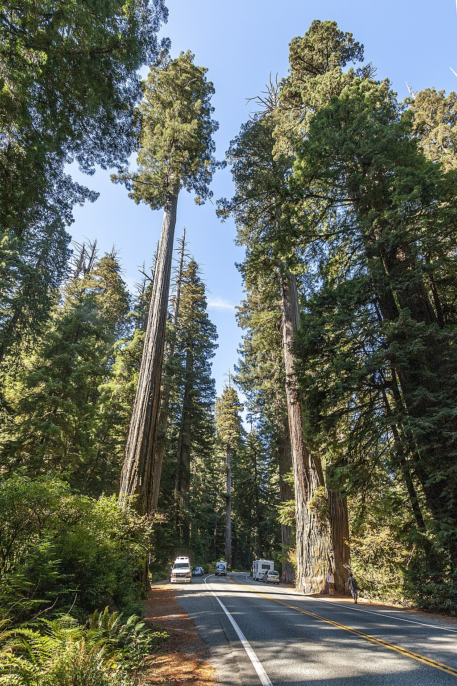
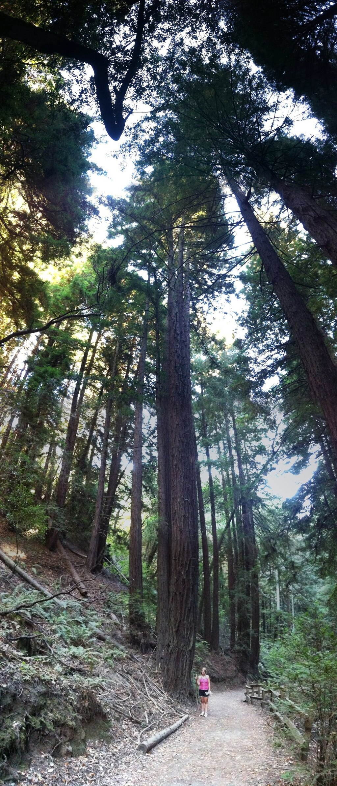

Sequoioideae

Temporal range:

Redwood Highway, California _[Sequoia sempervirens](https://en.wikipedia.org/wiki/Sequoia_sempervirens "Sequoia sempervirens")_

[Scientific classification](https://en.wikipedia.org/wiki/Taxonomy_\(biology\) "Taxonomy (biology)") 

Kingdom:

[Plantae](https://en.wikipedia.org/wiki/Plant "Plant")

_Clade_:

[Tracheophytes](https://en.wikipedia.org/wiki/Vascular_plant "Vascular plant")

_Clade_:

[Gymnospermae](https://en.wikipedia.org/wiki/Gymnosperm "Gymnosperm")

Division:

[Pinophyta](https://en.wikipedia.org/wiki/Conifer "Conifer")

Class:

[Pinopsida](https://en.wikipedia.org/wiki/Conifer "Conifer")

Order:

[Cupressales](https://en.wikipedia.org/wiki/Cupressales "Cupressales")

Family:

[Cupressaceae](https://en.wikipedia.org/wiki/Cupressaceae "Cupressaceae")

Subfamily:

[Sequoioideae](/source/sequoioideae/)

Genera

*   [_Sequoia_](https://en.wikipedia.org/wiki/Sequoia_\(genus\) "Sequoia (genus)")
*   _[Sequoiadendron](https://en.wikipedia.org/wiki/Sequoiadendron "Sequoiadendron")_
*   _[Metasequoia](https://en.wikipedia.org/wiki/Metasequoia "Metasequoia")_
*   †_[Quasisequoia](https://en.wikipedia.org/wiki/Quasisequoia "Quasisequoia")_
*   †_[Austrosequoia](https://en.wikipedia.org/wiki/Austrosequoia "Austrosequoia")_?

**Sequoioideae**, commonly referred to as **redwoods**, is a [subfamily](https://en.wikipedia.org/wiki/Subfamily "Subfamily") of [coniferous](https://en.wikipedia.org/wiki/Pinophyta "Pinophyta") trees within the [family](https://en.wikipedia.org/wiki/Family_\(biology\) "Family (biology)") [Cupressaceae](https://en.wikipedia.org/wiki/Cupressaceae "Cupressaceae"), that range in the [northern hemisphere](https://en.wikipedia.org/wiki/Northern_Hemisphere "Northern Hemisphere"). It includes the [largest and tallest trees](https://en.wikipedia.org/wiki/List_of_superlative_trees#Largest "List of superlative trees") in the world. The trees in the subfamily are amongst the most distinctive trees in the world and are common [ornamental](https://en.wikipedia.org/wiki/Ornamental_plant "Ornamental plant") trees. The subfamily reached its peak of diversity during the early [Cenozoic](https://en.wikipedia.org/wiki/Cenozoic "Cenozoic").

## Description

The three redwood subfamily [genera](https://en.wikipedia.org/wiki/Genus "Genus") are _[Sequoia](https://en.wikipedia.org/wiki/Sequoia_\(genus\) "Sequoia (genus)")_ from coastal [California](https://en.wikipedia.org/wiki/California "California") and [Oregon](https://en.wikipedia.org/wiki/Oregon "Oregon"), _[Sequoiadendron](https://en.wikipedia.org/wiki/Sequoiadendron "Sequoiadendron")_ from California's [Sierra Nevada](https://en.wikipedia.org/wiki/Sierra_Nevada "Sierra Nevada"), and _[Metasequoia](https://en.wikipedia.org/wiki/Metasequoia "Metasequoia")_ in [China](https://en.wikipedia.org/wiki/China "China"). The redwood subfamily contains the largest and tallest trees in the world. The trees can live for thousands of years. Threats include logging, fire suppression, and [burl](https://en.wikipedia.org/wiki/Burl "Burl") poaching.

Only two of the genera, _Sequoia_ and _Sequoiadendron_, are known for massive trees. Trees of _[Metasequoia](https://en.wikipedia.org/wiki/Metasequoia "Metasequoia")_, from the single living species _[Metasequoia glyptostroboides](https://en.wikipedia.org/wiki/Metasequoia_glyptostroboides "Metasequoia glyptostroboides")_, are deciduous, grow much smaller (although are still large compared to most other trees) and can live in colder climates.

## Taxonomy and evolution

Multiple studies of both morphological and molecular characters have strongly supported the assertion that the Sequoioideae are [monophyletic](https://en.wikipedia.org/wiki/Monophyly "Monophyly"). Most modern [phylogenies](https://en.wikipedia.org/wiki/Phylogenies "Phylogenies") place _Sequoia_ as sister to _Sequoiadendron_ and _Metasequoia_ as the out-group. However, Yang _et al._ went on to investigate the origin of a peculiar genetic component in Sequoioideae, the [polyploidy](https://en.wikipedia.org/wiki/Polyploidy "Polyploidy") of _Sequoia_—and generated a notable exception that calls into question the specifics of this relative consensus.

### Cladistic tree

A 2006 paper based on non-molecular evidence suggested the following relationship among extant species:

Sequoioideae

[Metasequoia](https://en.wikipedia.org/wiki/Metasequoia "Metasequoia")

_[M. glyptostroboides](https://en.wikipedia.org/wiki/Metasequoia_glyptostroboides "Metasequoia glyptostroboides")_ (dawn redwood)

[Sequoia](https://en.wikipedia.org/wiki/Sequoia_\(genus\) "Sequoia (genus)")

_[S. sempervirens](https://en.wikipedia.org/wiki/Sequoia_sempervirens "Sequoia sempervirens")_ (coast redwood)

[Sequoiadendron](https://en.wikipedia.org/wiki/Sequoiadendron "Sequoiadendron")

_[S. giganteum](https://en.wikipedia.org/wiki/Sequoiadendron_giganteum "Sequoiadendron giganteum")_ (giant sequoia)

[Taxodioideae](https://en.wikipedia.org/wiki/Taxodioideae "Taxodioideae")

A 2021 study using molecular evidence found the same relationships among Sequoioideae species, but found Sequoioideae to be the sister group to the [Athrotaxidoideae](https://en.wikipedia.org/wiki/Athrotaxis "Athrotaxis") (a superfamily presently known only from [Tasmania](https://en.wikipedia.org/wiki/Tasmania "Tasmania")) rather than to [Taxodioideae](https://en.wikipedia.org/wiki/Taxodioideae "Taxodioideae"). Sequoioideae and Athrotaxidoideae are thought to have diverged from each other during the [Jurassic](https://en.wikipedia.org/wiki/Jurassic "Jurassic").

### Possible reticulate evolution in Sequoioideae

[Reticulate evolution](https://en.wikipedia.org/wiki/Reticulate_evolution "Reticulate evolution") refers to the origination of a taxon through the merging of ancestor lineages. [Polyploidy](https://en.wikipedia.org/wiki/Polyploidy "Polyploidy") has come to be understood as quite common in plants—with estimates ranging from 47% to 100% of flowering plants and extant [ferns](https://en.wikipedia.org/wiki/Ferns "Ferns") having derived from ancient polyploidy. Within the gymnosperms however it is quite rare. _Sequoia sempervirens_ is [hexaploid](https://en.wikipedia.org/wiki/Hexaploid "Hexaploid") (2n= 6x= 66). To investigate the origins of this polyploidy Yang et al. used two single copy [nuclear genes](https://en.wikipedia.org/wiki/Nuclear_gene "Nuclear gene"), [LFY](https://en.wikipedia.org/wiki/Leafy "Leafy") and NLY, to generate [phylogenetic trees](https://en.wikipedia.org/wiki/Phylogenetic_tree "Phylogenetic tree"). Other researchers have had success with these genes in similar studies on different taxa.

Several hypotheses have been proposed to explain the origin of _Sequoia's_ polyploidy: [allopolyploidy](https://en.wikipedia.org/wiki/Allopolyploidy "Allopolyploidy") by [hybridization](https://en.wikipedia.org/wiki/Hybrid_\(biology\) "Hybrid (biology)") between _Metasequoia_ and some probably extinct [taxodiaceous](https://en.wikipedia.org/wiki/Taxodiaceae "Taxodiaceae") plant; _Metasequoia_ and _Sequoiadendron,_ or ancestors of the two genera, as the parental species of _Sequoia_; and [autohexaploidy](https://en.wikipedia.org/wiki/Autopolyploid "Autopolyploid"), autoallohexaploidy, or segmental allohexaploidy.

Yang et al. found that _Sequoia_ was clustered with _Metasequoia_ in the tree generated using the LFY gene but with _Sequoiadendron_ in the tree generated with the NLY gene. Further analysis strongly supported the hypothesis that _Sequoia_ was the result of a [hybridization event](https://en.wikipedia.org/wiki/Hybridization_event "Hybridization event") involving _Metasequoia_ and _Sequoiadendron_. Thus, Yang et al. hypothesize that the inconsistent relationships among _Metasequoia_, _Sequoia,_ and _Sequoiadendron_ could be a sign of [reticulate evolution](https://en.wikipedia.org/wiki/Reticulate_evolution "Reticulate evolution") by [hybrid speciation](https://en.wikipedia.org/wiki/Hybrid_speciation "Hybrid speciation") (in which two species hybridize and give rise to a third) among the three genera. However, the long evolutionary history of the three genera (the earliest fossil remains being from the [Jurassic](https://en.wikipedia.org/wiki/Jurassic "Jurassic")) make resolving the specifics of when and how _Sequoia_ originated once and for all a difficult matter—especially since it in part depends on an incomplete fossil record.

## Extant species

*   _[Metasequoia glyptostroboides](https://en.wikipedia.org/wiki/Metasequoia_glyptostroboides "Metasequoia glyptostroboides")_Hu & W.C.Cheng - Dawn redwood; south-central China.
*   _[Sequoiadendron giganteum](https://en.wikipedia.org/wiki/Sequoiadendron_giganteum "Sequoiadendron giganteum")_(Lindl.) J.Buchh. - Giant sequoia, Giant redwood; western slopes of the [Sierra Nevadas](https://en.wikipedia.org/wiki/Sierra_Nevada_\(U.S.\) "Sierra Nevada (U.S.)"); California.
*   _[Sequoia sempervirens](https://en.wikipedia.org/wiki/Sequoia_sempervirens "Sequoia sempervirens")_(D.Don) Endl. - Coastal Redwood, California redwood; [Northern California](https://en.wikipedia.org/wiki/Northern_California "Northern California") coast and extreme Southern [Oregon](https://en.wikipedia.org/wiki/Oregon "Oregon").

## Paleontology

Sequoioideae is an ancient [taxon](https://en.wikipedia.org/wiki/Taxon "Taxon"), with the oldest described Sequoioideae species, _[Sequoia jeholensis](https://en.wikipedia.org/wiki/Sequoia_jeholensis "Sequoia jeholensis")_, recovered from [Jurassic](https://en.wikipedia.org/wiki/Jurassic "Jurassic") deposits. The fossil wood _Medulloprotaxodioxylon_, reported from the late Triassic of China, resembles _Sequoiadendron giganteum_ and may represent an ancestral form of the Sequoioideae; this supports the idea of a Late Triassic [Norian](https://en.wikipedia.org/wiki/Norian "Norian") origin for this subfamily.

The fossil record shows a massive expansion of range in the [Cretaceous](https://en.wikipedia.org/wiki/Cretaceous "Cretaceous") and dominance of the [Arcto-Tertiary Geoflora](https://en.wikipedia.org/wiki/Arcto-Tertiary_Geoflora "Arcto-Tertiary Geoflora"), especially in northern latitudes. Genera of Sequoioideae were found in the [Arctic Circle](https://en.wikipedia.org/wiki/Arctic_Circle "Arctic Circle"), Europe, North America, and throughout Asia and Japan. A general cooling trend beginning in the late [Eocene](https://en.wikipedia.org/wiki/Eocene "Eocene") and [Oligocene](https://en.wikipedia.org/wiki/Oligocene "Oligocene") reduced the northern ranges of the Sequoioideae, as did subsequent ice ages. Evolutionary adaptations to ancient environments persist in all three species despite changing climate, distribution, and associated flora, especially the specific demands of their reproduction ecology that ultimately forced each of the species into refugial ranges where they could survive.

The extinct genus _[Austrosequoia](https://en.wikipedia.org/wiki/Austrosequoia "Austrosequoia")_, known from the Late Cretaceous-Oligocene of the Southern Hemisphere, including Australia and New Zealand, has been suggested as a member of the subfamily.

Young but already tall redwood trees (_[Sequoia sempervirens](https://en.wikipedia.org/wiki/Sequoia_sempervirens "Sequoia sempervirens")_) in Oakland, California

## Conservation

In 2024, it was estimated that there were about 500,000 redwoods in Britain, mostly brought as seeds and seedlings from the US in the [Victorian era](https://en.wikipedia.org/wiki/Victorian_era "Victorian era"). The entire subfamily is [endangered](https://en.wikipedia.org/wiki/Endangered_species "Endangered species"). The [IUCN Red List](https://en.wikipedia.org/wiki/IUCN_Red_List "IUCN Red List") Category & Criteria assesses _Sequoia sempervirens_ as Endangered (A2acd), _Sequoiadendron giganteum_ as Endangered (B2ab) and _Metasequoia glyptostroboides_ as Endangered (B1ab). In 2024 it was reported that over a period of two years about one-fifth of all giant sequoias were destroyed in extreme wildfires in California.

## Bibliography and links

*   ["About the trees"](https://home.nps.gov/redw/learn/nature/about-the-trees.htm). National Park Service. Retrieved 10 January 2014.
*   ["A few basic facts about Redwoods, and Parks"](https://www.nps.gov/redw/faqs.htm). National Park Service. Retrieved 10 January 2014.
*   ["Calaveras Big Trees Association"](http://www.bigtrees.org/). Retrieved 10 January 2014.
*   Hanks, Doug (2005). ["Crescent Ridge Dawn Redwood Preserve"](http://www.dawnredwood.org/). Retrieved 10 January 2014.
*   [de:Liste der dicksten Mammutbäume in Deutschland](https://de.wikipedia.org/wiki/Liste%20der%20dicksten%20Mammutbäume%20in%20Deutschland "de:Liste der dicksten Mammutbäume in Deutschland"). List of Large Giant Redwoods in Germany
*   IUCN 2013. IUCN Red List of Threatened Species. Version 2013.2. Downloaded on 10 January 2014.
*   James Donald, John Rubin (directors) (2009). [_Climbing Redwood Giants_](https://web.archive.org/web/20130412011955/http://channel.nationalgeographic.com/channel/explorer/videos/climbing-redwood-giants/) (film). National Geographic. Archived from [the original](http://channel.nationalgeographic.com/channel/explorer/videos/climbing-redwood-giants/) on 12 April 2013.
*   ["Big trees"](https://vimeo.com/56524336). _Notes from the Field tv_. 6 minutes in. [PBS](https://en.wikipedia.org/wiki/PBS "PBS"). Retrieved 10 January 2014.
