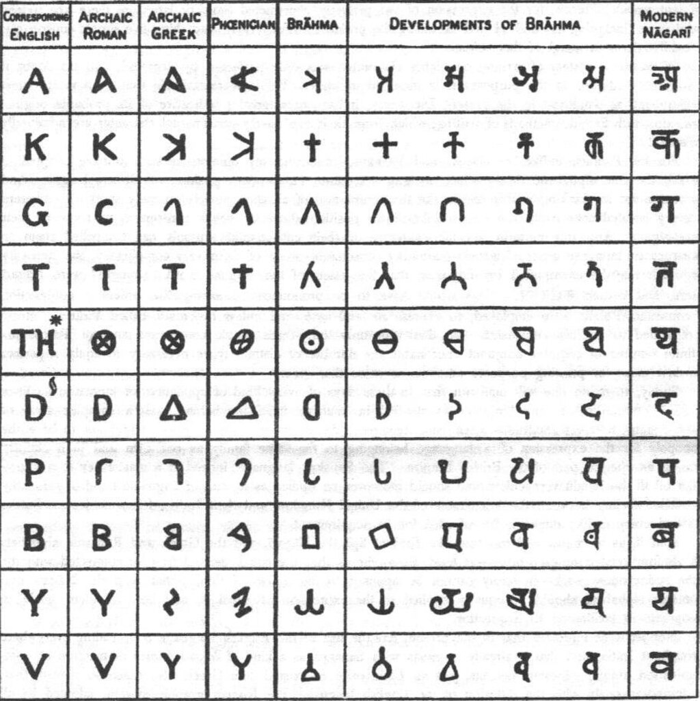
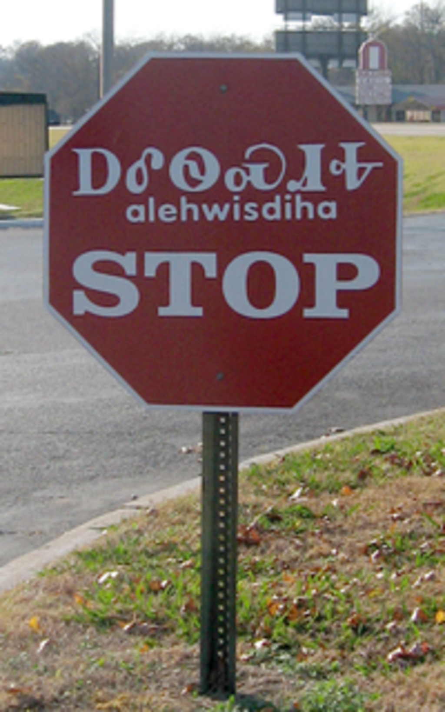
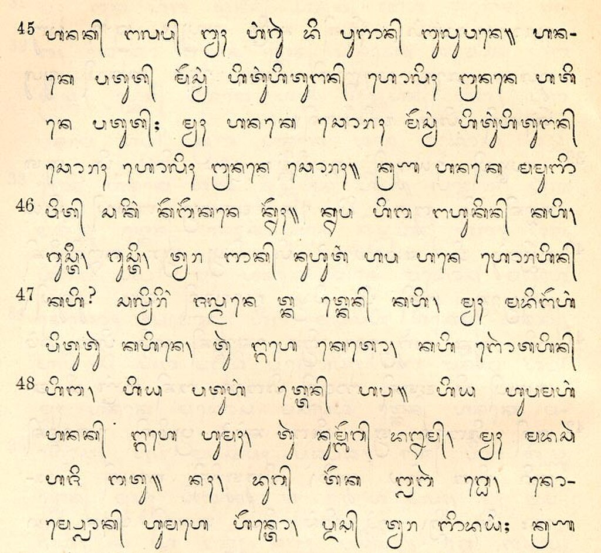

A **writing system** is any conventional system for [representing a particular language](https://en.wikipedia.org/wiki/Writing "Writing") using a set of symbols (called a _**script**_), as well as the rules those symbols encode. The earliest of conventional writing systems appeared during the late 4th millennium BC. Throughout history, each independently invented writing system gradually emerged from a system of [proto-writing](https://en.wikipedia.org/wiki/Proto-writing "Proto-writing"), where a small number of [ideographs](https://en.wikipedia.org/wiki/Ideograph "Ideograph") were used in a manner incapable of fully encoding language, and thus lacking the ability to express a broad range of ideas.

Writing systems are generally classified according to how their symbols, called _[graphemes](https://en.wikipedia.org/wiki/Grapheme "Grapheme")_, relate to units of language. Phonetic writing systems – which include [alphabets](https://en.wikipedia.org/wiki/Alphabet "Alphabet") and [syllabaries](https://en.wikipedia.org/wiki/Syllabaries "Syllabaries") – use graphemes that correspond to sounds in the corresponding [spoken language](https://en.wikipedia.org/wiki/Spoken_language "Spoken language"). Alphabets use graphemes called _[letters](https://en.wikipedia.org/wiki/Letter_\(alphabet\) "Letter (alphabet)")_ that generally correspond to spoken [phonemes](https://en.wikipedia.org/wiki/Phoneme "Phoneme"). They are typically divided into three sub-types: _Pure alphabets_ use letters to represent both [consonant](https://en.wikipedia.org/wiki/Consonant "Consonant") and [vowel](https://en.wikipedia.org/wiki/Vowel "Vowel") sounds, _[abjads](https://en.wikipedia.org/wiki/Abjad "Abjad")_ generally only use letters representing consonant sounds, and _[abugidas](https://en.wikipedia.org/wiki/Abugida "Abugida")_ use letters representing consonant–vowel pairs. Syllabaries use graphemes called _[syllabograms](https://en.wikipedia.org/wiki/Syllabogram "Syllabogram")_ that represent entire [syllables](https://en.wikipedia.org/wiki/Syllable "Syllable") or [moras](https://en.wikipedia.org/wiki/Mora_\(linguistics\) "Mora (linguistics)"). By contrast, [logographic](https://en.wikipedia.org/wiki/Logographic "Logographic") (or _morphographic_) writing systems use graphemes that represent the units of meaning in a language, such as its [words](https://en.wikipedia.org/wiki/Word "Word") or [morphemes](https://en.wikipedia.org/wiki/Morpheme "Morpheme"). Alphabets typically use fewer than 100 distinct symbols, while syllabaries and logographies may use hundreds or thousands, respectively.

## Background: relationship with language

The relationship between spoken, written, and signed modes of language, as modelled by Meletis & Dürscheid (2022) While many spoken or signed languages are not written, there are no written languages without a spoken counterpart that they originally emerged to record.

According to most contemporary definitions, [writing](https://en.wikipedia.org/wiki/Writing "Writing") is a visual and tactile notation representing [language](/source/language/ "Language"). As such, the use of writing by a community presupposes an analysis of the structure of language at some level. The symbols used in writing correspond systematically to functional units of either a [spoken](https://en.wikipedia.org/wiki/Spoken_language "Spoken language") or [signed language](https://en.wikipedia.org/wiki/Signed_language "Signed language"). This definition excludes a broader class of symbolic markings, such as drawings and maps. A text is any instance of written material, including transcriptions of spoken material. The act of composing and recording a text is referred to as _writing_, and the act of viewing and interpreting the text as _[reading](https://en.wikipedia.org/wiki/Reading "Reading")_.

The relationship between writing and language more broadly has been the subject of philosophical analysis as early as [Aristotle](https://en.wikipedia.org/wiki/Aristotle "Aristotle") (384–322 BC). While the use of language is universal across human societies, writing is not; writing emerged much more recently, and was independently invented in only a handful of locations throughout history. While most spoken languages have not been written, all written languages have been predicated on an existing spoken language. When those with signed languages as their first language read writing associated with a spoken language, this functions as literacy in a second, acquired language. A single language (e.g. [Hindustani](https://en.wikipedia.org/wiki/Hindustani_language "Hindustani language")) can be written using multiple writing systems, and a writing system can also represent multiple languages. For example, [Chinese characters](https://en.wikipedia.org/wiki/Chinese_characters "Chinese characters") have been used to write multiple languages throughout the [Sinosphere](https://en.wikipedia.org/wiki/Sinosphere "Sinosphere") – including the [Vietnamese language](https://en.wikipedia.org/wiki/Vietnamese_language "Vietnamese language") from at least the 13th century, until their replacement with the Latin-based [Vietnamese alphabet](https://en.wikipedia.org/wiki/Vietnamese_alphabet "Vietnamese alphabet") in the 20th century.

In the first several decades of modern [linguistics](https://en.wikipedia.org/wiki/Linguistics "Linguistics") as a scientific discipline, linguists often characterized writing as merely the technology used to record speech – which was treated as being of paramount importance, for what was seen as the unique potential for its study to further the understanding of human cognition.

## General terminology

Comparison between double-storey |a| (left) and single-storey |ɑ| (right) [lowercase](https://en.wikipedia.org/wiki/Lowercase "Lowercase") forms of the Latin letter ⟨[A](https://en.wikipedia.org/wiki/A "A")⟩

While researchers of writing systems generally use some of the same core terminology, precise definitions and interpretations can vary by author, often depending on their theoretical approach.

A [grapheme](https://en.wikipedia.org/wiki/Grapheme "Grapheme") is the basic functional unit of a writing system. Graphemes are generally defined as minimally significant elements that, when taken together, comprise the set of symbols from which texts may be constructed. All writing systems require a set of defined graphemes, collectively called a _script_. The concept of the grapheme is similar to that of the [phoneme](https://en.wikipedia.org/wiki/Phoneme "Phoneme") in the study of spoken languages. Likewise, as many sonically distinct [phones](https://en.wikipedia.org/wiki/Phone_\(phonetics\) "Phone (phonetics)") may function as the same phoneme depending on the speaker, dialect, and context, many visually distinct [glyphs](https://en.wikipedia.org/wiki/Glyph "Glyph") (or _graphs_) may be identified as the same grapheme. These variant glyphs are known as the _[allographs](https://en.wikipedia.org/wiki/Allograph "Allograph")_ of a grapheme: For example, the lowercase letter ⟨a⟩ may be represented by the double-storey |a| and single-storey |ɑ| shapes, or others written in cursive, block, or printed styles. The choice of a particular allograph may be influenced by the medium used, the writing instrument used, the stylistic choice of the writer, the preceding and succeeding graphemes in the text, the time available for writing, the intended audience, and the largely unconscious features of an individual's handwriting.

[Orthography](https://en.wikipedia.org/wiki/Orthography "Orthography") (lit.'correct writing') refers to the rules and conventions for writing shared by a community, including the ordering of and relationship between graphemes. Particularly for [alphabets](https://en.wikipedia.org/wiki/Alphabet "Alphabet"), orthography includes the concept of [spelling](https://en.wikipedia.org/wiki/Spelling "Spelling"). For example, [English orthography](https://en.wikipedia.org/wiki/English_orthography "English orthography") includes [uppercase and lowercase](https://en.wikipedia.org/wiki/Uppercase_and_lowercase "Uppercase and lowercase") forms for 26 [letters](https://en.wikipedia.org/wiki/Letter_\(alphabet\) "Letter (alphabet)") of the [Latin alphabet](https://en.wikipedia.org/wiki/Latin_alphabet "Latin alphabet") (with these graphemes corresponding to various phonemes), punctuation marks (mostly non-phonemic), and other symbols, such as numerals. Writing systems may be regarded as complete if they are able to represent all that may be expressed in the spoken language, while a partial writing system cannot represent the spoken language in its entirety.

## History

Diagram comparing the abstraction of pictographs in cuneiform, Egyptian hieroglyphs, and Chinese characters – from an 1870 publication by French Egyptologist [Gaston Maspero](https://en.wikipedia.org/wiki/Gaston_Maspero "Gaston Maspero")

In each instance, writing emerged from systems of [proto-writing](https://en.wikipedia.org/wiki/Proto-writing "Proto-writing"), though historically most proto-writing systems did not produce writing systems. Proto-writing uses [ideographic](https://en.wikipedia.org/wiki/Ideographic "Ideographic") and mnemonic symbols to communicate, but lacks the capability to fully encode language. Examples include:

*   The [Jiahu symbols](https://en.wikipedia.org/wiki/Jiahu_symbols "Jiahu symbols") (c. 7th millennium BC) carved into tortoise shells, found in 24 [Neolithic](https://en.wikipedia.org/wiki/Neolithic "Neolithic") graves excavated at [Jiahu](https://en.wikipedia.org/wiki/Jiahu "Jiahu") in northern China.
*   The [Vinča symbols](https://en.wikipedia.org/wiki/Vinča_symbols "Vinča symbols") (c. 6th–5th millennia BC) found on artefacts of the [Vinča culture](https://en.wikipedia.org/wiki/Vinča_culture "Vinča culture") of [Central](https://en.wikipedia.org/wiki/Central_Europe "Central Europe") and [Southeast Europe](https://en.wikipedia.org/wiki/Southeast_Europe "Southeast Europe").
*   [Quipu](https://en.wikipedia.org/wiki/Quipu "Quipu") (15th century AD), a system of knotted cords used as mnemonic devices by the [Inca Empire](https://en.wikipedia.org/wiki/Inca_Empire "Inca Empire") in South America.

Writing has been invented independently multiple times in human history – first emerging as [cuneiform](https://en.wikipedia.org/wiki/Cuneiform "Cuneiform"), a system initially used to write the [Sumerian language](https://en.wikipedia.org/wiki/Sumerian_language "Sumerian language") in southern Mesopotamia; it was later adapted to write [Akkadian](https://en.wikipedia.org/wiki/Akkadian_language "Akkadian language") as its speakers spread throughout the region, with Akkadian writing appearing in significant quantities c. 2350 BC. Cuneiform was closely followed by [Egyptian hieroglyphs](https://en.wikipedia.org/wiki/Egyptian_hieroglyphs "Egyptian hieroglyphs"). It is generally agreed that the two systems were invented independently from one another; both evolved from proto-writing systems between 3400 and 3100 BC, with the earliest coherent texts dated c. 2600 BC. [Chinese characters](https://en.wikipedia.org/wiki/Chinese_characters "Chinese characters") emerged independently in the [Yellow River](https://en.wikipedia.org/wiki/Yellow_River "Yellow River") valley c. 1200 BC. There is no evidence of contact between China and the literate peoples of the Near East, and the Mesopotamian and Chinese approaches for representing sound and meaning are distinct. The [Mesoamerican writing systems](https://en.wikipedia.org/wiki/Mesoamerican_writing_systems "Mesoamerican writing systems"), including [Olmec](https://en.wikipedia.org/wiki/Olmec "Olmec") and the [Maya script](https://en.wikipedia.org/wiki/Maya_script "Maya script"), are likewise associated with an independent invention.

With each independent invention of writing, the ideographs used in proto-writing were decoupled from the direct representation of ideas, and gradually came to represent words instead. This occurred via application of the [rebus](https://en.wikipedia.org/wiki/Rebus "Rebus") principle, where a symbol was appropriated to represent an additional word that happened to be similar in pronunciation to the word for the idea originally represented by the symbol. This allowed words without concrete visualizations to be represented by symbols for the first time; the gradual shift from ideographic symbols to those wholly representing language took place over centuries, and required the conscious analysis of a given language by those attempting to write it.

The [Indus script](https://en.wikipedia.org/wiki/Indus_script "Indus script") (c. 2600 – c. 2000 BC), found on different types of artefacts produced by the [Indus Valley Civilization](https://en.wikipedia.org/wiki/Indus_Valley_Civilization "Indus Valley Civilization") on the [Indian subcontinent](https://en.wikipedia.org/wiki/Indian_subcontinent "Indian subcontinent"), remains undeciphered, and whether it functioned as true writing is not agreed upon.

Alphabetic writing descends from previous morphographic writing, and first appeared c. 1800 BC to write a Semitic language spoken in the [Sinai Peninsula](https://en.wikipedia.org/wiki/Sinai_Peninsula "Sinai Peninsula"). Most of the world's alphabets either descend directly from this [Proto-Sinaitic script](/source/proto-sinaitic-script/ "Proto-Sinaitic script"), or were directly inspired by its design. Descendants include the [Phoenician alphabet](https://en.wikipedia.org/wiki/Phoenician_alphabet "Phoenician alphabet") (c. 1050 BC), and its child in the [Greek alphabet](https://en.wikipedia.org/wiki/Greek_alphabet "Greek alphabet") (c. 800 BC). The [Latin alphabet](https://en.wikipedia.org/wiki/Latin_alphabet "Latin alphabet"), which descended from the Greek alphabet, is by far the most common script used by writing systems.

## Classification by basic linguistic unit

Table of scripts in the introduction to the _Sanskrit–English Dictionary_ by [Monier Monier-Williams](https://en.wikipedia.org/wiki/Monier_Monier-Williams "Monier Monier-Williams")

Writing systems are most often classified according to what units of language a system's graphemes correspond to. At the most basic level, writing systems can be either phonographic (lit.'sound writing') when graphemes represent units of sound in a language, or morphographic ('form writing') when graphemes represent units of meaning (such as [words](https://en.wikipedia.org/wiki/Word "Word") or [morphemes](https://en.wikipedia.org/wiki/Morpheme "Morpheme")). Depending on the author, the older term _logographic_ ('word writing') is often used, either with the same meaning as _morphographic_, or specifically in reference to systems where the basic unit being written is the word. Recent scholarship generally prefers _morphographic_ over _logographic_, with the latter seen as potentially vague or misleading – in part because systems usually operate on the level of morphemes, not words. Some authors make a distinct primary division – between _pleremic_ (from Greek _plḗrēs_ 'full') systems with graphemes that have semantic value in isolation (like logographs), and _cenemic_ (from Greek _kenós_ 'empty') systems with graphemes that lack any such separable meaning (like letters).

Many classifications define three primary categories, where phonographic systems are subdivided into syllabic and alphabetic (or _segmental_) systems. Syllabaries use symbols called syllabograms to represent [syllables](https://en.wikipedia.org/wiki/Syllable "Syllable") or [moras](https://en.wikipedia.org/wiki/Mora_\(linguistics\) "Mora (linguistics)"). Alphabets use symbols called letters that correspond to spoken phonemes (or more technically, to [diaphonemes](https://en.wikipedia.org/wiki/Diaphoneme "Diaphoneme")). Alphabets are generally classified into three subtypes, with [abjads](https://en.wikipedia.org/wiki/Abjad "Abjad") having letters for [consonants](https://en.wikipedia.org/wiki/Consonant "Consonant"), pure alphabets having letters for both consonants and [vowels](https://en.wikipedia.org/wiki/Vowel "Vowel"), and [abugidas](https://en.wikipedia.org/wiki/Abugida "Abugida") having characters that correspond to consonant–vowel pairs. [David Diringer](https://en.wikipedia.org/wiki/David_Diringer "David Diringer") proposed a five-fold classification of writing systems, comprising pictographic scripts, ideographic scripts, analytic transitional scripts, phonetic scripts, and alphabetic scripts.

In practice, writing systems are classified according to the primary type of symbols used, and typically include exceptional cases where symbols function differently. For example, logographs found within phonetic systems like English include the [ampersand](https://en.wikipedia.org/wiki/Ampersand "Ampersand") ⟨&⟩ and the numerals ⟨0⟩, ⟨1⟩, etc. – which correspond to specific words (_and_, _zero_, _one_, etc.) and not to the underlying sounds. Most writing systems can be described as mixed systems that feature elements of both phonography and morphography.

### Logographic systems

A [logogram](https://en.wikipedia.org/wiki/Logogram "Logogram") is a character that represents a morpheme within a language. [Chinese characters](https://en.wikipedia.org/wiki/Chinese_characters "Chinese characters") represent the only major logographic writing systems still in use: they have historically been used to write the [varieties of Chinese](https://en.wikipedia.org/wiki/Varieties_of_Chinese "Varieties of Chinese"), as well as [Japanese](https://en.wikipedia.org/wiki/Japanese_language "Japanese language"), [Korean](https://en.wikipedia.org/wiki/Korean_language "Korean language"), [Vietnamese](https://en.wikipedia.org/wiki/Vietnamese_language "Vietnamese language"), and other languages of the [Sinosphere](https://en.wikipedia.org/wiki/Sinosphere "Sinosphere"). As each character represents a single unit of meaning, thousands are required to write all the words of a language. If the logograms do not adequately represent all meanings and words of a language, written language can be confusing or ambiguous to the reader.

Logograms are sometimes conflated with [ideograms](https://en.wikipedia.org/wiki/Ideogram "Ideogram"), symbols which graphically represent abstract ideas; most linguists now reject this characterization. Chinese characters are often semantic–phonetic compounds, which include a component related to the character's meaning, and a component that gives a hint for its pronunciation.

### Syllabaries

A stop sign in [Tahlequah, Oklahoma](https://en.wikipedia.org/wiki/Tahlequah,_Oklahoma "Tahlequah, Oklahoma") written in [Cherokee](https://en.wikipedia.org/wiki/Cherokee_language "Cherokee language") using both the [Cherokee syllabary](https://en.wikipedia.org/wiki/Cherokee_syllabary "Cherokee syllabary") (top) and [Latin alphabet](https://en.wikipedia.org/wiki/Latin_alphabet "Latin alphabet") (middle), alongside English (bottom)

A [syllabary](https://en.wikipedia.org/wiki/Syllabary "Syllabary") is a set of written symbols (called _[syllabograms](https://en.wikipedia.org/wiki/Syllabogram "Syllabogram")_) that represent either [syllables](https://en.wikipedia.org/wiki/Syllable "Syllable") or [moras](https://en.wikipedia.org/wiki/Mora_\(linguistics\) "Mora (linguistics)") – a unit of [prosody](https://en.wikipedia.org/wiki/Prosody_\(linguistics\) "Prosody (linguistics)") that is often but not always a syllable in length. Syllabaries are best suited to languages with relatively simple syllable structure, since a different symbol is needed for every syllable. For example, the [Japanese writing system](https://en.wikipedia.org/wiki/Japanese_writing_system "Japanese writing system") has two [kana](https://en.wikipedia.org/wiki/Kana "Kana") syllabaries ([hiragana](https://en.wikipedia.org/wiki/Hiragana "Hiragana") and [katakana](https://en.wikipedia.org/wiki/Katakana "Katakana")) intended for use in distinct circumstances; both have syllabograms for each of the roughly 100 moras found in Japanese. By contrast, English features complex syllable structures, with a relatively large inventory of vowels and complex [consonant clusters](https://en.wikipedia.org/wiki/Consonant_cluster "Consonant cluster") – for a total of 15–16 thousand distinct syllables. Some syllabaries have larger inventories: the [Yi script](https://en.wikipedia.org/wiki/Yi_script "Yi script") contains 756 different symbols.

### Alphabets

An [alphabet](https://en.wikipedia.org/wiki/Alphabet "Alphabet") uses symbols (called _[letters](https://en.wikipedia.org/wiki/Letter_\(alphabet\) "Letter (alphabet)")_) that correspond to the phonemes of a language, e.g. its vowels and consonants. However, these correspondences are rarely uncomplicated, and [spelling](https://en.wikipedia.org/wiki/Spelling "Spelling") is often mediated by other factors than just which sounds are used by a speaker. The word _alphabet_ is derived from _[alpha](https://en.wikipedia.org/wiki/Alpha "Alpha")_ and _[beta](https://en.wikipedia.org/wiki/Beta "Beta")_, the names for the first two letters in the [Greek alphabet](https://en.wikipedia.org/wiki/Greek_alphabet "Greek alphabet"). An [abjad](https://en.wikipedia.org/wiki/Abjad "Abjad") is an alphabet whose letters only represent the consonantal sounds of a language. They were the first alphabets to develop historically, with most used to write [Semitic languages](https://en.wikipedia.org/wiki/Semitic_languages "Semitic languages"), and originally deriving from the [Proto-Sinaitic script](/source/proto-sinaitic-script/ "Proto-Sinaitic script"). The [morphology](https://en.wikipedia.org/wiki/Morphology_\(linguistics\) "Morphology (linguistics)") of Semitic languages is particularly suited to this approach, as the denotation of vowels is generally redundant. Optional markings for vowels may be used for some abjads, but are generally limited to applications like education. Many pure alphabets were derived from abjads through the addition of dedicated vowel letters, as with the derivation of the Greek alphabet from the Phoenician alphabet c. 800 BC. _Abjad_ is the word for "alphabet" in Arabic, and analogously derives from the traditional order of letters in the [Arabic alphabet](https://en.wikipedia.org/wiki/Arabic_alphabet "Arabic alphabet") (_'alif_, _bā'_, _jīm_, _dāl_).

A passage from the biblical [Gospel of Luke](https://en.wikipedia.org/wiki/Gospel_of_Luke "Gospel of Luke") printed using [Balinese script](https://en.wikipedia.org/wiki/Balinese_script "Balinese script")

An [abugida](https://en.wikipedia.org/wiki/Abugida "Abugida") is a type of alphabet with symbols corresponding to consonant–vowel pairs, where basic symbols for each consonant are associated with an [inherent vowel](https://en.wikipedia.org/wiki/Inherent_vowel "Inherent vowel") by default, and other possible vowels for each consonant are indicated via predictable modifications made to the basic symbols. In an abugida, there may be a sign for _k_ with no vowel, but also one for _ka_ (if _a_ is the inherent vowel), and _ke_ is written by modifying the _ka_ sign in a way consistent with how _la_ would be modified to get _le_. In many abugidas, modification consists of the addition of a vowel sign; other possibilities include rotation of the basic sign, or addition of [diacritics](https://en.wikipedia.org/wiki/Diacritic "Diacritic").

While true syllabaries have one symbol per syllable and no systematic visual similarity, the graphic similarity in most abugidas stems from their origins as abjads – with added symbols comprising markings for different vowels added onto a pre-existing base symbol. The largest single group of abugidas is the [Brahmic family](https://en.wikipedia.org/wiki/Brahmic_family "Brahmic family") of scripts, however, which includes nearly all the scripts used in India and Southeast Asia. The name _abugida_ was derived by linguist [Peter T. Daniels](https://en.wikipedia.org/wiki/Peter_T._Daniels "Peter T. Daniels") (b. 1951) from the first four characters of an order of the [Geʽez script](https://en.wikipedia.org/wiki/Geʽez_script "Geʽez script"), which is used for certain Nilo-Saharan and Afro-Asiatic languages of Ethiopia and Eritrea.

### Featural systems

Originally proposed as a category by [Geoffrey Sampson](https://en.wikipedia.org/wiki/Geoffrey_Sampson "Geoffrey Sampson"), a [featural system](https://en.wikipedia.org/wiki/Featural_system "Featural system") uses symbols representing sub-phonetic elements – e.g. those traits that can be used to distinguish between and analyse a language's phonemes, such as their [voicing](https://en.wikipedia.org/wiki/Voice_\(phonetics\) "Voice (phonetics)") or [place of articulation](https://en.wikipedia.org/wiki/Place_of_articulation "Place of articulation"). The only prominent example of a featural system is the [hangul](https://en.wikipedia.org/wiki/Hangul "Hangul") script used to write Korean, where featural symbols are combined into letters, which are in turn joined into syllabic blocks. Many scholars, including [John DeFrancis](https://en.wikipedia.org/wiki/John_DeFrancis "John DeFrancis"), reject a characterization of hangul as a featural system – with arguments including that Korean writers do not themselves think in these terms when writing – or question the viability of Sampson's category altogether.

As hangul was consciously created by literate experts, Daniels characterizes it as a "sophisticated [grammatogeny](https://en.wikipedia.org/wiki/Grammatogeny "Grammatogeny")" – a writing system intentionally designed for a specific purpose, as opposed to having evolved gradually over time. Other featural grammatogenies include [shorthands](https://en.wikipedia.org/wiki/Shorthand "Shorthand") developed by professionals and [constructed scripts](https://en.wikipedia.org/wiki/Constructed_script "Constructed script") created by hobbyists and creatives, like the [Tengwar](https://en.wikipedia.org/wiki/Tengwar "Tengwar") script designed by [J. R. R. Tolkien](https://en.wikipedia.org/wiki/J._R._R._Tolkien "J. R. R. Tolkien") to write the Elven languages he also constructed. Many of these feature advanced graphic designs corresponding to phonological properties. The basic unit of writing in these systems can map to anything from phonemes to words. It has been shown that even the Latin script has sub-character features in its lowercase letters.

## Classification by graphical properties

### Linearity

All writing is linear in the broadest sense – i.e., the spatial arrangement of symbols indicates the order in which they should be read. On a more granular level, systems with discontinuous marks like [diacritics](https://en.wikipedia.org/wiki/Diacritic "Diacritic") can be characterized as less linear than those without. In the initial historical distinction, _linear_ writing systems (e.g. the Phoenician alphabet) generally form glyphs as a series of connected lines or strokes, while systems that generally use discrete, more pictorial marks (e.g. cuneiform) are sometimes termed _non-linear_. The historical abstraction of logographs into phonographs is often associated with a linearization of the script.

In [Braille](https://en.wikipedia.org/wiki/Braille "Braille"), raised bumps on the writing [substrate](https://en.wikipedia.org/wiki/Substrate_\(printing\) "Substrate (printing)") are used to encode non-linear symbols. The original system – which [Louis Braille](https://en.wikipedia.org/wiki/Louis_Braille "Louis Braille") (1809–1852) invented in order to allow people with [visual impairments](https://en.wikipedia.org/wiki/Visual_impairment "Visual impairment") to read and write – used characters that corresponded to the letters of the Latin alphabet. Moreover, that Braille is equivalent to visual writing systems in function demonstrates that the phenomenon of writing is fundamentally spatial in nature, not merely visual.

### Directionality and orientation

Writing systems may be characterized by how text is graphically divided into lines, which are to be read in sequence:

AxisWhether lines of text are laid out as horizontal rows or vertical columns LiningHow each line is positioned relative to the one previous on the medium – in practice only vertical scripts vary whether columns are read in a left- or rightward order, as all horizontal scripts sequence rows from top to bottom DirectionalityHow individual lines are read – whether starting from the left or right on a horizontal axis, or from the top or bottom on a vertical axis

In left-to-right scripts (LTR), horizontal rows are sequenced from top to bottom on a page, with each row read from left to right. Right-to-left scripts (RTL), which use the opposite directionality, include the [Arabic alphabet](https://en.wikipedia.org/wiki/Arabic_alphabet "Arabic alphabet").

Egyptian hieroglyphs were written either left-to-right or right-to-left, with the animal and human glyphs turned to face the beginning of the line. The early alphabet did not have a fixed direction, and was written both vertically and horizontally; it was most commonly written [boustrophedonically](https://en.wikipedia.org/wiki/Boustrophedon "Boustrophedon"): starting in one horizontal direction, then turning at the end of the line and reversing direction.

The right-to-left direction of the Phoenician alphabet initially stabilized after c. 800 BC. Left-to-right writing has an advantage that, since most people are [right-handed](https://en.wikipedia.org/wiki/Right-handed "Right-handed"), the hand does not interfere with what is being written (which, when inked, may not have dried yet) as the hand is to the right side of the pen. The [Greek alphabet](https://en.wikipedia.org/wiki/Greek_alphabet "Greek alphabet") and its successors settled on a left-to-right pattern, from the top to the bottom of the page. Other scripts, such as [Arabic](https://en.wikipedia.org/wiki/Arabic_alphabet "Arabic alphabet") and [Hebrew](https://en.wikipedia.org/wiki/Hebrew_alphabet "Hebrew alphabet"), came to be written right to left. Scripts that historically incorporate Chinese characters have traditionally been written vertically in columns arranged from right to left, while a horizontal direction from left to right was only widely adopted in the 20th century due to Western influence.

Several scripts used in the Philippines and Indonesia, such as [Hanunoo](https://en.wikipedia.org/wiki/Hanunoo_script "Hanunoo script"), are traditionally written with lines moving away from the writer, from bottom to top, but are read left to right; [ogham](https://en.wikipedia.org/wiki/Ogham "Ogham") is written from bottom to top, commonly on the corner of a stone. The ancient [Libyco-Berber alphabet](https://en.wikipedia.org/wiki/Libyco-Berber_alphabet "Libyco-Berber alphabet") was also written from bottom to top.

## Orthographic regularity and depth

Polygraphy in English

PhonemeGraphemeExample

/eɪ/

⟨e⟩

_fiancé_

⟨ai⟩

_raid_

⟨ay⟩

_bay_

⟨ea⟩

_steak_

⟨ei⟩

_vein_

Polyphony in English

PhonemeGraphemeExample

/eɪ/

⟨e⟩

_fiancé_

/[ɛ](https://en.wikipedia.org/wiki/Open-mid_front_unrounded_vowel "Open-mid front unrounded vowel")/

_red_

/[i](https://en.wikipedia.org/wiki/Close_front_unrounded_vowel "Close front unrounded vowel")/

_area_

/[ə](https://en.wikipedia.org/wiki/Mid_central_vowel "Mid central vowel")/

_taken_

∅

_smile_

Writing systems, especially alphabets, often include characters that can represent multiple sound values, or conversely sound values that can be represented by multiple characters – this phenomenon is referred to as _polyvalence_. Orthographies with lower or higher polyvalence are referred to as _shallow_ or _deep_ respectively. While polyvalent graphemes are often perceived as defects, they can serve to distinguish homophonic words, and to indicate etymological or semantic connections between words not clear from pronunciation alone – e.g. between English _sign_ and _signal_ or _child_ and _children_. Specifically, an orthographic relationship where one grapheme may represent multiple sound values can be termed _polyphony_, while a relationship where one sound value may be represented by multiple graphemes can be termed _polygraphy_.

Scholars have increasingly analysed different patterns of phonological spellings versus morphological spellings in a writing system as being better suited depending on the characteristics of the spoken language, with neither principle being ideal in all circumstances. While not adhering strictly to phonological rules, morphological spellings often follow other patterns that allow for transparent identification and parsing by readers and writers.
